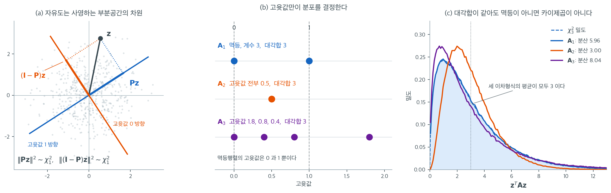

# 카이제곱분포와 이차형식

고전 통계의 여러 검정통계량 — 적합도 통계량, 분산비, 잔차제곱합 — 은 정규확률벡터의 이차형식이다. 그런 이차형식이 언제 카이제곱분포를 따르는지 이해하는 것이 이 검정통계량들의 정확한 분포를 유도하는 데 필수적이다. 핵심 결과는 (앞 절들에서 다룬) **멱등행렬** 구조를 카이제곱분포와 연결한다. $\mathbf{A}$가 계수 $r$인 대칭 멱등행렬이고 $\mathbf{z}$가 표준정규벡터이면 $\mathbf{z}^\top\mathbf{A}\mathbf{z} \sim \chi^2_r$이다.

---

## 1. 카이제곱분포 복습

<div class="defn" markdown>

### 정의 1. 카이제곱분포 { .dfn }

$Z_1, Z_2, \dots, Z_d$가 독립인 표준정규 확률변수($Z_i \sim N(0,1)$)이면

$$
Q = \sum_{i=1}^d Z_i^2 \sim \chi^2_d
$$

이다. 이 분포는 **자유도**가 $d$다. 벡터 표기로는 $\mathbf{z} \sim N(\mathbf{0}, \mathbf{I}_d)$이면 $\mathbf{z}^\top\mathbf{z} \sim \chi^2_d$이다.

</div>

핵심 성질([4.2절 카이제곱분포](../../../ch04/continuous_distributions/chi_square.md)에서 증명한다):

- $E[Q] = d$이고 $\operatorname{Var}(Q) = 2d$
- $Q_1 \sim \chi^2_{d_1}$과 $Q_2 \sim \chi^2_{d_2}$가 독립이면 $Q_1 + Q_2 \sim \chi^2_{d_1 + d_2}$
- 카이제곱분포는 감마분포의 특수한 경우다. $\chi^2_d$는 형상 $d/2$, 척도 $2$인 감마분포다.

자유도를 나타내는 기호로는 이 책의 관례대로 $d$를 쓴다. 다만 이 쪽에서는 자유도가 거의 언제나 어떤 사영행렬의 **계수**로 나타나므로, 그 문맥에서는 $r$(rank)이나 $n - p$처럼 계수를 직접 가리키는 기호를 쓴다.

---

## 2. 정규벡터의 이차형식

확률벡터 $\mathbf{z} \in \mathbb{R}^n$의 **이차형식**은 대칭행렬 $\mathbf{A} \in \mathbb{R}^{n \times n}$에 대한 $\mathbf{z}^\top\mathbf{A}\mathbf{z}$ 꼴의 식이다. $\mathbf{z}^\top\mathbf{A}\mathbf{z} = \mathbf{z}^\top\bigl(\frac{\mathbf{A} + \mathbf{A}^\top}{2}\bigr)\mathbf{z}$이므로 일반성을 잃지 않고 $\mathbf{A}$를 대칭으로 가정할 수 있다.

$\mathbf{z} \sim N(\mathbf{0}, \mathbf{I}_n)$일 때 $\mathbf{z}^\top\mathbf{A}\mathbf{z}$의 분포는 $\mathbf{A}$의 고윳값에 달려 있다.

### 대각화 접근

스펙트럼 정리에 의해 $\mathbf{A} = \mathbf{Q}\boldsymbol{\Lambda}\mathbf{Q}^\top$이며 $\mathbf{Q}$는 직교행렬, $\boldsymbol{\Lambda} = \operatorname{diag}(\lambda_1, \dots, \lambda_n)$이다. $\mathbf{w} = \mathbf{Q}^\top\mathbf{z}$로 두면

$$
\mathbf{z}^\top\mathbf{A}\mathbf{z} = \mathbf{w}^\top\boldsymbol{\Lambda}\mathbf{w} = \sum_{i=1}^n \lambda_i W_i^2
$$

이다. $\mathbf{Q}$가 직교행렬이고 $\mathbf{z} \sim N(\mathbf{0}, \mathbf{I}_n)$이므로, 회전된 벡터 $\mathbf{w} = \mathbf{Q}^\top\mathbf{z}$도 $N(\mathbf{0}, \mathbf{I}_n)$을 따른다(표준정규분포는 직교변환에 불변이다). 따라서 $W_1, \dots, W_n$은 독립인 $N(0,1)$ 확률변수이고, 이 이차형식은 독립인 $\chi^2_1$ 변수들의 가중합이다.

---

## 3. 기본 카이제곱 정리

<div class="thmbox" markdown>

### 정리 1. 멱등행렬을 갖는 이차형식 { .thm }

$\mathbf{z} \sim N(\mathbf{0}, \mathbf{I}_n)$이고 $\mathbf{A} \in \mathbb{R}^{n \times n}$이 계수 $r$인 대칭 멱등행렬이라 하자. 그러면

$$
\mathbf{z}^\top\mathbf{A}\mathbf{z} \sim \chi^2_r
$$

</div>

??? proof "증명"

    $\mathbf{A}$가 대칭이고 멱등이므로 (멱등행렬 이론에 따라) 고윳값이 모두 0 또는 1이다. $\operatorname{rank}(\mathbf{A}) = r$이므로 정확히 $r$개의 고윳값이 1이고 $n - r$개가 0이다.

    대각화 $\mathbf{A} = \mathbf{Q}\boldsymbol{\Lambda}\mathbf{Q}^\top$와 $\mathbf{w} = \mathbf{Q}^\top\mathbf{z} \sim N(\mathbf{0}, \mathbf{I}_n)$을 쓰면

    $$
    \mathbf{z}^\top\mathbf{A}\mathbf{z} = \sum_{i=1}^n \lambda_i W_i^2 = \sum_{i:\,\lambda_i = 1} W_i^2
    $$

    이다. 이는 독립인 $\chi^2_1$ 변수 $r$개의 합이므로 $\mathbf{z}^\top\mathbf{A}\mathbf{z} \sim \chi^2_r$이다. $\square$

---

## 4. 그림으로 보는 이차형식과 자유도



왼쪽 그림은 정리 1을 $n = 2$에서 그린 것이다. 직선 $L$은 1차원 부분공간이고 $\mathbf{P}$는 그 위로의 사영이다. $\mathbf{P}$의 고윳값은 $L$ 방향에서 1, 그에 수직인 방향에서 0이며, 표준정규벡터 $\mathbf{z}$는 이 두 방향의 성분으로 쪼개져 각각의 제곱이 $\chi^2_1$이 된다. 여기서 눈여겨볼 것은 **$L$을 어느 각도로 돌려놓아도 그림이 말하는 바가 전혀 바뀌지 않는다**는 점이다. 표준정규분포는 직교변환에 불변이므로 부분공간의 방향은 분포에 아무 흔적을 남기지 못하고, 오직 차원만 남는다. 그 남은 것이 자유도다. 그래서 자유도는 계수이자 대각합이자 사영하는 부분공간의 차원이라는 세 이름을 동시에 갖는다.

가운데 그림은 **대각합이 모두 3인** 세 대칭행렬($6 \times 6$)의 고윳값을 나란히 찍은 것이다. $\mathbf{A}_1$은 계수 3인 사영행렬이라 고윳값이 $1, 1, 1, 0, 0, 0$이고, $\mathbf{A}_2 = \tfrac{1}{2}\mathbf{I}_6$은 고윳값이 모두 $0.5$이며, $\mathbf{A}_3$은 고윳값이 $1.8$, $0.8$, $0.4$와 0 세 개로 이루어져 있다. 대각합이 같다는 것은 (연습문제 2의 $\mathbb{E}[\mathbf{z}^\top\mathbf{A}\mathbf{z}] = \operatorname{tr}(\mathbf{A})$에 의해) 세 이차형식의 평균이 같다는 뜻이다. 그러나 평균이 같다고 분포가 같지는 않다.

오른쪽 그림이 그 차이를 보인다. $\mathbf{z} \sim N(\mathbf{0}, \mathbf{I}_6)$을 $400{,}000$번 뽑아 세 이차형식의 밀도를 추정했다. 평균은 셋 다 $3$에 맞는다($2.9963$, $2.9984$, $2.9964$). 그런데 분산은 $5.9628$, $2.9987$, $8.0361$로 갈라지며, 이는 $2\operatorname{tr}(\mathbf{A}^2)$의 이론값 $6$, $3$, $8.08$과 각각 일치한다. $\chi^2_3$ 곡선(점선) 위에 정확히 얹히는 것은 $\mathbf{A}_1$뿐이다. $\mathbf{A}_2$의 이차형식은 $\tfrac{1}{2}\chi^2_6$이라 더 좁고, $\mathbf{A}_3$은 무거운 고윳값 하나가 끌고 가서 더 넓다.

이 그림은 아래 정리 2가 왜 **필요충분**조건인지를 미리 보여 준다. $\chi^2_d$는 평균이 $d$이고 분산이 $2d$이므로 분산이 평균의 정확히 두 배다. 고윳값이 0과 1만으로 이루어져 있으면 $\operatorname{tr}(\mathbf{A}^2) = \operatorname{tr}(\mathbf{A})$이라 이 관계가 저절로 성립하지만, 고윳값이 그 밖으로 나가는 순간 $\operatorname{tr}(\mathbf{A}^2) \neq \operatorname{tr}(\mathbf{A})$이 되어 관계가 깨진다. 위 세 쌍 $(3, 6)$, $(3, 3)$, $(3, 8.08)$에서 카이제곱이 될 수 있는 것은 첫 번째뿐이다. 멱등성은 편리한 충분조건이 아니라 빠져나갈 구멍이 없는 조건이다.

---

## 5. 일반적인 필요충분조건

멱등 조건은 충분할 뿐 아니라, (척도를 제외하면) 카이제곱분포를 얻기 위해 필요하기도 하다.

<div class="thmbox" markdown>

### 정리 2. 이차형식이 카이제곱이 되기 위한 필요충분조건 { .thm }

$\mathbf{z} \sim N(\mathbf{0}, \sigma^2\mathbf{I}_n)$이고 $\mathbf{A}$가 대칭인 $n \times n$ 행렬이라 하자. $\mathbf{z}^\top\mathbf{A}\mathbf{z}/\sigma^2 \sim \chi^2_r$일 필요충분조건은 $\mathbf{A}$가 $\operatorname{rank}(\mathbf{A}) = r$인 멱등행렬인 것이다.

</div>

??? proof "증명"

    $\mathbf{u} = \mathbf{z}/\sigma \sim N(\mathbf{0}, \mathbf{I}_n)$으로 두면 $\mathbf{z}^\top\mathbf{A}\mathbf{z}/\sigma^2 = \mathbf{u}^\top\mathbf{A}\mathbf{u}$이므로 $\sigma^2 = 1$인 경우만 보면 된다.

    **충분성**은 정리 1이 이미 준다.

    **필요성.** 연습문제 6에서 보듯 $\mathbf{u}^\top\mathbf{A}\mathbf{u}$의 적률생성함수는 0의 어떤 근방에서

    $$
    M(t) = \prod_{i=1}^n(1 - 2\lambda_i t)^{-1/2}
    $$

    이고, $\chi^2_r$의 것은 $(1 - 2t)^{-r/2}$이다. 두 함수가 0의 근방에서 같으면 제곱해서 역수를 취한 두 다항식

    $$
    \prod_{i=1}^n(1 - 2\lambda_i t) = (1 - 2t)^{r}
    $$

    이 0의 근방에서 일치하고, 다항식은 무한히 많은 점에서 일치하면 계수까지 같으므로 근의 중복도까지 같다. 오른쪽의 근은 $t = 1/2$ 하나뿐이고 중복도가 $r$이므로, $\lambda_i$ 가운데 정확히 $r$개가 $1$이고 나머지 $n - r$개가 $0$이다. 대칭행렬의 고윳값이 $0$ 아니면 $1$이면 $\mathbf{A} = \mathbf{Q}\boldsymbol{\Lambda}\mathbf{Q}^\top$에서 $\boldsymbol{\Lambda}^2 = \boldsymbol{\Lambda}$이므로 $\mathbf{A}^2 = \mathbf{A}$이고, 계수는 0이 아닌 고윳값의 개수인 $r$이다. $\square$

    **대칭성을 빼면 거짓이다.** 정리 1과 정리 2 모두 $\mathbf{A}$의 대칭성을 전제로 한다. 대칭이 아닌 멱등행렬 $\mathbf{A} = \begin{pmatrix} 1 & -1 \\ 0 & 0 \end{pmatrix}$을 보자. $\mathbf{z} \sim N(\mathbf{0}, \mathbf{I}_2)$에 대해

    $$
    \mathbf{z}^\top\mathbf{A}\mathbf{z} = Z_1^2 - Z_1Z_2
    $$

    인데, 이 값은 음수가 될 수 있으므로($Z_1 = 1$, $Z_2 = 2$이면 $-1$) 절대로 카이제곱분포를 따를 수 없다. 대칭인 부분만 남긴 $\tfrac{1}{2}(\mathbf{A} + \mathbf{A}^\top)$은 고윳값이 $\tfrac{1 \pm \sqrt2}{2}$로 $\{0,1\}$ 밖에 있어 멱등이 아니다. **멱등성만으로는 부족하고 대칭성이 함께 있어야 한다.**

---

## 6. 이차형식의 독립성

<div class="thmbox" markdown>

### 정리 3. 크레이그 정리 { .thm }

$\mathbf{z} \sim N(\mathbf{0}, \sigma^2\mathbf{I}_n)$이고 $\mathbf{A}$와 $\mathbf{B}$가 대칭인 $n \times n$ 행렬이라 하자. 이차형식 $\mathbf{z}^\top\mathbf{A}\mathbf{z}$와 $\mathbf{z}^\top\mathbf{B}\mathbf{z}$가 **독립**일 필요충분조건은

$$
\mathbf{A}\mathbf{B} = \mathbf{O}
$$

인 것이다.

</div>

??? proof "증명"

    **충분성.** $\mathbf{A}$와 $\mathbf{B}$가 대칭이고 $\mathbf{A}\mathbf{B} = \mathbf{O}$이면 $\mathbf{B}\mathbf{A} = (\mathbf{A}\mathbf{B})^\top = \mathbf{O}$이므로 두 행렬은 교환한다. 교환하는 대칭행렬은 **동시에 대각화**되므로 하나의 직교행렬 $\mathbf{Q}$로 $\mathbf{A} = \mathbf{Q}\boldsymbol{\Lambda}_A\mathbf{Q}^\top$, $\mathbf{B} = \mathbf{Q}\boldsymbol{\Lambda}_B\mathbf{Q}^\top$로 쓸 수 있고, $\mathbf{A}\mathbf{B} = \mathbf{O}$은 $\boldsymbol{\Lambda}_A\boldsymbol{\Lambda}_B = \mathbf{O}$, 곧 각 $i$에 대해 $\lambda_i^A$와 $\lambda_i^B$ 중 적어도 하나가 0이라는 뜻이다. $\mathbf{w} = \mathbf{Q}^\top\mathbf{z}$로 두면

    $$
    \mathbf{z}^\top\mathbf{A}\mathbf{z} = \sum_i \lambda_i^A W_i^2, \qquad \mathbf{z}^\top\mathbf{B}\mathbf{z} = \sum_i \lambda_i^B W_i^2
    $$

    이 되어 두 합은 독립인 $W_i^2$ 항들의 **서로 겹치지 않는** 부분집합만 쓴다. 따라서 독립이다.

    **필요성**은 결합 적률생성함수가 주변 적률생성함수의 곱으로 인수분해될 조건을 따져 얻는데, 이 방향은 생각보다 까다로워 크레이그–사카모토 정리라는 이름으로 따로 다루어진다(초기에 발표된 증명 몇 개가 실제로 틀렸다). 이 책에서 쓰는 것은 충분성 방향뿐이므로 필요성은 인용에 그친다. $\square$

    조건에서 $\mathbf{A}$와 $\mathbf{B}$가 **둘 다 대칭**이라는 가정이 빠지면 위 논법이 무너진다. 대칭이 아니면 $\mathbf{A}\mathbf{B} = \mathbf{O}$에서 $\mathbf{B}\mathbf{A} = \mathbf{O}$이 따라 나오지 않으므로 동시대각화를 쓸 수 없다.

---

## 7. 코크런 정리

코크런 정리는 카이제곱 결과와 독립성 결과를 제곱합 분해에 관한 하나의 강력한 진술로 결합한다.

<div class="thmbox" markdown>

### 정리 4. 코크런 정리 { .thm }

$\mathbf{z} \sim N(\mathbf{0}, \sigma^2\mathbf{I}_n)$이고 $\mathbf{A}_1, \dots, \mathbf{A}_k$가 $\operatorname{rank}(\mathbf{A}_i) = r_i$인 대칭행렬이라 하자. **모든** $\mathbf{z} \in \mathbb{R}^n$에 대해

$$
\mathbf{z}^\top\mathbf{z} = \mathbf{z}^\top\mathbf{A}_1\mathbf{z} + \mathbf{z}^\top\mathbf{A}_2\mathbf{z} + \cdots + \mathbf{z}^\top\mathbf{A}_k\mathbf{z}
\qquad\text{즉}\qquad \mathbf{A}_1 + \cdots + \mathbf{A}_k = \mathbf{I}_n
$$

이고 $r_1 + r_2 + \cdots + r_k = n$이면, 각 $\mathbf{A}_i$는 멱등이고 $i \neq j$에 대해 $\mathbf{A}_i\mathbf{A}_j = \mathbf{O}$이다. 따라서 이차형식 $\mathbf{z}^\top\mathbf{A}_1\mathbf{z}/\sigma^2, \dots, \mathbf{z}^\top\mathbf{A}_k\mathbf{z}/\sigma^2$은 서로 독립이고 $\mathbf{z}^\top\mathbf{A}_i\mathbf{z}/\sigma^2 \sim \chi^2_{r_i}$이다.

</div>

??? proof "증명"

    **두 가정이 각각 어디에 쓰이는지**가 이 증명의 뼈대다. $\sum_i \mathbf{A}_i = \mathbf{I}_n$은 계수의 합이 적어도 $n$이 되도록 강제하고, $\sum_i r_i = n$은 그 합이 넘치지 않도록 못 박는다. 둘이 맞물릴 때만 멱등성이 나온다.

    **1단계: 멱등성과 곱의 소멸.** $\mathcal{V}_i = \operatorname{col}(\mathbf{A}_i)$라 두자($\dim\mathcal{V}_i = r_i$). $\sum_i \mathbf{A}_i = \mathbf{I}$이므로 임의의 $\mathbf{x}$가 $\mathbf{x} = \sum_i \mathbf{A}_i\mathbf{x}$로 쓰이고, 따라서

    $$
    \mathbb{R}^n = \mathcal{V}_1 + \mathcal{V}_2 + \cdots + \mathcal{V}_k
    $$

    이다. 그런데 차원의 합이 $\sum_i r_i = n$으로 딱 맞으므로 이 합은 차원을 낭비할 여유가 없다. 곧 **직합**이다.

    $$
    \mathbb{R}^n = \mathcal{V}_1 \oplus \cdots \oplus \mathcal{V}_k
    $$

    $\mathbf{v} \in \mathcal{V}_j$를 잡으면 $\mathbf{v} = \sum_i \mathbf{A}_i\mathbf{v}$인데, 왼쪽은 $\mathcal{V}_j$의 원소이고 $\mathbf{A}_i\mathbf{v} \in \mathcal{V}_i$이므로 직합 분해의 유일성에서 $\mathbf{A}_j\mathbf{v} = \mathbf{v}$이고 $i \neq j$이면 $\mathbf{A}_i\mathbf{v} = \mathbf{0}$이다. $\mathbf{v}$가 $\mathcal{V}_j = \operatorname{col}(\mathbf{A}_j)$에서 임의였으므로

    $$
    \mathbf{A}_j^2 = \mathbf{A}_j, \qquad \mathbf{A}_i\mathbf{A}_j = \mathbf{O} \quad (i \neq j)
    $$

    을 얻는다.

    **2단계: 분포.** 각 $\mathbf{A}_i$가 대칭 멱등이고 계수가 $r_i$이므로 정리 1에 의해 $\mathbf{z}^\top\mathbf{A}_i\mathbf{z}/\sigma^2 \sim \chi^2_{r_i}$이다.

    **3단계: 상호 독립.** $i \neq j$에 대해 $\mathbf{A}_i\mathbf{A}_j = \mathbf{O} = \mathbf{A}_j\mathbf{A}_i$이므로 $\mathbf{A}_1, \dots, \mathbf{A}_k$는 서로 교환하는 대칭행렬이고, 따라서 **하나의** 직교행렬 $\mathbf{Q}$로 동시에 대각화된다. $\mathbf{w} = \mathbf{Q}^\top\mathbf{z}/\sigma \sim N(\mathbf{0}, \mathbf{I}_n)$으로 두면 각 이차형식은

    $$
    \frac{\mathbf{z}^\top\mathbf{A}_i\mathbf{z}}{\sigma^2} = \sum_{j \in S_i} W_j^2
    $$

    꼴이 된다. 여기서 $S_i$는 $\mathbf{A}_i$의 고윳값이 1인 좌표들의 집합이고 $|S_i| = r_i$다. $\mathbf{A}_i\mathbf{A}_j = \mathbf{O}$은 $S_i \cap S_j = \varnothing$을 뜻하며 $\sum_i r_i = n$이므로 $S_1, \dots, S_k$는 $\{1, \dots, n\}$의 분할이다. 곧 $k$개의 이차형식이 독립인 $W_1^2, \dots, W_n^2$을 **겹치지도 남기지도 않고** 갈라 쓴다. 서로 다른 좌표의 함수들이므로 $k$개 전부가 상호 독립이다. $\square$

    **자유도의 덧셈이 여기서 나온다.** 결론의 $\sum_i r_i = n$은 "총제곱합의 자유도 $n$이 조각들의 자유도로 정확히 나뉜다"는 말이고, 분산분석표의 자유도 열이 세로로 더해져 총자유도가 되는 것이 바로 이 항등식이다.

코크런 정리는 분산분석 F-검정을 떠받치는 이론적 원동력이다. 회귀제곱합과 잔차제곱합이 ($\sigma^2$으로 나눈 뒤) 독립인 카이제곱 확률변수임을 보장하며, 이것이 F-통계량을 구성하는 데 필요하다.

---

## 8. 예 — 잔차제곱합

$\boldsymbol{\varepsilon} \sim N(\mathbf{0}, \sigma^2\mathbf{I}_n)$인 선형모형 $\mathbf{y} = \mathbf{X}\boldsymbol{\beta} + \boldsymbol{\varepsilon}$에서,

잔차벡터는 $\mathbf{H} = \mathbf{X}(\mathbf{X}^\top\mathbf{X})^{-1}\mathbf{X}^\top$에 대해 $\mathbf{e} = (\mathbf{I} - \mathbf{H})\mathbf{y}$이다. 잔차제곱합은

$$
\text{SSE} = \mathbf{e}^\top\mathbf{e} = \mathbf{y}^\top(\mathbf{I} - \mathbf{H})\mathbf{y}
$$

이다. $(\mathbf{I} - \mathbf{H})\mathbf{X}\boldsymbol{\beta} = \mathbf{0}$이므로 $\text{SSE} = \boldsymbol{\varepsilon}^\top(\mathbf{I} - \mathbf{H})\boldsymbol{\varepsilon}$으로 쓸 수 있다. 행렬 $\mathbf{M} = \mathbf{I} - \mathbf{H}$는 대칭 멱등이고 $\operatorname{rank}(\mathbf{M}) = n - p$이다. $\mathbf{z} = \boldsymbol{\varepsilon}/\sigma$로 두면

$$
\frac{\text{SSE}}{\sigma^2} = \mathbf{z}^\top\mathbf{M}\mathbf{z} \sim \chi^2_{n-p}
$$

이다. 이것이 $\sigma^2$의 불편추정값을 얻기 위해 SSE를 $n - p$로 나누는 이유를 설명한다.

$$
s^2 = \frac{\text{SSE}}{n - p}, \qquad E[s^2] = \sigma^2
$$

여기서 자유도가 $n - p$인 까닭을 한 줄로 요약하면 이렇다. **잔차는 $(\mathbf{I} - \mathbf{H})\mathbf{y}$이고 그 계수가 $n - p$이므로 $E[\text{SSE}] = (n-p)\sigma^2$이다**(연습문제 2). 나누는 수는 잔차의 개수 $n$이 아니라 잔차가 놓인 부분공간의 차원 $n-p$다.

### 5.1절과 같은 구조다

이 논리는 새로운 것이 아니다. [5.1절](../../../ch05/foundations/statistics_as_rv.md)에서 $E[S^2] = \sigma^2$을 보일 때 쓴 것과 **같은 계산**이며, 절편만 있는 모형($\mathbf{X} = \mathbf{1}$, $p = 1$)이 바로 그 경우다. 이때 $\mathbf{H} = \tfrac{1}{n}\mathbf{J}$이고 $\mathbf{I} - \mathbf{H}$는 중심화행렬 $\mathbf{C}$이므로

$$
\text{SSE} = \mathbf{y}^\top\mathbf{C}\mathbf{y} = \sum_i (Y_i - \bar{Y})^2, \qquad n - p = n - 1
$$

이고 $s^2 = \text{SSE}/(n-1) = S^2$이다. 5.1절이 기댓값을 직접 계산해 얻은 $n-1$과 이 쪽이 대각합으로 얻은 $n-p$는 같은 사실의 두 판본이며, 회귀는 $\mathbf{1}$ 하나 대신 $\mathbf{X}$의 열 $p$개를 쓰느라 $1$ 대신 $p$를 잃는 것일 뿐이다. 자유도 $n-1$이 $\chi^2$의 자유도로 나타나는 것도 [4.2절 정규분포](../../../ch04/continuous_distributions/normal.md)의 연습문제 28에서 직교변환으로 이미 확인했다. 그쪽의 직교행렬 $\mathbf{Q}$가 여기서는 $\mathbf{C}$의 스펙트럼 분해에 해당한다.

---

## 9. 비중심 카이제곱분포

$\boldsymbol{\mu} \neq \mathbf{0}$인 $\mathbf{z} \sim N(\boldsymbol{\mu}, \mathbf{I}_n)$이고 $\mathbf{A}$가 계수 $r$인 대칭 멱등행렬이면, 이차형식 $\mathbf{z}^\top\mathbf{A}\mathbf{z}$는 **비중심 카이제곱분포**를 따른다.

$$
\mathbf{z}^\top\mathbf{A}\mathbf{z} \sim \chi^2_r(\delta)
$$

여기서 비중심 모수는 $\delta = \boldsymbol{\mu}^\top\mathbf{A}\boldsymbol{\mu}$이다. 분산이 $\sigma^2$인 판으로 옮기면, $\mathbf{y} \sim N(\boldsymbol{\mu}, \sigma^2\mathbf{I}_n)$에 대해 $\mathbf{z} = \mathbf{y}/\sigma \sim N(\boldsymbol{\mu}/\sigma, \mathbf{I}_n)$이므로

$$
\frac{\mathbf{y}^\top\mathbf{A}\mathbf{y}}{\sigma^2} \sim \chi^2_r(\delta), \qquad \delta = \frac{\boldsymbol{\mu}^\top\mathbf{A}\boldsymbol{\mu}}{\sigma^2}
$$

이다. $\boldsymbol{\mu} = \mathbf{0}$이면 $\delta = 0$이 되어 중심 카이제곱으로 돌아간다. 비중심 카이제곱분포는 F-검정의 검정력 계산과 대립가설 아래에서 회귀제곱합의 분포에 등장한다(연습문제 8).

---

## 연습문제

<div class="drillbox" markdown>

**연습문제 1.** <span class="diff med" title="중간"></span>
흔한 분산분석 분해는 $\mathbf{y}^\top\mathbf{y}$를 두 개의 이차형식으로 쪼갠다. $\mathbf{A}_1 = \mathbf{H}$, $\mathbf{A}_2 = \mathbf{I} - \mathbf{H}$로 두자. 코크런 정리가 적용됨을 확인하고, 각 조각의 카이제곱분포와 독립성을 결론지어라.

</div>

??? success "풀이"
    분해는 $\mathbf{y}^\top\mathbf{y} = \mathbf{y}^\top\mathbf{H}\mathbf{y} + \mathbf{y}^\top(\mathbf{I} - \mathbf{H})\mathbf{y}$이다.

    코크런 정리의 가정 확인:

    - 각 $\mathbf{A}_i$가 대칭이다. ✓
    - 모든 $\mathbf{y}$에 대해 분해가 성립한다. 곧 $\mathbf{A}_1 + \mathbf{A}_2 = \mathbf{H} + (\mathbf{I} - \mathbf{H}) = \mathbf{I}$. ✓
    - $\operatorname{rank}(\mathbf{A}_1) + \operatorname{rank}(\mathbf{A}_2) = p + (n - p) = n$. ✓

    결론($\mathbf{y} \sim N(\mathbf{0}, \sigma^2\mathbf{I})$ 아래에서): $\mathbf{y}^\top\mathbf{H}\mathbf{y}/\sigma^2 \sim \chi^2_p$이고 $\mathbf{y}^\top(\mathbf{I} - \mathbf{H})\mathbf{y}/\sigma^2 \sim \chi^2_{n-p}$이며 둘은 독립이다.

    **가정을 하나만 빼 보면 왜 둘 다 필요한지 보인다.** $\mathbf{A}_1 = \tfrac{1}{2}\mathbf{I}$, $\mathbf{A}_2 = \tfrac{1}{2}\mathbf{I}$로 두면 $\mathbf{A}_1 + \mathbf{A}_2 = \mathbf{I}$는 성립하지만 $r_1 + r_2 = 2n \neq n$이다. 실제로 $\mathbf{y}^\top\mathbf{A}_1\mathbf{y}/\sigma^2 = \tfrac{1}{2}\chi^2_n$은 카이제곱이 아니고 두 조각은 완전히 종속이다. 거꾸로 $\mathbf{A}_1 = \mathbf{H}$, $\mathbf{A}_2 = \mathbf{H}' \ne \mathbf{I} - \mathbf{H}$처럼 계수의 합만 $n$으로 맞추어도 $\sum_i \mathbf{A}_i = \mathbf{I}$가 깨지면 독립성이 사라진다. $\square$

---

<div class="drillbox" markdown>

**연습문제 2.** <span class="diff med" title="중간"></span>
$\mathbf{z} \sim N(\boldsymbol{\mu}, \boldsymbol{\Sigma})$이고 $\mathbf{A}$가 대칭일 때 이차형식 $\mathbf{z}^\top\mathbf{A}\mathbf{z}$의 **기댓값**을 계산하라. 그런 다음 $\boldsymbol{\Sigma} = \sigma^2\mathbf{I}$인 경우로 특수화하여 $\mathbb{E}[\mathbf{z}^\top\mathbf{A}\mathbf{z}] = \sigma^2 \operatorname{tr}(\mathbf{A}) + \boldsymbol{\mu}^\top\mathbf{A}\boldsymbol{\mu}$임을 보여라.

</div>

??? success "풀이"
    $\mathbf{w} \sim N(\mathbf{0}, \boldsymbol{\Sigma})$에 대해 $\mathbf{z} = \boldsymbol{\mu} + \mathbf{w}$로 쓴다. 전개하면($\mathbf{A}$의 대칭성을 쓴다)

    $$
    \mathbf{z}^\top\mathbf{A}\mathbf{z} = \boldsymbol{\mu}^\top\mathbf{A}\boldsymbol{\mu} + 2\boldsymbol{\mu}^\top\mathbf{A}\mathbf{w} + \mathbf{w}^\top\mathbf{A}\mathbf{w}
    $$

    이다. 가운데 항은 평균이 0이다. 마지막 항에 대해서는

    $$
    \mathbb{E}[\mathbf{w}^\top\mathbf{A}\mathbf{w}] = \mathbb{E}[\operatorname{tr}(\mathbf{A}\mathbf{w}\mathbf{w}^\top)] = \operatorname{tr}(\mathbf{A}\,\mathbb{E}[\mathbf{w}\mathbf{w}^\top]) = \operatorname{tr}(\mathbf{A}\boldsymbol{\Sigma})
    $$

    이다. 따라서 $\mathbb{E}[\mathbf{z}^\top\mathbf{A}\mathbf{z}] = \operatorname{tr}(\mathbf{A}\boldsymbol{\Sigma}) + \boldsymbol{\mu}^\top\mathbf{A}\boldsymbol{\mu}$이고, $\boldsymbol{\Sigma} = \sigma^2\mathbf{I}$이면 이것이 $\sigma^2 \operatorname{tr}(\mathbf{A}) + \boldsymbol{\mu}^\top\mathbf{A}\boldsymbol{\mu}$가 된다. $\square$

    통계적 쓰임: $\boldsymbol{\varepsilon} \sim N(\mathbf{0}, \sigma^2\mathbf{I})$인 $\mathbf{y} = \mathbf{X}\boldsymbol{\beta} + \boldsymbol{\varepsilon}$ 아래에서 $\mathbf{M}\mathbf{X}\boldsymbol{\beta} = \mathbf{0}$이므로 $\mathbb{E}[\mathrm{SSE}] = \sigma^2 \operatorname{tr}(\mathbf{M}) = \sigma^2(n - p)$이다. $n - p$로 나누면 불편인 $\hat{\sigma}^2$을 얻는다.

---

<div class="drillbox" markdown>

**연습문제 3.** <span class="diff med" title="중간"></span>
크레이그 정리($\mathbf{A}\mathbf{B} = \mathbf{O}$이면 두 이차형식이 독립)를 모의실험으로 확인하라. $\mathbf{A}\mathbf{B} \neq \mathbf{O}$인 경우와 대비하라.

</div>

??? success "풀이"
    ```python
    import numpy as np

    rng = np.random.default_rng(0)
    n, B = 6, 300_000
    Z = rng.normal(size=(B, n))                 # z ~ N(0, I)

    A = np.diag([1., 1., 0., 0., 0., 0.])       # 좌표 1,2 를 본다
    Bm = np.diag([0., 0., 1., 1., 1., 0.])      # 좌표 3,4,5 를 본다 (겹치지 않음)
    C = np.diag([1., 1., 1., 0., 0., 0.])       # 좌표 1,2,3 (A 와 겹친다)

    q = lambda M: np.einsum('bi,ij,bj->b', Z, M, Z)
    qa, qb, qc = q(A), q(Bm), q(C)

    print("A B = O 인가:", np.allclose(A @ Bm, 0),
          "  corr(q_A, q_B) =", round(np.corrcoef(qa, qb)[0, 1], 5))
    print("A C = O 인가:", np.allclose(A @ C, 0),
          "  corr(q_A, q_C) =", round(np.corrcoef(qa, qc)[0, 1], 5))
    ```

    출력:

    ```
    A B = O 인가: True   corr(q_A, q_B) = 0.00164
    A C = O 인가: False   corr(q_A, q_C) = 0.81566
    ```

    $\mathbf{A}\mathbf{B} = \mathbf{O}$일 때 상관이 $0.002$로 사실상 0이고, 겹치는 $\mathbf{C}$에서는 $0.816$으로 강하게 상관된다.

    **왜 그런가.** 대각행렬 예에서는 직관이 명확하다. $\mathbf{A}\mathbf{B} = \mathbf{O}$은 두 이차형식이 **서로 다른 좌표만** 쓴다는 뜻이고, 정규분포에서 서로 다른 좌표는 독립이다. 일반적인 경우에도 두 행렬을 동시에 대각화하면 같은 구조가 드러난다.

    이것이 분산분석에서 제곱합들이 독립인 근거다. 서로 직교하는 부분공간으로의 사영은 곱이 $\mathbf{O}$이므로 독립이고, 그래서 카이제곱의 비가 $F$ 분포가 된다. $\square$

---

<div class="drillbox" markdown>

**연습문제 4.** <span class="diff med" title="중간"></span>
회귀에서 $F = \dfrac{\text{SSR}/p'}{\text{SSE}/(n-p)}$가 두 이차형식의 비임을 이용해, $H_0$ 아래에서 실제로 $F_{p', n-p}$ 분포를 따름을 모의실험으로 확인하라.

</div>

??? success "풀이"
    ```python
    import numpy as np
    from scipy import stats

    rng = np.random.default_rng(1)
    n, p = 20, 3                       # 절편 + 설명변수 2개
    X = np.column_stack([np.ones(n), rng.normal(size=(n, p - 1))])
    H = X @ np.linalg.inv(X.T @ X) @ X.T
    P1 = np.ones((n, n)) / n           # 절편만 있는 모형의 사영
    A = H - P1                         # 회귀 부분, 계수 p-1 = 2
    M = np.eye(n) - H                  # 잔차 부분, 계수 n-p = 17

    print("A M = O 인가:", np.allclose(A @ M, 0), "  (독립성 조건)")
    print("계수:", np.linalg.matrix_rank(A), np.linalg.matrix_rank(M))

    B = 200_000
    Y = rng.normal(size=(B, n))        # H0: beta = 0 (절편만), sigma = 1
    ssr = np.einsum('bi,ij,bj->b', Y, A, Y)
    sse = np.einsum('bi,ij,bj->b', Y, M, Y)
    F = (ssr / 2) / (sse / 17)

    print(f"\n평균 모의 {F.mean():.4f}   이론 {17/(17-2):.4f}")
    for q in (0.5, 0.9, 0.95, 0.99):
        print(f"  q={q:<5} 모의 {np.quantile(F, q):7.4f}   F(2,17) {stats.f.ppf(q, 2, 17):7.4f}")
    ```

    출력:

    ```
    A M = O 인가: True   (독립성 조건)
    계수: 2 17

    평균 모의 1.1353   이론 1.1333
      q=0.5   모의  0.7235   F(2,17)  0.7222
      q=0.9   모의  2.6458   F(2,17)  2.6446
      q=0.95  모의  3.6142   F(2,17)  3.5915
      q=0.99  모의  6.1267   F(2,17)  6.1121
    ```

    분위수가 $F_{2,17}$과 잘 맞는다.

    **이 한 문제에 이 절의 내용이 모두 들어 있다.** $\mathbf{A}$와 $\mathbf{M}$이 대칭 멱등이라 각 이차형식이 카이제곱이 되고(계수 $2$와 $17$), $\mathbf{A}\mathbf{M} = \mathbf{O}$이라 크레이그 정리에 의해 둘이 독립이며, 독립인 두 카이제곱을 자유도로 나눈 비가 $F$ 분포의 정의다.

    $F$ 검정이 성립하려면 세 가지가 모두 필요하다는 점에 유의하라. 정규성(카이제곱이 되려면), 멱등성(자유도가 정수가 되려면), 직교성(독립이 되려면). 하나라도 깨지면 $F$ 분포는 근사에 지나지 않는다. $\square$

---

<div class="drillbox" markdown>

**연습문제 5.** <span class="diff hard" title="어려움"></span>
$\mathbf{Z} \sim N(\mathbf{0}, \mathbf{I}_n)$이고 $\mathbf{P}$가 $\operatorname{rank}(\mathbf{P}) = r$인 대칭 멱등행렬이라 하자. $\mathbf{Z}^\top \mathbf{P} \mathbf{Z}$의 분포를 진술하고 이를 적용하라. 관측값이 $n = 20$인 단순선형회귀에서 $\mathbf{e} = (\mathbf{I} - \mathbf{H})\mathbf{y}$일 때 $\mathbf{e}^\top \mathbf{e}/\sigma^2$의 분포를 구하라.

</div>

??? success "풀이"
    기본 카이제곱 정리에 의해 $\mathbf{Z}^\top \mathbf{P} \mathbf{Z} \sim \chi^2_r$이다.

    단순선형회귀에서 $\mathbf{M} = \mathbf{I} - \mathbf{H}$는 계수가 $n - 2 = 18$인 대칭 멱등행렬이다. $\boldsymbol{\varepsilon} \sim N(\mathbf{0}, \sigma^2\mathbf{I})$ 아래에서 ($\mathbf{M}\mathbf{X} = \mathbf{0}$을 쓰면) 잔차는 $\mathbf{e} = \mathbf{M}\mathbf{y} = \mathbf{M}\boldsymbol{\varepsilon}$이다. 따라서

    $$
    \frac{\mathbf{e}^\top\mathbf{e}}{\sigma^2} = \frac{\boldsymbol{\varepsilon}^\top\mathbf{M}\boldsymbol{\varepsilon}}{\sigma^2} = \mathbf{z}^\top\mathbf{M}\mathbf{z} \sim \chi^2_{18}
    $$

    이며, 여기서 $\mathbf{z} = \boldsymbol{\varepsilon}/\sigma \sim N(\mathbf{0}, \mathbf{I}_n)$이다.

---

<div class="drillbox" markdown>

**연습문제 6.** <span class="diff hard" title="어려움"></span>
$\mathbf{z} \sim N(\mathbf{0}, \mathbf{I}_n)$이고 $\mathbf{A}$가 고윳값 $\lambda_1, \ldots, \lambda_n$을 갖는 대칭행렬일 때, $\mathbf{z}^\top\mathbf{A}\mathbf{z}$의 적률생성함수가 0의 어떤 근방에서

$$
M(t) = \prod_{i=1}^n (1 - 2\lambda_i t)^{-1/2}
$$

임을 보여라. 이를 이용해 $\mathbf{A}$가 계수 $r$인 멱등행렬일 때 적률생성함수가 $(1 - 2t)^{-r/2}$으로 환원됨을 확인하라.

</div>

??? success "풀이"
    $\mathbf{A} = \mathbf{Q}\boldsymbol{\Lambda}\mathbf{Q}^\top$로 대각화한다. $\mathbf{w} = \mathbf{Q}^\top\mathbf{z} \sim N(\mathbf{0}, \mathbf{I}_n)$으로 두면

    $$
    \mathbf{z}^\top\mathbf{A}\mathbf{z} = \sum_{i=1}^n \lambda_i W_i^2
    $$

    이다. $W_i$들이 독립이므로 적률생성함수가 인수분해된다.

    $$
    M(t) = \prod_{i=1}^n \mathbb{E}[e^{t \lambda_i W_i^2}] = \prod_{i=1}^n (1 - 2\lambda_i t)^{-1/2}
    $$

    여기서 $\chi^2_1$의 적률생성함수 $\mathbb{E}[e^{tW^2}] = (1 - 2t)^{-1/2}$을 썼다.

    $\mathbf{A}$가 멱등이고 고윳값 중 $r$개가 1, 나머지가 0이면 1인 고윳값만 기여하므로 $M(t) = (1 - 2t)^{-r/2}$, 즉 $\chi^2_r$의 적률생성함수가 된다. $\square$

---

<div class="drillbox" markdown>

**연습문제 7.** <span class="diff hard" title="어려움"></span>
$\mathbf{y} \sim N(\mathbf{X}\boldsymbol{\beta}, \sigma^2\mathbf{I}_n)$이라 하자. $H_0: \boldsymbol{\beta} = \mathbf{0}$ 아래에서 회귀제곱합이 $\mathrm{SSR}/\sigma^2 = \mathbf{y}^\top\mathbf{H}\mathbf{y}/\sigma^2 \sim \chi^2_p$이고 $\mathrm{SSE}/\sigma^2 \sim \chi^2_{n-p}$과 독립임을 보여라.

</div>

??? success "풀이"
    $H_0$ 아래에서 $\mathbf{y} = \boldsymbol{\varepsilon} \sim N(\mathbf{0}, \sigma^2\mathbf{I}_n)$이다. $\mathbf{z} = \mathbf{y}/\sigma$로 두면 $\mathrm{SSR}/\sigma^2 = \mathbf{z}^\top\mathbf{H}\mathbf{z}$이고 $\mathbf{H}$는 계수 $p$인 대칭 멱등행렬이므로 $\chi^2_p$를 따른다.

    마찬가지로 $\mathrm{SSE}/\sigma^2 = \mathbf{z}^\top\mathbf{M}\mathbf{z}$이고 $\mathbf{M}$은 계수 $n - p$인 대칭 멱등행렬이므로 $\chi^2_{n-p}$를 따른다.

    독립성은 크레이그 정리에서 따라온다: $\mathbf{H}\mathbf{M} = \mathbf{H}(\mathbf{I} - \mathbf{H}) = \mathbf{H} - \mathbf{H}^2 = \mathbf{0}$. $\square$

    따라서 이 $H_0$ 아래에서 $F = (\mathrm{SSR}/p)/(\mathrm{SSE}/(n-p)) \sim F_{p, n-p}$이다.

    **다만 이것은 통상의 "전체 F-검정"이 아니다.** 여기서 검정한 $H_0$은 절편까지 포함해 $\boldsymbol{\beta}$의 **모든** 성분이 0이라는 가설이다. 실무에서 회귀표에 찍히는 전체 F-검정은 절편은 남겨 두고 기울기만 0인지를 묻는 가설이므로, $\mathbf{H}$ 자리에 $\mathbf{H} - \tfrac{1}{n}\mathbf{J}$(절편만 있는 모형의 사영을 걷어낸 것)가 들어가 자유도가 $p$가 아니라 $p - 1$이 된다. 연습문제 4에서 그 쪽을 다룬다.

---

<div class="drillbox" markdown>

**연습문제 8.** <span class="diff hard" title="어려움"></span>
대립가설 아래에서 $\boldsymbol{\mu} \ne \mathbf{0}$인 $\mathbf{z} \sim N(\boldsymbol{\mu}, \mathbf{I}_n)$이고 $\mathbf{A}$가 계수 $r$인 대칭 멱등행렬이면, 이차형식 $\mathbf{z}^\top\mathbf{A}\mathbf{z}$는 **비중심** 카이제곱분포 $\chi^2_r(\delta)$를 따른다. 비중심 모수 $\delta$를 찾고 F-검정의 검정력 계산에서 그 역할을 설명하라.

</div>

??? success "풀이"
    $\mathbf{w} \sim N(\mathbf{0}, \mathbf{I}_n)$에 대해 $\mathbf{z} = \boldsymbol{\mu} + \mathbf{w}$로 분해한다. $\mathbf{A} = \mathbf{Q}\operatorname{diag}(\mathbf{1}_r, \mathbf{0}_{n-r})\mathbf{Q}^\top$로 대각화하고 $\tilde{\boldsymbol{\mu}} = \mathbf{Q}^\top \boldsymbol{\mu}$, $\tilde{\mathbf{w}} = \mathbf{Q}^\top \mathbf{w}$로 두면

    $$
    \mathbf{z}^\top\mathbf{A}\mathbf{z} = \sum_{i=1}^r (\tilde{\mu}_i + \tilde{W}_i)^2
    $$

    이다. 이것이 바로 비중심 $\chi^2_r$의 정의이며 비중심 모수는

    $$
    \delta = \sum_{i=1}^r \tilde{\mu}_i^2 = \boldsymbol{\mu}^\top\mathbf{A}\boldsymbol{\mu}
    $$

    이다.

    **F-검정 검정력에서의 역할:** $H_1: \boldsymbol{\beta} \ne \mathbf{0}$ 아래에서 F 분자의 $\chi^2$이 $\delta = \boldsymbol{\beta}^\top\mathbf{X}^\top\mathbf{X}\boldsymbol{\beta}/\sigma^2$인 비중심 분포가 된다. $\delta$가 클수록(귀무가설에서 멀수록) F-통계량의 분포가 큰 값 쪽으로 이동하여 기각 확률이 높아진다. 즉 검정력이 커진다. 이것이 표본 크기를 계획할 때 검정력 계산기에 넣는 공식이다.

---

<div class="drillbox" markdown>

**연습문제 9.** <span class="diff hard" title="어려움"></span>
$\mathbf{z} \sim N(\mathbf{0}, \mathbf{I}_n)$이고 $\mathbf{A}$가 대칭이면 $\operatorname{Var}(\mathbf{z}^\top\mathbf{A}\mathbf{z}) = 2\operatorname{tr}(\mathbf{A}^2)$임을 확인하라. $\mathbf{A}$가 멱등일 때 이것이 카이제곱의 분산과 맞음을 보여라.

</div>

??? success "풀이"
    ```python
    import numpy as np

    rng = np.random.default_rng(0)
    n, B = 6, 300_000
    Z = rng.normal(size=(B, n))

    M = np.diag([1., 1., 1., 1., 1., 1.]).copy()
    M[0, 0], M[1, 1] = 2., 3.
    M[0, 1] = M[1, 0] = 1.                      # 대칭이지만 멱등은 아님

    q = np.einsum('bi,ij,bj->b', Z, M, Z)
    print(f"E  모의 {q.mean():.4f}   tr(M)      {np.trace(M):.4f}")
    print(f"Var 모의 {q.var():.4f}   2 tr(M^2)  {2*np.trace(M @ M):.4f}")
    ```

    출력:

    ```
    E  모의 8.9960   tr(M)      9.0000
    Var 모의 38.0284   2 tr(M^2)  38.0000
    ```

    평균이 $\operatorname{tr}(\mathbf{M})$, 분산이 $2\operatorname{tr}(\mathbf{M}^2)$과 맞는다.

    **멱등인 경우.** $\mathbf{A}^2 = \mathbf{A}$이므로

    $$
    \operatorname{Var}(\mathbf{z}^\top\mathbf{A}\mathbf{z}) = 2\operatorname{tr}(\mathbf{A}^2) = 2\operatorname{tr}(\mathbf{A}) = 2r
    $$

    로 $\chi^2_r$의 분산과 정확히 일치한다. 평균도 $\operatorname{tr}(\mathbf{A}) = r$이다.

    **거꾸로 읽으면 유용하다.** 이차형식이 카이제곱이 **아닌** 경우에도 평균과 분산은 이 공식으로 계산된다. 그래서 근사적으로 척도조정된 카이제곱 $c\,\chi^2_d$에 맞추는 새터스웨이트 근사가 가능하다. $c\,\chi^2_d$의 평균은 $cd$, 분산은 $2c^2d$이므로 이를 $\operatorname{tr}(\mathbf{A})$와 $2\operatorname{tr}(\mathbf{A}^2)$에 맞추면

    $$
    d = \frac{(\operatorname{tr}\mathbf{A})^2}{\operatorname{tr}(\mathbf{A}^2)}, \qquad c = \frac{\operatorname{tr}(\mathbf{A}^2)}{\operatorname{tr}(\mathbf{A})}
    $$

    이다. 위 코드의 $\mathbf{M}$이면 $\operatorname{tr}\mathbf{M} = 9$, $\operatorname{tr}(\mathbf{M}^2) = 19$이므로 $d = 81/19 = 4.263$, $c = 19/9 = 2.111$이고, 실제로 $cd = 9$와 $2c^2d = 38$로 평균과 분산이 맞아떨어진다. $\mathbf{A}$가 계수 $r$인 멱등행렬이면 $\operatorname{tr}\mathbf{A} = \operatorname{tr}(\mathbf{A}^2) = r$이므로 $d = r$, $c = 1$이 되어 근사가 정확한 $\chi^2_r$로 환원된다. 웰치 $t$ 검정의 자유도가 정수가 아닌 이유가 여기에 있다. $\square$

---

<div class="drillbox" markdown>

**연습문제 10.** <span class="diff hard" title="어려움"></span>
공분산이 $\boldsymbol{\Sigma} \neq \sigma^2\mathbf{I}$인 일반적인 경우에는 $\mathbf{z}^\top\mathbf{A}\mathbf{z} \sim \chi^2_r$일 필요충분조건이 $\mathbf{A}\boldsymbol{\Sigma}$가 멱등인 것이다. 마할라노비스 이차형식으로 확인하라.

</div>

??? success "풀이"
    $\mathbf{A} = \boldsymbol{\Sigma}^{-1}$로 두면 $\mathbf{A}\boldsymbol{\Sigma} = \mathbf{I}$로 멱등이고 계수가 $p$이므로 $\mathbf{z}^\top\boldsymbol{\Sigma}^{-1}\mathbf{z} \sim \chi^2_p$여야 한다.

    ```python
    import numpy as np

    rng = np.random.default_rng(0)
    Sigma = np.array([[2., 0.5], [0.5, 1.]])
    Sinv = np.linalg.inv(Sigma)

    Z = rng.normal(size=(300_000, 2)) @ np.linalg.cholesky(Sigma).T   # z ~ N(0, Sigma)
    q = np.einsum('bi,ij,bj->b', Z, Sinv, Z)

    print("A Sigma 가 멱등인가:", np.allclose((Sinv @ Sigma) @ (Sinv @ Sigma), Sinv @ Sigma))
    print(f"평균 모의 {q.mean():.4f}   chi2_2 이론 2")
    print(f"분산 모의 {q.var():.4f}   chi2_2 이론 4")
    ```

    출력:

    ```
    A Sigma 가 멱등인가: True
    평균 모의 2.0044   chi2_2 이론 2
    분산 모의 4.0198   chi2_2 이론 4
    ```

    평균 $2$, 분산 $4$로 $\chi^2_2$와 맞는다.

    **이것이 마할라노비스 거리의 근거다.** $(\mathbf{x}-\boldsymbol{\mu})^\top\boldsymbol{\Sigma}^{-1}(\mathbf{x}-\boldsymbol{\mu}) \sim \chi^2_p$이므로, 이 값이 $\chi^2_p$의 상위 백분위수를 넘는 점을 다변량 이상치로 판정할 수 있다. $\boldsymbol{\Sigma}^{-1}$로 가중하는 것은 백색화($\boldsymbol{\Sigma}^{-1/2}$를 곱하는 것)와 같고, 백색화 뒤에는 표준정규가 되어 제곱합이 카이제곱이 된다. $\square$

---

## 정리하며

이차형식의 카이제곱분포는 사영행렬의 멱등 구조 위에 서 있다. $\mathbf{z}$가 표준정규이고 $\mathbf{A}$가 계수 $r$인 대칭 멱등행렬일 때 이차형식 $\mathbf{z}^\top\mathbf{A}\mathbf{z}$는 자유도 $r$인 카이제곱을 따른다. 크레이그 정리가 독립성 조건($\mathbf{A}\mathbf{B} = \mathbf{O}$)을 주고, 코크런 정리가 총제곱합의 분해에 대해 이 결과들을 통합한다. 이 결과들이 선형회귀 틀에서 F-검정, t-검정, 분산분석의 이론적 토대를 제공한다.
