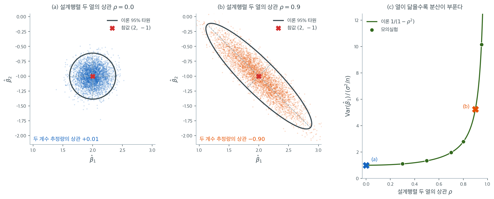

# 표본분포 (일반 최소제곱)

앞 절의 단순회귀 결과는 행렬대수를 이용해 일반적인 다중회귀 모형으로 확장된다. 일반적인 경우에 최소제곱추정량 $\hat{\boldsymbol{\beta}} = (\mathbf{X}^\top\mathbf{X})^{-1}\mathbf{X}^\top\mathbf{y}$은 다변량 정규벡터이고, 잔차제곱합을 $\sigma^2$으로 나눈 것은 카이제곱을 따르며, 이 둘은 독립이다. 정규성, 카이제곱, 독립성이라는 이 세 사실이 결합되어 개별 계수에 대한 t-통계량과 계수 집합을 검정하는 F-통계량이 나온다. 증명은 이 장에서 앞서 전개한 사영행렬과 이차형식 이론에 기댄다.

## 일반 선형모형

행렬 형태의 모형은

$$
\mathbf{y} = \mathbf{X}\boldsymbol{\beta} + \boldsymbol{\varepsilon}
$$

이며, 여기서

- $\mathbf{y} \in \mathbb{R}^n$은 반응벡터다.
- $\mathbf{X} \in \mathbb{R}^{n \times p}$는 $\operatorname{rank}(\mathbf{X}) = p$인(완전 열계수, $p \leq n$) 고정된 계획행렬이다.
- $\boldsymbol{\beta} \in \mathbb{R}^p$는 미지의 모수벡터다.
- $\boldsymbol{\varepsilon} \sim N(\mathbf{0}, \sigma^2\mathbf{I}_n)$: 오차는 평균 0, 공통 분산 $\sigma^2$을 갖는 독립 동일분포 정규확률변수다.

이 가정들로부터 $\mathbf{y} \sim N(\mathbf{X}\boldsymbol{\beta}, \sigma^2\mathbf{I}_n)$이다.

!!! warning "$p$를 세는 방법"

    이 장에서 $p$는 [0.1절 선형대수 표기](../../math/linear_algebra.md)에 적은 대로 **절편 열을 포함한 $\mathbf{X}$의 열의 개수**다. 절편이 있는 모형이면 설명변수는 $p-1$개이고 계수는 $\beta_0, \beta_1, \dots, \beta_{p-1}$로 적는다. 그래서 $\operatorname{tr}(\mathbf{H}) = p$, 잔차 자유도 $n - p$, $s^2 = \text{SSE}/(n-p)$가 된다. **13장에서는 설명변수의 개수를 $p$로 세고 절편을 따로 더해** 계획행렬을 $n \times (p+1)$로 쓰므로 그쪽의 자유도가 $n - p - 1$로 적힌다. 두 표기의 $p$가 $1$만큼 어긋나는 것일 뿐이고 자유도 자체는 같다.

## 최소제곱추정량

최소제곱추정량은 $\lVert\mathbf{y} - \mathbf{X}\boldsymbol{\beta}\rVert^2$을 최소화한다.

$$
\hat{\boldsymbol{\beta}} = (\mathbf{X}^\top\mathbf{X})^{-1}\mathbf{X}^\top\mathbf{y}
$$

이것은 $\mathbf{y}$의 선형함수다. 행렬 $(\mathbf{X}^\top\mathbf{X})^{-1}\mathbf{X}^\top$가 $\mathbf{y}$를 $\hat{\boldsymbol{\beta}}$으로 보낸다.

## 최소제곱추정량의 표본분포

<div class="thmbox" markdown>

### 정리 1. 최소제곱추정량의 분포 { .thm }

정규오차를 갖는 일반 선형모형 아래에서

$$
\hat{\boldsymbol{\beta}} \sim N\!\left(\boldsymbol{\beta},\; \sigma^2(\mathbf{X}^\top\mathbf{X})^{-1}\right)
$$

</div>

??? proof "증명"


    *선형성:* $\hat{\boldsymbol{\beta}} = (\mathbf{X}^\top\mathbf{X})^{-1}\mathbf{X}^\top\mathbf{y}$은 $\mathbf{y}$의 선형변환이다.

    *평균:*

    $$
    E[\hat{\boldsymbol{\beta}}] = (\mathbf{X}^\top\mathbf{X})^{-1}\mathbf{X}^\top E[\mathbf{y}] = (\mathbf{X}^\top\mathbf{X})^{-1}\mathbf{X}^\top\mathbf{X}\boldsymbol{\beta} = \boldsymbol{\beta}
    $$

    따라서 $\hat{\boldsymbol{\beta}}$은 **불편**이다.

    *공분산행렬:*

    $$
    \operatorname{Var}(\hat{\boldsymbol{\beta}}) = (\mathbf{X}^\top\mathbf{X})^{-1}\mathbf{X}^\top \operatorname{Var}(\mathbf{y})\, \mathbf{X}(\mathbf{X}^\top\mathbf{X})^{-1}
    $$

    $$
    = (\mathbf{X}^\top\mathbf{X})^{-1}\mathbf{X}^\top (\sigma^2\mathbf{I}_n)\, \mathbf{X}(\mathbf{X}^\top\mathbf{X})^{-1} = \sigma^2(\mathbf{X}^\top\mathbf{X})^{-1}
    $$

    *정규성:* 다변량 정규벡터의 선형변환은 다변량 정규분포를 따른다. $\square$

    $j$번째 계수의 분산은 $\operatorname{Var}(\hat{\beta}_j) = \sigma^2[(\mathbf{X}^\top\mathbf{X})^{-1}]_{jj}$이다.

## 그림으로 보는 공분산 구조



단순회귀에서 기울기의 분산은 $\sigma^2/S_{xx}$라는 숫자 하나였다. 다중회귀에서 그 자리에 들어오는 $\sigma^2(\mathbf{X}^\top\mathbf{X})^{-1}$은 행렬이고, 대각 성분 바깥에 있는 비대각 성분은 단순회귀에 없던 이야기를 한다. **계수들의 추정이 서로 얽히며, 그 얽힘은 자료의 잡음이 아니라 계획행렬의 기하에서 나온다.** 그림은 그 대응을 가능한 한 깨끗한 설정에서 보인다. $n = 40$, 절편과 설명변수 둘. 두 설명변수 열을 절편 열에 직교시키고 길이를 같게 맞춘 뒤 둘 사이의 상관 $\rho$만 조절하면, $\mathbf{X}^\top\mathbf{X}$의 해당 $2 \times 2$ 블록은 대각 성분이 $n$이고 비대각 성분이 $n\rho$인 행렬이 되어

$$
\operatorname{Var}(\hat{\beta}_1) = \frac{\sigma^2}{n(1 - \rho^2)}, \qquad \operatorname{Corr}(\hat{\beta}_1, \hat{\beta}_2) = -\rho
$$

를 얻는다. $2 \times 2$ 역행렬이 비대각 성분의 부호를 뒤집는 것이 전부다.

왼쪽 그림은 $\rho = 0$인 경우다. $\mathbf{X}^\top\mathbf{X}$가 대각행렬이면 역행렬도 대각행렬이고, 표본분포의 95% 등고선은 원이 된다. $60{,}000$번의 모의실험에서 $\operatorname{Var}(\hat{\beta}_1) = 0.02522$로 이론값 $\sigma^2/n = 0.025$와 맞고, 두 계수 추정량의 상관은 $+0.0052$로 이론값 0과 맞는다. 한 계수를 이번 표본에서 과대추정했다는 사실이 다른 계수에 대해 아무것도 말해 주지 않는 상태다.

가운데 그림은 $\rho = 0.9$다. 타원이 기울면서 동시에 커진다. 측정된 상관은 $-0.9007$로 이론값 $-\rho = -0.9$와 맞는다. 부호가 음인 것을 읽는 법은 이렇다. 두 열이 거의 같은 방향을 가리키므로 $\beta_1 x_1 + \beta_2 x_2$는 사실상 $(\beta_1 + \beta_2)x_1$에 가깝고, 자료는 합 $\beta_1 + \beta_2$는 잘 집어내지만 $\beta_1$을 올리고 $\beta_2$를 그만큼 내린 조합과 그 반대를 구별하지 못한다. **타원의 긴 축이 바로 그 구별되지 않는 방향이고, 짧은 축은 여전히 잘 결정되는 방향이다.** $\operatorname{Var}(\hat{\beta}_1)$은 $0.13294$로 이론값 $0.13158$과 맞아, 왼쪽보다 다섯 배 넘게 부풀었다.

오른쪽 그림은 그 부풂을 $\rho$의 함수로 그린 것이다. 분산팽창은 정확히 $1/(1 - \rho^2)$이며, $\rho = 0.9$에서 모의값 $5.2552$ 대 이론값 $5.2632$, $\rho = 0.95$에서 $10.1603$ 대 $10.2564$로 맞는다. $\rho \to 1$에서 값이 발산하는 것은 두 열이 완전히 겹치면 $\mathbf{X}^\top\mathbf{X}$가 특이행렬이 되어 $(\mathbf{X}^\top\mathbf{X})^{-1}$ 자체가 없어지기 때문이다. 모형의 가정에 $\operatorname{rank}(\mathbf{X}) = p$가 들어 있는 이유가 여기 있다. 그림이 덧붙이는 것은 그 가정이 있다와 없다로 갈리는 문제가 아니라 정도의 문제라는 사실이다. 동시에, 두 타원의 중심이 모두 참값 $(2, -1)$에 그대로 있다는 점도 눈여겨볼 만하다. **다중공선성은 추정값을 치우치게 하지 않는다.** $\hat{\boldsymbol{\beta}}$은 여전히 불편이며, 다만 분산이 부풀 뿐이다.

## 적합값과 잔차

적합값과 잔차는

$$
\hat{\mathbf{y}} = \mathbf{H}\mathbf{y}, \qquad \mathbf{e} = (\mathbf{I} - \mathbf{H})\mathbf{y} = \mathbf{M}\mathbf{y}
$$

이며, 여기서 $\mathbf{H} = \mathbf{X}(\mathbf{X}^\top\mathbf{X})^{-1}\mathbf{X}^\top$는 모자 행렬이고 $\mathbf{M} = \mathbf{I} - \mathbf{H}$는 잔차생성행렬이다.

이들의 분포는 다음과 같다.

$$
\hat{\mathbf{y}} \sim N(\mathbf{X}\boldsymbol{\beta},\; \sigma^2\mathbf{H})
$$

$$
\mathbf{e} \sim N(\mathbf{0},\; \sigma^2\mathbf{M})
$$

$\mathbf{M}\mathbf{X} = \mathbf{0}$이므로 $\mathbf{e}$의 평균은 $\boldsymbol{\beta}$와 무관하게 0이지만, 공분산행렬 $\sigma^2\mathbf{M}$은 특이행렬이므로(계수 $n - p$) 잔차들끼리는 서로 독립이 아니다.

## 잔차제곱합의 분포

<div class="thmbox" markdown>

### 정리 2. SSE의 카이제곱분포 { .thm }

잔차제곱합

$$
\text{SSE} = \mathbf{e}^\top\mathbf{e} = \mathbf{y}^\top\mathbf{M}\mathbf{y}
$$

은

$$
\frac{\text{SSE}}{\sigma^2} \sim \chi^2_{n-p}
$$

를 만족한다.

</div>

??? proof "증명"

    $\mathbf{y} = \mathbf{X}\boldsymbol{\beta} + \boldsymbol{\varepsilon}$으로 쓰자. $\mathbf{M}\mathbf{X} = \mathbf{0}$이므로

    $$
    \text{SSE} = \boldsymbol{\varepsilon}^\top\mathbf{M}\boldsymbol{\varepsilon}
    $$

    이다. $\mathbf{z} = \boldsymbol{\varepsilon}/\sigma \sim N(\mathbf{0}, \mathbf{I}_n)$으로 두면 $\text{SSE}/\sigma^2 = \mathbf{z}^\top\mathbf{M}\mathbf{z}$이다. $\mathbf{M}$이 $\operatorname{rank}(\mathbf{M}) = n - p$인 대칭 멱등행렬이므로 기본 카이제곱 정리에 의해 $\mathbf{z}^\top\mathbf{M}\mathbf{z} \sim \chi^2_{n-p}$이다. $\square$

    따라서 $\sigma^2$의 불편추정량은

    $$
    s^2 = \frac{\text{SSE}}{n - p}
    $$

    이다. **왜 분모가 $n-p$인지**는 카이제곱을 거치지 않고도 보인다. $\mathbb{E}[\mathbf{z}^\top\mathbf{M}\mathbf{z}] = \operatorname{tr}(\mathbf{M})$이므로

    $$
    \mathbb{E}[\text{SSE}] = \sigma^2\operatorname{tr}(\mathbf{M}) = \sigma^2(n - p)
    $$

    이고, 나누는 수는 잔차의 개수 $n$이 아니라 **잔차가 놓인 부분공간의 차원** $n-p$다. 잔차 $\mathbf{e} = \mathbf{M}\mathbf{y}$가 $\mathbf{X}$의 $p$개 열에 모두 직교하도록 묶여 있어 자유롭게 움직일 수 있는 방향이 $n-p$개뿐이기 때문이다. [5.1절](../../../ch05/foundations/statistics_as_rv.md)의 $E[S^2] = \sigma^2$이 $\mathbf{X} = \mathbf{1}$, $p = 1$인 경우이고, 그때 $n - p = n - 1$로 정확히 일치한다.

## 추정량과 SSE의 독립성

<div class="thmbox" markdown>

### 정리 3. 독립성 { .thm }

$\hat{\boldsymbol{\beta}}$과 $\text{SSE}$는 독립이다.

</div>

??? proof "증명"

    $\hat{\boldsymbol{\beta}} = (\mathbf{X}^\top\mathbf{X})^{-1}\mathbf{X}^\top\mathbf{y}$이 $\mathbf{y}$의 선형함수이고 $\text{SSE} = \mathbf{y}^\top\mathbf{M}\mathbf{y}$이 이차형식이므로, 선형 부분과 이차 부분이 서로 직교하는 사영에 관여한다는 사실에서 독립성이 따라온다. 형식적으로는

    $$
    \operatorname{Cov}(\hat{\boldsymbol{\beta}}, \mathbf{e}) = (\mathbf{X}^\top\mathbf{X})^{-1}\mathbf{X}^\top\operatorname{Var}(\mathbf{y})\mathbf{M} = \sigma^2(\mathbf{X}^\top\mathbf{X})^{-1}\mathbf{X}^\top\mathbf{M} = \mathbf{0}
    $$

    인데, $\mathbf{X}^\top\mathbf{M} = \mathbf{X}^\top(\mathbf{I} - \mathbf{H}) = \mathbf{X}^\top - \mathbf{X}^\top = \mathbf{0}$이기 때문이다. $\hat{\boldsymbol{\beta}}$과 $\mathbf{e}$는 같은 정규벡터 $\mathbf{y}$의 선형변환이라 결합정규이고, 결합 정규성 아래에서 공분산이 0이면 독립이다. 끝으로 $\text{SSE} = \mathbf{e}^\top\mathbf{e}$이 $\mathbf{e}$만의 함수이므로 $\text{SSE}$도 $\hat{\boldsymbol{\beta}}$과 독립이다. $\square$

    **무상관에서 독립으로 넘어가는 데 정규성이 쓰인다.** 가우스–마르코프 가정만으로는 $\operatorname{Cov}(\hat{\boldsymbol{\beta}}, \mathbf{e}) = \mathbf{O}$까지만 얻고 독립성은 얻지 못한다. 그래서 정리 6(가우스–마르코프)은 정규성 없이 성립하지만 정리 4와 정리 5의 $t$·$F$ 분포는 그렇지 않다.

## 개별 계수에 대한 t-통계량

$\hat{\beta}_j$의 정규분포, $\text{SSE}/\sigma^2$의 카이제곱분포, 그리고 이 둘의 독립성을 결합하면 t-분포가 나온다.

<div class="thmbox" markdown>

### 정리 4. 계수 검정을 위한 t-분포 { .thm }

$\boldsymbol{\beta} = (\beta_0, \beta_1, \dots, \beta_{p-1})^\top$의 각 성분 $j = 0, 1, \dots, p-1$에 대해

$$
T_j = \frac{\hat{\beta}_j - \beta_j}{\text{SE}(\hat{\beta}_j)} \sim t_{n-p}
$$

이며, 여기서 $\text{SE}(\hat{\beta}_j) = s\sqrt{[(\mathbf{X}^\top\mathbf{X})^{-1}]_{jj}}$은 $\beta_j$에 대응하는 대각 성분으로 만든 표준오차다.

</div>

??? proof "증명"

    정리 1에서 $\hat{\beta}_j \sim N(\beta_j, \sigma^2[(\mathbf{X}^\top\mathbf{X})^{-1}]_{jj})$이므로 표준화하면

    $$
    Z = \frac{\hat{\beta}_j - \beta_j}{\sigma\sqrt{[(\mathbf{X}^\top\mathbf{X})^{-1}]_{jj}}} \sim N(0,1)
    $$

    이다. 정리 2에서 $V = \text{SSE}/\sigma^2 \sim \chi^2_{n-p}$이고 정리 3에서 $Z$와 $V$는 독립이다. 그런데 $s = \sigma\sqrt{V/(n-p)}$이므로

    $$
    T_j = \frac{\hat{\beta}_j - \beta_j}{s\sqrt{[(\mathbf{X}^\top\mathbf{X})^{-1}]_{jj}}} = \frac{Z}{\sqrt{V/(n-p)}}
    $$

    이고, 이것이 $t_{n-p}$ 분포의 정의다. $\square$

    **세 정리가 모두 쓰였다는 점에 주의하라.** 정규성(정리 1), 카이제곱(정리 2), 독립성(정리 3) 중 하나라도 없으면 이 비는 $t$ 분포를 따르지 않는다.

## 여러 계수를 검정하는 F-통계량

계수의 부분집합이 동시에 0인지 검정하려면, 계수 $q$인 $q \times p$ 행렬 $\mathbf{C}$에 대해 $H_0: \mathbf{C}\boldsymbol{\beta} = \mathbf{0}$을 검정하는 것을 생각한다.

<div class="thmbox" markdown>

### 정리 5. 선형가설에 대한 F-분포 { .thm }

$H_0: \mathbf{C}\boldsymbol{\beta} = \mathbf{0}$ 아래에서

$$
F = \frac{(\mathbf{C}\hat{\boldsymbol{\beta}})^\top[\mathbf{C}(\mathbf{X}^\top\mathbf{X})^{-1}\mathbf{C}^\top]^{-1}(\mathbf{C}\hat{\boldsymbol{\beta}})/q}{s^2} \sim F_{q,\,n-p}
$$

</div>

??? proof "증명"

    $\mathbf{C}$의 계수가 $q$이고 $(\mathbf{X}^\top\mathbf{X})^{-1}$이 양정치이므로 $\boldsymbol{\Omega} = \mathbf{C}(\mathbf{X}^\top\mathbf{X})^{-1}\mathbf{C}^\top$는 $q \times q$ 양정치행렬이고 따라서 가역이다. 정리 1에서 $\mathbf{C}\hat{\boldsymbol{\beta}} \sim N(\mathbf{C}\boldsymbol{\beta}, \sigma^2\boldsymbol{\Omega})$이므로 $H_0$ 아래에서 $\mathbf{C}\hat{\boldsymbol{\beta}} \sim N(\mathbf{0}, \sigma^2\boldsymbol{\Omega})$이다.

    분자의 이차형식은 마할라노비스 꼴이다. $\mathbf{u} = \boldsymbol{\Omega}^{-1/2}\mathbf{C}\hat{\boldsymbol{\beta}}/\sigma \sim N(\mathbf{0}, \mathbf{I}_q)$로 백색화하면

    $$
    \frac{(\mathbf{C}\hat{\boldsymbol{\beta}})^\top\boldsymbol{\Omega}^{-1}(\mathbf{C}\hat{\boldsymbol{\beta}})}{\sigma^2} = \mathbf{u}^\top\mathbf{u} \sim \chi^2_q
    $$

    이다([카이제곱분포와 이차형식](./chi_squared_quadratic.md) 쪽 연습문제 9와 같은 계산이다).

    분모 쪽은 정리 2에서 $\text{SSE}/\sigma^2 \sim \chi^2_{n-p}$이고, 분자는 $\hat{\boldsymbol{\beta}}$만의 함수이므로 정리 3에 의해 분모와 독립이다. 독립인 두 카이제곱을 각자의 자유도로 나눈 비이므로

    $$
    F = \frac{\chi^2_q/q}{\chi^2_{n-p}/(n-p)} \sim F_{q,\,n-p}
    $$

    이다. $\sigma^2$이 분자와 분모에서 상쇄되어 식에 남지 않는 것이 이 통계량이 쓸모 있는 이유다. $\square$

### 특수한 경우: 전체 F-검정

($\mathbf{X}$의 첫 열이 절편이라 가정하고) $H_0: \beta_1 = \beta_2 = \cdots = \beta_{p-1} = 0$(절편 $\beta_0$은 남겨 두고 **모든 기울기**가 0)을 검정하면 전체 F-통계량을 얻는다. 이는 정리 5에서 $\mathbf{C}$를 절편을 제외한 $p-1$개 좌표를 뽑는 $(p-1) \times p$ 행렬로 잡은 경우이며, 따라서 $q = p - 1$이다.

$$
F = \frac{\text{SSR}/(p - 1)}{\text{SSE}/(n - p)} = \frac{\text{MSR}}{\text{MSE}}
$$

여기서 $\text{SSR} = \hat{\mathbf{y}}^\top\hat{\mathbf{y}} - n\bar{Y}^2$이 회귀제곱합이다. $H_0$ 아래에서 $F \sim F_{p-1,\,n-p}$이다.

사영의 언어로는 $\text{SSR} = \lVert(\mathbf{H} - \tfrac{1}{n}\mathbf{J})\mathbf{y}\rVert^2$이다. 절편만 있는 모형의 사영 $\tfrac{1}{n}\mathbf{J}$를 $\mathbf{H}$에서 걷어낸 것이 계수 $p-1$인 직교사영이기 때문에 자유도가 $p$가 아니라 $p-1$이다.

## 가우스–마르코프 정리

정규성을 가정하지 않아도 최소제곱추정량은 최적성을 갖는다.

<div class="thmbox" markdown>

### 정리 6. 가우스–마르코프 { .thm }

가정 $E[\boldsymbol{\varepsilon}] = \mathbf{0}$과 $\operatorname{Var}(\boldsymbol{\varepsilon}) = \sigma^2\mathbf{I}_n$ 아래에서(정규성은 필요 없다) 최소제곱추정량 $\hat{\boldsymbol{\beta}}$은 **최량선형불편추정량(BLUE)** 이다. 즉 $\boldsymbol{\beta}$의 모든 선형불편추정량 가운데 최소제곱추정량이 (행렬 순서의 의미에서) 가장 작은 분산을 갖는다.

</div>

??? proof "증명"

    $\tilde{\boldsymbol{\beta}} = \mathbf{A}\mathbf{y}$을 임의의 선형불편추정량이라 하자. 여기서 $\mathbf{A}$는 $\mathbf{y}$에 의존하지 않는 $p \times n$ 행렬이다. 불편성이 **모든** $\boldsymbol{\beta}$에 대해 성립해야 하므로 $\mathbf{A}\mathbf{X}\boldsymbol{\beta} = \boldsymbol{\beta}$에서 $\mathbf{A}\mathbf{X} = \mathbf{I}_p$를 요구한다. $\mathbf{D} = \mathbf{A} - (\mathbf{X}^\top\mathbf{X})^{-1}\mathbf{X}^\top$로 두면 $\mathbf{D}\mathbf{X} = \mathbf{I}_p - \mathbf{I}_p = \mathbf{O}$이다.

    $\operatorname{Var}(\mathbf{y}) = \sigma^2\mathbf{I}$이므로 $\operatorname{Var}(\tilde{\boldsymbol{\beta}}) = \sigma^2\mathbf{A}\mathbf{A}^\top$인데, 교차항이 $\mathbf{D}\mathbf{X} = \mathbf{O}$ 때문에 사라진다.

    $$
    (\mathbf{X}^\top\mathbf{X})^{-1}\mathbf{X}^\top\mathbf{D}^\top = (\mathbf{X}^\top\mathbf{X})^{-1}(\mathbf{D}\mathbf{X})^\top = \mathbf{O}
    $$

    따라서

    $$
    \operatorname{Var}(\tilde{\boldsymbol{\beta}}) = \sigma^2\mathbf{A}\mathbf{A}^\top = \sigma^2(\mathbf{X}^\top\mathbf{X})^{-1} + \sigma^2\mathbf{D}\mathbf{D}^\top
    $$

    이다. $\mathbf{D}\mathbf{D}^\top \succeq 0$이므로 양반정치 순서에서 $\operatorname{Var}(\tilde{\boldsymbol{\beta}}) \succeq \operatorname{Var}(\hat{\boldsymbol{\beta}})$이고, 등호는 $\mathbf{D} = \mathbf{O}$, 곧 $\tilde{\boldsymbol{\beta}} = \hat{\boldsymbol{\beta}}$일 때만 성립한다. 연습문제 6에서 같은 계산을 다시 밟는다. $\square$

    **가정에서 무엇이 빠졌는지 보라.** 정규성은 쓰지 않았고 $E[\boldsymbol{\varepsilon}] = \mathbf{0}$과 $\operatorname{Var}(\boldsymbol{\varepsilon}) = \sigma^2\mathbf{I}$만 썼다. 반면 등분산 $\sigma^2\mathbf{I}$는 반드시 쓴다. 이것이 깨지면 최소제곱은 여전히 불편이지만 더 이상 최량이 아니다(연습문제 10).

## 핵심 분포 요약

| 양 | 분포 | 자유도 |
|---|---|---|
| $\hat{\boldsymbol{\beta}}$ | $N(\boldsymbol{\beta}, \sigma^2(\mathbf{X}^\top\mathbf{X})^{-1})$ | — |
| $\text{SSE}/\sigma^2$ | $\chi^2_{n-p}$ | $n - p$ |
| $T_j = (\hat{\beta}_j - \beta_j)/\text{SE}(\hat{\beta}_j)$ | $t_{n-p}$ | $n - p$ |
| 선형가설 $\mathbf{C}\boldsymbol{\beta} = \mathbf{0}$의 $F$ (정리 5) | $F_{q,\,n-p}$ | $q$와 $n-p$ |
| 전체 F-검정 $F = \text{MSR}/\text{MSE}$ | $F_{p-1,\,n-p}$ | $p-1$과 $n-p$ |

이 모든 분포는 세 가지 재료에 의존한다. (1) $\hat{\boldsymbol{\beta}}$이 정규벡터 $\mathbf{y}$의 선형함수이고, (2) $\mathbf{M}$이 대칭 멱등이며, (3) $\mathbf{X}^\top\mathbf{M} = \mathbf{0}$이므로 $\hat{\boldsymbol{\beta}}$과 $\text{SSE}$가 독립이라는 것이다.

## 연습문제

<div class="drillbox" markdown>

**연습문제 1.** <span class="diff easy" title="쉬움"></span>
관측값이 $n = 30$개, (절편을 포함해) 모수가 $p = 4$개이고 $\text{SSE} = 52$인 다중회귀 모형 $\mathbf{y} = \mathbf{X}\boldsymbol{\beta} + \boldsymbol{\varepsilon}$을 생각하자. $s^2$을 계산하고 개별 계수 검정에 쓰이는 t-통계량의 자유도를 구하라.

</div>

??? success "풀이"
    불편 분산추정량은

    $$
    s^2 = \frac{\text{SSE}}{n - p} = \frac{52}{30 - 4} = \frac{52}{26} = 2.0
    $$

    이다.

    개별 계수에 대한 t-통계량은 각자의 귀무가설 아래에서 $t_{n-p} = t_{26}$ 분포를 따른다. 각 t-통계량의 자유도는 $26$이다.

<div class="drillbox" markdown>

**연습문제 2.** <span class="diff med" title="중간"></span>
$\mathbf{M} = \mathbf{I} - \mathbf{X}(\mathbf{X}^\top\mathbf{X})^{-1}\mathbf{X}^\top$일 때 최소제곱 잔차벡터 $\mathbf{e} = \mathbf{M}\mathbf{y}$이 $\mathbf{X}^\top\mathbf{e} = \mathbf{0}$을 만족함을 증명하라.

</div>

??? success "풀이"
    직접 계산한다.

    $$
    \mathbf{X}^\top\mathbf{e} = \mathbf{X}^\top\mathbf{M}\mathbf{y} = \mathbf{X}^\top\bigl(\mathbf{I} - \mathbf{X}(\mathbf{X}^\top\mathbf{X})^{-1}\mathbf{X}^\top\bigr)\mathbf{y}
    $$

    $$
    = \mathbf{X}^\top\mathbf{y} - \mathbf{X}^\top\mathbf{X}(\mathbf{X}^\top\mathbf{X})^{-1}\mathbf{X}^\top\mathbf{y} = \mathbf{X}^\top\mathbf{y} - \mathbf{X}^\top\mathbf{y} = \mathbf{0}
    $$

    이는 잔차가 $\mathbf{X}$의 모든 열에 직교함을 보여주며, 이것이 정규방정식의 행렬 형태다. $\square$

<div class="drillbox" markdown>

**연습문제 3.** <span class="diff med" title="중간"></span>
설명변수가 세 개이고 절편을 포함해 $p = 4$인 모형에서 일반 F-검정으로 $H_0: \beta_2 = \beta_3 = 0$을 검정하려 한다. $H_0$ 아래에서 F-통계량의 분포를 진술하고, $q$를 밝히며, 이 맥락에서 "제약된" SSE와 "제약 없는" SSE가 무엇을 뜻하는지 설명하라.

</div>

??? success "풀이"
    제약이 $q = 2$개다(두 계수를 0으로 둔다). F-통계량은

    $$
    F = \frac{(\text{SSE}_R - \text{SSE}_U)/q}{\text{SSE}_U/(n-p)} \sim F_{q,\, n-p} = F_{2,\, n-4}
    $$

    이다. 여기서 $\text{SSE}_R$은 $X_2$와 $X_3$을 제외한(절편과 $X_1$만 적합한) 제약 모형의 잔차제곱합이고, $\text{SSE}_U$는 네 모수를 모두 갖는 완전(제약 없는) 모형의 잔차제곱합이다. F-통계량은 $X_2$와 $X_3$을 포함해서 줄어든 SSE가 잡음 수준 $s^2 = \text{SSE}_U/(n-4)$에 비해 충분히 큰지를 잰다.

    **정리 5의 꼴과 같다.** 두 계획행렬을 $\mathbf{X}_R$, $\mathbf{X}_U$라 하고 각각의 모자 행렬을 $\mathbf{H}_R$, $\mathbf{H}_U$라 하면 $\operatorname{col}(\mathbf{X}_R) \subseteq \operatorname{col}(\mathbf{X}_U)$이므로 [직교사영행렬](../square_matrices/orthogonal_projection.md) 쪽 연습문제 7에 의해 $\mathbf{H}_U - \mathbf{H}_R$이 계수 $q = 2$인 직교사영이고 $(\mathbf{H}_U - \mathbf{H}_R)(\mathbf{I} - \mathbf{H}_U) = \mathbf{O}$이다. 그런데

    $$
    \text{SSE}_R - \text{SSE}_U = \mathbf{y}^\top(\mathbf{I} - \mathbf{H}_R)\mathbf{y} - \mathbf{y}^\top(\mathbf{I} - \mathbf{H}_U)\mathbf{y} = \mathbf{y}^\top(\mathbf{H}_U - \mathbf{H}_R)\mathbf{y}
    $$

    이므로 분자와 분모가 서로 직교하는 두 사영의 이차형식이고, 크레이그 정리로 독립인 두 카이제곱의 비가 된다. 곧 위 식은 정리 5를 제곱합의 차이로 다시 쓴 것일 뿐이다.

<div class="drillbox" markdown>

**연습문제 4.** <span class="diff med" title="중간"></span>
(정규성 없이) 가우스–마르코프 가정 아래에서 $\operatorname{Var}(\hat{\boldsymbol{\beta}}) = \sigma^2(\mathbf{X}^\top\mathbf{X})^{-1}$임을 보여라. (힌트: $\hat{\boldsymbol{\beta}} = (\mathbf{X}^\top\mathbf{X})^{-1}\mathbf{X}^\top\mathbf{y}$에 $\mathbf{y} = \mathbf{X}\boldsymbol{\beta} + \boldsymbol{\varepsilon}$을 대입하라.)

</div>

??? success "풀이"
    $\mathbf{y} = \mathbf{X}\boldsymbol{\beta} + \boldsymbol{\varepsilon}$을 대입하면

    $$
    \hat{\boldsymbol{\beta}} = (\mathbf{X}^\top\mathbf{X})^{-1}\mathbf{X}^\top(\mathbf{X}\boldsymbol{\beta} + \boldsymbol{\varepsilon}) = \boldsymbol{\beta} + (\mathbf{X}^\top\mathbf{X})^{-1}\mathbf{X}^\top\boldsymbol{\varepsilon}
    $$

    이다. $\hat{\boldsymbol{\beta}} - \boldsymbol{\beta} = (\mathbf{X}^\top\mathbf{X})^{-1}\mathbf{X}^\top\boldsymbol{\varepsilon}$이므로 ($\mathbf{X}$를 고정된 것으로 다루면)

    $$
    \operatorname{Var}(\hat{\boldsymbol{\beta}}) = (\mathbf{X}^\top\mathbf{X})^{-1}\mathbf{X}^\top \operatorname{Var}(\boldsymbol{\varepsilon})\, \mathbf{X}(\mathbf{X}^\top\mathbf{X})^{-1}
    $$

    이다. $\operatorname{Var}(\boldsymbol{\varepsilon}) = \sigma^2\mathbf{I}$이면

    $$
    = \sigma^2 (\mathbf{X}^\top\mathbf{X})^{-1}\mathbf{X}^\top\mathbf{X}(\mathbf{X}^\top\mathbf{X})^{-1} = \sigma^2(\mathbf{X}^\top\mathbf{X})^{-1}
    $$

    이다. 정규성 가정은 전혀 필요하지 않았고 $E[\boldsymbol{\varepsilon}] = \mathbf{0}$과 $\operatorname{Var}(\boldsymbol{\varepsilon}) = \sigma^2\mathbf{I}$만 썼다. $\square$

<div class="drillbox" markdown>

**연습문제 5.** <span class="diff med" title="중간"></span>
오차가 정규일 때 $\hat{\boldsymbol{\beta}}$과 $\text{SSE}$가 왜 독립인지 개념적으로 설명하라. 이를 가능하게 하는 모자 행렬의 기하적 성질은 무엇인가?

</div>

??? success "풀이"
    핵심적인 기하적 성질은 모자 행렬 $\mathbf{H}$와 잔차생성행렬 $\mathbf{M} = \mathbf{I} - \mathbf{H}$가 서로 직교하는 부분공간 위로 사영한다는 점이다. 구체적으로 $\hat{\boldsymbol{\beta}}$은 $\mathbf{y}$에 오직 $\mathbf{H}\mathbf{y}$($\mathbf{X}$의 열공간 위로의 사영)를 통해서만 의존하고, $\text{SSE} = \mathbf{y}^\top\mathbf{M}\mathbf{y}$은 오직 $\mathbf{M}\mathbf{y}$(직교여공간 위로의 사영)를 통해서만 의존한다.

    $\mathbf{H}\mathbf{M} = \mathbf{0}$이므로 벡터 $\mathbf{H}\mathbf{y}$와 $\mathbf{M}\mathbf{y}$는 무상관이다. 정규성 가정 아래에서 무상관인 정규확률벡터는 독립이다. 이 직교 분해가 t-통계량과 F-통계량이 앞서 진술한 분포를 갖는 기하적 이유다.

<div class="drillbox" markdown>

**연습문제 6.** <span class="diff hard" title="어려움"></span>
가우스–마르코프 정리를 증명하라. 임의의 선형 불편추정량 $\tilde{\boldsymbol{\beta}} = \mathbf{C}\mathbf{y}$에 대해 $\operatorname{Var}(\tilde{\boldsymbol{\beta}}) - \operatorname{Var}(\hat{\boldsymbol{\beta}})$이 양반정치임을 보여라.

</div>

??? success "풀이"
    $\mathbf{C} = (\mathbf{X}^\top\mathbf{X})^{-1}\mathbf{X}^\top + \mathbf{D}$로 쓰자. 불편성은 모든 $\boldsymbol{\beta}$에 대해

    $$
    E[\tilde{\boldsymbol{\beta}}] = \mathbf{C}\mathbf{X}\boldsymbol{\beta} = \boldsymbol{\beta}
    \quad\Longrightarrow\quad \mathbf{C}\mathbf{X} = \mathbf{I}
    \quad\Longrightarrow\quad \mathbf{D}\mathbf{X} = \mathbf{O}
    $$

    을 요구한다. 분산은

    $$
    \operatorname{Var}(\tilde{\boldsymbol{\beta}}) = \sigma^2\mathbf{C}\mathbf{C}^\top
    = \sigma^2\left[(\mathbf{X}^\top\mathbf{X})^{-1} + \mathbf{D}\mathbf{D}^\top\right]
    $$

    이다. 교차항이 사라지는 것이 핵심인데, $\mathbf{D}\mathbf{X} = \mathbf{O}$이므로

    $$
    (\mathbf{X}^\top\mathbf{X})^{-1}\mathbf{X}^\top\mathbf{D}^\top = (\mathbf{X}^\top\mathbf{X})^{-1}(\mathbf{D}\mathbf{X})^\top = \mathbf{O}
    $$

    이기 때문이다. 따라서

    $$
    \operatorname{Var}(\tilde{\boldsymbol{\beta}}) - \operatorname{Var}(\hat{\boldsymbol{\beta}}) = \sigma^2\mathbf{D}\mathbf{D}^\top \succeq 0
    $$

    이다. 특히 임의의 $\mathbf{c}$에 대해 $\operatorname{Var}(\mathbf{c}^\top\tilde{\boldsymbol{\beta}}) \ge \operatorname{Var}(\mathbf{c}^\top\hat{\boldsymbol{\beta}})$이므로 최소제곱추정량이 **최량선형불편추정량(BLUE)**이다.

    등호는 $\mathbf{D} = \mathbf{O}$, 곧 $\tilde{\boldsymbol{\beta}} = \hat{\boldsymbol{\beta}}$일 때만 성립한다.

    **가정에 주의하라.** 이 증명은 정규성을 쓰지 않지만 $\operatorname{Var}(\boldsymbol{\varepsilon}) = \sigma^2\mathbf{I}$는 반드시 쓴다. 등분산이 깨지면 최소제곱은 여전히 불편이지만 더 이상 최량이 아니다(연습문제 10). $\square$

<div class="drillbox" markdown>

**연습문제 7.** <span class="diff med" title="중간"></span>
$\hat{\boldsymbol{\beta}} \sim N(\boldsymbol{\beta}, \sigma^2(\mathbf{X}^\top\mathbf{X})^{-1})$을 모의실험으로 확인하라. 공분산행렬 전체를 이론값과 비교하라.

</div>

??? success "풀이"
    ```python
    import numpy as np

    rng = np.random.default_rng(0)
    n, p, sig = 30, 3, 2.0
    X = np.column_stack([np.ones(n), rng.normal(size=(n, p - 1))])
    beta = np.array([1., 2., -1.])
    XtXi = np.linalg.inv(X.T @ X)

    B = 200_000
    Y = X @ beta + rng.normal(0, sig, size=(B, n))
    bhat = Y @ X @ XtXi

    print("평균 모의:", bhat.mean(axis=0).round(4), "  참값:", beta)
    print("\n공분산 모의:\n", np.cov(bhat.T).round(4))
    print("이론 sigma^2 (X'X)^-1:\n", (sig**2 * XtXi).round(4))
    ```

    출력:

    ```
    평균 모의: [ 0.9998  1.9991 -1.0002]   참값: [ 1.  2. -1.]

    공분산 모의:
     [[ 0.164   0.0536 -0.0876]
     [ 0.0536  0.1971 -0.1124]
     [-0.0876 -0.1124  0.2714]]
    이론 sigma^2 (X'X)^-1:
     [[ 0.1629  0.0532 -0.0863]
     [ 0.0532  0.1963 -0.1122]
     [-0.0863 -0.1122  0.2705]]
    ```

    대각 성분(각 계수의 분산)뿐 아니라 **비대각 성분(계수 사이의 공분산)까지** 이론값과 맞는다.

    비대각 성분이 0이 아니라는 점이 중요하다. 계수 추정값들은 서로 **상관되어** 있으며, 그래서 계수를 하나씩 따로 검정하는 것과 여러 개를 한꺼번에 검정하는 것($F$ 검정)이 다른 결론을 낼 수 있다. 예측변수들이 직교하면 비대각 성분이 0이 되어 이 문제가 사라진다. $\square$

<div class="drillbox" markdown>

**연습문제 8.** <span class="diff med" title="중간"></span>
새로운 점 $\mathbf{x}_0$에서 평균반응의 분산이 $\sigma^2\mathbf{x}_0^\top(\mathbf{X}^\top\mathbf{X})^{-1}\mathbf{x}_0$임을 보이고 수치로 확인하라. 예측구간과 신뢰구간의 차이는 무엇인가?

</div>

??? success "풀이"
    $\hat{\mu}_0 = \mathbf{x}_0^\top\hat{\boldsymbol{\beta}}$이므로

    $$
    \operatorname{Var}(\hat{\mu}_0) = \mathbf{x}_0^\top\operatorname{Var}(\hat{\boldsymbol{\beta}})\mathbf{x}_0
    = \sigma^2\mathbf{x}_0^\top(\mathbf{X}^\top\mathbf{X})^{-1}\mathbf{x}_0
    $$

    이다.

    ```python
    import numpy as np

    rng = np.random.default_rng(0)
    n, p, sig = 30, 3, 2.0
    X = np.column_stack([np.ones(n), rng.normal(size=(n, p - 1))])
    beta = np.array([1., 2., -1.])
    XtXi = np.linalg.inv(X.T @ X)
    x0 = np.array([1., 0.5, -0.3])

    Y = X @ beta + rng.normal(0, sig, size=(200_000, n))
    bhat = Y @ X @ XtXi
    mu0 = bhat @ x0

    print(f"Var(mu0) 모의 {mu0.var():.5f}   이론 {sig**2 * x0 @ XtXi @ x0:.5f}")
    print(f"새 관측 예측오차 분산 이론 {sig**2 * (1 + x0 @ XtXi @ x0):.5f}")
    ```

    출력:

    ```
    Var(mu0) 모의 0.37766   이론 0.37503
    새 관측 예측오차 분산 이론 4.37503
    ```

    **두 구간의 차이.** 신뢰구간은 $\hat{\mu}_0$이 참 평균 $\mathbf{x}_0^\top\boldsymbol{\beta}$를 얼마나 정확히 맞추는지를 말하고, 예측구간은 새 관측값 $y_0$ 자체가 어디에 떨어질지를 말한다. 후자는 오차항 $\varepsilon_0$의 변동이 더해져

    $$
    \operatorname{Var}(y_0 - \hat{\mu}_0) = \sigma^2\left(1 + \mathbf{x}_0^\top(\mathbf{X}^\top\mathbf{X})^{-1}\mathbf{x}_0\right)
    $$

    이 된다. 자료를 아무리 모아도 괄호 안의 $1$은 사라지지 않는다. $\square$

<div class="drillbox" markdown>

**연습문제 9.** <span class="diff med" title="중간"></span>
반응변수와 아무 관계 없는 예측변수를 추가하면 $R^2$은 반드시 커지지만 계수 추정의 분산도 커진다. 모의실험으로 확인하고, 수정 $R^2$이 왜 필요한지 설명하라.

</div>

??? success "풀이"
    ```python
    import numpy as np

    rng = np.random.default_rng(2)
    n = 30
    x1 = rng.normal(size=n)
    y = 1. + 2. * x1 + rng.normal(0, 1., n)

    def fit(X):
        b = np.linalg.lstsq(X, y, rcond=None)[0]
        e = y - X @ b
        sse = e @ e
        sst = ((y - y.mean()) ** 2).sum()
        r2 = 1 - sse / sst
        adj = 1 - (sse / (len(y) - X.shape[1])) / (sst / (len(y) - 1))
        return r2, adj, np.linalg.inv(X.T @ X)[1, 1]

    X1 = np.column_stack([np.ones(n), x1])
    for k in (0, 1, 5, 10):
        noise = rng.normal(size=(n, k))
        X = np.column_stack([X1, noise]) if k else X1
        r2, adj, v = fit(X)
        print(f"잡음변수 {k:>2}개:  R^2 = {r2:.4f}   수정 R^2 = {adj:.4f}   "
              f"Var(b1) 인자 = {v:.4f}")
    ```

    출력:

    ```
    잡음변수  0개:  R^2 = 0.8446   수정 R^2 = 0.8390   Var(b1) 인자 = 0.0331
    잡음변수  1개:  R^2 = 0.8451   수정 R^2 = 0.8336   Var(b1) 인자 = 0.0337
    잡음변수  5개:  R^2 = 0.8674   수정 R^2 = 0.8328   Var(b1) 인자 = 0.0471
    잡음변수 10개:  R^2 = 0.9025   수정 R^2 = 0.8429   Var(b1) 인자 = 0.0726
    ```

    잡음변수를 넣을수록 $R^2$은 $0.845 \to 0.903$으로 단조증가하지만, 수정 $R^2$은 $0.839$에서 시작해 오르지 못하고 $\hat\beta_1$의 분산 인자는 $0.033 \to 0.073$으로 두 배 넘게 커진다.

    (수정 $R^2$은 단조롭게 움직이지 않는다. 여기서도 잡음 $10$개일 때 $0.843$으로 조금 올랐다. 우연히 반응변수와 상관된 잡음변수가 섞이면 생기는 일이며, 그래서 수정 $R^2$ 하나만으로 변수를 고르는 것도 위험하다.)

    **왜 $R^2$이 반드시 커지는가.** 변수를 추가하면 열공간이 넓어지므로 사영이 $\mathbf{y}$에 더 가까워질 수밖에 없다. $\text{SSE}$는 절대 늘지 않는다. 따라서 $R^2$은 **모형 선택 기준이 될 수 없다.**

    수정 $R^2$은 $\text{SSE}$를 자유도 $n-p$로 나누어, 변수를 넣어 얻는 적합의 개선이 잃는 자유도만큼의 값어치가 있는지를 따진다. 같은 동기에서 AIC와 BIC가 나온다. $\square$

<div class="drillbox" markdown>

**연습문제 10.** <span class="diff hard" title="어려움"></span>
$\operatorname{Var}(\boldsymbol{\varepsilon}) = \sigma^2\mathbf{V}$($\mathbf{V} \neq \mathbf{I}$)이면 최소제곱은 여전히 불편이지만 최량이 아니다. 일반화최소제곱 $\hat{\boldsymbol{\beta}}_{\text{GLS}} = (\mathbf{X}^\top\mathbf{V}^{-1}\mathbf{X})^{-1}\mathbf{X}^\top\mathbf{V}^{-1}\mathbf{y}$와 비교하라.

</div>

??? success "풀이"
    **불편성은 유지된다.** $E[\hat{\boldsymbol{\beta}}] = (\mathbf{X}^\top\mathbf{X})^{-1}\mathbf{X}^\top\mathbf{X}\boldsymbol{\beta} = \boldsymbol{\beta}$는 오차의 공분산 구조와 무관하다.

    **효율은 잃는다.** 분산이 $\sigma^2(\mathbf{X}^\top\mathbf{X})^{-1}\mathbf{X}^\top\mathbf{V}\mathbf{X}(\mathbf{X}^\top\mathbf{X})^{-1}$이 되어 GLS의 $\sigma^2(\mathbf{X}^\top\mathbf{V}^{-1}\mathbf{X})^{-1}$보다 크다.

    ```python
    import numpy as np

    rng = np.random.default_rng(0)
    n, p, sig = 30, 3, 2.0
    X = np.column_stack([np.ones(n), rng.normal(size=(n, p - 1))])
    beta = np.array([1., 2., -1.])

    w = np.linspace(1, 5, n)                    # 분산이 5배까지 커진다
    V = np.diag(w)
    Vinv = np.linalg.inv(V)

    B = 200_000
    Y = X @ beta + rng.normal(size=(B, n)) * np.sqrt(w) * sig

    b_ols = Y @ X @ np.linalg.inv(X.T @ X)
    b_gls = (Y @ Vinv @ X) @ np.linalg.inv(X.T @ Vinv @ X)

    print("OLS 평균:", b_ols.mean(0).round(4), " 분산:", b_ols.var(0).round(5))
    print("GLS 평균:", b_gls.mean(0).round(4), " 분산:", b_gls.var(0).round(5))
    ```

    출력:

    ```
    OLS 평균: [ 0.9997  1.9983 -1.0009]  분산: [0.48438 0.62429 0.89718]
    GLS 평균: [ 0.9996  1.9988 -0.9999]  분산: [0.38248 0.51366 0.77013]
    ```

    두 추정량 모두 평균이 참값 $(1, 2, -1)$에 맞아 불편이지만, GLS의 분산이 세 계수 모두에서 작다(첫 계수에서 $0.484 \to 0.382$로 약 $21\%$ 줄어든다).

    **GLS가 하는 일.** $\mathbf{V}^{-1}$로 가중하는 것은 오차를 백색화한 뒤 보통최소제곱을 적용하는 것과 같다. 분산이 작은 관측값에 더 큰 비중을 주는 것이다.

    실무에서는 $\mathbf{V}$를 모르는 경우가 많다. 그래서 (1) $\mathbf{V}$를 추정해 쓰는 실행가능 GLS, 또는 (2) 계수는 최소제곱으로 두고 표준오차만 고치는 로버스트(샌드위치) 표준오차를 쓴다. 앞의 것은 [13.5절 가중최소제곱](../../../ch13/assumptions/weighted_regression.md)에서, 뒤의 것은 [15.7절 회귀에서의 분산 검정](../../../ch15/applications/regression_variance.md)에서 다룬다. $\square$

---

## 정리하며

최소제곱의 행렬 정식화는 단순회귀의 표본분포 이론을 하나의 통합된 틀로 압축한다. 추정량 $\hat{\boldsymbol{\beta}}$은 공분산이 $\sigma^2(\mathbf{X}^\top\mathbf{X})^{-1}$인 다변량 정규분포를 따르고, 잔차제곱합 $\text{SSE}/\sigma^2$은 자유도 $n - p$인 카이제곱을 따르며, 이 둘은 독립이다. 최소제곱의 직교사영 구조와 오차의 정규성에서 따라오는 이 세 사실이 개별 계수에 대한 모든 표준 t-검정과 계수 집합에 대한 F-검정을 만들어낸다. 나아가 가우스–마르코프 정리는 정규성 가정이 없어도 최소제곱이 선형불편추정량 가운데 최적임을 보여준다.
