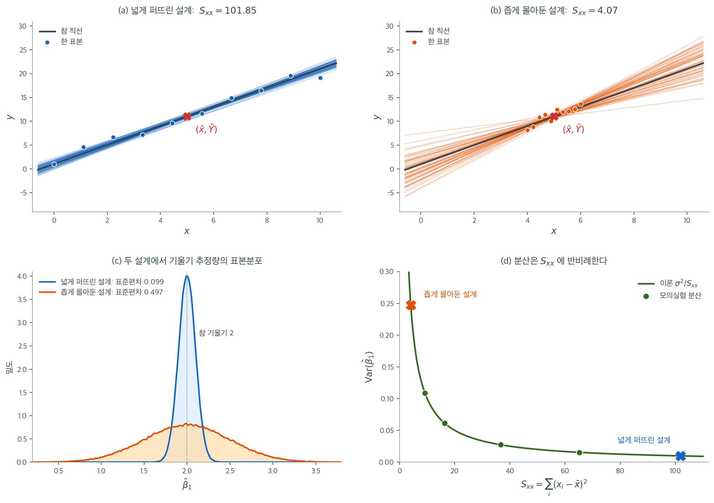

# 표본분포 (단순 최소제곱)

## 개요

일반적인 다중회귀 이론을 전개하기 전에 **단순선형회귀** — 예측변수가 하나인 모형 — 에서 추정량의 표본분포를 유도해 보면 도움이 된다. 단순한 경우를 직접 따라가 보면 오차의 정규성이 어떻게 추정량의 정규성으로 전파되는지, 자유도가 왜 $n - 2$인지, t-통계량이 어떻게 나오는지에 대한 직관이 생긴다. 단순한 경우의 공식은 또한 각 대수적 양(제곱합, 교차곱)의 역할을 행렬 표기가 가릴 수 있는 방식과 달리 투명하게 드러낸다.

---

## 1. 단순선형회귀 모형

모형은

$$
Y_i = \beta_0 + \beta_1 x_i + \varepsilon_i, \quad i = 1, \dots, n
$$

이며, 여기서

- $x_1, \dots, x_n$은 고정된(비확률적) 예측변수 값이며 모두 같지는 않다.
- $\varepsilon_1, \dots, \varepsilon_n$은 독립인 $N(0, \sigma^2)$ 확률변수다.
- $\beta_0$(절편)과 $\beta_1$(기울기)은 미지의 모수다.
- $\sigma^2$은 미지의 오차분산이다.

$\varepsilon_i \sim N(0, \sigma^2)$이고 $x_i$가 고정되어 있으므로 각 반응은 독립적으로 $Y_i \sim N(\beta_0 + \beta_1 x_i, \sigma^2)$이다.

---

## 2. 최소제곱추정량

최소제곱추정량은 $\sum_{i=1}^n (Y_i - \beta_0 - \beta_1 x_i)^2$을 최소화한다. 닫힌 형태의 해는 다음과 같다.

$$
\hat{\beta}_1 = \frac{\sum_{i=1}^n (x_i - \bar{x})(Y_i - \bar{Y})}{\sum_{i=1}^n (x_i - \bar{x})^2} = \frac{S_{xy}}{S_{xx}}
$$

$$
\hat{\beta}_0 = \bar{Y} - \hat{\beta}_1 \bar{x}
$$

여기서 $\bar{x} = \frac{1}{n}\sum_i x_i$, $\bar{Y} = \frac{1}{n}\sum_i Y_i$, $S_{xx} = \sum_i(x_i - \bar{x})^2$, $S_{xy} = \sum_i(x_i - \bar{x})(Y_i - \bar{Y})$이다.

---

## 3. 추정량의 선형성

핵심적인 관찰은 두 추정량이 모두 반응 $Y_1, \dots, Y_n$의 **선형함수**라는 점이다.

기울기의 경우, ($\sum_i(x_i - \bar{x})\bar{Y} = 0$이므로) $S_{xy} = \sum_i(x_i - \bar{x})Y_i$이니

$$
\hat{\beta}_1 = \sum_{i=1}^n c_i Y_i, \quad \text{where } c_i = \frac{x_i - \bar{x}}{S_{xx}}
$$

이다. 가중치 $c_i$는 유용한 두 항등식을 만족한다.

$$
\sum_{i=1}^n c_i = 0, \qquad \sum_{i=1}^n c_i^2 = \frac{1}{S_{xx}}
$$

$\hat{\beta}_1$이 독립인 정규확률변수들의 선형결합이므로 그 자체가 정규분포를 따른다.

---

## 4. 기울기의 표본분포

<div class="thmbox" markdown>

### 정리 1. 기울기 추정량의 분포 { .thm }

정규오차를 갖는 단순선형회귀 모형 아래에서

$$
\hat{\beta}_1 \sim N\!\left(\beta_1,\; \frac{\sigma^2}{S_{xx}}\right)
$$

</div>

??? proof "증명"


    *평균:*

    $$
    E[\hat{\beta}_1] = \sum_i c_i E[Y_i] = \sum_i c_i(\beta_0 + \beta_1 x_i) = \beta_0\sum_i c_i + \beta_1\sum_i c_i x_i
    $$

    $\sum_i c_i = 0$이고 $\sum_i c_i x_i = \sum_i \frac{(x_i - \bar{x})x_i}{S_{xx}} = \frac{S_{xx}}{S_{xx}} = 1$이므로

    $$
    E[\hat{\beta}_1] = \beta_1
    $$

    이다. 따라서 $\hat{\beta}_1$은 **불편**이다.

    *분산:*

    $$
    \operatorname{Var}(\hat{\beta}_1) = \sum_i c_i^2 \operatorname{Var}(Y_i) = \sigma^2 \sum_i c_i^2 = \frac{\sigma^2}{S_{xx}}
    $$

    *정규성:* $\hat{\beta}_1$이 독립인 정규확률변수들의 선형결합이므로 정규분포를 따른다. $\square$

---

## 5. 그림으로 보는 기울기의 분산



위의 두 그림은 같은 $n = 10$, 같은 $\sigma = 1$, 같은 참 직선 $y = 1 + 2x$에서 나온 것이다. **다른 것은 오직 $x_i$를 어디에 놓았느냐뿐이다.** (a)는 $x$를 $[0, 10]$에 고르게 벌려 $S_{xx} = 101.85$이고, (b)는 $[4, 6]$에 몰아 두어 $S_{xx} = 4.07$이다. 각각 60번 표본을 뽑아 적합한 직선을 겹쳐 그렸다. 두 다발 모두 빨간 표시 $(\bar{x}, \bar{Y})$를 지나는데, 이는 정규방정식 $\sum_i e_i = 0$이 강제하는 것이다. 그래서 적합직선의 다발은 그 점을 축으로 도는 부채꼴이 되고, **부채가 벌어진 각도가 곧 기울기의 표준오차다.**

왜 $S_{xx}$가 그 각도를 정하는지는 선형대수로 읽으면 분명하다. $S_{xx} = \lVert \mathbf{x} - \bar{x}\mathbf{1} \rVert^2$은 계획행렬의 둘째 열에서 절편 열 $\mathbf{1}$ 방향을 덜어 내고 남은 길이의 제곱이다. 기울기를 재는 데 쓰이는 것은 $\mathbf{x}$ 전체가 아니라 $\mathbf{1}$에 직교하는 이 성분뿐이고, 가중치 $c_i = (x_i - \bar{x})/S_{xx}$는 바로 그 성분을 제 길이 제곱으로 나눈 것이다. 지렛대가 짧으면 같은 크기의 잡음이 기울기를 훨씬 크게 흔든다.

아래 왼쪽 그림은 두 설계에서 $\hat{\beta}_1$을 $200{,}000$번 뽑아 그린 표본분포다. 넓은 설계의 모의 표준편차는 $0.0990$으로 이론값 $\sigma/\sqrt{S_{xx}} = 0.0991$과 맞고, 좁은 설계는 $0.4969$로 이론값 $0.4954$와 맞는다. $S_{xx}$가 $25$배 차이 나므로 표준편차는 $\sqrt{25} = 5$배 차이가 난다. 두 분포 모두 중심은 참값 $2$에 그대로 있다. 좁은 설계가 망가뜨리는 것은 불편성이 아니라 정밀도다.

아래 오른쪽 그림은 $x = 5 \pm w$의 반폭 $w$를 $1$에서 $5$까지 바꾸며 측정한 분산을 곡선 $\sigma^2/S_{xx}$ 위에 얹은 것이다. $w = 1$에서 모의값 $0.24781$ 대 이론값 $0.24545$, $w = 5$에서 $0.00973$ 대 $0.00982$로 일치한다. 이 곡선이 왼쪽에서 가파르고 오른쪽에서 평평하다는 사실이 실무에서 중요하다. $x$가 이미 넉넉히 퍼져 있으면 더 벌려도 얻는 것이 적지만, $x$가 좁게 몰려 있으면 조금만 벌려도 크게 얻는다. 정밀도를 높이는 길이 표본 크기를 늘리는 것뿐만은 아니라는 뜻이다(다만 무작정 양 끝으로 몰 때의 대가는 연습문제 10에서 따진다).

---

## 6. 절편의 표본분포

<div class="thmbox" markdown>

### 정리 2. 절편 추정량의 분포 { .thm }

같은 모형 아래에서

$$
\hat{\beta}_0 \sim N\!\left(\beta_0,\; \sigma^2\left(\frac{1}{n} + \frac{\bar{x}^2}{S_{xx}}\right)\right)
$$

</div>

??? proof "증명"


    *평균:* $E[\hat{\beta}_0] = E[\bar{Y}] - E[\hat{\beta}_1]\bar{x} = (\beta_0 + \beta_1\bar{x}) - \beta_1\bar{x} = \beta_0$. 불편이다.

    *분산:* $\hat{\beta}_0 = \bar{Y} - \hat{\beta}_1\bar{x}$이고 ($\sum_i c_i = 0$이므로) $\operatorname{Cov}(\bar{Y}, \hat{\beta}_1) = 0$이므로

    $$
    \operatorname{Var}(\hat{\beta}_0) = \operatorname{Var}(\bar{Y}) + \bar{x}^2\operatorname{Var}(\hat{\beta}_1) = \frac{\sigma^2}{n} + \frac{\bar{x}^2\sigma^2}{S_{xx}} = \sigma^2\!\left(\frac{1}{n} + \frac{\bar{x}^2}{S_{xx}}\right)
    $$

    $\square$

---

## 7. 잔차제곱합과 분산의 추정

잔차제곱합은

$$
\text{SSE} = \sum_{i=1}^n (Y_i - \hat{\beta}_0 - \hat{\beta}_1 x_i)^2
$$

이다.

<div class="thmbox" markdown>

### 정리 3. SSE의 분포 { .thm }

정규 단순선형회귀 모형 아래에서

$$
\frac{\text{SSE}}{\sigma^2} \sim \chi^2_{n-2}
$$

이고 SSE는 $(\hat{\beta}_0, \hat{\beta}_1)$과 독립이다.

</div>

??? proof "증명"

    행렬 표기로 옮기는 것이 가장 짧다. $\mathbf{X} = [\mathbf{1}, \mathbf{x}]$($n \times 2$)를 계획행렬이라 하자. $x_i$가 모두 같지는 않다는 가정이 정확히 두 열의 선형독립성이므로 $\mathbf{X}^\top\mathbf{X}$가 가역이고 모자 행렬 $\mathbf{H} = \mathbf{X}(\mathbf{X}^\top\mathbf{X})^{-1}\mathbf{X}^\top$가 정의된다. $\mathbf{M} = \mathbf{I} - \mathbf{H}$로 두면 $\mathbf{M}$은 대칭 멱등이고

    $$
    \operatorname{rank}(\mathbf{M}) = \operatorname{tr}(\mathbf{M}) = n - \operatorname{tr}(\mathbf{H}) = n - 2
    $$

    이다([직교사영행렬](../square_matrices/orthogonal_projection.md) 쪽의 여집합 사영 항목).

    *카이제곱.* 잔차는 $\mathbf{e} = \mathbf{M}\mathbf{Y}$이고, $\mathbf{M}\mathbf{X} = \mathbf{O}$이므로 $\mathbf{Y} = \mathbf{X}\boldsymbol{\beta} + \boldsymbol{\varepsilon}$을 대입하면 $\mathbf{e} = \mathbf{M}\boldsymbol{\varepsilon}$이다. 따라서

    $$
    \text{SSE} = \mathbf{e}^\top\mathbf{e} = \boldsymbol{\varepsilon}^\top\mathbf{M}^\top\mathbf{M}\boldsymbol{\varepsilon} = \boldsymbol{\varepsilon}^\top\mathbf{M}\boldsymbol{\varepsilon}
    $$

    이고($\mathbf{M}$이 대칭 멱등이므로 $\mathbf{M}^\top\mathbf{M} = \mathbf{M}$이다), $\mathbf{z} = \boldsymbol{\varepsilon}/\sigma \sim N(\mathbf{0}, \mathbf{I}_n)$으로 두면 $\text{SSE}/\sigma^2 = \mathbf{z}^\top\mathbf{M}\mathbf{z}$다. [카이제곱분포와 이차형식](./chi_squared_quadratic.md) 쪽의 정리 1에 의해 계수 $n-2$인 대칭 멱등행렬의 이차형식이므로

    $$
    \frac{\text{SSE}}{\sigma^2} \sim \chi^2_{n-2}
    $$

    이다. **대칭성과 멱등성 둘 다 쓰였다는 점에 주의하라.** 멱등이지만 대칭이 아닌 행렬로는 이 결론이 나오지 않는다.

    *독립성.* $\hat{\boldsymbol{\beta}} = (\mathbf{X}^\top\mathbf{X})^{-1}\mathbf{X}^\top\mathbf{Y}$와 $\mathbf{e} = \mathbf{M}\mathbf{Y}$는 같은 정규벡터 $\mathbf{Y}$의 선형변환이므로 결합정규이고

    $$
    \operatorname{Cov}(\hat{\boldsymbol{\beta}}, \mathbf{e}) = (\mathbf{X}^\top\mathbf{X})^{-1}\mathbf{X}^\top(\sigma^2\mathbf{I})\mathbf{M} = \sigma^2(\mathbf{X}^\top\mathbf{X})^{-1}\underbrace{\mathbf{X}^\top\mathbf{M}}_{=\,\mathbf{O}} = \mathbf{O}
    $$

    이다. 결합정규에서 공분산이 0이면 독립이므로 $\hat{\boldsymbol{\beta}}$과 $\mathbf{e}$가 독립이고, $\text{SSE} = \mathbf{e}^\top\mathbf{e}$는 $\mathbf{e}$의 함수이므로 $\text{SSE}$도 $(\hat{\beta}_0, \hat{\beta}_1)$과 독립이다. $\square$

자유도가 $n - 2$인 것은 두 개의 모수($\beta_0$과 $\beta_1$)를 추정했기 때문이다. $\sigma^2$의 불편추정량은

$$
s^2 = \frac{\text{SSE}}{n - 2}
$$

이고 $E[s^2] = \sigma^2$이다. 이는 [5.1절](../../../ch05/foundations/statistics_as_rv.md)에서 $E[S^2] = \sigma^2$을 보인 것과 **같은 구조**다. 5.1절은 모평균 $\mu$ 대신 $\bar{X}$를 쓰느라 제곱합이 $\sigma^2$만큼 줄어 분모가 $n-1$이 된다고 설명했다. 여기서는 모수를 두 개 추정하느라 두 방향을 잃어 분모가 $n-2$가 된다. 절편만 있는 모형이 $p=1$인 경우이고, 그때 $s^2$이 정확히 $S^2$으로 돌아간다.

---

## 8. t-통계량

실무에서는 $\sigma^2$을 모르므로 표준오차에서 이를 $s^2$으로 대체한다. 그러면 정규분포가 t-분포로 바뀐다.

<div class="thmbox" markdown>

### 정리 4. 기울기의 t-분포 { .thm }

통계량

$$
T = \frac{\hat{\beta}_1 - \beta_1}{s / \sqrt{S_{xx}}} \sim t_{n-2}
$$

은 자유도 $n - 2$인 스튜던트 t-분포를 따른다.

</div>

??? proof "증명"

    정리 1에서 $Z = (\hat{\beta}_1 - \beta_1)/(\sigma/\sqrt{S_{xx}}) \sim N(0,1)$이고, 정리 3에서 $V = \text{SSE}/\sigma^2 \sim \chi^2_{n-2}$이며 $Z$와 $V$는 독립이다. 그런데 $s = \sigma\sqrt{V/(n-2)}$이므로

    $$
    T = \frac{\hat{\beta}_1 - \beta_1}{s/\sqrt{S_{xx}}}
    = \frac{(\hat{\beta}_1 - \beta_1)/(\sigma/\sqrt{S_{xx}})}{s/\sigma}
    = \frac{Z}{\sqrt{V/(n-2)}}
    $$

    이고, 이것이 $t_{n-2}$ 분포의 정의다. $\square$

    절편에 대해서도 마찬가지로

    $$
    \frac{\hat{\beta}_0 - \beta_0}{s\sqrt{1/n + \bar{x}^2/S_{xx}}} \sim t_{n-2}
    $$

    이다.

---

## 9. 신뢰구간

t-분포 결과는 곧바로 신뢰구간을 준다.

$\beta_1$에 대한 $100(1 - \alpha)\%$ 신뢰구간은

$$
\hat{\beta}_1 \pm t_{\alpha/2,\,n-2} \cdot \frac{s}{\sqrt{S_{xx}}}
$$

이고, $\beta_0$에 대해서는

$$
\hat{\beta}_0 \pm t_{\alpha/2,\,n-2} \cdot s\sqrt{\frac{1}{n} + \frac{\bar{x}^2}{S_{xx}}}
$$

이다. 여기서 $t_{\alpha/2,\,n-2}$는 $t_{n-2}$ 분포의 상위 $\alpha/2$ 분위수다.

---

## 10. 예

$n = 5$개의 자료점에서 $\bar{x} = 3$, $S_{xx} = 10$, $\hat{\beta}_1 = 2.5$, $\hat{\beta}_0 = 1.0$, $\text{SSE} = 6.0$이라 하자.

- **추정 분산:** $s^2 = 6.0 / 3 = 2.0$이므로 $s = \sqrt{2} \approx 1.414$.
- **기울기의 표준오차:** $\text{SE}(\hat{\beta}_1) = s/\sqrt{S_{xx}} = \sqrt{2}/\sqrt{10} = \sqrt{0.2} \approx 0.447$.
- **$H_0: \beta_1 = 0$에 대한 t-통계량:** $T = 2.5 / 0.447 \approx 5.59$이며 $t_{3}$과 비교한다.
- **기울기의 95% 신뢰구간:** $t_{0.025, 3} = 3.182$를 쓰면 $2.5 \pm 3.182 \times 0.447 \approx 2.5 \pm 1.42 = (1.08, 3.92)$.

---

## 연습문제

<div class="drillbox" markdown>

**연습문제 1.** <span class="diff easy" title="쉬움"></span>
자료점이 $n = 10$개이고 $\bar{x} = 4$, $S_{xx} = 20$, $\hat{\beta}_1 = 3.0$, $\text{SSE} = 16$인 단순선형회귀에서 기울기 $\beta_1$에 대한 95% 신뢰구간을 구성하라.

</div>

??? success "풀이"
    먼저 추정 분산을 계산한다.

    $$
    s^2 = \frac{\text{SSE}}{n - 2} = \frac{16}{8} = 2.0
    $$

    기울기의 표준오차는

    $$
    \text{SE}(\hat{\beta}_1) = \frac{s}{\sqrt{S_{xx}}} = \frac{\sqrt{2}}{\sqrt{20}} = \sqrt{0.1} \approx 0.3162
    $$

    이다. $t_{0.025, 8} = 2.306$을 쓰면 95% 신뢰구간은

    $$
    3.0 \pm 2.306 \times 0.3162 = 3.0 \pm 0.729 = (2.271,\; 3.729)
    $$

    이다.

---

<div class="drillbox" markdown>

**연습문제 2.** <span class="diff easy" title="쉬움"></span>
$\text{SSE}/\sigma^2 \sim \chi^2_{n-2}$의 자유도가 왜 $n$이 아니라 $n - 2$인지 설명하라.

</div>

??? success "풀이"
    잔차제곱합은 ($\sigma^2$으로 나눈 뒤) 모자 행렬 $\mathbf{H}$에 대해 $\text{SSE} = \mathbf{Y}^\top(\mathbf{I} - \mathbf{H})\mathbf{Y}/\sigma^2$로 쓸 수 있다. 행렬 $\mathbf{I} - \mathbf{H}$는 계수가 $n - 2$인 멱등행렬이다(단순회귀에서는 절편과 기울기에 대응하여 $\text{rank}(\mathbf{H}) = 2$이므로).

    멱등행렬의 계수가 결과로 나오는 카이제곱분포의 자유도와 같다. 직관적으로는, $\mathbf{Y}$에 $n$개의 독립적인 정보 조각이 있는 상태에서 출발하지만 두 모수 $\beta_0$과 $\beta_1$을 적합하는 데 자유도 2를 "써버려" $\sigma^2$을 추정할 자유도로 $n - 2$가 남는다.

---

<div class="drillbox" markdown>

**연습문제 3.** <span class="diff easy" title="쉬움"></span>
$\hat{\beta}_1 \sim N(\beta_1, \sigma^2/S_{xx})$를 모의실험으로 확인하라.

</div>

??? success "풀이"
    ```python
    import numpy as np
    from scipy import stats

    rng = np.random.default_rng(1)
    x = np.arange(1., 9.)
    n, b0, b1, sig = len(x), 2., 3., 1.5
    Sxx = ((x - x.mean()) ** 2).sum()

    B = 200_000
    Y = b0 + b1 * x + rng.normal(0, sig, size=(B, n))
    X = np.column_stack([np.ones(n), x])
    beta = Y @ X @ np.linalg.inv(X.T @ X)
    b1_hat = beta[:, 1]

    print(f"평균   모의 {b1_hat.mean():.4f}   이론 {b1:.4f}")
    print(f"분산   모의 {b1_hat.var():.6f}   이론 {sig**2/Sxx:.6f}")

    # 정규성: 표준화한 뒤 분위수를 비교한다
    z = (b1_hat - b1) / np.sqrt(sig**2 / Sxx)
    for q in (0.05, 0.25, 0.5, 0.75, 0.95):
        print(f"  q={q:<5} 모의 {np.quantile(z, q):+.4f}   N(0,1) {stats.norm.ppf(q):+.4f}")
    ```

    출력:

    ```
    평균   모의 2.9992   이론 3.0000
    분산   모의 0.053105   이론 0.053571
      q=0.05  모의 -1.6431   N(0,1) -1.6449
      q=0.25  모의 -0.6756   N(0,1) -0.6745
      q=0.5   모의 -0.0028   N(0,1) +0.0000
      q=0.75  모의 +0.6678   N(0,1) +0.6745
      q=0.95  모의 +1.6347   N(0,1) +1.6449
    ```

    평균과 분산이 이론값과 맞고 분위수도 표준정규와 일치한다.

    **왜 정확히 정규인가.** $\hat{\beta}_1 = \sum_i c_i Y_i$가 독립 정규확률변수의 **선형결합**이기 때문이다. 중심극한정리에 기댄 근사가 아니라 $n$이 작아도 정확히 성립한다. 여기서도 $n = 8$뿐이다. 다만 이는 오차가 정규일 때의 이야기이며, 오차가 정규가 아니면 $\hat{\beta}_1$의 정규성은 $n$이 커질 때의 근사로만 성립한다. $\square$

---

<div class="drillbox" markdown>

**연습문제 4.** <span class="diff med" title="중간"></span>
$c_i = (x_i - \bar{x})/S_{xx}$에 대해 $\hat{\beta}_1 = \sum_{i=1}^n c_i Y_i$임을 증명하고, 이를 이용해 $\operatorname{Var}(\hat{\beta}_1) = \sigma^2 / S_{xx}$을 유도하라.

</div>

??? success "풀이"
    최소제곱 기울기 추정량은

    $$
    \hat{\beta}_1 = \frac{S_{xy}}{S_{xx}} = \frac{\sum_{i=1}^n (x_i - \bar{x})(Y_i - \bar{Y})}{S_{xx}} = \frac{\sum_{i=1}^n (x_i - \bar{x})Y_i}{S_{xx}}
    $$

    이다. 마지막 등호는 $\sum(x_i - \bar{x})\bar{Y} = \bar{Y}\sum(x_i - \bar{x}) = 0$을 쓴 것이다. $c_i = (x_i - \bar{x})/S_{xx}$로 두면 $\hat{\beta}_1 = \sum c_i Y_i$이다.

    $Y_i$가 독립이고 $\operatorname{Var}(Y_i) = \sigma^2$이므로

    $$
    \operatorname{Var}(\hat{\beta}_1) = \sum_{i=1}^n c_i^2 \operatorname{Var}(Y_i) = \sigma^2 \sum_{i=1}^n \frac{(x_i - \bar{x})^2}{S_{xx}^2} = \sigma^2 \cdot \frac{S_{xx}}{S_{xx}^2} = \frac{\sigma^2}{S_{xx}}
    $$

    이다. $\square$

---

<div class="drillbox" markdown>

**연습문제 5.** <span class="diff med" title="중간"></span>
연습문제 4를 절편에 대해 되풀이하라. $d_i = \dfrac{1}{n} - \bar{x}\,c_i$로 두면 $\hat{\beta}_0 = \sum_{i=1}^n d_i Y_i$임을 보이고, 이 가중치로부터 정리 2의 $\operatorname{Var}(\hat{\beta}_0) = \sigma^2\!\left(\dfrac{1}{n} + \dfrac{\bar{x}^2}{S_{xx}}\right)$을 유도하라.

</div>

??? success "풀이"
    $\bar{Y} = \sum_i \frac{1}{n}Y_i$이고 $\hat{\beta}_1 = \sum_i c_i Y_i$이므로

    $$
    \hat{\beta}_0 = \bar{Y} - \hat{\beta}_1\bar{x}
    = \sum_{i=1}^n \frac{1}{n}Y_i - \bar{x}\sum_{i=1}^n c_i Y_i
    = \sum_{i=1}^n \underbrace{\left(\frac{1}{n} - \bar{x}\,c_i\right)}_{d_i} Y_i
    $$

    이다. 절편 추정량도 반응의 선형함수이며, 독립 정규확률변수의 선형결합이므로 정규분포를 따른다.

    가중치 $d_i$는 두 항등식을 만족한다. $\sum_i c_i = 0$에서 $\sum_i d_i = 1$이고, $\sum_i c_i x_i = 1$에서 $\sum_i d_i x_i = \bar{x} - \bar{x} = 0$이다. 이 둘이 곧 불편성이다.

    $$
    E[\hat{\beta}_0] = \sum_i d_i(\beta_0 + \beta_1 x_i) = \beta_0\sum_i d_i + \beta_1 \sum_i d_i x_i = \beta_0
    $$

    분산은 $\sum_i d_i^2$만 계산하면 된다.

    $$
    \sum_{i=1}^n d_i^2
    = \sum_{i=1}^n \left(\frac{1}{n^2} - \frac{2\bar{x}c_i}{n} + \bar{x}^2 c_i^2\right)
    = \frac{1}{n} - \frac{2\bar{x}}{n}\underbrace{\sum_i c_i}_{=\,0} + \bar{x}^2 \underbrace{\sum_i c_i^2}_{=\,1/S_{xx}}
    = \frac{1}{n} + \frac{\bar{x}^2}{S_{xx}}
    $$

    이므로 $\operatorname{Var}(\hat{\beta}_0) = \sigma^2\sum_i d_i^2 = \sigma^2\!\left(\frac{1}{n} + \frac{\bar{x}^2}{S_{xx}}\right)$이다. 교차항이 $\sum_i c_i = 0$ 때문에 사라진 것이 정리 2의 증명에서 $\operatorname{Cov}(\bar{Y}, \hat{\beta}_1) = 0$을 쓴 것과 같은 사실임에 주의하라.

    ```python
    import numpy as np

    rng = np.random.default_rng(4)
    x = np.arange(1., 9.)
    n, b0, b1, sig = len(x), 2., 3., 1.5
    Sxx = ((x - x.mean()) ** 2).sum()

    c = (x - x.mean()) / Sxx
    d = 1. / n - x.mean() * c
    print("sum d_i = 1 인가    :", np.isclose(d.sum(), 1.0))
    print("sum d_i x_i = 0 인가:", np.isclose((d * x).sum(), 0.0))

    X = np.column_stack([np.ones(n), x])
    Y = b0 + b1 * x + rng.normal(0, sig, size=(200_000, n))
    beta = Y @ X @ np.linalg.inv(X.T @ X)

    print("가중치 d 로 계산한 값이 최소제곱해와 같은가:", np.allclose(Y @ d, beta[:, 0]))
    print(f"E[b0]    모의 {beta[:, 0].mean():.4f}     이론 {b0:.4f}")
    print(f"Var(b0)  모의 {beta[:, 0].var():.6f}   이론 {sig**2 * (1/n + x.mean()**2/Sxx):.6f}")
    ```

    출력:

    ```
    sum d_i = 1 인가    : True
    sum d_i x_i = 0 인가: True
    가중치 d 로 계산한 값이 최소제곱해와 같은가: True
    E[b0]    모의 2.0030     이론 2.0000
    Var(b0)  모의 1.356516   이론 1.366071
    ```

    $\bar{x} = 4.5$, $S_{xx} = 42$인 이 설계에서 절편의 분산은 $1.366$인데 기울기의 분산은 $0.054$에 불과하다. $\bar{x}^2/S_{xx} = 0.482$가 $1/n = 0.125$를 압도하기 때문이다. **$x$가 원점에서 멀면 절편은 자료로부터 멀리 외삽한 값이 되고, 그 대가가 이 항에 그대로 나타난다.** $\square$

---

<div class="drillbox" markdown>

**연습문제 6.** <span class="diff med" title="중간"></span>
$\operatorname{Cov}(\hat{\beta}_0, \hat{\beta}_1) = -\dfrac{\sigma^2 \bar{x}}{S_{xx}}$임을 보여라. 두 추정량이 무상관이 되는 조건은 무엇인가?

</div>

??? success "풀이"
    $\hat{\beta}_0 = \bar{Y} - \hat{\beta}_1\bar{x}$이고 본문에서 $\operatorname{Cov}(\bar{Y}, \hat{\beta}_1) = 0$임을 보였으므로

    $$
    \operatorname{Cov}(\hat{\beta}_0, \hat{\beta}_1)
    = \operatorname{Cov}(\bar{Y} - \hat{\beta}_1\bar{x},\; \hat{\beta}_1)
    = \underbrace{\operatorname{Cov}(\bar{Y}, \hat{\beta}_1)}_{=\,0} - \bar{x}\operatorname{Var}(\hat{\beta}_1)
    = -\frac{\sigma^2\bar{x}}{S_{xx}}
    $$

    이다. 따라서 **무상관일 필요충분조건은 $\bar{x} = 0$**, 곧 예측변수가 중심화되어 있는 것이다.

    **직관.** $\bar{x} > 0$이면 자료가 원점 오른쪽에 몰려 있다. 회귀직선은 $(\bar{x}, \bar{Y})$를 반드시 지나므로, 기울기를 조금 키우면 그 지렛대 효과로 절편이 내려간다. 음의 상관이 생기는 이유다.

    ```python
    import numpy as np

    rng = np.random.default_rng(0)
    x = np.arange(1., 9.)
    n, b0, b1, sig = len(x), 2., 3., 1.5
    Sxx = ((x - x.mean()) ** 2).sum()

    X = np.column_stack([np.ones(n), x])
    XtXi = np.linalg.inv(X.T @ X)
    Y = b0 + b1 * x + rng.normal(0, sig, size=(200_000, n))
    beta = Y @ X @ XtXi

    print("Cov 모의실험:", round(np.cov(beta.T)[0, 1], 6))
    print("Cov 이론값  :", round(-sig**2 * x.mean() / Sxx, 6))

    xc = x - x.mean()                      # 중심화하면
    Xc = np.column_stack([np.ones(n), xc])
    beta_c = (b0 + b1 * x + rng.normal(0, sig, size=(200_000, n))) @ Xc @ np.linalg.inv(Xc.T @ Xc)
    print("중심화 후 Cov:", round(np.cov(beta_c.T)[0, 1], 6))
    ```

    출력:

    ```
    Cov 모의실험: -0.241028
    Cov 이론값  : -0.241071
    중심화 후 Cov: 0.000156
    ```

    중심화하면 공분산이 0에 가까워진다. **예측변수를 중심화하는 실무 관행의 한 가지 근거**가 이것이다. 절편과 기울기의 추정이 서로 얽히지 않는다. $\square$

---

<div class="drillbox" markdown>

**연습문제 7.** <span class="diff med" title="중간"></span>
$x = x_0$에서의 평균반응 추정량 $\hat{\mu}_0 = \hat{\beta}_0 + \hat{\beta}_1 x_0$의 분산이

$$
\operatorname{Var}(\hat{\mu}_0) = \sigma^2\left(\frac{1}{n} + \frac{(x_0 - \bar{x})^2}{S_{xx}}\right)
$$

임을 보여라. 이 분산은 어디서 최소가 되는가?

</div>

??? success "풀이"
    $\hat{\mu}_0 = \bar{Y} + \hat{\beta}_1(x_0 - \bar{x})$로 다시 쓰는 것이 요령이다($\hat{\beta}_0 = \bar{Y} - \hat{\beta}_1\bar{x}$를 대입하면 된다). $\bar{Y}$와 $\hat{\beta}_1$이 무상관이므로

    $$
    \operatorname{Var}(\hat{\mu}_0) = \operatorname{Var}(\bar{Y}) + (x_0-\bar{x})^2\operatorname{Var}(\hat{\beta}_1)
    = \frac{\sigma^2}{n} + \frac{\sigma^2 (x_0-\bar{x})^2}{S_{xx}}
    $$

    이다.

    분산은 $(x_0 - \bar{x})^2$에 대해 증가하므로 **$x_0 = \bar{x}$에서 최소**이고 그 값은 $\sigma^2/n$이다. 자료의 중심에서 멀어질수록 추정이 부정확해지며, 그 증가는 이차식이다. 신뢰띠가 가운데가 잘록한 나비 모양이 되는 이유다.

    **예측구간과의 차이.** 새 관측값 $Y_0$ 자체를 예측할 때는 오차항 $\varepsilon_0$의 변동이 더해진다.

    $$
    \operatorname{Var}(Y_0 - \hat{\mu}_0) = \sigma^2\left(1 + \frac{1}{n} + \frac{(x_0-\bar{x})^2}{S_{xx}}\right)
    $$

    괄호 안의 $1$이 결정적이다. $n \to \infty$이면 신뢰구간의 폭은 0으로 가지만 예측구간의 폭은 $2z_{\alpha/2}\sigma$로 남는다. **자료를 아무리 모아도 개별 관측의 무작위성은 사라지지 않는다.** $\square$

---

<div class="drillbox" markdown>

**연습문제 8.** <span class="diff med" title="중간"></span>
잔차가 만족하는 두 제약 $\sum_i e_i = 0$과 $\sum_i x_i e_i = 0$을 유도하고, 이것이 자유도가 $n - 2$인 이유와 어떻게 연결되는지 설명하라.

</div>

??? success "풀이"
    두 제약은 최소제곱의 **정규방정식** 그 자체다. $\sum_i (Y_i - \beta_0 - \beta_1 x_i)^2$을 $\beta_0$과 $\beta_1$로 각각 편미분해 0으로 두면

    $$
    -2\sum_i (Y_i - \hat{\beta}_0 - \hat{\beta}_1 x_i) = 0
    \;\Longrightarrow\; \sum_i e_i = 0
    $$

    $$
    -2\sum_i x_i(Y_i - \hat{\beta}_0 - \hat{\beta}_1 x_i) = 0
    \;\Longrightarrow\; \sum_i x_i e_i = 0
    $$

    를 얻는다.

    ```python
    import numpy as np

    rng = np.random.default_rng(2)
    x = np.arange(1., 9.)
    y = 2. + 3. * x + rng.normal(0, 1.5, size=len(x))

    X = np.column_stack([np.ones(len(x)), x])
    beta = np.linalg.lstsq(X, y, rcond=None)[0]
    e = y - X @ beta

    print("sum e_i    =", round(e.sum(), 12))
    print("sum x_i e_i =", round((x * e).sum(), 12))
    print("잔차 개수 =", len(e), " 자유로운 성분 =", len(e) - 2)
    ```

    출력:

    ```
    sum e_i    = 0.0
    sum x_i e_i = 0.0
    잔차 개수 = 8  자유로운 성분 = 6
    ```

    **기하적 의미.** 잔차벡터 $\mathbf{e}$는 $\mathbf{1}$과 $\mathbf{x}$ 둘 다에 직교한다. 곧 $n$차원 공간에서 두 방향이 막힌 $(n-2)$차원 부분공간에 놓인다. 잔차가 $n$개 있어도 자유롭게 움직일 수 있는 것은 $n-2$개뿐이며, 그래서 $s^2 = \text{SSE}/(n-2)$가 불편추정량이 된다.

    예측변수가 $p$개인 다중회귀에서는 제약이 $p$개(절편 포함)가 되어 자유도가 $n - p$다. $\operatorname{tr}(\mathbf{I} - \mathbf{H}) = n - p$가 같은 사실의 행렬 표현이다. $\square$

---

<div class="drillbox" markdown>

**연습문제 9.** <span class="diff med" title="중간"></span>
$(n-2)s^2/\sigma^2 \sim \chi^2_{n-2}$이고 이것이 $\hat{\beta}_1$과 독립임을 모의실험으로 확인하라. 이 두 사실이 왜 t-통계량에 필요한가?

</div>

??? success "풀이"
    ```python
    import numpy as np

    rng = np.random.default_rng(3)
    x = np.arange(1., 9.)
    n, b0, b1, sig = len(x), 2., 3., 1.5

    B = 200_000
    X = np.column_stack([np.ones(n), x])
    Y = b0 + b1 * x + rng.normal(0, sig, size=(B, n))
    beta = Y @ X @ np.linalg.inv(X.T @ X)
    sse = ((Y - beta @ X.T) ** 2).sum(axis=1)
    s2 = sse / (n - 2)

    print(f"E[s^2]  모의 {s2.mean():.4f}    sigma^2 = {sig**2:.4f}")
    print(f"Var((n-2)s^2/sig^2) 모의 {(sse/sig**2).var():.4f}   chi2_{n-2} 이론 {2*(n-2)}")
    print(f"corr(beta1_hat, s^2) = {np.corrcoef(beta[:,1], s2)[0,1]:+.5f}  (독립이면 0)")
    ```

    출력:

    ```
    E[s^2]  모의 2.2488    sigma^2 = 2.2500
    Var((n-2)s^2/sig^2) 모의 11.9591   chi2_6 이론 12
    corr(beta1_hat, s^2) = -0.00447  (독립이면 0)
    ```

    $s^2$은 불편이고, $(n-2)s^2/\sigma^2$의 분산이 $\chi^2_{6}$의 분산 $12$와 맞으며, $\hat{\beta}_1$과의 상관이 사실상 0이다.

    **왜 필요한가.** t-통계량은

    $$
    t = \frac{\hat{\beta}_1 - \beta_1}{s/\sqrt{S_{xx}}}
    = \frac{(\hat{\beta}_1 - \beta_1)/(\sigma/\sqrt{S_{xx}})}{\sqrt{\dfrac{(n-2)s^2/\sigma^2}{n-2}}}
    = \frac{Z}{\sqrt{V/(n-2)}}
    $$

    의 꼴이다. $t$ 분포의 정의는 **표준정규 $Z$와 카이제곱 $V$가 독립**일 것을 요구한다. 위 모의실험이 확인한 두 가지가 정확히 그 조건이다. 독립성이 없으면 이 비는 $t$ 분포를 따르지 않는다.

    독립성은 기하에서 나온다. $\hat{\boldsymbol{\beta}}$은 $\operatorname{col}(\mathbf{X})$ 안의 사영으로 결정되고 $s^2$은 그 직교여공간의 잔차로 결정되는데, 정규분포에서 직교하는 성분은 독립이기 때문이다.

    **같은 이야기를 이미 한 번 했다.** [4.2절 정규분포](../../../ch04/continuous_distributions/normal.md)의 연습문제 28에서 $\bar{X}$와 $S^2$의 독립성을 증명할 때, 첫 행이 $\mathbf{1}/\sqrt{n}$인 직교행렬 $\mathbf{Q}$로 회전시켜 $\bar{X}$는 $Y_1$만의 함수, $S^2$은 $Y_2, \dots, Y_n$만의 함수임을 보였다. 그 $Y_1$ 방향이 여기서는 $\operatorname{col}(\mathbf{X})$이고 나머지 $n-1$개 방향이 그 직교여공간이다. 절편만 있는 모형이 정확히 그 경우이며, 설명변수를 넣으면 $\operatorname{col}(\mathbf{X})$의 차원이 1에서 2로 늘어나 잔차 쪽이 $n-1$에서 $n-2$로 줄어든다. **직교변환으로 쓰던 논법을 사영의 언어로 옮겨 적은 것이 전부다.** $\square$

---

<div class="drillbox" markdown>

**연습문제 10.** <span class="diff hard" title="어려움"></span>
$\operatorname{Var}(\hat{\beta}_1) = \sigma^2/S_{xx}$이므로 $x$를 넓게 퍼뜨릴수록 기울기를 정밀하게 추정한다. 예산이 $n = 10$으로 고정되어 있고 $x \in [0, 10]$에서 고를 수 있다면 어떻게 배치해야 하는가? 그 설계의 위험은 무엇인가?

</div>

??? success "풀이"
    $S_{xx} = \sum_i (x_i - \bar{x})^2$을 최대화하려면 자료를 양 끝으로 몰아야 한다. $x = 0$에 5개, $x = 10$에 5개를 두면 $S_{xx} = 10 \times 5^2 = 250$으로 최댓값이다.

    ```python
    import numpy as np

    designs = {
        "양 끝에 몰기": np.array([0.]*5 + [10.]*5),
        "균등 배치   ": np.linspace(0, 10, 10),
        "가운데 몰기 ": np.array([4., 4.5, 4.5, 5., 5., 5., 5., 5.5, 5.5, 6.]),
    }
    for name, x in designs.items():
        Sxx = ((x - x.mean()) ** 2).sum()
        print(f"{name}: Sxx = {Sxx:7.2f},  Var(b1) = sigma^2 / {Sxx:.2f}")
    ```

    출력:

    ```
    양 끝에 몰기: Sxx =  250.00,  Var(b1) = sigma^2 / 250.00
    균등 배치   : Sxx =  101.85,  Var(b1) = sigma^2 / 101.85
    가운데 몰기 : Sxx =    3.00,  Var(b1) = sigma^2 / 3.00
    ```

    양 끝 설계의 $S_{xx} = 250$은 균등 배치의 $101.85$보다 약 2.5배 크다. 기울기의 분산은 그만큼 줄어든다.

    **그런데 이 설계는 위험하다.** 가운데에 자료가 하나도 없으므로 **직선성 가정을 검증할 수 없다.** 참 관계가 곡선이어도 두 점만으로는 언제나 완벽한 직선이 그려진다. 곡률을 탐지할 힘이 0이다.

    실무의 절충은 이렇다.

    - 직선 모형을 **확신**할 수 있다면(물리 법칙 등) 양 끝 설계가 효율적이다.
    - 모형을 **검증해야** 한다면 가운데에도 점을 남긴다. 예컨대 양 끝에 40%씩, 가운데에 20%를 배치한다.

    이것이 실험계획의 기본 긴장이다. **추정의 효율과 모형 검증 능력은 맞바꾸는 관계다.** $\square$

---

## 정리하며

정규오차를 갖는 단순선형회귀에서 기울기 추정량 $\hat{\beta}_1$과 절편 추정량 $\hat{\beta}_0$은 참 모수를 평균으로 하는(즉 불편인) 정규분포를 따르며, 그 분산은 $\sigma^2$과 예측변수 값의 퍼짐 $S_{xx}$에 달려 있다. 잔차제곱합 $\text{SSE}/\sigma^2$은 $\chi^2_{n-2}$ 분포를 따르고 추정량들과 독립이다. 표준화된 추정량에서 $\sigma$를 $s = \sqrt{\text{SSE}/(n-2)}$로 바꾸면 자유도 $n - 2$인 t-통계량이 나오며, 이것이 가설검정과 신뢰구간의 토대가 된다.
