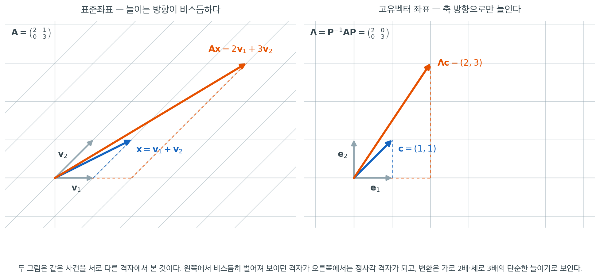

# 대각화 가능 행렬의 대각형

행렬에 적용할 수 있는 모든 닮음변환 가운데 가장 유용한 결과는 대각행렬이다. 대각화 가능한 행렬은 $\mathbf{A} = \mathbf{P}\boldsymbol{\Lambda}\mathbf{P}^{-1}$로 분해되며, 이 덕분에 거듭제곱, 지수함수, 이차형식의 계산이 간단해진다. 통계에서 공분산행렬은 대칭이므로 언제나 대각화 가능하고, 그 대각형이 주성분을 드러낸다. 이 쪽에서는 대각화 가능성을 정의하고 정확한 판정 정리를 증명한 뒤 계산 방법을 보인다.

<div class="defn" markdown>

### 정의 1. 대각화 가능 행렬 { .dfn }

정사각행렬 $\mathbf{A} \in \mathbb{R}^{n \times n}$이 대각행렬과 닮았으면 **대각화 가능(diagonalizable)** 하다고 한다. 즉 가역행렬 $\mathbf{P} \in \mathbb{R}^{n \times n}$과 대각행렬 $\boldsymbol{\Lambda} = \operatorname{diag}(\lambda_1, \dots, \lambda_n)$이 존재하여

$$
\mathbf{A} = \mathbf{P}\boldsymbol{\Lambda}\mathbf{P}^{-1}
$$

이 성립한다는 뜻이다. 동등하게 $\boldsymbol{\Lambda} = \mathbf{P}^{-1}\mathbf{A}\mathbf{P}$이다.

</div>

$\mathbf{P}$의 열은 $\mathbf{A}$의 고유벡터이고, $\boldsymbol{\Lambda}$의 대각 성분은 그에 대응하는 고윳값이다. $\mathbf{P} = (\mathbf{v}_1 \mid \mathbf{v}_2 \mid \cdots \mid \mathbf{v}_n)$으로 쓰면 분해 $\mathbf{A}\mathbf{P} = \mathbf{P}\boldsymbol{\Lambda}$는 각 $i$에 대해 $\mathbf{A}\mathbf{v}_i = \lambda_i \mathbf{v}_i$인 것과 동등하다.

## 언제 행렬이 대각화 가능한가

<div class="thmbox" markdown>

### 정리 1. 대각화 가능성의 판정 { .thm }

행렬 $\mathbf{A} \in \mathbb{R}^{n \times n}$이 (실수 위에서) 대각화 가능할 필요충분조건은 $\mathbb{R}^n$의 기저를 이루는 고유벡터 $n$개를 갖는 것, 곧 일차독립인 실수 고유벡터를 $n$개 갖는 것이다.

</div>

??? proof "증명"

    $(\Leftarrow)$ $\mathbf{A}$가 일차독립인 고유벡터 $\mathbf{v}_1, \dots, \mathbf{v}_n$을 가지면 이들을 $\mathbf{P}$의 열로 놓는다. 그러면 $\mathbf{P}$는 (열들이 일차독립이므로) 가역이고, 고윳값 관계에 의해

    $$
    \mathbf{A}\mathbf{P} = \mathbf{A}(\mathbf{v}_1 \mid \cdots \mid \mathbf{v}_n) = (\lambda_1\mathbf{v}_1 \mid \cdots \mid \lambda_n\mathbf{v}_n) = \mathbf{P}\boldsymbol{\Lambda}
    $$

    이다. 양변 왼쪽에 $\mathbf{P}^{-1}$을 곱하면 $\boldsymbol{\Lambda} = \mathbf{P}^{-1}\mathbf{A}\mathbf{P}$를 얻는다.

    $(\Rightarrow)$ $\mathbf{A} = \mathbf{P}\boldsymbol{\Lambda}\mathbf{P}^{-1}$이면 $\mathbf{A}\mathbf{P} = \mathbf{P}\boldsymbol{\Lambda}$이므로 $\mathbf{P}$의 제 $i$ 열 $\mathbf{p}_i$는 $\mathbf{A}\mathbf{p}_i = \lambda_i\mathbf{p}_i$를 만족한다. $\mathbf{P}$가 가역이므로 $\mathbf{p}_i \neq \mathbf{0}$이고(따라서 고유벡터가 맞다) 이 $n$개의 열은 일차독립이다. $\square$

!!! warning "실수 대각화와 복소수 대각화는 다르다"
    정의 1 은 $\mathbf{P}$를 **실**가역행렬로 제한했다. 이 제한을 놓치면 정리 1 이 거짓이 된다. 회전행렬

    $$
    \mathbf{R} = \begin{pmatrix} 0 & -1 \\ 1 & 0 \end{pmatrix}
    $$

    을 보자. 특성다항식은 $\lambda^2 + 1$이라 실수 근이 없다. 실수 고유벡터가 하나도 없으므로 $\mathbf{R}$는 실수 위에서 대각화 가능하지 않다. 기하적으로도 당연하다. $90^\circ$ 회전은 어떤 방향도 제자리에 두지 않는다.

    그런데 $\mathbb{C}$ 위에서는 고윳값이 $\pm i$로 서로 다르고 고유벡터 $(1, \mp i)^\top$가 $\mathbb{C}^2$의 기저를 이루므로 $\mathbf{R}$는 **복소수 위에서 대각화 가능하다.** 이 책에서 "대각화 가능"이라고만 쓰면 실수 위에서를 뜻하며, 복소수를 허용할 때는 그렇다고 밝힌다. 다행히 통계에 나오는 행렬은 거의 다 실대칭이라 이 구분이 문제되지 않는다.

### 필요충분조건 — 중복도

정리 1 은 쓸모가 있지만 고유벡터를 다 구해 봐야 판정이 되는 형태다. 특성다항식만 보고 판정하는 형태로 바꿔 쓸 수 있다.

<div class="defn" markdown>

### 정의 2. 대수적 중복도와 기하적 중복도 { .dfn }

$\mathbf{A}$의 고윳값 $\lambda_0$에 대해

- **대수적 중복도** $m_a(\lambda_0)$는 특성다항식에서 인수 $(\lambda - \lambda_0)$가 나타나는 차수다.
- **기하적 중복도** $m_g(\lambda_0)$는 고유공간의 차원 $\dim\ker(\mathbf{A} - \lambda_0\mathbf{I})$다.

</div>

판정 정리를 세우는 데 보조 결과 두 개가 필요하다.

<div class="thmbox" markdown>

### 보조정리 1. 서로 다른 고윳값의 고유벡터는 일차독립 { .thm }

$\lambda_1, \dots, \lambda_r$이 $\mathbf{A}$의 서로 다른 고윳값이고 각 $i$에 대해 $\mathbf{w}_i \in \ker(\mathbf{A} - \lambda_i\mathbf{I})$라 하자. 그러면

$$
\mathbf{w}_1 + \cdots + \mathbf{w}_r = \mathbf{0} \ \Longrightarrow\ \mathbf{w}_1 = \cdots = \mathbf{w}_r = \mathbf{0}
$$

이다. 따라서 고유공간들의 합은 직합이고, 각 고유공간에서 기저를 뽑아 모두 합치면 일차독립인 벡터 $\sum_{i=1}^r m_g(\lambda_i)$개를 얻는다.

</div>

??? proof "증명"

    $r$에 대한 귀납법을 쓴다. $r = 1$이면 자명하다.

    $r - 1$개까지 성립한다고 하고 $\mathbf{w}_1 + \cdots + \mathbf{w}_r = \mathbf{0}$이라 하자. 양변에 $\mathbf{A} - \lambda_r\mathbf{I}$를 곱하면 $(\mathbf{A} - \lambda_r\mathbf{I})\mathbf{w}_r = \mathbf{0}$이라 마지막 항이 사라지고, $i < r$에 대해서는 $(\mathbf{A} - \lambda_r\mathbf{I})\mathbf{w}_i = (\lambda_i - \lambda_r)\mathbf{w}_i$이므로

    $$
    \sum_{i=1}^{r-1} (\lambda_i - \lambda_r)\mathbf{w}_i = \mathbf{0}
    $$

    이 남는다. 각 항 $(\lambda_i - \lambda_r)\mathbf{w}_i$는 여전히 $\ker(\mathbf{A} - \lambda_i\mathbf{I})$에 들어 있으므로 귀납가정을 적용하면 $(\lambda_i - \lambda_r)\mathbf{w}_i = \mathbf{0}$이고, $\lambda_i \neq \lambda_r$이므로 $i < r$에 대해 $\mathbf{w}_i = \mathbf{0}$이다. 처음 식에 넣으면 $\mathbf{w}_r = \mathbf{0}$이다.

    뒤쪽 주장: 각 고유공간 $\ker(\mathbf{A} - \lambda_i\mathbf{I})$에서 기저를 뽑아 모은 벡터들의 일차결합이 $\mathbf{0}$이면, 같은 고유공간에서 온 항끼리 묶은 부분합 $\mathbf{w}_i$들이 $\sum_i \mathbf{w}_i = \mathbf{0}$을 만족한다. 방금 보인 것에 의해 모든 $\mathbf{w}_i = \mathbf{0}$이고, 각 $i$의 기저가 일차독립이므로 계수가 모두 0 이다. $\square$

<div class="thmbox" markdown>

### 보조정리 2. 중복도 부등식 { .thm }

$\mathbf{A}$의 모든 고윳값 $\lambda_0$에 대해 $1 \le m_g(\lambda_0) \le m_a(\lambda_0)$이다.

</div>

??? proof "증명"

    $\lambda_0$가 고윳값이면 $\mathbf{A} - \lambda_0\mathbf{I}$가 특이행렬이므로 영공간이 자명하지 않아 $m_g \ge 1$이다.

    $m_g = g$라 하고 고유공간의 기저 $\mathbf{v}_1, \dots, \mathbf{v}_g$를 잡아 전체 공간의 기저로 확장한 뒤 그 기저벡터들을 열로 쌓아 가역행렬 $\mathbf{S}$를 만든다. $\mathbf{A}\mathbf{v}_j = \lambda_0\mathbf{v}_j$이므로 $\mathbf{S}^{-1}\mathbf{A}\mathbf{S}$의 처음 $g$개 열은 $\lambda_0\mathbf{e}_j$가 되고, 따라서

    $$
    \mathbf{S}^{-1}\mathbf{A}\mathbf{S} = \begin{pmatrix} \lambda_0\mathbf{I}_g & \mathbf{C} \\ \mathbf{O} & \mathbf{D} \end{pmatrix}
    $$

    꼴의 블록상삼각행렬이 된다. 블록상삼각행렬의 행렬식은 대각 블록의 행렬식의 곱이므로

    $$
    \det(\mathbf{S}^{-1}\mathbf{A}\mathbf{S} - \lambda\mathbf{I}) = (\lambda_0 - \lambda)^g \det(\mathbf{D} - \lambda\mathbf{I}_{n-g})
    $$

    이다. 닮음은 특성다항식을 보존하므로(앞 쪽 "닮은 행렬" 정리 1) 이것이 $\mathbf{A}$의 특성다항식이고, 여기에 인수 $(\lambda - \lambda_0)$가 적어도 $g$번 들어 있다. 곧 $m_a \ge g = m_g$다. $\square$

<div class="thmbox" markdown>

### 정리 2. 중복도에 의한 판정 { .thm }

$\mathbf{A} \in \mathbb{R}^{n \times n}$이 (실수 위에서) 대각화 가능할 필요충분조건은 다음 두 가지가 모두 성립하는 것이다.

1. 특성다항식이 $\mathbb{R}$ 위에서 완전히 인수분해된다(모든 고윳값이 실수다).
2. **모든** 고윳값 $\lambda_0$에서 $m_g(\lambda_0) = m_a(\lambda_0)$이다.

복소수 위에서 대각화할 때는 1번이 대수학의 기본정리로 자동 성립하므로 2번만 조건으로 남는다.

</div>

??? proof "증명"

    서로 다른 고윳값을 $\lambda_1, \dots, \lambda_r$이라 하자. 보조정리 1 에 의해 $\mathbf{A}$의 일차독립인 고유벡터의 최대 개수는 정확히 $\sum_{i=1}^r m_g(\lambda_i)$다. 한편 특성다항식의 차수가 $n$이므로 언제나 $\sum_{i=1}^r m_a(\lambda_i) \le n$이고, 등호는 1번이 성립할 때다.

    $(\Leftarrow)$ 1번에서 $\sum_i m_a(\lambda_i) = n$이고 2번에서 $\sum_i m_g(\lambda_i) = \sum_i m_a(\lambda_i) = n$이므로, 일차독립인 실수 고유벡터가 $n$개 있다. 정리 1 에 의해 대각화 가능하다.

    $(\Rightarrow)$ 대각화 가능하면 $\boldsymbol{\Lambda} = \mathbf{P}^{-1}\mathbf{A}\mathbf{P}$가 실대각행렬이고 닮음이 특성다항식을 보존하므로 $\det(\mathbf{A} - \lambda\mathbf{I}) = \prod_{j=1}^n (\lambda_j - \lambda)$가 실수 일차식의 곱으로 쪼개져 1번이 성립한다. 또 정리 1 에 의해 일차독립인 고유벡터가 $n$개이므로 $\sum_i m_g(\lambda_i) = n = \sum_i m_a(\lambda_i)$이다. 보조정리 2 에서 항마다 $m_g(\lambda_i) \le m_a(\lambda_i)$인데 합이 같으므로 항마다 등호여야 한다. $\square$

### 충분조건

정리 2 가 정확한 판정이지만, 실제로는 다음 두 충분조건만으로 끝나는 경우가 많다.

- **서로 다른 실수 고윳값.** $\mathbf{A}$가 서로 다른 **실수** 고윳값을 $n$개 가지면 각 고윳값의 두 중복도가 모두 1 이므로 정리 2 의 두 조건이 성립한다. 대응하는 고유벡터들은 보조정리 1 에 의해 일차독립이다.
- **대칭행렬.** 모든 실대칭행렬은 대각화 가능하다(스펙트럼 정리). 나아가 고유벡터를 정규직교로 고를 수 있으므로 $\mathbf{P}$가 직교행렬이 된다.

!!! danger "충분조건일 뿐 필요조건이 아니다"
    "고윳값이 서로 다르다"는 조건은 한쪽 방향으로만 쓸 수 있다. 항등행렬 $\mathbf{I}_n$은 고윳값이 $\lambda = 1$ 하나뿐이지만(대수적 중복도 $n$) 이미 대각행렬이므로 당연히 대각화 가능하다. 더 일반적으로 모든 실대칭행렬이 고윳값을 겹쳐 가지면서도 대각화 가능하다. 통계에 나오는 행렬 가운데 고윳값이 겹치는 경우가 오히려 흔하다는 점을 기억해 두면 좋다. 모자 행렬 $\mathbf{H}$의 고윳값은 0 과 1 두 개뿐이다.

    반대로, 고윳값이 겹치면 대각화가 **깨질 수 있을 뿐** 반드시 깨지는 것도 아니다. 실제 판정은 언제나 정리 2 의 2번, 곧 겹친 고윳값에서 기하적 중복도가 대수적 중복도를 따라오는지를 보는 것이다.

## 거듭제곱과 지수

이제 $\mathbf{A} = \mathbf{P}\boldsymbol{\Lambda}\mathbf{P}^{-1}$로 대각화 가능하다고 하자. 대각형은 행렬의 거듭제곱을 극적으로 단순화한다.

$$
\mathbf{A}^k = \mathbf{P}\boldsymbol{\Lambda}^k\mathbf{P}^{-1} = \mathbf{P}\operatorname{diag}(\lambda_1^k, \dots, \lambda_n^k)\mathbf{P}^{-1}
$$

마찬가지로 행렬 지수는

$$
e^{\mathbf{A}} = \mathbf{P}\operatorname{diag}(e^{\lambda_1}, \dots, e^{\lambda_n})\mathbf{P}^{-1}
$$

이다. 더 일반적으로, 고윳값들 위에서 정의된 임의의 함수 $f$에 대해

$$
f(\mathbf{A}) = \mathbf{P}\operatorname{diag}\!\bigl(f(\lambda_1), \dots, f(\lambda_n)\bigr)\mathbf{P}^{-1}
$$

이다.

## 예 — 대각화 가능한 행렬

다음을 생각하자.

$$
\mathbf{A} = \begin{pmatrix} 2 & 1 \\ 0 & 3 \end{pmatrix}
$$

특성다항식은 $\det(\mathbf{A} - \lambda\mathbf{I}) = (2 - \lambda)(3 - \lambda) = 0$이므로 서로 다른 고윳값 $\lambda_1 = 2$와 $\lambda_2 = 3$을 얻는다.

$\lambda_1 = 2$에 대해: $(\mathbf{A} - 2\mathbf{I})\mathbf{v} = \mathbf{0}$에서 $\mathbf{v}_1 = (1, 0)^\top$.

$\lambda_2 = 3$에 대해: $(\mathbf{A} - 3\mathbf{I})\mathbf{v} = \mathbf{0}$에서 $\mathbf{v}_2 = (1, 1)^\top$.

$\mathbf{P} = \begin{pmatrix} 1 & 1 \\ 0 & 1 \end{pmatrix}$, $\mathbf{P}^{-1} = \begin{pmatrix} 1 & -1 \\ 0 & 1 \end{pmatrix}$로 두면

$$
\mathbf{P}^{-1}\mathbf{A}\mathbf{P} = \begin{pmatrix} 2 & 0 \\ 0 & 3 \end{pmatrix} = \boldsymbol{\Lambda}
$$

임을 확인할 수 있다.

이 분해를 쓰면 $\mathbf{A}^{10} = \mathbf{P}\operatorname{diag}(2^{10}, 3^{10})\mathbf{P}^{-1} = \mathbf{P}\operatorname{diag}(1024, 59049)\mathbf{P}^{-1}$이다.

### 그림으로 보기

대각화란 행렬을 고쳐 쓰는 일이 아니라 **좌표를 갈아 끼우는 일**이다. 위의 $\mathbf{A}$가 하는 일을 두 좌표에서 나란히 보면 그 뜻이 분명해진다.



왼쪽은 표준좌표다. 격자는 고유벡터 $\mathbf{v}_1 = (1,0)^\top$와 $\mathbf{v}_2 = (1,1)^\top$가 만드는 것이라 비스듬히 기울어 있다. 벡터 $\mathbf{x} = \mathbf{v}_1 + \mathbf{v}_2 = (2,1)^\top$에 $\mathbf{A}$를 곱하면 $\mathbf{Ax} = (5,3)^\top$가 되는데, 성분 $(2,1)$에서 $(5,3)$으로 가는 규칙은 한눈에 읽히지 않는다. 가로로도 세로로도 늘어났고 방향까지 돌아갔기 때문이다.

오른쪽은 같은 사건을 고유벡터 좌표에서 본 것이다. $\mathbf{c} = \mathbf{P}^{-1}\mathbf{x} = (1,1)^\top$이고 $\boldsymbol{\Lambda}\mathbf{c} = (2,3)^\top$이다. 첫 좌표는 $2$배, 둘째 좌표는 $3$배. 그뿐이다. **변환이 어려워 보였던 것은 변환 탓이 아니라 자를 잘못 들이댔기 때문이다.** 왼쪽에서 비스듬히 벌어져 있던 격자가 오른쪽에서 정사각 격자가 되는 것이 바로 $\mathbf{P}^{-1}$이 하는 일이다.

거듭제곱이 쉬워지는 이유도 이 그림에 있다. 오른쪽 좌표에서 $k$번 반복하면 각 축이 $2^k$배와 $3^k$배로 늘어날 뿐이므로 $\boldsymbol{\Lambda}^k$는 대각 성분의 스칼라 거듭제곱이다. $\mathbf{A}^k = \mathbf{P}\boldsymbol{\Lambda}^k\mathbf{P}^{-1}$은 "고유좌표로 옮겨 가서 축마다 늘이고 되돌아온다"를 식으로 적은 것에 지나지 않는다.

## 예 — 대각화 불가능한 행렬

행렬

$$
\mathbf{A} = \begin{pmatrix} 2 & 1 \\ 0 & 2 \end{pmatrix}
$$

은 대수적 중복도가 2인 중복 고윳값 $\lambda = 2$를 갖지만, 고유공간 $\ker(\mathbf{A} - 2\mathbf{I}) = \operatorname{span}\{(1, 0)^\top\}$의 차원은 1이다(기하적 중복도 1). 정리 2 의 2번이 깨지므로 $\mathbf{A}$는 대각화 가능하지 않다.

앞의 회전행렬과는 실패의 종류가 다르다는 점을 짚어 두자. 회전행렬은 고윳값이 실수가 아니어서 실패했을 뿐 $\mathbb{C}$ 위에서는 대각화되지만, 이 행렬은 고윳값이 실수인데도 고유벡터가 모자라 **복소수를 허용해도 대각화되지 않는다.** 중복도 계산이 $\mathbb{C}$ 위에서도 그대로여서 $m_g = 1 < 2 = m_a$이기 때문이다. 이런 행렬은 대각형까지는 못 가고 조르당 표준형이라 부르는 준대각형까지만 갈 수 있는데, 다행히 통계에서 다루는 행렬은 거의 모두 대칭이고 대칭행렬은 언제나 대각화 가능하다.

## 통계와의 연결

대각화는 여러 핵심 통계 방법을 떠받치는 계산 엔진이다.

- **주성분분석.** 표본 공분산행렬 $\mathbf{S}$는 대칭이므로 대각화 가능하다: $\mathbf{S} = \mathbf{Q}\boldsymbol{\Lambda}\mathbf{Q}^\top$. $\mathbf{Q}$의 열은 주성분 방향이고 $\boldsymbol{\Lambda}$는 각 성분이 설명하는 분산을 담는다.

- **이차형식.** $\mathbf{A}$가 고유분해 $\mathbf{Q}\boldsymbol{\Lambda}\mathbf{Q}^\top$를 갖는 대칭행렬이면

$$
\mathbf{x}^\top\mathbf{A}\mathbf{x} = \mathbf{z}^\top\boldsymbol{\Lambda}\mathbf{z} = \sum_{i=1}^n \lambda_i z_i^2
$$

이다. 여기서 $\mathbf{z} = \mathbf{Q}^\top\mathbf{x}$이다. 이는 이차형식을 가중된 제곱합으로 분리해 주며, 카이제곱분포를 유도하는 데 필수적이다.

- **행렬의 역.** $\boldsymbol{\Sigma} = \mathbf{Q}\boldsymbol{\Lambda}\mathbf{Q}^\top$가 양정치일 때 $\boldsymbol{\Sigma}^{-1} = \mathbf{Q}\boldsymbol{\Lambda}^{-1}\mathbf{Q}^\top = \mathbf{Q}\operatorname{diag}(1/\lambda_1, \dots, 1/\lambda_n)\mathbf{Q}^\top$이며, 이는 계산 효율이 좋고 수치적으로도 안정적이다.

## 연습문제

<div class="drillbox" markdown>

**연습문제 1.** <span class="diff easy" title="쉬움"></span>
행렬 $\mathbf{A} = \begin{pmatrix} 4 & 1 \\ 0 & 3 \end{pmatrix}$의 고윳값과 고유벡터, 그리고 행렬 $\mathbf{P}$와 $\boldsymbol{\Lambda}$를 구해 대각화하라.

</div>

??? success "풀이"
    특성다항식은 $\det(\mathbf{A} - \lambda\mathbf{I}) = (4-\lambda)(3-\lambda) = 0$이므로 고윳값은 $\lambda_1 = 4$와 $\lambda_2 = 3$이다.

    $\lambda_1 = 4$에 대해: $(\mathbf{A} - 4\mathbf{I})\mathbf{v} = \begin{pmatrix} 0 & 1 \\ 0 & -1 \end{pmatrix}\mathbf{v} = \mathbf{0}$이므로 $\mathbf{v}_1 = \begin{pmatrix} 1 \\ 0 \end{pmatrix}$.

    $\lambda_2 = 3$에 대해: $(\mathbf{A} - 3\mathbf{I})\mathbf{v} = \begin{pmatrix} 1 & 1 \\ 0 & 0 \end{pmatrix}\mathbf{v} = \mathbf{0}$이므로 $\mathbf{v}_2 = \begin{pmatrix} -1 \\ 1 \end{pmatrix}$.

    따라서

    $$
    \mathbf{P} = \begin{pmatrix} 1 & -1 \\ 0 & 1 \end{pmatrix}, \quad \boldsymbol{\Lambda} = \begin{pmatrix} 4 & 0 \\ 0 & 3 \end{pmatrix}, \quad \mathbf{A} = \mathbf{P}\boldsymbol{\Lambda}\mathbf{P}^{-1}
    $$

<div class="drillbox" markdown>

**연습문제 2.** <span class="diff med" title="중간"></span>
$\mathbf{A}$가 $\mathbf{A} = \mathbf{P}\boldsymbol{\Lambda}\mathbf{P}^{-1}$로 대각화 가능하면 임의의 양의 정수 $k$에 대해 $\mathbf{A}^k = \mathbf{P}\boldsymbol{\Lambda}^k\mathbf{P}^{-1}$임을 증명하라.

</div>

??? success "풀이"
    귀납법으로 진행한다. 기저 단계 $k = 1$은 정의에 의해 성립한다.

    $\mathbf{A}^k = \mathbf{P}\boldsymbol{\Lambda}^k\mathbf{P}^{-1}$이라고 가정하자. 그러면

    $$
    \mathbf{A}^{k+1} = \mathbf{A}^k \cdot \mathbf{A} = \mathbf{P}\boldsymbol{\Lambda}^k\mathbf{P}^{-1} \cdot \mathbf{P}\boldsymbol{\Lambda}\mathbf{P}^{-1} = \mathbf{P}\boldsymbol{\Lambda}^k\boldsymbol{\Lambda}\mathbf{P}^{-1} = \mathbf{P}\boldsymbol{\Lambda}^{k+1}\mathbf{P}^{-1}
    $$

    이다. 핵심은 $\mathbf{P}^{-1}\mathbf{P} = \mathbf{I}$로 상쇄되는 것이다. $\boldsymbol{\Lambda}^k = \operatorname{diag}(\lambda_1^k, \dots, \lambda_n^k)$이므로 행렬의 거듭제곱 계산이 고윳값의 스칼라 거듭제곱 계산으로 환원된다. $\square$

<div class="drillbox" markdown>

**연습문제 3.** <span class="diff easy" title="쉬움"></span>
$\boldsymbol{\Sigma}$가 고윳값 $\lambda_1 = 5$, $\lambda_2 = 2$를 갖는 $2 \times 2$ 공분산행렬이라 하자. $\boldsymbol{\Sigma}$를 명시적으로 계산하지 않고 $\operatorname{tr}(\boldsymbol{\Sigma})$, $\det(\boldsymbol{\Sigma})$, 그리고 $\boldsymbol{\Sigma}^{-1}$의 고윳값을 구하라.

</div>

??? success "풀이"
    대각합은 고윳값의 합이므로

    $$
    \operatorname{tr}(\boldsymbol{\Sigma}) = \lambda_1 + \lambda_2 = 5 + 2 = 7
    $$

    행렬식은 고윳값의 곱이므로

    $$
    \det(\boldsymbol{\Sigma}) = \lambda_1 \cdot \lambda_2 = 5 \times 2 = 10
    $$

    $\boldsymbol{\Sigma}^{-1}$의 고윳값은 $\boldsymbol{\Sigma}$ 고윳값의 역수다.

    $$
    \lambda_1(\boldsymbol{\Sigma}^{-1}) = \frac{1}{5} = 0.2, \quad \lambda_2(\boldsymbol{\Sigma}^{-1}) = \frac{1}{2} = 0.5
    $$

<div class="drillbox" markdown>

**연습문제 4.** <span class="diff med" title="중간"></span>
대각화 가능하지 않은 $2 \times 2$ 실행렬의 예를 들어라. 일차독립인 고유벡터가 두 개보다 적음을 보여 대각화할 수 없음을 증명하라.

</div>

??? success "풀이"
    $\mathbf{A} = \begin{pmatrix} 2 & 1 \\ 0 & 2 \end{pmatrix}$를 생각하자. 특성다항식은 $(2 - \lambda)^2 = 0$이므로 $\lambda = 2$가 유일한 고윳값이다(대수적 중복도 2).

    $\lambda = 2$의 고유공간은 다음 행렬의 영공간이다.

    $$
    \mathbf{A} - 2\mathbf{I} = \begin{pmatrix} 0 & 1 \\ 0 & 0 \end{pmatrix}
    $$

    이 행렬의 계수는 1이므로 영공간의 차원은 1이다(기하적 중복도 1). 상수배를 무시하면 고유벡터는 $\mathbf{v} = \begin{pmatrix} 1 \\ 0 \end{pmatrix}$ 하나뿐이다.

    $\mathbf{P}$를 만들려면 일차독립인 고유벡터가 2개 필요한데 1개뿐이므로 이 행렬은 대각화 가능하지 않다. $\square$

<div class="drillbox" markdown>

**연습문제 5.** <span class="diff med" title="중간"></span>
모든 실대칭행렬이 대각화 가능한 이유와, 대각화하는 행렬을 직교행렬로 고를 수 있는 이유를 설명하라. 이 성질이 공분산행렬에 왜 중요한가?

</div>

??? success "풀이"
    스펙트럼 정리는 모든 실대칭행렬이 (중복도를 세어) $n$개의 실수 고윳값과 $n$개의 정규직교 고유벡터를 온전히 가짐을 보장한다. 구체적으로, 서로 다른 고윳값에 대응하는 고유벡터는 직교하고, 중복 고윳값의 경우 그 고유공간을 그람–슈미트로 정규직교화할 수 있다. 이 고유벡터들을 $\mathbf{Q}$의 열로 배열하면 직교행렬($\mathbf{Q}^\top\mathbf{Q} = \mathbf{I}$)이 되므로 $\mathbf{A} = \mathbf{Q}\boldsymbol{\Lambda}\mathbf{Q}^\top$이다.

    공분산행렬 $\boldsymbol{\Sigma}$에 대해 이 스펙트럼 분해가 주성분분석(PCA)의 토대다. 고유벡터가 주성분 방향을 주고, 고윳값이 각 성분이 설명하는 분산을 주며, $\mathbf{Q}$의 직교성은 주성분들이 서로 무상관임을 뜻한다. 이 분해는 계산도 단순하게 만든다: $\boldsymbol{\Sigma}^{-1} = \mathbf{Q}\boldsymbol{\Lambda}^{-1}\mathbf{Q}^\top$이고 $\boldsymbol{\Sigma}^{1/2} = \mathbf{Q}\boldsymbol{\Lambda}^{1/2}\mathbf{Q}^\top$이다.

<div class="drillbox" markdown>

**연습문제 6.** <span class="diff med" title="중간"></span>
정리 2 의 2번 조건("모든 고윳값에서 기하적 중복도 $=$ 대수적 중복도")이 성립하는 예와 깨지는 예를 하나씩 들고, 수치로 확인하라.

</div>

??? success "풀이"
    보조정리 2 에 의해 언제나 $m_g \le m_a$이며, 정리 2 에 따라 (고윳값이 모두 실수일 때) **모든** 고윳값에서 등호가 성립할 때에 한해 대각화 가능하다. 고유벡터를 충분히 모아야 기저를 만들 수 있기 때문이다.

    **두 중복도가 같은 예:** $\mathbf{I}_2$는 $\lambda = 1$의 대수적 중복도가 2이고, $\ker(\mathbf{I}-\mathbf{I}) = \mathbb{R}^2$이므로 기하적 중복도도 2다. 이미 대각행렬이다.

    **다른 예:** $\mathbf{B} = \begin{pmatrix} 2 & 1 \\ 0 & 2 \end{pmatrix}$는 $\lambda = 2$의 대수적 중복도가 2이지만

    $$
    \mathbf{B} - 2\mathbf{I} = \begin{pmatrix} 0 & 1 \\ 0 & 0 \end{pmatrix}
    $$

    의 영공간이 $\operatorname{span}\{(1,0)^\top\}$로 1차원이다. 기하적 중복도가 1이라 대각화할 수 없다.

    ```python
    import numpy as np

    for name, M in [("I", np.eye(2)),
                    ("Jordan", np.array([[2., 1.], [0., 2.]]))]:
        w = np.linalg.eigvals(M)
        geo = M.shape[0] - np.linalg.matrix_rank(M - w[0] * np.eye(2))
        print(f"{name:>7}: 고윳값 {w.round(4)}, 기하적 중복도 = {geo}")
    ```

    출력:

    ```
          I: 고윳값 [1. 1.], 기하적 중복도 = 2
     Jordan: 고윳값 [2. 2.], 기하적 중복도 = 1
    ```

    **고윳값이 서로 다르면** 각 고윳값의 대수적 중복도가 1 이고 보조정리 2 의 $1 \le m_g \le m_a$에서 $m_g = m_a = 1$이 되어 대각화가 보장된다. 이것이 본문의 충분조건이다. 다만 **필요조건은 아니다.** 위의 $\mathbf{I}_2$가 바로 반례다. 고윳값이 하나로 겹쳐 있는데도 대각화 가능하다.

    반대 방향의 함정도 하나 더 있다. 고윳값이 **서로 다르기만** 해서는 실수 대각화가 보장되지 않는다. 회전행렬의 두 고윳값 $\pm i$는 서로 다르지만 실수가 아니어서 정리 2 의 1번이 깨진다. $\square$

<div class="drillbox" markdown>

**연습문제 7.** <span class="diff med" title="중간"></span>
대칭이 아니면서 대각화 가능한 행렬의 고유벡터는 일반적으로 직교하지 않는다. $\mathbf{A} = \begin{pmatrix} 4 & 1 \\ 0 & 3 \end{pmatrix}$로 확인하고, 대칭행렬과 대비하라.

</div>

??? success "풀이"
    ```python
    import numpy as np

    A = np.array([[4., 1.], [0., 3.]])          # 대칭이 아니지만 고윳값이 서로 다름
    w, V = np.linalg.eig(A)
    print("A 의 고윳값:", w.round(4))
    print("고유벡터(열):\n", V.round(4))
    print("두 고유벡터의 내적:", round(float(V[:, 0] @ V[:, 1]), 4))

    S = np.array([[4., 1.], [1., 3.]])          # 대칭
    w2, V2 = np.linalg.eigh(S)
    print("\nS 의 고윳값:", w2.round(4))
    print("두 고유벡터의 내적:", round(float(V2[:, 0] @ V2[:, 1]), 12))
    ```

    출력:

    ```
    A 의 고윳값: [4. 3.]
    고유벡터(열):
     [[ 1.     -0.7071]
     [ 0.      0.7071]]
    두 고유벡터의 내적: -0.7071

    S 의 고윳값: [2.382 4.618]
    두 고유벡터의 내적: -0.0
    ```

    비대칭 행렬의 두 고유벡터는 내적이 $-0.707$로 직교하지 않는다. 대각화는 되지만 $\mathbf{P}$가 직교행렬이 아니어서 $\mathbf{P}^{-1} \neq \mathbf{P}^\top$다. 대칭행렬에서는 내적이 정확히 0이다.

    **통계에서 왜 중요한가.** 공분산행렬이 대칭이므로 주성분들이 서로 **직교**한다. 직교성 덕분에 (1) 총분산이 성분별로 깔끔하게 쪼개지고, (2) 좌표변환이 회전이어서 거리가 보존되며, (3) $\mathbf{P}^{-1}$을 계산할 필요 없이 전치만 쓰면 되어 수치적으로 안정하다. 비대칭 행렬을 대각화할 때는 이 세 가지를 모두 잃는다. $\square$

<div class="drillbox" markdown>

**연습문제 8.** <span class="diff med" title="중간"></span>
대각화를 이용해 마르코프 연쇄의 극한 분포를 구하라. 전이행렬이 $\mathbf{P} = \begin{pmatrix} 0.9 & 0.1 \\ 0.2 & 0.8 \end{pmatrix}$일 때 $\mathbf{P}^n$의 극한은 무엇인가?

</div>

??? success "풀이"
    $\mathbf{P} = \mathbf{V}\boldsymbol{\Lambda}\mathbf{V}^{-1}$이면 $\mathbf{P}^n = \mathbf{V}\boldsymbol{\Lambda}^n\mathbf{V}^{-1}$이므로 **고윳값의 거듭제곱만 보면 된다.**

    특성다항식은 $\lambda^2 - 1.7\lambda + 0.7 = (\lambda - 1)(\lambda - 0.7)$이므로 고윳값은 $1$과 $0.7$이다. 확률행렬은 행의 합이 1이므로 $\mathbf{P}\mathbf{1} = \mathbf{1}$, 곧 언제나 $\lambda = 1$을 갖는다.

    $n \to \infty$이면 $1^n = 1$은 남고 $0.7^n \to 0$이다. 따라서 $\boldsymbol{\Lambda}^n \to \operatorname{diag}(1, 0)$이고 $\mathbf{P}^n$은 $\lambda = 1$의 고유벡터가 만드는 계수 1 행렬로 수렴한다.

    ```python
    import numpy as np

    P = np.array([[0.9, 0.1], [0.2, 0.8]])
    print("고윳값:", np.linalg.eigvals(P).round(6))

    for n in (1, 5, 20, 50):
        print(f"P^{n:<3} =\n", np.linalg.matrix_power(P, n).round(6))
    ```

    출력:

    ```
    고윳값: [1.  0.7]
    P^1   =
     [[0.9 0.1]
     [0.2 0.8]]
    P^5   =
     [[0.72269 0.27731]
     [0.55462 0.44538]]
    P^20  =
     [[0.666933 0.333067]
     [0.666135 0.333865]]
    P^50  =
     [[0.666667 0.333333]
     [0.666667 0.333333]]
    ```

    $\mathbf{P}^{50}$의 두 행이 모두 $(2/3, 1/3)$로 같아진다. **출발 상태와 무관하게 같은 분포로 수렴한다**는 뜻이며, 이 $\boldsymbol{\pi} = (2/3, 1/3)$이 정상분포다.

    수렴 속도는 **두 번째로 큰 고윳값**이 정한다. 여기서는 $0.7$이므로 오차가 매 단계 $0.7$배로 줄어든다. 이 값을 **스펙트럼 간격**이라 하며, MCMC의 수렴 속도를 지배하는 양이기도 하다. $\square$

<div class="drillbox" markdown>

**연습문제 9.** <span class="diff med" title="중간"></span>
공분산행렬의 스펙트럼 분해 $\boldsymbol{\Sigma} = \mathbf{Q}\boldsymbol{\Lambda}\mathbf{Q}^\top$를 이용해 **백색화** 변환 $\mathbf{W} = \boldsymbol{\Lambda}^{-1/2}\mathbf{Q}^\top$를 만들고, $\operatorname{Var}(\mathbf{W}\mathbf{X}) = \mathbf{I}$임을 확인하라.

</div>

??? success "풀이"
    $\operatorname{Var}(\mathbf{X}) = \boldsymbol{\Sigma}$이면

    $$
    \operatorname{Var}(\mathbf{W}\mathbf{X}) = \mathbf{W}\boldsymbol{\Sigma}\mathbf{W}^\top
    = \boldsymbol{\Lambda}^{-1/2}\mathbf{Q}^\top(\mathbf{Q}\boldsymbol{\Lambda}\mathbf{Q}^\top)\mathbf{Q}\boldsymbol{\Lambda}^{-1/2}
    = \boldsymbol{\Lambda}^{-1/2}\boldsymbol{\Lambda}\boldsymbol{\Lambda}^{-1/2} = \mathbf{I}
    $$

    이다($\mathbf{Q}^\top\mathbf{Q} = \mathbf{I}$를 두 번 썼다).

    ```python
    import numpy as np

    Sigma = np.array([[4., 2.], [2., 3.]])
    lam, Q = np.linalg.eigh(Sigma)
    W = np.diag(lam ** -0.5) @ Q.T

    rng = np.random.default_rng(0)
    X = rng.normal(size=(200_000, 2)) @ np.linalg.cholesky(Sigma).T
    Xw = X @ W.T

    print("변환 전 공분산:\n", np.cov(X, rowvar=False).round(3))
    print("백색화 후 공분산:\n", np.cov(Xw, rowvar=False).round(3))
    ```

    출력:

    ```
    변환 전 공분산:
     [[4.013 1.996]
     [1.996 2.997]]
    백색화 후 공분산:
     [[ 1.005 -0.003]
     [-0.003  1.001]]
    ```

    백색화 후 공분산이 단위행렬에 가깝다.

    변환은 두 단계로 읽힌다. $\mathbf{Q}^\top$가 주축에 맞추어 **회전**하고, $\boldsymbol{\Lambda}^{-1/2}$이 각 축을 표준편차로 나누어 **척도를 맞춘다.**

    백색화가 쓰이는 곳은 많다. 마할라노비스 거리는 백색화 후의 유클리드 거리이고, 일반화최소제곱은 오차를 백색화한 뒤 보통최소제곱을 적용하는 것이며, 여러 기계학습 방법이 전처리로 이 변환을 쓴다.

    **주의.** 백색화 행렬은 유일하지 않다. 임의의 직교행렬 $\mathbf{U}$에 대해 $\mathbf{U}\mathbf{W}$도 백색화한다. 위의 것은 PCA 백색화이고, 대칭인 $\boldsymbol{\Sigma}^{-1/2}$을 쓰는 ZCA 백색화도 흔하다. $\square$

<div class="drillbox" markdown>

**연습문제 10.** <span class="diff med" title="중간"></span>
$\mathbf{A}$가 대각화 가능하고 고윳값이 모두 $|\lambda_i| < 1$이면 $\mathbf{A}^n \to \mathbf{O}$임을 보여라. 고윳값 중 하나라도 $|\lambda| > 1$이면 어떻게 되는가?

</div>

??? success "풀이"
    $\mathbf{A}^n = \mathbf{P}\boldsymbol{\Lambda}^n\mathbf{P}^{-1}$이고 $\boldsymbol{\Lambda}^n = \operatorname{diag}(\lambda_1^n, \dots, \lambda_m^n)$이다(여기서 $m$은 $\mathbf{A}$의 크기이고 $n$은 거듭제곱의 지수다). 모든 $|\lambda_i| < 1$이면 $\lambda_i^n \to 0$이므로 $\boldsymbol{\Lambda}^n \to \mathbf{O}$이고, 따라서

    $$
    \mathbf{A}^n = \mathbf{P}\boldsymbol{\Lambda}^n\mathbf{P}^{-1} \to \mathbf{P}\mathbf{O}\mathbf{P}^{-1} = \mathbf{O}
    $$

    이다. 반대로 어떤 $|\lambda_j| > 1$이면 그 방향의 성분이 $|\lambda_j|^n$으로 **발산**한다. 초기벡터가 그 고유벡터 성분을 조금이라도 가지고 있으면 폭발한다.

    ```python
    import numpy as np

    A = np.array([[0.6, 0.3], [0.1, 0.5]])
    print("고윳값:", np.linalg.eigvals(A).round(4), " 최대 절댓값:",
          round(np.abs(np.linalg.eigvals(A)).max(), 4))
    for n in (5, 20, 60):
        print(f"  ||A^{n}|| = {np.linalg.norm(np.linalg.matrix_power(A, n)):.3e}")

    B = np.array([[1.2, 0.0], [0.0, 0.5]])
    print("\nB 의 최대 |고윳값|:", round(np.abs(np.linalg.eigvals(B)).max(), 4))
    for n in (5, 20, 60):
        print(f"  ||B^{n}|| = {np.linalg.norm(np.linalg.matrix_power(B, n)):.3e}")
    ```

    출력:

    ```
    고윳값: [0.7303 0.3697]  최대 절댓값: 0.7303
      ||A^5|| = 2.358e-01
      ||A^20|| = 2.128e-03
      ||A^60|| = 7.371e-09

    B 의 최대 |고윳값|: 1.2
      ||B^5|| = 2.489e+00
      ||B^20|| = 3.834e+01
      ||B^60|| = 5.635e+04
    ```

    **스펙트럼 반지름** $\rho(\mathbf{A}) = \max_i|\lambda_i|$이 $1$보다 작은지가 안정성을 가른다.

    통계에서 이 조건이 등장하는 대표적인 곳이 **시계열의 정상성**이다. AR($p$) 과정을 벡터 형태로 쓰면 계수행렬의 스펙트럼 반지름이 1보다 작을 때에 한해 정상 과정이 된다. AR(1) $X_t = \phi X_{t-1} + \varepsilon_t$에서 $|\phi| < 1$이라는 익숙한 조건이 그 특수한 경우다. $\square$

---

## 정리하며

행렬이 일차독립인 실수 고유벡터를 $n$개 온전히 가질 때 실수 위에서 대각화 가능하며(정리 1), 그때 분해 $\mathbf{A} = \mathbf{P}\boldsymbol{\Lambda}\mathbf{P}^{-1}$이 성립한다. 중복도로 옮겨 쓰면 판정은 "고윳값이 모두 실수이고 모든 고윳값에서 기하적 중복도 $=$ 대수적 중복도"다(정리 2). "고윳값이 서로 다르다"는 익숙한 조건은 충분조건일 뿐이며, 항등행렬이 그 역의 반례다. 이 분해는 행렬 연산을 고윳값에 대한 스칼라 연산으로 환원한다. 모든 공분산행렬을 포함한 대칭행렬은 언제나 대각화 가능하며, 그래서 고유분해가 통계 이론의 기본 도구가 된다. 다음 쪽에서는 이 분해가 곧바로 내주는 결과 하나를 본다. 대각합이 고윳값의 합과 같다는 사실인데, 모자 행렬의 대각합이 추정된 모수의 개수를 세어 주는 것이 바로 이 등식 덕분이다.
