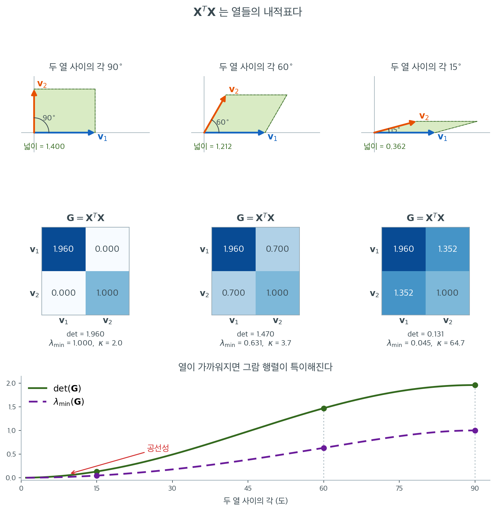

# 그람 행렬

벡터들의 모임을 행렬 $\mathbf{X}$의 열로 배열하면, 곱 $\mathbf{X}^\top\mathbf{X}$는 모든 쌍의 내적을 하나의 행렬에 모아 담는다. 이 **그람 행렬(Gram matrix)** 은 언제나 대칭이고 양반정치이며, 열벡터들의 기하(각도와 길이)를 부호화한다. 회귀에서 그람 행렬 $\mathbf{X}^\top\mathbf{X}$는 정규방정식에 등장하고, 그 가역성이 최소제곱해의 유일성을 결정하며, 그 고윳값이 추정량의 수치적 안정성을 좌우한다. 그람 행렬을 이해하면 회귀해의 존재에 대한 대수적 조건과 예측변수들의 일차독립성이라는 기하적 개념이 연결된다.

<div class="defn" markdown>

### 정의 1. 그람 행렬 { .dfn }

$\mathbf{v}_1, \mathbf{v}_2, \dots, \mathbf{v}_p \in \mathbb{R}^n$을 벡터들의 모임이라 하고, 이 벡터들을 열로 갖는 행렬을 $\mathbf{X} = (\mathbf{v}_1 \mid \mathbf{v}_2 \mid \cdots \mid \mathbf{v}_p) \in \mathbb{R}^{n \times p}$이라 하자. **그람 행렬**은

$$
\mathbf{G} = \mathbf{X}^\top\mathbf{X} \in \mathbb{R}^{p \times p}
$$

이며, 그 $(i,j)$ 성분은 내적 $[\mathbf{G}]_{ij} = \mathbf{v}_i^\top\mathbf{v}_j$이다.

</div>

대각 성분 $g_{ii} = \mathbf{v}_i^\top\mathbf{v}_i = \lVert\mathbf{v}_i\rVert^2$는 벡터 길이의 제곱이고, 비대각 성분 $g_{ij} = \mathbf{v}_i^\top\mathbf{v}_j$는 두 벡터가 얼마나 같은 방향을 향하는지를 잰다.

## 대칭성과 양반정치성

<div class="thmbox" markdown>

### 정리 1. 그람 행렬은 대칭 양반정치다 { .thm }

임의의 행렬 $\mathbf{X} \in \mathbb{R}^{n \times p}$에 대해 그람 행렬 $\mathbf{G} = \mathbf{X}^\top\mathbf{X}$는

1. **대칭이다**: $\mathbf{G}^\top = (\mathbf{X}^\top\mathbf{X})^\top = \mathbf{X}^\top\mathbf{X} = \mathbf{G}$
2. **양반정치다**: 모든 $\mathbf{y} \in \mathbb{R}^p$에 대해 $\mathbf{y}^\top\mathbf{G}\mathbf{y} \geq 0$

</div>

??? proof "증명"

    **대칭성**은 전치를 두 번 취하면 바로 나오므로 양반정치성만 보이면 된다. 임의의 $\mathbf{y} \in \mathbb{R}^p$에 대해

    $$
    \mathbf{y}^\top\mathbf{G}\mathbf{y} = \mathbf{y}^\top\mathbf{X}^\top\mathbf{X}\mathbf{y} = (\mathbf{X}\mathbf{y})^\top(\mathbf{X}\mathbf{y}) = \lVert\mathbf{X}\mathbf{y}\rVert^2 \geq 0
    $$

    이다. 이차형식이 $\mathbf{X}\mathbf{y}$의 유클리드 노름의 제곱과 같으므로 언제나 음이 아니다. $\square$

## 그람 행렬이 언제 양정치인가

<div class="thmbox" markdown>

### 정리 2. 그람 행렬의 양정치성 { .thm }

그람 행렬 $\mathbf{G} = \mathbf{X}^\top\mathbf{X}$가 양정치일 필요충분조건은 $\mathbf{X}$가 완전 열계수를 갖는 것이다(즉 $\operatorname{rank}(\mathbf{X}) = p$).

</div>

??? proof "증명"

    위 계산에서 $\mathbf{y}^\top\mathbf{G}\mathbf{y} = \lVert\mathbf{X}\mathbf{y}\rVert^2$이다. 이것이 모든 $\mathbf{y} \neq \mathbf{0}$에 대해 엄격히 양수일 필요충분조건은 모든 $\mathbf{y} \neq \mathbf{0}$에 대해 $\mathbf{X}\mathbf{y} \neq \mathbf{0}$인 것이고, 이는 $\ker(\mathbf{X}) = \{\mathbf{0}\}$, 즉 $\mathbf{X}$가 완전 열계수를 갖는 것과 동치다. $\square$

    **회귀에 대한 귀결.** 최소제곱추정량 $\hat{\boldsymbol{\beta}} = (\mathbf{X}^\top\mathbf{X})^{-1}\mathbf{X}^\top\mathbf{y}$이 존재하고 유일할 필요충분조건은 $\mathbf{X}^\top\mathbf{X}$가 양정치인 것이며, 이는 예측변수 열들이 일차독립일 때에 한해 성립한다.

!!! warning "「그람 행렬은 양정치다」는 틀린 말이다"
    정리 1 과 정리 2 의 차이를 뭉개면 안 된다. $\mathbf{X}^\top\mathbf{X}$는 **언제나** 양반정치이지만, 양정치인 것은 $\mathbf{X}$의 열이 일차독립일 때에 **한해서**다. 열이 하나라도 다른 열들의 선형결합이면 그 결합계수 $\mathbf{c} \ne \mathbf{0}$에 대해 $\mathbf{X}\mathbf{c} = \mathbf{0}$이므로 $\mathbf{c}^\top(\mathbf{X}^\top\mathbf{X})\mathbf{c} = 0$이고, $\mathbf{X}^\top\mathbf{X}$는 고윳값 0 을 갖는 **특이행렬**이 된다. $\det(\mathbf{X}^\top\mathbf{X}) = 0$이니 역행렬이 없고 정규방정식의 해가 유일하지 않다.

    회귀에서 **완전 공선성**이 치명적인 이유가 정확히 이것이다. 이를테면 $k$개 수준을 갖는 범주형 변수의 모든 수준에 지시변수를 주면서 절편까지 넣으면 지시변수들의 합이 절편 열 $\mathbf{1}$과 같아져 열이 종속이 되고($\mathbf{c} = (1, -1, \dots, -1)^\top$가 영공간에 들어간다), $(\mathbf{X}^\top\mathbf{X})^{-1}$이 존재하지 않는다. 이른바 더미변수 함정이다. **거의** 공선인 경우는 역행렬이 존재하기는 하지만 최소고윳값이 0 에 가까워 추정이 불안정해지며, 이것이 아래에서 다루는 다중공선성이다.

## 계수 보존

특이해질 수 있다고 해서 그람 행렬이 정보를 잃는 것은 아니다. $\mathbf{X}^\top\mathbf{X}$의 계수는 $\mathbf{X}$의 계수를 정확히 그대로 물려받는다.

<div class="thmbox" markdown>

### 정리 3. 계수 보존 { .thm }

임의의 $\mathbf{X} \in \mathbb{R}^{n \times p}$에 대해

$$
\ker(\mathbf{X}^\top\mathbf{X}) = \ker(\mathbf{X}), \qquad \operatorname{rank}(\mathbf{X}^\top\mathbf{X}) = \operatorname{rank}(\mathbf{X})
$$

이다.

</div>

??? proof "증명"

    두 영공간이 같음을 보인다.

    $(\subseteq)$ $\mathbf{X}\mathbf{v} = \mathbf{0}$이면 $\mathbf{X}^\top\mathbf{X}\mathbf{v} = \mathbf{X}^\top\mathbf{0} = \mathbf{0}$이므로 $\ker(\mathbf{X}) \subseteq \ker(\mathbf{X}^\top\mathbf{X})$이다.

    $(\supseteq)$ $\mathbf{X}^\top\mathbf{X}\mathbf{v} = \mathbf{0}$이라 하자. 양변에 왼쪽에서 $\mathbf{v}^\top$를 곱하면

    $$
    0 = \mathbf{v}^\top\mathbf{X}^\top\mathbf{X}\mathbf{v} = \lVert\mathbf{X}\mathbf{v}\rVert^2
    $$

    이고, 노름이 0 인 실벡터는 영벡터뿐이므로 $\mathbf{X}\mathbf{v} = \mathbf{0}$이다.

    두 행렬 모두 열의 개수가 $p$로 같으므로 계수–퇴화차수 정리를 쓰면

    $$
    \operatorname{rank}(\mathbf{X}^\top\mathbf{X}) = p - \dim\ker(\mathbf{X}^\top\mathbf{X}) = p - \dim\ker(\mathbf{X}) = \operatorname{rank}(\mathbf{X})
    $$

    이다. $\square$

    이 증명은 $(\supseteq)$ 단계에서 **실행렬**임을 썼다. 복소행렬에서는 $\mathbf{X}^\top\mathbf{X}$가 아니라 켤레전치를 쓴 $\mathbf{X}^*\mathbf{X}$에 대해서만 성립한다. 열벡터 $\mathbf{X} = (1, i)^\top$를 잡으면 $\mathbf{X}^\top\mathbf{X} = 1 + i^2 = 0$이라 계수가 $1$에서 $0$으로 떨어진다.

정리 2 와 정리 3 은 같은 사실의 두 얼굴이다. $\operatorname{rank}(\mathbf{X}) = p$이면 $\operatorname{rank}(\mathbf{X}^\top\mathbf{X}) = p$라 $p \times p$ 행렬이 가역이고, $\operatorname{rank}(\mathbf{X}) < p$이면 계수가 정확히 그만큼 부족해 특이행렬이 된다. 정리 3 이 덧붙여 주는 것은 **얼마나** 부족한지까지 알려 준다는 점이다. 계수가 $r$인 $\mathbf{X}$에 대해 $\mathbf{X}^\top\mathbf{X}$는 양의 고윳값을 정확히 $r$개, 0 인 고윳값을 정확히 $p - r$개 갖는다.

## 그람 행렬의 고윳값

$\mathbf{G} = \mathbf{X}^\top\mathbf{X}$가 대칭 양반정치이므로 그 고윳값 $\lambda_1 \geq \lambda_2 \geq \cdots \geq \lambda_p \geq 0$은 모두 음이 아니다. 이 고윳값들은 $\mathbf{X}$의 **특이값**의 제곱이다. $\mathbf{X} = \mathbf{U}\boldsymbol{\Sigma}\mathbf{V}^\top$가 특이값분해(SVD)라면

$$
\mathbf{X}^\top\mathbf{X} = \mathbf{V}\boldsymbol{\Sigma}^\top\boldsymbol{\Sigma}\mathbf{V}^\top = \mathbf{V}\operatorname{diag}(\sigma_1^2, \dots, \sigma_p^2)\mathbf{V}^\top
$$

이므로 $\lambda_i = \sigma_i^2$이다.

### 조건수

$\mathbf{X}^\top\mathbf{X}$의 **조건수**는

$$
\kappa(\mathbf{X}^\top\mathbf{X}) = \frac{\lambda_{\max}}{\lambda_{\min}} = \frac{\sigma_{\max}^2}{\sigma_{\min}^2}
$$

이다. 조건수가 크면 $\mathbf{X}^\top\mathbf{X}$가 거의 특이($\mathbf{X}$의 열들이 거의 일차종속)라는 뜻이고, 최소제곱해가 수치적으로 불안정해진다. 이런 상황을 **다중공선성**이라 한다.



세 경우 모두 열의 **길이는 바뀌지 않았다.** $\lVert\mathbf{v}_1\rVert = 1.4$, $\lVert\mathbf{v}_2\rVert = 1$로 고정했기 때문에 그람 행렬의 대각 성분은 언제나 $1.960$과 $1.000$이다. 바뀌는 것은 비대각 성분뿐이다. $\mathbf{v}_1^\top\mathbf{v}_2 = 1.4\cos\theta$가 $0 \to 0.700 \to 1.352$로 커진다. 대각이 길이를 담고 비대각이 방향의 겹침을 담는다는 것, 이것이 "$\mathbf{X}^\top\mathbf{X}$는 열들의 내적표"라는 말의 뜻이다. 직각인 첫 번째 경우에만 표가 대각행렬이 되고, 그때에만 최소제곱추정량이 열마다 따로 풀린다.

가운데 줄의 행렬식과 첫 줄의 평행사변형은 같은 이야기다. 넓이가 $1.400 \to 1.212 \to 0.362$로 줄고 $\det(\mathbf{G})$가 $1.960 \to 1.470 \to 0.131$로 줄어드는데, 언제나 넓이의 제곱이 행렬식이다($1.4^2 = 1.96$, $1.212^2 = 1.470$, $0.362^2 = 0.131$). 두 열이 같은 방향으로 눕는다는 것은 이들이 감싸는 부피가 납작해진다는 뜻이고, 행렬식이 0이 된다는 것은 부피가 완전히 사라져 일차종속이 된다는 뜻이다.

아래 그래프는 각을 연속으로 줄여 가며 두 양을 추적한 것이다. $\det(\mathbf{G})$와 $\lambda_{\min}(\mathbf{G})$이 $\theta \to 0$에서 나란히 0으로 간다. 통계적으로 위험한 쪽은 $\lambda_{\min}$이다. $\operatorname{Var}(\hat{\boldsymbol{\beta}}) = \sigma^2\mathbf{G}^{-1}$의 가장 큰 고윳값이 $\sigma^2/\lambda_{\min}$이므로, $\lambda_{\min}$이 $1.000$에서 $0.045$로 떨어지면 그 방향의 분산이 약 $22$배가 된다. 조건수도 $2.0$에서 $64.7$로 커진다.

여기서 눈여겨볼 것은 **자료가 줄어든 것이 하나도 없다는 점이다.** 두 열의 길이는 처음부터 끝까지 그대로이고 관측 개수도 같다. 그럼에도 추정이 불안정해지는 까닭은 두 열이 같은 방향을 가리켜 서로 겹치는 정보를 주기 때문이다. 다중공선성은 정보의 양이 아니라 정보의 방향에 관한 문제다.

## 예

계획행렬이 (간단히 하기 위해 절편을 무시하고) 두 개의 예측변수 열을 갖는다고 하자.

$$
\mathbf{X} = \begin{pmatrix} 1 & 2 \\ 3 & 1 \\ 2 & 4 \end{pmatrix}
$$

그람 행렬은

$$
\mathbf{X}^\top\mathbf{X} = \begin{pmatrix} 1 & 3 & 2 \\ 2 & 1 & 4 \end{pmatrix}\begin{pmatrix} 1 & 2 \\ 3 & 1 \\ 2 & 4 \end{pmatrix} = \begin{pmatrix} 14 & 13 \\ 13 & 21 \end{pmatrix}
$$

이다.

**대칭성 확인:** 이 행렬은 분명히 대칭이다($g_{12} = g_{21} = 13$).

**양정치성 확인:** $\det(\mathbf{X}^\top\mathbf{X}) = 14 \cdot 21 - 13^2 = 294 - 169 = 125 > 0$이고 $g_{11} = 14 > 0$이므로 $\mathbf{X}^\top\mathbf{X} \succ 0$이다. 이는 $\mathbf{X}$의 두 열이 일차독립임을 확인해 준다.

**해석:** 성분 $g_{11} = 14 = \lVert\mathbf{v}_1\rVert^2$은 첫 번째 예측변수의 제곱합이다. 성분 $g_{12} = 13 = \mathbf{v}_1^\top\mathbf{v}_2$는 두 예측변수가 얼마나 같은 방향을 향하는지를 잰다. 예측변수들이 직교했다면 이 성분이 0이 되고 그람 행렬은 대각행렬이 되었을 것이다.

## 두 개의 그람 행렬

임의의 $\mathbf{X} \in \mathbb{R}^{n \times p}$에 대해 사실 그람 행렬은 두 개다.

| 행렬 | 크기 | 성분 | 회귀에서의 역할 |
|---|---|---|---|
| $\mathbf{X}^\top\mathbf{X}$ | $p \times p$ | 열(예측변수) 벡터들의 내적 | 정규방정식 |
| $\mathbf{X}\mathbf{X}^\top$ | $n \times n$ | 행(관측) 벡터들의 내적 | 모자 행렬, 커널 방법 |

둘은 0이 아닌 고윳값을 공유한다($\mathbf{A}^\top\mathbf{A}$와 $\mathbf{A}\mathbf{A}^\top$의 일반적 성질). $n \gg p$일 때는 $p \times p$ 그람 행렬로 작업하는 편이 훨씬 효율적이고, $p \gg n$인 고차원 상황에서는 $n \times n$ 쪽이 선호된다(이것이 "커널 트릭"이다).

## 그람 행렬과 직교성

그람 행렬은 열벡터들의 직교 구조를 부호화한다.

- $\mathbf{X}$의 열들이 **직교**일 필요충분조건은 $\mathbf{X}^\top\mathbf{X}$가 대각행렬인 것이다.
- $\mathbf{X}$의 열들이 **정규직교**일 필요충분조건은 $\mathbf{X}^\top\mathbf{X} = \mathbf{I}$인 것이다.

계획행렬의 열들이 직교하면 정규방정식이 분리되고 최소제곱추정량이 각 예측변수 $j$에 대해 독립적으로 $\hat{\beta}_j = \mathbf{v}_j^\top\mathbf{y}/\lVert\mathbf{v}_j\rVert^2$로 간단해진다. 예측변수를 (그람–슈미트나 QR 분해로) 직교화하면 회귀의 계산과 해석이 단순해지는 이유가 이것이다.

## 통계와의 연결

### 정규방정식

최소제곱의 정규방정식은 $\mathbf{X}^\top\mathbf{X}\hat{\boldsymbol{\beta}} = \mathbf{X}^\top\mathbf{y}$이다. 그람 행렬 $\mathbf{X}^\top\mathbf{X}$가 이 연립방정식의 계수행렬이다. ($\mathbf{X}$가 완전 열계수를 가질 때의) 양정치성이 유일한 해를 보장한다.

### 최소제곱추정량의 분산

$\operatorname{Var}(\boldsymbol{\varepsilon}) = \sigma^2\mathbf{I}$인 표준 선형모형 $\mathbf{y} = \mathbf{X}\boldsymbol{\beta} + \boldsymbol{\varepsilon}$ 아래에서

$$
\operatorname{Var}(\hat{\boldsymbol{\beta}}) = \sigma^2(\mathbf{X}^\top\mathbf{X})^{-1}
$$

이다. $(\mathbf{X}^\top\mathbf{X})^{-1}$의 고윳값은 $1/\lambda_i$이므로, 그람 행렬의 고윳값이 작으면 추정량의 분산이 커진다. 이것이 다중공선성이 표준오차를 부풀리는 이유에 대한 대수적 설명이다.

### 표본 공분산행렬

$\mathbf{X}$가 중심화된 자료행렬(관측값에서 열 평균을 뺀 것)일 때 표본 공분산행렬은 $\mathbf{S} = \frac{1}{n-1}\mathbf{X}^\top\mathbf{X}$로, 크기가 조정된 그람 행렬이다.

## 연습문제

<div class="drillbox" markdown>

**연습문제 1.** <span class="diff easy" title="쉬움"></span>
$\mathbf{X} = \begin{pmatrix} 1 & 2 \\ 1 & 3 \\ 1 & 5 \end{pmatrix}$이라 하자. 그람 행렬 $\mathbf{X}^\top\mathbf{X}$를 계산하고 그것이 대칭이며 양정치임을 확인하라.

</div>

??? success "풀이"
    직접 곱하면

    $$
    \mathbf{X}^\top\mathbf{X} = \begin{pmatrix} 1 & 1 & 1 \\ 2 & 3 & 5 \end{pmatrix}\begin{pmatrix} 1 & 2 \\ 1 & 3 \\ 1 & 5 \end{pmatrix} = \begin{pmatrix} 3 & 10 \\ 10 & 38 \end{pmatrix}
    $$

    이다.

    대칭성은 $(\mathbf{X}^\top\mathbf{X})^\top = \mathbf{X}^\top\mathbf{X}$로부터 곧바로 따라온다. 양정치성의 경우 선행 주소행렬식이 $3 > 0$이고 $\det = 3 \times 38 - 10^2 = 114 - 100 = 14 > 0$이므로 $\mathbf{X}^\top\mathbf{X}$는 양정치다. 동등하게 $\mathbf{X}$의 계수가 2이므로(두 열이 일차독립이므로) $\mathbf{X}^\top\mathbf{X}$가 양정치다.

<div class="drillbox" markdown>

**연습문제 2.** <span class="diff med" title="중간"></span>
임의의 실행렬 $\mathbf{X}$에 대해 $\mathbf{X}^\top\mathbf{X}$가 언제나 양반정치이고, 양정치일 필요충분조건이 $\mathbf{X}$가 완전 열계수를 갖는 것임을 증명하라.

</div>

??? success "풀이"
    임의의 벡터 $\mathbf{v} \neq \mathbf{0}$에 대해

    $$
    \mathbf{v}^\top(\mathbf{X}^\top\mathbf{X})\mathbf{v} = (\mathbf{X}\mathbf{v})^\top(\mathbf{X}\mathbf{v}) = \lVert \mathbf{X}\mathbf{v} \rVert^2 \geq 0
    $$

    이다. 이것이 0일 필요충분조건은 $\mathbf{X}\mathbf{v} = \mathbf{0}$, 즉 $\mathbf{v} \in \ker(\mathbf{X})$인 것이다. $\mathbf{X}$가 완전 열계수를 가지면 $\ker(\mathbf{X}) = \{\mathbf{0}\}$이므로 모든 $\mathbf{v} \neq \mathbf{0}$에 대해 $\mathbf{v}^\top(\mathbf{X}^\top\mathbf{X})\mathbf{v} > 0$이고 이것이 양정치성이다. 역으로 $\mathbf{X}$가 완전 열계수를 갖지 않으면 $\mathbf{X}\mathbf{v} = \mathbf{0}$인 $\mathbf{v} \neq \mathbf{0}$이 존재하여 이차형식이 0이 된다. $\square$

<div class="drillbox" markdown>

**연습문제 3.** <span class="diff med" title="중간"></span>
$\mathbf{X}$의 열들이 거의 공선적일 때 $\mathbf{X}^\top\mathbf{X}$의 조건수가 최소제곱추정값의 안정성과 어떻게 관련되는지 설명하라. 조건수를 고윳값으로 나타내면 무엇인가?

</div>

??? success "풀이"
    $\mathbf{X}^\top\mathbf{X}$의 조건수는 $\kappa = \lambda_{\max}/\lambda_{\min}$이며, 여기서 $\lambda_{\max}$와 $\lambda_{\min}$은 최대·최소 고윳값이다.

    열들이 거의 공선적이면 $\lambda_{\min}$이 0에 가까워져 $\kappa$가 매우 커진다. $\operatorname{Var}(\hat{\boldsymbol{\beta}}) = \sigma^2(\mathbf{X}^\top\mathbf{X})^{-1}$이고 $(\mathbf{X}^\top\mathbf{X})^{-1}$의 고윳값이 $1/\lambda_i$이므로, $\lambda_{\min}$이 작으면 그에 대응하는 고유벡터 방향으로 분산 $\sigma^2/\lambda_{\min}$이 커진다. 조건수가 크다는 것은 또한 $\mathbf{y}$의 작은 섭동이 $\hat{\boldsymbol{\beta}}$을 크게 변화시킨다는 뜻이며, 추정값이 수치적으로 불안정해진다.

<div class="drillbox" markdown>

**연습문제 4.** <span class="diff med" title="중간"></span>
표본 공분산행렬 $\mathbf{S} = \frac{1}{n-1}\mathbf{X}_c^\top\mathbf{X}_c$($\mathbf{X}_c$는 평균 중심화된 자료행렬)가 양반정치임을 보여라. 어떤 조건에서 양정치가 되는가?

</div>

??? success "풀이"
    $\mathbf{S} = \frac{1}{n-1}\mathbf{X}_c^\top\mathbf{X}_c$는 그람 행렬의 양의 스칼라배이므로 양반정치성을 물려받는다.

    $$
    \mathbf{v}^\top\mathbf{S}\mathbf{v} = \frac{1}{n-1}\lVert \mathbf{X}_c \mathbf{v} \rVert^2 \geq 0
    $$

    $\mathbf{S}$가 양정치일 필요충분조건은 $\mathbf{X}_c$가 완전 열계수를 갖는 것이며, 이를 위해서는 $n - 1 \geq p$가 필요하다(중심화가 계수를 많아야 1만큼 줄이기 때문이다). 실무적으로는 표본 공분산행렬이 가역이려면 변수보다 관측값이 많아야 한다는($n > p$) 뜻이다. $p > n$이면 $\mathbf{S}$가 특이행렬이 되어 정칙화나 차원축소 같은 기법이 필요하다. $\square$

<div class="drillbox" markdown>

**연습문제 5.** <span class="diff med" title="중간"></span>
$\mathbf{X}$의 열들이 서로 직교하면 그람 행렬이 대각행렬이 됨을 보이고, 이때 최소제곱추정량이 $\hat{\beta}_j = \mathbf{v}_j^\top\mathbf{y}/\lVert\mathbf{v}_j\rVert^2$로 분리되는 이유를 설명하라.

</div>

??? success "풀이"
    $[\mathbf{G}]_{ij} = \mathbf{v}_i^\top\mathbf{v}_j$인데 $i \neq j$이면 직교성에 의해 $\mathbf{v}_i^\top\mathbf{v}_j = 0$이다. 따라서 비대각 성분이 모두 0이고

    $$
    \mathbf{G} = \operatorname{diag}\!\left(\lVert\mathbf{v}_1\rVert^2, \dots, \lVert\mathbf{v}_p\rVert^2\right)
    $$

    이다. 대각행렬의 역행렬은 각 성분의 역수이므로 정규방정식 $\mathbf{G}\hat{\boldsymbol{\beta}} = \mathbf{X}^\top\mathbf{y}$가 $p$개의 **독립적인** 한 변수 방정식으로 분리된다.

    $$
    \lVert\mathbf{v}_j\rVert^2 \hat{\beta}_j = \mathbf{v}_j^\top\mathbf{y}
    \quad\Longrightarrow\quad
    \hat{\beta}_j = \frac{\mathbf{v}_j^\top\mathbf{y}}{\lVert\mathbf{v}_j\rVert^2}
    $$

    ```python
    import numpy as np

    X = np.array([[1., 1.], [1., -1.], [1., 1.], [1., -1.]])   # 두 열이 직교
    y = np.array([3., 1., 4., 2.])

    G = X.T @ X
    print("그람 행렬:\n", G)

    beta_ls = np.linalg.solve(G, X.T @ y)                       # 정규방정식
    beta_sep = np.array([X[:, j] @ y / (X[:, j] @ X[:, j])      # 열마다 따로
                         for j in range(X.shape[1])])
    print("정규방정식 해:", beta_ls)
    print("열별 계산    :", beta_sep)
    ```

    출력:

    ```
    그람 행렬:
     [[4. 0.]
     [0. 4.]]
    정규방정식 해: [2.5 1. ]
    열별 계산    : [2.5 1. ]
    ```

    **통계적 의미가 크다.** 예측변수가 직교하면 한 변수를 모형에 넣거나 빼도 다른 변수의 계수가 **전혀 변하지 않는다.** 실험계획에서 직교설계를 선호하는 이유이며, 관측자료에서 계수가 모형 설정에 따라 요동치는 이유이기도 하다. $\square$

<div class="drillbox" markdown>

**연습문제 6.** <span class="diff med" title="중간"></span>
$\mathbf{X}^\top\mathbf{X}$($p \times p$)와 $\mathbf{X}\mathbf{X}^\top$($n \times n$)가 0이 아닌 고윳값을 공유함을 보이고, 수치로 확인하라. $p \gg n$일 때 어느 쪽으로 계산해야 하는가?

</div>

??? success "풀이"
    $\mathbf{X}^\top\mathbf{X}\mathbf{v} = \lambda\mathbf{v}$이고 $\lambda \neq 0$이라 하자. 양변에 왼쪽에서 $\mathbf{X}$를 곱하면

    $$
    \mathbf{X}\mathbf{X}^\top(\mathbf{X}\mathbf{v}) = \lambda(\mathbf{X}\mathbf{v})
    $$

    이다. $\lambda \neq 0$이므로 $\mathbf{X}\mathbf{v} \neq \mathbf{0}$이고(만약 $\mathbf{X}\mathbf{v} = \mathbf{0}$이면 $\lambda\mathbf{v} = \mathbf{X}^\top\mathbf{X}\mathbf{v} = \mathbf{0}$이 되어 모순), 따라서 $\mathbf{X}\mathbf{v}$가 $\mathbf{X}\mathbf{X}^\top$의 고윳값 $\lambda$에 대응하는 고유벡터다. 반대 방향도 $\mathbf{X}^\top$를 곱해 같은 방식으로 보인다.

    두 행렬의 크기가 다르므로 **개수가 많은 쪽에는 0인 고윳값이 채워진다.**

    ```python
    import numpy as np

    rng = np.random.default_rng(0)
    X = rng.normal(size=(5, 3))                 # n=5, p=3

    e_small = np.sort(np.linalg.eigvalsh(X.T @ X))[::-1]     # 3개
    e_big = np.sort(np.linalg.eigvalsh(X @ X.T))[::-1]       # 5개

    print("X^T X 의 고윳값:", e_small.round(6))
    print("X X^T 의 고윳값:", e_big.round(6))
    ```

    출력:

    ```
    X^T X 의 고윳값: [9.928184 2.921811 0.112128]
    X X^T 의 고윳값: [ 9.928184  2.921811  0.112128  0.       -0.      ]
    ```

    $\mathbf{X}\mathbf{X}^\top$의 큰 세 고윳값이 $\mathbf{X}^\top\mathbf{X}$의 고윳값과 정확히 같고 나머지 두 개는 0이다.

    **$p \gg n$이면 $n \times n$인 $\mathbf{X}\mathbf{X}^\top$로 계산해야 한다.** 유전체 자료처럼 $p$가 수만이고 $n$이 수백인 상황에서 $p \times p$ 행렬은 다루기 어렵지만 $n \times n$은 작다. 두 행렬이 같은 정보를 담고 있으므로 손해가 없다. 이것이 **커널 트릭**의 대수적 근거다. $\square$

<div class="drillbox" markdown>

**연습문제 7.** <span class="diff hard" title="어려움"></span>
$\mathbf{X} \in \mathbb{R}^{n \times p}$의 열이 만드는 평행육면체의 $p$차원 부피 $V$에 대해 $\det(\mathbf{X}^\top\mathbf{X}) = V^2$이 성립한다. 이 사실을 이용해 그람 행렬의 행렬식이 0이 되는 기하적 의미를 설명하라.

</div>

??? success "풀이"
    $\det(\mathbf{X}^\top\mathbf{X})$를 **그람 행렬식**이라 하며 열들이 펼치는 평행육면체 부피의 제곱과 같다.

    ```python
    import numpy as np

    # 서로 직교하고 길이가 1, 2인 두 벡터 -> 넓이 2, 그람 행렬식 4
    X1 = np.array([[1., 0.], [0., 2.], [0., 0.]])
    print("직교:      det =", round(np.linalg.det(X1.T @ X1), 6), " (넓이^2 = 4)")

    # 같은 길이지만 방향이 겹치면 넓이가 줄어든다
    X2 = np.array([[1., 1.], [0., 1.], [0., 0.]])
    print("비스듬함:  det =", round(np.linalg.det(X2.T @ X2), 6))

    # 두 열이 일차종속이면 부피가 0
    X3 = np.array([[1., 2.], [0., 0.], [0., 0.]])
    print("공선:      det =", round(np.linalg.det(X3.T @ X3), 6))
    ```

    출력:

    ```
    직교:      det = 4.0  (넓이^2 = 4)
    비스듬함:  det = 1.0
    공선:      det = 0.0
    ```

    **기하적 의미.** $\det(\mathbf{X}^\top\mathbf{X}) = 0$은 부피가 0이라는 뜻이고, 이는 열들이 더 낮은 차원의 부분공간에 눌려 있다는 것, 곧 **일차종속**이라는 뜻이다.

    이것이 본문의 양정치성 정리와 정확히 같은 이야기를 기하로 옮긴 것이다. 완전 열계수 $\iff$ 부피 $> 0$ $\iff$ $\mathbf{X}^\top\mathbf{X} \succ 0$ $\iff$ 최소제곱해가 유일하다.

    부피가 0은 아니지만 매우 작은 경우가 곧 **다중공선성**이다. 해가 존재하기는 하지만 납작한 평행육면체 위에서 결정되므로 불안정하다. $\square$

<div class="drillbox" markdown>

**연습문제 8.** <span class="diff med" title="중간"></span>
$\mathbf{X}$의 각 열을 평균 0, 길이 1로 표준화한 행렬을 $\mathbf{Z}$라 하자. $\mathbf{Z}^\top\mathbf{Z}$가 무엇이 되는지 밝히고, 그람 행렬과 상관행렬의 관계를 설명하라.

</div>

??? success "풀이"
    열 $j$를 중심화한 뒤 그 노름으로 나누면 $\mathbf{z}_j = (\mathbf{v}_j - \bar{v}_j\mathbf{1}) / \lVert \mathbf{v}_j - \bar{v}_j\mathbf{1} \rVert$이다. 그러면

    $$
    [\mathbf{Z}^\top\mathbf{Z}]_{ij} = \mathbf{z}_i^\top\mathbf{z}_j
    = \frac{\sum_k (v_{ki} - \bar{v}_i)(v_{kj} - \bar{v}_j)}
           {\sqrt{\sum_k (v_{ki} - \bar{v}_i)^2}\sqrt{\sum_k (v_{kj} - \bar{v}_j)^2}}
    = r_{ij}
    $$

    로 정확히 **표본상관계수**다. 곧 $\mathbf{Z}^\top\mathbf{Z}$가 **상관행렬**이다.

    ```python
    import numpy as np

    rng = np.random.default_rng(2)
    X = rng.normal(size=(100, 3)) @ np.array([[1., .8, .2],
                                              [0., .6, .3],
                                              [0., 0., 1.]])
    Z = (X - X.mean(0)) / np.linalg.norm(X - X.mean(0), axis=0)

    print("Z^T Z =\n", np.round(Z.T @ Z, 4))
    print("\ncorrcoef =\n", np.round(np.corrcoef(X, rowvar=False), 4))
    ```

    출력:

    ```
    Z^T Z =
     [[1.     0.8133 0.1539]
     [0.8133 1.     0.3154]
     [0.1539 0.3154 1.    ]]

    corrcoef =
     [[1.     0.8133 0.1539]
     [0.8133 1.     0.3154]
     [0.1539 0.3154 1.    ]]
    ```

    세 가지가 같은 대상의 다른 척도임을 알 수 있다.

    | 행렬 | 열에 한 처리 | 대각 성분 |
    |---|---|---|
    | $\mathbf{X}^\top\mathbf{X}$ | 없음 | 제곱합 |
    | $\frac{1}{n-1}\mathbf{X}_c^\top\mathbf{X}_c$ | 중심화 | 분산 |
    | $\mathbf{Z}^\top\mathbf{Z}$ | 중심화 + 정규화 | $1$ |

    상관행렬이 언제나 양반정치인 이유도 여기서 나온다. **상관행렬 역시 그람 행렬이기 때문이다.** $\square$

<div class="drillbox" markdown>

**연습문제 9.** <span class="diff med" title="중간"></span>
기존 예측변수와 거의 같은 열을 하나 추가하면 조건수와 $\operatorname{Var}(\hat{\boldsymbol{\beta}})$가 어떻게 변하는지 수치로 보여라.

</div>

??? success "풀이"
    $\mathbf{x}_3 = \mathbf{x}_1 + \varepsilon \cdot (\text{잡음})$으로 두고 $\varepsilon$을 줄여 가며 관찰한다.

    ```python
    import numpy as np

    rng = np.random.default_rng(0)
    n = 50
    x1 = rng.normal(size=n)
    x2 = rng.normal(size=n)

    for eps in (1.0, 0.1, 0.01):
        x3 = x1 + eps * rng.normal(size=n)          # eps가 작을수록 x1과 닮는다
        X = np.column_stack([x1, x2, x3])
        G = X.T @ X
        ev = np.linalg.eigvalsh(G)
        var_factor = np.diag(np.linalg.inv(G)).max()  # Var(beta)/sigma^2 의 최댓값
        print(f"eps={eps:<5}  cond={ev.max()/ev.min():>10.1f}   "
              f"max Var factor={var_factor:>8.3f}")
    ```

    출력:

    ```
    eps=1.0    cond=       7.1   max Var factor=   0.048
    eps=0.1    cond=     382.7   max Var factor=   2.243
    eps=0.01   cond=   27830.5   max Var factor= 162.058
    ```

    $\varepsilon$을 $1$에서 $0.01$로 줄이면 조건수가 $7$에서 $27{,}830$으로 약 $4{,}000$배 커지고, 계수 분산의 최댓값은 $0.048$에서 $162$로 약 $3{,}400$배 커진다.

    **대수적 이유.** $\mathbf{x}_3 \approx \mathbf{x}_1$이면 $\mathbf{y} = \mathbf{x}_3 - \mathbf{x}_1$ 방향에서 $\mathbf{X}\mathbf{y} \approx \mathbf{0}$이므로 $\mathbf{y}^\top\mathbf{G}\mathbf{y} = \lVert\mathbf{X}\mathbf{y}\rVert^2 \approx 0$이다. 곧 $\lambda_{\min} \approx 0$이고, $\operatorname{Var}(\hat{\boldsymbol{\beta}}) = \sigma^2\mathbf{G}^{-1}$의 고윳값 $\sigma^2/\lambda_{\min}$이 폭발한다.

    자료가 늘어난 것이 아니라 **거의 같은 정보를 두 번 넣은 것**이므로 추정이 불안정해지는 것이 당연하다. 18장의 능형회귀는 $\mathbf{G} + \lambda\mathbf{I}$로 최소고윳값을 끌어올려 이 문제를 완화한다. $\square$

<div class="drillbox" markdown>

**연습문제 10.** <span class="diff hard" title="어려움"></span>
임의의 실행렬 $\mathbf{X}$에 대해 $\operatorname{Col}(\mathbf{X}^\top\mathbf{X}) = \operatorname{Col}(\mathbf{X}^\top)$임을 증명하라(정리 3 을 써도 된다). 이로부터 정규방정식 $\mathbf{X}^\top\mathbf{X}\boldsymbol{\beta} = \mathbf{X}^\top\mathbf{y}$가 $\mathbf{X}$의 계수와 무관하게 **언제나 해를 갖는다**는 결론을 끌어내고, 완전 공선성이 있을 때 그 해가 어떻게 되는지 수치로 확인하라.

</div>

??? success "풀이"
    $(\subseteq)$ $\mathbf{X}^\top\mathbf{X}\mathbf{v} = \mathbf{X}^\top(\mathbf{X}\mathbf{v})$이므로 $\operatorname{Col}(\mathbf{X}^\top\mathbf{X}) \subseteq \operatorname{Col}(\mathbf{X}^\top)$은 곧바로 나온다.

    $(\supseteq)$ 차원을 센다. 정리 3 에 의해 $\dim\operatorname{Col}(\mathbf{X}^\top\mathbf{X}) = \operatorname{rank}(\mathbf{X}^\top\mathbf{X}) = \operatorname{rank}(\mathbf{X}) = \operatorname{rank}(\mathbf{X}^\top) = \dim\operatorname{Col}(\mathbf{X}^\top)$이다. 포함관계가 있고 차원이 같은 두 부분공간은 같으므로 결론이 따라 나온다.

    **정규방정식은 언제나 무모순이다.** $\mathbf{X}^\top\mathbf{y} \in \operatorname{Col}(\mathbf{X}^\top) = \operatorname{Col}(\mathbf{X}^\top\mathbf{X})$이므로 $\mathbf{X}^\top\mathbf{X}\boldsymbol{\beta} = \mathbf{X}^\top\mathbf{y}$를 만족하는 $\boldsymbol{\beta}$가 적어도 하나 존재한다. 완전 열계수일 때에만 그것이 **유일**하다(정리 2). 계수가 $r < p$이면 해집합은 $\ker(\mathbf{X})$ 방향으로 $p - r$차원만큼 평행이동한 아핀 집합이 되고, 적합값 $\hat{\mathbf{y}} = \mathbf{X}\boldsymbol{\beta}$는 어느 해를 택해도 같다.

    ```python
    import numpy as np

    X = np.array([[1., 2., 3.], [1., 0., 1.], [1., 1., 2.], [1., 3., 4.]])  # 3열 = 1열 + 2열
    y = np.array([6., 2., 4., 8.])
    G, b = X.T @ X, X.T @ y

    print("rank(X) =", np.linalg.matrix_rank(X), "  rank(X^T X) =", np.linalg.matrix_rank(G))
    print("X^T X 의 고윳값:", np.linalg.eigvalsh(G).round(6))
    print("X^T y 가 Col(X^T X) 안에 있는가:",
          np.linalg.matrix_rank(G) == np.linalg.matrix_rank(np.column_stack([G, b])))

    beta_min = np.linalg.lstsq(G, b, rcond=None)[0]           # 최소노름 해
    beta_alt = beta_min + 5.0 * np.array([1., 1., -1.])        # ker(X) 방향으로 밀어낸 다른 해
    print("\n해 1:", beta_min.round(6), " 잔차", round(np.linalg.norm(G @ beta_min - b), 10))
    print("해 2:", beta_alt.round(6), " 잔차", round(np.linalg.norm(G @ beta_alt - b), 10))
    print("두 해의 적합값이 같은가:", np.allclose(X @ beta_min, X @ beta_alt))
    ```

    출력:

    ```
    rank(X) = 2   rank(X^T X) = 2
    X^T X 의 고윳값: [-0.        1.284367 46.715633]
    X^T y 가 Col(X^T X) 안에 있는가: True

    해 1: [0.666667 0.666667 1.333333]  잔차 0.0
    해 2: [ 5.666667  5.666667 -3.666667]  잔차 0.0
    두 해의 적합값이 같은가: True
    ```

    계수가 3 에서 2 로 떨어져 고윳값 하나가 0 이 되었지만, 정규방정식은 여전히 무모순이다. 서로 다른 두 해가 **같은 적합값**을 주는 것이 핵심이다. 추정 불가능한 것은 $\boldsymbol{\beta}$ 자체이고 $\mathbf{X}\boldsymbol{\beta}$는 여전히 유일하게 추정된다. 회귀에서 완전 공선성이 있을 때 "개별 계수는 해석할 수 없지만 예측은 할 수 있다"고 말하는 근거가 이것이다.

    **복소행렬에서는 다르다.** 정리 3 의 증명이 실행렬임을 썼으므로 이 모든 논의도 실행렬에 한한다. 열벡터 $\mathbf{X} = (1, i)^\top$를 잡으면 $\mathbf{X}^\top\mathbf{X} = 1 + i^2 = 0$이라 계수가 $1$에서 $0$으로 떨어지고, 켤레전치를 쓴 $\mathbf{X}^*\mathbf{X} = 1 + \lvert i\rvert^2 = 2$만이 계수를 보존한다. $\square$

---

## 정리하며

그람 행렬 $\mathbf{X}^\top\mathbf{X}$는 $\mathbf{X}$의 열들 사이의 모든 쌍의 내적을 대칭 양반정치행렬에 모은다. **언제나** 양반정치이지만 양정치가 되는 것은 열들이 일차독립일 때에 **한해서**이며, 이것이 최소제곱해가 유일하기 위한 조건이다. 열이 종속이면 $\mathbf{X}^\top\mathbf{X}$는 특이행렬이 되고, 이것이 완전 공선성이 회귀를 막아 세우는 지점이다. 계수는 언제나 보존되어 $\operatorname{rank}(\mathbf{X}^\top\mathbf{X}) = \operatorname{rank}(\mathbf{X})$다. 그람 행렬의 고윳값은 조건수를 통해 회귀의 수치적 안정성을 좌우하고, 그 비대각 구조가 예측변수들 사이의 상관을 잰다.
