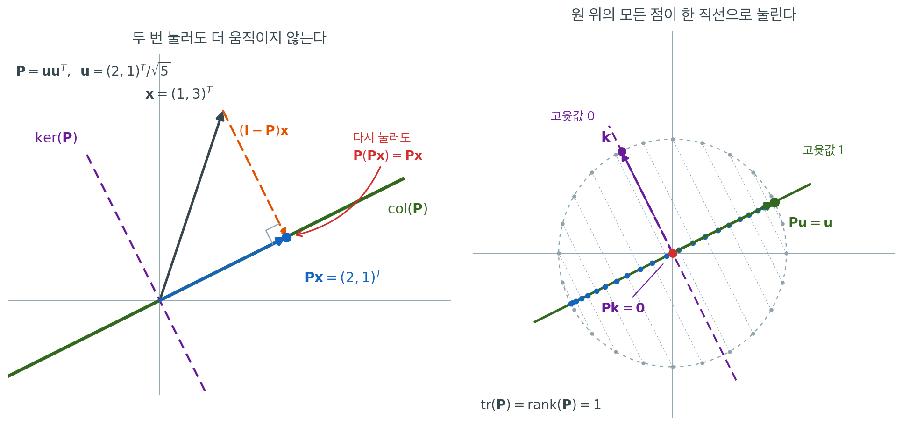

# 멱등행렬

## 개요

두 번 적용해도 같은 결과를 내는 연산을 **멱등(idempotent)** 이라 한다. 행렬대수에서 멱등행렬은 $\mathbf{A}^2 = \mathbf{A}$를 만족한다. 변환을 한 번 더 적용해도 아무것도 바뀌지 않는다는 뜻이다. 이 성질이 사영을 특징짓고, 사영행렬은 회귀 곳곳에 등장한다. 적합값을 만들어내는 모자 행렬 $\mathbf{H}$와 잔차를 만들어내는 잔차생성행렬 $\mathbf{M} = \mathbf{I} - \mathbf{H}$가 모두 멱등이다. 이들의 고윳값은 $\{0, 1\}$로 제한되며, 이는 분산분석과 회귀 이론에서 자유도를 세는 일로 곧바로 이어진다.

<div class="defn" markdown>

### 정의 1. 멱등행렬 { .dfn }

정사각행렬 $\mathbf{A} \in \mathbb{R}^{n \times n}$이

$$
\mathbf{A}^2 = \mathbf{A}
$$

를 만족하면 **멱등**이라 한다. 동등하게 $\mathbf{A}(\mathbf{A} - \mathbf{I}) = \mathbf{0}$이다.

</div>

단위행렬 $\mathbf{I}$와 영행렬 $\mathbf{0}$은 자명하게 멱등이다. 흥미로운 경우는 $\mathbf{I}$도 $\mathbf{0}$도 아닌 멱등행렬이며, 이들이 바로 **사영**이다. 다만 여기서 곧바로 갈라지는 길이 하나 있다. 멱등성만으로는 사영이 **직교**사영임을 보장하지 못하고, 그러려면 대칭성이 따로 필요하다. 정리 3 에서 이 점을 정확히 짚는다.

---

## 1. 멱등행렬의 고윳값

<div class="thmbox" markdown>

### 정리 1. 고윳값은 0 또는 1 { .thm }

$\mathbf{A}$가 멱등이고 $\lambda$가 $\mathbf{A}$의 고윳값이면 $\lambda \in \{0, 1\}$이다.

</div>

??? proof "증명"

    $\mathbf{v} \ne \mathbf{0}$에 대해 $\mathbf{A}\mathbf{v} = \lambda\mathbf{v}$라 하자. 그러면

    $$
    \mathbf{A}^2\mathbf{v} = \mathbf{A}(\lambda\mathbf{v}) = \lambda^2 \mathbf{v}
    $$

    이다. 그런데 $\mathbf{A}^2 = \mathbf{A}$이므로 $\mathbf{A}^2\mathbf{v} = \mathbf{A}\mathbf{v} = \lambda\mathbf{v}$이기도 하다. 두 식을 같다고 놓으면 $(\lambda^2 - \lambda)\mathbf{v} = \mathbf{0}$이므로 $\lambda(\lambda - 1) = 0$이다. $\square$

---

## 2. 대각합은 계수와 같다

<div class="thmbox" markdown>

### 정리 2. 멱등행렬의 대각합–계수 항등식 { .thm }

$\mathbf{A} \in \mathbb{R}^{n \times n}$이 멱등이면

$$
\operatorname{tr}(\mathbf{A}) = \operatorname{rank}(\mathbf{A})
$$

</div>

??? proof "증명"

    대각합은 (대수적 중복도를 포함한) 고윳값의 합과 같다. 정리 1 에 의해 고윳값이 0 아니면 1이므로 대각합은 고윳값 $1$의 **대수적** 중복도를 세는 셈이다. 그런데 멱등행렬은 대각화 가능하므로(아래 「대각화 가능성」) 대수적 중복도와 기하적 중복도가 일치하고, 따라서 그 수는 고윳값 1의 고유공간의 차원과 같다. 멱등행렬에서 이 고유공간은 정확히 열공간이므로(연습문제 1) 그 차원이 계수와 같다. $\square$

    이 항등식은 직접적인 통계적 해석을 갖는다. 모자 행렬의 대각합은 추정된 모수의 개수와 같고, 잔차생성행렬의 대각합은 잔차 자유도와 같다.



왼쪽 그림의 $\mathbf{P} = \mathbf{u}\mathbf{u}^\top$는 $\mathbf{u} = (2,1)^\top/\sqrt{5}$가 펼치는 직선 위로의 사영이다. $\mathbf{x} = (1,3)^\top$를 누르면 $\mathbf{P}\mathbf{x} = (2,1)^\top$가 되고, 여기서 한 번 더 눌러도 여전히 $(2,1)^\top$다. **첫 번째 적용이 이미 $\mathbf{x}$를 $\operatorname{Col}(\mathbf{P})$ 안으로 옮겨 놓았고, 사영은 자기 치역 위에서 항등변환이기 때문이다.** 연습문제 1의 "$\mathbf{x} \in \operatorname{Col}(\mathbf{A}) \iff \mathbf{A}\mathbf{x} = \mathbf{x}$"가 그림에서는 "두 번 눌러도 더 움직이지 않는다"로 보인다. 버려진 몫 $(\mathbf{I}-\mathbf{P})\mathbf{x} = (-1,2)^\top$는 $\ker(\mathbf{P})$ 위에 놓이며, 이쪽을 누르면 $\mathbf{0}$이 된다.

오른쪽 그림은 같은 $\mathbf{P}$를 단위원 전체에 적용한 결과다. 원 위의 모든 점이 한 직선으로 내려앉는다. 그 가운데 두 방향만이 방향을 바꾸지 않는데, $\mathbf{u}$는 제자리에 남고($\mathbf{P}\mathbf{u} = \mathbf{u}$) $\mathbf{k}$는 원점으로 간다($\mathbf{P}\mathbf{k} = \mathbf{0}$). 길이가 반으로 줄거나 $1.5$배로 늘어나는 방향은 하나도 없다. $\lambda^2 = \lambda$가 허용하는 값이 $0$과 $1$뿐이라는 정리 1이 그림에서는 이렇게 나타난다.

고윳값이 이렇게 갈리므로 세는 일이 간단해진다. 여기서는 고윳값 $1$이 하나뿐이라 $\operatorname{tr}(\mathbf{P}) = \operatorname{rank}(\mathbf{P}) = 1$이다. 정리 2의 대각합–계수 항등식은 결국 "살아남는 방향이 몇 개인가"를 세는 것이고, 회귀에서 이 개수가 그대로 자유도가 된다. $\operatorname{tr}(\mathbf{H}) = p$는 모형이 붙잡아 두는 방향의 수, $\operatorname{tr}(\mathbf{I}-\mathbf{H}) = n-p$는 눌러 없애는 방향의 수다.

---

## 3. 핵심 성질

### 여집합도 멱등이다

$\mathbf{A}$가 멱등이면 $\mathbf{I} - \mathbf{A}$도 멱등이다.

$$
(\mathbf{I} - \mathbf{A})^2 = \mathbf{I} - 2\mathbf{A} + \mathbf{A}^2 = \mathbf{I} - 2\mathbf{A} + \mathbf{A} = \mathbf{I} - \mathbf{A}
$$

모자 행렬 $\mathbf{H}$와 잔차생성행렬 $\mathbf{I} - \mathbf{H}$가 둘 다 사영인 이유가 이것이다.

### 계수의 분해

대각합–계수 항등식과 대각합의 선형성을 결합하면

$$
\operatorname{rank}(\mathbf{A}) + \operatorname{rank}(\mathbf{I} - \mathbf{A}) = \operatorname{tr}(\mathbf{A}) + \operatorname{tr}(\mathbf{I} - \mathbf{A}) = \operatorname{tr}(\mathbf{I}) = n
$$

이다.

### 열공간은 고정점의 집합이다

벡터 $\mathbf{x}$가 멱등행렬 $\mathbf{A}$의 열공간에 속할 필요충분조건은 $\mathbf{A}\mathbf{x} = \mathbf{x}$인 것이다. 열공간은 정확히 고윳값 1의 고유공간이고, 영공간은 고윳값 0의 고유공간이다. 이 둘이 $\mathbb{R}^n$을 **직합**으로 분해한다.

$$
\mathbb{R}^n = \operatorname{Col}(\mathbf{A}) \oplus \ker(\mathbf{A})
$$

여기서 "직합"은 두 부분공간이 $\{\mathbf{0}\}$에서만 만나고 합쳐서 $\mathbb{R}^n$이 된다는 뜻일 뿐이다. **두 부분공간이 서로 직교한다는 뜻은 아니다.** 직교성은 대칭성을 더해야 나오며, 그것이 정리 3 이다.

### 대각화 가능성

모든 멱등행렬은 대각화 가능하다. 이유: 그 최소다항식이 서로 다른 근을 갖는 $\lambda^2 - \lambda = \lambda(\lambda - 1)$을 나누기 때문이다. 어떤 행렬이 대각화 가능할 필요충분조건은 그 최소다항식이 서로 다른 근을 갖는 것이다.

### 교환되는 멱등행렬의 곱

$\mathbf{A}$와 $\mathbf{B}$가 멱등이고 $\mathbf{A}\mathbf{B} = \mathbf{B}\mathbf{A}$이면 $\mathbf{A}\mathbf{B}$도 멱등이다. (교환성이 없으면 성립하지 않을 수 있다.)

---

## 4. 멱등과 직교사영은 같은 말이 아니다

멱등행렬을 통틀어 "사영행렬"이라 부르는 것은 맞지만, 회귀에서 실제로 쓰는 것은 그보다 좁은 **직교**사영이다. 둘을 가르는 것이 대칭성이다.

<div class="thmbox" markdown>

### 정리 3. 직교사영은 대칭인 멱등행렬뿐이다 { .thm }

$\mathbf{A} \in \mathbb{R}^{n \times n}$이 멱등이라 하자. 그러면

$$
\ker(\mathbf{A}) = \operatorname{Col}(\mathbf{A})^\perp
\quad\Longleftrightarrow\quad
\mathbf{A} = \mathbf{A}^\top
$$

이다. 즉 멱등행렬이 자기 열공간 위로의 **직교**사영일 필요충분조건은 그것이 대칭인 것이다.

</div>

??? proof "증명"

    ($\Leftarrow$) $\mathbf{A} = \mathbf{A}^\top$라 하자. $\mathbf{u} \in \operatorname{Col}(\mathbf{A})$이면 $\mathbf{u} = \mathbf{A}\mathbf{w}$로 쓸 수 있고, $\mathbf{v} \in \ker(\mathbf{A})$이면

    $$
    \mathbf{u}^\top\mathbf{v} = (\mathbf{A}\mathbf{w})^\top\mathbf{v} = \mathbf{w}^\top\mathbf{A}^\top\mathbf{v} = \mathbf{w}^\top\mathbf{A}\mathbf{v} = 0
    $$

    이다. 따라서 $\ker(\mathbf{A}) \subseteq \operatorname{Col}(\mathbf{A})^\perp$이고, 계수–퇴화차수 정리에 의해 두 공간의 차원이 모두 $n - \operatorname{rank}(\mathbf{A})$이므로 실은 같다.

    ($\Rightarrow$) $\ker(\mathbf{A}) \subseteq \operatorname{Col}(\mathbf{A})^\perp$라 하자. 임의의 $\mathbf{x}, \mathbf{y} \in \mathbb{R}^n$에 대해 $\mathbf{x} = \mathbf{A}\mathbf{x} + (\mathbf{I}-\mathbf{A})\mathbf{x}$로 쪼개면 $\mathbf{A}\mathbf{x} \in \operatorname{Col}(\mathbf{A})$이고 $(\mathbf{I}-\mathbf{A})\mathbf{x} \in \ker(\mathbf{A})$이므로($\mathbf{A}(\mathbf{I}-\mathbf{A}) = \mathbf{A} - \mathbf{A}^2 = \mathbf{0}$) 두 조각은 직교한다. 그러면

    $$
    \mathbf{x}^\top\mathbf{A}\mathbf{y} = (\mathbf{A}\mathbf{x})^\top(\mathbf{A}\mathbf{y}) + \bigl((\mathbf{I}-\mathbf{A})\mathbf{x}\bigr)^\top(\mathbf{A}\mathbf{y}) = (\mathbf{A}\mathbf{x})^\top(\mathbf{A}\mathbf{y})
    $$

    이고, 같은 계산을 $\mathbf{y}$ 쪽에 적용하면

    $$
    \mathbf{x}^\top\mathbf{A}^\top\mathbf{y} = (\mathbf{A}\mathbf{x})^\top\mathbf{y} = (\mathbf{A}\mathbf{x})^\top(\mathbf{A}\mathbf{y}) + (\mathbf{A}\mathbf{x})^\top(\mathbf{I}-\mathbf{A})\mathbf{y} = (\mathbf{A}\mathbf{x})^\top(\mathbf{A}\mathbf{y})
    $$

    이다. 곧 모든 $\mathbf{x}, \mathbf{y}$에 대해 $\mathbf{x}^\top\mathbf{A}\mathbf{y} = \mathbf{x}^\top\mathbf{A}^\top\mathbf{y}$이므로 $\mathbf{A} = \mathbf{A}^\top$다. $\square$

대칭이 아닌 멱등행렬은 실제로 존재한다. 연습문제 3 의

$$
\mathbf{A} = \begin{pmatrix} 1 & 1 \\ 0 & 0 \end{pmatrix}
$$

은 멱등이지만 $\operatorname{Col}(\mathbf{A}) = \operatorname{span}\{(1,0)^\top\}$이고 $\ker(\mathbf{A}) = \operatorname{span}\{(-1,1)^\top\}$이라 두 공간이 직교하지 않는다. 이런 것을 **빗사영**이라 하며, 0.3절의 「사영행렬」과 「직교사영행렬」에서 자세히 다룬다. 이 구분이 통계에서 갖는 무게는 다음과 같다.

| | 멱등 $\mathbf{A}^2 = \mathbf{A}$ | 멱등 **그리고** 대칭 |
|---|---|---|
| 이름 | 사영(빗사영을 포함) | 직교사영 |
| 고윳값 | $0$ 또는 $1$ | $0$ 또는 $1$ |
| $\operatorname{tr} = \operatorname{rank}$ | 성립 | 성립 |
| $\ker(\mathbf{A}) \perp \operatorname{Col}(\mathbf{A})$ | 일반적으로 거짓 | 성립 |
| 최근접점을 준다 | 아니다 | 그렇다(최소제곱) |
| 제곱합의 피타고라스 분해 | 아니다 | 그렇다 |
| $\mathbf{y} \sim N(\mathbf{0},\sigma^2\mathbf{I})$에서 $\mathbf{y}^\top\mathbf{A}\mathbf{y}/\sigma^2 \sim \chi^2_{\operatorname{rank}\mathbf{A}}$ | 아니다 | 그렇다(연습문제 10) |

마지막 두 줄이 핵심이다. 이 쪽에서 앞서 적은 분산분석 분해 $\|\mathbf{y}\|^2 = \|\mathbf{H}\mathbf{y}\|^2 + \|\mathbf{M}\mathbf{y}\|^2$과 카이제곱 자유도 계산은 $\mathbf{H}$가 멱등인 것만으로는 성립하지 않고 **대칭이기도 해야** 성립한다. 모자 행렬 $\mathbf{H} = \mathbf{X}(\mathbf{X}^\top\mathbf{X})^{-1}\mathbf{X}^\top$가 대칭이라는 사실(연습문제 4)이 그래서 형식적인 확인이 아니다.

---

## 5. 예

다음을 생각하자.

$$
\mathbf{A} = \frac{1}{3}\begin{pmatrix} 1 & 1 & 1 \\ 1 & 1 & 1 \\ 1 & 1 & 1 \end{pmatrix} = \frac{1}{3} \mathbf{1}\mathbf{1}^\top
$$

**멱등성:** $\mathbf{A}^2 = \frac{1}{9}\mathbf{1}\mathbf{1}^\top\mathbf{1}\mathbf{1}^\top = \frac{1}{9}\mathbf{1}(3)\mathbf{1}^\top = \frac{1}{3}\mathbf{1}\mathbf{1}^\top = \mathbf{A}$.

**대각합과 계수:** $\operatorname{tr}(\mathbf{A}) = 1 = \operatorname{rank}(\mathbf{A})$.

**고윳값:** 고유벡터 $(1,1,1)^\top$에 대응하는 $\lambda_1 = 1$, 그리고 $(1,1,1)^\top$에 직교하는 고유공간에 대응하는 $\lambda_2 = \lambda_3 = 0$.

**기하적 해석:** $\mathbf{A}$는 모든 벡터를 $\mathbf{1}$이 생성하는 공간 위로 사영한다. 즉 $\mathbf{x}$의 각 성분을 표본평균으로 바꾼다. 이는 절편만 있는 회귀모형의 모자 행렬이다.

---

## 6. 회귀에서의 멱등행렬

### 모자 행렬

완전 열계수를 갖는 $\mathbf{X} \in \mathbb{R}^{n \times p}$에 대한 선형모형 $\mathbf{y} = \mathbf{X}\boldsymbol{\beta} + \boldsymbol{\varepsilon}$에서

$$
\mathbf{H} = \mathbf{X}(\mathbf{X}^\top\mathbf{X})^{-1}\mathbf{X}^\top
$$

는 대칭이고 멱등이다. 그 대각합이 모수의 개수를 준다: $\operatorname{tr}(\mathbf{H}) = p$(연습문제 4).

### 잔차생성행렬

$\mathbf{M} = \mathbf{I} - \mathbf{H}$는 대칭이고 멱등이며 $\operatorname{tr}(\mathbf{M}) = n - p$, 즉 잔차 자유도다. 잔차는 $\mathbf{e} = \mathbf{M}\mathbf{y}$이다.

### 분산분석 분해

$\mathbf{H}\mathbf{M} = \mathbf{0}$인 피타고라스 분해 $\mathbf{y} = \mathbf{H}\mathbf{y} + \mathbf{M}\mathbf{y}$로부터

$$
\|\mathbf{y}\|^2 = \|\mathbf{H}\mathbf{y}\|^2 + \|\mathbf{M}\mathbf{y}\|^2
$$

를 얻는다. 이 제곱합 항등식의 자유도는 $\operatorname{tr}(\mathbf{H}) = p$와 $\operatorname{tr}(\mathbf{M}) = n - p$이고, 합하면 $n$이다.

---

## 연습문제

<div class="drillbox" markdown>

**연습문제 1.** <span class="diff med" title="중간"></span>
$\mathbf{A}$가 멱등이라 하자. $\mathbf{x} \in \operatorname{Col}(\mathbf{A})$일 필요충분조건이 $\mathbf{A}\mathbf{x} = \mathbf{x}$임을 증명하라.

</div>

??? success "풀이"
    ($\Rightarrow$) $\mathbf{x} \in \operatorname{Col}(\mathbf{A})$이면 $\mathbf{x} = \mathbf{A}\mathbf{y}$로 쓸 수 있다. 그러면 $\mathbf{A}\mathbf{x} = \mathbf{A}^2 \mathbf{y} = \mathbf{A}\mathbf{y} = \mathbf{x}$이다.

    ($\Leftarrow$) $\mathbf{A}\mathbf{x} = \mathbf{x}$이면 $\mathbf{x}$가 $\mathbf{A}$와 $\mathbf{x}$ 자신의 곱으로 표현되므로 $\mathbf{x} \in \operatorname{Col}(\mathbf{A})$이다. $\square$

    따름: 열공간은 고윳값 1의 고유공간과 일치하고 영공간은 고윳값 0의 고유공간과 일치한다. 이 둘은 $\mathbb{R}^n$의 서로 보완적인 부분공간이다.

<div class="drillbox" markdown>

**연습문제 2.** <span class="diff med" title="중간"></span>
$\mathbf{A}$가 멱등이면 $\mathbf{I} - \mathbf{A}$도 멱등임을 증명하라. $\operatorname{rank}(\mathbf{I} - \mathbf{A})$를 $\operatorname{rank}(\mathbf{A})$로 나타내면 무엇인가?

</div>

??? success "풀이"
    직접 계산하면

    $$
    (\mathbf{I} - \mathbf{A})^2 = \mathbf{I} - 2\mathbf{A} + \mathbf{A}^2 = \mathbf{I} - 2\mathbf{A} + \mathbf{A} = \mathbf{I} - \mathbf{A}
    $$

    이다. 대각합–계수 항등식에 의해 $\operatorname{rank}(\mathbf{I} - \mathbf{A}) = \operatorname{tr}(\mathbf{I} - \mathbf{A}) = n - \operatorname{tr}(\mathbf{A}) = n - \operatorname{rank}(\mathbf{A})$이다. $\square$

<div class="drillbox" markdown>

**연습문제 3.** <span class="diff med" title="중간"></span>
모든 멱등행렬이 대각화 가능함을 증명하라. 대칭이 아닌 멱등행렬의 예를 하나 들어라.

</div>

??? success "풀이"
    멱등행렬 $\mathbf{A}$의 최소다항식은 $\lambda^2 - \lambda = \lambda(\lambda - 1)$을 나누는데, 이는 서로 다른 일차인수로 인수분해된다. 어떤 행렬이 대각화 가능할 필요충분조건은 그 최소다항식이 서로 다른 일차인수로 쪼개지는 것이다. 따라서 $\mathbf{A}$는 대각화 가능하다.

    대칭이 아닌 예:

    $$
    \mathbf{A} = \begin{pmatrix} 1 & 1 \\ 0 & 0 \end{pmatrix}, \quad \mathbf{A}^2 = \begin{pmatrix} 1 & 1 \\ 0 & 0 \end{pmatrix} = \mathbf{A}
    $$

    고윳값: 고유벡터 $(1, 0)^\top$에 대응하는 $1$과 고유벡터 $(-1, 1)^\top$에 대응하는 $0$. 이 행렬은 직선 $y = -x$ 방향을 따라 $x$축 위로 사영한다. **빗각**(직교가 아닌) 사영이다.

<div class="drillbox" markdown>

**연습문제 4.** <span class="diff med" title="중간"></span>
완전 열계수를 갖는 $\mathbf{X} \in \mathbb{R}^{n \times p}$에 대한 모자 행렬 $\mathbf{H} = \mathbf{X}(\mathbf{X}^\top\mathbf{X})^{-1}\mathbf{X}^\top$가 대칭이고 멱등이며 $\operatorname{tr}(\mathbf{H}) = p$임을 증명하라.

</div>

??? success "풀이"
    **대칭성:** $\mathbf{X}^\top\mathbf{X}$가 대칭이므로 그 역행렬도 대칭이다. 따라서

    $$
    \mathbf{H}^\top = \mathbf{X}\bigl[(\mathbf{X}^\top\mathbf{X})^{-1}\bigr]^\top \mathbf{X}^\top = \mathbf{X}(\mathbf{X}^\top\mathbf{X})^{-1}\mathbf{X}^\top = \mathbf{H}
    $$

    **멱등성:**

    $$
    \mathbf{H}^2 = \mathbf{X}(\mathbf{X}^\top\mathbf{X})^{-1}\underbrace{\mathbf{X}^\top\mathbf{X}(\mathbf{X}^\top\mathbf{X})^{-1}}_{\mathbf{I}_p}\mathbf{X}^\top = \mathbf{X}(\mathbf{X}^\top\mathbf{X})^{-1}\mathbf{X}^\top = \mathbf{H}
    $$

    **대각합:** 대각합의 순환 성질에 의해

    $$
    \operatorname{tr}(\mathbf{H}) = \operatorname{tr}\!\bigl((\mathbf{X}^\top\mathbf{X})^{-1}\mathbf{X}^\top\mathbf{X}\bigr) = \operatorname{tr}(\mathbf{I}_p) = p
    $$

    $\square$

<div class="drillbox" markdown>

**연습문제 5.** <span class="diff med" title="중간"></span>
$\mathbf{M} = \mathbf{I} - \mathbf{H}$에 대해 $\mathbf{H}\mathbf{X} = \mathbf{X}$이고 $\mathbf{M}\mathbf{X} = \mathbf{0}$임을 보여라. 각 진술을 기하적으로 해석하라.

</div>

??? success "풀이"
    직접 계산하면

    $$
    \mathbf{H}\mathbf{X} = \mathbf{X}(\mathbf{X}^\top\mathbf{X})^{-1}\mathbf{X}^\top\mathbf{X} = \mathbf{X}, \qquad \mathbf{M}\mathbf{X} = (\mathbf{I} - \mathbf{H})\mathbf{X} = \mathbf{X} - \mathbf{X} = \mathbf{0}
    $$

    이다.

    **$\mathbf{H}\mathbf{X} = \mathbf{X}$의 기하적 의미:** $\mathbf{X}$의 각 열은 이미 $\mathbf{X}$의 열공간 안에 있으므로 그 공간 위로 사영해도 변하지 않는다. $\mathbf{H}$는 $\operatorname{Col}(\mathbf{X})$ 위에서 항등변환처럼 작용한다.

    **$\mathbf{M}\mathbf{X} = \mathbf{0}$의 기하적 의미:** 잔차는 $\mathbf{X}$의 열공간에 직교한다. 이것이 바로 최소제곱을 정의하는 정규방정식 조건 $\mathbf{X}^\top \mathbf{e} = \mathbf{0}$이다. 적합값이 $\mathbf{X}$에 담긴 선형 신호를 모두 포착하므로, 잔차에는 $\mathbf{X}$의 어떤 열로도 설명할 수 있는 것이 남아 있지 않다.

<div class="drillbox" markdown>

**연습문제 6.** <span class="diff med" title="중간"></span>
$\mathbf{A}, \mathbf{B}$가 $\mathbb{R}^{n \times n}$의 대칭 멱등행렬이고 $\mathbf{A}\mathbf{B} = \mathbf{0}$이라 하자. $\mathbf{A} + \mathbf{B}$도 대칭 멱등이고 $\operatorname{rank}(\mathbf{A} + \mathbf{B}) = \operatorname{rank}(\mathbf{A}) + \operatorname{rank}(\mathbf{B})$임을 증명하라. (이것이 분산분석에서 $\chi^2$ 통계량을 분해하는 코크런 정리의 토대다.)

</div>

??? success "풀이"
    **대칭성:** $(\mathbf{A} + \mathbf{B})^\top = \mathbf{A}^\top + \mathbf{B}^\top = \mathbf{A} + \mathbf{B}$.

    **멱등성:** (대칭성을 이용하면) $\mathbf{A}\mathbf{B} = \mathbf{0}$은 $\mathbf{B}\mathbf{A} = (\mathbf{A}\mathbf{B})^\top = \mathbf{0}$을 함의한다. 그러면

    $$
    (\mathbf{A} + \mathbf{B})^2 = \mathbf{A}^2 + \mathbf{A}\mathbf{B} + \mathbf{B}\mathbf{A} + \mathbf{B}^2 = \mathbf{A} + \mathbf{0} + \mathbf{0} + \mathbf{B} = \mathbf{A} + \mathbf{B}
    $$

    이다.

    **계수:** 대각합–계수 항등식에 의해 $\operatorname{rank}(\mathbf{A} + \mathbf{B}) = \operatorname{tr}(\mathbf{A} + \mathbf{B}) = \operatorname{tr}(\mathbf{A}) + \operatorname{tr}(\mathbf{B}) = \operatorname{rank}(\mathbf{A}) + \operatorname{rank}(\mathbf{B})$이다. $\square$

    통계적 쓰임: 서로 직교하는 사영행렬 $\mathbf{P}_i$로 이루어진 분산분석 분해 $\mathbf{y} = \mathbf{P}_1\mathbf{y} + \mathbf{P}_2\mathbf{y} + \cdots$에서, 이 연습문제가 계수(따라서 $\chi^2$ 자유도)의 합이 $n$이 됨을 보장한다.

<div class="drillbox" markdown>

**연습문제 7.** <span class="diff med" title="중간"></span>
$\mathbf{A}$가 멱등이면서 **가역**이면 $\mathbf{A} = \mathbf{I}$임을 증명하라. 이로부터 $\mathbf{I}$가 아닌 멱등행렬은 모두 특이행렬임을 밝혀라.

</div>

??? success "풀이"
    $\mathbf{A}^2 = \mathbf{A}$의 양변에 왼쪽에서 $\mathbf{A}^{-1}$을 곱하면

    $$
    \mathbf{A}^{-1}\mathbf{A}^2 = \mathbf{A}^{-1}\mathbf{A}
    \quad\Longrightarrow\quad \mathbf{A} = \mathbf{I}
    $$

    이다. 대우를 취하면 $\mathbf{A} \neq \mathbf{I}$인 멱등행렬은 가역이 아니다.

    고윳값으로 봐도 같다. 멱등행렬의 고윳값은 0 또는 1인데, 가역이려면 0인 고윳값이 없어야 하므로 모든 고윳값이 1이다. 멱등행렬은 대각화 가능하므로($\mathbf{A} = \mathbf{P}\mathbf{I}\mathbf{P}^{-1} = \mathbf{I}$) 결론이 따라 나온다.

    **회귀에서의 의미.** 모자 행렬 $\mathbf{H}$는 $p < n$이면 언제나 특이행렬이다. $\hat{\mathbf{y}} = \mathbf{H}\mathbf{y}$에서 $\mathbf{y}$를 되돌릴 수 없다는 뜻이며, 당연하다. 사영은 $n-p$차원만큼의 정보(잔차)를 버리기 때문이다. $\mathbf{H} = \mathbf{I}$가 되는 것은 $p = n$일 때뿐이고, 그때는 모형이 자료를 완벽히 적합해 잔차가 0이 된다. $\square$

<div class="drillbox" markdown>

**연습문제 8.** <span class="diff med" title="중간"></span>
멱등행렬의 행렬식은 0 또는 1임을 보이고, $\det(\mathbf{A}) = 1$인 경우가 $\mathbf{A} = \mathbf{I}$뿐임을 밝혀라.

</div>

??? success "풀이"
    $\mathbf{A}^2 = \mathbf{A}$의 양변에 행렬식을 취하면

    $$
    \det(\mathbf{A})^2 = \det(\mathbf{A})
    \quad\Longrightarrow\quad \det(\mathbf{A})\bigl(\det(\mathbf{A})-1\bigr) = 0
    $$

    이므로 $\det(\mathbf{A}) \in \{0, 1\}$이다.

    행렬식은 고윳값의 곱이고 고윳값이 0 또는 1이므로, $\det(\mathbf{A}) = 1$이려면 **0인 고윳값이 하나도 없어야** 한다. 곧 계수가 $n$이라 가역이고, 연습문제 7에 의해 $\mathbf{A} = \mathbf{I}$다.

    ```python
    import numpy as np

    H = np.array([[0.5, 0.5], [0.5, 0.5]])       # 멱등, 계수 1
    print("H 가 멱등인가:", np.allclose(H @ H, H))
    print("det(H) =", round(np.linalg.det(H), 12), " rank =", np.linalg.matrix_rank(H))
    print("고윳값:", np.linalg.eigvalsh(H).round(6))
    print("det(I) =", round(np.linalg.det(np.eye(2)), 6))
    ```

    출력:

    ```
    H 가 멱등인가: True
    det(H) = 0.0  rank = 1
    고윳값: [0. 1.]
    det(I) = 1.0
    ```

    계수가 $r < n$인 멱등행렬은 고윳값 0을 갖고, 행렬식이 0이다. **회귀의 모자 행렬은 $p < n$인 한 언제나 $\det(\mathbf{H}) = 0$이다.** $\square$

<div class="drillbox" markdown>

**연습문제 9.** <span class="diff med" title="중간"></span>
일원분산분석의 제곱합 분해는 항등행렬을 서로 직교하는 멱등행렬 셋으로 쪼개는 것과 같다. $n = 9$이고 크기가 $3, 4, 2$인 세 집단이 있을 때 이를 수치로 확인하라.

</div>

??? success "풀이"
    집단 지시행렬을 $\mathbf{G}$라 하고 집단평균 사영을 $\mathbf{P}_{\text{grp}} = \mathbf{G}(\mathbf{G}^\top\mathbf{G})^{-1}\mathbf{G}^\top$라 하자. 다음 셋으로 나눈다.

    $$
    \mathbf{P}_1 = \tfrac{1}{n}\mathbf{J}, \qquad
    \mathbf{P}_2 = \mathbf{P}_{\text{grp}} - \mathbf{P}_1, \qquad
    \mathbf{P}_3 = \mathbf{I} - \mathbf{P}_{\text{grp}}
    $$

    각각 전체평균, 집단 간, 집단 내에 대응한다.

    ```python
    import numpy as np

    groups = [0, 0, 0, 1, 1, 1, 1, 2, 2]
    n, k = len(groups), 3
    G = np.zeros((n, k))
    for i, g in enumerate(groups):
        G[i, g] = 1

    P_grp = G @ np.linalg.inv(G.T @ G) @ G.T
    P1 = np.ones((n, n)) / n
    P2 = P_grp - P1
    P3 = np.eye(n) - P_grp

    for name, P in (("P1(전체평균)", P1), ("P2(집단 간)", P2), ("P3(집단 내)", P3)):
        print(f"{name}: 멱등 {np.allclose(P@P, P)}, 대칭 {np.allclose(P, P.T)}, "
              f"계수 {np.linalg.matrix_rank(P)}, tr {np.trace(P):.1f}")

    print("\n합이 I 인가:", np.allclose(P1 + P2 + P3, np.eye(n)))
    print("서로 직교인가:", np.allclose(P1 @ P2, 0),
          np.allclose(P1 @ P3, 0), np.allclose(P2 @ P3, 0))
    ```

    출력:

    ```
    P1(전체평균): 멱등 True, 대칭 True, 계수 1, tr 1.0
    P2(집단 간): 멱등 True, 대칭 True, 계수 2, tr 2.0
    P3(집단 내): 멱등 True, 대칭 True, 계수 6, tr 6.0

    합이 I 인가: True
    서로 직교인가: True True True
    ```

    세 행렬이 모두 대칭 멱등이고, 계수가 $1, 2, 6$으로 합이 $9 = n$이며, 서로의 곱이 영행렬이다.

    이 계수들이 그대로 **자유도**다. 집단 간 $k-1 = 2$, 집단 내 $n-k = 6$. 분산분석표의 자유도가 어디서 오는지가 여기서 드러난다. 연습문제 6의 결과에 의해 계수가 더해지고, 직교성 덕분에 (정규성 아래에서) 제곱합들이 독립인 카이제곱이 되어 $F$ 검정이 성립한다. $\square$

<div class="drillbox" markdown>

**연습문제 10.** <span class="diff hard" title="어려움"></span>
$\mathbf{y} \sim N(\mathbf{0}, \sigma^2\mathbf{I})$이고 $\mathbf{A}$가 계수 $r$인 대칭 멱등행렬이면 $\mathbf{y}^\top\mathbf{A}\mathbf{y}/\sigma^2 \sim \chi^2_r$이다. 앞 문제의 $\mathbf{P}_3$으로 모의실험하여 확인하라.

</div>

??? success "풀이"
    ```python
    import numpy as np

    groups = [0, 0, 0, 1, 1, 1, 1, 2, 2]
    n, k = len(groups), 3
    G = np.zeros((n, k))
    for i, g in enumerate(groups):
        G[i, g] = 1
    P3 = np.eye(n) - G @ np.linalg.inv(G.T @ G) @ G.T
    r = np.linalg.matrix_rank(P3)

    rng = np.random.default_rng(0)
    Y = rng.normal(size=(200_000, n))                  # sigma = 1
    q = np.einsum('bi,ij,bj->b', Y, P3, Y)             # y' P3 y

    print(f"계수 r = {r}")
    print(f"평균  모의 {q.mean():.4f}   chi2_{r} 이론 {r}")
    print(f"분산  모의 {q.var():.4f}   chi2_{r} 이론 {2*r}")
    for p in (0.25, 0.5, 0.75, 0.95):
        from scipy import stats
        print(f"  q={p:<5} 모의 {np.quantile(q, p):7.4f}   이론 {stats.chi2.ppf(p, r):7.4f}")
    ```

    출력:

    ```
    계수 r = 6
    평균  모의 5.9999   chi2_6 이론 6
    분산  모의 12.0741   chi2_6 이론 12
      q=0.25  모의  3.4559   이론  3.4546
      q=0.5   모의  5.3474   이론  5.3481
      q=0.75  모의  7.8321   이론  7.8408
      q=0.95  모의 12.5891   이론 12.5916
    ```

    평균이 $6$, 분산이 $12$로 $\chi^2_6$과 맞고 분위수도 일치한다.

    **왜 성립하는가.** $\mathbf{A}$가 대칭 멱등이고 계수가 $r$이면 $\mathbf{A} = \mathbf{Q}\operatorname{diag}(\mathbf{I}_r, \mathbf{O})\mathbf{Q}^\top$로 쓸 수 있다. $\mathbf{z} = \mathbf{Q}^\top\mathbf{y}$로 두면 $\mathbf{z}$도 $N(\mathbf{0}, \sigma^2\mathbf{I})$이고

    $$
    \mathbf{y}^\top\mathbf{A}\mathbf{y} = \mathbf{z}^\top\operatorname{diag}(\mathbf{I}_r, \mathbf{O})\mathbf{z} = \sum_{i=1}^{r} z_i^2
    $$

    로 **독립인 표준정규 제곱 $r$개의 합**이 된다. 이것이 카이제곱의 정의다.

    이 사실이 회귀와 분산분석 전체를 떠받친다. $\text{SSE}/\sigma^2 = \mathbf{y}^\top(\mathbf{I}-\mathbf{H})\mathbf{y}/\sigma^2 \sim \chi^2_{n-p}$인 것도 $\mathbf{I}-\mathbf{H}$가 계수 $n-p$인 대칭 멱등행렬이기 때문이다. $\square$

---

## 정리하며

멱등행렬은 $\mathbf{A}^2 = \mathbf{A}$를 만족하고, 고윳값이 $\{0, 1\}$로 제한되며(정리 1), 대각화 가능하고, $\operatorname{tr}(\mathbf{A}) = \operatorname{rank}(\mathbf{A})$를 따른다(정리 2). 여집합 $\mathbf{I} - \mathbf{A}$도 멱등이며 $\mathbb{R}^n = \operatorname{Col}(\mathbf{A}) \oplus \ker(\mathbf{A})$이다. 그러나 이 직합이 **직교**분해가 되는 것은 $\mathbf{A}$가 대칭일 때뿐이다(정리 3). 회귀에서 모자 행렬과 잔차생성행렬은 멱등이면서 대칭이므로 직교사영이고, 그래서 제곱합이 피타고라스식으로 쪼개지며 대각합이 F-검정, t-검정, 신뢰구간에 쓰이는 자유도를 곧바로 준다.
