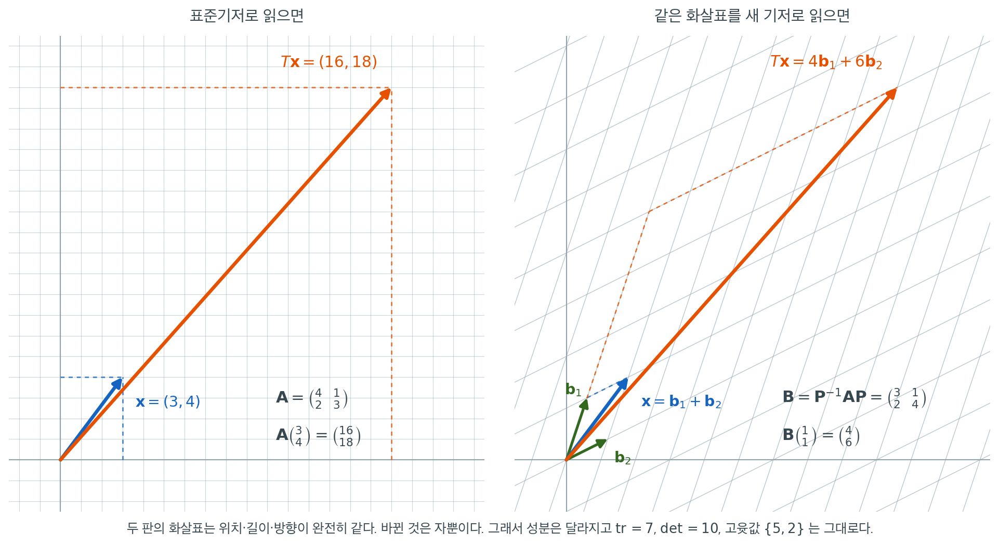

# 닮은 행렬

하나의 선형변환은 기저를 어떻게 잡느냐에 따라 여러 다른 행렬로 기술될 수 있다. 같은 변환을 나타내는 두 행렬을 **닮았다(similar)** 고 한다. 닮음을 알아보면 변환의 본질적 성질을 바꾸지 않고도 복잡한 행렬을 대각형 같은 더 간단한 행렬로 바꿔 놓을 수 있다. 회귀와 다변량 통계에서 닮음은 공분산행렬의 대각화, 주성분 좌표로의 회전, 이차형식의 단순화 등 모든 기저변환 논증의 바탕에 깔려 있다.

<div class="defn" markdown>

### 정의 1. 닮은 행렬 { .dfn }

두 정사각행렬 $\mathbf{A}, \mathbf{B} \in \mathbb{R}^{n \times n}$이 **닮았다**는 것은 가역행렬 $\mathbf{P} \in \mathbb{R}^{n \times n}$이 존재하여

$$
\mathbf{B} = \mathbf{P}^{-1}\mathbf{A}\mathbf{P}
$$

가 성립한다는 뜻이다. 동등하게 $\mathbf{A} = \mathbf{P}\mathbf{B}\mathbf{P}^{-1}$이다. 행렬 $\mathbf{P}$를 **기저변환행렬**이라 한다.

</div>

기하적 직관은 간단하다. $\mathbf{A}$가 표준기저에 대해 선형사상 $T: \mathbb{R}^n \to \mathbb{R}^n$을 나타내고 $\mathbf{P}$의 열들이 새 기저의 벡터들이라면, $\mathbf{B} = \mathbf{P}^{-1}\mathbf{A}\mathbf{P}$는 같은 사상 $T$를 새 기저로 표현한 행렬이다.

## 닮음은 동치관계다

닮음은 $n \times n$ 행렬 전체를 동치류로 분할한다.

**반사적.** 모든 행렬은 $\mathbf{P} = \mathbf{I}$를 통해 자기 자신과 닮았다.

$$
\mathbf{A} = \mathbf{I}^{-1}\mathbf{A}\mathbf{I}
$$

**대칭적.** $\mathbf{B} = \mathbf{P}^{-1}\mathbf{A}\mathbf{P}$이면 $\mathbf{Q} = \mathbf{P}^{-1}$에 대해 $\mathbf{A} = \mathbf{Q}^{-1}\mathbf{B}\mathbf{Q}$이다.

**추이적.** $\mathbf{B} = \mathbf{P}^{-1}\mathbf{A}\mathbf{P}$이고 $\mathbf{C} = \mathbf{Q}^{-1}\mathbf{B}\mathbf{Q}$이면

$$
\mathbf{C} = \mathbf{Q}^{-1}\mathbf{P}^{-1}\mathbf{A}\mathbf{P}\mathbf{Q} = (\mathbf{P}\mathbf{Q})^{-1}\mathbf{A}(\mathbf{P}\mathbf{Q})
$$

이므로 $\mathbf{C}$는 $\mathbf{R} = \mathbf{P}\mathbf{Q}$를 통해 $\mathbf{A}$와 닮았다.

## 닮음에 대한 불변량

닮음이 중요한 핵심 이유는 많은 중요한 행렬 관련 양이 **불변량**이라는 데 있다. 즉 한 닮음류에 속한 모든 행렬에 대해 같은 값을 갖는다.

<div class="thmbox" markdown>

### 정리 1. 닮음 불변량 { .thm }

$\mathbf{B} = \mathbf{P}^{-1}\mathbf{A}\mathbf{P}$이면 $\mathbf{A}$와 $\mathbf{B}$는 다음 성질을 공유한다.

1. **특성다항식**: $\det(\mathbf{B} - \lambda\mathbf{I}) = \det(\mathbf{A} - \lambda\mathbf{I})$
2. **고윳값**: $\mathbb{C}$ 안에서 대수적 중복도까지 포함해 같다
3. **대각합**: $\operatorname{tr}(\mathbf{B}) = \operatorname{tr}(\mathbf{A})$
4. **행렬식**: $\det(\mathbf{B}) = \det(\mathbf{A})$
5. **계수**: $\operatorname{rank}(\mathbf{B}) = \operatorname{rank}(\mathbf{A})$
6. **최소다항식**
7. **각 고윳값의 기하적 중복도**: $\dim\ker(\mathbf{B} - \lambda\mathbf{I}) = \dim\ker(\mathbf{A} - \lambda\mathbf{I})$

</div>

??? proof "증명"

    **1 (특성다항식).** $\lambda\mathbf{I} = \mathbf{P}^{-1}(\lambda\mathbf{I})\mathbf{P}$이므로

    $$
    \det(\mathbf{B} - \lambda\mathbf{I}) = \det\!\bigl(\mathbf{P}^{-1}\mathbf{A}\mathbf{P} - \mathbf{P}^{-1}(\lambda\mathbf{I})\mathbf{P}\bigr)
    $$

    이다. 왼쪽에서 $\mathbf{P}^{-1}$을, 오른쪽에서 $\mathbf{P}$를 묶어내면

    $$
    = \det\!\bigl(\mathbf{P}^{-1}(\mathbf{A} - \lambda\mathbf{I})\mathbf{P}\bigr) = \det(\mathbf{P}^{-1})\,\det(\mathbf{A} - \lambda\mathbf{I})\,\det(\mathbf{P})
    $$

    이고, $\det(\mathbf{P}^{-1})\det(\mathbf{P}) = \det(\mathbf{P}^{-1}\mathbf{P}) = 1$이므로 두 특성다항식이 같다.

    **2 (고윳값).** 고윳값은 특성다항식의 근이고 대수적 중복도는 그 근의 중복도이므로, 1번에서 곧바로 따라 나온다.

    **3 (대각합).** 대각합의 순환 성질 $\operatorname{tr}(\mathbf{X}\mathbf{Y}) = \operatorname{tr}(\mathbf{Y}\mathbf{X})$를 $\mathbf{X} = \mathbf{P}^{-1}$, $\mathbf{Y} = \mathbf{A}\mathbf{P}$에 적용하면

    $$
    \operatorname{tr}(\mathbf{B}) = \operatorname{tr}(\mathbf{P}^{-1}(\mathbf{A}\mathbf{P})) = \operatorname{tr}((\mathbf{A}\mathbf{P})\mathbf{P}^{-1}) = \operatorname{tr}(\mathbf{A})
    $$

    이다(연습문제 2).

    **4 (행렬식).** $\det$의 곱셈성에서 $\det(\mathbf{B}) = \det(\mathbf{P}^{-1})\det(\mathbf{A})\det(\mathbf{P}) = \det(\mathbf{A})$이다. 1번의 특성다항식에 $\lambda = 0$을 넣어도 같은 결론이 나온다.

    **5 (계수).** $\mathbf{P}$가 가역이면 $\operatorname{col}(\mathbf{A}\mathbf{P}) = \operatorname{col}(\mathbf{A})$이다($\mathbf{P}$의 열이 $\mathbb{R}^n$을 생성하므로 $\mathbf{A}\mathbf{P}$의 열이 $\mathbf{A}$의 열과 같은 공간을 생성한다). 또 $\operatorname{col}(\mathbf{P}^{-1}\mathbf{M}) = \mathbf{P}^{-1}\operatorname{col}(\mathbf{M})$이고 $\mathbf{P}^{-1}$은 동형사상이므로 차원을 바꾸지 않는다. 두 단계를 합치면

    $$
    \operatorname{rank}(\mathbf{B}) = \dim \mathbf{P}^{-1}\operatorname{col}(\mathbf{A}\mathbf{P}) = \dim\operatorname{col}(\mathbf{A}) = \operatorname{rank}(\mathbf{A})
    $$

    이다.

    **6 (최소다항식).** 임의의 다항식 $f$에 대해 $f(\mathbf{B}) = \mathbf{P}^{-1}f(\mathbf{A})\mathbf{P}$이다(연습문제 6). 따라서 $f(\mathbf{A}) = \mathbf{O}$와 $f(\mathbf{B}) = \mathbf{O}$가 동등하므로, $\mathbf{A}$를 없애는 다항식 전체와 $\mathbf{B}$를 없애는 다항식 전체가 같은 집합이고, 그중 최고차항의 계수가 1인 최소 차수 원소도 같다.

    **7 (기하적 중복도).** $\mathbf{B} - \lambda\mathbf{I} = \mathbf{P}^{-1}(\mathbf{A} - \lambda\mathbf{I})\mathbf{P}$이므로 5번을 $\mathbf{A} - \lambda\mathbf{I}$에 적용하면 계수가 같고, 따라서 차원정리에 의해 영공간의 차원도 같다. $\square$

!!! warning "중복도를 세는 규약"
    2번에서 고윳값을 $\mathbb{C}$ 안에서 센다는 점이 중요하다. 실수 성분의 행렬도 실수 고윳값을 갖지 않을 수 있다(예: 회전행렬 $\begin{pmatrix} 0 & -1 \\ 1 & 0 \end{pmatrix}$의 고윳값은 $\pm i$다). 3번과 4번이 고윳값의 합·곱으로 설명되는 것도 복소 고윳값을 중복도까지 모두 셀 때뿐이다. 자세한 것은 다음다음 쪽 "대각합과 고윳값"에서 다룬다.

### 닮음의 완전 불변량

정리 1 의 목록은 길지만 어느 것도 닮음류를 **완전히** 결정하지는 못한다. 완전 불변량은 하나 더 위에 있다.

<div class="thmbox" markdown>

### 정리 2. 조르당 형은 닮음의 완전 불변량 { .thm }

$\mathbf{A}, \mathbf{B} \in \mathbb{C}^{n \times n}$에 대해, $\mathbf{A}$와 $\mathbf{B}$가 닮을 필요충분조건은 둘의 조르당 표준형이 (조르당 블록의 순서를 무시하고) 같은 것이다.

</div>

??? proof "증명"

    $(\Rightarrow)$ 조르당 표준형 정리에 의해 $\mathbf{A} = \mathbf{S}\mathbf{J}\mathbf{S}^{-1}$인 가역 $\mathbf{S}$와 조르당 형 $\mathbf{J}$가 존재한다. $\mathbf{B} = \mathbf{P}^{-1}\mathbf{A}\mathbf{P}$이면 $\mathbf{R} = \mathbf{S}^{-1}\mathbf{P}$로 두고

    $$
    \mathbf{B} = \mathbf{P}^{-1}\mathbf{S}\mathbf{J}\mathbf{S}^{-1}\mathbf{P} = \mathbf{R}^{-1}\mathbf{J}\mathbf{R}
    $$

    이므로 $\mathbf{B}$도 같은 $\mathbf{J}$와 닮는다. 조르당 형의 유일성(블록의 순서 제외)에 의해 $\mathbf{B}$의 조르당 형은 $\mathbf{J}$다.

    $(\Leftarrow)$ 둘 다 같은 $\mathbf{J}$와 닮으면, 닮음이 동치관계(위의 대칭성과 추이성)이므로 서로 닮는다. $\square$

!!! danger "정리 1 의 역은 거짓이다"
    특성다항식이(따라서 고윳값·대각합·행렬식이 모두) 같아도 닮은 것은 아니다. 가장 짧은 반례는

    $$
    \mathbf{N} = \begin{pmatrix} 0 & 1 \\ 0 & 0 \end{pmatrix}, \qquad \mathbf{O} = \begin{pmatrix} 0 & 0 \\ 0 & 0 \end{pmatrix}
    $$

    이다. 둘 다 특성다항식이 $\lambda^2$이고 $\operatorname{tr} = \det = 0$이다. 그러나 $\operatorname{rank}(\mathbf{N}) = 1 \neq 0 = \operatorname{rank}(\mathbf{O})$이므로 정리 1 의 5번에 걸려 닮을 수 없다. 계수까지 맞춰 놓아도 여전히 부족하다. 연습문제 3 의 $2\mathbf{I}$와 $\begin{pmatrix} 2 & 1 \\ 0 & 2 \end{pmatrix}$는 특성다항식·대각합·행렬식·계수가 모두 같지만 기하적 중복도가 달라 닮지 않는다.

## 불변량이 아닌 성질

모든 행렬 성질이 닮음에서 보존되는 것은 아니다. 특히 다음과 같다.

- **고유벡터**는 불변이 아니다. 고윳값은 공유하지만 고유벡터는 공유하지 않는다. $\mathbf{A}\mathbf{v} = \lambda\mathbf{v}$이면 $\mathbf{B}(\mathbf{P}^{-1}\mathbf{v}) = \mathbf{P}^{-1}\mathbf{A}\mathbf{v} = \lambda(\mathbf{P}^{-1}\mathbf{v})$이므로, $\mathbf{B}$의 고유벡터는 $\mathbf{A}$의 고유벡터를 $\mathbf{P}^{-1}$로 옮긴 것이다. 고유공간은 **대응**되지만 같지는 않다. 고윳값은 변환의 성질이고 고유벡터는 좌표의 성질이기 때문이다.
- **대칭성**은 불변이 아니다. 대칭행렬이 대칭이 아닌 행렬과 닮을 수 있다(연습문제 7). 기저변환행렬 $\mathbf{P}$가 직교행렬일 필요는 없다.
- **양정치성**은 불변이 아니다. 여기서 양정치성은 모든 $\mathbf{x} \neq \mathbf{0}$에 대해 $\mathbf{x}^\top\mathbf{A}\mathbf{x} > 0$인 것을 말한다. $\mathbf{A} = \operatorname{diag}(1, 100)$과 $\mathbf{P} = \begin{pmatrix} 1 & 1 \\ 0 & 1 \end{pmatrix}$을 잡으면 $\mathbf{B} = \mathbf{P}^{-1}\mathbf{A}\mathbf{P} = \begin{pmatrix} 1 & -99 \\ 0 & 100 \end{pmatrix}$인데, $\mathbf{x} = (1, t)^\top$에서 $\mathbf{x}^\top\mathbf{B}\mathbf{x} = 1 - 99t + 100t^2$이고 이 이차식의 판별식 $99^2 - 400 > 0$이라 어떤 $t$에서 음수가 된다. **고윳값이 모두 양수라는 성질은 불변이지만, 이차형식의 부호는 불변이 아니다.** 둘이 동등해지는 것은 행렬이 대칭일 때뿐이다(이 절의 "양정치행렬" 쪽).
- **개별 성분**은 당연히 바뀐다.

기저변환행렬 $\mathbf{P}$를 직교행렬($\mathbf{P}^\top = \mathbf{P}^{-1}$)로 제한하면, 그 결과인 **직교닮음** $\mathbf{B} = \mathbf{P}^\top\mathbf{A}\mathbf{P}$는 대칭성을 보존한다(연습문제 8). 스펙트럼 정리가 직교대각화를 내놓는 이유가 여기에 있다.

## 예

다음 행렬을 생각하자.

$$
\mathbf{A} = \begin{pmatrix} 4 & 1 \\ 2 & 3 \end{pmatrix}
$$

$\det(\mathbf{A} - \lambda\mathbf{I}) = (4 - \lambda)(3 - \lambda) - 2 = \lambda^2 - 7\lambda + 10 = (\lambda - 5)(\lambda - 2) = 0$에서 고윳값 $\lambda_1 = 5$, $\lambda_2 = 2$를 얻는다.

고유벡터: $\lambda_1 = 5$에 대해 $(\mathbf{A} - 5\mathbf{I})\mathbf{v} = \mathbf{0}$을 풀면 $\mathbf{v}_1 = (1, 1)^\top$이고, $\lambda_2 = 2$에 대해 $(\mathbf{A} - 2\mathbf{I})\mathbf{v} = \mathbf{0}$을 풀면 $\mathbf{v}_2 = (1, -2)^\top$이다.

$\mathbf{P} = \begin{pmatrix} 1 & 1 \\ 1 & -2 \end{pmatrix}$로 두면

$$
\mathbf{P}^{-1}\mathbf{A}\mathbf{P} = \begin{pmatrix} 5 & 0 \\ 0 & 2 \end{pmatrix} = \boldsymbol{\Lambda}
$$

이다. 대각행렬 $\boldsymbol{\Lambda}$는 $\mathbf{A}$와 닮았고, 두 행렬이 $\operatorname{tr} = 7$, $\det = 10$, 고윳값 $\{5, 2\}$를 공유함을 확인할 수 있다.

### 그림으로 보기

닮음은 대각화만을 위한 장치가 아니다. 기저를 아무렇게나 바꿔도 닮은 행렬이 나온다. 같은 $\mathbf{A} = \begin{pmatrix} 4 & 1 \\ 2 & 3 \end{pmatrix}$를 이번에는 대각이 아닌 다른 좌표에서 적어 보자.



두 판에 그려진 화살표는 완전히 같은 화살표다. 파란 화살표가 벡터 $\mathbf{x}$이고 주황 화살표가 그것을 변환한 $T\mathbf{x}$이며, 위치도 길이도 방향도 두 판에서 똑같다. 바뀐 것은 그것을 읽는 **자**, 곧 배경의 격자뿐이다.

표준기저로 읽으면 $\mathbf{x} = (3,4)^\top$이고 $T\mathbf{x} = (16,18)^\top$이며, 이 대응을 적은 행렬이 $\mathbf{A}$다. 기저를 $\mathbf{b}_1 = (1,3)^\top$, $\mathbf{b}_2 = (2,1)^\top$로 바꾸면 같은 $\mathbf{x}$의 성분은 $(1,1)$이 되고 같은 $T\mathbf{x}$의 성분은 $(4,6)$이 된다. 이 대응을 적은 행렬은 $\mathbf{P} = \begin{pmatrix} 1 & 2 \\ 3 & 1 \end{pmatrix}$에 대해

$$
\mathbf{B} = \mathbf{P}^{-1}\mathbf{A}\mathbf{P} = \begin{pmatrix} 3 & 1 \\ 2 & 4 \end{pmatrix}
$$

이다. $\mathbf{B}$는 $\mathbf{A}$와 다른 행렬이지만 $\operatorname{tr}(\mathbf{B}) = 7$, $\det(\mathbf{B}) = 10$, 고윳값 $\{5, 2\}$는 그대로다.

**닮은 행렬이란 같은 일을 다른 말로 받아 적은 것이다.** 성분은 번역의 산물이라 기저를 고르는 사람 마음대로 바뀌지만, 대각합·행렬식·고윳값은 화살표 자체의 성질이므로 번역에 흔들리지 않는다. 다음 절의 대각화는 이 자유를 가장 유리하게 쓴 특수한 경우, 곧 $\mathbf{B}$가 대각이 되도록 기저를 고르는 경우일 뿐이다.

## 통계와의 연결

닮은 행렬은 다변량 통계 전반에 등장한다.

- **공분산행렬의 스펙트럼 분해.** $\boldsymbol{\Sigma} = \mathbf{Q}\boldsymbol{\Lambda}\mathbf{Q}^\top$이면 $\boldsymbol{\Sigma}$는 (직교행렬 $\mathbf{Q}$를 통해) $\boldsymbol{\Lambda}$와 닮았다. 고유기저에서 작업하면 계산이 간단해진다. $\operatorname{tr}(\boldsymbol{\Sigma}) = \sum_i \lambda_i$가 총분산을 주고, $\det(\boldsymbol{\Sigma}) = \prod_i \lambda_i$가 일반화 분산을 측정한다.

- **이차형식의 단순화.** 마할라노비스 거리 $(\mathbf{x} - \boldsymbol{\mu})^\top\boldsymbol{\Sigma}^{-1}(\mathbf{x} - \boldsymbol{\mu})$는 $\boldsymbol{\Sigma}^{-1}$이 대각이 되는 고유기저로 옮겨서 분석할 수 있다. 이것이 정규확률벡터의 이차형식이 카이제곱분포를 따름을 유도하는 근거다.

- **모자 행렬 대각합의 불변성.** 회귀에서 예측변수를 어떻게 코딩하거나 척도를 바꾸든 $\operatorname{tr}(\mathbf{H}) = p$다. 다만 그 이유는 닮음이 아니다. 재매개변수화 $\mathbf{X} \mapsto \mathbf{X}\mathbf{C}$는 그람 행렬을 $\mathbf{C}^\top\mathbf{X}^\top\mathbf{X}\mathbf{C}$로 보내는 **합동변환**이며, $\mathbf{C}$가 직교행렬이 아니면 닮음변환이 아니라서 고윳값도 보존하지 않는다. $\operatorname{tr}(\mathbf{H})$가 보존되는 것은 열공간이 그대로여서 $\mathbf{H}$ 자체가 아예 바뀌지 않기 때문이다(연습문제 4).

## 연습문제

<div class="drillbox" markdown>

**연습문제 1.** <span class="diff easy" title="쉬움"></span>
$\mathbf{B} = \mathbf{P}^{-1}\mathbf{A}\mathbf{P}$가 되는 가역행렬 $\mathbf{P}$를 찾아 $\mathbf{A} = \begin{pmatrix} 1 & 2 \\ 0 & 3 \end{pmatrix}$와 $\mathbf{B} = \begin{pmatrix} 3 & 0 \\ 0 & 1 \end{pmatrix}$가 닮았음을 보여라.

</div>

??? success "풀이"
    두 행렬 모두 고윳값이 $\lambda_1 = 1$과 $\lambda_2 = 3$이다($\mathbf{B}$는 이 값들을 대각에 갖는 대각행렬이고, $\mathbf{A}$는 이 값들을 대각에 갖는 상삼각행렬이다).

    $\mathbf{A}$의 고유벡터는 $\lambda = 1$에 대해 $\mathbf{v}_1 = (1, 0)^\top$이고, $\lambda = 3$에 대해서는 $(\mathbf{A} - 3\mathbf{I})\mathbf{v} = \mathbf{0}$을 풀어 $\mathbf{v}_2 = (1, 1)^\top$이다.

    $\mathbf{B}$의 대각이 $\{3, 1\}$ 순서이므로 $\lambda = 3$의 고유벡터가 첫 열에 오도록 고유벡터를 열로 배열한다: $\mathbf{P} = \begin{pmatrix} 1 & 1 \\ 1 & 0 \end{pmatrix}$, $\mathbf{P}^{-1} = \begin{pmatrix} 0 & 1 \\ 1 & -1 \end{pmatrix}$.

    확인: $\mathbf{P}^{-1}\mathbf{A}\mathbf{P} = \begin{pmatrix} 0 & 1 \\ 1 & -1 \end{pmatrix}\begin{pmatrix} 1 & 2 \\ 0 & 3 \end{pmatrix}\begin{pmatrix} 1 & 1 \\ 1 & 0 \end{pmatrix} = \begin{pmatrix} 3 & 0 \\ 0 & 1 \end{pmatrix} = \mathbf{B}$.

<div class="drillbox" markdown>

**연습문제 2.** <span class="diff med" title="중간"></span>
닮은 행렬은 행렬식이 같고 대각합도 같음을 증명하라.

</div>

??? success "풀이"
    $\mathbf{B} = \mathbf{P}^{-1}\mathbf{A}\mathbf{P}$이면

    $$
    \det(\mathbf{B}) = \det(\mathbf{P}^{-1}\mathbf{A}\mathbf{P}) = \det(\mathbf{P}^{-1})\det(\mathbf{A})\det(\mathbf{P}) = \frac{1}{\det(\mathbf{P})}\det(\mathbf{A})\det(\mathbf{P}) = \det(\mathbf{A})
    $$

    이다. 대각합의 경우 순환 성질 $\operatorname{tr}(\mathbf{X}\mathbf{Y}\mathbf{Z}) = \operatorname{tr}(\mathbf{Z}\mathbf{X}\mathbf{Y})$를 쓰면

    $$
    \operatorname{tr}(\mathbf{B}) = \operatorname{tr}(\mathbf{P}^{-1}\mathbf{A}\mathbf{P}) = \operatorname{tr}(\mathbf{A}\mathbf{P}\mathbf{P}^{-1}) = \operatorname{tr}(\mathbf{A})
    $$

    이다. $\square$

<div class="drillbox" markdown>

**연습문제 3.** <span class="diff med" title="중간"></span>
고윳값, 대각합, 행렬식이 모두 같지만 닮지는 않은 두 개의 $2 \times 2$ 행렬의 예를 들어라.

</div>

??? success "풀이"
    $\mathbf{A} = \begin{pmatrix} 2 & 0 \\ 0 & 2 \end{pmatrix}$와 $\mathbf{B} = \begin{pmatrix} 2 & 1 \\ 0 & 2 \end{pmatrix}$를 생각하자.

    둘 다 고윳값이 $\lambda = 2$(대수적 중복도 2)이고 $\operatorname{tr} = 4$, $\det = 4$이다.

    그러나 $\mathbf{A} = 2\mathbf{I}$는 모든 행렬과 교환되므로 임의의 가역 $\mathbf{P}$에 대해 $\mathbf{P}^{-1}\mathbf{A}\mathbf{P} = \mathbf{P}^{-1}(2\mathbf{I})\mathbf{P} = 2\mathbf{I} = \mathbf{A}$이다. $\mathbf{B} \neq \mathbf{A}$이므로 어떤 닮음변환도 $\mathbf{A}$를 $\mathbf{B}$로 바꿀 수 없다. 차이는 $\mathbf{A}$가 대각화 가능한 반면(기하적 중복도 2) $\mathbf{B}$는 그렇지 않다는 데 있다(기하적 중복도 1).

<div class="drillbox" markdown>

**연습문제 4.** <span class="diff med" title="중간"></span>
회귀모형을 재매개변수화하면(예: 예측변수를 중심화하면) $\operatorname{tr}(\mathbf{H})$는 바뀌지 않는데 $\mathbf{X}^\top\mathbf{X}$의 고윳값은 바뀔 수 있다. **닮음**과 **합동**의 차이로 이 비대칭을 설명하고 수치로 확인하라.

</div>

??? success "풀이"
    재매개변수화는 어떤 가역행렬 $\mathbf{C}$에 대해 $\mathbf{X}$를 $\mathbf{X}\mathbf{C}$로 바꾸는 것에 해당한다. 모자 행렬은 다음과 같이 변환된다.

    $$
    \mathbf{H}' = \mathbf{X}\mathbf{C}(\mathbf{C}^\top\mathbf{X}^\top\mathbf{X}\mathbf{C})^{-1}\mathbf{C}^\top\mathbf{X}^\top = \mathbf{X}(\mathbf{X}^\top\mathbf{X})^{-1}\mathbf{X}^\top = \mathbf{H}
    $$

    모자 행렬은 대각합만이 아니라 **완전히** 불변이다. $\mathbf{X}$와 $\mathbf{X}\mathbf{C}$의 열공간이 같고, $\mathbf{H}$는 그 열공간으로의 직교사영이어서 기저를 어떻게 적든 같은 사영이기 때문이다. 따라서 $\operatorname{tr}(\mathbf{H}) = p$도 그대로이며, 이는 재매개변수화로 모수의 개수가 바뀌지 않는다는 사실을 반영한다.

    그람 행렬은 사정이 다르다. $\mathbf{X}^\top\mathbf{X}$는 $\mathbf{C}^\top(\mathbf{X}^\top\mathbf{X})\mathbf{C}$로 바뀌는데, 이는 $\mathbf{P}^{-1}\mathbf{A}\mathbf{P}$ 꼴이 아니라 $\mathbf{C}^\top\mathbf{A}\mathbf{C}$ 꼴, 곧 **합동변환**이다. $\mathbf{C}$가 직교행렬이면 $\mathbf{C}^\top = \mathbf{C}^{-1}$이라 둘이 일치하지만, 일반적인 가역행렬에서는 서로 다른 관계다. **합동이 보존하는 것은 계수와, 실베스터의 관성 법칙에 따른 고윳값의 부호 분포뿐이고 고윳값 자체는 보존하지 않는다.**

    ```python
    import numpy as np

    rng = np.random.default_rng(0)
    n = 50
    x = rng.normal(5, 2, n)

    X = np.column_stack([np.ones(n), x])              # 원래 설계행렬
    Xc = np.column_stack([np.ones(n), x - x.mean()])  # 중심화한 설계행렬
    C = np.array([[1., -x.mean()], [0., 1.]])         # Xc = X C

    print("Xc = X C 인가:", np.allclose(X @ C, Xc))
    print("그람 고윳값  원래:", np.linalg.eigvalsh(X.T @ X).round(4))
    print("그람 고윳값 중심화:", np.linalg.eigvalsh(Xc.T @ Xc).round(4))

    H = X @ np.linalg.inv(X.T @ X) @ X.T
    Hc = Xc @ np.linalg.inv(Xc.T @ Xc) @ Xc.T
    print("H = H' 인가:", np.allclose(H, Hc))
    print("tr(H), tr(H'):", round(np.trace(H), 6), round(np.trace(Hc), 6))
    ```

    출력:

    ```
    Xc = X C 인가: True
    그람 고윳값  원래: [   5.2108 1593.1458]
    그람 고윳값 중심화: [ 50.     166.0321]
    H = H' 인가: True
    tr(H), tr(H'): 2.0 2.0
    ```

    모자 행렬은 성분 하나까지 같은데 그람 행렬의 고윳값은 $\{5.21,\ 1593.15\}$에서 $\{50.00,\ 166.03\}$으로 전혀 다른 값이 된다. **중심화가 조건수를 $306$에서 $3.3$으로 줄여 놓았는데, 적합값과 자유도는 하나도 달라지지 않았다.** 다중공선성 진단에 쓰는 조건수가 중심화 여부에 이토록 민감한 이유가 여기에 있고, 그러면서도 그 진단이 적합 자체와 무관한 이유도 여기에 있다. $\square$

<div class="drillbox" markdown>

**연습문제 5.** <span class="diff med" title="중간"></span>
$\mathbf{B} = \mathbf{P}^{-1}\mathbf{A}\mathbf{P}$이면 모든 자연수 $k$에 대해 $\mathbf{B}^k = \mathbf{P}^{-1}\mathbf{A}^k\mathbf{P}$임을 보여라. 이를 이용해 본문의 $\mathbf{A} = \begin{pmatrix} 4 & 1 \\ 2 & 3 \end{pmatrix}$에 대해 $\mathbf{A}^{10}$을 구하라.

</div>

??? success "풀이"
    가운데의 $\mathbf{P}\mathbf{P}^{-1} = \mathbf{I}$가 차례로 소거된다.

    $$
    \mathbf{B}^k = (\mathbf{P}^{-1}\mathbf{A}\mathbf{P})(\mathbf{P}^{-1}\mathbf{A}\mathbf{P})\cdots(\mathbf{P}^{-1}\mathbf{A}\mathbf{P})
    = \mathbf{P}^{-1}\mathbf{A}^k\mathbf{P}
    $$

    거꾸로 읽으면 $\mathbf{A}^k = \mathbf{P}\mathbf{B}^k\mathbf{P}^{-1}$이다. $\mathbf{B} = \boldsymbol{\Lambda} = \operatorname{diag}(5, 2)$가 대각이면 $\boldsymbol{\Lambda}^{10} = \operatorname{diag}(5^{10}, 2^{10})$이므로 거듭제곱이 곱셈 한 번으로 끝난다. **대각화가 유용한 가장 실용적인 이유다.**

    ```python
    import numpy as np

    A = np.array([[4., 1.], [2., 3.]])
    P = np.array([[1., 1.], [1., -2.]])          # 고유벡터를 열로
    Lam = np.diag([5., 2.])

    A10_direct = np.linalg.matrix_power(A, 10)
    A10_via_diag = P @ np.diag([5.**10, 2.**10]) @ np.linalg.inv(P)

    print("A^10 =\n", A10_direct)
    print("일치하는가:", np.allclose(A10_direct, A10_via_diag))
    ```

    출력:

    ```
    A^10 =
     [[6510758. 3254867.]
     [6509734. 3255891.]]
    일치하는가: True
    ```

    직접 $10$번 곱한 결과와 대각화를 거친 결과가 같다. 행렬이 커지고 $k$가 커질수록 이 차이가 결정적이 된다. $\square$

<div class="drillbox" markdown>

**연습문제 6.** <span class="diff med" title="중간"></span>
다항식 $f(x) = c_0 + c_1 x + \cdots + c_m x^m$에 대해, $\mathbf{A}$와 $\mathbf{B}$가 닮았으면 $f(\mathbf{A})$와 $f(\mathbf{B})$도 같은 $\mathbf{P}$로 닮았음을 보여라.

</div>

??? success "풀이"
    연습문제 5에서 $\mathbf{B}^k = \mathbf{P}^{-1}\mathbf{A}^k\mathbf{P}$이고, $k = 0$일 때도 $\mathbf{B}^0 = \mathbf{I} = \mathbf{P}^{-1}\mathbf{I}\mathbf{P}$로 성립한다. 따라서

    $$
    f(\mathbf{B}) = \sum_{k=0}^{m} c_k \mathbf{B}^k
    = \sum_{k=0}^{m} c_k \mathbf{P}^{-1}\mathbf{A}^k \mathbf{P}
    = \mathbf{P}^{-1}\!\left(\sum_{k=0}^{m} c_k \mathbf{A}^k\right)\!\mathbf{P}
    = \mathbf{P}^{-1} f(\mathbf{A}) \mathbf{P}
    $$

    이다. 가운데 등식에서 $\mathbf{P}^{-1}$과 $\mathbf{P}$를 합의 밖으로 묶어낼 수 있는 것이 핵심이다.

    **따름정리.** $f(\mathbf{A}) = \mathbf{O}$이면 $f(\mathbf{B}) = \mathbf{P}^{-1}\mathbf{O}\mathbf{P} = \mathbf{O}$이다. 곧 **최소다항식이 닮음 불변량**이라는 사실(정리 1 의 6번)이 여기서 따라 나온다.

    이 성질은 다항식을 넘어 수렴하는 멱급수에도 그대로 확장된다. 예컨대 행렬 지수함수는 $e^{\mathbf{B}} = \mathbf{P}^{-1}e^{\mathbf{A}}\mathbf{P}$를 만족한다. $\square$

<div class="drillbox" markdown>

**연습문제 7.** <span class="diff easy" title="쉬움"></span>
대칭행렬이 대칭이 아닌 행렬과 닮을 수 있음을 구체적인 예로 보여라.

</div>

??? success "풀이"
    $\mathbf{A} = \begin{pmatrix} 1 & 0 \\ 0 & 2 \end{pmatrix}$(대칭)과 $\mathbf{P} = \begin{pmatrix} 1 & 1 \\ 0 & 1 \end{pmatrix}$(직교가 **아닌** 가역행렬)을 잡으면

    $$
    \mathbf{P}^{-1}\mathbf{A}\mathbf{P}
    = \begin{pmatrix} 1 & -1 \\ 0 & 1 \end{pmatrix}
      \begin{pmatrix} 1 & 0 \\ 0 & 2 \end{pmatrix}
      \begin{pmatrix} 1 & 1 \\ 0 & 1 \end{pmatrix}
    = \begin{pmatrix} 1 & -1 \\ 0 & 2 \end{pmatrix}
    $$

    이다. 오른쪽은 대칭이 아니지만 고윳값은 여전히 $\{1, 2\}$다.

    ```python
    import numpy as np

    A = np.diag([1., 2.])
    P = np.array([[1., 1.], [0., 1.]])
    B = np.linalg.inv(P) @ A @ P

    print("B =\n", B)
    print("B가 대칭인가:", np.allclose(B, B.T))
    print("A의 고윳값:", np.sort(np.linalg.eigvals(A)))
    print("B의 고윳값:", np.sort(np.linalg.eigvals(B)))
    ```

    출력:

    ```
    B =
     [[ 1. -1.]
     [ 0.  2.]]
    B가 대칭인가: False
    A의 고윳값: [1. 2.]
    B의 고윳값: [1. 2.]
    ```

    **대칭성은 닮음 불변량이 아니다.** 기저를 직교가 아닌 방향으로 비틀면 대칭성이 깨진다. 반면 고윳값은 그대로다. $\square$

<div class="drillbox" markdown>

**연습문제 8.** <span class="diff easy" title="쉬움"></span>
$\mathbf{Q}$가 직교행렬이고 $\mathbf{A}$가 대칭이면 $\mathbf{Q}^\top\mathbf{A}\mathbf{Q}$도 대칭임을 보여라. 연습문제 7과 견주어 무엇이 달라졌는지 설명하라.

</div>

??? success "풀이"
    $\mathbf{Q}$가 직교이므로 $\mathbf{Q}^{-1} = \mathbf{Q}^\top$이고, 따라서 $\mathbf{Q}^\top\mathbf{A}\mathbf{Q}$는 닮음변환이다. 전치를 취하면

    $$
    (\mathbf{Q}^\top\mathbf{A}\mathbf{Q})^\top = \mathbf{Q}^\top \mathbf{A}^\top (\mathbf{Q}^\top)^\top = \mathbf{Q}^\top\mathbf{A}\mathbf{Q}
    $$

    이다($\mathbf{A}^\top = \mathbf{A}$를 썼다). 곧 대칭이다.

    연습문제 7과의 차이는 **$\mathbf{P}$에 건 제약** 하나뿐이다. 일반적인 가역행렬에서는 $\mathbf{P}^{-1} \neq \mathbf{P}^\top$이므로 위 계산의 마지막 단계가 성립하지 않는다.

    이것이 **직교닮음**을 따로 구분하는 이유다. 스펙트럼 정리가 대칭행렬에 대해 $\mathbf{A} = \mathbf{Q}\boldsymbol{\Lambda}\mathbf{Q}^\top$를 보장할 때, 대각화가 하필 직교행렬로 이루어진다는 점이 결정적이다. 그 덕분에 공분산행렬을 대각화해도 대칭성과 양정치성이 함께 보존된다. $\square$

<div class="drillbox" markdown>

**연습문제 9.** <span class="diff med" title="중간"></span>
무작위로 뽑은 가역행렬 $\mathbf{P}$로 닮음변환을 만들어, 성분은 완전히 달라지지만 고윳값·대각합·행렬식·계수는 보존됨을 수치로 확인하라.

</div>

??? success "풀이"
    ```python
    import numpy as np

    rng = np.random.default_rng(0)
    A = np.array([[4., 1., 0.],
                  [2., 3., 1.],
                  [0., 1., 5.]])

    P = rng.normal(size=(3, 3))
    print("P가 가역인가 (det):", round(np.linalg.det(P), 4))

    B = np.linalg.inv(P) @ A @ P

    print("\nA =\n", np.round(A, 3))
    print("B =\n", np.round(B, 3))

    print("\n고윳값 A:", np.sort(np.linalg.eigvals(A).real).round(6))
    print("고윳값 B:", np.sort(np.linalg.eigvals(B).real).round(6))
    print("대각합 :", round(np.trace(A), 6), round(np.trace(B), 6))
    print("행렬식 :", round(np.linalg.det(A), 6), round(np.linalg.det(B), 6))
    print("계수   :", np.linalg.matrix_rank(A), np.linalg.matrix_rank(B))
    ```

    출력:

    ```
    P가 가역인가 (det): 0.4433

    A =
     [[4. 1. 0.]
     [2. 3. 1.]
     [0. 1. 5.]]
    B =
     [[ 6.627  1.644  0.05 ]
     [-2.824  0.822 -0.021]
     [-0.935 -1.815  4.55 ]]

    고윳값 A: [1.78568  4.539189 5.675131]
    고윳값 B: [1.78568  4.539189 5.675131]
    대각합 : 12.0 12.0
    행렬식 : 46.0 46.0
    계수   : 3 3
    ```

    성분은 서로 아무 관련이 없어 보이지만 네 가지 불변량은 소수점 아래까지 일치한다.

    수치적으로 한 가지 주의할 점이 있다. $\mathbf{P}$가 특이행렬에 가까우면 $\mathbf{P}^{-1}$의 성분이 커져 반올림 오차가 증폭된다. 그래서 실무에서는 **직교행렬**을 기저변환에 쓴다. $\mathbf{Q}^{-1} = \mathbf{Q}^\top$이므로 역행렬을 계산할 필요조차 없고 수치적으로도 안정하다. $\square$

<div class="drillbox" markdown>

**연습문제 10.** <span class="diff med" title="중간"></span>
주성분분석은 공분산행렬 $\boldsymbol{\Sigma}$를 직교행렬 $\mathbf{Q}$로 대각화한다: $\boldsymbol{\Lambda} = \mathbf{Q}^\top\boldsymbol{\Sigma}\mathbf{Q}$. 이때 **총분산**이 보존되는 이유를 닮음 불변량으로 설명하고 수치로 확인하라.

</div>

??? success "풀이"
    총분산은 각 변수의 분산을 모두 더한 값, 곧 $\operatorname{tr}(\boldsymbol{\Sigma})$로 정의된다. $\boldsymbol{\Lambda}$는 $\boldsymbol{\Sigma}$와 닮았고 대각합은 닮음 불변량이므로

    $$
    \operatorname{tr}(\boldsymbol{\Sigma}) = \operatorname{tr}(\boldsymbol{\Lambda}) = \sum_{i=1}^{p} \lambda_i
    $$

    이다. 곧 **주성분의 분산을 모두 더하면 원래 변수들의 분산 총합과 같다.** "첫 두 주성분이 총분산의 $85\%$를 설명한다"는 익숙한 표현이 성립하는 근거가 바로 이 등식이다.

    ```python
    import numpy as np

    rng = np.random.default_rng(1)
    X = rng.normal(size=(500, 3)) @ np.array([[2., 1., 0.],
                                              [0., 1., 1.],
                                              [0., 0., 3.]])
    Sigma = np.cov(X, rowvar=False)

    lam, Q = np.linalg.eigh(Sigma)          # 대칭행렬이므로 eigh
    lam = lam[::-1]                          # 큰 것부터

    print("각 변수의 분산:", np.diag(Sigma).round(4))
    print("총분산 tr(Sigma):", round(np.trace(Sigma), 6))
    print("고윳값의 합    :", round(lam.sum(), 6))
    print("설명 비율(%)   :", (lam / lam.sum() * 100).round(1))
    print("첫 두 성분 누적(%):", round(lam[:2].sum() / lam.sum() * 100, 1))
    ```

    출력:

    ```
    각 변수의 분산: [ 4.0421  2.0308 10.0525]
    총분산 tr(Sigma): 16.125337
    고윳값의 합    : 16.125337
    설명 비율(%)   : [62.9 32.7  4.3]
    첫 두 성분 누적(%): 95.7
    ```

    대각합은 같지만 **대각 성분의 분포는 완전히 달라진다.** 원래 변수들은 분산을 고만고만하게 나눠 갖는 반면, 주성분은 앞쪽에 몰아준다. 회전이 하는 일이 바로 이것이다. 총량은 그대로 두고 **배분만 바꾼다.**

    행렬식도 불변이므로 $\det(\boldsymbol{\Sigma}) = \prod_i \lambda_i$가 성립한다. 이 값을 **일반화 분산**이라 하며, 다변량 정규분포의 밀도에 그대로 등장한다. $\square$

---

## 정리하며

두 행렬이 서로 다른 기저에서 같은 선형변환을 나타낼 때 이 둘은 닮았다. 닮은 행렬은 좌표계의 선택에서만 다를 뿐, 특성다항식·고윳값·대각합·행렬식·계수·최소다항식·기하적 중복도 등 변환의 본질적 성질을 모두 공유한다. 반면 **고유벡터·대칭성·양정치성은 공유하지 않는다.** 고유벡터는 $\mathbf{P}^{-1}$로 옮겨지고, 대칭성과 이차형식의 부호는 기저를 직교가 아닌 방향으로 비틀면 깨진다.

역은 성립하지 않는다는 점도 기억해 둘 만하다. 정리 1 의 불변량이 모두 일치해도 닮았다고 결론지을 수 없고, 닮음류를 완전히 결정하는 것은 조르당 형이다(정리 2).

다음 주제인 대각화가 가장 중요한 특수한 경우다. 행렬이 대각이 되는 기저를 찾아 계산과 해석을 단순하게 만드는 것이다.
