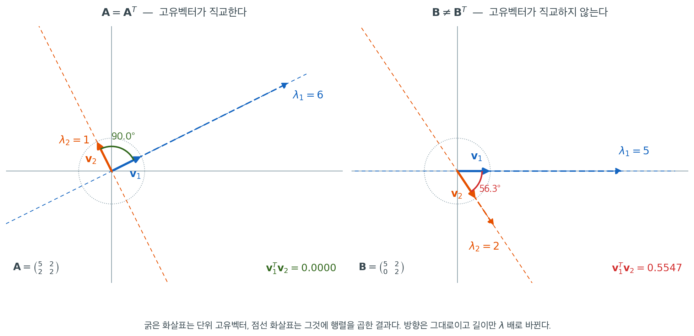

# 대칭행렬

$\mathbf{A} = \mathbf{A}^\top$를 만족하는 대칭행렬은 통계에서 가장 중요한 단일 행렬 부류다. 모든 공분산행렬이 대칭이다. 모든 모자 행렬이 대칭이다. 정규방정식에 등장하는 그람 행렬 $\mathbf{X}^\top\mathbf{X}$도 대칭이다. 스펙트럼 정리는 대칭행렬이 실수 고윳값과 정규직교 고유기저를 가짐을 보장하며, 따라서 직교변환으로 대각화된다. 이 특수한 구조가 주성분분석, 이차형식의 카이제곱분포, 신뢰타원체의 기하학을 떠받친다.

<div class="defn" markdown>

### 정의 1. 대칭행렬 { .dfn }

정사각행렬 $\mathbf{A} \in \mathbb{R}^{n \times n}$이

$$
\mathbf{A} = \mathbf{A}^\top
$$

를 만족하면 **대칭**이라 한다. 동등하게 모든 $i, j$에 대해 $a_{ij} = a_{ji}$이다.

</div>

대칭행렬은 대각과 그 위쪽 성분만으로 결정된다. $n^2$개의 성분 중 $n(n+1)/2$개만 자유롭다.

---

## 1. 스펙트럼 정리

스펙트럼 정리는 대칭행렬에 관한 가장 중요한 결과다.

<div class="thmbox" markdown>

### 정리 1. 스펙트럼 정리 (실대칭행렬) { .thm }

$\mathbf{A} \in \mathbb{R}^{n \times n}$이 대칭이라 하자. 그러면

1. $\mathbf{A}$의 모든 고윳값이 **실수**다.
2. **서로 다른** 고윳값에 대응하는 고유벡터는 **직교**한다.
3. $\mathbf{A}$는 **스펙트럼 분해**

$$
\mathbf{A} = \mathbf{Q}\boldsymbol{\Lambda}\mathbf{Q}^\top
$$

를 갖는다. 여기서 $\mathbf{Q}$는 정규직교 고유벡터를 열로 갖는 직교행렬($\mathbf{Q}^\top\mathbf{Q} = \mathbf{I}$)이고 $\boldsymbol{\Lambda} = \operatorname{diag}(\lambda_1, \dots, \lambda_n)$이다.

</div>

??? proof "증명"

    **(1) 고윳값이 실수다.** $\lambda \in \mathbb{C}$가 고유벡터 $\mathbf{v} \ne \mathbf{0}$(성분이 복소수일 수 있다)을 갖는 고윳값이라 하자. 그러면 $\mathbf{A}\mathbf{v} = \lambda\mathbf{v}$이다. $\mathbf{A}$가 실대칭이므로 켤레전치를 취하면

    $$
    \overline{\mathbf{v}}^\top \mathbf{A} = \overline{\lambda}\, \overline{\mathbf{v}}^\top
    $$

    이다. 오른쪽에 $\mathbf{v}$를 곱하면

    $$
    \lambda\, \overline{\mathbf{v}}^\top \mathbf{v} = \overline{\mathbf{v}}^\top \mathbf{A}\mathbf{v} = \overline{\lambda}\, \overline{\mathbf{v}}^\top \mathbf{v}
    $$

    이다. $\overline{\mathbf{v}}^\top \mathbf{v} = \|\mathbf{v}\|^2 > 0$이므로 $\lambda = \overline{\lambda}$, 즉 $\lambda \in \mathbb{R}$이다. 고윳값이 실수이면 $(\mathbf{A} - \lambda\mathbf{I})\mathbf{v} = \mathbf{0}$이 실계수 연립방정식이므로 **실수** 고유벡터를 골라잡을 수 있다.

    **(2) 서로 다른 고윳값의 고유벡터는 직교한다.** $\alpha \ne \beta$에 대해 $\mathbf{A}\mathbf{u} = \alpha\mathbf{u}$, $\mathbf{A}\mathbf{v} = \beta\mathbf{v}$라 하자. 그러면

    $$
    \alpha\, \mathbf{u}^\top\mathbf{v} = (\mathbf{A}\mathbf{u})^\top \mathbf{v} = \mathbf{u}^\top \mathbf{A}^\top \mathbf{v} = \mathbf{u}^\top \mathbf{A}\mathbf{v} = \beta\, \mathbf{u}^\top \mathbf{v}
    $$

    이다. 따라서 $(\alpha - \beta)\mathbf{u}^\top\mathbf{v} = 0$이고 $\alpha \ne \beta$이므로 $\mathbf{u}^\top\mathbf{v} = 0$이다.

    **(3) 정규직교 고유기저가 존재한다.** 고윳값이 중복되면 (2)만으로는 부족하다. 서로 다른 고윳값이 $n$개가 아닐 수 있기 때문이다. $n$에 대한 귀납법으로 직접 만든다.

    $n = 1$이면 자명하다. $n - 1$까지 성립한다고 하자. 대수학의 기본정리에 의해 특성다항식은 근을 가지므로, (1)에 의해 실수 고윳값 $\lambda_1$과 그에 대응하는 단위 실벡터 $\mathbf{q}_1$이 존재한다. 부분공간 $\mathcal{W} = \{\mathbf{w} : \mathbf{q}_1^\top\mathbf{w} = 0\}$은 차원이 $n-1$이고, $\mathbf{A}$에 의해 **불변**이다. $\mathbf{w} \in \mathcal{W}$이면 대칭성에 의해

    $$
    \mathbf{q}_1^\top(\mathbf{A}\mathbf{w}) = (\mathbf{A}\mathbf{q}_1)^\top\mathbf{w} = \lambda_1 \mathbf{q}_1^\top\mathbf{w} = 0
    $$

    이므로 $\mathbf{A}\mathbf{w} \in \mathcal{W}$이기 때문이다. $\mathcal{W}$의 정규직교기저를 열로 갖는 $n \times (n-1)$ 행렬을 $\mathbf{W}$라 하면($\mathbf{W}^\top\mathbf{W} = \mathbf{I}_{n-1}$), $\mathcal{W}$ 위에서의 $\mathbf{A}$의 표현 $\mathbf{A}' = \mathbf{W}^\top\mathbf{A}\mathbf{W}$는 $(n-1) \times (n-1)$ 대칭행렬이다($\mathbf{A}'^\top = \mathbf{W}^\top\mathbf{A}^\top\mathbf{W} = \mathbf{A}'$). 귀납가정에 의해 $\mathbf{A}'$은 정규직교 고유기저를 갖는다. $\mathbf{A}'\mathbf{v} = \mu\mathbf{v}$이면 $\mathbf{q} = \mathbf{W}\mathbf{v}$가 $\mathbf{A}$의 고유벡터가 되는데, 불변성에 의해 $\mathbf{A}\mathbf{q} \in \mathcal{W}$이므로 $\mathbf{A}\mathbf{q} = \mathbf{W}\mathbf{W}^\top\mathbf{A}\mathbf{W}\mathbf{v} = \mathbf{W}(\mu\mathbf{v}) = \mu\mathbf{q}$이기 때문이다. $\mathbf{W}$가 정규직교이므로 이렇게 얻은 $\mathbf{q}_2, \dots, \mathbf{q}_n$도 정규직교다. $\mathbf{q}_1$은 $\mathcal{W}$에 직교하므로 이들 모두와 직교하고, 따라서 $\mathbf{Q} = (\mathbf{q}_1 \mid \cdots \mid \mathbf{q}_n)$이 직교행렬이며 $\mathbf{A}\mathbf{Q} = \mathbf{Q}\boldsymbol{\Lambda}$, 곧 $\mathbf{A} = \mathbf{Q}\boldsymbol{\Lambda}\mathbf{Q}^\top$이다. $\square$

    귀납법 대신 이렇게 정리해도 된다. 서로 다른 고윳값의 고유공간들은 (2)에 의해 서로 직교하므로, 각 고유공간 안에서 그람–슈미트를 돌려 정규직교기저를 얻고 그것들을 이어 붙이면 $\mathbf{Q}$가 된다(연습문제 4). 다만 이 방식은 각 고유공간의 차원이 고윳값의 대수적 중복도와 같다는 사실 — 곧 대칭행렬이 대각화 가능하다는 사실 — 을 따로 확보해야 하므로, 위 귀납법이 더 자족적이다.

!!! note "직교성이 결론의 일부다"
    "대칭이면 대각화 가능하다"는 것만으로는 스펙트럼 정리를 다 말한 것이 아니다. 대각화 가능성은 $\mathbf{A} = \mathbf{P}\boldsymbol{\Lambda}\mathbf{P}^{-1}$인 가역 $\mathbf{P}$의 존재만 주장하지만, 스펙트럼 정리는 그 $\mathbf{P}$를 **직교행렬**로 잡을 수 있다고 말한다. 뒤에서 쓰는 것은 거의 전부 이 직교성이다. $\mathbf{Q}^{-1} = \mathbf{Q}^\top$이므로 역행렬을 계산할 필요가 없고, $\mathbf{z} = \mathbf{Q}^\top\mathbf{x}$가 길이와 각을 보존하므로 $\mathbf{z} \sim N(\mathbf{0}, \sigma^2\mathbf{I})$가 유지되며(0.4절의 이차형식과 카이제곱분포), 주성분들이 무상관이 된다.

    실대칭이라는 가정도 결론에 실제로 필요하다. 복소행렬에서는 대칭($\mathbf{A} = \mathbf{A}^\top$)이 아니라 **에르미트**($\mathbf{A} = \overline{\mathbf{A}}^\top = \mathbf{A}^*$)가 옳은 조건이다. 복소대칭행렬 $\mathbf{A} = \begin{pmatrix} 1 & i \\ i & -1 \end{pmatrix}$은 $\mathbf{A}^2 = \mathbf{0}$이므로 고윳값이 $0$뿐이고 $\mathbf{A} \ne \mathbf{0}$이라 대각화조차 되지 않는다. 반면 에르미트행렬은 언제나 실수 고윳값과 유니터리 고유기저($\mathbf{A} = \mathbf{U}\boldsymbol{\Lambda}\mathbf{U}^*$, $\mathbf{U}^*\mathbf{U} = \mathbf{I}$)를 갖는다. 위 증명의 (1)에서 이미 켤레를 썼다는 점이 그 힌트다. 이 책에서 다루는 공분산행렬·그람 행렬·사영행렬은 모두 실행렬이므로 실대칭판으로 충분하다.

### 그림으로 보기

스펙트럼 정리가 약속하는 것은 결국 직각 하나다. 대칭행렬과, 성분 하나만 바꾼 비대칭행렬을 나란히 놓으면 그 직각이 어디서 오는지가 보인다.



두 판 모두 굵은 화살표가 단위 고유벡터이고 점선 화살표가 거기에 행렬을 곱한 결과다. 두 화살표가 같은 직선 위에 놓인다는 것이 고유벡터의 정의이며, 길이의 비가 고윳값이다. 왼쪽 $\mathbf{A} = \begin{pmatrix} 5 & 2 \\ 2 & 2 \end{pmatrix}$는 $\lambda_1 = 6$ 방향으로 여섯 배 늘이고 $\lambda_2 = 1$ 방향은 길이를 그대로 둔다. 그래서 두 번째 점선 화살표는 굵은 화살표와 정확히 포개진다.

결정적인 차이는 두 방향이 이루는 각이다. 왼쪽의 고유벡터는 $\mathbf{q}_1 = (2, 1)^\top/\sqrt{5}$, $\mathbf{q}_2 = (-1, 2)^\top/\sqrt{5}$이고 내적이 정확히 $0$, 사잇각이 $90.0^\circ$다. 오른쪽 $\mathbf{B} = \begin{pmatrix} 5 & 2 \\ 0 & 2 \end{pmatrix}$는 왼쪽 아래 성분 하나만 $2$에서 $0$으로 바꾼 것인데, 고윳값은 여전히 실수($5$와 $2$)지만 고유벡터가 $(1, 0)^\top$와 $(2, -3)^\top/\sqrt{13}$이 되어 내적이 $0.5547$, 사잇각이 $56.3^\circ$로 벌어진다. **대칭성이 깨지는 순간 직각이 깨진다.**

이 직각 하나가 이후의 거의 모든 편의를 낳는다. 고유벡터를 열로 세운 $\mathbf{Q}$가 직교행렬이 되므로 $\mathbf{Q}^{-1} = \mathbf{Q}^\top$이고, 좌표변환 $\mathbf{z} = \mathbf{Q}^\top\mathbf{x}$가 길이와 각을 보존하는 회전이 되며, 그래서 주성분들이 서로 무상관이 된다. 오른쪽 그림의 비스듬한 기저에서는 이 셋을 모두 잃는다.

---

## 2. 외적 형태

스펙트럼 분해를 열 단위로 쓰면 **외적 형태**를 얻는다.

$$
\mathbf{A} = \sum_{i=1}^n \lambda_i\, \mathbf{q}_i \mathbf{q}_i^\top
$$

각 $\mathbf{q}_i \mathbf{q}_i^\top$는 $\mathbf{q}_i$ 위로의 계수 1인 직교사영자다. 대칭행렬은 고윳값으로 가중된 1차원 조각들로 지어진다. 주성분분석에서 공분산행렬을 주성분들의 합으로 제시하는 것과 같은 발상이다.

---

## 3. 성질

### 직교대각화

실행렬이 **직교**대각화 가능할($\mathbf{Q}$가 직교행렬인 $\mathbf{A} = \mathbf{Q}\boldsymbol{\Lambda}\mathbf{Q}^\top$) 필요충분조건은 그것이 대칭인 것이다. 이는 대각화 가능성보다 엄격히 강한 조건이다. 대칭이 아닌 많은 행렬이 대각화 가능하지만, *직교* 대각화를 허용하는 것은 대칭행렬뿐이다.

### 역행렬과 행렬 함수

$\mathbf{A}$가 대칭이고 가역이면 $\mathbf{A}^{-1}$도 대칭이다: $(\mathbf{A}^{-1})^\top = (\mathbf{A}^\top)^{-1} = \mathbf{A}^{-1}$. 스펙트럼 분해를 쓰면

$$
\mathbf{A}^k = \mathbf{Q}\boldsymbol{\Lambda}^k\mathbf{Q}^\top, \quad f(\mathbf{A}) = \mathbf{Q}\operatorname{diag}\!\bigl(f(\lambda_1), \dots, f(\lambda_n)\bigr)\mathbf{Q}^\top
$$

이다. 특히 모든 $\lambda_i \ge 0$일 때 $\mathbf{A}^{1/2} = \mathbf{Q}\operatorname{diag}(\sqrt{\lambda_1}, \dots, \sqrt{\lambda_n})\mathbf{Q}^\top$가 유일한 대칭 양반정치 제곱근이다.

### 레일리 몫

고윳값이 $\lambda_1 \le \cdots \le \lambda_n$인 대칭행렬 $\mathbf{A}$에 대해 **레일리 몫** $R(\mathbf{x}) = \mathbf{x}^\top \mathbf{A}\mathbf{x} / \mathbf{x}^\top\mathbf{x}$는

$$
\lambda_1 = \min_{\mathbf{x} \ne \mathbf{0}} R(\mathbf{x}), \qquad \lambda_n = \max_{\mathbf{x} \ne \mathbf{0}} R(\mathbf{x})
$$

를 만족하며, 극값은 대응하는 고유벡터에서 달성된다. 이것이 주성분 유도를 이끄는 변분적 특성화다.

### 이차형식

변수변환 $\mathbf{z} = \mathbf{Q}^\top \mathbf{x}$는 임의의 이차형식을 대각화한다.

$$
\mathbf{x}^\top \mathbf{A}\mathbf{x} = \mathbf{z}^\top \boldsymbol{\Lambda}\mathbf{z} = \sum_{i=1}^n \lambda_i z_i^2
$$

회전된 독립 좌표들의 가중 제곱합이며, 정규벡터 이차형식의 카이제곱분포로 건너가는 다리다.

---

## 4. 예

$$
\boldsymbol{\Sigma} = \begin{pmatrix} 5 & 2 \\ 2 & 2 \end{pmatrix}
$$

특성다항식: $(5 - \lambda)(2 - \lambda) - 4 = \lambda^2 - 7\lambda + 6 = (\lambda - 6)(\lambda - 1)$이므로 $\lambda_1 = 6$, $\lambda_2 = 1$이다.

정규화된 고유벡터: $\mathbf{q}_1 = (2, 1)^\top / \sqrt{5}$, $\mathbf{q}_2 = (-1, 2)^\top / \sqrt{5}$.

스펙트럼 분해:

$$
\boldsymbol{\Sigma} = \frac{1}{5}\begin{pmatrix} 2 & -1 \\ 1 & 2 \end{pmatrix}\begin{pmatrix} 6 & 0 \\ 0 & 1 \end{pmatrix}\begin{pmatrix} 2 & 1 \\ -1 & 2 \end{pmatrix}
$$

검산: $\operatorname{tr}(\boldsymbol{\Sigma}) = 7 = 6 + 1$이고 $\det(\boldsymbol{\Sigma}) = 6 = 6 \cdot 1$이다. 총분산은 7이고, 그중 6단위가 첫 번째 주축을 따라, 1단위가 두 번째 주축을 따라 몰려 있다.

---

## 5. 통계와의 연결

### 공분산행렬

확률벡터 $\mathbf{X} \in \mathbb{R}^p$에 대해 $\boldsymbol{\Sigma} = \mathbb{E}[(\mathbf{X} - \boldsymbol{\mu})(\mathbf{X} - \boldsymbol{\mu})^\top]$는 대칭이고 양반정치다. 그 스펙트럼 분해가 주성분 방향과 각 방향의 분산을 정의한다.

### 정규방정식

$\mathbf{X}^\top \mathbf{X}$는 대칭이다. 그 고윳값이 최소제곱해의 조건수를 좌우한다. 고윳값이 여러 자릿수에 걸쳐 퍼져 있으면(다중공선성) 해가 $\mathbf{y}$의 섭동에 민감해진다.

### 신뢰타원체

$\boldsymbol{\beta} \sim N(\hat{\boldsymbol{\beta}}, \boldsymbol{\Sigma})$일 때 수준집합 $\{\boldsymbol{\beta} : (\boldsymbol{\beta} - \hat{\boldsymbol{\beta}})^\top \boldsymbol{\Sigma}^{-1} (\boldsymbol{\beta} - \hat{\boldsymbol{\beta}}) \le c\}$은 타원체이며, 그 축은 $\boldsymbol{\Sigma}$의 고유벡터 방향을 향하고 길이는 $\sqrt{\lambda_i}$에 비례한다.

---

## 연습문제

<div class="drillbox" markdown>

**연습문제 1.** <span class="diff easy" title="쉬움"></span>
$\mathbf{A} = \begin{pmatrix} 2 & 1 \\ 1 & 2 \end{pmatrix}$의 고윳값, 고유벡터, 스펙트럼 분해를 구하라. $\boldsymbol{\Sigma} = \mathbf{Q}\boldsymbol{\Lambda}\mathbf{Q}^\top$를 수치적으로 확인하라.

</div>

??? success "풀이"
    특성방정식: $(2 - \lambda)^2 - 1 = \lambda^2 - 4\lambda + 3 = (\lambda - 1)(\lambda - 3) = 0$. 고윳값은 $\lambda_1 = 1, \lambda_2 = 3$이다.

    $\lambda_1 = 1$에 대해: $(\mathbf{A} - \mathbf{I})\mathbf{v} = \mathbf{0}$에서 $\mathbf{v}_1 = (1, -1)^\top / \sqrt{2}$.
    $\lambda_2 = 3$에 대해: $(\mathbf{A} - 3\mathbf{I})\mathbf{v} = \mathbf{0}$에서 $\mathbf{v}_2 = (1, 1)^\top / \sqrt{2}$.

    $$
    \mathbf{A} = \frac{1}{2}\begin{pmatrix} 1 & 1 \\ -1 & 1 \end{pmatrix}\begin{pmatrix} 1 & 0 \\ 0 & 3 \end{pmatrix}\begin{pmatrix} 1 & -1 \\ 1 & 1 \end{pmatrix}
    $$

---

<div class="drillbox" markdown>

**연습문제 2.** <span class="diff med" title="중간"></span>
대칭행렬 $\mathbf{A}$에 대해 서로 다른 고윳값에 대응하는 고유벡터가 직교함을 증명하라.

</div>

??? success "풀이"
    $\alpha \ne \beta$에 대해 $\mathbf{A}\mathbf{u} = \alpha\mathbf{u}$, $\mathbf{A}\mathbf{v} = \beta\mathbf{v}$라 하자. $\mathbf{u}^\top\mathbf{A}\mathbf{v}$를 두 가지 방식으로 계산한다.

    - $\mathbf{u}^\top(\beta\mathbf{v}) = \beta\, \mathbf{u}^\top\mathbf{v}$로 계산.
    - $\mathbf{A} = \mathbf{A}^\top$를 써서 $(\mathbf{A}\mathbf{u})^\top \mathbf{v} = (\alpha\mathbf{u})^\top\mathbf{v} = \alpha\, \mathbf{u}^\top\mathbf{v}$로 계산.

    따라서 $\alpha\, \mathbf{u}^\top\mathbf{v} = \beta\, \mathbf{u}^\top\mathbf{v}$, 즉 $(\alpha - \beta)\mathbf{u}^\top\mathbf{v} = 0$이다. $\alpha \ne \beta$이므로 $\mathbf{u}^\top\mathbf{v} = 0$이다. $\square$

---

<div class="drillbox" markdown>

**연습문제 3.** <span class="diff med" title="중간"></span>
$\mathbf{A}$가 스펙트럼 분해 $\mathbf{A} = \sum_i \lambda_i \mathbf{q}_i \mathbf{q}_i^\top$를 갖는 대칭행렬이라 하자. $\mathbf{A}^2 = \sum_i \lambda_i^2 \mathbf{q}_i \mathbf{q}_i^\top$임을 보이고, 이것이 왜 "$\mathbf{A}$가 멱등일 필요충분조건은 모든 고윳값이 0 또는 1인 것"임을 확인해 주는지 설명하라.

</div>

??? success "풀이"
    정규직교성 $\mathbf{q}_i^\top \mathbf{q}_j = \delta_{ij}$를 쓰면

    $$
    \mathbf{A}^2 = \Bigl(\sum_i \lambda_i \mathbf{q}_i \mathbf{q}_i^\top\Bigr)\Bigl(\sum_j \lambda_j \mathbf{q}_j \mathbf{q}_j^\top\Bigr) = \sum_{i,j} \lambda_i \lambda_j (\mathbf{q}_i^\top \mathbf{q}_j)\mathbf{q}_i \mathbf{q}_j^\top = \sum_i \lambda_i^2 \mathbf{q}_i \mathbf{q}_i^\top
    $$

    이다. $\mathbf{A}$가 멱등일 필요충분조건은 $\mathbf{A}^2 = \mathbf{A}$, 즉 모든 $i$에 대해 $\lambda_i^2 = \lambda_i$인 것이다. 동등하게 $\lambda_i \in \{0, 1\}$이다. $\square$

---

<div class="drillbox" markdown>

**연습문제 4.** <span class="diff med" title="중간"></span>
대칭이 아니면서도 대각화 가능한 행렬의 예를 하나 들어라(즉 대칭성은 대각화 가능성의 충분조건이지 필요조건은 아니다). 그리고 *중복* 고윳값의 고유벡터에 그람–슈미트를 적용해 명시적인 정규직교기저를 얻는 대칭행렬의 예도 하나 들어라.

</div>

??? success "풀이"
    **대칭이 아니지만 대각화 가능:**

    $$
    \mathbf{A} = \begin{pmatrix} 1 & 1 \\ 0 & 2 \end{pmatrix}
    $$

    고윳값 $1, 2$가 서로 다르므로 고유벡터가 일차독립이고 $\mathbf{A}$는 대각화 가능하다. 그러나 $\mathbf{A} \ne \mathbf{A}^\top$이므로 대칭은 아니다.

    **중복 고윳값을 갖는 대칭행렬:**

    $$
    \mathbf{A} = \begin{pmatrix} 2 & 0 & 0 \\ 0 & 1 & 1 \\ 0 & 1 & 1 \end{pmatrix}
    $$

    고윳값: $\lambda_1 = 2$(고유벡터 $(1,0,0)^\top$), $\lambda_2 = 2$(고유벡터 $(0,1,1)^\top/\sqrt{2}$), $\lambda_3 = 0$(고유벡터 $(0,1,-1)^\top/\sqrt{2}$).

    고윳값 $2$는 중복도가 2이고 고유공간은 $\operatorname{span}\{(1,0,0)^\top, (0,1,1)^\top\}$이다. 이 두 벡터는 이미 직교하므로(그람–슈미트가 필요 없다) 정규화하면 정규직교기저를 얻는다. 세 번째 고유벡터와 함께 쌓으면 스펙트럼 정리가 약속한 직교행렬 $\mathbf{Q}$가 만들어진다.

---

<div class="drillbox" markdown>

**연습문제 5.** <span class="diff med" title="중간"></span>
임의의 정사각행렬 $\mathbf{A}$는 대칭부분과 반대칭부분의 합으로 유일하게 분해된다. 이차형식 $\mathbf{x}^\top\mathbf{A}\mathbf{x}$가 **대칭부분에만** 의존함을 보여라.

</div>

??? success "풀이"
    분해는

    $$
    \mathbf{A} = \underbrace{\tfrac{1}{2}(\mathbf{A}+\mathbf{A}^\top)}_{\mathbf{S},\ \text{대칭}} + \underbrace{\tfrac{1}{2}(\mathbf{A}-\mathbf{A}^\top)}_{\mathbf{K},\ \text{반대칭}}
    $$

    이다($\mathbf{S}^\top = \mathbf{S}$, $\mathbf{K}^\top = -\mathbf{K}$는 직접 확인된다).

    반대칭부분의 이차형식은 언제나 0이다. $\mathbf{x}^\top\mathbf{K}\mathbf{x}$는 스칼라이므로 전치해도 같은데,

    $$
    \mathbf{x}^\top\mathbf{K}\mathbf{x} = (\mathbf{x}^\top\mathbf{K}\mathbf{x})^\top = \mathbf{x}^\top\mathbf{K}^\top\mathbf{x} = -\mathbf{x}^\top\mathbf{K}\mathbf{x}
    $$

    이므로 자기 자신의 음수와 같아 $0$이다. 따라서 $\mathbf{x}^\top\mathbf{A}\mathbf{x} = \mathbf{x}^\top\mathbf{S}\mathbf{x}$다.

    ```python
    import numpy as np

    A = np.array([[2., 3.], [1., 4.]])          # 대칭이 아님
    S = (A + A.T) / 2
    K = (A - A.T) / 2
    x = np.array([1., 2.])

    print("A = S + K 인가:", np.allclose(A, S + K))
    print("S 대칭:", np.allclose(S, S.T), "  K 반대칭:", np.allclose(K, -K.T))
    print(f"x'Ax = {x @ A @ x},  x'Sx = {x @ S @ x},  x'Kx = {x @ K @ x:.12f}")
    ```

    출력:

    ```
    A = S + K 인가: True
    S 대칭: True   K 반대칭: True
    x'Ax = 26.0,  x'Sx = 26.0,  x'Kx = 0.000000000000
    ```

    **왜 중요한가.** 이차형식으로 나타나는 양(분산, 마할라노비스 거리, 제곱합)을 다룰 때 **행렬을 대칭으로 가정해도 일반성을 잃지 않는다.** 비대칭 부분은 어차피 보이지 않기 때문이다. 통계 문헌이 이차형식의 행렬을 늘 대칭으로 두는 이유다. $\square$

---

<div class="drillbox" markdown>

**연습문제 6.** <span class="diff med" title="중간"></span>
대칭행렬 $\mathbf{A}$에 대해 $\lVert\mathbf{A}\rVert_F^2 = \sum_i \lambda_i^2$이고 스펙트럼 노름이 $\max_i|\lambda_i|$임을 보여라.

</div>

??? success "풀이"
    **프로베니우스 노름.** 스펙트럼 분해 $\mathbf{A} = \mathbf{Q}\boldsymbol{\Lambda}\mathbf{Q}^\top$에서 $\mathbf{A}^\top\mathbf{A} = \mathbf{A}^2 = \mathbf{Q}\boldsymbol{\Lambda}^2\mathbf{Q}^\top$이므로

    $$
    \lVert\mathbf{A}\rVert_F^2 = \operatorname{tr}(\mathbf{A}^\top\mathbf{A}) = \operatorname{tr}(\boldsymbol{\Lambda}^2) = \sum_i \lambda_i^2
    $$

    이다(대각합이 닮음 불변량임을 썼다).

    **스펙트럼 노름.** $\lVert\mathbf{A}\rVert_2 = \max_{\lVert\mathbf{x}\rVert=1}\lVert\mathbf{A}\mathbf{x}\rVert$인데, $\mathbf{y} = \mathbf{Q}^\top\mathbf{x}$로 두면 $\lVert\mathbf{A}\mathbf{x}\rVert^2 = \sum_i\lambda_i^2 y_i^2$이고 $\sum y_i^2 = 1$이므로 최댓값은 $\max_i \lambda_i^2$이다. 제곱근을 취하면 $\max_i|\lambda_i|$다.

    ```python
    import numpy as np

    A = np.array([[4., 2., 0.], [2., 3., 1.], [0., 1., 2.]])
    lam = np.linalg.eigvalsh(A)

    print("||A||_F^2      =", round((A ** 2).sum(), 6))
    print("sum lambda_i^2 =", round((lam ** 2).sum(), 6))
    print("스펙트럼 노름  =", round(np.linalg.norm(A, 2), 6))
    print("max |lambda_i| =", round(np.abs(lam).max(), 6))
    ```

    출력:

    ```
    ||A||_F^2      = 39.0
    sum lambda_i^2 = 39.0
    스펙트럼 노름  = 5.669079
    max |lambda_i| = 5.669079
    ```

    두 노름은 서로 다른 것을 잰다. 프로베니우스 노름은 **모든** 고윳값을 합치고, 스펙트럼 노름은 **가장 큰 하나만** 본다. 공분산행렬이라면 전자는 총분산에 대응하고 후자는 제1주성분의 분산에 대응한다. $\square$

---

<div class="drillbox" markdown>

**연습문제 7.** <span class="diff hard" title="어려움"></span>
**레일리 몫.** $\mathbf{A}$가 최소·최대 고윳값이 $\lambda_\min, \lambda_\max$인 대칭행렬이라 하자. 모든 0이 아닌 $\mathbf{x} \in \mathbb{R}^n$에 대해

$$
\lambda_\min \le \frac{\mathbf{x}^\top\mathbf{A}\mathbf{x}}{\mathbf{x}^\top\mathbf{x}} \le \lambda_\max
$$

임을 증명하라.

</div>

??? success "풀이"
    $\mathbf{x}$를 고유기저로 전개한다: $c_i = \mathbf{q}_i^\top \mathbf{x}$에 대해 $\mathbf{x} = \sum_i c_i \mathbf{q}_i$. 정규직교성을 쓰면

    $$
    \mathbf{x}^\top\mathbf{A}\mathbf{x} = \sum_i \lambda_i c_i^2, \qquad \mathbf{x}^\top\mathbf{x} = \sum_i c_i^2
    $$

    이다. 따라서 레일리 몫은 가중치 $c_i^2 / \sum_j c_j^2$를 갖는 고윳값들의 볼록결합이다. 수들의 볼록결합은 언제나 그 최솟값과 최댓값 사이에 있다.

    $$
    \lambda_\min = \lambda_\min \sum_i \frac{c_i^2}{\sum_j c_j^2} \le \sum_i \lambda_i \frac{c_i^2}{\sum_j c_j^2} \le \lambda_\max
    $$

    $\lambda_\min$에서 등호는 $\mathbf{x}$가 $\lambda_\min$의 고유벡터일 때 성립하고 $\lambda_\max$도 마찬가지다. $\square$

---

<div class="drillbox" markdown>

**연습문제 8.** <span class="diff hard" title="어려움"></span>
모든 대칭 양반정치행렬 $\mathbf{A}$가 $\mathbf{A}^{1/2} \mathbf{A}^{1/2} = \mathbf{A}$를 만족하는 유일한 대칭 양반정치 제곱근 $\mathbf{A}^{1/2}$을 가짐을 보여라.

</div>

??? success "풀이"
    **존재성:** $\lambda_i \ge 0$인 스펙트럼 분해 $\mathbf{A} = \mathbf{Q}\boldsymbol{\Lambda}\mathbf{Q}^\top$로부터

    $$
    \mathbf{A}^{1/2} := \mathbf{Q}\operatorname{diag}(\sqrt{\lambda_1}, \dots, \sqrt{\lambda_n})\mathbf{Q}^\top
    $$

    로 정의한다. 이것은 대칭이고(대칭 조각들의 곱 $\mathbf{Q}\mathbf{D}\mathbf{Q}^\top$) 양반정치다($\sqrt{\lambda_i} \ge 0$). 직접 확인하면 $\mathbf{A}^{1/2}\mathbf{A}^{1/2} = \mathbf{Q}\boldsymbol{\Lambda}\mathbf{Q}^\top = \mathbf{A}$이다.

    **유일성:** $\mathbf{B}$가 $\mathbf{B}^2 = \mathbf{A}$인 대칭 양반정치행렬이라 하자. $\mu_i \ge 0$인 $\mathbf{M} = \operatorname{diag}(\mu_i)$로 $\mathbf{B} = \mathbf{Q}'\mathbf{M}\mathbf{Q}'^\top$와 같이 대각화한다. 그러면 $\mathbf{B}^2 = \mathbf{Q}'\mathbf{M}^2 \mathbf{Q}'^\top = \mathbf{A}$이므로 $\mathbf{B}$는 $\mu_i^2 = \lambda_i$인 고윳값과 $\mathbf{A}$의 고유벡터를 공유한다. $\mu_i \ge 0$이므로 $\mu_i = \sqrt{\lambda_i}$가 강제되어 위 공식이 복원된다. $\square$

    통계적 쓰임: **마할라노비스 백색화 변환** $\mathbf{Z} = \boldsymbol{\Sigma}^{-1/2}(\mathbf{X} - \boldsymbol{\mu})$는 $\boldsymbol{\Sigma}^{-1/2}$이 존재할 때 공분산이 단위행렬인 벡터를 만들어낸다.

---

<div class="drillbox" markdown>

**연습문제 9.** <span class="diff hard" title="어려움"></span>
공분산행렬 $\boldsymbol{\Sigma}$에 대해 $\max_{\lVert\mathbf{v}\rVert=1}\operatorname{Var}(\mathbf{v}^\top\mathbf{X}) = \lambda_{\max}$이고 최댓값을 주는 방향이 대응하는 고유벡터임을 확인하라. 이것이 주성분분석과 어떻게 연결되는가?

</div>

??? success "풀이"
    $\operatorname{Var}(\mathbf{v}^\top\mathbf{X}) = \mathbf{v}^\top\boldsymbol{\Sigma}\mathbf{v}$이므로 이는 레일리 몫(연습문제 7)의 최대화 문제이고, 최댓값은 $\lambda_{\max}$, 최대점은 그 고유벡터다.

    ```python
    import numpy as np

    Sigma = np.array([[4., 2., 0.],
                      [2., 3., 1.],
                      [0., 1., 2.]])
    lam, Q = np.linalg.eigh(Sigma)

    rng = np.random.default_rng(0)
    best, arg = -np.inf, None
    for _ in range(200_000):                      # 단위구에서 무작위 탐색
        v = rng.normal(size=3)
        v /= np.linalg.norm(v)
        val = v @ Sigma @ v
        if val > best:
            best, arg = val, v

    print(f"무작위 탐색 최댓값: {best:.6f}")
    print(f"lambda_max        : {lam.max():.6f}")
    print("최대 고유벡터와의 |내적|:",
          round(abs(arg @ Q[:, np.argmax(lam)]), 4), "(1 에 가까울수록 같은 방향)")
    ```

    출력:

    ```
    무작위 탐색 최댓값: 5.668956
    lambda_max        : 5.669079
    최대 고유벡터와의 |내적|: 1.0 (1 에 가까울수록 같은 방향)
    ```

    무작위 탐색으로 얻은 최댓값이 $\lambda_{\max}$에 거의 닿고, 그 방향이 최대 고유벡터와 거의 평행하다.

    **PCA와의 연결.** 제1주성분은 정확히 "분산을 최대로 하는 단위 방향"으로 정의된다. 스펙트럼 정리가 그 답이 $\lambda_{\max}$의 고유벡터임을 알려 준다. 제2주성분은 첫 방향과 직교하는 것들 중 분산을 최대로 하는 방향이고, 그 답은 두 번째 고유벡터다. **주성분 전체가 스펙트럼 분해에서 한꺼번에 나온다.** $\square$

---

<div class="drillbox" markdown>

**연습문제 10.** <span class="diff hard" title="어려움"></span>
두 대칭행렬이 교환할 필요충분조건은 공통의 고유기저를 갖는 것이다(동시 대각화). 수치로 확인하고, 이것이 통계에서 왜 중요한지 설명하라.

</div>

??? success "풀이"
    ($\Leftarrow$) 같은 $\mathbf{Q}$로 $\mathbf{A} = \mathbf{Q}\boldsymbol{\Lambda}_1\mathbf{Q}^\top$, $\mathbf{B} = \mathbf{Q}\boldsymbol{\Lambda}_2\mathbf{Q}^\top$이면 대각행렬끼리 교환하므로

    $$
    \mathbf{A}\mathbf{B} = \mathbf{Q}\boldsymbol{\Lambda}_1\boldsymbol{\Lambda}_2\mathbf{Q}^\top
    = \mathbf{Q}\boldsymbol{\Lambda}_2\boldsymbol{\Lambda}_1\mathbf{Q}^\top = \mathbf{B}\mathbf{A}
    $$

    이다. 역방향은 $\mathbf{A}$의 각 고유공간이 $\mathbf{B}$에 의해 불변임을 보인 뒤 그 안에서 $\mathbf{B}$를 대각화하면 된다.

    ```python
    import numpy as np

    A = np.array([[4., 2., 0.], [2., 3., 1.], [0., 1., 2.]])
    lam, Q = np.linalg.eigh(A)

    B = Q @ np.diag([1., 5., 9.]) @ Q.T          # 일부러 같은 고유기저로 만든다
    C = np.array([[1., 1., 0.], [1., 2., 0.], [0., 0., 3.]])   # 관계 없는 대칭행렬

    print("A 와 B 가 교환하는가:", np.allclose(A @ B, B @ A))
    print("A 와 C 가 교환하는가:", np.allclose(A @ C, C @ A))
    ```

    출력:

    ```
    A 와 B 가 교환하는가: True
    A 와 C 가 교환하는가: False
    ```

    **통계적 의미.** $\mathbf{y} \sim N(\mathbf{0}, \sigma^2\mathbf{I})$일 때 두 이차형식 $\mathbf{y}^\top\mathbf{A}\mathbf{y}$와 $\mathbf{y}^\top\mathbf{B}\mathbf{y}$가 **독립일 필요충분조건은 $\mathbf{A}\mathbf{B} = \mathbf{O}$**이다(크레이그 정리). 특히 $\mathbf{A}$, $\mathbf{B}$가 사영이면 $\mathbf{A}\mathbf{B} = \mathbf{O}$은 두 부분공간이 직교한다는 뜻이다.

    분산분석에서 집단 간 제곱합과 집단 내 제곱합이 독립인 것이 바로 이 조건 덕분이고, 그래서 두 카이제곱의 비가 $F$ 분포를 따른다. **교환성과 직교성이 분포 이론의 독립성으로 번역되는 자리다.** $\square$

---

## 정리하며

대칭행렬은 실수 고윳값과 직교하는 고유벡터를 가지며 직교대각화 $\mathbf{A} = \mathbf{Q}\boldsymbol{\Lambda}\mathbf{Q}^\top$를 허용한다. 이 구조는 $\mathbf{A}$의 거듭제곱, 역행렬, 함수를 고윳값에 대한 스칼라 연산으로 환원한다. 공분산행렬, 그람 행렬, 사영행렬이 모두 대칭이므로, 스펙트럼 정리는 주성분분석과 이차형식과 회귀 이론의 일꾼이 된다.
