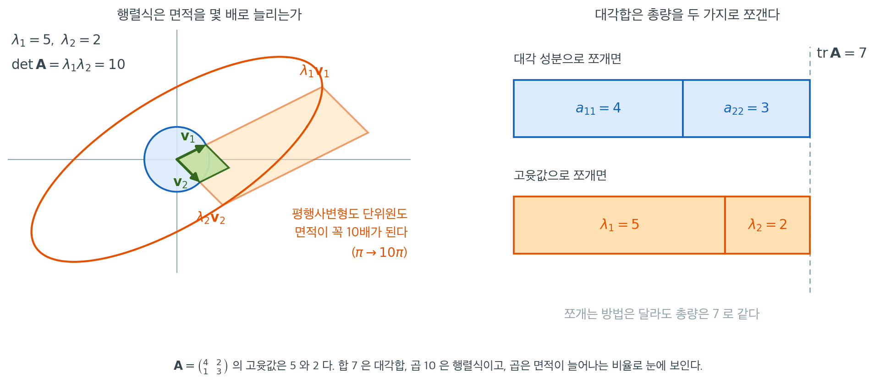

# 대각합과 고윳값

행렬의 대각합 — 대각 성분의 합 — 은 계산하기 가장 쉬운 행렬 관련 양 중 하나다. 그런데도 깊은 정보를 담고 있다. 임의의 정사각행렬에서 대각합은 고윳값의 합과 같다. 이 연결은 통계에 끊임없이 등장한다. 공분산행렬의 대각합은 총분산을 주고, 모자 행렬의 대각합은 추정된 모수의 개수를 주며, 이차형식 $\mathbf{z}^T\mathbf{A}\mathbf{z}$의 기댓값은 $\operatorname{tr}(\mathbf{A})$로 표현할 수 있다. 이 쪽에서는 대각합과 고윳값의 관계, 그리고 그 핵심 성질을 전개한다.

## 정의와 기본 성질

<div class="defn" markdown>

### 정의 1. 대각합 { .dfn }

정사각행렬 $\mathbf{A} \in \mathbb{R}^{n \times n}$의 **대각합(trace)** 은 대각 성분의 합이다.

$$
\operatorname{tr}(\mathbf{A}) = \sum_{i=1}^n a_{ii}
$$

</div>

### 선형성

대각합은 $n \times n$ 행렬 공간 위의 선형함수다. 임의의 스칼라 $\alpha, \beta$와 행렬 $\mathbf{A}, \mathbf{B} \in \mathbb{R}^{n \times n}$에 대해

$$
\operatorname{tr}(\alpha\mathbf{A} + \beta\mathbf{B}) = \alpha\operatorname{tr}(\mathbf{A}) + \beta\operatorname{tr}(\mathbf{B})
$$

이다.

### 순환 성질

통계에서 가장 자주 쓰이는 대각합 항등식이 **순환 성질**이다.

<div class="thmbox" markdown>

### 정리 1. 대각합의 순환 성질 { .thm }

행렬 $\mathbf{A} \in \mathbb{R}^{m \times n}$과 $\mathbf{B} \in \mathbb{R}^{n \times m}$에 대해

$$
\operatorname{tr}(\mathbf{A}\mathbf{B}) = \operatorname{tr}(\mathbf{B}\mathbf{A})
$$

더 일반적으로, 곱 $\mathbf{A}_1\mathbf{A}_2\cdots\mathbf{A}_k$가 정의되고 정사각이 되도록 차원이 맞는 행렬들에 대해

$$
\operatorname{tr}(\mathbf{A}_1\mathbf{A}_2\cdots\mathbf{A}_k) = \operatorname{tr}(\mathbf{A}_k\mathbf{A}_1\cdots\mathbf{A}_{k-1})
$$

이다. 곧 **순환 이동**만 허용된다.

</div>

??? proof "증명"

    $\mathbf{A} \in \mathbb{R}^{m \times n}$, $\mathbf{B} \in \mathbb{R}^{n \times m}$인 두 행렬의 경우

    $$
    \operatorname{tr}(\mathbf{A}\mathbf{B}) = \sum_{i=1}^m [\mathbf{A}\mathbf{B}]_{ii} = \sum_{i=1}^m \sum_{j=1}^n a_{ij}b_{ji} = \sum_{j=1}^n \sum_{i=1}^m b_{ji}a_{ij} = \sum_{j=1}^n [\mathbf{B}\mathbf{A}]_{jj} = \operatorname{tr}(\mathbf{B}\mathbf{A})
    $$

    이다. 일반적인 경우는 귀납법도 필요 없다. $\mathbf{A} = \mathbf{A}_1\cdots\mathbf{A}_{k-1}$, $\mathbf{B} = \mathbf{A}_k$로 묶어 두 행렬의 경우를 한 번 적용하면

    $$
    \operatorname{tr}(\mathbf{A}_1\cdots\mathbf{A}_{k-1}\mathbf{A}_k) = \operatorname{tr}(\mathbf{A}_k\mathbf{A}_1\cdots\mathbf{A}_{k-1})
    $$

    이 바로 나온다. 이 한 칸 이동을 반복하면 모든 순환 이동을 얻는다. $\square$

!!! danger "순환 이동만 된다. 임의의 재배열은 안 된다"
    순환 성질은 인자들의 **순환 이동**만 허용한다.

    $$
    \operatorname{tr}(\mathbf{A}\mathbf{B}\mathbf{C}) = \operatorname{tr}(\mathbf{C}\mathbf{A}\mathbf{B}) = \operatorname{tr}(\mathbf{B}\mathbf{C}\mathbf{A})
    $$

    그러나 $\operatorname{tr}(\mathbf{A}\mathbf{B}\mathbf{C}) = \operatorname{tr}(\mathbf{A}\mathbf{C}\mathbf{B})$는 **거짓이다.** $\mathbf{A}\mathbf{C}\mathbf{B}$는 $\mathbf{A}\mathbf{B}\mathbf{C}$의 순환 이동이 아니라 두 인자를 맞바꾼 것이라 순환 성질이 닿지 않는다. 반례가 $2 \times 2$에서도 쉽게 나온다.

    $$
    \mathbf{A} = \begin{pmatrix} 1 & 0 \\ 0 & 0 \end{pmatrix}, \quad
    \mathbf{B} = \begin{pmatrix} 0 & 1 \\ 0 & 0 \end{pmatrix}, \quad
    \mathbf{C} = \begin{pmatrix} 0 & 0 \\ 1 & 0 \end{pmatrix}
    $$

    을 잡으면 $\mathbf{B}\mathbf{C} = \mathbf{A}$이고 $\mathbf{C}\mathbf{B} = \begin{pmatrix} 0 & 0 \\ 0 & 1 \end{pmatrix}$이므로

    $$
    \operatorname{tr}(\mathbf{A}\mathbf{B}\mathbf{C}) = \operatorname{tr}(\mathbf{A}\mathbf{A}) = 1,
    \qquad
    \operatorname{tr}(\mathbf{A}\mathbf{C}\mathbf{B}) = \operatorname{tr}\!\begin{pmatrix} 0 & 0 \\ 0 & 0 \end{pmatrix} = 0
    $$

    이다. 실제 증명에서 이 함정에 자주 걸리므로, 인자를 옮길 때는 언제나 **맨 끝을 맨 앞으로** 또는 그 반대로만 움직인다고 기억하는 것이 안전하다.

### 전치

행렬을 전치해도 대각 성분은 바뀌지 않으므로

$$
\operatorname{tr}(\mathbf{A}^T) = \operatorname{tr}(\mathbf{A})
$$

이다.

### 외적의 대각합

벡터 $\mathbf{a}, \mathbf{b} \in \mathbb{R}^n$에 대해 외적 $\mathbf{a}\mathbf{b}^T$는 $n \times n$ 행렬이고 그 대각합은

$$
\operatorname{tr}(\mathbf{a}\mathbf{b}^T) = \mathbf{b}^T\mathbf{a} = \sum_{i=1}^n a_i b_i
$$

이다. 이는 순환 성질에서 따라온다: $\operatorname{tr}(\mathbf{a}\mathbf{b}^T) = \operatorname{tr}(\mathbf{b}^T\mathbf{a}) = \mathbf{b}^T\mathbf{a}$이며, 마지막 등호는 $\mathbf{b}^T\mathbf{a}$가 $1 \times 1$ 행렬(스칼라)이기 때문에 성립한다.

## 대각합은 고윳값의 합과 같다

<div class="thmbox" markdown>

### 정리 2. 대각합과 고윳값의 항등식 { .thm }

$\mathbf{A} \in \mathbb{R}^{n \times n}$(또는 $\mathbb{C}^{n \times n}$)이 (대수적 중복도를 세어, 복소수일 수도 있는) 고윳값 $\lambda_1, \lambda_2, \dots, \lambda_n$을 갖는다고 하자. 그러면

$$
\operatorname{tr}(\mathbf{A}) = \sum_{i=1}^n \lambda_i
$$

</div>

??? proof "증명"

    $\mathbf{A}$의 특성다항식은

    $$
    p(\lambda) = \det(\lambda\mathbf{I} - \mathbf{A}) = \lambda^n - (\operatorname{tr}\mathbf{A})\lambda^{n-1} + \cdots + (-1)^n\det(\mathbf{A})
    $$

    이다. 오른쪽 등식을 확인해 두자. 행렬식의 정의(순열에 대한 합)에서 항등순열이 아닌 순열은 대각이 아닌 성분을 적어도 두 개 포함하므로 $\lambda$를 최대 $n-2$개만 내놓는다. 따라서 $\lambda^n$과 $\lambda^{n-1}$의 계수는 항등순열의 항

    $$
    \prod_{i=1}^n (\lambda - a_{ii})
    $$

    에서만 나온다. 이 곱을 전개하면 $\lambda^{n-1}$의 계수가 $-(a_{11} + \cdots + a_{nn}) = -\operatorname{tr}(\mathbf{A})$다.

    한편 특성다항식을 근으로 인수분해하면

    $$
    p(\lambda) = (\lambda - \lambda_1)(\lambda - \lambda_2)\cdots(\lambda - \lambda_n)
    $$

    이고, 전개하면 $\lambda^{n-1}$의 계수는 $-(\lambda_1 + \lambda_2 + \cdots + \lambda_n)$이다.

    두 표현을 같다고 놓으면 $\operatorname{tr}(\mathbf{A}) = \lambda_1 + \lambda_2 + \cdots + \lambda_n$이다. $\square$

??? proof "다른 증명"

    $\mathbf{A}$가 (복소수 위에서) 대각화 가능한 경우에만 통하는 짧은 논법이다.

    대각합은 닮음 불변량이다. 순환 성질에 의해

    $$
    \operatorname{tr}(\mathbf{P}^{-1}\mathbf{A}\mathbf{P}) = \operatorname{tr}(\mathbf{A}\mathbf{P}\mathbf{P}^{-1}) = \operatorname{tr}(\mathbf{A})
    $$

    이기 때문이다. $\mathbf{A}$가 대각화 가능하면 $\mathbf{P}^{-1}\mathbf{A}\mathbf{P} = \boldsymbol{\Lambda}$이고 $\boldsymbol{\Lambda}$의 대각 성분이 바로 고윳값이므로 $\operatorname{tr}(\mathbf{A}) = \operatorname{tr}(\boldsymbol{\Lambda}) = \sum_i \lambda_i$이다.

    위의 특성다항식 증명과 달리 이 논법은 대각화 가능한 행렬에만 통한다. 앞 쪽에서 본 $\begin{pmatrix} 2 & 1 \\ 0 & 2 \end{pmatrix}$ 같은 행렬에는 쓸 수 없고, 그래도 정리 2 는 성립한다($\operatorname{tr} = 4 = 2 + 2$). 다행히 통계에서 만나는 행렬은 대부분 대칭이어서 늘 대각화 가능하다. $\square$

## 행렬식은 고윳값의 곱과 같다

이와 짝을 이루는 결과가 행렬식과 고윳값을 잇는다.

<div class="thmbox" markdown>

### 정리 3. 행렬식과 고윳값의 항등식 { .thm }

정리 2 와 같은 규약으로(대수적 중복도를 세어, 복소수일 수도 있는) 고윳값이 $\lambda_1, \dots, \lambda_n$인 행렬 $\mathbf{A}$에 대해

$$
\det(\mathbf{A}) = \prod_{i=1}^n \lambda_i
$$

</div>

??? proof "증명"

    대수학의 기본정리에 의해 $\mathbb{C}$ 위에서 $p(\lambda) = \det(\lambda\mathbf{I} - \mathbf{A}) = \prod_{i=1}^n(\lambda - \lambda_i)$로 인수분해된다. 양변에 $\lambda = 0$을 넣으면

    $$
    \det(-\mathbf{A}) = \prod_{i=1}^n(-\lambda_i)
    $$

    이고, 왼쪽은 $(-1)^n\det(\mathbf{A})$, 오른쪽은 $(-1)^n\prod_i\lambda_i$다. $(-1)^n$을 약분하면 결론이 나온다. $\square$

## 예

다음 행렬을 생각하자.

$$
\mathbf{A} = \begin{pmatrix} 4 & 2 \\ 1 & 3 \end{pmatrix}
$$

**정의에 따른 대각합:** $\operatorname{tr}(\mathbf{A}) = 4 + 3 = 7$.

**고윳값:** 특성다항식이 $\lambda^2 - 7\lambda + 10 = (\lambda - 5)(\lambda - 2)$이므로 $\lambda_1 = 5$, $\lambda_2 = 2$이다.

**확인:** $\lambda_1 + \lambda_2 = 5 + 2 = 7 = \operatorname{tr}(\mathbf{A})$이고 $\lambda_1 \cdot \lambda_2 = 10 = \det(\mathbf{A})$이다.

### 그림으로 보기

합과 곱이라는 두 항등식은 성격이 아주 다르다. 곱은 눈에 보이는 기하가 있고, 합은 같은 총량을 두 가지로 쪼갠 장부에 가깝다.



왼쪽은 행렬식 쪽이다. 고유벡터 $\mathbf{v}_1 = (2,1)^T/\sqrt{5}$와 $\mathbf{v}_2 = (1,-1)^T/\sqrt{2}$가 만드는 녹색 평행사변형에 $\mathbf{A}$를 곱하면 각 변이 $\lambda_1 = 5$배, $\lambda_2 = 2$배로 늘어나 주황 평행사변형이 된다. 면적은 $0.9487$에서 $9.4868$로 정확히 $10$배가 된다. 도형을 바꿔도 마찬가지여서, 파란 단위원은 주황 타원이 되고 면적은 $\pi$에서 $10\pi \approx 31.42$로 역시 $10$배가 된다. **행렬식은 넓이를 몇 배로 부풀리는가를 재는 수이고, 그 배율이 고윳값의 곱인 것은 각 고유방향이 독립적으로 $\lambda_i$배씩 기여하기 때문이다.**

오른쪽은 대각합 쪽이다. 같은 총량 $7$을 두 가지로 쪼갤 수 있다. 위 막대는 대각 성분으로 쪼갠 $4 + 3$이고, 아래 막대는 고윳값으로 쪼갠 $5 + 2$다. 칸을 나누는 자리는 다르지만 막대의 오른쪽 끝은 같은 자리에 있다. 대각합–고윳값 항등식이 말하는 것이 바로 이 그림이다.

통계에서 이 두 막대는 각각 이름이 있다. 공분산행렬이라면 위 막대는 변수별 분산이고 아래 막대는 주성분별 분산이며, 총분산이라는 총량은 어느 쪽으로 세든 같다. 주성분분석이 하는 일은 총량을 건드리지 않고 앞쪽 칸으로 몰아주는 재분배다. 반면 행렬식은 곱이므로 한 방향이라도 $\lambda_i = 0$이면 통째로 $0$이 된다. 일반화 분산이 퇴화를 예민하게 잡아내는 이유가 이 차이에 있다.

## 통계에서의 응용

### 총분산

공분산행렬이 $\boldsymbol{\Sigma}$인 확률벡터 $\mathbf{X} \in \mathbb{R}^p$에 대해 **총분산**은

$$
\operatorname{tr}(\boldsymbol{\Sigma}) = \sum_{i=1}^p \sigma_{ii} = \sum_{i=1}^p \lambda_i
$$

이다. 여기서 $\sigma_{ii} = \operatorname{Var}(X_i)$이고 $\lambda_1, \dots, \lambda_p$는 고윳값(각 주성분 방향의 분산)이다. 대각합–고윳값 항등식은 총분산이 주변분산으로 계산하든 주성분 분산으로 계산하든 같다는 것을 보여준다.

### 모자 행렬과 유효 모수 개수

계획행렬 $\mathbf{X} \in \mathbb{R}^{n \times p}$가 완전 열계수($\operatorname{rank}(\mathbf{X}) = p$)라고 하자. 그러면 $\mathbf{X}^T\mathbf{X}$가 가역이고 모자 행렬 $\mathbf{H} = \mathbf{X}(\mathbf{X}^T\mathbf{X})^{-1}\mathbf{X}^T$가 정의되어 $\hat{\mathbf{y}} = \mathbf{H}\mathbf{y}$가 된다. $\mathbf{H}$는 대칭이고 멱등이므로($\mathbf{H}^2 = \mathbf{H}$) 고윳값이 0 아니면 1이다. 대각합은

$$
\operatorname{tr}(\mathbf{H}) = (\text{고윳값이 } 1 \text{인 것의 개수}) = \operatorname{rank}(\mathbf{X}) = p
$$

를 준다. 여기서 $p$는 추정된 모수의 개수다. 마찬가지로 $\operatorname{tr}(\mathbf{I} - \mathbf{H}) = n - p$가 잔차 자유도를 센다.

### 이차형식의 기댓값

$\mathbf{z} \sim (\boldsymbol{\mu}, \mathbf{I}_n)$(평균 $\boldsymbol{\mu}$, 단위 공분산)이면 임의의 대칭행렬 $\mathbf{A}$에 대해

$$
E[\mathbf{z}^T\mathbf{A}\mathbf{z}] = \operatorname{tr}(\mathbf{A}) + \boldsymbol{\mu}^T\mathbf{A}\boldsymbol{\mu}
$$

이다. $\boldsymbol{\mu} = \mathbf{0}$이면 $E[\mathbf{z}^T\mathbf{A}\mathbf{z}] = \operatorname{tr}(\mathbf{A})$로 간단해진다. 제곱합이 자료벡터의 이차형식인 분산분석에서 이 항등식이 근본적으로 쓰인다.

## 연습문제

<div class="drillbox" markdown>

**연습문제 1.** <span class="diff easy" title="쉬움"></span>
$\mathbf{A} = \begin{pmatrix} 3 & 1 \\ 1 & 3 \end{pmatrix}$이라 하자. $\operatorname{tr}(\mathbf{A})$를 계산하고 그것이 고윳값의 합과 같음을 확인하라.

</div>

??? success "풀이"
    대각합은 $\operatorname{tr}(\mathbf{A}) = 3 + 3 = 6$이다.

    고윳값은 $\det(\mathbf{A} - \lambda\mathbf{I}) = (3-\lambda)^2 - 1 = \lambda^2 - 6\lambda + 8 = 0$을 만족하므로 $\lambda_1 = 4$, $\lambda_2 = 2$이다.

    고윳값의 합: $4 + 2 = 6 = \operatorname{tr}(\mathbf{A})$. 또한 $\det(\mathbf{A}) = 9 - 1 = 8 = 4 \times 2 = \lambda_1 \lambda_2$이다.

<div class="drillbox" markdown>

**연습문제 2.** <span class="diff med" title="중간"></span>
순환 성질을 이용해 임의의 행렬 $\mathbf{A}$($m \times n$)와 $\mathbf{B}$($n \times m$)에 대해 $\operatorname{tr}(\mathbf{A}\mathbf{B}) = \operatorname{tr}(\mathbf{B}\mathbf{A})$임을 증명하라.

</div>

??? success "풀이"
    $\mathbf{A}\mathbf{B}$의 $(i,i)$ 성분은 $\sum_{k=1}^n a_{ik} b_{ki}$이므로

    $$
    \operatorname{tr}(\mathbf{A}\mathbf{B}) = \sum_{i=1}^m \sum_{k=1}^n a_{ik} b_{ki}
    $$

    이다. $\mathbf{B}\mathbf{A}$의 $(k,k)$ 성분은 $\sum_{i=1}^m b_{ki} a_{ik}$이므로

    $$
    \operatorname{tr}(\mathbf{B}\mathbf{A}) = \sum_{k=1}^n \sum_{i=1}^m b_{ki} a_{ik}
    $$

    이다. 두 이중합 모두 $i = 1, \dots, m$과 $k = 1, \dots, n$에 대한 같은 항 $a_{ik} b_{ki}$를 더한 것이다. 덧셈의 교환법칙에 의해

    $$
    \operatorname{tr}(\mathbf{A}\mathbf{B}) = \operatorname{tr}(\mathbf{B}\mathbf{A})
    $$

    이다. 참고로 $\mathbf{A}\mathbf{B}$는 $m \times m$이고 $\mathbf{B}\mathbf{A}$는 $n \times n$이다. 크기는 다를 수 있지만 대각합은 언제나 같다. $\square$

<div class="drillbox" markdown>

**연습문제 3.** <span class="diff med" title="중간"></span>
$\mathbf{X} \in \mathbb{R}^{n \times p}$가 완전 열계수라 하자. 순환 성질을 이용해, 모자 행렬 $\mathbf{H} = \mathbf{X}(\mathbf{X}^T\mathbf{X})^{-1}\mathbf{X}^T$의 대각합이 (절편을 포함한) 예측변수의 개수 $p$와 같음을 보여라.

</div>

??? success "풀이"
    인자를 묶어 순환 성질을 적용한다.

    $$
    \operatorname{tr}(\mathbf{H}) = \operatorname{tr}\bigl(\mathbf{X}(\mathbf{X}^T\mathbf{X})^{-1}\mathbf{X}^T\bigr) = \operatorname{tr}\bigl(\mathbf{X}^T\mathbf{X}(\mathbf{X}^T\mathbf{X})^{-1}\bigr) = \operatorname{tr}(\mathbf{I}_p) = p
    $$

    순환 이동이 $\mathbf{X}^T$를 맨 뒤에서 맨 앞으로 옮겨 $p \times p$ 단위행렬을 만들어낸다. 이 결과는 $n$이나 $\mathbf{X}$의 구체적인 성분과 무관하게 성립한다.

    완전 열계수 가정이 어디에 쓰였는지 짚어 두자. 그 가정 없이는 $\mathbf{X}^T\mathbf{X}$가 가역이 아니어서 $\mathbf{H}$ 자체가 정의되지 않는다. 계수가 $r < p$인 경우에는 일반화 역행렬을 써서 $\mathbf{H} = \mathbf{X}(\mathbf{X}^T\mathbf{X})^{+}\mathbf{X}^T$로 정의하며, 그때는 $\operatorname{tr}(\mathbf{H}) = r$이 된다.

<div class="drillbox" markdown>

**연습문제 4.** <span class="diff med" title="중간"></span>
$\mathbf{z} \sim N(\mathbf{0}, \mathbf{I}_n)$이고 $\mathbf{A}$가 계수 $r$인 대칭 멱등행렬이라 하자. 항등식 $E[\mathbf{z}^T\mathbf{A}\mathbf{z}] = \operatorname{tr}(\mathbf{A})$를 이용해 $E[\mathbf{z}^T\mathbf{A}\mathbf{z}] = r$임을 보여라.

</div>

??? success "풀이"
    $\mathbf{z} \sim N(\mathbf{0}, \mathbf{I}_n)$이므로 $\boldsymbol{\mu} = \mathbf{0}$이고, 항등식에 의해

    $$
    E[\mathbf{z}^T\mathbf{A}\mathbf{z}] = \operatorname{tr}(\mathbf{A})
    $$

    이다. $\mathbf{A}$가 대칭 멱등이므로 고윳값은 모두 0 또는 1이고, 1인 고윳값의 개수가 계수 $r$이다. 따라서

    $$
    \operatorname{tr}(\mathbf{A}) = \sum_{i=1}^n \lambda_i = r \cdot 1 + (n-r) \cdot 0 = r
    $$

    이다. 이 결과가 $\text{SSE}/\sigma^2 \sim \chi^2_{n-p}$인 이유를 설명해 준다. 잔차생성행렬 $\mathbf{M} = \mathbf{I} - \mathbf{H}$의 계수가 $n - p$이므로 $E[\text{SSE}/\sigma^2] = \operatorname{tr}(\mathbf{M}) = n - p$이고, 이는 $\chi^2_{n-p}$ 분포의 평균과 일치한다.

<div class="drillbox" markdown>

**연습문제 5.** <span class="diff easy" title="쉬움"></span>
대각합이 선형임을 보여라: $\operatorname{tr}(a\mathbf{A} + b\mathbf{B}) = a\operatorname{tr}(\mathbf{A}) + b\operatorname{tr}(\mathbf{B})$. 그러나 곱에 대해서는 $\operatorname{tr}(\mathbf{A}\mathbf{B}) \neq \operatorname{tr}(\mathbf{A})\operatorname{tr}(\mathbf{B})$임을 반례로 보여라.

</div>

??? success "풀이"
    **선형성.** 대각 성분끼리의 덧셈이므로

    $$
    \operatorname{tr}(a\mathbf{A} + b\mathbf{B}) = \sum_i (a a_{ii} + b b_{ii})
    = a\sum_i a_{ii} + b\sum_i b_{ii}
    = a\operatorname{tr}(\mathbf{A}) + b\operatorname{tr}(\mathbf{B})
    $$

    이다.

    **곱은 그렇지 않다.** 가장 간단한 반례는 $\mathbf{A} = \mathbf{B} = \mathbf{I}_2$다. $\operatorname{tr}(\mathbf{A}\mathbf{B}) = \operatorname{tr}(\mathbf{I}_2) = 2$이지만 $\operatorname{tr}(\mathbf{A})\operatorname{tr}(\mathbf{B}) = 2 \times 2 = 4$다. 아래 코드는 또 다른 반례를 보여 준다($5$ 대 $0$).

    ```python
    import numpy as np

    A = np.array([[1., 2.], [3., 4.]])
    B = np.array([[0., 1.], [1., 0.]])

    print("tr(2A + 3B) =", np.trace(2*A + 3*B),
          " 2tr(A)+3tr(B) =", 2*np.trace(A) + 3*np.trace(B))
    print("tr(AB) =", np.trace(A @ B),
          " tr(A)tr(B) =", np.trace(A) * np.trace(B))
    ```

    출력:

    ```
    tr(2A + 3B) = 10.0  2tr(A)+3tr(B) = 10.0
    tr(AB) = 5.0  tr(A)tr(B) = 0.0
    ```

    대각합은 **덧셈에 대해서는** 잘 행동하지만 곱에 대해서는 그렇지 않다. 곱에서 성립하는 것은 순환 성질 $\operatorname{tr}(\mathbf{A}\mathbf{B}) = \operatorname{tr}(\mathbf{B}\mathbf{A})$뿐이다. 참고로 행렬식은 정반대다. $\det(\mathbf{A}\mathbf{B}) = \det(\mathbf{A})\det(\mathbf{B})$는 성립하지만 $\det(\mathbf{A}+\mathbf{B})$에는 간단한 공식이 없다. $\square$

<div class="drillbox" markdown>

**연습문제 6.** <span class="diff med" title="중간"></span>
$\operatorname{tr}(\mathbf{A}^T\mathbf{A}) = \sum_{i,j} a_{ij}^2 = \lVert\mathbf{A}\rVert_F^2$임을 보이고, 이것이 특이값의 제곱합과 같음을 확인하라.

</div>

??? success "풀이"
    $\mathbf{A}^T\mathbf{A}$의 $(j,j)$ 성분은 $\sum_i a_{ij}^2$, 곧 $j$번째 열의 제곱합이다. 대각합은 이를 모든 열에 대해 더한 것이므로

    $$
    \operatorname{tr}(\mathbf{A}^T\mathbf{A}) = \sum_j \sum_i a_{ij}^2 = \lVert\mathbf{A}\rVert_F^2
    $$

    이다. 한편 $\mathbf{A}^T\mathbf{A}$의 고윳값은 특이값의 제곱 $\sigma_i^2$이고 대각합은 고윳값의 합이므로

    $$
    \lVert\mathbf{A}\rVert_F^2 = \sum_i \sigma_i^2
    $$

    이다.

    ```python
    import numpy as np

    rng = np.random.default_rng(0)
    A = rng.normal(size=(4, 4))
    sv = np.linalg.svd(A, compute_uv=False)

    print("tr(A^T A)   =", round(np.trace(A.T @ A), 6))
    print("성분 제곱합 =", round((A ** 2).sum(), 6))
    print("특이값 제곱합 =", round((sv ** 2).sum(), 6))
    ```

    출력:

    ```
    tr(A^T A)   = 13.498337
    성분 제곱합 = 13.498337
    특이값 제곱합 = 13.498337
    ```

    **통계적 의미.** $\mathbf{A}$가 중심화된 자료행렬이면 $\operatorname{tr}(\mathbf{A}^T\mathbf{A})$는 총제곱합이고, 특이값 제곱은 각 주성분이 설명하는 몫이다. "첫 $k$개 성분이 설명하는 비율"이 $\sum_{i \le k}\sigma_i^2 / \sum_i \sigma_i^2$인 것이 이 등식에서 나온다. $\square$

<div class="drillbox" markdown>

**연습문제 7.** <span class="diff med" title="중간"></span>
$E[\mathbf{z}] = \boldsymbol{\mu}$, $\operatorname{Var}(\mathbf{z}) = \boldsymbol{\Sigma}$인 일반적인 경우에 $E[\mathbf{z}^T\mathbf{A}\mathbf{z}] = \operatorname{tr}(\mathbf{A}\boldsymbol{\Sigma}) + \boldsymbol{\mu}^T\mathbf{A}\boldsymbol{\mu}$임을 유도하라.

</div>

??? success "풀이"
    스칼라는 자기 자신의 대각합과 같다는 점($\mathbf{z}^T\mathbf{A}\mathbf{z} = \operatorname{tr}(\mathbf{z}^T\mathbf{A}\mathbf{z})$)에서 출발해 순환 성질을 쓴다.

    $$
    \mathbf{z}^T\mathbf{A}\mathbf{z} = \operatorname{tr}(\mathbf{z}^T\mathbf{A}\mathbf{z}) = \operatorname{tr}(\mathbf{A}\mathbf{z}\mathbf{z}^T)
    $$

    대각합과 기댓값은 모두 선형이므로 순서를 바꿀 수 있다.

    $$
    E[\mathbf{z}^T\mathbf{A}\mathbf{z}] = \operatorname{tr}\!\left(\mathbf{A}\,E[\mathbf{z}\mathbf{z}^T]\right)
    $$

    여기서 $E[\mathbf{z}\mathbf{z}^T] = \operatorname{Var}(\mathbf{z}) + E[\mathbf{z}]E[\mathbf{z}]^T = \boldsymbol{\Sigma} + \boldsymbol{\mu}\boldsymbol{\mu}^T$이므로

    $$
    E[\mathbf{z}^T\mathbf{A}\mathbf{z}]
    = \operatorname{tr}(\mathbf{A}\boldsymbol{\Sigma}) + \operatorname{tr}(\mathbf{A}\boldsymbol{\mu}\boldsymbol{\mu}^T)
    = \operatorname{tr}(\mathbf{A}\boldsymbol{\Sigma}) + \boldsymbol{\mu}^T\mathbf{A}\boldsymbol{\mu}
    $$

    이다(마지막에서 다시 순환 성질을 썼다).

    $\boldsymbol{\Sigma} = \mathbf{I}$로 두면 본문의 공식이 된다. **이 유도에서 정규성은 전혀 쓰이지 않았다.** 평균과 공분산만 있으면 성립한다. $\square$

<div class="drillbox" markdown>

**연습문제 8.** <span class="diff med" title="중간"></span>
$\mathbf{Y} = \mathbf{A}\mathbf{X}$일 때 $\operatorname{tr}(\operatorname{Var}(\mathbf{Y}))$를 $\mathbf{A}$와 $\boldsymbol{\Sigma} = \operatorname{Var}(\mathbf{X})$로 나타내라. $\mathbf{A}$가 직교행렬이면 어떻게 되는가?

</div>

??? success "풀이"
    $\operatorname{Var}(\mathbf{Y}) = \mathbf{A}\boldsymbol{\Sigma}\mathbf{A}^T$이므로 순환 성질에 의해

    $$
    \operatorname{tr}(\operatorname{Var}(\mathbf{Y})) = \operatorname{tr}(\mathbf{A}\boldsymbol{\Sigma}\mathbf{A}^T) = \operatorname{tr}(\boldsymbol{\Sigma}\mathbf{A}^T\mathbf{A})
    $$

    이다. $\mathbf{A}$가 직교행렬이면 $\mathbf{A}^T\mathbf{A} = \mathbf{I}$이므로

    $$
    \operatorname{tr}(\operatorname{Var}(\mathbf{Y})) = \operatorname{tr}(\boldsymbol{\Sigma})
    $$

    로 **총분산이 보존된다.**

    ```python
    import numpy as np

    rng = np.random.default_rng(0)
    Sigma = np.array([[4., 1., 0.], [1., 3., 1.], [0., 1., 2.]])

    Q, _ = np.linalg.qr(rng.normal(size=(3, 3)))     # 직교행렬
    S = np.diag([2., 1., 0.5])                        # 직교가 아닌 대각 척도변환

    print("tr(Sigma)        =", round(np.trace(Sigma), 6))
    print("직교 Q 로 변환   =", round(np.trace(Q @ Sigma @ Q.T), 6))
    print("척도 S 로 변환   =", round(np.trace(S @ Sigma @ S.T), 6))
    ```

    출력:

    ```
    tr(Sigma)        = 9.0
    직교 Q 로 변환   = 9.0
    척도 S 로 변환   = 19.5
    ```

    **회전은 총분산을 보존하지만 척도변환은 그렇지 않다.** PCA가 회전만 하는 이유가 여기에 있다. 분산의 총량은 그대로 두고 축 사이의 배분만 바꾼다. 반대로 변수를 표준화하는 것은 척도변환이므로 총분산이 바뀐다(표준화하면 $\operatorname{tr} = p$가 된다). 공분산행렬로 PCA를 하는 것과 상관행렬로 하는 것이 다른 결과를 주는 이유다. $\square$

<div class="drillbox" markdown>

**연습문제 9.** <span class="diff med" title="중간"></span>
실행렬의 고윳값은 복소수일 수 있다. 그런데도 $\operatorname{tr}(\mathbf{A}) = \sum_i \lambda_i$와 $\det(\mathbf{A}) = \prod_i \lambda_i$가 실수로 나오는 이유를 설명하고, 회전행렬로 확인하라.

</div>

??? success "풀이"
    실계수 특성다항식의 복소근은 **켤레쌍으로 나타난다.** $\lambda = a + bi$가 근이면 $\bar{\lambda} = a - bi$도 근이다. 켤레쌍끼리 더하고 곱하면

    $$
    \lambda + \bar{\lambda} = 2a \in \mathbb{R}, \qquad
    \lambda\bar{\lambda} = a^2 + b^2 \in \mathbb{R}
    $$

    로 허수부가 상쇄된다. 따라서 전체 합과 곱이 실수다.

    ```python
    import numpy as np

    R = np.array([[0., -1.], [1., 0.]])       # 90도 회전
    ev = np.linalg.eigvals(R)

    print("고윳값:", ev)
    print("합    :", ev.sum().real, " tr(R) =", np.trace(R))
    print("곱    :", np.prod(ev).real, " det(R) =", round(np.linalg.det(R), 6))
    ```

    출력:

    ```
    고윳값: [0.+1.j 0.-1.j]
    합    : 0.0  tr(R) = 0.0
    곱    : 1.0  det(R) = 1.0
    ```

    $90^\circ$ 회전행렬은 고윳값이 $\pm i$로 순허수다. 실벡터 중 방향이 보존되는 것이 하나도 없으므로 당연하다. 그럼에도 합은 $0 = \operatorname{tr}(\mathbf{R})$, 곱은 $1 = \det(\mathbf{R})$로 실수다.

    **대칭행렬에서는 이런 일이 없다.** 스펙트럼 정리가 고윳값이 모두 실수임을 보장한다. 통계에서 다루는 공분산행렬과 사영행렬이 모두 대칭이므로, 실무에서 복소 고윳값을 만날 일은 드물다. $\square$

<div class="drillbox" markdown>

**연습문제 10.** <span class="diff med" title="중간"></span>
능형회귀의 모자 행렬은 $\mathbf{H}_\lambda = \mathbf{X}(\mathbf{X}^T\mathbf{X} + \lambda\mathbf{I})^{-1}\mathbf{X}^T$이다. $\operatorname{tr}(\mathbf{H}_\lambda) = \sum_j \frac{d_j^2}{d_j^2 + \lambda}$($d_j$는 $\mathbf{X}$의 특이값)임을 보이고, 이 값이 $\lambda$에 따라 어떻게 변하는지 확인하라.

</div>

??? success "풀이"
    특이값분해 $\mathbf{X} = \mathbf{U}\mathbf{D}\mathbf{V}^T$를 넣으면 $\mathbf{X}^T\mathbf{X} = \mathbf{V}\mathbf{D}^2\mathbf{V}^T$이고 $\mathbf{V}^T\mathbf{V} = \mathbf{I}$이므로

    $$
    \mathbf{X}^T\mathbf{X} + \lambda\mathbf{I} = \mathbf{V}(\mathbf{D}^2 + \lambda\mathbf{I})\mathbf{V}^T
    $$

    이다. 따라서

    $$
    \mathbf{H}_\lambda = \mathbf{U}\mathbf{D}\mathbf{V}^T\mathbf{V}(\mathbf{D}^2+\lambda\mathbf{I})^{-1}\mathbf{V}^T\mathbf{V}\mathbf{D}\mathbf{U}^T
    = \mathbf{U}\mathbf{D}(\mathbf{D}^2+\lambda\mathbf{I})^{-1}\mathbf{D}\mathbf{U}^T
    $$

    이고, 순환 성질과 $\mathbf{U}^T\mathbf{U} = \mathbf{I}$에서

    $$
    \operatorname{tr}(\mathbf{H}_\lambda) = \operatorname{tr}\!\left(\mathbf{D}^2(\mathbf{D}^2+\lambda\mathbf{I})^{-1}\right) = \sum_j \frac{d_j^2}{d_j^2+\lambda}
    $$

    를 얻는다.

    ```python
    import numpy as np

    rng = np.random.default_rng(0)
    X = rng.normal(size=(50, 5))
    d = np.linalg.svd(X, compute_uv=False)

    for lam in (0., 1., 10., 100.):
        H = X @ np.linalg.inv(X.T @ X + lam * np.eye(5)) @ X.T
        print(f"lambda={lam:>6}:  tr(H) = {np.trace(H):7.4f}"
              f"   sum d^2/(d^2+lambda) = {np.sum(d**2/(d**2+lam)):7.4f}")
    ```

    출력:

    ```
    lambda=   0.0:  tr(H) =  5.0000   sum d^2/(d^2+lambda) =  5.0000
    lambda=   1.0:  tr(H) =  4.8942   sum d^2/(d^2+lambda) =  4.8942
    lambda=  10.0:  tr(H) =  4.1267   sum d^2/(d^2+lambda) =  4.1267
    lambda= 100.0:  tr(H) =  1.6690   sum d^2/(d^2+lambda) =  1.6690
    ```

    $\lambda = 0$이면 $\operatorname{tr} = p = 5$로 보통최소제곱과 같고, $\lambda$가 커질수록 값이 줄어 $\lambda \to \infty$에서 0으로 간다.

    이 값을 **유효자유도**라 부른다. 능형회귀는 모수를 $5$개 그대로 두지만 벌점이 각 방향을 $d_j^2/(d_j^2+\lambda)$만큼 축소하므로, 모형이 실제로 쓰는 자유도는 그보다 작다. 특이값이 작은 방향(공선성이 심한 방향)일수록 더 강하게 축소된다는 점도 식에서 바로 읽힌다. 18장에서 이 양이 모형 선택 기준에 쓰인다. $\square$

---

## 정리하며

대각합은 선형이고 닮음에 불변인 범함수이며 고윳값의 합과 같다. 짝을 이루는 항등식 $\det(\mathbf{A}) = \prod_i \lambda_i$도 함께 기억해 둘 만하다. 두 항등식 모두 **복소 고윳값을 대수적 중복도까지 세어야** 성립한다. 실행렬이라도 고윳값이 실수라는 보장은 없고(회전행렬), 겹친 고윳값은 겹친 횟수만큼 세어야 한다.

순환 성질 $\operatorname{tr}(\mathbf{A}\mathbf{B}) = \operatorname{tr}(\mathbf{B}\mathbf{A})$은 행렬을 다루는 통계적 증명에서 가장 자주 손이 가는 일꾼 항등식이다. 다만 **순환 이동만** 허용된다는 점을 잊지 말아야 한다. $\operatorname{tr}(\mathbf{A}\mathbf{B}\mathbf{C}) = \operatorname{tr}(\mathbf{A}\mathbf{C}\mathbf{B})$는 거짓이다.

통계에서 대각합은 공분산행렬의 대각 성분(주변분산)을 그 고윳값(주성분 분산)과 연결하고, 사영에서 유효 모수의 개수를 세며, 이차형식의 기댓값을 계산한다.
