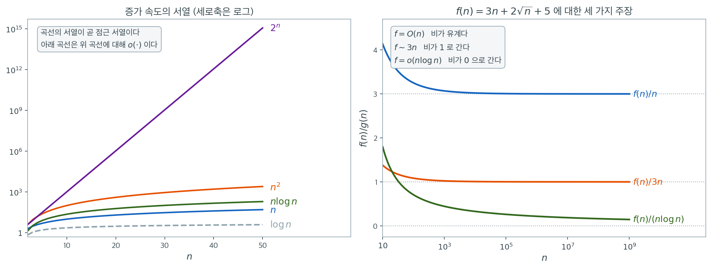

# 수열, 극한, 점근

수열과 그 극한 행동은 통계적 추론의 뼈대다. 큰수의 법칙, 중심극한정리, 추정량의 일치성, 그리고 이 책에 나오는 거의 모든 점근 결과가 극한에 관한 진술이다. 이 개념들을 확률적 수열로 끌어올리기 전에, 확률 기계장치가 매달릴 해석학적 골격인 결정론적 수열에 익숙해져야 한다.

## 수열, 급수, 점근 표기

<div class="defn" markdown>

### 정의 1. 수열의 수렴 { .dfn }

$\mathbb{R}$ 안의 수열 $(a_n)_{n \ge 1}$이 $L \in \mathbb{R}$로 **수렴한다**는 것은($a_n \to L$ 또는 $\lim_{n \to \infty} a_n = L$로 쓴다)

$$
\forall\, \varepsilon > 0,\;\; \exists\, N \in \mathbb{N} \text{ such that } n > N \implies |a_n - L| < \varepsilon
$$

이 성립한다는 뜻이다.

수열이 **코시(Cauchy)** 라는 것은 $\forall\, \varepsilon > 0,\, \exists\, N$이 있어 $m, n > N \implies |a_m - a_n| < \varepsilon$이 성립한다는 뜻이다. $\mathbb{R}$에서는 코시임과 수렴함이 동치다(완비성).

</div>

<div class="defn" markdown>

### 정의 2. 급수의 수렴 { .dfn }

급수 $\sum_{n=1}^\infty a_n$이 $S$로 수렴한다는 것은 부분합 $S_N = \sum_{n=1}^N a_n$이 $S$로 수렴한다는 뜻이다. 판정법으로는 비교, 비율, 근, 적분, 교대급수 판정법이 있다.

</div>

<div class="defn" markdown>

### 정의 3. 큰-O, 작은-o, 큰-세타, 점근적 동치 { .dfn }

수열(및 $n$의 함수)에 대해,

$$
f(n) = O(g(n)) \;\Longleftrightarrow\; \exists\, C > 0,\, N \text{ s.t. } |f(n)| \le C |g(n)| \text{ for } n > N
$$

$$
f(n) = o(g(n)) \;\Longleftrightarrow\; \lim_{n \to \infty} \frac{f(n)}{g(n)} = 0
$$

$$
f(n) = \Theta(g(n)) \;\Longleftrightarrow\; f(n) = O(g(n)) \text{ 이고 } g(n) = O(f(n))
$$

$$
f(n) \sim g(n) \;\Longleftrightarrow\; \lim_{n \to \infty} \frac{f(n)}{g(n)} = 1
$$

네 표기의 세기가 다르다는 점에 주의하라. $O$는 **상한**만 주장하고($f$가 $g$보다 크게 자라지 않는다), $o$는 **엄격히 작다**를 주장하며, $\Theta$는 위아래로 모두 눌러 **같은 증가 차수**임을 주장하고, $\sim$는 비가 어떤 상수도 아닌 **정확히 $1$**로 감을 주장한다. 따라서 $f \sim g \Rightarrow f = \Theta(g) \Rightarrow f = O(g)$이지만 역은 모두 거짓이다. 예를 들어 $n = \Theta(2n)$이지만 $n \not\sim 2n$이다(연습문제 6). 등호는 관례적인 남용이며, 실제 뜻은 "$f$가 $O(g)$라는 함수족에 **속한다**"이다. 그래서 $O(g) = f$처럼 뒤집어 쓸 수 없다.

확률적 대응물인 $O_p$와 $o_p$는 아래 **통계에서의 점근 표기** 절에서 정의한다.

</div>



왼쪽 그림은 다섯 가지 증가 속도를 같은 로그 세로축 위에 겹쳐 놓은 것이다. $n = 50$에서 값을 읽으면 $\log n = 3.912$, $n = 50$, $n\log n = 195.6$, $n^2 = 2500$, $2^n = 1.126 \times 10^{15}$이다. 로그축에서 직선으로 보이는 것은 $2^n$뿐이며, 나머지는 모두 아래로 휘어 있다. **점근 표기가 재는 것은 그림의 높이가 아니라 곡선 사이가 벌어지는 방식이다.** 아래쪽 곡선은 위쪽 곡선에 대해 모두 $o(\cdot)$이고, 이 서열이 통계에서 오차항을 버릴 때의 기준이 된다.

오른쪽 그림은 표기 세 개가 서로 **무엇을 주장하고 무엇은 주장하지 않는지**를 하나의 함수

$$
f(n) = 3n + 2\sqrt{n} + 5
$$

위에서 갈라 보인다. 세 곡선은 모두 $f$를 어떤 $g$로 나눈 비이며, 각 표기는 그 비의 행동에 관한 진술이다. $f = O(n)$은 비 $f(n)/n$이 유계라는 뜻이고(파란 곡선, $n = 10^3$에서 $3.068246$, $n = 10^9$에서 $3.000063$), $f \sim 3n$은 비가 정확히 $1$로 간다는 더 강한 뜻이며(주황 곡선, 같은 두 지점에서 $1.022749$와 $1.000021$), $f = o(n\log n)$은 비가 $0$으로 간다는 뜻이다(초록 곡선). 세 주장이 모두 동시에 참이라는 점에 주의하라. $O$는 상계를 말할 뿐 그 상계가 꼭 맞는지는 말하지 않으므로 $f = O(n^2)$도 참이고, $f = O(n)$이라고 해서 $f/n$이 어떤 값으로 수렴한다는 보장도 없다. 수렴까지 말하려면 $\sim$가 필요하다.

초록 곡선은 특히 눈여겨볼 만하다. $f = o(n\log n)$이 참인데도 비는 $n = 10^6$에서 $0.217292$, $n = 10^9$에서도 $0.144768$로 아직 $0$ 근처가 아니다. **$o(\cdot)$는 극한에 관한 주장이지 "지금 작다"는 주장이 아니다.** $\log n$이 워낙 느리게 자라 비가 $0$으로 내려가는 속도도 느린 것이다. 표본크기가 유한한 실제 자료에서 점근 결과를 쓸 때 늘 조심해야 하는 지점이 여기다. 어떤 근사가 점근적으로 옳다는 사실과 손에 쥔 $n$에서 쓸 만하다는 사실은 별개의 질문이며, 뒤의 연습문제 10에서 보듯 속도가 느린 쪽일수록 그 간극이 크다.

## 극한 법칙

$a_n \to L$이고 $b_n \to M$이면 $a_n + b_n \to L + M$, $a_n b_n \to LM$이며, $M \ne 0$일 때 $a_n / b_n \to L/M$이다. 조임 정리: 결국 $a_n \le b_n \le c_n$이고 $a_n, c_n \to L$이면 $b_n \to L$이다. 연속함수는 극한을 보존한다. $g$가 $L$에서 연속이면 $a_n \to L \Rightarrow g(a_n) \to g(L)$이다.

## 책 전체에서 쓰이는 급수

| 급수 | 이름 | 등장하는 곳 |
|---|---|---|
| $\sum_{n=0}^\infty r^n = \dfrac{1}{1-r}$, $\lvert r\rvert<1$ | 기하급수 | 기하 / 음이항 확률질량함수 |
| $\sum_{n=0}^\infty \dfrac{x^n}{n!} = e^x$ | 지수급수 | 포아송 확률질량함수, 적률생성함수 |
| $-\sum_{n=1}^\infty \dfrac{(-1)^n x^n}{n} = \ln(1+x)$, $\lvert x\rvert<1$ | 로그급수 | 로그가능도 전개 |
| $\sum_{n=1}^\infty \dfrac{1}{n^s}$은 $s > 1$일 때에 한해 수렴 | $p$-급수 | 꼬리 한계 진단 |

이와 별개로 늘 쓰이는 적분이 가우스 적분 $\int_{-\infty}^\infty e^{-x^2/2}\,dx = \sqrt{2\pi}$이며, 표준정규밀도를 정규화한다.

## 테일러 전개

$f$가 $a$에서 충분히 매끄러우면,

$$
f(x) = f(a) + f'(a)(x - a) + \tfrac{1}{2} f''(a)(x - a)^2 + \cdots + \tfrac{1}{k!} f^{(k)}(a)(x - a)^k + R_k(x)
$$

이고 나머지는 $x \to a$일 때 $R_k(x) = o((x - a)^k)$이다. 다음 두 귀결이 반복해서 쓰인다.

- **델타 방법**: $\sqrt{n}(\hat{\theta}_n - \theta) \xrightarrow{d} N(0, \sigma^2)$이고 $g$가 $\theta$에서 미분가능하면 $\sqrt{n}(g(\hat{\theta}_n) - g(\theta)) \xrightarrow{d} N(0, [g'(\theta)]^2 \sigma^2)$이다.
- **적률생성함수를 이용한 중심극한정리 유도**: $M_X(t/\sqrt{n})$을 $0$ 주위로 2차까지 전개하면, 살아남는 항이 분산의 기여분이다.

## 통계에서의 점근 표기

지금까지의 $O$와 $o$는 **결정론적** 수열에 대한 것이다. 통계에서 다루는 $\hat\theta_n - \theta$는 확률변수이므로 "$n > N$이면 언제나 $C$배 이하"라고 말할 수 없고, 그 요구를 확률로 누그러뜨려야 한다.

<div class="defn" markdown>

### 정의 4. 확률적 유계 $O_p$와 확률적 소량 $o_p$ { .dfn }

확률변수열 $(X_n)$과 양수열 $(a_n)$에 대해,

$$
X_n = O_p(a_n) \;\Longleftrightarrow\; \forall\, \varepsilon > 0,\; \exists\, M > 0,\, N \text{ s.t. } P\!\left(\left|\tfrac{X_n}{a_n}\right| > M\right) < \varepsilon \text{ for } n > N
$$

$$
X_n = o_p(a_n) \;\Longleftrightarrow\; \frac{X_n}{a_n} \xrightarrow{p} 0, \text{ 즉 } \forall\, \varepsilon > 0,\; P\!\left(\left|\tfrac{X_n}{a_n}\right| > \varepsilon\right) \to 0
$$

$O_p$를 **확률적 유계(boundedness in probability)**, $o_p$를 **확률적으로 무시할 수 있는 양**이라 읽는다. 결정론적 수열은 상수 확률변수로 보면 되므로 $f(n) = O(g(n)) \Rightarrow f(n) = O_p(g(n))$이고, $o_p(a_n) = O_p(a_n)$이다.

</div>

이 표기로 쓰면 "$\hat{\theta}_n - \theta = O_p(n^{-1/2})$"는 추정오차가 표준적인 $\sqrt{n}$ 속도로 줄어든다는 뜻이며, 이는 일치성 있는 정칙 추정량의 전형적인 속도다. 3.5절 중심극한정리의 $\sqrt{n}(\bar X_n - \mu) \xrightarrow{d} N(0, \sigma^2)$이 바로 $\bar X_n - \mu = O_p(n^{-1/2})$를 주며, 같은 절의 베리–에센 정리는 그 분포 근사의 오차마저 $O(n^{-1/2})$임을 말한다. 더 빠른 속도($n^{-1}$)는 초효율이나 경계 문제에서 나타나고, 더 느린 속도($n^{-1/4}$, $1/\log n$)는 비모수 추정에서 나타난다. 두 추정량이 모두 일치성을 가질 때 이들을 비교하는 방법이 바로 속도를 따지는 것이다.

## 수렴의 여러 모드 (예고)

확률적 수열은 서로 동치가 아닌 여러 의미로 수렴할 수 있으며, 3.5절 극한정리에서 다룬다.

1. **거의 확실한 수렴**: $P(\lim_n X_n = X) = 1$.
2. **확률수렴**: $\forall \varepsilon, P(|X_n - X| > \varepsilon) \to 0$.
3. **분포수렴**: $F_X$의 연속점에서 $F_{X_n}(x) \to F_X(x)$.
4. **$L^p$ 수렴**: $\mathbb{E}|X_n - X|^p \to 0$.

위계는 (1) $\Rightarrow$ (2) $\Rightarrow$ (3)이고 (4) $\Rightarrow$ (2)이다. 역방향 함의는 일반적으로 어느 것도 성립하지 않는다.

<div class="exbox" markdown>

**보기 1.** <span class="diff easy" title="쉬움"></span> 네 가지 극한을 수로 확인하기. 아래 코드는 $(1+1/n)^n \to e$, 등비급수의 부분합, $e^{0.3}$의 테일러 근사, 그리고 점근 표기를 차례로 보인다. 각 수렴이 **얼마나 빠른지**를 미리 계산하고 출력과 맞춰 본다.

**(1)** $(1+1/n)^n$의 오차가 출력에서 $n$이 10배가 될 때마다 10분의 1로 줄어든다. 그 비례상수를 해석적으로 구하고, $n \cdot (\text{오차})$가 그 값에 다가가는지 확인하시오.

**(2)** $r = 1/2$인 등비급수의 부분합 $S_{19}$를 닫힌 꼴로 적어, 출력의 열째 자리까지와 대조하시오.

**(3)** 차수 $k$의 테일러 근사에서 차수를 하나 올리면 오차가 몇 분의 1로 줄어드는가. 예측값을 출력의 여섯 줄과 견주시오.

**(4)** 코드의 마지막 머리글은 `o(1/n) vs O(1/n)`이라 적혀 있다. $\log n / n$은 과연 $O(1/n)$인가. 아니라면 두 수열은 각각 무엇인가.

</div>

??? success "풀이"

    ```python
    import math
    import numpy as np

    # === (1 + 1/n)^n → e ===
    ns = [10, 100, 1_000, 10_000, 100_000]
    for n in ns:
        approx = (1 + 1/n)**n
        print(f"n={n:>7d}: (1+1/n)^n = {approx:.8f}, error = {abs(approx - math.e):.2e}")

    # === Geometric series partial sums ===
    r = 0.5
    partial = np.cumsum(r ** np.arange(20))
    exact = 1 / (1 - r)
    print(f"\nGeometric r=0.5: S_19 = {partial[-1]:.10f}, exact = {exact}")

    # === Taylor approximation of e^x at x = 0.3 ===
    x = 0.3
    for k in range(1, 7):
        taylor = sum(x**n / math.factorial(n) for n in range(k + 1))
        print(f"order {k}: {taylor:.8f}, exact: {math.exp(x):.8f}")

    # === Demonstrating o(1/n) vs O(1/n) ===
    n = np.arange(1, 50)
    print("\nlog(n) / n   (o(1)? yes):", (np.log(n) / n)[-1])
    print("sin(n) / n^2 (O(1/n^2)):", (np.sin(n) / n**2)[-1])
    ```

    출력:

    ```
    n=     10: (1+1/n)^n = 2.59374246, error = 1.25e-01
    n=    100: (1+1/n)^n = 2.70481383, error = 1.35e-02
    n=   1000: (1+1/n)^n = 2.71692393, error = 1.36e-03
    n=  10000: (1+1/n)^n = 2.71814593, error = 1.36e-04
    n= 100000: (1+1/n)^n = 2.71826824, error = 1.36e-05

    Geometric r=0.5: S_19 = 1.9999980927, exact = 2.0
    order 1: 1.30000000, exact: 1.34985881
    order 2: 1.34500000, exact: 1.34985881
    order 3: 1.34950000, exact: 1.34985881
    order 4: 1.34983750, exact: 1.34985881
    order 5: 1.34985775, exact: 1.34985881
    order 6: 1.34985876, exact: 1.34985881

    log(n) / n   (o(1)? yes): 0.07942490404307401
    sin(n) / n^2 (O(1/n^2)): -0.00039723142555579834
    ```

    **(1) 비례상수는 $e/2 = 1.359141\ldots$이다.** 로그를 취하고 $\log(1+u) = u - u^2/2 + u^3/3 - \cdots$를 $u = 1/n$에 쓴다.

    $$
    n \log\!\left(1 + \frac{1}{n}\right) = n\left(\frac{1}{n} - \frac{1}{2n^2} + \frac{1}{3n^3} - \cdots\right) = 1 - \frac{1}{2n} + \frac{1}{3n^2} - \cdots
    $$

    지수를 다시 씌우면서 $e^{-t} = 1 - t + t^2/2 - \cdots$를 $t = 1/(2n) - 1/(3n^2)$에 쓰면

    $$
    \left(1 + \frac{1}{n}\right)^{\!n} = e \cdot \exp\!\left(-\frac{1}{2n} + \frac{1}{3n^2} - \cdots\right) = e\left(1 - \frac{1}{2n} + \frac{11}{24n^2} - \cdots\right)
    $$

    이다($1/3 + 1/8 = 11/24$). 따라서 오차가

    $$
    e - \left(1 + \frac{1}{n}\right)^{\!n} = \frac{e}{2n} - \frac{11e}{24n^2} + O(n^{-3})
    $$

    이고 선행항의 계수가 $e/2$다. **수렴은 $\Theta(1/n)$으로 느리다.** $n$을 10배 늘려야 자릿수 하나를 얻는다는 출력이 바로 그 뜻이다.

    **(2) $S_{19} = 2 - 2^{-19}$이다.** 유한 등비합 공식에서

    $$
    S_{19} = \sum_{k=0}^{19} \left(\frac{1}{2}\right)^{\!k} = \frac{1 - (1/2)^{20}}{1 - 1/2} = 2\left(1 - 2^{-20}\right) = 2 - 2^{-19}
    $$

    이고 $2^{-19} = 1.907349 \times 10^{-6}$이므로 $S_{19} = 1.99999809265\ldots$다. 열째 자리로 끊으면 $1.9999980927$로 출력과 정확히 같다. 이쪽 수렴은 **기하적**이어서 항을 하나 더할 때마다 오차가 절반으로 줄고, 20항만으로 여섯 자리를 얻는다. (1)의 $\Theta(1/n)$과 견주면 차이가 분명하다.

    **(3) 차수를 하나 올리면 오차가 약 $(k+2)/x$분의 1로 줄어든다.** 차수 $k$ 근사의 절단오차는 남은 항들의 합이고 그 선행항이 $x^{k+1}/(k+1)!$이다.

    $$
    e^x - \sum_{n=0}^{k} \frac{x^n}{n!} = \frac{x^{k+1}}{(k+1)!} + \frac{x^{k+2}}{(k+2)!} + \cdots
    $$

    그러므로 $k \to k+1$에서 선행항의 비가 $x/(k+2)$, 곧 오차는 $(k+2)/x$분의 1이 된다. $x = 0.3$이니 $k = 1 \to 2$에서 $3/0.3 = 10$배, $k = 2 \to 3$에서 $4/0.3 = 13.3$배, $k = 4 \to 5$에서 $6/0.3 = 20$배다. 출력의 오차를 차례로 재면 $4.986\times10^{-2}$, $4.859\times10^{-3}$, $3.588\times10^{-4}$, $2.131\times10^{-5}$, $1.058\times10^{-6}$, $4.508\times10^{-8}$이고 연속한 비가 $10.3$, $13.5$, $16.8$, $20.1$, $23.5$다. 예측 $10$, $13.3$, $16.7$, $20$, $23.3$과 맞는다. 실제 오차는 선행항보다 조금 크며($k = 5$에서 비가 $1.0445$) 뒤따르는 항들 때문이다. 차수가 올라갈수록 그 비가 1로 간다.

    **(4) 아니다. $\log n / n$은 $O(1/n)$이 아니다.** $O(1/n)$이라면 어떤 상수 $C$에 대해 $\log n / n \le C/n$, 곧 $\log n \le C$가 모든 $n$에서 성립해야 한다. $\log n$은 무한히 커지므로 그런 $C$는 없다. 비를 재 보면 $n = 49$에서 $3.89$, $n = 10^6$에서 $13.82$, $n = 10^{12}$에서 $27.63$으로 계속 자란다. 올바른 분류는

    $$
    \frac{\log n}{n} = o(1), \qquad \frac{\log n}{n} = O\!\left(n^{-1+\varepsilon}\right) \;\; (\forall \varepsilon > 0), \qquad \frac{\log n}{n} \ne O(1/n)
    $$

    이다. 코드 안의 주석 `(o(1)? yes)`는 맞고, 머리글의 `o(1/n)`은 이 수열에 해당하지 않는다. **$o(1/n)$에 해당하는 것은 둘째 수열이다.** $\lvert \sin n \rvert \le 1$이므로 $\lvert \sin(n)/n^2 \rvert \le 1/n^2$이고, $n^2$로 나눈 것이 $1/n$보다 한 차수 빠르므로

    $$
    \frac{\sin n}{n^2} = O(1/n^2) \quad \Longrightarrow \quad \frac{\sin n}{n^2} = o(1/n)
    $$

    이다. 다만 $\Theta(1/n^2)$은 **아니다.** $n \bmod 2\pi$가 $[0, 2\pi)$에 고르게 퍼지므로 $\sin n$이 0에 얼마든지 가까워지는 $n$이 있고, 그때 분자가 함께 작아진다. 출력의 $n = 49$에서는 $\sin 49 = -0.9538$이 마침 $\pm 1$ 근처라 상한에 거의 닿아 있어 $-3.972\times10^{-4} \approx -0.954/2401$이지만, $n = 10^6$에서는 $\lvert \sin n \rvert = 0.350$으로 세 배 작다. **점근 표기에서 상한과 정확한 차수를 구별해야 하는 자리가 이런 곳이다.**

    ```python
    import math

    # === (1 + 1/n)^n 의 오차가 e/(2n) 인가 ===
    print(f"e/2 = {math.e / 2:.6f}")
    for n in [10, 100, 1_000, 10_000, 100_000]:
        err = math.e - (1 + 1 / n) ** n
        print(f"n={n:>7d}:  오차 {err:.3e}   n*오차 {n * err:.5f}   "
              f"두 항 예측 {math.e * (1 / (2 * n) - 11 / (24 * n ** 2)):.3e}")

    # === 등비급수 부분합은 2 - 2^-19 이다 ===
    S19 = sum(0.5 ** k for k in range(20))
    print(f"\n2 - 2^-19 = {2 - 2.0 ** -19:.10f}   코드의 S_19 = {S19:.10f}   "
          f"2^-19 = {2.0 ** -19:.6e}")

    # === 테일러 절단오차의 선행항은 x^(k+1)/(k+1)! 이다 ===
    x = 0.3
    for k in range(1, 7):
        taylor = sum(x ** n / math.factorial(n) for n in range(k + 1))
        err = math.exp(x) - taylor
        lead = x ** (k + 1) / math.factorial(k + 1)
        print(f"order {k}: 오차 {err:.3e}  선행항 x^{k + 1}/{k + 1}! = {lead:.3e}  "
              f"비 {err / lead:.4f}")

    # === log(n)/n 은 O(1/n) 이 아니다 ===
    for n in [49, 10 ** 3, 10 ** 6, 10 ** 12]:
        print(f"n={n:>13d}:  n*log(n)/n = log n = {math.log(n):.4f}   "
              f"n^2*|sin n|/n^2 = |sin n| = {abs(math.sin(n)):.4f}")
    ```

    출력:

    ```
    e/2 = 1.359141
    n=     10:  오차 1.245e-01   n*오차 1.24539   두 항 예측 1.235e-01
    n=    100:  오차 1.347e-02   n*오차 1.34680   두 항 예측 1.347e-02
    n=   1000:  오차 1.358e-03   n*오차 1.35790   두 항 예측 1.358e-03
    n=  10000:  오차 1.359e-04   n*오차 1.35902   두 항 예측 1.359e-04
    n= 100000:  오차 1.359e-05   n*오차 1.35913   두 항 예측 1.359e-05

    2 - 2^-19 = 1.9999980927   코드의 S_19 = 1.9999980927   2^-19 = 1.907349e-06
    order 1: 오차 4.986e-02  선행항 x^2/2! = 4.500e-02  비 1.1080
    order 2: 오차 4.859e-03  선행항 x^3/3! = 4.500e-03  비 1.0797
    order 3: 오차 3.588e-04  선행항 x^4/4! = 3.375e-04  비 1.0631
    order 4: 오차 2.131e-05  선행항 x^5/5! = 2.025e-05  비 1.0522
    order 5: 오차 1.058e-06  선행항 x^6/6! = 1.012e-06  비 1.0445
    order 6: 오차 4.508e-08  선행항 x^7/7! = 4.339e-08  비 1.0388
    n=           49:  n*log(n)/n = log n = 3.8918   n^2*|sin n|/n^2 = |sin n| = 0.9538
    n=         1000:  n*log(n)/n = log n = 6.9078   n^2*|sin n|/n^2 = |sin n| = 0.8269
    n=      1000000:  n*log(n)/n = log n = 13.8155   n^2*|sin n|/n^2 = |sin n| = 0.3500
    n=1000000000000:  n*log(n)/n = log n = 27.6310   n^2*|sin n|/n^2 = |sin n| = 0.6112
    ```

    $n \cdot (\text{오차})$가 $1.2454 \to 1.3591$로 $e/2 = 1.359141$에 올라붙고, 두 항까지 맞춘 예측은 $n \ge 100$에서 네 자리가 모두 일치한다. $n = 10$에서만 $1.235$ 대 $1.245$로 어긋나는데, 버린 $O(n^{-3})$항이 거기서는 아직 무시할 만큼 작지 않기 때문이다. **점근식은 $n$이 커질 때의 진술이고, 작은 $n$에서 맞는다는 보장은 어디에도 없다.** 9장 이후의 점근 신뢰구간을 작은 표본에 쓸 때 되풀이될 경고가 이것이다.

## 연습문제

<div class="drillbox" markdown>

**연습문제 1.** <span class="diff med" title="중간"></span>
$\varepsilon$–$N$ 정의로부터 직접

$$
\lim_{n \to \infty} \frac{3n + 1}{n + 2} = 3
$$

임을 증명하라.

</div>

??? success "풀이"
    계산하면

    $$
    \left| \frac{3n+1}{n+2} - 3 \right| = \left| \frac{3n+1 - 3(n+2)}{n+2} \right| = \frac{5}{n+2}
    $$

    이다. $\varepsilon > 0$이 주어지면 $N = \lceil 5/\varepsilon - 2 \rceil$로 두자. 그러면 모든 $n > N$에 대해

    $$
    \frac{5}{n+2} < \frac{5}{N+2} \le \varepsilon
    $$

    이다. 따라서 $|a_n - 3| < \varepsilon$이다. $\square$

<div class="drillbox" markdown>

**연습문제 2.** <span class="diff med" title="중간"></span>
**(a)** $\sum_{k=0}^\infty r^k$이 $|r| < 1$일 때에 한해 수렴함을 보이고 그 합을 구하라.
**(b)** (a)를 이용해 $\displaystyle\sum_{k=1}^\infty \frac{3}{4^k}$을 계산하라.

</div>

??? success "풀이"
    (a) 부분합은

    $$
    S_n = \sum_{k=0}^n r^k = \frac{1 - r^{n+1}}{1 - r} \qquad (r \ne 1)
    $$

    이다. $|r| < 1$이면 $r^{n+1} \to 0$이므로 $S_n \to 1/(1 - r)$이다. $|r| \ge 1$이면 $|r^k|$가 0으로 가지 않아 발산 판정법에 걸리므로 급수가 발산한다.

    (b)

    $$
    \sum_{k=1}^\infty \frac{3}{4^k} = 3 \sum_{k=1}^\infty \left(\tfrac{1}{4}\right)^{\!k} = 3 \cdot \frac{1/4}{1 - 1/4} = 3 \cdot \tfrac{1}{3} = 1
    $$

<div class="drillbox" markdown>

**연습문제 3.** <span class="diff med" title="중간"></span>
고정된 모든 $x \in \mathbb{R}$에 대해 $n \to \infty$일 때 $(1 + x/n)^n \to e^x$임을 보여라.

</div>

??? success "풀이"
    로그를 취한다. 고정된 $x$와, $x/n$이 $\ln(1 + \cdot)$의 정의역에 들어갈 만큼 큰 $n$에 대해,

    $$
    n \ln\!\left(1 + \frac{x}{n}\right) = n \left[\frac{x}{n} - \frac{1}{2}\!\left(\frac{x}{n}\right)^{\!2} + O\!\left(\tfrac{1}{n^3}\right) \right] = x - \frac{x^2}{2n} + O\!\left(\tfrac{1}{n^2}\right)
    $$

    이다. 여기서 $u = 0$ 주위의 $\ln(1 + u)$의 테일러 전개를 썼다. 우변은 $x$로 수렴하고 $\exp$는 연속이므로

    $$
    (1 + x/n)^n = \exp\!\left(n \ln(1 + x/n)\right) \to e^x
    $$

    이다. $\square$

<div class="drillbox" markdown>

**연습문제 4.** <span class="diff med" title="중간"></span>
조임 정리를 증명하라: 충분히 큰 모든 $n$에 대해 $a_n \le b_n \le c_n$이고 $a_n, c_n \to L$이면 $b_n \to L$이다.

</div>

??? success "풀이"
    $\varepsilon > 0$이라 하자. $n > N_1 \Rightarrow |a_n - L| < \varepsilon$인 $N_1$과 $n > N_2 \Rightarrow |c_n - L| < \varepsilon$인 $N_2$를 고른다. $a_n \le b_n \le c_n$이 성립하기 시작하는 경계를 $N_3$이라 하고 $N = \max(N_1, N_2, N_3)$으로 두자.

    $n > N$에 대해

    $$
    L - \varepsilon < a_n \le b_n \le c_n < L + \varepsilon
    $$

    이므로 $|b_n - L| < \varepsilon$이다. $\square$

<div class="drillbox" markdown>

**연습문제 5.** <span class="diff hard" title="어려움"></span>
테일러 전개를 이용해, $X \sim \mathrm{Bernoulli}(p)$이고 표본평균이 $\bar{X}_n$일 때 분산안정화 변환 $g(p) = 2\arcsin(\sqrt{p})$가

$$
\sqrt{n}\!\left(g(\bar{X}_n) - g(p)\right) \xrightarrow{d} N(0, 1)
$$

을 만족함을 보여라. 따라서 $g(\bar{X}_n)$은 $p$와 무관하게 근사적으로 일정한 분산 $1/n$을 갖는다.

</div>

??? success "풀이"
    중심극한정리에 의해 $\sqrt{n}(\bar{X}_n - p) \xrightarrow{d} N(0, p(1 - p))$이다. 델타 방법을 쓰면

    $$
    \sqrt{n}\!\left(g(\bar{X}_n) - g(p)\right) \xrightarrow{d} N\!\left(0, [g'(p)]^2 \, p(1 - p)\right)
    $$

    이다. $g(p) = 2 \arcsin(\sqrt{p})$를 미분하면

    $$
    g'(p) = 2 \cdot \frac{1}{\sqrt{1 - p}} \cdot \frac{1}{2\sqrt{p}} = \frac{1}{\sqrt{p(1-p)}}
    $$

    이다. 따라서 모든 $p \in (0, 1)$에 대해 $[g'(p)]^2 \cdot p(1-p) = 1$이므로 극한은 $N(0, 1)$이다. $\square$

<div class="drillbox" markdown>

**연습문제 6.** <span class="diff med" title="중간"></span>
큰-O가 대칭이 아님을 보여라. 즉 $f(n) = O(g(n))$이지만 $g(n) \ne O(f(n))$인 수열을 제시하라. 그다음 "$f \asymp g$"($f = O(g)$ **그리고** $g = O(f)$를 뜻하며, 정의 3의 $f = \Theta(g)$와 같은 관계다)로 정의되는 동치관계를 부등식 두 개로 다시 진술하고, $f \asymp g$이지만 $f \not\sim g$인 두 수열의 예를 들어라.

</div>

??? success "풀이"
    **비대칭 예:** $f(n) = 1$, $g(n) = n$. 그러면 $f(n) = O(g(n))$이지만($C = 1$로 두면 된다) $g(n)/f(n) = n \to \infty$이므로 $g(n) \ne O(f(n))$이다.

    **동치관계:** $f \asymp g$(곧 $f = \Theta(g)$)일 필요충분조건은 어떤 $0 < c_1 \le c_2 < \infty$와 $N$이 있어 $n > N$에 대해 $c_1 |g(n)| \le |f(n)| \le c_2 |g(n)|$이 성립하는 것이다. 이 관계는 반사적이고 (정의상) 대칭이며 추이적이다. "같은 증가 차수"를 포착한다.

    **$f \asymp g$이지만 $f \not\sim g$:** $f(n) = n$, $g(n) = 2n$을 잡자. $c_1 = 1/2$, $c_2 = 2$가 통하므로 $f \asymp g$이다. 그러나 $f(n)/g(n) = 1/2 \ne 1$이므로 점근적으로 동치는 아니다. $\square$

<div class="drillbox" markdown>

**연습문제 7.** <span class="diff hard" title="어려움"></span>
**(체사로 평균)** $a_n \to L$이면 산술평균 $\bar{a}_n = \frac{1}{n}\sum_{k=1}^n a_k$도 $L$로 수렴함을 증명하라. 역은 성립하지 않음을 반례로 보여라.

</div>

??? success "풀이"
    $\varepsilon > 0$이라 하자. $n > N_1$이면 $|a_n - L| < \varepsilon/2$인 $N_1$을 고른다. $n > N_1$에 대해

    $$
    |\bar{a}_n - L| \le \frac{1}{n}\sum_{k=1}^{N_1} |a_k - L| \;+\; \frac{1}{n}\sum_{k=N_1+1}^{n} |a_k - L|
    $$

    이다. 두 번째 합은 $\frac{n - N_1}{n}\cdot\frac{\varepsilon}{2} < \frac{\varepsilon}{2}$로 눌린다. 첫 번째 합의 분자 $\sum_{k \le N_1}|a_k - L|$는 $n$과 무관한 **고정된 상수** $C$이므로, $n > 2C/\varepsilon$이면 $C/n < \varepsilon/2$이다. 따라서 $N = \max(N_1, \lceil 2C/\varepsilon\rceil)$로 두면 $n > N$일 때 $|\bar{a}_n - L| < \varepsilon$이다. $\square$

    증명의 구조를 보아 두라. 수열의 앞부분은 아무리 나빠도 개수가 유한하므로 $1/n$에 씻겨 내려가고, 뒷부분은 이미 $L$에 가깝다. **유한개의 나쁜 항은 평균에 해를 끼치지 못한다**는 이 논법은 큰수의 법칙 증명에서 그대로 되풀이된다.

    **역은 거짓이다.** $a_n = (-1)^n$은 발산하지만 부분합이 $-1$과 $0$ 사이를 오갈 뿐이므로 $\bar{a}_n \to 0$이다.

    ```python
    import numpy as np

    n = np.arange(1, 100_001)
    for a, name in [(1 / n, "1/n"), ((-1.0) ** n, "(-1)^n")]:
        cesaro = np.cumsum(a) / n
        print(f"{name:>8}:  a_100000 = {a[-1]:>10.6f}   "
              f"체사로 평균 = {cesaro[-1]:.8f}")
    ```

    출력:

    ```
         1/n:  a_100000 =   0.000010   체사로 평균 = 0.00012090
      (-1)^n:  a_100000 =   1.000000   체사로 평균 = 0.00000000
    ```

    $a_n = 1/n$일 때 체사로 평균은 $\approx (\ln n)/n$이라 $0$으로 가되 **원래 수열보다 훨씬 느리다**($10^{-5}$ 대 $1.2 \times 10^{-4}$). 평균을 취하는 것은 수렴을 안정시키지만 빠르게 하지는 않는다.

<div class="drillbox" markdown>

**연습문제 8.** <span class="diff hard" title="어려움"></span>
**(2차 델타 방법)** $g'(\theta) = 0$이면 1차 델타 방법은 퇴화한 극한 $N(0,0)$을 준다. 이때

$$
n\left(g(\bar{X}_n) - g(\theta)\right) \xrightarrow{d} \tfrac{1}{2} g''(\theta)\,\sigma^2 \chi^2_1
$$

임을 보이고, $X_i \sim \mathrm{Bernoulli}(1/2)$, $g(p) = p(1-p)$로 확인하라.

</div>

??? success "풀이"
    $\theta$ 주위에서 2차까지 전개하면 $g'(\theta) = 0$이므로 1차항이 사라지고

    $$
    g(\bar{X}_n) - g(\theta) = \tfrac{1}{2}g''(\theta)(\bar{X}_n - \theta)^2 + o_p\!\left((\bar{X}_n - \theta)^2\right)
    $$

    이 남는다. 양변에 $n$을 곱하면

    $$
    n\left(g(\bar{X}_n) - g(\theta)\right) = \tfrac{1}{2}g''(\theta)\left[\sqrt{n}(\bar{X}_n - \theta)\right]^2 + o_p(1)
    $$

    이다. 중심극한정리로 $\sqrt{n}(\bar{X}_n - \theta) \xrightarrow{d} N(0, \sigma^2)$이고, 연속사상정리를 제곱함수에 적용하면 그 제곱이 $\sigma^2\chi^2_1$로 수렴한다. $\square$

    **속도가 달라진 점에 주목하라.** 정규화 상수가 $\sqrt{n}$이 아니라 $n$이다. $g'(\theta) = 0$이면 $g$가 $\theta$ 근처에서 평평해서 오차를 눌러 주므로, $g(\bar{X}_n)$이 $g(\theta)$에 **더 빨리** 수렴한다. 대가는 극한분포가 정규가 아니라 한쪽으로 치우친 카이제곱이라는 것이다.

    ```python
    import numpy as np
    from scipy import stats

    rng = np.random.default_rng(0)
    n, B = 2_000, 200_000
    xbar = rng.binomial(n, 0.5, size=B) / n
    T = n * (xbar * (1 - xbar) - 0.25)       # g(p) = p(1-p), p = 1/2

    # g''(p) = -2, sigma^2 = p(1-p) = 1/4  =>  극한은 -(1/4) chi^2_1
    print(f"모의  평균 {T.mean():>8.4f}   분산 {T.var():.4f}")
    print(f"이론  평균 {-0.25:>8.4f}   분산 {2 * 0.25**2:.4f}")

    print("\n분위수(5%, 50%, 95%)")
    print("  모의:", np.quantile(T, [.05, .5, .95]).round(4))
    print("  이론:", (-0.25 * stats.chi2.ppf([.95, .5, .05], 1)).round(4))
    ```

    출력:

    ```
    모의  평균  -0.2506   분산 0.1254
    이론  평균  -0.2500   분산 0.1250

    분위수(5%, 50%, 95%)
      모의: [-9.680e-01 -1.125e-01 -5.000e-04]
      이론: [-0.9604 -0.1137 -0.001 ]
    ```

    이론 분위수에서 확률이 뒤집혀 있는($0.95 \to 0.05$) 이유는 $g''< 0$이라 $-1/4$을 곱하면서 부호가 바뀌기 때문이다. 극한분포 전체가 음수 쪽에 있는데, 이는 $p = 1/2$가 $p(1-p)$의 **최댓값**이라 어떤 추정값을 넣어도 $0.25$를 넘을 수 없기 때문이다. 표본분산의 편향과 같은 종류의 현상이다.

<div class="drillbox" markdown>

**연습문제 9.** <span class="diff hard" title="어려움"></span>
**(스털링 근사)** $n! \sim \sqrt{2\pi n}\,(n/e)^n$을 이용해 중심이항계수의 점근식 $\binom{2n}{n} \sim 4^n/\sqrt{\pi n}$을 유도하고, 수치로 확인하라. 이 결과가 확률적으로 뜻하는 바는 무엇인가?

</div>

??? success "풀이"
    스털링 근사를 세 번 쓰면

    $$
    \binom{2n}{n} = \frac{(2n)!}{(n!)^2}
    \sim \frac{\sqrt{4\pi n}\,(2n/e)^{2n}}{\left[\sqrt{2\pi n}\,(n/e)^{n}\right]^2}
    = \frac{2\sqrt{\pi n}\; 2^{2n} (n/e)^{2n}}{2\pi n \,(n/e)^{2n}}
    = \frac{4^n}{\sqrt{\pi n}}
    $$

    이다.

    ```python
    import math

    print("스털링 근사의 상대오차")
    for k in (1, 5, 10, 50, 100):
        s = math.sqrt(2 * math.pi * k) * (k / math.e) ** k
        rel = abs(s - math.factorial(k)) / math.factorial(k)
        print(f"  n={k:>3}:  상대오차 {rel:.3e}   1/(12n) = {1 / (12 * k):.3e}")

    print("\n중심이항계수")
    for k in (10, 100, 1000):
        log_exact = math.lgamma(2 * k + 1) - 2 * math.lgamma(k + 1)
        log_approx = k * math.log(4) - 0.5 * math.log(math.pi * k)
        print(f"  n={k:>4}:  근사/정확 = {math.exp(log_approx - log_exact):.6f}")
    ```

    출력:

    ```
    스털링 근사의 상대오차
      n=  1:  상대오차 7.786e-02   1/(12n) = 8.333e-02
      n=  5:  상대오차 1.651e-02   1/(12n) = 1.667e-02
      n= 10:  상대오차 8.296e-03   1/(12n) = 8.333e-03
      n= 50:  상대오차 1.665e-03   1/(12n) = 1.667e-03
      n=100:  상대오차 8.330e-04   1/(12n) = 8.333e-04

    중심이항계수
      n=  10:  근사/정확 = 1.012573
      n= 100:  근사/정확 = 1.001251
      n=1000:  근사/정확 = 1.000125
    ```

    $n = 1$에서도 상대오차가 $8\%$에 불과하고, 그 오차가 $1/(12n)$과 소수점 셋째 자리까지 맞는다. 이는 우연이 아니라 스털링 급수의 다음 항이다.

    $$
    n! = \sqrt{2\pi n}\left(\frac{n}{e}\right)^{n}\left(1 + \frac{1}{12n} + \frac{1}{288n^2} + \cdots\right)
    $$

    **확률적 의미.** 공정한 동전을 $2n$번 던져 앞면이 정확히 절반 나올 확률은

    $$
    P(S_{2n} = n) = \binom{2n}{n}2^{-2n} \sim \frac{1}{\sqrt{\pi n}} \to 0
    $$

    이다. 가장 있음직한 결과조차 확률이 $0$으로 간다. 이것이 중심극한정리를 밀도의 언어로 본 모습이다. 확률질량이 폭 $\sqrt{n}$에 걸쳐 퍼지므로 개별 점의 확률은 $n^{-1/2}$로 줄어든다. $n = 50$번 던져 앞면이 정확히 $25$번일 확률은 약 $1/\sqrt{25\pi} \approx 0.113$이다. $\square$

    큰 계승을 다룰 때는 위 코드처럼 **로그 공간에서 계산하라.** $4^{1000}$은 배정밀도 부동소수점에서 넘침을 일으키지만 `math.lgamma`는 아무 문제가 없다.

<div class="drillbox" markdown>

**연습문제 10.** <span class="diff med" title="중간"></span>
다음 점근 표기 규칙을 증명하라.

**(a)** $O(a_n) + O(b_n) = O(\max(a_n, b_n))$
**(b)** $o(a_n) \cdot O(b_n) = o(a_n b_n)$
**(c)** $f_n = O(n^{-1/2})$이면 $f_n^2 = O(n^{-1})$

그다음, 통계에서 흔한 세 속도 $n^{-1/2}$, $n^{-1}$, $1/\log n$을 수치로 비교하고 그 뜻을 해석하라.

</div>

??? success "풀이"
    **(a)** $|f_n| \le C_1|a_n|$, $|g_n| \le C_2|b_n|$이 $n > N$에서 성립한다고 하자. $m_n = \max(|a_n|, |b_n|)$이라 두면

    $$
    |f_n + g_n| \le C_1|a_n| + C_2|b_n| \le (C_1 + C_2)\,m_n
    $$

    이므로 상수 $C_1 + C_2$가 통한다.

    **(b)** $f_n/a_n \to 0$이고 $|g_n| \le C|b_n|$이라 하자. 그러면

    $$
    \left|\frac{f_n g_n}{a_n b_n}\right| \le C\left|\frac{f_n}{a_n}\right| \to 0
    $$

    이다.

    **(c)** $|f_n| \le Cn^{-1/2}$이면 $|f_n^2| \le C^2 n^{-1}$이다. 상수가 $C^2$으로 바뀔 뿐 차수는 제곱된다.

    (c)는 델타 방법의 테일러 전개에서 2차 나머지항을 버릴 수 있는 근거다. 오차가 $O_p(n^{-1/2})$이면 그 제곱은 $O_p(n^{-1})$이라 한 차수 작다.

    ```python
    import numpy as np

    print(f"{'n':>10} {'n^-1/2':>12} {'n^-1':>12} {'1/log n':>12}")
    for n in (10, 100, 10_000, 1_000_000):
        print(f"{n:>10} {n ** -0.5:>12.6f} {1 / n:>12.6f} {1 / np.log(n):>12.6f}")

    # 오차를 1/10로 줄이려면 표본이 얼마나 더 필요한가
    print("\n오차를 1/10로 줄이는 데 필요한 표본 크기 (n = 10^6 에서 출발)")
    n0 = 10 ** 6
    print(f"  n^-1/2  속도: n -> 100 n      = {100 * n0:.3e}")
    print(f"  n^-1    속도: n -> 10 n       = {10 * n0:.3e}")
    print(f"  1/log n 속도: n -> n^10       = 10^{10 * 6}")
    ```

    출력:

    ```
             n       n^-1/2         n^-1      1/log n
            10     0.316228     0.100000     0.434294
           100     0.100000     0.010000     0.217147
         10000     0.010000     0.000100     0.108574
       1000000     0.001000     0.000001     0.072382

    오차를 1/10로 줄이는 데 필요한 표본 크기 (n = 10^6 에서 출발)
      n^-1/2  속도: n -> 100 n      = 1.000e+08
      n^-1    속도: n -> 10 n       = 1.000e+07
      1/log n 속도: n -> n^10       = 10^60
    ```

    **해석.** $n^{-1/2}$은 정칙 모수추정의 표준 속도다. 정밀도를 한 자릿수 올리려면 자료가 $100$배 필요하다. $n^{-1}$은 초효율 속도로, 균등분포 $U(0,\theta)$에서 $\hat\theta = \max_i X_i$가 이 속도를 낸다. 지지집합의 경계가 정보를 특별히 많이 주기 때문이다.

    $1/\log n$은 재앙에 가깝다. 표본이 $10^6$개여도 오차가 $0.072$에 머문다. 더 나쁜 것은 개선의 값이다. 오차를 열 배 줄이려면 $\log n$을 열 배로 만들어야 하므로 $n \to n^{10}$, 곧 표본이 $10^{60}$개 필요하다. 앞의 두 속도처럼 **일정한 배수로 해결되는 문제가 아니다.** 고차원 비모수 추정에서 이런 속도가 나타나며, **차원의 저주**를 정량화한 것이 바로 이것이다. 문제를 모수적으로 좁히는 것이 단순한 편의가 아니라 실현 가능성의 문제인 이유다. $\square$

---

## 정리하며

앞 절이 언어를 세웠다면 이 절은 거기에 **움직임과 속도**를 더했다.

- **수렴의 정의.** $\forall\varepsilon\,\exists N\,\forall n>N$ 이라는 중첩 한정기호가 전부다. $\mathbb{R}$ 에서는 완비성 덕분에 코시임과 수렴함이 같으므로, 극한값을 모르고도 수렴을 말할 수 있다.
- **급수.** 기하·지수·로그급수가 각각 기하분포, 포아송분포, 로그가능도 전개에서 그대로 나온다. $p$-급수는 꼬리가 적분 가능한지를 가르는 잣대이며, 가우스 적분 $\int e^{-x^2/2}dx=\sqrt{2\pi}$ 가 표준정규밀도를 정규화한다.
- **$O$, $o$, $\Theta$, $\sim$.** 같은 값으로 수렴하는 두 추정량을 비교하는 언어다. **얼마로 가느냐가 아니라 얼마나 빨리 가느냐**를 말한다. $O$는 상한만, $o$는 엄격히 작음을, $\Theta$는 위아래 양쪽을, $\sim$는 비가 $1$로 감을 주장한다. 확률변수에 쓰려면 $O_p$·$o_p$로 갈아탄다.
- **테일러 전개.** 델타 방법과 적률생성함수를 이용한 중심극한정리 유도가 모두 이 한 도구의 적용이다. 어느 쪽이든 이차항까지만 남기고 나머지를 $o(\cdot)$ 로 버리는 것이 요령이다.

**속도가 통계학의 언어인 이유.** $\hat\theta_n-\theta=O_p(n^{-1/2})$ 은 정칙 추정량의 표준 속도다. 이보다 느린 $n^{-1/4}$ 나 $1/\log n$ 은 비모수 추정에서 나타나며, 속도가 한 단계 느려질 때마다 같은 정밀도에 필요한 표본이 제곱 또는 지수로 불어난다.

다음 절 **선형대수 표기와 관례**는 이 해석학의 언어에 **벡터와 행렬**을 더한다. 관측 $n$ 개를 하나의 벡터로, 모형 전체를 하나의 행렬식으로 적고 나면, 최소제곱과 그 표본분포가 사영이라는 하나의 그림으로 정리된다.
