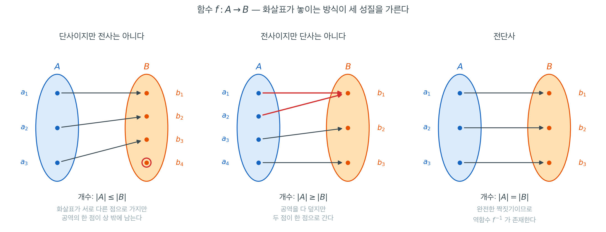

# 집합, 함수, 논리

## 개요

이 절은 책 전체에서 쓰이는 기초적인 수학 언어를 세운다. 논리, 집합, 함수를 정확히 정의해 두면 나중에 확률공간(집합, $\sigma$-대수, 측도의 세 쌍, 3.1절), 확률변수(가측함수, 3.3절), 통계적 추론(논리 구조를 이용해 모집단에 대한 주장을 다루는 일, 9장)을 도입할 때 모호함이 생기지 않는다.

---

## 1. 명제, 집합, 함수

<div class="defn" markdown>

### 정의 1. 명제와 연결사 { .dfn }

**명제(proposition)** 는 참이거나 거짓인 서술문이다. 기본 연결사는 다음과 같다.

| 기호 | 이름 | 읽는 법 | 참이 되는 조건 |
|---|---|---|---|
| $\neg P$ | 부정 | "$P$가 아니다" | $P$가 거짓일 때에 한해 참 |
| $P \land Q$ | 논리곱 | "$P$ 그리고 $Q$" | 둘 다 참일 때에 한해 참 |
| $P \lor Q$ | 논리합 | "$P$ 또는 $Q$"(포함적) | 적어도 하나가 참일 때에 한해 참 |
| $P \Rightarrow Q$ | 함의 | "$P$이면 $Q$이다" | $P$가 참이고 $Q$가 거짓일 때만 거짓 |
| $P \Leftrightarrow Q$ | 쌍조건 | "$P$일 필요충분조건은 $Q$" | $P$와 $Q$의 진리값이 같을 때에 한해 참 |

대우 $\neg Q \Rightarrow \neg P$는 $P \Rightarrow Q$와 논리적으로 동치다. 역 $Q \Rightarrow P$는 동치가 **아니며** 따로 증명해야 한다.

</div>

<div class="defn" markdown>

### 정의 2. 집합과 집합 연산 { .dfn }

**집합(set)** 은 서로 구별되는 대상들의 순서 없는 모임이다. "$x$가 $A$의 원소이다"를 $x \in A$로 쓴다. 공집합은 $\emptyset$이다. 부분집합은 $A \subseteq B$로 쓴다. 표준적인 연산은 다음과 같다.

$$
A \cup B = \{x : x \in A \text{ or } x \in B\}, \qquad A \cap B = \{x : x \in A \text{ and } x \in B\}
$$

$$
A \setminus B = \{x : x \in A \text{ and } x \notin B\}, \qquad A^c = \Omega \setminus A
$$

**멱집합(power set)** $2^A$는 $A$의 모든 부분집합으로 이루어진 집합이다. **곱집합(데카르트 곱)** 은 $A \times B = \{(a, b) : a \in A, b \in B\}$이다.

</div>

<div class="defn" markdown>

### 정의 3. 함수 { .dfn }

**함수(function)** $f: A \to B$는 각 $x \in A$에 정확히 하나의 $f(x) \in B$를 대응시킨다. $A$를 정의역, $B$를 공역이라 한다. **상(image)** 은 $f(A) = \{f(x) : x \in A\} \subseteq B$이다. 함수가

- $f(x_1) = f(x_2) \Rightarrow x_1 = x_2$이면 **단사(injective, 일대일)** 이다.
- $f(A) = B$이면 **전사(surjective, 위로의)** 이다.
- 둘 다이면 **전단사(bijective)** 이다.

전단사는 "원소의 개수가 같다"를 엄밀하게 표현한 것이며, 농도(가산성)를 정의하는 근거가 된다.

</div>



위 그림은 세 성질을 **공역의 한 점에 화살표가 몇 개나 도착하는가**라는 하나의 물음으로 통일해 보여 준다. 단사는 어느 점에도 화살표가 **많아야 하나** 도착한다는 뜻이고, 전사는 어느 점에나 **적어도 하나** 도착한다는 뜻이며, 전단사는 **정확히 하나**씩 도착한다는 뜻이다. 왼쪽 그림에서 붉게 표시된 $b_4$는 화살표를 하나도 받지 못해 상 $f(A)$ 밖에 남았고, 가운데 그림에서 붉은 화살표 두 개는 $a_1$과 $a_2$를 구별하지 못한 채 같은 $b_1$으로 간다.

그림에서 읽어야 할 둘째 사실은 **단사성과 전사성이 함수 $f$만의 성질이 아니라 정의역과 공역을 어떻게 잡았느냐에 달렸다**는 것이다. 왼쪽 그림의 함수는 공역을 $B$ 대신 그 상 $f(A) = \{b_1, b_2, b_3\}$으로 바꾸어 다시 선언하는 순간 전사가 되고, 따라서 전단사가 된다. 대응 화살표는 하나도 건드리지 않았는데 성질의 이름이 바뀐 것이다. $\sigma(x) = 1/(1+e^{-x})$를 $\mathbb{R} \to \mathbb{R}$로 보면 단사이기만 하지만 $\mathbb{R} \to (0,1)$로 보면 전단사가 되어 역함수 로짓이 정의되는 것(연습문제 6)이 바로 이 현상이다.

유한집합에서는 그림 아래에 적은 개수 관계가 곧바로 따라 나온다. 단사면 $|A| \le |B|$, 전사면 $|A| \ge |B|$, 전단사면 $|A| = |B|$이다. 그런데 무한집합에서는 이 추론의 방향이 뒤집힌다. 개수를 먼저 세고 전단사를 찾는 것이 아니라, **전단사가 있다는 사실을 "개수가 같다"의 정의로 삼는다.** 그래서 $\mathbb{N}$과 그 진부분집합인 짝수 전체가 같은 크기일 수 있고, 보기 1의 $n \mapsto n/2$ 또는 $-(n-1)/2$ 라는 대응이 $\mathbb{N}$과 $\mathbb{Z}$가 같은 크기임을 증명한다. 아래에서 다룰 가산·비가산의 구분 전체가 이 한 장의 화살표 그림 위에 서 있다.

---

## 2. 한정기호와 그 부정

**한정기호(quantifier)** 는 "모든"($\forall$)과 "존재한다"($\exists$)를 형식화한다.

<div class="thmbox" markdown>

### 정리 1. 한정기호의 부정 { .thm }

$$
\neg(\forall\, x \in A,\; P(x)) \;\Leftrightarrow\; \exists\, x \in A \text{ s.t. } \neg P(x)
$$

$$
\neg(\exists\, x \in A,\; P(x)) \;\Leftrightarrow\; \forall\, x \in A,\; \neg P(x)
$$

곧 **부정을 안으로 밀어 넣으면 한정기호가 뒤바뀌고 술어가 부정된다.**

</div>

??? proof "증명"

    첫 식의 왼쪽은 "$A$ 의 모든 원소가 $P$ 를 만족한다"가 **거짓**이라는 말이다. 그 주장이 거짓이려면 만족하지 않는 원소가 **적어도 하나** 있어야 하고, 거꾸로 그런 원소가 하나라도 있으면 "모두 만족한다"가 거짓이다. 두 방향이 모두 통하므로 동치다.

    둘째 식은 첫 식에 $P$ 대신 $\neg P$ 를 넣고 양변을 다시 부정하면 나온다. $\neg\neg Q \Leftrightarrow Q$ 를 쓴다. $\square$

    **이 규칙이 통계학의 글을 읽는 데 바로 쓰인다.** "이 추정량은 모든 분포에서 비편향이다"의 부정은 "어떤 분포에서도 비편향이 아니다"가 **아니라** "비편향이 아닌 분포가 하나 있다"다. 반례 하나로 전칭명제가 무너지는 까닭이고, 9장에서 귀무가설을 기각하는 논법의 모양이기도 하다.

한정기호의 순서가 중요하다. $\forall x \exists y\, P(x, y)$(각 $x$마다 어떤 $y$가 통한다)는 $\exists y \forall x\, P(x, y)$(하나의 $y$가 모든 $x$에 통한다)보다 논리적으로 약하다. 수렴의 정의 $\forall \varepsilon \, \exists N \, \forall n > N$이 이런 중첩 구조를 가지며, 앞의 두 한정기호를 뒤바꾸면 균등수렴이 되어 엄격히 더 강한 조건이 된다.

---

## 3. 드모르간 법칙

<div class="thmbox" markdown>

### 정리 2. 드모르간 법칙 { .thm }

임의의 집합족 $\{A_\alpha\}$ 에 대해

$$
\left(\bigcup_{\alpha} A_\alpha\right)^{\!c} = \bigcap_{\alpha} A_\alpha^c,
\qquad
\left(\bigcap_{\alpha} A_\alpha\right)^{\!c} = \bigcup_{\alpha} A_\alpha^c
$$

이다. 두 집합인 경우가 $(A \cup B)^c = A^c \cap B^c$ 와 $(A \cap B)^c = A^c \cup B^c$ 다. 첨자집합이 비가산이어도 성립한다.

</div>

??? proof "증명"

    원소가 양쪽에 속하는 조건을 적어 비교한다. $x \in \left(\bigcup_\alpha A_\alpha\right)^c$ 라는 것은

    $$
    \neg\bigl(\exists\,\alpha,\ x \in A_\alpha\bigr)
    $$

    이고, **정리 1 의 둘째 식**을 쓰면 이것이 $\forall\alpha,\ x \notin A_\alpha$ 와 같다. 그런데 그 말이 곧 $x \in \bigcap_\alpha A_\alpha^c$ 다. 두 집합의 원소 조건이 같으므로 두 집합이 같다.

    둘째 식은 첫 식을 $A_\alpha^c$ 에 적용하고 양변의 여집합을 취하면 나온다. $\square$

    **드모르간 법칙은 정리 1 을 집합의 말로 옮긴 것이다.** 합집합이 "적어도 하나"($\exists$)이고 교집합이 "모두"($\forall$)이므로, 여집합을 씌우는 일이 부정을 안으로 미는 일과 같다. 첨자집합의 크기가 들어오지 않는 까닭도 이것이다 — 논리 규칙은 개수를 세지 않는다.

    확률에서 이 법칙은 **"적어도 하나가 일어난다"를 "하나도 일어나지 않는다"의 여사건으로 바꾸는** 수법으로 끊임없이 쓰인다. 본페로니 부등식(3.1절)과 독립 사건의 $1 - (1-p)^n$ 이 모두 그 모양이다.

이것은 "적어도 하나"와 "모두" 사이를 오가는 핵심 도구이며, 확률에서 사건들의 합집합의 여집합을 계산할 때 늘 쓰이는 수법이다.

---

## 4. 가산성과 그 귀결

어떤 집합이 $\mathbb{N}$과 전단사 대응되면 **가산무한(countably infinite)** 이라 한다(예: $\mathbb{Z}$, $\mathbb{Q}$, 임의 구간 안의 유리수 전체). 그렇지 않으면 **비가산(uncountable)** 이다. 칸토어의 대각선 논법은 $\mathbb{R}$이 비가산임을 보인다.

이 구분은 확률의 토대가 된다.

- 가산 표본공간에서는 확률측도가 확률질량함수로 결정되며, 어떤 사건의 확률이든 합으로 주어진다(이산확률변수, 3.3절).
- 비가산 표본공간(예: 실숫값 측정)에서는 개별 결과의 확률이 0이고, 확률은 밀도의 적분으로 정의된다(연속확률변수, 3.3절).

---

## 5. 책 전체에서 쓰이는 함수

- **지시함수** $\mathbf{1}_A(x)$는 $x \in A$이면 $1$, 아니면 $0$이다. 집합(사건)과 수(확률변수)를 잇는 다리다: $\mathbb{E}[\mathbf{1}_A] = P(A)$.
- **지수함수** $e^x$와 **로그** $\ln x$ — 적률생성함수(3.4절), 로그가능도(6장), 엔트로피에 등장한다.
- **로지스틱 / 시그모이드** $\sigma(x) = 1/(1 + e^{-x})$ — 실직선을 $(0, 1)$로 보낸다. 로짓의 역함수이며 로지스틱 회귀(19장)의 토대다.
- **감마함수** $\Gamma(\alpha) = \int_0^\infty t^{\alpha - 1} e^{-t}\, dt$ — 계승을 일반화하며 4.2절의 $\chi^2$·$t$·$F$ 밀도와 감마·베타 밀도를 정규화한다.

!!! note "공허한 참"
    $P$가 거짓이면 $Q$가 무엇이든 $P \Rightarrow Q$는 참이다. 확률이 0인 사건에 조건을 걸 때 이 점이 중요하다. 영집합 위에서는 어떤 진술이든 "참"이므로, 확률에 관한 진술은 거의 확실하게 성립하는 것으로 해석해야 한다.

<div class="exbox" markdown>

**보기 1.** <span class="diff easy" title="쉬움"></span> 드모르간 법칙, 지시함수, 그리고 $\mathbb{N}$ 과 $\mathbb{Z}$ 의 대응. $\Omega = \{1, 2, \ldots, 10\}$에 $A = \{1,2,3,4,5\}$, $B = \{4,5,6,7\}$을 놓는다.

**(1)** $(A \cup B)^c$와 $A^c \cap B^c$를 각각 손으로 적어 같음을 보이고, 이 등식이 이 세 집합에서만 성립하는 우연이 아님을 논리 항등식으로 설명하시오.

**(2)** $\Omega$에서 균등하게 뽑은 표본으로 지시함수 $\mathbf{1}_A$의 표본평균을 재면 무엇을 추정하는가. 그 참값을 구하고, $n = 10^4$에서 추정값이 참값에서 얼마나 벗어나는 것이 정상인지 미리 말하시오.

**(3)** 코드의 `bijection_N_to_Z`가 $\mathbb{N} \to \mathbb{Z}$의 전단사임을 보이고 그 역함수를 명시적으로 적으시오.

</div>

??? success "풀이"

    쪽의 코드가 세 가지를 차례로 보인다. 유한집합에서의 드모르간 법칙, 지시함수의 기댓값이 확률이라는 사실, 그리고 $\mathbb{N}$ 과 $\mathbb{Z}$ 를 짝지우는 함수다.

    ```python
    import numpy as np

    # === De Morgan's law with finite sets ===
    omega = set(range(1, 11))
    A = {1, 2, 3, 4, 5}
    B = {4, 5, 6, 7}

    A_c, B_c = omega - A, omega - B
    lhs = omega - (A | B)   # (A ∪ B)^c
    rhs = A_c & B_c          # A^c ∩ B^c
    print(f"(A ∪ B)^c = {lhs}")
    print(f"A^c ∩ B^c = {rhs}")
    print(f"Equal: {lhs == rhs}")

    # === Indicator function and its connection to probability ===
    rng = np.random.default_rng(42)
    samples = rng.integers(low=1, high=11, size=10_000)
    prob_A = np.mean([s in A for s in samples])
    print(f"P(A) estimate: {prob_A:.3f} (true 1/2 since |A|=5 of 10)")

    # === Bijection demonstration: N <-> Z ===
    def bijection_N_to_Z(n):
        # n=1 -> 0, n=2 -> 1, n=3 -> -1, n=4 -> 2, n=5 -> -2, ...
        return n // 2 if n % 2 == 0 else -(n // 2)

    print([bijection_N_to_Z(n) for n in range(1, 11)])
    ```

    출력:

    ```
    (A ∪ B)^c = {8, 9, 10}
    A^c ∩ B^c = {8, 9, 10}
    Equal: True
    P(A) estimate: 0.506 (true 1/2 since |A|=5 of 10)
    [0, 1, -1, 2, -2, 3, -3, 4, -4, 5]
    ```

    **(1) 손으로 세어 본다.** $A \cup B = \{1,2,3,4,5,6,7\}$이므로 $(A \cup B)^c = \{8,9,10\}$이다. 다른 쪽은 $A^c = \{6,7,8,9,10\}$과 $B^c = \{1,2,3,8,9,10\}$을 교차시켜 $A^c \cap B^c = \{8,9,10\}$이다. 출력의 두 줄이 그대로 이것이다.

    우연이 아닌 까닭은 이 등식이 **집합의 사실이 아니라 논리의 사실**이기 때문이다. 원소 하나를 잡고 소속 여부를 명제로 읽으면

    $$
    x \in (A \cup B)^c \iff \lnot(x \in A \;\lor\; x \in B) \iff \lnot(x \in A) \;\land\; \lnot(x \in B) \iff x \in A^c \cap B^c
    $$

    이고, 가운데 단계가 바로 $\lnot(P \lor Q) \iff \lnot P \land \lnot Q$다. $\Omega$가 무엇이든, $A$와 $B$가 무엇이든 성립한다. 아래 확인 코드는 $\lvert \Omega \rvert = 5$에서 부분집합 쌍 $32^2 = 1024$개를 전수 검사해 합집합꼴과 교집합꼴이 모두 참임을 보인다.

    **(2) 추정하는 것은 $P(A)$이고 참값은 정확히 $1/2$이다.** 지시함수의 기댓값이 확률이라는 것이

    $$
    \mathbb{E}[\mathbf{1}_A] = 1 \cdot P(A) + 0 \cdot P(A^c) = P(A)
    $$

    이고, 균등분포에서는 $P(A) = \lvert A \rvert / \lvert \Omega \rvert = 5/10 = 1/2$다. 표본평균은 $\mathbf{1}_A(X_i)$들의 평균, 곧 $\text{Bernoulli}(1/2)$ 표본의 비율이므로 표준오차가

    $$
    \text{SE} = \sqrt{\frac{p(1-p)}{n}} = \sqrt{\frac{0.25}{10^4}} = 0.005
    $$

    이다. 그러므로 추정값이 $0.5$에서 $\pm 0.005$ 안쪽에 들 확률이 약 $68\%$, $\pm 0.01$ 안쪽이 약 $95\%$다. **$0.506$은 정확히 그 예산 안에 있다.** 실제로 $10000$개 가운데 $5061$개가 $A$에 들었으니 벗어남은 $0.0061 = 1.22\,\text{SE}$다. 어긋난 것이 아니라 예상된 흔들림이며, 참값과 일치하기를 바라는 것이 오히려 잘못된 기대다. 자릿수를 더 얻으려면 $n$을 100배로 키워야 $\text{SE}$가 10분의 1이 된다.

    **(3) 두 쪽을 따로 보면 전단사가 보인다.** $n$이 짝수면 $f(n) = n/2$, 홀수면 파이썬의 `n // 2`가 $(n-1)/2$이므로 $f(n) = -(n-1)/2$다. 곧

    $$
    f(\{2, 4, 6, \ldots\}) = \{1, 2, 3, \ldots\}, \qquad f(\{1, 3, 5, \ldots\}) = \{0, -1, -2, \ldots\}
    $$

    이고 두 상(image)이 서로 겹치지 않으면서 합이 $\mathbb{Z}$ 전체다. 각 쪽에서 $f$가 단조이므로 단사이고, 두 상이 $\mathbb{Z}$를 덮으므로 전사다. 역함수는

    $$
    g(k) = \begin{cases} 2k, & k \ge 1 \\ 1 - 2k, & k \le 0 \end{cases}
    $$

    이다. $g(1) = 2$, $g(0) = 1$, $g(-1) = 3$, $g(5) = 10$이고, 출력의 리스트 `[0, 1, -1, 2, -2, ...]`가 $g$의 값을 $1$부터 차례로 되읽은 것이다.

    ```python
    import itertools
    import math

    import numpy as np

    # === 드모르간이 특정 세 집합의 우연이 아님을 전수 확인한다 ===
    om = set(range(5))
    subs = [set(c) for r in range(6) for c in itertools.combinations(om, r)]
    ok_union = all(om - (X | Y) == (om - X) & (om - Y) for X in subs for Y in subs)
    ok_inter = all(om - (X & Y) == (om - X) | (om - Y) for X in subs for Y in subs)
    print(f"부분집합 쌍 {len(subs) ** 2}개 전수 확인:  합집합꼴 {ok_union}  교집합꼴 {ok_inter}")

    # === 지시함수 추정값이 1 표준오차 몇 배만큼 벗어났는가 ===
    rng = np.random.default_rng(42)
    samples = rng.integers(low=1, high=11, size=10_000)
    k = int(np.sum(np.isin(samples, [1, 2, 3, 4, 5])))
    se = math.sqrt(0.5 * 0.5 / 10_000)
    print(f"A에 든 표본 {k}/10000 = {k / 10_000:.4f},  SE = {se:.4f},  "
          f"벗어남 = {(k / 10_000 - 0.5) / se:.2f} SE")

    # === 전단사의 역함수를 적어 양쪽으로 확인한다 ===
    def f(n):
        return n // 2 if n % 2 == 0 else -(n // 2)

    def g(k):
        return 2 * k if k >= 1 else 1 - 2 * k

    print(f"f가 1..4000에서 단사:      {len(set(map(f, range(1, 4001)))) == 4000}")
    print(f"f(g(k)) == k  (|k| <= 2000): {all(f(g(k)) == k for k in range(-2000, 2001))}")
    print(f"g(f(n)) == n  (n <= 4000):   {all(g(f(n)) == n for n in range(1, 4001))}")
    ```

    출력:

    ```
    부분집합 쌍 1024개 전수 확인:  합집합꼴 True  교집합꼴 True
    A에 든 표본 5061/10000 = 0.5061,  SE = 0.0050,  벗어남 = 1.22 SE
    f가 1..4000에서 단사:      True
    f(g(k)) == k  (|k| <= 2000): True
    g(f(n)) == n  (n <= 4000):   True
    ```

    세 가지가 모두 맞는다. 그리고 (3)이 이 쪽에서 가장 쓸모 있는 대목이다. $\mathbb{N}$ 은 $\mathbb{Z}$ 의 진부분집합인데도 둘 사이에 전단사가 있으므로 $\mathbb{Z}$ 는 가산이다. 가산이라는 것은 곧 $\sigma$-가법성을 그대로 쓸 수 있다는 뜻이고, 그래서 $\mathbb{Z}$ 를 값으로 갖는 확률변수는 확률질량함수 하나로 다 기술된다. 반면 $\mathbb{R}$ 에는 그런 짝짓기가 없고, 거기서부터 밀도와 적분이 필요해진다.

---

## 연습문제

<div class="drillbox" markdown>

**연습문제 1.** <span class="diff easy" title="쉬움"></span>
다음 각 진술의 형식적 부정을 써라.

**(a)** $\forall\, x \in \mathbb{R},\; x^2 \geq 0$
**(b)** $\exists\, \varepsilon > 0 \text{ such that } \forall\, n \in \mathbb{N},\; a_n > \varepsilon$
**(c)** $\forall\, \varepsilon > 0,\; \exists\, N \in \mathbb{N} \text{ such that } n > N \implies |a_n - L| < \varepsilon$

</div>

??? success "풀이"
    (a) $\exists\, x \in \mathbb{R} \text{ such that } x^2 < 0$.
    (b) $\forall\, \varepsilon > 0,\; \exists\, n \in \mathbb{N} \text{ such that } a_n \leq \varepsilon$.
    (c) 바깥쪽부터 안쪽으로 차례로 부정한다. 부정은

    $$
    \exists\, \varepsilon > 0 \text{ such that } \forall\, N \in \mathbb{N},\; \exists\, n > N \text{ with } |a_n - L| \geq \varepsilon
    $$

    이며, 이것이 바로 "$a_n$이 $L$로 수렴하지 **않는다**"는 진술이다.

---

<div class="drillbox" markdown>

**연습문제 2.** <span class="diff easy" title="쉬움"></span>
$A = \{1, 2, 3, 4, 5\}$, $B = \{3, 4, 5, 6, 7\}$, $\Omega = \{1, 2, 3, 4, 5, 6, 7, 8\}$이라 하자.

**(a)** $A \cap B$, $A \cup B$, $A \setminus B$, $A^c$, 그리고 $A \triangle B := (A \setminus B) \cup (B \setminus A)$를 계산하라.
**(b)** 드모르간 법칙 $(A \cup B)^c = A^c \cap B^c$를 확인하라.

</div>

??? success "풀이"
    (a) $A \cap B = \{3, 4, 5\}$, $A \cup B = \{1, 2, 3, 4, 5, 6, 7\}$, $A \setminus B = \{1, 2\}$, $A^c = \{6, 7, 8\}$, $A \triangle B = \{1, 2, 6, 7\}$.

    (b) $(A \cup B)^c = \{8\}$이고 $A^c \cap B^c = \{6, 7, 8\} \cap \{1, 2, 8\} = \{8\}$이다. 둘 다 $\{8\}$과 같다. $\square$

---

<div class="drillbox" markdown>

**연습문제 3.** <span class="diff med" title="중간"></span>
$\cup$, $\cap$, 여집합의 정의를 이용해 드모르간 법칙 $(A \cup B)^c = A^c \cap B^c$를 기본 원리로부터 증명하라.

</div>

??? success "풀이"
    양쪽 포함관계를 보여 집합이 같음을 증명한다.

    ($\subseteq$): $x \in (A \cup B)^c$라 하자. 그러면 $x \notin A \cup B$이므로 $x \notin A$이고 **또한** $x \notin B$이다. 따라서 $x \in A^c$이고 $x \in B^c$, 즉 $x \in A^c \cap B^c$이다.

    ($\supseteq$): $x \in A^c \cap B^c$라 하자. 그러면 $x \notin A$이고 $x \notin B$이므로 $x$는 어느 집합에도 속하지 않고 따라서 $x \notin A \cup B$, 즉 $x \in (A \cup B)^c$이다.

    양쪽 포함관계가 모두 성립하므로 두 집합은 같다. $\square$

---

<div class="drillbox" markdown>

**연습문제 4.** <span class="diff med" title="중간"></span>
유리수 전체의 집합 $\mathbb{Q}$가 가산임을 보여라.

</div>

??? success "풀이"
    $\mathbb{Q}$에서 $\mathbb{N}$으로 가는 단사를 제시하면 충분하다(그러면 $\mathbb{Q}$는 많아야 가산이고, 무한집합임은 분명하다). 모든 양의 유리수는 $p, q \in \mathbb{N}$인 기약분수 $p/q$로 유일하게 쓸 수 있다. 다음과 같이 정의하자.

    $$
    \phi\!\left(\tfrac{p}{q}\right) = 2^p\, 3^q
    $$

    소인수분해의 유일성에 의해 $\phi$는 $\mathbb{Q}_{>0}$ 위에서 단사다. 여기에 $\mathbb{Q}$에서 $\{0\} \cup \mathbb{Q}_{>0} \cup \mathbb{Q}_{<0}$으로 가는 전단사(예: 양의 유리수와 음의 유리수를 $0, q_1, -q_1, q_2, -q_2, \ldots$처럼 번갈아 배열)를 합성하면 단사 $\mathbb{Q} \hookrightarrow \mathbb{N}$을 얻는다. $\square$

---

<div class="drillbox" markdown>

**연습문제 5.** <span class="diff med" title="중간"></span>
확률에서 흔한 오류는 "$P(A \mid B) > P(A)$이면 $A$가 $B$를 유발했다"고 주장하는 것이다. $P(B \mid A)$를 $P(A \mid B)$, $P(A)$, $P(B)$로 계산하여 **추론의 방향** 문제를 형식화하고, 원래 진술이 왜 근거가 없는지 평이한 말로 설명하라.

</div>

??? success "풀이"
    베이즈 규칙에 의해

    $$
    P(B \mid A) = \frac{P(A \mid B)\, P(B)}{P(A)}
    $$

    이다. 가정 $P(A \mid B) > P(A)$는 $A$와 $B$에 대해 대칭이다. 양변에 $P(B)/P(A)$를 곱하면 $P(B \mid A) > P(B)$도 성립함을 알 수 있다. 따라서 "$A$와 $B$가 양의 연관을 갖는다"는 사실은 둘 중 어느 쪽이 (또는 어느 쪽이든) 다른 쪽을 유발하는지에 대해 아무것도 말해주지 않는다. 인과성은 반사실이나 개입에 관한 진술이며 조건부확률 진술만으로는 추론할 수 없다(이것이 "상관관계는 인과관계를 뜻하지 않는다"의 형식적 대응물이다). $\square$

---

<div class="drillbox" markdown>

**연습문제 6.** <span class="diff med" title="중간"></span>
로지스틱 함수 $\sigma(x) = 1/(1+e^{-x})$가 $\mathbb{R}$에서 $(0,1)$로 가는 전단사임을 보이고 역함수를 구하라. 항등식 $\sigma'(x) = \sigma(x)(1-\sigma(x))$와 $\sigma(-x) = 1-\sigma(x)$도 증명하라.

</div>

??? success "풀이"
    **전단사.** $y = 1/(1+e^{-x})$를 $x$에 대해 푼다.

    $$
    1 + e^{-x} = \frac{1}{y}
    \;\Longrightarrow\;
    e^{-x} = \frac{1-y}{y}
    \;\Longrightarrow\;
    x = \ln\frac{y}{1-y}
    $$

    각 $y \in (0,1)$에 대해 이 $x$가 유일하게 존재하므로 $\sigma$는 전단사이고, 역함수는 **로짓** $\operatorname{logit}(y) = \ln\frac{y}{1-y}$이다. 이것이 로지스틱 회귀에서 확률을 실직선으로 옮겨 선형모형을 세울 수 있게 해 주는 다리다.

    **도함수.** 몫의 미분 또는 연쇄법칙으로

    $$
    \sigma'(x) = \frac{e^{-x}}{(1+e^{-x})^2}
    = \frac{1}{1+e^{-x}}\cdot\frac{e^{-x}}{1+e^{-x}}
    = \sigma(x)\left(1-\sigma(x)\right)
    $$

    이다. 마지막 등호는 $\dfrac{e^{-x}}{1+e^{-x}} = 1 - \dfrac{1}{1+e^{-x}}$에서 나온다.

    **대칭성.** $\sigma(-x) = \dfrac{1}{1+e^{x}} = \dfrac{e^{-x}}{e^{-x}+1} = 1-\sigma(x)$이다. $\square$

    ```python
    import numpy as np
    from scipy.special import expit

    x = np.array([-3., -1., 0., 1., 3.])
    p = expit(x)

    print("sigma(x)        :", p.round(6))
    print("sigma(x)+sigma(-x):", (p + expit(-x)).round(12))
    print("logit(sigma(x)) :", np.log(p / (1 - p)).round(10))

    h = 1e-6
    print("\n수치 도함수 :", ((expit(x + h) - expit(x - h)) / (2 * h)).round(8))
    print("sigma(1-sigma):", (p * (1 - p)).round(8))
    ```

    출력:

    ```
    sigma(x)        : [0.047426 0.268941 0.5      0.731059 0.952574]
    sigma(x)+sigma(-x): [1. 1. 1. 1. 1.]
    logit(sigma(x)) : [-3. -1.  0.  1.  3.]

    수치 도함수 : [0.04517666 0.19661193 0.25       0.19661193 0.04517666]
    sigma(1-sigma): [0.04517666 0.19661193 0.25       0.19661193 0.04517666]
    ```

    **두 가지 실무적 함의.**

    도함수가 $\sigma(1-\sigma)$라는 것은 최댓값이 $x = 0$에서 $0.25$이고 양쪽 꼬리에서 $0$으로 죽는다는 뜻이다. $|x|$가 크면 기울기가 사실상 사라지므로, 신경망에서 시그모이드를 은닉층 활성함수로 쓸 때 기울기 소실 문제가 생긴다. 로지스틱 회귀의 피셔 정보에도 같은 인자가 나타나며, 이는 $\hat{p}$이 $0$이나 $1$에 가까울 때 계수 추정이 불안정해지는 이유다.

    $x = -800$처럼 큰 음수에서 $1/(1+e^{-x})$를 그대로 계산하면 `exp` 가 넘쳐 경고가 난다. `scipy.special.expit` 은 부호에 따라 $e^{x}/(1+e^{x})$ 형태로 갈아타 이를 피한다. 로그가능도를 직접 구현할 때는 이런 수치적으로 안정한 형태를 쓰라.

---

<div class="drillbox" markdown>

**연습문제 7.** <span class="diff hard" title="어려움"></span>
$f: A \to B$라 하자. $f$가 단사일 필요충분조건이 모든 부분집합 쌍 $S_1, S_2 \subseteq A$에 대해

$$
f(S_1 \cap S_2) = f(S_1) \cap f(S_2)
$$

가 성립하는 것임을 증명하라.

</div>

??? success "풀이"
    ($\Rightarrow$) $f$가 단사라고 하자. 포함관계 $f(S_1 \cap S_2) \subseteq f(S_1) \cap f(S_2)$는 임의의 함수에 대해 성립한다($x \in S_1 \cap S_2$에 대해 $y = f(x)$이면 $y$는 $f(S_1)$과 $f(S_2)$ 모두에 속한다). 반대 방향으로, $y \in f(S_1) \cap f(S_2)$라 하자. 그러면 어떤 $x_1 \in S_1$, $x_2 \in S_2$에 대해 $y = f(x_1) = f(x_2)$이다. 단사성에 의해 $x_1 = x_2$이므로 $x_1 \in S_1 \cap S_2$이고 $y \in f(S_1 \cap S_2)$이다.

    ($\Leftarrow$) 모든 부분집합에 대해 이 항등식이 성립한다고 하자. $f(x_1) = f(x_2) = y$인 임의의 $x_1, x_2 \in A$를 잡고 $S_1 = \{x_1\}$, $S_2 = \{x_2\}$라 두자. 그러면 $f(S_1) \cap f(S_2) = \{y\}$이므로 가정에 의해 $f(S_1 \cap S_2) = \{y\}$이다. 이것이 공집합이 아니려면 $S_1 \cap S_2 \ne \emptyset$이어야 하므로 $x_1 = x_2$가 강제된다. $\square$

---

<div class="drillbox" markdown>

**연습문제 8.** <span class="diff hard" title="어려움"></span>
칸토어의 대각선 논법으로 $(0,1)$이 비가산임을 증명하라. 이 사실이 확률론에서 갖는 귀결은 무엇인가?

</div>

??? success "풀이"
    귀류법을 쓴다. $(0,1)$이 가산이라 가정하면 그 원소를 모두 나열할 수 있다.

    $$
    x_1 = 0.d_{11}d_{12}d_{13}\cdots,\quad
    x_2 = 0.d_{21}d_{22}d_{23}\cdots,\quad
    x_3 = 0.d_{31}d_{32}d_{33}\cdots,\;\ldots
    $$

    이제 새로운 수 $y = 0.e_1e_2e_3\cdots$를 **대각선을 피해서** 만든다.

    $$
    e_k = \begin{cases} 5 & d_{kk} \ne 5 \\ 6 & d_{kk} = 5 \end{cases}
    $$

    그러면 $y \in (0,1)$이지만, 모든 $k$에 대해 $y$는 $k$번째 자리에서 $x_k$와 다르므로 $y \ne x_k$이다. 즉 $y$는 목록에 없다. 이는 목록이 $(0,1)$ 전체를 담는다는 가정에 모순이다. $\square$

    !!! note "자릿수 $5$와 $6$만 쓴 이유"
        $0$과 $9$를 피한 것은 $0.4999\cdots = 0.5000\cdots$처럼 십진 표현이 두 가지인 수 때문이다. $5$와 $6$만 쓰면 $y$의 표현이 유일해져 "자리가 다르면 수도 다르다"가 확실해진다. 증명에서 가장 자주 빠뜨리는 곳이다.

    **확률론에서의 귀결.** $(0,1)$ 위의 균등분포를 생각하자. 각 점의 확률이 어떤 상수 $c$로 같아야 할 것 같지만,

    - $c > 0$이면 가산개의 점만 모아도 확률의 합이 $\infty$가 되어 $1$을 넘는다.
    - $c = 0$이면, 만약 $(0,1)$이 가산이었을 경우 가산가법성에 의해 전체 확률이 $0$이 되어 모순이다.

    비가산이기 때문에 두 번째 모순이 발생하지 않는다. **가산가법성은 비가산 합집합에는 적용되지 않으므로**, 모든 점의 확률이 $0$이면서도 전체의 확률이 $1$일 수 있다. 연속형 확률변수에서 $P(X = a) = 0$인데도 $P(a < X < b) > 0$인 것이 이상하지 않은 이유가 바로 이것이다.

---

<div class="drillbox" markdown>

**연습문제 9.** <span class="diff hard" title="어려움"></span>
지시함수의 대수를 이용해 포함–배제 원리를 유도하라. 먼저 $\mathbf{1}_{A \cap B} = \mathbf{1}_A \mathbf{1}_B$와 $\mathbf{1}_{A^c} = 1 - \mathbf{1}_A$를 확인한 뒤,

$$
\mathbf{1}_{A_1 \cup \cdots \cup A_n} = 1 - \prod_{i=1}^n (1 - \mathbf{1}_{A_i})
$$

을 전개하고 기댓값을 취하라.

</div>

??? success "풀이"
    **기본 항등식.** $\mathbf{1}_{A\cap B}(x) = 1$일 필요충분조건은 $x \in A$이고 $x \in B$인 것이며, 이는 $\mathbf{1}_A(x)\mathbf{1}_B(x) = 1$과 같다. 두 값이 모두 $\{0,1\}$에 있으므로 곱이 곧 논리곱이다. 여집합은 정의에서 바로 나온다.

    **합집합.** $x$가 어느 $A_i$에도 속하지 않을 필요충분조건은 모든 $i$에 대해 $1 - \mathbf{1}_{A_i}(x) = 1$인 것이므로

    $$
    \mathbf{1}_{(\bigcup A_i)^c} = \prod_{i=1}^n(1 - \mathbf{1}_{A_i})
    $$

    이고, 여집합을 취하면 주어진 식이 된다. 드모르간 법칙을 곱으로 쓴 것이다.

    **전개.** $n = 3$일 때 곱을 펼치면

    $$
    1 - (1-\mathbf{1}_{A})(1-\mathbf{1}_{B})(1-\mathbf{1}_{C})
    = \mathbf{1}_A + \mathbf{1}_B + \mathbf{1}_C - \mathbf{1}_{A}\mathbf{1}_{B} - \mathbf{1}_{A}\mathbf{1}_{C} - \mathbf{1}_{B}\mathbf{1}_{C} + \mathbf{1}_{A}\mathbf{1}_{B}\mathbf{1}_{C}
    $$

    이다. 여기서 $\mathbb{E}[\mathbf{1}_S] = P(S)$를 쓰고 곱을 교집합으로 되돌리면

    $$
    P(A\cup B\cup C) = P(A)+P(B)+P(C)-P(A\cap B)-P(A\cap C)-P(B\cap C)+P(A\cap B\cap C)
    $$

    를 얻는다. 일반형의 부호 $(-1)^{k+1}$은 곱을 전개할 때 나오는 $(-1)^k$에서 그대로 온다. $\square$

    ```python
    import numpy as np

    rng = np.random.default_rng(3)
    N = 200_000
    A = rng.random(N) < 0.5
    B = rng.random(N) < 0.3
    C = rng.random(N) < 0.2

    union = (A | B | C).mean()
    incl_excl = (A.mean() + B.mean() + C.mean()
                 - (A & B).mean() - (A & C).mean() - (B & C).mean()
                 + (A & B & C).mean())
    product = (1 - (1 - A) * (1 - B) * (1 - C)).mean()   # 지시함수 곱 형태

    print(f"P(A∪B∪C) 직접   = {union:.6f}")
    print(f"포함–배제       = {incl_excl:.6f}")
    print(f"지시함수 곱     = {product:.6f}")
    ```

    출력:

    ```
    P(A∪B∪C) 직접   = 0.718550
    포함–배제       = 0.718550
    지시함수 곱     = 0.718550
    ```

    세 값이 부동소수점 오차 안에서 일치한다. 세 번째 계산이 특히 눈여겨볼 만한데, **집합 연산을 산술로 바꾸어** 벡터화된 코드 한 줄로 끝냈다.

    이 기법은 유도 도구 이상이다. 조합론에서 완전순열의 개수를 세거나 확률에서 본페로니 부등식(전개를 도중에 자르면 상계와 하계가 번갈아 나온다)을 얻을 때도 같은 전개를 쓴다.

---

<div class="drillbox" markdown>

**연습문제 10.** <span class="diff hard" title="어려움"></span>
한정기호의 순서가 왜 중요한지 구체적으로 보여라. $f_n(x) = x^n$을 $[0,1)$ 위에서 생각하자.

**(a)** $f_n \to 0$이 점별로 성립함을 보여라.
**(b)** 이 수렴이 균등하지 **않음**을 보여라.
**(c)** 두 진술의 한정기호 구조가 어떻게 다른지 설명하라.

</div>

??? success "풀이"
    **(a) 점별 수렴.** $x \in [0,1)$을 고정하면 $|x| < 1$이므로 $x^n \to 0$이다. 주어진 $\varepsilon$에 대해 $N = \lceil \ln\varepsilon / \ln x\rceil$로 두면 된다.

    **(b) 균등수렴의 실패.** 각 $n$에 대해

    $$
    \sup_{x \in [0,1)} |f_n(x) - 0| = \sup_{x\in[0,1)} x^n = 1
    $$

    이다($x \to 1^-$일 때 상한에 접근한다. 최댓값은 아니다). 이 상한이 $n$과 무관하게 $1$이므로 $0$으로 가지 않는다.

    **(c) 한정기호 구조.**

    $$
    \text{점별: } \forall \varepsilon\; \forall x\; \exists N\; \forall n>N \;\; |f_n(x)| < \varepsilon
    $$

    $$
    \text{균등: } \forall \varepsilon\; \exists N\; \forall x\; \forall n>N \;\; |f_n(x)| < \varepsilon
    $$

    차이는 오직 $\exists N$과 $\forall x$의 **순서**뿐이다. 점별에서는 $N$이 $x$에 의존해도 되지만, 균등에서는 하나의 $N$이 모든 $x$에 동시에 통해야 한다. 여기서는 $x$가 $1$에 가까워질수록 필요한 $N$이 한없이 커지므로 그런 $N$이 없다. $\square$

    ```python
    import numpy as np

    print("고정된 x 에서는 0 으로 간다 (점별 수렴)")
    print(f"{'n':>6}{'0.5^n':>12}{'0.9^n':>12}{'0.99^n':>12}{'sup':>8}")
    for n in (10, 100, 1000, 10_000):
        print(f"{n:>6}{0.5 ** n:>12.3e}{0.9 ** n:>12.3e}{0.99 ** n:>12.3e}{1.0:>8.1f}")

    print("\n|x^N| < 0.01 을 만들려면 N 이 얼마나 커야 하는가")
    for x in (0.5, 0.9, 0.99, 0.999):
        N = int(np.ceil(np.log(0.01) / np.log(x)))
        print(f"  x = {x:<6}: N = {N:>5}")
    ```

    출력:

    ```
    고정된 x 에서는 0 으로 간다 (점별 수렴)
         n       0.5^n       0.9^n      0.99^n     sup
        10   9.766e-04   3.487e-01   9.044e-01     1.0
       100   7.889e-31   2.656e-05   3.660e-01     1.0
      1000  9.333e-302   1.748e-46   4.317e-05     1.0
     10000   0.000e+00   0.000e+00   2.249e-44     1.0

    |x^N| < 0.01 을 만들려면 N 이 얼마나 커야 하는가
      x = 0.5   : N =     7
      x = 0.9   : N =    44
      x = 0.99  : N =   459
      x = 0.999 : N =  4603
    ```

    표의 마지막 열이 핵심이다. 각 열은 $0$으로 내려가지만 상한은 $n$이 아무리 커도 $1$에 붙박여 있다. 그리고 필요한 $N$은 $x \to 1^-$에서 발산한다.

    **통계에서 왜 중요한가.** 글리벤코–칸텔리 정리는 경험분포함수가 참 분포함수로 **균등하게** 수렴한다고 말한다($\sup_x |F_n(x) - F(x)| \to 0$, 거의 확실하게). 점별 수렴만으로는 부족한데, 콜모고로프–스미르노프 검정 같은 방법이 바로 그 상한을 검정통계량으로 쓰기 때문이다.

---

## 정리하며

이 절은 뒤에 나올 모든 정의가 기댈 **언어**를 세웠다.

- **논리.** 대우는 원래 명제와 동치이지만 역은 아니다. 증명에서 방향을 뒤집어도 되는 때와 안 되는 때를 가르는 기준이다.
- **한정기호.** $\forall\exists$ 와 $\exists\forall$ 는 다르며, 앞의 것이 더 약하다. 수렴의 정의가 이 중첩 구조를 그대로 쓰고, 두 한정기호를 맞바꾸면 균등수렴이라는 더 강한 조건이 된다.
- **집합 연산과 드모르간 법칙.** "적어도 하나"와 "모두" 사이를 오가는 도구이며, 비가산 모임에서도 성립한다. 사건들의 합집합을 여집합으로 바꿔 계산하는 수법이 여기서 나온다.
- **함수.** 단사·전사·전단사의 구별이 "개수가 같다"를 엄밀하게 만들고, 그것이 곧 가산성의 정의다.
- **가산과 비가산.** 이 하나의 구분이 확률을 둘로 가른다. 가산이면 확률질량함수를 더하고, 비가산이면 밀도를 적분한다.

**여기서 세운 세 쌍이 그대로 확률의 뼈대가 된다.** 표본공간은 집합이고, 사건의 모임은 $\sigma$-대수이며, 확률은 그 위의 측도다. 확률변수는 가측함수이고, 지시함수 $\mathbf{1}_A$ 가 사건과 수를 잇는다($\mathbb{E}[\mathbf{1}_A] = P(A)$).

다음 절 **수열, 극한, 점근**은 이 언어에 **움직임**을 더한다. $n \to \infty$ 에서 무엇이 어떤 속도로 수렴하는가를 다루며, 큰수의 법칙과 중심극한정리가 말하는 "수렴"이 정확히 무슨 뜻인지가 거기서 정해진다.
