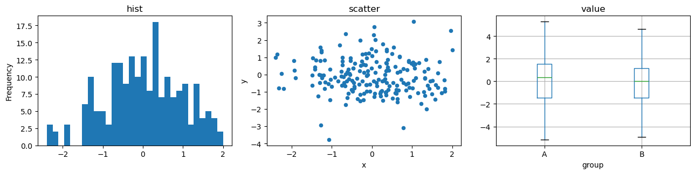
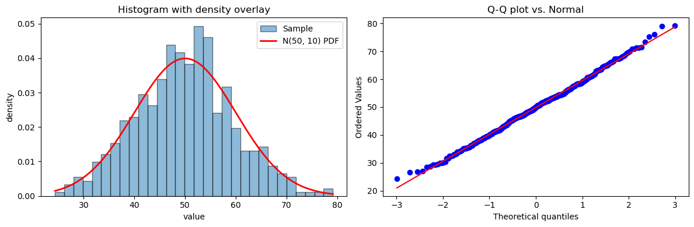
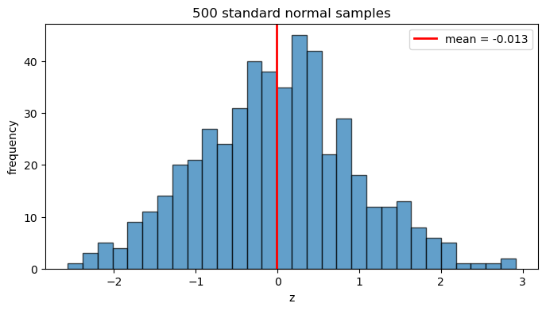
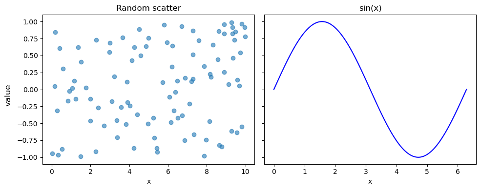
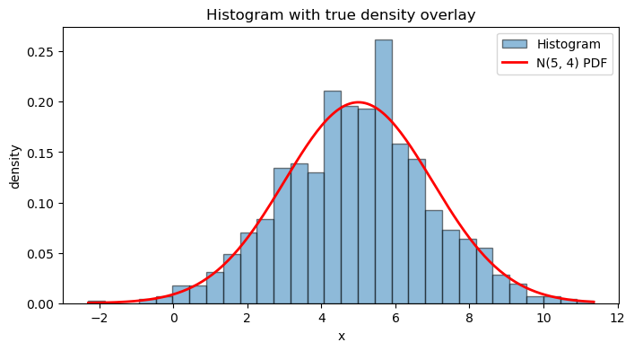
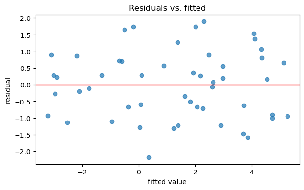
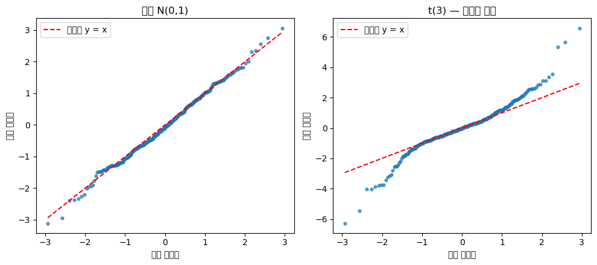
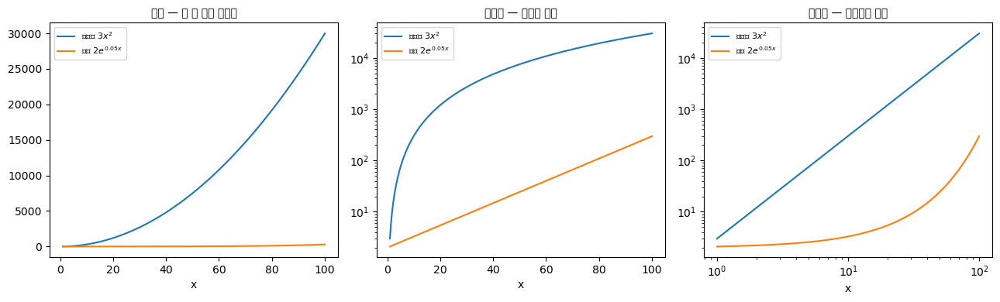
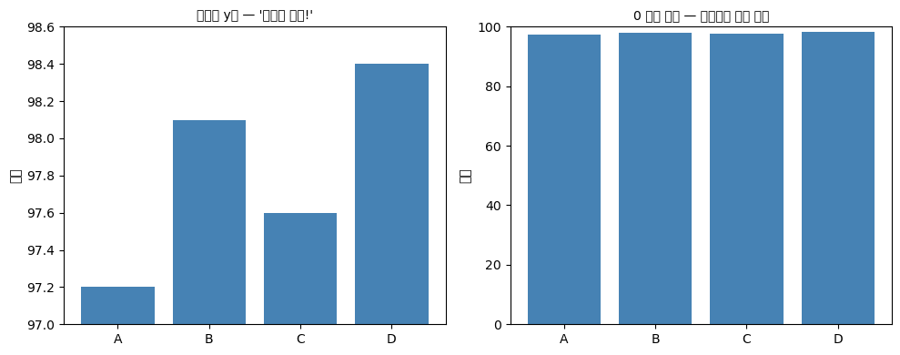
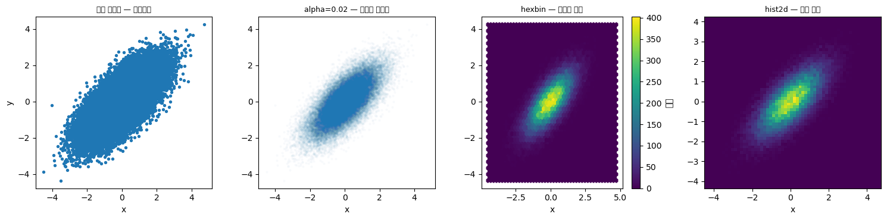

# Matplotlib으로 기본 시각화하기

Matplotlib은 파이썬에서 그림을 그리는 토대가 되는 라이브러리이며, 이 책 전체에서 쓰는 출판 품질의 그림을 만들어낸다. 객체지향 API가 축, 눈금, 격자선, 주석 등 그림의 모든 요소를 정밀하게 제어하게 해준다. 통계 교재의 모든 그림은 특정한 논지를 뒷받침하므로 자동으로 생성할 것이 아니라 목적에 맞게 다듬어야 하기 때문에 이것이 중요하다.

<div class="defn" markdown>

**정의 1.** [Figure와 Axes]

모든 Matplotlib 그림은 하나 이상의 **`Axes`** 객체(각각이 개별 패널이다)를 담고 있는 **`Figure`** 안에 존재한다. 이들을 만드는 권장 방식은 다음과 같다.

```python
import matplotlib.pyplot as plt

fig, ax = plt.subplots(figsize=(8, 4))
# ... draw on ax ...
plt.show()
```

격자 배치의 경우:

```python
fig, axes = plt.subplots(nrows=2, ncols=3, figsize=(12, 6))
ax = axes[0, 1]    # row 0, column 1
```

`Figure`는 캔버스, 제목, 전체 배치를 담고, 각 `Axes`는 이름표·눈금·아티스트를 갖는 자기만의 좌표계다.

</div>

## 설명

### 두 가지 API

Matplotlib에는 두 개의 인터페이스가 있다.

1. **Pyplot(상태 기반)** — `plt.plot(x, y)`, `plt.title(...)`. 뒤에서 관리되는 전역 "현재 축"에 작용한다. 일회성 그림에는 편리하지만 여러 패널이 있는 그림에서는 모호하다.
2. **객체지향** — `ax.plot(x, y)`, `ax.set_title(...)`. 어느 `Axes`를 수정하는지 명시적이다. 패널이 둘 이상인 그림에는 이쪽이 낫다.

이 책은 객체지향 형태만 쓴다. pyplot 형태는 `plt.subplots`, `plt.show`, `plt.savefig`에만 남겨 둔다.

### 통계를 위한 핵심 그림 유형

| 그림 | 메서드 | 쓰임새 |
|---|---|---|
| 히스토그램 | `ax.hist(x, bins=...)` | 한 변수의 분포. `density=True`로 이론적 확률밀도함수를 겹쳐 그린다 |
| 산점도 | `ax.scatter(x, y)` | 두 변수의 관계, 회귀 진단 |
| 선 | `ax.plot(x, y)` | 시계열, 누적분포함수, 매끄러운 함수 곡선 |
| 상자그림 | `ax.boxplot(x_list)` | 집단별 다섯 수치 요약과 이상치 |
| 막대 | `ax.bar(categories, heights)` | 범주 간 비교 |
| Q-Q 그림 | `scipy.stats.probplot(x, plot=ax)` | 정규성 진단 |

### 사용자화의 핵심

```python
ax.set_xlabel("x")
ax.set_ylabel("y")
ax.set_title("Title")
ax.set_xlim(0, 10)
ax.set_ylim(-1, 1)
ax.grid(True, alpha=0.3)
ax.legend(loc="best", frameon=False)
fig.tight_layout()
fig.savefig("figure.png", dpi=150, bbox_inches="tight")
```

`tight_layout`은 여러 패널이 있는 그림에서 축 이름표가 잘리거나 겹치는 것을 막는다. `dpi=150`이면 화면과 대부분의 인쇄 용도에 충분하고, `dpi=300`은 최종 출판용이 아니라면 과하다.

### pandas와의 연동

DataFrame은 Matplotlib을 감싼 자체 그림 메서드를 갖고 있다.

```python
import numpy as np
import pandas as pd
import matplotlib.pyplot as plt

rng = np.random.default_rng(0)
df = pd.DataFrame({"x": rng.normal(0, 1, 200),
                   "y": rng.normal(0, 1, 200),
                   "group": rng.choice(["A", "B"], 200)})
df["value"] = df["x"] * 2 + rng.normal(0, 1, 200)

fig, axes = plt.subplots(1, 3, figsize=(13, 3.5))
df["x"].plot.hist(bins=30, ax=axes[0], title="hist")
df.plot.scatter(x="x", y="y", ax=axes[1], title="scatter")
df.boxplot(column="value", by="group", ax=axes[2])
plt.suptitle("")            # boxplot이 붙이는 자동 제목을 지운다
plt.tight_layout()
plt.show()
```



빠르게 탐색할 때 편리하다. 최종 그림에서는 Matplotlib을 직접 호출하는 편이 더 세밀하게 제어할 수 있다.

<div class="codebox" markdown>

### 예제 1. Matplotlib으로 기본 시각화하기 { .eg }

```python
import numpy as np
import matplotlib.pyplot as plt
from scipy.stats import norm

rng = np.random.default_rng(42)
data = rng.normal(loc=50, scale=10, size=500)

fig, axes = plt.subplots(1, 2, figsize=(12, 4))

# Left: histogram with theoretical density overlay
axes[0].hist(data, bins=30, density=True, alpha=0.5,
             edgecolor="black", label="Sample")
x = np.linspace(data.min(), data.max(), 200)
axes[0].plot(x, norm.pdf(x, loc=50, scale=10), "r-",
             lw=2, label="N(50, 10) PDF")
axes[0].set_xlabel("value"); axes[0].set_ylabel("density")
axes[0].set_title("Histogram with density overlay")
axes[0].legend()

# Right: Q-Q plot
from scipy.stats import probplot
probplot(data, dist="norm", plot=axes[1])
axes[1].set_title("Q-Q plot vs. Normal")

fig.tight_layout()
plt.show()
```



히스토그램은 적합도를 눈으로 확인하게 해주고, Q-Q 그림은 직선에서 벗어나는 정도를 보여줌으로써 분석적으로 확인하게 해준다. 통계적인 그림은 이 둘 중 하나 없이는 완성되는 일이 드물다.

</div>

## 연습문제

<div class="drillbox" markdown>

**연습문제 1.** <span class="diff easy" title="쉬움"></span>
객체지향 API를 사용해 표준정규 표본 500개의 히스토그램을 구간 30개로 그리는 코드를 작성하라. 축 이름표, 제목, 그리고 표본평균 위치의 수직선을 포함하라.

</div>

??? success "풀이"
    ```python
    import numpy as np
    import matplotlib.pyplot as plt

    rng = np.random.default_rng(42)
    data = rng.standard_normal(500)

    fig, ax = plt.subplots(figsize=(8, 4))
    ax.hist(data, bins=30, edgecolor="black", alpha=0.7)
    ax.axvline(data.mean(), color="red", lw=2, label=f"mean = {data.mean():.3f}")
    ax.set_xlabel("z")
    ax.set_ylabel("frequency")
    ax.set_title("500 standard normal samples")
    ax.legend()
    plt.show()
    ```

    

    `axvline`은 고정된 $x$ 좌표에 수직 참조선을 그리며, 평균·중앙값·임계값을 표시할 때 유용하다.

<div class="drillbox" markdown>

**연습문제 2.** <span class="diff easy" title="쉬움"></span>
두 패널짜리 그림을 만들어라. 왼쪽에는 무작위 $(x, y)$ 쌍 100개의 산점도를, 오른쪽에는 $[0, 2\pi]$ 위의 곡선 $y = \sin(x)$을 그려라. 각 패널에 제목을 달고 "value"라는 하나의 $y$축 이름표를 공유하게 하라.

</div>

??? success "풀이"
    ```python
    import numpy as np
    import matplotlib.pyplot as plt

    rng = np.random.default_rng(0)
    x_s, y_s = rng.uniform(0, 10, 100), rng.uniform(-1, 1, 100)
    x_l = np.linspace(0, 2 * np.pi, 200)

    fig, (ax1, ax2) = plt.subplots(1, 2, figsize=(10, 4), sharey=True)
    ax1.scatter(x_s, y_s, alpha=0.6)
    ax1.set_title("Random scatter")
    ax1.set_xlabel("x")
    ax2.plot(x_l, np.sin(x_l), color="blue")
    ax2.set_title("sin(x)")
    ax2.set_xlabel("x")
    fig.supylabel("value")
    fig.tight_layout()
    plt.show()
    ```

    

    `sharey=True`는 두 y축을 묶고, `fig.supylabel`은 그림 전체에 걸치는 하나의 y축 이름표를 추가한다.

<div class="drillbox" markdown>

**연습문제 3.** <span class="diff med" title="중간"></span>
여러 패널이 있는 그림에서 `plt.plot()`보다 `ax.plot()`이 선호되는 이유는 무엇인가? pyplot 형태가 조용히 엉뚱한 subplot에 그리게 되는 구체적인 예를 하나 들어라.

</div>

??? success "풀이"
    `plt.plot()`은 전역 상태인 "현재" Axes를 대상으로 삼는다. 그림을 두 개 만드는 노트북 셀이나 여러 subplot을 갖는 그림 하나에서는, "현재" Axes가 가장 최근에 만들어지거나 활성화된 것 — 보통은 저자가 의도한 것이 아니라 **마지막** subplot — 이 된다.

    ```python
    fig, axes = plt.subplots(1, 2)
    axes[0].set_title("Panel A")        # explicit — correct
    plt.plot([1, 2, 3])                 # silently lands on axes[1] because it was created last
    ```

    객체지향 형태 `axes[0].plot([1, 2, 3])`는 대상을 명시하므로 이런 모호함을 완전히 없앤다.

<div class="drillbox" markdown>

**연습문제 4.** <span class="diff easy" title="쉬움"></span>
$N(5, 4)$(평균 5, 분산 4)에서 뽑은 표본 1000개의 정규화된 히스토그램을 그리고 참된 밀도를 겹쳐 그려라. 경험적 곡선과 이론적 곡선이 일치함을 눈으로 확인하라.

</div>

??? success "풀이"
    ```python
    import numpy as np
    import matplotlib.pyplot as plt
    from scipy.stats import norm

    rng = np.random.default_rng(42)
    data = rng.normal(loc=5, scale=2, size=1000)   # scale = sqrt(variance)

    fig, ax = plt.subplots(figsize=(8, 4))
    ax.hist(data, bins=30, density=True, alpha=0.5, edgecolor="black", label="Histogram")
    x = np.linspace(data.min(), data.max(), 200)
    ax.plot(x, norm.pdf(x, loc=5, scale=2), "r-", lw=2, label="N(5, 4) PDF")
    ax.set_xlabel("x"); ax.set_ylabel("density")
    ax.set_title("Histogram with true density overlay")
    ax.legend()
    plt.show()
    ```

    

    `density=True`는 막대 전체 넓이가 1이 되도록 히스토그램을 다시 크기 조정하여 확률밀도함수와 직접 비교할 수 있게 한다. 막대의 너비는 `bins`가 결정한다. 구간이 너무 적으면 구조를 감추고, 너무 많으면 없는 구조를 만들어낸다.

<div class="drillbox" markdown>

**연습문제 5.** <span class="diff med" title="중간"></span>
잔차 그림을 만들어라. $y = 1 + 2x + \varepsilon$에서 나온 잡음 섞인 점 50개에 최소제곱 직선을 적합한 뒤, 잔차를 적합값에 대해 그리고 0에 수평 참조선을 그어라. 선형성 가정이 위배되었음을 나타내는 패턴은 무엇인가?

</div>

??? success "풀이"
    ```python
    import numpy as np
    import matplotlib.pyplot as plt

    rng = np.random.default_rng(0)
    x = rng.uniform(-2, 2, 50)
    y = 1 + 2 * x + rng.standard_normal(50)

    X = np.column_stack([np.ones_like(x), x])
    beta = np.linalg.solve(X.T @ X, X.T @ y)
    y_hat = X @ beta
    resid = y - y_hat

    fig, ax = plt.subplots(figsize=(7, 4))
    ax.scatter(y_hat, resid, alpha=0.7)
    ax.axhline(0, color="red", lw=1)
    ax.set_xlabel("fitted value")
    ax.set_ylabel("residual")
    ax.set_title("Residuals vs. fitted")
    plt.show()
    ```

    

    제대로 지정된 선형모형은 뚜렷한 추세 없이 0 주위에 무작위로 흩어진 잔차를 만든다. 잔차 대 적합값 그림에서 **휘어진**(U자나 아치 모양) 패턴은 빠진 비선형 항을 알리는 신호이고, **깔때기** 모양은 분산이 일정하지 않음(이분산성)을 알리는 신호다. 제13장에서 이 진단들을 형식적으로 전개한다.

<div class="drillbox" markdown>

**연습문제 6.** <span class="diff easy" title="쉬움"></span>
연습문제 5의 그림을 여백 없이 200 DPI PNG로 디스크에 저장하라. `bbox_inches="tight"` 인수는 무엇을 하며 언제 중요한가?

</div>

??? success "풀이"
    ```python
    fig.savefig("residuals.png", dpi=200, bbox_inches="tight")
    ```

    `dpi=200`은 래스터화 해상도를 조절한다. `bbox_inches="tight"`는 가장자리의 빈 여백을 제외하도록 그림의 경계 상자를 다시 계산한다. 그림을 다른 문서(LaTeX, 워드, 슬라이드)에 끼워 넣을 때 가장 중요하다. 이 옵션이 없으면 savefig가 쓰이지 않은 공간까지 포함한 캔버스 전체를 저장하여, 삽입된 이미지에 보기 싫은 흰 테두리가 생긴다. `dpi=200, bbox_inches="tight"` 조합이 이 책에 실리는 그림의 권장 기본값이다.

<div class="drillbox" markdown>

**연습문제 7.** <span class="diff med" title="중간"></span>
`scipy.stats.probplot`을 쓰지 말고 Q–Q 그림을 직접 만들어라. 정규표본과 $t(3)$ 표본에 대해 각각 그리고, 두 그림이 어떻게 다른지 설명하라.

</div>

??? success "풀이"
    Q–Q 그림은 표본의 순서통계량을 이론분포의 대응 분위수에 대해 그린다. $i$번째로 작은 값의 짝이 되는 이론 분위수는 $\Phi^{-1}\!\left(\frac{i - 0.5}{n}\right)$이다($0$과 $1$을 피하려고 $0.5$를 뺀다).

    ```python
    import numpy as np
    import matplotlib.pyplot as plt
    from scipy import stats

    rng = np.random.default_rng(0)
    n = 300
    samples = {"정규 N(0,1)": rng.standard_normal(n),
               "t(3) — 두꺼운 꼬리": rng.standard_t(3, n)}

    probs = (np.arange(1, n + 1) - 0.5) / n        # 플로팅 위치
    theory = stats.norm.ppf(probs)                 # 이론 분위수

    fig, axes = plt.subplots(1, 2, figsize=(10, 4.5))
    for ax, (name, data) in zip(axes, samples.items()):
        ax.scatter(theory, np.sort(data), s=12, alpha=0.7)
        lo, hi = theory.min(), theory.max()
        ax.plot([lo, hi], [lo, hi], "r--", lw=1.5, label="기준선 y = x")
        ax.set_xlabel("이론 분위수")
        ax.set_ylabel("표본 분위수")
        ax.set_title(name)
        ax.legend()
    fig.tight_layout()
    plt.show()

    for name, data in samples.items():
        z = (data - data.mean()) / data.std(ddof=1)
        print(f"{name:>18}: 첨도 {stats.kurtosis(data):>6.2f}   "
              f"|z| > 3 인 관측 {np.sum(np.abs(z) > 3):>2}개")
    ```

    출력:

    ```
    정규 N(0,1): 첨도   0.03   |z| > 3 인 관측  2개
         t(3) — 두꺼운 꼬리: 첨도   3.42   |z| > 3 인 관측  5개
    ```

    

    **읽는 법.** 점들이 직선 위에 놓이면 표본이 이론분포와 맞는다. 왼쪽 정규표본은 가운데가 거의 완벽하고 양 끝만 조금 흔들리는데, 극단 순서통계량의 분산이 크기 때문에 정상이다.

    오른쪽 $t(3)$은 **$S$자를 뒤집은 모양**이다. 왼쪽 끝이 기준선 아래로 처지고 오른쪽 끝이 위로 치솟는다. 이것이 **두꺼운 꼬리**의 서명이다. 표본의 극단값이 정규분포가 예측하는 것보다 훨씬 크다.

    반대로 양 끝이 안쪽으로 휘면 꼬리가 얇은 것이고, 한쪽만 휘면 비대칭이다.

    **왜 히스토그램보다 나은가.** 히스토그램은 구간 개수에 민감하고 꼬리에서 관측이 몇 개뿐이라 거의 보이지 않는다. Q–Q 그림은 모든 관측을 하나씩 쓰고 꼬리를 그림의 양 끝에 펼쳐 놓는다. **정규성 판단은 대부분 꼬리에서 갈리므로** 이 차이가 결정적이다. $\square$

<div class="drillbox" markdown>

**연습문제 8.** <span class="diff med" title="중간"></span>
로그 눈금을 언제 써야 하는가? 멱법칙 자료를 선형 눈금, 반로그, 양로그 눈금으로 각각 그려 비교하라.

</div>

??? success "풀이"
    ```python
    import numpy as np
    import matplotlib.pyplot as plt

    x = np.linspace(1, 100, 500)
    power = 3 * x ** 2.0          # 멱법칙  y = a x^b
    expo = 2 * np.exp(0.05 * x)   # 지수     y = a e^{bx}

    fig, axes = plt.subplots(1, 3, figsize=(13, 4))
    for ax, scale, title in zip(
            axes, ["linear", "semilogy", "loglog"],
            ["선형 — 둘 다 그냥 휘었다", "반로그 — 지수가 직선", "양로그 — 멱법칙이 직선"]):
        ax.plot(x, power, label="멱법칙 $3x^2$")
        ax.plot(x, expo, label="지수 $2e^{0.05x}$")
        if scale in ("semilogy", "loglog"):
            ax.set_yscale("log")
        if scale == "loglog":
            ax.set_xscale("log")
        ax.set_title(title, fontsize=10)
        ax.set_xlabel("x")
        ax.legend(fontsize=8)
    fig.tight_layout()
    plt.show()

    # 직선이 된 눈금에서 기울기가 지수를 준다
    slope_ll = np.polyfit(np.log(x), np.log(power), 1)[0]
    slope_sl = np.polyfit(x, np.log(expo), 1)[0]
    print(f"양로그에서 멱법칙의 기울기: {slope_ll:.4f}   (참값 2)")
    print(f"반로그에서 지수의 기울기:   {slope_sl:.4f}   (참값 0.05)")
    ```

    출력:

    ```
    양로그에서 멱법칙의 기울기: 2.0000   (참값 2)
    반로그에서 지수의 기울기:   0.0500   (참값 0.05)
    ```

    

    **규칙.**

    | 형태 | 직선이 되는 눈금 | 기울기의 뜻 |
    |---|---|---|
    | $y = ae^{bx}$ | 반로그($y$만 로그) | $b$ |
    | $y = ax^{b}$ | 양로그(둘 다 로그) | $b$ |

    $\log y = \log a + b\log x$와 $\log y = \log a + bx$를 각각 보면 바로 나온다. 어느 눈금에서 직선이 되는지가 곧 **어떤 모형인지를 알려 주는 진단**이다.

    **통계에서 쓰는 곳.**

    - 오른쪽으로 심하게 치우친 자료(소득, 도시 인구, 파일 크기)는 로그 눈금에서 대칭에 가까워진다. 로그변환을 하는 근거가 여기 있다.
    - 생존분석에서 로그 눈금의 생존곡선이 직선이면 지수분포를 뜻한다.
    - $p$값이나 우도비처럼 자릿수가 여러 개에 걸치는 값은 로그 눈금이 사실상 필수다.

    **주의.** 로그 눈금은 $0$이나 음수를 표현할 수 없다. 자료에 $0$이 있으면 `symlog` 눈금을 쓰거나, $\log(x + 1)$처럼 옮겨서 변환하되 그 사실을 반드시 밝혀야 한다. 로그 눈금은 큰 값 쪽의 차이를 시각적으로 압축하므로, 눈금 표시를 분명히 하지 않으면 오해를 부른다. $\square$

<div class="drillbox" markdown>

**연습문제 9.** <span class="diff med" title="중간"></span>
축을 어떻게 잡느냐에 따라 같은 자료가 전혀 다른 이야기를 하게 만들 수 있다. 막대그래프의 $y$축을 잘라낸 그림과 $0$에서 시작한 그림을 나란히 그리고, 어느 쪽이 정직한지 논하라.

</div>

??? success "풀이"
    ```python
    import numpy as np
    import matplotlib.pyplot as plt

    groups = ["A", "B", "C", "D"]
    values = np.array([97.2, 98.1, 97.6, 98.4])

    fig, (ax1, ax2) = plt.subplots(1, 2, figsize=(10, 4))

    ax1.bar(groups, values, color="steelblue")
    ax1.set_ylim(97, 98.6)                     # 잘라낸 축
    ax1.set_title("잘라낸 y축 — '엄청난 차이!'", fontsize=10)
    ax1.set_ylabel("점수")

    ax2.bar(groups, values, color="steelblue")
    ax2.set_ylim(0, 100)                       # 0 에서 시작
    ax2.set_title("0 에서 시작 — 실제로는 거의 같다", fontsize=10)
    ax2.set_ylabel("점수")

    fig.tight_layout()
    plt.show()

    print(f"값의 범위: {values.min()} ~ {values.max()}  (차이 {values.ptp():.1f})")
    print(f"전체 대비 상대적 차이: {values.ptp() / values.mean() * 100:.2f}%")
    ```

    출력:

    ```
    값의 범위: 97.2 ~ 98.4  (차이 1.2)
    전체 대비 상대적 차이: 1.23%
    ```

    

    왼쪽 그림에서 D는 A의 두 배쯤 되어 보인다. 실제 차이는 $1.2$점, 상대적으로 $1.23\%$다.

    **왜 막대그래프는 $0$에서 시작해야 하는가.** 막대는 **길이**로 양을 나타낸다. 길이의 비가 곧 값의 비로 읽히므로, 축을 자르면 그 비가 거짓이 된다. 이것이 자료 시각화에서 가장 흔한 왜곡이다.

    **꺾은선그래프는 다르다.** 선은 길이가 아니라 **기울기와 변화**를 나타내므로 $0$을 포함할 의무가 없다. 체온의 하루 변화를 $0°C$부터 그리면 오히려 정보가 사라진다. 축을 자르는 것 자체가 죄가 아니라, **부호화 방식과 맞지 않게 자르는 것**이 죄다.

    | 그림 | $0$을 포함해야 하는가 | 이유 |
    |---|---|---|
    | 막대그래프 | 그렇다 | 길이가 값에 비례해야 한다 |
    | 꺾은선그래프 | 아니다 | 변화를 보는 것이 목적이다 |
    | 산점도 | 아니다 | 위치가 값을 나타낸다 |

    작은 차이를 정직하게 강조하고 싶다면, 축을 자르는 대신 **차이 자체를 그려라**(기준 대비 편차) 또는 신뢰구간을 함께 표시해 그 차이가 잡음보다 큰지 보여 주어라. $\square$

<div class="drillbox" markdown>

**연습문제 10.** <span class="diff med" title="중간"></span>
관측이 수만 개인 산점도는 점이 겹쳐 쌓여 밀도를 볼 수 없다. 이 **과대plotting** 문제를 세 가지 방법으로 해결하고, 색지도 선택이 왜 중요한지 설명하라.

</div>

??? success "풀이"
    ```python
    import numpy as np
    import matplotlib.pyplot as plt

    rng = np.random.default_rng(0)
    n = 50_000
    x = rng.normal(0, 1, n)
    y = 0.7 * x + rng.normal(0, 0.7, n)        # 상관 있는 두 변수

    fig, axes = plt.subplots(1, 4, figsize=(15, 3.8))

    axes[0].scatter(x, y, s=8)
    axes[0].set_title("그냥 산점도 — 뭉개진다", fontsize=9)

    axes[1].scatter(x, y, s=4, alpha=0.02)
    axes[1].set_title("alpha=0.02 — 밀도가 보인다", fontsize=9)

    hb = axes[2].hexbin(x, y, gridsize=45, cmap="viridis")
    axes[2].set_title("hexbin — 밀도를 센다", fontsize=9)
    fig.colorbar(hb, ax=axes[2], label="개수")

    axes[3].hist2d(x, y, bins=60, cmap="viridis")
    axes[3].set_title("hist2d — 사각 격자", fontsize=9)

    for ax in axes:
        ax.set_xlabel("x")
    axes[0].set_ylabel("y")
    fig.tight_layout()
    plt.show()

    print(f"관측 {n:,}개,  상관계수 {np.corrcoef(x, y)[0, 1]:.4f}")
    ```

    출력:

    ```
    관측 50,000개,  상관계수 0.7087
    ```

    

    **세 가지 처방.**

    - `alpha`를 아주 작게: 겹친 곳이 진해져 밀도가 명암으로 드러난다. 구현이 가장 쉽지만 값을 읽을 수는 없다.
    - `hexbin`: 평면을 육각형으로 나누어 개수를 센다. 육각형은 사각형보다 원에 가까워 격자 방향의 인공적 무늬가 덜 생긴다.
    - `hist2d`: 사각 격자. 개념이 단순하고 2차원 히스토그램과 그대로 대응된다.

    개수를 실제로 읽어야 하면 `hexbin`이나 `hist2d`에 색막대를 붙이는 쪽이 옳다. `alpha`는 인상만 준다.

    **색지도가 왜 중요한가.** 개수 같은 순차형 값에는 **지각적으로 균등한** 색지도를 써야 한다. `viridis`, `magma`, `cividis`가 여기 해당한다. 값이 같은 폭으로 변할 때 사람이 느끼는 색 변화도 같은 폭이라는 뜻이다.

    옛 기본값 `jet`(무지개)은 이 성질이 없다. 청록과 노랑 근처에서 급격히 변해 **없는 경계를 만들어 내고**, 초록 영역에서는 거의 변하지 않아 **있는 구조를 감춘다.** 흑백으로 인쇄하면 순서가 뒤죽박죽이 되고, 적록 색맹인 사람에게는 읽히지 않는다.

    기준값을 중심으로 양쪽으로 벌어지는 값(상관계수, 잔차, 온도 편차)에는 `RdBu`나 `coolwarm` 같은 **발산형** 색지도를 쓰고, 반드시 중심을 $0$에 맞춘다(`vmin=-m, vmax=m`). 그러지 않으면 색의 중립점이 엉뚱한 값에 놓여 그림이 거짓말을 한다. $\square$

---

## 정리하며

이 절은 그림을 **읽고 고칠 수 있는 객체**로 다루는 법을 익혔다.

- **두 가지 API.** `plt.*` 는 현재 그림에 암묵적으로 작용하고, `fig, ax = plt.subplots()` 는 그림과 축을 명시적으로 잡는다. **여러 개의 축을 다루는 순간 후자만이 통한다.** 이 책의 그림은 모두 후자를 쓴다.
- **그림 유형과 쓰임새.** 한 변수의 분포는 히스토그램, 두 변수의 관계는 산점도, 집단 비교는 상자그림, 정규성 진단은 Q-Q 그림이다. **무엇을 묻고 있는지가 그림을 고른다.**
- **`density=True`.** 히스토그램의 세로축을 밀도로 바꾸면 이론적 확률밀도함수를 같은 축에 겹쳐 그릴 수 있다. 4장에서 분포를 확인할 때 계속 쓰는 수법이다.
- **pandas 와의 연동.** `df.plot(ax=ax)` 로 두 세계를 잇되, 세밀한 조정은 축 객체에서 한다.

**그림은 장식이 아니라 진단이다.** 같은 요약통계를 갖는 전혀 다른 자료가 존재하므로(2장의 앤스컴 사중주), 수치를 보고했다면 그림도 함께 보아야 한다.

여기까지가 0장의 계산 도구다. 이어지는 **정사각행렬**과 **선형대수와 통계**에서는 앞서 세운 선형대수 표기를 본격적으로 써서, 최소제곱추정량의 표본분포를 사영과 이차형식의 언어로 유도한다.
