# Matplotlib으로 기본 시각화하기

Matplotlib은 파이썬에서 그림을 그리는 토대가 되는 라이브러리이며, 이 책 전체에서 쓰는 출판 품질의 그림을 만들어낸다. 객체지향 API가 축, 눈금, 격자선, 주석 등 그림의 모든 요소를 정밀하게 제어하게 해준다. 통계 교재의 모든 그림은 특정한 논지를 뒷받침하므로 자동으로 생성할 것이 아니라 목적에 맞게 다듬어야 하기 때문에 이것이 중요하다.

<div class="defn" markdown>

### 정의 1. Figure와 Axes { .dfn }

모든 Matplotlib 그림은 하나 이상의 **`Axes`** 객체(각각이 개별 패널이다)를 담고 있는 **`Figure`** 안에 존재한다. 이들을 만드는 권장 방식은 다음과 같다.

```python
import matplotlib.pyplot as plt

fig, ax = plt.subplots(figsize=(8, 4))
# ... draw on ax ...
plt.show()
```

격자 배치의 경우:

```python
fig, axes = plt.subplots(nrows=2, ncols=3, figsize=(12, 6))
ax = axes[0, 1]    # row 0, column 1
```

`Figure`는 캔버스, 제목, 전체 배치를 담고, 각 `Axes`는 이름표·눈금·아티스트를 갖는 자기만의 좌표계다.

</div>


## 두 가지 API

Matplotlib에는 두 개의 인터페이스가 있다.

1. **Pyplot(상태 기반)** — `plt.plot(x, y)`, `plt.title(...)`. 뒤에서 관리되는 전역 "현재 축"에 작용한다. 일회성 그림에는 편리하지만 여러 패널이 있는 그림에서는 모호하다.
2. **객체지향** — `ax.plot(x, y)`, `ax.set_title(...)`. 어느 `Axes`를 수정하는지 명시적이다. 패널이 둘 이상인 그림에는 이쪽이 낫다.

이 책은 객체지향 형태만 쓴다. pyplot 형태는 `plt.subplots`, `plt.show`, `plt.savefig`에만 남겨 둔다.

## 이 책의 그림 규약

이 책의 그림은 한글 이름표를 달고, 정해진 팔레트를 쓰고, 같은 방식으로 저장된다. 모든 그림 코드가 아래 머리글로 시작하므로 그대로 베껴 쓰면 된다. 뒤의 보기와 연습문제에서는 지면을 아끼려고 이 머리글을 되풀이하지 않지만, **직접 실행할 때는 반드시 앞에 붙여야 한다.** 붙이지 않으면 그림 속 한글이 모두 네모(□)로 나온다.

<div class="exbox" markdown>

**보기 1.** <span class="diff easy" title="쉬움"></span> 그림 머리글과 저장 규약. 머리글을 붙여 표준정규 밀도를 그리고 $\pm 1.96$에 점선을 얹는다.

**(1)** 그림을 그리기 전에, 곡선의 봉우리 높이와 점선이 곡선과 만나는 높이, 그리고 두 점선 사이의 면적을 손으로 구하시오.

**(2)** 머리글의 네 가지 설정 — `matplotlib.use("Agg")`, `font.family`, `axes.unicode_minus`, 저장 인수 셋 — 이 각각 없으면 무슨 일이 생기는지 말하시오.

</div>

??? success "풀이"

    **(1) 해석적으로.** 표준정규 밀도는

    $$
    \varphi(z) = \frac{1}{\sqrt{2\pi}}e^{-z^2/2}
    $$

    이다. 지수가 $z = 0$에서만 $0$이고 그 밖에서는 음수이므로 봉우리는 $z = 0$에 있고 그 높이는

    $$
    \varphi(0) = \frac{1}{\sqrt{2\pi}} = 0.398942
    $$

    다. **밀도의 최댓값이 $1$보다 작은 것이 이상하지 않다.** 밀도는 확률이 아니라 단위 길이당 확률이어서 $1$을 넘어도 되고 못 미쳐도 된다. 넓이만 $1$이면 된다.

    점선이 곡선과 만나는 높이는

    $$
    \varphi(1.96) = \frac{1}{\sqrt{2\pi}}e^{-1.9208} = 0.398942 \times 0.146490 = 0.058441
    $$

    이고, 두 점선 사이의 면적은

    $$
    P(-1.96 < Z < 1.96) = 2\Phi(1.96) - 1 = \operatorname{erf}\!\left(\frac{1.96}{\sqrt 2}\right) = 0.950004
    $$

    다. $1.96$이 정확히 $0.95$를 주는 값이 아니라 $0.95$를 주는 값($1.959964$)의 반올림이라는 것이 여기서 드러난다. 넷째 자리의 $0.950004$가 그 흔적이다.

    **(2) 네 설정이 각각 막는 것.**

    - **`matplotlib.use("Agg")`** 는 화면 없는 환경(CI, 원격 서버, 스크립트 실행)에서 창을 띄우려다 실패하는 것을 막는다. 반드시 `pyplot`을 임포트하기 **전에** 불러야 한다. 뒤에 부르면 이미 정해진 백엔드가 바뀌지 않는다.
    - **`font.family`** 를 지정하지 않으면 기본 글꼴(DejaVu Sans)에 한글 글리프가 없어 제목·축이름의 한글이 모두 네모(□)로 찍힌다. 오류도 나지 않고 그림만 조용히 망가진다.
    - **`axes.unicode_minus = False`** 가 없으면 음수 눈금의 빼기 기호가 유니코드 U+2212로 그려지는데, 한글 글꼴에 그 글리프가 없어 또 네모가 된다. 이 설정은 그것을 ASCII 하이픈으로 바꾼다. 위 그림의 $x$축 눈금 `-3`, `-2`, `-1`이 제대로 보이는 것이 그 덕이다.
    - **저장 인수 셋.** `dpi=170`은 해상도, `facecolor="white"`는 투명·어두운 배경 문제, `bbox_inches="tight"`는 가장자리 여백을 맡는다. 셋 다 저장 시점에만 효과가 있고, `fig.tight_layout()`과는 다른 일을 한다.

    ```python
    """이 책의 모든 그림 코드가 공유하는 머리글."""

    import math

    import matplotlib
    matplotlib.use("Agg")          # 창을 띄우지 않고 파일로만 그린다
    import numpy as np
    import matplotlib.pyplot as plt

    # 그림에 한글을 쓰므로 한글 글꼴을 지정한다. 맥이면 'Apple SD Gothic Neo',
    # 윈도우면 'Malgun Gothic', 리눅스면 'NanumGothic' 정도가 무난하다.
    # 글꼴을 바꾸면 마이너스 기호(U+2212)가 깨지므로 unicode_minus 도 함께 꺼 준다.
    plt.rcParams["font.family"] = "Apple SD Gothic Neo"
    plt.rcParams["axes.unicode_minus"] = False

    # 이 책이 쓰는 팔레트. 같은 뜻에는 언제나 같은 색을 쓴다.
    INK = "#37474F"                              # 글자, 축, 기준선
    BLUE, BLUE_L = "#1565C0", "#DCEBFB"          # 주된 계열과 그 채움색
    ORANGE, ORANGE_L = "#E65100", "#FFE0B2"      # 대조 계열
    GREEN, GREEN_L = "#33691E", "#C5E1A5"        # 셋째 계열
    PURPLE = "#6A1B9A"                           # 넷째 계열
    MUTED = "#90A4AE"                            # 참고선, 배경 요소
    RED = "#D32F2F"                              # 경고, 기각역

    x = np.linspace(-3.5, 3.5, 400)
    pdf = np.exp(-x ** 2 / 2) / np.sqrt(2 * np.pi)

    fig, ax = plt.subplots(figsize=(6, 3.2))
    ax.fill_between(x, 0, pdf, color=BLUE_L)
    ax.plot(x, pdf, color=BLUE, lw=2, label="표준정규 밀도")
    ax.axvline(-1.96, color=RED, lw=1.2, ls="--")
    ax.axvline(1.96, color=RED, lw=1.2, ls="--", label="$\\pm 1.96$")
    ax.set_xlabel("표준화 점수 $z$")     # 한글은 반드시 $...$ 밖에 둔다
    ax.set_ylabel("밀도")
    ax.spines[["top", "right"]].set_visible(False)
    ax.legend(frameon=False)
    fig.savefig("figure_conventions.png", dpi=170, facecolor="white",
                bbox_inches="tight")

    # 그림에서 읽을 수 있는 세 수를 따로 계산해 둔다.
    print(f"격자 최대 높이 = {pdf.max():.6f}  (격자점 x = {x[pdf.argmax()]:.6f})")
    print(f"이론 봉우리    = {1 / np.sqrt(2 * np.pi):.6f}")
    print(f"phi(1.96)      = {np.exp(-1.96 ** 2 / 2) / np.sqrt(2 * np.pi):.6f}")
    print(f"두 점선 사이 면적 = {math.erf(1.96 / math.sqrt(2)):.6f}")
    ```

    출력:

    ```
    격자 최대 높이 = 0.398927  (격자점 x = -0.008772)
    이론 봉우리    = 0.398942
    phi(1.96)      = 0.058441
    두 점선 사이 면적 = 0.950004
    ```

    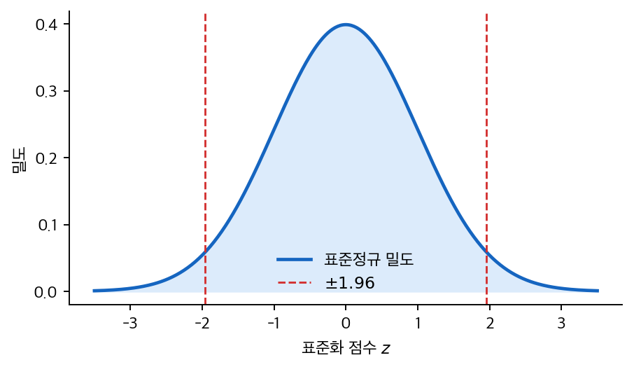

    그림을 읽으면 봉우리가 $0.4$ 조금 아래, 점선이 곡선과 만나는 자리가 $0.06$ 근처다. 유도한 $0.398942$와 $0.058441$에 맞는다.

    **한 자리가 어긋난다.** 코드가 준 격자 최대 높이는 $0.398927$로 이론값 $0.398942$보다 $1.5 \times 10^{-5}$ 작다. `np.linspace(-3.5, 3.5, 400)`은 간격이 $7/399 = 0.017544$인 격자인데 $3.5$가 그 간격의 정수배가 아니라 **$z = 0$이 격자에 아예 없다.** 가장 가까운 격자점이 $-0.008772$이고 거기서의 밀도가 $0.398927$이다. 격자가 고른 최댓값은 격자만큼만 정확하다. 점 개수를 $401$개로 바꾸면 $0$이 격자에 들어와 두 수가 일치한다.

    저장 인수 세 개가 모두 필요하다. `dpi=170`은 화면과 인쇄 모두에서 또렷한 해상도이고, `facecolor="white"`가 없으면 어두운 배경의 문서에서 축 이름표가 보이지 않으며, `bbox_inches="tight"`가 없으면 가장자리에 쓸데없는 흰 여백이 남는다.

!!! warning "mathtext 는 한글을 그리지 못한다"
    Matplotlib의 수식 엔진(mathtext)은 `$...$` 안의 글자를 수학 글꼴로 바꾸어 그리는데,
    그 글꼴에는 한글 글리프가 없다. 그래서 `ax.set_title(r"$평균 \mu$")`는 오류도 경고도
    없이 **네모 상자**를 찍는다. 한글은 언제나 `$...$` **밖에** 두어라.

    ```text
    나쁨:  ax.set_xlabel("$표본크기 n$")
    좋음:  ax.set_xlabel("표본크기 $n$")
    ```

    mathtext는 LaTeX의 부분집합일 뿐이라는 점도 함께 기억하라. 다음 둘은 `ValueError`를 던진다.

    - `$\sqrt n$` — 중괄호를 생략할 수 없다. `$\sqrt{n}$`으로 써야 한다.
    - `$\begin{pmatrix} \dots \end{pmatrix}$` — `\begin{...}` 환경을 아예 모른다.
      그림 안에 행렬을 넣어야 한다면 표 형태로 직접 그리거나 본문으로 빼라.

    마지막으로 `axes.unicode_minus = False`를 빠뜨리면, 음수 눈금의 유니코드 빼기 기호
    U+2212가 한글 글꼴에 없어 `Glyph 8722 missing from current font` 경고와 함께 네모로
    찍힌다. 이 설정은 빼기 기호를 평범한 ASCII 하이픈으로 바꾸어 그 문제를 없앤다.

## 통계를 위한 핵심 그림 유형

| 그림 | 메서드 | 쓰임새 |
|---|---|---|
| 히스토그램 | `ax.hist(x, bins=...)` | 한 변수의 분포. `density=True`로 이론적 확률밀도함수를 겹쳐 그린다 |
| 산점도 | `ax.scatter(x, y)` | 두 변수의 관계, 회귀 진단 |
| 선 | `ax.plot(x, y)` | 시계열, 누적분포함수, 매끄러운 함수 곡선 |
| 상자그림 | `ax.boxplot(x_list)` | 집단별 다섯 수치 요약과 이상치 |
| 막대 | `ax.bar(categories, heights)` | 범주 간 비교 |
| Q-Q 그림 | `scipy.stats.probplot(x, plot=ax)` | 정규성 진단 |

## 사용자화의 핵심

<div class="exbox" markdown>

**보기 2.** <span class="diff easy" title="쉬움"></span> Axes 사용자화와 저장. $x \in [0, 20]$에서 $\sin x$를 $400$점으로 그려 놓고 `ax.set_xlim(0, 10)`으로 보이는 범위를 절반으로 좁힌다.

**(1)** `set_xlim` 뒤에 그림 안에 남아 있는 점은 몇 개인가? 자료가 지워지는가 가려지는가?

**(2)** 같은 그림을 `bbox_inches="tight"` 없이, 있게, 그리고 `fig.tight_layout()`까지 부른 뒤로 세 번 저장해 화소 크기를 견주시오. 셋 가운데 가장 큰 것이 어느 것이겠는가?

</div>

??? success "풀이"

    **(1) 가려질 뿐 지워지지 않는다.** `set_xlim`은 `Line2D` 객체가 들고 있는 자료를 전혀 건드리지 않고, 축이 어느 구간을 보여 줄지만 바꾼다. 그러므로 `ax.lines[0].get_xdata()`는 여전히 $400$개이고 그중 $x \le 10$인 $200$개만 화면에 들어온다. **`set_xlim`은 자료를 거르는 수단이 아니다.** 실제로 바깥 자료를 빼고 통계를 내야 한다면 자료 쪽에서 걸러야 하며, 그러지 않으면 "그림에 보이는 것"과 "계산에 들어간 것"이 어긋난다.

    **(2)** 미리 답을 적자면 **가장 큰 것은 `bbox_inches="tight"`만 준 쪽**이다. `bbox_inches="tight"`는 흔히 "여백을 자른다"고 설명되지만 하는 일은 그게 아니라 **그려진 모든 요소를 꼭 감싸는 상자로 캔버스를 다시 잡는 것**이다. 요소가 캔버스 밖으로 비어져 나와 있으면 상자가 오히려 커진다. `tight_layout()`을 먼저 불러 요소들을 캔버스 안으로 들여놓은 다음에야 `bbox_inches`가 자르는 쪽으로 작동한다.

    ```python
    import matplotlib
    matplotlib.use("Agg")
    import matplotlib.image as mpimg
    import matplotlib.pyplot as plt
    import numpy as np

    plt.rcParams["font.family"] = "Apple SD Gothic Neo"
    plt.rcParams["axes.unicode_minus"] = False

    x = np.linspace(0, 20, 400)
    y = np.sin(x)

    fig, ax = plt.subplots(figsize=(6, 3.2))
    ax.plot(x, y, color="#1565C0", lw=2, label="$\\sin x$")

    # 그림을 손보는 일은 거의 전부 Axes 객체의 메서드로 이루어진다.
    ax.set_xlabel("가로축 $x$")
    ax.set_ylabel("세로축 $\\sin x$")
    ax.set_title("범위를 좁히면 바깥 자료는 가려질 뿐 지워지지 않는다", fontsize=11)
    ax.set_xlim(0, 10)              # 보이는 범위를 직접 정한다
    ax.set_ylim(-1, 1)
    ax.grid(True, alpha=0.3)        # 격자는 옅게. 자료보다 튀면 안 된다
    ax.legend(loc="lower left", frameon=False)

    # set_xlim 은 선을 자르지 않는다. 그린 점은 그대로 있고 보이지 않을 뿐이다.
    print(f"그린 점 {len(ax.lines[0].get_xdata())} 개,  그중 x <= 10 인 것 {np.sum(x <= 10)} 개")
    print(f"자료의 x 범위 = ({x.min():.0f}, {x.max():.0f}),  보이는 범위 = {ax.get_xlim()}")

    # 저장을 세 가지로 해 두고 화소 크기를 견준다.
    fig.savefig("plain.png", dpi=170, facecolor="white")
    fig.savefig("bbox.png", dpi=170, facecolor="white", bbox_inches="tight")
    fig.tight_layout()              # 축 이름표가 잘리지 않도록 여백을 맞춘다
    fig.savefig("both.png", dpi=170, facecolor="white", bbox_inches="tight")

    for name in ("plain.png", "bbox.png", "both.png"):
        h, w = mpimg.imread(name).shape[:2]
        print(f"{name:10s} {w} x {h} 화소")
    ```

    출력:

    ```
    그린 점 400 개,  그중 x <= 10 인 것 200 개
    자료의 x 범위 = (0, 20),  보이는 범위 = (0.0, 10.0)
    plain.png  1020 x 544 화소
    bbox.png   944 x 559 화소
    both.png   1000 x 525 화소
    ```

    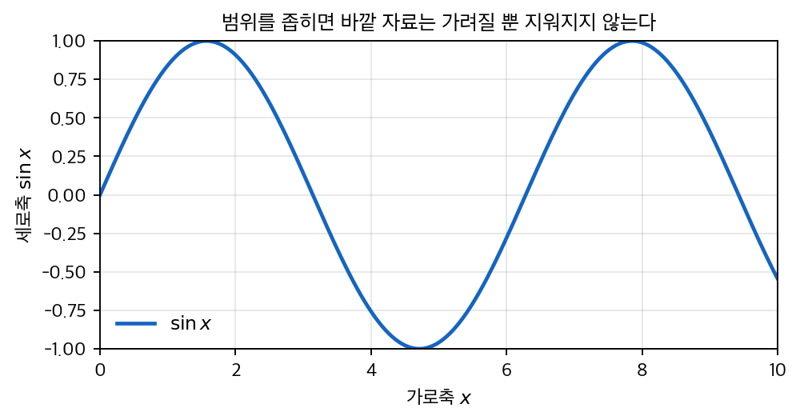

    **그림에서 읽히는 것.** 보이는 구간 $[0, 10]$은 $10/(2\pi) = 1.59$주기에 해당하고, 과연 봉우리가 $\pi/2 = 1.57$과 $5\pi/2 = 7.85$ 두 곳, 골이 $3\pi/2 = 4.71$ 한 곳에 있다. $x = 10$에서 곡선이 $\sin 10 = -0.544$로 잘리듯 끝나는데, **자료가 거기서 끝난 것이 아니라 축이 거기서 끝난 것이다.** 이 그림만 보고 "자료가 $10$까지다"라고 읽으면 틀린다.

    **화소 크기 셋.** `plain.png`가 $1020 \times 544$다. `figsize=(6, 3.2)`에 `dpi=170`을 곱한 $1020 \times 544$가 그대로 나왔으니 이쪽이 지정한 크기를 지킨다. `bbox.png`는 $944 \times 559$로 **가로는 $76$화소 줄었는데 세로는 $15$화소 늘었다.** 좌우에는 잘라낼 여백이 있었지만 위아래로는 제목과 축이름이 캔버스 경계를 넘어가 있었기 때문이다. 예상대로 셋 중 가장 넓은 면적이 여기다. `tight_layout()`을 부른 뒤의 `both.png`는 $1000 \times 525$로 가로세로가 모두 줄어든다.

    **그래서 둘은 서로를 대신하지 못한다.** `tight_layout()`은 캔버스 **안에서** 축의 자리를 조정해 이름표가 잘리지 않게 하고, `bbox_inches="tight"`는 저장할 때 캔버스 **경계**를 다시 잡는다. 이 책의 규약이 둘을 함께 쓰는 것은 그 때문이다. 해상도는 앞 절에서 정한 대로 `dpi=170`을 쓴다. 화면과 대부분의 인쇄 용도에 충분하며, `dpi=300`은 최종 출판용이 아니라면 과하다.

## pandas와의 연동

DataFrame은 Matplotlib을 감싼 자체 그림 메서드를 갖고 있다.

<div class="exbox" markdown>

**보기 3.** <span class="diff easy" title="쉬움"></span> pandas 그림 메서드로 세 패널 그리기. `x`와 `y`를 독립인 표준정규에서 $200$개씩 뽑고 `value`를 $2x + \varepsilon$로 만든 뒤, 히스토그램·산점도·집단별 상자그림을 한 줄씩으로 그린다.

**(1)** 세 패널에서 각각 무엇을 읽어야 하는지 수치와 함께 적으시오. 특히 상자그림의 두 집단이 달라야 할 까닭이 코드에 있는가?

**(2)** pandas의 그림 메서드가 자동으로 해 주는 것과, 이 책의 그림 규약에 비추어 손으로 고쳐야 하는 것을 가르시오.

</div>

??? success "풀이"

    ```python
    """DataFrame 이 자체로 갖고 있는 그림 메서드로 세 패널을 한 번에 그린다."""
    import numpy as np
    import pandas as pd
    import matplotlib.pyplot as plt

    plt.rcParams["font.family"] = "Apple SD Gothic Neo"   # 한글 글꼴
    plt.rcParams["axes.unicode_minus"] = False            # 음수 기호가 네모가 되지 않게

    rng = np.random.default_rng(0)
    df = pd.DataFrame({"x": rng.normal(0, 1, 200),
                       "y": rng.normal(0, 1, 200),
                       "group": rng.choice(["A", "B"], 200)})
    # value 는 x 에 2 를 곱하고 잡음을 더해 만든다. group 은 전혀 쓰지 않는다.
    df["value"] = df["x"] * 2 + rng.normal(0, 1, 200)

    print(df.groupby("group")["value"].agg(["count", "median"]).round(2))
    print(f"x 와 y 의 상관     = {df['x'].corr(df['y']):.3f}")
    print(f"x 와 value 의 상관 = {df['x'].corr(df['value']):.3f}")

    # ax= 로 그릴 자리를 지정하면 pandas 가 그 Axes 위에 그린다.
    # 이렇게 해야 여러 패널을 한 그림에 모을 수 있다.
    fig, axes = plt.subplots(1, 3, figsize=(13, 3.5))
    df["x"].plot.hist(bins=30, ax=axes[0], title="hist")
    df.plot.scatter(x="x", y="y", ax=axes[1], title="scatter")
    df.boxplot(column="value", by="group", ax=axes[2])
    plt.suptitle("")            # boxplot이 붙이는 자동 제목을 지운다
    plt.tight_layout()
    plt.show()
    ```

    출력:

    ```
           count  median
    group
    A         92    0.35
    B        108   -0.01
    x 와 y 의 상관     = -0.065
    x 와 value 의 상관 = 0.895
    ```

    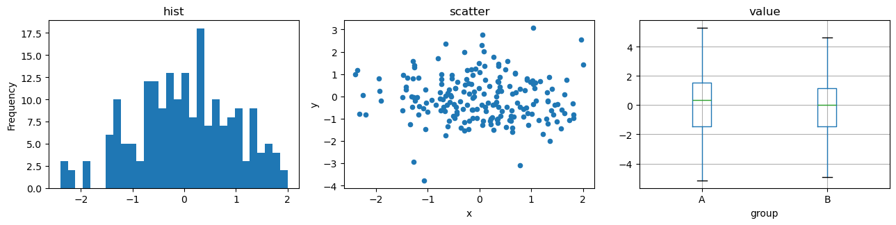

    **(1) 세 패널이 보이는 것.**

    **왼쪽 히스토그램.** `x`의 범위가 $-2.40$에서 $2.00$까지라 구간 $30$개의 폭이 $0.1467$이고, 구간당 평균은 $200/30 = 6.7$개다. 가장 높은 막대는 $0$ 바로 오른쪽 구간의 $18$개다. 그 구간에 들어갈 기대 개수는 $200 \times \big(\Phi(0.389) - \Phi(0.242)\big) = 11.1$개이고 표준편차가 $3.2$이므로 $18$은 $2.1$표준편차 위다. 구간이 $30$개나 되니 그중 하나가 이만큼 솟는 것은 놀랄 일이 아니다. **구간을 잘게 쪼갤수록 칸마다의 상대오차가 커져 울퉁불퉁해 보인다.** 세로축이 `Frequency`, 곧 도수이지 밀도가 아니다. 그래서 여기에 이론 밀도 곡선을 겹치려면 `density=True`를 주어 세로축을 밀도로 바꾸어야 한다.

    **가운데 산점도.** `x`와 `y`는 독립으로 뽑았으므로 참 상관이 $0$이고, 표본상관은 $-0.065$다($t = -0.92$, 자유도 $198$). 구름에 기울기가 보이지 않고 둥글게 퍼진 모양이 그것이다. 점이 $200$개인데 가운데가 겹쳐 보이는 것은 정규분포가 중심에 몰리기 때문이지 군집이 있어서가 아니다.

    **오른쪽 상자그림.** 집단 `A`가 $92$개로 중앙값 $0.35$, `B`가 $108$개로 중앙값 $-0.01$이다. 상자와 수염의 길이도 거의 같다. **두 집단이 달라야 할 까닭은 코드에 없다.** `value`는 `x`에 $2$를 곱하고 잡음을 더해 만들었고 `group`을 전혀 참조하지 않았으므로 **참 차이는 $0$** 이다. 웰치 $t$ 검정을 해 보면 $t = 0.81$, $p = 0.42$로 역시 차이가 없다. 상자그림이 두 집단을 나란히 놓으면 눈이 저절로 차이를 찾게 되지만, 여기서 찾을 것은 없고 그것이 옳은 결론이다.

    세 패널이 보이지 않는 것도 있다. **`x`와 `value`의 상관 $0.895$가 어느 패널에도 없다.** 이론값은 $\operatorname{Corr}(x,\, 2x + \varepsilon) = 2/\sqrt{5} = 0.894$이고 표본값이 $0.895$로 그것을 재현하는데, 산점도가 그린 것은 `x` 대 `y`이지 `x` 대 `value`가 아니다. **자료에서 가장 강한 관계가 그림 세 장 어디에도 안 나올 수 있다.**

    **(2) 자동으로 해 주는 것.** 열 이름을 축 이름으로 달아 주고(`x`, `y`, `group`), 결측을 알아서 빼고, `by=`를 주면 집단별로 쪼개어 나란히 놓아 준다. `ax=`로 자리를 주면 여러 패널을 한 그림에 모을 수도 있다. 탐색 단계에서는 이만하면 충분하다.

    **손으로 고쳐야 하는 것.** 이 책의 규약에 비추면 거의 전부다. 제목이 `hist`, `scatter`, `value`로 제각각이고 셋 다 영어이며, 무엇을 보라는 제목이 아니라 메서드 이름이다. 세로축 이름 `Frequency`도 영어로 고정이라 한글로 바꾸려면 `set_ylabel`을 따로 불러야 한다. `df.boxplot`은 옛 스타일이라 셋째 패널에만 격자가 켜져 있어 세 패널의 모양이 어긋나고, 묻지도 않은 `suptitle`을 붙이기 때문에 `plt.suptitle("")`로 지워야 한다. 색도 Matplotlib 기본값이지 이 책의 팔레트가 아니다.

    빠르게 탐색할 때 편리하다. 최종 그림에서는 Matplotlib을 직접 호출하는 편이 더 세밀하게 제어할 수 있다.

<div class="exbox" markdown>

**보기 4.** <span class="diff easy" title="쉬움"></span> 히스토그램과 Q-Q 그림으로 정규성 보기. $N(50, 10^2)$에서 $500$개를 뽑아 왼쪽에는 밀도 히스토그램에 이론 밀도를 겹치고, 오른쪽에는 정규 Q-Q 그림을 그린다.

**(1)** 왼쪽 빨간 곡선의 봉우리 높이는 얼마인가? 오른쪽 Q-Q 직선의 기울기와 절편은 각각 무엇이 되어야 하는가? 그리기 전에 적으시오.

**(2)** 돌려서 확인하고, 가장 높은 막대가 이론 곡선을 $23\%$나 넘어서는 것이 자료가 정규분포가 아니라는 뜻인지 판정하시오.

</div>

??? success "풀이"

    **(1) 해석적으로.**

    **봉우리 높이.** $N(\mu, \sigma^2)$의 밀도는 $z = \mu$에서 가장 크고 그 값은

    $$
    f(\mu) = \frac{1}{\sigma\sqrt{2\pi}} = \frac{1}{10\sqrt{2\pi}} = 0.039894
    $$

    다. 보기 1 의 표준정규 봉우리 $0.398942$를 $\sigma = 10$으로 나눈 값이다. **밀도의 높이는 눈금의 단위에 따라 바뀐다**는 것이 여기서 보인다. 넓이는 언제나 $1$이므로 가로로 $10$배 늘어나면 세로로 $10$분의 $1$이 된다.

    **Q-Q 직선.** 정규 Q-Q 그림은 가로축에 이론 분위수 $z_{(i)}$를, 세로축에 정렬한 관측값 $x_{(i)}$를 놓는다. 자료가 $N(\mu, \sigma^2)$이면 $x_{(i)} \approx \mu + \sigma z_{(i)}$이므로 점들이 **기울기 $\sigma = 10$, 절편 $\mu = 50$** 인 직선 위에 놓인다. `probplot`이 그려 주는 직선은 이 관계를 최소제곱으로 적합한 것이어서 기울기가 $\sigma$의 추정값, 절편이 $\mu$의 추정값이 된다. 이론 분위수가 $0$을 중심으로 대칭이라 $\sum z_{(i)} = 0$이고, 그러면 최소제곱 절편이 정확히 표본평균 $\bar x$와 같아진다.

    **(2) 수치적으로.**

    ```python
    import matplotlib
    matplotlib.use("Agg")
    import numpy as np
    import matplotlib.pyplot as plt
    from scipy.stats import norm, probplot

    plt.rcParams["font.family"] = "Apple SD Gothic Neo"
    plt.rcParams["axes.unicode_minus"] = False

    rng = np.random.default_rng(42)
    data = rng.normal(loc=50, scale=10, size=500)

    fig, axes = plt.subplots(1, 2, figsize=(12, 4))

    # 왼쪽: 히스토그램에 이론 밀도함수를 겹친다. density=True 여야 세로축이 밀도가 된다.
    counts, edges, _ = axes[0].hist(data, bins=30, density=True, alpha=0.5,
                                    edgecolor="black", color="#1565C0", label="표본")
    x = np.linspace(data.min(), data.max(), 200)
    axes[0].plot(x, norm.pdf(x, loc=50, scale=10), color="#D32F2F",
                 lw=2, label="$N(50, 10^2)$ 밀도")
    axes[0].set_xlabel("값")
    axes[0].set_ylabel("밀도")
    axes[0].set_title("히스토그램에 이론 밀도 겹치기", fontsize=11)
    axes[0].legend(frameon=False)

    # 오른쪽: Q-Q 그림. probplot 은 최소제곱 직선의 기울기·절편·상관을 돌려준다.
    (osm, osr), (slope, intercept, r) = probplot(data, dist="norm", plot=axes[1])
    axes[1].set_title("정규 Q-Q 그림", fontsize=11)
    axes[1].set_xlabel("이론 분위수")
    axes[1].set_ylabel("정렬된 관측값")

    print(f"이론 봉우리 1/(10*sqrt(2pi)) = {norm.pdf(50, 50, 10):.6f}")
    print(f"가장 높은 막대              = {counts.max():.6f}  (막대 폭 {edges[1] - edges[0]:.3f})")
    print(f"표본평균 = {data.mean():.4f},  표본표준편차 = {data.std(ddof=1):.4f}")
    print(f"Q-Q 직선: 기울기 = {slope:.4f},  절편 = {intercept:.4f},  r = {r:.4f}")

    fig.tight_layout()
    plt.show()
    ```

    출력:

    ```
    이론 봉우리 1/(10*sqrt(2pi)) = 0.039894
    가장 높은 막대              = 0.049265  (막대 폭 1.827)
    표본평균 = 49.8687,  표본표준편차 = 9.5993
    Q-Q 직선: 기울기 = 9.6288,  절편 = 49.8687,  r = 0.9990
    ```

    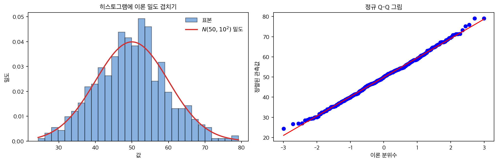

    **유도가 맞는다.** 이론 봉우리가 $0.039894$이고 그림의 빨간 곡선도 $0.04$ 바로 아래에서 꺾인다. Q-Q 직선의 절편 $49.8687$은 표본평균과 소수 넷째 자리까지 같다 — 위에서 유도한 대로다. 기울기 $9.6288$은 표본표준편차 $9.5993$과 $0.03$쯤 다른데, 최소제곱 기울기와 표본표준편차는 **같은 양의 서로 다른 추정량**이라 완전히 일치하지는 않는다. 둘 다 참값 $\sigma = 10$을 조금 밑돈다. $s$의 표준오차가 대략 $\sigma/\sqrt{2(n-1)} = 0.317$이므로 $9.5993$은 참값에서 $1.3$표준오차 아래이고, 이상한 일이 아니다.

    **(2) 의 답은 "아니다"이다.** 가장 높은 막대의 높이는 $0.049265$로 이론 곡선의 봉우리 $0.039894$보다 $23\%$ 크다. 그러나 그 막대는 봉우리에 있지 않고 구간 $[51.74,\, 53.56]$에 있으며, **밀도가 아니라 개수로 따져야 한다.** 그 구간에 들어갈 기대 개수는

    $$
    500 \times \big(\Phi(0.356) - \Phi(0.174)\big) = 35.1
    $$

    이고 표준편차가 $\sqrt{35.1 \times (1 - 0.0703)} = 5.7$이다. 실제로 들어간 것은 $45$개이니 $1.7$표준편차 위다. 막대가 $30$개나 되므로 그중 하나가 이만큼 솟는 것은 흔한 일이다. **히스토그램 막대 하나가 곡선을 넘는 것은 증거가 못 된다.**

    오른쪽 Q-Q 그림이 이 판정을 훨씬 분명하게 해 준다. 점들이 직선 위에 거의 그대로 놓이고 적합 상관이 $r = 0.9990$이다. 양 끝 몇 점이 직선에서 벗어나 보이는데, 가장 바깥 점은 $500$개 중 가장 큰 값 하나이므로 원래 가장 많이 흔들리는 자리다. **Q-Q 그림의 꼬리는 언제나 들쭉날쭉하며, 거기서 벗어난다고 정규성을 버려서는 안 된다.**

    두 그림이 서로를 메운다. 히스토그램은 구간 나누기에 따라 모양이 크게 바뀌어 적합도 판정에 약하지만 봉우리가 몇 개인지를 보인다. Q-Q 그림은 구간 나누기가 없어 적합도에 훨씬 민감하지만 **이봉 분포를 잘 못 보인다.** 통계적인 그림은 이 둘 중 하나 없이는 완성되는 일이 드물다.

## 연습문제

<div class="drillbox" markdown>

**연습문제 1.** <span class="diff easy" title="쉬움"></span>
객체지향 API를 사용해 표준정규 표본 500개의 히스토그램을 구간 30개로 그리는 코드를 작성하라. 축 이름표, 제목, 그리고 표본평균 위치의 수직선을 포함하라.

</div>

??? success "풀이"
    ```python
    import numpy as np
    import matplotlib.pyplot as plt

    rng = np.random.default_rng(42)
    data = rng.standard_normal(500)

    fig, ax = plt.subplots(figsize=(8, 4))
    ax.hist(data, bins=30, edgecolor="black", alpha=0.7)
    ax.axvline(data.mean(), color="red", lw=2, label=f"mean = {data.mean():.3f}")
    ax.set_xlabel("z")
    ax.set_ylabel("frequency")
    ax.set_title("500 standard normal samples")
    ax.legend()
    plt.show()
    ```

    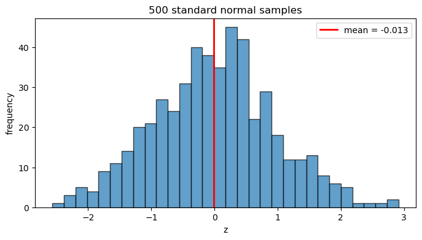

    `axvline`은 고정된 $x$ 좌표에 수직 참조선을 그리며, 평균·중앙값·임계값을 표시할 때 유용하다.

<div class="drillbox" markdown>

**연습문제 2.** <span class="diff easy" title="쉬움"></span>
두 패널짜리 그림을 만들어라. 왼쪽에는 무작위 $(x, y)$ 쌍 100개의 산점도를, 오른쪽에는 $[0, 2\pi]$ 위의 곡선 $y = \sin(x)$을 그려라. 각 패널에 제목을 달고 "value"라는 하나의 $y$축 이름표를 공유하게 하라.

</div>

??? success "풀이"
    ```python
    import numpy as np
    import matplotlib.pyplot as plt

    rng = np.random.default_rng(0)
    x_s, y_s = rng.uniform(0, 10, 100), rng.uniform(-1, 1, 100)
    x_l = np.linspace(0, 2 * np.pi, 200)

    fig, (ax1, ax2) = plt.subplots(1, 2, figsize=(10, 4), sharey=True)
    ax1.scatter(x_s, y_s, alpha=0.6)
    ax1.set_title("Random scatter")
    ax1.set_xlabel("x")
    ax2.plot(x_l, np.sin(x_l), color="blue")
    ax2.set_title("sin(x)")
    ax2.set_xlabel("x")
    fig.supylabel("value")
    fig.tight_layout()
    plt.show()
    ```

    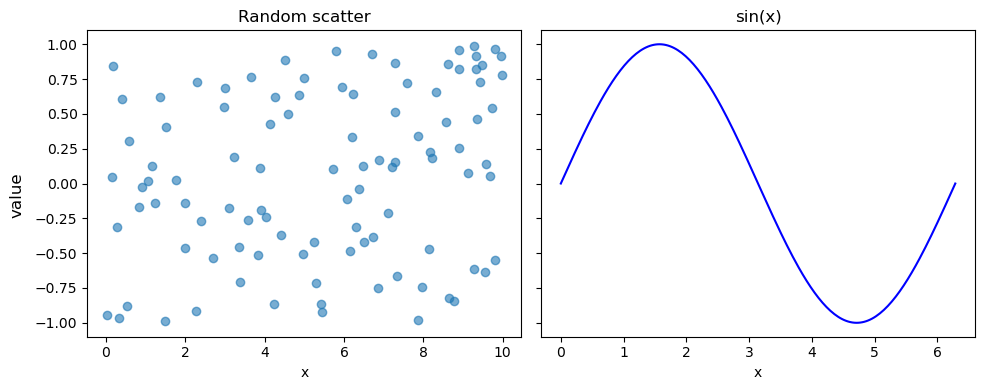

    `sharey=True`는 두 y축을 묶고, `fig.supylabel`은 그림 전체에 걸치는 하나의 y축 이름표를 추가한다.

<div class="drillbox" markdown>

**연습문제 3.** <span class="diff med" title="중간"></span>
여러 패널이 있는 그림에서 `plt.plot()`보다 `ax.plot()`이 선호되는 이유는 무엇인가? pyplot 형태가 조용히 엉뚱한 subplot에 그리게 되는 구체적인 예를 하나 들어라.

</div>

??? success "풀이"
    `plt.plot()`은 전역 상태인 "현재" Axes를 대상으로 삼는다. 그림을 두 개 만드는 노트북 셀이나 여러 subplot을 갖는 그림 하나에서는, "현재" Axes가 가장 최근에 만들어지거나 활성화된 것 — 보통은 저자가 의도한 것이 아니라 **마지막** subplot — 이 된다.

    ```python
    fig, axes = plt.subplots(1, 2)
    axes[0].set_title("Panel A")        # explicit — correct
    plt.plot([1, 2, 3])                 # silently lands on axes[1] because it was created last
    ```

    객체지향 형태 `axes[0].plot([1, 2, 3])`는 대상을 명시하므로 이런 모호함을 완전히 없앤다.

<div class="drillbox" markdown>

**연습문제 4.** <span class="diff easy" title="쉬움"></span>
$N(5, 4)$(평균 5, 분산 4)에서 뽑은 표본 1000개의 정규화된 히스토그램을 그리고 참된 밀도를 겹쳐 그려라. 경험적 곡선과 이론적 곡선이 일치함을 눈으로 확인하라.

</div>

??? success "풀이"
    ```python
    import numpy as np
    import matplotlib.pyplot as plt
    from scipy.stats import norm

    rng = np.random.default_rng(42)
    data = rng.normal(loc=5, scale=2, size=1000)   # scale = sqrt(variance)

    fig, ax = plt.subplots(figsize=(8, 4))
    ax.hist(data, bins=30, density=True, alpha=0.5, edgecolor="black", label="Histogram")
    x = np.linspace(data.min(), data.max(), 200)
    ax.plot(x, norm.pdf(x, loc=5, scale=2), "r-", lw=2, label="N(5, 4) PDF")
    ax.set_xlabel("x"); ax.set_ylabel("density")
    ax.set_title("Histogram with true density overlay")
    ax.legend()
    plt.show()
    ```

    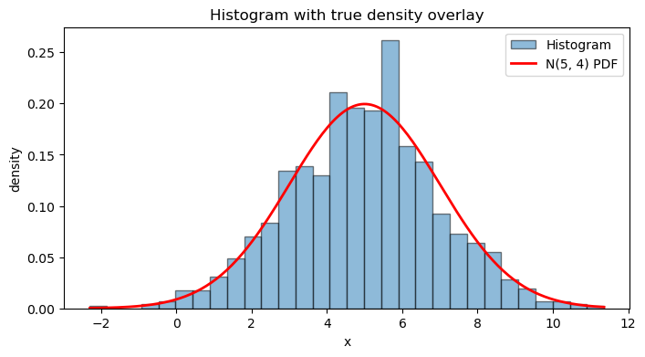

    `density=True`는 막대 전체 넓이가 1이 되도록 히스토그램을 다시 크기 조정하여 확률밀도함수와 직접 비교할 수 있게 한다. 막대의 너비는 `bins`가 결정한다. 구간이 너무 적으면 구조를 감추고, 너무 많으면 없는 구조를 만들어낸다.

<div class="drillbox" markdown>

**연습문제 5.** <span class="diff med" title="중간"></span>
잔차 그림을 만들어라. $y = 1 + 2x + \varepsilon$에서 나온 잡음 섞인 점 50개에 최소제곱 직선을 적합한 뒤, 잔차를 적합값에 대해 그리고 0에 수평 참조선을 그어라. 선형성 가정이 위배되었음을 나타내는 패턴은 무엇인가?

</div>

??? success "풀이"
    ```python
    import numpy as np
    import matplotlib.pyplot as plt

    rng = np.random.default_rng(0)
    x = rng.uniform(-2, 2, 50)
    y = 1 + 2 * x + rng.standard_normal(50)

    X = np.column_stack([np.ones_like(x), x])
    beta = np.linalg.solve(X.T @ X, X.T @ y)
    y_hat = X @ beta
    resid = y - y_hat

    fig, ax = plt.subplots(figsize=(7, 4))
    ax.scatter(y_hat, resid, alpha=0.7)
    ax.axhline(0, color="red", lw=1)
    ax.set_xlabel("fitted value")
    ax.set_ylabel("residual")
    ax.set_title("Residuals vs. fitted")
    plt.show()
    ```

    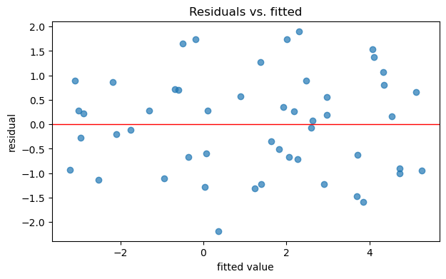

    제대로 지정된 선형모형은 뚜렷한 추세 없이 0 주위에 무작위로 흩어진 잔차를 만든다. 잔차 대 적합값 그림에서 **휘어진**(U자나 아치 모양) 패턴은 빠진 비선형 항을 알리는 신호이고, **깔때기** 모양은 분산이 일정하지 않음(이분산성)을 알리는 신호다. 제13장에서 이 진단들을 형식적으로 전개한다.

<div class="drillbox" markdown>

**연습문제 6.** <span class="diff easy" title="쉬움"></span>
연습문제 5의 그림을 이 책의 저장 규약대로 디스크에 저장하라. `dpi`, `facecolor`, `bbox_inches` 세 인수는 각각 무엇을 하며 언제 중요한가?

</div>

??? success "풀이"
    ```python
    fig.savefig("residuals.png", dpi=170, facecolor="white", bbox_inches="tight")
    ```

    `dpi=170`은 래스터화 해상도를 조절한다. 값이 작으면 글자가 뭉개지고 크면 파일만 무거워지는데, $170$이 화면과 인쇄 사이의 타협점이라 이 책의 기본값이다.

    `facecolor="white"`는 그림 바깥 여백의 배경색을 흰색으로 못 박는다. 이것이 없으면 저장본의 배경이 `figure.facecolor` 기본값을 따르는데, 어두운 배경의 문서나 투명 배경으로 저장한 경우 검은 축 이름표가 보이지 않게 된다.

    `bbox_inches="tight"`는 가장자리의 빈 여백을 제외하도록 그림의 경계 상자를 다시 계산한다. 그림을 다른 문서(LaTeX, 워드, 슬라이드)에 끼워 넣을 때 가장 중요하다. 이 옵션이 없으면 savefig가 쓰이지 않은 공간까지 포함한 캔버스 전체를 저장하여, 삽입된 이미지에 보기 싫은 흰 테두리가 생긴다.

    `dpi=170, facecolor="white", bbox_inches="tight"` 세 인수를 묶은 것이 이 책에 실리는 모든 그림의 저장 규약이다.

<div class="drillbox" markdown>

**연습문제 7.** <span class="diff med" title="중간"></span>
`scipy.stats.probplot`을 쓰지 말고 Q–Q 그림을 직접 만들어라. 정규표본과 $t(3)$ 표본에 대해 각각 그리고, 두 그림이 어떻게 다른지 설명하라.

</div>

??? success "풀이"
    Q–Q 그림은 표본의 순서통계량을 이론분포의 대응 분위수에 대해 그린다. $i$번째로 작은 값의 짝이 되는 이론 분위수는 $\Phi^{-1}\!\left(\frac{i - 0.5}{n}\right)$이다($0$과 $1$을 피하려고 $0.5$를 뺀다).

    ```python
    import numpy as np
    import matplotlib.pyplot as plt
    from scipy import stats

    plt.rcParams["font.family"] = "Apple SD Gothic Neo"   # 한글 글꼴
    plt.rcParams["axes.unicode_minus"] = False            # 음수 기호가 네모가 되지 않게

    rng = np.random.default_rng(0)
    n = 300
    samples = {"정규 N(0,1)": rng.standard_normal(n),
               "t(3) — 두꺼운 꼬리": rng.standard_t(3, n)}

    probs = (np.arange(1, n + 1) - 0.5) / n        # 플로팅 위치
    theory = stats.norm.ppf(probs)                 # 이론 분위수

    fig, axes = plt.subplots(1, 2, figsize=(10, 4.5))
    for ax, (name, data) in zip(axes, samples.items()):
        ax.scatter(theory, np.sort(data), s=12, alpha=0.7)
        lo, hi = theory.min(), theory.max()
        ax.plot([lo, hi], [lo, hi], "r--", lw=1.5, label="기준선 y = x")
        ax.set_xlabel("이론 분위수")
        ax.set_ylabel("표본 분위수")
        ax.set_title(name)
        ax.legend()
    fig.tight_layout()
    plt.show()

    for name, data in samples.items():
        z = (data - data.mean()) / data.std(ddof=1)
        print(f"{name:>18}: 첨도 {stats.kurtosis(data):>6.2f}   "
              f"|z| > 3 인 관측 {np.sum(np.abs(z) > 3):>2}개")
    ```

    출력:

    ```
             정규 N(0,1): 첨도   0.03   |z| > 3 인 관측  2개
         t(3) — 두꺼운 꼬리: 첨도   3.42   |z| > 3 인 관측  5개
    ```

    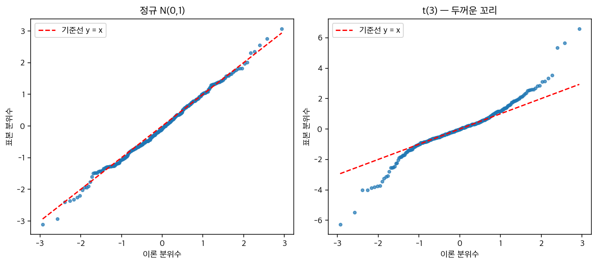

    **읽는 법.** 점들이 직선 위에 놓이면 표본이 이론분포와 맞는다. 왼쪽 정규표본은 가운데가 거의 완벽하고 양 끝만 조금 흔들리는데, 극단 순서통계량의 분산이 크기 때문에 정상이다.

    오른쪽 $t(3)$은 **$S$자를 뒤집은 모양**이다. 왼쪽 끝이 기준선 아래로 처지고 오른쪽 끝이 위로 치솟는다. 이것이 **두꺼운 꼬리**의 서명이다. 표본의 극단값이 정규분포가 예측하는 것보다 훨씬 크다.

    반대로 양 끝이 안쪽으로 휘면 꼬리가 얇은 것이고, 한쪽만 휘면 비대칭이다.

    **왜 히스토그램보다 나은가.** 히스토그램은 구간 개수에 민감하고 꼬리에서 관측이 몇 개뿐이라 거의 보이지 않는다. Q–Q 그림은 모든 관측을 하나씩 쓰고 꼬리를 그림의 양 끝에 펼쳐 놓는다. **정규성 판단은 대부분 꼬리에서 갈리므로** 이 차이가 결정적이다. $\square$

<div class="drillbox" markdown>

**연습문제 8.** <span class="diff med" title="중간"></span>
로그 눈금을 언제 써야 하는가? 멱법칙 자료를 선형 눈금, 반로그, 양로그 눈금으로 각각 그려 비교하라.

</div>

??? success "풀이"
    ```python
    import numpy as np
    import matplotlib.pyplot as plt

    plt.rcParams["font.family"] = "Apple SD Gothic Neo"   # 한글 글꼴
    plt.rcParams["axes.unicode_minus"] = False            # 음수 기호가 네모가 되지 않게

    x = np.linspace(1, 100, 500)
    power = 3 * x ** 2.0          # 멱법칙  y = a x^b
    expo = 2 * np.exp(0.05 * x)   # 지수     y = a e^{bx}

    fig, axes = plt.subplots(1, 3, figsize=(13, 4))
    for ax, scale, title in zip(
            axes, ["linear", "semilogy", "loglog"],
            ["선형 — 둘 다 그냥 휘었다", "반로그 — 지수가 직선", "양로그 — 멱법칙이 직선"]):
        ax.plot(x, power, label="멱법칙 $3x^2$")
        ax.plot(x, expo, label="지수 $2e^{0.05x}$")
        if scale in ("semilogy", "loglog"):
            ax.set_yscale("log")
        if scale == "loglog":
            ax.set_xscale("log")
        ax.set_title(title, fontsize=10)
        ax.set_xlabel("x")
        ax.legend(fontsize=8)
    fig.tight_layout()
    plt.show()

    # 직선이 된 눈금에서 기울기가 지수를 준다
    slope_ll = np.polyfit(np.log(x), np.log(power), 1)[0]
    slope_sl = np.polyfit(x, np.log(expo), 1)[0]
    print(f"양로그에서 멱법칙의 기울기: {slope_ll:.4f}   (참값 2)")
    print(f"반로그에서 지수의 기울기:   {slope_sl:.4f}   (참값 0.05)")
    ```

    출력:

    ```
    양로그에서 멱법칙의 기울기: 2.0000   (참값 2)
    반로그에서 지수의 기울기:   0.0500   (참값 0.05)
    ```

    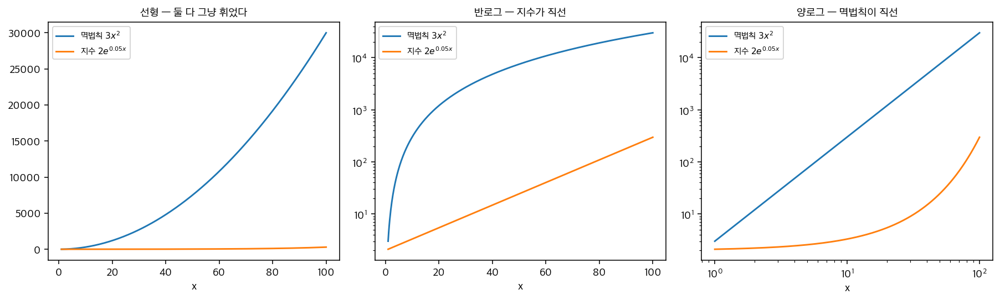

    **규칙.**

    | 형태 | 직선이 되는 눈금 | 기울기의 뜻 |
    |---|---|---|
    | $y = ae^{bx}$ | 반로그($y$만 로그) | $b$ |
    | $y = ax^{b}$ | 양로그(둘 다 로그) | $b$ |

    $\log y = \log a + b\log x$와 $\log y = \log a + bx$를 각각 보면 바로 나온다. 어느 눈금에서 직선이 되는지가 곧 **어떤 모형인지를 알려 주는 진단**이다.

    **통계에서 쓰는 곳.**

    - 오른쪽으로 심하게 치우친 자료(소득, 도시 인구, 파일 크기)는 로그 눈금에서 대칭에 가까워진다. 로그변환을 하는 근거가 여기 있다.
    - 생존분석에서 로그 눈금의 생존곡선이 직선이면 지수분포를 뜻한다.
    - $p$값이나 우도비처럼 자릿수가 여러 개에 걸치는 값은 로그 눈금이 사실상 필수다.

    **주의.** 로그 눈금은 $0$이나 음수를 표현할 수 없다. 자료에 $0$이 있으면 `symlog` 눈금을 쓰거나, $\log(x + 1)$처럼 옮겨서 변환하되 그 사실을 반드시 밝혀야 한다. 로그 눈금은 큰 값 쪽의 차이를 시각적으로 압축하므로, 눈금 표시를 분명히 하지 않으면 오해를 부른다. $\square$

<div class="drillbox" markdown>

**연습문제 9.** <span class="diff med" title="중간"></span>
축을 어떻게 잡느냐에 따라 같은 자료가 전혀 다른 이야기를 하게 만들 수 있다. 막대그래프의 $y$축을 잘라낸 그림과 $0$에서 시작한 그림을 나란히 그리고, 어느 쪽이 정직한지 논하라.

</div>

??? success "풀이"
    ```python
    import numpy as np
    import matplotlib.pyplot as plt

    plt.rcParams["font.family"] = "Apple SD Gothic Neo"   # 한글 글꼴
    plt.rcParams["axes.unicode_minus"] = False            # 음수 기호가 네모가 되지 않게

    groups = ["A", "B", "C", "D"]
    values = np.array([97.2, 98.1, 97.6, 98.4])

    fig, (ax1, ax2) = plt.subplots(1, 2, figsize=(10, 4))

    ax1.bar(groups, values, color="steelblue")
    ax1.set_ylim(97, 98.6)                     # 잘라낸 축
    ax1.set_title("잘라낸 y축 — '엄청난 차이!'", fontsize=10)
    ax1.set_ylabel("점수")

    ax2.bar(groups, values, color="steelblue")
    ax2.set_ylim(0, 100)                       # 0 에서 시작
    ax2.set_title("0 에서 시작 — 실제로는 거의 같다", fontsize=10)
    ax2.set_ylabel("점수")

    fig.tight_layout()
    plt.show()

    print(f"값의 범위: {values.min()} ~ {values.max()}  (차이 {values.ptp():.1f})")
    print(f"전체 대비 상대적 차이: {values.ptp() / values.mean() * 100:.2f}%")
    ```

    출력:

    ```
    값의 범위: 97.2 ~ 98.4  (차이 1.2)
    전체 대비 상대적 차이: 1.23%
    ```

    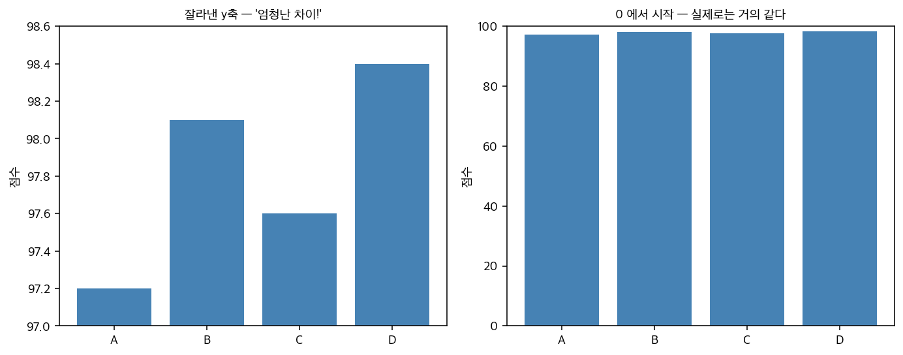

    왼쪽 그림에서 D는 A의 두 배쯤 되어 보인다. 실제 차이는 $1.2$점, 상대적으로 $1.23\%$다.

    **왜 막대그래프는 $0$에서 시작해야 하는가.** 막대는 **길이**로 양을 나타낸다. 길이의 비가 곧 값의 비로 읽히므로, 축을 자르면 그 비가 거짓이 된다. 이것이 자료 시각화에서 가장 흔한 왜곡이다.

    **꺾은선그래프는 다르다.** 선은 길이가 아니라 **기울기와 변화**를 나타내므로 $0$을 포함할 의무가 없다. 체온의 하루 변화를 $0°C$부터 그리면 오히려 정보가 사라진다. 축을 자르는 것 자체가 죄가 아니라, **부호화 방식과 맞지 않게 자르는 것**이 죄다.

    | 그림 | $0$을 포함해야 하는가 | 이유 |
    |---|---|---|
    | 막대그래프 | 그렇다 | 길이가 값에 비례해야 한다 |
    | 꺾은선그래프 | 아니다 | 변화를 보는 것이 목적이다 |
    | 산점도 | 아니다 | 위치가 값을 나타낸다 |

    작은 차이를 정직하게 강조하고 싶다면, 축을 자르는 대신 **차이 자체를 그려라**(기준 대비 편차) 또는 신뢰구간을 함께 표시해 그 차이가 잡음보다 큰지 보여 주어라. $\square$

<div class="drillbox" markdown>

**연습문제 10.** <span class="diff med" title="중간"></span>
관측이 수만 개인 산점도는 점이 겹쳐 쌓여 밀도를 볼 수 없다. 이 **과대그림(overplotting)** 문제를 세 가지 방법으로 해결하고, 색지도 선택이 왜 중요한지 설명하라.

</div>

??? success "풀이"
    ```python
    import numpy as np
    import matplotlib.pyplot as plt

    plt.rcParams["font.family"] = "Apple SD Gothic Neo"   # 한글 글꼴
    plt.rcParams["axes.unicode_minus"] = False            # 음수 기호가 네모가 되지 않게

    rng = np.random.default_rng(0)
    n = 50_000
    x = rng.normal(0, 1, n)
    y = 0.7 * x + rng.normal(0, 0.7, n)        # 상관 있는 두 변수

    fig, axes = plt.subplots(1, 4, figsize=(15, 3.8))

    axes[0].scatter(x, y, s=8)
    axes[0].set_title("그냥 산점도 — 뭉개진다", fontsize=9)

    axes[1].scatter(x, y, s=4, alpha=0.02)
    axes[1].set_title("alpha=0.02 — 밀도가 보인다", fontsize=9)

    hb = axes[2].hexbin(x, y, gridsize=45, cmap="viridis")
    axes[2].set_title("hexbin — 밀도를 센다", fontsize=9)
    fig.colorbar(hb, ax=axes[2], label="개수")

    axes[3].hist2d(x, y, bins=60, cmap="viridis")
    axes[3].set_title("hist2d — 사각 격자", fontsize=9)

    for ax in axes:
        ax.set_xlabel("x")
    axes[0].set_ylabel("y")
    fig.tight_layout()
    plt.show()

    print(f"관측 {n:,}개,  상관계수 {np.corrcoef(x, y)[0, 1]:.4f}")
    ```

    출력:

    ```
    관측 50,000개,  상관계수 0.7087
    ```

    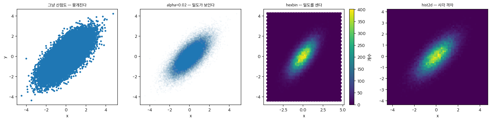

    **세 가지 처방.**

    - `alpha`를 아주 작게: 겹친 곳이 진해져 밀도가 명암으로 드러난다. 구현이 가장 쉽지만 값을 읽을 수는 없다.
    - `hexbin`: 평면을 육각형으로 나누어 개수를 센다. 육각형은 사각형보다 원에 가까워 격자 방향의 인공적 무늬가 덜 생긴다.
    - `hist2d`: 사각 격자. 개념이 단순하고 2차원 히스토그램과 그대로 대응된다.

    개수를 실제로 읽어야 하면 `hexbin`이나 `hist2d`에 색막대를 붙이는 쪽이 옳다. `alpha`는 인상만 준다.

    **색지도가 왜 중요한가.** 개수 같은 순차형 값에는 **지각적으로 균등한** 색지도를 써야 한다. `viridis`, `magma`, `cividis`가 여기 해당한다. 값이 같은 폭으로 변할 때 사람이 느끼는 색 변화도 같은 폭이라는 뜻이다.

    옛 기본값 `jet`(무지개)은 이 성질이 없다. 청록과 노랑 근처에서 급격히 변해 **없는 경계를 만들어 내고**, 초록 영역에서는 거의 변하지 않아 **있는 구조를 감춘다.** 흑백으로 인쇄하면 순서가 뒤죽박죽이 되고, 적록 색맹인 사람에게는 읽히지 않는다.

    기준값을 중심으로 양쪽으로 벌어지는 값(상관계수, 잔차, 온도 편차)에는 `RdBu`나 `coolwarm` 같은 **발산형** 색지도를 쓰고, 반드시 중심을 $0$에 맞춘다(`vmin=-m, vmax=m`). 그러지 않으면 색의 중립점이 엉뚱한 값에 놓여 그림이 거짓말을 한다. $\square$

---

## 정리하며

이 절은 그림을 **읽고 고칠 수 있는 객체**로 다루는 법을 익혔다.

- **두 가지 API.** `plt.*` 는 현재 그림에 암묵적으로 작용하고, `fig, ax = plt.subplots()` 는 그림과 축을 명시적으로 잡는다. **여러 개의 축을 다루는 순간 후자만이 통한다.** 이 책의 그림은 모두 후자를 쓴다.
- **그림 규약.** `matplotlib.use("Agg")`, 한글 글꼴 지정과 `axes.unicode_minus = False`, 정해진 팔레트, 그리고 `dpi=170, facecolor="white", bbox_inches="tight"` 로 저장하기. **한글은 `$...$` 밖에 둔다** — mathtext 에는 한글 글리프가 없다. 이 책의 모든 그림 코드가 이 머리글로 시작한다.
- **그림 유형과 쓰임새.** 한 변수의 분포는 히스토그램, 두 변수의 관계는 산점도, 집단 비교는 상자그림, 정규성 진단은 Q-Q 그림이다. **무엇을 묻고 있는지가 그림을 고른다.**
- **`density=True`.** 히스토그램의 세로축을 밀도로 바꾸면 이론적 확률밀도함수를 같은 축에 겹쳐 그릴 수 있다. 4장에서 분포를 확인할 때 계속 쓰는 수법이다.
- **pandas 와의 연동.** `df.plot(ax=ax)` 로 두 세계를 잇되, 세밀한 조정은 축 객체에서 한다.

**그림은 장식이 아니라 진단이다.** 같은 요약통계를 갖는 전혀 다른 자료가 존재하므로(2장의 앤스컴 사중주), 수치를 보고했다면 그림도 함께 보아야 한다.

여기까지가 0장의 계산 도구다. 이어지는 **정사각행렬**과 **선형대수와 통계**에서는 앞서 세운 선형대수 표기를 본격적으로 써서, 최소제곱추정량의 표본분포를 사영과 이차형식의 언어로 유도한다.
