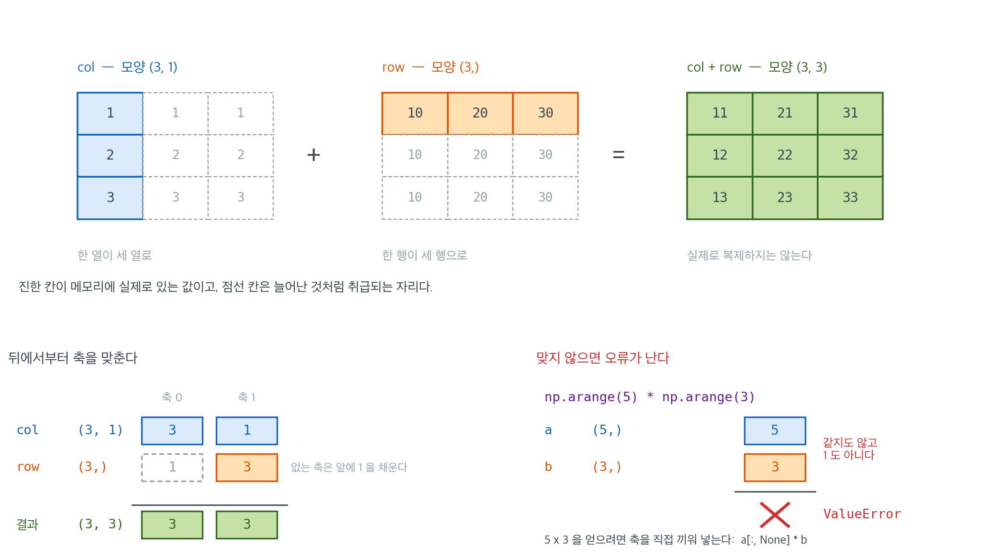

# NumPy 배열

## 개요

**NumPy**(Numerical Python)는 파이썬 수치 계산의 토대가 되는 라이브러리다. 그 핵심은 `ndarray`로, 연속된 메모리에 저장되고 C, 포트란, 그리고 (가능한 경우) BLAS/LAPACK으로 작성된 루틴으로 다루어지는 동질적이고 크기가 고정된 다차원 배열이다. NumPy에 힘을 실어주는 성질은 세 가지다.

1. **벡터화**: 산술 연산이 배열 전체에 한 번에 적용되므로 파이썬 반복문이 사라진다.
2. **브로드캐스팅**: 모양이 다른 배열들이 자동 규칙으로 맞춰져, 표준화를 `(X - X.mean(axis=0)) / X.std(axis=0)`처럼 간결하게 쓸 수 있다.
3. **메모리 지역성**: `float64` 100만 개짜리 1차원 배열은 연속된 8MB 메모리를 차지하므로 벡터 연산이 캐시 친화적이다.

pandas, SciPy, scikit-learn, statsmodels, Matplotlib 등 모든 과학용 파이썬 라이브러리가 `ndarray`를 자료 교환 형식으로 삼아 그 위에 세워져 있다. 따라서 NumPy를 익히는 것이 나머지 생태계를 쓰기 위한 선수 조건이다.

아래 보기는 모두 `import numpy as np` 를 마쳤다고 보고 적는다. `np` 라는 이름은
NumPy 문서와 거의 모든 코드가 따르는 관례이므로 그대로 쓰는 편이 좋다.

---

## 1. 배열 만들기

### 파이썬 리스트로부터

<div class="exbox" markdown>

**보기 1.** <span class="diff easy" title="쉬움"></span> 리스트로 배열 만들기

**(1)** `np.array([1, 2, 3, 4, 5])`의 `dtype`과 `nbytes`를 미리 적으시오. 마지막 원소만 `5.0`으로 바꾸면 둘이 어떻게 달라지는가?

**(2)** 같은 `*` 기호가 파이썬 리스트와 NumPy 배열에서 무엇을 하는지 견주시오. `+`는 어떤가?

</div>

??? success "풀이"

    **(1) `int64`에 $40$바이트.** `np.array`는 넘겨받은 값들을 모두 담을 수 있는 **가장 좁은 공통 자료형**을 고른다. 다섯 개가 다 정수이므로 플랫폼 기본 정수형인 `int64`가 되고, 원소 하나가 $8$바이트이므로

    $$
    \texttt{nbytes} = \texttt{size} \times \texttt{itemsize} = 5 \times 8 = 40
    $$

    이다. 이 곱셈은 언제나 성립한다. 배열이 **연속된 메모리 한 덩어리**이고 원소 크기가 고정이기 때문이다.

    마지막 원소를 `5.0`으로 바꾸면 정수와 실수를 함께 담을 공통 자료형이 필요하므로 **전체가 `float64`로 올라간다.** 하나만 실수가 되는 것이 아니라 `[1. 2. 3. 4. 5.]`처럼 다섯 개가 다 실수가 된다. `float64`도 $8$바이트라 `nbytes`는 그대로 $40$이다. **자료형이 바뀌었는데 크기는 안 바뀐 것**이라 `nbytes`만 보고는 승격을 알아챌 수 없다. `dtype`을 보아야 한다.

    이 승격은 결측값에서 특히 자주 일어난다. `np.nan`이 `float`이므로 정수 배열에 결측을 하나 넣는 순간 배열 전체가 실수가 된다.

    **(2) 리스트의 `*`는 반복, 배열의 `*`는 원소별 곱이다.** `[1, 2, 3] * 2`는 리스트를 두 번 이어 붙여 길이 $6$인 `[1, 2, 3, 1, 2, 3]`을 주고, `np.array([1, 2, 3]) * 2`는 길이 $3$인 `[2 4 6]`을 준다. **길이가 달라지므로 바로 알아챌 수 있다.** `+`도 마찬가지로 리스트에서는 이어 붙이기(길이 $6$)이고 배열에서는 자리별 덧셈(길이 $3$)이다.

    같은 기호가 다른 뜻을 갖는 것은 파이썬이 연산자를 자료형에 따라 다르게 푸는 언어이기 때문이다. **그래서 "리스트인가 배열인가"를 늘 알고 있어야 하고**, 섞이기 쉬운 자리에서는 `np.asarray`로 한 번 받아 두는 것이 안전하다.

    ```python
    # 리스트를 그대로 넘기면 NumPy 가 원소를 보고 dtype 을 정한다.
    a = np.array([1, 2, 3, 4, 5])
    print(a)                              # [1 2 3 4 5]
    print(a.shape, a.size, a.dtype, a.nbytes)

    # 원소 하나만 실수로 바꾸면 배열 전체가 float64 로 올라간다.
    b = np.array([1, 2, 3, 4, 5.0])
    print(b, b.dtype, b.nbytes)

    # 리스트의 리스트는 2차원이 된다. 안쪽 리스트 하나가 한 행이다.
    M = np.array([[1, 2, 3],
                  [4, 5, 6]])
    print(M.shape, M.size, M.nbytes)

    # 같은 * 기호가 리스트에서는 반복, 배열에서는 원소별 곱이다.
    print([1, 2, 3] * 2, "vs", np.array([1, 2, 3]) * 2)
    print([1, 2, 3] + [4, 5, 6], "vs", np.array([1, 2, 3]) + np.array([4, 5, 6]))
    ```

    출력:

    ```
    [1 2 3 4 5]
    (5,) 5 int64 40
    [1. 2. 3. 4. 5.] float64 40
    (2, 3) 6 48
    [1, 2, 3, 1, 2, 3] vs [2 4 6]
    [1, 2, 3, 4, 5, 6] vs [5 7 9]
    ```

    예측대로 `int64`와 $40$바이트이고, `5.0` 하나가 전체를 `float64`로 올리면서도 $40$바이트를 그대로 둔다. $2 \times 3$ 배열은 `size`가 $6$, `nbytes`가 $6 \times 8 = 48$이다. **`shape`의 곱이 `size`이고 `size` 곱하기 `itemsize`가 `nbytes`** 라는 두 항등식이 모든 줄에서 맞는다.
### 내장 생성자로

<div class="exbox" markdown>

**보기 2.** <span class="diff easy" title="쉬움"></span> 내장 생성자로 배열 만들기

**(1)** `np.arange(0, 10, 2)`와 `np.linspace(0, 1, 5)`의 길이를 각각 적고, 두 함수의 길이 공식을 쓰시오.

**(2)** `np.arange(1, 1.3, 0.1)`의 길이를 예측하시오. 돌려 보고 어긋나면 그 까닭을 밝히시오.

</div>

??? success "풀이"

    **(1) 두 공식.** `arange`는 간격 기반이라 길이가

    $$
    \texttt{len} = \left\lceil \frac{\text{stop} - \text{start}}{\text{step}} \right\rceil
    $$

    이고 **끝점을 포함하지 않는다.** `np.arange(0, 10, 2)`는 $\lceil 10/2 \rceil = 5$개로 `[0 2 4 6 8]`이며 $10$이 빠진다. `linspace`는 개수 기반이라 길이가 **내가 준 `num` 그대로**이고 **끝점을 포함한다.** `np.linspace(0, 1, 5)`는 $5$개로 `[0. 0.25 0.5 0.75 1.]`이며 간격은 $(1-0)/(5-1) = 0.25$다. 간격 공식의 분모가 `num`이 아니라 `num - 1`인 것은 양 끝을 모두 쓰기 때문이다.

    **(2) $3$이라고 답하면 틀린다. $4$가 나온다.** 그리고 더 나쁜 것은 **끝점 $1.3$이 결과에 들어간다**는 점이다.

    까닭은 위 길이 공식의 나눗셈이 부동소수점이기 때문이다. $1.3$과 $0.1$ 모두 이진수로 정확히 적을 수 없어

    $$
    \frac{1.3 - 1}{0.1} = \frac{0.30000000000000004}{0.1} = 3.0000000000000004
    $$

    가 되고, 천장함수가 이것을 $4$로 올린다. 그래서 `[1.0, 1.1, 1.2, 1.3]` 네 개가 나온다. 수학적으로는 $3$이어야 하고 `arange`의 약속대로라면 끝점은 빠져야 하는데, **둘 다 깨진다.**

    `np.arange(0, 1, 0.1)`은 운 좋게 $10$개가 나온다. $1/0.1$이 배정도에서 정확히 $10.0$으로 떨어지기 때문인데, **운에 기대는 셈이다.** 실수 간격으로 격자를 만들 때는 길이를 내가 정하는 `np.linspace`를 쓰라는 규칙이 여기서 나온다. `np.linspace(1, 1.3, 4)`는 같은 네 점을 주되 개수가 흔들릴 여지가 없다.

    ```python
    # 값을 하나하나 적지 않고 모양만 주어 배열을 만든다.
    print(np.zeros((3, 4)).dtype)   # float64 — 채움값이 실수다
    print(np.full((3, 3), 7).dtype) # int64 — 채움값이 정수라 정수형이 된다
    print(np.arange(0, 10, 2))      # 간격 2로 끊는다: 끝점 10은 빠진다
    print(np.linspace(0, 1, 5))     # 개수 5로 끊는다: 끝점을 포함한다

    # arange 의 길이는 ceil((stop - start) / step) 이고, 그 나눗셈이 부동소수다.
    print(len(np.arange(0, 1, 0.1)), np.arange(0, 1, 0.1)[-1])
    print(np.arange(1, 1.3, 0.1), len(np.arange(1, 1.3, 0.1)))
    print((1.3 - 1) / 0.1, np.ceil((1.3 - 1) / 0.1))

    # 같은 점들을 linspace 로 뽑으면 개수를 내가 정하므로 흔들리지 않는다.
    print(np.linspace(1, 1.3, 4))
    ```

    출력:

    ```
    float64
    int64
    [0 2 4 6 8]
    [0.   0.25 0.5  0.75 1.  ]
    10 0.9
    [1.  1.1 1.2 1.3] 4
    3.0000000000000004 4.0
    [1.  1.1 1.2 1.3]
    ```

    셋째 줄부터가 유도한 그대로다. 나눗셈이 $3.0000000000000004$를 주고 천장함수가 $4$를 준다. $\texttt{np.zeros}$가 `float64`인데 $\texttt{np.full((3,3), 7)}$이 `int64`인 것도 보기 1 의 규칙 그대로다. **채움값의 자료형이 배열의 자료형을 정한다.** 실수 배열이 필요하면 `np.full((3, 3), 7.0)`이나 `dtype=float`를 주어야 한다.

    `arange`는 파이썬의 `range`를 본뜬 것이다(간격 기반이라 끝점을 지나칠 수 있다). `linspace`는 끝점을 포함하는 구간에 정해진 개수의 점을 고르게 배치하므로, 어떤 정의역 위에서 함수를 그릴 때는 보통 이쪽이 낫다.

### 난수 배열 (현대적 API)

예전의 `np.random.*` 함수도 여전히 작동하지만, NumPy 1.17에서 도입된 **`Generator`** API가 선호된다. 더 빠르고, 병렬 스트림을 지원하며, 전역 상태 변경으로부터 상태를 격리한다.

<div class="exbox" markdown>

**보기 3.** <span class="diff easy" title="쉬움"></span> 재현 가능한 난수 배열

**(1)** `np.random.default_rng(42)`를 두 번 따로 만들어 각각에서 세 수를 뽑으면 두 결과가 같은가? 씨앗을 $43$으로 바꾸면 어떤가?

**(2)** 표준정규에서 $10{,}000$개를 뽑으면 표본평균과 표본표준편차가 각각 얼마쯤 나와야 하는지 표준오차와 함께 적고, 돌려서 맞추시오.

</div>

??? success "풀이"

    **(1) 같다.** `default_rng(42)`는 씨앗 $42$에서 생성기 상태를 **결정론적으로** 만들어 내므로, 몇 번을 다시 만들든 같은 상태에서 출발해 같은 수열을 낸다. 씨앗을 $43$으로 바꾸면 전혀 다른 수열이 나온다. 가까운 씨앗이라고 비슷한 수가 나오지는 않는다.

    **주의할 것은 생성기가 상태를 들고 있다**는 점이다. 한 `rng`에서 뽑기를 거듭하면 매번 다른 수가 나오고 되돌아가지 않는다. 재현하려면 "같은 씨앗으로 생성기를 새로 만든다"를 해야지 "같은 생성기를 다시 쓴다"를 해서는 안 된다.

    **(2) 이론값과 그 표준오차.** $Z_1, \ldots, Z_n \sim N(0,1)$에 $n = 10{,}000$이면

    $$
    \mathbb{E}[\bar Z] = 0, \qquad \mathrm{SE}(\bar Z) = \frac{\sigma}{\sqrt n} = \frac{1}{100} = 0.01
    $$

    이고, 표본표준편차 $s$는 큰 $n$에서 $\mathbb{E}[s] \approx 1$에 표준오차가

    $$
    \mathrm{SE}(s) \approx \frac{\sigma}{\sqrt{2(n-1)}} = \frac{1}{\sqrt{19\,998}} = 0.0071
    $$

    이다. 그러므로 평균은 $\pm 0.02$, 표준편차는 $1 \pm 0.014$ 안쪽이면 정상이다.

    ```python
    # seed 를 주면 같은 난수열이 다시 나온다. 모의실험 결과를 남기려면 필수다.
    rng = np.random.default_rng(seed=42)
    print(rng.standard_normal((3, 3)).round(4))  # 표준정규에서 3×3
    print(rng.uniform(0, 1, size=(2, 5)).round(4))
    print(rng.integers(0, 10, size=6))

    # 씨앗이 같으면 같은 수가, 다르면 다른 수가 나온다.
    first = np.random.default_rng(42).standard_normal(3)
    again = np.random.default_rng(42).standard_normal(3)
    other = np.random.default_rng(43).standard_normal(3)
    print(first.round(4), np.array_equal(first, again), np.array_equal(first, other))

    # 10000 개를 뽑으면 표본평균이 0 근처, 표본표준편차가 1 근처여야 한다.
    z = np.random.default_rng(42).standard_normal(10_000)
    print(f"평균 = {z.mean():.4f}  (SE = {1 / np.sqrt(10_000):.4f})")
    print(f"표준편차 = {z.std(ddof=1):.4f}  (SE = {1 / np.sqrt(2 * 9_999):.4f})")
    ```

    출력:

    ```
    [[ 0.3047 -1.04    0.7505]
     [ 0.9406 -1.951  -1.3022]
     [ 0.1278 -0.3162 -0.0168]]
    [[0.4504 0.3708 0.9268 0.6439 0.8228]
     [0.4434 0.2272 0.5546 0.0638 0.8276]]
    [2 6 1 7 7 3]
    [ 0.3047 -1.04    0.7505] True False
    평균 = -0.0102  (SE = 0.0100)
    표준편차 = 1.0063  (SE = 0.0071)
    ```

    씨앗 $42$의 두 생성기가 같은 세 수를 주고(`True`), 씨앗 $43$은 다른 수를 준다(`False`). 맨 윗줄의 `[0.3047 -1.04 0.7505]`가 그 세 수와 같은 것도 눈여겨볼 만하다. **`rng.standard_normal((3, 3))`의 첫 세 값이 바로 그것**이며, 모양만 다를 뿐 같은 수열에서 차례로 꺼낸 것이다.

    이론값도 맞는다. 평균 $-0.0102$는 $0$에서 $1.02$표준오차 떨어져 있고, 표준편차 $1.0063$은 $1$에서 $0.89$표준오차 떨어져 있다. 둘 다 흔한 폭이다. **$10{,}000$개를 뽑고도 평균이 소수 둘째 자리에서 흔들린다**는 것이 요점이다. 모의실험 결과를 소수 넷째 자리까지 믿어서는 안 된다.

---

## 2. 배열 속성

| 속성 | 설명 | 예 |
|---|---|---|
| `a.shape` | 차원의 모양 | `(2, 3)` |
| `a.ndim` | 차원의 수 | `2` |
| `a.size` | 전체 원소 개수 | `6` |
| `a.dtype` | 원소의 자료형 | `float64` |
| `a.nbytes` | 바이트 단위 메모리 사용량 | `48` |

`a.shape`의 곱은 언제나 `a.size`와 같다. `a.nbytes`는 `a.size * a.dtype.itemsize`와 같다.

---

## 3. 인덱싱과 슬라이싱

### 1차원

<div class="exbox" markdown>

**보기 4.** <span class="diff easy" title="쉬움"></span> 1차원 인덱싱과 슬라이싱. `a = np.array([10, 20, 30, 40, 50])`에서 `a[1:4]`와 `a[[1, 2, 3]]`은 둘 다 `[20 30 40]`을 준다.

**(1)** 두 결과의 첫 원소를 `99`로 바꾸면 `a`가 바뀌는가? 두 경우를 가르고 그 까닭을 말하시오.

**(2)** `a[::-1]`은 뷰인가 복사본인가? 거꾸로 읽는데도 그럴 수 있는 까닭은 무엇인가?

</div>

??? success "풀이"

    **(1) 슬라이스를 고치면 `a`가 바뀌고, 팬시 인덱싱 결과를 고치면 바뀌지 않는다.**

    까닭은 `ndarray`가 **메모리 덩어리 하나 + 읽는 법(모양·보폭·시작 오프셋)** 으로 이루어져 있기 때문이다. 기본 슬라이싱 `a[1:4]`는 읽는 법만 바꾸면 되는 요청이다. 시작 오프셋을 $8$바이트 뒤로 옮기고 길이를 $3$으로 잡으면 끝이므로, NumPy는 **같은 메모리를 다르게 읽는 뷰**를 돌려준다. 그 뷰에 값을 쓰면 원본 메모리에 쓰는 것이다.

    팬시 인덱싱 `a[[1, 2, 3]]`은 다르다. 색인 목록이 임의의 순서일 수 있어(`a[[3, 0, 3]]`도 된다) 일정한 보폭으로 읽는 법이 존재하지 않는다. 그러므로 NumPy는 **새 메모리를 잡고 값을 옮겨 담는다.** 결과는 복사본이고, 고쳐도 원본과 무관하다.

    **`[1:4]`와 `[[1,2,3]]`은 눈으로는 거의 같아 보이는데 한쪽은 원본을 건드리고 한쪽은 안 건드린다.** 확실히 하려면 `np.shares_memory`로 묻거나 `.copy()`를 명시하라.

    **(2) 뷰다.** 뒤집기는 **보폭을 음수로 두면 되는** 일이기 때문이다. 시작 오프셋을 마지막 원소에 두고 보폭을 $-8$바이트로 잡으면 같은 메모리를 거꾸로 읽게 된다. 새 메모리가 전혀 필요 없다. 보폭이 일정하기만 하면 — 양수든 음수든, 간격이 $1$이든 $2$이든 — 기본 슬라이싱은 언제나 뷰다.

    ```python
    a = np.array([10, 20, 30, 40, 50])

    print(a[0], a[-1])    # 10, 50 — 음수 색인은 뒤에서 센다
    print(a[1:4])         # [20 30 40] — 시작은 포함하고 끝은 제외한다
    print(a[::2])         # [10 30 50] — 콜론 뒤 세 번째 자리가 간격이다
    print(a[::-1])        # [50 40 30 20 10] — 간격을 -1로 주면 뒤집힌다

    # 같은 값을 주는 두 가지 꺼내기. 하나는 뷰이고 하나는 복사본이다.
    sl = a[1:4]           # 기본 슬라이싱
    fy = a[[1, 2, 3]]     # 팬시(정수 배열) 인덱싱
    print(sl, fy)
    print("슬라이스가 원본과 메모리를 나누는가?", np.shares_memory(a, sl))
    print("팬시 결과가 원본과 메모리를 나누는가?", np.shares_memory(a, fy))
    print("뒤집기는?", np.shares_memory(a, a[::-1]))

    sl[0] = 99            # 뷰를 고치면 원본이 바뀐다
    print("뷰를 고친 뒤 a =", a)

    a = np.array([10, 20, 30, 40, 50])
    fy = a[[1, 2, 3]]
    fy[0] = 99            # 복사본을 고치면 원본은 그대로다
    print("복사본을 고친 뒤 a =", a)
    ```

    출력:

    ```
    10 50
    [20 30 40]
    [10 30 50]
    [50 40 30 20 10]
    [20 30 40] [20 30 40]
    슬라이스가 원본과 메모리를 나누는가? True
    팬시 결과가 원본과 메모리를 나누는가? False
    뒤집기는? True
    뷰를 고친 뒤 a = [10 99 30 40 50]
    복사본을 고친 뒤 a = [10 20 30 40 50]
    ```

    예측대로다. 뷰에 `99`를 넣자 `a`의 둘째 자리가 `99`가 되었고, 복사본에 넣었을 때는 `a`가 `[10 20 30 40 50]` 그대로다. `a[::-1]`은 `shares_memory`가 `True`이므로 뷰다.

    이것은 앞 절 **파이썬과 주피터 기초** 의 `b = a`와 `b = a.copy()` 이야기가 배열 층에서 되풀이되는 것이다. 질문은 언제나 같다 — **지금 내가 든 이름이 원본을 가리키는가 사본을 가리키는가.** 다음 절 pandas의 `SettingWithCopyWarning`도 같은 질문이다.
### 2차원

<div class="exbox" markdown>

**보기 5.** <span class="diff easy" title="쉬움"></span> 2차원 인덱싱. $3 \times 3$ 행렬 `M`에서 `M[:, 2]`로 마지막 열을 꺼낸다.

**(1)** `M[:, 2]`의 모양은 `(3,)`인가 `(3, 1)`인가? 열을 꺼냈는데도 그렇게 되는 규칙은 무엇인가? 열벡터 모양 `(3, 1)`을 받으려면 어떻게 쓰는가?

**(2)** `M[0, 1]`과 `M[0][1]`은 같은 값을 준다. 무엇이 다른가?

</div>

??? success "풀이"

    **(1) `(3,)`이다.** 규칙은 하나로 적을 수 있다. **정수로 색인한 축은 결과에서 사라지고, 슬라이스로 색인한 축은 남는다.** `M[:, 2]`에서 행 축은 슬라이스 `:`라 남고 열 축은 정수 `2`라 사라진다. 그래서 축이 하나뿐인 `(3,)`이 된다.

    이것이 자주 걸리는 자리다. "열을 뽑았으니 열벡터겠지"라고 생각하면 `(3, 1)`을 기대하는데 NumPy는 **방향이 없는 1차원 배열**을 준다. 뒤에 브로드캐스팅을 걸면 모양이 어긋나 엉뚱한 결과가 나온다.

    열 축을 살리려면 그 축을 **슬라이스로** 집으면 된다. `M[:, 2:3]`은 길이 $1$인 슬라이스라 축이 남아 `(3, 1)`이 되고, `M[:, [2]]`도 목록으로 집어 축이 남아 `(3, 1)`이 된다. 다만 앞의 것은 뷰이고 뒤의 것은 팬시 인덱싱이라 복사본이다(보기 4).

    **(2) 값은 같고 거치는 길이 다르다.** `M[0, 1]`은 **한 번의 색인**이다. NumPy가 두 축의 색인을 함께 받아 메모리 주소를 한 번에 계산해 값을 꺼낸다. `M[0][1]`은 **두 번의 색인**이다. 먼저 `M[0]`이 길이 $3$인 뷰를 만들고, 그 뷰에 다시 `[1]`을 걸어 값을 꺼낸다. 중간 객체가 하나 생기는 셈이다.

    읽기만 할 때는 결과가 같아 차이가 없지만, **쓸 때는 갈린다.** 기본 슬라이싱이 뷰이므로 `M[0][1] = 7`도 어쩌다 작동하지만, 중간 단계가 복사본이 되는 꼴(예: `M[[0]][1] = 7`)에서는 쓴 값이 사라진다. 한 번에 색인하는 `M[0, 1]` 꼴을 쓰는 것이 안전하고 빠르다.

    ```python
    M = np.array([[1, 2, 3],
                  [4, 5, 6],
                  [7, 8, 9]])

    # 쉼표 앞이 행, 뒤가 열이다. 콜론 하나는 그 축 전체를 뜻한다.
    print(M[0, 1])        # 2 — 0행 1열
    print(M[1, :])        # [4 5 6] — 1행 전체
    print(M[:, 2])        # [3 6 9] — 2열 전체
    print(M[:2, :2])      # 왼쪽 위 2×2 부분행렬

    # 열을 뽑았는데 모양이 (3,) 이다. 정수 색인은 그 축을 아예 없앤다.
    print(M[:, 2].shape, M[:, 2:3].shape, M[:, [2]].shape)

    # M[0, 1] 과 M[0][1] 은 값이 같지만 거치는 길이 다르다.
    print(M[0, 1], M[0][1], np.shares_memory(M, M[0]))
    ```

    출력:

    ```
    2
    [4 5 6]
    [3 6 9]
    [[1 2]
     [4 5]]
    (3,) (3, 1) (3, 1)
    2 2 True
    ```

    예측대로 `M[:, 2]`는 `(3,)`, `M[:, 2:3]`과 `M[:, [2]]`는 `(3, 1)`이다. `M[0]`이 원본과 메모리를 나눈다는 것(`True`)이 `M[0][1]`의 중간 단계가 뷰임을 보여 준다.
!!! note "뷰와 복사본"
    기본 슬라이싱(`a[1:4]`, `M[:2, :2]`)은 같은 메모리를 가리키는 **뷰**를 반환하므로, 슬라이스를 수정하면 원본이 바뀐다. 불리언 인덱싱과 팬시 인덱싱은 **복사본**을 반환한다. 헷갈릴 때는 `arr.copy()`로 의도를 분명히 하라.

### 불리언(팬시) 인덱싱

<div class="exbox" markdown>

**보기 6.** <span class="diff easy" title="쉬움"></span> 불리언 인덱싱으로 걸러내기. `a = np.array([3, 1, 4, 1, 5, 9])`에서 `(a > 2) & (a < 6)`으로 두 조건을 겹친다.

**(1)** `&` 대신 `and`를 쓰면 무슨 일이 생기는가? 괄호를 빼고 `a > 2 & a < 6`이라 쓰면 어떤가?

**(2)** `mask.sum()`과 `mask.mean()`은 각각 무엇을 세는가? `a[mask]`는 뷰인가 복사본인가?

</div>

??? success "풀이"

    **(1) 둘 다 같은 `ValueError`로 끝난다.** 까닭은 서로 다르다.

    **`and`를 쓰면.** 파이썬의 `and`는 왼쪽 값을 **하나의 참·거짓으로 판정**한 뒤 그 결과에 따라 오른쪽을 돌려줄지 정하는 문법이다. 그런데 왼쪽이 원소 여섯 개짜리 불리언 배열이므로 "이 배열은 참인가"라는 물음에 답이 없다. **배열은 원소별로 참·거짓을 갖지 배열 전체로 하나의 참·거짓을 갖지 않는다.** NumPy는 멋대로 정하지 않고 오류를 낸다. 원소별로 겹치려면 비트 연산 `&`, `|`, `~`를 써야 한다. 이들은 NumPy가 원소별로 재정의해 두었다.

    **괄호를 빼면.** 파이썬에서 `&`는 비교 연산자 `<`, `>`보다 **우선순위가 높다.** 그래서 `a > 2 & a < 6`은 `a > (2 & a) < 6`으로 묶이고, 이것은 다시 연쇄 비교라 `(a > (2 & a)) and ((2 & a) < 6)`이 된다. `and`가 끼어들었으니 결국 같은 오류로 끝난다. **`&`를 쓸 때마다 각 조건을 괄호로 감싸라**는 규칙이 여기서 나온다. 잊으면 조용히 틀리는 것이 아니라 오류가 나므로 그나마 다행이다.

    **(2) `mask.sum()`은 참인 개수, `mask.mean()`은 참인 비율이다.** 불리언을 셈에 쓰면 `True`가 $1$, `False`가 $0$으로 올라가기 때문이다. `a > 3`의 참이 셋이므로 합이 $3$, 평균이 $3/6 = 0.5$다. 이것은 통계에서 끊임없이 쓰는 관용구다. **"조건을 만족하는 비율"이 곧 그 조건의 표본비율**이고, 포함률·검정력·$p$ 값 모의실험이 모두 `mask.mean()` 한 줄로 끝난다.

    `a[mask]`는 **복사본**이다. 참인 자리가 어디에 있을지 모르므로 일정한 보폭으로 읽는 법이 없고, 그래서 새 메모리에 옮겨 담아야 한다(보기 4의 팬시 인덱싱과 같은 이치다).

    ```python
    a = np.array([3, 1, 4, 1, 5, 9])

    # 비교 연산은 원소마다 참·거짓을 내어 같은 모양의 불리언 배열을 만든다.
    mask = a > 3
    print(mask)       # [False False  True False  True  True]
    print(a[mask])    # [4 5 9] — 참인 자리만 골라낸다
    print(mask.sum(), mask.mean())   # True 가 1 이므로 개수와 비율이 바로 나온다

    # 조건을 겹칠 때는 and/or 가 아니라 비트 연산 &, |, ~ 를 쓰고 각각 괄호로 묶는다.
    print(a[(a > 2) & (a < 6)])    # [3 4 5]

    for bad in ("and", "괄호 없는 &"):
        try:
            if bad == "and":
                a[(a > 2) and (a < 6)]
            else:
                a[a > 2 & a < 6]
        except ValueError as err:
            print(f"{bad}: ValueError: {err}")

    print("불리언 결과가 원본과 메모리를 나누는가?", np.shares_memory(a, a[mask]))
    ```

    출력:

    ```
    [False False  True False  True  True]
    [4 5 9]
    3 0.5
    [3 4 5]
    and: ValueError: The truth value of an array with more than one element is ambiguous. Use a.any() or a.all()
    괄호 없는 &: ValueError: The truth value of an array with more than one element is ambiguous. Use a.any() or a.all()
    불리언 결과가 원본과 메모리를 나누는가? False
    ```

    예측대로 두 잘못된 꼴이 같은 오류를 낸다. 오류 문구가 권하는 `a.any()`/`a.all()`은 "배열 전체를 하나의 참·거짓으로 줄여라"는 뜻인데, 여기서 하고 싶은 일은 그게 아니라 원소별로 겹치는 것이므로 `&`가 맞다. `mask.sum()`이 $3$, `mask.mean()`이 $0.5$인 것도 $[3, 1, 4, 1, 5, 9]$ 가운데 $3$을 넘는 것이 $4, 5, 9$ 셋이라는 것과 맞는다.

    불리언 인덱싱은 반복문 없이 자료를 걸러내는 자연스러운 방법이다.

---

## 4. 벡터화 연산

NumPy는 명시적 반복문 없이 원소별 산술을 수행하며, 이는 순수 파이썬보다 빠르면서도 읽기 좋다.

<div class="exbox" markdown>

**보기 7.** <span class="diff easy" title="쉬움"></span> 반복문 없는 원소별 연산. `a = [1, 2, 3, 4, 5]`, `b = [10, 20, 30, 40, 50]`을 배열로 둔다.

**(1)** `a * b`와 `a @ b`의 값과 모양을 각각 손으로 적으시오.

**(2)** 두 결과 사이에는 관계가 있다. 무엇인가?

</div>

??? success "풀이"

    **(1)** `*`는 **원소별 곱**이다. 자리마다 곱하므로 모양이 그대로 `(5,)`이고

    $$
    a * b = [1 \cdot 10,\ 2 \cdot 20,\ 3 \cdot 30,\ 4 \cdot 40,\ 5 \cdot 50] = [10,\ 40,\ 90,\ 160,\ 250]
    $$

    이다. `@`는 **행렬곱**이고, 1차원 배열 둘에 걸면 내적이 된다. 결과는 배열이 아니라 **스칼라**이므로 `ndim`이 $0$이고

    $$
    a^\top b = \sum_{i=1}^{5} a_i b_i = 10 + 40 + 90 + 160 + 250 = 550
    $$

    이다.

    **(2) 내적은 원소별 곱의 합이다.** 곧 `a @ b == (a * b).sum()`이다. 이것이 두 연산을 가르는 가장 쉬운 기억법이다. `*`는 곱하기만 하고 멈추므로 길이가 보존되고, `@`는 곱한 뒤 더해 접으므로 축이 하나 사라진다. 통계에서 쓰는 거의 모든 양이 이 꼴이다. 제곱합 $\sum x_i^2$은 `x @ x`이고, 공분산의 분자 $\sum (x_i - \bar x)(y_i - \bar y)$도 중심화한 두 벡터의 내적이다.

    **`*`를 행렬곱으로 착각하는 것이 NumPy를 처음 쓸 때 가장 흔한 실수다.** 2차원에서도 `A * B`는 원소별이고 `A @ B`가 행렬곱이다. MATLAB에서 넘어온 사람이 특히 자주 걸린다.

    ```python
    a = np.array([1, 2, 3, 4, 5])
    b = np.array([10, 20, 30, 40, 50])

    # 스칼라는 모든 원소에 퍼지고, 모양이 같은 둘은 자리를 맞춰 계산한다.
    print(a + 10)        # [11 12 13 14 15]
    print(a * 2)         # [ 2  4  6  8 10]
    print(a ** 2)        # [ 1  4  9 16 25]
    print(a + b)         # [11 22 33 44 55]
    print(a * b)         # 원소별 곱이다. 모양이 그대로 (5,) 로 남는다
    print(np.sqrt(a).round(3))

    # @ 는 원소별이 아니라 내적이다. 결과가 배열이 아니라 스칼라가 된다.
    print(a @ b, np.ndim(a @ b))
    print((a * b).shape, (a * b).sum())
    ```

    출력:

    ```
    [11 12 13 14 15]
    [ 2  4  6  8 10]
    [ 1  4  9 16 25]
    [11 22 33 44 55]
    [ 10  40  90 160 250]
    [1.    1.414 1.732 2.    2.236]
    550 0
    (5,) 550
    ```

    손으로 구한 `[10 40 90 160 250]`과 $550$이 그대로 나온다. `np.ndim(a @ b)`가 $0$이라는 것이 내적 결과가 스칼라임을 확인해 주고, 마지막 줄의 `(5,) 550`이 **길이 $5$인 원소별 곱을 더하면 내적이 된다**는 관계를 보인다.
### 왜 더 빠른가

<div class="exbox" markdown>

**보기 8.** <span class="diff easy" title="쉬움"></span> 벡터화가 빠른 이유를 재어 보기. $0$부터 $999{,}999$까지의 정수를 파이썬 리스트와 NumPy 배열에 각각 담아 제곱한다.

**(1)** 두 그릇이 쓰는 메모리를 손으로 셈하시오. CPython에서 작은 정수 객체 하나는 $28$바이트, 포인터 하나는 $8$바이트다.

**(2)** 제곱 연산에서 원소 하나마다 드는 일을 두 경우로 나누어 적고, 어느 쪽이 왜 빠른지 말하시오.

</div>

??? success "풀이"

    **(1) 손으로 셈하기.** NumPy 배열은 `int64` $n$개를 **연속된 한 덩어리**에 담으므로

    $$
    8n = 8 \times 10^6 = 8{,}000{,}000 \ \text{바이트}
    $$

    이고 그게 전부다. 파이썬 리스트는 두 겹이다. 리스트 자체는 **정수 객체를 가리키는 포인터의 배열**이라 $8n$바이트가 들고, 그 포인터가 가리키는 **정수 객체마다 $28$바이트**가 또 든다. 그러므로

    $$
    8n + 28n = 36n = 36{,}000{,}000 \ \text{바이트}
    $$

    로 **$4.5$배**다. 엄밀히 말하면 CPython이 $-5$부터 $256$까지의 정수 $262$개를 미리 만들어 공유하므로 그만큼은 덜 드는데, $10^6$ 가운데 몇백 개라 비에 영향을 주지 않는다.

    이 차이는 **시간이 아니라 크기라서 기계 부하와 무관하게 똑같이 나온다.** 아래 코드가 그것을 확인한다.

    **(2) 원소 하나마다 드는 일.** 이것이 속도 차이의 진짜 까닭이며, 몇 배인지보다 중요하다.

    **파이썬 리스트에서 `x ** 2`를 할 때** 원소마다 다음이 전부 일어난다. 포인터를 읽어 정수 객체로 **역참조**하고, 그 객체의 자료형을 보고 어떤 `__pow__`를 부를지 **디스패치**하고, 결과를 담을 **새 정수 객체를 할당**하고, 그것을 결과 리스트에 **덧붙이고**, 참조 횟수를 **갱신**한다. 이 다섯 가지가 모두 파이썬 인터프리터의 일이라 원소마다 수십 나노초의 상수가 붙는다. **$n$이 $10^6$이면 그 상수가 $10^6$번 붙는다.**

    **NumPy에서 `np_arr ** 2`를 할 때는** 자료형을 **한 번** 보고, 출력 버퍼를 **한 번** 잡고, 그다음은 C로 짠 루프가 연속된 메모리를 쭉 훑으며 곱셈만 한다. 디스패치도 객체 할당도 참조 횟수도 루프 안에 없다. 게다가 자료가 연속이라 캐시가 잘 맞고 컴파일러가 SIMD 명령을 쓸 수 있다.

    **그러므로 차이는 "NumPy의 곱셈이 빠르다"가 아니라 "파이썬이 원소마다 치르는 삯이 없다"에서 온다.** 이 설명은 어느 기계에서나 참이지만, 몇 배인지는 기계·부하·파이썬 버전에 따라 달라진다.

    ```python
    """같은 계산을 파이썬 반복문과 NumPy 로 재어 속도 차이를 확인한다."""
    import sys
    import time

    size = 1_000_000
    py_list = list(range(size))
    np_arr  = np.arange(size)

    # 메모리는 기계 부하와 무관하게 정확히 잴 수 있다.
    list_bytes = sys.getsizeof(py_list) + sum(sys.getsizeof(x) for x in py_list)
    print(f"리스트의 포인터 배열만  = {sys.getsizeof(py_list):>10,} 바이트")
    print(f"정수 객체까지 더한 전체 = {list_bytes:>10,} 바이트")
    print(f"NumPy 배열              = {np_arr.nbytes:>10,} 바이트")
    print(f"비  = {list_bytes / np_arr.nbytes:.1f} 배")

    # 파이썬 반복문: 원소마다 객체를 만들고 파이썬 바이트코드를 실행한다.
    t0 = time.perf_counter()
    [x ** 2 for x in py_list]
    t_list = time.perf_counter() - t0

    # NumPy: 같은 연산이 연속된 메모리 위에서 C 반복문 한 번으로 끝난다.
    t0 = time.perf_counter()
    np_arr ** 2
    t_numpy = time.perf_counter() - t0

    # 초 단위 값은 기계마다 다르므로 출력에는 배수만 싣는다(아래 주의 참조).
    print(f"NumPy가 최소 10배 이상 빠른가? {t_list > 10 * t_numpy}")
    ```

    출력:

    ```
    리스트의 포인터 배열만  =  8,000,056 바이트
    정수 객체까지 더한 전체 = 36,000,056 바이트
    NumPy 배열              =  8,000,000 바이트
    비  = 4.5 배
    NumPy가 최소 10배 이상 빠른가? True
    ```

    **손으로 셈한 $8n$과 $36n$이 바이트 단위까지 맞는다.** 리스트 쪽의 $56$바이트 군더더기는 리스트 객체 자신의 머리이고, NumPy 배열의 $8{,}000{,}000$은 자료만 센 값이라 배열 객체의 머리(대략 $100$바이트대) 가 빠져 있다. 비 $4.5$배는 어느 기계에서 돌려도 같다.

    시간 쪽은 다르다. **이 책을 쓰며 돌린 기계에서** 속도비는 $20$배대에서 $70$배대까지 들쭉날쭉했고, 특히 기계가 바쁠 때 작게 나왔다. 그래서 출력에는 배수를 싣지 않고 **"$10$배 이상인가"만** 싣는다. 이 조건은 어느 경우에도 넉넉히 참이었다. 직접 `print(t_list, t_numpy)`를 넣어 자기 기계의 수를 보되, **그 수를 NumPy의 성질로 적지는 말라.** 기계와 부하의 성질이 섞여 있다.
!!! note "왜 초 단위를 출력하지 않는가"
    이 비교의 요점은 "몇 초"가 아니라 **얼마나 빠른가**이다. `time.perf_counter()`가
    재는 값은 기계·부하·파이썬 버전에 따라 달라져 재현되지 않으므로, 초 단위 값은
    `t_list`와 `t_numpy`에 담아 두기만 하고 출력에서는 뺐다. 덕분에 이 블록의
    출력은 언제 실행해도 같다.

    참고로 이 책을 쓰며 여러 번 실행했을 때 `t_list`는 $0.04$–$0.09$초,
    `t_numpy`는 $0.001$–$0.003$초로 비는 $20$배에서 $70$배 사이로 흩어졌다.
    같은 기계에서도 다른 작업이 돌고 있으면 비가 눈에 띄게 작아진다.
    직접 `print(t_list, t_numpy)`로 확인해 보라.

배열 연산에서 NumPy는 보통 **10–100배 빠르다**. 안쪽 반복문이 C로 되어 있고 자료가 연속으로 저장되어 SIMD 명령과 캐시 친화적 접근이 가능하기 때문이다.

---

## 5. 브로드캐스팅

브로드캐스팅은 중간 복사본을 만들지 않고 모양이 다른 배열끼리 산술 연산을 수행하는 NumPy의 기제다. 규칙은 다음과 같다.

1. 배열의 차원 수가 다르면 작은 쪽 모양 앞에 `1`을 채워 넣는다.
2. 어떤 차원에서 두 모양이 같거나 **또는** 둘 중 하나가 1이면 그 차원은 호환된다. 브로드캐스트 결과는 더 큰 크기를 갖는다.



그림의 윗부분은 바로 아래 보기 9가 하는 일을 펼쳐 놓은 것이다. 모양 `(3, 1)`인 `col`은 열이 하나뿐이고 모양 `(3,)`인 `row`는 행이 하나뿐이다. 규칙 1이 `row`의 모양 앞에 1을 채워 `(1, 3)`으로 만들고, 규칙 2가 크기 1인 축을 상대편 크기에 맞춰 늘린다. 그러면 두 배열 모두 `(3, 3)`처럼 다루어져 자리마다 더해진다. 진한 칸만이 메모리에 실제로 있는 값이고 점선 칸은 늘어난 것처럼 취급되는 자리일 뿐이다. 브로드캐스팅이 중간 복사본을 만들지 않는다는 말의 뜻이 이것이다.

아래 왼쪽 표는 규칙을 적용하는 순서를 보여 준다. **모양은 왼쪽이 아니라 오른쪽 끝에서부터 맞춘다.** 차원 수가 모자라는 쪽의 앞에 1을 끼워 넣은 다음, 축마다 "크기가 같은가, 아니면 한쪽이 1인가"만 확인하면 된다. 뒤에 나올 보기 10의 표준화도 같은 셈이다. `(100, 5)`와 `(5,)`를 오른쪽에서 맞추면 마지막 축이 5로 같고, 앞에 채워 넣은 1이 100으로 늘어난다. 그래서 열마다 다른 평균이 그 열 전체에 퍼진다.

아래 오른쪽은 이 규칙이 실패하는 모습이다. `(5,)`와 `(3,)`은 마지막 축의 크기가 같지도 않고 어느 쪽도 1이 아니므로 맞출 방법이 없어 `ValueError`가 난다. 길이 5인 벡터와 길이 3인 벡터로 $5 \times 3$ 행렬을 만들고 싶다면 늘어날 수 있는 축을 직접 만들어 주어야 한다. `a[:, None] * b`가 `a`의 모양을 `(5, 1)`로 바꾸어 `(5, 3)`을 내놓는다. **브로드캐스팅 오류는 자료가 잘못되었다는 뜻이라기보다 축이 하나 모자란다는 뜻인 경우가 많다.** 연습문제 4과 연습문제 6가 이 수법을 다시 쓴다.

<div class="exbox" markdown>

**보기 9.** <span class="diff easy" title="쉬움"></span> 모양이 다른 배열의 브로드캐스팅

**(1)** 코드를 돌리기 전에 세 결과의 모양을 규칙에 따라 손으로 적으시오. `(3, 1)`과 `(3,)`, `(100, 5)`와 `(5,)`, `(5,)`와 `(3,)`.

**(2)** 셋째 것이 실패한다면 축을 어떻게 고쳐야 $5 \times 3$이 나오는가?

</div>

??? success "풀이"

    **(1) 규칙을 두 단계로 적용한다.** 모양은 **오른쪽 끝에서부터** 맞춘다.

    **`(3, 1)`과 `(3,)`.** 차원 수가 다르니 짧은 쪽 앞에 $1$을 채워 `(1, 3)`으로 만든다. 이제 오른쪽 축부터 보면 $1$ 대 $3$이라 한쪽이 $1$이므로 $3$으로 늘어나고, 왼쪽 축은 $3$ 대 $1$이라 역시 $3$으로 늘어난다. 결과는 $(3, 3)$이다. **열벡터의 값이 행마다 퍼지고 행벡터의 값이 열마다 퍼져** 덧셈표가 만들어진다.

    **`(100, 5)`와 `(5,)`.** 짧은 쪽을 `(1, 5)`로 채운다. 오른쪽 축은 $5$ 대 $5$로 같고, 왼쪽 축은 $100$ 대 $1$이라 $100$으로 늘어난다. 결과는 $(100, 5)$다. 이것이 보기 10 의 열 표준화가 되는 셈이다.

    **`(5,)`와 `(3,)`.** 채울 축이 없고 마지막 축이 $5$ 대 $3$이라 같지도 않고 어느 쪽도 $1$이 아니다. **맞출 방법이 없어 `ValueError`가 난다.**

    **(2) 축을 하나 만들어 주면 된다.** `u[:, None]`이 `(5,)`를 `(5, 1)`로 바꾼다. 그러면 `(5, 1)`과 `(3,)`을 맞출 때 짧은 쪽이 `(1, 3)`이 되고, 오른쪽 축은 $1$ 대 $3$, 왼쪽 축은 $5$ 대 $1$이라 둘 다 늘어나 $(5, 3)$이 된다.

    **브로드캐스팅 오류는 자료가 틀렸다는 뜻이 아니라 축이 하나 모자란다는 뜻인 경우가 많다.** 길이 $5$인 벡터와 길이 $3$인 벡터로 곱셈표를 만들고 싶다는 것은 곧 "한쪽을 세로로 세우고 다른 쪽을 가로로 눕히겠다"는 뜻이고, `None`(= `np.newaxis`)이 그 일을 한다.

    ```python
    # 스칼라는 모양 ()이라 어떤 배열과도 맞춰진다.
    a = np.array([1, 2, 3])
    print(a + 100)            # [101 102 103]

    # (3,1)과 (3,)이 만나면 뒤쪽 모양 앞에 1이 채워져 (1,3)이 되고,
    # 두 축 모두 한쪽이 1이므로 각각 늘어나 (3,3)이 된다.
    # 열벡터의 값이 행마다, 행벡터의 값이 열마다 퍼지는 셈이다.
    col = np.array([[1], [2], [3]])
    row = np.array([10, 20, 30])
    print(col + row)

    # 결과 모양만 미리 물어볼 수도 있다. 자료를 만들 필요가 없다.
    print(np.broadcast_shapes((3, 1), (3,)), np.broadcast_shapes((100, 5), (5,)))

    # (5,) 와 (3,) 은 마지막 축이 같지도 않고 어느 쪽도 1 이 아니라 실패한다.
    try:
        np.broadcast_shapes((5,), (3,))
    except ValueError as err:
        print("ValueError:", err)

    # 축을 하나 만들어 주면 된다. (5,1) 과 (3,) 은 (5,3) 으로 맞춰진다.
    u = np.arange(1, 6)
    v = np.array([10, 20, 30])
    print(np.broadcast_shapes((5, 1), (3,)), (u[:, None] * v).shape)
    ```

    출력:

    ```
    [101 102 103]
    [[11 21 31]
     [12 22 32]
     [13 23 33]]
    (3, 3) (100, 5)
    ValueError: shape mismatch: objects cannot be broadcast to a single shape.  Mismatch is between arg 0 with shape (5,) and arg 1 with shape (3,).
    (5, 3) (5, 3)
    ```

    손으로 적은 $(3, 3)$, $(100, 5)$, 실패, 그리고 고친 뒤의 $(5, 3)$이 모두 맞는다. $3 \times 3$ 표의 $(i, j)$ 자리가 `col[i] + row[j]`인 것도 확인된다. 첫 행이 $1 + 10,\, 1 + 20,\, 1 + 30 = 11, 21, 31$이다.

    `np.broadcast_shapes`가 쓸모 있는 까닭은 **자료를 만들지 않고 모양만 물어볼 수 있기 때문**이다. $10^8$개짜리 배열 둘을 실제로 더해 보고 나서 모양이 틀렸다는 것을 아는 것보다, 모양만 먼저 맞춰 보는 쪽이 싸다.
### 통계적 응용: 표준화

<div class="exbox" markdown>

**보기 10.** <span class="diff easy" title="쉬움"></span> 브로드캐스팅으로 열 표준화하기. $100 \times 5$ 자료행렬의 각 열에서 그 열의 평균을 빼고 그 열의 표준편차로 나눈다.

**(1)** 표준화한 뒤 열평균이 **정확히** $0$이 되는가? 되지 않는다면 얼마나 어긋나는가?

**(2)** 출력에 `-0.`이 찍힌다. 이것은 무엇이며 `0.`과 다른 수인가?

</div>

??? success "풀이"

    **(1) 정확히 $0$은 아니다.** 수학적으로는 $0$이 맞다. 중심화한 열의 합은

    $$
    \sum_{i=1}^{n} (x_i - \bar x) = \sum_i x_i - n\bar x = n\bar x - n\bar x = 0
    $$

    이고, 상수로 나누어도 $0$은 $0$이다. 그러나 **$\bar x$ 자체가 반올림된 수**이고 뺄셈과 나눗셈이 또 반올림되므로, 실제로 남는 것은 $0$이 아니라 $10^{-17}$ 급의 찌꺼기다. 이 자료에서는 다섯 열의 열평균이 $-3.77 \times 10^{-17}$부터 $0$까지이고 절댓값이 가장 큰 것이 $7.44 \times 10^{-17}$이다.

    이 크기는 우연이 아니다. 표준화한 값들이 $1$ 근처이므로 그 근처의 배정도 간격이 $2^{-53} \approx 1.1 \times 10^{-16}$이고, $100$개를 더하는 동안 쌓인 오차가 그 절반쯤에서 멈춘 것이다. **이보다 더 $0$에 가깝게 만들 수는 없다.** 그러므로 `X_std.mean(axis=0) == 0`으로 물으면 안 되고 `np.allclose(..., 0)`으로 물어야 한다.

    **(2) `-0.`은 음의 영이다.** IEEE 754 부동소수점은 부호 비트를 따로 두므로 $+0$과 $-0$을 구별해 담는다. `round(8)`이 $-3.77 \times 10^{-17}$을 소수 여덟째 자리로 반올림하면 크기는 $0$이 되지만 **부호 비트는 남아** `-0.`으로 찍힌다. 곧 **반올림되기 전의 값이 음수였다는 흔적**이다.

    값으로는 `-0.0 == 0.0`이 `True`다. 비교와 산술에서는 둘이 같게 다루어진다. 다만 나눗셈의 분모가 되면 갈린다. `1/0.0`은 `+inf`, `1/-0.0`은 `-inf`다.

    ```python
    """브로드캐스팅으로 자료행렬의 각 열을 평균 0, 표준편차 1로 맞춘다."""
    rng = np.random.default_rng(42)
    X = rng.standard_normal((100, 5))            # 관측 n=100, 변수 p=5

    # X.mean(axis=0) 은 길이 5짜리 열평균이다. (100, 5) 와 (5,) 가 브로드캐스팅으로
    # 맞춰지면서 열마다 다른 값을 빼 준다. 열을 도는 반복문이 필요 없는 이유다.
    print(X.mean(axis=0).shape, X.std(axis=0, ddof=1).shape)
    X_std = (X - X.mean(axis=0)) / X.std(axis=0, ddof=1)
    print(X_std.mean(axis=0).round(8))           # 0에 가깝다
    print(X_std.std(axis=0, ddof=1).round(8))    # 1에 가깝다

    # 반올림을 걷어내면 정확히 0 이 아니라는 것이 보인다.
    print(X_std.mean(axis=0))
    print(f"열평균의 절댓값 가운데 가장 큰 것 = {np.abs(X_std.mean(axis=0)).max():.3e}")
    print("isclose 로 물으면:", np.allclose(X_std.mean(axis=0), 0))
    ```

    출력:

    ```
    (5,) (5,)
    [-0.  0. -0. -0. -0.]
    [1. 1. 1. 1. 1.]
    [-3.77475828e-17  0.00000000e+00 -7.43849426e-17 -4.44089210e-18
     -5.10702591e-17]
    열평균의 절댓값 가운데 가장 큰 것 = 7.438e-17
    isclose 로 물으면: True
    ```

    셋째 줄까지는 `round(8)`이 가린 모습이고, 넷째 줄이 가리지 않은 모습이다. **다섯 수 가운데 둘째만 정확히 $0$이고 나머지 넷이 음수**라서 `-0.`이 넷, `0.`이 하나 찍힌 것이다. 반올림 전의 부호가 그대로 보인다.

    브로드캐스팅이 없다면 열마다 반복문을 돌려야 한다. 브로드캐스팅이 있으면 "각 열을 중심화한 뒤 그 표준편차로 나눈다"는 통계적 아이디어가 코드로 그대로 옮겨진다. 첫 줄이 보이듯 `X.mean(axis=0)`의 모양이 `(5,)`이고 `X`가 `(100, 5)`이므로, 보기 9 에서 손으로 맞춰 본 바로 그 꼴이다.

---

## 6. 집계

<div class="exbox" markdown>

**보기 11.** <span class="diff easy" title="쉬움"></span> 기본 집계 함수. 자료는 $4, 1, 7, 3, 9, 2$다.

**(1)** 합·평균·중앙값, 그리고 `ddof=0`과 `ddof=1`인 분산을 손으로 구하시오.

**(2)** `a.argmin()`은 무엇을 돌려주는가? `a.min()`과 어떻게 다른가?

</div>

??? success "풀이"

    **(1) 손으로.** 합은 $4+1+7+3+9+2 = 26$이고 $n = 6$이므로

    $$
    \bar x = \frac{26}{6} = \frac{13}{3} = 4.3333\ldots
    $$

    이다. 편차를 분수로 두면 $-\tfrac13, -\tfrac{10}{3}, \tfrac83, -\tfrac43, \tfrac{14}{3}, -\tfrac73$이고, 제곱해 더하면

    $$
    \sum (x_i - \bar x)^2 = \frac{1 + 100 + 64 + 16 + 196 + 49}{9} = \frac{426}{9} = \frac{142}{3} = 47.3333\ldots
    $$

    이다. 여기서 분모만 달리하면 두 분산이 나온다.

    $$
    \texttt{var(ddof=0)} = \frac{426/9}{6} = \frac{71}{9} = 7.8889, \qquad
    \texttt{var(ddof=1)} = \frac{426/9}{5} = \frac{142}{15} = 9.4667
    $$

    표준편차는 각각 $\sqrt{7.8889} = 2.8087$과 $\sqrt{9.4667} = 3.0768$이다. **두 분산의 비는 언제나 $(n-1)/n = 5/6 = 0.8333$** 이다. 분자인 제곱합은 하나뿐이고 분모만 다르기 때문이다.

    중앙값은 정렬해서 본다. $1, 2, 3, 4, 7, 9$로 개수가 짝수이므로 가운데 두 수의 평균

    $$
    \frac{3 + 4}{2} = 3.5
    $$

    다. **평균 $4.33$보다 중앙값 $3.5$가 작다.** $9$라는 큰 값이 평균을 끌어올렸기 때문이다.

    **(2) `argmin`은 자리를 돌려준다.** `a.min()`이 최솟값 $1$을 주는 데 비해 `a.argmin()`은 그 $1$이 **놓인 색인** $1$을 준다. 여기서는 공교롭게 값과 자리가 둘 다 $1$이라 헷갈리기 쉬운데, `argmax`를 보면 분명하다. 최댓값은 $9$이고 그것이 놓인 자리는 $4$다.

    `arg` 계열은 **다른 배열에서 같은 자리를 꺼내야 할 때** 쓴다. 예컨대 로그가능도가 가장 큰 자리를 `argmax`로 찾아 모수 격자에서 그 자리의 값을 꺼내는 것이 격자 탐색이다. 같은 값이 여럿이면 **가장 앞의 자리**를 준다.

    ```python
    a = np.array([4, 1, 7, 3, 9, 2])

    print(a.sum())             # 26
    print(a.mean())            # 4.333...
    print(a.std(), a.std(ddof=1))     # 기본값 ddof=0 과 베셀 보정 ddof=1
    print(a.var(), a.var(ddof=1))
    print(a.min(), a.max())
    print(a.argmin(), a.argmax())     # 값이 아니라 그 값이 있는 자리다
    print(np.median(a))

    # ddof 가 바꾸는 것은 분모뿐이다. 제곱합은 하나다.
    ss = ((a - a.mean()) ** 2).sum()
    n = a.size
    print(f"제곱합 = {ss:.4f},  ss/n = {ss / n:.6f},  ss/(n-1) = {ss / (n - 1):.6f}")
    print(f"비 = {a.var() / a.var(ddof=1):.6f}  ((n-1)/n = {(n - 1) / n:.6f})")
    ```

    출력:

    ```
    26
    4.333333333333333
    2.8087165910587863 3.0767948691238205
    7.888888888888889 9.466666666666667
    1 9
    1 4
    3.5
    제곱합 = 47.3333,  ss/n = 7.888889,  ss/(n-1) = 9.466667
    비 = 0.833333  ((n-1)/n = 0.833333)
    ```

    손으로 구한 $47.3333$, $7.8889$, $9.4667$, $2.8087$, $3.0768$, $3.5$가 모두 맞는다. 마지막 줄의 비 $0.833333$이 $(n-1)/n = 5/6$과 같다는 것이 **두 `ddof`가 같은 제곱합을 쓴다**는 증거다. `argmin`이 $1$, `argmax`가 $4$인 것도 예측대로다.
### 축을 따라 집계하기

2차원 배열에서 `axis=0`은 *행*을 접어 열별 결과를 주고, `axis=1`은 *열*을 접어 행별 결과를 준다.

<div class="exbox" markdown>

**보기 12.** <span class="diff easy" title="쉬움"></span> 축을 지정한 집계. `M`은 $2 \times 3$ 행렬이다.

**(1)** `M.sum(axis=0)`, `M.sum(axis=1)`, `M.sum()`의 **모양**을 값보다 먼저 적으시오. 일반 규칙은 무엇인가?

**(2)** 각 행에서 그 행의 평균을 빼려고 `M - M.mean(axis=1)`이라 쓰면 실패한다. 까닭과 고치는 법을 말하시오.

</div>

??? success "풀이"

    **(1) 규칙 한 줄.** `axis`는 **접어 없앨 축**이고, 결과의 모양은 **원래 모양에서 그 축을 뺀 것**이다.

    - `M.sum(axis=0)` — $(2, 3)$에서 $0$번 축을 빼면 $(3,)$. 행이 사라지고 **열별 합** `[5 7 9]`가 남는다.
    - `M.sum(axis=1)` — $(2, 3)$에서 $1$번 축을 빼면 $(2,)$. 열이 사라지고 **행별 합** `[6 15]`가 남는다.
    - `M.sum()` — 축을 안 주면 모두 접으므로 $()$, 곧 스칼라 $21$이다.

    `axis=0`이 "행 방향 합"인지 "열별 합"인지 헷갈린다면 **모양으로 외우는 쪽이 안전하다.** $(2, 3)$에서 $0$을 빼면 $3$이 남으니 결과가 세 개이고, 세 개가 나올 수 있는 것은 열별 합뿐이다.

    **(2) 모양이 어긋나서 실패한다.** `M.mean(axis=1)`은 모양이 $(2,)$다. 이것을 $(2, 3)$과 맞추려면 보기 9 의 규칙대로 앞에 $1$을 채워 $(1, 2)$로 만든 다음 오른쪽 축부터 보아야 하는데, $3$ 대 $2$라 같지도 않고 어느 쪽도 $1$이 아니다. 그래서 `ValueError`가 난다.

    **행별 통계량은 행 축이 살아 있어야 브로드캐스팅된다.** `keepdims=True`를 주면 접은 축이 길이 $1$로 남아 모양이 $(2, 1)$이 되고, $(2, 3)$과 $(2, 1)$은 오른쪽 축이 $3$ 대 $1$, 왼쪽 축이 $2$ 대 $2$라 깔끔히 맞는다.

    열 쪽(보기 10 의 표준화)에서는 `keepdims` 없이도 되었다는 점을 견주어 보라. 열평균의 모양 $(5,)$가 앞에 $1$이 채워져 $(1, 5)$가 되고 그것이 $(100, 5)$와 맞았기 때문이다. **채워 넣는 $1$이 언제나 앞에 붙으므로, 축 $0$을 접은 결과는 저절로 맞고 축 $1$을 접은 결과는 손으로 축을 살려 주어야 한다.**

    ```python
    M = np.array([[1, 2, 3],
                  [4, 5, 6]])

    # axis 는 "접어 없앨 축"이다. axis=0 이면 행이 사라지고 열별 결과가 남는다.
    print(M.sum(axis=0), M.sum(axis=0).shape)   # 열별 합
    print(M.sum(axis=1), M.sum(axis=1).shape)   # 행별 합
    print(M.mean(axis=0))
    print(M.sum(), np.ndim(M.sum()))            # 축을 안 주면 전부 접어 스칼라

    # keepdims=True 는 접은 축을 길이 1 로 남겨 둔다. 브로드캐스팅을 위해서다.
    print(M.sum(axis=0, keepdims=True).shape, M.sum(axis=1, keepdims=True).shape)

    # 행 평균을 빼려면 keepdims 가 필요하다. 없으면 모양이 어긋난다.
    try:
        M - M.mean(axis=1)
    except ValueError as err:
        print("ValueError:", err)
    print(M - M.mean(axis=1, keepdims=True))
    ```

    출력:

    ```
    [5 7 9] (3,)
    [ 6 15] (2,)
    [2.5 3.5 4.5]
    21 0
    (1, 3) (2, 1)
    ValueError: operands could not be broadcast together with shapes (2,3) (2,)
    [[-1.  0.  1.]
     [-1.  0.  1.]]
    ```

    예측한 모양 $(3,)$, $(2,)$, 스칼라가 그대로 나오고 `keepdims=True`가 각각 $(1, 3)$과 $(2, 1)$을 준다. 오류 문구의 `(2,3) (2,)`가 바로 맞추지 못한 두 모양이다.

    마지막 결과도 손으로 확인된다. 첫 행 $1, 2, 3$의 평균이 $2$라 $-1, 0, 1$이 되고 둘째 행 $4, 5, 6$의 평균이 $5$라 역시 $-1, 0, 1$이 된다. **두 행이 같아지는 것은 두 행이 평행이동 관계이기 때문**이며, 행별 중심화가 지우는 것이 바로 그 평행이동이다.
!!! warning "기본값은 `ddof=0`"
    NumPy의 `var`와 `std`는 기본값이 `ddof=0`이다($n$으로 나누는 모분산). 베셀 보정을 적용한 표본분산은 `ddof=1`로 $n - 1$로 나눈다. pandas의 기본값은 `ddof=1`이다. 한 분석 안에서 둘을 섞어 쓰는 것은 미묘한 하나 차이 버그의 고전적인 원천이다.

---

## 7. 선형대수

<div class="exbox" markdown>

**보기 13.** <span class="diff easy" title="쉬움"></span> 행렬 연산과 선형방정식. $\mathbf{A} = \begin{pmatrix} 1 & 2 \\ 3 & 4\end{pmatrix}$, $\mathbf{B} = \begin{pmatrix} 2 & 3 \\ 0 & 1\end{pmatrix}$, $\mathbf{b} = (5, 11)^\top$다.

**(1)** $\mathbf{A}\mathbf{B}$, $\mathbf{B}\mathbf{A}$, $\det \mathbf{A}$, $\mathbf{A}^{-1}$, $\mathbf{A}$의 고윳값, 그리고 $\mathbf{A}\mathbf{x} = \mathbf{b}$의 해를 손으로 구하시오.

**(2)** `np.linalg.det(A)`가 정확히 $-2$를 돌려주는가? 돌려주지 않는다면 그 까닭은?

</div>

??? success "풀이"

    **(1) 손으로.**

    $$
    \mathbf{A}\mathbf{B} = \begin{pmatrix} 1\cdot 2 + 2\cdot 0 & 1\cdot 3 + 2\cdot 1 \\ 3\cdot 2 + 4\cdot 0 & 3\cdot 3 + 4\cdot 1 \end{pmatrix} = \begin{pmatrix} 2 & 5 \\ 6 & 13 \end{pmatrix}, \qquad
    \mathbf{B}\mathbf{A} = \begin{pmatrix} 11 & 16 \\ 3 & 4 \end{pmatrix}
    $$

    **둘이 다르다.** 행렬곱은 교환법칙이 성립하지 않으며, 이것이 스칼라 산술과 가장 크게 어긋나는 자리다.

    행렬식과 역행렬은

    $$
    \det \mathbf{A} = 1\cdot 4 - 2\cdot 3 = -2, \qquad
    \mathbf{A}^{-1} = \frac{1}{-2}\begin{pmatrix} 4 & -2 \\ -3 & 1 \end{pmatrix} = \begin{pmatrix} -2 & 1 \\ 1.5 & -0.5 \end{pmatrix}
    $$

    이다. 고윳값은 특성방정식에서 나온다. $\operatorname{tr}\mathbf{A} = 5$, $\det \mathbf{A} = -2$이므로

    $$
    \lambda^2 - 5\lambda - 2 = 0 \ \Longrightarrow\ \lambda = \frac{5 \pm \sqrt{33}}{2} = 5.3723,\ -0.3723
    $$

    이다. 곱이 $-2$, 합이 $5$인지 확인하면 맞다. 마지막으로 $\mathbf{A}\mathbf{x} = \mathbf{b}$는

    $$
    x_1 + 2x_2 = 5, \qquad 3x_1 + 4x_2 = 11
    $$

    이고, 첫 식에 $3$을 곱해 빼면 $2x_2 = 4$, 곧 $x_2 = 2$이고 $x_1 = 1$이다. 해는 $(1, 2)^\top$다.

    **(2) 정확히 $-2$가 아니다.** `np.linalg.det`는 $2 \times 2$라고 해서 $ad - bc$를 그대로 쓰지 않는다. 크기에 관계없이 같은 길로 가도록 **LU 분해를 한 뒤 대각원소를 곱한다.** 그 과정에 나눗셈이 들어가 반올림이 생기므로 결과가 $-2.0000000000000004$가 되고 `== -2`는 거짓이다.

    어긋나는 폭은 $4 \times 10^{-16}$으로 $-2$ 근처의 배정도 간격($2^{-52} \approx 2.2 \times 10^{-16}$)의 두 배쯤이다. **이보다 더 잘하기를 기대할 수 없다.** 행렬식을 특이성 판정에 쓰지 말고(작은 값이 $0$인지 반올림인지 알 수 없다) `np.linalg.matrix_rank`나 조건수를 쓰라는 규칙이 여기서 나온다.

    ```python
    A = np.array([[1, 2],
                  [3, 4]])
    B = np.array([[2, 3],
                  [0, 1]])

    print(A @ B)           # 행렬곱. np.matmul(A, B), np.dot(A, B) 와 같다
    print(B @ A)           # 행렬곱은 교환법칙이 성립하지 않는다
    print(A.T)             # 전치
    print(repr(np.linalg.det(A)), np.linalg.det(A) == -2)
    print(np.linalg.inv(A))
    print(np.linalg.eigvals(A))          # 고윳값
    print((5 + np.sqrt(33)) / 2, (5 - np.sqrt(33)) / 2)

    b = np.array([5, 11])
    # 역행렬을 만들어 곱하는 것보다 정확하고 빠르다. 방정식을 바로 푼다.
    print(np.linalg.solve(A, b))         # [1. 2.]
    ```

    출력:

    ```
    [[ 2  5]
     [ 6 13]]
    [[11 16]
     [ 3  4]]
    [[1 3]
     [2 4]]
    -2.0000000000000004 False
    [[-2.   1. ]
     [ 1.5 -0.5]]
    [-0.37228132  5.37228132]
    5.372281323269014 -0.3722813232690143
    [1. 2.]
    ```

    손으로 구한 $\mathbf{A}\mathbf{B}$, $\mathbf{B}\mathbf{A}$, $\mathbf{A}^{-1}$, 고윳값 $5.3723$과 $-0.3723$, 해 $(1, 2)$가 모두 맞는다. `eigvals`가 돌려주는 차례가 손으로 구한 차례와 **반대**라는 점은 눈여겨볼 만하다. **고윳값의 순서는 보장되지 않으므로** 정렬해야 할 일이 있으면 직접 정렬해야 한다.

    행렬식만 $-2.0000000000000004$로 어긋나고 `== -2`가 `False`다. 예측한 대로다.

    `np.linalg.eig`는 고윳값과 고유벡터를 함께 돌려주고, 대칭·에르미트 행렬에는 `np.linalg.eigh`가 더 빠르고 수치적으로 안정적이다.
### 통계적 응용: 최소제곱

최소제곱추정량 $\hat{\boldsymbol\beta} = (\mathbf{X}^\top\mathbf{X})^{-1}\mathbf{X}^\top\mathbf{y}$는 코드로 그대로 옮겨진다.

<div class="exbox" markdown>

**보기 14.** <span class="diff easy" title="쉬움"></span> 정규방정식으로 최소제곱 풀기. 설명변수 $k = 3$개에 절편 열을 더한 $n = 50$행짜리 계획행렬로 자료를 짓고, 잡음의 표준편차는 $\sigma = 0.5$다.

**(1)** 추정값이 참값 $(2, -1, 0.5, 3)$과 정확히 같게 나오겠는가? 같지 않다면 얼마나 벗어나는 것이 정상인가?

**(2)** 돌려서 벗어난 폭을 표준오차 단위로 재고, 정상 범위인지 판정하시오.

</div>

??? success "풀이"

    **(1) 같을 수 없다.** $y$에 표준편차 $0.5$인 잡음을 얹었으므로 $\hat{\boldsymbol\beta}$도 확률변수다. 정규방정식의 해는

    $$
    \hat{\boldsymbol\beta} = (\mathbf{X}^\top\mathbf{X})^{-1}\mathbf{X}^\top\mathbf{y} = \boldsymbol\beta + (\mathbf{X}^\top\mathbf{X})^{-1}\mathbf{X}^\top\boldsymbol\varepsilon
    $$

    이고, 둘째 항이 잡음이 남긴 흔들림이다. 기댓값은 $\boldsymbol\beta$지만 한 번의 표본에서는 $0$이 아니다. 그 흔들림의 크기는

    $$
    \operatorname{Cov}(\hat{\boldsymbol\beta}) = \sigma^2 (\mathbf{X}^\top\mathbf{X})^{-1}
    $$

    이 정해 주고, 각 성분의 표준오차는 이 행렬의 대각원소에 제곱근을 씌운 값이다. $\mathbf{X}$의 열이 표준정규라 $\mathbf{X}^\top\mathbf{X} \approx n\mathbf{I}$이므로 대략

    $$
    \mathrm{SE} \approx \frac{\sigma}{\sqrt n} = \frac{0.5}{\sqrt{50}} = 0.071
    $$

    을 기대할 수 있다. **그러므로 참값에서 $0.07$ 안팎, 넉넉히는 $0.15$까지 벗어나는 것이 정상이다.**

    **(2) 수치적으로.**

    ```python
    """정규방정식을 풀어 최소제곱추정값이 참값을 되찾는지 확인한다."""
    rng = np.random.default_rng(0)
    n, k = 50, 3                 # 관측 n 개, 설명변수 k 개
    # 첫 열의 1은 절편에 대응한다. 그래서 계획행렬의 열은 k+1 개다.
    X = np.column_stack([np.ones(n), rng.standard_normal((n, k))])
    beta_true = np.array([2, -1, 0.5, 3])
    sigma = 0.5
    y = X @ beta_true + rng.standard_normal(n) * sigma   # 표준편차 0.5의 잡음

    # inv(X.T @ X) @ X.T @ y 와 수학적으로 같지만, 역행렬을 만들지 않아
    # 수치적으로 더 안정적이다. n 이 작아 추정값은 참값에서 조금 벗어난다.
    beta_hat = np.linalg.solve(X.T @ X, X.T @ y)
    print(beta_hat.round(3))     # 참값 [2, -1, 0.5, 3] 근처

    se = sigma * np.sqrt(np.diag(np.linalg.inv(X.T @ X)))
    print("표준오차      :", se.round(3))
    print("(추정-참)/SE  :", ((beta_hat - beta_true) / se).round(2))
    ```

    출력:

    ```
    [ 1.95  -0.918  0.427  3.029]
    표준오차      : [0.078 0.065 0.086 0.085]
    (추정-참)/SE  : [-0.64  1.25 -0.85  0.35]
    ```

    **예측이 맞는다.** 표준오차 네 개가 $0.065$에서 $0.086$ 사이로 손으로 어림한 $0.071$ 둘레에 모여 있다. 벗어난 폭을 그것으로 나누면 $-0.64$, $1.25$, $-0.85$, $0.35$로 **넷 다 $1.3$표준오차 안**이다. 가장 많이 벗어난 둘째 성분이 $-0.918$로 참값 $-1$에서 $0.082$ 떨어져 있는데, 표준오차가 $0.065$이니 $1.25$배다. 표준정규에서 $|Z| > 1.25$일 확률이 $0.21$이니 다섯 번 가운데 한 번쯤 일어나는 일이다.

    **$n = 50$이면 소수 둘째 자리는 믿을 수 없다**는 것이 결론이다. 추정값을 `round(3)`으로 찍어 놓으면 세 자리가 다 의미 있어 보이지만, 실제로 의미 있는 것은 첫 자리 정도다. 표준오차를 함께 적지 않은 추정값은 읽을 수 없다.

    여기서 `n, k = 50, 3`의 `k`가 **설명변수의 개수**이고 계획행렬의 열은 절편을 더해 $k + 1 = 4$개라는 점에 주의하라. 0장의 **선형대수 표기와 관례** 에서 $p$는 절편 열을 포함한 열의 개수여서 여기의 $k$보다 $1$만큼 크다.
`np.linalg.inv(X.T @ X) @ X.T @ y`보다 `np.linalg.solve(X.T @ X, X.T @ y)`를 쓰라. 역행렬을 만드는 것보다 방정식을 푸는 편이 수치적으로 더 안정적이고 빠르다. 더 나은 선택은 `np.linalg.lstsq(X, y, rcond=None)`으로, 계수가 부족한 $\mathbf{X}$도 특이값분해로 처리한다.

---

## 8. 모양 바꾸기와 쌓기

<div class="exbox" markdown>

**보기 15.** <span class="diff easy" title="쉬움"></span> 모양 바꾸기와 쌓기. 길이 $3$인 두 벡터 `v1 = [1, 2, 3]`, `v2 = [4, 5, 6]`을 세 가지로 묶는다.

**(1)** `np.vstack`, `np.hstack`, `np.column_stack`의 결과 모양을 미리 적으시오.

**(2)** `a = np.arange(12)`를 `M = a.reshape(3, 4)`로 바꾼 뒤 `M[0, 0] = 99`라 쓰면 `a`가 바뀌는가? `M.ravel()`과 `M.flatten()`은 무엇이 다른가?

</div>

??? success "풀이"

    **(1) 세 모양.**

    - `np.vstack([v1, v2])` — 두 벡터를 **행으로 보고 위아래로** 쌓는다. 길이 $3$인 행이 둘이므로 $(2, 3)$이다.
    - `np.hstack([v1, v2])` — 1차원끼리는 **그냥 이어 붙인다.** 축이 늘지 않고 $(6,)$이 된다. 2차원에서는 "옆으로 붙이기"지만 1차원에서는 단순 연결이라는 점이 헷갈리는 자리다.
    - `np.column_stack([v1, v2])` — 각각을 **열로 세워** 나란히 놓는다. 길이 $3$인 열이 둘이므로 $(3, 2)$다. 계획행렬을 짓는 것이 바로 이 꼴이라, 보기 14 에서 `np.column_stack([np.ones(n), ...])`을 쓴 까닭이 여기 있다.

    `vstack`과 `column_stack`이 **서로 전치 관계**($(2,3)$ 대 $(3,2)$)라는 것을 기억하면 둘을 헷갈리지 않는다.

    **(2) `a`가 바뀐다.** `reshape`은 메모리를 그대로 두고 **읽는 법만 바꾸는** 요청이다. $12$개를 한 줄로 읽던 것을 네 개씩 끊어 세 줄로 읽자는 것뿐이라, 값을 옮길 필요가 없다. 그래서 뷰이고, `M[0, 0]`에 쓰면 `a[0]`에 쓰는 것이다.

    `ravel`과 `flatten`은 **둘 다 1차원으로 펴지만 뷰냐 복사본이냐가 다르다.** `ravel`은 **될 수 있으면 뷰**를 주고(연속 메모리면 언제나 가능하다), `flatten`은 **언제나 새 메모리를 잡아 복사본**을 준다. 이름만 보아서는 알 수 없으므로 외워야 한다. 원본을 건드리면 안 되는 자리에서는 `flatten`이 안전하고, 큰 배열을 거저 펴고 싶으면 `ravel`이 싸다.

    ```python
    a = np.arange(12)
    M = a.reshape(3, 4)        # 같은 메모리를 3×4 로 보는 뷰. 값을 복사하지 않는다
    flat = M.ravel()           # 다시 1차원으로 보는 뷰
    copy = M.flatten()         # 이쪽은 언제나 새 메모리를 잡는 복사본

    print(M)
    print(M.shape, flat.shape, copy.shape)
    print("reshape 가 뷰인가?", np.shares_memory(a, M))
    print("ravel 이 뷰인가?  ", np.shares_memory(a, flat))
    print("flatten 이 뷰인가?", np.shares_memory(a, copy))

    v1 = np.array([1, 2, 3])
    v2 = np.array([4, 5, 6])
    print(np.vstack([v1, v2]), np.vstack([v1, v2]).shape)        # 위아래로 쌓는다
    print(np.hstack([v1, v2]), np.hstack([v1, v2]).shape)        # 옆으로 잇는다
    print(np.column_stack([v1, v2]), np.column_stack([v1, v2]).shape)  # 각각을 열로

    M[0, 0] = 99               # 뷰를 고치면 원본 a 가 바뀐다
    print(a[:4], flat[:4], copy[:4])
    ```

    출력:

    ```
    [[ 0  1  2  3]
     [ 4  5  6  7]
     [ 8  9 10 11]]
    (3, 4) (12,) (12,)
    reshape 가 뷰인가? True
    ravel 이 뷰인가?   True
    flatten 이 뷰인가? False
    [[1 2 3]
     [4 5 6]] (2, 3)
    [1 2 3 4 5 6] (6,)
    [[1 4]
     [2 5]
     [3 6]] (3, 2)
    [99  1  2  3] [99  1  2  3] [0 1 2 3]
    ```

    예측한 세 모양 $(2, 3)$, $(6,)$, $(3, 2)$가 그대로 나온다. 마지막 줄이 요점이다. `M[0, 0] = 99` 하나로 **원본 `a`와 뷰 `flat`이 둘 다 `99`로 바뀌었고, 복사본 `copy`만 `0`으로 남았다.** 같은 메모리를 가리키던 이름들이 함께 움직인 것이다.

    `reshape`이 $(3, 4)$로 끊는 차례도 눈여겨볼 만하다. $0, 1, 2, 3$이 첫 행이 되었으니 **마지막 축이 가장 빨리 움직인다**(C 차례, 행 우선). `order="F"`를 주면 열 우선으로 끊어 첫 열이 $0, 1, 2$가 된다.

---

## 연습문제

<div class="drillbox" markdown>

**연습문제 1.** <span class="diff easy" title="쉬움"></span>
다음에 대해 최소제곱 정규방정식의 해를 손으로, 그리고 NumPy로 확인하라.

$$
\mathbf{X} = \begin{pmatrix} 1 & 2 \\ 1 & 4 \\ 1 & 6 \end{pmatrix}, \qquad \mathbf{y} = (5, 9, 13)^\top
$$

$\mathbf{X}^\top\mathbf{X}$, $\mathbf{X}^\top\mathbf{y}$, $\hat{\boldsymbol\beta}$, 그리고 잔차 벡터를 계산하라.

</div>

??? success "풀이"
    ```python
    import numpy as np

    X = np.array([[1, 2], [1, 4], [1, 6]])
    y = np.array([5, 9, 13])

    XtX = X.T @ X
    Xty = X.T @ y
    beta_hat = np.linalg.solve(XtX, Xty)
    y_hat = X @ beta_hat
    resid = y - y_hat

    print("X^T X =", XtX, sep="\n")
    print("X^T y =", Xty)
    print("beta_hat =", beta_hat)
    print("residuals =", resid)
    ```

    출력:

    ```
    X^T X =
    [[ 3 12]
     [12 56]]
    X^T y = [ 27 124]
    beta_hat = [1. 2.]
    residuals = [0. 0. 0.]
    ```

    기대되는 결과: $\hat{\boldsymbol\beta} = (1, 2)^\top$이고 잔차는 모두 0이다(세 점이 완전히 한 직선 위에 있다).

---

<div class="drillbox" markdown>

**연습문제 2.** <span class="diff easy" title="쉬움"></span>
파이썬 `for` 반복문 없이 $1000 \times 5$ 크기의 표준정규 난수 행렬을 만들고, 각 열을 표본평균 0, 표본분산 1이 되도록 표준화하라. `mean(axis=0)`과 `var(axis=0, ddof=1)`로 확인하라.

</div>

??? success "풀이"
    ```python
    rng = np.random.default_rng(42)
    X = rng.standard_normal((1000, 5))
    X_std = (X - X.mean(axis=0)) / X.std(axis=0, ddof=1)
    print(X_std.mean(axis=0).round(8))           # ≈ zeros
    print(X_std.var(axis=0, ddof=1).round(8))    # ≈ ones
    ```

    출력:

    ```
    [-0.  0.  0. -0. -0.]
    [1. 1. 1. 1. 1.]
    ```

    브로드캐스팅이 열 평균의 행벡터(모양 `(5,)`)를 `X`(모양 `(1000, 5)`)에서 빼고, 마찬가지로 열 표준편차의 행벡터로 나눈다.

---

<div class="drillbox" markdown>

**연습문제 3.** <span class="diff easy" title="쉬움"></span>
기본값인 `np.var(x)`는 $n$으로 나누고 `np.var(x, ddof=1)`은 $n - 1$로 나눈다. `x`가 i.i.d. 표본일 때 $\mathrm{Var}(X)$의 불편추정량은 어느 쪽인가? $N(0, 1)$에서 크기 $n = 5$인 표본을 $10^4$번 뽑아 반복에 걸친 `var(ddof=0)`과 `var(ddof=1)`의 평균을 비교하여 편향을 실증적으로 보여라.

</div>

??? success "풀이"
    `ddof=1`이 불편이다. $n - 1$로 나누면 $\mathbb{E}[S^2] = \sigma^2$이다. `ddof=0`은 $\sigma^2$을 $(n-1)/n$배만큼 과소추정한다.

    ```python
    rng = np.random.default_rng(0)
    samples = rng.standard_normal((10_000, 5))
    print("Mean of var(ddof=0):", samples.var(axis=1, ddof=0).mean())  # ≈ 0.80
    print("Mean of var(ddof=1):", samples.var(axis=1, ddof=1).mean())  # ≈ 1.00
    ```

    출력:

    ```
    Mean of var(ddof=0): 0.8003156389266377
    Mean of var(ddof=1): 1.000394548658297
    ```

    $n = 5$일 때 모분산 방식의 분모는 평균적으로 $\approx 4/5 = 0.8$을 내놓는데, 이는 예측된 편향 계수와 정확히 일치한다. 베셀 보정을 적용한 쪽은 예상대로 $1.0$ 근처를 맴돈다. 이 편향은 $n$이 작을 때 가장 중요하며, $n$이 수천이면 차이는 무시할 만하다.

---

<div class="drillbox" markdown>

**연습문제 4.** <span class="diff med" title="중간"></span>
`X`의 행들 사이의 유클리드 거리로 이루어진 $n \times n$ 행렬을 반환하는 벡터화된 함수 `pairwise_distances(X)`를 작성하라. 브로드캐스팅과 `np.sqrt`만 쓰고 명시적 반복문은 쓰지 마라.

</div>

??? success "풀이"
    ```python
    def pairwise_distances(X):
        # X 의 모양은 (n, p) 다. 브로드캐스팅을 거치면 diff 는 (n, n, p) 가 된다:
        # X[:, None, :] 가 (n, 1, p), X[None, :, :] 가 (1, n, p) 이기 때문이다
        diff = X[:, None, :] - X[None, :, :]
        return np.sqrt((diff ** 2).sum(axis=-1))

    X = np.array([[0, 0], [3, 4], [6, 8]])
    print(pairwise_distances(X))
    # [[ 0.  5. 10.]
    #  [ 5.  0.  5.]
    #  [10.  5.  0.]]
    ```

    출력:

    ```
    [[ 0.  5. 10.]
     [ 5.  0.  5.]
     [10.  5.  0.]]
    ```

    두 번의 브로드캐스트 단계가 크기 1인 차원을 끼워 넣어 각 행을 다른 모든 행과 짝지어 준다. 결과는 대각이 0인 대칭행렬이다.

---

<div class="drillbox" markdown>

**연습문제 5.** <span class="diff med" title="중간"></span>
`np.linalg.solve(A, b)`가 `np.linalg.inv(A) @ b`보다 더 정확한 결과를 주는 이유는 무엇인가? $\mathbf{A}$가 거의 특이인 예를 만들어 두 답을 비교하라.

</div>

??? success "풀이"
    `solve`는 $\mathbf{A}$를 한 번 분해하고(부분 피벗을 쓰는 LU 분해) $\mathbf{b}$에 대해 후진 대입을 수행할 뿐, $\mathbf{A}^{-1}$을 명시적으로 만들지 않는다. 역행렬을 만들면 모든 성분에 $1/\det(\mathbf{A})$가 곱해지므로 $\det(\mathbf{A})$가 작을 때 반올림 오차가 증폭된다. 또한 역슬래시 방식의 루틴은 불필요한 $O(n^3)$ 행렬곱을 피한다.

    차이를 보려면 정말로 조건이 나쁜 행렬이 필요하다. 힐베르트 행렬 $H_{ij} = 1/(i+j-1)$이 표준적인 예다.

    ```python
    import numpy as np
    from scipy.linalg import hilbert

    for n in (10, 12, 14):
        A = hilbert(n)
        x_true = np.ones(n)
        b = A @ x_true                       # 정답이 (1,...,1) 이 되도록 만든다

        err_solve = np.abs(np.linalg.solve(A, b) - x_true).max()
        err_inv = np.abs(np.linalg.inv(A) @ b - x_true).max()
        print(f"n={n:>3}  조건수 {np.linalg.cond(A):.2e}   "
              f"solve 오차 {err_solve:.3e}   inv 오차 {err_inv:.3e}")
    ```

    출력:

    ```
    n= 10  조건수 1.60e+13   solve 오차 4.414e-04   inv 오차 1.961e-02
    n= 12  조건수 1.64e+16   solve 오차 3.441e-01   inv 오차 1.300e+01
    n= 14  조건수 2.43e+17   solve 오차 7.987e+00   inv 오차 9.189e+02
    ```

    **조건수는 행렬만으로 정해지므로 어느 기계에서나 같은 값이 나오지만, 오차의 숫자는 그렇지 않다.** 위 세 줄의 조건수는 재현되는 값이고 오차는 LAPACK 구현과 컴파일 선택에 따라 달라진다. 조건수가 $10^{16}$인 문제에서는 반올림이 어느 순서로 쌓이느냐가 결과를 좌우하기 때문이다. 실제로 같은 코드가 다른 기계에서 $n = 14$의 `solve` 오차를 $8$ 과 $25$ 사이로 내놓는다. **그러므로 "몇 배"를 외우지 말고 자릿수만 읽으라.**

    읽어야 할 것은 이것이다. $n = 10$에서 `inv`는 `solve`보다 한 자릿수 이상 나쁘고, 조건수가 배정밀도의 한계에 닿는 $n = 12$를 넘어서면 두 방법 모두 유효숫자를 전부 잃는다. 그래도 `inv`가 더 나쁘다는 **순서**는 어느 기계에서나 뒤집히지 않는다.

    조건수가 $10^{16}$을 넘으면 배정밀도의 상대정밀도($\approx 2\times10^{-16}$)를 다 써 버린 것이라 **어떤 알고리즘도 정확한 답을 줄 수 없다.** 이럴 때는 알고리즘을 바꾸는 대신 문제를 바꾸어야 한다. 회귀라면 변수를 중심화·척도화하거나, 능형 벌점을 넣거나, `np.linalg.lstsq`의 SVD 기반 절단을 쓰는 것이다.

    진짜로 특이인 행렬에서는 `solve`가 `LinAlgError` 를 일으켜 문제를 알려 주는 반면, `inv`는 경고만 내거나 쓰레기 값을 조용히 돌려줄 수 있다. **실패가 드러나는 쪽이 낫다.**

---

<div class="drillbox" markdown>

**연습문제 6.** <span class="diff med" title="중간"></span>
모양이 $(5, 1)$과 $(1, 3)$인 두 배열이 있다. 이들의 원소별 곱의 모양은 무엇인가? 모양이 $(5,)$와 $(3,)$이라면 어떻게 되는가? 연산이 되는가?

</div>

??? success "풀이"
    브로드캐스팅 규칙을 따르면, 모양을 오른쪽에 맞춰 정렬하고 크기가 1인 차원을 확장한다. $(5, 1)$과 $(1, 3)$은 $(5, 3)$으로 브로드캐스트된다. 곱하면 외적 형태의 $5 \times 3$ 행렬이 나온다.

    $(5,)$와 $(3,)$의 경우, 오른쪽에 맞춰 정렬하면 마지막 축의 크기가 각각 $5$와 $3$이다. 둘이 같지도 않고 어느 쪽도 1이 아니므로 브로드캐스팅이 **실패하여** `ValueError`가 난다. $5 \times 3$ 외적을 얻으려면 축을 명시적으로 끼워 넣어야 한다: `a[:, None] * b[None, :]` 또는 `np.outer(a, b)`.

---

<div class="drillbox" markdown>

**연습문제 7.** <span class="diff med" title="중간"></span>
NumPy에서 어떤 연산은 **뷰(view)** 를, 어떤 연산은 **복사본(copy)** 을 돌려준다. 슬라이싱과 팬시 인덱싱이 어느 쪽인지 확인하고, 이 차이가 만들어 내는 버그를 보여라. 어느 쪽인지 확실히 알아내는 방법은 무엇인가?

</div>

??? success "풀이"
    ```python
    import numpy as np

    a = np.arange(10)
    b = a[2:5]                 # 슬라이싱 → 뷰
    b[0] = 999
    print("슬라이스 수정 후 원본:", a)

    c = np.arange(10)
    d = c[[2, 3, 4]]           # 팬시 인덱싱 → 복사본
    d[0] = 999
    print("팬시 수정 후 원본:  ", c)

    e = np.arange(6).reshape(2, 3)
    print(f"\ne[0:1] 은 뷰인가? {e[0:1].base is not None}")
    print(f"e[[0]] 은 복사본인가? {e[[0]].base is None}")
    ```

    출력:

    ```
    슬라이스 수정 후 원본: [  0   1 999   3   4   5   6   7   8   9]
    팬시 수정 후 원본:   [0 1 2 3 4 5 6 7 8 9]

    e[0:1] 은 뷰인가? True
    e[[0]] 은 복사본인가? True
    ```

    **규칙.** 기본 슬라이싱(`a[2:5]`, `a[::2]`, `a.T`, `a.reshape(...)`)은 같은 메모리를 가리키는 뷰를 준다. 팬시 인덱싱(정수 배열이나 불리언 마스크)은 언제나 새 메모리를 할당한다.

    `.base` 속성이 판정 도구다. 뷰이면 원본 배열을 가리키고, 복사본이면 `None`이다.

    **어떤 버그가 생기는가.** 자료의 일부를 떼어 전처리한다고 하자.

    ```python
    import numpy as np

    data = np.arange(10.0)
    train = data[:7]           # 뷰!
    train -= train.mean()      # 제자리 연산이 원본까지 바꾼다
    print("원본이 오염되었다:", data)
    ```

    출력:

    ```
    원본이 오염되었다: [-3. -2. -1.  0.  1.  2.  3.  7.  8.  9.]
    ```

    `train -= ...`은 **제자리(in-place)** 연산이라 뷰가 가리키는 원본 메모리를 직접 고친다. 뒤에서 `data`로 검정 자료를 만들면 이미 오염된 값을 쓰게 되며, 오류 없이 조용히 틀린 결과가 나오므로 찾기가 어렵다.

    안전하게 쓰려면 의도를 명시하라. 원본을 지키려면 `train = data[:7].copy()`, 뷰를 쓸 때는 `train = train - train.mean()`처럼 새 배열을 만드는 형태로 쓴다. 뷰 자체는 결함이 아니라 큰 배열을 복사 없이 다루게 해 주는 기능이다. 위험한 것은 **뷰와 제자리 연산의 조합**이다. $\square$

---

<div class="drillbox" markdown>

**연습문제 8.** <span class="diff med" title="중간"></span>
불리언 마스킹과 팬시 인덱싱으로 (a) 조건부 평균, (b) `np.where`를 이용한 절단, (c) 반복문 없는 부트스트랩을 구현하라. 부트스트랩 표준오차를 이론값 $s/\sqrt{n}$과 비교하라.

</div>

??? success "풀이"
    ```python
    import numpy as np

    rng = np.random.default_rng(1)
    data = rng.gamma(2, 2, size=200)

    # (a) 불리언 마스킹
    mask = data > 6
    print(f"6 초과 개수 {mask.sum()},  그 조건부 평균 {data[mask].mean():.4f}")

    # (b) np.where 로 절단(winsorize)
    print(f"6 에서 자른 뒤 평균 {np.where(data > 6, 6, data).mean():.4f}"
          f"   (원래 평균 {data.mean():.4f})")

    # (c) 부트스트랩: (B, n) 인덱스 행렬을 한 번에 만든다
    B, n = 10_000, len(data)
    idx = rng.integers(0, n, size=(B, n))
    boot = data[idx].mean(axis=1)               # 팬시 인덱싱이 (B, n) 배열을 만든다

    print(f"\n부트스트랩 SE  {boot.std(ddof=1):.4f}")
    print(f"이론 SE s/sqrt(n) {data.std(ddof=1) / np.sqrt(n):.4f}")
    print(f"95% 백분위수 신뢰구간 {np.percentile(boot, [2.5, 97.5]).round(4)}")
    ```

    출력:

    ```
    6 초과 개수 28,  그 조건부 평균 8.2255
    6 에서 자른 뒤 평균 3.4430   (원래 평균 3.7545)

    부트스트랩 SE  0.1774
    이론 SE s/sqrt(n) 0.1760
    95% 백분위수 신뢰구간 [3.4231 4.1138]
    ```

    부트스트랩 표준오차 $0.1774$가 이론값 $0.1760$과 잘 맞는다. 감마분포는 오른쪽으로 치우쳐 있지만 $n = 200$이면 중심극한정리가 이미 충분히 작동한다.

    **핵심 기법은 (c)다.** `rng.integers(0, n, size=(B, n))`이 $B$번의 복원추출을 한꺼번에 만들고, `data[idx]`가 팬시 인덱싱으로 $(B, n)$ 배열을 채운 뒤 `axis=1` 평균이 $B$개의 통계량을 한 번에 준다. 파이썬 반복문이 하나도 없다.

    **메모리에 주의하라.** 이 방식은 $B \times n \times 8$바이트를 쓴다. 여기서는 $16$ MB로 괜찮지만 $n = 10^5$, $B = 10^4$이면 $8$ GB가 되어 터진다. 그럴 때는 부트스트랩을 덩어리로 나누어 돌린다.

    (b)의 절단이 평균을 $3.755$에서 $3.443$으로 끌어내린 것도 눈여겨보라. 오른쪽 꼬리를 자르면 치우친 분포의 평균이 눈에 띄게 내려간다. $\square$

---

<div class="drillbox" markdown>

**연습문제 9.** <span class="diff med" title="중간"></span>
분산을 계산하는 두 공식

$$
\text{(A)}\;\; \frac{1}{n}\sum x_i^2 - \bar{x}^2,
\qquad
\text{(B)}\;\; \frac{1}{n}\sum (x_i - \bar{x})^2
$$

은 수학적으로 같지만 부동소수점에서는 같지 않다. 자료에 큰 상수를 더해 가며 두 방법을 비교하고, 무슨 일이 일어나는지 설명하라.

</div>

??? success "풀이"
    ```python
    import numpy as np

    rng = np.random.default_rng(0)
    for offset in (0, 1e6, 1e8, 1e9):
        x = rng.normal(0, 1, 10_000) + offset
        naive = (x ** 2).mean() - x.mean() ** 2        # (A)
        two_pass = ((x - x.mean()) ** 2).mean()        # (B)
        print(f"offset {offset:>8.0e}:  (A) {naive:>18.10f}   (B) {two_pass:.10f}")
    ```

    출력:

    ```
    offset    0e+00:  (A)       0.9961574236   (B) 0.9961574236
    offset    1e+06:  (A)       0.9877929688   (B) 0.9880233132
    offset    1e+08:  (A)      -4.0000000000   (B) 0.9983070355
    offset    1e+09:  (A)     128.0000000000   (B) 1.0323651510
    ```

    자료를 평행이동해도 분산은 변하지 않아야 하는데, (A)는 무너진다. offset이 $10^8$일 때 **분산이 $-4$로 음수가 나오고**, $10^9$에서는 $128$이 된다. (B)는 내내 $1$ 근처를 지킨다.

    **원인은 상쇄(catastrophic cancellation)다.** offset이 $10^8$일 때

    $$
    \frac{1}{n}\sum x_i^2 \approx 10^{16}, \qquad \bar{x}^2 \approx 10^{16}
    $$

    이고 두 값의 차이는 $1$ 정도다. 배정밀도는 유효숫자를 약 $16$자리 갖는데, $10^{16}$ 크기의 수에서 마지막 유효숫자가 이미 $1$ 단위다. 즉 **답 전체가 반올림 오차 안에 잠긴다.** 크기가 거의 같은 두 큰 수를 뺄 때마다 일어나는 일이며, 유효숫자가 한꺼번에 날아간다.

    (B)는 먼저 빼기 때문에 $x_i - \bar{x}$가 $O(1)$이고, 제곱과 합산이 모두 작은 수 위에서 이루어진다.

    **실무 지침.**

    - 분산·공분산·회귀는 **언제나 중심화한 뒤** 계산하라. `np.var`는 내부적으로 (B)를 쓰므로 그냥 쓰면 된다.
    - 직접 구현할 일이 있으면 웰포드 알고리즘을 쓰라. 한 번만 훑으면서도 수치적으로 안정하다.
    - 이 문제는 자료의 **변동 대비 평균이 클 때**(연도, 타임스탬프, 큰 화폐 단위) 실제로 나타난다. 회귀에서 예측변수를 중심화하라는 조언은 해석의 편의만이 아니라 수치적 필요이기도 하다. $\square$

---

<div class="drillbox" markdown>

**연습문제 10.** <span class="diff hard" title="어려움"></span>
`np.einsum`을 이용해 중간 행렬 전체를 만들지 않고 (a) 마할라노비스 거리와 (b) 모자 행렬의 대각 성분 $h_{ii}$를 계산하라. 왜 이것이 중요한가?

</div>

??? success "풀이"
    두 양 모두 큰 행렬의 **대각 성분만** 필요로 한다. 행렬 전체를 만들었다가 대각만 꺼내는 것은 $n^2$개를 계산해 $n$개만 쓰는 낭비다.

    ```python
    import numpy as np

    rng = np.random.default_rng(1)
    n, p = 100, 4
    X = rng.normal(size=(n, p))

    # (a) 마할라노비스 거리
    mu, S = X.mean(0), np.cov(X.T)
    Si = np.linalg.inv(S)
    d_einsum = np.einsum('ij,jk,ik->i', X - mu, Si, X - mu)
    d_loop = np.array([(x - mu) @ Si @ (x - mu) for x in X])
    print(f"(a) 반복문과 일치: {np.allclose(d_einsum, d_loop)},  평균 {d_einsum.mean():.4f}  (≈ p = {p})")

    # (b) 지렛값
    XtXi = np.linalg.inv(X.T @ X)
    h_einsum = np.einsum('ij,jk,ik->i', X, XtXi, X)
    H = X @ XtXi @ X.T
    print(f"(b) diag(H) 와 일치: {np.allclose(h_einsum, np.diag(H))},  합 {h_einsum.sum():.6f}  (= p)")
    ```

    출력:

    ```
    (a) 반복문과 일치: True,  평균 3.9600  (≈ p = 4)
    (b) diag(H) 와 일치: True,  합 4.000000  (= p)
    ```

    **첨자 표기를 읽는 법.** `'ij,jk,ik->i'`는 $\sum_j \sum_k A_{ij} B_{jk} A_{ik}$를 뜻한다. 출력에 $i$만 남았으므로 관측마다 스칼라 하나가 나온다. $i$가 세 인자에 모두 나타나면서 출력에도 있다는 것이 "각 행을 자기 자신과만 짝지어라"라는 지시이며, 이것이 비대각 성분을 아예 계산하지 않게 해 준다.

    마할라노비스 거리의 평균이 $p$에 가까운 것은 우연이 아니다. 표본공분산으로 표준화했으므로 $\mathbb{E}[(\mathbf{x}-\boldsymbol{\mu})^\top\mathbf{S}^{-1}(\mathbf{x}-\boldsymbol{\mu})] \approx p$이다. 지렛값의 합이 정확히 $p$인 것과 같은 종류의 항등식이다.

    **왜 중요한가: 메모리다.** $n = 5000$이면 모자 행렬은

    $$
    5000^2 \times 8\ \text{바이트} = 200\ \text{MB}
    $$

    인데 정작 필요한 대각 성분은 $40$ KB다. $n = 10^5$이면 $80$ GB가 되어 아예 불가능하다. `einsum`은 대각 성분만 직접 계산하므로 메모리가 $O(n)$이다.

    회귀 진단에서 $h_{ii}$는 늘 필요한 값이므로($\mathrm{Var}(e_i) = \sigma^2(1-h_{ii})$, 쿡의 거리, 하나 빼기 잔차) 큰 자료에서 이 계산법을 아는 것이 실제로 도움이 된다. $\square$

---

## 정리하며

| 개념 | 핵심 |
|---|---|
| `ndarray` | 동질적이고 크기가 고정된 $N$차원 연속 메모리 블록 |
| 벡터화 | 명시적 반복문을 배열 수준의 표현식으로 대체 |
| 브로드캐스팅 | 두 개의 단순한 규칙에 따른 자동 모양 확장 |
| 집계 | `axis` 매개변수를 갖는 `sum`, `mean`, `std`, `var`, `ddof`에 유의 |
| 선형대수 | 행렬곱은 `@`, `inv`보다 `solve`, 대칭행렬에는 `eigh` |
| 난수 생성 | `default_rng(seed)`가 재현 가능한 현대적 인터페이스 |
