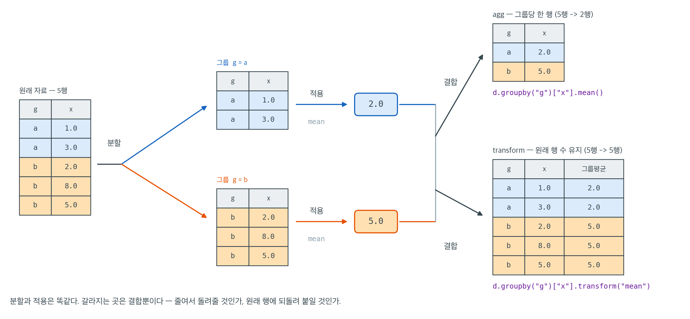

# pandas로 자료 다루기

pandas는 구조화된 자료를 불러오고, 정제하고, 변환하고, 요약하기 위한 이름표가 붙은 자료구조 — `Series`(1차원)와 `DataFrame`(2차원) — 를 제공한다. 원본 파일(CSV, parquet, SQL)과 NumPy의 배열 수준 계산이나 statsmodels·scikit-learn의 통계 모형 사이를 잇는 다리다. 이 책의 거의 모든 실증적 작업 흐름은 pandas를 임포트하는 것으로 시작해, 마지막 요약표를 그려낸 뒤에야 끝난다.

<div class="defn" markdown>

### 정의 1. Series와 DataFrame { .dfn }

**`Series`** 는 1차원의 이름표 붙은 배열, 즉 값과 인덱스의 조합이다. **`DataFrame`** 은 2차원 표로, 각 열이 하나의 `Series`이며 서로 자료형이 다를 수 있지만 모두 같은 행 인덱스를 공유한다. 개념적으로 DataFrame은 열들의 사전이고, 기계적으로는 각 열이 NumPy 배열로 뒷받침된다.

떠올릴 만한 심상은 NumPy 위에 얹은 SQL이다. 배열 층이 속도를 주고, 이름표 층이 통계 분석과 잘 맞는 선택·정렬·그룹화·조인·피벗 의미론을 준다.

</div>

---

## 1. 불러오기와 살펴보기

<div class="exbox" markdown>

**보기 1.** <span class="diff easy" title="쉬움"></span> 자료를 불러와 훑어보기. 결측값 두 개가 섞인 $12$행 $3$열의 표를 만들어 `head`, `shape`, `dtypes`, `describe`를 차례로 부른다.

**(1)** `describe()`가 세 열 가운데 두 열만 보이고, 그 두 열의 `count`가 $10$과 $12$로 서로 다른 까닭을 말하시오.

**(2)** 네 호출을 돌려 각각에서 무엇을 읽어야 하는지 수치와 함께 적고, 이 네 개만으로는 알 수 없는 것을 하나 들으시오.

</div>

??? success "풀이"

    **(1) 두 물음의 답은 각각 하나씩이다.**

    **열이 둘만 나오는 까닭.** `describe()`는 기본적으로 **수치형 열만** 요약한다. `treatment`는 문자열이어서 평균이나 사분위수가 정의되지 않으므로 빠진다. 범주형까지 보고 싶으면 `describe(include="all")`을 쓰면 되고, 그때는 `count`·`unique`·`top`·`freq`가 나온다.

    **`count`가 다른 까닭.** pandas의 `count`는 **결측이 아닌 값의 개수**다. `x`에 `NaN`을 두 개 심어 두었으니 $12 - 2 = 10$이고, `outcome`은 그대로 $12$다. 그러므로 `describe()`의 첫 줄만 보아도 결측이 어느 열에 몇 개 있는지 알 수 있다. 거꾸로 말하면 **`count` 줄을 건너뛰면 결측을 놓친다.** 아래의 `mean` $9.05$는 열 전체의 평균이 아니라 결측을 뺀 $10$개의 평균이다.

    **(2) 네 호출이 각각 무엇을 보이는가.**

    ```python
    """표를 만들어 크기·자료형·요약통계를 훑어보는 첫 단계를 보인다."""
    import numpy as np
    import pandas as pd

    # 실제 작업에서는 df = pd.read_csv("data.csv")로 파일을 읽는다.
    # 여기서는 결과를 바로 볼 수 있도록 작은 표를 직접 만든다.
    rng = np.random.default_rng(0)
    n = 12
    demo = pd.DataFrame({
        "treatment": rng.choice(["control", "drug"], size=n),
        "x": rng.normal(10, 2, size=n).round(2),
        "outcome": rng.normal(50, 8, size=n).round(1),
    })
    demo.loc[[2, 7], "x"] = np.nan        # 결측값 두 개를 일부러 넣는다

    print(demo.head())        # 앞 다섯 행
    print(demo.shape)         # (행 수, 열 수)
    print(demo.dtypes)        # 열마다의 자료형
    print(demo.describe().round(2))   # 개수·평균·표준편차·최솟값·사분위수·최댓값
    ```

    출력:

    ```
      treatment      x  outcome
    0      drug  12.61     53.3
    1      drug  11.89     58.3
    2      drug    NaN     49.0
    3   control   7.47     60.9
    4   control   8.75     44.7
    (12, 3)
    treatment     object
    x            float64
    outcome      float64
    dtype: object
               x  outcome
    count  10.00    12.00
    mean    9.05    50.98
    std     2.13     5.90
    min     5.35    42.60
    25%     7.77    45.90
    50%     8.83    51.30
    75%     9.90    54.28
    max    12.61    60.90
    ```

    **`head()`** 는 앞 다섯 행이다. 행 번호 $2$의 `x`가 `NaN`으로 찍혀 결측이 눈에 보인다. 다섯 행만 보여 주므로 행 $7$의 결측은 여기에 안 나온다 — **`head`로 결측을 찾으려 해서는 안 된다.**

    **`shape`** 는 `(12, 3)`, 곧 $12$행 $3$열이다. 행이 관측이고 열이 변수라는 규약을 확인하는 자리다. 이 수가 기대와 다르면 불러오기 자체가 잘못된 것이므로 더 가지 말고 멈춰야 한다.

    **`dtypes`** 에서 `treatment`는 `object`, `x`와 `outcome`은 `float64`다. 문자열 열이 `object`인 것은 pandas가 파이썬 객체를 가리키는 포인터 배열로 담기 때문이다. `x`가 `float64`인 데에는 이유가 둘 있다. 원래 값이 실수인 것이 하나고, 결측 표시 `NaN`이 **부동소수점 특수값**이라는 것이 다른 하나다. 정수 열에 `NaN`을 하나라도 넣으면 pandas는 그 열을 `float64`로 올려 버린다.

    **`describe()`** 는 수치형 두 열만 요약한다. `x`의 `count`가 $10$이라 결측 $2$개가 바로 드러난다. `mean` $9.05$와 `50%` $8.83$이 다른데, 평균이 중앙값보다 큰 쪽으로 $0.22$ 밀려 있다. `max` $12.61$이 `75%` $9.90$에서 멀리 떨어져 있어 오른쪽으로 끌린 것이다. `std` $2.13$은 **`ddof=1`** 로 계산된 표본표준편차라는 점을 기억해 두어야 한다. NumPy의 `np.std`는 기본값이 `ddof=0`이라 같은 자료에서 다른 수를 준다.

    **이 네 개가 못 보이는 것.** 분포의 모양이다. `describe()`가 주는 여섯 개의 수(최솟값·사분위수 셋·최댓값·평균)는 봉우리가 하나인지 둘인지 구별하지 못한다. 쌍봉 분포와 균등분포가 거의 같은 요약표를 낼 수 있다. 그래서 훑어보기의 다음 단계는 언제나 그림이며, 다음 쪽 **Matplotlib으로 기본 시각화하기** 의 히스토그램이 그 일을 한다.

    `read_csv`는 `parse_dates`, `dtype`, `na_values`, `usecols`, `chunksize`를 받는다. 자료 품질 문제는 대부분 나중이 아니라 불러오는 시점에 처리하는 것이 가장 좋다.

---

## 2. 행과 열 선택하기

반드시 구별해야 할 서로 독립적인 연산이 셋 있다.

| 형태 | 의미 |
|---|---|
| `df["col"]`, `df[["col1", "col2"]]` | 이름표로 열 선택 |
| `df.loc[row_label, col_label]` | 두 축 모두 이름표 기반 |
| `df.iloc[row_pos, col_pos]` | 두 축 모두 정수 위치 기반 |
| `df[df["x"] > 5]` | 어떤 열에 대한 불리언 행 필터 |

`loc`과 `iloc`은 행 인덱스가 기본값 `0, 1, 2, ...`가 아닐 때 정확히 갈린다. 인덱스를 정렬했거나 설정했거나 걸러낸 뒤에는 언제나 명시적인 형태를 쓰라.

---

## 3. 결측값 정제

<div class="exbox" markdown>

**보기 2.** <span class="diff easy" title="쉬움"></span> 결측값 세고 메우기. 보기 1 의 `demo`에서 `x`의 결측 두 개를 중앙값으로 메운다.

**(1)** `dropna()`와 `dropna(subset=["x"])`가 둘 다 $10$을 주는 까닭을 말하시오.

**(2)** 관측된 값이 $n_0$개이고 표본표준편차가 $s_0$일 때 결측 $k$개를 중앙값 $m$으로 메우면 표본표준편차와 평균의 표준오차가 어떻게 바뀌는지 식으로 적고, 이 자료에서 그 값을 계산해 코드와 맞추시오.

</div>

??? success "풀이"

    **(1)** 두 호출이 같은 수를 주는 것은 **결측이 `x` 열에만 있기 때문**이다. `isna().sum()`이 `treatment` $0$, `x` $2$, `outcome` $0$을 주었으니, "어느 열이든 결측이 있는 행"과 "`x`에 결측이 있는 행"이 같은 두 행(인덱스 $2$와 $7$)이고 둘 다 $12 - 2 = 10$을 남긴다. 결측이 여러 열에 흩어져 있으면 두 수가 갈린다. `dropna()`는 열이 늘어날수록 더 많이 버리므로, 쓰지도 않을 열의 결측 때문에 자료가 깎이는 일이 흔하다. **분석에 쓸 열만 `subset`에 적는 습관이 안전하다.**

    **(2) 해석적으로.** 관측된 $n_0$개의 평균을 $\bar x_0$, 표본표준편차를 $s_0$라 하고 결측 $k$개를 모두 상수 $m$으로 메운다. 메운 뒤의 평균은 두 덩어리의 가중평균이다.

    $$
    \bar x_{\text{new}} = \frac{n_0 \bar x_0 + k m}{n_0 + k}
    $$

    제곱합은 평균을 옮긴 만큼을 보정해 두 덩어리로 쪼갠다.

    $$
    \mathrm{SS}_{\text{new}} = (n_0 - 1)s_0^2 + n_0(\bar x_0 - \bar x_{\text{new}})^2 + k(m - \bar x_{\text{new}})^2
    $$

    이고, `ddof=1`이므로

    $$
    s_{\text{new}} = \sqrt{\frac{\mathrm{SS}_{\text{new}}}{n_0 + k - 1}}, \qquad \mathrm{SE}_{\text{new}} = \frac{s_{\text{new}}}{\sqrt{n_0 + k}}
    $$

    이다. 여기서 $n_0 = 10$, $k = 2$, $\bar x_0 = 9.0480$, $s_0 = 2.1299$, $m = 8.83$을 넣으면

    $$
    \bar x_{\text{new}} = \frac{10(9.0480) + 2(8.83)}{12} = 9.0117
    $$

    이고

    $$
    \mathrm{SS}_{\text{new}} = 9(2.1299)^2 + 10(0.0363)^2 + 2(0.1817)^2 = 40.830 + 0.013 + 0.066 = 40.909
    $$

    이므로 $s_{\text{new}} = \sqrt{40.909/11} = 1.9285$, $\mathrm{SE}_{\text{new}} = 1.9285/\sqrt{12} = 0.5567$이다.

    **두 변화의 방향이 식에 그대로 적혀 있다.** 메우는 값 $m$이 중앙값이라 $\bar x_{\text{new}}$에 가까우므로 셋째 항 $k(m - \bar x_{\text{new}})^2$이 거의 $0$이다. 분자는 거의 그대로인데 분모가 $n_0 - 1 = 9$에서 $n_0 + k - 1 = 11$로 커지니 $s$는 줄어든다. 표준오차는 거기에 $\sqrt{n}$이 $\sqrt{10}$에서 $\sqrt{12}$로 커지는 효과가 겹쳐 두 배로 줄어든다. **없는 정보를 메워 넣었는데 정밀도가 올라간 것처럼 보이는 것이 상수 대체의 근본 문제다.**

    **수치적으로.**

    ```python
    print(demo.isna().sum())              # 열마다 결측이 몇 개인지
    print(len(demo.dropna()))             # 결측이 하나라도 있는 행을 버린다
    print(len(demo.dropna(subset=["x"]))) # x 의 결측만 기준으로 버린다

    # 중앙값으로 메우면 평균보다 이상치에 덜 흔들린다. 다만 메운 값에는
    # 불확실성이 없는 것처럼 되므로 이후 표준오차가 과소추정된다.
    filled = demo.fillna(demo.median(numeric_only=True))
    print(filled["x"].isna().sum(), filled["x"].median())

    # 메우기가 퍼짐에 무슨 일을 하는지 수로 본다.
    print(f"메우기 전: n = {demo['x'].count()}, 평균 = {demo['x'].mean():.4f}, "
          f"s = {demo['x'].std():.4f}, SE = {demo['x'].sem():.4f}")
    print(f"메운  뒤: n = {filled['x'].count()}, 평균 = {filled['x'].mean():.4f}, "
          f"s = {filled['x'].std():.4f}, SE = {filled['x'].sem():.4f}")
    ```

    출력:

    ```
    treatment    0
    x            2
    outcome      0
    dtype: int64
    10
    10
    0 8.83
    메우기 전: n = 10, 평균 = 9.0480, s = 2.1299, SE = 0.6735
    메운  뒤: n = 12, 평균 = 9.0117, s = 1.9285, SE = 0.5567
    ```

    손으로 구한 $\bar x_{\text{new}} = 9.0117$, $s_{\text{new}} = 1.9285$, $\mathrm{SE}_{\text{new}} = 0.5567$이 코드가 준 값과 소수 넷째 자리까지 같다. 표준편차는 $9.5\%$, 표준오차는 $17.3\%$ 줄었다. **자료는 한 조각도 늘지 않았는데 신뢰구간은 $17\%$ 좁아진다.** 메운 값을 관측값과 똑같이 취급한 대가이며, 다중대체가 대체마다의 변동을 따로 더해 주는 이유가 바로 이것이다.

    "옳은" 대체 전략이란 없다. 무엇을 고를지(삭제, 평균, 중앙값, 모형 기반, 다중대체)는 결측 기제에 달려 있다. pandas는 도구를 줄 뿐 결정은 사용자에게 맡긴다.

---

## 4. 그룹화: 분할–적용–결합

pandas에서 가장 강력한 하나의 패턴이다.

<div class="exbox" markdown>

**보기 3.** <span class="diff easy" title="쉬움"></span> 집단별 요약 — 분할·적용·결합. 보기 1 의 `demo`를 `treatment`로 나누어 `outcome`의 개수·평균·표준편차를 구한다.

**(1)** 두 집단의 평균 차이가 영과 구별되는 크기인지, 표에 나온 개수와 표준편차만으로 판단하시오. 보기 1 의 생성 코드를 보면 참값은 무엇인가?

**(2)** 같은 `groupby`에 `agg`를 걸 때와 `transform`을 걸 때 결과의 행 수가 어떻게 달라지는지 확인하고, 그 차이가 어디서 오는지 말하시오.

</div>

??? success "풀이"

    **(1) 참값은 영이다.** 보기 1 에서 `outcome`은 `rng.normal(50, 8, size=n)`으로 만들었고 `treatment`를 전혀 참조하지 않았다. 두 집단이 같은 $N(50, 8^2)$에서 나왔으므로 **참 차이는 정확히 $0$** 이고, 표에 보이는 차이는 전부 표집에 의한 흔들림이다.

    그것이 눈에 보이는지 재어 보자. 두 독립표본 평균 차이의 표준오차는

    $$
    \mathrm{SE}(\bar y_1 - \bar y_2) = \sqrt{\frac{s_1^2}{n_1} + \frac{s_2^2}{n_2}}
    $$

    이고, 표의 수를 넣으면

    $$
    \mathrm{SE} = \sqrt{\frac{6.69^2}{6} + \frac{5.52^2}{6}} = \sqrt{7.459 + 5.078} = \sqrt{12.538} = 3.54
    $$

    다. 차이는 $51.75 - 50.22 = 1.53$이므로 표준오차의 $0.43$배에 지나지 않는다. **차이가 그 자신의 표준오차의 절반도 안 되니 영과 구별할 수 없다.** 집단당 $6$개로는 $8$이라는 표준편차에 묻힌 차이를 볼 수 없다는 뜻이고, 실제로 볼 것이 없는 것이 맞다.

    `groupby`가 주는 표는 이렇게 **차이를 보여 주면서 그 차이의 불확실성은 보여 주지 않는다.** `count`와 `std`가 같은 표에 들어 있는 것이 다행인데, 그 두 수가 없으면 $1.53$을 발견으로 착각하기 쉽다.

    **(2)** `agg`는 그룹당 한 행으로 줄이므로 행 수가 $12$에서 그룹 수 $2$로 줄고 그룹 키가 인덱스가 된다. `transform`은 그룹 통계량을 그 그룹에 속했던 모든 행에 되돌려 붙이므로 행 수와 행 순서가 원래 그대로 $12$다. 그래서 `transform`의 결과만 원래 표에 열로 바로 대입할 수 있다.

    ```python
    # 분할(treatment 로 나누고) — 적용(집계 함수를 걸고) — 결합(하나의 표로 모은다)
    summary = demo.groupby("treatment")["outcome"].agg(["count", "mean", "std"]).round(2)
    print(summary)

    # 두 집단 평균의 차이를 그 표준오차와 견주어 본다.
    diff = summary.loc["control", "mean"] - summary.loc["drug", "mean"]
    se = np.sqrt(summary.loc["control", "std"] ** 2 / 6 + summary.loc["drug", "std"] ** 2 / 6)
    print(f"차이 = {diff:.2f}, SE = {se:.2f}, 차이/SE = {diff / se:.2f}")

    # agg 는 그룹당 한 행으로 줄이고, transform 은 원래 행 수를 그대로 돌려준다.
    centered = demo["outcome"] - demo.groupby("treatment")["outcome"].transform("mean")
    print(f"agg 행 수 = {len(summary)}, transform 행 수 = {len(centered)}, 원래 행 수 = {len(demo)}")

    # 행 수가 같으니 transform 결과는 원래 표에 열로 바로 붙는다.
    print(demo.assign(centered=centered.round(2))[["treatment", "outcome", "centered"]].head(3))
    ```

    출력:

    ```
               count   mean   std
    treatment
    control        6  51.75  6.69
    drug           6  50.22  5.52
    차이 = 1.53, SE = 3.54, 차이/SE = 0.43
    agg 행 수 = 2, transform 행 수 = 12, 원래 행 수 = 12
      treatment  outcome  centered
    0      drug     53.3      3.08
    1      drug     58.3      8.08
    2      drug     49.0     -1.22
    ```

    손으로 구한 $\mathrm{SE} = 3.54$와 차이/SE $= 0.43$이 코드와 같다. 행 수는 $2$ 대 $12$로 갈린다. `centered` 열의 첫 세 값은 `drug` 집단의 평균 $50.22$를 뺀 것이어서 $53.3 - 50.22 = 3.08$, $58.3 - 50.22 = 8.08$, $49.0 - 50.22 = -1.22$가 맞다.

    `groupby`는 `"treatment"`의 서로 다른 값에 따라 자료를 분할하고, 각 그룹 안에서 `"outcome"`에 지정된 집계를 적용한 뒤, 결과를 깔끔한 DataFrame으로 결합한다. 탐색적 분석과 확증적 분석의 일꾼이다. 여러 키(`groupby(["a", "b"])`)와 사용자 정의 집계(`agg(my_func)`)로 이 패턴을 일반화할 수 있다.



그림은 `groupby`가 실제로 무엇을 하는지를 세 단계로 펼쳐 놓은 것이다. 분할은 키 열의 값이 같은 행끼리 자료를 나눈다(여기서는 `g`가 `a`인 두 행과 `b`인 세 행). 적용은 나뉜 조각 하나하나에 같은 함수를 건다. 조각마다 값이 하나씩 나오므로 이 단계가 끝나면 그룹 수만큼의 결과가 남는다. 결합은 그 결과들을 다시 하나의 자료구조로 모은다. `groupby` 자체는 아무것도 계산하지 않고 분할 계획만 들고 있다가, 뒤에 붙는 집계 호출을 만나서야 적용과 결합을 수행한다.

눈여겨볼 곳은 세 번째 단계다. 분할도 적용도 똑같은데 결합이 두 갈래로 갈린다. `agg`는 그룹당 한 행으로 줄여 돌려주므로 행 수가 5에서 2로 줄고 그룹 키가 결과의 인덱스가 된다. `transform`은 그룹 통계량을 그 그룹에 속했던 모든 행에 되돌려 붙이므로 행 수와 행 순서가 원래 자료 그대로다. 그래서 `transform`의 결과는 원래 DataFrame에 열로 바로 대입할 수 있고, `agg`의 결과는 그럴 수 없다.

이 구분이 초보자가 가장 자주 막히는 자리다. "집단별 평균을 구하라"는 요약표를 원하는 것이므로 `agg`이지만, "각 값을 자기 집단의 평균으로부터의 편차로 바꾸라"는 원래 자료를 그대로 둔 채 열 하나를 더 얻고 싶은 것이므로 `transform`이다. 집단 내 표준화, 집단 평균으로 결측 메우기, 집단별 순위 매기기가 모두 뒤쪽에 속한다. **결과의 행 수가 원래와 같아야 하는지를 먼저 묻고 나서 둘 중 하나를 고르면 틀리지 않는다.** 연습문제 8에서 두 형태를 나란히 놓고 다시 확인한다.

---

## 5. 기술통계와 공식의 대응

| pandas 호출 | 계산하는 것 | ddof 기본값 |
|---|---|---|
| `df["x"].mean()` | $\bar{x}$ | 해당 없음 |
| `df["x"].var()` | $s^2$ | **`ddof=1`** |
| `df["x"].std()` | $s$ | **`ddof=1`** |
| `df["x"].quantile(0.5)` | 표본 중앙값 | 해당 없음 |
| `df.corr()` | 피어슨 상관행렬 | 해당 없음 |
| `df.cov()` | 표본 공분산행렬 | `ddof=1` |

기본값이 `ddof=0`인 NumPy와 다르다는 점에 유의하라. pandas와 NumPy의 결과가 $(n-1)/n$배만큼 어긋난다면 이유는 바로 이것이다.

<div class="exbox" markdown>

**보기 4.** <span class="diff easy" title="쉬움"></span> 요약통계가 이론값을 재현하는지 보기. `value`를 $N(50, 10^2)$에서, `score`를 $\{0, \ldots, 99\}$의 균등분포에서 서로 독립으로 $200$개씩 뽑는다. `group`은 `A`, `B`, `C` 중에서 균등하게 고른다.

**(1)** `value`가 $60$을 넘는 관측이 몇 개쯤 나오겠는가? 집단별 평균이 $50$에서 벗어나는 폭의 표준오차는 얼마인가? 두 열의 참 상관은 얼마인가? 코드를 돌리기 전에 세 수를 적으시오.

**(2)** 돌려서 (1)의 예측과 맞춰 보고, 피벗표에 보이는 추세 가운데 실제인 것과 잡음인 것을 가르시오.

</div>

??? success "풀이"

    **(1) 세 수를 미리 적는다.**

    **$60$ 초과 개수.** $X \sim N(50, 10^2)$이면 $60$은 평균에서 정확히 표준편차 하나 위다.

    $$
    P(X > 60) = P\!\left(Z > \frac{60 - 50}{10}\right) = P(Z > 1) = 0.158655
    $$

    이므로 $200$개 중 기대 개수는 $200 \times 0.158655 = 31.7$개다. 개수는 $\text{Binomial}(200, 0.1587)$을 따르므로 표준편차가 $\sqrt{200(0.1587)(0.8413)} = 5.2$이고, 대략 $26$에서 $37$ 사이면 놀랄 일이 아니다.

    **집단 평균의 표준오차.** 집단 $g$에 $n_g$개가 들어갔다면 $\mathrm{SE} = \sigma/\sqrt{n_g} = 10/\sqrt{n_g}$다. 집단 크기는 $200/3 = 66.7$ 근처일 테니 $\mathrm{SE} \approx 10/\sqrt{66.7} = 1.22$다. 집단 평균이 $50$에서 $1$에서 $2$쯤 벗어나는 것은 정상이다.

    **참 상관.** `value`와 `score`를 같은 생성기에서 뽑되 서로 참조하지 않았으므로 **독립이고 참 상관은 $0$** 이다. 표본상관의 표준편차는 $n$이 클 때 $1/\sqrt{n-1} = 1/\sqrt{199} = 0.071$ 정도이므로, $|r|$이 $0.14$ 안쪽이면 영과 구별되지 않는다.

    **(2) 수치적으로.**

    ```python
    import math

    import numpy as np
    import pandas as pd

    rng = np.random.default_rng(42)

    # 범주형과 수치형을 섞은 자료틀을 만든다
    df = pd.DataFrame({
        "group": rng.choice(["A", "B", "C"], size=200),
        "value": rng.normal(50, 10, size=200),
        "score": rng.integers(0, 100, size=200),
    })

    # 집단별 요약
    summary = df.groupby("group")["value"].agg(["count", "mean", "std"]).round(2)
    print(summary)

    # 집단 평균이 참값 50 에서 벗어난 폭을 표준오차 10/sqrt(n) 로 나누어 본다.
    z = (summary["mean"] - 50) / (10 / np.sqrt(summary["count"]))
    print("\n(집단평균 - 50) / SE:")
    print(z.round(2))

    # 불리언으로 걸러내기. P(X > 60) = P(Z > 1) 이므로 기대 개수를 함께 적는다.
    high = df[df["value"] > 60]
    p_tail = math.erfc(1 / math.sqrt(2)) / 2
    print(f"\n60 초과: {len(high)} / {len(df)}  (이론 기대 {200 * p_tail:.1f})")

    # 수치형 열 사이의 상관. 두 열을 독립으로 만들었으므로 참 상관은 0 이다.
    print("\n상관행렬:")
    print(df.corr(numeric_only=True).round(3))
    r = df["value"].corr(df["score"])
    t = r * np.sqrt((len(df) - 2) / (1 - r ** 2))
    print(f"r = {r:.3f},  t = {t:.2f}  (자유도 198)")

    # 피벗: 집단과 점수 사분위별 평균
    df["score_q"] = pd.qcut(df["score"], 4, labels=["Q1", "Q2", "Q3", "Q4"])
    print("\n피벗 — 칸마다의 평균:")
    print(df.pivot_table(values="value", index="group", columns="score_q",
                         aggfunc="mean", observed=False).round(1))
    print("\n피벗 — 칸마다의 개수:")
    print(df.pivot_table(values="value", index="group", columns="score_q",
                         aggfunc="count", observed=False))
    ```

    출력:

    ```
           count   mean    std
    group
    A         58  50.17  10.20
    B         72  49.72   9.83
    C         70  49.24   9.98

    (집단평균 - 50) / SE:
    group
    A    0.13
    B   -0.24
    C   -0.64
    dtype: float64

    60 초과: 31 / 200  (이론 기대 31.7)

    상관행렬:
           value  score
    value  1.000 -0.111
    score -0.111  1.000
    r = -0.111,  t = -1.56  (자유도 198)

    피벗 — 칸마다의 평균:
    score_q    Q1    Q2    Q3    Q4
    group
    A        55.4  50.1  48.6  46.9
    B        50.5  53.6  48.0  48.0
    C        48.8  48.0  50.1  50.0

    피벗 — 칸마다의 개수:
    score_q  Q1  Q2  Q3  Q4
    group
    A        12  19  16  11
    B        23  12  19  18
    C        15  19  16  20
    ```

    **세 예측이 모두 맞는다.** $60$ 초과가 $31$개로 이론 기대 $31.7$개와 거의 같다(표준편차 $5.2$ 안쪽이니 둘을 구별할 수 없다). 집단별 표본표준편차 $10.20$, $9.83$, $9.98$이 참값 $\sigma = 10$을 둘러싸고 있고, 집단 평균이 $50$에서 벗어난 폭을 표준오차로 나누면 $0.13$, $-0.24$, $-0.64$로 셋 다 $1$ 안쪽이다. 상관은 $r = -0.111$, $t = -1.56$(자유도 $198$, 양쪽 $p$ 값 $0.12$)로 **영과 구별되지 않는다.** 참 상관이 $0$인 것을 알고 있으므로 이것이 옳은 결론이다.

    **피벗표의 추세는 전부 잡음이다.** 집단 `A`의 행이 $55.4 \to 50.1 \to 48.6 \to 46.9$로 깔끔하게 내려가 "점수가 높을수록 `value`가 낮다"는 이야기로 읽히기 쉽다. 그러나 `value`와 `score`는 독립으로 만들었으니 **그런 추세는 존재하지 않는다.** 개수 표를 함께 보면 까닭이 보인다. `A` 행의 네 칸에 $12$, $19$, $16$, $11$개씩만 들어 있어 칸 평균의 표준오차가 $10/\sqrt{11} = 3.0$에서 $10/\sqrt{19} = 2.3$에 이른다. 네 칸을 그만큼의 오차로 흔들면 단조로워 보이는 배열이 적잖이 나온다. 집단 `C`의 행($48.8$, $48.0$, $50.1$, $50.0$)은 반대로 올라가는 듯 보이는데, 두 행의 모양이 어긋난다는 것 자체가 추세가 아니라 잡음이라는 증거다.

    **피벗표는 칸의 개수를 숨긴다.** `aggfunc="mean"` 한 번만 부르면 각 수가 몇 개로 지어진 것인지 알 수 없고, $12$개의 평균과 $23$개의 평균이 같은 꼴로 나란히 찍힌다. **피벗표를 믿으려면 같은 피벗을 `aggfunc="count"`로 한 번 더 불러 보아야 한다.** `200`개를 $3 \times 4 = 12$칸으로 쪼개면 칸마다 $17$개 정도가 남는데, 이 정도 표본에서 칸 평균을 비교하는 것은 애초에 무리다.

---

## 연습문제

<div class="drillbox" markdown>

**연습문제 1.** <span class="diff easy" title="쉬움"></span>
학생 다섯 명에 대해 `name`(문자열), `score`(정수), `passed`(불리언) 열을 갖는 `DataFrame`을 만들어라. `passed`가 `True`이고 **또한** `score`가 80보다 큰 행만 보이도록 걸러라.

</div>

??? success "풀이"
    ```python
    import pandas as pd
    df = pd.DataFrame({
        "name":   ["Alice", "Bob", "Carol", "Dave", "Eve"],
        "score":  [92, 65, 88, 73, 95],
        "passed": [True, False, True, False, True],
    })
    print(df[df["passed"] & (df["score"] > 80)])
    ```

    출력:

    ```
        name  score  passed
    0  Alice     92    True
    2  Carol     88    True
    4    Eve     95    True
    ```
    피연산자가 파이썬 스칼라가 아니라 pandas 불리언 Series이므로 `and`가 아니라 비트 연산자 `&`를 써야 한다. 각 비교식은 괄호로 묶어라. 연산자 우선순위상 `&`가 `>`보다 높기 때문이다.

---

<div class="drillbox" markdown>

**연습문제 2.** <span class="diff easy" title="쉬움"></span>
다음 DataFrame이 주어졌을 때
```python
df = pd.DataFrame({"group": ["A","A","B","B","B"], "x": [1, 3, 2, 8, 5]})
```
각 그룹에 대해 개수, 표본평균, 표본분산, 그리고 최댓값에서 최솟값을 뺀 값을 계산하라. 하나의 DataFrame으로 반환하라.

</div>

??? success "풀이"
    ```python
    summary = df.groupby("group")["x"].agg(
        n="count",
        mean="mean",
        var="var",
        range=lambda s: s.max() - s.min(),
    )
    print(summary)
    ```

    출력:

    ```
           n  mean  var  range
    group
    A      2   2.0  2.0      2
    B      3   5.0  9.0      6
    ```
    `agg`는 출력 열 이름을 문자열 집계 이름이나 호출 가능 객체에 대응시키는 키워드 인수를 받는다. 람다를 쓰면 이름 있는 함수를 따로 정의하지 않고 "범위"를 하나의 표현식으로 나타낼 수 있다.

---

<div class="drillbox" markdown>

**연습문제 3.** <span class="diff easy" title="쉬움"></span>
`df.loc[]`과 `df.iloc[]`의 차이를 설명하라. 같은 DataFrame에 대해 둘이 서로 다른 행을 반환하는 예를 제시하라.

</div>

??? success "풀이"
    `loc`은 **이름표 기반**이다. `df.loc[0]`은 인덱스 이름표가 `0`인 행을 반환한다. `iloc`은 **정수 위치 기반**이다. `df.iloc[0]`은 인덱스 이름표와 무관하게 첫 번째 행을 반환한다.

    ```python
    df = pd.DataFrame({"A": [10, 20, 30]}, index=[2, 0, 1])
    print(df.loc[0])    # row labeled 0   → A = 20
    print(df.iloc[0])   # row at position 0 → A = 10
    ```

    출력:

    ```
    A    20
    Name: 0, dtype: int64
    A    10
    Name: 2, dtype: int64
    ```

    인덱스가 (기본값인) `RangeIndex(0, n)`이고 행 순서가 바뀌지 않았다면 둘은 일치한다. `df.sort_values()`, `df.set_index()`, 불리언 필터링을 거치고 나면 둘이 갈라지며, 이 둘을 조용히 혼동하는 것이 흔한 버그의 원천이다.

---

<div class="drillbox" markdown>

**연습문제 4.** <span class="diff easy" title="쉬움"></span>
`pd.Series.var()`의 기본값은 `ddof=1`이고 NumPy의 `np.var()`는 `ddof=0`이다. 값 다섯 개짜리 Series를 만들어 두 방식으로 분산을 계산하고, 어느 쪽이 불편추정량이며 그 이유가 무엇인지 설명하라.

</div>

??? success "풀이"
    ```python
    import numpy as np
    import pandas as pd
    s = pd.Series([2, 4, 4, 4, 5])
    print("pandas s.var()  :", s.var())            # ddof=1, divides by n-1=4
    print("numpy  np.var() :", np.var(s.values))   # ddof=0, divides by n=5
    ```

    출력:

    ```
    pandas s.var()  : 1.2
    numpy  np.var() : 0.96
    ```

    `ddof=1`이면 $S^2 = \frac{1}{n-1}\sum(x_i - \bar x)^2$이 불편이다: $\mathbb{E}[S^2] = \sigma^2$. `ddof=0`이면 $\tilde S^2 = \frac{1}{n}\sum(x_i - \bar x)^2$인데, 이는 정규 자료에 대한 **최대가능도** 분산이지만 $(n-1)/n$배만큼 아래로 편향된다. 두 라이브러리의 기본값이 서로 반대라는 점은 늘 혼란의 원천이므로, 어느 쪽이 쓰이고 있는지 항상 확인하라.

---

<div class="drillbox" markdown>

**연습문제 5.** <span class="diff med" title="중간"></span>
다음 CSV 형식 문자열을 불러와 결측값을 열 중앙값으로 채우고 상관행렬을 계산하라.

```text
x,y,z
1.0,2.0,3.0
2.0,,4.0
3.0,6.0,
4.0,8.0,6.0
5.0,10.0,7.0
```

</div>

??? success "풀이"
    ```python
    from io import StringIO
    csv = """x,y,z
    1.0,2.0,3.0
    2.0,,4.0
    3.0,6.0,
    4.0,8.0,6.0
    5.0,10.0,7.0"""

    df = pd.read_csv(StringIO(csv))
    df = df.fillna(df.median(numeric_only=True))
    print(df.corr().round(3))
    ```

    출력:

    ```
           x      y      z
    x  1.000  0.906  1.000
    y  0.906  1.000  0.906
    z  1.000  0.906  1.000
    ```

    중앙값 대체는 평균 대체보다 이상치에 강건하지만, 결측이 정보를 담고 있을 때는 여전히 분산과 상관을 왜곡한다. 실제 분석에서는 모형 기반 대체나 다중대체가 낫다. 결측 기제(MCAR·MAR·MNAR)와 그에 따른 처리는 1.4절 "편향과 무응답"과 7.1절에서 다룬다.

---

<div class="drillbox" markdown>

**연습문제 6.** <span class="diff med" title="중간"></span>
두 DataFrame을 `df1.merge(df2, on="id", how="left")`로 조인한다. `how="left"`가 무엇을 하는지, 결과의 행 수를 무엇이 결정하는지, 그리고 병합 직후에 반드시 실행해야 할 진단 하나를 설명하라.

</div>

??? success "풀이"
    `how="left"`는 `df1`의 모든 행을 남기고 `id`를 기준으로 `df2`의 대응되는 열을 붙인다. `df2`에 대응이 없는 `df1`의 행은 새 열에 `NaN`이 들어간다. `df1`에 대응이 없는 `df2`의 행은 버려진다.

    출력 행 수가 `df1`의 행 수와 같아지는 것은 `df2`에서 `id`가 유일할 **때에 한해서**다. `df2`에서 `id`가 반복되면 `df1`의 각 행이 여러 `df2` 행과 대응되어 결과의 행 수가 `df1`보다 많아진다. 흔히 겪는 뜻밖의 일이다.

    병합 직후 실행할 진단:

    ```python
    import pandas as pd

    df1 = pd.DataFrame({"id": [1, 2, 3, 4], "x": [10, 20, 30, 40]})
    df2 = pd.DataFrame({"id": [2, 3, 5], "y": ["b", "c", "e"]})

    assert df2["id"].is_unique, "right-side join key not unique — row count will inflate"
    merged = df1.merge(df2, on="id", how="left", indicator=True)
    print(merged)
    print(merged["_merge"].value_counts())   # left_only / both / right_only
    ```

    출력:

    ```
       id   x    y     _merge
    0   1  10  NaN  left_only
    1   2  20    b       both
    2   3  30    c       both
    3   4  40  NaN  left_only
    _merge
    left_only     2
    both          2
    right_only    0
    Name: count, dtype: int64
    ```

    `indicator=True` 플래그는 각 행이 어디서 왔는지 알려주는 `_merge` 열을 추가하여, 조용히 실패한 조인을 드러낸다.

---

<div class="drillbox" markdown>

**연습문제 7.** <span class="diff med" title="중간"></span>
`SettingWithCopyWarning`은 pandas에서 가장 자주 마주치면서 가장 자주 무시되는 경고다. 이 경고를 재현하고, 무엇을 경고하는 것인지 설명하고, 올바른 대안을 제시하라.

</div>

??? success "풀이"
    ```python
    import pandas as pd
    import warnings

    df = pd.DataFrame({"g": ["a", "a", "b"], "x": [1., 2., 3.]})

    with warnings.catch_warnings(record=True) as caught:
        warnings.simplefilter("always")
        sub = df[df.g == "a"]        # 걸러낸 결과 — 복사본일 수도, 뷰일 수도
        sub["x"] = 0                 # 여기서 경고
        print("발생한 경고:", [w.category.__name__ for w in caught])

    print("\n원본은 바뀌지 않았다:")
    print(df.to_string(index=False))
    ```

    출력:

    ```
    발생한 경고: ['SettingWithCopyWarning']

    원본은 바뀌지 않았다:
    g   x
    a 1.0
    a 2.0
    b 3.0
    ```

    **무엇을 경고하는가.** `df[df.g == "a"]`가 복사본을 돌려줄지 뷰를 돌려줄지 pandas 자신도 확실히 말할 수 없다. 따라서 `sub["x"] = 0`이 원본 `df`까지 바꿀지 아닐지가 정해져 있지 않다. 경고는 "이 대입이 의도한 곳에 갔는지 나는 모른다"는 뜻이다.

    위 실행에서는 원본이 그대로였지만, **그 결과에 의존해서는 안 된다.** 같은 코드가 다른 자료 모양이나 다른 pandas 버전에서 반대로 동작할 수 있다.

    **올바른 대안 두 가지.** 무엇을 하려는지에 따라 갈린다.

    ```python
    import pandas as pd

    df = pd.DataFrame({"g": ["a", "a", "b"], "x": [1., 2., 3.]})

    # (1) 원본을 정말로 고치려는 경우 — .loc 으로 한 번에
    df.loc[df.g == "a", "x"] = 0
    print("원본을 고친 경우:")
    print(df.to_string(index=False))

    # (2) 부분집합만 따로 다루려는 경우 — 복사본임을 명시
    df2 = pd.DataFrame({"g": ["a", "a", "b"], "x": [1., 2., 3.]})
    sub = df2[df2.g == "a"].copy()
    sub["x"] = 0
    print("\n복사본을 고친 경우 — 원본은 그대로:")
    print(df2.to_string(index=False))
    ```

    출력:

    ```
    원본을 고친 경우:
    g   x
    a 0.0
    a 0.0
    b 3.0

    복사본을 고친 경우 — 원본은 그대로:
    g   x
    a 1.0
    a 2.0
    b 3.0
    ```

    규칙은 간단하다. **연쇄 대입(`df[...][...] = ...`)을 쓰지 마라.** 원본을 고치려면 `.loc[행조건, 열] = 값` 한 번으로 끝내고, 부분집합을 따로 가지고 놀 것이라면 `.copy()`를 명시하라.

    이것은 앞 절 NumPy 연습문제의 뷰/복사본 문제와 정확히 같은 구조다. 다만 pandas는 어느 쪽인지조차 보장하지 않아 한 겹 더 나쁘다. (pandas 3.0의 Copy-on-Write 방식은 "언제나 복사본처럼 동작한다"로 규칙을 통일해 이 모호함을 없앤다.) $\square$

---

<div class="drillbox" markdown>

**연습문제 8.** <span class="diff med" title="중간"></span>
`groupby`로 심슨의 역설을 재현하라. 두 치료법의 성공률을 층별로, 그리고 전체로 계산하고 왜 순서가 뒤집히는지 설명하라. `transform`과 `agg`의 차이도 함께 보여라.

</div>

??? success "풀이"
    ```python
    import pandas as pd

    df = pd.DataFrame(
        [("A", "작은 결석",  81,  87),
         ("A", "큰 결석",   192, 263),
         ("B", "작은 결석", 234, 270),
         ("B", "큰 결석",    55,  80)],
        columns=["치료법", "결석 크기", "성공", "전체"])
    df["성공률"] = df["성공"] / df["전체"]

    print("층별 성공률")
    print(df.to_string(index=False))

    total = df.groupby("치료법")[["성공", "전체"]].sum()
    total["성공률"] = total["성공"] / total["전체"]
    print("\n전체 성공률")
    print(total.to_string())
    ```

    출력:

    ```
    층별 성공률
    치료법 결석 크기  성공  전체      성공률
      A 작은 결석  81  87 0.931034
      A  큰 결석 192 263 0.730038
      B 작은 결석 234 270 0.866667
      B  큰 결석  55  80 0.687500

    전체 성공률
          성공   전체       성공률
    치료법
    A    273  350  0.780000
    B    289  350  0.825714
    ```

    **역설.** 치료법 A가 작은 결석에서도($93.1\%$ 대 $86.7\%$), 큰 결석에서도($73.0\%$ 대 $68.8\%$) 더 낫다. 그런데 전체를 합치면 A가 $78.0\%$로 B의 $82.6\%$보다 나쁘다.

    **왜 뒤집히는가.** 층에 따라 성공률 자체가 크게 다르고(작은 결석이 훨씬 잘 낫는다), 두 치료법이 **층에 배정된 비율이 정반대**이기 때문이다. A는 환자의 $75\%$가 어려운 큰 결석이고, B는 $77\%$가 쉬운 작은 결석이다. 전체 성공률은 층별 성공률의 가중평균인데, 그 **가중치가 치료법마다 다르다.**

    실제 자료에서 이런 배정은 우연이 아니다. 의사가 심한 환자에게 더 강한 치료법 A를 쓴 것이며, 결석 크기가 **교란변수**다. 층별 비교가 옳은 비교이고 전체 비교는 오해를 부른다. 무작위배정이 하는 일이 바로 층 구성을 두 군에서 같게 만드는 것이다.

    **`agg` 대 `transform`.**

    ```python
    import pandas as pd

    d = pd.DataFrame({"g": list("aabbb"), "x": [1., 3., 2., 8., 5.]})

    print("agg — 그룹당 한 행:")
    print(d.groupby("g")["x"].agg(["mean", "std"]).to_string())

    d["z"] = d.groupby("g")["x"].transform(lambda s: (s - s.mean()) / s.std(ddof=1))
    print("\ntransform — 원래 행 수를 유지하며 그룹별로 표준화:")
    print(d.to_string(index=False))
    ```

    출력:

    ```
    agg — 그룹당 한 행:
       mean       std
    g
    a   2.0  1.414214
    b   5.0  3.000000

    transform — 원래 행 수를 유지하며 그룹별로 표준화:
    g   x         z
    a 1.0 -0.707107
    a 3.0  0.707107
    b 2.0 -1.000000
    b 8.0  1.000000
    b 5.0  0.000000
    ```

    `agg`는 그룹을 하나의 값으로 **줄이고**($5$행 → $2$행), `transform`은 결과를 원래 행에 **되돌려 붙인다**($5$행 → $5$행). 그룹 내 표준화, 그룹 평균 대비 편차, 그룹 평균으로 결측 채우기처럼 "그룹 통계량을 원래 자료에 다시 쓰는" 작업은 모두 `transform`이다. $\square$

---

<div class="drillbox" markdown>

**연습문제 9.** <span class="diff med" title="중간"></span>
같은 자료를 넓은 형식과 긴 형식으로 오가는 방법을 보여라. 반복측정 자료를 `melt`로 긴 형식으로 바꾸고 `pivot`으로 되돌린 뒤, 통계 도구들이 왜 긴 형식을 요구하는지 설명하라.

</div>

??? success "풀이"
    ```python
    import numpy as np
    import pandas as pd

    wide = pd.DataFrame({"id": [1, 2, 3],
                         "t0": [5., 6., 7.],
                         "t1": [6., 8., 7.],
                         "t2": [9., 9., 8.]})
    print("넓은 형식 — 시점마다 열 하나")
    print(wide.to_string(index=False))

    long = wide.melt(id_vars="id", var_name="시점", value_name="측정")
    print(f"\n긴 형식 — 관측마다 행 하나  {wide.shape} → {long.shape}")
    print(long.to_string(index=False))

    back = long.pivot(index="id", columns="시점", values="측정")
    print(f"\n되돌리기 성공: {np.allclose(back.values, wide.set_index('id').values)}")
    ```

    출력:

    ```
    넓은 형식 — 시점마다 열 하나
     id  t0  t1  t2
      1 5.0 6.0 9.0
      2 6.0 8.0 9.0
      3 7.0 7.0 8.0

    긴 형식 — 관측마다 행 하나  (3, 4) → (9, 3)
     id 시점  측정
      1 t0 5.0
      2 t0 6.0
      3 t0 7.0
      1 t1 6.0
      2 t1 8.0
      3 t1 7.0
      1 t2 9.0
      2 t2 9.0
      3 t2 8.0

    되돌리기 성공: True
    ```

    **왜 긴 형식인가.** 넓은 형식에서는 "시점"이라는 변수가 **열 이름 속에 숨어** 있다. `t0`, `t1`, `t2`는 값이지 변수명이 아니다. 긴 형식에서는 시점이 값을 갖는 어엿한 열이 되므로 다음이 가능해진다.

    - `statsmodels`의 수식 표기: `측정 ~ 시점` 또는 반복측정 혼합모형 `측정 ~ 시점 + (1|id)`
    - `groupby("시점")`으로 시점별 요약
    - seaborn의 `x="시점", y="측정", hue=...` 같은 매핑

    이것이 해들리 위컴의 **정돈된 자료(tidy data)** 원칙이다. 각 변수는 하나의 열, 각 관측은 하나의 행. 통계 도구 대부분이 이 형식을 전제한다.

    넓은 형식이 유리한 곳도 있다. 사람이 표로 읽기에 좋고, 상관행렬 계산(`wide.corr()`)이나 대응표본 $t$ 검정처럼 짝지어진 열이 필요한 계산에는 넓은 형식이 자연스럽다. **분석 단계마다 필요한 형식이 다르므로 두 방향 변환을 모두 익혀 두어야 한다.**

    실무 주의사항. `pivot`은 `index`와 `columns`의 조합이 유일할 것을 요구하며, 중복이 있으면 오류를 낸다. 중복을 집계로 처리하려면 `pivot_table(aggfunc=...)`을 쓴다. 오류가 나는 쪽이 낫다. 중복이 있다는 것은 보통 자료 구조를 잘못 이해했다는 신호이기 때문이다. $\square$

---

<div class="drillbox" markdown>

**연습문제 10.** <span class="diff med" title="중간"></span>
`NaN`의 동작 방식을 정확히 파악하라. `count`, `mean`, `sum`, `groupby`가 결측을 각각 어떻게 다루는지 확인하고, 문자열 열을 `category`로 바꾸었을 때의 메모리 이득을 측정하라.

</div>

??? success "풀이"
    ```python
    import numpy as np
    import pandas as pd

    s = pd.Series([1., np.nan, 3.])
    print(f"NaN == NaN 인가: {np.nan == np.nan}")
    print(f"count {s.count()}   mean {s.mean()}   sum {s.sum()}   (결측을 건너뛴다)")
    print(f"mean(skipna=False): {s.mean(skipna=False)}")

    all_nan = pd.Series([np.nan, np.nan])
    print(f"\n전부 결측일 때  sum = {all_nan.sum()}   mean = {all_nan.mean()}")

    g = pd.DataFrame({"k": ["a", None, "a"], "v": [1., 2., 3.]})
    print(f"\ngroupby 기본값(dropna=True):\n{g.groupby('k')['v'].sum().to_string()}")
    print(f"\ngroupby(dropna=False):\n{g.groupby('k', dropna=False)['v'].sum().to_string()}")
    ```

    출력:

    ```
    NaN == NaN 인가: False
    count 2   mean 2.0   sum 4.0   (결측을 건너뛴다)
    mean(skipna=False): nan

    전부 결측일 때  sum = 0.0   mean = nan

    groupby 기본값(dropna=True):
    k
    a    4.0

    groupby(dropna=False):
    k
    a      4.0
    NaN    2.0
    ```

    **함정 세 가지.**

    첫째, `NaN != NaN`이므로 `df[df.x == np.nan]`은 **언제나 빈 결과**를 준다. 결측을 찾으려면 `df.x.isna()`를 써야 한다.

    둘째, 전부 결측인 Series의 합이 `NaN`이 아니라 **$0.0$**이다. 빈 합의 항등원이 $0$이라는 규약 때문인데, 그룹별 합계를 낼 때 "자료가 하나도 없었다"와 "합이 정말 0이다"가 구별되지 않는다. `mean`은 올바르게 `NaN`을 준다.

    셋째, `groupby`가 기본적으로 결측 키를 **말없이 버린다.** 위에서 `v = 2.0`인 행이 사라져 총합이 $6$이 아니라 $4$가 된다. 그룹 합계가 전체 합계와 안 맞는다면 이것부터 의심하라. `dropna=False`로 결측을 하나의 그룹으로 남길 수 있다.

    **메모리: `category` 자료형.**

    ```python
    import numpy as np
    import pandas as pd

    rng = np.random.default_rng(0)
    s = pd.Series(rng.choice(["서울", "부산", "대구"], 100_000))

    mb_object = s.memory_usage(deep=True) / 1e6
    mb_category = s.astype("category").memory_usage(deep=True) / 1e6
    print(f"object   {mb_object:.3f} MB")
    print(f"category {mb_category:.3f} MB   ({mb_object / mb_category:.0f}배 절약)")
    ```

    출력:

    ```
    object   7.000 MB
    category 0.100 MB   (70배 절약)
    ```

    `object` 자료형은 문자열마다 파이썬 객체 포인터를 저장하지만, `category`는 범주 목록을 한 번만 두고 나머지는 작은 정수 코드로 저장한다. 서로 다른 값의 개수가 전체 행 수보다 훨씬 적을 때 효과가 크다.

    다만 `deep=True`가 필수다. 이것 없이 재면 `object` 열은 포인터 크기만 세어 실제 사용량을 크게 과소평가한다.

    `category`는 메모리 외에 의미도 담는다. 2장에서 보듯 순서형 범주로 지정하면 크기 비교가 가능해지고, `groupby`가 관측되지 않은 범주까지 유지할 수 있다. $\square$

---

## 정리하며

pandas 는 NumPy 배열에 **이름표**를 붙인 것이다. 그 하나의 차이가 실제 자료를 다루는 일을 가능하게 만든다.

- **`Series` 와 `DataFrame`.** 값에 인덱스가 따라붙고, 열마다 자료형이 달라도 된다. 연산할 때 인덱스를 기준으로 정렬되므로 행 순서를 맞추는 실수가 줄어든다.
- **선택의 세 갈래.** 이름표면 `.loc`, 정수 위치면 `.iloc`, 조건이면 불리언 색인이다. 이 셋을 섞어 쓰다 생기는 혼동이 초보자의 오류 대부분이다.
- **결측값.** `NaN` 은 전염된다. 무엇으로 채울지, 아니면 버릴지를 **정하는 것 자체가 분석의 일부**이며 조용히 넘어가서는 안 된다.
- **분할–적용–결합.** `groupby` 한 줄이 집단별 요약을 만든다. 뒤에 나올 분산분석과 층화 분석이 모두 이 구조다.
- **`ddof` 를 확인하라.** pandas 의 `var`·`std`·`cov` 는 기본이 `ddof=1`(표본, $n-1$ 로 나눔)이고 NumPy 는 기본이 `ddof=0`(모집단, $n$ 으로 나눔)이다. **같은 자료에서 두 라이브러리가 다른 값을 준다.** 7장의 베셀 보정이 바로 이 차이를 다룬다.

다음 절 **Matplotlib으로 기본 시각화하기**는 여기까지 정리한 자료를 그림으로 옮긴다. 수를 보기 전에 그림을 보는 습관이 2장 전체의 전제다.
