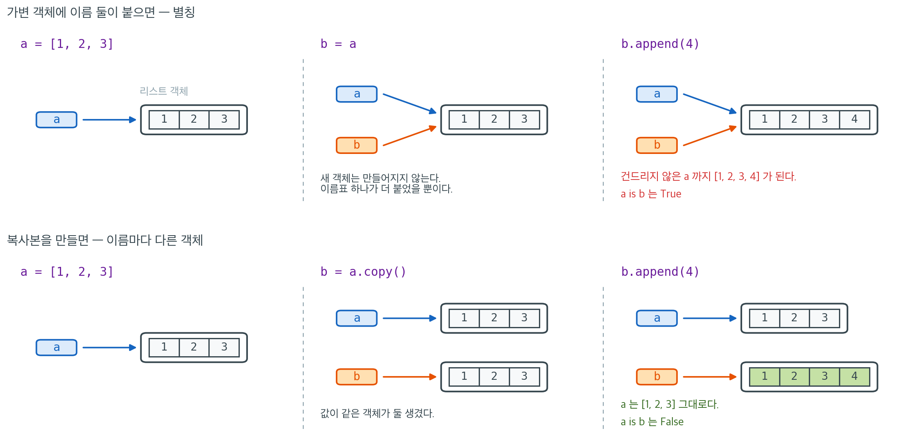

# 파이썬과 주피터 기초

## 개요

파이썬은 이 책 전체에서 사용하는 주된 계산 언어다. 세 가지 이유로 파이썬을 골랐다. 통계적 아이디어를 전면에 남겨 두는 마찰 없는 문법, 수치 라이브러리의 성숙한 생태계(NumPy, SciPy, pandas, statsmodels, scikit-learn, PyMC), 그리고 코드·출력·수식·서술이 한 문서에 함께 사는 주피터 노트북의 문예적 프로그래밍 작업 흐름이다. 이 절에서는 환경 설정, 패키지 관리, 통계 스크립트에서 가장 자주 쓰는 언어 기능, 그리고 이 책의 모든 코드 보기가 따르는 관례를 다룬다.

---

## 1. 파이썬 환경

### 이 책에서 "파이썬"이 뜻하는 것

**파이썬**은 동적 타입이고 가비지 컬렉션을 하며 인터프리터로 실행되는 언어로, 일급 함수와 "건전지 포함" 표준 라이브러리를 갖추고 있다. 통계 작업 흐름은 다음에 의존한다.

- CPython 인터프리터(3.11 이상 권장).
- 과학 스택: NumPy(배열), SciPy(알고리즘, 분포, 최적화), pandas(데이터프레임), Matplotlib(그림), statsmodels(회귀, 시계열), scikit-learn(기계학습).
- 패키지/환경 관리자: `conda`(Anaconda/Miniconda) 또는 `pip` + `venv` / `uv`.

**Anaconda** 배포판은 파이썬과 1,500개 이상의 과학 패키지, 그리고 `conda` 패키지/환경 관리자를 함께 묶어 제공하므로 처음 시작하는 사용자에게 저항이 가장 적은 길이다. **주피터 노트북**(과 그 후속인 JupyterLab)은 마크다운 서술, 파이썬 코드, 그림, LaTeX 수식이 공존하는 셀 기반 대화형 인터페이스를 제공한다.

### 재현 가능한 환경

프로젝트마다 특정 파이썬 버전과 패키지 버전을 고정해야 한다. conda를 쓴다면 다음과 같다.

```bash
conda create --name stats_env python=3.11
conda activate stats_env
conda install numpy scipy pandas matplotlib statsmodels
conda env export > environment.yml
```

`environment.yml` 파일을 형상관리에 커밋해 두면 다른 컴퓨터에서도 분석을 재현할 수 있다.

---

## 2. 내장 컨테이너와 각각의 쓰임새

| 컨테이너 | 변경 가능 | 순서 있음 | 쓰임새 |
|---|---|---|---|
| `list`  | ✓ | ✓ | 범용 열(예: 벡터화하기 전의 값들의 열) |
| `tuple` | ✗ | ✓ | 고정 크기 레코드(예: 함수에서 여러 값 반환) |
| `dict`  | ✓ | ✓ (삽입 순서) | 키로 조회 — 매개변수 묶음, JSON 형태의 자료 |
| `set`   | ✓ | ✗ | 포함 여부 검사, 중복 제거 |

기본은 리스트다. 키가 정수 인덱스가 아니라 의미 있는 이름일 때는 사전을 쓴다. 튜플은 가벼운 반환값으로 빛을 발한다. `mean, std = summarize(data)`처럼 결과를 풀어낼 수 있다.

---

## 3. 이름과 객체

위 표의 "변경 가능" 열은 단순한 분류가 아니다. 파이썬에서 `=`는 **값을 복사하는 연산이 아니라 이미 있는 객체에 이름표를 하나 붙이는 연산이다.** 이 차이는 숫자나 문자열처럼 바뀌지 않는 객체만 다루는 동안에는 드러나지 않다가, 리스트나 사전처럼 변경 가능한 객체를 다루는 순간 곧바로 문제가 된다.



윗줄을 보라. `b = a`는 리스트를 하나 더 만들지 않는다. 객체는 그대로 하나이고 이름표가 둘 붙었을 뿐이다. 그래서 `b.append(4)`로 한쪽만 건드린 뒤 `a`를 찍어 보면 `a`도 `[1, 2, 3, 4]`가 되어 있다. `a is b`가 `True`인 것이 바로 이 상태를 가리킨다. `==`가 "값이 같은가"를 묻는 데 비해 `is`는 "같은 객체인가"를 묻는다.

아랫줄이 대조군이다. `b = a.copy()`는 새 객체를 만들고 거기에 `b`라는 이름을 붙인다. 이제 `b`를 고쳐도 `a`는 그대로이고 `a is b`는 `False`다. 요점은 `copy()`라는 메서드를 외우라는 것이 아니라, **복사가 필요하면 복사한다고 적어야 한다는 것이다.** 파이썬은 묻지 않고 복사해 주지 않는다. 덧붙여 `list.copy()`는 얕은 복사라 바깥 리스트만 새로 만든다. 리스트의 리스트처럼 중첩된 구조에서 안쪽까지 갈라 놓으려면 `copy.deepcopy`가 필요하다.

이 그림이 설명하는 함정은 뒤에서 모습을 바꾸어 여러 번 다시 나온다. 연습문제 7의 가변 기본값 `def collect(x, acc=[])`는 이름표 하나가 함수 객체에 붙박이로 매달려 있는 경우이고, 다음 절 NumPy의 뷰와 복사본, 그다음 절 pandas의 `SettingWithCopyWarning`도 결국 "지금 내가 가진 이름이 원본을 가리키는가 사본을 가리키는가"라는 같은 질문이다.

---

## 4. 컴프리헨션

리스트 컴프리헨션은 "어떤 모임의 각 $x$에 대해 $f(x)$를 계산하되 필요하면 조건으로 걸러낸다"는 패턴을 한 줄로 표현한다.

<div class="exbox" markdown>

**보기 1.** <span class="diff easy" title="쉬움"></span> 리스트 컴프리헨션. `data = [-2, 3, 0, 5, -1, 4]`에 `[x**2 for x in data if x > 0]`를 건다.

**(1)** 결과의 길이와 내용을 돌리기 전에 적으시오. `0`은 들어가는가?

**(2)** `if`를 `for` 앞으로 옮긴 `[x**2 if x > 0 else 0 for x in data]`는 무엇이 다른가? 길이로 답하시오.

</div>

??? success "풀이"

    **(1) 길이 $3$에 `[9, 25, 16]`.** 컴프리헨션은 왼쪽에서 오른쪽으로 `for` → `if` → 표현식 순으로 읽으면 된다. `data`를 앞에서부터 훑으며 `x > 0`을 만족하는 것만 남기므로 통과하는 것은 $3$, $5$, $4$ 셋이다. `0`은 **`> 0`이 아니라 `>= 0`이어야 통과하므로 빠진다.** 경계가 열려 있는지 닫혀 있는지가 길이를 바꾸는 자리다. 남은 셋을 제곱하면 $9$, $25$, $16$이고, **입력 순서가 그대로 유지된다.** 컴프리헨션은 정렬하지 않는다.

    **(2) 길이 $6$에 `[0, 9, 0, 25, 0, 16]`.** `if`의 자리가 뜻을 바꾼다.

    - `[... for x in data if 조건]` — 뒤에 붙은 `if`는 **거르개**다. 조건을 통과한 것만 결과에 들어가므로 길이가 줄어든다.
    - `[A if 조건 else B for x in data]` — 앞에 붙은 `if ... else`는 **삼항 표현식**이다. 모든 원소에 대해 값을 하나씩 내놓으므로 길이가 입력과 같다. `else`가 반드시 있어야 하고(없으면 문법 오류), 거르는 일은 하지 않는다.

    **길이로 둘을 구별하면 틀리지 않는다.** 거르개는 길이를 줄이고 삼항은 길이를 보존한다.

    ```python
    data = [-2, 3, 0, 5, -1, 4]
    # for 와 if 를 한 줄에 적는다. 걸러내기와 변환이 한 번에 일어난다.
    squares = [x**2 for x in data if x > 0]
    print(squares, len(squares))

    # if 를 for 앞에 두면 거르는 것이 아니라 삼항 연산이 된다. 길이가 줄지 않는다.
    ternary = [x**2 if x > 0 else 0 for x in data]
    print(ternary, len(ternary))
    ```

    출력:

    ```
    [9, 25, 16] 3
    [0, 9, 0, 25, 0, 16] 6
    ```

    예측대로다. 통계 작업에서 이 차이가 결정적일 때가 있다. 결측을 $0$으로 바꾸는 것(삼항)과 결측인 관측을 버리는 것(거르개)은 전혀 다른 분석이며, 앞의 것은 표본 크기를 그대로 두고 뒤의 것은 줄인다. **$n$이 바뀌었는지를 보면 어느 쪽을 썼는지 알 수 있다.**

    사전(`{k: f(k) for k in keys}`), 집합(`{f(x) for x in xs}`), 제너레이터(`(f(x) for x in xs)`)에도 같은 형태가 있다. 제너레이터는 게으르게 값을 내놓으므로 열이 크거나 무한할 때 중요하다.

---

## 5. 함수와 독스트링

<div class="exbox" markdown>

**보기 2.** <span class="diff easy" title="쉬움"></span> 함수와 독스트링. 독스트링이 `"""수들의 산술평균을 돌려준다."""` 한 줄뿐이고 본문이 `return sum(data) / len(data)`인 함수 `sample_mean(data)`를 생각하자.

**(1)** `sample_mean([0.1, 0.1, 0.1]) == 0.1`은 참인가? 참이 아니라면 어긋나는 폭이 얼마인지 밝히시오.

**(2)** 독스트링이 약속한 "수들의 산술평균"을 이 구현이 못 지키는 입력을 두 가지 들고, 독스트링을 고쳐 쓰시오.

</div>

??? success "풀이"

    **(1) 거짓이다.** 십진수 $0.1$은 이진 부동소수점으로 정확히 적을 수 없다. 배정도에서 `0.1`이 실제로 담고 있는 값은

    $$
    0.1000000000000000055511151231257827\ldots
    $$

    이다. 이것을 셋 더하면 참값보다 조금 큰 수가 되고, 그 합을 가장 가까운 배정도로 맞추면 $0.30000000000000004$가 된다. 다시 $3$으로 나누어 반올림하면 $0.10000000000000002$이고, 이것은 $0.1$이 아니다.

    어긋나는 폭은 $1.3878 \times 10^{-17}$인데, 이것이 바로 **$0.1$ 근처에서 배정도 수들이 놓인 간격(ulp)** 과 정확히 같다. $0.1$은 $2^{-4}$와 $2^{-3}$ 사이에 있으므로 그 구간의 간격은

    $$
    2^{-4} \times 2^{-52} = 2^{-56} = 1.3878 \times 10^{-17}
    $$

    이다. 곧 **답은 표현할 수 있는 수 가운데 정답 바로 옆칸**이며, 이보다 더 잘할 수는 없다. 같은 이유로 `0.1 + 0.2 == 0.3`도 거짓이다(왼쪽이 $0.30000000000000004$). 부동소수점 결과를 `==`로 견주지 말고 `math.isclose`나 `np.isclose`를 쓰라는 규칙이 여기서 나온다.

    **(2) 못 지키는 입력 두 가지.**

    - **빈 열.** `sample_mean([])`은 `len(data)`가 $0$이라 `ZeroDivisionError`를 던진다. 빈 열의 평균이 정의되지 않는 것은 맞지만, 독스트링은 이 경우를 한 마디도 말하지 않는다.
    - **제너레이터.** `sample_mean(x for x in [1, 2, 3])`은 `TypeError: object of type 'generator' has no len()`을 낸다. "수들의 열"이라고만 적혀 있으면 제너레이터도 될 것 같지만 `len`이 없어 안 된다. 게다가 `sum`이 이미 열을 다 소비해 버리므로 순서를 바꾸어도 안 된다.

    ```python
    import math


    def sample_mean(data):
        """수들의 산술평균을 돌려준다."""
        return sum(data) / len(data)


    m = sample_mean([0.1, 0.1, 0.1])
    print(f"sample_mean([0.1, 0.1, 0.1]) = {m!r}")
    print(f"== 0.1 인가?  {m == 0.1}")
    print(f"math.isclose 로는?  {math.isclose(m, 0.1)}")
    print(f"차이 = {m - 0.1!r},  0.1 근처의 간격(ulp) = {math.ulp(0.1)!r}")

    for bad in ([], (x for x in [1, 2, 3])):
        try:
            sample_mean(bad)
        except Exception as err:
            print(f"{type(err).__name__}: {err}")
    ```

    출력:

    ```
    sample_mean([0.1, 0.1, 0.1]) = 0.10000000000000002
    == 0.1 인가?  False
    math.isclose 로는?  True
    차이 = 1.3877787807814457e-17,  0.1 근처의 간격(ulp) = 1.3877787807814457e-17
    ZeroDivisionError: division by zero
    TypeError: object of type 'generator' has no len()
    ```

    차이 $1.3877787807814457 \times 10^{-17}$이 `math.ulp(0.1)`과 자릿수 끝까지 같다. 유도한 $2^{-56}$이 맞는다.

    계약을 지키도록 고쳐 쓰면 이렇게 된다.

    ```python
    def sample_mean(data):
        """수들의 산술평균을 돌려준다.

        인수:
            data: 수의 이터러블. 제너레이터도 받는다.
        반환:
            float. 부동소수점 반올림 때문에 참값과 1 ulp 쯤 어긋날 수 있다.
        예외:
            ValueError: data 가 비어 있을 때.
        """
        values = list(data)          # 제너레이터도 받도록 한 번에 펼친다
        if not values:
            raise ValueError("빈 열의 평균은 정의되지 않는다")
        return sum(values) / len(values)
    ```

    고친 쪽이 길어진 것이 요점이다. **독스트링은 함수가 무엇을 하는지가 아니라 무엇을 보장하는지를 적는 자리이며**, 보장할 수 없는 것은 보장하지 않는다고 적어야 한다.

    독스트링은 함수의 계약이다. 무엇을 계산하고, 무엇을 기대하며, 무엇을 반환하는지 밝힌다. `def` 줄 바로 뒤의 삼중 따옴표 문자열은 `help(fn)`으로 볼 수 있고 자동 문서화의 근거가 된다.

람다(`lambda x: x**2`)는 이름 없는 단일 표현식 함수로, `map`, `filter`, `sorted(..., key=...)`의 인수로 쓰기 편하다. 표현식 하나보다 길어지는 것은 이름 있는 `def`로 쓰는 편이 낫다.

---

## 6. 모듈 구조와 `__main__` 가드

모든 파이썬 파일은 모듈이다. 어떤 파일을 안전하게 **임포트 가능**(다른 곳에서 함수를 재사용)하면서 동시에 **실행 가능**(직접 호출하면 시연을 수행)하게 만들려면 다음 형태를 쓴다.

<div class="exbox" markdown>

**보기 3.** <span class="diff easy" title="쉬움"></span> 모듈 구조와 __main__ 가드

**(1)** 한 파일 안에 가드 밖의 `print`와 가드 안의 `print`를 하나씩 두었다. 이 파일을 직접 실행할 때와 다른 파일에서 `import`할 때 각각 몇 줄이 찍히는가?

**(2)** 그때 `__name__`의 값이 각각 무엇인지 적고, 실제로 돌려 확인하시오.

</div>

??? success "풀이"

    **(1)·(2) 함께.** 파이썬은 모듈을 올릴 때마다 그 모듈의 전역 이름공간에 `__name__`을 넣어 준다. 값은 **그 모듈을 어떻게 올렸느냐에 따라** 달라진다.

    - `python demo_mod.py`로 **직접 실행**하면 그 파일이 최상위 스크립트이므로 `__name__`이 문자열 `"__main__"`이 된다. 가드의 조건이 참이 되어 **두 줄 다** 찍힌다.
    - 다른 파일에서 `import demo_mod`로 **불러오면** `__name__`이 모듈 이름 `"demo_mod"`가 된다. 가드의 조건이 거짓이라 **가드 밖의 한 줄만** 찍힌다.

    요점은 `import`가 **파일을 위에서 아래로 끝까지 실행한다**는 것이다. 흔히 "import 는 함수만 가져온다"고 오해하지만 그렇지 않다. `def` 문도 실행되어야 함수 객체가 만들어지고, `def`가 아닌 줄도 똑같이 실행된다. 그러므로 **가드가 없으면 남의 모듈을 하나 불러올 때마다 그 모듈의 시연이 다 돌아간다.** 그림이 뜨고 파일이 써지고 모의실험이 몇 초씩 걸린다.

    ```python
    """이 스크립트가 무엇을 하는지 적는 모듈 독스트링."""

    # === 임포트 ===
    import numpy as np

    # === 함수 정의 ===
    def my_function(x):
        return x + 1

    # === 시연 / 진입점 ===
    # 이 가드가 없으면 다른 파일에서 import 하는 순간 아래 코드까지 실행된다.
    if __name__ == "__main__":
        print(my_function(3))
    ```

    출력:

    ```
    4
    ```

    두 경우를 한자리에서 보려면 작은 모듈을 만들어 두 가지로 올려 보면 된다.

    ```python
    import pathlib
    import runpy
    import sys
    import tempfile

    SRC = '''\
    def my_function(x):
        return x + 1

    print("가드 밖의 줄은 언제나 실행된다.    __name__ =", __name__)

    if __name__ == "__main__":
        print("가드 안쪽은 직접 실행할 때만.  __name__ =", __name__)
    '''

    tmp = pathlib.Path(tempfile.mkdtemp())
    (tmp / "demo_mod.py").write_text(SRC, encoding="utf-8")

    print("--- python demo_mod.py 로 직접 실행할 때")
    runpy.run_path(str(tmp / "demo_mod.py"), run_name="__main__")

    print("--- import demo_mod 로 불러올 때")
    sys.path.insert(0, str(tmp))
    import demo_mod

    print("불러온 함수는 쓸 수 있다:", demo_mod.my_function(3))
    ```

    출력:

    ```
    --- python demo_mod.py 로 직접 실행할 때
    가드 밖의 줄은 언제나 실행된다.    __name__ = __main__
    가드 안쪽은 직접 실행할 때만.  __name__ = __main__
    --- import demo_mod 로 불러올 때
    가드 밖의 줄은 언제나 실행된다.    __name__ = demo_mod
    불러온 함수는 쓸 수 있다: 4
    ```

    예측대로 직접 실행은 두 줄, `import`는 한 줄이다. 그러면서도 마지막 줄이 보이듯 **`my_function`은 멀쩡히 쓸 수 있다.** 가드는 재사용을 막지 않고 시연만 막는다.

    `if __name__ == "__main__":` 가드는 시연 블록이 직접 호출(`python my_script.py`)할 때만 실행되고, 다른 모듈이 `import my_script`할 때는 실행되지 않도록 보장한다. 이 책의 모든 `.py` 파일이 따르는 교육용 방식이다.

---

## 7. 표준 임포트 별칭

거의 모든 노트북의 첫 셀은 다음과 같다.

<div class="exbox" markdown>

**보기 4.** <span class="diff easy" title="쉬움"></span> 표준 임포트 별칭. `import numpy as np` 대신 `from numpy import *`를 쓰면 타자는 줄지만 이름이 덮어쓰인다.

**(1)** `from numpy import *`가 가려 버리는 파이썬 내장 이름은 몇 개이고 무엇인가? 세어 보시오.

**(2)** 그중 `sum`과 `max`를 골라, 가려지기 전과 뒤에 $2 \times 3$ 배열에 대해 결과가 어떻게 달라지는지 보이시오.

</div>

??? success "풀이"

    ```python
    # 이 별칭들은 사실상 표준이다. 다르게 쓰면 남이 읽기 어려워진다.
    import numpy as np
    import pandas as pd
    import matplotlib.pyplot as plt
    from scipy import stats
    ```

    **(1) 여덟 개다.** `dir(np)`와 `dir(builtins)`를 교차시키면 `abs`, `all`, `any`, `divmod`, `max`, `min`, `round`, `sum`이 걸린다. `from numpy import *`를 쓰는 순간 이 여덟 이름이 전부 NumPy 판으로 바뀌며, **바뀐 뒤에도 코드가 돌아가므로 알아차리기 어렵다.** 오류가 나면 차라리 다행이고, 조용히 다른 수를 내놓는 쪽이 고약하다.

    **(2) `sum`과 `max`가 갈리는 자리.** 둘이 다른 것은 **NumPy 판은 배열 전체를 하나로 보고 내장 판은 배열을 "행들의 열"로 보기 때문**이다. 배열에 `for`를 돌리면 행이 하나씩 나온다.

    - **`sum(a)`** — 내장 `sum`은 `0 + a[0] + a[1]`을 계산한다. 더해지는 것이 행이므로 결과가 길이 $3$인 배열이 된다. 곧 **축 $0$으로만 더한 것**이며 `np.sum(a, axis=0)`과 같다. `np.sum(a)`는 모든 원소를 더해 스칼라를 준다.
    - **`max(a)`** — 내장 `max`는 행끼리 `>`로 견주려 하는데, 배열 둘을 `>`로 견주면 원소별 불리언 배열이 나오고 그것을 `if`에 넣을 수 없어 `ValueError`가 난다. `np.max(a)`는 모든 원소의 최댓값 하나를 준다.

    ```python
    import builtins

    import numpy as np

    # from numpy import * 를 하면 덮어쓰이는 내장 이름들
    shadowed = sorted(n for n in dir(np) if not n.startswith("_") and hasattr(builtins, n))
    print(f"numpy 가 가리는 내장 이름 {len(shadowed)} 개: {shadowed}")

    a = np.arange(6).reshape(2, 3)
    print("내장 sum(a) =", sum(a))     # 축 0 으로만 더해 배열이 남는다
    print("np.sum(a)   =", np.sum(a))  # 모든 원소를 더해 스칼라가 된다
    try:
        max(a)
    except ValueError as err:
        print("내장 max(a) -> ValueError:", err)
    print("np.max(a)   =", np.max(a))
    ```

    출력:

    ```
    numpy 가 가리는 내장 이름 8 개: ['abs', 'all', 'any', 'divmod', 'max', 'min', 'round', 'sum']
    내장 sum(a) = [3 5 7]
    np.sum(a)   = 15
    내장 max(a) -> ValueError: The truth value of an array with more than one element is ambiguous. Use a.any() or a.all()
    np.max(a)   = 5
    ```

    $a = \begin{pmatrix} 0 & 1 & 2 \\ 3 & 4 & 5\end{pmatrix}$이므로 손으로 확인된다. 열별 합이 $0+3 = 3$, $1+4 = 5$, $2+5 = 7$이라 `[3 5 7]`이 맞고, 전체 합은 $0 + 1 + \cdots + 5 = 15$다. **같은 이름 `sum`이 $[3, 5, 7]$과 $15$를 주는 것**이 별칭을 쓰는 까닭이다. `np.`가 앞에 붙어 있으면 어느 쪽인지 코드를 읽는 사람이 바로 안다.

    `max` 쪽은 그나마 오류를 내 주어 낫다. 가장 무서운 것은 `sum`처럼 **오류 없이 다른 모양을 돌려주는** 경우다. $2 \times 3$이 아니라 $n \times 1$ 배열이었다면 `sum(a)`가 길이 $1$인 배열을 주는데, 그것이 스칼라처럼 출력되어 한참 뒤에야 모양이 어긋난 것을 알게 된다.

    이 별칭들(`np`, `pd`, `plt`, `stats`)은 사실상의 표준이며 가독성을 높인다.

---

## 8. 주피터 필수 사항

`jupyter notebook`이나 `jupyter lab`으로 실행한다. 명령 모드(`Esc`를 눌러 진입)의 주요 단축키는 다음과 같다.

- `Shift+Enter` — 현재 셀 실행.
- `A` / `B` — 위 / 아래에 셀 삽입.
- `M` / `Y` — 셀을 마크다운 / 코드로 변환.
- `D D` — 현재 셀 삭제.

마크다운 셀은 `$...$`(인라인)과 `$$...$$`(디스플레이) 사이의 LaTeX를 지원하므로, 노트북은 통계적 논증을 전개하기에 자연스러운 자리가 된다.

<div class="exbox" markdown>

**보기 5.** <span class="diff easy" title="쉬움"></span> NumPy 없이 요약통계를 짓고 NumPy 와 맞추기. 자료는 $4, 7, 13, 2, 9$다.

**(1)** 표본평균과 표본분산 $s^2 = \frac{1}{n-1}\sum (x_i - \bar x)^2$을 손으로 구하시오. 평균보다 큰 값은 무엇인가?

**(2)** 순수 파이썬으로 짠 `summarize`와 `np.var`가 같은 수를 주는지 확인하고, `np.var(data)`를 인수 없이 부르면 어떤 수가 나오는지 밝히시오.

</div>

??? success "풀이"

    **(1) 해석적으로.** 다섯 수의 합이 $4 + 7 + 13 + 2 + 9 = 35$이므로

    $$
    \bar x = \frac{35}{5} = 7
    $$

    이다. 편차는 $-3,\, 0,\, 6,\, -5,\, 2$이고 **합이 $0$** 이다(언제나 그렇다. 평균이 그렇게 정의되어 있다). 제곱해 더하면

    $$
    \sum (x_i - \bar x)^2 = 9 + 0 + 36 + 25 + 4 = 74
    $$

    이므로

    $$
    s^2 = \frac{74}{5-1} = \frac{74}{4} = 18.5
    $$

    다. 평균 $7$보다 큰 값은 $13$과 $9$ 둘뿐이다($7$ 자신은 `>`를 통과하지 못한다).

    **(2)** `np.var`의 기본값은 `ddof=0`이므로 인수 없이 부르면 $74/5 = 14.8$이 나온다. $18.5$를 받으려면 `ddof=1`을 명시해야 한다. 두 수의 비는 $(n-1)/n = 4/5 = 0.8$이다.

    ```python
    """통계에 자주 쓰이는 파이썬 관용구를 모아 보인다."""

    # === NumPy 없이 요약통계 짓기 ===
    def summarize(data):
        n = len(data)
        mean = sum(data) / n
        variance = sum((x - mean) ** 2 for x in data) / (n - 1)
        return {"mean": mean, "variance": variance, "n": n}

    # === 컴프리헨션과 풀어내기 ===
    values = [4, 7, 13, 2, 9]
    squares = [v ** 2 for v in values]
    above_average = [v for v in values if v > sum(values) / len(values)]

    result = summarize(values)
    mean, variance, n = result["mean"], result["variance"], result["n"]

    print(f"값:            {values}")
    print(f"제곱:          {squares}")
    print(f"평균보다 큰 값: {above_average}")
    print(f"평균 = {mean:.3f}, 분산 = {variance:.3f}, n = {n}")

    # === NumPy 로 넘기기 ===
    import numpy as np
    data = np.array(values)
    print(f"NumPy 평균:         {data.mean():.3f}")
    print(f"NumPy 분산 (ddof=1): {data.var(ddof=1):.3f}")
    print(f"NumPy 분산 (기본값):  {data.var():.3f}   <- ddof=0 이다")
    ```

    출력:

    ```
    값:            [4, 7, 13, 2, 9]
    제곱:          [16, 49, 169, 4, 81]
    평균보다 큰 값: [13, 9]
    평균 = 7.000, 분산 = 18.500, n = 5
    NumPy 평균:         7.000
    NumPy 분산 (ddof=1): 18.500
    NumPy 분산 (기본값):  14.800   <- ddof=0 이다
    ```

    손으로 구한 $\bar x = 7$과 $s^2 = 18.5$가 두 구현에서 모두 나온다. 평균보다 큰 값도 $13$과 $9$로 맞는다. 인수 없는 `np.var`는 예상대로 $14.8$이고, $14.8 / 18.5 = 0.8 = (n-1)/n$이다.

    **$n$이 작을 때 이 차이는 작지 않다.** 여기서는 $20\%$이고, 표준편차로 보아도 $\sqrt{0.8} = 0.894$배라 $11\%$ 차이다. pandas의 `.var()`는 `ddof=1`이 기본이고 NumPy의 `np.var`는 `ddof=0`이 기본이므로, **같은 자료에 두 라이브러리를 번갈아 쓰면 조용히 어긋난다.** 두 결과가 $(n-1)/n$배만큼 다르면 거의 틀림없이 이것이 원인이다.

    편차의 합이 $0$이라는 사실이 $n-1$을 쓰는 까닭과 맞닿아 있다. 편차 다섯 개 가운데 넷을 알면 나머지 하나가 정해지므로 자유롭게 움직이는 것은 $4$개뿐이고, 그 $4$가 분모의 $n - 1$이다.

---

## 연습문제

<div class="drillbox" markdown>

**연습문제 1.** <span class="diff easy" title="쉬움"></span>
수의 리스트를 받아 `"mean"`, `"variance"`, `"n"`, `"se_mean"`(평균의 표준오차 $s / \sqrt{n}$)을 키로 갖는 사전을 반환하는 함수 `summary_stats(data)`를 NumPy를 쓰지 않고 작성하라.

</div>

??? success "풀이"
    ```python
    from math import sqrt

    def summary_stats(data):
        n = len(data)
        mean = sum(data) / n
        variance = sum((x - mean) ** 2 for x in data) / (n - 1)
        se_mean = sqrt(variance / n)
        return {"mean": mean, "variance": variance, "n": n, "se_mean": se_mean}

    print(summary_stats([2, 4, 4, 4, 5, 5, 7, 9]))
    # {'mean': 5.0, 'variance': 4.0, 'n': 8, 'se_mean': 0.7071...}
    ```

    출력:

    ```
    {'mean': 5.0, 'variance': 4.571428571428571, 'n': 8, 'se_mean': 0.7559289460184544}
    ```

    분산은 불편추정을 위해 $n - 1$을 쓴다(베셀 보정). 평균의 표준오차는 $s = \sqrt{s^2}$일 때 $s/\sqrt{n}$이다.

---

<div class="drillbox" markdown>

**연습문제 2.** <span class="diff easy" title="쉬움"></span>
원소별 산술 연산에서 파이썬 `list`와 NumPy `ndarray`의 차이를 설명하라. `[1, 2, 3] * 2`와 `np.array([1, 2, 3]) * 2`가 각각 무엇을 만들어내는지, 그리고 그 이유를 보여라.

</div>

??? success "풀이"
    ```python
    import numpy as np

    print([1, 2, 3] * 2)            # [1, 2, 3, 1, 2, 3]
    print(np.array([1, 2, 3]) * 2)   # [2 4 6]
    ```

    출력:

    ```
    [1, 2, 3, 1, 2, 3]
    [2 4 6]
    ```

    파이썬 `list`는 `*`를 원소별 산술이 아니라 반복 이어붙이기로 정의한다. NumPy `ndarray`는 `*`를 재정의해 스칼라를 모든 원소에 브로드캐스트한다. 벡터화 연산(`arr + 1`, `arr ** 2`, `np.sqrt(arr)`)은 더 빠르고(컴파일된 C/BLAS 루틴에 위임된다) 더 짧다(명시적 반복문이 없다). 수치 작업에서 파이썬 `for` 반복문에 손을 뻗는다면 거의 언제나 그 일이 NumPy에 속한다는 신호다.

---

<div class="drillbox" markdown>

**연습문제 3.** <span class="diff easy" title="쉬움"></span>
$1 \le i < j \le 5$인 모든 쌍 $(i, j)$를 하나의 표현식으로 생성하는 리스트 컴프리헨션을 작성하라. 그 개수가 $\binom{5}{2}$와 같음을 확인하라.

</div>

??? success "풀이"
    ```python
    pairs = [(i, j) for i in range(1, 6) for j in range(i + 1, 6)]
    print(pairs)
    print(f"Count: {len(pairs)}, C(5,2) = {5 * 4 // 2}")
    # [(1,2),(1,3),(1,4),(1,5),(2,3),(2,4),(2,5),(3,4),(3,5),(4,5)]
    # Count: 10, C(5,2) = 10
    ```

    출력:

    ```
    [(1, 2), (1, 3), (1, 4), (1, 5), (2, 3), (2, 4), (2, 5), (3, 4), (3, 5), (4, 5)]
    Count: 10, C(5,2) = 10
    ```

    이중 `for` 컴프리헨션은 바깥 반복에서 `i`를, 안쪽 반복에서 `j`를 훑으며, 중첩된 `for` 문과 같은 일을 표현식 형태로 한다.

---

<div class="drillbox" markdown>

**연습문제 4.** <span class="diff easy" title="쉬움"></span>
`if __name__ == "__main__":`이 무엇을 하는지 설명하라. 이를 빠뜨렸을 때 임포트 시 원치 않는 동작이 생기는 예를 하나 들어라.

</div>

??? success "풀이"
    `__name__`은 모듈의 특수 속성이다. 파일이 스크립트로 실행될 때(`python myscript.py`)는 `"__main__"`과 같고, 그 밖의 경우에는 모듈의 임포트 이름(`mypackage.myscript`)과 같다.

    `if __name__ == "__main__":` 안의 코드는 직접 호출할 때만 실행되고 임포트 시에는 건너뛴다. 이것이 중요한 이유는 세 가지다.

    1. **임포트 시 부작용 없음**: 최상위의 `print` 문이나 비용이 큰 계산이 모듈을 불러올 때마다 실행되어 버린다.
    2. **재사용성**: 함수와 클래스는 임포트할 수 있게 두고 시연 코드는 감춘다.
    3. **관례**: 이 책의 모든 스크립트가 이 패턴을 따른다.

    **가드가 없을 때의 실패 예:**
    ```python
    # bad_module.py
    def util(x): return x + 1
    print("Loading...")            # runs every time someone imports bad_module
    print(util(10))
    ```

    출력:

    ```
    Loading...
    11
    ```
    `import bad_module`을 하는 다른 모듈은 모두 이 출력을 유발한다. 잘해야 지저분함이고, 나쁘면 부작용에서 비롯된 오류다.

---

<div class="drillbox" markdown>

**연습문제 5.** <span class="diff easy" title="쉬움"></span>
이름으로 접근하는 분포 매개변수를 저장할 때 (3.7 이후의) 파이썬 `dict`가 `(키, 값)` 튜플의 `list`보다 나은 이유는 무엇인가? 점근적 복잡도와 코드의 명료성 측면에서 논하라.

</div>

??? success "풀이"
    **복잡도**: 사전은 해시 테이블이다. 키에 의한 조회, 삽입, 삭제가 기대 시간 $O(1)$이다. $(k, v)$ 튜플의 리스트는 선형 탐색이 필요해 조회마다 $O(n)$이다. 항목이 몇 개뿐인 매개변수 묶음에서는 점근 복잡도보다 상수가 더 중요하지만, 자료가 커지면 원리는 그대로 적용된다.

    **명료성**: `params["mu"]`는 무엇을 읽는지 정확히 말해준다. `next(v for k, v in params if k == "mu")`도 같은 일을 하지만 의도를 흐리고 더 깨지기 쉽다. 이름 기반 접근은 묶음을 함수에 넘길 때 `**kwargs` 언패킹과도 깔끔하게 어울린다.

    ```python
    import numpy as np

    rng = np.random.default_rng(0)

    params = {"loc": 0.0, "scale": 1.0}
    samples = rng.normal(size=100, **params)  # equivalent to loc=0.0, scale=1.0
    ```

    튜플 리스트 형태는 키가 중복될 수 있거나 삽입 순서만이 의미를 갖는 경우에만 적절하다.

---

<div class="drillbox" markdown>

**연습문제 6.** <span class="diff med" title="중간"></span>
큰 부동소수를 많이 더하면 산술평균이 넘칠 수 있다. 다음 갱신 규칙을 이용해 한 번의 순회로 계산하는 온라인 평균을 작성하라.

$$
\bar{x}_n = \bar{x}_{n-1} + \frac{x_n - \bar{x}_{n-1}}{n}
$$

가우스분포에서 뽑은 $10^6$개 값의 리스트에서 `sum(data)/len(data)`와 수치적으로 비교하고, 온라인 형태가 언제 더 나은지 설명하라.

</div>

??? success "풀이"
    ```python
    import numpy as np

    def online_mean(data):
        m = 0.0
        for n, x in enumerate(data, start=1):
            m += (x - m) / n
        return m

    rng = np.random.default_rng(0)
    data = rng.normal(1e6, 1, size=10**6).tolist()

    naive = sum(data) / len(data)
    online = online_mean(data)
    print(f"naive  = {naive:.6f}")
    print(f"online = {online:.6f}")
    ```

    출력:

    ```
    naive  = 1000000.000999
    online = 1000000.000999
    ```

    여기서는 둘이 여러 자리까지 일치하지만, 온라인 형태에는 실질적인 장점이 두 가지 있다. (1) 스트림을 처리하므로 자료가 메모리에 다 들어가지 않을 때 유용하고, (2) `n = 10^6, mean = 10^6`인 경우 $10^{12}$에 가까운 합을 누적하지 않아도 되는데, 그런 합은 64비트 부동소수에서 정밀도를 잃을 수 있다. 이 스트리밍 알고리즘은 분산(웰퍼드), 회귀, 분위수 추정으로 확장된다.

---

<div class="drillbox" markdown>

**연습문제 7.** <span class="diff med" title="중간"></span>
다음 함수는 호출할 때마다 새 리스트를 돌려줄 것처럼 보이지만 그렇지 않다. 무슨 일이 일어나는지 설명하고 고쳐라.

```python
def collect(x, acc=[]):
    acc.append(x)
    return acc
```

</div>

??? success "풀이"
    ```python
    def collect(x, acc=[]):
        acc.append(x)
        return acc

    print(collect(1), collect(2), collect(3))
    print("함수 객체가 들고 있는 기본값:", collect.__defaults__)
    ```

    출력:

    ```
    [1, 2, 3] [1, 2, 3] [1, 2, 3]
    함수 객체가 들고 있는 기본값: ([1, 2, 3],)
    ```

    세 번의 호출이 모두 같은 리스트를 돌려준다.

    **원인.** 기본값은 함수가 **정의될 때 한 번만** 평가되어 함수 객체에 붙어 있다(`__defaults__`로 직접 볼 수 있다). 호출할 때마다 새로 만들어지지 않는다. 리스트는 가변이므로 `append`가 그 하나뿐인 객체를 계속 키운다.

    **고치는 법.** 감시값으로 `None`을 쓴다.

    ```python
    def collect(x, acc=None):
        if acc is None:
            acc = []
        acc.append(x)
        return acc

    print(collect(1), collect(2), collect(3))
    ```

    출력:

    ```
    [1] [2] [3]
    ```

    이제 매 호출마다 새 리스트가 만들어진다.

    **왜 통계 코드에서 특히 위험한가.** 모의실험 결과를 모으는 함수에 이 버그가 있으면 오류 없이 조용히 **이전 실험 결과가 섞여 든다.** 반복 횟수가 맞지 않거나 분산이 이상하게 작아지는 식으로 나타나는데, 원인을 찾기가 매우 어렵다.

    같은 함정이 `dict`, `set`, NumPy 배열 등 모든 가변 객체에 적용된다. 반대로 `int`, `str`, `tuple`, `None` 같은 불변 객체는 기본값으로 안전하다. **기본값으로 쓸 것은 불변 객체뿐이라고 외워 두면 된다.** $\square$

---

<div class="drillbox" markdown>

**연습문제 8.** <span class="diff med" title="중간"></span>
`0.1 + 0.2 == 0.3`은 거짓이다. 이유를 설명하고, 부동소수를 비교하는 올바른 방법과 반올림 오차가 누적되는 예를 보여라.

</div>

??? success "풀이"
    ```python
    import math

    print(f"0.1 + 0.2 == 0.3  →  {0.1 + 0.2 == 0.3}")
    print(f"실제 값: {0.1 + 0.2!r}")
    print(f"차이:     {0.1 + 0.2 - 0.3:.3e}")
    print(f"math.isclose: {math.isclose(0.1 + 0.2, 0.3)}")

    s = 0.0
    for _ in range(10):
        s += 0.1
    print(f"\n0.1 을 열 번 더하면: {s!r}   (== 1.0 인가: {s == 1.0})")
    print(f"math.fsum 으로:      {math.fsum([0.1] * 10)!r}")
    ```

    출력:

    ```
    0.1 + 0.2 == 0.3  →  False
    실제 값: 0.30000000000000004
    차이:     5.551e-17
    math.isclose: True

    0.1 을 열 번 더하면: 0.9999999999999999   (== 1.0 인가: False)
    math.fsum 으로:      1.0
    ```

    **원인.** 배정밀도는 수를 이진 분수로 저장한다. $0.1$은 $2$의 거듭제곱의 유한 합으로 나타낼 수 없어($10$진법에서 $1/3$을 유한소수로 못 쓰는 것과 같다) 가장 가까운 표현 가능한 값으로 반올림된다. $0.1$, $0.2$, $0.3$ 각각의 반올림 오차가 서로 다르게 쌓이면서 앞의 둘의 합이 셋째와 정확히 같아지지 않는다.

    **올바른 비교.** `==` 대신 허용오차를 쓴다.

    - 스칼라: `math.isclose(a, b)` — 상대오차와 절대오차를 함께 본다
    - 배열: `np.isclose(a, b)`, `np.allclose(a, b)`
    - 검정 코드: `np.testing.assert_allclose(actual, desired, rtol=1e-7)`

    절대 허용오차만 쓰면 안 된다. $10^{-9}$짜리 두 수를 비교할 때와 $10^{9}$짜리 두 수를 비교할 때 의미 있는 허용오차가 전혀 다르기 때문이다. `isclose` 계열이 상대오차를 기본으로 쓰는 이유다.

    **누적.** $0.1$을 열 번 더하면 $1.0$이 아니라 $0.9999999999999999$가 된다. 오차가 매 덧셈마다 조금씩 쌓인 것이다. `math.fsum`은 중간 오차를 추적해 정확한 $1.0$을 준다.

    **통계 코드에서 부딪히는 곳.**

    - **누적확률**: 확률질량함수를 더해 나갈 때 마지막 합이 정확히 $1$이 아닐 수 있다. 반복문 조건을 `while total < 1.0`으로 두면 무한루프가 될 수 있다.
    - **격자 생성**: `np.arange(0, 1, 0.1)`은 부동소수 누적 때문에 원소 개수가 예상과 다를 수 있다. 개수를 지정하는 `np.linspace(0, 1, 11)`을 쓰라.
    - **분산이 음수로 나오는 경우**: 다음 절 NumPy 연습문제 9에서 볼 상쇄 오차가 같은 뿌리에서 나온다. $\square$

---

<div class="drillbox" markdown>

**연습문제 9.** <span class="diff med" title="중간"></span>
리스트 컴프리헨션 `[f(x) for x in ...]`과 생성자 표현식 `(f(x) for x in ...)`의 차이를 메모리 관점에서 설명하라. 모의실험에서 어느 쪽을 언제 써야 하는가?

</div>

??? success "풀이"
    ```python
    import sys

    lst = [x * x for x in range(1_000_000)]      # 전부 만들어 메모리에 올린다
    gen = (x * x for x in range(1_000_000))      # 만드는 방법만 들고 있는다

    print(f"리스트: {sys.getsizeof(lst) / 1e6:.3f} MB")
    print(f"생성자: {sys.getsizeof(gen)} 바이트")
    print(f"합은 같은가: {sum(lst) == sum(x * x for x in range(1_000_000))}")
    ```

    출력:

    ```
    리스트: 8.449 MB
    생성자: 200 바이트
    합은 같은가: True
    ```

    리스트는 $8$ MB를 쓰는데 생성자는 $200$ 바이트다. 생성자는 값을 저장하지 않고 **다음 값을 만드는 방법**만 들고 있다가 요청받을 때마다 하나씩 내놓는다.

    **어느 쪽을 쓸 것인가.**

    | 생성자가 나은 경우 | 리스트가 나은 경우 |
    |---|---|
    | 한 번만 훑고 버린다(`sum`, `max`, `any`) | 여러 번 훑어야 한다 |
    | 자료가 메모리보다 크다 | 인덱싱·슬라이싱이 필요하다 |
    | 조기 종료할 수 있다(`next`, `any`) | `len()`이 필요하다 |
    | 무한 스트림 | 정렬해야 한다 |

    **결정적인 함정.** 생성자는 **한 번만 소비할 수 있다.**

    ```python
    gen = (x * x for x in range(5))
    print(f"첫 번째 sum: {sum(gen)}")
    print(f"두 번째 sum: {sum(gen)}   ← 이미 소진되어 0")
    ```

    출력:

    ```
    첫 번째 sum: 30
    두 번째 sum: 0   ← 이미 소진되어 0
    ```

    두 번째 호출이 오류 없이 $0$을 준다. 부트스트랩 결과를 생성자에 담고 평균과 표준편차를 잇따라 계산하면, 표준편차가 조용히 빈 자료에서 계산된다. **통계량을 두 개 이상 계산할 것이라면 리스트로 구체화하라.**

    실무에서는 모의실험 결과를 대개 NumPy 배열로 모은다. 메모리도 리스트보다 효율적이고(파이썬 객체가 아니라 원시 수치를 저장한다) 벡터화 연산도 쓸 수 있기 때문이다. 생성자는 자료가 정말 클 때, 또는 파일을 한 줄씩 읽어 들일 때 쓴다. $\square$

---

<div class="drillbox" markdown>

**연습문제 10.** <span class="diff med" title="중간"></span>
재현 가능한 난수를 만드는 올바른 방법을 보여라. `np.random.seed`의 전역 상태가 왜 문제인지 설명하고, 병렬 모의실험을 위한 **독립적인** 난수 스트림을 만들어라.

</div>

??? success "풀이"
    ```python
    import numpy as np

    # 같은 씨앗 → 같은 결과. 재현성의 기본
    a = np.random.default_rng(42).normal(size=3)
    b = np.random.default_rng(42).normal(size=3)
    print(f"같은 씨앗이 같은 값을 주는가: {np.allclose(a, b)}")

    # 흔한 실수: 병렬 작업마다 같은 씨앗을 준다
    naive = [np.random.default_rng(42).normal(size=2).round(4).tolist()
             for _ in range(3)]
    print(f"\n작업마다 같은 씨앗 → {naive}")
    print("  세 스트림이 완전히 동일하다. 독립 반복이 아니다.")

    # 올바른 방법: SeedSequence 로 갈래를 친다
    children = np.random.SeedSequence(42).spawn(3)
    print("\nspawn 으로 만든 독립 스트림:")
    for i, child in enumerate(children):
        print(f"  작업 {i}: {np.random.default_rng(child).normal(size=3).round(4)}")
    ```

    출력:

    ```
    같은 씨앗이 같은 값을 주는가: True

    작업마다 같은 씨앗 → [[0.3047, -1.04], [0.3047, -1.04], [0.3047, -1.04]]
      세 스트림이 완전히 동일하다. 독립 반복이 아니다.

    spawn 으로 만든 독립 스트림:
      작업 0: [0.4183 0.6056 0.0288]
      작업 1: [ 1.2545  0.6063 -1.3402]
      작업 2: [-1.6494  1.406   0.7235]
    ```

    **`np.random.seed`의 문제.** 이것은 인터프리터 전체가 공유하는 **전역** 상태를 건드린다.

    - 내가 부른 라이브러리 함수가 전역 난수를 쓰면 내 결과가 조용히 달라진다. 반대로 내 코드가 씨앗을 다시 심으면 남의 결과를 망가뜨린다.
    - 어느 코드가 몇 번 난수를 뽑았는지에 따라 결과가 달라지므로, 상관없어 보이는 곳을 고쳐도 재현이 깨진다.
    - 스레드 안전하지 않다.

    `default_rng`가 돌려주는 `Generator` 객체는 자기만의 상태를 들고 다닌다. 함수에 인자로 넘기면 그 함수가 쓰는 난수가 명시적으로 드러난다. **`rng`를 인자로 받는 함수로 쓰라.**

    **씨앗 하나를 여러 작업에 재사용하지 마라.** 위 출력에서 보듯 세 "반복"이 글자 그대로 같은 수를 낸다. 이렇게 모의실험을 돌리면 반복 간 변동이 $0$이 되어 표준오차가 터무니없이 작게 나온다. 작업 번호를 씨앗에 더하는 방식(`default_rng(42 + i)`)도 널리 쓰이지만 스트림이 겹치지 않는다는 보장이 없다. `SeedSequence.spawn`은 통계적으로 독립인 스트림을 보장하는 방법이며, 이것이 권장되는 방식이다.

    **재현 가능한 논문을 위한 점검표.**

    1. 씨앗을 코드에 명시하고 논문에 적는다.
    2. 전역 상태 대신 `Generator` 객체를 넘긴다.
    3. 라이브러리 버전을 기록한다(난수 알고리즘이 판올림에서 바뀔 수 있다).
    4. 병렬 작업에는 `spawn`을 쓴다. $\square$

---

## 정리하며

이 절은 뒤에 나오는 모든 코드가 기댈 **작업 환경과 관용구**를 정했다.

- **환경.** Anaconda 로 파이썬과 과학 패키지를 한꺼번에 들여오고, 주피터에서 서술·코드·그림·수식을 한 문서에 담는다. 환경을 파일로 고정해 두는 것이 재현성의 첫걸음이다.
- **컨테이너 고르기.** 순서가 필요하면 `list`, 바뀌지 않는 레코드면 `tuple`, 키로 찾으면 `dict`, 포함 여부만 보면 `set` 이다. 중복 제거와 포함 검사에서 `set` 이 압도적으로 빠르다.
- **컴프리헨션**은 짧고 빠르지만, 수치 계산에서는 다음 절의 **벡터화**가 다시 한 단계 빠르다.
- **`if __name__ == "__main__":` 가드**와 독스트링. 이 책의 모든 `.py` 보기가 이 꼴을 지키므로, 모듈로 불러다 써도 실행 코드가 튀어나오지 않는다.
- **표준 임포트 별칭.** `np`, `pd`, `plt`, `stats` 는 관례이며 이 책 전체에서 예외 없이 같은 뜻이다.

**언어는 도구일 뿐이고, 통계의 내용은 다음 세 절에 있다.** NumPy 가 수치 계산을, pandas 가 이름표 붙은 자료를, Matplotlib 이 그림을 맡는다.

다음 절 **NumPy 배열**부터 시작한다. 반복문을 배열 연산으로 바꾸는 사고방식이 요점이며, 앞 절에서 적은 벡터·행렬 연산이 그대로 한 줄의 코드가 된다.
