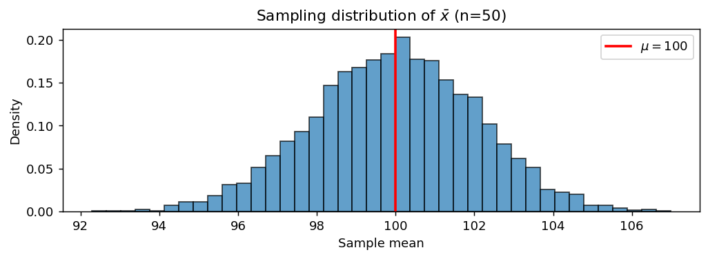

# 모수 대 통계량

## 개요

통계적 추론에서 가장 중요한 구분은 **모수(parameter)** — 모집단을 기술하는, 고정되어 있지만 알려지지 않은 양 — 와 **통계량(statistic)** — 표본에서 계산되어 그 모수의 추정값 역할을 하는 양 — 사이의 구분이다. 이 책의 모든 신뢰구간, 가설검정, 회귀계수가 이 구분 위에 서 있다. 이를 잊으면 응용 실무에서 가장 흔한 두 가지 오류를 범하게 된다. 하나는 표본에서 얻은 양을 마치 정확히 아는 값인 것처럼 다루는 것(추정 불확실성을 무시하는 것)이고, 다른 하나는 모수가 확률분포를 갖는 것처럼 다루는 것(베이즈 방법으로만 해소되는 빈도주의적 오류)이다.

## 정의

| 용어 | 범위 | 표기(대표적) | 알려져 있는가? |
|---|---|---|---|
| **모수** | 모집단 | $\mu,\; \sigma^2,\; p,\; \beta,\; \rho$ | 대개 미지 |
| **통계량** | 표본 | $\bar{x},\; s^2,\; \hat{p},\; \hat{\beta},\; r$ | 자료로부터 계산 가능 |

**모수**는 모집단의 고정된 수치적 특성이다. 예를 들어 NYSE 상장 주식 전체의 진짜 연평균 수익률이 그렇다. **통계량**은 표본에서 계산한 대응되는 양이다. 예를 들어 무작위로 고른 NYSE 주식 50종목의 평균 수익률이 그렇다. 모수는 알고 싶은 것이고, 통계량은 손에 쥔 것이다.

표준 관례는 모수에는 그리스 문자를, 그 추정량에는 로마자(흔히 모자 $\hat{}$ 를 씌워서)를 쓰는 것이다. 베이즈 방법은 모수를 사전분포를 갖는 확률변수로 다루어 이 관례를 완화하지만, 이 책의 대부분을 차지하는 빈도주의 관점에서 모수는 우리가 알아내려 하는 고정된 상수다.

## 이 구분이 중요한 이유

우리는 모집단 전체를 관측하는 일이 거의 없으므로, 모집단 모수를 **추정**하기 위해 표본 통계량에 의존한다. 그 추정의 품질은 다음으로 판단한다.

- **편향**: $\mathrm{bias}(\hat{\theta}) = \mathbb{E}[\hat{\theta}] - \theta$. 0이 가장 좋다.
- **분산**: $\mathrm{Var}(\hat{\theta})$. 작을수록 좋으며, $n$과 모집단 분산이 이를 좌우한다.
- **평균제곱오차**: $\mathrm{MSE}(\hat{\theta}) = \mathrm{Var}(\hat{\theta}) + \mathrm{bias}(\hat{\theta})^2$ — 표준적인 스칼라 요약값.
- **일치성**: $n \to \infty$일 때 $\hat{\theta}_n \to \theta$ (확률수렴). 웬만한 추정량이라면 갖추어야 할 최소 요건이다.

이 성질들은 제6장에서 자세히 다룬다.

## 흔한 모수–통계량 짝

### 평균

$$
\text{Parameter: } \mu = \frac{1}{N}\sum_{i=1}^{N} x_i \qquad\longleftrightarrow\qquad \text{Statistic: } \bar{x} = \frac{1}{n}\sum_{i=1}^{n} x_i
$$

표본이 모집단에서 i.i.d.로 뽑혔을 때 $\bar{x}$는 불편이고($\mathbb{E}[\bar{x}] = \mu$) 분산은 $\mathrm{Var}(\bar{x}) = \sigma^2 / n$이다. 표준오차 $\sigma / \sqrt{n}$은 초급 추론에서 가장 많이 쓰이는 양이다.

### 분산

$$
\text{Parameter: } \sigma^2 = \frac{1}{N}\sum_{i=1}^{N}(x_i - \mu)^2 \qquad\longleftrightarrow\qquad \text{Statistic: } s^2 = \frac{1}{n-1}\sum_{i=1}^{n}(x_i - \bar{x})^2
$$

표본분산이 $n - 1$로 나누는 것(베셀 보정)은 바로 $\mathbb{E}[s^2] = \sigma^2$가 되도록 하기 위해서다. $n$으로 나누면 $\sigma^2$을 $(n - 1)/n$배만큼 체계적으로 과소추정하게 되는데, 참값 $\mu$ 대신 (제곱편차의 합을 최소화하는 값인) $\bar{x}$를 대입함으로써 자유도 하나를 "써버렸기" 때문이다.

### 비율

$$
\text{Parameter: } p \qquad\longleftrightarrow\qquad \text{Statistic: } \hat{p} = \frac{\#\text{ successes in sample}}{n}
$$

이항 자료에서 $\hat{p}$는 불편이고 $\mathrm{Var}(\hat{p}) = p(1-p)/n$이며, $p = 1/2$에서 최대가 된다(비율 추정이 가장 어려운 경우).

### 회귀계수

$$
\text{Parameter: } \beta_1 \qquad\longleftrightarrow\qquad \text{Statistic: } \hat{\beta}_1 = \frac{\sum (x_i - \bar{x})(y_i - \bar{y})}{\sum (x_i - \bar{x})^2}
$$

표준 가정 아래에서 $\hat{\beta}_1$은 불편이고 분산은 $\sigma^2 / \sum(x_i - \bar{x})^2$이다. 분모를 보면 $x$가 더 넓게 퍼져 있을수록 기울기 추정이 더 정밀해지는 이유를 알 수 있는데, 이것이 실험 설계의 밑바탕에 있는 원리다.

## 표집 변동성

통계량은 무작위 표본에서 계산되므로 그 자체가 확률변수다. 다시 표집하면 다른 값이 나온다. 크기 $n$인 가능한 모든 표본에 걸친 통계량의 분포를 그 통계량의 **표본분포(sampling distribution)** 라 한다. 우리가 끊임없이 인용하게 될 두 가지 특징은 다음과 같다.

- **표준오차** — 표본분포의 표준편차. 평균의 경우 $\mathrm{SE}(\bar{x}) = \sigma/\sqrt{n}$.
- **표집편향** — 모수로부터의 체계적 어긋남으로, 흔히 비무작위 표집에서 생긴다.

중심극한정리에 따르면 $n$이 클 때 $\bar{x}$의 표본분포는 모집단의 모양과 무관하게 근사적으로 $N(\mu, \sigma^2/n)$이다. 이 하나의 사실이 대부분의 대표본 신뢰구간을 뒷받침한다.

## 파이썬 예제

```python
"""표본평균의 표집분포를 눈으로 확인한다."""

import numpy as np
import matplotlib.pyplot as plt

rng = np.random.default_rng(0)

# === 모수: 우리가 알아내려는 대상 ===
# 현실에서는 이 두 값을 절대 알 수 없다. 모의실험이므로 답을 미리 정해 둔다.
mu_true = 100
sigma_true = 15
population = rng.normal(mu_true, sigma_true, size=500_000)

# === 표본을 5000번 되풀이해 뽑고, 그때마다 표본평균을 기록한다 ===
# 이것이 이 예제의 핵심이다. 현실에서는 표본을 한 번만 뽑으므로
# 표본평균도 하나뿐이다. 여기서는 "만약 다시 뽑는다면 얼마가 나올까"를
# 5000번 되풀이해 그 분포를 직접 만들어 본다.
n = 50                # 표본 하나의 크기
num_samples = 5_000   # 되풀이 횟수
sample_means = np.array([
    rng.choice(population, n, replace=False).mean()
    for _ in range(num_samples)
])

# === 표집분포에서 두 가지를 확인한다 ===
#   (1) 중심: 표본평균들의 평균이 참 mu와 같은가?  -> 불편성
#   (2) 퍼짐: 그 표준편차가 이론값 sigma/sqrt(n)과 맞는가? -> 표준오차 공식
print(f"True μ:                {mu_true}")
print(f"Mean of sample means:  {sample_means.mean():.3f}")
print(f"Theoretical SE:        {sigma_true / np.sqrt(n):.3f}")
print(f"Observed SE:           {sample_means.std(ddof=1):.3f}")

# 5000개의 표본평균을 히스토그램으로 그린다.
# 모집단이 정규분포이므로 표집분포도 정규분포이며, 참 mu를 중심으로 대칭이다.
fig, ax = plt.subplots(figsize=(8, 3))
ax.hist(sample_means, bins=40, density=True, alpha=0.7, edgecolor="black")
ax.axvline(mu_true, color="red", lw=2, label=fr"$\mu = {mu_true}$")   # 참값 표시
ax.set_xlabel("Sample mean")
ax.set_ylabel("Density")
ax.set_title(rf"Sampling distribution of $\bar{{x}}$ (n={n})")
ax.legend()
fig.tight_layout()
plt.show()
```

출력:

```
True μ:                100
Mean of sample means:  99.969
Theoretical SE:        2.121
Observed SE:           2.097
```



숫자와 그림이 같은 말을 한다.

- **중심.** 표본평균들의 평균이 99.969로 참값 100과 사실상 같다. 히스토그램의 봉우리도 빨간 선(참 $\mu$) 위에 놓여 있다. 표본평균이 $\mu$의 **불편추정량**이라는 뜻이다.
- **퍼짐.** 이론값 $\sigma/\sqrt{n} = 15/\sqrt{50} = 2.121$과 관측값 2.097이 거의 맞는다.

주목할 것은 **모집단의 표준편차가 15인데 표본평균들의 표준편차는 2.1**이라는 점이다. 개별 관측값보다 표본평균이 일곱 배쯤 덜 흔들린다. 이 축소가 $1/\sqrt{n}$ 배이며, 통계적 추론이 가능한 이유 자체다.

## 연습문제

<div class="drillbox" markdown>

**연습문제 1.**
다음 각 양을 **모수**인지 **통계량**인지 분류하라.

**(a)** 어떤 나라 모든 성인의 평균 키.
**(b)** 2,000가구를 조사해서 계산한 소득의 중앙값.
**(c)** 어느 공장 생산분 전체에서 불량품의 비율.
**(d)** 표본으로 뽑은 학생 50명의 시험점수 표준편차.
**(e)** 공정한 동전이 앞면이 나올 확률.
**(f)** 거래 1,000건의 자료로 적합한 회귀의 기울기 계수.

</div>

??? success "풀이"
    (a) 모수 — 성인 모집단 전체를 기술한다.
    (b) 통계량 — 2,000가구 표본에서 계산했다.
    (c) 모수 — 생산분 전체를 기술한다.
    (d) 통계량 — 학생 50명에서 계산했다.
    (e) 모수 — 동전의 성질이다(개념적 반복의 "모집단").
    (f) 통계량 — $\hat{\beta}_1$은 모집단 모수 $\beta_1$의 추정량이다.

<div class="drillbox" markdown>

**연습문제 2.**
베셀 보정을 적용한 표본분산이 불편임을 보여라. 즉 $s^2 = \frac{1}{n-1}\sum_{i=1}^n (X_i - \bar X)^2$이고 $X_1, \dots, X_n$이 평균 $\mu$, 분산 $\sigma^2$의 i.i.d.일 때 $\mathbb{E}[s^2] = \sigma^2$임을 보여라.

</div>

??? success "풀이"
    항등식 $\sum_i (X_i - \bar{X})^2 = \sum_i X_i^2 - n\bar{X}^2$을 이용한다. 기댓값을 취하면

    $$
    \mathbb{E}\!\left[\sum_i X_i^2\right] = n(\sigma^2 + \mu^2), \qquad \mathbb{E}[n\bar{X}^2] = n\!\left(\frac{\sigma^2}{n} + \mu^2\right) = \sigma^2 + n\mu^2
    $$

    빼면

    $$
    \mathbb{E}\!\left[\sum_i (X_i - \bar{X})^2\right] = n\sigma^2 + n\mu^2 - \sigma^2 - n\mu^2 = (n-1)\sigma^2
    $$

    따라서 $\mathbb{E}[s^2] = \frac{(n-1)\sigma^2}{n-1} = \sigma^2$이다. $\square$

    대신 $n$으로 나누면 $\mathbb{E}[\tilde s^2] = \frac{n-1}{n}\sigma^2$가 되어 체계적으로 과소추정하는 추정량이 되며, 특히 $n$이 작을 때 해롭다.

<div class="drillbox" markdown>

**연습문제 3.**
분산이 $\sigma^2 = 100$인 모집단에서 크기 $n$인 i.i.d. 표본을 뽑을 때 $n = 4, 25, 100, 400$에 대해 $\bar X$의 표준오차를 계산하라. $n$이 네 배가 되면 표준오차는 어떻게 변하는가?

</div>

??? success "풀이"
    $\mathrm{SE}(\bar X) = \sigma / \sqrt{n} = 10/\sqrt{n}$:

    | $n$ | $\mathrm{SE}(\bar X)$ |
    |---|---|
    | 4 | 5.000 |
    | 25 | 2.000 |
    | 100 | 1.000 |
    | 400 | 0.500 |

    $n$이 네 배가 될 때마다 표준오차는 절반이 된다 — 표준적인 $\sqrt{n}$ 속도다. 정밀도를 크게 높이려면 표본 크기를 *자릿수 단위로* 늘려야 하며, 이것이 통계적 표본 크기 계획의 기본 경제학이다.

<div class="drillbox" markdown>

**연습문제 4.**
어떤 조사에서 응답자 $n = 100$명으로부터 $\hat p = 0.40$을 얻었다. $\hat p$가 근사적으로 $N(p, p(1-p)/n)$을 따른다고 볼 때, "모수 $p$가 $(0.30, 0.50)$ 안에 있을 확률이 95%다"라는 진술이 빈도주의적 의미에서 올바른 해석인지 설명하라.

</div>

??? success "풀이"
    빈도주의적 의미에서는 옳지 않다. 빈도주의 추론에서 $p$는 (미지이지만) 고정된 상수이지 확률변수가 아니므로, "$p$가 확률 0.95로 $(a, b)$ 안에 있다" 같은 확률 진술은 적용되지 않는다.

    95% 신뢰구간의 올바른 해석은 *절차*에 대한 진술이다. 표집과 신뢰구간 구성을 여러 번 반복하면 그렇게 얻은 구간의 95%가 참값 $p$를 포함한다는 뜻이다. 특정 구간 $(0.30, 0.50)$은 $p$를 포함하거나 포함하지 않거나 둘 중 하나이며, $p$ 자체에 대한 확률 진술은 없다.

    베이즈 추론에서는 모수에 대한 확률 진술을 할 수 *있지만*, 사전분포를 지정하고 사후분포를 보고한 뒤에야 가능하며 이는 다른 방식의 추론이다. 두 해석은 대중 보도에서 자주 혼동된다.

<div class="drillbox" markdown>

**연습문제 5.**
$\mathrm{Bernoulli}(p)$에서 뽑은 크기 $n$의 i.i.d. 표본에 대해 표본비율은 $\hat p = (1/n)\sum X_i$이다. $\mathbb{E}[\hat p] = p$이고 $\mathrm{Var}(\hat p) = p(1-p)/n$임을 보여라. 분산은 ($p$에 대해) 어디에서 최대가 되며, 이것이 표본 크기 계획에서 왜 중요한가?

</div>

??? success "풀이"
    기댓값의 선형성: $\mathbb{E}[\hat p] = (1/n)\sum \mathbb{E}[X_i] = p$.

    독립성: $\mathrm{Var}(\hat p) = (1/n^2)\sum \mathrm{Var}(X_i) = (1/n^2) \cdot n\, p(1-p) = p(1-p)/n$.

    함수 $p \mapsto p(1-p)$는 위로 볼록한 포물선으로 $p = 1/2$에서 최대가 된다($p(1-p) = 0.25$). 표본 크기를 계획할 때 $p$를 모르면 보통 최악의 경우인 $p(1-p) = 0.25$를 택하며, 95% 신뢰수준에서 목표 오차한계 ME에 대해 익숙한 공식 $n \approx 1/(4 \mathrm{ME}^2)$이 나온다.

<div class="drillbox" markdown>

**연습문제 6.**
**평균제곱오차**는 $\mathrm{MSE}(\hat \theta) = \mathrm{Var}(\hat \theta) + [\mathrm{bias}(\hat \theta)]^2$로 분해된다. 불편추정량보다 MSE가 작은 편향추정량의 예를 들고, 이런 일이 왜 가능한지 설명하라.

</div>

??? success "풀이"
    정규 i.i.d. 표본에서 $\sigma^2$을 추정하는 경우를 생각하자. 최대가능도추정량(MLE)은 $n - 1$이 아니라 $n$으로 나눈다.

    $$
    \tilde s^2 = \frac{1}{n}\sum_{i=1}^n (X_i - \bar X)^2
    $$

    이는 편향되어 있다: $\mathbb{E}[\tilde s^2] = \frac{n-1}{n}\sigma^2$. 그러나 분산은 불편추정량 $s^2$보다 작다. 계산하면

    $$
    \mathrm{MSE}(\tilde s^2) = \mathrm{Var}(\tilde s^2) + \mathrm{bias}(\tilde s^2)^2 = \frac{2(n-1)\sigma^4}{n^2} + \left(\frac{\sigma^2}{n}\right)^{\!2} = \frac{(2n-1)\sigma^4}{n^2}
    $$

    이고,

    $$
    \mathrm{MSE}(s^2) = \mathrm{Var}(s^2) = \frac{2\sigma^4}{n-1} = \frac{2\sigma^4 n}{n(n-1)}
    $$

    이다. 유한한 $n$에 대해 $\mathrm{MSE}(\tilde s^2) < \mathrm{MSE}(s^2)$ — MLE는 편향되어 있음에도 MSE가 더 작다.

    일반적인 교훈은 이것이다: **편향은 분산과 맞바꿔진다.** 축소추정량(제임스–스타인, 능형회귀)은 약간의 편향을 감수하고 분산을 크게 줄임으로써 이 사실을 활용한다. 편향이 언제나 나쁜 것은 아니며, 2차원 정확도 예산에서 조절할 수 있는 하나의 손잡이일 뿐이다.

<div class="drillbox" markdown>

**연습문제 7.**
연습문제 6에서 $n$으로 나누는 쪽이 $n-1$로 나누는 쪽보다 MSE가 작음을 보았다. 그렇다면 **최적의 분모**는 무엇인가? $\hat\sigma^2_c = c\sum(X_i-\bar X)^2$의 MSE를 최소화하는 $c$를 구하고 모의실험으로 확인하라.

</div>

??? success "풀이"
    정규표본에서 $SS = \sum(X_i-\bar X)^2$는 $SS/\sigma^2 \sim \chi^2_{n-1}$을 만족하므로

    $$
    \mathbb{E}[SS] = (n-1)\sigma^2, \qquad \operatorname{Var}(SS) = 2(n-1)\sigma^4
    $$

    이다. 따라서

    $$
    \operatorname{MSE}(c\,SS) = c^2\cdot 2(n-1)\sigma^4 + \left[c(n-1)-1\right]^2\sigma^4
    $$

    이고, $c$로 미분해 $0$으로 두면

    $$
    4c(n-1) + 2\left[c(n-1)-1\right](n-1) = 0
    \;\Longrightarrow\;
    2c + c(n-1) - 1 = 0
    \;\Longrightarrow\;
    \boxed{c = \frac{1}{n+1}}
    $$

    를 얻는다. 즉 **$n+1$로 나누는 것**이 MSE를 최소화한다. 이때 $\operatorname{MSE} = 2\sigma^4/(n+1)$이다.

    ```python
    import numpy as np

    rng = np.random.default_rng(0)
    n, B = 8, 400_000
    x = rng.normal(0, 1, (B, n))
    SS = ((x - x.mean(1, keepdims=True)) ** 2).sum(1)

    print(f"{'분모':>6}{'평균':>10}{'편향':>10}{'분산':>10}{'MSE':>10}{'이론 MSE':>10}")
    for name, d, mse_th in [("n-1", n - 1, 2 / (n - 1)),
                            ("n",   n,     (2 * n - 1) / n ** 2),
                            ("n+1", n + 1, 2 / (n + 1))]:
        e = SS / d
        print(f"{name:>6}{e.mean():>10.4f}{e.mean() - 1:>+10.4f}"
              f"{e.var():>10.4f}{((e - 1) ** 2).mean():>10.4f}{mse_th:>10.4f}")
    ```

    출력:

    ```
    분모        평균        편향        분산       MSE    이론 MSE
       n-1    0.9996   -0.0004    0.2866    0.2866    0.2857
         n    0.8747   -0.1253    0.2194    0.2351    0.2344
       n+1    0.7775   -0.2225    0.1733    0.2229    0.2222
    ```

    MSE가 $0.2866 > 0.2351 > 0.2229$로 단조 감소하며 이론값과 맞는다. 편향은 반대 방향으로 커진다.

    **그런데 왜 아무도 $n+1$을 쓰지 않는가.** 이유가 여러 겹이다.

    - 이 결과는 **정규성에 의존한다.** $\operatorname{Var}(SS)$ 계산에 정규분포의 4차 적률이 들어갔다. 꼬리가 두꺼운 분포에서는 최적 $c$가 달라진다.
    - MSE는 **여러 기준 중 하나일 뿐이다.** 손실함수를 바꾸면 최적값도 바뀐다.
    - 불편성은 **합쳐질 때 보존된다.** 여러 집단의 분산 추정값을 합동(pooled)하거나 분산분석 표를 만들 때, 불편추정량들의 합은 여전히 불편이다. 편향된 추정량은 편향이 누적된다.
    - $s^2$은 $\chi^2$ 분포와 깔끔하게 맞물려 $t$ 검정과 $F$ 검정이 정확히 성립한다.

    **교훈은 MSE의 승자를 찾는 것이 아니다.** "최적의 추정량"이라는 말이 반드시 **어떤 기준에 대해** 최적인지를 밝혀야만 뜻을 갖는다는 것이다. 기준을 바꾸면 답도 바뀐다. $\square$

<div class="drillbox" markdown>

**연습문제 8.**
중심극한정리는 **표본평균**에 대한 정리다. 다른 통계량의 표본분포는 어떻게 생겼는가? $\bar{X}$, $s^2$, 표본최댓값의 표본분포를 $n$을 키워 가며 비교하라.

</div>

??? success "풀이"
    ```python
    import numpy as np
    from scipy import stats

    rng = np.random.default_rng(1)
    B = 200_000

    print(f"{'n':>6}{'통계량':>9}{'평균':>10}{'표준편차':>11}{'왜도':>9}{'첨도':>9}")
    for n in (10, 100, 1000):
        x = rng.normal(0, 1, (B, n))
        for name, v in [("Xbar", x.mean(1)), ("s^2", x.var(1, ddof=1)), ("최댓값", x.max(1))]:
            print(f"{n:>6}{name:>9}{v.mean():>10.4f}{v.std():>11.4f}"
                  f"{stats.skew(v):>9.3f}{stats.kurtosis(v):>9.3f}")

    print("\ns^2 의 이론 왜도 = sqrt(8/(n-1))")
    for n in (10, 100, 1000):
        print(f"  n = {n:>5}: {np.sqrt(8 / (n - 1)):.3f}")
    ```

    출력:

    ```
    n      통계량        평균       표준편차       왜도       첨도
        10     Xbar    0.0008     0.3156   -0.006   -0.016
        10      s^2    0.9983     0.4710    0.937    1.292
        10      최댓값    1.5378     0.5874    0.413    0.345
       100     Xbar    0.0001     0.0998   -0.002    0.018
       100      s^2    0.9998     0.1423    0.280    0.108
       100      최댓값    2.5068     0.4298    0.668    0.825
      1000     Xbar    0.0001     0.0317   -0.004    0.010
      1000      s^2    1.0001     0.0447    0.090    0.009
      1000      최댓값    3.2415     0.3520    0.789    1.071

    s^2 의 이론 왜도 = sqrt(8/(n-1))
      n =    10: 0.943
      n =   100: 0.284
      n =  1000: 0.089
    ```

    셋이 전혀 다르게 움직인다.

    **$\bar{X}$** — 어떤 $n$에서도 왜도와 첨도가 $0$이다. 모집단이 정규이므로 $\bar{X}$도 정확히 정규다. 표준편차는 $1/\sqrt{n}$대로 $0.316 \to 0.100 \to 0.032$.

    **$s^2$** — 오른쪽으로 치우쳐 있다. 왜도가 $0.937 \to 0.280 \to 0.090$으로 $\sqrt{8/(n-1)}$과 정확히 맞는다. $(n-1)s^2/\sigma^2 \sim \chi^2_{n-1}$이고 카이제곱분포가 치우쳐 있기 때문이다. **다만 치우침이 $0$으로 가므로** $s^2$도 결국 정규에 가까워진다. 이것이 중심극한정리의 확장판이 적용되는 경우다.

    **최댓값** — 완전히 다르다. 왜도가 줄기는커녕 $0.413 \to 0.668 \to 0.789$로 **커진다.** 표준편차도 $0.587 \to 0.430 \to 0.352$로 느릿느릿 줄 뿐이다($\bar{X}$처럼 $1/\sqrt{n}$이 아니라 대략 $1/\log n$이다).

    **왜 최댓값에는 중심극한정리가 통하지 않는가.** 중심극한정리는 **많은 항의 합**에 관한 정리다. 각 관측이 조금씩 기여해 개별 기여가 씻겨 나가면서 정규성이 나온다. 최댓값은 합이 아니라 **하나의 관측**이며, 나머지 $n-1$개는 그 값을 고르는 데만 쓰인다. 그래서 극한분포가 정규가 아니라 **검벨분포**(왜도 $1.1395$)이며, 위 수치가 그쪽으로 올라가고 있다.

    이것이 **극단값 이론**의 출발점이다. 홍수 수위, 보험의 대형 손실, 금융의 최대 낙폭처럼 최댓값이 관심사인 문제에서는 정규분포에 기댄 도구를 쓰면 안 된다. 검벨·프레셰·바이불의 세 극한분포가 그 자리를 대신한다.

    !!! warning "일반화의 함정"
        "$n$이 크면 정규분포"라는 말은 **표본평균과 그와 비슷하게 행동하는 통계량**에 한한 이야기다. 최댓값, 최솟값, 분위수의 극단, 최빈값에는 적용되지 않는다. 통계량이 본질적으로 평균의 모습을 하고 있는지를 먼저 물어야 한다. $\square$

<div class="drillbox" markdown>

**연습문제 9.**
**불편성과 일치성은 별개의 성질이다.** (a) 불편이지만 일치성이 없는 추정량과 (b) 편향되어 있지만 일치성이 있는 추정량을 각각 제시하고 모의실험으로 확인하라.

</div>

??? success "풀이"
    **(a) 불편이지만 일치성 없음: 첫 관측값만 쓰기.** $\hat\mu = X_1$로 두면 $\mathbb{E}[X_1] = \mu$이므로 불편이다. 그러나 $\operatorname{Var}(X_1) = \sigma^2$이 $n$과 무관하므로 자료를 아무리 모아도 정밀해지지 않는다.

    **(b) 편향이지만 일치성 있음: 최대가능도 분산.** $\tilde s^2 = \frac{1}{n}\sum(X_i-\bar X)^2$는 편향이 $-\sigma^2/n$이지만, 이 편향이 $n \to \infty$에서 $0$으로 가고 분산도 $0$으로 가므로 일치성을 갖는다.

    ```python
    import numpy as np

    rng = np.random.default_rng(0)

    print("(a) X_1 은 불편이지만 일치성이 없다")
    print(f"{'n':>7}{'E[X_1]':>10}{'SD[X_1]':>10}{'E[Xbar]':>10}{'SD[Xbar]':>10}")
    for n in (10, 100, 1000, 10_000):
        x = rng.normal(5, 2, (20_000, n))
        print(f"{n:>7}{x[:, 0].mean():>10.4f}{x[:, 0].std():>10.4f}"
              f"{x.mean(1).mean():>10.4f}{x.mean(1).std():>10.4f}")

    print("\n(b) MLE 분산은 편향되어 있지만 일치성이 있다")
    print(f"{'n':>7}{'평균':>10}{'편향':>10}{'이론 편향':>11}{'표준편차':>11}")
    for n in (5, 20, 100, 1000):
        v = rng.normal(0, 1, (50_000, n)).var(1, ddof=0)
        print(f"{n:>7}{v.mean():>10.5f}{v.mean() - 1:>+10.5f}"
              f"{-1 / n:>+11.5f}{v.std():>11.4f}")
    ```

    출력:

    ```
    (a) X_1 은 불편이지만 일치성이 없다
          n    E[X_1]   SD[X_1]   E[Xbar]  SD[Xbar]
         10    4.9880    2.0113    5.0003    0.6308
        100    5.0252    1.9937    5.0011    0.2005
       1000    5.0100    2.0053    5.0001    0.0631
      10000    4.9877    2.0242    5.0000    0.0202

    (b) MLE 분산은 편향되어 있지만 일치성이 있다
          n        평균        편향      이론 편향       표준편차
          5   0.80233  -0.19767   -0.20000     0.5714
         20   0.94886  -0.05114   -0.05000     0.3067
        100   0.98978  -0.01022   -0.01000     0.1403
       1000   0.99885  -0.00115   -0.00100     0.0449
    ```

    (a)에서 `E[X_1]`은 언제나 $5$ 근처지만 `SD[X_1]`은 $2$에 붙박여 있다. 반면 `SD[Xbar]`는 $0.632 \to 0.020$으로 떨어진다. **$X_1$은 표적을 평균적으로 맞히지만 결코 표적에 수렴하지 않는다.**

    (b)에서 편향이 $-0.197 \to -0.0012$로 이론값 $-1/n$을 따라 사라지고 표준편차도 함께 줄어든다.

    **두 개념의 관계.**

    | | 불편성 | 일치성 |
    |---|---|---|
    | 성격 | 고정된 $n$에서의 성질 | $n \to \infty$의 성질 |
    | 말하는 것 | 평균적으로 맞다 | 결국 맞다 |
    | 실용적 중요도 | 낮다 | 높다 |

    **어느 쪽이 더 중요한가.** 거의 언제나 일치성이다. 일치성이 없다는 것은 자료를 무한히 모아도 답을 알 수 없다는 뜻이라 치명적이다. 불편성은 "평균적으로 맞다"일 뿐인데, 우리는 보통 자료를 **한 번** 얻으므로 여러 표본에 걸친 평균이 맞다는 것만으로는 위안이 되지 않는다.

    가장 널리 쓰이는 추정량 중 하나인 최대가능도추정량은 일반적으로 편향되어 있고, 일치성과 점근정규성 때문에 쓰인다. $\square$

<div class="drillbox" markdown>

**연습문제 10.**
모수의 함수를 추정할 때 **대입추정량**의 함정을 보여라. $\mathbb{E}[1/\bar{X}] \ne 1/\mu$임을 확인하고, 델타 방법으로 편향의 크기를 근사하라.

</div>

??? success "풀이"
    $g(x) = 1/x$는 볼록함수이므로 옌센 부등식에 의해 $\mathbb{E}[1/\bar{X}] > 1/\mathbb{E}[\bar{X}] = 1/\mu$이다. 즉 **언제나 과대추정**한다.

    크기를 알려면 $\mu$ 주위에서 2차까지 전개한다.

    $$
    g(\bar{X}) \approx g(\mu) + g'(\mu)(\bar{X}-\mu) + \tfrac{1}{2}g''(\mu)(\bar{X}-\mu)^2
    $$

    기댓값을 취하면 1차항이 사라지고 $\mathbb{E}[(\bar{X}-\mu)^2] = \sigma^2/n$이므로

    $$
    \mathbb{E}[g(\bar{X})] \approx g(\mu) + \frac{g''(\mu)\sigma^2}{2n}
    $$

    이다. $g(x)=1/x$이면 $g''(x) = 2/x^3$이라

    $$
    \mathbb{E}\!\left[\frac{1}{\bar{X}}\right] \approx \frac{1}{\mu} + \frac{\sigma^2}{n\mu^3}
    $$

    를 얻는다.

    ```python
    import numpy as np

    rng = np.random.default_rng(0)
    mu, sigma = 5., 2.

    print(f"{'n':>6}{'E[1/Xbar]':>12}{'1/mu':>10}{'델타 근사':>12}{'실제 편향':>12}")
    for n in (5, 20, 100, 1000):
        xbar = rng.normal(mu, sigma, (400_000, n)).mean(1)
        emp = np.mean(1 / xbar)
        approx = 1 / mu + sigma ** 2 / (n * mu ** 3)
        print(f"{n:>6}{emp:>12.6f}{1 / mu:>10.6f}{approx:>12.6f}{emp - 1 / mu:>+12.6f}")
    ```

    출력:

    ```
    n   E[1/Xbar]      1/mu       델타 근사       실제 편향
         5    0.207046  0.200000    0.206400   +0.007046
        20    0.201690  0.200000    0.201600   +0.001690
       100    0.200307  0.200000    0.200320   +0.000307
      1000    0.200029  0.200000    0.200032   +0.000029
    ```

    편향이 언제나 양수이고, $n \ge 20$부터는 델타 근사가 소수점 다섯째 자리까지 맞는다. 편향이 $1/n$의 속도로 줄어드는 것도 확인된다.

    **일반 원리.** $\hat\theta$이 $\theta$의 불편추정량이어도 $g(\hat\theta)$은 $g$가 비선형인 한 $g(\theta)$의 불편추정량이 아니다. 편향의 부호는 $g$의 볼록성이 정한다. $g$가 볼록이면 위로, 오목이면 아래로 치우친다(연습문제 10, 앞 절의 $\mathbb{E}[s] < \sigma$가 오목한 경우다).

    **어디서 문제가 되는가.**

    - **비율과 역수**: 평균 대기시간에서 처리율($1/\bar{T}$)을 구하거나, 평균 비용에서 효율을 구할 때
    - **오즈비와 상대위험도**: $\log$를 취해 다루는 것이 표준인 이유가 대칭성뿐 아니라 편향 때문이기도 하다
    - **로그정규 자료의 역변환**: $\exp(\overline{\log X})$는 산술평균이 아니라 기하평균을 추정한다. 로그척도에서 회귀한 뒤 지수를 취하면 평균을 과소추정한다

    **처방.** (1) $n$이 크면 편향이 $1/n$이라 대개 무시할 만하다. (2) 델타 방법으로 크기를 가늠해 표준오차와 비교하라. 편향이 표준오차보다 훨씬 작으면 신경 쓰지 않아도 된다. (3) 그렇지 않으면 부트스트랩으로 편향을 추정해 빼거나, 애초에 관심 있는 척도에서 직접 모형을 세워라. $\square$

---

## 정리하며

- 모수는 모집단을 기술하고, 통계량은 표본을 기술한다.
- 통계량은 확률변수이며, 그 표본분포가 자료에서 추론으로 건너가는 다리다.
- 추정량의 유용성은 편향, 분산, 일치성으로 판단한다.
- 표준오차는 $1/\sqrt{n}$으로 줄어든다 — 표본 크기를 네 배로 늘려야 표준오차가 절반이 된다.
