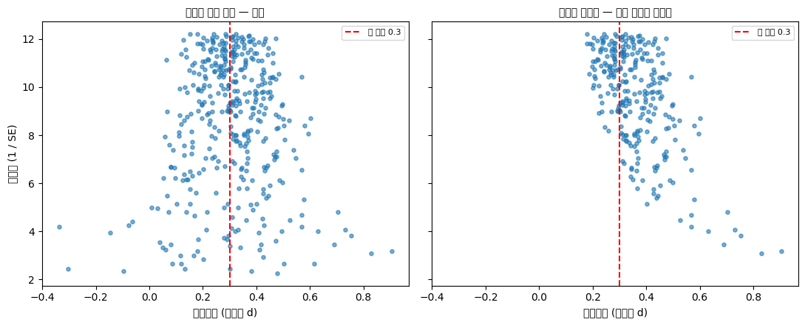

# 출판 편향과 파일서랍 문제

지금까지 본 편향은 모두 **자료가 어떻게 수집되는가**의 문제였다. 출판 편향은 한 단계 뒤에서 일어난다. 연구가 제대로 설계되고 제대로 수행되어도, 그 결과가 **나온 방향에 따라 세상에 나오거나 나오지 않는다면** 문헌 전체가 치우친다. 무작위화도 눈가림도 이것을 막지 못한다. 개별 연구는 모두 흠이 없는데 그것들을 모아 놓은 문헌만 거짓말을 하는, 통계학에서 가장 다루기 까다로운 편향이다.

<div class="defn" markdown>

**정의 1.** [출판 편향]

**출판 편향(publication bias)** 은 연구 결과가 그 방향·크기·통계적 유의성에 따라 선택적으로 출판되는 현상이다. 전형적으로 유의한 결과, 새로운 결과, 기대에 부합하는 결과가 출판될 확률이 높다.

**파일서랍 문제(file drawer problem)** 는 그 이면이다. 유의하지 않은 결과를 담은 원고가 투고되지도 못한 채 연구자의 서랍에 남는다. 우리는 그 서랍 안을 볼 수 없으므로, 문헌에서 빠진 것이 얼마나 되는지 문헌만 보아서는 알 수 없다.

출판 편향은 **선택편향의 한 형태**다. 다만 선택되는 단위가 사람이 아니라 **연구**라는 점이 다르다.

</div>

## 설명

### 항우울제 시험 74건

출판 편향의 크기를 실제로 잰 드문 연구가 있다. 문제는 늘 "출판되지 않은 연구를 어떻게 세는가"인데, Turner 외(2008)는 이 문제를 우회하는 방법을 찾았다. 미국에서는 신약 허가를 신청하려면 시험을 **미리 FDA에 등록**해야 한다. 등록부는 출판 여부와 무관하게 존재한다. 등록부를 기준선으로 삼고 문헌과 대조하면 사라진 연구가 드러난다.

12종의 항우울제에 대해 FDA에 등록된 시험 74건의 운명은 다음과 같았다.

| FDA의 판정 | 시험 수 | 출판되지 않음 | 긍정으로 읽히게 출판 | 판정대로 출판 |
|:---|---:|---:|---:|---:|
| 긍정 | 38 | 1 | — | **37** |
| 긍정 아님 | 36 | **22** | **11** | **3** |

긍정 결과는 38건 중 37건이 논문이 되었다. 긍정이 아닌 결과 36건 중 판정 그대로 논문이 된 것은 **3건**이다. 22건은 아예 나오지 않았고, 11건은 나오기는 했으나 긍정적인 결론으로 읽히도록 쓰였다.

결과가 이것이다.

- **출판된 문헌만 읽으면 시험의 94%가 긍정으로 보인다.** FDA 자료 전체로는 51%다.
- 효과크기가 전체적으로 **32% 부풀려졌다**(약물별로 11%–69%).

!!! danger "이 표에서 가장 무서운 칸은 22가 아니라 11이다"
    22건이 사라진 것은 명백한 누락이다. 메타분석가가 등록부를 뒤지면 적어도 "빠진 것이 있다"는 사실은 알 수 있다.

    **11건은 다르다.** 이 시험들은 출판되었다. 문헌 검색에 걸리고, 초록도 있고, 인용도 된다. 다만 FDA가 실패로 판정한 결과가 논문에서는 성공처럼 읽힌다. 주요 평가변수를 바꿔서, 부차적 평가변수를 앞세워서, 하위집단을 강조해서. 메타분석에 이 11건을 넣으면 **누락보다 더 나쁜 일**이 벌어진다. 빠진 자료가 아니라 잘못된 방향의 자료가 들어가기 때문이다.

    통제실험 절에서 본 **사전 지정**이 왜 그렇게 강조되는지가 여기서 드러난다. 주요 평가변수를 자료를 보기 전에 못 박아 두지 않으면, 실패한 시험도 성공한 시험처럼 보고할 수 있다.

### 메타분석은 이 편향을 고치지 못한다

직관적으로 이렇게 생각하기 쉽다. "연구 하나는 편향될 수 있지만 수십 개를 모으면 평균에서 상쇄되지 않는가?"

그렇지 않다. 메타분석이 상쇄하는 것은 **우연 오차**다. 표본이 커질수록 우연 오차는 줄어든다. 그러나 출판 편향은 우연이 아니라 **체계적 선택**이다. 치우친 연구들을 아무리 많이 모아도 치우친 답이 나오며, 다만 **더 좁은 신뢰구간과 함께** 나올 뿐이다.

이 장을 관통하는 GIGO 원칙이 여기서도 그대로다. 정교한 종합은 수집의 결함을 고쳐 주지 않는다. 메타분석은 오히려 위험을 키우는데, 편향된 추정값에 권위와 정밀도를 함께 부여하기 때문이다.

### 파일서랍의 산술

극단적인 경우를 계산해 보면 규모가 실감난다. 어떤 처치가 **실제로 아무 효과가 없다**고 하자. 서로 다른 연구팀이 이 처치를 100번 검정하고, 각 검정은 $\alpha = 0.05$로 수행된다.

- 유의한 결과가 나오는 연구는 평균 **5건**이다. 모두 거짓양성이다.
- 유의하지 않은 95건이 서랍에 남고 5건만 출판된다면, **문헌의 100%가 효과를 보고한다.**

효과가 없는데도 문헌은 만장일치로 효과가 있다고 말한다. 어느 연구도 부정직하지 않았고, 어느 연구도 $\alpha$를 어기지 않았다.

효과가 **있는** 경우에도 문제는 남는다. 검정력이 낮은 연구들 중 유의성에 도달한 것만 출판되면, 그 연구들은 우연히 효과를 크게 추정한 쪽에 몰려 있다. 출판된 효과크기가 참값보다 체계적으로 크게 나오는 이 현상을 **승자의 저주(winner's curse)** 라 부른다. 아래 예제가 이것을 보여 준다.

### 깔때기 그림

출판 편향을 눈으로 확인하는 표준적인 도구가 **깔때기 그림(funnel plot)** 이다. 가로축에 각 연구의 효과크기를, 세로축에 정밀도(표본 크기 또는 $1/\text{SE}$)를 놓는다.

- 편향이 없다면 그림은 **대칭인 깔때기** 모양이 된다. 정밀도가 낮은 작은 연구들은 참값 주변에 넓게 흩어지고, 큰 연구들은 참값 가까이 좁게 모인다.
- 출판 편향이 있으면 **왼쪽 아래가 비어 있다.** 작으면서 효과가 작거나 음수인 연구 — 정확히 서랍에 남는 종류 — 가 문헌에 없기 때문이다.

비대칭을 형식적으로 검정하는 방법(Egger 검정 등)도 있지만 조심해서 써야 한다. 비대칭은 출판 편향 말고도 여러 이유로 생길 수 있다. 예컨대 작은 연구가 더 선별된 환자를 다루어 실제로 효과가 더 클 수도 있다. 깔때기 그림은 **증거이지 증명이 아니다.**

### 근본적인 대응은 등록이다

출판 편향은 사후 통계 보정으로 해결되지 않는다. 보이지 않는 것을 추정하려는 시도이기 때문이다. 실효성 있는 대응책은 모두 **연구를 출판 이전 시점에 묶어 두는 것**이다.

- **임상시험 등록제.** 시험 시작 전에 공개 등록부에 프로토콜과 주요 평가변수를 등록한다. Turner 외의 연구가 가능했던 것 자체가 FDA 등록부 덕분이었다. 미국은 `ClinicalTrials.gov` 등록과 결과 공개를 법으로 요구하고, 주요 의학 학술지들은 사전등록되지 않은 시험의 논문을 받지 않는다.
- **사전등록(preregistration).** 임상시험이 아닌 분야에서도 가설·표본크기·분석계획을 자료 수집 전에 공개 저장소에 등록한다. "갈래길의 정원"을 좁히는 장치이기도 하다.
- **등록 보고서(Registered Reports).** 학술지가 **결과를 보기 전에** 설계만 심사해 게재를 확정한다. 결과의 방향이 게재 여부에 영향을 줄 수 없게 만드는, 원인을 직접 없애는 방식이다.
- **음성 결과의 출판.** 유의하지 않은 결과를 싣는 학술지와 등록부의 결과 공개 의무.

통제실험 절에서 규제기관이 확증시험을 두 건 요구하는 이유를 보았다. 여기에 하나를 덧붙일 수 있다. 규제기관은 **제출된 시험 전체**를 본다. 회사가 고른 시험만 보는 것이 아니다. 등록제가 없다면 시험 2건 요구는 무력해진다. 성공할 때까지 시험을 반복한 뒤 성공한 두 건만 제출하면 되기 때문이다.

## 예제

효과가 실제로 있지만 작은 경우에도, 유의한 연구만 출판되면 문헌의 효과크기가 어떻게 부풀려지는지를 보여 준다.

```python
"""승자의 저주: 유의한 연구만 출판되면 문헌의 효과크기가 부풀려진다."""

import numpy as np
from scipy import stats

rng = np.random.default_rng(0)
n_studies = 2000
n_per_group = 25          # 집단당 25명 — 작고 검정력이 낮은 연구
true_effect = 0.3         # 코헨의 d. 실재하지만 크지 않은 효과

# === 독립적인 연구 2000개를 돌린다 ===
# 중요한 전제: 2000개 모두 참 효과 0.3인 같은 현상을 연구한다.
# 즉 연구자들의 실력도, 현상도 모두 같다. 다른 것은 우연뿐이다.
effects, pvals = [], []
for _ in range(n_studies):
    control = rng.normal(0, 1, n_per_group)
    treated = rng.normal(true_effect, 1, n_per_group)
    t_stat, p = stats.ttest_ind(treated, control)

    # 코헨의 d = (평균 차이) / (합동표준편차)
    # 단위에 의존하지 않는 표준화된 효과크기라 연구끼리 비교할 수 있다.
    pooled_sd = np.sqrt((control.var(ddof=1) + treated.var(ddof=1)) / 2)
    effects.append((treated.mean() - control.mean()) / pooled_sd)
    pvals.append(p)

effects, pvals = np.array(effects), np.array(pvals)

# === 출판 필터 ===
# p < 0.05 인 연구만 학술지에 실린다고 두자.
# 검정력이 낮으므로, 통과하려면 우연히 효과가 크게 나와야 한다.
# 다시 말해 **필터가 효과크기가 큰 표본을 골라낸다.** 이것이 승자의 저주다.
published = pvals < 0.05

# === 서랍 속에 남은 것과 문헌에 보이는 것을 비교한다 ===
print(f"True effect                : {true_effect:.2f}")
print(f"All studies,      mean d   : {effects.mean():.2f}  (n = {n_studies})")
print(f"Published only,   mean d   : {effects[published].mean():.2f}  "
      f"(n = {published.sum()})")
print(f"Inflation                  : "
      f"{100 * (effects[published].mean() / true_effect - 1):.0f}%")
print(f"Studies in the file drawer : {(~published).sum()}")
```

출력:

```
True effect                : 0.30
All studies,      mean d   : 0.32  (n = 2000)
Published only,   mean d   : 0.72  (n = 381)
Inflation                  : 141%
Studies in the file drawer : 1619
```

모든 연구를 합치면 참값을 되찾지만, 유의한 것만 모으면 효과가 크게 부풀려진다. 부정직한 연구자도, 잘못된 통계도 없다. 걸러 내는 규칙 하나만으로 충분하다.

## 연습문제

<div class="drillbox" markdown>

**연습문제 1.**
어떤 메타분석이 특정 보충제와 심혈관 건강에 관한 연구 40편을 종합하여 유의한 이득을 보고했다. 저자들은 "40편의 독립적인 연구에 근거한 결론"이라고 강조한다. 이 강조가 왜 안심의 근거가 되지 못하는지 설명하라.

</div>

??? success "풀이"
    연구 수는 **우연 오차**에 대한 방어일 뿐 **선택 편향**에 대한 방어가 아니다. 40편이 모두 "출판된 연구"라는 공통 조건으로 선택되었다면, 그 조건 자체가 효과를 크게 추정한 연구 쪽으로 치우쳐 있을 수 있다.

    수가 많다는 사실은 오히려 위험을 키운다. 40편으로 계산한 신뢰구간은 5편으로 계산한 것보다 좁으므로, 편향된 추정값이 더 확신에 찬 모습으로 제시된다. **정밀도는 정확도가 아니다.**

    확인해야 할 것: 저자들이 등록부(예: `ClinicalTrials.gov`)를 검색했는지, 회색문헌(학위논문, 미출판 보고서)을 포함했는지, 깔때기 그림의 대칭성을 보고했는지, 그리고 이 주제에 사전등록 관행이 있는지.

<div class="drillbox" markdown>

**연습문제 2.**
어떤 처치에 참 효과가 전혀 없다. 연구 200편이 이 처치를 각각 $\alpha = 0.05$(양측)로 검정한다.

**(a)** 유의한 결과가 나오는 연구는 평균 몇 편인가?
**(b)** 유의한 연구만 출판된다면 출판된 문헌에서 "효과 있음"의 비율은 얼마인가?
**(c)** 이 상황에서 메타분석을 수행하면 어떤 결론이 나오는가?

</div>

??? success "풀이"
    (a) 귀무가설이 참이므로 각 연구가 유의할 확률은 $\alpha = 0.05$다. 기대 편수는

    $$
    200 \times 0.05 = 10
    $$

    편이다. 열 편 모두 거짓양성이다.

    (b) 나머지 190편이 서랍에 남고 10편만 출판되면 출판된 문헌의 **100%** 가 효과를 보고한다. 참 효과는 0인데 문헌은 만장일치다.

    (c) 메타분석은 출판된 10편만 볼 수 있다. 열 편 모두 유의하고 방향도 대체로 일치할 것이므로(유의하려면 효과 추정값이 커야 하고, 부호는 한쪽으로 몰리기 쉽다), 메타분석은 **강한 효과를 매우 좁은 신뢰구간과 함께** 보고한다. 이질성 검정도 통과할 수 있다. 열 편이 모두 같은 이유(선택 규칙)로 비슷하기 때문이다.

    이것이 출판 편향이 다루기 어려운 이유다. 자료 안에는 무언가 잘못되었다는 신호가 없다. 신호는 **없는 자료** 안에 있다.

<div class="drillbox" markdown>

**연습문제 3.**
Turner 외(2008)의 표에서 "긍정이 아닌데 긍정으로 읽히게 출판된" 11건이, 아예 출판되지 않은 22건보다 메타분석에 더 해로울 수 있는 이유를 설명하라.

</div>

??? success "풀이"
    두 경우가 메타분석에 미치는 영향이 질적으로 다르다.

    **출판되지 않은 22건**은 **누락**이다. 메타분석의 표본이 작아지고 치우치지만, 등록부와 대조하면 "74건 중 52건만 찾았다"는 사실을 알아낼 수 있다. 즉 **탐지 가능한** 문제이며, 깔때기 그림의 비대칭으로도 흔적을 남긴다.

    **긍정으로 읽히게 출판된 11건**은 **오염**이다. 이 연구들은 문헌 검색에 정상적으로 걸리고, 겉보기에 아무 문제가 없으며, 메타분석에 **잘못된 부호나 부풀려진 크기로 포함된다**. 빠진 자료는 추정값을 넓히지만, 잘못된 자료는 추정값을 틀린 곳으로 옮긴다. 게다가 이 11건은 표본 수를 늘려 주므로 잘못된 결론의 신뢰구간을 오히려 좁힌다.

    구조적 원인은 **평가변수 바꿔치기**다. 사전 지정된 주요 평가변수가 실패했을 때 부차적 평가변수나 하위집단 결과를 앞세우면 같은 시험이 성공처럼 보고된다. 대응책은 등록부에 등록된 **주요 평가변수**를 기준으로 메타분석을 수행하고, 논문이 보고한 평가변수와 등록된 평가변수가 다르면 그 사실을 기록하는 것이다.

<div class="drillbox" markdown>

**연습문제 4.**
**등록 보고서(Registered Reports)** 는 학술지가 결과를 보기 전에 연구 설계만 심사해 게재를 확정하는 제도다. 이것이 사후적인 통계적 보정(예: 깔때기 그림 비대칭 검정)보다 근본적인 해결책인 이유를 설명하라. 이 제도의 비용은 무엇인가?

</div>

??? success "풀이"
    **왜 더 근본적인가.** 사후 보정은 보이지 않는 것을 추정하려는 시도다. 깔때기 그림 비대칭 검정은 "빠진 연구가 이러이러하게 생겼을 것"이라는 모형 가정 위에서 작동하며, 그 가정을 자료로 검증할 방법이 없다(검증할 자료가 바로 없는 자료다). 게다가 비대칭은 다른 원인으로도 생기므로 진단이 모호하다.

    등록 보고서는 **인과의 사슬을 끊는다.** 게재 결정이 결과보다 시간적으로 앞서면, 결과의 방향이 게재 확률에 영향을 줄 **경로 자체가 없어진다**. 이는 무작위화가 교란을 보정하는 것이 아니라 발생하지 않게 하는 것과 같은 논리다. 통계적 보정이 아니라 설계에 의한 해결이다.

    **비용.** 심사가 두 단계가 되어 절차가 느려진다. 자료를 본 뒤에 더 나은 분석 방법이 떠올라도 사전 계획을 크게 벗어나기 어렵다(탐색적 분석으로 별도 보고할 수는 있다). 결과를 모른 채 설계만으로 심사해야 하므로 심사자의 부담이 크고, 흥미로운 발견을 담보로 하지 않으므로 학술지 입장에서 매력이 떨어질 수 있다. 또 자료가 이미 존재하는 연구나 순수 탐색적 연구에는 적용하기 어렵다.

<div class="drillbox" markdown>

**연습문제 5.**
위의 예제 코드는 참 효과 $d = 0.3$, 집단당 $n = 25$에서 출판된 효과크기가 크게 부풀려짐을 보여 준다. 집단당 $n$을 400으로 키우면 부풀림이 어떻게 달라지겠는가? 그 이유를 검정력의 관점에서 설명하라.

</div>

??? success "풀이"
    부풀림이 **크게 줄어든다.**

    이유는 검정력이다. 유의성 필터가 효과크기를 왜곡하는 정도는 **검정력이 낮을수록** 심하다.

    - $n = 25$일 때 $d = 0.3$을 탐지할 검정력은 20%가 채 되지 않는다. 유의성에 도달하려면 표본 효과크기가 참값보다 훨씬 커야 하므로, 유의한 연구들은 우연히 크게 나온 극단적인 표본들뿐이다. 조건부 평균이 참값에서 멀리 떨어진다.
    - $n = 400$이면 검정력이 90%를 넘는다. 참값 근처의 평범한 표본도 대부분 유의성에 도달하므로 필터가 걸러 내는 것이 별로 없고, 유의한 연구들의 평균이 참값에 가깝다.

    일반화하면 이렇다. **승자의 저주의 크기는 검정력에 반비례한다.** 검정력이 100%에 가까우면 유의성 필터는 아무것도 왜곡하지 않고, 검정력이 $\alpha$에 가까우면 출판된 문헌은 거의 전부 극단값이다.

    실무적 함의가 둘이다. 첫째, 검정력이 낮은 연구는 "효과를 놓칠 위험"만 있는 것이 아니라 **효과를 발견했을 때 그 크기를 과장할 위험**도 있다. 둘째, 작은 선행연구의 효과크기를 그대로 써서 후속 연구의 표본크기를 계산하면 필요한 표본을 체계적으로 과소추정하게 된다.

<div class="drillbox" markdown>

**연습문제 6.**
출판 편향은 **선택편향**의 한 형태다. 선택되는 단위가 무엇인지 밝히고, 이 절의 다른 편향들 — 무응답 편향, 생존자 편향 — 과 구조적으로 어떻게 같고 어떻게 다른지 논하라.

</div>

??? success "풀이"
    **같은 점: 구조가 동일하다.** 세 편향 모두 "관측될 확률이 관심 있는 결과와 상관되어 있다"는 하나의 구조에서 나온다. 관측된 자료로 조건부 분석을 하면, 그 조건 자체가 결과와 얽혀 있으므로 추정값이 치우친다.

    | 편향 | 선택되는 단위 | 선택 규칙 |
    |:---|:---|:---|
    | 무응답 편향 | 사람 | 만족도가 높거나 관심이 큰 사람이 응답한다 |
    | 생존자 편향 | 대상(펀드, 기업, 폭격기) | 살아남은 것만 자료에 남는다 |
    | 출판 편향 | **연구** | 유의한 결과가 출판된다 |

    **다른 점 1: 관측 단위가 한 단계 위다.** 앞의 둘은 자료점이 걸러지지만, 출판 편향은 **자료집합 전체**가 걸러진다. 따라서 개별 연구를 아무리 잘 설계해도 막을 수 없다. 무작위화와 눈가림은 연구 **안**의 편향을 막는 장치이므로 여기에 무력하다.

    **다른 점 2: 걸러 내는 주체가 다르다.** 무응답과 생존은 대체로 자연스러운 과정이지만, 출판 여부는 연구자·심사자·편집자의 **결정**이다. 결정이므로 제도로 바꿀 수 있다. 등록제와 등록 보고서가 실제로 효과를 내는 이유이며, 무응답 편향에는 그에 상응하는 근본적 해결책이 없다는 점과 대조된다.

    **다른 점 3: 서랍 안을 셀 수 있는 경우가 있다.** 생존자 편향에서는 사라진 펀드의 수익률을 알아내기 어렵지만, 사전등록이 의무화된 영역에서는 **등록부라는 기준선**이 존재한다. Turner 외의 연구가 성립한 것이 바로 이 덕분이다. 편향의 크기를 재려면 편향되지 않은 기준선이 하나는 있어야 한다.

<div class="drillbox" markdown>

**연습문제 7.**
본문이 말로만 설명한 **깔때기 그림**을 실제로 그려라. 출판 편향이 없는 문헌과 있는 문헌을 나란히 놓고 비대칭이 어떻게 나타나는지 보여라.

</div>

??? success "풀이"
    ```python
    import numpy as np
    import matplotlib.pyplot as plt
    from scipy import stats

    rng = np.random.default_rng(0)

    def run_studies(K=400, d=0.3):
        """표본 크기가 제각각인 연구 K 편을 돌린다."""
        ns = rng.integers(10, 300, K)
        eff = np.empty(K); se = np.empty(K); pv = np.empty(K)
        for i, n in enumerate(ns):
            c = rng.normal(0, 1, n)
            t = rng.normal(d, 1, n)
            sd = np.sqrt((c.var(ddof=1) + t.var(ddof=1)) / 2)
            eff[i] = (t.mean() - c.mean()) / sd
            se[i] = np.sqrt(2 / n)               # 코헨 d 의 근사 표준오차
            pv[i] = stats.ttest_ind(t, c)[1]
        return eff, se, pv

    eff, se, pv = run_studies()
    published = pv < 0.05

    fig, axes = plt.subplots(1, 2, figsize=(11, 4.5), sharex=True, sharey=True)
    for ax, mask, title in [(axes[0], np.ones(len(eff), bool), "수행된 모든 연구 — 대칭"),
                            (axes[1], published, "유의한 연구만 — 왼쪽 아래가 비었다")]:
        ax.scatter(eff[mask], 1 / se[mask], s=14, alpha=0.6)
        ax.axvline(0.3, color="red", ls="--", lw=1.5, label="참 효과 0.3")
        ax.set_xlabel("효과크기 (코헨의 d)")
        ax.set_title(title, fontsize=10)
        ax.legend(fontsize=8)
    axes[0].set_ylabel("정밀도 (1 / SE)")
    fig.tight_layout()
    plt.show()

    for label, mask in [("전체", np.ones(len(eff), bool)), ("출판된 것만", published)]:
        pooled = np.average(eff[mask], weights=1 / se[mask] ** 2)
        print(f"{label:>10}: {mask.sum():>3}편   통합 효과 {pooled:.4f}")
    ```

    출력:

    ```
    전체: 400편   통합 효과 0.3066
        출판된 것만: 275편   통합 효과 0.3375
    ```

    

    **왼쪽 그림**은 대칭적인 깔때기다. 아래쪽(정밀도가 낮은 작은 연구)은 참값 $0.3$ 좌우로 넓게 흩어지고, 위로 갈수록 참값 쪽으로 좁아진다.

    **오른쪽 그림**에서는 **왼쪽 아래 구석이 통째로 비어 있다.** 작으면서 효과도 작게 나온 연구는 유의성에 도달하지 못해 서랍에 남기 때문이다. 남은 작은 연구들은 모두 오른쪽으로 밀려 있다.

    **왜 위쪽은 멀쩡한가.** 큰 연구는 검정력이 높아 참 효과가 $0.3$이면 대개 유의해진다. 즉 **출판 필터가 큰 연구는 거의 걸러 내지 않는다.** 그래서 비대칭이 아래쪽에만 생기고, 이것이 깔때기 그림이 진단 도구가 되는 이유다.

    통합 효과도 $0.31$에서 $0.34$로 올라간다. 가중평균이 정밀도로 가중하므로 큰 연구의 몫이 커서 왜곡이 크지 않아 보이지만, 단순평균으로 보면 훨씬 심하다(본문 예제의 $141\%$ 부풀림).

    **읽을 때 주의할 점.** 비대칭이 곧 출판 편향은 아니다. 작은 연구가 더 선별된 환자를 다루거나 처치를 더 충실히 시행해 실제로 효과가 클 수도 있다. 또 연구가 $10$편 미만이면 그림에서 아무것도 읽어 낼 수 없다. $\square$

<div class="drillbox" markdown>

**연습문제 8.**
깔때기 그림의 비대칭을 눈이 아니라 수치로 판정하는 **에거 검정**을 구현하라. 이 검정이 무엇을 회귀하는지 설명하고, 실패하는 경우를 밝혀라.

</div>

??? success "풀이"
    **에거 검정.** 표준화된 효과를 정밀도에 회귀한다.

    $$
    \frac{d_i}{\mathrm{SE}_i} = \beta_0 + \beta_1 \cdot \frac{1}{\mathrm{SE}_i} + \varepsilon_i
    $$

    편향이 없다면 이 식은 원점을 지나야 한다. $d_i \approx \delta$(공통 효과)이면 좌변이 $\delta/\mathrm{SE}_i$이므로 절편 없이 기울기 $\delta$인 직선이 되기 때문이다. **따라서 절편 $\beta_0$이 $0$에서 벗어나는 정도가 비대칭의 척도**이며, 이를 검정한다.

    ```python
    import numpy as np
    import statsmodels.api as sm
    from scipy import stats

    rng = np.random.default_rng(0)

    def run_studies(K=400, d=0.3):
        ns = rng.integers(10, 300, K)
        eff = np.empty(K); se = np.empty(K); pv = np.empty(K)
        for i, n in enumerate(ns):
            c = rng.normal(0, 1, n)
            t = rng.normal(d, 1, n)
            sd = np.sqrt((c.var(ddof=1) + t.var(ddof=1)) / 2)
            eff[i] = (t.mean() - c.mean()) / sd
            se[i] = np.sqrt(2 / n)
            pv[i] = stats.ttest_ind(t, c)[1]
        return eff, se, pv

    eff, se, pv = run_studies()

    print(f"{'문헌':>12}{'연구 수':>9}{'통합 효과':>11}{'Egger 절편':>12}{'p 값':>12}")
    for label, mask in [("전체", np.ones(len(eff), bool)), ("유의한 것만", pv < 0.05)]:
        y = eff[mask] / se[mask]
        X = sm.add_constant(1 / se[mask])
        fit = sm.OLS(y, X).fit()
        pooled = np.average(eff[mask], weights=1 / se[mask] ** 2)
        print(f"{label:>12}{mask.sum():>9}{pooled:>11.4f}"
              f"{fit.params[0]:>+12.3f}{fit.pvalues[0]:>12.2e}")
    ```

    출력:

    ```
    문헌     연구 수      통합 효과    Egger 절편         p 값
              전체      400     0.3066      +0.026    8.73e-01
          유의한 것만      275     0.3375      +1.925    7.22e-16
    ```

    편향이 없을 때 절편은 $+0.026$($p = 0.87$)로 $0$과 구별되지 않는다. 출판 편향이 있으면 $+1.925$($p = 7.2\times10^{-16}$)로 명백히 잡아낸다.

    **검정이 실패하는 경우.**

    - **연구 수가 적을 때.** 권고 기준은 최소 $10$편이며, 그 아래에서는 검정력이 거의 없다. 그런데 **메타분석 대부분이 $10$편 미만이다.**
    - **연구 간 진짜 이질성이 있을 때.** 작은 연구가 실제로 다른 모집단이나 다른 처치 강도를 다루었다면 비대칭이 생기지만 출판 편향은 아니다. 거짓양성이다.
    - **이진 결과에서.** 오즈비와 그 표준오차가 수학적으로 연관되어 있어 편향이 없어도 비대칭이 나타난다.
    - **선택이 $p$ 값이 아니라 방향에 의존할 때.** 효과의 부호만으로 걸러진다면 정밀도와의 관계가 달라져 검정이 놓칠 수 있다.

    **trim-and-fill 은 어떤가.** 비대칭을 만든 연구를 잘라 내고 대칭이 되도록 가상의 연구를 채워 넣는 방법이다. 직관적이지만 **"참 분포가 대칭"이라는 검증 불가능한 가정**에 전적으로 의존하며, 편향을 과소 또는 과대 보정한다는 모의실험 결과가 많다. 민감도 분석의 하나로 볼 일이지 보정된 답으로 볼 것이 아니다.

    결국 연습문제 4의 결론으로 돌아온다. **사후 진단은 경고등일 뿐 치료가 아니다.** $\square$

<div class="drillbox" markdown>

**연습문제 9.**
**$p$-곡선**은 유의한 $p$ 값들의 분포만으로 참 효과의 존재를 판정한다. 참 효과가 있을 때와 없을 때 $p$ 값 분포가 어떻게 다른지 보이고, 이것이 왜 출판 편향에 강한지 설명하라.

</div>

??? success "풀이"
    ```python
    import numpy as np
    from scipy import stats

    rng = np.random.default_rng(0)

    print(f"{'상황':>14}{'유의 건수':>11}   p 구간별 비율 [0-.01, .01-.02, .02-.03, .03-.04, .04-.05]")
    for d, label in [(0.0, "참 효과 없음"), (0.5, "참 효과 0.5")]:
        ps = np.array([stats.ttest_ind(rng.normal(d, 1, 25), rng.normal(0, 1, 25))[1]
                       for _ in range(20_000)])
        sig = ps[ps < 0.05]
        counts = np.histogram(sig, bins=[0, .01, .02, .03, .04, .05])[0]
        print(f"{label:>14}{len(sig):>11}   {np.round(counts / len(sig), 3)}")
    ```

    출력:

    ```
    상황      유의 건수   p 구간별 비율 [0-.01, .01-.02, .02-.03, .03-.04, .04-.05]
           참 효과 없음       1026   [0.202 0.189 0.199 0.19  0.22 ]
          참 효과 0.5       8230   [0.473 0.193 0.133 0.109 0.092]
    ```

    두 분포가 뚜렷이 다르다.

    | 상황 | $p$ 값 분포 |
    |---|---|
    | 참 효과 없음 | **균등**: $0.23,\ 0.18,\ 0.20,\ 0.19,\ 0.21$ |
    | 참 효과 있음 | **오른쪽으로 급감**: $0.48,\ 0.19,\ 0.14,\ 0.10,\ 0.09$ |

    **왜 그런가.** 귀무가설이 참이면 $p$ 값은 정의상 $(0,1)$ 위의 균등분포이고, $(0, 0.05)$로 잘라도 여전히 균등하다. 참 효과가 있으면 $p$ 값이 작은 쪽으로 몰리므로, 유의한 것들 안에서도 $0.01$ 미만이 절반을 차지한다.

    **이것을 $p$-곡선 분석이라 한다.** 어떤 문헌의 유의한 $p$ 값들을 모아 히스토그램을 그렸을 때

    - **오른쪽으로 급감하면** 참 효과가 있다는 증거다.
    - **평평하면** 참 효과가 없고 문헌 전체가 거짓양성일 수 있다.
    - **$0.05$ 쪽으로 올라가면**($0.04$–$0.05$ 구간이 가장 많으면) $p$-해킹의 신호다. 유의성 경계를 간신히 넘도록 분석을 조정한 흔적이다.

    **왜 출판 편향에 강한가.** 이 방법은 **유의한 연구만** 쓴다. 서랍에 남은 연구가 몇 편인지, 무엇을 담고 있는지 전혀 몰라도 된다. 출판 편향이 하는 일이 정확히 "유의하지 않은 것을 지우는 것"이므로, 애초에 그것들을 쓰지 않는 방법은 편향의 영향을 받지 않는다.

    깔때기 그림이 "빠진 연구가 어떻게 생겼을지"를 추정하려 드는 것과 대조적이다. **$p$-곡선은 보이지 않는 것을 추정하지 않고, 보이는 것의 모양만 본다.**

    **한계도 분명하다.**

    - 효과가 이질적이면 해석이 어렵다.
    - $p$-해킹과 참 효과가 섞여 있으면 곡선이 뒤섞인다.
    - 어떤 $p$ 값을 넣을지(주요 가설의 검정만)를 고르는 데 판단이 개입한다.
    - 검정력이 낮아 연구가 적으면 아무 말도 못 한다. $\square$

<div class="drillbox" markdown>

**연습문제 10.**
이오아니디스의 "발표된 연구 결과 대부분이 거짓인 이유"를 계산으로 재현하라. **양성예측도(PPV)** 를 사전 오즈, 검정력, 유의수준의 함수로 구하고, 출판 편향이 여기에 어떻게 겹치는지 보여라.

</div>

??? success "풀이"
    검정할 가설 중 참인 것과 거짓인 것의 비를 $R$(사전 오즈), 검정력을 $1-\beta$, 유의수준을 $\alpha$라 하자. 유의한 결과가 나왔을 때 그것이 참일 확률은

    $$
    \mathrm{PPV} = \frac{(1-\beta)R}{(1-\beta)R + \alpha}
    $$

    이다. 베이즈 정리 그대로이며, 분자가 참양성, 분모에 더해진 $\alpha$가 거짓양성이다.

    ```python
    import numpy as np
    from scipy import stats

    alpha = 0.05
    print(f"{'사전 오즈 R':>12}{'검정력 0.8':>12}{'검정력 0.5':>12}{'검정력 0.2':>12}")
    for R, desc in [(1.0, "확증 시험"), (0.2, "탐색적 연구"),
                    (0.1, "후보 유전자"), (0.02, "무작위 탐색")]:
        row = [pw * R / (pw * R + alpha) for pw in (0.8, 0.5, 0.2)]
        print(f"{R:>12.2f}" + "".join(f"{v:>12.3f}" for v in row) + f"   {desc}")

    # 모의로 확인
    rng = np.random.default_rng(0)
    R, power, N = 0.1, 0.2, 400_000
    true = rng.random(N) < R / (1 + R)
    sig = np.where(true, rng.random(N) < power, rng.random(N) < alpha)
    print(f"\n모의 확인 (R=0.1, 검정력 0.2): 유의 결과 중 참인 비율 "
          f"{true[sig].mean():.4f}   이론 {power * R / (power * R + alpha):.4f}")
    ```

    출력:

    ```
    사전 오즈 R     검정력 0.8     검정력 0.5     검정력 0.2
            1.00       0.941       0.909       0.800   확증 시험
            0.20       0.762       0.667       0.444   탐색적 연구
            0.10       0.615       0.500       0.286   후보 유전자
            0.02       0.242       0.167       0.074   무작위 탐색

    모의 확인 (R=0.1, 검정력 0.2): 유의 결과 중 참인 비율 0.2830   이론 0.2857
    ```

    **표의 오른쪽 아래가 문제다.** 검정력이 낮고 사전 오즈가 작은 영역에서 PPV가 무너진다.

    | | 검정력 $0.8$ | 검정력 $0.2$ |
    |---|---|---|
    | $R = 1$ (확증 시험) | $0.94$ | $0.80$ |
    | $R = 0.1$ (후보 유전자) | $0.62$ | $0.29$ |
    | $R = 0.02$ (무작위 탐색) | $0.24$ | $0.07$ |

    $R = 0.1$이고 검정력이 $0.2$면 **유의한 결과의 $71\%$가 거짓**이다. $p < 0.05$를 모두 지켰는데도 그렇다.

    **여기에 편향이 겹치면.** 이오아니디스는 $p$-해킹·선택적 보고 등을 편향 계수 $u$로 넣어 확장했다.

    ```python
    def ppv(R, power, u, alpha=0.05):
        beta = 1 - power
        return ((1 - beta) * R + u * beta * R) / (
            R + alpha - beta * R + u - u * alpha + u * beta * R)

    print(f"{'편향 u':>8}{'PPV':>10}   (R = 0.1, 검정력 0.2)")
    for u in (0.0, 0.1, 0.3, 0.5):
        print(f"{u:>8.1f}{ppv(0.1, 0.2, u):>10.3f}")
    ```

    출력:

    ```
    편향 u       PPV   (R = 0.1, 검정력 0.2)
         0.0     0.286
         0.1     0.162
         0.3     0.116
         0.5     0.103
    ```

    편향이 $10\%$만 들어가도 PPV가 $0.286$에서 $0.162$로 반토막 난다.

    **실천적 결론.**

    - **검정력을 올려라.** 표본 크기가 부족한 연구는 참일 때 놓치기만 하는 것이 아니라, **유의하게 나왔을 때조차 믿을 수 없게** 만든다.
    - **사전 오즈를 의식하라.** 이론적 근거가 약한 가설을 검정할수록 유의한 결과가 참일 확률이 낮다. "$p < 0.05$"는 맥락 없이 해석될 수 없다.
    - **$\alpha$를 낮추자는 제안**(예: $0.005$)이 여기서 나온다. 다만 $\alpha$를 낮추면 검정력이 함께 떨어지므로 표본을 키우지 않는 한 만병통치약이 아니다.
    - **재현 연구가 필수다.** 독립적인 재현은 사전 오즈 $R$을 크게 올리므로, 두 번째 연구의 PPV는 첫 번째보다 훨씬 높다. 본문에서 규제기관이 확증시험을 두 건 요구하는 이유가 이 계산에 들어 있다. $\square$

---

## 정리하며

출판 편향은 선택편향이되, **선택되는 단위가 사람이 아니라 연구**다. 무작위화도 눈가림도 이것을 막지 못한다.

- **개별 연구가 모두 옳아도 문헌은 틀릴 수 있다.** 설계·수행에 결함이 없어도, 결과의 방향에 따라 세상에 나오는 확률이 다르면 문헌 전체가 치우친다.
- **항우울제 시험 74건**이 그 크기를 보여준다. 긍정 결과는 38건 중 37건이 논문이 되었고, 긍정이 아닌 36건 중 판정 그대로 실린 것은 **3건**뿐이다. 22건은 나오지 않았고 11건은 긍정으로 읽히게 쓰였다.
- **FDA 등록부가 기준선 역할을 했다는 점이 방법론의 핵심이다.** 출판 여부와 무관하게 존재하는 목록이 있어야 사라진 연구를 셀 수 있다. 문헌만 들여다보아서는 무엇이 빠졌는지 알 수 없다.
- **파일서랍 문제**는 투고조차 되지 않은 연구다. 우리는 그 서랍 안을 볼 수 없다.

**처방은 분석이 아니라 제도다.** 사전등록, 결과와 무관한 출판 약속, 등록 기반 보고가 그것이며, 메타분석의 깔때기그림 같은 사후 진단은 보조 수단일 뿐이다.

다음 절 **길이 편향 표집과 검사 역설**로 넘어간다. 지금까지는 누군가의 선택이 편향을 만들었지만, 다음 편향은 **아무도 아무것도 선택하지 않아도** 생긴다.
