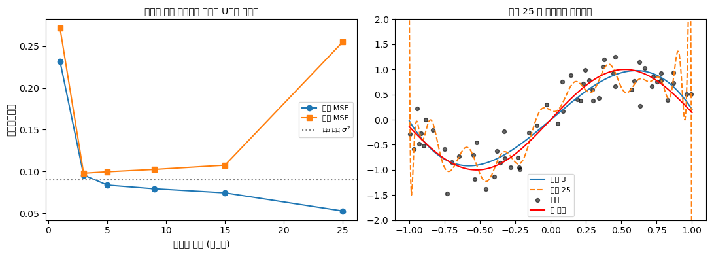

# 두 패러다임의 강점과 한계

고전적 접근(설계된 수집)과 현대적 접근(알고리즘 학습)은 경쟁 관계가 아니라 상호 보완적이다. 둘의 절충 관계를 이해하면 어떤 문제에 어떤 방법론을 택할지 판단할 수 있다. 경험 많은 데이터 과학자는 주어진 질문이 어느 패러다임에 속하는지 알고, 둘 다 필요한 드문 혼합 사례를 알아보며, 인과적 질문에 알고리즘을 쓰거나 예측 문제에 경직된 가설검정을 쓰는 흔한 오류를 피한다.

## 두 패러다임 비교

| 차원 | 고전적(설계된 수집) | 현대적(알고리즘 학습) |
|---|---|---|
| 출발점 | 연구 질문 → 설계 → 자료 | 기존 자료 → 알고리즘 → 통찰 |
| 주된 목표 | 추론, 인과적 이해 | 예측, 패턴 발견 |
| 인과성 | 무작위화나 준실험을 통해 강함 | 약함, 추가 가정 없이는 연관성만 |
| 확장성 | 자료 수집 비용에 제약됨 | 수십억 관측값까지 일상적으로 확장 |
| 해석가능성 | 높음 — 모수가 실질적 의미를 가짐 | 흔히 낮음 — 다수 모형이 블랙박스 |
| 불확실성 정량화 | 내장됨(신뢰구간, p-값, 결정규칙) | 흔히 부트스트랩·보정·컨포멀 예측으로 사후 부착 |
| 필요 표본 크기 | 소~중 규모 | 클수록 좋음, $n \gg p$일 때 가장 잘 작동 |


## 고전적 접근이 유리할 때

- **인과적 질문**: 임상시험, A/B 테스트, 정책 평가. 강한 가정을 끌어들이지 않고 인과효과를 식별하는 일상적인 방법은 무작위화뿐이다.
- **규제 맥락**: FDA, EMA를 비롯한 많은 규제기관이 사전등록된 프로토콜을 갖춘 형식적 실험 설계를 요구한다.
- **정밀한 불확실성이 중요할 때**: 포함확률이 타당한 신뢰구간, 오류율이 알려진 $p$-값.
- **목표 모집단으로 일반화해야 할 때**: 확률표집은 모집단 모수에 대해 편향과 분산을 정량화할 수 있는 추정량을 제공한다.

## 현대적 접근이 유리할 때

- **순수한 예측**: 이탈, 수요, 부도, 클릭률 예측. 표본 밖 손실이 가장 작은 알고리즘이 이기며, 모형의 구조는 중요하지 않다.
- **고차원 또는 비정형 자료**: 텍스트, 이미지, 음성, 그래프 — 유연한 함수 근사기가 어떤 모수적 모형보다 뛰어난 영역.
- **이미 대규모로 수집된 자료**: 웹 로그, 거래 기록, 센서 스트림. 새 연구를 설계하는 것이 불가능하며, 현대적 접근은 뽑아낼 수 있는 가치를 뽑아낸다.
- **반복적 엔지니어링**: 이론을 검정하는 것이 아니라 지표를 밀어 올리는 것이 목표인 모형 배포 주기.

## 둘을 결합하는 혼합 접근

- **이중 / 편향제거 기계학습**(Chernozhukov 외, 2018): 방해모수 함수에는 유연한 기계학습 추정량을 쓰고, 직교화된 점수방정식을 적용해 불편인 인과효과 추정값을 복원한다.
- **인과 포레스트**(Wager & Athey, 2018): 실험 자료나 관찰 자료에서 이질적 처리효과를 구하는 트리 기반 방법.
- **설계된 자료, 현대적 분석**: 주요 평가변수 분석에 신경망을 쓰는 무작위 임상시험이라도 무작위화에서 오는 인과적 타당성을 그대로 물려받는다.
- **사후 해석가능성**: SHAP, LIME, 통합 그래디언트 — 예측 정확도를 희생하지 않으면서 블랙박스 예측을 부분적으로 해석 가능하게 만든다.

## 알아두어야 할 실패 유형

- **고전적 망치로 현대적 못 치기**: 관계가 명백히 비선형이고 표본이 거대한데도 손으로 고른 몇 개 예측변수만으로 선형모형을 고집하는 것. 모형은 해석 가능하지만 예측력은 형편없다.
- **현대적 망치로 고전적 못 치기**: 관찰자료로 딥러닝 모형을 학습시킨 뒤 그 변수 중요도를 인과효과로 해석하는 것. 모형은 같은 분포 안에서는 잘 예측할지 몰라도 그 "설명"은 허위 상관을 반영한다.
- **한쪽을 다른 쪽인 척하기**: 교차검증으로 선택한 모형에서 나온 $p$-값을 보고하거나, "검증 정확도"가 "외적 타당도"와 같다고 주장하는 것.

<div class="codebox" markdown>

## 예제 1. 두 패러다임의 강점과 한계 { .eg }

```python
"""같은 도구(선형모형)로 목표가 다른 두 일을 해 본다: 추론 대 예측."""

import numpy as np
from scipy import stats

rng = np.random.default_rng(42)
n = 500
true_effect = 2.0

# === 고전적 A/B 검정 — 목표는 "효과가 있는가"를 판정하는 것 ===
# 처리를 무작위로 배정한다. 배정이 결과와 무관하므로 인과 해석이 가능하다.
group = rng.choice([0, 1], size=n)
outcome = 10 + true_effect * group + rng.normal(0, 5, n)

# 관심사는 계수 하나(효과의 크기)와 그것에 대한 불확실성(p값)이다.
# 예측 정확도는 아예 재지도 않는다. 잡음이 커서 개별 예측은 형편없다.
t_stat, p_val = stats.ttest_ind(outcome[group == 1], outcome[group == 0])
print("=== Classical A/B test ===")
print(f"Estimated effect: {outcome[group == 1].mean() - outcome[group == 0].mean():+.2f} "
      f"(true {true_effect})")
print(f"p = {p_val:.4f}")

# === 현대적 예측 — 목표는 "새 자료에서 얼마나 잘 맞히는가" ===
# 설명변수 3개짜리 회귀. 계수의 의미나 유의성에는 관심이 없다.
X = rng.standard_normal((n, 3))
y = 2 * X[:, 0] - X[:, 1] + 0.5 * X[:, 2] + rng.standard_normal(n)

# 자료를 훈련용과 시험용으로 반씩 나눈다.
# 이 분할이 예측 패러다임의 핵심이다. 모형이 **보지 않은** 자료로 평가해야
# 외운 것인지 배운 것인지 구별할 수 있다.
train, test = np.arange(n // 2), np.arange(n // 2, n)

# 훈련자료로만 계수를 구한다(최소제곱)
beta_train = np.linalg.lstsq(X[train], y[train], rcond=None)[0]

# 시험자료에서 평균제곱오차를 잰다. 이것이 성적표다.
mse_test = np.mean((y[test] - X[test] @ beta_train) ** 2)
print("\n=== Modern prediction ===")
print(f"Test MSE = {mse_test:.3f}")
```

출력:

```
=== Classical A/B test ===
Estimated effect: +2.35 (true 2.0)
p = 0.0000

=== Modern prediction ===
Test MSE = 1.017
```

</div>

## 연습문제

<div class="drillbox" markdown>

**연습문제 1.** <span class="diff easy" title="쉬움"></span>
다음 각 상황에서 **고전적** 접근과 **현대적** 접근 중 어느 쪽이 더 적절한지 밝히고 근거를 대라.

**(a)** 어떤 제약회사가 새 백신이 감염률을 낮추는지 판단하고자 한다.
**(b)** 어떤 전자상거래 회사가 고객이 다음에 구매할 만한 상품을 예측하고자 한다.
**(c)** 어떤 정부 기관이 알려진 오차한계로 실업률을 추정하고자 한다.
**(d)** 어떤 은행이 실시간으로 사기 의심 신용카드 거래를 표시하고자 한다.
**(e)** 어떤 보건 시스템이 새 분류 프로토콜이 환자 사망률에 미치는 인과효과를 밝혀야 한다.

</div>

??? success "풀이"
    (a) **고전적** — 인과효과를 확립하려면 사전 지정된 프로토콜을 갖춘 무작위 대조시험이 필요하다.
    (b) **현대적** — 추천은 기존 거래·탐색 자료를 이용한 예측 문제다.
    (c) **고전적** — 알려진 오차한계를 얻으려면 크기를 계획한 확률표본이 필요하다.
    (d) **현대적** — 대규모 사기 탐지에는 수백만 건의 거래에 유연한 알고리즘(그래디언트 부스팅, 신경망)이 필요하다.
    (e) 무작위 배정이 가능하다면 **고전적**(집락 RCT), 그렇지 않다면 고전적 식별과 현대적 추정을 결합한 혼합 인과추론 접근(도구변수, 이중차분법, 단계적 도입 설계).

<div class="drillbox" markdown>

**연습문제 2.** <span class="diff med" title="중간"></span>
어떤 팀이 10년치 고객 자료를 가지고 (a) 다음 달에 이탈할 고객을 예측하고, (b) 제품 정책을 바꿀 수 있도록 고객이 *왜* 이탈하는지 이해하려 한다. 각 목표에 어느 접근이 맞으며, 잘못된 쪽을 쓰면 어떻게 실패하는가?

</div>

??? success "풀이"
    **(a) 예측 → 현대적.** 과거 특성으로 그래디언트 부스팅 모형을 학습시킨다. 목표는 유지 활동을 위해 고객을 이탈 위험순으로 정렬하는 것이다. 예측변수 몇 개만 손으로 고른 모수적 모형을 쓰면 예측 정확도를 상당 부분 놓치게 된다.

    **(b) 이유의 이해 → 고전적(또는 혼합 인과추론).** 예측 모형의 변수가 정확하더라도 그 변수 중요도는 인과적이지 않다. 고객센터에 자주 전화하는 고객이 이탈을 예측할 수는 있지만, 고객센터 통화 빈도를 줄인다고 이탈이 줄지는 않는다. 둘 다 밑바탕의 불만족에서 비롯되기 때문이다. 원인을 확립하려면 가능한 개입을 A/B 테스트하거나, 명시적 식별 가정 아래 관찰자료를 신중히 인과분석해야 한다.

    목표 (b)에 현대적 접근을 쓰면 "원인이 아니라 증상을 고치는" 정책적 실수로 이어진다. 목표 (a)에 고전적 접근을 쓰면 얻을 수 있는 예측 정확도를 놓친다.

<div class="drillbox" markdown>

**연습문제 3.** <span class="diff med" title="중간"></span>
현대 패러다임에서 **표본 밖 평가**의 역할을 설명하라. 유연한 모형의 예측 정확도를 판단할 때 표본 내 $R^2$이 왜 믿을 수 없는가?

</div>

??? success "풀이"
    충분히 유연한 모형(깊은 트리, 신경망, 커널 방법)은 *어떤* 훈련 집합이든 원하는 만큼 잘 적합시킬 수 있으며, 실제 신호가 없어도 표본 내 $R^2$을 1에 가깝게 밀어 올린다. 표본 내 적합도는 일반화가 아니라 암기를 측정한다.

    **표본 밖 평가**는 이 의존을 끊는다. 별도로 떼어놓은 시험 집합(또는 $k$-겹 교차검증)은 훈련에 쓰이지 않은 자료에서 모형이 얼마나 잘 작동하는지를 측정하며, 이것이 실제 배포에서 중요한 값이다. 이는 불편추정량을 고집하는 고전적 태도의 현대적 대응물이다. 둘 다 모형 선택 과정이 보고된 성능을 부풀리는 것을 막는 방법이다.

    표본 내 오차와 표본 밖 오차의 관계는 통계적 학습이론의 **일반화 한계**(VC 차원, 라데마허 복잡도, PAC-Bayes)가 지배한다. 실무적 요점은 이것이다. 모형이 보지 못한 자료에서 측정하지 않은 $R^2$은 절대 믿지 마라.

<div class="drillbox" markdown>

**연습문제 4.** <span class="diff med" title="중간"></span>
현대적 유연 방법(이중 기계학습, 인과 포레스트)으로 관찰자료에서 인과추론을 하려면 **조건부 무시가능성** 가정이 필요하다. 이 가정을 진술하고, 그것이 왜 고전적 실험에서 무작위화의 "현대적" 대응물인지 설명하라.

</div>

??? success "풀이"
    **조건부 무시가능성:** $(Y(0), Y(1)) \perp T \mid X$. 관측된 공변량 $X$를 조건부로 하면 처리 배정 $T$가 잠재적 결과와 독립이다.

    **왜 무작위화와 대응되는가:** 고전적 RCT의 무작위화는 $(Y(0), Y(1)) \perp T$를 *무조건적으로* 보장한다. 배정이 잠재적 결과에 대해 아무 정보도 담지 않는다는 뜻이다. 관찰자료 분석은 이를 *조건부* 독립으로 약화한다. $X$를 조건부로 하면 배정이 "무작위나 다름없다"는 것이다.

    고전적 형태는 기계적이다(연구자가 설계로 보장한다). 관찰적 형태는 자료생성 과정에 대한 *가정*이며 자료만으로는 검증할 수 없다. 현대적 기계학습 방법은 모형의 모수적 형태를 완화하지만 이 근본적인 식별 가정은 완화하지 못한다. 이 방법들은 분석을 *더 유연하게* 만들 뿐 가정을 *더 약하게* 만들지 않는다.

<div class="drillbox" markdown>

**연습문제 5.** <span class="diff med" title="중간"></span>
고전 패러다임의 분석이 **타당한 추론을 주지만 예측은 형편없는** 상황의 예와, 현대 패러다임의 분석이 **예측은 탁월하지만 추론은 타당하지 않은** 상황의 예를 각각 들어라.

</div>

??? success "풀이"
    **타당한 추론, 형편없는 예측:** 환자 $n = 200$명을 대상으로 한 신약 RCT. 처리효과 추정값은 95% 신뢰구간과 함께 불편이고 $p$-값의 포함확률도 옳다. 그러나 임상의가 새 환자의 처치 후 결과를 *예측*하려 하면, 이 모형은 표본평균에 잡음을 더하고 뺀 것에 지나지 않는다. 유연한 기계학습 모형이라면 더 개인화된 예측에 활용했을 환자 공변량과 개별 특성을 무시한다.

    **탁월한 예측, 타당하지 않은 추론:** 100만 행 자료에서 200개 특성으로 대출 부도를 예측하는 그래디언트 부스팅 트리. 표본 밖 AUC가 0.92로 탁월하다. 그러나 은행이 "소득이 *인과적으로* 부도를 예측하는가, 아니면 상관된 변수를 통해서만 그런가?"라고 물으면 이 모형은 답할 수 없다. 200개 특성 중 어떤 것은 교란변수, 어떤 것은 매개변수, 어떤 것은 충돌변수인데 SHAP 중요도는 이 셋을 모두 뒤섞는다.

    두 패러다임은 서로 다른 질문에 답한다. 어느 한 모형으로 *다른 쪽* 질문에 답하려는 것이 실무에서 가장 흔한 함정이다.

<div class="drillbox" markdown>

**연습문제 6.** <span class="diff med" title="중간"></span>
어떤 스타트업이 연간 1,000건의 작은 인터페이스 변경을 A/B 테스트한다. 각 테스트는 $\alpha = 0.05$로 7일간 진행된다. 다중검정 보정을 하지 않으면 연평균 몇 건의 거짓양성이 쌓이며, 이는 고전적 추론을 무비판적으로 산업 규모로 확장하는 것에 대해 무엇을 말해주는가?

</div>

??? success "풀이"
    효과가 없다는 귀무가설 아래에서 각 검정은 확률 $\alpha = 0.05$로 거짓양성을 낸다. 1,000건의 검정에 걸쳐 기대되는 거짓양성 수는

    $$
    \mathbb{E}[\text{false positives}] = 1{,}000 \times 0.05 = 50
    $$

    이다. "이긴" 1,000건의 테스트 중 대략 50건은 우연히 이긴 것이다. 스타트업이 "유의한" 변경을 모두 배포한다면 해마다 수십 개의 쓸모없는 기능이 프로덕션에 들어가고, 때로는 서로 위에 겹쳐 쌓여 드리프트, 성능 퇴행, 알 수 없는 동작으로 이어진다.

    대응책으로는 **가족단위 오류율 통제**(본페로니: $\alpha$를 검정 수로 나눔), **거짓발견율 통제**(벤자미니–호크버그: 양성으로 선언된 것 중 거짓의 비율을 통제), 표준 관행으로서의 **더 엄격한 기준**(예: 확증 검정에 $\alpha = 0.005$), 그리고 **사전 판단**이 있다. 사전확률이 낮은 변경(효과가 작고 사업적 가치가 낮은 것)은 사전확률이 높은 변경보다 더 강한 증거를 요구해야 한다.

    더 깊은 교훈은 이것이다. 고전적 방법은 사전에 지정된 소수의 질문을 위해 설계되었지, 같은 자료를 산업 규모로 심문하기 위해 설계되지 않았다. 대규모에서 순진하게 적용하면 오류율이 소리 없이 부풀어 오른다.

<div class="drillbox" markdown>

**연습문제 7.** <span class="diff med" title="중간"></span>
연습문제 3의 "표본 내 $R^2$을 믿을 수 없다"를 그림으로 확인하라. 모형 복잡도를 키워 가며 훈련 오차와 시험 오차를 비교하라.

</div>

??? success "풀이"
    ```python
    import numpy as np
    import matplotlib.pyplot as plt

    rng = np.random.default_rng(0)
    n = 60
    x = np.sort(rng.uniform(-1, 1, n))
    y = np.sin(3 * x) + rng.normal(0, 0.3, n)
    xt = np.sort(rng.uniform(-1, 1, 2000))
    yt = np.sin(3 * xt) + rng.normal(0, 0.3, 2000)

    degrees = [1, 3, 5, 9, 15, 25]
    train_mse, test_mse = [], []
    print(f"{'다항식 차수':>11}{'훈련 MSE':>11}{'시험 MSE':>11}")
    for d in degrees:
        c = np.polyfit(x, y, d)
        train_mse.append(np.mean((np.polyval(c, x) - y) ** 2))
        test_mse.append(np.mean((np.polyval(c, xt) - yt) ** 2))
        print(f"{d:>11}{train_mse[-1]:>11.4f}{test_mse[-1]:>11.4f}")

    fig, axes = plt.subplots(1, 2, figsize=(11, 4))
    axes[0].plot(degrees, train_mse, "o-", label="훈련 MSE")
    axes[0].plot(degrees, test_mse, "s-", label="시험 MSE")
    axes[0].axhline(0.09, color="gray", ls=":", label="잡음 하한 $\\sigma^2$")
    axes[0].set_xlabel("다항식 차수 (복잡도)")
    axes[0].set_ylabel("평균제곱오차")
    axes[0].set_title("훈련은 계속 내려가고 시험은 U자를 그린다", fontsize=10)
    axes[0].legend(fontsize=8)

    grid = np.linspace(-1, 1, 400)
    for d, style in [(3, "-"), (25, "--")]:
        axes[1].plot(grid, np.polyval(np.polyfit(x, y, d), grid), style, label=f"차수 {d}")
    axes[1].scatter(x, y, s=18, color="black", alpha=0.6, label="자료")
    axes[1].plot(grid, np.sin(3 * grid), color="red", lw=1.5, label="참 함수")
    axes[1].set_ylim(-2, 2)
    axes[1].set_title("차수 25 는 잡음까지 따라간다", fontsize=10)
    axes[1].legend(fontsize=8)
    fig.tight_layout()
    plt.show()
    ```

    출력:

    ```
    다항식 차수     훈련 MSE     시험 MSE
              1     0.2318     0.2715
              3     0.0958     0.0979
              5     0.0837     0.0996
              9     0.0793     0.1025
             15     0.0744     0.1076
             25     0.0526     0.2551
    ```

    

    **훈련 MSE는 $0.232 \to 0.053$으로 단조 감소한다.** 매개변수를 늘리면 적합은 반드시 좋아진다(0장 선형대수 연습문제 9에서 본 $R^2$의 단조성과 같은 이야기다). 그러나 **시험 MSE는 U자를 그린다.** 차수 $3$에서 최소 $0.098$이고, 차수 $25$에서는 $0.255$로 차수 $1$보다도 나쁘다.

    | 차수 | 훈련 | 시험 | 상태 |
    |---|---|---|---|
    | $1$ | $0.232$ | $0.272$ | 과소적합(편향) |
    | $3$ | $0.096$ | $0.098$ | **적정** |
    | $25$ | $0.053$ | $0.255$ | 과대적합(분산) |

    차수 $3$에서 훈련과 시험이 거의 같다는 점($0.096$ 대 $0.098$)이 좋은 신호다. **둘의 격차가 곧 과대적합의 크기다.**

    **왜 이것이 두 패러다임의 분기점인가.** 고전 통계는 모형이 참이라는 전제에서 계수의 불확실성을 말한다. 현대적 예측은 모형이 참인지 묻지 않고 **보지 않은 자료에서의 손실**만 본다. 그래서 표본 밖 평가가 현대 패러다임의 유일한 심판이 된다.

    표본 내 $R^2$이나 유의성으로 유연한 모형을 평가하는 것은 시험문제를 미리 보고 채점하는 것과 같다. $\square$

<div class="drillbox" markdown>

**연습문제 8.** <span class="diff med" title="중간"></span>
연습문제 6의 A/B 테스트 공장을 실제로 돌려 보라. 보정하지 않을 때, 본페로니로 보정할 때, **거짓발견율(FDR)** 을 통제할 때가 각각 어떻게 다른가?

</div>

??? success "풀이"
    ```python
    import numpy as np
    from scipy import stats
    from statsmodels.stats.multitest import multipletests

    rng = np.random.default_rng(0)
    K, n = 1000, 2000
    true_effect = np.zeros(K)
    true_effect[:50] = 0.15                 # 1000건 중 50건만 진짜 효과가 있다

    pvals = np.empty(K)
    for i in range(K):
        a = rng.normal(0, 1, n)
        b = rng.normal(true_effect[i], 1, n)
        pvals[i] = stats.ttest_ind(b, a)[1]

    is_null = true_effect == 0
    for label, sel in [
            ("보정 없음", pvals < 0.05),
            ("본페로니", multipletests(pvals, method="bonferroni")[0]),
            ("BH (FDR 0.05)", multipletests(pvals, method="fdr_bh")[0])]:
        n_sig = sel.sum()
        n_false = np.sum(sel & is_null)
        fdr = n_false / max(n_sig, 1)
        print(f"{label:>14}: 유의 {n_sig:>3}건   거짓 {n_false:>2}건   "
              f"실제 거짓발견율 {fdr:.3f}   참 효과 검출 {np.sum(sel & ~is_null):>2}/50")
    ```

    출력:

    ```
    보정 없음: 유의 105건   거짓 55건   실제 거짓발견율 0.524   참 효과 검출 50/50
              본페로니: 유의  37건   거짓  0건   실제 거짓발견율 0.000   참 효과 검출 37/50
     BH (FDR 0.05): 유의  50건   거짓  3건   실제 거짓발견율 0.060   참 효과 검출 47/50
    ```

    | 방법 | 유의 | 거짓 | 거짓발견율 | 참 효과 검출 |
    |---|---|---|---|---|
    | 보정 없음 | $105$ | $55$ | $0.524$ | $50/50$ |
    | 본페로니 | $37$ | $0$ | $0.000$ | $37/50$ |
    | BH | $50$ | $3$ | $0.060$ | $47/50$ |

    **보정하지 않으면 "승리" 두 건 중 한 건이 순전한 잡음이다.** 연습문제 6이 계산한 대로 $950 \times 0.05 \approx 48$건의 거짓양성이 기대되고 실제로 $55$건이 나왔다. 제품팀은 이 중 절반을 실제로 배포하게 된다.

    **본페로니는 지나치게 엄격하다.** 거짓을 하나도 허용하지 않는 대신 참 효과 $50$건 중 $13$건을 놓친다. 가족단위 오류율(하나라도 틀릴 확률)을 통제하는 것이 목표라 검정 수가 많아질수록 문턱이 가혹해진다.

    **BH는 이 맥락에 정확히 맞는다.** 거짓발견율, 곧 **"내가 채택한 것 중 틀린 것의 비율"** 을 통제한다. 결과적으로 $50$건을 채택해 그중 $3$건만 틀렸고(목표 $0.05$ 근처인 $0.060$) 참 효과의 $94\%$를 잡았다.

    BH가 목표 $0.05$를 조금 넘은 것은 우연 변동이다. FDR 통제는 **반복에 걸친 기댓값** 보장이지 매번 지켜지는 상한이 아니다.

    **왜 산업 규모에서 FDR인가.** 연 $1000$건의 실험에서 목표는 "단 하나의 실수도 없게"가 아니라 **"배포한 것들이 대체로 진짜이게"** 다. 실수 하나의 비용이 크지 않고 기회를 놓치는 비용이 크다면 FDR이 맞는 기준이다.

    반대로 규제 승인이나 안전성 판단처럼 **단 한 건의 거짓양성이 치명적인** 맥락에서는 본페로니 계열의 엄격한 통제가 맞다. **어느 오류율을 통제할지는 통계가 아니라 맥락이 정한다.** $\square$

<div class="drillbox" markdown>

**연습문제 9.** <span class="diff hard" title="어려움"></span>
본문이 소개한 **이중 기계학습**을 구현하라. 유연한 방법을 순진하게 끼워 넣으면 왜 실패하며, 직교화와 교차적합이 무엇을 고치는가?

</div>

??? success "풀이"
    부분선형모형 $Y = \tau D + g(X) + \varepsilon$, $D = m(X) + \eta$에서 $\tau$를 추정한다. $g$와 $m$은 복잡해서 기계학습이 필요하지만, 우리가 원하는 것은 $\tau$ 하나다.

    ```python
    import numpy as np
    from sklearn.ensemble import RandomForestRegressor
    from sklearn.linear_model import LinearRegression
    from sklearn.model_selection import KFold

    rng = np.random.default_rng(0)
    n, p, tau = 2000, 10, 1.0
    rf = lambda: RandomForestRegressor(n_estimators=60, random_state=0, n_jobs=-1)

    naive, plugin, dml = [], [], []
    for _ in range(200):
        X = rng.normal(0, 1, (n, p))
        g = np.sin(X[:, 0]) + 0.5 * X[:, 1] ** 2 + X[:, 2]
        D = 0.8 * np.tanh(X[:, 0]) + 0.5 * X[:, 1] + rng.normal(0, 1, n)
        Y = tau * D + g + rng.normal(0, 1, n)

        naive.append(LinearRegression().fit(D.reshape(-1, 1), Y).coef_[0])

        # 순진한 플러그인: 같은 자료로 g 를 적합해 빼기
        gm = rf().fit(X, Y)
        plugin.append(LinearRegression().fit(
            D.reshape(-1, 1), Y - gm.predict(X)).coef_[0])

        # DML: 양쪽을 직교화하고 교차적합한다
        Yr, Dr = np.empty(n), np.empty(n)
        for tr, te in KFold(5, shuffle=True, random_state=0).split(X):
            Yr[te] = Y[te] - rf().fit(X[tr], Y[tr]).predict(X[te])
            Dr[te] = D[te] - rf().fit(X[tr], D[tr]).predict(X[te])
        dml.append((Dr @ Yr) / (Dr @ Dr))

    for label, v in [("보정 없는 OLS", naive), ("순진한 플러그인", plugin),
                     ("DML (직교화 + 교차적합)", dml)]:
        v = np.array(v)
        print(f"{label:>22}: 평균 {v.mean():.4f}   편향 {v.mean() - tau:+.4f}"
              f"   표준편차 {v.std():.4f}")
    ```

    출력:

    ```
    보정 없는 OLS: 평균 1.2173   편향 +0.2173   표준편차 0.0303
                  순진한 플러그인: 평균 0.2514   편향 -0.7486   표준편차 0.0089
          DML (직교화 + 교차적합): 평균 0.9608   편향 -0.0392   표준편차 0.0269
    ```

    | 방법 | 편향 |
    |---|---|
    | 보정 없는 OLS | $+0.217$ |
    | 순진한 플러그인 | $\mathbf{-0.749}$ |
    | DML | $-0.039$ |

    **순진한 플러그인이 보정하지 않은 것보다 훨씬 나쁘다.** 이것이 핵심이다.

    **왜 실패하는가.** 두 가지 문제가 겹친다.

    - **정칙화 편향.** 랜덤포레스트는 예측을 잘하려고 $D$가 설명해야 할 변동까지 $\hat g(X)$로 흡수한다. $X$가 $D$를 예측하기 때문이다. 그 결과 $Y - \hat g(X)$에는 $\tau D$의 상당 부분이 이미 빠져 있다.
    - **과대적합 편향.** 같은 자료로 $\hat g$를 적합하고 잔차를 쓰면 잔차가 자료에 의존하게 되어 편향이 생긴다.

    **두 가지 처방이 각각을 고친다.**

    - **직교화**: $Y$만이 아니라 $D$도 $X$에 대해 잔차화한 뒤 $\tilde{Y}$를 $\tilde{D}$에 회귀한다. 이렇게 만든 추정방정식은 $g$와 $m$의 추정오차에 대해 **1차적으로 둔감**하다(네이만 직교성). 방해모수를 조금 틀려도 $\tau$는 거의 흔들리지 않는다.
    - **교차적합**: 잔차를 계산할 관측은 그 모형의 학습에 쓰지 않는다. 앞 절의 표본 밖 평가와 같은 착상이다.

    **남은 $-0.039$의 편향**은 랜덤포레스트 자체의 유한표본 편향에서 온다. DML의 이론적 보장은 방해모수 추정이 $n^{-1/4}$보다 빠르게 수렴할 때 성립하는 점근적 결과이며, 유한표본에서는 이런 잔여 편향이 남는다.

    **이것이 혼합 접근의 전형이다.** 예측에는 현대적 도구를 쓰되, 인과 추정량은 고전적 추론이 요구하는 성질(불편성, 타당한 신뢰구간)을 갖도록 **설계해서** 만든다. $\square$

<div class="drillbox" markdown>

**연습문제 10.** <span class="diff med" title="중간"></span>
본문의 실패 유형 중 "현대적 망치로 고전적 못 치기"를 수치로 보여라. **변수 중요도가 인과효과가 아님**을 극단적인 예로 확인하라.

</div>

??? success "풀이"
    ```python
    import numpy as np
    from sklearn.ensemble import RandomForestRegressor

    rng = np.random.default_rng(1)
    n = 20_000

    X1 = rng.normal(0, 1, n)                 # 참 원인
    U = rng.normal(0, 1, n)                  # 측정되지 않은 교란요인
    X3 = U + rng.normal(0, 0.3, n)           # 교란요인의 대리
    Y = 2.0 * X1 + 1.5 * U + rng.normal(0, 1, n)
    X2 = Y + rng.normal(0, 0.5, n)           # Y 의 결과 — 인과효과는 정확히 0

    F = np.column_stack([X1, X2, X3])
    rf = RandomForestRegressor(n_estimators=200, random_state=0, n_jobs=-1).fit(F, Y)

    names = ["X1  참 원인 (효과 2.0)", "X2  Y 의 결과 (효과 0)", "X3  교란 대리 (효과 0)"]
    print("랜덤포레스트 변수 중요도")
    for name, imp in sorted(zip(names, rf.feature_importances_), key=lambda z: -z[1]):
        print(f"  {name:<26} {imp:.4f}")
    print(f"\n모형 결정계수 {rf.score(F, Y):.4f}   ← 예측은 거의 완벽하다")
    ```

    출력:

    ```
    랜덤포레스트 변수 중요도
      X2  Y 의 결과 (효과 0)          0.9763
      X1  참 원인 (효과 2.0)          0.0120
      X3  교란 대리 (효과 0)           0.0117

    모형 결정계수 0.9956   ← 예측은 거의 완벽하다
    ```

    **결과가 완전히 뒤집혀 있다.**

    | 변수 | 참 인과효과 | 변수 중요도 |
    |---|---|---|
    | X2 (Y의 결과) | $\mathbf{0}$ | $\mathbf{0.976}$ |
    | X1 (참 원인) | $\mathbf{2.0}$ | $0.012$ |
    | X3 (교란 대리) | $0$ | $0.012$ |

    인과효과가 **정확히 $0$인** 변수가 중요도의 $98\%$를 차지하고, 유일한 참 원인은 $1\%$에 그친다. 그런데 모형의 $R^2$는 $0.996$이다.

    **왜 이런 일이 벌어지는가.** $X2$는 $Y$의 잡음 섞인 복사본이므로 $Y$를 예측하는 데 압도적으로 유용하다. **예측력과 인과효과는 서로 다른 것을 재는 양이다.**

    - 변수 중요도는 "이 변수를 알면 $Y$를 얼마나 잘 맞히는가"를 잰다.
    - 인과효과는 "이 변수를 **바꾸면** $Y$가 얼마나 변하는가"를 잰다.

    $X2$에 개입해 값을 올려도 $Y$는 꿈쩍하지 않는다. $X2$는 $Y$의 하류에 있기 때문이다. 온도계 눈금을 손으로 올린다고 방이 더워지지 않는 것과 같다.

    **SHAP도 마찬가지다.** SHAP 값은 "모형이 왜 그렇게 예측했는가"를 설명할 뿐 "세계가 어떻게 작동하는가"를 설명하지 않는다. 모형이 허위 상관에 의존하고 있다면 SHAP는 그 허위 상관을 충실히 보여 준다.

    !!! danger "이 오류가 실제로 비싼 이유"
        예측 모형의 변수 중요도를 보고 **정책을 바꾸는 것**이 문제다. "이탈 예측 모형에서 고객센터 문의 횟수가 가장 중요하다"에서 "문의를 줄이면 이탈이 준다"로 넘어가는 순간 $X2$의 함정에 빠진다. 문의는 이탈의 **원인이 아니라 전조**일 수 있다.

        예측에 쓸 모형과 개입에 쓸 모형은 다르다. 개입을 정당화하려면 무작위화나 이 절에서 본 식별 전략이 필요하며, 아무리 정확한 예측 모형도 그 자리를 대신하지 못한다. $\square$

---

## 정리하며

두 패러다임은 경쟁하지 않는다. **서로 다른 질문에 답한다.**

- **고전적 접근**은 연구 질문에서 출발해 자료를 설계한다. 인과적 주장이 강하고, 모수가 실질적 의미를 가지며, 불확실성 정량화가 처음부터 내장되어 있다. 대가는 규모와 비용이다.
- **현대적 접근**은 이미 있는 자료에서 출발한다. 수십억 관측까지 확장되고 예측 성능이 뛰어나지만, 추가 가정 없이는 연관성만 말하며 불확실성은 부트스트랩·보정·컨포멀 예측으로 **나중에 붙여야** 한다.

**질문이 방법을 정한다.** "이 처치가 효과가 있는가"는 무작위화가 필요한 인과 질문이고, "다음 달 수요가 얼마인가"는 예측 질문이다. 흔한 두 가지 오류가 **인과적 질문에 예측 알고리즘을 쓰는 것**과 **예측 문제에 경직된 가설검정을 씌우는 것**이다.

**혼합이 필요한 경우도 있다.** A/B 테스트는 설계된 무작위화(고전)를 대규모 로그 자료(현대) 위에서 수행하는 것이고, 인과 추론에 기계학습을 쓰는 최근의 방법들은 예측력을 식별 전략의 부품으로 삼는다.

다음 절 **예측 대 추론**에서 이 구분을 더 날카롭게 다듬는다. 같은 회귀식을 두고도 계수를 해석하려는 것과 새 값을 맞히려는 것은 요구하는 조건이 다르며, 그 차이가 모형 선택 전체를 바꾼다.
