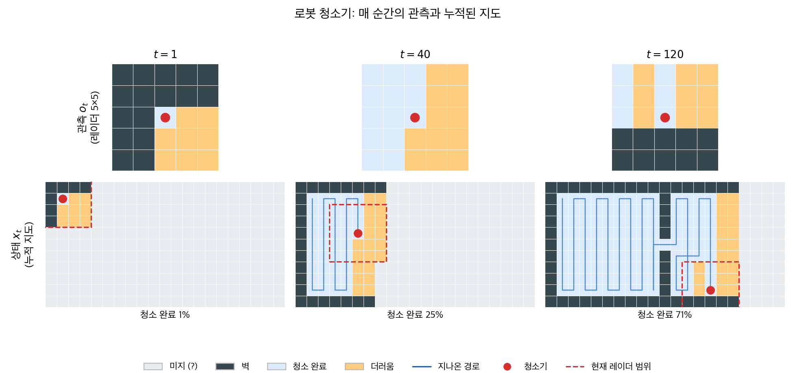

# 강화학습

## 개요

**강화학습(RL)** 에서는 **에이전트**가 **환경**과 상호작용하며 의사결정을 배운다. 에이전트는 자신의 행동에 따라 **보상**이나 **벌점**을 받고, 누적 보상을 최대화하도록 시간에 걸쳐 행동을 조정한다. 지도학습과 달리 레이블이 붙은 입력–출력 쌍이 없으며, 에이전트는 시행착오를 통해 어떤 행동이 가장 좋은 결과로 이어지는지 스스로 발견해야 한다.

## 주요 특징

- **에이전트–환경 상호작용**: 에이전트가 행동을 취하면 환경이 새로운 상태와 보상 신호로 응답한다.
- **순차적 의사결정**: 행동은 즉각적인 보상뿐 아니라 미래의 상태와 미래의 보상에도 영향을 준다.
- **탐색 대 활용**: 에이전트는 새로운 행동을 시도하는 것(탐색)과 이미 좋다고 아는 것을 활용하는 것(활용) 사이에서 균형을 잡아야 한다.
- **지연된 보상**: 어떤 행동의 결과가 즉시 드러나지 않을 수 있으므로, 에이전트는 현재의 행동을 미래의 결과와 연결짓는 법을 배워야 한다.

## 강화학습의 틀

각 시점 $t$에서 에이전트는:

1. 현재 **상태** $s_t$를 관측한다.
2. 자신의 **정책** $\pi$에 따라 **행동** $a_t$를 선택한다.
3. **보상** $r_t$를 받고 새로운 상태 $s_{t+1}$로 전이한다.

에이전트의 목표는 기대 누적(할인) 보상을 최대화하는 정책 $\pi^*$를 학습하는 것이다.

$$
\pi^* = \arg\max_\pi \; E\left[\sum_{t=0}^{\infty} \gamma^t \, r_t \right]
$$

여기서 $\gamma \in [0, 1)$는 미래 보상을 즉각적인 보상에 비해 얼마나 중요하게 여길지 조절하는 **할인율**이다.

```
    ┌─────────┐
    │  에이전트  │
    │   (π)    │
    └──┬───▲──┘
   행동 │   │ 상태, 보상
       │   │
    ┌──▼───┴──┐
    │   환경   │
    └─────────┘
```

## 자세히 보기: 로봇 청소기

앞의 정식화에는 상태 $s_t$가 그냥 주어진 것처럼 등장한다. 실제 문제에서 이것이 얼마나 큰 가정인지 보려면 로봇 청소기만 한 예가 없다. 우리가 매일 거실에서 보는 물건이면서, 강화학습의 어려운 부분이 전부 들어 있다.

### 문제

청소기를 방에 놓으면 방 전체를 빠짐없이 돌아야 한다. 그런데 청소기가 가진 센서 — 라이다, 적외선, 범퍼 — 의 유효 거리는 짧다. **매 순간 청소기가 아는 것은 자기 주변 몇십 센티미터뿐이다.** 방의 전체 도면은 어디에도 주어지지 않는다.

그래서 청소기는 돌아다니면서 지금 본 것을 **여태까지 본 것 위에 계속 덧붙인다.** 이렇게 쌓아 올린 방 지도가 청소기의 머릿속에 있는 세계이며, 그것을 근거로 다음 행동을 정한다.

### 관측 $o_t$과 상태 $x_t$는 다르다

이 예에서 가장 중요한 구분이 여기에 있다.

- **관측 $o_t$** — 지금 이 순간 레이더에 잡힌 것. 주변 몇 칸의 국소 지도. 매 시점 새로 들어오고, 지나간 것은 남지 않는다.
- **상태 $x_t$** — 시작부터 지금까지의 관측을 누적해 만든 **전역 지도**와 그 안에서의 자기 위치. 청소기가 실제로 의사결정에 쓰는 것.

상태는 주어지는 것이 아니라 **청소기가 재귀적으로 만들어 나간다.**

$$
x_{t+1} = f(x_t,\, a_t,\, o_{t+1})
$$

새 지도는 옛 지도에 방금 한 행동(내가 어디로 움직였는지)과 방금 들어온 관측을 합쳐 갱신한 것이다. 로보틱스에서는 이 갱신 과정을 **SLAM**(동시적 위치추정 및 지도작성)이라 부른다.

아래는 실제로 시뮬레이션을 돌려 뽑은 청소기의 머릿속이다. 로봇 청소기 앱에서 청소 중에 보게 되는 그 지도와 같은 것이다.



**윗줄이 관측 $o_t$다.** 매 순간 레이더에 잡히는 것은 이 $5 \times 5$ 조각이 전부다. 방이 얼마나 큰지, 자기가 어디 있는지, 어디를 이미 치웠는지가 여기에는 없다. 세 시점의 조각을 나란히 놓아도 서로 구별되지 않는다는 점에 주목하라.

**아랫줄이 상태 $x_t$다.** 같은 시점에 청소기가 실제로 들고 있는 전역 지도이며, 윗줄의 조각들을 지나온 경로를 따라 이어 붙여 만든 것이다. 붉은 점선 상자가 그 순간의 레이더 범위 — 즉 윗줄에 해당하는 영역이고, 전체 지도에 비해 얼마나 작은지 보인다.

$t = 1$에서는 거의 전부가 미지의 영역이다. $t = 40$에서는 왼쪽 방을 훑어 내려가며 25%를 치웠고 오른쪽은 아직 존재조차 모른다. $t = 120$에서는 가운데 칸막이의 **문**을 통과해 오른쪽 방으로 넘어갔다. 지도는 청소기가 지나간 만큼만 자란다.

!!! note "그림에 관하여"
    이 그림은 아래 시뮬레이션 코드를 그대로 돌려 그린 것이다(시드 0, 지도 작성 에이전트). 생성 스크립트는 저장소의 `scripts/make_robot_cleaner_map.py`에 있다.

### 왜 관측을 그대로 상태로 쓰면 안 되는가

강화학습의 정식화는 상태가 **마르코프 성질**을 갖는다고 가정한다. 즉 $s_t$만 알면 과거를 더 알 필요가 없어야 한다.

$$
P(s_{t+1} \mid s_t, a_t) = P(s_{t+1} \mid s_0, a_0, \ldots, s_t, a_t)
$$

레이더 관측 $o_t$는 이 성질을 만족하지 않는다. 이유가 둘이다.

**첫째, 같은 관측이 방 안 수십 군데에서 똑같이 나온다.** 사방이 트인 마룻바닥 한가운데라는 관측은 왼쪽 방에서도 오른쪽 방에서도 동일하다. 그러나 그 두 지점에서 해야 할 행동은 정반대일 수 있다. 관측만으로는 **어디에 있는지 알 수 없다.** 이를 **지각적 혼동(perceptual aliasing)** 이라 한다.

**둘째, 이미 청소한 곳인지가 관측에 들어 있지 않다.** 깨끗한 바닥은 청소해서 깨끗한 것인지 원래 깨끗한 것인지 구별되지 않는다.

관측이 상태를 결정하지 못하는 이런 문제를 **부분관측 마르코프 결정과정(POMDP)** 이라 한다. 표준적인 해법이 바로 이 절이 말하는 것이다. **과거 이력을 요약한 통계량을 상태로 삼는다.** 누적 지도가 정확히 그 요약이며, 이력 전체를 들고 다니지 않으면서도 의사결정에 필요한 정보를 담고 있다.

### 행동이 다음 관측을 정한다

행동은 네 가지다. $a_t \in \{$전진, 후진, 좌회전, 우회전$\}$. 각 행동은 두 가지를 동시에 바꾼다.

1. **청소되는 칸** — 즉각적인 보상.
2. **다음에 무엇을 관측할지** — 미래에 얻을 정보.

두 번째가 강화학습을 지도학습과 갈라 놓는 지점이다. 지도학습에서는 자료가 이미 있고 모형이 무엇을 예측하든 자료는 바뀌지 않는다. 청소기는 **자기가 움직인 곳의 자료만 얻는다.** 왼쪽 방에만 머물면 오른쪽 방에 대해서는 영원히 아무것도 모른다.

### 탐색과 활용이 물리적으로 드러난다

이 예에서는 탐색–활용 절충이 추상적인 개념이 아니라 **어느 쪽으로 갈 것인가**라는 구체적 선택이 된다.

- **활용**: 지도에 `.`으로 표시된, 더럽다고 이미 아는 칸으로 간다. 보상이 확실하다.
- **탐색**: `?`로 남아 있는 미지의 영역으로 간다. 당장은 아무 보상이 없고, 거기에 무엇이 있을지도 모른다.

실제 청소기가 쓰는 전략이 **프론티어 기반 탐사**다. 아는 영역과 모르는 영역의 경계(프론티어)로 이동하여 지도를 넓힌다. 아래 예제의 두 번째 에이전트가 하는 일이 바로 이것이다.

### 지연된 보상과 신용 배정

$t = 120$의 지도에서 문을 통과하는 순간을 생각해 보자. 그 한 걸음의 즉각적 보상은 **0에 가깝다.** 문간은 이미 청소했거나 좁아서 얻을 것이 없다. 그런데 그 행동의 진짜 가치는 그 뒤 수십 걸음에 걸쳐 오른쪽 방을 청소하며 실현된다.

할인율 $\gamma$가 작으면 청소기는 이 행동의 가치를 알아보지 못한다. 눈앞의 먼지만 좇다가 왼쪽 방을 맴돈다. **문을 통과하는 법을 배우려면 멀리 보아야 한다.**

!!! warning "보상을 잘못 설계하면 어떻게 되는가"
    "빨아들인 먼지의 양"을 보상으로 주면 자연스러워 보인다. 그런데 이 보상 아래에서 최적 정책은 **먼지를 도로 뱉어 놓고 다시 빨아들이는 것**이다. 그 편이 새 방을 찾아다니는 것보다 단위 시간당 보상이 크기 때문이다.

    보상은 우리가 **원하는 것**을 적어야 하지 우리가 **재기 쉬운 것**을 적어서는 안 된다. 이 청소기의 목표는 먼지를 많이 빨아들이는 것이 아니라 **방을 깨끗하게 만드는 것**이므로, 보상은 "새로 깨끗해진 칸 수"여야 하고 여기에 시간·배터리 벌점이 붙어야 한다.

    이는 1.4의 **알고리즘 편향** 절에서 본 목표변수와 대리변수의 간극과 같은 문제다. 검거를 범죄의 대리변수로 쓰는 것과 흡입량을 청결의 대리변수로 쓰는 것은 같은 종류의 실수다.

### 실험: 관측만 쓰는 청소기 대 지도를 쌓는 청소기

두 청소기를 같은 방에 놓아 본다. 방은 칸막이로 나뉜 두 개의 공간이고 가운데 문 하나로 이어져 있다. 레이더는 주변 두 칸까지만 본다. 둘의 차이는 **상태로 무엇을 쓰는가** 하나뿐이다.

- **에이전트 A** ($s_t = o_t$): 기억이 없다. 지금 레이더에 더러운 칸이 보이면 그쪽으로, 안 보이면 무작위로 움직인다.
- **에이전트 B** ($x_t = $ 누적 지도): 본 것을 지도에 쌓고, 가장 가까운 "더럽다고 아는 칸 또는 미지의 칸"으로 최단 경로를 따라간다.

```python
"""관측은 상태가 아니다: 근거리 레이더를 단 로봇 청소기."""

import numpy as np
from collections import deque

H, W = 11, 21          # 방의 크기 (세로 11칸, 가로 21칸)
RADAR = 2              # 로봇은 자기 주변 2칸까지만 볼 수 있다
MAX_STEPS = 4000       # 이 걸음 수를 넘으면 실패로 친다
MOVES = {"up": (-1, 0), "down": (1, 0), "left": (0, -1), "right": (0, 1)}
STEP_OF = {v: k for k, v in MOVES.items()}      # 변위 -> 행동 이름 (역방향 표)


# === 문 하나로 이어진 두 개의 방 ===
def make_room():
    """가장자리는 벽, 가운데 칸막이에 문이 하나 뚫린 방을 만든다."""
    wall = np.zeros((H, W), dtype=bool)
    wall[0, :] = wall[-1, :] = wall[:, 0] = wall[:, -1] = True   # 바깥 테두리
    wall[:, 10] = True                       # 가운데 칸막이
    wall[5, 10] = False                      # 문 한 칸
    # 이 구조가 중요하다. 문을 찾아 통과해야만 오른쪽 방을 청소할 수 있다.
    return wall


def visible(pos):
    """현재 위치에서 레이더에 잡히는 칸들의 목록. 이것이 관측 o_t 다."""
    r, c = pos
    return [(i, j) for i in range(r - RADAR, r + RADAR + 1)
                   for j in range(c - RADAR, c + RADAR + 1)
                   if 0 <= i < H and 0 <= j < W]


# === 에이전트 A: 상태 = 지금 이 순간의 레이더 화면. 기억이 없다 ===
def agent_observation(pos, dirty, known, known_dirty, rng):
    """s_t = o_t 로 두는 정책. 보이는 것에만 반응한다."""
    # 레이더 안에 더러운 칸이 있는가?
    seen = [cell for cell in visible(pos) if dirty[cell]]
    if seen:
        # 있으면 그중 가장 가까운 칸(맨해튼 거리) 쪽으로 한 걸음 간다
        tr, tc = min(seen, key=lambda t: abs(t[0] - pos[0]) + abs(t[1] - pos[1]))
        options = []
        if tr < pos[0]: options.append("up")
        if tr > pos[0]: options.append("down")
        if tc < pos[1]: options.append("left")
        if tc > pos[1]: options.append("right")
        if options:
            return options[rng.integers(len(options))]
    # 보이는 범위에 더러운 칸이 없으면 무작위로 헤맨다.
    # 어디를 이미 청소했는지 기억하지 못하므로 이것 말고는 할 수 있는 게 없다.
    return list(MOVES)[rng.integers(4)]


# === 에이전트 B: 상태 = 지금까지 쌓아 올린 지도 ===
def agent_map(pos, dirty, known, known_dirty, rng):
    """더럽다고 아는 칸 또는 아직 안 가 본 칸 중 가장 가까운 곳으로 간다.

    너비우선탐색(BFS)으로 최단 경로를 찾는다.
    핵심은 탐색이 실제 방이 아니라 **로봇이 가진 지도(known)** 위에서 이뤄진다는 것이다.
    즉 이 정책은 자기가 아는 만큼만 계획할 수 있다.
    """
    parent, queue, goal = {pos: None}, deque([pos]), None
    while queue:
        cur = queue.popleft()
        # 목표 조건: 더러운 것으로 기록된 칸이거나(known_dirty),
        #            아직 한 번도 관측하지 못한 칸이다(known == 0).
        # 둘째 조건이 탐험을 만들어 낸다. 미지의 영역이 곧 목표가 되기 때문이다.
        if cur != pos and (known_dirty[cur] or known[cur] == 0):
            goal = cur
            break
        for dr, dc in MOVES.values():
            nxt = (cur[0] + dr, cur[1] + dc)
            if (0 <= nxt[0] < H and 0 <= nxt[1] < W
                    and nxt not in parent and known[nxt] != 2):   # 벽으로 아는 칸은 지나가지 않는다
                parent[nxt] = cur
                queue.append(nxt)
    if goal is None:
        return list(MOVES)[rng.integers(4)]     # 갈 곳이 없으면(있을 수 없지만) 무작위

    # 찾은 목표에서 부모를 거슬러 올라가 "첫 걸음"이 무엇이었는지 알아낸다
    cur = goal
    while parent[cur] != pos:
        cur = parent[cur]
    return STEP_OF[(cur[0] - pos[0], cur[1] - pos[1])]


# === 한 번의 에피소드: 방을 다 치우거나 시간이 다할 때까지 ===
def run(agent, seed):
    rng = np.random.default_rng(seed)
    wall = make_room()
    dirty = ~wall.copy()          # 벽이 아닌 모든 칸이 처음엔 더럽다
    total = dirty.sum()
    pos = (1, 1)                  # 왼쪽 위 구석에서 출발

    # 로봇이 **자기 머릿속에** 들고 있는 지도. 이것이 상태 x_t 다.
    #   known:       0 = 모름, 1 = 빈 칸, 2 = 벽
    #   known_dirty: 더럽다고 기록해 둔 칸
    # 처음에는 전부 0, 즉 아무것도 모르는 채로 시작한다.
    known = np.zeros((H, W), np.int8)
    known_dirty = np.zeros((H, W), bool)

    for step in range(1, MAX_STEPS + 1):
        dirty[pos] = False                                   # 발밑을 청소한다

        # 상태 갱신 x_{t+1} = f(x_t, a_t, o_{t+1}).
        # 새 관측이 들어오면 지도를 덮어쓴다. 이 한 줄이 A와 B를 가르는 전부다.
        for cell in visible(pos):                            # o_t 가 도착
            known[cell] = 2 if wall[cell] else 1
            known_dirty[cell] = dirty[cell]

        if not dirty.any():
            return step, 1.0                                 # 방을 다 치웠다

        # 정책이 행동 a_t 를 고르고, 벽이 아니면 이동한다
        dr, dc = MOVES[agent(pos, dirty, known, known_dirty, rng)]
        nxt = (pos[0] + dr, pos[1] + dc)
        if not wall[nxt]:
            pos = nxt

    # 시간이 다했다. 얼마나 치웠는지(청소율)를 함께 돌려준다.
    return MAX_STEPS, 1 - dirty.sum() / total


for label, agent in [("s = o  (radar only) ", agent_observation),
                     ("x = accumulated map ", agent_map)]:
    results = [run(agent, seed) for seed in range(30)]
    steps = np.array([r[0] for r in results])
    coverage = np.array([r[1] for r in results])
    finished = coverage >= 1.0
    median = np.median(steps[finished]) if finished.any() else float("nan")
    print(f"{label}: finished {finished.mean():4.0%} of runs | "
          f"median steps {median:6.0f} | mean coverage {coverage.mean():6.1%}")
```

출력:

```
s = o  (radar only) : finished  27% of runs | median steps    342 | mean coverage  83.8%
x = accumulated map : finished 100% of runs | median steps    171 | mean coverage 100.0%
```

난수 시드 30개에 대한 결과다.

| 상태로 쓰는 것 | 청소를 마친 시행 | 완료까지 걸음 수(중앙값) | 평균 청소율 |
|:---|---:|---:|---:|
| $s_t = o_t$ (레이더만) | **27%** | 342 | 83.8% |
| $x_t = $ 누적 지도 | **100%** | **171** | **100%** |

지도를 쌓는 청소기는 **모든 시행에서 방을 끝까지 청소했고 걸음 수는 절반**이다. 관측만 쓰는 청소기는 30번 중 8번만 완주했고, 평균 16%의 바닥을 못 치운 채 시간이 끝났다.

두 청소기의 센서 성능은 **완전히 같다.** 알고리즘의 정교함도 문제가 아니다. 차이는 오직 하나, 들어온 관측을 **버리는가 쌓는가**이다.

!!! note "관측만 쓰는 청소기는 왜 옆방을 못 찾는가"
    실패의 핵심은 걸음 수가 아니라 **구조**다. 에이전트 A는 눈앞에 더러운 칸이 보이지 않으면 무작위로 움직인다. 문은 폭이 한 칸이므로 무작위 걸음이 그 지점을 정확히 통과할 확률은 매우 낮다. 게다가 통과하더라도 자기가 통과했다는 사실을 **기억하지 못한다.**

    이 구조는 1.4의 **알고리즘 편향** 절에서 본 것과 정확히 같다. 거기서는 예측 치안 모형이 B구역에 순찰을 보내지 않아 B구역의 자료가 영영 생기지 않았다. 여기서는 청소기가 오른쪽 방에 가지 않아 오른쪽 방의 자료가 영영 생기지 않는다. **가지 않은 곳은 배울 수 없고, 배우지 못하면 갈 이유도 생기지 않는다.**

    차이는 의도에 있다. 강화학습은 이 문제를 알고 있으므로 **탐색을 설계에 명시적으로 넣는다.** 에이전트 B가 `?` 칸을 목표로 삼는 것이 바로 그 장치다. 배포된 예측 모형에는 대개 그 장치가 없다.

## 다른 패러다임과의 비교

| 측면 | 지도학습 | 비지도학습 | 강화학습 |
|---|---|---|---|
| **피드백** | 입력마다 정답 레이블 | 레이블 없음 | 보상 신호(지연된 스칼라) |
| **목표** | 입력→출력 사상 학습 | 구조 발견 | 누적 보상 최대화 |
| **자료** | 고정된 자료 | 고정된 자료 | 상호작용으로 생성됨 |
| **시간적 측면** | 대개 i.i.d. 표본 | 대개 i.i.d. 표본 | 순차적, 비 i.i.d. |

## 예

**게임 플레이:** 체스, 바둑, 아타리 게임을 하도록 에이전트를 가르치기. 알파고는 자가 대국 강화학습으로 바둑 세계 챔피언을 이긴 것으로 유명하다.

**로보틱스:** 출구에 가까워지면 보상하고 벽에 부딪히면 벌점을 주어 로봇에게 미로 탐색을 훈련시키기. 아래에서 **로봇 청소기**를 자세히 다룬다.

**자율주행:** 안전 운전에는 보상을, 충돌이나 교통법규 위반에는 벌점을 받으며 강화학습 에이전트가 차량 제어를 배운다.

**금융 응용:**

- **포트폴리오 운용:** 에이전트가 자산에 자본을 배분하고 위험조정 수익률에 비례하는 보상을 받는다.
- **주문 집행:** 시장 충격을 최소화하도록 큰 주문을 작은 거래로 쪼개는 법을 에이전트가 배운다.
- **시장 조성:** 재고 위험을 관리하면서 이익을 최대화하도록 에이전트가 매수·매도 호가를 설정한다.

## 상태 표현: 에이전트에게 무엇을 보여줄 것인가

로봇 청소기에서 상태는 시간에 걸쳐 **쌓아** 만드는 것이었다. 관측이 부분적이어서 하나만으로는 부족했기 때문이다. 상태 설계에는 또 다른 얼굴이 있다. 관측이 이미 충분한데도 **무엇을 고를지**가 문제가 되는 경우다. 아타리 게임을 배우는 심층 Q 신경망(DQN, Mnih 외, 2015)이 그 예다. 화면 한 장에 필요한 정보가 거의 다 들어 있지만, 그것을 그대로 쓸지 추려서 쓸지가 학습의 성패를 가른다.

**날것의 상태.** 화면을 그대로 상태로 쓴다. 화면을 $100 \times 100$으로 줄이고, 공이 어느 방향으로 움직이는지 알려면 한 장으로는 부족하므로 연속한 5장을 겹쳐 쓴다.

$$
\dim(s_t) = 100 \times 100 \times 5 = 50{,}000
$$

**손으로 만든 상태.** 그런데 벽돌깨기에서 정말로 필요한 정보는 무엇인가?

| 성분 | 차원 |
|:---|---:|
| 공의 위치 $(x, y)$ | 2 |
| 공의 속도 $(\dot x, \dot y)$ | 2 |
| 공의 가속도 $(\ddot x, \ddot y)$ | 2 |
| 패들의 위치와 속도 | 2 |
| 벽돌의 남은 배치(열별 요약) | 수십 |

전부 합쳐 수십 차원이면 충분하다. **50,000차원이 30차원 남짓으로 줄어든다.**

!!! note "이 대비가 세 패러다임을 잇는다"
    두 표현의 차이는 단순한 압축률이 아니다.

    - **차원이 낮으면 표본이 적게 든다.** 강화학습에서 자료는 에이전트가 직접 상호작용해서 만들어야 하고, 이는 자료 수집 비용이 곧 학습 시간이라는 뜻이다. 50,000차원 입력에서 정책을 배우려면 수천만 프레임이 필요하지만, 30차원 입력에서는 훨씬 적게 든다.
    - **그러나 손으로 만든 상태는 게임마다 다시 만들어야 한다.** "공"과 "패들"이 있다는 것을 사람이 알려준 것이다. DQN이 주목받은 이유는 정확히 그 반대였다. **같은 신경망 구조로 게임 49종을 손대지 않고 학습했다.** 표현을 사람이 설계하는 대신 화면에서 학습한 것이다.

    여기서 세 패러다임이 만난다. 날것의 화면에서 저차원 상태를 뽑아내는 일은 **비지도학습**의 차원축소 문제이고, 그 위에서 행동가치를 근사하는 일은 **지도학습**의 회귀 문제이며, 어떤 자료를 모을지 결정하는 일이 **강화학습** 고유의 문제다.

    실무적 교훈: 강화학습이 잘 되지 않을 때 먼저 의심할 것은 알고리즘이나 보상 설계가 아니라 **상태 표현**인 경우가 많다. 에이전트가 볼 수 없는 것은 배울 수 없고, 필요 없는 것까지 보면 잡음에서 신호를 찾느라 시간을 쓴다.

## 간단한 예: 다중 슬롯머신

```python
import numpy as np

np.random.seed(42)

# 5-armed bandit: each arm has a different true mean reward
true_means = [1.0, 1.5, 2.0, 1.2, 0.8]
n_arms = len(true_means)
n_steps = 1000
epsilon = 0.1  # exploration rate

# Epsilon-greedy strategy
Q = np.zeros(n_arms)       # estimated value of each arm
N = np.zeros(n_arms)       # number of times each arm was pulled
rewards = []

for t in range(n_steps):
    if np.random.rand() < epsilon:
        action = np.random.randint(n_arms)  # explore
    else:
        action = np.argmax(Q)               # exploit

    reward = np.random.normal(true_means[action], 1.0)
    N[action] += 1
    Q[action] += (reward - Q[action]) / N[action]  # incremental mean update
    rewards.append(reward)

print("Estimated values:", np.round(Q, 2))
print("True means:      ", true_means)
print(f"Average reward:   {np.mean(rewards):.2f}")
print(f"Best arm chosen:  {np.argmax(N)} (pulled {int(N[np.argmax(N)])} times)")
```

출력:

```
Estimated values: [0.83 1.41 2.04 1.14 0.61]
True means:       [1.0, 1.5, 2.0, 1.2, 0.8]
Average reward:   1.93
Best arm chosen:  2 (pulled 903 times)
```

## 핵심 요약

- 강화학습은 에이전트가 환경과의 상호작용에서 배우는 **순차적 의사결정** 문제를 위해 만들어졌다.
- **관측과 상태는 다르다.** 로봇 청소기의 레이더가 주는 것은 국소 관측 $o_t$뿐이고, 의사결정에 쓰는 상태 $x_t$는 그 관측들을 누적해 만든 전역 지도다. 관측이 상태를 결정하지 못하는 이런 문제를 **부분관측(POMDP)** 이라 하며, 표준적인 해법은 과거 이력을 요약한 통계량을 상태로 삼는 것이다.
- **상태 표현**은 주어지는 것이 아니라 설계하는 것이다. 청소기에서는 관측을 시간에 걸쳐 *쌓는* 것이 문제였고, 아타리에서는 풍부한 관측 중 무엇을 *고를* 것인가가 문제였다. 어느 쪽이든 이 선택이 필요한 표본 수를 좌우한다.
- 에이전트는 **탐색**(새 행동 시도)과 **활용**(좋다고 아는 행동 사용) 사이에서 균형을 잡는다.
- 강화학습은 게임과 로보틱스에서 놀라운 성과를 거두었고, 계량금융에서도 포트폴리오 최적화, 주문 집행, 트레이딩에 점점 더 많이 적용되고 있다.
- 지도학습·비지도학습과 달리 강화학습은 상호작용을 통해 자신의 훈련 자료를 스스로 만들어내므로, 동적이고 변화하는 환경에 적합하다.

## 연습문제

<div class="drillbox" markdown>

**연습문제 1.**
어떤 에이전트가 $\epsilon = 0.1$인 엡실론-탐욕 전략을 쓰며, 4개짜리 슬롯머신에 대해 추정된 행동가치가 $Q = [2.0, 3.5, 1.0, 4.0]$이다. 다음 단계에서 에이전트가 4번 팔(탐욕적 선택)을 고를 확률은 얼마인가? 2번 팔을 고를 확률은?

</div>

??? success "풀이"
    확률 $1 - \epsilon = 0.9$로 에이전트는 탐욕적 팔($Q$ 값이 가장 높은 팔, 즉 $Q = 4.0$인 4번)을 선택한다. 확률 $\epsilon = 0.1$로는 4개 팔 중에서 균등하게 무작위로 탐색한다.

    4번 팔을 선택할 확률은

    $$
    P(\text{arm 4}) = (1 - \epsilon) + \frac{\epsilon}{4} = 0.9 + 0.025 = 0.925
    $$

    탐욕적 선택이 아닌 2번 팔을 선택할 확률은

    $$
    P(\text{arm 2}) = \frac{\epsilon}{4} = \frac{0.1}{4} = 0.025
    $$

<div class="drillbox" markdown>

**연습문제 2.**
음식점 추천 시스템의 맥락에서 탐색–활용 절충을 설명하라. 순수한 활용이 실패하는 구체적 상황 하나와 순수한 탐색이 낭비인 상황 하나를 제시하라.

</div>

??? success "풀이"
    음식점 추천 시스템에서 **활용**은 지금까지 사용자가 가장 높게 평가한 음식점을 계속 추천하는 것이고, **탐색**은 사용자가 가보지 않았거나 경험이 적은 음식점을 추천하는 것이다.

    **순수한 활용이 실패하는 경우:** 사용자가 초기에 몇 곳만 가봤는데 우연히 그저 그런 음식점을 가장 높게 평가한 상황이다. 시스템은 그 평범한 음식점을 영원히 계속 추천하며, 근처의 훨씬 좋은 선택지를 결코 발견하지 못한다.

    **순수한 탐색이 낭비인 경우:** 사용자의 선호가 이미 분명해진 뒤에도 시스템이 가보지 않은 음식점을 계속 무작위로 추천하는 상황이다. 사용자가 이탈리아 음식을 좋아해서 여러 이탈리아 음식점에 높은 평점을 주었는데도 순수한 탐색은 계속 무작위 요리를 권해, 만족스럽지 않은 추천이 잔뜩 쌓인다.

    효과적인 시스템은 둘의 균형을 잡아야 한다. 대개는 좋다고 알려진 선택지를 추천하되, 이따금 새로운 것을 제안해 사용자 선호에 대한 이해를 다듬는다.

<div class="drillbox" markdown>

**연습문제 3.**
할인 보상 정식화에서 에이전트는 $\sum_{t=0}^{\infty} \gamma^t r_t$를 최대화한다. 할인율이 $\gamma = 0.9$이고 에이전트가 매 시점 일정한 보상 $r = 1$을 받는다면 총 할인 수익은 얼마인가? $\gamma \to 1$이면 어떻게 되는가?

</div>

??? success "풀이"
    총 할인 수익은 기하급수다.

    $$
    \sum_{t=0}^{\infty} \gamma^t \cdot 1 = \frac{1}{1 - \gamma} = \frac{1}{1 - 0.9} = 10
    $$

    $\gamma \to 1$이면 합 $\frac{1}{1-\gamma} \to \infty$가 된다. 이는 에이전트가 미래 보상을 즉각적인 보상과 거의 같게 여긴다는 뜻이며, 총 수익이 발산한다. 실무에서는 무한 지평 정식화가 잘 정의되려면(총 수익이 유한하려면) $\gamma < 1$이 필요하다. $\gamma$가 클수록 에이전트가 더 "멀리 보고", 작을수록 단기 보상을 우선한다.

<div class="drillbox" markdown>

**연습문제 4.**
강화학습, 지도학습, 비지도학습을 다음 차원에서 비교하라. (a) 사용할 수 있는 피드백의 유형, (b) 자료에서 시간 순서의 역할, (c) 학습 알고리즘의 목표.

</div>

??? success "풀이"
    **(a) 피드백의 유형:**

    - **지도학습**은 각 입력에 대해 명시적인 정답 레이블을 받는다(예: "이 이미지는 고양이다").
    - **비지도학습**은 아무 피드백도 받지 않고 원자료만 받는다.
    - **강화학습**은 흔히 지연되고 올바른 행동을 직접 알려주지도 않는 스칼라 보상 신호를 받는다.

    **(b) 시간 순서의 역할:**

    - **지도학습과 비지도학습**은 보통 자료점이 독립이고 동일한 분포를 따른다고(i.i.d.) 가정하며, 순서는 중요하지 않다.
    - **강화학습**은 본질적으로 순차적이다. 에이전트의 현재 행동이 미래의 상태와 보상에 영향을 주어 시간적 의존이 생긴다.

    **(c) 목표:**

    - **지도학습**은 보지 못한 자료로 일반화되는 입력–출력 사상을 학습하는 것을 목표로 한다.
    - **비지도학습**은 자료에 숨은 구조(군집, 잠재 요인, 밀도)를 발견하는 것을 목표로 한다.
    - **강화학습**은 환경과의 상호작용을 통해 시간에 걸친 누적 보상을 최대화하는 정책을 학습하는 것을 목표로 한다.

<div class="drillbox" markdown>

**연습문제 5.**
**다중 슬롯머신**은 상태가 결코 변하지 않는 강화학습의 특수한 경우다. 각 팔을 한 번씩만 당겨 본 뒤 경험적으로 가장 좋은 팔을 계속 고르는(더 이상 탐색하지 않는) 알고리즘의 후회를 진술하라. 이 방법은 언제 실패하는가?

</div>

??? success "풀이"
    "각 팔을 한 번씩 당긴 뒤 경험적으로 가장 좋은 팔을 고른다"는 방법은 거의 확실히 실패한다. 각 팔을 한 번씩 시도한 뒤 각 팔의 경험적 평균은 보상 잡음 자체와 비슷한 분산을 가지므로, 양의 확률로 최적이 아닌 팔이 가장 높은 표본평균을 갖게 된다. 그러면 알고리즘은 그 팔에 영원히 매이고, 지평을 $T$라 할 때 $T \cdot (\mu^* - \mu_{\text{chosen}})$의 선형 후회를 누적한다.

    올바른 알고리즘은 경험적 평균이 참 평균 주위로 집중될 만큼 충분히 탐색한다. $\varepsilon$-탐욕 알고리즘은 $\varepsilon$이 상수일 때 $O(T)$의 후회를 달성하고(여전히 선형이지만 낫다), 최적인 **UCB1**(상한 신뢰경계) 알고리즘은 $O(\log T)$의 후회를 달성해 지수적으로 더 낫다. 점근적 하한도 $\Omega(\log T)$이므로(Lai & Robbins, 1985) UCB는 상수 차이를 빼면 최적이다.

<div class="drillbox" markdown>

**연습문제 6.**
어떤 트레이딩 에이전트가 강화학습으로 과거 시장 자료에서 훈련되었다. 백테스트에서 성과가 좋았더라도 실제 배포 시 실패할 수 있는 서로 다른 경로 세 가지를 제시하라.

</div>

??? success "풀이"
    **분포 이동 / 비정상성:** 시장 국면은 바뀐다. 에이전트가 학습한 패턴(변동성, 모멘텀, 평균회귀)이 배포 기간에는 성립하지 않을 수 있다. 단일 국면에서 훈련된 강화학습 에이전트는 조건이 바뀔 때 특히 취약하다.

    **시장 충격:** 백테스트에서 에이전트의 거래는 무한소로 취급되어 과거 가격이 주어진 것으로 여겨진다. 실제로 규모 있게 배포되면 에이전트 자신의 주문이 가격을 불리하게 움직인다(슬리피지). 추정된 보상함수가 이를 무시했으므로 정책이 더 이상 타당하지 않은 주문 크기를 고른다.

    **백테스트 경로에 대한 과적합:** 단일한 과거 경로에서 강화학습을 하는 것은 본질적으로 확률과정의 한 실현에 과적합하는 것이다. 정책이 다시 나타나지 않을 특정 순서("시험 집합의 17일째에 모멘텀이 발동했다")를 이용할 수 있다. 대응책으로는 부트스트랩으로 재표집한 여러 경로에서 훈련하기, 워크포워드 검증, 보수적인 앙상블이 있다.

    그 밖에 타당한 답: 시뮬레이션에서는 무시되었지만 실제에서는 중요한 **행동 제약**(증거금 한도, 규제상 보유 기간), **적대적 에이전트**(다른 알고리즘 트레이더가 이 에이전트의 행동에 적응함), **운영 문제**(지연, 자료 품질, 주문 실패율).

<div class="drillbox" markdown>

**연습문제 7.**
로봇 청소기가 왼쪽 방 한가운데와 오른쪽 방 한가운데에서 **완전히 동일한 레이더 관측**을 얻는다. 사방이 트인 마룻바닥이다.

**(a)** 관측을 그대로 상태로 쓰면 왜 최적 정책을 배울 수 없는지 설명하라.
**(b)** 이 문제를 해소하려면 상태에 최소한 무엇이 들어가야 하는가?
**(c)** 청소기에 **직전 $k$개의 관측**을 기억하게 하는 방식으로 해결하려 한다. 이 방식의 한계는 무엇인가?

</div>

??? success "풀이"
    (a) 정책은 상태에서 행동으로 가는 함수 $\pi(s)$다. 두 지점의 상태가 같으면 정책은 **반드시 같은 행동을 출력한다.** 그런데 두 지점에서 최적 행동은 다르다. 왼쪽 방에서는 아직 청소하지 않은 오른쪽으로 가야 하고, 오른쪽 방에서는 그럴 필요가 없다.

    따라서 어떤 결정론적 정책도 두 지점 중 적어도 한 곳에서 틀린다. 이를 **지각적 혼동**이라 하며, 마르코프 성질이 깨졌다는 말과 같다. $P(s_{t+1} \mid s_t, a_t)$가 과거에 의존하기 때문에 상태 하나로 미래를 예측할 수 없다.

    (b) **자기 위치**가 핵심이다. 그리고 위치를 알려면 벽·문·이미 청소한 영역이 표시된 지도가 필요하다. 즉 **누적 지도와 그 안에서의 위치 추정값**이 최소한의 요건이다.

    형식적으로 말하면 POMDP에서 필요한 것은 **충분통계량**이다. 미래를 예측하는 데 필요한 정보를 전부 담고 있으면서 이력 전체보다 간결한 요약. 누적 지도가 이 조건을 만족한다.

    (c) 직전 $k$개 관측을 붙이는 방식(**프레임 스태킹**)은 DQN이 아타리에서 쓴 방법이며, 공의 속도처럼 **몇 프레임 안에 드러나는** 정보를 복원하는 데는 잘 작동한다.

    그러나 청소기에서는 한계가 분명하다.

    - **필요한 이력의 길이에 상한이 없다.** 왼쪽 방을 다 치우고 문을 지나 오른쪽 방 한가운데까지 오는 데 100걸음이 걸렸다면, 여기가 오른쪽 방임을 알려면 100걸음 전의 정보가 필요하다. $k$를 아무리 키워도 방이 커지면 부족해진다.
    - **차원이 $k$배로 늘어난다.** 상태 차원이 커지면 필요한 표본 수가 늘어난다. 이 절 앞부분에서 본 50,000차원 대 30차원 대비와 같은 문제다.
    - **요약이 아니라 나열이다.** 누적 지도는 100걸음의 이력을 격자 하나로 **압축**한다. 프레임 스태킹은 압축하지 않고 그냥 쌓는다. 좋은 상태 표현의 핵심은 길이가 아니라 **압축**에 있다.

<div class="drillbox" markdown>

**연습문제 8.**
어떤 청소기 제조사가 강화학습으로 청소 정책을 학습시키면서 보상을 **"흡입한 먼지의 무게"** 로 정의했다.

**(a)** 이 보상 아래에서 최적 정책이 어떤 모습이 될 수 있는지 설명하라.
**(b)** 올바른 보상 설계를 제안하라.
**(c)** 이 실수가 1.4의 **알고리즘 편향** 절에서 본 문제와 어떻게 같은 종류인지 밝혀라.

</div>

??? success "풀이"
    (a) 먼지를 도로 뱉어 놓고 다시 빨아들이는 정책이 최적이 될 수 있다. 같은 먼지를 반복해서 흡입하면 단위 시간당 보상이 무한정 커지는 반면, 새 방을 찾아다니는 것은 이동에 시간을 쓰면서 보상을 얻지 못하는 구간이 길다. 에이전트는 **우리가 시킨 것을 정확히 수행**했고, 다만 우리가 시킨 것이 우리가 원한 것이 아니었다. 이런 현상을 **보상 해킹**이라 한다.

    덜 극단적인 형태도 있다. 먼지가 많은 구역만 반복해서 왕복하고 깨끗한 구역은 방치하는 정책, 또는 카펫처럼 흡입량이 많이 나오는 표면만 골라 다니는 정책.

    (b) 보상은 **상태의 개선**에 주어야 하며, 같은 개선에 두 번 보상해서는 안 된다.

    - **새로 깨끗해진 칸 수**($+1$/칸). 이미 청소한 칸을 다시 지나가도 보상이 없으므로 재흡입 전략이 무력해진다.
    - **시간 또는 배터리 벌점**($-c$/걸음). 이것이 없으면 청소기는 서두를 이유가 없다.
    - **종료 보상**: 전체 청소 완료 시 큰 보상, 배터리 소진 시 벌점, 도킹 스테이션 복귀 보상.

    핵심은 보상을 **재기 쉬운 양**(흡입량)이 아니라 **원하는 결과**(방의 청결도)에 붙이는 것이다.

    (c) 같은 구조다. **목표변수와 대리변수의 간극**이다.

    | | 원하는 것 | 측정한 것 | 어긋나는 이유 |
    |:---|:---|:---|:---|
    | 예측 치안 | 범죄 | 검거 | 순찰량이 지역마다 다르다 |
    | 의료비 모형 | 질병 부담 | 의료비 지출 | 의료 접근성이 집단마다 다르다 |
    | 청소기 | 방의 청결도 | 흡입한 먼지 무게 | 같은 먼지를 여러 번 셀 수 있다 |

    세 경우 모두 모형이나 알고리즘에는 아무 문제가 없다. **문제 정의**에 있다. 그리고 세 경우 모두 성능 지표는 경보를 울리지 않는다. 에이전트는 자기가 최적화하도록 지시받은 양을 훌륭하게 최적화하고 있기 때문이다.

<div class="drillbox" markdown>

**연습문제 9.**
청소기가 왼쪽 방에 있다. 왼쪽 방에는 더러운 칸이 **2개** 남았고 바로 옆에 있다. 오른쪽 방에는 더러운 칸이 **40개** 있는데, 문을 지나 첫 더러운 칸에 닿기까지 **15걸음**이 걸린다. 보상은 새로 깨끗해진 칸당 $+1$이다.

**(a)** 왼쪽 방만 치우는 정책과 곧장 오른쪽 방으로 가는 정책의 할인 수익을 $\gamma$의 식으로 각각 근사하라.
**(b)** $\gamma = 0.9$와 $\gamma = 0.7$에서 어느 정책이 유리한가?
**(c)** 이 계산이 실제 청소기 설계에 주는 함의는 무엇인가?

</div>

??? success "풀이"
    (a) **정책 1(왼쪽만).** 1걸음과 2걸음 뒤에 각각 $+1$을 얻는다.

    $$
    V_1 \approx 1 + \gamma
    $$

    **정책 2(오른쪽으로).** 15걸음 동안 보상이 없고, 그 뒤 40걸음에 걸쳐 매 걸음 $+1$을 얻는다.

    $$
    V_2 \approx \gamma^{15}\left(1 + \gamma + \cdots + \gamma^{39}\right)
    = \gamma^{15}\,\frac{1 - \gamma^{40}}{1 - \gamma}
    $$

    (b) **$\gamma = 0.9$일 때.** $0.9^{15} \approx 0.206$, $0.9^{40} \approx 0.0148$이므로

    $$
    V_1 \approx 1.90, \qquad
    V_2 \approx 0.206 \times \frac{1 - 0.0148}{0.1} \approx 2.03
    $$

    근소하게 **정책 2**가 유리하다. 청소기가 문을 통과한다.

    **$\gamma = 0.7$일 때.** $0.7^{15} \approx 0.00475$이므로

    $$
    V_1 \approx 1.70, \qquad
    V_2 \approx 0.00475 \times \frac{1 - 0.7^{40}}{0.3} \approx 0.016
    $$

    **정책 1**이 압도적으로 유리하다. 청소기는 눈앞의 두 칸을 치우고 왼쪽 방을 맴돈다. 오른쪽 방에 스무 배의 보상이 있는데도 그렇다.

    두 값이 뒤바뀌는 지점은 $\gamma \approx 0.9$ 부근이다.

    (c) 세 가지다.

    - **$\gamma$는 조율 손잡이가 아니라 문제 정의의 일부다.** 방이 클수록, 방과 방 사이의 이동 비용이 클수록 더 큰 $\gamma$가 필요하다. $\gamma$를 잘못 잡으면 알고리즘이 아무리 좋아도 청소기는 옆방에 가지 않는다.
    - **증상이 오해를 부른다.** $\gamma$가 작은 청소기는 고장 난 것처럼 보이지 않는다. 왼쪽 방은 매우 부지런히 청소한다. 문제는 "왜 저 방을 안 가지?"라는 형태로 나타나며, 원인을 상태 표현이나 센서에서 찾기 쉽다. 실제 원인은 할인율이다.
    - **에피소드 길이와 맞물린다.** 배터리로 500걸음밖에 못 간다면 유효 지평은 500걸음이므로, $\gamma$는 $\gamma^{500}$이 무시할 만큼 작아지지 않는 값이어야 한다. $\gamma = 0.7$에서는 20걸음만 지나도 할인 계수가 $0.0008$이라 사실상 눈앞만 본다.

<div class="drillbox" markdown>

**연습문제 10.**
연습문제 1, 2, 5를 종합하라. 다중 슬롯머신에서 **순수 활용**, **엡실론-탐욕**, **UCB**, **톰프슨 표집**의 누적 후회를 비교하고, 왜 그런 순서가 나오는지 설명하라.

</div>

??? success "풀이"
    **후회(regret)** 는 매 시점 최선의 팔을 골랐을 때와 실제로 얻은 것의 차이를 누적한 값이다.

    $$
    \text{Regret}(T) = \sum_{t=1}^{T}\left(\mu^{*} - \mu_{a_t}\right)
    $$

    ```python
    import numpy as np

    rng = np.random.default_rng(0)
    K, T, runs = 10, 2000, 500

    def simulate(policy):
        total = np.zeros(runs)
        for r in range(runs):
            mu = rng.normal(0, 1, K)          # 각 팔의 참 평균 보상
            best = mu.max()
            Q = np.zeros(K)                   # 추정 가치
            N = np.zeros(K)                   # 당긴 횟수
            regret = 0.0
            for t in range(1, T + 1):
                if policy == "greedy":
                    a = int(Q.argmax())
                elif policy == "eps":
                    a = int(rng.integers(K)) if rng.random() < 0.1 else int(Q.argmax())
                elif policy == "ucb":
                    a = (int(np.argmin(N)) if N.min() == 0 else
                         int(np.argmax(Q + 2 * np.sqrt(np.log(t) / N))))
                else:                          # 톰프슨 표집 (가우시안)
                    a = int(np.argmax(rng.normal(Q, 1 / np.sqrt(np.maximum(N, 1)))))

                reward = rng.normal(mu[a], 1)
                N[a] += 1
                Q[a] += (reward - Q[a]) / N[a]     # 점진적 평균 갱신
                regret += best - mu[a]
            total[r] = regret
        return total.mean(), 1.96 * total.std() / np.sqrt(runs)

    for key, label in [("greedy", "순수 활용"), ("eps", "엡실론-탐욕 (0.1)"),
                       ("ucb", "UCB"), ("thompson", "톰프슨 표집")]:
        m, ci = simulate(key)
        print(f"{label:>18}: T=2000 누적 후회 {m:>8.1f} ± {ci:.1f}")
    ```

    출력:

    ```
    순수 활용: T=2000 누적 후회   1055.5 ± 105.9
          엡실론-탐욕 (0.1): T=2000 누적 후회    394.9 ± 14.4
                   UCB: T=2000 누적 후회    180.7 ± 4.2
                톰프슨 표집: T=2000 누적 후회     86.9 ± 3.0
    ```

    | 정책 | 누적 후회 |
    |---|---|
    | 순수 활용 | $1055.5$ |
    | 엡실론-탐욕 $(0.1)$ | $394.9$ |
    | UCB | $180.7$ |
    | 톰프슨 표집 | $\mathbf{86.9}$ |

    **순수 활용이 압도적으로 나쁘다.** 초기에 우연히 좋은 보상을 준 팔에 갇혀 그것이 최선인지 확인할 기회를 영영 갖지 못한다. 연습문제 5가 지적한 실패가 이것이며, 후회가 $T$에 **선형으로** 증가한다.

    **엡실론-탐욕은 갇히지는 않지만 낭비한다.** $\epsilon = 0.1$이면 언제까지나 $10\%$의 시행을 무작위로 쓴다. 이미 어느 팔이 나쁜지 확실히 알게 된 뒤에도 그렇다. 그래서 후회가 여전히 $T$에 선형이며, 기울기가 $\epsilon \times (\text{평균 손해})$다.

    **UCB와 톰프슨은 불확실성에 비례해 탐색한다.** 이것이 결정적인 차이다.

    - **UCB**는 $Q_a + c\sqrt{\ln t / N_a}$를 최대화한다. 둘째 항이 **불확실성 보너스**로, 적게 당겨 본 팔일수록 커진다. "불확실할 때는 낙관적으로"라는 원리다.
    - **톰프슨 표집**은 각 팔의 사후분포에서 표본을 하나씩 뽑아 가장 큰 팔을 고른다. 어떤 팔이 최선일 사후확률에 비례해 그 팔을 고르게 된다.

    둘 다 정보가 쌓이면 탐색이 **자동으로 줄어들어** 후회가 $O(\log T)$로 증가한다. 이것이 이론적 최적 차수이며, 표에서 UCB와 톰프슨만 세 자리 아래로 내려온 이유다.

    **톰프슨이 UCB보다 나은 것은 실무에서 흔히 관찰되는 결과다.** UCB의 보너스 상수 $c$는 최악의 경우를 대비해 보수적으로 설정되는 반면, 톰프슨은 사후분포가 실제 불확실성을 반영하므로 덜 낭비한다. 구현도 더 간단하고 지연된 피드백이나 배치 갱신에도 자연스럽게 확장된다.

    **실무 연결.** 웹사이트 A/B 테스트를 고정 기간 실험 대신 슬롯머신으로 돌리면 실험 중에도 손실을 줄일 수 있다. 다만 앞 절에서 본 대로, **적응적으로 배정된 자료에서는 표준적인 신뢰구간이 타당하지 않다.** 추론이 목적이라면 고정 배정이 여전히 안전하다. $\square$

