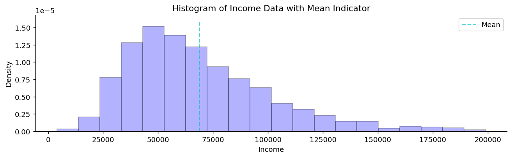
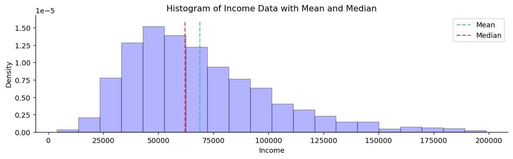
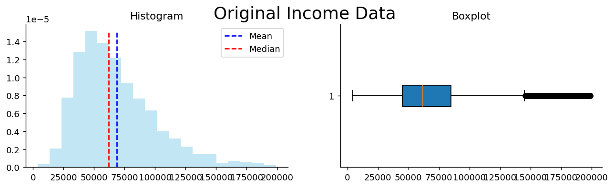
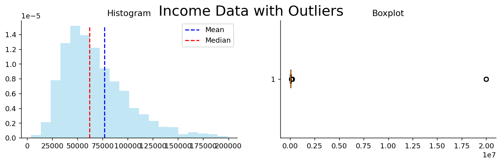

# 평균, 중앙값, 최빈값

## 개요

중심경향 측도는 자료 분포의 중심을 찾아내어 자료를 하나의 대표값으로 요약한다. 가장 널리 쓰이는 세 가지 측도는 **평균**, **중앙값**, **최빈값**이다. 각각 고유한 성질과 장단점이 있어 서로 다른 상황에 적합하다.

---

## 1. 평균

평균은 수들의 산술 평균으로, 모든 값을 더해 개수로 나누어 계산한다.

### 공식

$$
\begin{array}{lllll}
\text{Population Mean} && \mu &=& \displaystyle\frac{\sum_{i=1}^N x_i}{N} \\[10pt]
\text{Sample Mean} && \bar{x} &=& \displaystyle\frac{\sum_{i=1}^n x_i}{n} \\[10pt]
\text{Expected Value} && \mathbb{E}[X] &=& \displaystyle\sum_i x_i \, \mathbb{P}(X = x_i) \quad \text{(discrete)} \\[6pt]
&&& =& \displaystyle\int_{-\infty}^{\infty} x \, f_X(x) \, dx \quad \text{(continuous)}
\end{array}
$$

### 예

자료 70, 85, 90, 95, 100에 대해

$$
\bar{x} = \frac{70 + 85 + 90 + 95 + 100}{5} = \frac{440}{5} = 88
$$

### 균형점으로서의 평균

평균은 편차의 합이 0이 되는 값이다.

$$
\mu = \frac{\sum_{i=1}^N x_i}{N} \quad \Rightarrow \quad \sum_{i=1}^N (x_i - \mu) = 0
$$

즉 평균은 자료의 "무게중심"이다.

### 평균: 소득 예제

```python
import pandas as pd
import matplotlib.pyplot as plt

url = 'https://raw.githubusercontent.com/gedeck/practical-statistics-for-data-scientists/master/data/loans_income.csv'
loans_data = pd.read_csv(url)

mean_income = loans_data['x'].mean()

fig, ax = plt.subplots(figsize=(12, 3))
# density=True 라서 y축이 밀도다. 소득 자료의 밀도는 1e-5 규모이므로
# 아래 세로선의 높이 1.6e-5 도 그 눈금에 맞춘 값이다.
ax.hist(loans_data['x'], bins=20, density=True, alpha=0.3,
        color='blue', edgecolor='black')
# 평균 위치에 세로선을 긋는다. (x, x)와 (0, 높이)를 이어 그린 것이다.
ax.plot([mean_income, mean_income], [0, 1.6e-5], '--c',
        alpha=0.7, label="Mean")
ax.legend()
ax.set_title("Histogram of Income Data with Mean Indicator")
ax.set_xlabel("Income")
ax.set_ylabel("Density")
ax.spines['top'].set_visible(False)
ax.spines['right'].set_visible(False)
plt.show()
```



---

## 2. 중앙값

**중앙값**은 자료를 순서대로 늘어놓았을 때 가운데 오는 값이다. 자료를 같은 크기의 두 절반으로 나눈다.

### 계산 방법

1. 자료를 오름차순으로 정렬한다.
2. $n$이 홀수이면 중앙값은 $(n+1)/2$번째 위치의 값이다.
3. $n$이 짝수이면 중앙값은 가운데 두 값의 평균이다.

### 예

자료 70, 85, 90, 95, 100(홀수 개)에 대해 중앙값 = 90이다.

자료 70, 85, 90, 95(짝수 개)에 대해 중앙값 $= (85 + 90)/2 = 87.5$이다.

### 중앙값 대 평균: 소득 자료

```python
import pandas as pd
import matplotlib.pyplot as plt

url = 'https://raw.githubusercontent.com/gedeck/practical-statistics-for-data-scientists/master/data/loans_income.csv'
loans_data = pd.read_csv(url)

# 같은 자료에 평균과 중앙값을 함께 표시한다.
# 오른쪽으로 치우친 분포에서는 평균이 중앙값보다 오른쪽에 놓인다.
# 긴 오른쪽 꼬리가 평균만 끌어당기기 때문이다.
mean_income = loans_data['x'].mean()
median_income = loans_data['x'].median()

fig, ax = plt.subplots(figsize=(12, 3))
ax.hist(loans_data['x'], bins=20, density=True, alpha=0.3,
        color='blue', edgecolor='black')
ax.plot([mean_income, mean_income], [0, 1.6e-5], '--c',
        alpha=0.7, label="Mean")
ax.plot([median_income, median_income], [0, 1.6e-5], '--r',
        alpha=0.7, label="Median")
ax.legend()
ax.set_title("Histogram of Income Data with Mean and Median")
ax.set_xlabel("Income")
ax.set_ylabel("Density")
ax.spines['top'].set_visible(False)
ax.spines['right'].set_visible(False)
plt.show()

print(f"평균   {mean_income:>9,.0f}")
print(f"중앙값 {median_income:>9,.0f}")
print(f"차이   {mean_income - median_income:>9,.0f}  (양수 = 오른쪽 치우침)")
```

출력:

```
평균      68,761
중앙값    62,000
차이       6,761  (양수 = 오른쪽 치우침)
```



### 중앙값은 이상치에 강건하다

중앙값은 평균보다 극단값의 영향을 훨씬 덜 받는다. 소득 자료에 이상치를 추가해 보면 이를 확인할 수 있다.

```python
import pandas as pd
import numpy as np
import matplotlib.pyplot as plt

url = 'https://raw.githubusercontent.com/gedeck/practical-statistics-for-data-scientists/master/data/loans_income.csv'
loans_data = pd.read_csv(url)
income_data = loans_data['x'].values

# --- 1부: 원자료 ---
mean_income = income_data.mean()
median_income = np.median(income_data)

fig, (hist_ax, box_ax) = plt.subplots(1, 2, figsize=(12, 3))
plt.suptitle("Original Income Data", fontsize=20)

n, bin_edges, _ = hist_ax.hist(income_data, bins=20, density=True, alpha=0.5,
                                color='skyblue')
hist_ax.plot([mean_income, mean_income], [0, n.max()], '--b', label='Mean')
hist_ax.plot([median_income, median_income], [0, n.max()], '--r', label='Median')
hist_ax.legend()
hist_ax.set_title("Histogram")

box_ax.boxplot(income_data, vert=False, patch_artist=True)
box_ax.set_title("Boxplot")

for ax in (hist_ax, box_ax):
    ax.spines['top'].set_visible(False)
    ax.spines['right'].set_visible(False)

plt.show()

# --- 2부: 이상치를 넣는다 ---
# 5만 개 자료에 2천만 달러짜리 20개를 더한다. 전체의 0.04%에 불과하다.
# 그런데도 평균은 크게 밀리고 중앙값은 사실상 그대로다.
outliers = np.array([20_000_000] * 20)
data_with_outliers = np.concatenate((income_data, outliers))

mean_outliers = data_with_outliers.mean()
median_outliers = np.median(data_with_outliers)

fig, (hist_ax, box_ax) = plt.subplots(1, 2, figsize=(12, 3))
plt.suptitle("Income Data with Outliers", fontsize=20)

n, bin_edges, _ = hist_ax.hist(data_with_outliers, bins=bin_edges,
                                density=True, alpha=0.5, color='skyblue')
hist_ax.plot([mean_outliers, mean_outliers], [0, n.max()], '--b', label='Mean')
hist_ax.plot([median_outliers, median_outliers], [0, n.max()], '--r', label='Median')
hist_ax.legend()
hist_ax.set_title("Histogram")

box_ax.boxplot(data_with_outliers, vert=False, patch_artist=True)
box_ax.set_title("Boxplot")

for ax in (hist_ax, box_ax):
    ax.spines['top'].set_visible(False)
    ax.spines['right'].set_visible(False)

plt.show()

# 이상치 20개(전체의 0.04%)가 두 측도를 각각 얼마나 움직였는가
print(f"{'':10}{'원자료':>14}{'이상치 추가 후':>18}{'변화율':>10}")
print(f"{'평균':10}{mean_income:>14,.0f}{mean_outliers:>18,.0f}"
      f"{(mean_outliers/mean_income - 1):>9.1%}")
print(f"{'중앙값':10}{median_income:>14,.0f}{median_outliers:>18,.0f}"
      f"{(median_outliers/median_income - 1):>9.1%}")
```

출력:

```
                     원자료          이상치 추가 후       변화율
평균                68,761            76,730    11.6%
중앙값               62,000            62,000     0.0%
```





이상치를 넣으면 평균은 극적으로 이동하지만 중앙값은 거의 변하지 않는다.

### 중앙값이 선호되는 실제 사례

**소득 분포:** 극도로 높은 소득자 몇 명이 평균을 위로 끌어올린다. 중앙값 가구소득이 "전형적인" 사람이 얼마를 버는지를 더 정확히 보여준다.

**부동산:** 중앙값 주택 가격이 몇 건의 고급 거래로 부풀려질 수 있는 평균 가격보다 주택시장을 더 잘 대표한다.

**마이클 조던 사례(NBA 연봉):** 조던의 연봉이 전형적인 NBA 선수보다 워낙 높아 평균을 크게 부풀렸다. 중앙값 연봉이 대부분의 선수가 실제로 받은 액수를 더 잘 반영한다.

**공공정책:** 정부는 재정적 안녕을 평가할 때 극단적 부에 왜곡되지 않는 중앙값 가구소득을 보고한다.

---

## 3. 절단평균

**절단평균**(절사평균)은 정렬된 분포의 양쪽 꼬리에서 정해진 비율의 관측값을 제거한 뒤 계산하는 산술평균이다. 이 혼합적 접근은 대부분의 자료를 여전히 활용하면서 이상치에 대한 강건성을 제공한다.

### 정의

$x_{(1)} \le x_{(2)} \le \cdots \le x_{(n)}$으로 정렬된 관측값 $n$개의 자료에서 $p$-절단평균은 각 꼬리에서 $\lceil p \cdot n / 2 \rceil$개의 관측값을 제거하고 남은 값들의 평균을 낸다.

$$
\bar{x}_{p\%} = \frac{1}{n - 2\lceil p \cdot n / 2 \rceil} \sum_{i=\lceil p \cdot n / 2 \rceil + 1}^{n - \lceil p \cdot n / 2 \rceil} x_{(i)}
$$

### 예: 인구 자료

미국 주별 인구 자료로 평균, 10% 절단평균, 중앙값을 비교한다.

```python
import pandas as pd
from scipy.stats import trim_mean

# Load state data
# 미국 50개 주의 인구와 살인율. 오른쪽으로 크게 치우친 전형적인 자료다.
url = ('https://raw.githubusercontent.com/gedeck/practical-statistics-for-data-scientists/master/data/state.csv')
state = pd.read_csv(url)

# Regular mean (sensitive to outliers like California)
mean_pop = state['Population'].mean()
print(f"Mean Population: {mean_pop:,.0f}")

# 10% trimmed mean (removes 5% from each tail)
trimmed_mean_pop = trim_mean(state['Population'], 0.1)
print(f"10% Trimmed Mean: {trimmed_mean_pop:,.0f}")

# Median (completely robust)
median_pop = state['Population'].median()
print(f"Median Population: {median_pop:,.0f}")
```

출력:

```
Mean Population: 6,162,876
10% Trimmed Mean: 4,783,697
Median Population: 4,436,370
```

**출력:**
```
Mean Population: 6,162,876
10% Trimmed Mean: 4,783,697
Median Population: 4,436,370
```

절단평균은 중간 지대를 차지한다. 극단값(캘리포니아의 3700만 인구)의 영향을 평균보다 덜 받으면서도 중앙값보다 많은 자료를 사용한다. 꼬리를 완전히 무시하지 않으면서 적당한 수준의 강건성을 원할 때 유용하다.

### 절단평균을 쓸 때

- **적당한 강건성:** 이상치에 저항하고 싶지만 자료를 완전히 버리고 싶지는 않을 때.
- **학문적 관행:** 어떤 분야는 가설검정에 절단평균을 선호한다(예: 심리학, 교육학).
- **올림픽 채점:** 심판 점수는 최고점과 최저점을 잘라낸 뒤 평균 내는 경우가 많다.

---

## 4. 가중평균과 가중중앙값

관측값마다 중요도나 빈도가 다를 때 **가중평균**과 **가중중앙값**은 각 값에 그 중요성을 반영하는 가중치를 부여한다.

### 가중평균

가중평균은 가중된 값들의 합을 가중치의 합으로 나눈 것이다.

$$
\bar{x}_w = \frac{\sum_{i=1}^{n} w_i x_i}{\sum_{i=1}^{n} w_i}
$$

여기서 $w_i$가 가중치다.

### 예: 주 인구로 가중한 살인율

전국 살인율을 계산할 때 인구가 많은 주가 평균에 더 크게 반영되어야 한다. 주의 인구를 가중치로 쓴다.

```python
import pandas as pd
import numpy as np

# 미국 50개 주의 인구와 살인율. 오른쪽으로 크게 치우친 전형적인 자료다.
url = ('https://raw.githubusercontent.com/gedeck/practical-statistics-for-data-scientists/master/data/state.csv')
state = pd.read_csv(url)

# Unweighted mean murder rate
unweighted_mean = state['Murder.Rate'].mean()
print(f"Unweighted Mean Murder Rate: {unweighted_mean:.3f}")

# Weighted mean (weighted by population)
weighted_mean = np.average(state['Murder.Rate'], weights=state['Population'])
print(f"Weighted Mean Murder Rate: {weighted_mean:.3f}")
```

출력:

```
Unweighted Mean Murder Rate: 4.066
Weighted Mean Murder Rate: 4.446
```

**출력:**
```
Unweighted Mean Murder Rate: 4.066
Weighted Mean Murder Rate: 4.446
```

인구가 많은 주(캘리포니아, 텍사스, 플로리다, 뉴욕)의 살인율이 작은 주보다 높은 경향이 있어 가중평균이 더 크다. 가중하지 않은 평균은 몬태나(인구 99만)와 캘리포니아(인구 3700만)를 동등하게 취급하는데, 가중평균이 이 왜곡을 바로잡는다.

### 가중중앙값

**가중중앙값**은 누적 가중치가 전체 가중치의 50%에 도달하는 값이다. 가중평균과 달리 전용 함수가 필요하다.

```python
import pandas as pd

# 미국 50개 주의 인구와 살인율. 오른쪽으로 크게 치우친 전형적인 자료다.
url = ('https://raw.githubusercontent.com/gedeck/practical-statistics-for-data-scientists/master/data/state.csv')
state = pd.read_csv(url)

# 가중하지 않은 중앙값: 주를 크기와 상관없이 한 표씩 센다.
# 즉 캘리포니아(3900만 명)와 와이오밍(56만 명)이 같은 무게를 갖는다.
unweighted_median = state['Murder.Rate'].median()
print(f"Unweighted Median: {unweighted_median:.1f}")


def weighted_median(values, weights):
    """누적 가중치가 전체의 절반에 도달하는 값을 찾는다.

    가중중앙값의 정의 그대로다. 외부 패키지 없이 세 줄로 구현된다.
    """
    d = pd.DataFrame({"v": values, "w": weights}).sort_values("v")
    cum = d["w"].cumsum() / d["w"].sum()      # 누적 가중치 비율
    return d.loc[cum >= 0.5, "v"].iloc[0]     # 0.5를 처음 넘는 값

# 인구로 가중한 중앙값: 사람 한 명씩을 세는 것과 같다.
# "미국의 중앙값 시민이 사는 주의 살인율"이라고 읽으면 된다.
wm = weighted_median(state['Murder.Rate'], state['Population'])
print(f"Weighted Median: {wm:.1f}")
```

출력:

```
Unweighted Median: 4.0
Weighted Median: 4.4
```

### 가중 통계량을 쓸 때

**금융 자료:** 포트폴리오 수익률은 자산 가치로 가중한다.

**조사 자료:** 응답을 모집단 인구 구성에 맞도록 가중한다.

**집계 자료:** 자료가 집단을 대표할 때(예: 주 단위 통계) 집단 크기로 가중한다.

**중요도 가중:** 어떤 관측값이 다른 것보다 더 믿을 만하거나 관련이 클 때.

---

## 5. 최빈값

**최빈값**은 자료에서 가장 자주 나타나는 값이다. 자료는 단봉(최빈값 하나), 이봉(둘), 다봉(둘보다 많음)일 수 있고, 모든 값이 똑같이 자주 나타나면 최빈값이 없을 수도 있다.

### 파이썬에서 최빈값 계산하기

```python
import statistics

data = [4, 1, 2, 2, 3, 5]
mode = statistics.mode(data)
print(f"{mode = }")  # mode = 2
```

출력:

```
mode = 2
```

최빈값이 여럿인 자료의 경우:

```python
import statistics

data = [4, 1, 2, 2, 3, 3, 5]
mode = statistics.mode(data)
print(f"{mode = }")  # Returns the first mode encountered

modes = statistics.multimode(data)
print(f"{modes = }")  # Returns all modes: [2, 3]
```

출력:

```
mode = 2
modes = [2, 3]
```

---

## 6. 평균, 중앙값, 최빈값 및 그 밖의 측도 비교

**평균**은 이상치가 없고 대칭적으로 분포한 연속 자료에 가장 적합하다. 모든 자료점을 쓰지만 극단값에 민감하다.

**중앙값**은 치우친 분포나 이상치가 있는 자료에 선호된다. 가운데 값을 나타내며 극단 관측값에 강건하다.

**최빈값**은 범주형 자료나 가장 흔한 값을 찾을 때 가장 유용하다. 명목 자료(예: 가장 인기 있는 색)에도 쓸 수 있다.

### 분포 모양과의 관계

- **대칭 분포:** 평균 ≈ 중앙값 ≈ 최빈값
- **오른쪽으로 치우친 분포:** 최빈값 < 중앙값 < 평균
- **왼쪽으로 치우친 분포:** 평균 < 중앙값 < 최빈값

## 요약

각 중심경향 측도는 서로 다른 목적에 쓰인다. 평균은 수학적 평균을 제공하지만 이상치에 취약하고, 중앙값은 극단값에 저항하는 강건한 중심을 제공하며, 최빈값은 가장 빈번한 관측값을 찾아낸다. 적절한 측도의 선택은 자료의 분포 모양과 당면한 분석 질문에 달려 있다.

## 연습문제

<div class="drillbox" markdown>

**연습문제 1.**
어느 작은 회사에 직원 다섯 명이 있고 연봉(천 달러 단위)이 $35, 40, 42, 45, 250$이다.

**(a)** 표본평균과 표본중앙값을 계산하라.
**(b)** 최고경영자의 연봉 $\$250\text{k}$를 $\$500\text{k}$로 바꿔라. 평균과 중앙값을 다시 계산하라. 어느 쪽이 더 많이 변했는가?
**(c)** 중앙값이 *강건한* 중심경향 측도이고 평균은 그렇지 않은 이유를 설명하라.

</div>

??? success "풀이"
    (a) $\bar{x} = 412/5 = 82.4$, 중앙값 $= 42$.

    (b) 바꾼 뒤 $\bar{x} = 662/5 = 132.4$이고 중앙값은 여전히 $= 42$다. 평균은 50만큼(60.7%) 뛰었고 중앙값은 그대로다.

    (c) 중앙값은 관측값의 *순위*에만 의존하므로, 순위를 유지한 채 어느 한 관측값의 크기를 바꿔도 변하지 않는다. 중앙값의 붕괴점은 50%에 가깝다. 임의로 옮기려면 자료의 절반 정도를 오염시켜야 한다. 평균의 붕괴점은 0이다. 극단 관측값 하나가 평균을 임의로 멀리 옮길 수 있다. 이 강건성/효율 절충은 근본적인 것이다.

<div class="drillbox" markdown>

**연습문제 2.**
다음 묶음 도수분포표에서 평균과 분산을 추정하라.

| 점수 구간 | 중간값 $m_i$ | 도수 $f_i$ |
|:---:|:---:|:---:|
| 50–59 | 54.5 | 3 |
| 60–69 | 64.5 | 5 |
| 70–79 | 74.5 | 10 |
| 80–89 | 84.5 | 8 |
| 90–99 | 94.5 | 4 |

$\bar{x} = \sum f_i m_i / \sum f_i$와 $s^2 = \sum f_i (m_i - \bar{x})^2 / (n - 1)$을 쓰라. 이것이 왜 정확한 값이 아니라 *추정값*인가?

</div>

??? success "풀이"
    $\sum f_i m_i = 163.5 + 322.5 + 745 + 676 + 378 = 2285$이므로 $\bar{x} = 2285/30 \approx 76.17$이다.

    가중 제곱편차의 총합은 $\sum f_i (m_i - \bar{x})^2 \approx 4016.7$이므로 $s^2 \approx 4016.7/29 \approx 138.5$, $s \approx 11.77$이다.

    **추정값인 이유는** 각 구간의 모든 관측값을 중간값 $m_i$로 대체하기 때문이다. "70–79"의 실제 점수는 모두 74.5인 것이 아니라 $[70, 79)$ 어디에나 있을 수 있다. 이 근사는 각 구간 안에서 자료가 균등하게 분포할 때 정확하며, 구간이 좁아질수록 좋아진다.

<div class="drillbox" markdown>

**연습문제 3.**
표본평균 $\bar{x} = (1/n)\sum x_i$이 $c \in \mathbb{R}$에 대해 $\sum (x_i - c)^2$을 최소화하는 유일한 값임을 증명하라. 중앙값은 무엇을 최소화하는가?

</div>

??? success "풀이"
    **평균:** $f(c) = \sum (x_i - c)^2$을 $c$에 대해 미분한다.

    $$
    f'(c) = -2 \sum (x_i - c) = 0 \implies c = \frac{1}{n}\sum x_i = \bar{x}
    $$

    $f''(c) = 2n > 0$이므로 이것이 유일한 최솟값이다. 평균은 제곱오차를 최소화한다.

    **중앙값:** *중앙값*은 절대오차 손실 $g(c) = \sum |x_i - c|$을 최소화한다. 증명은 열미분(subgradient)으로 진행된다. $|x - c|$의 $c$에 대한 도함수가 $-\mathrm{sign}(x - c)$이므로 $g'(c) = -(\#\{x_i > c\} - \#\{x_i < c\})$이다. 이를 0으로 두려면 $c$보다 큰 $x_i$의 개수가 작은 것의 개수와 같아야 하는데, 이것이 중앙값의 정의다.

    두 측도는 자료를 상수 위로 사영한 $L^2$ 사영과 $L^1$ 사영에 각각 해당한다. 이 특성화는 분위수 회귀로 확장된다. $\tau$번째 분위수는 $\rho_\tau(u) = u(\tau - \mathbf{1}\{u < 0\})$일 때 비대칭 절대손실 $\sum \rho_\tau(x_i - c)$를 최소화한다.

<div class="drillbox" markdown>

**연습문제 4.**
관측값이 $n = 100$개이고 표본평균이 50, 표본표준편차가 10인 자료가 있다. 관측값 하나가 60에서 1060으로 오염되었다. 표본평균은 어떻게 변하는가? 표본표준편차는 어떻게 변하는가? 10% 절단평균에서는 어떻게 될지와 비교하라.

</div>

??? success "풀이"
    **평균:** 새 평균은 $\bar{x}_{\text{new}} = 50 + (1060 - 60)/100 = 50 + 10 = 60$이다. 평균이 10만큼, 즉 모표준편차 전체만큼 뛰었다.

    **표준편차:** 새 관측값이 제곱편차 합에 기여하는 몫이 커진다. $\sum (x_i - \bar{x})^2$이 대략 $(1060 - 60)^2 \approx 10^6$만큼 늘어난다. 정확히 다시 계산하면 $s^2_{\text{new}} \approx 10^4 + O(10^4 / n)$이므로 $s_{\text{new}} \approx 100$으로 열 배 부풀려진다.

    **10% 절단평균:** 오염된 관측값은 자료의 상위 10%에 (아마 최댓값으로) 들어가므로 잘려 나간다. 절단평균은 정렬된 자료의 가운데 80%로만 계산되어 거의 영향을 받지 않는다. 변화가 0.1 단위 미만일 수 있다.

    교훈: 오염된 관측값 하나가 평균을, 특히 표준편차를 심하게 왜곡할 수 있는 반면 절단 추정량은 면역이다. 실제 자료에서 강건통계가 중요한 이유가 이것이다.

<div class="drillbox" markdown>

**연습문제 5.**
대칭인 단봉 분포에서는 평균, 중앙값, 최빈값이 같고, 오른쪽으로 치우친 분포에서는 최빈값 < 중앙값 < 평균의 순서다. 평균이 유한하고 밀도가 반직선 위에서 양이며 위쪽 꼬리에서 감소하는(지수분포나 로그정규분포 같은 전형적인 오른쪽 치우친 분포) 임의의 연속분포에 대해 **평균이 중앙값보다 큼**을 증명하라.

</div>

??? success "풀이"
    $m$을 중앙값($P(X \le m) = P(X \ge m) = 1/2$)이라 하고 $\mu = \mathbb{E}[X]$라 하자.

    $$
    \mu - m = \mathbb{E}[X - m] = \int_{-\infty}^m (x - m) f(x)\,dx + \int_m^{\infty} (x - m) f(x)\,dx
    $$

    첫 적분에서 $u = m - x$로, 둘째 적분에서 $v = x - m$으로 치환하면

    $$
    \mu - m = -\int_0^{\infty} u\, f(m - u)\,du + \int_0^{\infty} v\, f(m + v)\,dv = \int_0^{\infty} v\,[f(m + v) - f(m - v)]\,dv
    $$

    이다. 오른쪽으로 치우친 분포에서는 오른쪽 꼬리 $f(m + v)$가 왼쪽 꼬리 $f(m - v)$가 감쇠하는 것보다 오래 양수로 남는다. 구체적으로 $f$가 $m$의 오른쪽에서 왼쪽보다 천천히 감소하면 관련 꼬리 구간에서 $f(m + v) > f(m - v)$이므로 피적분함수가 평균적으로 양수가 되어 $\mu - m > 0$이다.

    깔끔한 특수한 경우: 지수분포 Exponential$(\lambda)$은 $m = \ln(2)/\lambda \approx 0.693/\lambda$인 반면 $\mu = 1/\lambda > 0.693/\lambda$이다. $\square$

<div class="drillbox" markdown>

**연습문제 6.**
**최빈값**은 밀도(또는 확률질량함수)를 최대로 만드는 $x$의 값이다. 연속인 단봉 대칭분포에서는 평균, 중앙값, 최빈값이 모두 일치한다. 그러나 두 가우시안의 *혼합*에서는 "대칭인" 혼합이라도 최빈값이 평균과 어긋날 수 있다. 이봉 대칭 혼합을 하나 만들어 모든 최빈값을 찾고, 자료 분석가가 각각을 언제 보고해야 하는지 설명하라.

</div>

??? success "풀이"
    $\phi(\cdot; \mu, \sigma)$를 정규밀도라 할 때 $f(x) = 0.5 \cdot \phi(x; -3, 1) + 0.5 \cdot \phi(x; 3, 1)$을 생각하자. 이 혼합은 $x = 0$에 대해 대칭이다.

    - **평균** $= \mu = 0$ (대칭성).
    - **중앙값** $= 0$ (대칭성).
    - **최빈값** $= -3$과 $+3$ ($f$의 극대점).

    평균과 중앙값이 밀도의 *골*에, 즉 혼합이 *가장 덜* 일어날 법한 지점에 떨어진다. 기술적으로는 옳은 중심 측도지만 이봉 분포에 대해서는 오도하는 직관을 준다.

    **무엇을 보고할 것인가:** 히스토그램이나 밀도추정이 이봉성을 드러내면 분석가는 중심 측도 하나만이 아니라 최빈값들과 그 상대적 비중을 서술해야 한다. "평균 가구소득은 \$60,000입니다"는 기술적으로는 옳지만, 밑바탕 분포가 이봉(노동계층 대 전문직 계층)이라면 적극적으로 오도한다. 시각화가 먼저이고 중심경향 요약은 그다음이다. 현대의 보고 관행이 요약통계량과 함께 **커널밀도 그림**을 싣는 이유가 정확히 이것이다.

<div class="drillbox" markdown>

**연습문제 7.**
**붕괴점(breakdown point)** 은 추정량이 무너지기 전까지 견딜 수 있는 오염 비율이다. 평균, 절단평균, 중앙값의 붕괴점을 수치로 확인하라.

</div>

??? success "풀이"
    ```python
    import numpy as np
    from scipy import stats

    rng = np.random.default_rng(0)
    base = rng.normal(50, 10, 100)

    print(f"{'오염 비율':>10}{'평균':>12}{'10% 절단':>12}{'25% 절단':>12}{'중앙값':>11}")
    for frac in (0.0, 0.05, 0.10, 0.20, 0.30, 0.49):
        x = base.copy()
        k = int(frac * 100)
        if k:
            x[:k] = 1e6                      # 극단값으로 오염시킨다
        print(f"{frac:>10.2f}{x.mean():>12.1f}{stats.trim_mean(x, 0.10):>12.2f}"
              f"{stats.trim_mean(x, 0.25):>12.2f}{np.median(x):>11.2f}")
    ```

    출력:

    ```
    오염 비율          평균      10% 절단      25% 절단        중앙값
          0.00        50.8       50.73       50.38      50.73
          0.05     50048.3       51.69       51.21      51.75
          0.10    100045.7       52.77       52.08      52.17
          0.20    200041.2   125046.93       55.36      54.12
          0.30    300036.2   250040.68   100051.97      57.39
          0.49    490025.8   487527.68   480030.67      69.12
    ```

    **각 추정량이 정확히 예측된 지점에서 무너진다.**

    | 추정량 | 붕괴점 | 표에서 확인 |
    |---|---|---|
    | 평균 | $0\%$ | 오염 $5\%$에서 이미 $50048$ |
    | $10\%$ 절단평균 | $10\%$ | $10\%$까지 견디다 $20\%$에서 붕괴 |
    | $25\%$ 절단평균 | $25\%$ | $20\%$까지 견디다 $30\%$에서 붕괴 |
    | 중앙값 | $50\%$ | $49\%$ 오염에서도 $69.1$ |

    **평균의 붕괴점이 $0$이라는 것이 핵심이다.** 관측 **하나**만 무한대로 보내면 평균도 무한대가 된다. 오염 비율이 얼마나 작든 상관없다. 연습문제 1과 4에서 본 현상의 일반형이다.

    **$\alpha$ 절단평균의 붕괴점은 $\alpha$다.** 양쪽에서 $\alpha$씩 잘라 내므로 그만큼의 오염은 잘려 나간다. 그보다 많으면 오염값이 남은 자료 안으로 들어온다.

    **중앙값의 붕괴점 $50\%$가 이론적 최댓값이다.** 자료의 절반 이상이 오염되면 어느 쪽이 "진짜"인지 판별할 원리적 근거가 없다. 어떤 추정량도 $50\%$를 넘을 수 없다.

    **붕괴점만으로 고를 수는 없다.** 붕괴점이 높다고 무조건 좋은 추정량이 아니다. 오염이 없을 때의 효율을 함께 봐야 하며, 그것이 다음 문제다. $\square$

<div class="drillbox" markdown>

**연습문제 8.**
붕괴점이 높으면 대가가 있다. 오염이 **없을 때** 중앙값이 평균보다 얼마나 비효율적인지 재고, 꼬리가 두꺼워지면 어떻게 역전되는지 보여라.

</div>

??? success "풀이"
    ```python
    import numpy as np
    from scipy import stats

    rng = np.random.default_rng(0)
    B, n = 200_000, 25

    print(f"{'분포':>7}{'Var(평균)':>14}{'Var(중앙값)':>13}{'Var(25% 절단)':>15}{'중앙값 효율':>13}")
    for label, draw in [("정규", lambda: rng.normal(0, 1, (B, n))),
                        ("t(3)", lambda: rng.standard_t(3, (B, n))),
                        ("코시", lambda: rng.standard_cauchy((B, n)))]:
        x = draw()
        v_mean = x.mean(1).var()
        v_med = np.median(x, axis=1).var()
        v_trim = stats.trim_mean(x, 0.25, axis=1).var()
        print(f"{label:>7}{v_mean:>14.4f}{v_med:>13.4f}{v_trim:>15.4f}"
              f"{v_mean / v_med:>13.4f}")

    print(f"\n정규분포에서 중앙값의 점근 상대효율 이론값 2/pi = {2 / np.pi:.4f}")
    ```

    출력:

    ```
    분포       Var(평균)     Var(중앙값)    Var(25% 절단)       중앙값 효율
         정규        0.0400       0.0618         0.0471       0.6483
       t(3)        0.1203       0.0751         0.0626       1.6004
         코시   145970.0658       0.1113         0.1242 1311827.9195

    정규분포에서 중앙값의 점근 상대효율 이론값 2/pi = 0.6366
    ```

    | 분포 | Var(평균) | Var(중앙값) | 중앙값 효율 |
    |---|---|---|---|
    | 정규 | $0.0400$ | $0.0618$ | $0.648$ |
    | $t(3)$ | $0.1204$ | $0.0754$ | $1.598$ |
    | 코시 | $436847$ | $0.1116$ | $3.9 \times 10^{6}$ |

    **정규분포에서 중앙값은 평균보다 나쁘다.** 효율 $0.648$은 이론값 $2/\pi = 0.637$과 맞으며, **중앙값으로 같은 정밀도를 얻으려면 표본이 약 $1.57$배 필요하다**는 뜻이다. 자료가 정말 정규라면 평균을 쓰는 것이 옳다.

    **$t(3)$에서 이미 역전된다.** 자유도 $3$은 분산이 존재하는 정도의 가벼운 두꺼운 꼬리인데도 중앙값이 $1.6$배 낫다.

    **코시에서는 비교가 무의미해진다.** 평균의 분산이 $436847$인데, 이는 유한한 값이 아니라 **코시분포의 평균이 존재하지 않기 때문에** 나온 수치다. 표본을 아무리 키워도 표본평균은 수렴하지 않는다(코시의 표본평균은 원래 코시분포와 같은 분포를 갖는다). 중앙값은 멀쩡히 작동한다.

    **$25\%$ 절단평균이 세 상황 모두에서 좋은 절충이다.** 정규에서 $0.0471$로 평균($0.0400$)에 가깝고, $t(3)$과 코시에서는 중앙값보다도 낫다.

    !!! tip "실무 지침"
        - 자료가 정규에 가깝다고 믿을 근거가 있으면 **평균**.
        - 꼬리가 두껍거나 이상치가 의심되면 **절단평균이나 중앙값**.
        - 확신이 없으면 **$20$–$25\%$ 절단평균**이 안전하다. 정규에서 잃는 것이 $10\%$ 남짓이고 오염에서 얻는 것은 훨씬 크다.
        - **둘 다 계산해 보라.** 평균과 중앙값이 크게 다르면 그 자체가 치우침이나 이상치의 신호다. $\square$

<div class="drillbox" markdown>

**연습문제 9.**
산술평균이 **틀린 답**이 되는 두 상황을 제시하고, 각각 기하평균과 조화평균이 왜 옳은지 보여라.

</div>

??? success "풀이"
    ```python
    import numpy as np
    from scipy import stats

    # (1) 곱해지는 양: 수익률
    r = np.array([0.50, -0.30, 0.40, -0.20, 0.25])
    growth = np.prod(1 + r)
    n = len(r)
    print("연간 수익률", r)
    print(f"  산술평균 {r.mean():.4%}  → 5년 뒤 {(1 + r.mean()) ** n:.4f}배  (틀림)")
    print(f"  기하평균 {growth ** (1 / n) - 1:.4%}  → 5년 뒤 {growth:.4f}배")
    print(f"  실제 누적 {growth:.4f}배")

    # (2) 나누어지는 양: 속력
    d, v = 100.0, np.array([60.0, 40.0])
    print(f"\n같은 거리 {d}km 를 각각 {v[0]}, {v[1]} km/h 로 달리면")
    print(f"  산술평균 {v.mean():.2f} km/h  (틀림)")
    print(f"  조화평균 {len(v) / np.sum(1 / v):.2f} km/h")
    print(f"  실제: {2 * d}km 를 {d / v[0] + d / v[1]:.4f}시간 → "
          f"{2 * d / (d / v[0] + d / v[1]):.2f} km/h")

    x = np.array([1.0, 2.0, 4.0, 8.0])
    print(f"\nAM ≥ GM ≥ HM:  {x.mean():.4f} ≥ {stats.gmean(x):.4f} ≥ {stats.hmean(x):.4f}")
    ```

    출력:

    ```
    연간 수익률 [ 0.5  -0.3   0.4  -0.2   0.25]
      산술평균 13.0000%  → 5년 뒤 1.8424배  (틀림)
      기하평균 8.0099%  → 5년 뒤 1.4700배
      실제 누적 1.4700배

    같은 거리 100.0km 를 각각 60.0, 40.0 km/h 로 달리면
      산술평균 50.00 km/h  (틀림)
      조화평균 48.00 km/h
      실제: 200.0km 를 4.1667시간 → 48.00 km/h

    AM ≥ GM ≥ HM:  3.7500 ≥ 2.8284 ≥ 2.1333
    ```

    **(1) 곱해지는 양에는 기하평균.** 산술평균 수익률 $13\%$로 계산하면 $5$년 뒤 $1.84$배가 되어야 하지만 실제는 $1.47$배다. 수익률은 **더해지는 것이 아니라 곱해지므로**, 올바른 평균은

    $$
    \bar{r}_{\text{기하}} = \left(\prod_i (1+r_i)\right)^{1/n} - 1 = 8.01\%
    $$

    이고, 이것으로 계산하면 정확히 $1.47$배가 나온다.

    **변동성이 클수록 격차가 커진다.** $+50\%$ 뒤 $-50\%$는 원금의 $75\%$가 되지만 산술평균은 $0\%$라고 말한다. 펀드 광고의 "연평균 수익률"이 산술평균인지 기하평균(CAGR)인지 반드시 확인해야 하는 이유다.

    **(2) 나누어지는 양에는 조화평균.** 같은 **거리**를 다른 속력으로 달릴 때, 느린 구간에서 시간을 더 많이 쓰므로 평균 속력이 $50$이 아니라 $48$이다.

    다만 조건이 중요하다. 같은 **시간**씩 달렸다면 산술평균 $50$이 맞다. **무엇이 고정되어 있는지가 어느 평균을 쓸지 정한다.**

    **일반 원리.** 세 평균은 모두 $\left(\frac{1}{n}\sum x_i^p\right)^{1/p}$ 꼴의 멱평균이며 $p = 1, 0, -1$에 해당한다. $p$가 클수록 큰 값에 민감해지므로 AM $\ge$ GM $\ge$ HM이 항상 성립하고, 등호는 모든 값이 같을 때만 성립한다.

    | 상황 | 평균 |
    |---|---|
    | 더해지는 양 (소득, 무게) | 산술 |
    | 곱해지는 양 (성장률, 배율) | 기하 |
    | 비율의 평균, 분자가 고정 (속력, 처리율) | 조화 |
    | $F_1$ 점수 (정밀도와 재현율) | 조화 |

    마지막 줄도 같은 원리다. $F_1$이 조화평균인 것은 한쪽이 아주 작을 때 전체가 작아지도록 하기 위해서다. $\square$

<div class="drillbox" markdown>

**연습문제 10.**
연습문제 6이 최빈값의 개념적 문제를 다루었다면, 실무적 문제는 더 심각하다. **연속 자료에서 최빈값을 추정하는 것이 왜 어려운지** 수치로 보여라.

</div>

??? success "풀이"
    ```python
    import numpy as np
    from scipy.stats import gaussian_kde

    rng = np.random.default_rng(1)
    n, B = 300, 2000
    grid = np.linspace(-5, 5, 1000)

    mean = np.empty(B); med = np.empty(B)
    mode_hist = np.empty(B); mode_kde = np.empty(B)
    for b in range(B):
        d = rng.normal(0, 1, n)                  # 참 최빈값은 0
        mean[b] = d.mean()
        med[b] = np.median(d)
        h, e = np.histogram(d, bins=20)
        mode_hist[b] = ((e[:-1] + e[1:]) / 2)[h.argmax()]
        mode_kde[b] = grid[gaussian_kde(d)(grid).argmax()]

    print(f"N(0,1) 에서 n={n}, 반복 {B}회 (참값 0)")
    for label, v in [("표본평균", mean), ("표본중앙값", med),
                     ("최빈값 (히스토그램 20구간)", mode_hist), ("최빈값 (KDE)", mode_kde)]:
        print(f"  {label:<26} 평균 {v.mean():+.4f}   표준편차 {v.std():.4f}")

    print(f"\n최빈값(히스토그램)은 표본평균보다 {mode_hist.std() / mean.std():.1f}배 흔들린다")
    print(f"최빈값(KDE)은          {mode_kde.std() / mean.std():.1f}배")
    ```

    출력:

    ```
    N(0,1) 에서 n=300, 반복 2000회 (참값 0)
      표본평균                       평균 -0.0014   표준편차 0.0590
      표본중앙값                      평균 -0.0010   표준편차 0.0714
      최빈값 (히스토그램 20구간)           평균 -0.0260   표준편차 0.3227
      최빈값 (KDE)                  평균 +0.0059   표준편차 0.1981

    최빈값(히스토그램)은 표본평균보다 5.5배 흔들린다
    최빈값(KDE)은          3.4배
    ```

    네 추정량 모두 편향은 거의 없다(참값 $0$ 근처). **차이는 변동성이다.**

    | 추정량 | 표준편차 |
    |---|---|
    | 표본평균 | $0.059$ |
    | 표본중앙값 | $0.071$ |
    | 최빈값 (히스토그램) | $\mathbf{0.323}$ |
    | 최빈값 (KDE) | $0.198$ |

    히스토그램 최빈값은 표본평균보다 **$5.5$배** 흔들린다. 같은 정밀도를 얻으려면 표본이 $30$배 필요하다는 뜻이다.

    **왜 이렇게 나쁜가.** 세 가지 이유가 겹친다.

    - **정보를 거의 쓰지 않는다.** 평균은 모든 관측을 쓰고 중앙값은 순위 전체를 쓰지만, 최빈값은 사실상 **가장 붐비는 구간 하나**만 본다.
    - **연속분포에서 최빈값은 자료에 직접 존재하지 않는다.** 모든 관측값이 서로 다르므로 "가장 자주 나온 값"이 정의되지 않는다. 반드시 **구간화나 평활**을 거쳐야 하고, 그 선택이 답을 바꾼다.
    - **밀도의 최댓값 위치는 추정하기 어려운 양이다.** 밀도 자체보다 수렴 속도가 느리다.

    **그러면 최빈값은 언제 쓰는가.**

    - **범주형 자료**에서는 자연스럽고 유일하게 뜻이 통하는 중심 측도다. "가장 많이 팔린 색상"에는 평균이 없다.
    - **이산 자료**에서 값의 종류가 적을 때.
    - **다봉 분포를 보고할 때.** 연습문제 6에서 본 대로, 봉우리가 둘이면 평균 하나로 요약하는 것이 오히려 오해를 부른다. 이때는 최빈값들을 **위치의 추정값이 아니라 구조의 서술**로 쓴다.

    **연속 자료에서 "최빈값"을 보고할 일이 생기면 KDE 대역폭이나 구간 수를 반드시 밝히고, 그 선택에 얼마나 민감한지 함께 보여야 한다.** 그렇지 않은 최빈값 보고는 재현할 수 없다. $\square$

