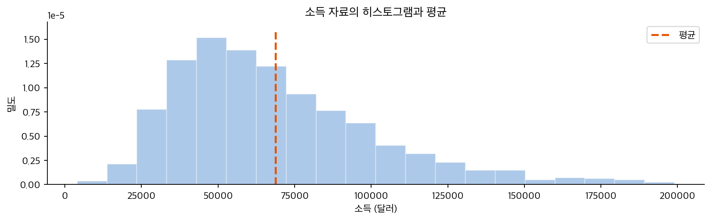
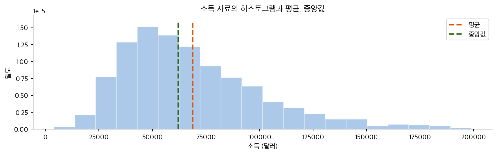
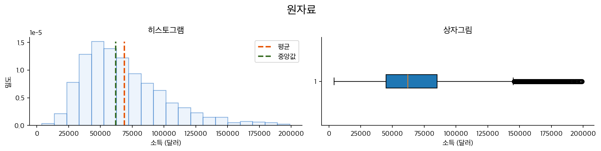
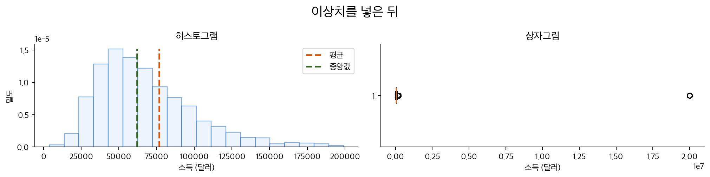

# 평균, 중앙값, 최빈값

## 개요

중심경향 측도는 자료 분포의 중심을 찾아내어 자료를 하나의 대표값으로 요약한다. 가장 널리 쓰이는 세 가지 측도는 **평균**, **중앙값**, **최빈값**이다. 각각 고유한 성질과 장단점이 있어 서로 다른 상황에 적합하다.

---

## 1. 평균

평균은 수들의 산술 평균으로, 모든 값을 더해 개수로 나누어 계산한다.

### 공식

$$
\begin{array}{lllll}
\text{모평균} && \mu &=& \displaystyle\frac{\sum_{i=1}^N x_i}{N} \\[10pt]
\text{표본평균} && \bar{x} &=& \displaystyle\frac{\sum_{i=1}^n x_i}{n} \\[10pt]
\text{기댓값} && \mathbb{E}[X] &=& \displaystyle\sum_i x_i \, \mathbb{P}(X = x_i) \quad \text{(이산)} \\[6pt]
&&& =& \displaystyle\int_{-\infty}^{\infty} x \, f_X(x) \, dx \quad \text{(연속)}
\end{array}
$$

### 예

자료 70, 85, 90, 95, 100에 대해

$$
\bar{x} = \frac{70 + 85 + 90 + 95 + 100}{5} = \frac{440}{5} = 88
$$

### 균형점으로서의 평균

평균은 편차의 합이 0이 되는 값이다.

$$
\mu = \frac{\sum_{i=1}^N x_i}{N} \quad \Rightarrow \quad \sum_{i=1}^N (x_i - \mu) = 0
$$

즉 평균은 자료의 "무게중심"이다.

### 평균: 소득 보기

<div class="exbox" markdown>

**보기 1.** <span class="diff easy" title="쉬움"></span> 무게중심은 한가운데가 아니다. 대출 신청자 $50{,}000$명의 소득 자료에 평균을 세로선으로 긋는다.

**(1)** 평균이 $\sum_i (x_i - c) = 0$을 만족하는 **유일한** $c$임을 보이고, "무게중심"이라는 말이 뜻하는 바를 적으시오.

**(2)** 그렇다면 평균의 왼쪽과 오른쪽에 자료가 반씩 있는가. 이 자료에서 평균보다 작은 관측의 비율을 구하시오.

</div>

??? success "풀이"

    **(1) 해석적으로.** $h(c) = \sum_{i=1}^n (x_i - c)$는 $c$의 **일차함수**다.

    $$
    h(c) = \sum_i x_i - nc
    $$

    기울기가 $-n \ne 0$이므로 $h$는 강한 단조감소이고 영점이 정확히 하나다. 그 영점은

    $$
    \sum_i x_i - nc = 0 \;\Longleftrightarrow\; c = \frac{1}{n}\sum_i x_i = \bar x
    $$

    다. **평균은 편차의 합을 $0$으로 만드는 유일한 점이다.**

    물리로 읽으면 이렇다. 수직선 위 $x_i$마다 무게 $1$의 추를 매달고 받침대를 $c$에 두면, 추 하나가 주는 돌림힘(토크)이 $x_i - c$이고 전체 돌림힘이 $h(c)$다. 받침대가 균형을 이루는 자리가 곧 $h(c) = 0$인 자리, 곧 평균이다. 합을 왼쪽과 오른쪽으로 갈라 적으면

    $$
    \sum_{x_i < \bar x} (\bar x - x_i) \;=\; \sum_{x_i > \bar x} (x_i - \bar x)
    $$

    로, **양쪽 토크가 정확히 같다.**

    **(2) 해석적으로.** 위 등식이 말하는 것은 **거리의 합**이 같다는 것이지 **개수**가 같다는 것이 아니다. 개수를 반으로 가르는 것은 중앙값의 일이다. 오른쪽으로 치우친 자료에서는 오른쪽 소수가 아주 멀리 있어 큰 토크를 내므로, 왼쪽은 **많은 수가 가까이** 모여 균형을 맞춘다. 따라서

    $$
    \#\{x_i < \bar x\} > \frac{n}{2}
    $$

    가 되리라 예상된다. 얼마나 넘는지는 자료가 정한다 — 수로 재어 보자.

    **(3) 수치적으로.**

    ```python
    import matplotlib
    matplotlib.use("Agg")
    import pandas as pd
    import matplotlib.pyplot as plt

    # 그림에 한글을 쓰므로 한글 글꼴을 지정한다. 후보를 늘어놓으면 matplotlib 가
    # 설치된 첫 번째를 집으므로, 리눅스('NanumGothic')·맥('Apple SD Gothic Neo')·
    # 윈도우('Malgun Gothic')에서 코드를 고치지 않고 그대로 돌릴 수 있다.
    # 글꼴을 바꾸면 마이너스 기호가 깨지므로 unicode_minus 도 함께 꺼 준다.
    plt.rcParams["font.sans-serif"] = ["NanumGothic", "Apple SD Gothic Neo", "Malgun Gothic"]
    plt.rcParams["font.family"] = "sans-serif"
    plt.rcParams["axes.unicode_minus"] = False

    url = 'https://raw.githubusercontent.com/gedeck/practical-statistics-for-data-scientists/8a6d3bb6468e979c861d4b37215e1413702dfdfa/data/loans_income.csv'
    loans_data = pd.read_csv(url)

    mean_income = loans_data['x'].mean()

    fig, ax = plt.subplots(figsize=(12, 3))
    # density=True 라서 y축이 밀도다. 소득 자료의 밀도는 1e-5 규모이므로
    # 아래 세로선의 높이 1.6e-5 도 그 눈금에 맞춘 값이다.
    ax.hist(loans_data['x'], bins=20, density=True, alpha=0.35,
            color="#1565C0", edgecolor="white")
    # 평균 위치에 세로선을 긋는다. (x, x)와 (0, 높이)를 이어 그린 것이다.
    ax.plot([mean_income, mean_income], [0, 1.6e-5], "--",
            color="#E65100", lw=2, label="평균")
    ax.legend()
    ax.set_title("소득 자료의 히스토그램과 평균")
    ax.set_xlabel("소득 (달러)")
    ax.set_ylabel("밀도")
    ax.spines[["top", "right"]].set_visible(False)
    fig.savefig("mean_median_mode_44.png", dpi=170, facecolor="white",
                bbox_inches="tight")
    ```

    

    주황 세로선이 평균이다. 이제 그 선이 정말 균형점인지 재어 본다.

    ```python
    import numpy as np
    import pandas as pd

    url = ('https://raw.githubusercontent.com/gedeck/practical-statistics-for-data-scientists'
           '/8a6d3bb6468e979c861d4b37215e1413702dfdfa/data/loans_income.csv')
    income = pd.read_csv(url)['x'].values.astype(float)
    m = income.mean()
    dev = income - m

    print(f"n = {len(income):,},  평균 {m:,.2f}")
    print(f"편차의 합 = {dev.sum():.3e}   (0 이어야 한다)")
    print(f"  자료 규모로 나눈 상대오차 = {abs(dev.sum()) / np.abs(income).sum():.1e}")
    print(f"왼쪽 토크  sum(m - x),  x < m : {(m - income[income < m]).sum():>15,.0f}")
    print(f"오른쪽 토크 sum(x - m),  x > m : {(income[income > m] - m).sum():>15,.0f}")

    below, above = np.sum(income < m), np.sum(income > m)
    print(f"\n평균 미만 {below:,}명 ({below / len(income):.2%})")
    print(f"평균 초과 {above:,}명 ({above / len(income):.2%})")
    print(f"중앙값 {np.median(income):,.0f} 은 평균보다 {m - np.median(income):,.0f} 작다")
    ```

    출력:

    ```
    n = 50,000,  평균 68,760.52
    편차의 합 = -6.217e-08   (0 이어야 한다)
      자료 규모로 나눈 상대오차 = 1.8e-17
    왼쪽 토크  sum(m - x),  x < m :     640,946,246
    오른쪽 토크 sum(x - m),  x > m :     640,946,246

    평균 미만 28,811명 (57.62%)
    평균 초과 21,189명 (42.38%)
    중앙값 62,000 은 평균보다 6,761 작다
    ```

    **(1)이 그대로 확인된다.** 편차의 합이 $-6.2 \times 10^{-8}$인데, 소득 총액이 $34$억 달러 규모임을 생각하면 상대오차가 $1.8 \times 10^{-17}$로 **배정밀도 부동소수점의 한계 그 자체**다. 수학적으로는 정확히 $0$이고, 남은 것은 $50{,}000$번 더하는 동안 쌓인 반올림 오차뿐이다.

    **양쪽 토크가 $640{,}946{,}246$으로 마지막 자리까지 같다.** 이것이 "무게중심"의 정확한 내용이다.

    **그런데 개수는 전혀 반반이 아니다.** 평균 미만이 $28{,}811$명($57.62\%$), 평균 초과가 $21{,}189$명($42.38\%$)이다. **대출 신청자 열 명 가운데 여섯 명 가까이가 "평균 소득"에 못 미친다.** 이상한 일이 아니라 (2)에서 예상한 그대로다. 오른쪽 꼬리의 소수가 아주 멀리 떨어져 큰 토크를 내므로, 왼쪽에서는 가까이 모인 다수가 그 토크를 받아 내야 한다.

    **그래서 "평균보다 못 번다"는 말은 생각보다 흔한 처지다.** 반을 가르는 값을 알고 싶으면 평균이 아니라 중앙값을 물어야 하며, 여기서는 $62{,}000$달러로 평균보다 $6{,}761$달러 낮다. 다음 보기가 이 차이를 다룬다.

---

## 2. 중앙값

**중앙값**은 자료를 순서대로 늘어놓았을 때 가운데 오는 값이다. 자료를 같은 크기의 두 절반으로 나눈다.

### 계산 방법

1. 자료를 오름차순으로 정렬한다.
2. $n$이 홀수이면 중앙값은 $(n+1)/2$번째 위치의 값이다.
3. $n$이 짝수이면 중앙값은 가운데 두 값의 평균이다.

### 예

자료 70, 85, 90, 95, 100(홀수 개)에 대해 중앙값 = 90이다.

자료 70, 85, 90, 95(짝수 개)에 대해 중앙값 $= (85 + 90)/2 = 87.5$이다.

### 중앙값 대 평균: 소득 자료

<div class="exbox" markdown>

**보기 2.** <span class="diff easy" title="쉬움"></span> 평균과 중앙값은 얼마나 멀어질 수 있는가. 소득 자료에서 평균이 중앙값보다 $6{,}761$달러 크다.

**(1)** 어떤 분포에서나 $\lvert \mu - m \rvert \le \sigma$임을 보이시오($m$은 중앙값).

**(2)** 소득 자료와 치우친 분포 여럿에서 비 $\lvert \mu - m \rvert / \sigma$를 재어, 이 부등식이 얼마나 빡빡한지 보시오.

</div>

??? success "풀이"

    **(1) 해석적으로.** 세 걸음이면 된다.

    **첫째 걸음 — 옌센.** 절댓값은 볼록함수이므로 $\lvert \mathbb{E}[Y] \rvert \le \mathbb{E}\lvert Y \rvert$다. $Y = X - m$으로 두면

    $$
    \lvert \mu - m \rvert = \lvert \mathbb{E}[X - m] \rvert \le \mathbb{E}\lvert X - m \rvert
    $$

    이다.

    **둘째 걸음 — 중앙값의 최소성.** 중앙값은 $c \mapsto \mathbb{E}\lvert X - c\rvert$를 최소화한다(연습문제 3). 특히 $c = \mu$를 넣은 값보다 작거나 같으므로

    $$
    \mathbb{E}\lvert X - m \rvert \le \mathbb{E}\lvert X - \mu \rvert
    $$

    이다.

    **셋째 걸음 — 코시–슈바르츠(또는 옌센).** $\mathbb{E}\lvert Z \rvert \le \sqrt{\mathbb{E}[Z^2]}$이므로 $Z = X - \mu$에서

    $$
    \mathbb{E}\lvert X - \mu \rvert \le \sqrt{\mathbb{E}\left[(X-\mu)^2\right]} = \sigma
    $$

    이다. 셋을 이으면

    $$
    \lvert \mu - m \rvert \;\le\; \mathbb{E}\lvert X - m \rvert \;\le\; \mathbb{E}\lvert X - \mu \rvert \;\le\; \sigma
    $$

    로 **$\lvert \mu - m \rvert \le \sigma$** 가 증명된다. 분산이 유한하기만 하면 모양에 아무 조건이 없다. 치우쳐도, 봉우리가 여럿이어도, 이산이어도 성립한다.

    **세 부등식이 모두 등호가 되어야 $\lvert \mu - m\rvert = \sigma$다.** 마지막 등호는 $\lvert X - \mu \rvert$가 상수일 때, 곧 $X$가 $\mu \pm \sigma$ 두 값만 갖는 분포일 때 성립한다. 그런데 그런 분포에서 두 값의 확률이 같으면 $m = \mu$가 되어 좌변이 $0$이고, 다르면 중앙값이 확률 큰 쪽 값이 되어 둘째 부등식이 엄격해진다. **그러므로 $\sigma$라는 상한에는 실제로 닿지 못한다.** 아래에서 보듯 흔한 분포들은 $0.4$에도 이르지 못한다.

    **(2) 수치적으로.** 먼저 쪽의 코드가 두 값을 재고, 이어서 비를 계산한다.

    ```python
    import matplotlib
    matplotlib.use("Agg")
    import pandas as pd
    import matplotlib.pyplot as plt

    plt.rcParams["font.sans-serif"] = ["NanumGothic", "Apple SD Gothic Neo", "Malgun Gothic"]
    plt.rcParams["font.family"] = "sans-serif"
    plt.rcParams["axes.unicode_minus"] = False

    url = 'https://raw.githubusercontent.com/gedeck/practical-statistics-for-data-scientists/8a6d3bb6468e979c861d4b37215e1413702dfdfa/data/loans_income.csv'
    loans_data = pd.read_csv(url)

    # 같은 자료에 평균과 중앙값을 함께 표시한다.
    # 오른쪽으로 치우친 분포에서는 평균이 중앙값보다 오른쪽에 놓인다.
    # 긴 오른쪽 꼬리가 평균만 끌어당기기 때문이다.
    mean_income = loans_data['x'].mean()
    median_income = loans_data['x'].median()

    fig, ax = plt.subplots(figsize=(12, 3))
    ax.hist(loans_data['x'], bins=20, density=True, alpha=0.35,
            color="#1565C0", edgecolor="white")
    ax.plot([mean_income, mean_income], [0, 1.6e-5], "--",
            color="#E65100", lw=2, label="평균")
    ax.plot([median_income, median_income], [0, 1.6e-5], "--",
            color="#33691E", lw=2, label="중앙값")
    ax.legend()
    ax.set_title("소득 자료의 히스토그램과 평균, 중앙값")
    ax.set_xlabel("소득 (달러)")
    ax.set_ylabel("밀도")
    ax.spines[["top", "right"]].set_visible(False)
    fig.savefig("mean_median_mode_87.png", dpi=170, facecolor="white",
                bbox_inches="tight")

    print(f"평균   {mean_income:>9,.0f}")
    print(f"중앙값 {median_income:>9,.0f}")
    print(f"차이   {mean_income - median_income:>9,.0f}  (양수 = 오른쪽 치우침)")
    ```

    출력:

    ```
    평균      68,761
    중앙값    62,000
    차이       6,761  (양수 = 오른쪽 치우침)
    ```

    

    차이 $6{,}761$달러가 큰 것인지 작은 것인지는 퍼짐과 견주어야 알 수 있다. (1)의 부등식이 그 자를 준다.

    ```python
    import numpy as np
    import pandas as pd
    from scipy import stats

    url = ('https://raw.githubusercontent.com/gedeck/practical-statistics-for-data-scientists'
           '/8a6d3bb6468e979c861d4b37215e1413702dfdfa/data/loans_income.csv')
    income = pd.read_csv(url)['x'].values.astype(float)
    mu, me, sd = income.mean(), np.median(income), income.std(ddof=1)
    print(f"소득 자료 : 평균 {mu:,.2f}  중앙값 {me:,.2f}  표준편차 {sd:,.2f}")
    print(f"            |평균 - 중앙값| / 표준편차 = {abs(mu - me) / sd:.6f}   (1 이하여야 한다)")

    dists = {
        "정규(0,1)": stats.norm(),
        "지수(1)": stats.expon(),
        "로그정규(1)": stats.lognorm(s=1),
        "카이제곱(1)": stats.chi2(1),
        "파레토(3)": stats.pareto(3),
        "감마(0.2)": stats.gamma(0.2),
        "베타(0.1, 5)": stats.beta(0.1, 5),
    }
    print(f"\n{'분포':>12}{'평균':>12}{'중앙값':>12}{'표준편차':>12}{'|mu-m|/sigma':>14}")
    for name, d in dists.items():
        mu_, me_, sd_ = d.mean(), d.median(), np.sqrt(d.var())
        print(f"{name:>12}{mu_:>12.6f}{me_:>12.6f}{sd_:>12.6f}{abs(mu_ - me_) / sd_:>14.6f}")
    ```

    출력:

    ```
    소득 자료 : 평균 68,760.52  중앙값 62,000.00  표준편차 32,872.04
                |평균 - 중앙값| / 표준편차 = 0.205662   (1 이하여야 한다)

              분포          평균         중앙값        표준편차  |mu-m|/sigma
         정규(0,1)    0.000000    0.000000    1.000000      0.000000
           지수(1)    1.000000    0.693147    1.000000      0.306853
         로그정규(1)    1.648721    1.000000    2.161197      0.300168
         카이제곱(1)    1.000000    0.454936    1.414214      0.385418
          파레토(3)    1.500000    1.259921    0.866025      0.277219
         감마(0.2)    0.200000    0.020746    0.447214      0.400823
      베타(0.1, 5)    0.019608    0.000130    0.056137      0.346967
    ```

    **마지막 열이 모두 $1$보다 작다.** 부등식이 여덟 경우에서 모두 성립한다. 대칭인 정규분포는 $\mu = m$이라 $0$이고, 나머지는 치우친 정도에 따라 $0.277$에서 $0.401$ 사이에 놓인다.

    **그런데 어느 것도 $1$ 근처에 가지 않는다.** 꼬리가 아주 두꺼운 파레토(3)도 $0.277$이고, 모양모수가 $0.2$로 극단적으로 치우친 감마조차 $0.401$이다. 한쪽으로 쏠린 베타$(0.1, 5)$도 $0.347$에 그친다. **$\lvert\mu - m\rvert \le \sigma$는 참이지만 아주 느슨한 부등식**이며, (1)의 등호 분석이 그 까닭을 설명한다 — 세 부등식이 동시에 등호가 될 수 없기 때문이다.

    실용적으로 읽으면 이렇다.

    - **$\lvert\mu - m\rvert$가 $\sigma$의 절반을 넘으면 의심해야 한다.** 위 표에서 보듯 흔한 치우친 분포들도 $0.4$를 넘지 못한다. 그보다 크다면 자료 오류이거나 아주 특이한 분포다.
    - **소득 자료의 $0.206$은 "뚜렷하지만 극단적이지는 않은" 치우침이다.** 평균과 중앙값이 $6{,}761$달러 벌어졌어도 퍼짐 $32{,}872$달러에 견주면 $20\%$다.
    - **$\mu - m$만 보고 치우침을 말할 수 없다.** 단위가 붙은 양이므로 반드시 $\sigma$로 나누어야 비교가 된다. 이 비 자체가 **비모수적 왜도 측도**로 쓰이기도 한다.

    한 가지 주의. **이 부등식의 부호는 치우침의 방향을 보장하지 않는다.** "평균이 중앙값보다 크면 오른쪽으로 치우쳤다"는 어림은 대개 맞지만 반례가 있으며, 보기 8 에서 하나 만들어 본다.

### 중앙값은 이상치에 강건하다

중앙값은 평균보다 극단값의 영향을 훨씬 덜 받는다. 소득 자료에 이상치를 추가해 보면 이를 확인할 수 있다.

<div class="exbox" markdown>

**보기 3.** <span class="diff easy" title="쉬움"></span> 이상치 스무 개가 평균을 얼마나 미는가. 소득 자료 $50{,}000$개에 $2{,}000$만 달러짜리 $20$개를 더한다. 전체의 $0.04\%$다.

**(1)** 관측 $n$개의 평균이 $\bar x$일 때 값 $M$인 관측 $k$개를 더하면 평균이 정확히 얼마만큼 움직이는지 식으로 적고, 이 자료에 넣어 수를 구하시오.

**(2)** 같은 변화가 중앙값에는 왜 거의 영향을 주지 못하는지 **순서통계량의 색인**으로 설명하시오.

</div>

??? success "풀이"

    **(1) 해석적으로.** 새 평균은

    $$
    \bar x_{\text{new}} = \frac{n\bar x + kM}{n + k}
    $$

    이므로 이동량은

    $$
    \bar x_{\text{new}} - \bar x = \frac{n\bar x + kM - (n+k)\bar x}{n+k} = \frac{k\,(M - \bar x)}{n + k}
    $$

    다. **이동량이 $M$에 비례한다.** $M$을 두 배로 키우면 이동도 (거의) 두 배가 된다. 이것이 "평균의 붕괴점이 $0$"이라는 말의 정량적 내용이다(연습문제 7).

    여기에 $n = 50{,}000$, $k = 20$, $M = 2{,}000$만, $\bar x = 68{,}760.52$를 넣으면

    $$
    \frac{20 \times (20{,}000{,}000 - 68{,}760.52)}{50{,}020} = \frac{20 \times 19{,}931{,}239.48}{50{,}020} = 7{,}969.31
    $$

    이다. 새 평균은 $68{,}760.52 + 7{,}969.31 = 76{,}729.83$, 곧 $11.6\%$ 증가다.

    **(2) 해석적으로.** 중앙값은 **값이 아니라 자리**를 본다. 원자료는 $n = 50{,}000$(짝수)이므로 중앙값이

    $$
    \frac{x_{(25{,}000)} + x_{(25{,}001)}}{2}
    $$

    이다. 더한 $20$개는 모두 자료의 최댓값보다 크므로 정렬하면 맨 끝 $20$자리를 차지한다. 그러므로 **원래 관측들의 상대 순서는 전혀 바뀌지 않고**, 중앙값의 색인만 $n' = 50{,}020$에 맞추어

    $$
    \frac{x_{(25{,}010)} + x_{(25{,}011)}}{2}
    $$

    로 열 칸 올라간다. 열 칸 올라간 자리의 값이 원래 자리의 값과 얼마나 다른가 — 그것이 중앙값이 받는 충격의 전부이며, 이상치의 **크기**와는 아무 상관이 없다. $M$을 $10^{30}$으로 바꾸어도 중앙값은 똑같다. 소득 자료는 $62{,}000$달러 근처에 같은 값이 빽빽이 쌓여 있어 열 칸을 올라가도 값이 그대로다.

    **(3) 수치적으로.**

    ```python
    import matplotlib
    matplotlib.use("Agg")
    import pandas as pd
    import numpy as np
    import matplotlib.pyplot as plt

    plt.rcParams["font.sans-serif"] = ["NanumGothic", "Apple SD Gothic Neo", "Malgun Gothic"]
    plt.rcParams["font.family"] = "sans-serif"
    plt.rcParams["axes.unicode_minus"] = False

    url = 'https://raw.githubusercontent.com/gedeck/practical-statistics-for-data-scientists/8a6d3bb6468e979c861d4b37215e1413702dfdfa/data/loans_income.csv'
    loans_data = pd.read_csv(url)
    income_data = loans_data['x'].values

    # --- 1부: 원자료 ---
    mean_income = income_data.mean()
    median_income = np.median(income_data)

    fig, (hist_ax, box_ax) = plt.subplots(1, 2, figsize=(12, 3))
    fig.suptitle("원자료", fontsize=16)

    n, bin_edges, _ = hist_ax.hist(income_data, bins=20, density=True, alpha=0.5,
                                    color="#DCEBFB", edgecolor="#1565C0")
    hist_ax.plot([mean_income, mean_income], [0, n.max()], "--",
                 color="#E65100", lw=2, label="평균")
    hist_ax.plot([median_income, median_income], [0, n.max()], "--",
                 color="#33691E", lw=2, label="중앙값")
    hist_ax.legend()
    hist_ax.set_title("히스토그램")
    hist_ax.set_xlabel("소득 (달러)")
    hist_ax.set_ylabel("밀도")

    box_ax.boxplot(income_data, vert=False, patch_artist=True)
    box_ax.set_title("상자그림")
    box_ax.set_xlabel("소득 (달러)")

    for ax in (hist_ax, box_ax):
        ax.spines[["top", "right"]].set_visible(False)

    fig.tight_layout()
    fig.savefig("mean_median_mode_117_0.png", dpi=170, facecolor="white",
                bbox_inches="tight")

    # --- 2부: 이상치를 넣는다 ---
    # 5만 개 자료에 2천만 달러짜리 20개를 더한다. 전체의 0.04%에 불과하다.
    # 그런데도 평균은 크게 밀리고 중앙값은 사실상 그대로다.
    outliers = np.array([20_000_000] * 20)
    data_with_outliers = np.concatenate((income_data, outliers))

    mean_outliers = data_with_outliers.mean()
    median_outliers = np.median(data_with_outliers)

    fig, (hist_ax, box_ax) = plt.subplots(1, 2, figsize=(12, 3))
    fig.suptitle("이상치를 넣은 뒤", fontsize=16)

    # 구간 경계를 원자료와 똑같이 맞춘다. 그래야 두 히스토그램을 나란히 견줄 수 있다.
    # 이상치는 이 구간 밖이라 막대로는 보이지 않고, 평균선의 이동으로만 드러난다.
    n, bin_edges, _ = hist_ax.hist(data_with_outliers, bins=bin_edges,
                                    density=True, alpha=0.5,
                                    color="#DCEBFB", edgecolor="#1565C0")
    hist_ax.plot([mean_outliers, mean_outliers], [0, n.max()], "--",
                 color="#E65100", lw=2, label="평균")
    hist_ax.plot([median_outliers, median_outliers], [0, n.max()], "--",
                 color="#33691E", lw=2, label="중앙값")
    hist_ax.legend()
    hist_ax.set_title("히스토그램")
    hist_ax.set_xlabel("소득 (달러)")
    hist_ax.set_ylabel("밀도")

    box_ax.boxplot(data_with_outliers, vert=False, patch_artist=True)
    box_ax.set_title("상자그림")
    box_ax.set_xlabel("소득 (달러)")

    for ax in (hist_ax, box_ax):
        ax.spines[["top", "right"]].set_visible(False)

    fig.tight_layout()
    fig.savefig("mean_median_mode_117_1.png", dpi=170, facecolor="white",
                bbox_inches="tight")

    # 이상치 20개(전체의 0.04%)가 두 측도를 각각 얼마나 움직였는가
    print(f"{'':10}{'원자료':>14}{'이상치 추가 후':>18}{'변화율':>10}")
    print(f"{'평균':10}{mean_income:>14,.0f}{mean_outliers:>18,.0f}"
          f"{(mean_outliers/mean_income - 1):>9.1%}")
    print(f"{'중앙값':10}{median_income:>14,.0f}{median_outliers:>18,.0f}"
          f"{(median_outliers/median_income - 1):>9.1%}")
    ```

    출력:

    ```
                         원자료          이상치 추가 후       변화율
    평균                68,761            76,730    11.6%
    중앙값               62,000            62,000     0.0%
    ```

    

    

    이상치를 넣으면 평균은 극적으로 이동하지만 중앙값은 거의 변하지 않는다. 그 이동량이 (1)의 식과 맞는지 확인한다.

    ```python
    import numpy as np
    import pandas as pd

    url = ('https://raw.githubusercontent.com/gedeck/practical-statistics-for-data-scientists'
           '/8a6d3bb6468e979c861d4b37215e1413702dfdfa/data/loans_income.csv')
    income = pd.read_csv(url)['x'].values.astype(float)
    n, k, M = len(income), 20, 20_000_000.0
    xbar = income.mean()
    shifted = np.concatenate([income, np.full(k, M)])

    pred = k * (M - xbar) / (n + k)
    print(f"예측 이동량 k(M - xbar)/(n+k) = {pred:,.4f}")
    print(f"실제 이동량                  = {shifted.mean() - xbar:,.4f}")
    print(f"새 평균 {shifted.mean():,.4f}  ({shifted.mean() / xbar - 1:.2%} 증가)")

    # 이상치 크기를 키우면 이동량도 비례해서 커진다.
    print(f"\n{'M':>14}{'예측 이동량':>16}{'실제 이동량':>16}{'중앙값':>12}")
    for Mi in (2e7, 2e8, 2e9, 1e30):
        q = np.concatenate([income, np.full(k, Mi)])
        print(f"{Mi:>14.1e}{k * (Mi - xbar) / (n + k):>16.4e}{q.mean() - xbar:>16.4e}"
              f"{np.median(q):>12,.0f}")

    # 중앙값은 색인만 옮겨 간다.
    srt, srt2 = np.sort(income), np.sort(shifted)
    print(f"\n원자료 n = {n}:   x_({n // 2}) = {srt[n // 2 - 1]:,.0f},"
          f"  x_({n // 2 + 1}) = {srt[n // 2]:,.0f}   -> 중앙값 {np.median(income):,.0f}")
    m2 = len(shifted)
    print(f"이후   n = {m2}: x_({m2 // 2}) = {srt2[m2 // 2 - 1]:,.0f},"
          f"  x_({m2 // 2 + 1}) = {srt2[m2 // 2]:,.0f}   -> 중앙값 {np.median(shifted):,.0f}")
    print(f"62,000 달러인 관측이 {np.sum(income == 62000):,}명이나 된다")
    ```

    출력:

    ```
    예측 이동량 k(M - xbar)/(n+k) = 7,969.3081
    실제 이동량                  = 7,969.3081
    새 평균 76,729.8265  (11.59% 증가)

                 M          예측 이동량          실제 이동량         중앙값
           2.0e+07      7.9693e+03      7.9693e+03      62,000
           2.0e+08      7.9941e+04      7.9941e+04      62,000
           2.0e+09      7.9965e+05      7.9965e+05      62,000
           1.0e+30      3.9984e+26      3.9984e+26      62,000

    원자료 n = 50000:   x_(25000) = 62,000,  x_(25001) = 62,000   -> 중앙값 62,000
    이후   n = 50020: x_(25010) = 62,000,  x_(25011) = 62,000   -> 중앙값 62,000
    62,000 달러인 관측이 429명이나 된다
    ```

    **유도한 이동량과 실제 이동량이 소수점 넷째 자리까지 같다.** $7{,}969.3081$이다. 네 줄 모두 그렇고, $M = 10^{30}$에서도 예측 $3.9984 \times 10^{26}$이 실제와 일치한다. **$M$을 열 배로 키우면 이동량도 거의 열 배가 된다** — $7.97\times10^3 \to 7.99\times10^4 \to 8.00\times10^5$. 비례상수가 $k/(n+k) = 20/50{,}020 \approx 4\times10^{-4}$이고, $M$이 커질수록 $M - \bar x \approx M$이라 비례가 정확해진다.

    **중앙값은 네 줄 모두 정확히 $62{,}000$이다.** $M$을 $2{,}000$만에서 $10^{30}$으로, 곧 $23$자릿수나 키웠는데 꿈쩍도 않는다. (2)의 설명이 그대로 확인된다. 중앙값 자리가 $x_{(25{,}000)}, x_{(25{,}001)}$에서 $x_{(25{,}010)}, x_{(25{,}011)}$로 열 칸 올라갔지만 **네 자리의 값이 모두 $62{,}000$** 이다. $62{,}000$달러를 신고한 사람이 $429$명이나 되어 그 구간이 두껍기 때문이다.

    **그래서 "중앙값은 거의 변하지 않는다"는 서술은 조금 약하다.** 정확한 서술은 **"평균은 이상치의 크기에 비례해 한없이 커지고 중앙값은 순서만 보므로 크기에 아예 반응하지 않는다"** 이다. 중앙값이 받는 유일한 영향은 색인이 $k/2$칸 밀리는 것이고, 그 영향도 자료가 두꺼운 곳에서는 $0$이다.

### 중앙값이 선호되는 실제 사례

**소득 분포:** 극도로 높은 소득자 몇 명이 평균을 위로 끌어올린다. 중앙값 가구소득이 "전형적인" 사람이 얼마를 버는지를 더 정확히 보여준다.

**부동산:** 중앙값 주택 가격이 몇 건의 고급 거래로 부풀려질 수 있는 평균 가격보다 주택시장을 더 잘 대표한다.

**마이클 조던 사례(NBA 연봉):** 조던의 연봉이 전형적인 NBA 선수보다 워낙 높아 평균을 크게 부풀렸다. 중앙값 연봉이 대부분의 선수가 실제로 받은 액수를 더 잘 반영한다.

**공공정책:** 정부는 재정적 안녕을 평가할 때 극단적 부에 왜곡되지 않는 중앙값 가구소득을 보고한다.

---

## 3. 절단평균

**절단평균**(절사평균)은 정렬된 분포의 양쪽 꼬리에서 정해진 비율의 관측값을 제거한 뒤 계산하는 산술평균이다. 이 혼합적 접근은 대부분의 자료를 여전히 활용하면서 이상치에 대한 강건성을 제공한다.

<div class="defn" markdown>

### 정의 1. 절단평균 { .dfn }

$x_{(1)} \le x_{(2)} \le \cdots \le x_{(n)}$으로 정렬된 관측값 $n$개의 자료에서 $p$-절단평균은 각 꼬리에서 $\lceil p \cdot n / 2 \rceil$개의 관측값을 제거하고 남은 값들의 평균을 낸다.

$$
\bar{x}_{p\%} = \frac{1}{n - 2\lceil p \cdot n / 2 \rceil} \sum_{i=\lceil p \cdot n / 2 \rceil + 1}^{n - \lceil p \cdot n / 2 \rceil} x_{(i)}
$$

</div>

### 인구 자료

미국 주별 인구 자료로 평균, 10% 절단평균, 중앙값을 비교한다.

<div class="exbox" markdown>

**보기 4.** <span class="diff easy" title="쉬움"></span> `trim_mean(x, 0.1)` 은 몇 퍼센트를 자르는가. 미국 $50$개 주의 인구에 평균, 절단평균, 중앙값을 재어 본다.

**(1)** 정의 1 의 $p$-절단평균이 $n = 50$, $p = 0.1$에서 각 꼬리의 관측 몇 개를 버리는지 구하시오.

**(2)** `scipy.stats.trim_mean(x, 0.1)` 이 버리는 개수와 견주시오. 두 값이 같은가. 같지 않다면 아래 출력의 $4{,}783{,}697$ 은 정의 1 의 몇 퍼센트 절단평균인가.

</div>

??? success "풀이"

    **(1) 해석적으로.** 정의 1 은 각 꼬리에서

    $$
    \left\lceil \frac{p\,n}{2} \right\rceil
    $$

    개를 버린다. 양쪽을 합쳐 대략 $p n$개, 곧 **전체의 $p$만큼**을 버린다는 뜻이다. $n = 50$, $p = 0.1$이면

    $$
    \left\lceil \frac{0.1 \times 50}{2} \right\rceil = \lceil 2.5 \rceil = 3
    $$

    이므로 각 꼬리에서 $3$개씩, 모두 $6$개를 버리고 $44$개로 평균을 낸다.

    **(2) 해석적으로.** `scipy.stats.trim_mean(a, proportiontocut)` 은 **각 꼬리에서 `proportiontocut` 비율만큼**을 잘라 낸다. 버리는 개수는 꼬리마다

    $$
    \lfloor n \cdot \texttt{proportiontocut} \rfloor
    $$

    이므로 $n = 50$, 인수 $0.1$이면 꼬리마다 $5$개, 모두 $10$개를 버리고 $40$개로 평균을 낸다. **정의 1 의 $3$개와 다르다.**

    두 규약을 맞추려면

    $$
    \left\lceil \frac{p n}{2}\right\rceil = \lfloor n q \rfloor
    \;\;\Longrightarrow\;\; q \approx \frac{p}{2}
    $$

    이어야 한다. 곧 **`scipy` 의 인수는 정의 1 의 $p$의 절반**이다. 거꾸로 읽으면 `trim_mean(x, 0.1)` 은 정의 1 의 표기로 **$p = 0.2$, 곧 $20\%$ 절단평균**이다. 아래 출력의 $4{,}783{,}697$ 이 그 값이다.

    **(3) 수치적으로.**

    ```python
    import pandas as pd
    from scipy.stats import trim_mean

    # 미국 50개 주의 인구와 살인율. 오른쪽으로 크게 치우친 전형적인 자료다.
    url = ('https://raw.githubusercontent.com/gedeck/practical-statistics-for-data-scientists/8a6d3bb6468e979c861d4b37215e1413702dfdfa/data/state.csv')
    state = pd.read_csv(url)

    # 보통의 평균. 캘리포니아 같은 큰 주 하나에 끌려 올라간다.
    mean_pop = state['Population'].mean()
    print(f"평균       : {mean_pop:,.0f}")

    # 절사평균. scipy 의 0.1 은 "양끝에서 각각 10%씩" 이다 (아래 (2) 참조).
    trimmed_mean_pop = trim_mean(state['Population'], 0.1)
    print(f"10% 절사평균: {trimmed_mean_pop:,.0f}")

    # 중앙값은 순서만 보므로 꼬리가 아무리 길어도 흔들리지 않는다.
    median_pop = state['Population'].median()
    print(f"중앙값     : {median_pop:,.0f}")
    ```

    출력:

    ```
    평균       : 6,162,876
    10% 절사평균: 4,783,697
    중앙값     : 4,436,370
    ```

    절단평균은 중간 지대를 차지한다. 극단값(캘리포니아의 3700만 인구)의 영향을 평균보다 덜 받으면서도 중앙값보다 많은 자료를 사용한다. 꼬리를 완전히 무시하지 않으면서 적당한 수준의 강건성을 원할 때 유용하다. 이제 두 규약이 정말 다른지 개수를 세어 본다.

    ```python
    import numpy as np
    import pandas as pd
    from scipy.stats import trim_mean

    url = ('https://raw.githubusercontent.com/gedeck/practical-statistics-for-data-scientists'
           '/8a6d3bb6468e979c861d4b37215e1413702dfdfa/data/state.csv')
    pop = np.sort(pd.read_csv(url)['Population'].values.astype(float))
    n = len(pop)
    print(f"n = {n}")

    # scipy 는 양끝에서 각각 proportiontocut 만큼 버린다.
    print(f"\n{'인수':>6}{'양끝에서 버리는 개수':>22}{'남는 개수':>10}{'값':>14}")
    for q in (0.05, 0.06, 0.10, 0.25):
        cut = int(n * q)
        print(f"{q:>6.2f}{cut:>22}{n - 2 * cut:>10}{trim_mean(pop, q):>14,.0f}")
        assert np.isclose(trim_mean(pop, q), pop[cut:n - cut].mean())

    # 책의 정의 1 은 각 꼬리에서 ceil(p*n/2) 개를 버린다 -- 전체 p 다.
    print(f"\n{'p':>6}{'ceil(pn/2)':>12}{'남는 개수':>10}{'정의 1 의 값':>16}{'scipy trim_mean(x, p)':>24}")
    for p in (0.05, 0.10, 0.20, 0.40):
        c = int(np.ceil(p * n / 2))
        print(f"{p:>6.2f}{c:>12}{n - 2 * c:>10}{pop[c:n - c].mean():>16,.0f}"
              f"{trim_mean(pop, p):>24,.0f}")

    print(f"\n평균 {pop.mean():,.0f},  중앙값 {np.median(pop):,.0f}")
    ```

    출력:

    ```
    n = 50

        인수           양끝에서 버리는 개수     남는 개수             값
      0.05                     2        46     5,316,412
      0.06                     3        44     5,102,369
      0.10                     5        40     4,783,697
      0.25                    12        26     4,334,488

         p  ceil(pn/2)     남는 개수        정의 1 의 값   scipy trim_mean(x, p)
      0.05           2        46       5,316,412               5,316,412
      0.10           3        44       5,102,369               4,783,697
      0.20           5        40       4,783,697               4,413,916
      0.40          10        30       4,413,916               4,281,384

    평균 6,162,876,  중앙값 4,436,370
    ```

    **두 규약이 정말로 다르다.** 윗 표의 `assert` 가 통과하므로 `scipy` 가 꼬리마다 $\lfloor nq \rfloor$개를 버린다는 것이 확인된다. 인수 $0.10$에서 꼬리마다 $5$개, 모두 $10$개를 버려 $40$개가 남는다.

    아랫 표가 (2)의 결론을 그대로 보여 준다. **정의 1 의 $p = 0.10$은 $5{,}102{,}369$ 인데 `trim_mean(x, 0.10)` 은 $4{,}783{,}697$ 이다.** 차이가 $32$만 명이 넘는다. 그리고 $4{,}783{,}697$ 은 **정의 1 의 $p = 0.20$ 줄에 정확히 다시 나타난다.** 두 열이 한 칸씩 어긋나 있는 것이 보일 것이다 — $5{,}316{,}412$, $4{,}783{,}697$, $4{,}413{,}916$ 이 차례로 밀려 있다.

    **그러므로 이 쪽의 "$10\%$ 절사평균 $= 4{,}783{,}697$"은 정의 1 의 표기로는 $20\%$ 절단평균이다.** 숫자가 틀린 것이 아니라 이름표가 두 규약 사이에서 흔들린 것이다. 정의 1 대로 $10\%$를 자르고 싶으면 `trim_mean(pop, 0.06)` 을 써야 한다($\lfloor 50 \times 0.06\rfloor = 3$).

    **보고할 때는 비율이 아니라 개수를 적는 편이 안전하다.** "$50$개 중 양끝 $5$개씩을 버린 $40$개의 평균"이라고 쓰면 규약을 몰라도 재현된다. 소프트웨어마다 규약이 다르고(R 의 `mean(x, trim=0.1)` 도 양끝에서 각각 $10\%$씩이다), 올림·내림 처리까지 제각각이기 때문이다.

### 절단평균을 쓸 때

- **적당한 강건성:** 이상치에 저항하고 싶지만 자료를 완전히 버리고 싶지는 않을 때.
- **학문적 관행:** 어떤 분야는 가설검정에 절단평균을 선호한다(예: 심리학, 교육학).
- **올림픽 채점:** 심판 점수는 최고점과 최저점을 잘라낸 뒤 평균 내는 경우가 많다.

---

## 4. 가중평균과 가중중앙값

관측값마다 중요도나 빈도가 다를 때 **가중평균**과 **가중중앙값**은 각 값에 그 중요성을 반영하는 가중치를 부여한다.

### 가중평균

가중평균은 가중된 값들의 합을 가중치의 합으로 나눈 것이다.

$$
\bar{x}_w = \frac{\sum_{i=1}^{n} w_i x_i}{\sum_{i=1}^{n} w_i}
$$

여기서 $w_i$가 가중치다.

전국 살인율을 계산할 때 인구가 많은 주가 평균에 더 크게 반영되어야 한다. 주의 인구를 가중치로 쓴다.

<div class="exbox" markdown>

**보기 5.** <span class="diff easy" title="쉬움"></span> 가중평균이 단순평균보다 큰 까닭. 미국 $50$개 주의 살인율을 단순평균하면 $4.066$, 인구로 가중하면 $4.446$이다.

**(1)** 가중평균과 단순평균의 차가 $\operatorname{Cov}(w, x) / \bar w$ 임을 보이시오.

**(2)** 이 자료에서 그 값을 계산해 차이 $0.380$을 설명하시오. 또 인구로 가중한 살인율이 **전국 살인율**(총 살인 건수를 총 인구로 나눈 것)과 같음을 보이시오.

</div>

??? success "풀이"

    **(1) 해석적으로.** 가중치의 평균을 $\bar w = \frac{1}{n}\sum_i w_i$라 하자. 분자와 분모를 각각 $n$으로 나누면

    $$
    \bar x_w = \frac{\sum_i w_i x_i}{\sum_i w_i}
            = \frac{\frac{1}{n}\sum_i w_i x_i}{\bar w}
    $$

    이다. 분자를 공분산으로 풀어쓴다. $\operatorname{Cov}(w, x) = \frac{1}{n}\sum_i (w_i - \bar w)(x_i - \bar x)$에서

    $$
    \frac{1}{n}\sum_i w_i x_i = \operatorname{Cov}(w, x) + \bar w\,\bar x
    $$

    이므로

    $$
    \bar x_w = \frac{\operatorname{Cov}(w, x) + \bar w \bar x}{\bar w} = \bar x + \frac{\operatorname{Cov}(w, x)}{\bar w}
    $$

    이고 따라서

    $$
    \boxed{\;\bar x_w - \bar x = \frac{\operatorname{Cov}(w, x)}{\bar w}\;}
    $$

    다. **가중평균이 단순평균과 갈라지는 것은 오직 가중치와 값이 상관될 때뿐이다.** 가중치가 모두 같으면 공분산이 $0$이라 둘이 일치한다. 가중치가 값과 **양의** 상관을 가지면 가중평균이 더 크고, 음의 상관이면 더 작다.

    여기서는 $w$가 인구, $x$가 살인율이다. 인구가 많은 주의 살인율이 높은 경향이 있다면 공분산이 양수이고 가중평균이 커진다.

    **(2) 해석적으로 — 전국 살인율.** 살인율이 인구 $10$만 명당 건수이므로 주 $i$의 살인 건수는 $10^{-5} \cdot \text{pop}_i \cdot \text{rate}_i$다. 전국 살인율은

    $$
    10^{5} \cdot \frac{\sum_i 10^{-5}\,\text{pop}_i \cdot \text{rate}_i}{\sum_i \text{pop}_i}
    = \frac{\sum_i \text{pop}_i \cdot \text{rate}_i}{\sum_i \text{pop}_i}
    $$

    로 **정확히 인구가중 평균의 정의식**이다. 곧 가중평균은 "사람 한 명이 한 표"를 센 값이고, 단순평균은 "주 하나가 한 표"를 센 값이다. 전국에서 실제로 일어난 살인을 말하려면 앞의 것이어야 한다.

    **(3) 수치적으로.**

    ```python
    import pandas as pd
    import numpy as np

    # 미국 50개 주의 인구와 살인율. 오른쪽으로 크게 치우친 전형적인 자료다.
    url = ('https://raw.githubusercontent.com/gedeck/practical-statistics-for-data-scientists/8a6d3bb6468e979c861d4b37215e1413702dfdfa/data/state.csv')
    state = pd.read_csv(url)

    # 가중하지 않은 평균은 주 50개를 똑같이 한 표씩 센다.
    # 인구 60만의 와이오밍과 인구 3900만의 캘리포니아가 같은 무게를 갖는다.
    unweighted_mean = state['Murder.Rate'].mean()
    print(f"단순평균 살인율: {unweighted_mean:.3f}")

    # 인구로 가중하면 사람 한 명이 한 표가 된다. "미국 사람이 겪는 평균"에 가깝다.
    weighted_mean = np.average(state['Murder.Rate'], weights=state['Population'])
    print(f"가중평균 살인율: {weighted_mean:.3f}")
    ```

    출력:

    ```
    단순평균 살인율: 4.066
    가중평균 살인율: 4.446
    ```

    인구가 많은 주(캘리포니아, 텍사스, 플로리다, 뉴욕)의 살인율이 작은 주보다 높은 경향이 있어 가중평균이 더 크다. 가중하지 않은 평균은 몬태나(인구 99만)와 캘리포니아(인구 3700만)를 동등하게 취급하는데, 가중평균이 이 왜곡을 바로잡는다. 그 "경향"을 공분산으로 재어 (1)과 맞춰 본다.

    ```python
    import numpy as np
    import pandas as pd

    url = ('https://raw.githubusercontent.com/gedeck/practical-statistics-for-data-scientists'
           '/8a6d3bb6468e979c861d4b37215e1413702dfdfa/data/state.csv')
    state = pd.read_csv(url)
    pop = state['Population'].values.astype(float)
    rate = state['Murder.Rate'].values.astype(float)

    uw = rate.mean()
    w = np.average(rate, weights=pop)
    cov = np.mean((pop - pop.mean()) * (rate - rate.mean()))
    print(f"단순평균 {uw:.6f}")
    print(f"가중평균 {w:.6f}")
    print(f"차       {w - uw:.6f}")
    print(f"Cov(w, x) / wbar = {cov / pop.mean():.6f}   <- 같아야 한다")
    print(f"상관계수 corr(인구, 살인율) = {np.corrcoef(pop, rate)[0, 1]:.4f}")

    print(f"\n인구 상위 5 개 주")
    top = np.argsort(pop)[::-1][:5]
    for j in top:
        print(f"  {state['State'][j]:>12}  인구 {pop[j]:>12,.0f}  살인율 {rate[j]:>5.1f}"
              f"  가중치 {pop[j] / pop.sum():.4f}")
    print(f"  상위 5 개 주가 가중치의 {pop[top].sum() / pop.sum():.1%} 를 갖는다")

    print(f"\n총 살인 건수 / 총 인구 (10만 명당) = {np.sum(rate * pop) / np.sum(pop):.6f}")
    ```

    출력:

    ```
    단순평균 4.066000
    가중평균 4.445834
    차       0.379834
    Cov(w, x) / wbar = 0.379834   <- 같아야 한다
    상관계수 corr(인구, 살인율) = 0.1821

    인구 상위 5 개 주
        California  인구   37,253,956  살인율   4.4  가중치 0.1209
             Texas  인구   25,145,561  살인율   4.4  가중치 0.0816
          New York  인구   19,378,102  살인율   3.1  가중치 0.0629
           Florida  인구   18,801,310  살인율   5.8  가중치 0.0610
          Illinois  인구   12,830,632  살인율   5.3  가중치 0.0416
      상위 5 개 주가 가중치의 36.8% 를 갖는다

    총 살인 건수 / 총 인구 (10만 명당) = 4.445834
    ```

    **항등식이 소수점 여섯째 자리까지 맞는다.** 차이 $0.379834$가 곧 $\operatorname{Cov}(\text{인구}, \text{살인율}) / \overline{\text{인구}}$다. 그러므로 **"가중평균이 더 크다"는 관찰은 "인구와 살인율이 양의 상관을 갖는다"는 관찰과 같은 말**이다.

    **다만 그 상관은 $0.1821$로 약하다.** 그런데도 평균이 $9.3\%$나 움직인 것은 가중치가 몹시 치우쳐 있기 때문이다. 상위 $5$개 주가 가중치의 $36.8\%$를 가져가고, 캘리포니아 하나가 $12.1\%$다. **가중평균에서 "유효 표본크기"는 $50$이 아니다.** 가중치가 고를수록 단순평균에 가까워지고, 한곳에 쏠릴수록 소수의 관측이 답을 정한다.

    **총 살인 건수를 총 인구로 나눈 값이 $4.445834$로 가중평균과 정확히 같다.** (2)에서 유도한 대로다. 그러므로 **전국 살인율을 묻는다면 답은 $4.446$이지 $4.066$이 아니다.** 단순평균 $4.066$은 "주 하나를 한 표로 셀 때의 평균적인 주"를 말할 뿐이며, 그것도 쓸모 있는 양이지만 다른 질문의 답이다. 어느 쪽을 보고할지는 **무엇에 대해 평균을 내는가**가 정한다.

### 가중중앙값

**가중중앙값**은 누적 가중치가 전체 가중치의 50%에 도달하는 값이다. 가중평균과 달리 전용 함수가 필요하다.

<div class="exbox" markdown>

**보기 6.** <span class="diff easy" title="쉬움"></span> "누적 가중치가 절반을 넘는 값"은 어디서 왔는가. 아래 구현은 가중중앙값을 그렇게 정의한다.

**(1)** 가중중앙값이 $\sum_i w_i \lvert x_i - c\rvert$를 최소화하는 $c$임을 보이고, 그 최소점이 왜 "누적 가중치가 절반에 이르는 값"인지 설명하시오.

**(2)** 격자 탐색으로 세 목적함수 $\sum w_i\lvert x_i - c\rvert$, $\sum w_i (x_i - c)^2$, $\sum \lvert x_i - c\rvert$의 최소점을 찾아 각각 가중중앙값, 가중평균, 중앙값과 맞는지 확인하시오.

</div>

??? success "풀이"

    **(1) 해석적으로.** $g(c) = \sum_i w_i \lvert x_i - c\rvert$는 $c$의 **볼록**함수이고, 각 $x_i$에서 꺾이는 **조각별 일차함수**다. $c$가 어느 $x_i$와도 같지 않은 구간에서 미분하면 $\frac{d}{dc}\lvert x_i - c\rvert = -\operatorname{sign}(x_i - c)$이므로

    $$
    g'(c) = \sum_{x_i < c} w_i \;-\; \sum_{x_i > c} w_i
    $$

    다. 총 가중치를 $W = \sum_i w_i$라 하고 $S(c) = \sum_{x_i < c} w_i$라 하면 $\sum_{x_i > c} w_i = W - S(c)$(동점이 없을 때)이므로

    $$
    g'(c) = 2S(c) - W
    $$

    이다. **$g'$의 부호는 $S(c)$가 $W/2$보다 작은가 큰가로 정해진다.** $S$는 비감소이므로 $g$는 $S(c) < W/2$인 동안 감소하고 $S(c) > W/2$가 되는 순간부터 증가한다. 따라서 최소점은

    $$
    S(c) \le \frac{W}{2} \le S(c) + w_{(c)}
    $$

    를 만족하는 $c$, 곧 **정렬한 뒤 누적 가중치가 처음으로 $W/2$에 이르는 관측값**이다. 아래 구현의 `cum >= 0.5` 가 정확히 이 조건이다.

    가중치가 모두 $1$이면 $S(c)$는 $c$보다 작은 관측의 개수이고 조건은 "개수가 절반"이 되어 **보통의 중앙값으로 되돌아간다.** 같은 논리로 $\sum w_i (x_i - c)^2$을 미분하면 $-2\sum w_i (x_i - c) = 0$에서 $c = \sum w_i x_i/\sum w_i$, 곧 **가중평균**이 나온다. 가중 여부와 무관하게 **$L^1$은 (가중)중앙값, $L^2$는 (가중)평균**이다.

    **(2) 수치적으로.**

    ```python
    import pandas as pd

    # 미국 50개 주의 인구와 살인율. 오른쪽으로 크게 치우친 전형적인 자료다.
    url = ('https://raw.githubusercontent.com/gedeck/practical-statistics-for-data-scientists/8a6d3bb6468e979c861d4b37215e1413702dfdfa/data/state.csv')
    state = pd.read_csv(url)

    # 가중하지 않은 중앙값: 주를 크기와 상관없이 한 표씩 센다.
    # 즉 캘리포니아(3900만 명)와 와이오밍(56만 명)이 같은 무게를 갖는다.
    unweighted_median = state['Murder.Rate'].median()
    print(f"Unweighted Median: {unweighted_median:.1f}")


    def weighted_median(values, weights):
        """누적 가중치가 전체의 절반에 도달하는 값을 찾는다.

        가중중앙값의 정의 그대로다. 외부 패키지 없이 세 줄로 구현된다.
        """
        d = pd.DataFrame({"v": values, "w": weights}).sort_values("v")
        cum = d["w"].cumsum() / d["w"].sum()      # 누적 가중치 비율
        return d.loc[cum >= 0.5, "v"].iloc[0]     # 0.5를 처음 넘는 값

    # 인구로 가중한 중앙값: 사람 한 명씩을 세는 것과 같다.
    # "미국의 중앙값 시민이 사는 주의 살인율"이라고 읽으면 된다.
    wm = weighted_median(state['Murder.Rate'], state['Population'])
    print(f"Weighted Median: {wm:.1f}")
    ```

    출력:

    ```
    Unweighted Median: 4.0
    Weighted Median: 4.4
    ```

    이제 세 목적함수를 격자에서 직접 최소화해 (1)을 확인한다.

    ```python
    import numpy as np
    import pandas as pd

    url = ('https://raw.githubusercontent.com/gedeck/practical-statistics-for-data-scientists'
           '/8a6d3bb6468e979c861d4b37215e1413702dfdfa/data/state.csv')
    state = pd.read_csv(url)
    pop = state['Population'].values.astype(float)
    rate = state['Murder.Rate'].values.astype(float)

    grid = np.linspace(rate.min(), rate.max(), 20001)
    wl1 = np.array([np.sum(pop * np.abs(rate - c)) for c in grid])
    wl2 = np.array([np.sum(pop * (rate - c) ** 2) for c in grid])
    l1 = np.array([np.sum(np.abs(rate - c)) for c in grid])

    print(f"{'목적함수':>22}{'격자 최소점':>14}{'닫힌 꼴의 답':>16}")
    print(f"{'sum w|x - c|':>22}{grid[wl1.argmin()]:>14.4f}{4.4:>16.4f}")
    print(f"{'sum w(x - c)^2':>22}{grid[wl2.argmin()]:>14.4f}"
          f"{np.average(rate, weights=pop):>16.4f}")
    print(f"{'sum |x - c| (가중 없음)':>22}{grid[l1.argmin()]:>14.4f}{np.median(rate):>16.4f}")
    print(f"격자 간격 {grid[1] - grid[0]:.6f}")

    # 누적 가중치가 0.5 를 넘는 자리
    d = pd.DataFrame({"v": rate, "w": pop}).sort_values("v")
    cum = (d["w"].cumsum() / d["w"].sum()).values
    v = d["v"].values
    j = int(np.argmax(cum >= 0.5))
    print(f"\n누적 가중치가 0.5 를 처음 넘는 자리: 값 {v[j]}, 누적 {cum[j]:.6f}")
    print(f"  바로 앞 값 {v[j - 1]}, 누적 {cum[j - 1]:.6f}")
    ```

    출력:

    ```
                      목적함수        격자 최소점         닫힌 꼴의 답
              sum w|x - c|        4.4001          4.4000
            sum w(x - c)^2        4.4457          4.4458
       sum |x - c| (가중 없음)        4.0001          4.0000
    격자 간격 0.000470

    누적 가중치가 0.5 를 처음 넘는 자리: 값 4.4, 누적 0.563949
      바로 앞 값 4.4, 누적 0.443051
    ```

    **세 쌍이 모두 격자 간격 안에서 일치한다.** 가중 $L^1$의 최소점 $4.4001$은 가중중앙값 $4.4$와 $0.0001$ 차이이고, 이는 격자 간격 $0.00047$보다 작다. 가중 $L^2$의 최소점 $4.4457$도 가중평균 $4.445834$와 그만큼 떨어져 있다. 가중치를 뺀 $L^1$은 보통의 중앙값 $4.0$을 돌려준다. **격자가 고른 답은 격자만큼만 정확하고, 닫힌 꼴의 답은 정확하다.**

    마지막 출력이 (1)의 조건이 실제로 어떻게 걸리는지 보여 준다. 누적 가중치가 살인율 $4.4$인 관측들을 지나면서 $0.443051$에서 $0.563949$로 **건너뛴다.** $0.5$가 그 도약 **안쪽**에 들어 있으므로 가중중앙값은 $4.4$로 유일하게 정해진다. 도약이 큰 까닭은 살인율 $4.4$인 주에 캘리포니아($12.1\%$)와 텍사스($8.2\%$)가 함께 들어 있기 때문이다.

    **만약 $0.5$가 도약의 경계에 정확히 걸렸다면** $g'(c) = 0$인 구간이 생겨 최소점이 **구간 전체**가 된다. 짝수 표본의 보통 중앙값에서 가운데 두 값 사이가 모두 최소가 되는 것과 같은 현상이며, 그때는 관례를 정해야 한다([자료의 종류](../data_types/data_types.md)의 보기 3 에서 순서형을 두고 같은 이야기를 한다).

### 가중 통계량을 쓸 때

**금융 자료:** 포트폴리오 수익률은 자산 가치로 가중한다.

**조사 자료:** 응답을 모집단 인구 구성에 맞도록 가중한다.

**집계 자료:** 자료가 집단을 대표할 때(예: 주 단위 통계) 집단 크기로 가중한다.

**중요도 가중:** 어떤 관측값이 다른 것보다 더 믿을 만하거나 관련이 클 때.

---

## 5. 최빈값

**최빈값**은 자료에서 가장 자주 나타나는 값이다. 자료는 단봉(최빈값 하나), 이봉(둘), 다봉(둘보다 많음)일 수 있고, 모든 값이 똑같이 자주 나타나면 최빈값이 없을 수도 있다.

### 파이썬에서 최빈값 계산하기

<div class="exbox" markdown>

**보기 7.** <span class="diff easy" title="쉬움"></span> 연속자료에 최빈값 함수를 쓰면 무엇이 나오는가. 이산자료 $4, 1, 2, 2, 3, 5$ 에서는 $2$ 가 유일하게 두 번 나오므로 최빈값이 분명하다.

**(1)** 관측값이 모두 서로 다른 자료에서 "가장 자주 나온 값"이 무엇인지 생각하고, `scipy.stats.mode` 와 `statistics.mode` 가 각각 무엇을 돌려줄지 예측하시오.

**(2)** $N(0,1)$ 에서 뽑은 $1{,}000$개로 예측을 확인하고, 반올림 자리를 바꾸어 가며 최빈값이 어디로 가는지 보시오.

</div>

??? success "풀이"

    **(1) 해석적으로.** 관측값이 모두 서로 다르면 도수가 전부 $1$이다. 그러므로 **최빈값의 정의가 자료 전체를 가리킨다** — $1{,}000$개 모두가 똑같이 "가장 자주 나온 값"이다. 연속분포에서 $P(X_i = X_j) = 0$이므로 이것은 예외가 아니라 **표준 상황**이다.

    함수들은 그래도 무언가를 돌려주어야 하므로 **동점을 깨는 규칙**을 둔다.

    - `scipy.stats.mode` 는 정렬한 뒤 도수가 최대인 것 중 **가장 작은 값**을 돌려준다. 모두 도수 $1$이면 결국 **자료의 최솟값**이다.
    - `statistics.mode` 는 세어 나가며 **처음 만난 최대 도수의 값**을 돌려준다. 모두 도수 $1$이면 **자료의 첫 원소**다.

    둘 다 "가장 흔한 값"과는 아무 상관이 없다. $N(0,1)$의 참 최빈값은 $0$인데 어느 쪽도 $0$ 근처를 가리키지 않을 것이다. **연속자료에서 최빈값을 얻으려면 반드시 구간화나 평활을 거쳐야 하며, 그 선택이 답을 정한다.**

    **(2) 수치적으로.** 먼저 이산자료에서는 제대로 작동한다.

    ```python
    import statistics

    # 최빈값은 가장 자주 나온 값이다. 여기서는 2 만 두 번 나온다.
    data = [4, 1, 2, 2, 3, 5]
    mode = statistics.mode(data)
    print(f"{mode = }")  # mode = 2
    ```

    출력:

    ```
    mode = 2
    ```

    이제 연속자료를 넣어 본다.

    ```python
    import statistics

    import numpy as np
    from scipy import stats

    rng = np.random.default_rng(0)
    x = rng.normal(0, 1, 1000)          # 참 최빈값은 0
    print(f"n = {len(x)},  서로 다른 값의 개수 = {len(set(x))}   (모두 다르다)")

    r = stats.mode(x, keepdims=False)
    print(f"\nscipy.stats.mode  -> 값 {r.mode:.6f},  도수 {r.count}")
    print(f"  자료의 최솟값     =  {x.min():.6f}   <- 같은 값이다")
    print(f"statistics.mode   -> 값 {statistics.mode(x):.6f}")
    print(f"  자료의 첫 원소    =  {x[0]:.6f}   <- 같은 값이다")
    print(f"statistics.multimode 가 돌려주는 값의 개수 = {len(statistics.multimode(list(x)))}")

    # 구간을 잡아 주면? 어떻게 잡느냐에 따라 답이 달라진다.
    print(f"\n{'반올림 자리':>12}{'최빈값':>10}{'그 도수':>9}")
    for d in (0, 1, 2):
        xr = np.round(x, d)
        vals, cnts = np.unique(xr, return_counts=True)
        print(f"{d:>12}{vals[cnts.argmax()]:>10.2f}{cnts.max():>9}")
    ```

    출력:

    ```
    n = 1000,  서로 다른 값의 개수 = 1000   (모두 다르다)

    scipy.stats.mode  -> 값 -3.899422,  도수 1
      자료의 최솟값     =  -3.899422   <- 같은 값이다
    statistics.mode   -> 값 0.125730
      자료의 첫 원소    =  0.125730   <- 같은 값이다
    statistics.multimode 가 돌려주는 값의 개수 = 1000

          반올림 자리       최빈값     그 도수
               0      0.00      389
               1     -0.30       50
               2      0.36       11
    ```

    **예측이 그대로 맞는다.** `scipy.stats.mode` 가 돌려준 $-3.899422$는 자료의 **최솟값**이고 도수는 $1$이다. **참 최빈값 $0$ 에서 거의 $4$ 표준편차나 떨어진 값**을 "가장 흔한 값"이라 부른 셈이다. `statistics.mode` 는 첫 원소 $0.125730$을 돌려주는데, 자료의 순서를 섞으면 답이 바뀐다는 뜻이다. `multimode` 는 정직하게 $1{,}000$개 전부를 돌려준다 — **그것이 참말이다.**

    **반올림을 하면 비로소 뜻이 생기지만, 어디서 반올림하느냐가 답을 정한다.** 소수 $0$째 자리로 묶으면 $0.00$에 $389$개가 몰려 참값을 맞히지만, $1$째 자리로 묶으면 $-0.30$(도수 $50$), $2$째 자리로 묶으면 $0.36$(도수 $11$)으로 옮겨 간다. **구간이 좁아질수록 도수가 작아지고, 도수가 작아질수록 우연이 답을 정한다.** 연습문제 10 이 이 흔들림을 모의실험으로 정량화한다.

    **그러므로 연속자료에 `mode` 함수를 쓰면 안 된다.** 쓰고 싶다면 KDE 의 최댓값 위치처럼 평활을 거친 추정량을 쓰고, 대역폭이나 구간 수를 반드시 함께 밝혀야 한다.

최빈값이 여럿인 자료의 경우:

<div class="exbox" markdown>

**보기 8.** <span class="diff easy" title="쉬움"></span> 봉우리가 둘이면 어림이 깨진다. $4, 1, 2, 2, 3, 3, 5$ 에서는 $2$ 와 $3$ 이 나란히 두 번씩 나온다.

**(1)** `statistics.mode` 와 `statistics.multimode` 가 이 자료에서 무엇을 돌려주는지 적고, 앞의 것이 왜 위험한지 말하시오.

**(2)** "평균 $>$ 중앙값이면 오른쪽으로 치우쳤다"는 어림의 **반례**를 만드시오. 곧 평균이 중앙값보다 큰데 왜도가 **음수**인 자료다.

</div>

??? success "풀이"

    **(1) 해석적으로.** 도수가 $2$인 값이 $2$와 $3$ 둘이므로 **최빈값은 집합 $\{2, 3\}$ 이다.** `multimode` 는 그 집합을 그대로 돌려주고, `mode` 는 세어 나가다 처음 만난 하나만 돌려준다. 돌려받는 쪽에서는 그것이 유일한 최빈값인지 여럿 중 하나인지 **구별할 방법이 없다.** 보기 7 에서 본 것과 같은 결함이다 — 함수가 동점을 말없이 깬다.

    자료가 이봉이라는 사실은 중심 측도 하나로 요약하는 일 자체가 적절한지를 묻게 만드는 중요한 정보인데, `mode` 는 바로 그 정보를 지운다.

    **(2) 해석적으로 — 반례 만들기.** 어림이 기대는 그림은 "긴 오른쪽 꼬리가 평균만 끌어당긴다"는 것이다. 그런데 **평균을 미는 힘과 왜도를 정하는 힘은 차수가 다르다.** 평균은 편차의 $1$제곱, 왜도는 $3$제곱을 쓴다. 그러므로

    - 한쪽에 **멀리 떨어진 소수**를 두면 $3$제곱이 압도해 왜도의 부호를 정하고,
    - 반대쪽에 **가깝지만 많은** 관측을 두면 $1$제곱 합에서 이겨 평균을 그쪽으로 민다.

    이 둘을 서로 반대 방향으로 놓으면 어림이 깨진다. 값 $9$를 넷, 값 $7$을 넷, 그리고 왼쪽 멀리 $0$ 하나를 두자.

    $$
    0,\ 7,\ 7,\ 7,\ 7,\ 9,\ 9,\ 9,\ 9
    $$

    $n = 9$(홀수)라 중앙값은 다섯 번째 값 $7$이다. 평균은

    $$
    \bar x = \frac{0 + 4\cdot 7 + 4\cdot 9}{9} = \frac{64}{9} = 7.1111
    $$

    이다. **$\bar x > m$ 이므로 어림은 "오른쪽으로 치우쳤다"고 말한다.** 그러나 $0$ 하나가 왼쪽으로 $7.11$만큼 떨어져 있고 그 세제곱이 $-360$ 규모라, 오른쪽 네 개가 기여하는 $(+1.89)^3 \times 4 \approx +27$을 압도한다. 왜도는 **음수**다.

    왜 평균이 그래도 큰가. 왼쪽으로 미는 힘은 $7.11$ 하나뿐인데 오른쪽으로 미는 힘은 $1.89 \times 4 = 7.56$으로, 근소하게 오른쪽이 이긴다. **$1$제곱에서는 오른쪽이, $3$제곱에서는 왼쪽이 이기는 것**이 이 반례의 전부다.

    **(3) 수치적으로.**

    ```python
    import statistics

    # 이번에는 2 와 3 이 나란히 두 번씩 나온다. 최빈값이 둘인 자료다.
    data = [4, 1, 2, 2, 3, 3, 5]

    # mode 는 그중 먼저 나온 것 하나만 돌려준다. 나머지 하나가 조용히 감춰진다.
    mode = statistics.mode(data)
    print(f"{mode = }")

    # 그래서 최빈값이 여럿일 수 있는 자료에는 multimode 를 쓴다.
    modes = statistics.multimode(data)
    print(f"{modes = }")  # [2, 3]
    ```

    출력:

    ```
    mode = 2
    modes = [2, 3]
    ```

    이제 (2)의 반례를 재어 본다.

    ```python
    import statistics

    import numpy as np
    from scipy import stats

    # 평균 > 중앙값 인데 왼쪽으로 치우친 자료
    a = np.array([0, 7, 7, 7, 7, 9, 9, 9, 9], dtype=float)
    print(f"자료 {a.astype(int)}")
    print(f"평균 {a.mean():.4f}   중앙값 {np.median(a):.1f}   최빈값 {statistics.multimode(list(a))}")
    print(f"평균 - 중앙값 = {a.mean() - np.median(a):+.4f}   -> 어림은 '오른쪽 치우침' 이라 한다")
    print(f"표본왜도 g1   = {stats.skew(a):+.4f}            -> 실제로는 왼쪽 치우침")
    print(f"  (불편보정 G1 = {stats.skew(a, bias=False):+.4f})")

    print(f"\n{'c':>6}{'sum|x - c|':>12}{'sum(x - c)^2':>14}")
    for c in (6.0, 7.0, 7.111111, 8.0, 9.0):
        print(f"{c:>6.2f}{np.abs(a - c).sum():>12.4f}{((a - c) ** 2).sum():>14.4f}")

    # 거울상을 보면 부호가 모두 뒤집힌다
    b = -a
    print(f"\n거울상 -x : 평균 {b.mean():.4f}  중앙값 {np.median(b):.1f}  왜도 {stats.skew(b):+.4f}")
    ```

    출력:

    ```
    자료 [0 7 7 7 7 9 9 9 9]
    평균 7.1111   중앙값 7.0   최빈값 [7.0, 9.0]
    평균 - 중앙값 = +0.1111   -> 어림은 '오른쪽 치우침' 이라 한다
    표본왜도 g1   = -1.9092            -> 실제로는 왼쪽 치우침
      (불편보정 G1 = -2.3143)

         c  sum|x - c|  sum(x - c)^2
      6.00     22.0000       76.0000
      7.00     15.0000       65.0000
      7.11     15.1111       64.8889
      8.00     16.0000       72.0000
      9.00     17.0000       97.0000

    거울상 -x : 평균 -7.1111  중앙값 -7.0  왜도 +1.9092
    ```

    **반례가 성립한다.** 평균 $7.1111$이 중앙값 $7.0$보다 크지만 왜도는 $-1.9092$로 **뚜렷한 음수**다. 조금 큰 쪽이 아니라 $\lvert g_1\rvert \approx 1.9$로 강하게 왼쪽으로 치우쳐 있다. **"평균 $>$ 중앙값"과 "오른쪽 치우침"이 정반대를 가리킨다.**

    거울상 줄이 그것을 확인해 준다. 자료를 $-x$로 뒤집으면 평균과 중앙값의 부호가 함께 뒤집히는 동시에 왜도도 $+1.9092$가 된다. 두 진술은 **독립적인 성질**이지 한쪽이 다른 쪽을 함의하지 않는다.

    가운데 표는 덤이다. $\sum\lvert x - c\rvert$가 $c = 7$(중앙값)에서 $15.0000$으로 최소이고, $\sum (x-c)^2$은 $c = 7.1111$(평균)에서 $64.8889$로 최소다. **연습문제 3 의 특성화가 이 작은 자료에서 그대로 보인다.**

    **이 반례는 희귀한 병리가 아니다.** 이 자료는 최빈값이 $7$과 $9$ 둘인 **이봉 자료**다. 어림이 전제하는 "단봉이고 꼬리가 한쪽으로 길다"는 그림이 처음부터 성립하지 않는다. 이산분포, 다봉분포, 한쪽에 바닥이나 천장이 있는 자료에서는 흔히 깨진다.

    **그러므로 어림은 어림으로만 쓰라.** 단봉이고 매끄러운 분포에서는 대개 맞고, 보기 2 의 소득 자료가 그런 경우다. 그러나 **치우침을 주장하려면 왜도를 재거나 그림을 그려야 한다.** $\bar x - m$ 의 부호만 보고 결론을 내면 안 된다. 왜도를 제대로 다루는 것은 [왜도와 첨도](../shape/skewness_kurtosis.md)의 몫이다.

---

## 6. 평균, 중앙값, 최빈값 및 그 밖의 측도 비교

**평균**은 이상치가 없고 대칭적으로 분포한 연속 자료에 가장 적합하다. 모든 자료점을 쓰지만 극단값에 민감하다.

**중앙값**은 치우친 분포나 이상치가 있는 자료에 선호된다. 가운데 값을 나타내며 극단 관측값에 강건하다.

**최빈값**은 범주형 자료나 가장 흔한 값을 찾을 때 가장 유용하다. 명목 자료(예: 가장 인기 있는 색)에도 쓸 수 있다.

### 분포 모양과의 관계

- **대칭 분포:** 평균 ≈ 중앙값 ≈ 최빈값
- **오른쪽으로 치우친 분포:** 최빈값 < 중앙값 < 평균
- **왼쪽으로 치우친 분포:** 평균 < 중앙값 < 최빈값

## 연습문제

<div class="drillbox" markdown>

**연습문제 1.** <span class="diff easy" title="쉬움"></span>
어느 작은 회사에 직원 다섯 명이 있고 연봉(천 달러 단위)이 $35, 40, 42, 45, 250$이다.

**(a)** 표본평균과 표본중앙값을 계산하라.
**(b)** 최고경영자의 연봉 $\$250\text{k}$를 $\$500\text{k}$로 바꿔라. 평균과 중앙값을 다시 계산하라. 어느 쪽이 더 많이 변했는가?
**(c)** 중앙값이 *강건한* 중심경향 측도이고 평균은 그렇지 않은 이유를 설명하라.

</div>

??? success "풀이"
    (a) $\bar{x} = 412/5 = 82.4$, 중앙값 $= 42$.

    (b) 바꾼 뒤 $\bar{x} = 662/5 = 132.4$이고 중앙값은 여전히 $= 42$다. 평균은 50만큼(60.7%) 뛰었고 중앙값은 그대로다.

    (c) 중앙값은 관측값의 *순위*에만 의존하므로, 순위를 유지한 채 어느 한 관측값의 크기를 바꿔도 변하지 않는다. 중앙값의 붕괴점은 50%에 가깝다. 임의로 옮기려면 자료의 절반 정도를 오염시켜야 한다. 평균의 붕괴점은 0이다. 극단 관측값 하나가 평균을 임의로 멀리 옮길 수 있다. 이 강건성/효율 절충은 근본적인 것이다.

<div class="drillbox" markdown>

**연습문제 2.** <span class="diff easy" title="쉬움"></span>
다음 묶음 도수분포표에서 평균과 분산을 추정하라.

| 점수 구간 | 중간값 $m_i$ | 도수 $f_i$ |
|:---:|:---:|:---:|
| 50–59 | 54.5 | 3 |
| 60–69 | 64.5 | 5 |
| 70–79 | 74.5 | 10 |
| 80–89 | 84.5 | 8 |
| 90–99 | 94.5 | 4 |

$\bar{x} = \sum f_i m_i / \sum f_i$와 $s^2 = \sum f_i (m_i - \bar{x})^2 / (n - 1)$을 쓰라. 이것이 왜 정확한 값이 아니라 *추정값*인가?

</div>

??? success "풀이"
    $\sum f_i m_i = 163.5 + 322.5 + 745 + 676 + 378 = 2285$이므로 $\bar{x} = 2285/30 \approx 76.17$이다.

    가중 제곱편차의 총합은 $\sum f_i (m_i - \bar{x})^2 \approx 4016.7$이므로 $s^2 \approx 4016.7/29 \approx 138.5$, $s \approx 11.77$이다.

    **추정값인 이유는** 각 구간의 모든 관측값을 중간값 $m_i$로 대체하기 때문이다. "70–79"의 실제 점수는 모두 74.5인 것이 아니라 $[70, 79)$ 어디에나 있을 수 있다. 이 근사는 각 구간 안에서 자료가 균등하게 분포할 때 정확하며, 구간이 좁아질수록 좋아진다.

<div class="drillbox" markdown>

**연습문제 3.** <span class="diff med" title="중간"></span>
표본평균 $\bar{x} = (1/n)\sum x_i$이 $c \in \mathbb{R}$에 대해 $\sum (x_i - c)^2$을 최소화하는 유일한 값임을 증명하라. 중앙값은 무엇을 최소화하는가?

</div>

??? success "풀이"
    **평균:** $f(c) = \sum (x_i - c)^2$을 $c$에 대해 미분한다.

    $$
    f'(c) = -2 \sum (x_i - c) = 0 \implies c = \frac{1}{n}\sum x_i = \bar{x}
    $$

    $f''(c) = 2n > 0$이므로 이것이 유일한 최솟값이다. 평균은 제곱오차를 최소화한다.

    **중앙값:** *중앙값*은 절대오차 손실 $g(c) = \sum |x_i - c|$을 최소화한다. 증명은 열미분(subgradient)으로 진행된다. $|x - c|$의 $c$에 대한 도함수가 $-\mathrm{sign}(x - c)$이므로 $g'(c) = -(\#\{x_i > c\} - \#\{x_i < c\})$이다. 이를 0으로 두려면 $c$보다 큰 $x_i$의 개수가 작은 것의 개수와 같아야 하는데, 이것이 중앙값의 정의다.

    두 측도는 자료를 상수 위로 사영한 $L^2$ 사영과 $L^1$ 사영에 각각 해당한다. 이 특성화는 분위수 회귀로 확장된다. $\tau$번째 분위수는 $\rho_\tau(u) = u(\tau - \mathbf{1}\{u < 0\})$일 때 비대칭 절대손실 $\sum \rho_\tau(x_i - c)$를 최소화한다.

<div class="drillbox" markdown>

**연습문제 4.** <span class="diff easy" title="쉬움"></span>
관측값이 $n = 100$개이고 표본평균이 50, 표본표준편차가 10인 자료가 있다. 관측값 하나가 60에서 1060으로 오염되었다. 표본평균은 어떻게 변하는가? 표본표준편차는 어떻게 변하는가? 10% 절단평균에서는 어떻게 될지와 비교하라.

</div>

??? success "풀이"
    **평균:** 새 평균은 $\bar{x}_{\text{new}} = 50 + (1060 - 60)/100 = 50 + 10 = 60$이다. 평균이 10만큼, 즉 모표준편차 전체만큼 뛰었다.

    **표준편차:** 새 관측값이 제곱편차 합에 기여하는 몫이 커진다. $\sum (x_i - \bar{x})^2$이 대략 $(1060 - 60)^2 \approx 10^6$만큼 늘어난다. 정확히 다시 계산하면 $s^2_{\text{new}} \approx 10^4 + O(10^4 / n)$이므로 $s_{\text{new}} \approx 100$으로 열 배 부풀려진다.

    **10% 절단평균:** 오염된 관측값은 자료의 상위 10%에 (아마 최댓값으로) 들어가므로 잘려 나간다. 절단평균은 정렬된 자료의 가운데 80%로만 계산되어 거의 영향을 받지 않는다. 변화가 0.1 단위 미만일 수 있다.

    교훈: 오염된 관측값 하나가 평균을, 특히 표준편차를 심하게 왜곡할 수 있는 반면 절단 추정량은 면역이다. 실제 자료에서 강건통계가 중요한 이유가 이것이다.

<div class="drillbox" markdown>

**연습문제 5.** <span class="diff hard" title="어려움"></span>
대칭인 단봉 분포에서는 평균, 중앙값, 최빈값이 같고, 오른쪽으로 치우친 분포에서는 최빈값 < 중앙값 < 평균의 순서다. 평균이 유한하고 밀도가 반직선 위에서 양이며 위쪽 꼬리에서 감소하는(지수분포나 로그정규분포 같은 전형적인 오른쪽 치우친 분포) 임의의 연속분포에 대해 **평균이 중앙값보다 큼**을 증명하라.

</div>

??? success "풀이"
    $m$을 중앙값($P(X \le m) = P(X \ge m) = 1/2$)이라 하고 $\mu = \mathbb{E}[X]$라 하자.

    $$
    \mu - m = \mathbb{E}[X - m] = \int_{-\infty}^m (x - m) f(x)\,dx + \int_m^{\infty} (x - m) f(x)\,dx
    $$

    첫 적분에서 $u = m - x$로, 둘째 적분에서 $v = x - m$으로 치환하면

    $$
    \mu - m = -\int_0^{\infty} u\, f(m - u)\,du + \int_0^{\infty} v\, f(m + v)\,dv = \int_0^{\infty} v\,[f(m + v) - f(m - v)]\,dv
    $$

    이다. 오른쪽으로 치우친 분포에서는 오른쪽 꼬리 $f(m + v)$가 왼쪽 꼬리 $f(m - v)$가 감쇠하는 것보다 오래 양수로 남는다. 구체적으로 $f$가 $m$의 오른쪽에서 왼쪽보다 천천히 감소하면 관련 꼬리 구간에서 $f(m + v) > f(m - v)$이므로 피적분함수가 평균적으로 양수가 되어 $\mu - m > 0$이다.

    깔끔한 특수한 경우: 지수분포 Exponential$(\lambda)$은 $m = \ln(2)/\lambda \approx 0.693/\lambda$인 반면 $\mu = 1/\lambda > 0.693/\lambda$이다. $\square$

<div class="drillbox" markdown>

**연습문제 6.** <span class="diff med" title="중간"></span>
**최빈값**은 밀도(또는 확률질량함수)를 최대로 만드는 $x$의 값이다. 연속인 단봉 대칭분포에서는 평균, 중앙값, 최빈값이 모두 일치한다. 그러나 두 가우시안의 *혼합*에서는 "대칭인" 혼합이라도 최빈값이 평균과 어긋날 수 있다. 이봉 대칭 혼합을 하나 만들어 모든 최빈값을 찾고, 자료 분석가가 각각을 언제 보고해야 하는지 설명하라.

</div>

??? success "풀이"
    $\phi(\cdot; \mu, \sigma)$를 정규밀도라 할 때 $f(x) = 0.5 \cdot \phi(x; -3, 1) + 0.5 \cdot \phi(x; 3, 1)$을 생각하자. 이 혼합은 $x = 0$에 대해 대칭이다.

    - **평균** $= \mu = 0$ (대칭성).
    - **중앙값** $= 0$ (대칭성).
    - **최빈값** $= -3$과 $+3$ ($f$의 극대점).

    평균과 중앙값이 밀도의 *골*에, 즉 혼합이 *가장 덜* 일어날 법한 지점에 떨어진다. 기술적으로는 옳은 중심 측도지만 이봉 분포에 대해서는 오도하는 직관을 준다.

    **무엇을 보고할 것인가:** 히스토그램이나 밀도추정이 이봉성을 드러내면 분석가는 중심 측도 하나만이 아니라 최빈값들과 그 상대적 비중을 서술해야 한다. "평균 가구소득은 \$60,000입니다"는 기술적으로는 옳지만, 밑바탕 분포가 이봉(노동계층 대 전문직 계층)이라면 적극적으로 오도한다. 시각화가 먼저이고 중심경향 요약은 그다음이다. 현대의 보고 관행이 요약통계량과 함께 **커널밀도 그림**을 싣는 이유가 정확히 이것이다.

<div class="drillbox" markdown>

**연습문제 7.** <span class="diff med" title="중간"></span>
**붕괴점(breakdown point)** 은 추정량이 무너지기 전까지 견딜 수 있는 오염 비율이다. 평균, 절단평균, 중앙값의 붕괴점을 수치로 확인하라.

</div>

??? success "풀이"
    ```python
    import numpy as np
    from scipy import stats

    rng = np.random.default_rng(0)
    base = rng.normal(50, 10, 100)

    print(f"{'오염 비율':>10}{'평균':>12}{'10% 절단':>12}{'25% 절단':>12}{'중앙값':>11}")
    for frac in (0.0, 0.05, 0.10, 0.20, 0.30, 0.49):
        x = base.copy()
        k = int(frac * 100)
        if k:
            x[:k] = 1e6                      # 극단값으로 오염시킨다
        print(f"{frac:>10.2f}{x.mean():>12.1f}{stats.trim_mean(x, 0.10):>12.2f}"
              f"{stats.trim_mean(x, 0.25):>12.2f}{np.median(x):>11.2f}")
    ```

    출력:

    ```
         오염 비율          평균      10% 절단      25% 절단        중앙값
          0.00        50.8       50.73       50.38      50.73
          0.05     50048.3       51.69       51.21      51.75
          0.10    100045.7       52.77       52.08      52.17
          0.20    200041.2   125046.93       55.36      54.12
          0.30    300036.2   250040.68   100051.97      57.39
          0.49    490025.8   487527.68   480030.67      69.12
    ```

    **각 추정량이 정확히 예측된 지점에서 무너진다.**

    | 추정량 | 붕괴점 | 표에서 확인 |
    |---|---|---|
    | 평균 | $0\%$ | 오염 $5\%$에서 이미 $50048$ |
    | $10\%$ 절단평균 | $10\%$ | $10\%$까지 견디다 $20\%$에서 붕괴 |
    | $25\%$ 절단평균 | $25\%$ | $20\%$까지 견디다 $30\%$에서 붕괴 |
    | 중앙값 | $50\%$ | $49\%$ 오염에서도 $69.1$ |

    **평균의 붕괴점이 $0$이라는 것이 핵심이다.** 관측 **하나**만 무한대로 보내면 평균도 무한대가 된다. 오염 비율이 얼마나 작든 상관없다. 연습문제 1과 4에서 본 현상의 일반형이다.

    **$\alpha$ 절단평균의 붕괴점은 $\alpha$다.** 양쪽에서 $\alpha$씩 잘라 내므로 그만큼의 오염은 잘려 나간다. 그보다 많으면 오염값이 남은 자료 안으로 들어온다.

    **중앙값의 붕괴점 $50\%$가 이론적 최댓값이다.** 자료의 절반 이상이 오염되면 어느 쪽이 "진짜"인지 판별할 원리적 근거가 없다. 어떤 추정량도 $50\%$를 넘을 수 없다.

    **붕괴점만으로 고를 수는 없다.** 붕괴점이 높다고 무조건 좋은 추정량이 아니다. 오염이 없을 때의 효율을 함께 봐야 하며, 그것이 다음 문제다. $\square$

<div class="drillbox" markdown>

**연습문제 8.** <span class="diff med" title="중간"></span>
붕괴점이 높으면 대가가 있다. 오염이 **없을 때** 중앙값이 평균보다 얼마나 비효율적인지 재고, 꼬리가 두꺼워지면 어떻게 역전되는지 보여라.

</div>

??? success "풀이"
    ```python
    import numpy as np
    from scipy import stats

    rng = np.random.default_rng(0)
    B, n = 200_000, 25

    print(f"{'분포':>7}{'Var(평균)':>14}{'Var(중앙값)':>13}{'Var(25% 절단)':>15}{'중앙값 효율':>13}")
    for label, draw in [("정규", lambda: rng.normal(0, 1, (B, n))),
                        ("t(3)", lambda: rng.standard_t(3, (B, n))),
                        ("코시", lambda: rng.standard_cauchy((B, n)))]:
        x = draw()
        v_mean = x.mean(1).var()
        v_med = np.median(x, axis=1).var()
        v_trim = stats.trim_mean(x, 0.25, axis=1).var()
        print(f"{label:>7}{v_mean:>14.4f}{v_med:>13.4f}{v_trim:>15.4f}"
              f"{v_mean / v_med:>13.4f}")

    print(f"\n정규분포에서 중앙값의 점근 상대효율 이론값 2/pi = {2 / np.pi:.4f}")
    ```

    출력:

    ```
         분포       Var(평균)     Var(중앙값)    Var(25% 절단)       중앙값 효율
         정규        0.0400       0.0618         0.0471       0.6483
       t(3)        0.1203       0.0751         0.0626       1.6004
         코시   145970.0658       0.1113         0.1242 1311827.9195

    정규분포에서 중앙값의 점근 상대효율 이론값 2/pi = 0.6366
    ```

    | 분포 | Var(평균) | Var(중앙값) | 중앙값 효율 |
    |---|---|---|---|
    | 정규 | $0.0400$ | $0.0618$ | $0.648$ |
    | $t(3)$ | $0.1203$ | $0.0751$ | $1.600$ |
    | 코시 | $145970$ | $0.1113$ | $1.3 \times 10^{6}$ |

    **정규분포에서 중앙값은 평균보다 나쁘다.** 효율 $0.648$은 이론값 $2/\pi = 0.637$과 맞으며, **중앙값으로 같은 정밀도를 얻으려면 표본이 약 $1.57$배 필요하다**는 뜻이다. 자료가 정말 정규라면 평균을 쓰는 것이 옳다.

    **$t(3)$에서 이미 역전된다.** 자유도 $3$은 분산이 존재하는 정도의 가벼운 두꺼운 꼬리인데도 중앙값이 $1.6$배 낫다.

    **코시에서는 비교가 무의미해진다.** 평균의 분산이 $145970$인데, 이는 유한한 값이 아니라 **코시분포의 평균이 존재하지 않기 때문에** 나온 수치다. 표본을 아무리 키워도 표본평균은 수렴하지 않는다(코시의 표본평균은 원래 코시분포와 같은 분포를 갖는다). 중앙값은 멀쩡히 작동한다.

    **$25\%$ 절단평균이 세 상황 모두에서 좋은 절충이다.** 정규에서 $0.0471$로 평균($0.0400$)에 가깝고, $t(3)$과 코시에서는 중앙값보다도 낫다.

    !!! tip "실무 지침"
        - 자료가 정규에 가깝다고 믿을 근거가 있으면 **평균**.
        - 꼬리가 두껍거나 이상치가 의심되면 **절단평균이나 중앙값**.
        - 확신이 없으면 **$20$–$25\%$ 절단평균**이 안전하다. 정규에서 잃는 것이 $10\%$ 남짓이고 오염에서 얻는 것은 훨씬 크다.
        - **둘 다 계산해 보라.** 평균과 중앙값이 크게 다르면 그 자체가 치우침이나 이상치의 신호다. $\square$

<div class="drillbox" markdown>

**연습문제 9.** <span class="diff med" title="중간"></span>
산술평균이 **틀린 답**이 되는 두 상황을 제시하고, 각각 기하평균과 조화평균이 왜 옳은지 보여라.

</div>

??? success "풀이"
    ```python
    import numpy as np
    from scipy import stats

    # (1) 곱해지는 양: 수익률
    r = np.array([0.50, -0.30, 0.40, -0.20, 0.25])
    growth = np.prod(1 + r)
    n = len(r)
    print("연간 수익률", r)
    print(f"  산술평균 {r.mean():.4%}  → 5년 뒤 {(1 + r.mean()) ** n:.4f}배  (틀림)")
    print(f"  기하평균 {growth ** (1 / n) - 1:.4%}  → 5년 뒤 {growth:.4f}배")
    print(f"  실제 누적 {growth:.4f}배")

    # (2) 나누어지는 양: 속력
    d, v = 100.0, np.array([60.0, 40.0])
    print(f"\n같은 거리 {d}km 를 각각 {v[0]}, {v[1]} km/h 로 달리면")
    print(f"  산술평균 {v.mean():.2f} km/h  (틀림)")
    print(f"  조화평균 {len(v) / np.sum(1 / v):.2f} km/h")
    print(f"  실제: {2 * d}km 를 {d / v[0] + d / v[1]:.4f}시간 → "
          f"{2 * d / (d / v[0] + d / v[1]):.2f} km/h")

    x = np.array([1.0, 2.0, 4.0, 8.0])
    print(f"\nAM ≥ GM ≥ HM:  {x.mean():.4f} ≥ {stats.gmean(x):.4f} ≥ {stats.hmean(x):.4f}")
    ```

    출력:

    ```
    연간 수익률 [ 0.5  -0.3   0.4  -0.2   0.25]
      산술평균 13.0000%  → 5년 뒤 1.8424배  (틀림)
      기하평균 8.0099%  → 5년 뒤 1.4700배
      실제 누적 1.4700배

    같은 거리 100.0km 를 각각 60.0, 40.0 km/h 로 달리면
      산술평균 50.00 km/h  (틀림)
      조화평균 48.00 km/h
      실제: 200.0km 를 4.1667시간 → 48.00 km/h

    AM ≥ GM ≥ HM:  3.7500 ≥ 2.8284 ≥ 2.1333
    ```

    **(1) 곱해지는 양에는 기하평균.** 산술평균 수익률 $13\%$로 계산하면 $5$년 뒤 $1.84$배가 되어야 하지만 실제는 $1.47$배다. 수익률은 **더해지는 것이 아니라 곱해지므로**, 올바른 평균은

    $$
    \bar{r}_{\text{기하}} = \left(\prod_i (1+r_i)\right)^{1/n} - 1 = 8.01\%
    $$

    이고, 이것으로 계산하면 정확히 $1.47$배가 나온다.

    **변동성이 클수록 격차가 커진다.** $+50\%$ 뒤 $-50\%$는 원금의 $75\%$가 되지만 산술평균은 $0\%$라고 말한다. 펀드 광고의 "연평균 수익률"이 산술평균인지 기하평균(CAGR)인지 반드시 확인해야 하는 이유다.

    **(2) 나누어지는 양에는 조화평균.** 같은 **거리**를 다른 속력으로 달릴 때, 느린 구간에서 시간을 더 많이 쓰므로 평균 속력이 $50$이 아니라 $48$이다.

    다만 조건이 중요하다. 같은 **시간**씩 달렸다면 산술평균 $50$이 맞다. **무엇이 고정되어 있는지가 어느 평균을 쓸지 정한다.**

    **일반 원리.** 세 평균은 모두 $\left(\frac{1}{n}\sum x_i^p\right)^{1/p}$ 꼴의 멱평균이며 $p = 1, 0, -1$에 해당한다. $p$가 클수록 큰 값에 민감해지므로 AM $\ge$ GM $\ge$ HM이 항상 성립하고, 등호는 모든 값이 같을 때만 성립한다.

    | 상황 | 평균 |
    |---|---|
    | 더해지는 양 (소득, 무게) | 산술 |
    | 곱해지는 양 (성장률, 배율) | 기하 |
    | 비율의 평균, 분자가 고정 (속력, 처리율) | 조화 |
    | $F_1$ 점수 (정밀도와 재현율) | 조화 |

    마지막 줄도 같은 원리다. $F_1$이 조화평균인 것은 한쪽이 아주 작을 때 전체가 작아지도록 하기 위해서다. $\square$

<div class="drillbox" markdown>

**연습문제 10.** <span class="diff med" title="중간"></span>
연습문제 6이 최빈값의 개념적 문제를 다루었다면, 실무적 문제는 더 심각하다. **연속 자료에서 최빈값을 추정하는 것이 왜 어려운지** 수치로 보여라.

</div>

??? success "풀이"
    ```python
    import numpy as np
    from scipy.stats import gaussian_kde

    rng = np.random.default_rng(1)
    n, B = 300, 2000
    grid = np.linspace(-5, 5, 1000)

    mean = np.empty(B); med = np.empty(B)
    mode_hist = np.empty(B); mode_kde = np.empty(B)
    for b in range(B):
        d = rng.normal(0, 1, n)                  # 참 최빈값은 0
        mean[b] = d.mean()
        med[b] = np.median(d)
        h, e = np.histogram(d, bins=20)
        mode_hist[b] = ((e[:-1] + e[1:]) / 2)[h.argmax()]
        mode_kde[b] = grid[gaussian_kde(d)(grid).argmax()]

    print(f"N(0,1) 에서 n={n}, 반복 {B}회 (참값 0)")
    for label, v in [("표본평균", mean), ("표본중앙값", med),
                     ("최빈값 (히스토그램 20구간)", mode_hist), ("최빈값 (KDE)", mode_kde)]:
        print(f"  {label:<26} 평균 {v.mean():+.4f}   표준편차 {v.std():.4f}")

    print(f"\n최빈값(히스토그램)은 표본평균보다 {mode_hist.std() / mean.std():.1f}배 흔들린다")
    print(f"최빈값(KDE)은          {mode_kde.std() / mean.std():.1f}배")
    ```

    출력:

    ```
    N(0,1) 에서 n=300, 반복 2000회 (참값 0)
      표본평균                       평균 -0.0014   표준편차 0.0590
      표본중앙값                      평균 -0.0010   표준편차 0.0714
      최빈값 (히스토그램 20구간)           평균 -0.0260   표준편차 0.3227
      최빈값 (KDE)                  평균 +0.0059   표준편차 0.1981

    최빈값(히스토그램)은 표본평균보다 5.5배 흔들린다
    최빈값(KDE)은          3.4배
    ```

    네 추정량 모두 편향은 거의 없다(참값 $0$ 근처). **차이는 변동성이다.**

    | 추정량 | 표준편차 |
    |---|---|
    | 표본평균 | $0.059$ |
    | 표본중앙값 | $0.071$ |
    | 최빈값 (히스토그램) | $\mathbf{0.323}$ |
    | 최빈값 (KDE) | $0.198$ |

    히스토그램 최빈값은 표본평균보다 **$5.5$배** 흔들린다. 같은 정밀도를 얻으려면 표본이 $30$배 필요하다는 뜻이다.

    **왜 이렇게 나쁜가.** 세 가지 이유가 겹친다.

    - **정보를 거의 쓰지 않는다.** 평균은 모든 관측을 쓰고 중앙값은 순위 전체를 쓰지만, 최빈값은 사실상 **가장 붐비는 구간 하나**만 본다.
    - **연속분포에서 최빈값은 자료에 직접 존재하지 않는다.** 모든 관측값이 서로 다르므로 "가장 자주 나온 값"이 정의되지 않는다. 반드시 **구간화나 평활**을 거쳐야 하고, 그 선택이 답을 바꾼다.
    - **밀도의 최댓값 위치는 추정하기 어려운 양이다.** 밀도 자체보다 수렴 속도가 느리다.

    **그러면 최빈값은 언제 쓰는가.**

    - **범주형 자료**에서는 자연스럽고 유일하게 뜻이 통하는 중심 측도다. "가장 많이 팔린 색상"에는 평균이 없다.
    - **이산 자료**에서 값의 종류가 적을 때.
    - **다봉 분포를 보고할 때.** 연습문제 6에서 본 대로, 봉우리가 둘이면 평균 하나로 요약하는 것이 오히려 오해를 부른다. 이때는 최빈값들을 **위치의 추정값이 아니라 구조의 서술**로 쓴다.

    **연속 자료에서 "최빈값"을 보고할 일이 생기면 KDE 대역폭이나 구간 수를 반드시 밝히고, 그 선택에 얼마나 민감한지 함께 보여야 한다.** 그렇지 않은 최빈값 보고는 재현할 수 없다. $\square$

---

## 정리하며

각 중심경향 측도는 서로 다른 목적에 쓰인다. 평균은 수학적 평균을 제공하지만 이상치에 취약하고, 중앙값은 극단값에 저항하는 강건한 중심을 제공하며, 최빈값은 가장 빈번한 관측값을 찾아낸다. 적절한 측도의 선택은 자료의 분포 모양과 당면한 분석 질문에 달려 있다.
