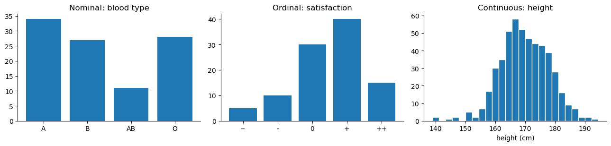

# 자료의 종류

기술통계를 시작하기 전에 먼저 물어야 할 것이 있다. **지금 다루는 자료가 어떤 종류인가?**

이 질문이 먼저인 이유는 단순하다. 자료의 종류가 **계산할 수 있는 통계량**과 **그릴 수 있는 그림**을 결정하기 때문이다. 혈액형의 평균을 구하는 것은 의미가 없고, 키의 최빈값을 구하는 것은 대개 쓸모가 없다. 자료의 종류를 먼저 정하지 않고 요약부터 시작하면, 계산은 되지만 뜻이 없는 숫자를 얻게 된다.

## 1. 큰 갈래: 범주형과 수치형

통계자료는 크게 두 갈래로 나뉜다.

### 범주형 자료

**범주형 자료**(categorical data)는 관측값이 몇 개의 **범주** 가운데 하나에 속하는 자료다. 값 자체가 이름표이며 산술연산의 대상이 아니다.

범주형 자료는 다시 둘로 나뉜다.

**명목형**(nominal): 범주 사이에 자연스러운 순서가 없다.

- 혈액형: A, B, AB, O
- 국적, 성별, 색깔
- 통신사, 진단명

**순서형**(ordinal): 범주에 자연스러운 순서가 있지만, 이웃한 범주 사이의 **간격이 수치적으로 같다고 볼 수 없다**.

- 만족도: 매우 불만 < 불만 < 보통 < 만족 < 매우 만족
- 학력: 초졸 < 중졸 < 고졸 < 대졸
- 암 병기: 1기 < 2기 < 3기 < 4기
- 별점: ★ < ★★ < ★★★ < ★★★★ < ★★★★★

### 수치형 자료

**수치형 자료**(numerical data, 양적 자료)는 세거나 잰 값이다. 더하고 빼는 것이 뜻을 갖는다.

**이산형**(discrete): 셀 수 있는 값. 대개 정수다.

- 자녀 수, 하루 방문자 수, 사고 건수

**연속형**(continuous): 잰 값. 원리상 어떤 실수도 될 수 있다.

- 키, 몸무게, 소득, 걸린 시간

## 2. 순서형은 범주형이다

흔한 오해가 하나 있다. 순서형을 범주형·수치형과 나란히 놓인 **세 번째** 갈래로 여기는 것이다. 더 정확히 말하면 **순서형 자료는 범주형 자료의 한 갈래**다.

```text
Statistical data
├── Categorical  (범주형)
│   ├── Nominal  (명목형)
│   └── Ordinal  (순서형)
└── Numerical    (수치형)
    ├── Discrete   (이산형)
    └── Continuous (연속형)
```

순서형은 범주형이 갖는 성질(값이 범주다)을 그대로 갖고, 거기에 **순서**라는 성질을 하나 더 갖는다. 그래서 명목형에 쓸 수 있는 것은 순서형에도 모두 쓸 수 있고, 그 위에 순서를 쓰는 방법(중앙값, 분위수, 순위 기반 검정)이 더해진다.

!!! warning "순서형에 평균을 쓰는 것은 왜 위험한가"
    만족도를 매우 불만 $=1$, ..., 매우 만족 $=5$로 부호화하고 평균 $3.7$을 보고하는 일은 흔하다. 그러나 이 계산은 **1과 2 사이의 거리가 4와 5 사이의 거리와 같다**는 가정을 몰래 끌어들인다. 순서형 자료는 바로 그것을 보장하지 않는 자료다.

    부호화를 $1, 2, 3, 4, 5$ 대신 $1, 2, 3, 4, 10$으로 바꾸면 순서는 그대로인데 평균은 달라진다. **순서만 정해진 자료에서 평균은 부호화 방식에 의존한다.** 중앙값과 최빈값은 그렇지 않다.

    아래 3절에서 이것을 수치로 확인한다. 실무에서는 (1) 중앙값과 분위수를 쓰거나, (2) 범주별 비율을 그대로 보고하거나, (3) 순서형을 제대로 다루는 모형(순서형 로지스틱 회귀)을 쓰는 편이 안전하다.

## 3. 종류에 따라 무엇이 달라지는가

| | 명목형 | 순서형 | 수치형 |
|---|:---:|:---:|:---:|
| 도수, 비율, 최빈값 | ✓ | ✓ | ✓ |
| 순서 비교($<$, $>$) | ✗ | ✓ | ✓ |
| 중앙값, 분위수 | ✗ | ✓ | ✓ |
| 평균, 표준편차 | ✗ | △ | ✓ |
| 차이($-$)의 해석 | ✗ | ✗ | ✓ |
| 대표적 그림 | 막대, 원 | 순서 있는 막대 | 히스토그램, 상자 |

다음 코드가 이 표의 핵심을 보여 준다. 같은 순서형 응답에 서로 다른 두 부호화를 주면 중앙값과 최빈값은 그대로지만 평균은 달라진다.

<div class="codebox" markdown>

**예제 1.** 만족도 응답에 평균을 쓸 수 있는가

```python
import numpy as np
import pandas as pd

# 만족도 응답 (순서형)
levels = ["매우 불만", "불만", "보통", "만족", "매우 만족"]
counts = [5, 10, 30, 40, 15]
answers = np.repeat(np.arange(5), counts)      # 0..4 로 부호화된 응답

# 부호화 A: 1, 2, 3, 4, 5  (등간격이라고 가정)
# 부호화 B: 1, 2, 3, 4, 10 (순서는 같지만 마지막 간격을 넓게 잡음)
code_a = np.array([1, 2, 3, 4, 5])[answers]
code_b = np.array([1, 2, 3, 4, 10])[answers]

print(f"부호화 A: 평균 {code_a.mean():.3f}, 중앙값 {np.median(code_a):.1f}")
print(f"부호화 B: 평균 {code_b.mean():.3f}, 중앙값 {np.median(code_b):.1f}")
print(f"최빈 범주: {levels[np.bincount(answers).argmax()]}")
```

출력:

```
부호화 A: 평균 3.500, 중앙값 4.0
부호화 B: 평균 4.250, 중앙값 4.0
최빈 범주: 만족
```

</div>

평균만 바뀌고 중앙값과 최빈값은 그대로다. **순서형 자료를 요약할 때 중앙값을 쓰는 이유가 이것이다.**

세 종류를 나란히 그리면 차이가 분명해진다. **명목형은 막대의 순서를 바꿔도 아무것도 잃지 않지만, 순서형은 순서를 지켜야 하고, 수치형은 축 자체가 눈금을 갖는다.**

<div class="codebox" markdown>

**예제 2.** 자료 종류에 따라 달라지는 그림

```python
import matplotlib.pyplot as plt
import numpy as np

rng = np.random.default_rng(0)
fig, axes = plt.subplots(1, 3, figsize=(13, 3.2))

# (1) 명목형 - 막대 순서에 뜻이 없다
blood = ["A", "B", "AB", "O"]
axes[0].bar(blood, [34, 27, 11, 28])
axes[0].set_title("Nominal: blood type")

# (2) 순서형 - 막대 순서를 지켜야 한다
axes[1].bar(range(5), [5, 10, 30, 40, 15])
axes[1].set_xticks(range(5))
axes[1].set_xticklabels(["--", "-", "0", "+", "++"])
axes[1].set_title("Ordinal: satisfaction")

# (3) 연속형 - 가로축이 눈금을 갖는 수직선이다
axes[2].hist(rng.normal(170, 8, 500), bins=25, edgecolor="white")
axes[2].set_xlabel("height (cm)")
axes[2].set_title("Continuous: height")

for ax in axes:
    ax.spines[["top", "right"]].set_visible(False)
plt.tight_layout()
plt.show()
```

</div>



### pandas에서 순서를 자료에 새겨 넣기

파이썬에서 순서형을 그냥 문자열로 두면 순서 정보가 사라진다. `pandas`의 순서 있는 범주형(ordered categorical)을 쓰면 순서가 자료구조 자체에 들어간다.

<div class="codebox" markdown>

**예제 3.** pandas 에 순서를 새겨 넣기

```python
import numpy as np
import pandas as pd

s_plain = pd.Series(["보통", "만족", "불만", "매우 만족"])
s_ord = pd.Series(
    ["보통", "만족", "불만", "매우 만족"],
    dtype=pd.CategoricalDtype(categories=levels, ordered=True),
)

print("문자열 정렬 :", list(s_plain.sort_values()))
print("순서형 정렬 :", list(s_ord.sort_values()))
print("순서 비교   :", (s_ord > "보통").tolist())

# 중앙값은 .median()이 아니라 범주 코드에서 구한다 (아래 주의 참조)
print("중앙값      :", levels[int(np.median(s_ord.cat.codes))])
```

출력:

```
문자열 정렬 : ['만족', '매우 만족', '보통', '불만']
순서형 정렬 : ['불만', '보통', '만족', '매우 만족']
순서 비교   : [False, True, False, True]
중앙값      : 보통
```

</div>

문자열로 두면 가나다순으로 정렬되어 뜻이 없다. 순서형으로 선언하면 정렬과 비교가 우리가 의도한 순서를 따른다.

!!! warning "pandas는 순서형에 `median()`을 제공하지 않는다"
    순서를 아는 자료이므로 중앙값이 잘 정의되는데도, `s_ord.median()`은

    ```text
    TypeError: 'Categorical' with dtype category does not support reduction 'median'
    ```

    을 낸다(pandas 2.2 기준). 중앙값은 순서만 있으면 정의되지만 pandas의 축약 연산은 수치형을 전제하기 때문이다.

    그래서 위 코드처럼 **범주 코드**(`.cat.codes`, 즉 `categories` 안에서의 위치)로 중앙값을 구한 뒤 다시 범주 이름으로 되돌린다. 코드의 중앙값이 정수가 아닐 때(관측 개수가 짝수여서 두 범주 사이에 걸릴 때)는 어느 쪽을 택할지 정해야 하는데, 위에서는 `int()`로 아래쪽 범주를 골랐다.

### 범주형을 숫자로 바꾸기: 왜 0, 1이 수치형이 아닌가

범주형 자료를 컴퓨터에 넣으려면 결국 숫자로 바꿔야 한다. 그러나 **숫자로 바꾸었다고 수치형이 되는 것은 아니다.**

혈액형 A, B, AB, O에 $0, 1, 2, 3$을 붙였다고 하자. 이 부호화는 자기도 모르게 두 가지를 주장한다.

- **순서**: $\text{A} < \text{B} < \text{AB} < \text{O}$
- **간격**: A와 B의 거리가 B와 AB의 거리와 같다

둘 다 사실이 아니다. 이렇게 부호화한 열을 회귀나 거리 기반 방법에 그대로 넣으면 모형은 이 거짓 주장을 진짜로 받아들인다.

**원핫 부호화**(one-hot encoding)가 표준적인 해법이다. 범주가 $k$개면 0/1 값을 갖는 열 $k$개를 만들고, 자기 범주에 해당하는 열만 1로 둔다.

<div class="codebox" markdown>

**예제 4.** 원핫 부호화와 범주 사이의 거리

```python
import pandas as pd

blood = pd.Series(["A", "O", "AB", "B", "O"], name="blood")
onehot = pd.get_dummies(blood, prefix="bt").astype(int)
print(onehot)

# 순진한 정수 부호화와 비교하면 "거리"가 어떻게 달라지는지 보인다
naive = pd.Series([0, 3, 2, 1, 3])          # A=0, B=1, AB=2, O=3
print("\n정수 부호화에서 |A - O| =", abs(naive[0] - naive[1]))
print("정수 부호화에서 |A - B| =", abs(naive[0] - naive[3]))
print("원핫에서 모든 서로 다른 범주 쌍의 거리^2 =",
      int(((onehot.iloc[0] - onehot.iloc[1]) ** 2).sum()))
```

출력:

```
bt_A  bt_AB  bt_B  bt_O
0     1      0     0     0
1     0      0     0     1
2     0      1     0     0
3     0      0     1     0
4     0      0     0     1

정수 부호화에서 |A - O| = 3
정수 부호화에서 |A - B| = 1
원핫에서 모든 서로 다른 범주 쌍의 거리^2 = 2
```

</div>

정수 부호화에서는 A와 O의 거리가 A와 B의 거리보다 세 배 크다. 원핫에서는 **서로 다른 범주라면 어느 쌍이든 거리가 같다**. 이것이 명목형이 본래 뜻하는 바다.

!!! note "그렇다면 순서형은?"
    순서형에는 순서가 실제로 있으므로 정수 부호화가 원핫보다 나을 때가 많다. 순서 정보를 버리지 않기 때문이다. 다만 이때도 **간격이 같다는 가정**은 여전히 남는다(2절의 주의 참조).

    실무에서는 셋 다 시도해 보는 편이 좋다. (1) 순서를 살린 정수 부호화, (2) 원핫, (3) 순서형 전용 모형. 어느 것이 나은지는 자료와 목적에 달려 있다.

!!! warning "원핫의 대가: 열이 폭발한다"
    범주가 많으면 열도 그만큼 늘어난다. 우편번호(수천 개)나 상품 코드(수만 개)를 원핫으로 바꾸면 변수 개수가 관측 개수를 훌쩍 넘어 $p \gg n$이 된다. 5절에서 볼 이미지·텍스트와 같은 상황이 표 자료에서도 생기는 셈이다.

    대안으로는 드문 범주를 "기타"로 묶기, 목표값 부호화(target encoding), 그리고 5절 끝에서 언급할 **임베딩**이 있다. 임베딩은 원핫의 고차원 희소 벡터를 저차원 조밀 벡터로 바꾼 것으로 볼 수 있다.

## 4. 한 걸음 더: 측정의 네 척도

Stevens(1946)의 고전적인 분류는 수치형을 다시 둘로 나눈다. **0이 무엇을 뜻하는가**가 기준이다.

| 척도 | 순서 | 간격이 같은가 | 절대 0 | 예 |
|---|:---:|:---:|:---:|---|
| 명목(nominal) | ✗ | ✗ | ✗ | 혈액형 |
| 순서(ordinal) | ✓ | ✗ | ✗ | 만족도 |
| 구간(interval) | ✓ | ✓ | ✗ | 섭씨온도, 연도 |
| 비율(ratio) | ✓ | ✓ | ✓ | 키, 무게, 절대온도 |

**구간척도**에는 참된 0이 없다. 섭씨 $0^\circ$는 "열이 없음"이 아니라 물이 어는 온도라는 약속일 뿐이다. 그래서 차이는 말이 되지만($20^\circ$는 $10^\circ$보다 $10^\circ$ 더 덥다) **비는 말이 되지 않는다**($20^\circ$가 $10^\circ$보다 두 배 덥다고 할 수 없다).

**비율척도**에는 참된 0이 있어 비가 뜻을 갖는다. 키 $180\,\text{cm}$는 $90\,\text{cm}$의 두 배가 맞다.

<div class="codebox" markdown>

**예제 5.** 섭씨와 화씨 — 간격척도와 비율척도

```python
# 섭씨 -> 화씨는 순서와 간격은 보존하지만 비는 보존하지 않는다
c1, c2 = 10.0, 20.0
f1, f2 = c1 * 9 / 5 + 32, c2 * 9 / 5 + 32

print(f"섭씨: {c1} -> {c2},  비 = {c2 / c1:.3f}")
print(f"화씨: {f1} -> {f2},  비 = {f2 / f1:.3f}")

# 절대온도(비율척도)에서는 단위를 바꿔도 비가 보존된다
k1, k2 = c1 + 273.15, c2 + 273.15
r1, r2 = k1 * 9 / 5, k2 * 9 / 5          # 랭킨 온도
print(f"켈빈: 비 = {k2 / k1:.4f},  랭킨: 비 = {r2 / r1:.4f}")
```

출력:

```
섭씨: 10.0 -> 20.0,  비 = 2.000
화씨: 50.0 -> 68.0,  비 = 1.360
켈빈: 비 = 1.0353,  랭킨: 비 = 1.0353
```

</div>

같은 온도인데 단위만 바꾸면 "몇 배"가 $2.000$에서 $1.360$으로 달라진다. **구간척도에서 비를 계산하면 안 되는 이유**가 이것이다. 반면 절대온도에서는 단위를 바꿔도 비가 그대로다.

## 5. 오늘날의 자료: 이미지, 소리, 텍스트

지금까지의 분류는 **표(table)로 정리되는 자료**를 전제한다. 행이 관측 개체이고 열이 변수인 형태다. 그러나 오늘날 다루는 자료의 상당 부분은 그런 모양이 아니다.

| 자료 | 실제 저장 형태 | 통계적으로 보면 |
|---|---|---|
| 이미지(JPEG, PNG) | 높이 $\times$ 너비 $\times$ 채널의 화소값 배열 | 격자 위에 놓인 수치형 변수 수만~수십만 개 |
| 소리(MP3, WAV) | 표본화율에 따라 뽑은 진폭의 수열 | 시간을 따라 늘어선 시계열 |
| 텍스트 | 토큰(단어·부분단어)의 수열 | 순서가 있는 **명목형** 자료의 수열 |
| 영상 | 이미지의 시계열 | 공간 + 시간 구조 |
| 그래프·네트워크 | 정점과 간선 | 개체 사이의 **관계** 자료 |
| 공간자료 | 좌표에 붙은 값 | 위치 구조를 가진 수치형 |

이런 자료를 **비정형 자료**(unstructured data)라 부르지만, 이름과 달리 구조가 없는 것이 아니다. 오히려 **구조가 매우 많다**. 표에 담기지 않을 뿐이다.

여기서 세 가지를 짚어 둘 만하다.

**(1) 결국은 수치형 배열이다.** 이미지도 소리도 컴퓨터 안에서는 숫자의 배열이다. 화소값 $0 \sim 255$는 이산형 수치자료이고, 정규화한 $[0, 1]$ 값은 연속형처럼 다룬다. 이 장에서 배우는 평균·분산·히스토그램은 그 숫자들에 그대로 적용된다.

**(2) 그러나 순서와 이웃 관계가 정보를 담는다.** 표 자료의 열은 순서를 바꿔도 아무 일이 없다. 이미지의 화소는 그렇지 않다. 옆에 있는 화소끼리 값이 비슷하다는 사실, 소리에서 앞뒤 표본이 이어져 있다는 사실이 곧 정보다. 화소를 뒤섞으면 사람도 기계도 그림을 알아보지 못한다. **고전적인 표 자료 방법이 이런 자료에 바로 통하지 않는 이유가 여기에 있다.**

**(3) 변수가 관측보다 훨씬 많다.** $224 \times 224$ 컬러 이미지 한 장은 변수 $224 \times 224 \times 3 = 150{,}528$개인 관측 하나다. 사진 1,000장을 모아도 $n = 1000$, $p = 150{,}528$으로 $p \gg n$이다. 18장의 정칙화가 필요해지는 전형적인 상황이다.

<div class="codebox" markdown>

**예제 6.** 이미지·소리·텍스트도 숫자 배열이다

```python
import numpy as np
from sklearn.datasets import load_digits

digits = load_digits()
img = digits.images[0]                      # 8x8 손글씨 숫자 한 장

print(f"이미지 한 장의 모양: {img.shape},  자료형: {img.dtype}")
print(f"화소값 범위: {img.min():.0f} ~ {img.max():.0f}  (이산형 수치자료)")
print(f"변수 개수 p = {img.size},  관측 개수 n = {len(digits.images)}")

# 소리: 표본화율 8000Hz로 0.5초 동안 440Hz 순음을 기록한다
sr, dur = 8000, 0.5
t = np.arange(int(sr * dur)) / sr
wave = np.sin(2 * np.pi * 440 * t)
print(f"소리 0.5초의 표본 개수: {wave.size}  (시간 순서가 있는 수치자료)")

# 텍스트: 토큰은 본래 명목형이다
text = "통계 자료 의 종류 는 자료 의 요약 방법 을 정한다"
tokens = text.split()
vocab = sorted(set(tokens))
print(f"토큰 {len(tokens)}개, 어휘 {len(vocab)}개 (명목형 범주)")
print(f"정수 부호화: {[vocab.index(w) for w in tokens]}")
```

출력:

```
이미지 한 장의 모양: (8, 8),  자료형: float64
화소값 범위: 0 ~ 15  (이산형 수치자료)
변수 개수 p = 64,  관측 개수 n = 1797
소리 0.5초의 표본 개수: 4000  (시간 순서가 있는 수치자료)
토큰 11개, 어휘 9개 (명목형 범주)
정수 부호화: [8, 5, 4, 7, 0, 5, 4, 2, 1, 3, 6]
```

</div>

마지막 줄의 정수 부호화를 보라. `자료`가 $8$, `종류`가 $9$로 부호화되었다고 해서 두 단어 사이에 크기 관계가 있는 것이 아니다. **명목형을 정수로 바꾼 것일 뿐이며, 그 정수의 평균은 아무 뜻이 없다.** 현대의 기계학습이 단어를 정수 대신 **임베딩 벡터**로 바꾸는 이유가 바로 이것이다. 임베딩은 명목형 범주를 수치형 벡터로 옮기되, 그 벡터 사이의 거리가 뜻을 갖도록 학습된 표현이다.

!!! note "그래서 이 장의 내용이 쓸모없어지는가"
    그렇지 않다. 이유는 두 가지다.

    첫째, 비정형 자료를 다루는 과정에서 결국 **표 자료가 만들어진다**. 이미지에서 뽑아낸 특징, 모형이 내놓은 예측확률, 관측마다 계산한 손실값은 모두 수치형 한 변수이며, 히스토그램과 상자그림으로 살펴야 할 대상이다.

    둘째, 모형의 성능을 비교하고 불확실성을 재는 일은 여전히 통계 문제다. 19장과 20장에서 분류 모형을 평가할 때, 그리고 17장에서 붓스트랩으로 신뢰구간을 만들 때 이 장의 도구를 그대로 쓴다.

## 6. 자료의 종류를 정하는 실전 절차

실제 자료를 만났을 때 다음 순서로 물으면 대개 답이 나온다.

1. **값에 산술연산이 뜻을 갖는가?** 아니라면 범주형이다.
2. (범주형일 때) **범주에 자연스러운 순서가 있는가?** 있으면 순서형, 없으면 명목형이다.
3. (수치형일 때) **셀 수 있는 값인가, 잰 값인가?** 세면 이산형, 재면 연속형이다.
4. (수치형일 때) **0이 "없음"을 뜻하는가?** 그렇다면 비율척도라 비를 말할 수 있고, 아니라면 구간척도라 차이만 말할 수 있다.

!!! warning "숫자로 저장되어 있다고 수치형인 것은 아니다"
    우편번호, 주민등록번호, 등번호, 지역코드는 모두 숫자로 저장되지만 **명목형**이다. 우편번호의 평균은 아무 뜻이 없다.

    반대로 문자열로 저장된 수치형도 흔하다. `"1,234"`나 `"3.5kg"`처럼 쉼표나 단위가 붙어 있으면 pandas가 문자열로 읽어 들인다. 자료를 불러온 직후 `df.dtypes`를 확인하는 습관이 필요한 이유다.

    **자료형(dtype)은 저장 방식이고, 자료의 종류는 뜻이다.** 둘은 일치하지 않을 수 있으며, 일치시키는 것은 분석자의 몫이다.

## 연습문제

<div class="drillbox" markdown>

**연습문제 1.** <span class="diff easy" title="쉬움"></span>
다음 각각을 명목형·순서형·이산형·연속형으로 분류하라. (a) 택배 상자의 무게, (b) 한 시간 동안 도착한 택배 개수, (c) 배송 상태(접수/배송중/완료), (d) 송장번호, (e) 고객 평점(별 1~5개).

</div>

??? success "풀이"
    (a) **연속형**. 잰 값이며 원리상 어떤 실수도 될 수 있다.

    (b) **이산형**. 세는 값이므로 음이 아닌 정수다.

    (c) **순서형**. 접수 $<$ 배송중 $<$ 완료라는 자연스러운 진행 순서가 있다. 다만 세 단계 사이의 "간격"이 같다고 볼 근거는 없다.

    (d) **명목형**. 숫자로 되어 있지만 이름표일 뿐이다. 송장번호의 평균이나 대소 비교는 뜻이 없다(접수 순서를 담고 있다면 그 정보는 별도의 시각 변수로 다루는 편이 옳다).

    (e) **순서형**. 별 1개 $<$ 2개 $< \cdots <$ 5개의 순서는 분명하지만, 별 4개와 5개의 차이가 별 1개와 2개의 차이와 같다고 보기 어렵다. $\square$

<div class="drillbox" markdown>

**연습문제 2.** <span class="diff easy" title="쉬움"></span>
어떤 설문의 만족도 응답이 매우 불만 $5$명, 불만 $10$명, 보통 $30$명, 만족 $40$명, 매우 만족 $15$명이었다. 이 자료의 중앙값과 최빈값을 구하고, 평균을 보고하는 것이 왜 조심스러운지 설명하라.

</div>

??? success "풀이"
    총 $100$명이므로 중앙값은 $50$번째와 $51$번째 응답의 가운데다. 누적도수가 $5, 15, 45, 85, 100$이므로 두 응답 모두 **만족** 범주에 있다. 따라서 중앙값은 **만족**이고, 도수가 가장 큰 최빈값도 **만족**이다.

    ```python
    import numpy as np

    counts = np.array([5, 10, 30, 40, 15])
    levels = ["매우 불만", "불만", "보통", "만족", "매우 만족"]
    answers = np.repeat(np.arange(5), counts)

    cum = counts.cumsum()
    print("누적도수 :", cum)
    print("중앙값   :", levels[int(np.median(answers))])
    print("최빈값   :", levels[counts.argmax()])
    ```

    출력:

    ```
    누적도수 : [  5  15  45  85 100]
    중앙값   : 만족
    최빈값   : 만족
    ```

    평균이 조심스러운 이유는 **부호화에 의존**하기 때문이다. 본문에서 보았듯 순서를 바꾸지 않는 부호화를 골라도 평균은 달라진다. 중앙값과 최빈값은 순서만 쓰므로 그런 문제가 없다.

    다만 실무에서 만족도 평균을 완전히 금지할 필요는 없다. **여러 집단을 같은 부호화로 비교**하는 경우처럼 부호화가 공통이라면 비교 자체는 의미를 가질 수 있다. 위험한 것은 $3.7$이라는 값 자체를 "간격이 같은 척도 위의 위치"로 해석하는 일이다. $\square$

<div class="drillbox" markdown>

**연습문제 3.** <span class="diff easy" title="쉬움"></span>
섭씨온도가 구간척도임을 이용하여, "오늘 최고기온 $30^\circ\text{C}$는 어제 $15^\circ\text{C}$의 두 배로 덥다"는 서술이 왜 틀렸는지 보여라. 절대온도로 바꾸면 실제 비는 얼마인가?

</div>

??? success "풀이"
    비가 뜻을 가지려면 척도에 **참된 0**이 있어야 한다. 섭씨 $0^\circ$는 물의 어는점이라는 약속일 뿐 "열이 없는 상태"가 아니다. 실제로 화씨로 바꾸면 $30^\circ\text{C} = 86^\circ\text{F}$, $15^\circ\text{C} = 59^\circ\text{F}$이므로 비가 $86/59 = 1.458$이 되어 $2$가 아니다. 같은 물리적 사실인데 단위에 따라 "몇 배"가 달라진다면 그 비는 물리적 뜻이 없다.

    절대온도로 바꾸면

    $$
    \frac{30 + 273.15}{15 + 273.15} = \frac{303.15}{288.15} = 1.052.
    $$

    ```python
    print(f"섭씨 비  : {30 / 15:.3f}")
    print(f"화씨 비  : {(30 * 9 / 5 + 32) / (15 * 9 / 5 + 32):.3f}")
    print(f"켈빈 비  : {(30 + 273.15) / (15 + 273.15):.3f}")
    ```

    출력:

    ```
    섭씨 비  : 2.000
    화씨 비  : 1.458
    켈빈 비  : 1.052
    ```

    즉 분자 운동 에너지로 따지면 $5\%$ 남짓 더 클 뿐이다. **구간척도에서는 차이만, 비율척도에서는 비까지 말할 수 있다.** $\square$

<div class="drillbox" markdown>

**연습문제 4.** <span class="diff easy" title="쉬움"></span>
$256 \times 256$ 컬러 이미지 $500$장을 모아 각 이미지를 하나의 관측으로 보는 자료를 만들었다. 이 자료의 $n$과 $p$를 구하고, 이 장에서 배우는 표 자료용 방법을 그대로 적용하기 어려운 이유를 두 가지 쓰라.

</div>

??? success "풀이"
    관측 개수는 $n = 500$이고, 변수 개수는 채널까지 세어

    $$
    p = 256 \times 256 \times 3 = 196{,}608.
    $$

    적용이 어려운 이유:

    **첫째, $p \gg n$이다.** 변수가 관측보다 $400$배 가까이 많다. 표본공분산행렬은 $196{,}608 \times 196{,}608$ 크기인데 계급이 최대 $499$에 불과해 특이행렬이다. 다중회귀나 선형판별처럼 공분산의 역행렬을 요구하는 방법은 그대로 쓸 수 없고, 18장의 정칙화나 차원축소가 필요하다.

    **둘째, 변수들이 교환 가능하지 않다.** 표 자료에서는 열의 순서를 바꿔도 분석 결과가 같지만, 이미지의 화소는 격자 위 위치가 곧 정보다. 이웃한 화소는 강하게 상관되어 있고, 그 국소 구조가 형태를 만든다. 화소를 무작위로 뒤섞으면 통계량(평균, 분산, 히스토그램)은 하나도 변하지 않는데 그림은 알아볼 수 없게 된다. **화소값의 주변분포만 보는 방법은 이미지의 본질을 놓친다.**

    ```python
    import numpy as np

    rng = np.random.default_rng(0)
    from sklearn.datasets import load_digits
    img = load_digits().images[0]
    shuffled = rng.permutation(img.ravel()).reshape(img.shape)

    print(f"원본   평균 {img.mean():.3f}, 표준편차 {img.std():.3f}")
    print(f"뒤섞음 평균 {shuffled.mean():.3f}, 표준편차 {shuffled.std():.3f}")
    ```

    출력:

    ```
    원본   평균 4.594, 표준편차 5.183
    뒤섞음 평균 4.594, 표준편차 5.183
    ```

    두 이미지의 요약통계량이 완전히 같다는 점에 주목하라. 이것이 공간 구조를 다루는 방법(합성곱 등)이 따로 필요한 이유다. $\square$

<div class="drillbox" markdown>

**연습문제 5.** <span class="diff med" title="중간"></span>
설문 자료를 pandas로 읽었더니 만족도 열의 `dtype`이 `object`였다. 이 상태에서 `sort_values()`와 `median()`을 호출하면 각각 어떤 일이 일어나는가? 올바르게 고치는 방법을 쓰라.

</div>

??? success "풀이"
    `dtype`이 `object`이면 값은 그냥 문자열이다.

    - `sort_values()`는 **사전순**으로 정렬한다. 한글이면 가나다순이 되어 "매우 만족"이 "보통"보다 앞에 오는 식으로 뜻이 없는 순서가 나온다.
    - `median()`은 **`TypeError`를 낸다.** 문자열에는 중앙값이 정의되지 않는다. (평균 `mean()`도 마찬가지다.)

    고치는 방법은 순서를 자료구조에 명시하는 것이다.

    ```python
    import numpy as np
    import pandas as pd

    levels = ["매우 불만", "불만", "보통", "만족", "매우 만족"]
    s = pd.Series(["보통", "만족", "불만", "매우 만족"])
    print("object dtype 정렬:", list(s.sort_values()))
    try:
        s.median()
    except TypeError as e:
        print("object dtype median:", type(e).__name__)

    s_ord = s.astype(pd.CategoricalDtype(categories=levels, ordered=True))
    print("순서형 정렬      :", list(s_ord.sort_values()))
    print("순서형 비교      :", (s_ord > "보통").tolist())

    # 순서형에도 .median()은 막혀 있으므로 범주 코드로 구한다
    try:
        s_ord.median()
    except TypeError as e:
        print("순서형 median    :", type(e).__name__)
    print("코드로 구한 중앙값:", levels[int(np.median(s_ord.cat.codes))])
    ```

    출력:

    ```
    object dtype 정렬: ['만족', '매우 만족', '보통', '불만']
    object dtype median: TypeError
    순서형 정렬      : ['불만', '보통', '만족', '매우 만족']
    순서형 비교      : [False, True, False, True]
    순서형 median    : TypeError
    코드로 구한 중앙값: 보통
    ```

    `ordered=True`가 핵심이다. 이것을 빼면 범주형이 되기는 하지만 순서가 없어 비교조차 막힌다.

    다만 본문에서 보았듯 `ordered=True`를 주어도 pandas는 `median()`을 허용하지 않는다. **정렬과 비교는 자료구조가 해 주지만 중앙값은 직접 구해야 한다.** 그래도 순서를 자료에 기록해 두면 이후의 모든 정렬·그림·`groupby`가 자동으로 올바른 순서를 따르므로, 순서를 쓸 때마다 손으로 지정하는 것보다 훨씬 안전하다. $\square$

<div class="drillbox" markdown>

**연습문제 6.** <span class="diff med" title="중간"></span>
연습문제 2에서 순서형의 평균을 보고하는 것이 조심스럽다고 했다. **얼마나** 조심스러운지 보여라. 같은 자료에 대해 코드 평균과 "$4$점 이상 비율"이 **정반대 결론**을 내는 경우를 만들어라.

</div>

??? success "풀이"
    ```python
    import numpy as np

    rng = np.random.default_rng(0)
    n = 200_000

    # A: 중간에 몰려 있다.  B: 양극화되어 있다.
    A = rng.normal(0.15, 0.6, n)
    B = np.where(rng.random(n) < 0.5, rng.normal(-1.0, 0.5, n), rng.normal(1.1, 0.5, n))
    print(f"잠재 만족도 평균:  A {A.mean():+.4f}   B {B.mean():+.4f}   → A 가 높다")

    cut = np.array([-1.5, -0.5, 0.5, 1.5])          # 1~5 점으로 나누는 경계
    a = np.digitize(A, cut) + 1
    b = np.digitize(B, cut) + 1

    print(f"\n코드 평균:      A {a.mean():.4f}   B {b.mean():.4f}   → A 가 높다")
    print(f"4점 이상 비율:  A {np.mean(a >= 4):.4f}   B {np.mean(b >= 4):.4f}   → B 가 높다")
    print(f"\n응답 분포")
    print(f"  A {np.round([np.mean(a == c) for c in range(1, 6)], 3)}")
    print(f"  B {np.round([np.mean(b == c) for c in range(1, 6)], 3)}")
    ```

    출력:

    ```
    잠재 만족도 평균:  A +0.1501   B +0.0524   → A 가 높다

    코드 평균:      A 3.1497   B 3.0518   → A 가 높다
    4점 이상 비율:  A 0.2808   B 0.4434   → B 가 높다

    응답 분포
      A [0.003 0.137 0.579 0.269 0.012]
      B [0.079 0.341 0.137 0.336 0.107]
    ```

    **두 요약이 정반대를 말한다.** 코드 평균은 A가 높다고 하고($3.150$ 대 $3.052$), "$4$점 이상" 비율은 B가 높다고 한다($0.281$ 대 $0.443$). 둘 다 같은 자료에서 정직하게 계산한 값이다.

    **응답 분포가 이유를 보여 준다.** A는 $3$점에 $58\%$가 몰린 단봉이고, B는 $2$점과 $4$점에 각각 $34\%$씩 쌓인 양극화 분포다. B에는 만족한 사람도 많고 불만인 사람도 많다. **평균 하나로는 이 구조를 표현할 수 없다.**

    **코드 평균이 숨기는 가정.** $1, 2, 3, 4, 5$를 더해서 나누는 것은 **"불만 → 보통"의 거리와 "만족 → 매우 만족"의 거리가 같다**고 선언하는 것이다. 그런데 응답자에게 그 간격이 같다는 근거가 없다. 실제로 사람들은 양 끝 선택지를 꺼리는 경향(중심화 경향)이 있어 등간격 가정이 특히 의심스럽다.

    **그러면 무엇을 보고하는가.**

    | 방법 | 장점 | 주의 |
    |---|---|---|
    | **응답 분포 전체** | 정보를 잃지 않는다 | 비교가 번거롭다 |
    | **중앙값·최빈값** | 순서만 쓴다 | 범주가 적으면 둔감하다 |
    | **"상위 $k$ 비율"** | 해석이 명확하다 | 경계 선택이 자의적 |
    | **순서형 로짓** | 등간격을 가정하지 않고 비교 | 모형이 필요하다 |

    **실무의 절충.** 리커트 척도의 평균은 널리 쓰이며, 항목이 $5$개 이상이고 분포가 단봉이면 대체로 큰 문제를 일으키지 않는다는 실증 연구도 많다. 그러나 **위 예처럼 분포 모양이 다른 집단을 비교할 때는 평균만 보고하면 안 된다.** 최소한 분포를 함께 제시하라. $\square$

<div class="drillbox" markdown>

**연습문제 7.** <span class="diff med" title="중간"></span>
순서형 변수를 회귀에 넣을 때 **정수 코드**를 그대로 쓰는 것과 **원-핫**으로 푸는 것이 어떻게 다른가? 효과가 등간격이 아닐 때 무슨 일이 일어나는지 수치로 보여라.

</div>

??? success "풀이"
    ```python
    import numpy as np
    from sklearn.linear_model import LinearRegression

    rng = np.random.default_rng(1)
    n = 6000
    level = rng.integers(0, 5, n)                    # 교육수준 5단계
    true = np.array([0.0, 0.2, 0.5, 3.0, 3.4])       # 임금 효과 — 등간격이 아니다
    y = true[level] + rng.normal(0, 1, n)

    X_int = level.reshape(-1, 1).astype(float)       # 정수 인코딩
    X_hot = np.eye(5)[level][:, 1:]                  # 원-핫 (기준 범주 제외)

    for name, X in [("정수 인코딩", X_int), ("원-핫 인코딩", X_hot)]:
        m = LinearRegression().fit(X, y)
        print(f"{name:>14}: R^2 {m.score(X, y):.4f}   계수 {np.round(m.coef_, 3)}")
    print(f"{'참 효과':>14}: (기준 대비) {np.round(true - true[0], 3)}")
    ```

    출력:

    ```
    정수 인코딩: R^2 0.5975   계수 [0.977]
           원-핫 인코딩: R^2 0.6933   계수 [0.226 0.552 3.09  3.48 ]
              참 효과: (기준 대비) [0.  0.2 0.5 3.  3.4]
    ```

    **정수 인코딩은 계수 하나만 준다**($0.977$). "한 단계 오를 때마다 임금이 $0.98$씩 오른다"는 뜻인데, 참 효과는 $0.2, 0.5, 3.0, 3.4$로 **$2$단계와 $3$단계 사이에서 크게 도약한다.** 이 구조가 평균 기울기 하나로 뭉개졌다.

    **원-핫은 각 수준을 따로 추정해 참 효과를 그대로 되찾는다**($0.226, 0.552, 3.09, 3.48$). $R^2$도 $0.598$에서 $0.693$으로 오른다.

    **정수 인코딩이 강제하는 가정은 두 가지다.**

    - **등간격**: 인접한 두 수준의 차이가 모두 같다.
    - **단조성과 선형성**: 효과가 수준에 대해 직선으로 변한다.

    앞의 것이 바로 연습문제 6에서 문제 삼은 그 가정이며, 여기서는 회귀계수의 형태로 나타난다.

    **그렇다고 원-핫이 언제나 옳은 것은 아니다.**

    | 상황 | 권장 |
    |---|---|
    | 수준이 적고 자료가 충분하다 | **원-핫** |
    | 수준이 많고(예: $10$단계) 자료가 적다 | 정수 또는 소수의 묶음 |
    | 효과가 정말 단조·선형이라고 믿을 근거가 있다 | 정수 (모수가 적어 유리) |
    | 순서를 보존하면서 유연하게 | 단조 제약 회귀, 스플라인 |

    **원-핫의 대가는 자유도다.** 수준이 $k$개면 $k-1$개의 계수를 추정해야 하고, 순서 정보를 **버린다.** 원-핫 모형은 "매우 만족"이 "만족"보다 높다는 사실조차 모른다.

    **진단하는 법.** 정수 인코딩으로 적합한 뒤 잔차를 수준별로 평균 내 보라. 체계적인 패턴이 남아 있으면 등간격 가정이 깨진 것이다. 위 예에서는 $3$단계 이상에서 잔차가 크게 양수로 나온다. $\square$

<div class="drillbox" markdown>

**연습문제 8.** <span class="diff med" title="중간"></span>
이산형(계수) 자료를 연속형처럼 다루면 무엇을 놓치는가? 포아송 자료의 **평균과 분산 관계**를 확인하고, 그 함의를 설명하라.

</div>

??? success "풀이"
    ```python
    import numpy as np

    rng = np.random.default_rng(1)
    print(f"{'lambda':>8}{'표본평균':>11}{'표본분산':>11}{'분산/평균':>11}")
    for lam in (1.0, 5.0, 20.0, 100.0):
        c = rng.poisson(lam, 200_000)
        print(f"{lam:>8.1f}{c.mean():>11.3f}{c.var():>11.3f}{c.var() / c.mean():>11.4f}")
    ```

    출력:

    ```
    lambda       표본평균       표본분산      분산/평균
         1.0      0.998      1.002     1.0034
         5.0      5.001      4.987     0.9971
        20.0     19.993     19.965     0.9986
       100.0    100.009     99.602     0.9959
    ```

    **비가 언제나 $1$이다.** 포아송분포에서는 $\operatorname{Var}(X) = \mathbb{E}[X] = \lambda$로, 평균이 분산을 **결정한다.**

    **이것이 왜 중요한가.** 정규분포에서는 평균과 분산이 서로 무관한 두 모수다. 계수 자료에서는 그렇지 않다.

    - **평균이 커지면 변동도 반드시 커진다.** 하루 평균 방문객이 $100$명인 가게는 $\pm 10$명, $10000$명인 가게는 $\pm 100$명 흔들린다. 절대적 변동은 커지지만 **상대적 변동**($\text{CV} = 1/\sqrt{\lambda}$)은 작아진다.
    - **등분산 가정이 자동으로 깨진다.** 계수 자료에 보통최소제곱을 쓰면 평균이 큰 관측의 분산이 크므로 이분산이다. 0장 연습문제 10에서 본 대로 추정은 불편이지만 표준오차가 틀린다.
    - **음수 예측이 나온다.** 선형모형은 $\hat{y} < 0$을 막지 않는데, 계수는 음수일 수 없다.

    **처방은 포아송 회귀(또는 음이항 회귀)다.** 로그 연결함수를 써서 $\log \mathbb{E}[Y] = \mathbf{x}^T\boldsymbol{\beta}$로 모형화하면 예측이 항상 양수이고 분산 구조도 맞는다.

    **과산포에 주의하라.** 실제 계수 자료는 분산이 평균보다 **큰** 경우가 많다(과산포). 관측되지 않은 이질성이 있거나 사건이 서로 독립이 아니기 때문이다. 이때는 음이항 회귀나 준포아송을 쓴다. 진단은 간단하다. **잔차 이탈도를 자유도로 나눈 값이 $1$보다 훨씬 크면 과산포**다.

    **언제 연속형처럼 다루어도 되는가.** $\lambda$가 충분히 크면($\gtrsim 20$) 포아송이 정규에 가까워지므로 근사가 무난하다. 위 표에서 $\lambda = 100$이면 평균 $\pm 3$ 표준편차가 $[70, 130]$이라 음수 걱정도 없다. **문제가 되는 것은 $\lambda$가 작을 때, 특히 $0$이 많을 때**다. $\square$

<div class="drillbox" markdown>

**연습문제 9.** <span class="diff med" title="중간"></span>
본문 $5$절이 말한 "오늘날의 자료"를 실제로 표로 바꾸어 보라. 텍스트 문서 몇 개를 수치 행렬로 만들고, 그 결과가 표 자료와 어떻게 다른지 설명하라.

</div>

??? success "풀이"
    ```python
    from sklearn.feature_extraction.text import CountVectorizer

    docs = ["통계는 자료를 다룬다",
            "자료는 통계의 재료다",
            "기계학습도 자료를 쓴다",
            "통계와 기계학습은 다르다"]

    cv = CountVectorizer()
    M = cv.fit_transform(docs)
    print(f"문서 {len(docs)}개 → 행렬 {M.shape}")
    print(f"희소도(0의 비율) {1 - M.nnz / (M.shape[0] * M.shape[1]):.3f}")
    print("\n어휘:", cv.get_feature_names_out())
    print(M.toarray())
    ```

    출력:

    ```
    문서 4개 → 행렬 (4, 11)
    희소도(0의 비율) 0.727

    어휘: ['기계학습도' '기계학습은' '다룬다' '다르다' '쓴다' '자료는' '자료를' '재료다' '통계는' '통계와' '통계의']
    [[0 0 1 0 0 0 1 0 1 0 0]
     [0 0 0 0 0 1 0 1 0 0 1]
     [1 0 0 0 1 0 1 0 0 0 0]
     [0 1 0 1 0 0 0 0 0 1 0]]
    ```

    문서 $4$개가 $4 \times 11$ 행렬이 되었고, 원소의 $72.7\%$가 $0$이다.

    **표 자료와 다른 점 네 가지.**

    **첫째, $p$가 $n$보다 훨씬 크다.** 여기서는 문서 $4$개에 특징 $11$개다. 실제 말뭉치에서는 문서 수천 개에 어휘 수만 개가 흔하다. 연습문제 4의 이미지 자료와 같은 상황이며, 고전적인 회귀는 그대로 쓸 수 없다.

    **둘째, 극도로 희소하다.** 대부분의 문서는 대부분의 단어를 쓰지 않는다. 밀집 행렬로 저장하면 메모리가 낭비되므로 희소 행렬 자료구조가 필수다.

    **셋째, 특징이 자료에 의존해 정의된다.** 어휘 목록이 말뭉치에서 나왔으므로, 새 문서에 없던 단어가 나오면 표현할 수 없다. 표 자료의 "열"이 미리 정해져 있는 것과 대조적이다.

    **넷째, 순서 정보가 사라진다.** "통계는 자료를 다룬다"와 "자료는 통계를 다룬다"가 같은 벡터가 된다(단어 가방 모형). 이것이 이 표현법의 근본적 한계이며, $n$-그램·순환 신경망·트랜스포머가 각기 다른 방식으로 해결하려는 문제다.

    **한국어에는 추가 문제가 있다.** 위 출력의 어휘를 보라. `통계는`, `통계와`, `통계의`가 **서로 다른 세 단어**로 잡혔다. 교착어라 조사가 붙기 때문이며, 공백 기준 토큰화로는 같은 말을 하나로 묶지 못한다. 실무에서는 형태소 분석기(KoNLPy의 Okt, Mecab 등)나 하위단어 토크나이저를 써서 `통계` + 조사로 분리한다.

    **본문의 요점이 여기서 확인된다.** 이미지·텍스트·음성은 모두 **표로 바꾼 뒤에야** 이 책의 방법을 적용할 수 있고, 그 변환 방식 자체가 중요한 모형 선택이다. 무엇을 특징으로 삼을지 정하는 순간 무엇을 볼 수 있는지가 정해진다. $\square$

<div class="drillbox" markdown>

**연습문제 10.** <span class="diff med" title="중간"></span>
본문 $6$절의 "실전 절차"를 실제 자료에 적용하라. 흔한 자료형 오류가 섞인 표를 읽어 무엇이 잘못되는지 확인하고 바로잡아라.

</div>

??? success "풀이"
    ```python
    import numpy as np
    import pandas as pd
    from io import StringIO

    csv = """고객번호,가입일,나이,만족도,재구매,구매액
    1001,2024-01-15,34,만족,Y,52000
    1002,2024-02-03,-999,보통,N,31000
    1003,2024-02-20,51,매우 만족,Y,88000
    1004,2024-03-11,29,불만,N,-999
    1005,2024-03-28,44,만족,Y,64000"""

    df = pd.read_csv(StringIO(csv.replace("    ", "")))
    print("읽은 직후의 dtype")
    print(df.dtypes.to_string())
    print(f"\n고객번호 평균 {df['고객번호'].mean():.1f}   ← 아무 뜻도 없다")
    print(f"나이 평균     {df['나이'].mean():.1f}   ← 결측 코드 -999 가 섞였다")
    print(f"구매액 평균   {df['구매액'].mean():.1f}   ← 마찬가지")
    ```

    출력:

    ```
    읽은 직후의 dtype
    고객번호     int64
    가입일     object
    나이       int64
    만족도     object
    재구매     object
    구매액      int64

    고객번호 평균 1003.0   ← 아무 뜻도 없다
    나이 평균     -168.2   ← 결측 코드 -999 가 섞였다
    구매액 평균   46800.2   ← 마찬가지
    ```

    **읽은 직후에 네 가지가 잘못되어 있다.**

    - `고객번호`가 `int64`다. 식별자는 **명목형**인데 평균을 낼 수 있는 상태다.
    - `가입일`이 `object`(문자열)다. 날짜 연산도 정렬도 제대로 되지 않는다.
    - `나이`와 `구매액`에 결측 코드 $-999$가 숫자로 들어 있다. 평균이 $-168.2$가 된다.
    - `만족도`가 순서 없는 `object`이고 `재구매`가 `"Y"`/`"N"` 문자열이다.

    ```python
    import numpy as np
    import pandas as pd
    from io import StringIO

    csv = """고객번호,가입일,나이,만족도,재구매,구매액
    1001,2024-01-15,34,만족,Y,52000
    1002,2024-02-03,-999,보통,N,31000
    1003,2024-02-20,51,매우 만족,Y,88000
    1004,2024-03-11,29,불만,N,-999
    1005,2024-03-28,44,만족,Y,64000"""
    d = pd.read_csv(StringIO(csv.replace("    ", "")))

    d["고객번호"] = d["고객번호"].astype(str)                        # 식별자는 문자열로
    d["가입일"] = pd.to_datetime(d["가입일"])                       # 날짜로
    d[["나이", "구매액"]] = d[["나이", "구매액"]].replace(-999, np.nan)   # 결측 코드 처리
    d["만족도"] = pd.Categorical(d["만족도"],
                              categories=["불만", "보통", "만족", "매우 만족"], ordered=True)
    d["재구매"] = d["재구매"].map({"Y": True, "N": False})

    print("정리 후 dtype")
    print(d.dtypes.to_string())
    print(f"\n나이 평균 {d['나이'].mean():.1f}   구매액 평균 {d['구매액'].mean():.1f}")
    print(f"만족도 중앙값 {d['만족도'].cat.categories[int(np.median(d['만족도'].cat.codes))]}")
    print(f"재구매율 {d['재구매'].mean():.2f}")
    ```

    출력:

    ```
    정리 후 dtype
    고객번호            object
    가입일     datetime64[ns]
    나이             float64
    만족도           category
    재구매               bool
    구매액            float64

    나이 평균 39.5   구매액 평균 58750.0
    만족도 중앙값 만족
    재구매율 0.60
    ```

    나이 평균이 $-168.2$에서 $39.5$로 바로잡혔다. 만족도는 순서형이 되어 중앙값을 낼 수 있고(본문 $3$절의 `.cat.codes` 관용구), 재구매는 `bool`이 되어 평균이 곧 비율이다.

    !!! tip "자료를 처음 받았을 때의 점검표"
        1. **`df.dtypes` 를 먼저 본다.** 예상과 다른 열이 있으면 거기서부터 시작한다.
        2. **식별자를 찾아 문자열로 바꾼다.** 우편번호, 주민번호, 코드번호가 숫자로 읽히면 반드시 사고가 난다.
        3. **결측 코드를 찾는다.** $-999$, $9999$, `"N/A"`, `""`, $0$(!). `df.describe()` 의 최솟값·최댓값이 이상하면 의심하라.
        4. **범주형의 수준을 모두 확인한다.** `value_counts(dropna=False)` 로 오타와 표기 흔들림(`"서울"` 대 `"서울시"`)을 잡는다.
        5. **순서형에는 순서를 새겨 넣는다.**
        6. **날짜를 `datetime` 으로 바꾸고 범위를 확인한다.** 미래 날짜나 $1900$년은 오류 신호다.

        이 여섯 단계를 건너뛰고 분석을 시작하면, 뒤에서 나오는 이상한 결과의 원인을 찾느라 훨씬 많은 시간을 쓰게 된다. **자료형을 정하는 것은 잡일이 아니라 분석의 첫 단계다.** $\square$

---

## 정리하며

기술통계를 시작하기 전에 물어야 할 것은 하나다. **지금 다루는 자료가 어떤 종류인가?**

- **큰 갈래는 둘이다.** 범주형(값이 이름표)과 수치형(세거나 잰 값). 수치형만 더하고 빼는 것이 뜻을 갖는다.
- **순서형은 세 번째 갈래가 아니라 범주형의 한 갈래다.** 명목형에 쓸 수 있는 것은 순서형에도 모두 쓸 수 있고, 거기에 순서를 쓰는 방법(중앙값·분위수·순위검정)이 더해진다.
- **순서형에 평균을 쓰면 부호화가 답을 바꾼다.** 같은 응답에 다른 숫자를 배정하면 중앙값과 최빈값은 그대로인데 평균만 달라진다. 그 수치가 자료에서 온 것이 아니라 **분석자가 임의로 정한 간격에서 왔다는 증거**다.
- **종류가 정해지면 쓸 수 있는 도구가 정해진다.** 요약통계, 그림, 검정이 모두 여기서 갈린다. 뒤에 나올 모든 선택의 출발점이다.
- 측정의 네 척도(명목·순서·구간·비율)는 이 구분을 더 잘게 나눈 고전적 틀이고, 이미지·소리·텍스트 같은 현대의 자료는 결국 수치형 특성으로 바뀌어 같은 틀에 들어온다.

다음 절 **히스토그램과 밀도 그림**부터 본격적인 탐색이 시작된다. 수치형 한 변수의 분포를 눈으로 보는 가장 기본적인 도구이며, 모양·중심·퍼짐·이상치를 한 그림에서 읽는 법을 익힌다.
