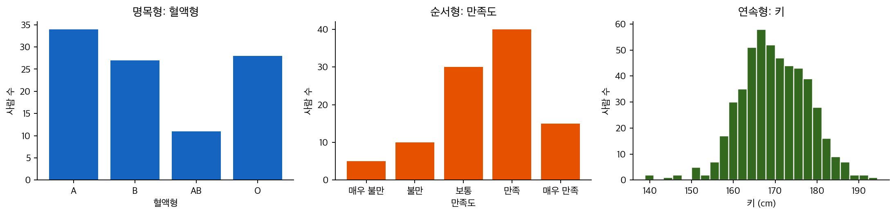

# 자료의 종류

기술통계를 시작하기 전에 먼저 물어야 할 것이 있다. **지금 다루는 자료가 어떤 종류인가?**

이 질문이 먼저인 이유는 단순하다. 자료의 종류가 **계산할 수 있는 통계량**과 **그릴 수 있는 그림**을 결정하기 때문이다. 혈액형의 평균을 구하는 것은 의미가 없고, 키의 최빈값을 구하는 것은 대개 쓸모가 없다. 자료의 종류를 먼저 정하지 않고 요약부터 시작하면, 계산은 되지만 뜻이 없는 숫자를 얻게 된다.

## 1. 큰 갈래: 범주형과 수치형

통계자료는 크게 두 갈래로 나뉜다.

### 범주형 자료

**범주형 자료**(categorical data)는 관측값이 몇 개의 **범주** 가운데 하나에 속하는 자료다. 값 자체가 이름표이며 산술연산의 대상이 아니다.

범주형 자료는 다시 둘로 나뉜다.

**명목형**(nominal): 범주 사이에 자연스러운 순서가 없다.

- 혈액형: A, B, AB, O
- 국적, 성별, 색깔
- 통신사, 진단명

**순서형**(ordinal): 범주에 자연스러운 순서가 있지만, 이웃한 범주 사이의 **간격이 수치적으로 같다고 볼 수 없다**.

- 만족도: 매우 불만 < 불만 < 보통 < 만족 < 매우 만족
- 학력: 초졸 < 중졸 < 고졸 < 대졸
- 암 병기: 1기 < 2기 < 3기 < 4기
- 별점: ★ < ★★ < ★★★ < ★★★★ < ★★★★★

### 수치형 자료

**수치형 자료**(numerical data, 양적 자료)는 세거나 잰 값이다. 더하고 빼는 것이 뜻을 갖는다.

**이산형**(discrete): 셀 수 있는 값. 대개 정수다.

- 자녀 수, 하루 방문자 수, 사고 건수

**연속형**(continuous): 잰 값. 원리상 어떤 실수도 될 수 있다.

- 키, 몸무게, 소득, 걸린 시간

## 2. 순서형은 범주형이다

흔한 오해가 하나 있다. 순서형을 범주형·수치형과 나란히 놓인 **세 번째** 갈래로 여기는 것이다. 더 정확히 말하면 **순서형 자료는 범주형 자료의 한 갈래**다.

```text
Statistical data
├── Categorical  (범주형)
│   ├── Nominal  (명목형)
│   └── Ordinal  (순서형)
└── Numerical    (수치형)
    ├── Discrete   (이산형)
    └── Continuous (연속형)
```

순서형은 범주형이 갖는 성질(값이 범주다)을 그대로 갖고, 거기에 **순서**라는 성질을 하나 더 갖는다. 그래서 명목형에 쓸 수 있는 것은 순서형에도 모두 쓸 수 있고, 그 위에 순서를 쓰는 방법(중앙값, 분위수, 순위 기반 검정)이 더해진다.

!!! warning "순서형에 평균을 쓰는 것은 왜 위험한가"
    만족도를 매우 불만 $=1$, ..., 매우 만족 $=5$로 부호화하고 평균 $3.7$을 보고하는 일은 흔하다. 그러나 이 계산은 **1과 2 사이의 거리가 4와 5 사이의 거리와 같다**는 가정을 몰래 끌어들인다. 순서형 자료는 바로 그것을 보장하지 않는 자료다.

    부호화를 $1, 2, 3, 4, 5$ 대신 $1, 2, 3, 4, 10$으로 바꾸면 순서는 그대로인데 평균은 달라진다. **순서만 정해진 자료에서 평균은 부호화 방식에 의존한다.** 중앙값과 최빈값은 그렇지 않다.

    아래 3절에서 이것을 수치로 확인한다. 실무에서는 (1) 중앙값과 분위수를 쓰거나, (2) 범주별 비율을 그대로 보고하거나, (3) 순서형을 제대로 다루는 모형(순서형 로지스틱 회귀)을 쓰는 편이 안전하다.

    같은 문제가 **회귀에 넣을 때** 다시 나타난다. 순서형을 정수로 코딩하면 등간격을 가정하게 되고, 원-핫으로 풀면 순서를 버리게 된다. 그 절충은 [범주형 설명변수](../../ch13/linear_regression/categorical_predictors.md) 절에서 다룬다.

## 3. 종류에 따라 무엇이 달라지는가

| | 명목형 | 순서형 | 수치형 |
|---|:---:|:---:|:---:|
| 도수, 비율, 최빈값 | ✓ | ✓ | ✓ |
| 순서 비교($<$, $>$) | ✗ | ✓ | ✓ |
| 중앙값, 분위수 | ✗ | ✓ | ✓ |
| 평균, 표준편차 | ✗ | △ | ✓ |
| 차이($-$)의 해석 | ✗ | ✗ | ✓ |
| 대표적 그림 | 막대, 원 | 순서 있는 막대 | 히스토그램, 상자 |

다음 코드가 이 표의 핵심을 보여 준다. 같은 순서형 응답에 서로 다른 두 부호화를 주면 중앙값과 최빈값은 그대로지만 평균은 달라진다.

<div class="exbox" markdown>

**보기 1.** <span class="diff easy" title="쉬움"></span> 부호화를 바꾸면 순위가 뒤집힌다. 만족도 다섯 범주에 숫자를 매기는 방법이 둘 있다. 부호화 $A$는 $1,2,3,4,5$, 부호화 $B$는 $1,2,3,4,10$이다. 둘 다 순서는 같다.

**(1)** 두 집단의 평균 순위가 두 부호화에서 **뒤집히는** 조건을 구하고, 그런 자료를 하나 만드시오.

**(2)** 그 자료에서 중앙값과 최빈값이 부호화에 전혀 영향받지 않음을 보이시오. 왜 그런가.

</div>

??? success "풀이"

    **(1) 해석적으로.** 응답이 $k = 1, \ldots, 5$번째 범주에 비율 $p_k$로 나뉘어 있다고 하자. 두 부호화의 값을 $v = (1,2,3,4,5)$, $w = (1,2,3,4,10)$이라 하면 **둘의 차이는 마지막 칸 하나뿐**이다.

    $$
    w - v = (0, 0, 0, 0, 5)
    $$

    따라서 어느 집단에서나

    $$
    \bar x_B = \sum_k w_k p_k = \sum_k v_k p_k + 5p_5 = \bar x_A + 5\,p_5
    $$

    다. **부호화 $B$는 부호화 $A$의 평균에 "매우 만족" 비율의 $5$배를 더한 것일 뿐이다.** 그러므로 두 집단 $G_1, G_2$에서

    $$
    \bar x_A(G_1) > \bar x_A(G_2) \quad\text{이면서}\quad
    \bar x_B(G_1) < \bar x_B(G_2)
    $$

    가 되려면

    $$
    0 \;<\; \bar x_A(G_1) - \bar x_A(G_2) \;<\; 5\left[p_5(G_2) - p_5(G_1)\right]
    $$

    이면 된다. **$G_1$이 평균은 조금 높되 $G_2$ 쪽에 "매우 만족"이 훨씬 많으면 뒤집힌다.** 이런 자료는 얼마든지 만들 수 있다. 각 집단 $100$명으로

    - $G_1 = (0, 0, 40, 60, 0)$: 평균 $\bar x_A = (3\cdot 40 + 4\cdot 60)/100 = 3.60$, $p_5 = 0$
    - $G_2 = (20, 10, 25, 15, 30)$: 평균 $\bar x_A = (20 + 20 + 75 + 60 + 150)/100 = 3.25$, $p_5 = 0.30$

    으로 두면 $\bar x_A(G_1) - \bar x_A(G_2) = 0.35$이고 $5(p_5(G_2) - p_5(G_1)) = 1.5$이므로 조건을 만족한다. 실제로

    $$
    \bar x_B(G_1) = 3.60 + 0 = 3.60, \qquad \bar x_B(G_2) = 3.25 + 1.5 = 4.75
    $$

    로 **순위가 뒤집힌다.**

    **(2) 해석적으로.** 중앙값과 최빈값이 부호화에 영향받지 않는 까닭은 서로 다르다.

    **최빈값은 도수만 본다.** 가장 많은 응답이 몰린 범주가 어디인지는 그 범주에 어떤 숫자를 붙였든 바뀌지 않는다. 부호화를 아예 하지 않아도 정해지는 양이다.

    **중앙값은 순서만 본다.** 부호화 $g$가 **순증가**이면($k < \ell \Rightarrow g_k < g_\ell$) 정렬 순서가 보존되므로, 정렬된 자료의 가운데 자리에 있던 관측이 그대로 가운데 자리에 남는다. 곧

    $$
    \mathrm{median}\big(g(X)\big) = g\big(\mathrm{median}(X)\big)
    $$

    이다. **범주 이름으로 중앙값을 말하면 $g$는 아예 등장하지 않는다.** $v$와 $w$는 둘 다 순증가이므로 중앙 범주가 같다.

    평균에는 이런 성질이 없다. $\mathbb{E}[g(X)] = g(\mathbb{E}[X])$는 $g$가 **아핀**($g(x) = ax+b$)일 때만 성립하는데, $w$는 $v$의 아핀변환이 아니다. **순서형 자료가 보장하는 것은 순서뿐이므로, 보장되지 않은 간격에 기대는 평균은 보장되지 않은 답을 준다.**

    **(3) 수치적으로.**

    ```python
    import numpy as np
    import pandas as pd

    # 만족도 응답 (순서형)
    levels = ["매우 불만", "불만", "보통", "만족", "매우 만족"]
    counts = [5, 10, 30, 40, 15]
    answers = np.repeat(np.arange(5), counts)      # 0..4 로 부호화된 응답

    # 부호화 A: 1, 2, 3, 4, 5  (등간격이라고 가정)
    # 부호화 B: 1, 2, 3, 4, 10 (순서는 같지만 마지막 간격을 넓게 잡음)
    code_a = np.array([1, 2, 3, 4, 5])[answers]
    code_b = np.array([1, 2, 3, 4, 10])[answers]

    print(f"부호화 A: 평균 {code_a.mean():.3f}, 중앙값 {np.median(code_a):.1f}")
    print(f"부호화 B: 평균 {code_b.mean():.3f}, 중앙값 {np.median(code_b):.1f}")
    print(f"최빈 범주: {levels[np.bincount(answers).argmax()]}")
    ```

    출력:

    ```
    부호화 A: 평균 3.500, 중앙값 4.0
    부호화 B: 평균 4.250, 중앙값 4.0
    최빈 범주: 만족
    ```

    한 집단만 보면 평균이 $3.500$에서 $4.250$으로 움직인다는 데서 그친다. 두 집단을 견주면 더 나쁜 일이 일어난다.

    ```python
    import numpy as np

    levels = ["매우 불만", "불만", "보통", "만족", "매우 만족"]
    v = np.array([1, 2, 3, 4, 5])        # 부호화 A
    w = np.array([1, 2, 3, 4, 10])       # 부호화 B
    groups = {"G1": np.array([0, 0, 40, 60, 0]),
              "G2": np.array([20, 10, 25, 15, 30])}

    print(f"{'집단':>5}{'응답 수':>8}{'평균 A':>9}{'평균 B':>9}{'p5':>7}"
          f"{'중앙값':>9}{'최빈값':>11}")
    res = {}
    for name, c in groups.items():
        n = c.sum()
        ans = np.repeat(np.arange(5), c)          # 0..4 로 펼친 응답
        ma, mb = (c * v).sum() / n, (c * w).sum() / n
        res[name] = (ma, mb, c[4] / n)
        print(f"{name:>5}{n:>8}{ma:>9.3f}{mb:>9.3f}{c[4] / n:>7.2f}"
              f"{levels[int(np.median(ans))]:>9}{levels[int(c.argmax())]:>11}")

    (a1, b1, p1), (a2, b2, p2) = res["G1"], res["G2"]
    print(f"\n부호화 A: G1 {a1:.3f} 대 G2 {a2:.3f}  ->  {'G1' if a1 > a2 else 'G2'} 가 높다")
    print(f"부호화 B: G1 {b1:.3f} 대 G2 {b2:.3f}  ->  {'G1' if b1 > b2 else 'G2'} 가 높다")
    print(f"\n뒤집힘 조건: 0 < {a1 - a2:.2f} < 5(p5(G2) - p5(G1)) = {5 * (p2 - p1):.2f}")
    print(f"평균 B = 평균 A + 5*p5 인가: "
          f"{np.isclose(b1, a1 + 5 * p1) and np.isclose(b2, a2 + 5 * p2)}")
    ```

    출력:

    ```
       집단    응답 수     평균 A     평균 B     p5      중앙값        최빈값
       G1     100    3.600    3.600   0.00       만족         만족
       G2     100    3.250    4.750   0.30       보통      매우 만족

    부호화 A: G1 3.600 대 G2 3.250  ->  G1 가 높다
    부호화 B: G1 3.600 대 G2 4.750  ->  G2 가 높다

    뒤집힘 조건: 0 < 0.35 < 5(p5(G2) - p5(G1)) = 1.50
    평균 B = 평균 A + 5*p5 인가: True
    ```

    **같은 응답에서 "어느 집단이 더 만족하는가"의 답이 부호화에 따라 뒤집힌다.** 아무도 응답을 고치지 않았고 두 부호화 모두 순서를 지켰다. 바뀐 것은 마지막 칸에 $5$를 쓰느냐 $10$을 쓰느냐뿐인데, 그 선택이 결론을 정했다.

    유도한 항등식 $\bar x_B = \bar x_A + 5p_5$도 그대로 맞는다($G_1$: $3.60 + 0$, $G_2$: $3.25 + 1.50$). 뒤집힘 조건 $0 < 0.35 < 1.50$도 성립한다. **이 항등식이 보여 주는 것은 부호화를 바꾸는 일이 곧 "매우 만족" 한 표에 가중치를 더 주는 일과 같다는 점이다.** 그 가중치를 정할 근거가 자료 안에 없다는 것이 순서형의 정의다.

    **중앙값과 최빈값은 꿈쩍도 하지 않는다.** $G_1$은 중앙값 "만족", $G_2$는 "보통"이고, 이 비교는 어떤 순증가 부호화에서도 같다. 범주 이름으로 답하기 때문이다. **순서형 자료를 요약할 때 중앙값을 쓰는 이유가 이것이다.** 다만 중앙값 역시 분포 모양을 다 담지는 못한다 — $G_2$는 중앙값이 "보통"인데 최빈값은 "매우 만족"인 양극화 분포다. 연습문제 6에서 이 문제를 다시 다룬다.

세 종류를 나란히 그리면 차이가 분명해진다. **명목형은 막대의 순서를 바꿔도 아무것도 잃지 않지만, 순서형은 순서를 지켜야 하고, 수치형은 축 자체가 눈금을 갖는다.**

<div class="exbox" markdown>

**보기 2.** <span class="diff easy" title="쉬움"></span> 세 종류를 나란히 그려 읽기. 아래 코드가 혈액형(명목형), 만족도(순서형), 키(연속형)를 각각 한 칸씩 그린다.

**(1)** 세 그림을 그리고, 각 칸에서 **가로축의 순서를 바꾸면 무엇을 잃는지** 말하시오. 뜻이 보존되는 가로축 배열이 몇 가지인지 세시오.

**(2)** 세 번째 칸의 히스토그램이 **가리는 것**을 적고, 같은 자료의 수치 요약과 견주시오.

</div>

??? success "풀이"

    **(1) 해석적으로 — 축을 뒤섞을 자유가 자료형을 가른다.** 범주가 $k$개일 때 가로축에 늘어놓는 방법은 $k!$가지다. 자료형이 정하는 것은 **그중 몇 가지가 허용되는가**다.

    - **명목형**(혈액형 $k = 4$): 범주 사이에 순서가 없으므로 $4! = 24$가지가 **모두 똑같이 옳다.** A, B, AB, O 로 놓든 도수 순으로 놓든 잃는 것이 없다. 거꾸로 말하면, 어떤 배열을 골라 "왼쪽에서 오른쪽으로 늘어난다"고 읽으면 그것은 **자료에 없는 추세를 읽은 것**이다.
    - **순서형**(만족도 $k = 5$): $5! = 120$가지 가운데 허용되는 것은 주어진 순서와 그것을 뒤집은 것, 곧 **$2$가지뿐**이다. 나머지 $118$가지는 순서 정보를 버린다.
    - **연속형**(키): 가로축이 범주의 나열이 아니라 **눈금을 가진 수직선**이다. 늘어놓는 방법이라는 것이 아예 없고, 바꿀 수 있는 것은 구간 수와 구간 폭뿐이다. 그 대신 **막대 사이에 틈이 없다** — 틈이 있으면 "그 사이에는 값이 있을 수 없다"는 뜻이 되는데 연속형에서는 거짓이기 때문이다.

    이것이 1 절 표의 "대표적 그림" 줄이 뜻하는 바다. 그림의 종류가 다른 것이 아니라 **그림을 읽을 때 허용되는 해석이 다르다.**

    **(2) 수치적으로.**

    ```python
    import matplotlib
    matplotlib.use("Agg")
    import matplotlib.pyplot as plt
    import numpy as np

    # 그림에 한글을 쓰므로 한글 글꼴을 지정한다. 맥이면 'Apple SD Gothic Neo',
    # 윈도우면 'Malgun Gothic', 리눅스면 'NanumGothic' 정도가 무난하다.
    # 글꼴을 바꾸면 마이너스 기호가 깨지므로 unicode_minus 도 함께 꺼 준다.
    plt.rcParams["font.family"] = "Apple SD Gothic Neo"
    plt.rcParams["axes.unicode_minus"] = False

    BLUE, ORANGE, GREEN = "#1565C0", "#E65100", "#33691E"

    rng = np.random.default_rng(0)
    fig, axes = plt.subplots(1, 3, figsize=(13, 3.2))

    # (1) 명목형 - 막대 순서에 뜻이 없다
    blood = ["A", "B", "AB", "O"]
    axes[0].bar(blood, [34, 27, 11, 28], color=BLUE)
    axes[0].set_title("명목형: 혈액형")
    axes[0].set_xlabel("혈액형")
    axes[0].set_ylabel("사람 수")

    # (2) 순서형 - 막대 순서를 지켜야 한다
    axes[1].bar(range(5), [5, 10, 30, 40, 15], color=ORANGE)
    axes[1].set_xticks(range(5))
    axes[1].set_xticklabels(["매우 불만", "불만", "보통", "만족", "매우 만족"])
    axes[1].set_title("순서형: 만족도")
    axes[1].set_xlabel("만족도")
    axes[1].set_ylabel("사람 수")

    # (3) 연속형 - 가로축이 눈금을 갖는 수직선이다
    axes[2].hist(rng.normal(170, 8, 500), bins=25, color=GREEN, edgecolor="white")
    axes[2].set_title("연속형: 키")
    axes[2].set_xlabel("키 (cm)")
    axes[2].set_ylabel("사람 수")

    for ax in axes:
        ax.spines[["top", "right"]].set_visible(False)
    fig.tight_layout()
    fig.savefig("data_types_101.png", dpi=170, facecolor="white",
                bbox_inches="tight")
    ```

    

    이제 세 칸이 그린 것을 숫자로 꺼내 본다.

    ```python
    import numpy as np

    # 세 자료를 수치로 요약한다. 그림이 말하는 것과 말하지 않는 것을 가른다.
    blood_counts = np.array([34, 27, 11, 28])
    blood_names = ["A", "B", "AB", "O"]
    sat_counts = np.array([5, 10, 30, 40, 15])
    sat_names = ["매우 불만", "불만", "보통", "만족", "매우 만족"]

    print(f"명목형 : n = {blood_counts.sum()},  최빈 범주 "
          f"{blood_names[int(blood_counts.argmax())]} ({blood_counts.max()}명), "
          f"비율 {blood_counts / blood_counts.sum()}")
    sat_ans = np.repeat(np.arange(5), sat_counts)
    print(f"순서형 : n = {sat_counts.sum()},  최빈 범주 "
          f"{sat_names[int(sat_counts.argmax())]},  중앙 범주 "
          f"{sat_names[int(np.median(sat_ans))]},  누적도수 {sat_counts.cumsum()}")

    rng = np.random.default_rng(0)
    h = rng.normal(170, 8, 500)
    cnt, edges = np.histogram(h, bins=25)
    j = int(cnt.argmax())
    print(f"\n연속형 : n = {len(h)},  평균 {h.mean():.3f},  표준편차 {h.std(ddof=1):.3f},"
          f"  범위 [{h.min():.2f}, {h.max():.2f}]")
    print(f"  구간 25 개,  폭 {edges[1] - edges[0]:.4f}cm,"
          f"  가장 높은 막대 [{edges[j]:.2f}, {edges[j + 1]:.2f}) 에 {cnt[j]}명")

    # 구간 수를 바꾸면 가장 높은 막대가 어디로 가는가.
    print(f"\n{'구간 수':>8}{'구간 폭':>10}{'최빈 구간':>22}{'도수':>7}")
    for b in (10, 25, 50, 100):
        c, e = np.histogram(h, bins=b)
        k = int(c.argmax())
        print(f"{b:>8}{e[1] - e[0]:>10.3f}{f'[{e[k]:.2f}, {e[k + 1]:.2f})':>22}{c[k]:>7}")
    ```

    출력:

    ```
    명목형 : n = 100,  최빈 범주 A (34명), 비율 [0.34 0.27 0.11 0.28]
    순서형 : n = 100,  최빈 범주 만족,  중앙 범주 만족,  누적도수 [  5  15  45  85 100]

    연속형 : n = 500,  평균 169.785,  표준편차 8.117,  범위 [138.80, 194.53]
      구간 25 개,  폭 2.2289cm,  가장 높은 막대 [165.55, 167.78) 에 58명

        구간 수      구간 폭                 최빈 구간     도수
          10     5.572      [166.67, 172.24)    131
          25     2.229      [165.55, 167.78)     58
          50     1.114      [166.67, 167.78)     32
         100     0.557      [172.80, 173.35)     19
    ```

    **첫 칸에서 읽을 수 있는 것은 도수와 비율뿐이다.** $100$명 가운데 A형 $34$명, B형 $27$명, AB형 $11$명, O형 $28$명이고 최빈 범주는 A다. 중앙값도 평균도 없다. 막대가 왼쪽부터 $34, 27, 11, 28$로 "내려갔다 올라간다"고 읽을 일도 없다 — 그 모양은 A, B, AB, O 라는 배열을 고른 결과일 뿐이고 다른 $23$가지 배열에서는 다른 모양이 된다.

    **둘째 칸에서는 누적도수가 추가로 뜻을 갖는다.** $5, 15, 45, 85, 100$에서 $50$번째와 $51$번째 응답이 모두 네 번째 범주에 있으므로 중앙 범주가 "만족"이고, 최빈 범주도 "만족"이다. **"만족 이상"이 $55\%$** 라는 식의 요약이 가능한 것도 순서가 있기 때문이다. 명목형에서는 "A형 이상"이라는 말 자체가 성립하지 않는다.

    **셋째 칸에서는 평균과 표준편차가 비로소 뜻을 갖는다.** 표본평균 $169.785$cm, 표본표준편차 $8.117$cm로 모수 $170$과 $8$에 가깝다. 범위는 $[138.80,\ 194.53]$이다.

    **히스토그램이 가리는 것.**

    - **구간을 고르는 것은 분석자다.** 마지막 표가 그 결과다. 구간 $10$개면 가장 높은 막대가 $[166.67,\ 172.24)$인데 $100$개로 쪼개면 $[172.80,\ 173.35)$로 옮겨 간다. **참 분포의 봉우리는 $170$인데 어느 쪽도 그것을 정확히 가리키지 않는다.** 연속형 자료에서 "가장 흔한 값"은 구간이 정해져야 비로소 정해지는 양이며, 이 문제는 [평균, 중앙값, 최빈값](../center/mean_median_mode.md)에서 다시 다룬다.
    - **원자료의 개별 값이 사라진다.** 같은 히스토그램을 주는 자료는 무수히 많다. 관측이 적을 때는 점을 그대로 뿌리는 편이 낫다.
    - **막대 높이는 도수이지 밀도가 아니다.** 구간 폭이 다르면 높이를 폭으로 나누어야 비교할 수 있다. 위에서 구간 수를 바꾸자 최대 도수가 $131 \to 58 \to 32 \to 19$로 줄어드는데, 자료가 바뀐 것이 아니라 폭이 $5.572 \to 0.557$로 줄었기 때문이다.

### pandas에서 순서를 자료에 새겨 넣기

파이썬에서 순서형을 그냥 문자열로 두면 순서 정보가 사라진다. `pandas`의 순서 있는 범주형(ordered categorical)을 쓰면 순서가 자료구조 자체에 들어간다.

<div class="exbox" markdown>

**보기 3.** <span class="diff easy" title="쉬움"></span> 짝수 개의 순서형에서 중앙값은 하나가 아니다. 응답 네 개 "보통, 만족, 불만, 매우 만족"을 문자열로 두면 정렬이 뜻 없는 순서를 따른다. `pandas`의 순서 있는 범주형으로 선언하면 바로잡힌다.

**(1)** 문자열 정렬이 주는 순서가 의도한 순서일 확률을 세시오.

**(2)** 아래 코드는 중앙값으로 "보통"을 돌려준다. 그런데 **"만족"도 똑같이 옳은 답**임을 보이시오. 어떤 기준으로 그런가.

</div>

??? success "풀이"

    **(1) 해석적으로.** 문자열 정렬은 범주의 뜻을 전혀 모른 채 한글 음절의 코드값, 곧 가나다순으로 늘어놓는다. 범주 $k$개의 배열은 $k!$가지이고 문자열 정렬은 그중 **하나를 고정해서** 준다. 그 하나가 의도한 순서와 맞을 확률은

    $$
    \frac{1}{k!} = \frac{1}{4!} = \frac{1}{24} \approx 0.042
    $$

    다. 여기서는 맞지 않는다. 가나다순은 만족 $<$ 매우 만족 $<$ 보통 $<$ 불만인데 의도한 순서는 불만 $<$ 보통 $<$ 만족 $<$ 매우 만족이다. **거의 거꾸로다.** 범주가 다섯이면 $1/120$, 일곱이면 $1/5040$이니 범주가 늘수록 "운이 좋아 맞는" 일은 사실상 없다.

    **(2) 해석적으로 — 짝수 표본의 중앙값은 구간이다.** 중앙값의 정의를 "$\sum_i \lvert c - x_i \rvert$를 가장 작게 하는 $c$"로 잡자(2.3 절). 응답 네 개의 범주 코드는 정렬하면

    $$
    1\ (\text{불만}),\quad 2\ (\text{보통}),\quad 3\ (\text{만족}),\quad 4\ (\text{매우 만족})
    $$

    이다. 각 후보에서 절대편차의 합을 세면

    $$
    \begin{aligned}
    c = 1:&\ 0+1+2+3 = 6, \qquad & c = 2:&\ 1+0+1+2 = 4,\\
    c = 3:&\ 2+1+0+1 = 4, \qquad & c = 4:&\ 3+2+1+0 = 6
    \end{aligned}
    $$

    이다. **$c = 2$와 $c = 3$이 똑같이 $4$로 최솟값이다.** 일반적으로 $n$이 짝수이면 $x_{(n/2)}$와 $x_{(n/2+1)}$ 사이의 **어느 값이든** 절대편차 합이 같다. 수치형에서는 그 구간의 중점을 관례로 택해 $(2+3)/2 = 2.5$라 하지만, **순서형에서는 $2.5$라는 범주가 존재하지 않는다.** 남는 선택은 아래쪽 "보통"과 위쪽 "만족"뿐이고 둘 다 정의를 만족한다.

    `int(np.median(...))`는 $2.5$를 **$0$ 쪽으로 자르므로** 말없이 아래쪽을 고른다. 그 선택은 수학이 정한 것이 아니라 함수가 정한 것이다.

    **(3) 수치적으로.**

    ```python
    import numpy as np
    import pandas as pd

    s_plain = pd.Series(["보통", "만족", "불만", "매우 만족"])
    s_ord = pd.Series(
        ["보통", "만족", "불만", "매우 만족"],
        dtype=pd.CategoricalDtype(categories=levels, ordered=True),
    )

    print("문자열 정렬 :", list(s_plain.sort_values()))
    print("순서형 정렬 :", list(s_ord.sort_values()))
    print("순서 비교   :", (s_ord > "보통").tolist())

    # 중앙값은 .median()이 아니라 범주 코드에서 구한다 (아래 주의 참조)
    print("중앙값      :", levels[int(np.median(s_ord.cat.codes))])
    ```

    출력:

    ```
    문자열 정렬 : ['만족', '매우 만족', '보통', '불만']
    순서형 정렬 : ['불만', '보통', '만족', '매우 만족']
    순서 비교   : [False, True, False, True]
    중앙값      : 보통
    ```

    문자열로 두면 가나다순으로 정렬되어 뜻이 없다. 순서형으로 선언하면 정렬과 비교가 우리가 의도한 순서를 따른다. 이제 그 "중앙값 : 보통"을 따져 본다.

    ```python
    import numpy as np

    codes = np.sort(s_ord.cat.codes.to_numpy())
    half = len(codes) // 2
    print("정렬된 범주 코드 :", codes)
    print(f"코드의 중앙값    : {np.median(codes)}   <- 범주 사이에 걸린다")
    print(f"  아래쪽 중앙값  : {levels[codes[half - 1]]}   (int() 가 고르는 쪽)")
    print(f"  위쪽 중앙값    : {levels[codes[half]]}")

    print(f"\n{'후보 범주':>10}{'코드':>6}{'sum|c - x|':>12}")
    best = min(np.abs(c - codes).sum() for c in range(5))
    for c in range(5):
        s = np.abs(c - codes).sum()
        print(f"{levels[c]:>10}{c:>6}{s:>12}{'  <- 최소' if s == best else ''}")
    ```

    출력:

    ```
    정렬된 범주 코드 : [1 2 3 4]
    코드의 중앙값    : 2.5   <- 범주 사이에 걸린다
      아래쪽 중앙값  : 보통   (int() 가 고르는 쪽)
      위쪽 중앙값    : 만족

         후보 범주    코드  sum|c - x|
         매우 불만     0          10
            불만     1           6
            보통     2           4  <- 최소
            만족     3           4  <- 최소
         매우 만족     4           6
    ```

    **"보통"과 "만족"이 똑같이 $4$로 최소다.** 유도한 값과 한 자리도 어긋나지 않는다. 그러므로 출력의 "중앙값 : 보통"은 **답이 아니라 관례**다. `int()`가 $2.5$를 내림한 결과일 뿐이고, 같은 자료에서 "만족"이라 보고해도 틀리지 않는다.

    이런 애매함은 $n$이 짝수이고 가운데 두 관측이 **다른 범주**일 때만 생긴다. $n$이 홀수이면 가운데 한 관측이 답을 정하므로 유일하다. 실무에서 할 일은 둘 중 하나다.

    - **관례를 밝혀 적는다.** "짝수일 때는 아래쪽 범주를 택했다"처럼 한 줄 적어 두면 재현이 가능하다.
    - **중앙값 대신 누적비율을 보고한다.** "만족 이상이 $50\%$"라고 적으면 애매함 자체가 사라진다. 순서형에서는 이쪽이 대개 더 많은 정보를 준다.

    참고로 코드의 **평균** $2.5$는 애초에 범주가 아니다. 보기 1 에서 본 대로 그 값은 부호화를 바꾸면 따라 움직이기까지 한다. **순서형에서 "가운데"를 묻는 일은 수치형에서보다 조심스럽다.**

!!! warning "pandas는 순서형에 `median()`을 제공하지 않는다"
    순서를 아는 자료이므로 중앙값이 잘 정의되는데도, `s_ord.median()`은

    ```text
    TypeError: 'Categorical' with dtype category does not support reduction 'median'
    ```

    을 낸다(pandas 2.2 기준). 중앙값은 순서만 있으면 정의되지만 pandas의 축약 연산은 수치형을 전제하기 때문이다.

    그래서 위 코드처럼 **범주 코드**(`.cat.codes`, 즉 `categories` 안에서의 위치)로 중앙값을 구한 뒤 다시 범주 이름으로 되돌린다. 코드의 중앙값이 정수가 아닐 때(관측 개수가 짝수여서 두 범주 사이에 걸릴 때)는 어느 쪽을 택할지 정해야 하는데, 위에서는 `int()`로 아래쪽 범주를 골랐다.

### 범주형을 숫자로 바꾸기: 왜 0, 1이 수치형이 아닌가

범주형 자료를 컴퓨터에 넣으려면 결국 숫자로 바꿔야 한다. 그러나 **숫자로 바꾸었다고 수치형이 되는 것은 아니다.**

혈액형 A, B, AB, O에 $0, 1, 2, 3$을 붙였다고 하자. 이 부호화는 자기도 모르게 두 가지를 주장한다.

- **순서**: $\text{A} < \text{B} < \text{AB} < \text{O}$
- **간격**: A와 B의 거리가 B와 AB의 거리와 같다

둘 다 사실이 아니다. 이렇게 부호화한 열을 회귀나 거리 기반 방법에 그대로 넣으면 모형은 이 거짓 주장을 진짜로 받아들인다.

**원핫 부호화**(one-hot encoding)가 표준적인 해법이다. 범주가 $k$개면 0/1 값을 갖는 열 $k$개를 만들고, 자기 범주에 해당하는 열만 1로 둔다.

<div class="exbox" markdown>

**보기 4.** <span class="diff easy" title="쉬움"></span> 명목형에 평균이 돌아오는 단 하나의 경우. 혈액형 다섯 사람 A, O, AB, B, O 를 정수로도 원핫으로도 부호화한다.

**(1)** 원핫 벡터 사이의 거리를 구하고, 정수 부호화의 거리와 견주시오. 범주가 $k$개일 때 두 부호화가 만드는 서로 다른 거리값이 각각 몇 가지인가.

**(2)** 명목형에는 평균이 없다고 했다. 그런데 **원핫 열의 평균은 뜻을 갖는다.** 무엇인가.

</div>

??? success "풀이"

    **(1) 해석적으로.** 범주 $k$개를 원핫으로 보내면 범주 $i$는 표준기저벡터 $e_i \in \mathbb{R}^k$가 된다. 서로 다른 $i \ne j$에 대해 $e_i - e_j$는 성분 하나가 $+1$, 다른 하나가 $-1$, 나머지가 $0$이므로

    $$
    \lVert e_i - e_j \rVert^2 = 1^2 + (-1)^2 = 2
    $$

    이고 $i = j$이면 $0$이다. **$0$이 아닌 거리는 오직 하나, $\sqrt{2}$뿐이다.** 범주가 몇 개든, 어느 쌍을 고르든 같다.

    정수 부호화 $i \mapsto i$에서는 거리가 $\lvert i - j \rvert$이므로 $1, 2, \ldots, k-1$의 **$k-1$가지** 값이 나온다. $k = 4$면 $1, 2, 3$의 세 가지다. 곧 정수 부호화는 "어떤 두 범주는 다른 두 범주보다 $3$배 더 다르다"는 **자료에 없는 주장**을 $k-1$가지 단계로 만들어 낸다. 명목형에서 참인 명제는 "같다 / 다르다" 둘뿐이고, 원핫은 정확히 그만큼만 말한다.

    **(2) 해석적으로 — 더미 열의 평균은 비율이다.** 범주 $j$에 해당하는 원핫 열을 $d_j$라 하면 $d_j^{(m)} = \mathbf{1}\{x_m = j\}$이므로

    $$
    \bar d_j = \frac{1}{n}\sum_{m=1}^{n} \mathbf{1}\{x_m = j\} = \frac{n_j}{n} = \hat p_j
    $$

    다. **$0/1$ 값의 평균은 $1$의 비율**이고, 그 비율은 범주에 붙인 숫자와 아무 상관이 없다. 어떤 부호화를 쓰든 "O형이 $40\%$"는 그대로다.

    그러므로 **명목형 자료에서 평균이 뜻을 갖는 유일한 경우는 범주 하나하나를 $0/1$ 지시변수로 바꾸었을 때**다. 원핫 벡터 전체의 평균

    $$
    \frac{1}{n}\sum_{m=1}^{n} e_{x_m} = (\hat p_1, \ldots, \hat p_k)
    $$

    는 **도수분포 그 자체**이며, 성분이 모두 음이 아니고 합이 $1$이다. 정수 부호화의 평균에는 이런 뜻이 없다. 그것은 부호화를 바꾸면 따라 움직이는 숫자일 뿐이다.

    **(3) 수치적으로.**

    ```python
    import pandas as pd

    blood = pd.Series(["A", "O", "AB", "B", "O"], name="blood")
    onehot = pd.get_dummies(blood, prefix="bt").astype(int)
    print(onehot)

    # 순진한 정수 부호화와 비교하면 "거리"가 어떻게 달라지는지 보인다
    naive = pd.Series([0, 3, 2, 1, 3])          # A=0, B=1, AB=2, O=3
    print("\n정수 부호화에서 |A - O| =", abs(naive[0] - naive[1]))
    print("정수 부호화에서 |A - B| =", abs(naive[0] - naive[3]))
    print("원핫에서 모든 서로 다른 범주 쌍의 거리^2 =",
          int(((onehot.iloc[0] - onehot.iloc[1]) ** 2).sum()))
    ```

    출력:

    ```
       bt_A  bt_AB  bt_B  bt_O
    0     1      0     0     0
    1     0      0     0     1
    2     0      1     0     0
    3     0      0     1     0
    4     0      0     0     1

    정수 부호화에서 |A - O| = 3
    정수 부호화에서 |A - B| = 1
    원핫에서 모든 서로 다른 범주 쌍의 거리^2 = 2
    ```

    정수 부호화에서는 A와 O의 거리가 A와 B의 거리보다 세 배 크다. 원핫에서는 **서로 다른 범주라면 어느 쌍이든 거리가 같다**. 이것이 명목형이 본래 뜻하는 바다. 모든 쌍을 훑어 (1)을 확인하고, 열 평균이 무엇이 되는지 본다.

    ```python
    import itertools

    import numpy as np
    import pandas as pd

    k = onehot.shape[1]
    E = np.eye(k)
    d_onehot = sorted({int(((E[i] - E[j]) ** 2).sum())
                       for i, j in itertools.combinations(range(k), 2)})
    d_naive = sorted({abs(i - j) for i, j in itertools.combinations(range(k), 2)})
    print(f"원핫의 쌍 거리^2 : {d_onehot}   ({len(d_onehot)} 가지)")
    print(f"정수 코딩의 쌍 거리 : {d_naive}   ({len(d_naive)} 가지 = k-1 = {k - 1})")

    print("\n원핫 열의 평균:")
    print(onehot.mean())
    print(f"합 = {onehot.mean().sum():.1f}   (비율이므로 1 이다)")

    # 정수 코딩의 평균은 부호화를 바꾸면 따라 움직인다.
    alt = pd.Series([3, 0, 1, 2, 0])            # A=3, B=2, AB=1, O=0 으로 뒤집어 매김
    print(f"\n정수 코딩 평균 : 원래 {naive.mean():.2f},  뒤집으면 {alt.mean():.2f}")
    print(f"원핫 열 평균(O형 비율) : 어느 부호화에서나 {onehot['bt_O'].mean():.2f}")
    ```

    출력:

    ```
    원핫의 쌍 거리^2 : [2]   (1 가지)
    정수 코딩의 쌍 거리 : [1, 2, 3]   (3 가지 = k-1 = 3)

    원핫 열의 평균:
    bt_A     0.2
    bt_AB    0.2
    bt_B     0.2
    bt_O     0.4
    dtype: float64
    합 = 1.0   (비율이므로 1 이다)

    정수 코딩 평균 : 원래 1.80,  뒤집으면 1.20
    원핫 열 평균(O형 비율) : 어느 부호화에서나 0.40
    ```

    **유도한 대로다.** 원핫의 쌍 거리는 제곱해서 $2$ 하나뿐이고, 정수 부호화는 $1, 2, 3$의 세 가지, 곧 $k - 1 = 3$가지다. 범주를 $100$개로 늘리면 정수 부호화는 $99$가지 "다름의 정도"를 지어내지만 원핫은 여전히 하나다.

    **열 평균 $(0.2, 0.2, 0.2, 0.4)$는 바로 도수분포다.** 다섯 사람 중 O형이 둘이니 $0.4$이고, 네 값의 합이 $1$이다. 이 숫자들은 "O형의 비율"이라는 분명한 뜻을 갖는다. 반면 정수 부호화의 평균은 $1.80$이었다가 번호를 거꾸로 매기자 $1.20$이 된다. **같은 다섯 사람인데 평균이 달라진다면 그 평균은 자료에 대해 아무것도 말하지 않는 것이다.** 보기 1 의 순서형에서 본 것과 똑같은 일이며, 명목형에서는 순서조차 없으므로 더 나쁘다.

    (덧붙여, 두 집단의 비율을 비교하는 일은 곧 더미 열 두 개의 평균을 비교하는 일이다. 그래서 비율에 대한 검정이 평균에 대한 검정의 특수한 경우가 된다 — 5 장에서 쓰게 될 사실이다.)

!!! note "그렇다면 순서형은?"
    순서형에는 순서가 실제로 있으므로 정수 부호화가 원핫보다 나을 때가 많다. 순서 정보를 버리지 않기 때문이다. 다만 이때도 **간격이 같다는 가정**은 여전히 남는다(2절의 주의 참조).

    실무에서는 셋 다 시도해 보는 편이 좋다. (1) 순서를 살린 정수 부호화, (2) 원핫, (3) 순서형 전용 모형. 어느 것이 나은지는 자료와 목적에 달려 있다.

!!! warning "원핫의 대가: 열이 폭발한다"
    범주가 많으면 열도 그만큼 늘어난다. 우편번호(수천 개)나 상품 코드(수만 개)를 원핫으로 바꾸면 변수 개수가 관측 개수를 훌쩍 넘어 $p \gg n$이 된다. 5절에서 볼 이미지·텍스트와 같은 상황이 표 자료에서도 생기는 셈이다.

    대안으로는 드문 범주를 "기타"로 묶기, 목표값 부호화(target encoding), 그리고 5절 끝에서 언급할 **임베딩**이 있다. 임베딩은 원핫의 고차원 희소 벡터를 저차원 조밀 벡터로 바꾼 것으로 볼 수 있다.

## 4. 한 걸음 더: 측정의 네 척도

Stevens(1946)의 고전적인 분류는 수치형을 다시 둘로 나눈다. **0이 무엇을 뜻하는가**가 기준이다.

| 척도 | 순서 | 간격이 같은가 | 절대 0 | 예 |
|---|:---:|:---:|:---:|---|
| 명목(nominal) | ✗ | ✗ | ✗ | 혈액형 |
| 순서(ordinal) | ✓ | ✗ | ✗ | 만족도 |
| 구간(interval) | ✓ | ✓ | ✗ | 섭씨온도, 연도 |
| 비율(ratio) | ✓ | ✓ | ✓ | 키, 무게, 절대온도 |

**구간척도**에는 참된 0이 없다. 섭씨 $0^\circ$는 "열이 없음"이 아니라 물이 어는 온도라는 약속일 뿐이다. 그래서 차이는 말이 되지만($20^\circ$는 $10^\circ$보다 $10^\circ$ 더 덥다) **비는 말이 되지 않는다**($20^\circ$가 $10^\circ$보다 두 배 덥다고 할 수 없다).

**비율척도**에는 참된 0이 있어 비가 뜻을 갖는다. 키 $180\,\text{cm}$는 $90\,\text{cm}$의 두 배가 맞다.

<div class="exbox" markdown>

**보기 5.** <span class="diff easy" title="쉬움"></span> 원점을 옮기면 무엇이 깨지는가. 온도의 단위변환은 모두 $y = ax + b$ 꼴의 아핀변환이다. 섭씨 → 화씨는 $a = 9/5$, $b = 32$이고 섭씨 → 켈빈은 $a = 1$, $b = 273.15$다.

**(1)** 아핀변환이 **차이의 비**는 보존하지만 **값의 비**는 보존하지 않음을 보이고, 보존되는 경우를 가려내시오.

**(2)** 변동계수 $\text{CV} = \sigma/\mu$가 구간척도에서 뜻을 잃음을 보이시오. 같은 기온 자료의 CV 를 섭씨·화씨·켈빈·랭킨에서 재어 확인하시오.

</div>

??? success "풀이"

    **(1) 해석적으로.** $y = ax + b$($a > 0$)라 하자. 두 값의 **차이**는

    $$
    y_2 - y_1 = a(x_2 - x_1)
    $$

    이므로 차이끼리의 비 $(y_2-y_1)/(y_4-y_3) = (x_2-x_1)/(x_4-x_3)$는 $a$가 약분되어 **보존된다.** 순서도 $a > 0$이므로 보존된다. 그래서 구간척도에서는 "$10^\circ$ 더 덥다"나 "이 차이가 저 차이의 두 배다"가 뜻을 갖는다.

    그러나 값끼리의 비는

    $$
    \frac{y_2}{y_1} = \frac{a x_2 + b}{a x_1 + b}
    $$

    이고 이것이 $x_2/x_1$과 같으려면 $(ax_2+b)x_1 = (ax_1+b)x_2$, 곧 $b(x_1 - x_2) = 0$이어야 한다. **$x_1 = x_2$인 자명한 경우를 빼면 $b = 0$일 때만 보존된다.** $b = 0$이라는 것은 변환이 원점을 옮기지 않는다는 뜻이고, 그런 변환만 허용되는 척도가 바로 **비율척도**다. 켈빈 → 랭킨은 $a = 9/5$, $b = 0$이라 비가 보존되고, 섭씨 → 화씨는 $b = 32 \ne 0$이라 깨진다.

    **(2) 해석적으로 — CV 는 원점에 매달려 있다.** $y = ax + b$ 아래에서 표준편차와 평균은

    $$
    \sigma_y = a\,\sigma_x, \qquad \mu_y = a\,\mu_x + b
    $$

    로 달리 움직인다. 표준편차는 위치이동에 둔감하고 평균은 그대로 끌려간다. 따라서

    $$
    \text{CV}_y = \frac{a\sigma_x}{a\mu_x + b}
    $$

    이고, 이것이 $\text{CV}_x = \sigma_x/\mu_x$와 같으려면 다시 $b = 0$이어야 한다. **CV 는 비와 똑같은 조건을 요구한다.** 비율척도에서는 단위를 바꾸어도 불변이지만 구간척도에서는 원점을 어디에 두었느냐에 따라 아무 값이나 된다.

    극단적으로, $b$를 $-\mu_x$ 근처로 잡으면 분모가 $0$에 가까워져 CV 가 발산한다. 섭씨가 그 예다. 영하와 영상을 오가는 자료에서는 평균이 $0$ 근처가 되어 CV 가 폭주하거나 **음수**가 된다. 자료는 멀쩡한데 요약값만 미쳐 날뛰는 것이다.

    **(3) 수치적으로.**

    ```python
    # 섭씨 -> 화씨는 순서와 간격은 보존하지만 비는 보존하지 않는다
    c1, c2 = 10.0, 20.0
    f1, f2 = c1 * 9 / 5 + 32, c2 * 9 / 5 + 32

    print(f"섭씨: {c1} -> {c2},  비 = {c2 / c1:.3f}")
    print(f"화씨: {f1} -> {f2},  비 = {f2 / f1:.3f}")

    # 절대온도(비율척도)에서는 단위를 바꿔도 비가 보존된다
    k1, k2 = c1 + 273.15, c2 + 273.15
    r1, r2 = k1 * 9 / 5, k2 * 9 / 5          # 랭킨 온도
    print(f"켈빈: 비 = {k2 / k1:.4f},  랭킨: 비 = {r2 / r1:.4f}")
    ```

    출력:

    ```
    섭씨: 10.0 -> 20.0,  비 = 2.000
    화씨: 50.0 -> 68.0,  비 = 1.360
    켈빈: 비 = 1.0353,  랭킨: 비 = 1.0353
    ```

    같은 온도인데 단위만 바꾸면 "몇 배"가 $2.000$에서 $1.360$으로 달라진다. **구간척도에서 비를 계산하면 안 되는 이유**가 이것이다. 반면 절대온도에서는 단위를 바꿔도 비가 그대로다. 이제 CV 를 재어 (2)를 확인한다.

    ```python
    import numpy as np

    # 어느 한 주의 낮 기온이라고 하자.
    cel = np.array([10., 12., 15., 18., 20., 22., 25.])
    scales = {"섭씨": cel,
              "화씨": cel * 9 / 5 + 32,
              "켈빈": cel + 273.15,
              "랭킨": (cel + 273.15) * 9 / 5}

    # 절대영점을 가진 켈빈을 기준으로 각 척도를 y = a*(켈빈) + b 로 적는다.
    kel = scales["켈빈"]
    print(f"{'척도':>5}{'a':>8}{'b':>10}{'평균':>12}{'표준편차':>12}{'CV':>12}")
    for name, x in scales.items():
        a = x.std(ddof=1) / kel.std(ddof=1)            # 기울기
        b = x.mean() - a * kel.mean()                  # 절편
        print(f"{name:>5}{a:>8.2f}{b:>10.2f}{x.mean():>12.4f}"
              f"{x.std(ddof=1):>12.4f}{x.std(ddof=1) / x.mean():>12.6f}")

    # 영점을 조금만 옮겨도 CV 가 어떻게 되는가.
    print(f"\n{'원점 이동 b':>12}{'평균':>10}{'CV':>14}")
    for b in (0.0, -10.0, -17.0, -17.4, -17.42):
        y = cel + b
        print(f"{b:>12.2f}{y.mean():>10.4f}{y.std(ddof=1) / y.mean():>14.4f}")
    ```

    출력:

    ```
       척도       a         b          평균        표준편차          CV
       섭씨    1.00   -273.15     17.4286      5.4116    0.310503
       화씨    1.80   -459.67     63.3714      9.7409    0.153712
       켈빈    1.00      0.00    290.5786      5.4116    0.018624
       랭킨    1.80      0.00    523.0414      9.7409    0.018624

         원점 이동 b        평균            CV
            0.00   17.4286        0.3105
          -10.00    7.4286        0.7285
          -17.00    0.4286       12.6271
          -17.40    0.0286      189.4070
          -17.42    0.0086      631.3566
    ```

    **CV 가 같은 자료에서 $0.0186$부터 $0.3105$까지 열여섯 배 넘게 달라진다.** 절대영점을 가진 켈빈을 기준으로 각 척도를 $a\cdot(\text{켈빈}) + b$로 적어 둔 $b$ 열이 모든 것을 설명한다. **$b = 0$인 켈빈과 랭킨만 CV 가 $0.018624$로 정확히 같다.** 둘을 잇는 변환은 $a = 9/5$, $b = 0$인 순수 배율변환이다. 섭씨는 $b = -273.15$, 화씨는 $b = -459.67$로 원점이 제각각이라 CV 도 제각각이다.

    아래 표가 (2)의 마지막 문단을 그대로 보여 준다. 원점을 $-17.42$까지 밀면 평균이 $0.0086$으로 $0$에 붙고 CV 가 $631$을 넘는다. **자료는 한 번도 바뀌지 않았다.** 조금 더 밀면 평균이 음수가 되어 CV 도 음수가 된다.

    **그러므로 변동계수는 비율척도 전용 도구다.** 키, 무게, 소득, 반응시간, 농도처럼 $0$이 "없음"을 뜻하는 자료에서만 쓰라. 섭씨 기온, 연도, IQ 점수, 표준화 점수에 CV 를 보고하는 것은 원점이라는 **약속**을 자료의 성질로 착각한 것이다. 2.4 절에서 CV 를 다시 만날 때 이 조건을 기억해 두면 좋다.

## 5. 오늘날의 자료: 이미지, 소리, 텍스트

지금까지의 분류는 **표(table)로 정리되는 자료**를 전제한다. 행이 관측 개체이고 열이 변수인 형태다. 그러나 오늘날 다루는 자료의 상당 부분은 그런 모양이 아니다.

| 자료 | 실제 저장 형태 | 통계적으로 보면 |
|---|---|---|
| 이미지(JPEG, PNG) | 높이 $\times$ 너비 $\times$ 채널의 화소값 배열 | 격자 위에 놓인 수치형 변수 수만~수십만 개 |
| 소리(MP3, WAV) | 표본화율에 따라 뽑은 진폭의 수열 | 시간을 따라 늘어선 시계열 |
| 텍스트 | 토큰(단어·부분단어)의 수열 | 순서가 있는 **명목형** 자료의 수열 |
| 영상 | 이미지의 시계열 | 공간 + 시간 구조 |
| 그래프·네트워크 | 정점과 간선 | 개체 사이의 **관계** 자료 |
| 공간자료 | 좌표에 붙은 값 | 위치 구조를 가진 수치형 |

이런 자료를 **비정형 자료**(unstructured data)라 부르지만, 이름과 달리 구조가 없는 것이 아니다. 오히려 **구조가 매우 많다**. 표에 담기지 않을 뿐이다.

여기서 세 가지를 짚어 둘 만하다.

**(1) 결국은 수치형 배열이다.** 이미지도 소리도 컴퓨터 안에서는 숫자의 배열이다. 화소값 $0 \sim 255$는 이산형 수치자료이고, 정규화한 $[0, 1]$ 값은 연속형처럼 다룬다. 이 장에서 배우는 평균·분산·히스토그램은 그 숫자들에 그대로 적용된다.

**(2) 그러나 순서와 이웃 관계가 정보를 담는다.** 표 자료의 열은 순서를 바꿔도 아무 일이 없다. 이미지의 화소는 그렇지 않다. 옆에 있는 화소끼리 값이 비슷하다는 사실, 소리에서 앞뒤 표본이 이어져 있다는 사실이 곧 정보다. 화소를 뒤섞으면 사람도 기계도 그림을 알아보지 못한다. **고전적인 표 자료 방법이 이런 자료에 바로 통하지 않는 이유가 여기에 있다.**

**(3) 변수가 관측보다 훨씬 많다.** $224 \times 224$ 컬러 이미지 한 장은 변수 $224 \times 224 \times 3 = 150{,}528$개인 관측 하나다. 사진 1,000장을 모아도 $n = 1000$, $p = 150{,}528$으로 $p \gg n$이다. 18장의 정칙화가 필요해지는 전형적인 상황이다.

<div class="exbox" markdown>

**보기 6.** <span class="diff easy" title="쉬움"></span> 숫자 배열이 되었다고 수치형이 되는 것은 아니다. 이미지, 소리, 텍스트를 각각 배열로 바꾼다.

**(1)** 이미지 자료에서 $p$와 $n$을 세고, $224 \times 224$ 컬러 사진 $1{,}000$장이라면 얼마가 되는지 구하시오.

**(2)** 토큰에 붙인 정수는 **명목형**이다. 어휘 목록을 다르게 늘어놓으면 정수 부호화의 평균이 달라짐을 보이고, 바뀌지 않는 것은 무엇인지 말하시오.

</div>

??? success "풀이"

    **(1) 해석적으로.** 이미지 한 장이 관측 하나이고 화소 하나가 변수 하나다. $8 \times 8$ 흑백 이미지라면

    $$
    p = 8 \times 8 = 64
    $$

    이고, `load_digits`가 주는 장수가 $n$이다. $224 \times 224$ 컬러(RGB 세 채널)라면

    $$
    p = 224 \times 224 \times 3 = 150{,}528
    $$

    이므로 사진 $1{,}000$장을 모아도 $n = 1{,}000$, $p = 150{,}528$으로

    $$
    \frac{p}{n} = 150.528
    $$

    이다. **변수가 관측보다 $150$배 많다.** 표본공분산행렬은 $150{,}528 \times 150{,}528$인데 계급이 많아야 $n - 1 = 999$이므로 특이행렬이고, 역행렬을 요구하는 방법은 쓸 수 없다. $8 \times 8$ 자료는 $p = 64 < n$이라 그런 문제가 없다 — **같은 "이미지"라도 해상도가 통계적 상황을 완전히 바꾼다.**

    **(2) 해석적으로.** 토큰 $k$가지에 번호를 매기는 방법은 $k!$가지이고, 그중 어느 것도 다른 것보다 옳지 않다. 번호 매김을 바꾸는 것은 치환 $\pi$를 적용하는 것이므로 평균은

    $$
    \frac{1}{n}\sum_m \pi\!\left(\text{id}(w_m)\right)
    $$

    로 $\pi$에 따라 달라진다. 특히 번호를 거꾸로 매기는 $\pi(i) = k-1-i$를 쓰면

    $$
    \overline{\text{code}}' = (k-1) - \overline{\text{code}}
    $$

    이므로 두 평균의 합이 언제나 $k-1$이다. **어떤 평균이 "참"인지 묻는 것 자체가 뜻이 없다.**

    바뀌지 않는 것은 번호가 아니라 **토큰 자체에 붙은 양**이다. 각 토큰의 도수, 따라서 최빈 토큰, 어휘 크기, 그리고 두 토큰이 같은지 다른지. 보기 4 의 혈액형과 똑같은 구조이며, 해법도 같다 — 원핫(단어 가방)으로 바꾸거나, 거리가 뜻을 갖도록 학습한 임베딩으로 바꾼다.

    **(3) 수치적으로.**

    ```python
    import numpy as np
    from sklearn.datasets import load_digits

    digits = load_digits()
    img = digits.images[0]                      # 8x8 손글씨 숫자 한 장

    print(f"이미지 한 장의 모양: {img.shape},  자료형: {img.dtype}")
    print(f"화소값 범위: {img.min():.0f} ~ {img.max():.0f}  (이산형 수치자료)")
    print(f"변수 개수 p = {img.size},  관측 개수 n = {len(digits.images)}")

    # 소리: 표본화율 8000Hz로 0.5초 동안 440Hz 순음을 기록한다
    sr, dur = 8000, 0.5
    t = np.arange(int(sr * dur)) / sr
    wave = np.sin(2 * np.pi * 440 * t)
    print(f"소리 0.5초의 표본 개수: {wave.size}  (시간 순서가 있는 수치자료)")

    # 텍스트: 토큰은 본래 명목형이다
    text = "통계 자료 의 종류 는 자료 의 요약 방법 을 정한다"
    tokens = text.split()
    vocab = sorted(set(tokens))
    print(f"토큰 {len(tokens)}개, 어휘 {len(vocab)}개 (명목형 범주)")
    print(f"정수 부호화: {[vocab.index(w) for w in tokens]}")
    ```

    출력:

    ```
    이미지 한 장의 모양: (8, 8),  자료형: float64
    화소값 범위: 0 ~ 15  (이산형 수치자료)
    변수 개수 p = 64,  관측 개수 n = 1797
    소리 0.5초의 표본 개수: 4000  (시간 순서가 있는 수치자료)
    토큰 11개, 어휘 9개 (명목형 범주)
    정수 부호화: [8, 5, 4, 7, 0, 5, 4, 2, 1, 3, 6]
    ```

    마지막 줄의 정수 부호화를 보라. `통계`가 $8$, `종류`가 $7$로 부호화되었다고 해서 두 단어 사이에 크기 관계가 있는 것이 아니다. 가나다순으로 늘어놓은 결과일 뿐이다. 늘어놓는 방법을 바꾸면 어떻게 되는지 본다.

    ```python
    import math
    from collections import Counter

    import numpy as np

    orders = {
        "가나다순": sorted(set(tokens)),
        "역순": sorted(set(tokens), reverse=True),
        "빈도순": [w for w, _ in Counter(tokens).most_common()],
    }

    k = len(set(tokens))
    print(f"어휘 k = {k} 개,  번호 매기는 방법 k! = {math.factorial(k)} 가지\n")
    print(f"{'어휘 배열':>10}{'정수 부호화':>42}{'평균':>10}")
    means = {}
    for name, vocab_i in orders.items():
        codes = [vocab_i.index(w) for w in tokens]
        means[name] = float(np.mean(codes))
        print(f"{name:>10}{str(codes):>42}{np.mean(codes):>10.4f}")

    print(f"\n가나다순 평균 + 역순 평균 = {means['가나다순'] + means['역순']:.4f}"
          f"   (k-1 = {k - 1} 이어야 한다)")

    # 배열을 바꿔도 그대로인 것들
    cnt = Counter(tokens)
    print(f"\n어휘 크기 : {len(cnt)}   최빈 토큰 : {cnt.most_common(2)}")
    print(f"'자료' 의 도수 : {cnt['자료']},  '통계' 의 도수 : {cnt['통계']}  (배열과 무관)")
    ```

    출력:

    ```
    어휘 k = 9 개,  번호 매기는 방법 k! = 362880 가지

         어휘 배열                                    정수 부호화        평균
          가나다순         [8, 5, 4, 7, 0, 5, 4, 2, 1, 3, 6]    4.0909
            역순         [0, 3, 4, 1, 8, 3, 4, 6, 7, 5, 2]    3.9091
           빈도순         [2, 0, 1, 3, 4, 0, 1, 5, 6, 7, 8]    3.3636

    가나다순 평균 + 역순 평균 = 8.0000   (k-1 = 8 이어야 한다)

    어휘 크기 : 9   최빈 토큰 : [('자료', 2), ('의', 2)]
    '자료' 의 도수 : 2,  '통계' 의 도수 : 1  (배열과 무관)
    ```

    **같은 문장의 "평균 토큰 번호"가 $4.0909$, $3.9091$, $3.3636$으로 셋 다 다르다.** 어느 것도 다른 것보다 옳지 않다. 어휘를 늘어놓는 방법이 $9! = 362{,}880$가지이니 평균도 그만큼 많다. 유도한 항등식도 맞는다 — 가나다순과 역순의 평균을 더하면 정확히 $k - 1 = 8$이다. **명목형을 정수로 바꾼 것일 뿐이며, 그 정수의 평균은 아무 뜻이 없다.**

    반면 어휘 크기 $9$, 최빈 토큰 `자료`와 `의`(각 $2$회), 각 토큰의 도수는 **어떤 배열에서도 같다.** 보기 4 에서 본 그대로다. 명목형에서 살아남는 요약은 도수에서 나오는 것뿐이다.

    **$p$와 $n$도 (1)과 맞는다.** $8 \times 8$ 자료는 $p = 64$, $n = 1797$로 $n \gg p$라 고전적인 방법이 그대로 통한다. 그러나 $224 \times 224$ 컬러로 올라가면 $p = 150{,}528$이 되어 사진 $1{,}000$장으로도 $p/n = 150.5$다. **해상도를 올리는 일이 변수의 개수를 올리는 일**이며, 그래서 이미지 분석은 거의 언제나 $p \gg n$에서 시작한다.

    현대의 기계학습이 단어를 정수 대신 **임베딩 벡터**로 바꾸는 이유가 이것이다. 임베딩은 명목형 범주를 수치형 벡터로 옮기되, 그 벡터 사이의 거리가 뜻을 갖도록 학습된 표현이다. 원핫이 "모든 쌍의 거리가 같다"는 최소한의 참만 말했다면, 임베딩은 자료에서 배운 거리를 말한다.

!!! note "그래서 이 장의 내용이 쓸모없어지는가"
    그렇지 않다. 이유는 두 가지다.

    첫째, 비정형 자료를 다루는 과정에서 결국 **표 자료가 만들어진다**. 이미지에서 뽑아낸 특징, 모형이 내놓은 예측확률, 관측마다 계산한 손실값은 모두 수치형 한 변수이며, 히스토그램과 상자그림으로 살펴야 할 대상이다.

    둘째, 모형의 성능을 비교하고 불확실성을 재는 일은 여전히 통계 문제다. 19장과 20장에서 분류 모형을 평가할 때, 그리고 17장에서 붓스트랩으로 신뢰구간을 만들 때 이 장의 도구를 그대로 쓴다.

## 6. 자료의 종류를 정하는 실전 절차

실제 자료를 만났을 때 다음 순서로 물으면 대개 답이 나온다.

1. **값에 산술연산이 뜻을 갖는가?** 아니라면 범주형이다.
2. (범주형일 때) **범주에 자연스러운 순서가 있는가?** 있으면 순서형, 없으면 명목형이다.
3. (수치형일 때) **셀 수 있는 값인가, 잰 값인가?** 세면 이산형, 재면 연속형이다.
4. (수치형일 때) **0이 "없음"을 뜻하는가?** 그렇다면 비율척도라 비를 말할 수 있고, 아니라면 구간척도라 차이만 말할 수 있다.

!!! warning "숫자로 저장되어 있다고 수치형인 것은 아니다"
    우편번호, 주민등록번호, 등번호, 지역코드는 모두 숫자로 저장되지만 **명목형**이다. 우편번호의 평균은 아무 뜻이 없다.

    반대로 문자열로 저장된 수치형도 흔하다. `"1,234"`나 `"3.5kg"`처럼 쉼표나 단위가 붙어 있으면 pandas가 문자열로 읽어 들인다. 자료를 불러온 직후 `df.dtypes`를 확인하는 습관이 필요한 이유다.

    **자료형(dtype)은 저장 방식이고, 자료의 종류는 뜻이다.** 둘은 일치하지 않을 수 있으며, 일치시키는 것은 분석자의 몫이다.

## 연습문제

<div class="drillbox" markdown>

**연습문제 1.** <span class="diff easy" title="쉬움"></span>
다음 각각을 명목형·순서형·이산형·연속형으로 분류하라. (a) 택배 상자의 무게, (b) 한 시간 동안 도착한 택배 개수, (c) 배송 상태(접수/배송중/완료), (d) 송장번호, (e) 고객 평점(별 1~5개).

</div>

??? success "풀이"
    (a) **연속형**. 잰 값이며 원리상 어떤 실수도 될 수 있다.

    (b) **이산형**. 세는 값이므로 음이 아닌 정수다.

    (c) **순서형**. 접수 $<$ 배송중 $<$ 완료라는 자연스러운 진행 순서가 있다. 다만 세 단계 사이의 "간격"이 같다고 볼 근거는 없다.

    (d) **명목형**. 숫자로 되어 있지만 이름표일 뿐이다. 송장번호의 평균이나 대소 비교는 뜻이 없다(접수 순서를 담고 있다면 그 정보는 별도의 시각 변수로 다루는 편이 옳다).

    (e) **순서형**. 별 1개 $<$ 2개 $< \cdots <$ 5개의 순서는 분명하지만, 별 4개와 5개의 차이가 별 1개와 2개의 차이와 같다고 보기 어렵다. $\square$

<div class="drillbox" markdown>

**연습문제 2.** <span class="diff easy" title="쉬움"></span>
어떤 설문의 만족도 응답이 매우 불만 $5$명, 불만 $10$명, 보통 $30$명, 만족 $40$명, 매우 만족 $15$명이었다. 이 자료의 중앙값과 최빈값을 구하고, 평균을 보고하는 것이 왜 조심스러운지 설명하라.

</div>

??? success "풀이"
    총 $100$명이므로 중앙값은 $50$번째와 $51$번째 응답의 가운데다. 누적도수가 $5, 15, 45, 85, 100$이므로 두 응답 모두 **만족** 범주에 있다. 따라서 중앙값은 **만족**이고, 도수가 가장 큰 최빈값도 **만족**이다.

    ```python
    import numpy as np

    counts = np.array([5, 10, 30, 40, 15])
    levels = ["매우 불만", "불만", "보통", "만족", "매우 만족"]
    answers = np.repeat(np.arange(5), counts)

    cum = counts.cumsum()
    print("누적도수 :", cum)
    print("중앙값   :", levels[int(np.median(answers))])
    print("최빈값   :", levels[counts.argmax()])
    ```

    출력:

    ```
    누적도수 : [  5  15  45  85 100]
    중앙값   : 만족
    최빈값   : 만족
    ```

    평균이 조심스러운 이유는 **부호화에 의존**하기 때문이다. 본문에서 보았듯 순서를 바꾸지 않는 부호화를 골라도 평균은 달라진다. 중앙값과 최빈값은 순서만 쓰므로 그런 문제가 없다.

    다만 실무에서 만족도 평균을 완전히 금지할 필요는 없다. **여러 집단을 같은 부호화로 비교**하는 경우처럼 부호화가 공통이라면 비교 자체는 의미를 가질 수 있다. 위험한 것은 $3.7$이라는 값 자체를 "간격이 같은 척도 위의 위치"로 해석하는 일이다. $\square$

<div class="drillbox" markdown>

**연습문제 3.** <span class="diff easy" title="쉬움"></span>
섭씨온도가 구간척도임을 이용하여, "오늘 최고기온 $30^\circ\text{C}$는 어제 $15^\circ\text{C}$의 두 배로 덥다"는 서술이 왜 틀렸는지 보여라. 절대온도로 바꾸면 실제 비는 얼마인가?

</div>

??? success "풀이"
    비가 뜻을 가지려면 척도에 **참된 0**이 있어야 한다. 섭씨 $0^\circ$는 물의 어는점이라는 약속일 뿐 "열이 없는 상태"가 아니다. 실제로 화씨로 바꾸면 $30^\circ\text{C} = 86^\circ\text{F}$, $15^\circ\text{C} = 59^\circ\text{F}$이므로 비가 $86/59 = 1.458$이 되어 $2$가 아니다. 같은 물리적 사실인데 단위에 따라 "몇 배"가 달라진다면 그 비는 물리적 뜻이 없다.

    절대온도로 바꾸면

    $$
    \frac{30 + 273.15}{15 + 273.15} = \frac{303.15}{288.15} = 1.052.
    $$

    ```python
    print(f"섭씨 비  : {30 / 15:.3f}")
    print(f"화씨 비  : {(30 * 9 / 5 + 32) / (15 * 9 / 5 + 32):.3f}")
    print(f"켈빈 비  : {(30 + 273.15) / (15 + 273.15):.3f}")
    ```

    출력:

    ```
    섭씨 비  : 2.000
    화씨 비  : 1.458
    켈빈 비  : 1.052
    ```

    즉 분자 운동 에너지로 따지면 $5\%$ 남짓 더 클 뿐이다. **구간척도에서는 차이만, 비율척도에서는 비까지 말할 수 있다.** $\square$

<div class="drillbox" markdown>

**연습문제 4.** <span class="diff easy" title="쉬움"></span>
$256 \times 256$ 컬러 이미지 $500$장을 모아 각 이미지를 하나의 관측으로 보는 자료를 만들었다. 이 자료의 $n$과 $p$를 구하고, 이 장에서 배우는 표 자료용 방법을 그대로 적용하기 어려운 이유를 두 가지 쓰라.

</div>

??? success "풀이"
    관측 개수는 $n = 500$이고, 변수 개수는 채널까지 세어

    $$
    p = 256 \times 256 \times 3 = 196{,}608.
    $$

    적용이 어려운 이유:

    **첫째, $p \gg n$이다.** 변수가 관측보다 $400$배 가까이 많다. 표본공분산행렬은 $196{,}608 \times 196{,}608$ 크기인데 계급이 최대 $499$에 불과해 특이행렬이다. 다중회귀나 선형판별처럼 공분산의 역행렬을 요구하는 방법은 그대로 쓸 수 없고, 18장의 정칙화나 차원축소가 필요하다.

    **둘째, 변수들이 교환 가능하지 않다.** 표 자료에서는 열의 순서를 바꿔도 분석 결과가 같지만, 이미지의 화소는 격자 위 위치가 곧 정보다. 이웃한 화소는 강하게 상관되어 있고, 그 국소 구조가 형태를 만든다. 화소를 무작위로 뒤섞으면 통계량(평균, 분산, 히스토그램)은 하나도 변하지 않는데 그림은 알아볼 수 없게 된다. **화소값의 주변분포만 보는 방법은 이미지의 본질을 놓친다.**

    ```python
    import numpy as np

    rng = np.random.default_rng(0)
    from sklearn.datasets import load_digits
    img = load_digits().images[0]
    shuffled = rng.permutation(img.ravel()).reshape(img.shape)

    print(f"원본   평균 {img.mean():.3f}, 표준편차 {img.std():.3f}")
    print(f"뒤섞음 평균 {shuffled.mean():.3f}, 표준편차 {shuffled.std():.3f}")
    ```

    출력:

    ```
    원본   평균 4.594, 표준편차 5.183
    뒤섞음 평균 4.594, 표준편차 5.183
    ```

    두 이미지의 요약통계량이 완전히 같다는 점에 주목하라. 이것이 공간 구조를 다루는 방법(합성곱 등)이 따로 필요한 이유다. $\square$

<div class="drillbox" markdown>

**연습문제 5.** <span class="diff med" title="중간"></span>
설문 자료를 pandas로 읽었더니 만족도 열의 `dtype`이 `object`였다. 이 상태에서 `sort_values()`와 `median()`을 호출하면 각각 어떤 일이 일어나는가? 올바르게 고치는 방법을 쓰라.

</div>

??? success "풀이"
    `dtype`이 `object`이면 값은 그냥 문자열이다.

    - `sort_values()`는 **사전순**으로 정렬한다. 한글이면 가나다순이 되어 "매우 만족"이 "보통"보다 앞에 오는 식으로 뜻이 없는 순서가 나온다.
    - `median()`은 **`TypeError`를 낸다.** 문자열에는 중앙값이 정의되지 않는다. (평균 `mean()`도 마찬가지다.)

    고치는 방법은 순서를 자료구조에 명시하는 것이다.

    ```python
    import numpy as np
    import pandas as pd

    levels = ["매우 불만", "불만", "보통", "만족", "매우 만족"]
    s = pd.Series(["보통", "만족", "불만", "매우 만족"])
    print("object dtype 정렬:", list(s.sort_values()))
    try:
        s.median()
    except TypeError as e:
        print("object dtype median:", type(e).__name__)

    s_ord = s.astype(pd.CategoricalDtype(categories=levels, ordered=True))
    print("순서형 정렬      :", list(s_ord.sort_values()))
    print("순서형 비교      :", (s_ord > "보통").tolist())

    # 순서형에도 .median()은 막혀 있으므로 범주 코드로 구한다
    try:
        s_ord.median()
    except TypeError as e:
        print("순서형 median    :", type(e).__name__)
    print("코드로 구한 중앙값:", levels[int(np.median(s_ord.cat.codes))])
    ```

    출력:

    ```
    object dtype 정렬: ['만족', '매우 만족', '보통', '불만']
    object dtype median: TypeError
    순서형 정렬      : ['불만', '보통', '만족', '매우 만족']
    순서형 비교      : [False, True, False, True]
    순서형 median    : TypeError
    코드로 구한 중앙값: 보통
    ```

    `ordered=True`가 핵심이다. 이것을 빼면 범주형이 되기는 하지만 순서가 없어 비교조차 막힌다.

    다만 본문에서 보았듯 `ordered=True`를 주어도 pandas는 `median()`을 허용하지 않는다. **정렬과 비교는 자료구조가 해 주지만 중앙값은 직접 구해야 한다.** 그래도 순서를 자료에 기록해 두면 이후의 모든 정렬·그림·`groupby`가 자동으로 올바른 순서를 따르므로, 순서를 쓸 때마다 손으로 지정하는 것보다 훨씬 안전하다. $\square$

<div class="drillbox" markdown>

**연습문제 6.** <span class="diff med" title="중간"></span>
연습문제 2에서 순서형의 평균을 보고하는 것이 조심스럽다고 했다. **얼마나** 조심스러운지 보여라. 같은 자료에 대해 코드 평균과 "$4$점 이상 비율"이 **정반대 결론**을 내는 경우를 만들어라.

</div>

??? success "풀이"
    ```python
    import numpy as np

    rng = np.random.default_rng(0)
    n = 200_000

    # A: 중간에 몰려 있다.  B: 양극화되어 있다.
    A = rng.normal(0.15, 0.6, n)
    B = np.where(rng.random(n) < 0.5, rng.normal(-1.0, 0.5, n), rng.normal(1.1, 0.5, n))
    print(f"잠재 만족도 평균:  A {A.mean():+.4f}   B {B.mean():+.4f}   → A 가 높다")

    cut = np.array([-1.5, -0.5, 0.5, 1.5])          # 1~5 점으로 나누는 경계
    a = np.digitize(A, cut) + 1
    b = np.digitize(B, cut) + 1

    print(f"\n코드 평균:      A {a.mean():.4f}   B {b.mean():.4f}   → A 가 높다")
    print(f"4점 이상 비율:  A {np.mean(a >= 4):.4f}   B {np.mean(b >= 4):.4f}   → B 가 높다")
    print(f"\n응답 분포")
    print(f"  A {np.round([np.mean(a == c) for c in range(1, 6)], 3)}")
    print(f"  B {np.round([np.mean(b == c) for c in range(1, 6)], 3)}")
    ```

    출력:

    ```
    잠재 만족도 평균:  A +0.1501   B +0.0524   → A 가 높다

    코드 평균:      A 3.1497   B 3.0518   → A 가 높다
    4점 이상 비율:  A 0.2808   B 0.4434   → B 가 높다

    응답 분포
      A [0.003 0.137 0.579 0.269 0.012]
      B [0.079 0.341 0.137 0.336 0.107]
    ```

    **두 요약이 정반대를 말한다.** 코드 평균은 A가 높다고 하고($3.150$ 대 $3.052$), "$4$점 이상" 비율은 B가 높다고 한다($0.281$ 대 $0.443$). 둘 다 같은 자료에서 정직하게 계산한 값이다.

    **응답 분포가 이유를 보여 준다.** A는 $3$점에 $58\%$가 몰린 단봉이고, B는 $2$점과 $4$점에 각각 $34\%$씩 쌓인 양극화 분포다. B에는 만족한 사람도 많고 불만인 사람도 많다. **평균 하나로는 이 구조를 표현할 수 없다.**

    **코드 평균이 숨기는 가정.** $1, 2, 3, 4, 5$를 더해서 나누는 것은 **"불만 → 보통"의 거리와 "만족 → 매우 만족"의 거리가 같다**고 선언하는 것이다. 그런데 응답자에게 그 간격이 같다는 근거가 없다. 실제로 사람들은 양 끝 선택지를 꺼리는 경향(중심화 경향)이 있어 등간격 가정이 특히 의심스럽다.

    **그러면 무엇을 보고하는가.**

    | 방법 | 장점 | 주의 |
    |---|---|---|
    | **응답 분포 전체** | 정보를 잃지 않는다 | 비교가 번거롭다 |
    | **중앙값·최빈값** | 순서만 쓴다 | 범주가 적으면 둔감하다 |
    | **"상위 $k$ 비율"** | 해석이 명확하다 | 경계 선택이 자의적 |
    | **순서형 로짓** | 등간격을 가정하지 않고 비교 | 모형이 필요하다 |

    **실무의 절충.** 리커트 척도의 평균은 널리 쓰이며, 항목이 $5$개 이상이고 분포가 단봉이면 대체로 큰 문제를 일으키지 않는다는 실증 연구도 많다. 그러나 **위 예처럼 분포 모양이 다른 집단을 비교할 때는 평균만 보고하면 안 된다.** 최소한 분포를 함께 제시하라. $\square$

<div class="drillbox" markdown>

**연습문제 7.** <span class="diff med" title="중간"></span>
이산형(계수) 자료를 연속형처럼 다루면 무엇을 놓치는가? 포아송 자료의 **평균과 분산 관계**를 확인하고, 그 함의를 설명하라.

</div>

??? success "풀이"
    ```python
    import numpy as np

    rng = np.random.default_rng(1)
    print(f"{'lambda':>8}{'표본평균':>11}{'표본분산':>11}{'분산/평균':>11}")
    for lam in (1.0, 5.0, 20.0, 100.0):
        c = rng.poisson(lam, 200_000)
        print(f"{lam:>8.1f}{c.mean():>11.3f}{c.var():>11.3f}{c.var() / c.mean():>11.4f}")
    ```

    출력:

    ```
      lambda       표본평균       표본분산      분산/평균
         1.0      0.998      1.002     1.0034
         5.0      5.001      4.987     0.9971
        20.0     19.993     19.965     0.9986
       100.0    100.009     99.602     0.9959
    ```

    **비가 언제나 $1$이다.** 포아송분포에서는 $\operatorname{Var}(X) = \mathbb{E}[X] = \lambda$로, 평균이 분산을 **결정한다.**

    **이것이 왜 중요한가.** 정규분포에서는 평균과 분산이 서로 무관한 두 모수다. 계수 자료에서는 그렇지 않다.

    - **평균이 커지면 변동도 반드시 커진다.** 하루 평균 방문객이 $100$명인 가게는 $\pm 10$명, $10000$명인 가게는 $\pm 100$명 흔들린다. 절대적 변동은 커지지만 **상대적 변동**($\text{CV} = 1/\sqrt{\lambda}$)은 작아진다.
    - **등분산 가정이 자동으로 깨진다.** 계수 자료에 보통최소제곱을 쓰면 평균이 큰 관측의 분산이 크므로 이분산이다. 0장 연습문제 10에서 본 대로 추정은 불편이지만 표준오차가 틀린다.
    - **음수 예측이 나온다.** 선형모형은 $\hat{y} < 0$을 막지 않는데, 계수는 음수일 수 없다.

    **처방은 포아송 회귀(또는 음이항 회귀)다.** 로그 연결함수를 써서 $\log \mathbb{E}[Y] = \mathbf{x}^T\boldsymbol{\beta}$로 모형화하면 예측이 항상 양수이고 분산 구조도 맞는다.

    **과산포에 주의하라.** 실제 계수 자료는 분산이 평균보다 **큰** 경우가 많다(과산포). 관측되지 않은 이질성이 있거나 사건이 서로 독립이 아니기 때문이다. 이때는 음이항 회귀나 준포아송을 쓴다. 진단은 간단하다. **잔차 이탈도를 자유도로 나눈 값이 $1$보다 훨씬 크면 과산포**다.

    **언제 연속형처럼 다루어도 되는가.** $\lambda$가 충분히 크면($\gtrsim 20$) 포아송이 정규에 가까워지므로 근사가 무난하다. 위 표에서 $\lambda = 100$이면 평균 $\pm 3$ 표준편차가 $[70, 130]$이라 음수 걱정도 없다. **문제가 되는 것은 $\lambda$가 작을 때, 특히 $0$이 많을 때**다. $\square$

<div class="drillbox" markdown>

**연습문제 8.** <span class="diff med" title="중간"></span>
본문 $5$절이 말한 "오늘날의 자료"를 실제로 표로 바꾸어 보라. 텍스트 문서 몇 개를 수치 행렬로 만들고, 그 결과가 표 자료와 어떻게 다른지 설명하라.

</div>

??? success "풀이"
    ```python
    from sklearn.feature_extraction.text import CountVectorizer

    docs = ["통계는 자료를 다룬다",
            "자료는 통계의 재료다",
            "기계학습도 자료를 쓴다",
            "통계와 기계학습은 다르다"]

    cv = CountVectorizer()
    M = cv.fit_transform(docs)
    print(f"문서 {len(docs)}개 → 행렬 {M.shape}")
    print(f"희소도(0의 비율) {1 - M.nnz / (M.shape[0] * M.shape[1]):.3f}")
    print("\n어휘:", cv.get_feature_names_out())
    print(M.toarray())
    ```

    출력:

    ```
    문서 4개 → 행렬 (4, 11)
    희소도(0의 비율) 0.727

    어휘: ['기계학습도' '기계학습은' '다룬다' '다르다' '쓴다' '자료는' '자료를' '재료다' '통계는' '통계와' '통계의']
    [[0 0 1 0 0 0 1 0 1 0 0]
     [0 0 0 0 0 1 0 1 0 0 1]
     [1 0 0 0 1 0 1 0 0 0 0]
     [0 1 0 1 0 0 0 0 0 1 0]]
    ```

    문서 $4$개가 $4 \times 11$ 행렬이 되었고, 원소의 $72.7\%$가 $0$이다.

    **표 자료와 다른 점 네 가지.**

    **첫째, $p$가 $n$보다 훨씬 크다.** 여기서는 문서 $4$개에 특징 $11$개다. 실제 말뭉치에서는 문서 수천 개에 어휘 수만 개가 흔하다. 연습문제 4의 이미지 자료와 같은 상황이며, 고전적인 회귀는 그대로 쓸 수 없다.

    **둘째, 극도로 희소하다.** 대부분의 문서는 대부분의 단어를 쓰지 않는다. 밀집 행렬로 저장하면 메모리가 낭비되므로 희소 행렬 자료구조가 필수다.

    **셋째, 특징이 자료에 의존해 정의된다.** 어휘 목록이 말뭉치에서 나왔으므로, 새 문서에 없던 단어가 나오면 표현할 수 없다. 표 자료의 "열"이 미리 정해져 있는 것과 대조적이다.

    **넷째, 순서 정보가 사라진다.** "통계는 자료를 다룬다"와 "자료는 통계를 다룬다"가 같은 벡터가 된다(단어 가방 모형). 이것이 이 표현법의 근본적 한계이며, $n$-그램·순환 신경망·트랜스포머가 각기 다른 방식으로 해결하려는 문제다.

    **한국어에는 추가 문제가 있다.** 위 출력의 어휘를 보라. `통계는`, `통계와`, `통계의`가 **서로 다른 세 단어**로 잡혔다. 교착어라 조사가 붙기 때문이며, 공백 기준 토큰화로는 같은 말을 하나로 묶지 못한다. 실무에서는 형태소 분석기(KoNLPy의 Okt, Mecab 등)나 하위단어 토크나이저를 써서 `통계` + 조사로 분리한다.

    **본문의 요점이 여기서 확인된다.** 이미지·텍스트·음성은 모두 **표로 바꾼 뒤에야** 이 책의 방법을 적용할 수 있고, 그 변환 방식 자체가 중요한 모형 선택이다. 무엇을 특징으로 삼을지 정하는 순간 무엇을 볼 수 있는지가 정해진다. $\square$

<div class="drillbox" markdown>

**연습문제 9.** <span class="diff med" title="중간"></span>
본문 $6$절의 "실전 절차"를 실제 자료에 적용하라. 흔한 자료형 오류가 섞인 표를 읽어 무엇이 잘못되는지 확인하고 바로잡아라.

</div>

??? success "풀이"
    ```python
    import numpy as np
    import pandas as pd
    from io import StringIO

    csv = """고객번호,가입일,나이,만족도,재구매,구매액
    1001,2024-01-15,34,만족,Y,52000
    1002,2024-02-03,-999,보통,N,31000
    1003,2024-02-20,51,매우 만족,Y,88000
    1004,2024-03-11,29,불만,N,-999
    1005,2024-03-28,44,만족,Y,64000"""

    df = pd.read_csv(StringIO(csv.replace("    ", "")))
    print("읽은 직후의 dtype")
    print(df.dtypes.to_string())
    print(f"\n고객번호 평균 {df['고객번호'].mean():.1f}   ← 아무 뜻도 없다")
    print(f"나이 평균     {df['나이'].mean():.1f}   ← 결측 코드 -999 가 섞였다")
    print(f"구매액 평균   {df['구매액'].mean():.1f}   ← 마찬가지")
    ```

    출력:

    ```
    읽은 직후의 dtype
    고객번호     int64
    가입일     object
    나이       int64
    만족도     object
    재구매     object
    구매액      int64

    고객번호 평균 1003.0   ← 아무 뜻도 없다
    나이 평균     -168.2   ← 결측 코드 -999 가 섞였다
    구매액 평균   46800.2   ← 마찬가지
    ```

    **읽은 직후에 네 가지가 잘못되어 있다.**

    - `고객번호`가 `int64`다. 식별자는 **명목형**인데 평균을 낼 수 있는 상태다.
    - `가입일`이 `object`(문자열)다. 날짜 연산도 정렬도 제대로 되지 않는다.
    - `나이`와 `구매액`에 결측 코드 $-999$가 숫자로 들어 있다. 평균이 $-168.2$가 된다.
    - `만족도`가 순서 없는 `object`이고 `재구매`가 `"Y"`/`"N"` 문자열이다.

    ```python
    import numpy as np
    import pandas as pd
    from io import StringIO

    csv = """고객번호,가입일,나이,만족도,재구매,구매액
    1001,2024-01-15,34,만족,Y,52000
    1002,2024-02-03,-999,보통,N,31000
    1003,2024-02-20,51,매우 만족,Y,88000
    1004,2024-03-11,29,불만,N,-999
    1005,2024-03-28,44,만족,Y,64000"""
    d = pd.read_csv(StringIO(csv.replace("    ", "")))

    d["고객번호"] = d["고객번호"].astype(str)                        # 식별자는 문자열로
    d["가입일"] = pd.to_datetime(d["가입일"])                       # 날짜로
    d[["나이", "구매액"]] = d[["나이", "구매액"]].replace(-999, np.nan)   # 결측 코드 처리
    d["만족도"] = pd.Categorical(d["만족도"],
                              categories=["불만", "보통", "만족", "매우 만족"], ordered=True)
    d["재구매"] = d["재구매"].map({"Y": True, "N": False})

    print("정리 후 dtype")
    print(d.dtypes.to_string())
    print(f"\n나이 평균 {d['나이'].mean():.1f}   구매액 평균 {d['구매액'].mean():.1f}")
    print(f"만족도 중앙값 {d['만족도'].cat.categories[int(np.median(d['만족도'].cat.codes))]}")
    print(f"재구매율 {d['재구매'].mean():.2f}")
    ```

    출력:

    ```
    정리 후 dtype
    고객번호            object
    가입일     datetime64[ns]
    나이             float64
    만족도           category
    재구매               bool
    구매액            float64

    나이 평균 39.5   구매액 평균 58750.0
    만족도 중앙값 만족
    재구매율 0.60
    ```

    나이 평균이 $-168.2$에서 $39.5$로 바로잡혔다. 만족도는 순서형이 되어 중앙값을 낼 수 있고(본문 $3$절의 `.cat.codes` 관용구), 재구매는 `bool`이 되어 평균이 곧 비율이다.

    !!! tip "자료를 처음 받았을 때의 점검표"
        1. **`df.dtypes` 를 먼저 본다.** 예상과 다른 열이 있으면 거기서부터 시작한다.
        2. **식별자를 찾아 문자열로 바꾼다.** 우편번호, 주민번호, 코드번호가 숫자로 읽히면 반드시 사고가 난다.
        3. **결측 코드를 찾는다.** $-999$, $9999$, `"N/A"`, `""`, $0$(!). `df.describe()` 의 최솟값·최댓값이 이상하면 의심하라.
        4. **범주형의 수준을 모두 확인한다.** `value_counts(dropna=False)` 로 오타와 표기 흔들림(`"서울"` 대 `"서울시"`)을 잡는다.
        5. **순서형에는 순서를 새겨 넣는다.**
        6. **날짜를 `datetime` 으로 바꾸고 범위를 확인한다.** 미래 날짜나 $1900$년은 오류 신호다.

        이 여섯 단계를 건너뛰고 분석을 시작하면, 뒤에서 나오는 이상한 결과의 원인을 찾느라 훨씬 많은 시간을 쓰게 된다. **자료형을 정하는 것은 잡일이 아니라 분석의 첫 단계다.** $\square$

<div class="drillbox" markdown>

**연습문제 10.** <span class="diff hard" title="어려움"></span>
본문의 네 척도에 들어가지 않는 자료형이 있다. **각도·시각·요일·방위**처럼 **끝이 처음과 이어지는** 양이다. 밤 $11$시, $11$시 $30$분, $0$시 $30$분, $1$시에 일어난 네 사건의 "평균 시각"을 산술평균으로 구하면 무엇이 잘못되는지 보이고, 올바른 계산법을 제시하라.

</div>

??? success "풀이"
    **산술평균은 자정을 건너뛰지 못한다.**

    $$
    \frac{23 + 23.5 + 0.5 + 1}{4} = 12.0
    $$

    **낮 열두 시**가 나온다. 네 사건이 모두 자정 근처에 몰려 있는데, 평균은 정반대인 정오를 가리킨다. 관측값 근처에도 가지 않는 값이다.

    원인은 **$23$시와 $1$시의 거리를 $22$시간으로 재기 때문**이다. 시계에서 둘은 두 시간 떨어져 있다. 비율척도의 거리 개념이 순환형 자료에는 맞지 않는다.

    **올바른 방법은 원 위의 점으로 바꾸는 것이다.** 각 시각 $t_i$를 각도 $\theta_i = 2\pi t_i / 24$로 옮겨 단위원 위의 점으로 보고, 그 점들을 벡터로 평균한 뒤 다시 각도로 되돌린다.

    $$
    \bar C = \frac1n\sum_i \cos\theta_i, \qquad
    \bar S = \frac1n\sum_i \sin\theta_i, \qquad
    \bar\theta = \operatorname{atan2}(\bar S,\ \bar C)
    $$

    ```python
    import numpy as np

    times = np.array([23.0, 23.5, 0.5, 1.0])
    print("관측 시각:", times)
    print(f"  산술평균   : {times.mean():.2f}시")

    ang = times / 24 * 2 * np.pi
    C, S = np.cos(ang).mean(), np.sin(ang).mean()
    circ = (np.arctan2(S, C) % (2 * np.pi)) / (2 * np.pi) * 24
    print(f"  원형평균   : {circ % 24:.2f}시")
    print(f"  평균결과길이 R = {np.hypot(C, S):.4f}")

    # 자정이 정답인데도 S 가 정확히 0 이 아니라서 생기는 일.
    print(f"\n  S = {S!r}  (정확히 0 인가: {S == 0.0})")
    print(f"  % 24 를 걸지 않으면 : {circ:.6f}시")

    d = np.array([10.0, 80.0, 150.0, 220.0, 290.0])      # 고르게 퍼진 방향
    a2 = np.deg2rad(d)
    C2, S2 = np.cos(a2).mean(), np.sin(a2).mean()
    print(f"\n퍼진 방향: 원형평균 {np.rad2deg(np.arctan2(S2, C2)) % 360:.2f}도, "
          f"R = {np.hypot(C2, S2):.4f}")
    ```

    출력:

    ```
    관측 시각: [23.  23.5  0.5  1. ]
      산술평균   : 12.00시
      원형평균   : 0.00시
      평균결과길이 R = 0.9787

      S = -1.3877787807814457e-17  (정확히 0 인가: False)
      % 24 를 걸지 않으면 : 24.000000시

    퍼진 방향: 원형평균 150.00도, R = 0.0304
    ```

    **원형평균이 자정($0$시)을 준다.** 네 관측의 한가운데이며 이것이 옳은 답이다. $23{:}00$과 $1{:}00$, $23{:}30$과 $0{:}30$이 자정을 가운데 두고 짝으로 놓였으니 $\bar S$가 $0$이어야 하고, 그러면 $\operatorname{atan2}(0, \bar C) = 0$이다.

    **그런데 $\bar S$는 정확히 $0$이 아니다.** 출력이 보이듯 $\bar S = -1.39\times10^{-17}$($= -2^{-56}$)로 **털끝만큼 음수**다. $\sin$을 네 번 계산해 더하는 동안 생긴 반올림이 상쇄되지 않고 남은 것이다. 그래서 $\operatorname{atan2}$가 아주 작은 **음수** 각을 돌려주고, 여기에 $\bmod\ 2\pi$를 걸면 $2\pi$ 바로 아래로 감겨 올라가 시각이 $24.000000$으로 찍힌다.

    $24$시와 $0$시는 같은 시각이므로 답이 틀린 것은 아니다. 그러나 **어느 쪽이 찍히는지가 반올림 오차의 부호에 달려 있다**는 점이 문제다. $\bar S$가 조금만 양수로 떨어졌다면 그대로 $0.00$이 찍혔을 것이고, 그 부호는 쓰는 BLAS나 더하는 순서에 따라 달라질 수 있다. **원형 통계량을 출력할 때는 마지막에 주기로 한 번 더 나누어 떨어뜨려 두어야 한다**(여기서는 `% 24`). 그래서 위 코드는 `circ % 24`를 찍는다.

    **$R$이 퍼짐을 대신한다.** **평균결과길이** $R = \sqrt{\bar C^2 + \bar S^2}$는 $0$과 $1$ 사이의 값으로, 방향이 한곳에 모여 있으면 $1$에 가깝고 고루 퍼져 있으면 $0$에 가깝다. 위에서 자정 근처 네 사건은 $R = 0.979$로 강하게 집중되어 있다.

    반면 고르게 퍼진 다섯 방향은 $R = 0.030$이다. 이때 원형평균 $150^\circ$는 계산은 되지만 **아무 뜻이 없다.** 순환형 자료에서는 평균을 보고하기 전에 **$R$을 반드시 함께 봐야 한다.** $R$이 작으면 "평균 방향"이라는 개념 자체가 성립하지 않는다.

    **어떤 자료가 순환형인가.**

    | 자료 | 주기 |
    |---|---|
    | 시각 | $24$시간 |
    | 요일 | $7$일 |
    | 월·계절 | $12$개월 |
    | 방위·바람 방향 | $360^\circ$ |
    | 위상·주기 신호 | $2\pi$ |

    **흔한 사고.** 범죄 발생 시각, 응급실 내원 시각, 출생 시각의 "평균"을 그냥 구하면 거의 언제나 낮 시간이 나온다. 밤에 몰린 자료가 자정을 사이에 두고 갈라지기 때문이다. 요일을 $1\sim7$로 부호화해 평균을 내는 것도 같은 오류이며, 결과는 늘 수요일 근처가 된다.

    **본문의 틀에 어떻게 넣을 것인가.** 순환형은 **구간척도도 비율척도도 아니다.** 차이가 뜻을 갖지만(두 시각 사이의 간격) 그 차이가 **경로에 따라 둘**이고(시계방향·반시계방향), 절대영점이 없을 뿐 아니라 **어디를 영점으로 잡아도 무방하다.** 본문 $6$절의 실전 절차에 한 줄을 더한다면 **"이 변수의 최댓값과 최솟값이 실제로는 이웃인가?"** 를 묻는 것이다. 답이 그렇다면 순환형이고, 평균·분산·상관을 전부 다른 공식으로 구해야 한다. $\square$

---

## 정리하며

기술통계를 시작하기 전에 물어야 할 것은 하나다. **지금 다루는 자료가 어떤 종류인가?**

- **큰 갈래는 둘이다.** 범주형(값이 이름표)과 수치형(세거나 잰 값). 수치형만 더하고 빼는 것이 뜻을 갖는다.
- **순서형은 세 번째 갈래가 아니라 범주형의 한 갈래다.** 명목형에 쓸 수 있는 것은 순서형에도 모두 쓸 수 있고, 거기에 순서를 쓰는 방법(중앙값·분위수·순위검정)이 더해진다.
- **순서형에 평균을 쓰면 부호화가 답을 바꾼다.** 같은 응답에 다른 숫자를 배정하면 중앙값과 최빈값은 그대로인데 평균만 달라진다. 그 수치가 자료에서 온 것이 아니라 **분석자가 임의로 정한 간격에서 왔다는 증거**다.
- **종류가 정해지면 쓸 수 있는 도구가 정해진다.** 요약통계, 그림, 검정이 모두 여기서 갈린다. 뒤에 나올 모든 선택의 출발점이다.
- 측정의 네 척도(명목·순서·구간·비율)는 이 구분을 더 잘게 나눈 고전적 틀이고, 이미지·소리·텍스트 같은 현대의 자료는 결국 수치형 특성으로 바뀌어 같은 틀에 들어온다.

다음 절 **히스토그램과 밀도 그림**부터 본격적인 탐색이 시작된다. 수치형 한 변수의 분포를 눈으로 보는 가장 기본적인 도구이며, 모양·중심·퍼짐·이상치를 한 그림에서 읽는 법을 익힌다.
