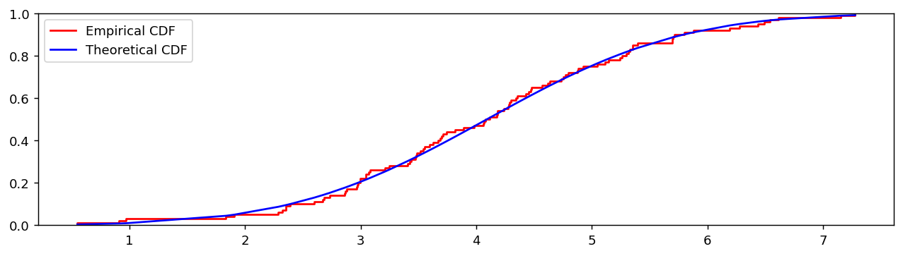
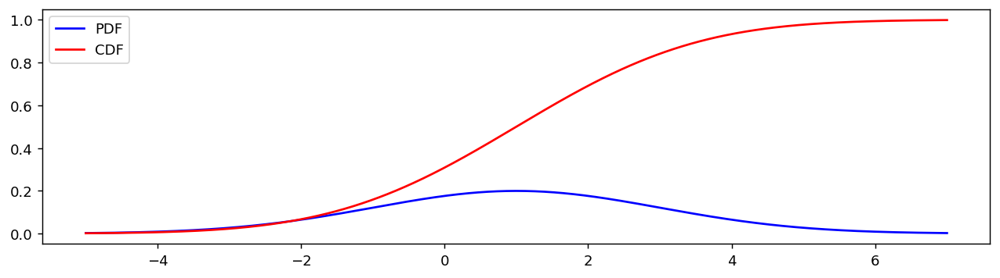
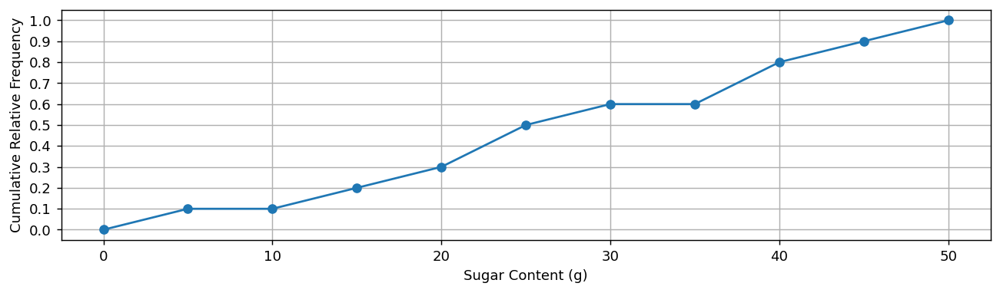
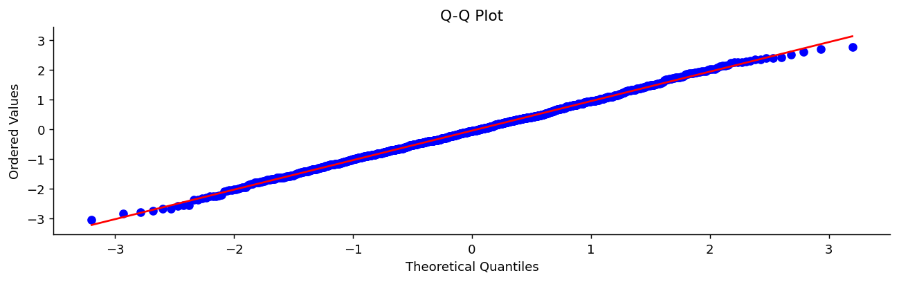
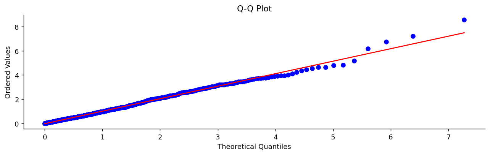
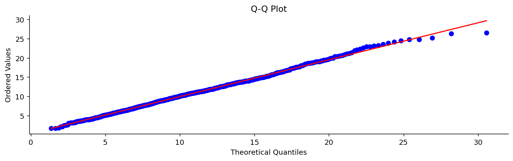
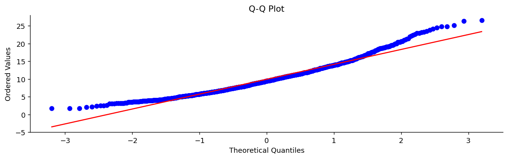

# 경험적 누적분포함수와 분위수

## 개요

**경험적 누적분포함수(ECDF)** 와 **분위수**는 히스토그램의 구간 너비 민감성을 피하면서 분포를 서로 보완적으로 바라보는 두 관점을 제공한다. ECDF는 각 자료값을 그 값 이하인 관측값의 비율로 보내어 계단함수를 만들며, 표본 크기가 커지면 참된 누적분포함수로 수렴한다. 분위수는 이 관계를 뒤집어 "자료의 주어진 비율이 어떤 값 아래에 떨어지는가?"에 답한다.

## 경험적 누적분포함수

표본 $x_1, x_2, \ldots, x_n$에 대해 ECDF는

$$
\hat{F}(t) = \frac{1}{n} \sum_{i=1}^{n} \mathbf{1}(x_i \le t)
$$

로 정의되며, 여기서 $\mathbf{1}(\cdot)$은 지시함수다. 핵심 성질은 다음과 같다.

- $\hat{F}$는 0에서 1까지 값을 갖는 비감소 계단함수다.
- 각 계단의 높이는 $1/n$이다(값이 겹치면 그 배수).
- 글리벤코–칸텔리 정리에 의해 $\hat{F}$는 참된 누적분포함수 $F$로 거의 확실하게 균등수렴한다.

### ECDF 대 이론적 누적분포함수

ECDF를 모수적 누적분포함수와 비교하는 것은 분포 가정을 평가하는 강력한 진단이다.

<div class="codebox" markdown>

**예제 1.** 경험적 누적분포함수와 이론적 누적분포함수 겹쳐 보기

```python
import matplotlib.pyplot as plt
import numpy as np
import scipy.stats as stats

np.random.seed(1)
x = 4 + np.random.normal(0, 1.5, 100)     # 평균 4, 표준편차 1.5의 정규 표본 100개

# 표본에서 모수를 추정한다. 참값(4, 1.5)이 아니라 자료에서 잰 값을 쓴다.
loc = x.mean()
scale = x.std()

# 이론적 CDF는 x가 정렬되어 있어야 선으로 이어 그릴 수 있다
x.sort()
cdf = stats.norm(loc=loc, scale=scale).cdf(x)

fig, ax = plt.subplots(figsize=(12, 3))

# ax.ecdf 가 경험적 누적분포함수를 그린다.
# 자료점마다 1/n 씩 올라가는 계단함수이며, 여기서는 n=100 이라 계단이 촘촘해
# 매끄러운 곡선처럼 보인다.
ax.ecdf(x, ls="-", c="r", label="Empirical CDF")

# 같은 자료에 적합한 정규분포의 이론적 CDF를 겹친다.
# 두 곡선의 벌어짐이 곧 "정규분포 가정이 얼마나 맞는가"이다.
ax.plot(x, cdf, "-b", label="Theoretical CDF")
ax.legend()
plt.show()

# 두 곡선의 최대 수직거리가 콜모고로프-스미르노프 통계량 D 다.
# 이 눈대중을 형식적 검정으로 만든 것이 KS 검정이다.
D, pval = stats.kstest(x, stats.norm(loc=loc, scale=scale).cdf)
print(f"최대 수직거리 D = {D:.4f}")
print(f"KS 검정 p값     = {pval:.4f}")
```

출력:

```
최대 수직거리 D = 0.0438
KS 검정 p값     = 0.9863
```

</div>



경험적 곡선과 이론적 곡선이 가깝게 겹치면 모수 모형이 잘 맞는 것이다. 체계적으로 벗어나면 왜도, 두꺼운 꼬리, 또는 다봉성을 나타낸다.

### 누적분포함수와 확률밀도함수 나란히 보기

<div class="codebox" markdown>

**예제 2.** 누적분포함수와 확률밀도함수의 관계

```python
import matplotlib.pyplot as plt
import numpy as np
import scipy.stats as stats

loc = 1        # 평균
scale = 2      # 표준편차
normal = stats.norm(loc=loc, scale=scale)

# 평균에서 좌우 3 표준편차까지를 촘촘히 훑는다.
# 정규분포는 이 범위에 확률의 99.7%가 들어 있다.
x = np.linspace(loc - 3 * scale, loc + 3 * scale, 1_000)
pdf = normal.pdf(x)     # 밀도함수: 각 점에서의 "빽빽함"
cdf = normal.cdf(x)     # 분포함수: 그 점까지 누적된 확률

fig, ax = plt.subplots(figsize=(12, 3))
ax.plot(x, pdf, "-b", label="PDF")
ax.plot(x, cdf, "-r", label="CDF")
ax.legend()
plt.show()

# 두 함수의 관계를 숫자로 확인한다.
#   CDF는 PDF를 적분한 것이므로 평균에서 정확히 0.5,
#   PDF가 최대인 곳(평균)에서 CDF의 기울기가 가장 가파르다.
print(f"CDF(평균)     = {normal.cdf(loc):.4f}")
print(f"PDF 최댓값    = {pdf.max():.4f}  (x = {x[pdf.argmax()]:.2f})")
print(f"P(|X-mu|<3s)  = {normal.cdf(loc+3*scale) - normal.cdf(loc-3*scale):.4f}")
```

출력:

```
CDF(평균)     = 0.5000
PDF 최댓값    = 0.1995  (x = 0.99)
P(|X-mu|<3s)  = 0.9973
```

</div>



확률밀도함수는 밀도가 어디에 몰려 있는지 보여주고, 누적분포함수는 누적 확률을 보여준다. 둘을 함께 보면 분포의 완전한 그림이 나온다.

## 분위수, 백분위수, 사분위수

### 백분위수

$p$번째 **백분위수** $P_p$는 자료의 $p\%$가 그 아래에 떨어지는 값이다. 누적상대도수 그래프에서 y축의 높이 $p/100$을 읽어 수평으로 곡선까지 이동하면 x축에서 백분위수를 얻는다.

### 사분위수

세 개의 사분위수가 자료를 네 등분한다.

$$
\begin{array}{llll}
\text{First Quartile} & Q_1 &=& P_{25} \\
\text{Second Quartile} & Q_2 &=& P_{50} \\
\text{Third Quartile} & Q_3 &=& P_{75} \\
\end{array}
$$

### 십분위수

$$
\begin{array}{llll}
D_1 = P_{10}, \quad D_2 = P_{20}, \quad \ldots, \quad D_9 = P_{90}
\end{array}
$$

### 중앙값과의 관계

$$
\text{Median} = Q_2 = D_5 = P_{50}
$$

## 파이썬에서 분위수 계산하기

흔히 쓰는 세 가지 방법이 모두 같은 결과를 낸다.

<div class="codebox" markdown>

**예제 3.** 세 라이브러리의 분위수 함수

```python
import pandas as pd
import numpy as np
from scipy import stats

data = {'x': [4, 4, 6, 7, 10, 11, 12, 14, 15]}
df = pd.DataFrame(data)

# 같은 75번째 백분위수를 세 라이브러리로 구한다. 인자의 단위가 서로 다르다.
# 기본 보간법이 셋 다 선형이라 값은 일치한다.
print(f"{df.x.quantile(0.75) = }")                   # pandas: 비율 [0, 1]
print(f"{np.percentile(df.x.values, 75) = }")        # numpy: 백분율 [0, 100]
print(f"{stats.scoreatpercentile(df.x.values, 75) = }")   # scipy: 백분율 [0, 100]
```

출력:

```
df.x.quantile(0.75) = 12.0
np.percentile(df.x.values, 75) = 12.0
stats.scoreatpercentile(df.x.values, 75) = 12.0
```

</div>

## 예: 스타벅스 음료의 당 함량

영양학자들이 스타벅스 음료 32종의 당 함량(그램)을 측정했다. 누적상대도수 그래프를 이용하면 다음과 같다.

<div class="codebox" markdown>

**예제 4.** 누적상대도수 곡선에서 백분위수 읽기

```python
import numpy as np
import matplotlib.pyplot as plt

# 당 함량을 5g 간격으로 끊고, 각 지점까지 누적된 비율을 기록한 자료다.
# y가 단조 증가하고 마지막이 1.0으로 끝나는 것이 누적상대도수의 성질이다.
x = np.arange(0, 55, 5)
y = [0, 0.1, 0.1, 0.2, 0.3, 0.5, 0.6, 0.6, 0.8, 0.9, 1.0]

fig, ax = plt.subplots(figsize=(12, 3))
ax.plot(x, y, '-o')                          # 점을 찍고 이어 그린다
ax.set_xlabel("Sugar Content (g)")
ax.set_ylabel("Cumulative Relative Frequency")
# y 눈금을 0.1 간격으로 촘촘히 두어야 백분위수를 눈으로 읽을 수 있다
ax.set_yticks(np.arange(0, 1.1, 0.1))
ax.grid()                                    # 격자가 있어야 가로세로로 읽어 나가기 쉽다
plt.show()

# 그림에서 눈으로 읽는 값을 코드로도 구해 본다.
# 누적비율 y에서 가로로 이동해 곡선을 만나는 x가 그 백분위수다.
for p_ in (0.25, 0.50, 0.75):
    print(f"P{int(p_*100)} = {np.interp(p_, y, x):.1f} g")
```

출력:

```
P25 = 17.5 g
P50 = 25.0 g
P75 = 38.8 g
```

</div>



**질문과 답:**

1. 당이 15그램인 커피는 대략 **20번째 백분위수**에 해당한다.
2. **중앙값**(50번째 백분위수)은 대략 **25그램**이다.
3. $Q_1 \approx 17.5$ g, $Q_3 \approx 38.5$ g이므로 $\text{IQR} = Q_3 - Q_1 \approx 21$ g이다.

## 다섯 수치 요약

다섯 수치 요약은 분포의 핵심 분위수를 담는다.

$$
\text{Min} \quad Q_1 \quad \text{Median} \quad Q_3 \quad \text{Max}
$$

<div class="codebox" markdown>

**예제 5.** 다섯 수치 요약과 상자그림

```python
import numpy as np
import matplotlib.pyplot as plt

data = np.array([1, 2, 0, 0, 0, 1, 3, 1, 2, 1, 2, 4, 5, -1, -2, 0, 8])

# 다섯 수치 요약은 최소·Q1·중앙값·Q3·최대다. 모두 분위수이므로 q 만 바꿔 부른다.
quantiles = {"Min": 0, "Q1": 0.25, "Median": 0.5, "Q3": 0.75, "Max": 1}

for label, q in quantiles.items():
    print(f"{label:6} : {np.quantile(data, q)}")

# 상자그림은 이 다섯 수를 그림으로 옮긴 것이다. 상자의 위아래가 Q3와 Q1,
# 가운데 선이 중앙값이며, 수염 밖에 찍히는 점이 이상치 후보다.
fig, ax = plt.subplots(figsize=(2, 3))
ax.boxplot(data)
ax.set_title("Boxplot of Data")
plt.show()
```

출력:

```
Min    : -2
Q1     : 0.0
Median : 1.0
Q3     : 2.0
Max    : 8
```

</div>

## Q-Q 그림: 분위수 대 분위수 비교

**Q-Q 그림**은 관측 자료의 분위수를 이론적 분포의 분위수와 비교한다. 자료가 기준 분포를 따르면 점들이 대각선 기준선을 따라 놓인다.

### 정규분포에 대한 Q-Q 그림

<div class="codebox" markdown>

**예제 6.** Q-Q 그림을 그리는 함수 만들기

```python
"""표본의 분위수를 이론 분포의 분위수에 맞대어 그리는 Q-Q 그림을 만든다."""
import numpy as np
import matplotlib.pyplot as plt
import scipy.stats as stats

def plot_qq(data, dist="norm", sparams=(), figsize=(12, 3)):
    """자료를 dist 의 분위수에 대해 그린다. 점이 직선 위에 놓이면 그 분포에 맞는다."""
    fig, ax = plt.subplots(figsize=figsize)
    # sparams 는 분포의 모양모수다. 정규처럼 위치·척도만 있는 분포는 비워 두면
    # probplot 이 자료에서 추정한다. 카이제곱처럼 모양모수가 있으면 넘겨야 한다.
    stats.probplot(data, dist=dist, sparams=sparams, plot=ax)
    ax.spines[["top", "right"]].set_visible(False)
    ax.set_title('Q-Q Plot')
    ax.set_xlabel('Theoretical Quantiles')
    ax.set_ylabel('Ordered Values')
    plt.show()

np.random.seed(0)
sample_data = np.random.normal(loc=0, scale=1, size=1000)
plot_qq(sample_data, dist="norm")    # 정규 자료를 정규에 맞댄다 — 직선이 나온다
```

</div>



### 지수분포에 대한 Q-Q 그림

<div class="codebox" markdown>

**예제 7.** 지수 자료를 지수 분위수에 맞대기

```python
# 지수분포는 오른쪽으로 심하게 치우쳐 있다. 그래도 지수 분위수에 맞대면 직선이 된다.
# Q-Q 그림이 보는 것은 치우침 자체가 아니라 "가정한 분포와 얼마나 맞는가"이다.
np.random.seed(0)
sample_data = np.random.exponential(scale=1, size=1000)
plot_qq(sample_data, dist="expon")
```

</div>



### 카이제곱분포에 대한 Q-Q 그림

<div class="codebox" markdown>

**예제 8.** 모양모수가 있는 분포의 Q-Q 그림

```python
# 카이제곱은 자유도라는 모양모수가 있으므로 sparams=(10,) 으로 알려 주어야 한다.
# 이 값을 틀리게 주면 자료가 맞는 분포에서 왔더라도 직선에서 벗어난다.
np.random.seed(0)
sample_data = np.random.chisquare(df=10, size=1000)
plot_qq(sample_data, dist="chi2", sparams=(10,))
```

</div>



### 진단적 활용: 카이제곱 자료를 정규 Q-Q 그림에 그리기

카이제곱 자료를 정규분포 기준으로 그리면 체계적인 휘어짐이 오른쪽 치우침을 드러내어, 정규 모형이 부적절함을 확인해 준다.

<div class="codebox" markdown>

**예제 9.** 분포를 잘못 가정했을 때의 Q-Q 그림

```python
# 같은 카이제곱 자료를 이번에는 정규 분위수에 맞댄다.
# 오른쪽 끝이 직선 위로 휘어 오르는 것이 "정규보다 오른쪽 꼬리가 두껍다"는 신호다.
np.random.seed(0)
sample_data = np.random.chisquare(df=10, size=1000)
plot_qq(sample_data, dist="norm")
```

</div>



## 연습문제

<div class="drillbox" markdown>

**연습문제 1.** <span class="diff easy" title="쉬움"></span>
자료 $\{2, 5, 5, 7, 10\}$에 대해 (a) ECDF $\hat F(x)$를 구간별 함수로 쓰라. (b) $\hat F(5)$와 $\hat F(6)$을 계산하라. (c) 50번째 백분위수(중앙값)를 구하라.

</div>

??? success "풀이"
    (a) $n = 5$이므로

    $$
    \hat F(x) = \begin{cases} 0 & x < 2 \\ 1/5 & 2 \le x < 5 \\ 3/5 & 5 \le x < 7 \\ 4/5 & 7 \le x < 10 \\ 1 & x \ge 10 \end{cases}
    $$

    각 고유한 값에서 $1/n$만큼 뛰어오르며, 5는 두 번 나오므로 5에서의 도약은 $2/5$다.

    (b) $\hat F(5) = 3/5 = 0.6$(5 이하인 값이 셋), $\hat F(6) = 3/5 = 0.6$(5와 7 사이에 값이 없다).

    (c) 50번째 백분위수는 $\hat F(x) \ge 0.5$인 가장 작은 $x$이므로 $x = 5$다.

<div class="drillbox" markdown>

**연습문제 2.** <span class="diff med" title="중간"></span>
**글리벤코–칸텔리 정리**를 진술하고, ECDF를 참된 누적분포함수의 추정량으로 쓰는 것에 대해 이 정리가 무엇을 말해주는지 해석하라.

</div>

??? success "풀이"
    $X_1, X_2, \ldots$가 누적분포함수 $F$를 갖는 i.i.d.이고 $\hat F_n$이 경험적 누적분포함수라 하자. 글리벤코–칸텔리 정리는

    $$
    \sup_x |\hat F_n(x) - F(x)| \xrightarrow{\text{a.s.}} 0 \quad \text{as } n \to \infty
    $$

    임을 말한다. 이 수렴은 점별이 아니라 모든 $x$에 걸쳐 *균등*하다. 바로 이 덕분에 ECDF가 범용 분포 추정량 역할을 할 수 있다. $F$의 어떤 연속적인 통계량(중앙값, IQR, 왜도 등)이든 $\hat F_n$의 대응되는 대입 통계량으로 일치성 있게 추정할 수 있다.

    **드보레츠키–키퍼–울포위츠(DKW) 부등식**이 그 속도를 정량화한다: $P(\sup_x |\hat F_n - F| > \varepsilon) \le 2 e^{-2n\varepsilon^2}$. $n = 100$이면 최악의 경우 차이가 확률 $\ge 0.96$으로 $\le 0.1$이다. 비모수 추정량치고는 빠르다.

<div class="drillbox" markdown>

**연습문제 3.** <span class="diff med" title="중간"></span>
분포 요약으로서 **ECDF**와 **히스토그램**을 비교하라. 각각의 장점을 두 가지씩 들어라.

</div>

??? success "풀이"
    **ECDF의 장점:** (1) 구간을 나누지 않아 임의의 구간 너비를 고를 필요가 없다. (2) 모든 관측값을 정확히 사용한다. (3) 모수적 속도 $O(1/\sqrt{n})$로 균등수렴한다. (4) 두 분포를 비교하기 쉽다(ECDF 두 개를 겹쳐 그리거나 K-S 거리를 계산).

    **히스토그램의 장점:** (1) 보통의 독자에게 더 직관적이다 — "자료가 주로 어디에 있는가?" (2) ECDF가 y축 $[0, 1]$ 범위에 걸쳐 평평하게 만들어 버리는 밀도(봉우리, 최빈값, 빈틈)를 강조한다. (3) 다봉성을 즉시 드러낸다. (4) 논문과 대시보드에서 표준이다.

    실무적으로는 적합도 검정과 분포 비교에는 **ECDF**를, 모양을 시각적으로 전달하는 데는 **히스토그램**(또는 커널밀도추정)을 쓴다.

<div class="drillbox" markdown>

**연습문제 4.** <span class="diff easy" title="쉬움"></span>
**분위수의 해석.** 어떤 표준화 시험이 한 학생을 85번째 백분위수라고 보고한다. 이것이 정확히 무슨 뜻인지 진술하라. 이것과 "시험에서 85%를 받았다"의 차이를 논하라.

</div>

??? success "풀이"
    85번째 백분위수라는 것은 **응시자의 85%가 이 학생의 점수 이하를 받았다**는 뜻이다(15%가 더 높은 점수를 받았다). 백분위수는 기준 모집단에 대한 *순위 기반* 측도다.

    "시험에서 85%를 받았다"는 것은 *절대적* 성취 측도로, 정답을 맞힌 문항의 비율이다. 이 둘은 서로 무관하다.

    - 아주 어려운 시험에서 85%를 받은 학생은 99번째 백분위수일 수 있다(대부분이 더 못했으므로).
    - 아주 쉬운 시험에서 85%를 받은 학생은 30번째 백분위수일 수 있다(대부분이 더 잘했으므로).

    백분위 순위는 특정 시험판의 난이도에 불변이므로 표준화 시험에서 흔히 쓰인다. 연도나 시험 형식을 넘나드는 비교는 재규준화를 거친 뒤 원점수가 아니라 백분위수를 사용한다.

<div class="drillbox" markdown>

**연습문제 5.** <span class="diff med" title="중간"></span>
**콜모고로프–스미르노프 통계량** $D_n = \sup_x |\hat F_n(x) - F_0(x)|$는 자료가 지정된 분포 $F_0$에서 왔는지를 검정한다. 이것이 왜 자연스러운 검정통계량이며, 그 귀무분포는 $F_0$에 어떻게 의존하는가?

</div>

??? success "풀이"
    **자연스러운 선택인 이유:** 글리벤코–칸텔리는 귀무가설($F = F_0$) 아래에서 $D_n \to 0$을 보장한다. 대립가설($F \ne F_0$) 아래에서는 $D_n$이 $\sup_x |F(x) - F_0(x)| > 0$으로 수렴한다. 따라서 $D_n$은 어떤 연속인 대립가설에 대해서도 귀무가설과 대립가설을 분리한다.

    **귀무분포:** $F_0$이 완전히 지정되어 있으면 $D_n$의 분포는 $F_0$ 자체가 아니라 오직 $n$에만 의존한다. 이것이 K-S의 **분포무관(distribution-free)** 성질이다. 귀무가설 아래에서 $F_0(X)$가 $[0, 1]$ 위의 균등분포를 따르므로, 원래의 $F_0$이 무엇이든 $D_n$은 사실상 균등분포로부터의 차이를 재는 셈이다. 덕분에 어떤 연속인 기준 분포에도 같은 임계값을 쓸 수 있다.

    **단서:** $F_0$의 모수를 같은 자료에서 추정했다면(예: 표본에서 추정한 $\hat\mu, \hat\sigma$로 정규성을 검정하는 경우) 이 검정은 더 이상 분포무관이 아니다. 그런 상황에서는 **릴리포스 검정**이나 **샤피로–윌크** 검정이 적절하다.

<div class="drillbox" markdown>

**연습문제 6.** <span class="diff med" title="중간"></span>
**Q-Q 그림**은 자료의 분위수를 기준 분포의 분위수와 비교한다. 다음 패턴들을 해석하라. (a) 점들이 직선 위에 놓인다. (b) S자 곡선. (c) 아래로 볼록한 체계적 휘어짐. (d) 꼬리에서만 크게 벗어남.

</div>

??? success "풀이"
    (a) **직선**(기준과 일치): 자료가 기준 분포로 잘 근사된다(보통 표준정규분포이며, 중심화와 척도 조정을 거쳤을 수 있다). 기울기는 자료의 표준편차, 절편은 평균이다.

    (b) **S자 모양**(천천히, 그다음 빠르게, 다시 천천히 상승): 자료의 **꼬리가 기준보다 얇다**. 극단값이 더 적다는 뜻이다. 가운데가 기준의 가운데보다 가파르다. 꼬리가 얇은 분포(예: 균등분포나 절단된 분포)를 나타낸다.

    (c) **아래로 볼록한 휘어짐**(오른쪽 위에서 더 가파름): 자료가 **오른쪽으로 치우쳐** 있다. 위쪽 꼬리가 기준보다 길다. 소득, 계수 자료, 로그정규 또는 지수 표본을 정규 기준에 대해 그릴 때 흔하다.

    (d) **꼬리에서만 벗어남**: 자료의 대부분은 잘 모형화되지만 극단 관측값이 맞지 않는다. 꼬리가 두껍거나(기준보다 극단값이 많음, 예: $t$ 분포) 오염 과정에서 온 이상치일 수 있다. 여러 표본을 살펴보거나 본체에 대해서만 강건 분석을 수행하여 구별한다.

    Q-Q 그림은 적합도 $p$-값 하나보다 더 유익하다. 모형이 실패했는지 *여부*만이 아니라 *어디서* 실패하는지를 보여주기 때문이다.

<div class="drillbox" markdown>

**연습문제 7.** <span class="diff hard" title="어려움"></span>
연습문제 2의 글리벤코–칸텔리 정리는 ECDF가 참 분포함수로 **균등하게** 수렴한다고만 말한다. 얼마나 빨리 수렴하는가? **DKW 부등식**으로 신뢰띠를 만들고 실제 포함률을 확인하라.

</div>

??? success "풀이"
    **드보레츠키–키퍼–울포위츠 부등식**은 모든 $n$과 $\varepsilon > 0$에 대해

    $$
    P\!\left(\sup_x \lvert \hat F_n(x) - F(x)\rvert > \varepsilon\right) \le 2e^{-2n\varepsilon^2}
    $$

    를 준다. 우변을 $\alpha$로 두고 풀면 반폭

    $$
    \varepsilon_n = \sqrt{\frac{\ln(2/\alpha)}{2n}}
    $$

    를 얻고, $\hat F_n(x) \pm \varepsilon_n$이 **동시(simultaneous) 신뢰띠**가 된다.

    ```python
    import numpy as np
    from scipy import stats

    rng = np.random.default_rng(0)
    band = lambda n, alpha=0.05: np.sqrt(np.log(2 / alpha) / (2 * n))

    print("DKW 신뢰띠: 곡선 전체가 띠 안에 들어갈 확률")
    for n in (20, 50, 200, 1000):
        eps = band(n)
        covered = 0
        B = 20_000
        for _ in range(B):
            x = np.sort(rng.normal(0, 1, n))
            F = stats.norm.cdf(x)
            upper = np.arange(1, n + 1) / n          # ECDF 는 계단함수라
            lower = upper - 1 / n                    # 각 점의 양쪽을 모두 본다
            d = max(np.max(np.abs(upper - F)), np.max(np.abs(lower - F)))
            if d <= eps:
                covered += 1
        print(f"  n={n:>5}: 띠 반폭 {eps:.4f}   실제 포함률 {covered / B:.4f}")
    ```

    출력:

    ```
    DKW 신뢰띠: 곡선 전체가 띠 안에 들어갈 확률
      n=   20: 띠 반폭 0.3037   실제 포함률 0.9604
      n=   50: 띠 반폭 0.1921   실제 포함률 0.9562
      n=  200: 띠 반폭 0.0960   실제 포함률 0.9536
      n= 1000: 띠 반폭 0.0429   실제 포함률 0.9489
    ```

    포함률이 $0.949$–$0.960$으로 보장치 $0.95$를 지킨다. $n = 20$에서 조금 보수적인데, 부등식이 **상한**이라 실제 확률이 그보다 작기 때문이다.

    **띠의 폭이 $1/\sqrt{n}$로 줄어든다.** $n = 20$에서 $\pm 0.304$면 거의 쓸모없이 넓지만, $n = 1000$에서는 $\pm 0.043$이다. 정밀도를 열 배 올리려면 자료가 백 배 필요하다는 익숙한 $\sqrt{n}$ 법칙이다.

    **왜 이 결과가 강력한가.**

    - **분포에 무관하다.** $F$가 무엇이든 성립한다. 연속이든 이산이든, 꼬리가 두껍든 상관없다.
    - **동시 보장이다.** "각 $x$마다 $95\%$"가 아니라 "**모든 $x$에서 동시에** $95\%$"다. 곡선 전체를 하나의 대상으로 다룬다.
    - **유한표본 보장이다.** 점근이 아니라 모든 $n$에서 성립한다.

    이 세 성질을 모두 갖춘 결과는 통계학에서 드물다. 그 대가는 띠가 넓다는 것인데, 특히 꼬리에서 $\hat F$가 $0$이나 $1$에 가까울 때 띠가 $[0,1]$ 밖으로 나가 무의미해진다. 꼬리에 관심이 있으면 폭이 $x$에 따라 변하는 띠(등화 띠)를 쓴다.

    **연습문제 5와의 연결.** DKW의 좌변이 바로 콜모고로프–스미르노프 통계량 $D_n$의 꼬리확률이다. **신뢰띠와 KS 검정은 같은 양의 두 얼굴**이며, 띠가 $F_0$을 포함하지 않는 것과 KS 검정이 기각하는 것이 같은 사건이다. $\square$

<div class="drillbox" markdown>

**연습문제 8.** <span class="diff med" title="중간"></span>
"제$1$사분위수"에는 **하나의 정의만 있는 것이 아니다.** 같은 자료에 대해 여러 정의가 얼마나 다른 답을 주는지 확인하고, 실무에서 무엇을 조심해야 하는지 논하라.

</div>

??? success "풀이"
    ```python
    import numpy as np

    x = np.array([3., 7., 8., 12., 15., 19., 24., 31.])
    print(f"자료 {x}  (n={len(x)})\n")
    print(f"{'방법':>18}{'Q1':>9}{'중앙값':>9}{'Q3':>9}{'IQR':>9}")
    for m in ("linear", "lower", "higher", "nearest", "midpoint",
              "inverted_cdf", "hazen", "weibull", "median_unbiased"):
        q = [np.quantile(x, p, method=m) for p in (0.25, 0.5, 0.75)]
        print(f"{m:>18}{q[0]:>9.3f}{q[1]:>9.3f}{q[2]:>9.3f}{q[2] - q[0]:>9.3f}")
    ```

    출력:

    ```
    자료 [ 3.  7.  8. 12. 15. 19. 24. 31.]  (n=8)

                    방법       Q1      중앙값       Q3      IQR
                linear    7.750   13.500   20.250   12.500
                 lower    7.000   12.000   19.000   12.000
                higher    8.000   15.000   24.000   16.000
               nearest    8.000   15.000   19.000   11.000
              midpoint    7.500   13.500   21.500   14.000
          inverted_cdf    7.000   12.000   19.000   12.000
                 hazen    7.500   13.500   21.500   14.000
               weibull    7.250   13.500   22.750   15.500
       median_unbiased    7.417   13.500   21.917   14.500
    ```

    **중앙값만 대체로 일치하고 사분위수는 크게 갈린다.**

    | | 범위 |
    |---|---|
    | Q1 | $7.00$ – $8.00$ |
    | Q3 | $19.00$ – $24.00$ |
    | **IQR** | $\mathbf{11.00 - 16.00}$ |

    IQR이 $45\%$나 차이 난다. 같은 여덟 개 숫자에 대해서다.

    **왜 정의가 여럿인가.** 근본 문제는 $p = 0.25$에 정확히 대응하는 관측이 대개 없다는 것이다. $n = 8$이면 순서통계량이 $x_{(1)}, \ldots, x_{(8)}$인데, $\hat F$가 $0.25$를 지나는 지점이 **한 점이 아니라 구간**이다. 어디를 고를지는 규약이며, 아홉 가지 이상의 규약이 통용된다.

    - `linear` (NumPy 기본, R의 type 7): 위치 $(n-1)p + 1$에서 선형보간.
    - `inverted_cdf` (type 1): $\hat F^{-1}(p)$를 그대로. 언제나 관측값 중 하나를 준다.
    - `median_unbiased` (type 8): 분포에 무관하게 근사적으로 중앙값 불편. **통계적으로 가장 권장되는 기본값이다.**
    - `hazen`, `weibull`: 수문학과 신뢰성 공학에서 관습적으로 쓰인다.

    **실무에서 무엇을 조심하는가.**

    - **소프트웨어마다 기본값이 다르다.** NumPy와 R의 `quantile()` 기본값은 type 7로 같지만, Excel의 `QUARTILE.EXC`, SAS, SPSS는 다르다. **같은 자료로 다른 도구를 쓰면 다른 사분위수가 나온다.**
    - **상자그림이 달라진다.** 상자의 위아래가 Q1·Q3이고 수염이 $1.5 \times \mathrm{IQR}$이므로, 정의가 바뀌면 **이상치로 분류되는 점도 바뀐다.**
    - **$n$이 작을수록 심각하다.** $n$이 커지면 모든 정의가 같은 값으로 수렴하므로, 위와 같은 차이는 소표본에서만 문제가 된다.

    **권고.** 보고서에는 어떤 정의를 썼는지 밝히고, 소표본에서 사분위수가 결론을 좌우한다면 여러 정의로 계산해 보라. 값이 크게 흔들린다면 **그 자료로 사분위수를 논하기에는 표본이 부족하다**는 신호다. $\square$

<div class="drillbox" markdown>

**연습문제 9.** <span class="diff med" title="중간"></span>
연습문제 5의 KS 검정을 **두 표본** 상황으로 확장하라. 두 ECDF를 비교하는 것이 $t$ 검정보다 나은 경우를 보여라.

</div>

??? success "풀이"
    두 표본 KS 통계량은 두 ECDF의 최대 수직 거리다.

    $$
    D_{n,m} = \sup_x \lvert \hat F_n(x) - \hat G_m(x)\rvert
    $$

    ```python
    import numpy as np
    from scipy import stats

    rng = np.random.default_rng(1)
    a = rng.normal(0, 1, 300)
    b = rng.normal(0.3, 1, 300)        # 위치만 다르다
    c = rng.normal(0, 1.6, 300)        # 척도만 다르다

    for label, y in [("위치 이동 (+0.3)", b), ("척도 변화 (x1.6)", c)]:
        d, p_ks = stats.ks_2samp(a, y)
        p_t = stats.ttest_ind(a, y)[1]
        p_lev = stats.levene(a, y)[1]
        print(f"{label}")
        print(f"  KS      D={d:.4f}  p={p_ks:.4f}")
        print(f"  t 검정            p={p_t:.4f}")
        print(f"  르빈 검정          p={p_lev:.4f}")
    ```

    출력:

    ```
    위치 이동 (+0.3)
      KS      D=0.2200  p=0.0000
      t 검정            p=0.0000
      르빈 검정          p=0.1648
    척도 변화 (x1.6)
      KS      D=0.1867  p=0.0001
      t 검정            p=0.9328
      르빈 검정          p=0.0000
    ```

    | | KS | $t$ 검정 | 르빈 |
    |---|---|---|---|
    | 위치 이동 | $p < 0.0001$ | $p < 0.0001$ | $p = 0.165$ |
    | 척도 변화 | $p = 0.0001$ | $\mathbf{p = 0.933}$ | $p < 0.0001$ |

    **$t$ 검정은 척도 변화를 전혀 보지 못한다**($p = 0.93$). 평균만 비교하기 때문이며, 두 분포의 평균이 실제로 같으니 당연한 결과다. 르빈 검정은 반대로 위치 이동을 보지 못한다.

    **KS는 둘 다 잡는다.** 분포함수 **전체**를 비교하므로 평균이든 분산이든 모양이든, 어떤 차이든 충분히 크면 탐지한다.

    **대가는 검정력이다.** 위치 이동만 있는 경우 $t$ 검정이 KS보다 검정력이 높다. **어디를 볼지 미리 알면 그곳만 보는 것이 유리하다.** KS는 모든 방향을 동시에 보는 대신 각 방향에서 조금씩 손해를 본다. 앞 장에서 본 맞바꿈의 또 다른 사례다.

    **언제 KS를 쓰는가.**

    - 차이가 **어떤 모습일지 모를 때.** 탐색적 비교의 기본 도구다.
    - **분포 가정을 하고 싶지 않을 때.** 순위만 쓰므로 단조 변환에 불변이고 정규성을 요구하지 않는다.
    - 두 자료 생성 과정이 **같은지** 확인할 때. A/B 테스트에서 배정이 제대로 되었는지 점검하거나, 모형이 만든 자료가 실제와 같은 분포인지 볼 때.

    **한계도 분명하다.** KS는 분포의 **중앙부에 가장 민감하고 꼬리에는 둔감하다.** $\hat F$가 $0$이나 $1$에 가까운 곳에서는 차이가 날 여지 자체가 작기 때문이다. 꼬리 차이가 중요하면 앤더슨–달링 검정이 낫다.

    **ECDF를 겹쳐 그리는 것이 검정보다 먼저다.** $p$ 값 하나보다 두 곡선이 **어디서 얼마나** 갈리는지 보는 것이 훨씬 많은 정보를 준다. $\square$

<div class="drillbox" markdown>

**연습문제 10.** <span class="diff hard" title="어려움"></span>
분위수마다 추정의 어려움이 다르다. 표본 분위수의 표준오차를 유도하고, 왜 **극단 분위수가 훨씬 부정확한지** 수치로 확인하라.

</div>

??? success "풀이"
    표본 $p$ 분위수 $\hat{x}_p$는 점근적으로

    $$
    \sqrt{n}\left(\hat{x}_p - x_p\right) \xrightarrow{d} N\!\left(0,\ \frac{p(1-p)}{f(x_p)^2}\right)
    $$

    를 따른다. 즉 표준오차가

    $$
    \operatorname{SE}(\hat{x}_p) \approx \frac{1}{f(x_p)}\sqrt{\frac{p(1-p)}{n}}
    $$

    이다. **분자는 $p = 0.5$에서 최대이지만, 분모의 밀도 $f(x_p)$가 꼬리에서 급격히 작아지므로 극단 분위수의 표준오차가 훨씬 크다.**

    ```python
    import numpy as np
    from scipy import stats

    rng = np.random.default_rng(1)
    B, n = 40_000, 500
    d = rng.normal(0, 1, (B, n))
    se_mean = 1 / np.sqrt(n)

    print(f"N(0,1), n={n}")
    print(f"{'p':>6}{'모의 SE':>11}{'이론 SE':>11}{'평균의 SE 대비':>15}")
    for p in (0.5, 0.75, 0.90, 0.95, 0.99):
        q = np.quantile(d, p, axis=1)
        theory = np.sqrt(p * (1 - p) / n) / stats.norm.pdf(stats.norm.ppf(p))
        print(f"{p:>6.2f}{q.std():>11.5f}{theory:>11.5f}{q.std() / se_mean:>15.3f}")
    ```

    출력:

    ```
    N(0,1), n=500
         p      모의 SE      이론 SE      평균의 SE 대비
      0.50    0.05590    0.05605          1.250
      0.75    0.06114    0.06094          1.367
      0.90    0.07609    0.07645          1.701
      0.95    0.09410    0.09450          2.104
      0.99    0.15955    0.16696          3.568
    ```

    이론과 모의가 소수점 셋째 자리까지 맞는다.

    | $p$ | SE | 표본평균의 SE 대비 |
    |---|---|---|
    | $0.50$ | $0.0557$ | $1.25$배 |
    | $0.90$ | $0.0761$ | $1.70$배 |
    | $0.99$ | $\mathbf{0.1601}$ | $\mathbf{3.58}$배 |

    $99$번째 백분위수를 중앙값만큼 정밀하게 추정하려면 **표본이 약 $8$배 필요하다**($3.58^2 \approx 12.8$, 중앙값 대비로는 $(0.160/0.056)^2 \approx 8.3$).

    **실무적 함의.**

    - **위험관리의 VaR**은 보통 $99\%$나 $99.9\%$ 분위수다. 이 계산이 말하는 바는 **그 추정값이 본질적으로 불안정하다**는 것이다. $99.9\%$ 분위수를 안정적으로 추정하려면 관측이 수만 개 필요하다.
    - **관측 범위를 넘는 분위수는 추정할 수 없다.** $n = 500$이면 경험적으로 $99.8$번째 백분위수가 최댓값이다. 그보다 극단적인 분위수를 말하려면 반드시 **모형 가정(극단값 이론 등)** 을 끌어들여야 하며, 그 순간 결과는 가정에 의존하게 된다.
    - **중앙값이 특별히 정밀한 것도 아니다.** 표본평균보다 $1.25$배 나쁘다(정규분포에서 효율 $2/\pi$의 제곱근인 $1/\sqrt{0.637} = 1.25$).

    **밀도가 작은 곳은 추정이 어렵다**는 것이 일반 원리다. 자료가 드문 영역에 대해 정밀한 진술을 하려면 자료를 훨씬 많이 모으거나, 구조에 대한 가정을 빌려 와야 한다. $\square$

---

## 정리하며

ECDF와 분위수는 구간을 나눌 필요 없이 경험적 분포를 정확하게 표현한다. ECDF는 분포를 비교하거나 적합도를 평가하는 데 이상적이고, 분위수와 다섯 수치 요약은 간결한 수치 요약을 제공한다. Q-Q 그림은 이 개념들을 확장하여 분포 가정을 확인하는 강력한 시각적 진단 도구가 된다.
