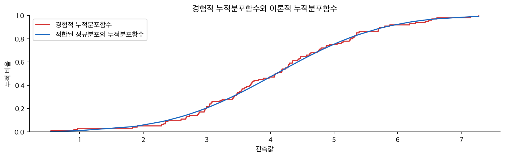
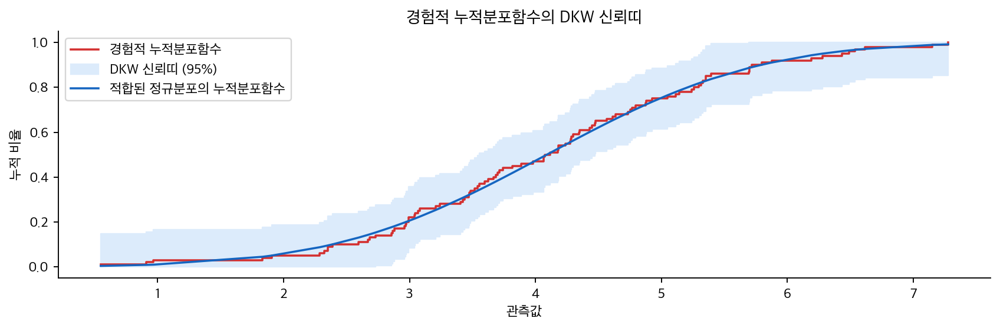
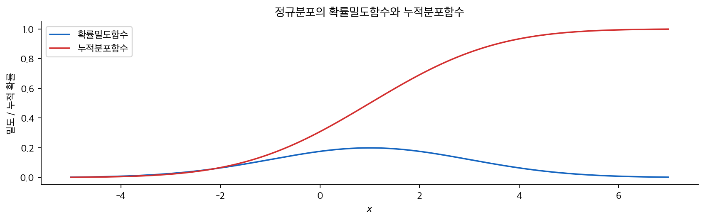
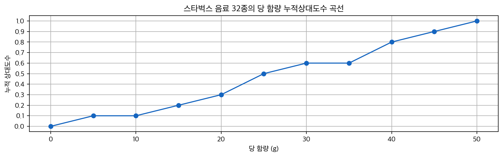
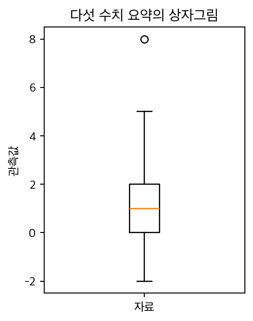
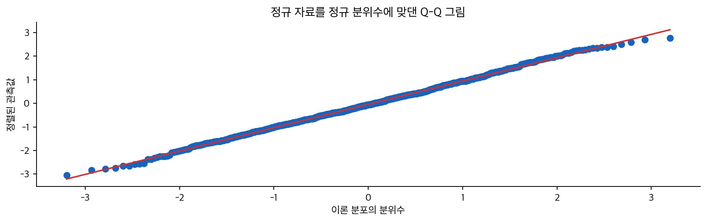
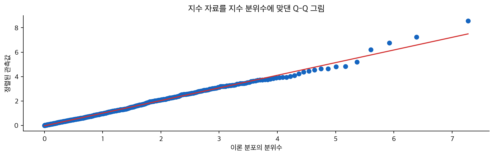
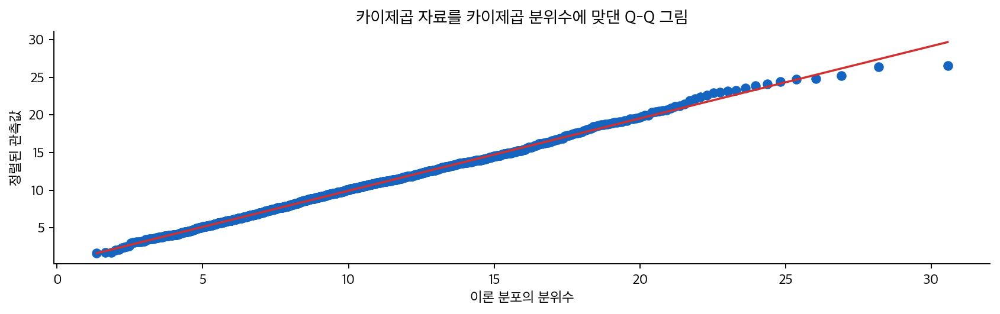
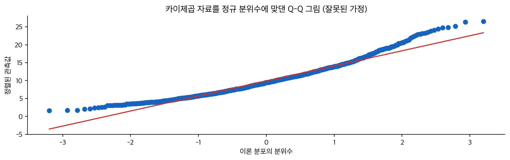

# 경험적 분포와 분위수-분위수 그림

## 개요

**경험적 누적분포함수(ECDF)** 와 **분위수**는 히스토그램의 구간 너비 민감성을 피하면서 분포를 서로 보완적으로 바라보는 두 관점을 제공한다. ECDF는 각 자료값을 그 값 이하인 관측값의 비율로 보내어 계단함수를 만들며, 표본 크기가 커지면 참된 누적분포함수로 수렴한다. 분위수는 이 관계를 뒤집어 "자료의 주어진 비율이 어떤 값 아래에 떨어지는가?"에 답한다. 이 절의 뒷부분에서는 두 관점을 합쳐, 관측된 분위수를 이론 분포의 분위수에 맞대어 그리는 **분위수-분위수 그림**(Q-Q 그림)을 분포 가정의 시각적 진단 도구로 쓴다.

## 경험적 누적분포함수

표본 $x_1, x_2, \ldots, x_n$에 대해 ECDF는

$$
\hat{F}(t) = \frac{1}{n} \sum_{i=1}^{n} \mathbf{1}(x_i \le t)
$$

로 정의되며, 여기서 $\mathbf{1}(\cdot)$은 지시함수다. 핵심 성질은 다음과 같다.

- $\hat{F}$는 0에서 1까지 값을 갖는 비감소 계단함수다.
- 각 계단의 높이는 $1/n$이다(값이 겹치면 그 배수).
- 글리벤코–칸텔리 정리에 의해 $\hat{F}$는 참된 누적분포함수 $F$로 거의 확실하게 균등수렴한다.

### ECDF 대 이론적 누적분포함수

ECDF를 모수적 누적분포함수와 비교하는 것은 분포 가정을 평가하는 강력한 진단이다.

<div class="exbox" markdown>

**보기 1.** <span class="diff easy" title="쉬움"></span> 경험적 곡선은 참된 곡선에서 얼마나 벌어질 수 있는가. 평균 $4$, 표준편차 $1.5$인 정규모집단에서 $n = 100$을 뽑아 ECDF를 그리고 적합된 정규 누적분포함수와 겹쳐 본다.

**(1)** $\hat F_n$의 뜀의 크기가 정확히 $1/n$임을 보이고, 최대 수직거리 $D = \sup_x \lvert \hat F_n(x) - F(x)\rvert$가 **순서통계량 $n$개에서만** 계산되는 유한한 최댓값임을 보이시오.

**(2)** 드보레츠키–키퍼–볼포위츠(DKW) 부등식에서 $\alpha = 0.05$, $n = 100$인 신뢰띠의 폭 $\varepsilon$을 구하고, 콜모고로프 극한분포가 주는 폭과 견주시오. 두 수가 같아지는 것이 우연인가.

</div>

??? success "풀이"

    **(1) 해석적으로.** 정의

    $$
    \hat F_n(x) = \frac1n \sum_{i=1}^n \mathbf 1(x_i \le x)
    $$

    에서 분자는 **정수**이므로 $\hat F_n$이 가질 수 있는 값은 $0, \tfrac1n, \tfrac2n, \dots, 1$뿐이다. 자료점이 아닌 곳에서는 지시함수가 하나도 바뀌지 않으므로 $\hat F_n$이 상수이고, 점 $t$를 지날 때는 $t$와 같은 관측값의 개수만큼 분자가 뛴다. 그러니 뜀의 크기는

    $$
    \hat F_n(t) - \hat F_n(t^-) = \frac{\#\{i : x_i = t\}}{n}
    $$

    이다. 연속분포에서 뽑았으면 동점이 생길 확률이 0이므로 모든 뜀이 **정확히 $1/n$**이고, 동점이 $k$개 모이면 그 자리만 $k/n$이 된다.

    $D$도 같은 계단 구조에서 나온다. 순서통계량을 $x_{(1)} \le \cdots \le x_{(n)}$이라 두면 반열린구간 $[x_{(i)}, x_{(i+1)})$에서 $\hat F_n \equiv i/n$으로 납작한데 $F$는 그 위에서 비감소다. 그러므로 $\hat F_n - F$는 이 구간의 **왼쪽 끝**에서 가장 크고, $F - \hat F_n$은 $x_{(i)}$에 **왼쪽에서 다가갈 때** 가장 크다. 곧

    $$
    D^+ = \max_{1 \le i \le n}\left(\frac{i}{n} - F(x_{(i)})\right),
    \qquad
    D^- = \max_{1 \le i \le n}\left(F(x_{(i)}) - \frac{i-1}{n}\right),
    \qquad
    D = \max(D^+, D^-)
    $$

    이다. **상한이 최댓값으로 바뀌었다.** 실수 전체를 훑는 대신 $n$개의 점만 보면 되고, 이것이 KS 검정이 실제로 계산하는 식이다.

    **(2) 해석적으로.** DKW 부등식은 모든 연속 $F$에 대해

    $$
    P\big(\sup_x \lvert \hat F_n(x) - F(x)\rvert > \varepsilon\big) \;\le\; 2e^{-2n\varepsilon^2}
    $$

    을 준다. **오른변에 $F$가 들어 있지 않다.** 그래서 오른변을 $\alpha$로 두고 풀면 분포를 몰라도 쓸 수 있는 띠의 폭

    $$
    \varepsilon = \sqrt{\frac{\ln(2/\alpha)}{2n}}
    $$

    이 나온다. $n = 100$, $\alpha = 0.05$이면 $\ln 40 = 3.688879$이므로

    $$
    \varepsilon = \sqrt{\frac{3.688879}{200}} = \sqrt{0.01844440} = 0.1358102
    $$

    다. 한편 콜모고로프 극한정리는 $\sqrt n\, D \to K$이고

    $$
    P(K \le t) = 1 - 2\sum_{k=1}^{\infty} (-1)^{k-1} e^{-2k^2 t^2}
    $$

    임을 말한다. $K$의 $95$분위가 $t_{0.95} = 1.358099$이므로 이 쪽 띠는 $1.358099/\sqrt{100} = 0.1358099$다. **두 수가 소수 여섯째 자리까지 같다.**

    우연이 아니다. 위 급수의 꼬리 $P(K > t) = 2\sum_k (-1)^{k-1}e^{-2k^2t^2}$에서 **첫 항이 바로 $2e^{-2t^2}$**, 곧 DKW의 오른변이다. $t = 1.358$에서 둘째 항은 $-2e^{-8t^2} = -7.8\times 10^{-7}$에 지나지 않으므로 두 식이 같은 수를 줄 수밖에 없다. **DKW 부등식은 콜모고로프 꼬리급수를 첫 항에서 끊은 것이고, 그것을 모든 $n$에 대해 참이 되도록 부등식으로 만든 것이다.**

    **(3) 수치적으로.**

    ```python
    import matplotlib
    matplotlib.use("Agg")
    import matplotlib.pyplot as plt
    import numpy as np
    import scipy.stats as stats

    # 그림에 한글을 쓰므로 한글 글꼴을 지정한다. 후보를 늘어놓으면 matplotlib 가
    # 설치된 첫 번째를 집으므로, 리눅스('NanumGothic')·맥('Apple SD Gothic Neo')·
    # 윈도우('Malgun Gothic')에서 코드를 고치지 않고 그대로 돌릴 수 있다.
    # 글꼴을 바꾸면 마이너스 기호가 깨지므로 unicode_minus 도 함께 꺼 준다.
    plt.rcParams["font.sans-serif"] = ["NanumGothic", "Apple SD Gothic Neo", "Malgun Gothic"]
    plt.rcParams["font.family"] = "sans-serif"
    plt.rcParams["axes.unicode_minus"] = False

    np.random.seed(1)
    x = 4 + np.random.normal(0, 1.5, 100)     # 평균 4, 표준편차 1.5의 정규 표본 100개

    # 표본에서 모수를 추정한다. 참값(4, 1.5)이 아니라 자료에서 잰 값을 쓴다.
    loc = x.mean()
    scale = x.std()

    # 이론적 CDF는 x가 정렬되어 있어야 선으로 이어 그릴 수 있다
    x.sort()
    cdf = stats.norm(loc=loc, scale=scale).cdf(x)

    fig, ax = plt.subplots(figsize=(12, 3))

    # ax.ecdf 가 경험적 누적분포함수를 그린다.
    # 자료점마다 1/n 씩 올라가는 계단함수이며, 여기서는 n=100 이라 계단이 촘촘해
    # 매끄러운 곡선처럼 보인다.
    ax.ecdf(x, ls="-", c="#D32F2F", label="경험적 누적분포함수")

    # 같은 자료에 적합한 정규분포의 이론적 CDF를 겹친다.
    # 두 곡선의 벌어짐이 곧 "정규분포 가정이 얼마나 맞는가"이다.
    ax.plot(x, cdf, "-", c="#1565C0", label="적합된 정규분포의 누적분포함수")
    ax.set_xlabel("관측값")
    ax.set_ylabel("누적 비율")
    ax.set_title("경험적 누적분포함수와 이론적 누적분포함수")
    ax.legend()
    ax.spines[["top", "right"]].set_visible(False)
    fig.savefig("ecdf_25.png", dpi=170, facecolor="white", bbox_inches="tight")

    # --- (1) 뜀의 크기가 정말 1/n 인가 ---
    n = len(x)
    print(f"n = {n},  서로 다른 값의 개수 = {len(np.unique(x))}")
    print(f"뜀의 크기로 나타난 값 = {np.unique(np.round(np.diff(np.arange(1, n + 1) / n), 12))}")

    # --- (1) D 를 순서통계량만으로 계산한다 ---
    # [x_(i), x_(i+1)) 에서 ECDF 는 i/n 으로 납작하고 F 는 올라가므로
    # 위로 벌어지는 최대는 왼쪽 끝, 아래로 벌어지는 최대는 왼쪽 끝 바로 앞에서 난다.
    i = np.arange(1, n + 1)
    Dplus = (i / n - cdf).max()
    Dminus = (cdf - (i - 1) / n).max()
    print(f"D+ = {Dplus:.6f}  (i = {(i / n - cdf).argmax() + 1}번째 순서통계량)")
    print(f"D- = {Dminus:.6f}  (i = {(cdf - (i - 1) / n).argmax() + 1}번째 순서통계량)")

    # 두 곡선의 최대 수직거리가 콜모고로프-스미르노프 통계량 D 다.
    # 이 눈대중을 형식적 검정으로 만든 것이 KS 검정이다.
    D, pval = stats.kstest(x, stats.norm(loc=loc, scale=scale).cdf)
    print(f"최대 수직거리 D = {D:.4f}   (손으로 구한 max(D+, D-) = {max(Dplus, Dminus):.4f})")
    print(f"KS 검정 p값     = {pval:.4f}")

    # --- (2) 두 경로가 주는 신뢰띠 폭 ---
    alpha = 0.05
    eps_dkw = np.sqrt(np.log(2 / alpha) / (2 * n))          # DKW 부등식
    t95 = stats.kstwobign.ppf(0.95)                          # 콜모고로프 극한분포의 95분위
    print(f"\nDKW 띠        eps = {eps_dkw:.7f}")
    print(f"콜모고로프 띠 eps = {t95 / np.sqrt(n):.7f}   (t_0.95 = {t95:.6f})")
    # DKW 의 오른변은 콜모고로프 꼬리급수의 첫 항이다. 둘째 항의 크기를 재 보면
    # 왜 두 수가 소수 여섯째 자리까지 같은지 알 수 있다.
    print(f"  첫 항 2exp(-2t^2)   = {2 * np.exp(-2 * t95 ** 2):.8f}")
    print(f"  둘째 항 -2exp(-8t^2) = {-2 * np.exp(-8 * t95 ** 2):.2e}")
    print(f"  콜모고로프 꼬리 정확값 = {stats.kstwobign.sf(t95):.8f}")

    # 유한한 n 에서의 정확한 포함률은 kstwo 가 준다 (극한이 아니라 n=100 의 분포다).
    print(f"n = {n} 에서 정확한 포함률 = {stats.kstwo.cdf(eps_dkw, n):.6f}")

    # --- (2) 모의실험으로 포함률을 재고, 분포에 무관함도 함께 본다 ---
    rng = np.random.default_rng(0)
    reps = 2000
    for name, draw, F in (
            ("정규", lambda m: rng.normal(4, 1.5, size=(m, n)), stats.norm(4, 1.5).cdf),
            ("지수", lambda m: rng.exponential(1.0, size=(m, n)), stats.expon(scale=1.0).cdf),
    ):
        s = np.sort(draw(reps), axis=1)
        Fv = F(s)
        sup = np.maximum((i / n - Fv).max(axis=1), (Fv - (i - 1) / n).max(axis=1))
        cov = (sup <= eps_dkw).mean()
        print(f"{name}모집단 포함률 = {cov:.4f} +- {np.sqrt(cov * (1 - cov) / reps):.4f}  "
              f"(평균 sup = {sup.mean():.4f})")

    # --- 신뢰띠 그림 ---
    ecdf_y = i / n
    fig, ax = plt.subplots(figsize=(12, 3.2))
    ax.step(x, ecdf_y, where="post", c="#D32F2F", label="경험적 누적분포함수")
    ax.fill_between(x, np.clip(ecdf_y - eps_dkw, 0, 1), np.clip(ecdf_y + eps_dkw, 0, 1),
                    step="post", color="#DCEBFB", label="DKW 신뢰띠 (95%)")
    ax.plot(x, cdf, "-", c="#1565C0", label="적합된 정규분포의 누적분포함수")
    ax.set_xlabel("관측값")
    ax.set_ylabel("누적 비율")
    ax.set_title("경험적 누적분포함수의 DKW 신뢰띠")
    ax.legend(loc="upper left")
    ax.spines[["top", "right"]].set_visible(False)
    fig.savefig("ecdf_dkw.png", dpi=170, facecolor="white", bbox_inches="tight")
    ```

    출력:

    ```
    n = 100,  서로 다른 값의 개수 = 100
    뜀의 크기로 나타난 값 = [0.01]
    D+ = 0.043818  (i = 44번째 순서통계량)
    D- = 0.037042  (i = 6번째 순서통계량)
    최대 수직거리 D = 0.0438   (손으로 구한 max(D+, D-) = 0.0438)
    KS 검정 p값     = 0.9863

    DKW 띠        eps = 0.1358102
    콜모고로프 띠 eps = 0.1358099   (t_0.95 = 1.358099)
      첫 항 2exp(-2t^2)   = 0.05000078
      둘째 항 -2exp(-8t^2) = -7.81e-07
      콜모고로프 꼬리 정확값 = 0.05000000
    n = 100 에서 정확한 포함률 = 0.954666
    정규모집단 포함률 = 0.9480 +- 0.0050  (평균 sup = 0.0854)
    지수모집단 포함률 = 0.9560 +- 0.0046  (평균 sup = 0.0850)
    ```

    

    

    뜀의 크기로 나타난 값이 $0.01 = 1/100$ 하나뿐이고 서로 다른 값이 100개다. (1)의 첫 주장이 확인되었다. 순서통계량만으로 구한 $\max(D^+, D^-) = 0.0438$도 `kstest` 가 준 $D = 0.0438$과 맞고, 최대가 나는 자리는 $44$번째 순서통계량이다.

    (2)의 두 수도 $0.1358102$와 $0.1358099$로 맞는다. 급수의 첫 항이 $0.05000078$, 둘째 항이 $-7.81\times10^{-7}$이라 합이 $0.05000000$이 되는 과정이 그대로 보인다.

    **포함률은 보수적이기는 하되 아주 조금만 그렇다.** $n = 100$에서의 정확한 값이 $0.9547$로 명목 $0.95$보다 $0.005$쯤 높을 뿐이다. DKW가 콜모고로프 꼬리의 **첫 항**이어서 띠 자체는 사실상 정확하고, 남은 $0.005$는 $n = 100$이 아직 극한이 아니라서 생긴다. 모의실험 2000회가 준 $0.9480 \pm 0.0050$과 $0.9560 \pm 0.0046$은 둘 다 $0.9547$에서 한두 몬테카를로 표준오차 안이다.

    분포에 무관하다는 주장도 확인된다. 정규에서 잰 $\sup$의 평균이 $0.0854$, 지수에서 잰 것이 $0.0850$으로 사실상 같다. **$F$가 연속이기만 하면 $\sup_x\lvert\hat F_n - F\rvert$의 분포는 $F$에 전혀 의존하지 않는다** — $F(X_i)$가 균등분포를 따르므로 문제가 언제나 균등분포 하나로 환원되기 때문이다.

    띠 그림에서 적합된 정규곡선이 처음부터 끝까지 띠 안에 들어 있다. $D = 0.0438 < 0.1358$이니 당연한 일이고, KS 검정의 $p$값 $0.9863$이 같은 말을 수로 한 것이다.

경험적 곡선과 이론적 곡선이 가깝게 겹치면 모수 모형이 잘 맞는 것이다. 체계적으로 벗어나면 왜도, 두꺼운 꼬리, 또는 다봉성을 나타낸다.

### 누적분포함수와 확률밀도함수 나란히 보기

<div class="exbox" markdown>

**보기 2.** <span class="diff easy" title="쉬움"></span> 밀도가 가장 높은 자리에서 ECDF가 가장 흔들린다. $N(1, 2^2)$의 밀도함수와 분포함수를 겹쳐 그린다.

**(1)** $F(\mu) = \tfrac12$임을, 그리고 $f$의 최댓값이 $x = \mu$에서 $1/(\sigma\sqrt{2\pi})$임을 보이시오. $P(\lvert X - \mu\rvert < 3\sigma)$도 구하시오.

**(2)** 같은 모집단에서 $n = 100$을 뽑는다. 점 $t$를 하나 고정했을 때 $\hat F_n(t)$의 분포·평균·분산은 무엇이며, 분산이 가장 큰 $t$는 어디인가.

</div>

??? success "풀이"

    **(1) 해석적으로.** 두 함수를 잇는 것은 미적분학의 기본정리다.

    $$
    F(x) = \int_{-\infty}^{x} f(u)\,du
    \quad\Longrightarrow\quad
    F'(x) = f(x)
    $$

    **밀도는 분포함수의 기울기다.** 그러니 밀도가 봉우리인 곳에서 분포함수가 가장 가파르다는 말은 따로 증명할 것이 없는 같은 말이다.

    정규밀도는 $\mu$에 대해 대칭이므로 $f(\mu + u) = f(\mu - u)$다. 치환적분 $u \mapsto 2\mu - u$를 쓰면

    $$
    F(\mu) = \int_{-\infty}^{\mu} f(u)\,du = \int_{\mu}^{\infty} f(u)\,du = 1 - F(\mu)
    $$

    이므로 $F(\mu) = \tfrac12$이다.

    봉우리의 자리와 높이는 미분해서 얻는다. $f(x) = \frac{1}{\sigma\sqrt{2\pi}}e^{-(x-\mu)^2/(2\sigma^2)}$에서

    $$
    f'(x) = -\frac{x-\mu}{\sigma^2}\, f(x)
    $$

    인데 $f > 0$이므로 $f'(x) = 0$인 곳은 $x = \mu$ 하나뿐이고, 거기서 $f''(\mu) = -f(\mu)/\sigma^2 < 0$이니 최대다. 높이는 지수가 $0$이 되어

    $$
    f(\mu) = \frac{1}{\sigma\sqrt{2\pi}} = \frac{1}{2\sqrt{2\pi}} = 0.1994711
    $$

    이다. 마지막으로 $Z = (X-\mu)/\sigma$로 표준화하면

    $$
    P(\lvert X - \mu\rvert < 3\sigma) = P(\lvert Z\rvert < 3) = 2\Phi(3) - 1 = 0.9973002
    $$

    다.

    **(2) 해석적으로.** $t$를 고정하면 지시함수 $\mathbf 1(X_i \le t)$는 성공확률 $F(t)$인 베르누이 시행이고, $X_i$가 독립이므로 이들의 합이 이항분포를 따른다.

    $$
    n\hat F_n(t) \sim \mathrm{Bin}\big(n,\, F(t)\big)
    $$

    여기서 모든 것이 바로 나온다.

    $$
    E[\hat F_n(t)] = \frac{nF(t)}{n} = F(t),
    \qquad
    \operatorname{Var}[\hat F_n(t)] = \frac{nF(t)(1-F(t))}{n^2} = \frac{F(t)\big(1-F(t)\big)}{n}
    $$

    **$\hat F_n(t)$는 각 점에서 $F(t)$의 불편추정량이다.** 퍼짐 쪽을 보면 $p(1-p)$가 $p = \tfrac12$에서 최대이므로 분산은 $F(t) = \tfrac12$인 곳, 곧 **중앙값(여기서는 $t = \mu = 1$)에서 가장 크다**. 그 자리가 바로 밀도의 봉우리이니 **밀도가 가장 높은 곳에서 ECDF가 가장 흔들린다**. $n = 100$에서 그 최대 표준편차는

    $$
    \sqrt{\frac{1/2 \cdot 1/2}{100}} = \frac{1}{2\sqrt{100}} = 0.05
    $$

    이고, $t = -1$과 $t = 3$($F = 0.158655$와 $0.841345$)에서는 $\sqrt{0.133484/100} = 0.036535$로 줄어든다. **꼬리에서는 ECDF가 덜 흔들린다.**

    **(3) 수치적으로.**

    ```python
    import matplotlib
    matplotlib.use("Agg")
    import matplotlib.pyplot as plt
    import numpy as np
    import scipy.stats as stats

    plt.rcParams["font.sans-serif"] = ["NanumGothic", "Apple SD Gothic Neo", "Malgun Gothic"]
    plt.rcParams["font.family"] = "sans-serif"
    plt.rcParams["axes.unicode_minus"] = False

    loc = 1        # 평균
    scale = 2      # 표준편차
    normal = stats.norm(loc=loc, scale=scale)

    # 평균에서 좌우 3 표준편차까지를 촘촘히 훑는다.
    # 정규분포는 이 범위에 확률의 99.7%가 들어 있다.
    x = np.linspace(loc - 3 * scale, loc + 3 * scale, 1_000)
    pdf = normal.pdf(x)     # 밀도함수: 각 점에서의 "빽빽함"
    cdf = normal.cdf(x)     # 분포함수: 그 점까지 누적된 확률

    fig, ax = plt.subplots(figsize=(12, 3))
    ax.plot(x, pdf, "-", c="#1565C0", label="확률밀도함수")
    ax.plot(x, cdf, "-", c="#D32F2F", label="누적분포함수")
    ax.set_xlabel("$x$")
    ax.set_ylabel("밀도 / 누적 확률")
    ax.set_title("정규분포의 확률밀도함수와 누적분포함수")
    ax.legend()
    ax.spines[["top", "right"]].set_visible(False)
    fig.savefig("ecdf_50.png", dpi=170, facecolor="white", bbox_inches="tight")

    # 두 함수의 관계를 숫자로 확인한다.
    #   CDF는 PDF를 적분한 것이므로 평균에서 정확히 0.5,
    #   PDF가 최대인 곳(평균)에서 CDF의 기울기가 가장 가파르다.
    print(f"CDF(평균)     = {normal.cdf(loc):.4f}")
    print(f"PDF 최댓값    = {pdf.max():.4f}  (x = {x[pdf.argmax()]:.2f})")
    print(f"P(|X-mu|<3s)  = {normal.cdf(loc+3*scale) - normal.cdf(loc-3*scale):.4f}")

    # 격자가 평균을 비켜 간다. 봉우리의 "자리"는 격자만큼만 정확하다.
    print(f"  이론 최댓값 1/(s*sqrt(2pi)) = {1 / (scale * np.sqrt(2 * np.pi)):.6f}")
    print(f"  격자 간격 = {x[1] - x[0]:.6f},  평균 1 에 가장 가까운 격자점 = {x[np.abs(x - loc).argmin()]:.6f}")

    # --- 같은 모집단에서 n=100 을 뽑아 ECDF 의 한 점을 재 본다 ---
    # 점 t 를 고정하면 n*Fhat(t) ~ Bin(n, F(t)) 이므로
    #   E[Fhat(t)] = F(t),  Var[Fhat(t)] = F(t)(1-F(t))/n
    # 이고 분산은 F = 1/2, 곧 t = 평균에서 가장 크다.
    n, reps = 100, 20_000
    rng = np.random.default_rng(2)
    sample = rng.normal(loc, scale, size=(reps, n))
    print("\n  t     F(t)     E[Fhat] 실측   sd 이론    sd 실측")
    for t in (-1.0, 1.0, 3.0):
        Ft = normal.cdf(t)
        hat = (sample <= t).mean(axis=1)
        print(f"{t:5.1f}  {Ft:.6f}  {hat.mean():.6f}    "
              f"{np.sqrt(Ft * (1 - Ft) / n):.6f}  {hat.std(ddof=1):.6f}")
    ```

    출력:

    ```
    CDF(평균)     = 0.5000
    PDF 최댓값    = 0.1995  (x = 0.99)
    P(|X-mu|<3s)  = 0.9973
      이론 최댓값 1/(s*sqrt(2pi)) = 0.199471
      격자 간격 = 0.012012,  평균 1 에 가장 가까운 격자점 = 0.993994

      t     F(t)     E[Fhat] 실측   sd 이론    sd 실측
     -1.0  0.158655  0.158431    0.036535  0.036318
      1.0  0.500000  0.499498    0.050000  0.050071
      3.0  0.841345  0.841218    0.036535  0.036537
    ```

    

    (1)의 세 값이 그대로 나온다. $F(\mu) = 0.5000$, 최댓값 $0.1995 = 0.1994711$의 반올림, $P(\lvert X-\mu\rvert<3\sigma) = 0.9973$이다.

    **다만 봉우리의 자리가 $x = 0.99$로 찍힌다.** 참값은 $\mu = 1$이다. `linspace` 가 $[-5, 7]$을 $999$등분해 격자 간격이 $0.012012$인데 $1$이 격자에 올라 있지 않아, 가장 가까운 격자점이 $0.993994$이기 때문이다. **높이는 맞고 자리만 틀렸다**는 점이 재미있다. 봉우리에서 $f' = 0$이므로 $0.006$만큼 빗나가도 높이의 손실이 $\tfrac12 \lvert f''(\mu)\rvert (0.006)^2 \approx 9\times 10^{-7}$에 지나지 않는 반면, 자리는 격자만큼만 정확하다. 격자 탐색으로 최대를 찾을 때 늘 따라다니는 성질이다.

    (2)도 맞는다. 세 점에서 $E[\hat F_n(t)]$의 실측값이 $F(t)$와 소수 셋째 자리까지 맞아 **불편성**이 확인되고, 표준편차는 $t = 1$에서 $0.050071$(이론 $0.05$)로 가장 크며 양쪽 꼬리에서 $0.0363$으로 줄어든다. 되풀이 $R = 20{,}000$회에서 표준편차 추정의 몬테카를로 오차는 $\mathrm{sd}/\sqrt{2(R-1)} = 0.00018$ 정도인데, $t = -1$에서 실측 $0.036318$과 이론 $0.036535$의 차가 $0.00022$로 그 $1.2$배다. **어긋남이 아니라 되풀이 횟수가 남긴 흔들림이다.**

    확률밀도함수는 밀도가 어디에 몰려 있는지 보여주고, 누적분포함수는 누적 확률을 보여준다. 둘을 함께 보면 분포의 완전한 그림이 나온다.

## 분위수, 백분위수, 사분위수

### 백분위수

$p$번째 **백분위수** $P_p$는 자료의 $p\%$가 그 아래에 떨어지는 값이다. 누적상대도수 그래프에서 y축의 높이 $p/100$을 읽어 수평으로 곡선까지 이동하면 x축에서 백분위수를 얻는다.

### 사분위수

세 개의 사분위수가 자료를 네 등분한다.

$$
\begin{array}{llll}
\text{제1사분위수} & Q_1 &=& P_{25} \\
\text{제2사분위수} & Q_2 &=& P_{50} \\
\text{제3사분위수} & Q_3 &=& P_{75} \\
\end{array}
$$

### 십분위수

$$
\begin{array}{llll}
D_1 = P_{10}, \quad D_2 = P_{20}, \quad \ldots, \quad D_9 = P_{90}
\end{array}
$$

### 중앙값과의 관계

$$
\text{중앙값} = Q_2 = D_5 = P_{50}
$$

## 파이썬에서 분위수 계산하기

흔히 쓰는 세 가지 방법이 모두 같은 결과를 낸다.

<div class="exbox" markdown>

**보기 3.** <span class="diff easy" title="쉬움"></span> 세 라이브러리가 같은 답을 주는 까닭과, 같은 자료에서 사분위수가 달라지는 까닭. 자료는 $\{4, 4, 6, 7, 10, 11, 12, 14, 15\}$다.

**(1)** `pandas`, `numpy`, `scipy`가 모두 $P_{75} = 12$를 주는 것은 셋이 쓰는 기본 보간식이 같기 때문이다. 그 식을 적고, 이 자료에서 보간이 **일어나지 않는** 까닭을 보이시오.

**(2)** 보간법을 바꾸면 $Q_1$, $Q_3$, IQR이 얼마나 움직이는가. 그 움직임이 상자그림의 울타리 자리까지 바꾸는지 확인하시오.

</div>

??? success "풀이"

    **(1) 해석적으로.** 세 함수의 기본값은 모두 Hyndman–Fan 의 7형, `numpy` 의 이름으로는 `method="linear"` 다. 이 방식은 순서통계량 $x_{(i)}$를 확률 $\frac{i-1}{n-1}$에 놓고 그 사이를 직선으로 잇는다. 그러므로 확률 $p$의 분위수는 **가상 지표**

    $$
    h = (n-1)p + 1
    $$

    를 두고

    $$
    Q(p) = x_{(\lfloor h \rfloor)} + \big(h - \lfloor h \rfloor\big)\left(x_{(\lceil h \rceil)} - x_{(\lfloor h \rfloor)}\right)
    $$

    로 정한다. 이 자료는 $n = 9$라 $h = 8p + 1$이고

    $$
    p = 0.25 \Rightarrow h = 3, \qquad
    p = 0.50 \Rightarrow h = 5, \qquad
    p = 0.75 \Rightarrow h = 7
    $$

    로 셋 다 **정수로 떨어진다.** $h - \lfloor h\rfloor = 0$이므로 보간항이 사라지고 답이 그냥 순서통계량 자신, 곧 $x_{(3)} = 6$, $x_{(5)} = 10$, $x_{(7)} = 12$다. 세 라이브러리가 같은 값을 주는 것은 이 자료가 운이 좋아서가 아니라 **$n - 1 = 8$이 $4$로 나누어떨어지기** 때문이다.

    **(2) 해석적으로.** 보간법의 차이는 "$x_{(i)}$를 어느 확률에 놓는가"의 차이다. 7형은 $\frac{i-1}{n-1}$에 놓지만, 1형(`inverted_cdf`)은 보간 없이 ECDF의 역을 그대로 쓰고, 6형(`weibull`)은 $\frac{i}{n+1}$, 5형(`hazen`)은 $\frac{i-0.5}{n}$에 놓는다. $n$이 작을수록 이 자리들이 서로 멀어지므로 $n = 9$에서는 차이가 눈에 띄게 커진다. **어느 하나가 틀린 것이 아니다.**

    **(3) 수치적으로.**

    ```python
    import pandas as pd
    import numpy as np
    from scipy import stats

    data = {'x': [4, 4, 6, 7, 10, 11, 12, 14, 15]}
    df = pd.DataFrame(data)

    # 같은 75번째 백분위수를 세 라이브러리로 구한다. 인자의 단위가 서로 다르다.
    # 기본 보간법이 셋 다 선형이라 값은 일치한다.
    print(f"{df.x.quantile(0.75) = }")                   # pandas: 비율 [0, 1]
    print(f"{np.percentile(df.x.values, 75) = }")        # numpy: 백분율 [0, 100]
    print(f"{stats.scoreatpercentile(df.x.values, 75) = }")   # scipy: 백분율 [0, 100]

    # 셋이 같은 이유는 모두 같은 보간법("linear", Hyndman-Fan 7형)을 쓰기 때문이다.
    # 가상 지표 h = (n-1)p + 1 이 정수로 떨어지면 보간이 일어나지 않는다.
    s = np.sort(df.x.values)
    n = len(s)
    for p in (0.25, 0.50, 0.75):
        h = (n - 1) * p + 1
        print(f"p = {p:.2f}:  h = (n-1)p+1 = {h:.1f}  ->  x_({int(h)}) = {s[int(h) - 1]}")

    # --- 보간법을 바꾸면 사분위수가 달라진다 ---
    # numpy 는 Hyndman-Fan 의 아홉 가지를 모두 제공한다. 어느 것도 틀리지 않았다.
    methods = ["inverted_cdf", "averaged_inverted_cdf", "closest_observation",
               "interpolated_inverted_cdf", "hazen", "weibull", "linear",
               "median_unbiased", "normal_unbiased"]
    print(f"\n{'method':26s} {'Q1':>6s} {'Med':>6s} {'Q3':>6s} {'IQR':>6s}   위쪽 울타리")
    for m in methods:
        q1, q2, q3 = (np.percentile(s, p, method=m) for p in (25, 50, 75))
        iqr = q3 - q1
        print(f"{m:26s} {q1:6.3f} {q2:6.3f} {q3:6.3f} {iqr:6.3f}   {q3 + 1.5 * iqr:7.3f}")
    ```

    출력:

    ```
    df.x.quantile(0.75) = 12.0
    np.percentile(df.x.values, 75) = 12.0
    stats.scoreatpercentile(df.x.values, 75) = 12.0
    p = 0.25:  h = (n-1)p+1 = 3.0  ->  x_(3) = 6
    p = 0.50:  h = (n-1)p+1 = 5.0  ->  x_(5) = 10
    p = 0.75:  h = (n-1)p+1 = 7.0  ->  x_(7) = 12

    method                         Q1    Med     Q3    IQR   위쪽 울타리
    inverted_cdf                6.000 10.000 12.000  6.000    21.000
    averaged_inverted_cdf       6.000 10.000 12.000  6.000    21.000
    closest_observation         4.000 10.000 12.000  8.000    24.000
    interpolated_inverted_cdf   4.500  8.500 11.750  7.250    22.625
    hazen                       5.500 10.000 12.500  7.000    23.000
    weibull                     5.000 10.000 13.000  8.000    25.000
    linear                      6.000 10.000 12.000  6.000    21.000
    median_unbiased             5.333 10.000 12.667  7.333    23.667
    normal_unbiased             5.375 10.000 12.625  7.250    23.500
    ```

    (1)이 그대로 확인된다. $h$가 $3, 5, 7$로 정수가 되어 보간이 일어나지 않고, 세 라이브러리의 답이 모두 $x_{(7)} = 12$다.

    (2)의 답은 **꽤 많이 움직인다**이다. 같은 아홉 개의 수인데 $Q_1$이 $4.000$부터 $6.000$까지, $Q_3$가 $11.750$부터 $13.000$까지, IQR이 $6.000$부터 $8.000$까지 간다. IQR의 최대와 최소는 $33\%$ 차이다. 중앙값만은 자료 개수가 홀수라 대부분 $x_{(5)} = 10$으로 고정되는데, 4형(`interpolated_inverted_cdf`)만 $h = np = 4.5$를 써서 $x_{(4)}$와 $x_{(5)}$ 사이의 $8.5$를 준다.

    **이 차이는 상자그림까지 간다.** 위쪽 울타리 $Q_3 + 1.5\,\mathrm{IQR}$이 $21.000$에서 $25.000$까지 움직이므로, 값이 $22$인 관측값 하나가 있었다면 **어떤 방식에서는 이상치로 찍히고 어떤 방식에서는 수염 안에 들어온다.** $n$이 크면 아홉 방식이 서로 가까워져 이 문제가 사라지지만, $n$이 열 안팎일 때는 "어느 방식을 썼는가"를 밝혀 적는 편이 안전하다.

## 스타벅스 음료의 당 함량

영양학자들이 스타벅스 음료 32종의 당 함량(그램)을 측정했다. 누적상대도수 그래프를 이용하면 다음과 같다.

<div class="exbox" markdown>

**보기 4.** <span class="diff easy" title="쉬움"></span> 누적상대도수 곡선에서 백분위수 읽기. 당 함량을 $5$g 간격으로 끊고 각 지점까지 누적된 비율을 적은 자료다.

**(1)** 누적상대도수 곡선에서 $Q_1$, 중앙값, $Q_3$를 **손으로** 읽는 식을 적고 세 값을 구하시오.

**(2)** 이 곡선에는 평평한 구간이 둘 있다. 거기서 백분위수를 읽으면 어떤 일이 생기는가.

</div>

??? success "풀이"

    **(1) 해석적으로.** 곡선은 점 $(x_k, y_k)$들을 직선으로 이은 것이므로, 확률 $p$가 든 구간의 양 끝만 알면 비례식으로 읽힌다. $y_k \le p \le y_{k+1}$인 $k$를 찾아

    $$
    P_p = x_k + (x_{k+1} - x_k)\,\frac{p - y_k}{y_{k+1} - y_k}
    $$

    이다. 세 값을 차례로 넣는다.

    $$
    Q_1 = 15 + 5\cdot\frac{0.25 - 0.20}{0.30 - 0.20} = 15 + 2.5 = 17.5
    $$

    $$
    \text{중앙값} = 20 + 5\cdot\frac{0.50 - 0.30}{0.50 - 0.30} = 20 + 5 = 25.0
    $$

    $$
    Q_3 = 35 + 5\cdot\frac{0.75 - 0.60}{0.80 - 0.60} = 35 + 3.75 = 38.75
    $$

    따라서 $\mathrm{IQR} = 38.75 - 17.5 = 21.25$ g이다. 중앙값 쪽은 $p = 0.5$가 마침 구간의 오른쪽 끝 $y_5 = 0.5$와 같아 보간항이 $1$이 되어 $x_5 = 25$가 그대로 나왔다.

    **(2) 해석적으로.** $y$가 $5$g 지점과 $10$g 지점에서 모두 $0.1$이고, $30$g와 $35$g에서 모두 $0.6$이다. 그 구간에 관측값이 하나도 없다는 뜻이고, 따라서 **$F(x) = 0.1$인 $x$가 $[5, 10]$ 전체**다. 역함수가 하나로 정해지지 않는다.

    분위수를 정의할 때 쓰는 표준 규약은 하한

    $$
    Q(p) = \inf\{x : F(x) \ge p\}
    $$

    이고, 이것은 평평한 구간의 **왼쪽 끝**인 $5$와 $30$을 고른다. 반면 `np.interp` 는 같은 $x$값에 두 $y$가 겹칠 때 마지막 것을 집으므로 **오른쪽 끝**인 $10$과 $35$를 준다. $p = 0.25, 0.50, 0.75$는 평평한 구간에 걸리지 않아 (1)의 답에는 영향이 없지만, $p = 0.1$이나 $p = 0.6$을 묻는 순간 두 규약이 $5$g씩 어긋난다.

    **(3) 수치적으로.**

    ```python
    import matplotlib
    matplotlib.use("Agg")
    import numpy as np
    import matplotlib.pyplot as plt

    plt.rcParams["font.sans-serif"] = ["NanumGothic", "Apple SD Gothic Neo", "Malgun Gothic"]
    plt.rcParams["font.family"] = "sans-serif"
    plt.rcParams["axes.unicode_minus"] = False

    # 당 함량을 5g 간격으로 끊고, 각 지점까지 누적된 비율을 기록한 자료다.
    # y가 단조 증가하고 마지막이 1.0으로 끝나는 것이 누적상대도수의 성질이다.
    x = np.arange(0, 55, 5)
    y = [0, 0.1, 0.1, 0.2, 0.3, 0.5, 0.6, 0.6, 0.8, 0.9, 1.0]

    fig, ax = plt.subplots(figsize=(12, 3))
    ax.plot(x, y, '-o', c="#1565C0")             # 점을 찍고 이어 그린다
    ax.set_xlabel("당 함량 (g)")
    ax.set_ylabel("누적 상대도수")
    ax.set_title("스타벅스 음료 32종의 당 함량 누적상대도수 곡선")
    # y 눈금을 0.1 간격으로 촘촘히 두어야 백분위수를 눈으로 읽을 수 있다
    ax.set_yticks(np.arange(0, 1.1, 0.1))
    ax.grid()                                    # 격자가 있어야 가로세로로 읽어 나가기 쉽다
    fig.savefig("ecdf_138.png", dpi=170, facecolor="white", bbox_inches="tight")

    # 그림에서 눈으로 읽는 값을 코드로도 구해 본다.
    # 누적비율 y에서 가로로 이동해 곡선을 만나는 x가 그 백분위수다.
    for p_ in (0.25, 0.50, 0.75):
        print(f"P{int(p_*100)} = {np.interp(p_, y, x):.1f} g")

    # 손으로 푼 식과 맞는지 확인한다. p 가 든 구간의 양 끝 (x_k, y_k), (x_{k+1}, y_{k+1}) 에서
    #   P_p = x_k + (x_{k+1} - x_k) * (p - y_k) / (y_{k+1} - y_k)
    y = np.asarray(y, float)
    for p_ in (0.25, 0.50, 0.75):
        k = int(np.searchsorted(y, p_, side="left")) - 1
        hand = x[k] + (x[k + 1] - x[k]) * (p_ - y[k]) / (y[k + 1] - y[k])
        print(f"  손으로: x_{k} = {x[k]}, y_{k} = {y[k]:.1f} -> P{int(p_*100)} = {hand:.2f} g")
    print(f"IQR = {np.interp(0.75, y, x) - np.interp(0.25, y, x):.2f} g")
    print(f"당 15 g 인 음료의 누적비율 = {np.interp(15, x, y):.2f}")

    # 평평한 구간에서는 역이 하나로 정해지지 않는다.
    # y 가 0.1 인 구간이 [5, 10], 0.6 인 구간이 [30, 35] 다.
    for p_ in (0.1, 0.6):
        lo = x[np.flatnonzero(y == p_)[0]]
        hi = x[np.flatnonzero(y == p_)[-1]]
        print(f"F(x) = {p_} 인 x 의 범위 = [{lo}, {hi}],  "
              f"np.interp 의 답 = {np.interp(p_, y, x):.1f},  "
              f"inf 규약의 답 = {lo}")
    ```

    출력:

    ```
    P25 = 17.5 g
    P50 = 25.0 g
    P75 = 38.8 g
      손으로: x_3 = 15, y_3 = 0.2 -> P25 = 17.50 g
      손으로: x_4 = 20, y_4 = 0.3 -> P50 = 25.00 g
      손으로: x_7 = 35, y_7 = 0.6 -> P75 = 38.75 g
    IQR = 21.25 g
    당 15 g 인 음료의 누적비율 = 0.20
    F(x) = 0.1 인 x 의 범위 = [5, 10],  np.interp 의 답 = 10.0,  inf 규약의 답 = 5
    F(x) = 0.6 인 x 의 범위 = [30, 35],  np.interp 의 답 = 35.0,  inf 규약의 답 = 30
    ```

    

    손으로 구한 $17.50$, $25.00$, $38.75$가 `np.interp` 의 답과 그대로 맞는다. 출력의 첫 줄이 $38.8$로 보이는 것은 소수 한 자리로 반올림한 것뿐이다.

    (2)도 확인된다. 평평한 두 구간에서 `np.interp` 가 $10$과 $35$를, $\inf$ 규약이 $5$와 $30$을 준다. **$5$g 차이가 규약 하나에서 나온다.**

    한 가지 더 밝혀 둘 것이 있다. 이 곡선은 원자료 $32$개가 아니라 **$5$g 급간으로 묶은 요약**이다. 급간 안에서 자료가 고르게 퍼져 있다고 **가정하고** 직선으로 이었으므로, 위에서 읽은 $Q_1 = 17.5$는 원자료로 다시 계산한 값과 꼭 같지는 않다. 급간을 쓰는 한 피할 수 없는 근사이며, 바로 이 근사를 없애려고 이 쪽 앞머리의 ECDF가 급간 대신 자료점마다 계단을 놓는다.

**질문과 답:**

1. 당이 15그램인 커피는 대략 **20번째 백분위수**에 해당한다.
2. **중앙값**(50번째 백분위수)은 대략 **25그램**이다.
3. $Q_1 \approx 17.5$ g, $Q_3 \approx 38.8$ g이므로 $\text{IQR} = Q_3 - Q_1 \approx 21.3$ g이다.

## 다섯 수치 요약

다섯 수치 요약은 분포의 핵심 분위수를 담는다.

$$
\text{최솟값} \quad Q_1 \quad \text{중앙값} \quad Q_3 \quad \text{최댓값}
$$

<div class="exbox" markdown>

**보기 5.** <span class="diff easy" title="쉬움"></span> 다섯 수치 요약과 상자그림. 관측값 $17$개 $\{1, 2, 0, 0, 0, 1, 3, 1, 2, 1, 2, 4, 5, -1, -2, 0, 8\}$를 쓴다.

**(1)** 세 사분위수를 **보간 없이** 구할 수 있음을 보이고, 울타리 $Q_1 - 1.5\,\mathrm{IQR}$과 $Q_3 + 1.5\,\mathrm{IQR}$, 그리고 두 수염의 끝을 구하시오.

**(2)** 다섯 수치 요약의 "최댓값"과 상자그림의 "위쪽 수염 끝"이 왜 다른가. 이 상자그림이 **가리는 것**은 무엇인가.

</div>

??? success "풀이"

    **(1) 해석적으로.** 정렬하면

    $$
    -2,\, -1,\, 0,\, 0,\, 0,\, 0,\, 1,\, 1,\, 1,\, 1,\, 2,\, 2,\, 2,\, 3,\, 4,\, 5,\, 8
    $$

    이고 $n = 17$이다. 보기 3의 가상 지표 $h = (n-1)p + 1 = 16p + 1$을 쓰면

    $$
    p = 0.25 \Rightarrow h = 5, \qquad
    p = 0.50 \Rightarrow h = 9, \qquad
    p = 0.75 \Rightarrow h = 13
    $$

    으로 **셋 다 정수**다. $n - 1 = 16$이 $4$로 나누어떨어지기 때문이고, 그래서 보간이 전혀 일어나지 않는다.

    $$
    Q_1 = x_{(5)} = 0, \qquad
    Q_2 = x_{(9)} = 1, \qquad
    Q_3 = x_{(13)} = 2
    $$

    따라서 $\mathrm{IQR} = 2 - 0 = 2$이고 울타리는

    $$
    Q_1 - 1.5\,\mathrm{IQR} = 0 - 3 = -3,
    \qquad
    Q_3 + 1.5\,\mathrm{IQR} = 2 + 3 = 5
    $$

    다. 수염은 울타리까지 뻗는 것이 아니라 **울타리 안에 있는 가장 바깥 관측값**까지 뻗는다. 아래쪽은 $-3$ 이상인 값 가운데 가장 작은 $-2$, 위쪽은 $5$ 이하인 값 가운데 가장 큰 $5$다. 울타리 밖에 남는 것은 $8$ 하나뿐이다.

    **(2) 해석적으로.** 다섯 수치 요약의 최댓값은 $8$인데 위쪽 수염은 $5$에서 멈춘다. 둘이 다른 이유는 **상자그림이 다섯 수치 요약을 그대로 그린 그림이 아니기** 때문이다. 투키가 수염의 길이를 $1.5\,\mathrm{IQR}$로 자른 뒤 그 밖의 점을 따로 찍도록 바꾸었고, 그래서 상자그림은 "다섯 수치 요약 + 이상치 규칙"이다. 최댓값이 울타리 안에 들면 두 값이 같아지고, 밖으로 나가면 이렇게 갈라진다.

    가리는 것은 **자료의 생김새**다. 상자그림은 $Q_1 = 0$, $Q_2 = 1$, $Q_3 = 2$만 말할 뿐, 그 안에 $0$이 네 개, $1$이 네 개, $2$가 세 개로 **값이 정수에 뭉쳐 있다**는 사실은 전혀 보이지 않는다. 같은 다섯 수치 요약을 갖는 연속적인 자료와 구별되지 않는다. 봉우리가 둘인 자료도 마찬가지로 하나의 상자로 뭉개진다. 흩어짐을 보려면 점그림이나 벌떼그림을 겹쳐야 한다.

    **(3) 수치적으로.**

    ```python
    import matplotlib
    matplotlib.use("Agg")
    import numpy as np
    import matplotlib.pyplot as plt

    plt.rcParams["font.sans-serif"] = ["NanumGothic", "Apple SD Gothic Neo", "Malgun Gothic"]
    plt.rcParams["font.family"] = "sans-serif"
    plt.rcParams["axes.unicode_minus"] = False

    data = np.array([1, 2, 0, 0, 0, 1, 3, 1, 2, 1, 2, 4, 5, -1, -2, 0, 8])

    # 다섯 수치 요약은 최소·Q1·중앙값·Q3·최대다. 모두 분위수이므로 q 만 바꿔 부른다.
    quantiles = {"Min": 0, "Q1": 0.25, "Median": 0.5, "Q3": 0.75, "Max": 1}

    for label, q in quantiles.items():
        print(f"{label:6} : {np.quantile(data, q)}")

    # 상자그림은 이 다섯 수를 그림으로 옮긴 것이다. 상자의 위아래가 Q3와 Q1,
    # 가운데 선이 중앙값이며, 수염 밖에 찍히는 점이 이상치 후보다.
    fig, ax = plt.subplots(figsize=(3, 4))
    ax.boxplot(data)
    ax.set_xticks([1])
    ax.set_xticklabels(["자료"])
    ax.set_ylabel("관측값")
    ax.set_title("다섯 수치 요약의 상자그림")
    fig.savefig("ecdf_216.png", dpi=170, facecolor="white", bbox_inches="tight")

    # --- 세 사분위수가 보간 없이 순서통계량에 그대로 떨어지는지 확인한다 ---
    s = np.sort(data)
    n = len(s)
    print(f"\n정렬: {list(s)}")
    for p in (0.25, 0.50, 0.75):
        h = (n - 1) * p + 1
        print(f"  p = {p:.2f}: h = (n-1)p+1 = {h:.1f} -> x_({int(h)}) = {s[int(h) - 1]}")

    # --- 울타리와 수염 끝 ---
    q1, q3 = np.quantile(data, 0.25), np.quantile(data, 0.75)
    iqr = q3 - q1
    lo, hi = q1 - 1.5 * iqr, q3 + 1.5 * iqr
    print(f"\nIQR = {iqr}, 울타리 = [{lo}, {hi}]")
    print(f"  아래 수염 끝 = {s[s >= lo].min()},  위 수염 끝 = {s[s <= hi].max()}")
    print(f"  이상치 후보 = {list(s[(s < lo) | (s > hi)])}")

    # --- 상자그림이 가리는 것 ---
    vals, cnt = np.unique(s, return_counts=True)
    print(f"\n값과 도수: {dict(zip(vals.tolist(), cnt.tolist()))}")
    print(f"  평균 = {data.mean():.4f},  중앙값 = {np.median(data)}")
    ```

    출력:

    ```
    Min    : -2
    Q1     : 0.0
    Median : 1.0
    Q3     : 2.0
    Max    : 8

    정렬: [-2, -1, 0, 0, 0, 0, 1, 1, 1, 1, 2, 2, 2, 3, 4, 5, 8]
      p = 0.25: h = (n-1)p+1 = 5.0 -> x_(5) = 0
      p = 0.50: h = (n-1)p+1 = 9.0 -> x_(9) = 1
      p = 0.75: h = (n-1)p+1 = 13.0 -> x_(13) = 2

    IQR = 2.0, 울타리 = [-3.0, 5.0]
      아래 수염 끝 = -2,  위 수염 끝 = 5
      이상치 후보 = [8]

    값과 도수: {-2: 1, -1: 1, 0: 4, 1: 4, 2: 3, 3: 1, 4: 1, 5: 1, 8: 1}
      평균 = 1.5882,  중앙값 = 1.0
    ```

    

    (1)이 그대로 맞는다. $h$가 $5, 9, 13$으로 정수가 되어 $Q_1 = 0$, $Q_2 = 1$, $Q_3 = 2$이고, 울타리 $[-3, 5]$ 안의 가장 바깥 값이 $-2$와 $5$이며 $8$만 밖에 남는다.

    **최댓값 $8$이 수염 밖에 점으로 찍힌다.** $Q_3 + 1.5 \times \text{IQR} = 2 + 1.5 \times 2 = 5$이므로 $8$은 이상치 후보로 분류된다. 다섯 수치 요약의 "최댓값"과 상자그림의 "위쪽 수염 끝"이 같지 않은 이유가 이것이다.

    (2)에서 말한 뭉침도 도수표에 드러난다. $17$개 가운데 $11$개가 $0, 1, 2$ 세 값에 몰려 있는데 **상자그림에는 그 자취가 전혀 없다.** 평균 $1.588$이 중앙값 $1$보다 큰 것은 $8$ 하나가 끌어올린 결과다. 이상치 규칙이 $8$을 따로 찍어 준 덕분에 그 사실만은 그림에서도 읽을 수 있다.

## Q-Q 그림: 분위수 대 분위수 비교

**Q-Q 그림**은 관측 자료의 분위수를 이론적 분포의 분위수와 비교한다. 자료가 기준 분포를 따르면 점들이 대각선 기준선을 따라 놓인다.

### 정규분포에 대한 Q-Q 그림

<div class="exbox" markdown>

**보기 6.** <span class="diff easy" title="쉬움"></span> Q-Q 그림을 그리는 함수를 만들고 기준선의 정체를 밝힌다. $N(0,1)$에서 $1000$개를 뽑아 정규 분위수에 맞댄다.

**(1)** `scipy.stats.probplot` 이 가로축에 놓는 수는 무엇인가. 기준선의 **절편이 표본평균과 정확히 같아지는** 까닭을 보이고 기울기의 식을 적으시오.

**(2)** 그 두 식이 실제로 성립하는지 확인하고, 기울기와 절편이 각각 무엇을 추정하는지 말하시오.

</div>

??? success "풀이"

    **(1) 해석적으로.** Q-Q 그림의 가로축은 **자리잡기 확률**을 기준분포의 분위수함수에 넣은 값이다. `probplot` 은 $n$개의 확률

    $$
    p_i = \frac{i - 0.3175}{n + 0.365} \quad (1 < i < n),
    \qquad
    p_1 = 1 - 0.5^{1/n},
    \qquad
    p_n = 0.5^{1/n}
    $$

    을 쓰고, 정규 기준에서는 $m_i = \Phi^{-1}(p_i)$를 $i$번째 순서통계량 $x_{(i)}$에 짝지어 점 $(m_i, x_{(i)})$를 찍는다.

    이 자리잡기는 **좌우대칭**이다. 가운데 항에서

    $$
    p_i + p_{n+1-i} = \frac{(i - 0.3175) + (n+1-i-0.3175)}{n + 0.365} = \frac{n + 0.365}{n + 0.365} = 1
    $$

    이고 양 끝에서도 $p_1 + p_n = (1 - 0.5^{1/n}) + 0.5^{1/n} = 1$이다. $\Phi^{-1}(1-p) = -\Phi^{-1}(p)$이므로 $m_{n+1-i} = -m_i$, 따라서

    $$
    \bar m = \frac1n \sum_i m_i = 0
    $$

    이다. 기준선은 $x_{(i)}$를 $m_i$ 위로 최소제곱 적합한 직선이고, 최소제곱의 절편은 언제나 $a = \bar y - b\,\bar x$인데 여기서는 $\bar x = \bar m = 0$이므로

    $$
    a = \bar y = \frac1n\sum_i x_{(i)} = \bar x_{\text{표본}}
    $$

    **절편이 표본평균과 정확히 같다.** 기울기도 $\bar m = 0$ 덕분에 간단해진다.

    $$
    b = \frac{\sum_i (m_i - \bar m)(x_{(i)} - \bar y)}{\sum_i (m_i - \bar m)^2} = \frac{\sum_i m_i\, x_{(i)}}{\sum_i m_i^2}
    $$

    자료가 $N(\mu, \sigma^2)$에서 왔다면 $x_{(i)} \approx \mu + \sigma m_i$이므로 $b \approx \sigma$, $a \approx \mu$다. **기울기는 척도를, 절편은 위치를 추정한다.**

    **(2) 수치적으로.**

    ```python
    """표본의 분위수를 이론 분포의 분위수에 맞대어 그리는 Q-Q 그림을 만든다."""
    import matplotlib
    matplotlib.use("Agg")
    import numpy as np
    import matplotlib.pyplot as plt
    import scipy.stats as stats

    plt.rcParams["font.sans-serif"] = ["NanumGothic", "Apple SD Gothic Neo", "Malgun Gothic"]
    plt.rcParams["font.family"] = "sans-serif"
    plt.rcParams["axes.unicode_minus"] = False

    def plot_qq(data, dist="norm", sparams=(), title="", fname="qq.png",
                figsize=(12, 3)):
        """자료를 dist 의 분위수에 대해 그린다. 점이 직선 위에 놓이면 그 분포에 맞는다."""
        fig, ax = plt.subplots(figsize=figsize)
        # sparams 는 분포의 모양모수다. 정규처럼 위치·척도만 있는 분포는 비워 두면
        # probplot 이 자료에서 추정한다. 카이제곱처럼 모양모수가 있으면 넘겨야 한다.
        stats.probplot(data, dist=dist, sparams=sparams, plot=ax)
        ax.get_lines()[0].set_color("#1565C0")     # 자료점
        ax.get_lines()[1].set_color("#D32F2F")     # 기준선
        ax.spines[["top", "right"]].set_visible(False)
        ax.set_title(title)
        ax.set_xlabel("이론 분포의 분위수")
        ax.set_ylabel("정렬된 관측값")
        fig.savefig(fname, dpi=170, facecolor="white", bbox_inches="tight")

    np.random.seed(0)
    sample_data = np.random.normal(loc=0, scale=1, size=1000)
    # 정규 자료를 정규에 맞댄다 — 직선이 나온다
    plot_qq(sample_data, dist="norm",
            title="정규 자료를 정규 분위수에 맞댄 Q-Q 그림",
            fname="ecdf_262.png")

    # --- 가로축에 놓이는 값과 기준선의 정체를 확인한다 ---
    (osm, osr), (slope, intercept, r) = stats.probplot(sample_data, dist="norm")
    n = len(sample_data)
    i = np.arange(1, n + 1)
    pp = (i - 0.3175) / (n + 0.365)       # scipy 가 쓰는 자리잡기(plotting position)
    pp[0] = 1 - 0.5 ** (1 / n)
    pp[-1] = 0.5 ** (1 / n)
    print(f"osm 이 Phi^(-1)(p_i) 와 같은가: {np.allclose(osm, stats.norm.ppf(pp))}")
    print(f"p_i + p_(n+1-i) = 1 인가: {np.allclose(pp + pp[::-1], 1)}")
    print(f"osm 의 평균 = {osm.mean():.3e}  (대칭이므로 0)")
    print(f"기울기 {slope:.6f}  <-  sum(m*y)/sum(m^2) = {(osm * osr).sum() / (osm ** 2).sum():.6f}")
    print(f"절편   {intercept:.6f}  <-  표본평균        = {osr.mean():.6f}")
    print(f"표본표준편차 = {sample_data.std(ddof=1):.6f},  r = {r:.6f},  r^2 = {r * r:.6f}")
    ```

    출력:

    ```
    osm 이 Phi^(-1)(p_i) 와 같은가: True
    p_i + p_(n+1-i) = 1 인가: True
    osm 의 평균 = 5.684e-17  (대칭이므로 0)
    기울기 0.989271  <-  sum(m*y)/sum(m^2) = 0.989271
    절편   -0.045257  <-  표본평균        = -0.045257
    표본표준편차 = 0.987527,  r = 0.999482,  r^2 = 0.998965
    ```

    

    (1)의 세 주장이 모두 확인된다. 가로축이 정말 $\Phi^{-1}(p_i)$이고, 자리잡기 확률이 $p_i + p_{n+1-i} = 1$로 대칭이며, 그 결과 $\bar m$이 $5.7\times10^{-17}$ — 곧 부동소수점의 $0$ — 이다.

    그래서 절편 $-0.045257$이 표본평균과 **소수점 아래 끝까지** 같고, 기울기 $0.989271$도 $\sum m_i x_{(i)} / \sum m_i^2$와 정확히 같다. 참값 $\mu = 0$, $\sigma = 1$과 견주면 절편 $-0.0453$, 기울기 $0.9893$으로 둘 다 가깝다. 기울기가 표본표준편차 $0.987527$과 **똑같지는 않다**는 점도 눈여겨볼 만하다. 최소제곱 기울기는 $b = r\, s_x / s_m$이고 $s_m$이 $1$보다 조금 작기 때문이다.

    $r^2 = 0.998965$는 "점들이 직선에 얼마나 잘 붙어 있는가"를 한 수로 요약한 것이다. 다음 보기들에서 가정이 틀어질 때 이 수가 어떻게 떨어지는지 보게 된다.

### 지수분포에 대한 Q-Q 그림

<div class="exbox" markdown>

**보기 7.** <span class="diff easy" title="쉬움"></span> 왜도가 $2$인 자료가 직선을 그린다. 표준지수분포에서 $1000$개를 뽑아 지수 분위수에 맞댄다.

**(1)** 지수분포의 분위수함수를 구하고, `probplot` 이 가로축에 놓을 값을 적으시오. 이때 기준선의 절편이 표본평균과 같아지는가.

**(2)** 치우침이 심한 자료가 직선을 그리는 것이 모순이 아님을 설명하시오.

</div>

??? success "풀이"

    **(1) 해석적으로.** 척도 $\beta$인 지수분포는 $F(x) = 1 - e^{-x/\beta}$ ($x \ge 0$)이므로 $p = 1 - e^{-x/\beta}$를 $x$에 대해 풀면

    $$
    F^{-1}(p) = -\beta\ln(1-p)
    $$

    다. `probplot` 에 `sparams` 를 주지 않으면 표준지수($\beta = 1$, 위치 $0$)를 기준으로 삼으므로 가로축에 놓이는 값은

    $$
    m_i = -\ln(1 - p_i)
    $$

    이고 $p_i$는 보기 6과 같은 자리잡기 확률이다.

    절편은 이번에는 표본평균과 같지 **않다.** 보기 6에서 절편이 표본평균이 된 것은 $\bar m = 0$이었기 때문인데, 지수 분위수는 모두 양수라 $\bar m > 0$이다. 실제로

    $$
    \bar m = \frac1n\sum_i \big(-\ln(1-p_i)\big) \approx 1
    $$

    (표준지수의 평균이 $1$이므로) 이어서, 최소제곱의 항등식 $a = \bar y - b\,\bar m$이 그대로 쓰이되 보정항 $b\,\bar m \approx 1$이 빠진다. 자료가 $\mathrm{Exp}(\beta)$에서 왔으면 $x_{(i)} \approx \beta m_i$이므로 **기울기는 척도 $\beta$를, 절편은 위치모수 $0$을 겨냥한다.**

    **(2) 해석적으로.** 지수분포의 왜도는 $2$로 꽤 크다. 그런데도 점들이 직선에 놓이는 것은 Q-Q 그림이 재는 것이 **치우침 자체가 아니라 가정한 기준분포와의 모양 일치**이기 때문이다. 가로축이 이미 같은 만큼 치우쳐 있으므로 두 치우침이 서로 상쇄된다. 정규 기준으로 그렸다면 같은 자료가 크게 휘었을 것이고, 그 비교가 다음 보기들의 주제다.

    **(3) 수치적으로.**

    ```python
    # 지수분포는 오른쪽으로 심하게 치우쳐 있다. 그래도 지수 분위수에 맞대면 직선이 된다.
    # Q-Q 그림이 보는 것은 치우침 자체가 아니라 "가정한 분포와 얼마나 맞는가"이다.
    np.random.seed(0)
    sample_data = np.random.exponential(scale=1, size=1000)
    plot_qq(sample_data, dist="expon",
            title="지수 자료를 지수 분위수에 맞댄 Q-Q 그림",
            fname="ecdf_285.png")

    (osm_e, osr_e), (slope_e, inter_e, r_e) = stats.probplot(sample_data, dist="expon")
    print(f"osm 이 -ln(1-p_i) 와 같은가: {np.allclose(osm_e, -np.log(1 - pp))}")
    print(f"기울기 {slope_e:.6f} (척도 1 을 겨냥),  절편 {inter_e:.6f} (위치 0 을 겨냥)")
    print(f"절편 = ybar - b*mbar = {osr_e.mean() - slope_e * osm_e.mean():.6f}  "
          f"(osm 평균 = {osm_e.mean():.6f} 이라 0 이 아니다)")
    print(f"r^2 = {r_e * r_e:.6f}   <- 정규/정규의 {r * r:.6f} 보다 낮다")
    print(f"표본 왜도 = {stats.skew(sample_data):.4f}  (지수의 이론 왜도 = 2)")
    ```

    출력:

    ```
    osm 이 -ln(1-p_i) 와 같은가: True
    기울기 1.034924 (척도 1 을 겨냥),  절편 -0.029782 (위치 0 을 겨냥)
    절편 = ybar - b*mbar = -0.029782  (osm 평균 = 0.998453 이라 0 이 아니다)
    r^2 = 0.995440   <- 정규/정규의 0.998965 보다 낮다
    표본 왜도 = 2.0526  (지수의 이론 왜도 = 2)
    ```

    

    가로축이 정말 $-\ln(1-p_i)$다. 기울기 $1.0349$가 참 척도 $1$을, 절편 $-0.0298$이 참 위치 $0$을 겨냥한다.

    절편에 대한 (1)의 예측도 맞는다. $\bar m = 0.998453$으로 $0$이 아니고, 최소제곱 항등식 $a = \bar y - b\bar m$이 소수 여섯째 자리까지 실제 절편과 같다. **$\bar m = 0$이었던 정규 기준에서만 절편이 표본평균이 된다.**

    (2)도 확인된다. 표본 왜도가 $2.0526$으로 이론값 $2$에 가까운데도 점들은 직선 위에 놓인다. 다만 $r^2 = 0.9954$로 정규/정규의 $0.9990$보다 낮다. 어긋남이 아니다. 지수분포의 오른쪽 꼬리가 길어 가장 큰 순서통계량 몇 개가 크게 흔들리기 때문이며, 그림에서도 오른쪽 끝의 점들이 직선에서 제일 많이 벗어나 있다. **꼬리가 긴 기준분포에서는 $r^2$가 조금 낮게 나오는 것이 정상이다.**

### 카이제곱분포에 대한 Q-Q 그림

<div class="exbox" markdown>

**보기 8.** <span class="diff easy" title="쉬움"></span> 자유도를 알려 주어야 하는 까닭. $\chi^2_{10}$에서 $1000$개를 뽑아 카이제곱 분위수에 맞댄다.

**(1)** 정규나 지수와 달리 카이제곱에서는 모양모수를 `sparams` 로 **넘겨 주어야** 한다. 그 까닭을 분포족의 성질로 설명하시오.

**(2)** 자유도를 $5$, $10$, $20$으로 잘못/바르게 주었을 때 기준선의 기울기와 절편이 어떻게 달라지는지 예측하고 확인하시오.

</div>

??? success "풀이"

    **(1) 해석적으로.** 정규분포족 $N(\mu, \sigma^2)$은 **위치-척도족**이다. $X = \mu + \sigma Z$이므로 어느 정규분포의 분위수도 표준정규의 분위수를 $a + b\,(\cdot)$ 꼴로 바꾼 것이고, 그래서 $\mu$와 $\sigma$를 모르더라도 기준선의 절편과 기울기로 **흡수해 버릴 수** 있다. 지수분포족 $\mathrm{Exp}(\beta)$도 척도족이라 사정이 같다.

    카이제곱족은 그렇지 않다. $\chi^2_{d}$와 $\chi^2_{d'}$는 $d \ne d'$일 때 아무리 $a$와 $b$를 골라도 $a + bX$로 서로 옮겨지지 않는다. 왜도만 보아도 알 수 있다.

    $$
    \mathrm{skew}(\chi^2_d) = \sqrt{\frac{8}{d}}
    $$

    인데 왜도는 위치·척도 변환으로 변하지 않는 양이므로, $d$가 다르면 아무리 늘이고 옮겨도 겹칠 수 없다. **그러므로 $d$는 기준선이 흡수할 수 없고 바깥에서 지정해 주어야 한다.**

    **(2) 해석적으로.** 자유도를 $d'$로 주면 가로축에 $\chi^2_{d'}$의 분위수 $m_i$가 놓인다. 최소제곱의 두 항등식

    $$
    b = r\,\frac{s_y}{s_m}, \qquad a = \bar y - b\,\bar m
    $$

    은 기준이 무엇이든 언제나 성립한다. $m_i$가 $\chi^2_{d'}$의 분위수이므로 $\bar m \approx d'$, $s_m \approx \sqrt{2d'}$다. 자료 쪽은 $\bar y = 9.9224$, $s_y = 4.2814$이므로

    $$
    b \approx \frac{4.2814}{\sqrt{2d'}},
    \qquad
    a \approx 9.9224 - b\,d'
    $$

    를 예상한다. $d' = 5, 10, 20$에 넣으면 $b \approx 1.354,\ 0.957,\ 0.677$이고 $a \approx 3.15,\ 0.35,\ -3.62$다. **바르게 준 $d' = 10$에서만 기울기가 $1$, 절편이 $0$에 가깝다.**

    **(3) 수치적으로.**

    ```python
    # 카이제곱은 자유도라는 모양모수가 있으므로 sparams=(10,) 으로 알려 주어야 한다.
    # 이 값을 틀리게 주면 자료가 맞는 분포에서 왔더라도 직선에서 벗어난다.
    np.random.seed(0)
    sample_data = np.random.chisquare(df=10, size=1000)
    plot_qq(sample_data, dist="chi2", sparams=(10,),
            title="카이제곱 자료를 카이제곱 분위수에 맞댄 Q-Q 그림",
            fname="ecdf_293.png")

    sy = sample_data.std(ddof=1)
    print(f"표본평균 {sample_data.mean():.4f} (이론 10),  표본표준편차 {sy:.4f} (이론 sqrt(20) = {np.sqrt(20):.4f})")
    print(f"{'가정한 df':>10s} {'기울기':>8s} {'절편':>9s} {'ybar-b*mbar':>12s} {'sy/sd(osm)':>11s} {'r^2':>9s}")
    for d in (5, 10, 20):
        (m, yv), (b, a, rv) = stats.probplot(sample_data, dist="chi2", sparams=(d,))
        print(f"{d:10d} {b:8.4f} {a:9.4f} {yv.mean() - b * m.mean():12.4f} "
              f"{sy / m.std(ddof=1):11.4f} {rv * rv:9.6f}")
    ```

    출력:

    ```
    표본평균 9.9224 (이론 10),  표본표준편차 4.2814 (이론 sqrt(20) = 4.4721)
        가정한 df      기울기        절편  ybar-b*mbar  sy/sd(osm)       r^2
             5   1.3537    3.1583       3.1583      1.3600  0.990753
            10   0.9598    0.3281       0.3281      0.9607  0.998152
            20   0.6772   -3.6194      -3.6194      0.6789  0.995051
    ```

    

    예측한 $b \approx 1.354,\ 0.957,\ 0.677$에 대해 실제 기울기가 $1.3537$, $0.9598$, $0.6772$로 맞는다. 절편 예측 $3.15,\ 0.35,\ -3.62$도 실제 $3.1583$, $0.3281$, $-3.6194$와 맞는다. 표의 `ybar-b*mbar` 열이 `절편` 열과 **한 자리도 다르지 않은** 것은 $a = \bar y - b\bar m$이 최소제곱의 항등식이기 때문이다.

    `sy/sd(osm)` 열이 기울기보다 아주 조금씩 큰 것도 식대로다. $b = r\,s_y/s_m$인데 $r$이 $0.995$에서 $0.999$ 사이라 그만큼 줄어든다.

    **자유도가 맞는 $d' = 10$에서 $r^2 = 0.998152$로 가장 높다.** 틀린 $5$에서 $0.990753$, $20$에서 $0.995051$로 떨어진다. 자료는 바뀌지 않았고 **기준만 바꾸었는데** 적합도가 달라진 것이다. $d'$를 자료에서 추정하지 않고 손으로 넣는 한, Q-Q 그림이 "맞는다"고 말해 주는 범위는 넣어 준 $d'$가 옳았을 때에 한한다.

### 진단적 활용: 카이제곱 자료를 정규 Q-Q 그림에 그리기

카이제곱 자료를 정규분포 기준으로 그리면 체계적인 휘어짐이 오른쪽 치우침을 드러내어, 정규 모형이 부적절함을 확인해 준다.

<div class="exbox" markdown>

**보기 9.** <span class="diff easy" title="쉬움"></span> 같은 $\chi^2_{10}$ 자료를 이번에는 정규 분위수에 맞댄다.

**(1)** 점들이 어느 쪽으로 휘는지 **왜도의 부호**로 예측하고, 기준선의 절편이 무엇이 될지 말하시오.

**(2)** 평균과 표준편차를 맞춘 정규 표본과 이 자료의 ECDF를 직접 견주면 차이가 잡히는가. 콜모고로프–스미르노프 두 표본 통계량으로 확인하시오.

</div>

??? success "풀이"

    **(1) 해석적으로.** $\chi^2_d$의 왜도는 $\sqrt{8/d}$이므로 $d = 10$에서

    $$
    \mathrm{skew} = \sqrt{0.8} = 0.8944 > 0
    $$

    이고 초과첨도는 $12/d = 1.2 > 0$이다. **오른쪽 꼬리가 정규보다 길고 두껍다.** 그러므로 큰 쪽 순서통계량이 정규 분위수가 예상하는 것보다 더 크게 나오고, 오른쪽 끝에서 점들이 기준선 **위로** 휘어 오른다. 왼쪽은 $\chi^2$가 $0$에서 끊겨 있어 정규가 예상하는 만큼 내려가지 못하므로 점들이 기준선 **위에** 머문다. 가운데가 아래로 처지고 양 끝이 올라가는 모양, 곧 **아래로 볼록한 휘어짐**이다.

    절편은 보기 6에서 본 대로다. 정규 기준에서는 $\bar m = 0$이므로 기준이 얼마나 틀렸든 절편은 **언제나 표본평균**이다. 여기서는 $9.9224$가 될 것이다.

    **(2) 해석적으로.** ECDF는 구간을 고를 필요가 없으므로 두 표본을 바로 포갤 수 있고, 그 최대 수직거리

    $$
    D = \sup_x \lvert \hat F_{n_1}(x) - \hat G_{n_2}(x)\rvert
    $$

    가 두 표본 콜모고로프–스미르노프 통계량이다. 보기 1에서처럼 $\sup$는 두 표본을 합친 점들에서만 보면 되니 유한한 최댓값이다. 다만 **위치와 척도를 맞춘 뒤의 차이는 모양 차이뿐**이고, $D$는 분포 전체에서 가장 크게 벌어진 한 곳만 보는 통계량이므로 그런 차이에는 둔할 수 있다.

    **(3) 수치적으로.**

    ```python
    # 같은 카이제곱 자료를 이번에는 정규 분위수에 맞댄다.
    # 오른쪽 끝이 직선 위로 휘어 오르는 것이 "정규보다 오른쪽 꼬리가 두껍다"는 신호다.
    np.random.seed(0)
    sample_data = np.random.chisquare(df=10, size=1000)
    plot_qq(sample_data, dist="norm",
            title="카이제곱 자료를 정규 분위수에 맞댄 Q-Q 그림 (잘못된 가정)",
            fname="ecdf_240.png")

    (m9, y9), (b9, a9, r9) = stats.probplot(sample_data, dist="norm")
    print(f"정규 기준선: 기울기 {b9:.4f}, 절편 {a9:.4f} (= 표본평균 {sample_data.mean():.4f})")
    print(f"  r^2 = {r9 * r9:.6f}   <- 올바른 카이제곱 기준의 0.998152 보다 낮다")
    print(f"  왜도 {stats.skew(sample_data):.4f} (이론 sqrt(8/10) = {np.sqrt(0.8):.4f}),  "
          f"초과첨도 {stats.kurtosis(sample_data):.4f} (이론 12/10 = 1.2)")
    # 가장 큰 잔차가 어디서 나는지 본다
    res = y9 - (a9 + b9 * m9)
    print(f"  기준선에서 가장 멀리 벗어난 점: 잔차 {res.max():.3f} (가장 큰 관측값 쪽), "
          f"{res.min():.3f} (왼쪽 꼬리 쪽)")

    # --- ECDF 는 구간을 고르지 않으므로 두 표본을 바로 견줄 수 있다 ---
    rng = np.random.default_rng(7)
    normal_like = rng.normal(sample_data.mean(), sy, 1000)
    pool = np.sort(np.concatenate([sample_data, normal_like]))
    F1 = np.searchsorted(np.sort(sample_data), pool, side="right") / len(sample_data)
    F2 = np.searchsorted(np.sort(normal_like), pool, side="right") / len(normal_like)
    res2 = stats.ks_2samp(sample_data, normal_like)
    print(f"\n두 ECDF 의 최대 수직거리 = {np.abs(F1 - F2).max():.6f}")
    print(f"  ks_2samp 가 준 D = {res2.statistic:.6f},  p = {res2.pvalue:.4f}")
    ```

    출력:

    ```
    정규 기준선: 기울기 4.2003, 절편 9.9224 (= 표본평균 9.9224)
      r^2 = 0.958102   <- 올바른 카이제곱 기준의 0.998152 보다 낮다
      왜도 0.8519 (이론 sqrt(8/10) = 0.8944),  초과첨도 0.8951 (이론 12/10 = 1.2)
      기준선에서 가장 멀리 벗어난 점: 잔차 5.171 (가장 큰 관측값 쪽), -0.590 (왼쪽 꼬리 쪽)

    두 ECDF 의 최대 수직거리 = 0.051000
      ks_2samp 가 준 D = 0.051000,  p = 0.1484
    ```

    

    (1)이 맞는다. 절편 $9.9224$가 표본평균과 정확히 같고, $r^2$가 $0.998152$(올바른 기준)에서 $0.958102$(정규 기준)로 떨어진다. 가장 큰 잔차 $+5.171$이 **가장 큰 관측값 쪽**에서 나고 왼쪽 꼬리의 잔차는 $-0.590$에 그친다. 오른쪽 꼬리가 휘어 오르는 모양이 수로도 드러난다.

    표본 왜도 $0.8519$는 이론 $0.8944$보다 $5\%$쯤 작고 초과첨도 $0.8951$은 이론 $1.2$보다 $25\%$ 작다. 어긋남이 아니다. 왜도와 첨도의 표본추정량은 $n = 1000$에서도 흔들림이 커서 표준오차가 각각 $\sqrt{6/n} = 0.077$, $\sqrt{24/n} = 0.155$ 수준이고, 두 차이가 각각 $0.55$와 $2.0$ 표준오차다. 고차 적률일수록 수렴이 느리다.

    **(2)의 답은 "거의 잡히지 않는다"이다.** 손으로 구한 최대 수직거리 $0.051000$이 `ks_2samp` 와 소수점 끝까지 맞지만, 그 $p$값이 $0.1484$로 **유의하지 않다.** $1000$개씩이나 되는 두 표본인데도 그렇다. 평균과 표준편차를 맞춰 버리면 남는 것은 모양 차이뿐이고, KS 통계량은 두 ECDF가 가장 크게 벌어진 **한 점**만 보기 때문에 그런 차이를 잘 못 잡는다. 반면 Q-Q 그림은 $1000$개의 순서통계량을 **전부** 기준과 맞대므로 같은 차이를 또렷이 보여 준다.

    여기에 이 절의 두 도구가 어떻게 나뉘는지가 있다. **ECDF와 KS는 구간을 고르지 않아도 되는 대신 모양의 어긋남에 둔하고, Q-Q 그림은 수치 요약 하나를 주지 않는 대신 어긋남이 어느 분위에서 생기는지를 보여 준다.** 둘을 함께 보는 편이 낫다.

## 연습문제

<div class="drillbox" markdown>

**연습문제 1.** <span class="diff easy" title="쉬움"></span>
자료 $\{2, 5, 5, 7, 10\}$에 대해 (a) ECDF $\hat F(x)$를 구간별 함수로 쓰라. (b) $\hat F(5)$와 $\hat F(6)$을 계산하라. (c) 50번째 백분위수(중앙값)를 구하라.

</div>

??? success "풀이"
    (a) $n = 5$이므로

    $$
    \hat F(x) = \begin{cases} 0 & x < 2 \\ 1/5 & 2 \le x < 5 \\ 3/5 & 5 \le x < 7 \\ 4/5 & 7 \le x < 10 \\ 1 & x \ge 10 \end{cases}
    $$

    각 고유한 값에서 $1/n$만큼 뛰어오르며, 5는 두 번 나오므로 5에서의 도약은 $2/5$다.

    (b) $\hat F(5) = 3/5 = 0.6$(5 이하인 값이 셋), $\hat F(6) = 3/5 = 0.6$(5와 7 사이에 값이 없다).

    (c) 50번째 백분위수는 $\hat F(x) \ge 0.5$인 가장 작은 $x$이므로 $x = 5$다. $\square$

<div class="drillbox" markdown>

**연습문제 2.** <span class="diff med" title="중간"></span>
**글리벤코–칸텔리 정리**를 진술하고, ECDF를 참된 누적분포함수의 추정량으로 쓰는 것에 대해 이 정리가 무엇을 말해주는지 해석하라.

</div>

??? success "풀이"
    $X_1, X_2, \ldots$가 누적분포함수 $F$를 갖는 i.i.d.이고 $\hat F_n$이 경험적 누적분포함수라 하자. 글리벤코–칸텔리 정리는

    $$
    \sup_x |\hat F_n(x) - F(x)| \xrightarrow{\text{a.s.}} 0 \quad \text{as } n \to \infty
    $$

    임을 말한다. 이 수렴은 점별이 아니라 모든 $x$에 걸쳐 *균등*하다. 바로 이 덕분에 ECDF가 범용 분포 추정량 역할을 할 수 있다. $F$의 어떤 연속적인 통계량(중앙값, IQR, 왜도 등)이든 $\hat F_n$의 대응되는 대입 통계량으로 일치성 있게 추정할 수 있다.

    **드보레츠키–키퍼–울포위츠(DKW) 부등식**이 그 속도를 정량화한다: $P(\sup_x |\hat F_n - F| > \varepsilon) \le 2 e^{-2n\varepsilon^2}$. $n = 100$이면 최악의 경우 차이가 확률 $\ge 0.96$으로 $\le 0.1$이다. 비모수 추정량치고는 빠르다. $\square$

<div class="drillbox" markdown>

**연습문제 3.** <span class="diff med" title="중간"></span>
분포 요약으로서 **ECDF**와 **히스토그램**을 비교하라. 각각의 장점을 두 가지씩 들어라.

</div>

??? success "풀이"
    **ECDF의 장점:** (1) 구간을 나누지 않아 임의의 구간 너비를 고를 필요가 없다. (2) 모든 관측값을 정확히 사용한다. (3) 모수적 속도 $O(1/\sqrt{n})$로 균등수렴한다. (4) 두 분포를 비교하기 쉽다(ECDF 두 개를 겹쳐 그리거나 K-S 거리를 계산).

    **히스토그램의 장점:** (1) 보통의 독자에게 더 직관적이다 — "자료가 주로 어디에 있는가?" (2) ECDF가 y축 $[0, 1]$ 범위에 걸쳐 평평하게 만들어 버리는 밀도(봉우리, 최빈값, 빈틈)를 강조한다. (3) 다봉성을 즉시 드러낸다. (4) 논문과 대시보드에서 표준이다.

    실무적으로는 적합도 검정과 분포 비교에는 **ECDF**를, 모양을 시각적으로 전달하는 데는 **히스토그램**(또는 커널밀도추정)을 쓴다. $\square$

<div class="drillbox" markdown>

**연습문제 4.** <span class="diff easy" title="쉬움"></span>
**분위수의 해석.** 어떤 표준화 시험이 한 학생을 85번째 백분위수라고 보고한다. 이것이 정확히 무슨 뜻인지 진술하라. 이것과 "시험에서 85%를 받았다"의 차이를 논하라.

</div>

??? success "풀이"
    85번째 백분위수라는 것은 **응시자의 85%가 이 학생의 점수 이하를 받았다**는 뜻이다(15%가 더 높은 점수를 받았다). 백분위수는 기준 모집단에 대한 *순위 기반* 측도다.

    "시험에서 85%를 받았다"는 것은 *절대적* 성취 측도로, 정답을 맞힌 문항의 비율이다. 이 둘은 서로 무관하다.

    - 아주 어려운 시험에서 85%를 받은 학생은 99번째 백분위수일 수 있다(대부분이 더 못했으므로).
    - 아주 쉬운 시험에서 85%를 받은 학생은 30번째 백분위수일 수 있다(대부분이 더 잘했으므로).

    백분위 순위는 특정 시험판의 난이도에 불변이므로 표준화 시험에서 흔히 쓰인다. 연도나 시험 형식을 넘나드는 비교는 재규준화를 거친 뒤 원점수가 아니라 백분위수를 사용한다. $\square$

<div class="drillbox" markdown>

**연습문제 5.** <span class="diff med" title="중간"></span>
**콜모고로프–스미르노프 통계량** $D_n = \sup_x |\hat F_n(x) - F_0(x)|$는 자료가 지정된 분포 $F_0$에서 왔는지를 검정한다. 이것이 왜 자연스러운 검정통계량이며, 그 귀무분포는 $F_0$에 어떻게 의존하는가?

</div>

??? success "풀이"
    **자연스러운 선택인 이유:** 글리벤코–칸텔리는 귀무가설($F = F_0$) 아래에서 $D_n \to 0$을 보장한다. 대립가설($F \ne F_0$) 아래에서는 $D_n$이 $\sup_x |F(x) - F_0(x)| > 0$으로 수렴한다. 따라서 $D_n$은 어떤 연속인 대립가설에 대해서도 귀무가설과 대립가설을 분리한다.

    **귀무분포:** $F_0$이 완전히 지정되어 있으면 $D_n$의 분포는 $F_0$ 자체가 아니라 오직 $n$에만 의존한다. 이것이 K-S의 **분포무관(distribution-free)** 성질이다. 귀무가설 아래에서 $F_0(X)$가 $[0, 1]$ 위의 균등분포를 따르므로, 원래의 $F_0$이 무엇이든 $D_n$은 사실상 균등분포로부터의 차이를 재는 셈이다. 덕분에 어떤 연속인 기준 분포에도 같은 임계값을 쓸 수 있다.

    **단서:** $F_0$의 모수를 같은 자료에서 추정했다면(예: 표본에서 추정한 $\hat\mu, \hat\sigma$로 정규성을 검정하는 경우) 이 검정은 더 이상 분포무관이 아니다. 그런 상황에서는 **릴리포스 검정**이나 **샤피로–윌크** 검정이 적절하다. $\square$

<div class="drillbox" markdown>

**연습문제 6.** <span class="diff med" title="중간"></span>
**Q-Q 그림**은 자료의 분위수를 기준 분포의 분위수와 비교한다. 다음 패턴들을 해석하라. (a) 점들이 직선 위에 놓인다. (b) S자 곡선. (c) 아래로 볼록한 체계적 휘어짐. (d) 꼬리에서만 크게 벗어남.

</div>

??? success "풀이"
    (a) **직선**(기준과 일치): 자료가 기준 분포로 잘 근사된다(보통 표준정규분포이며, 중심화와 척도 조정을 거쳤을 수 있다). 기울기는 자료의 표준편차, 절편은 평균이다.

    (b) **S자 모양**(천천히, 그다음 빠르게, 다시 천천히 상승): 자료의 **꼬리가 기준보다 얇다**. 극단값이 더 적다는 뜻이다. 가운데가 기준의 가운데보다 가파르다. 꼬리가 얇은 분포(예: 균등분포나 절단된 분포)를 나타낸다.

    (c) **아래로 볼록한 휘어짐**(오른쪽 위에서 더 가파름): 자료가 **오른쪽으로 치우쳐** 있다. 위쪽 꼬리가 기준보다 길다. 소득, 계수 자료, 로그정규 또는 지수 표본을 정규 기준에 대해 그릴 때 흔하다.

    (d) **꼬리에서만 벗어남**: 자료의 대부분은 잘 모형화되지만 극단 관측값이 맞지 않는다. 꼬리가 두껍거나(기준보다 극단값이 많음, 예: $t$ 분포) 오염 과정에서 온 이상치일 수 있다. 여러 표본을 살펴보거나 본체에 대해서만 강건 분석을 수행하여 구별한다.

    Q-Q 그림은 적합도 $p$-값 하나보다 더 유익하다. 모형이 실패했는지 *여부*만이 아니라 *어디서* 실패하는지를 보여주기 때문이다. $\square$

<div class="drillbox" markdown>

**연습문제 7.** <span class="diff hard" title="어려움"></span>
연습문제 2의 글리벤코–칸텔리 정리는 ECDF가 참 분포함수로 **균등하게** 수렴한다고만 말한다. 얼마나 빨리 수렴하는가? **DKW 부등식**으로 신뢰띠를 만들고 실제 포함률을 확인하라.

</div>

??? success "풀이"
    **드보레츠키–키퍼–울포위츠 부등식**은 모든 $n$과 $\varepsilon > 0$에 대해

    $$
    P\!\left(\sup_x \lvert \hat F_n(x) - F(x)\rvert > \varepsilon\right) \le 2e^{-2n\varepsilon^2}
    $$

    를 준다. 우변을 $\alpha$로 두고 풀면 반폭

    $$
    \varepsilon_n = \sqrt{\frac{\ln(2/\alpha)}{2n}}
    $$

    를 얻고, $\hat F_n(x) \pm \varepsilon_n$이 **동시(simultaneous) 신뢰띠**가 된다.

    ```python
    import numpy as np
    from scipy import stats

    rng = np.random.default_rng(0)
    band = lambda n, alpha=0.05: np.sqrt(np.log(2 / alpha) / (2 * n))

    print("DKW 신뢰띠: 곡선 전체가 띠 안에 들어갈 확률")
    for n in (20, 50, 200, 1000):
        eps = band(n)
        covered = 0
        B = 20_000
        for _ in range(B):
            x = np.sort(rng.normal(0, 1, n))
            F = stats.norm.cdf(x)
            upper = np.arange(1, n + 1) / n          # ECDF 는 계단함수라
            lower = upper - 1 / n                    # 각 점의 양쪽을 모두 본다
            d = max(np.max(np.abs(upper - F)), np.max(np.abs(lower - F)))
            if d <= eps:
                covered += 1
        print(f"  n={n:>5}: 띠 반폭 {eps:.4f}   실제 포함률 {covered / B:.4f}")
    ```

    출력:

    ```
    DKW 신뢰띠: 곡선 전체가 띠 안에 들어갈 확률
      n=   20: 띠 반폭 0.3037   실제 포함률 0.9604
      n=   50: 띠 반폭 0.1921   실제 포함률 0.9562
      n=  200: 띠 반폭 0.0960   실제 포함률 0.9536
      n= 1000: 띠 반폭 0.0429   실제 포함률 0.9489
    ```

    포함률이 $0.949$–$0.960$으로 보장치 $0.95$를 지킨다. $n = 20$에서 조금 보수적인데, 부등식이 **상한**이라 실제 확률이 그보다 작기 때문이다.

    **띠의 폭이 $1/\sqrt{n}$로 줄어든다.** $n = 20$에서 $\pm 0.304$면 거의 쓸모없이 넓지만, $n = 1000$에서는 $\pm 0.043$이다. 정밀도를 열 배 올리려면 자료가 백 배 필요하다는 익숙한 $\sqrt{n}$ 법칙이다.

    **왜 이 결과가 강력한가.**

    - **분포에 무관하다.** $F$가 무엇이든 성립한다. 연속이든 이산이든, 꼬리가 두껍든 상관없다.
    - **동시 보장이다.** "각 $x$마다 $95\%$"가 아니라 "**모든 $x$에서 동시에** $95\%$"다. 곡선 전체를 하나의 대상으로 다룬다.
    - **유한표본 보장이다.** 점근이 아니라 모든 $n$에서 성립한다.

    이 세 성질을 모두 갖춘 결과는 통계학에서 드물다. 그 대가는 띠가 넓다는 것인데, 특히 꼬리에서 $\hat F$가 $0$이나 $1$에 가까울 때 띠가 $[0,1]$ 밖으로 나가 무의미해진다. 꼬리에 관심이 있으면 폭이 $x$에 따라 변하는 띠(등화 띠)를 쓴다.

    **연습문제 5와의 연결.** DKW의 좌변이 바로 콜모고로프–스미르노프 통계량 $D_n$의 꼬리확률이다. **신뢰띠와 KS 검정은 같은 양의 두 얼굴**이며, 띠가 $F_0$을 포함하지 않는 것과 KS 검정이 기각하는 것이 같은 사건이다. $\square$

<div class="drillbox" markdown>

**연습문제 8.** <span class="diff med" title="중간"></span>
"제$1$사분위수"에는 **하나의 정의만 있는 것이 아니다.** 같은 자료에 대해 여러 정의가 얼마나 다른 답을 주는지 확인하고, 실무에서 무엇을 조심해야 하는지 논하라.

</div>

??? success "풀이"
    ```python
    import numpy as np

    x = np.array([3., 7., 8., 12., 15., 19., 24., 31.])
    print(f"자료 {x}  (n={len(x)})\n")
    print(f"{'방법':>18}{'Q1':>9}{'중앙값':>9}{'Q3':>9}{'IQR':>9}")
    for m in ("linear", "lower", "higher", "nearest", "midpoint",
              "inverted_cdf", "hazen", "weibull", "median_unbiased"):
        q = [np.quantile(x, p, method=m) for p in (0.25, 0.5, 0.75)]
        print(f"{m:>18}{q[0]:>9.3f}{q[1]:>9.3f}{q[2]:>9.3f}{q[2] - q[0]:>9.3f}")
    ```

    출력:

    ```
    자료 [ 3.  7.  8. 12. 15. 19. 24. 31.]  (n=8)

                    방법       Q1      중앙값       Q3      IQR
                linear    7.750   13.500   20.250   12.500
                 lower    7.000   12.000   19.000   12.000
                higher    8.000   15.000   24.000   16.000
               nearest    8.000   15.000   19.000   11.000
              midpoint    7.500   13.500   21.500   14.000
          inverted_cdf    7.000   12.000   19.000   12.000
                 hazen    7.500   13.500   21.500   14.000
               weibull    7.250   13.500   22.750   15.500
       median_unbiased    7.417   13.500   21.917   14.500
    ```

    **중앙값만 대체로 일치하고 사분위수는 크게 갈린다.**

    | | 범위 |
    |---|---|
    | Q1 | $7.00$ – $8.00$ |
    | Q3 | $19.00$ – $24.00$ |
    | **IQR** | $\mathbf{11.00 - 16.00}$ |

    IQR이 $45\%$나 차이 난다. 같은 여덟 개 숫자에 대해서다.

    **왜 정의가 여럿인가.** 근본 문제는 $p = 0.25$에 정확히 대응하는 관측이 대개 없다는 것이다. $n = 8$이면 순서통계량이 $x_{(1)}, \ldots, x_{(8)}$인데, $\hat F$가 $0.25$를 지나는 지점이 **한 점이 아니라 구간**이다. 어디를 고를지는 규약이며, 아홉 가지 이상의 규약이 통용된다.

    - `linear` (NumPy 기본, R의 type 7): 위치 $(n-1)p + 1$에서 선형보간.
    - `inverted_cdf` (type 1): $\hat F^{-1}(p)$를 그대로. 언제나 관측값 중 하나를 준다.
    - `median_unbiased` (type 8): 분포에 무관하게 근사적으로 중앙값 불편. **통계적으로 가장 권장되는 기본값이다.**
    - `hazen`, `weibull`: 수문학과 신뢰성 공학에서 관습적으로 쓰인다.

    **실무에서 무엇을 조심하는가.**

    - **소프트웨어마다 기본값이 다르다.** NumPy와 R의 `quantile()` 기본값은 type 7로 같지만, Excel의 `QUARTILE.EXC`, SAS, SPSS는 다르다. **같은 자료로 다른 도구를 쓰면 다른 사분위수가 나온다.**
    - **상자그림이 달라진다.** 상자의 위아래가 Q1·Q3이고 수염이 $1.5 \times \mathrm{IQR}$이므로, 정의가 바뀌면 **이상치로 분류되는 점도 바뀐다.**
    - **$n$이 작을수록 심각하다.** $n$이 커지면 모든 정의가 같은 값으로 수렴하므로, 위와 같은 차이는 소표본에서만 문제가 된다.

    **권고.** 보고서에는 어떤 정의를 썼는지 밝히고, 소표본에서 사분위수가 결론을 좌우한다면 여러 정의로 계산해 보라. 값이 크게 흔들린다면 **그 자료로 사분위수를 논하기에는 표본이 부족하다**는 신호다. $\square$

<div class="drillbox" markdown>

**연습문제 9.** <span class="diff med" title="중간"></span>
두 집단의 ECDF를 **한 그림에 겹쳐 그리면** 무엇이 보이는가? 두 분포가 "어떻게 다른지"를 ECDF가 상자그림보다 잘 드러내는 예를 만들어라.

</div>

??? success "풀이"
    ```python
    import numpy as np

    rng = np.random.default_rng(0)

    # 두 집단: 중앙값은 같지만 퍼짐이 다르다
    a = rng.normal(100, 5, 300)
    b = rng.normal(100, 15, 300)

    print(f"{'':8s}{'중앙값':>9s}{'Q1':>8s}{'Q3':>8s}{'IQR':>8s}")
    for lab, v in [("A", a), ("B", b)]:
        q1, q2, q3 = np.percentile(v, [25, 50, 75])
        print(f"{lab:8s}{q2:>9.2f}{q1:>8.2f}{q3:>8.2f}{q3 - q1:>8.2f}")

    # 두 ECDF의 세로 간격이 가장 벌어지는 지점을 찾는다.
    grid = np.linspace(min(a.min(), b.min()), max(a.max(), b.max()), 500)
    Fa = np.searchsorted(np.sort(a), grid, side="right") / len(a)
    Fb = np.searchsorted(np.sort(b), grid, side="right") / len(b)
    gap = np.abs(Fa - Fb)
    i = gap.argmax()
    print(f"\n두 ECDF의 최대 세로 간격 {gap[i]:.4f}  (x = {grid[i]:.2f})")
    print(f"  그 지점에서  A {Fa[i]:.4f}   B {Fb[i]:.4f}")

    # 꼬리에서의 차이
    for t in [85, 90, 110, 115]:
        print(f"  {t}보다 작은 비율:  A {(a < t).mean():.4f}   B {(b < t).mean():.4f}")
    ```

    출력:

    ```
                  중앙값      Q1      Q3     IQR
    A           99.62   96.47  103.40    6.93
    B           99.71   89.81  110.01   20.21

    두 ECDF의 최대 세로 간격 0.2500  (x = 92.52)
      그 지점에서  A 0.0433   B 0.2933
      85보다 작은 비율:  A 0.0033   B 0.1533
      90보다 작은 비율:  A 0.0267   B 0.2533
      110보다 작은 비율:  A 0.9800   B 0.7500
      115보다 작은 비율:  A 0.9967   B 0.8333
    ```

    **중앙값은 99.62와 99.71로 사실상 같다.** 중앙값만 보고하면 두 집단이 같다고 할 것이다.

    **ECDF를 겹쳐 그리면 X자 모양이 나온다.** B의 곡선이 왼쪽에서는 A보다 위에 있고 오른쪽에서는 아래에 있다. **두 곡선이 중앙에서 교차하는 것**이 "중심은 같고 퍼짐이 다르다"의 시각적 서명이다.

    | 지점 | A | B | 읽는 법 |
    |---|---|---|---|
    | 85 미만 | 0.003 | **0.153** | B에만 낮은 값이 있다 |
    | 92.52 | 0.043 | **0.293** | **간격이 가장 크다(0.250)** |
    | 110 미만 | 0.980 | 0.750 | B에만 높은 값이 있다 |

    **상자그림도 IQR 차이(6.93 대 20.21)로 이것을 보여 준다.** 다만 상자그림은 **다섯 수**로 요약하므로 "어느 구간에서 얼마나 벌어지는가"는 알려 주지 않는다. ECDF는 **모든 $x$에서의 차이를 그대로** 보여 준다.

    **최대 세로 간격 0.250이 특별한 양이다.** 두 ECDF 사이의 최대 거리를 하나의 수로 요약한 것이며, 이 값이 우연으로 설명되는지 판정하는 방법이 **두 표본 콜모고로프–스미르노프 검정**이다. [두 표본 KS 검정](../../ch16/two_sample_nonparametric/ks_two_sample.md) 절에서 다룬다. $\square$

<div class="drillbox" markdown>

**연습문제 10.** <span class="diff hard" title="어려움"></span>
연습문제 9에서 두 ECDF를 겹쳐 그렸다. 한 ECDF가 다른 것보다 **언제나 아래에 있으면** 무슨 뜻인가? 두 곡선이 **교차하면** 무엇이 달라지는가? 평균이 더 큰 집단이 "더 낫다"고 말할 수 없는 예를 만들어라.

</div>

??? success "풀이"
    **언제나 아래에 있으면 일차 확률적 우위다.** 모든 $x$에서 $\hat F_B(x) \le \hat F_A(x)$이면, 어떤 기준값을 잡아도 $B$ 쪽에 그보다 작은 값이 더 적다. 즉

    $$
    P(B > x) \ge P(A > x) \quad \text{모든 } x \text{에 대해}
    $$

    이고, 이것을 **$B$가 $A$를 확률적으로 지배한다**고 한다. 이때는 **증가함수인 어떤 기준으로 봐도 $B$가 낫다.** 평균이든 중앙값이든 어떤 분위수든 전부 $B$가 크다. 비교가 끝난다.

    **교차하면 그런 결론을 내릴 수 없다.**

    ```python
    import numpy as np

    rng = np.random.default_rng(3)
    A = rng.normal(50, 5, 400)         # 평균 낮고 고르다
    B = rng.normal(53, 12, 400)        # 평균 높고 흩어진다

    print(f"A: 평균 {A.mean():.2f}  표준편차 {A.std(ddof=1):.2f}")
    print(f"B: 평균 {B.mean():.2f}  표준편차 {B.std(ddof=1):.2f}\n")

    print(f"{'기준값':>8}{'F_A(x)':>10}{'F_B(x)':>10}{'기준 미만이 많은 쪽':>22}")
    for x in (35, 45, 50, 55, 65):
        fa, fb = (A <= x).mean(), (B <= x).mean()
        print(f"{x:>8}{fa:>10.3f}{fb:>10.3f}{('B' if fb > fa else 'A'):>16}")
    ```

    출력:

    ```
    A: 평균 50.17  표준편차 5.05
    B: 평균 53.44  표준편차 11.92

         기준값    F_A(x)    F_B(x)           기준 미만이 많은 쪽
          35     0.003     0.062               B
          45     0.135     0.230               B
          50     0.495     0.362               A
          55     0.840     0.552               A
          65     0.998     0.830               A
    ```

    **두 ECDF가 정확히 한 번 교차한다.** $x$가 작을 때는 $\hat F_B$가 위에 있고($B$에 낮은 값이 더 많다), $x$가 클 때는 아래에 있다($B$에 높은 값이 더 많다).

    **그래서 "$B$가 낫다"고 말할 수 없다.** $B$의 평균이 $53.4$로 $A$의 $50.2$보다 높지만,

    - **바닥을 걱정한다면 $A$가 낫다.** $35$ 미만이 나올 비율이 $A$는 $0.3\%$, $B$는 $6.2\%$다. $20$배 차이다.
    - **꼭대기를 노린다면 $B$가 낫다.** $65$를 넘을 비율이 $A$는 $0.2\%$, $B$는 $17\%$다.

    **무엇이 좋은지는 목적함수가 정한다.** 수익률이라면 위험을 싫어하는 투자자는 $A$를, 상방을 노리는 투자자는 $B$를 고른다. 교차한다는 것은 **자료만으로는 순위를 매길 수 없다**는 뜻이며, 순위를 매기려면 자료 바깥에서 기준을 가져와야 한다.

    | 상황 | 결론 |
    |---|---|
    | ECDF가 교차하지 않음 | 확률적 우위 — **모든 기준에서** 한쪽이 낫다 |
    | ECDF가 교차함 | 기준에 따라 답이 갈린다 — **평균만 보면 위험** |

    **평균 비교의 한계가 여기서 드러난다.** 두 집단의 평균만 비교하는 것은 분포를 한 점으로 줄여 교차 여부를 지워 버리는 일이다. **ECDF를 겹쳐 그리는 데 드는 비용이 거의 없으므로, 평균을 비교하기 전에 먼저 그려 보는 것이 순서다.**

    교차 여부를 수치로 요약하려는 시도가 $P(A < B)$ 같은 양이며(이 자료에서는 $0.61$), 16장의 **만–휘트니 검정**이 그것을 다룬다. 다만 그 하나의 수도 교차를 지운다는 점은 평균과 마찬가지다. $\square$


## 정리하며

ECDF와 분위수는 구간을 나눌 필요 없이 경험적 분포를 정확하게 표현한다. ECDF는 분포를 비교하거나 적합도를 평가하는 데 이상적이고, 분위수와 다섯 수치 요약은 간결한 수치 요약을 제공한다. Q-Q 그림은 이 개념들을 확장하여 분포 가정을 확인하는 강력한 시각적 진단 도구가 된다.

