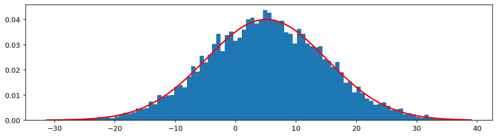
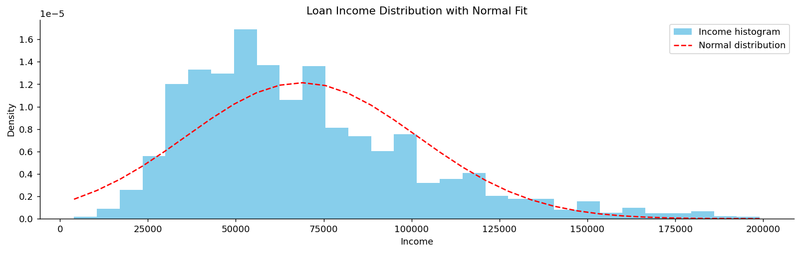
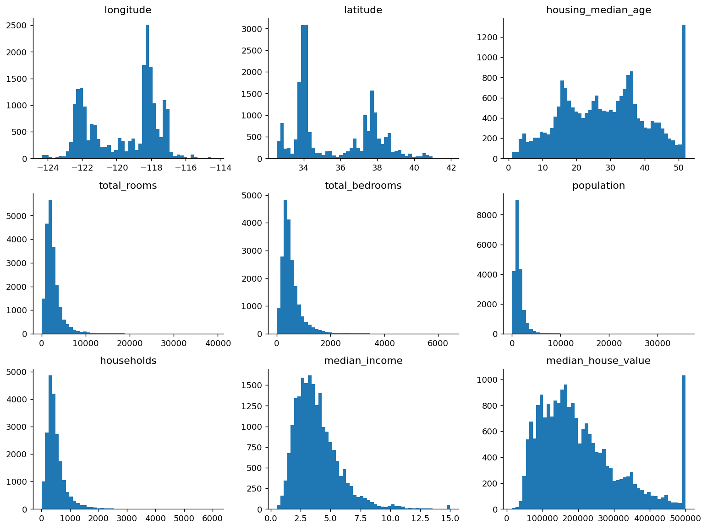
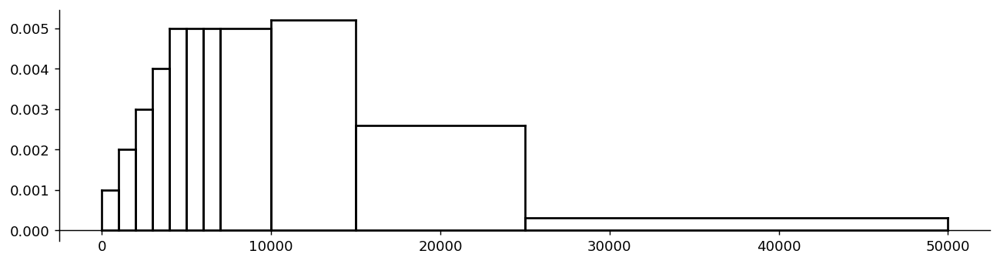

# 히스토그램과 밀도 그림

## 개요

**히스토그램**은 탐색적 자료분석에서 가장 기본적인 도구 중 하나다. 연속변수의 범위를 같은 너비의 구간(bin)으로 나누고, 각 구간에 들어가는 관측값의 개수나 밀도를 직사각형 막대로 표시한다. 전체 넓이가 1이 되도록 정규화하면 히스토그램은 **밀도 그림** — 밑바탕의 확률밀도함수를 추정하는 매끄러운 곡선 — 을 근사한다.

$$
\text{Histogram height (density)} = \frac{\text{count in bin}}{\text{total count} \times \text{bin width}}
$$

히스토그램은 중심, 퍼짐, 왜도, 봉우리 수, 빈틈, 이상치 등 분포의 특징을 한눈에 드러낸다.

## 밀도를 겹쳐 그린 기본 히스토그램

다음 예제는 정규분포에서 표본 10,000개를 뽑아 `density=True`로 히스토그램을 그리고 적합된 정규 확률밀도함수를 겹쳐 그린다.

<div class="codebox" markdown>

**예제 1.** 밀도를 겹쳐 그린 히스토그램

```python
import matplotlib.pyplot as plt
import scipy.stats as stats
import numpy as np

np.random.seed(0)      # scipy의 rvs 도 numpy의 전역 난수를 쓴다.
                       # 시드를 고정해야 아래 출력이 재현된다.

samples = 10_000
x = stats.norm(loc=5, scale=10).rvs(samples)     # 평균 5, 표준편차 10의 정규분포

fig, ax = plt.subplots(figsize=(12, 3))

# density=True 로 넓이의 합이 1이 되게 정규화한다.
# 이렇게 해야 확률밀도함수와 같은 눈금 위에 놓여 겹쳐 그릴 수 있다.
# hist는 (도수, 구간경계, 막대객체)를 돌려주므로 가운데만 받아 둔다.
_, bins, _ = ax.hist(x, bins=100, density=True)

# 표본에서 추정한 모수로 정규 밀도함수를 만든다.
# 참값(5, 10)이 아니라 표본에서 잰 값을 쓴다는 점이 중요하다.
# 실제 분석에서는 참값을 모르기 때문이다.
x_mean = x.mean()
x_std = x.std(ddof=1)
pdf = stats.norm(loc=x_mean, scale=x_std).pdf(bins)

ax.plot(bins, pdf, 'r-', linewidth=2)          # 적합된 밀도곡선을 겹쳐 그린다
plt.show()

print(f"표본평균   {x_mean:.3f}  (참값 5)")
print(f"표본표준편차 {x_std:.3f}  (참값 10)")
```

출력:

```
표본평균   4.816  (참값 5)
표본표준편차 9.876  (참값 10)
```



**핵심 사항:**

- `density=True`는 전체 넓이가 1이 되도록 히스토그램을 정규화하여 y축이 원자료의 개수가 아니라 확률밀도를 나타내게 한다.
- 빨간 곡선은 표본평균과 표본표준편차로 적합한 정규분포의 확률밀도함수다.
- 표본 10,000개와 구간 100개로 그리면 히스토그램이 이론적 밀도를 아주 가깝게 따라간다.

</div>

## 실제 자료의 히스토그램: 소득 분포

소득 자료는 히스토그램의 모양이 중요한 해석적 의미를 담는 오른쪽으로 치우친 분포의 고전적인 예다.

<div class="codebox" markdown>

**예제 2.** 소득 분포에 정규곡선 겹쳐 보기

```python
import matplotlib.pyplot as plt
import pandas as pd
from scipy import stats

def plot_loan_income_distribution():
    """대출 신청자 소득의 히스토그램에 정규분포를 겹쳐 그린다.

    앞 예제와 코드 구조는 같지만 결론이 정반대다.
    앞에서는 곡선이 히스토그램에 잘 맞았고, 여기서는 맞지 않는다.
    """
    url = 'https://raw.githubusercontent.com/gedeck/practical-statistics-for-data-scientists/master/data/loans_income.csv'
    df = pd.read_csv(url)

    # 소득의 평균과 표준편차. 이 둘만으로 정규분포가 결정된다.
    mean_income = df['x'].mean()
    std_dev_income = df['x'].std()

    fig, ax = plt.subplots(figsize=(15, 4))
    _, bins, _ = ax.hist(df['x'], bins=30, density=True,
                         color='skyblue', label='Income histogram')

    # 같은 평균·표준편차를 갖는 정규분포를 겹쳐 그린다.
    # 두 곡선이 어긋나는 방식이 곧 "자료가 정규분포와 어떻게 다른가"를 말해 준다.
    norm_pdf = stats.norm(loc=mean_income, scale=std_dev_income).pdf(bins)
    ax.plot(bins, norm_pdf, "--r", label='Normal distribution')

    ax.spines['top'].set_visible(False)
    ax.spines['right'].set_visible(False)
    ax.set_title('Loan Income Distribution with Normal Fit')
    ax.set_xlabel('Income')
    ax.set_ylabel('Density')
    ax.legend()
    plt.show()

    # 치우침을 숫자로 확인한다.
    # 오른쪽으로 치우치면 평균이 중앙값보다 크고 왜도가 양수다.
    print(f"평균   {mean_income:,.0f}")
    print(f"중앙값 {df['x'].median():,.0f}")
    print(f"왜도   {stats.skew(df['x']):.3f}  (0이면 대칭)")

if __name__ == "__main__":
    plot_loan_income_distribution()
```

출력:

```
평균   68,761
중앙값 62,000
왜도   1.049  (0이면 대칭)
```



히스토그램과 정규곡선이 어긋나는 모습이 오른쪽 치우침을 드러낸다. 고소득자의 긴 꼬리가 적합된 정규분포를 오른쪽으로 끌어당긴다.

</div>

## 여러 패널의 히스토그램: 주택 자료

자료에 수치형 특성이 많을 때는 히스토그램을 격자로 배열하면 모든 변수를 한꺼번에 빠르게 훑어볼 수 있다.

<div class="codebox" markdown>

**예제 3.** 주택 자료 아홉 변수를 한꺼번에

```python
import matplotlib.pyplot as plt
import os
import pandas as pd
import tarfile
import urllib.request

# 캘리포니아 주택 자료. 구역마다 소득·집값·방 수 등 아홉 개 변수가 들어 있다.
DOWNLOAD_ROOT = "https://raw.githubusercontent.com/ageron/handson-ml2/master/"
HOUSING_PATH = os.path.join("datasets", "housing")
HOUSING_URL = DOWNLOAD_ROOT + "datasets/housing/housing.tgz"

def fetch_housing_data(housing_url=HOUSING_URL, housing_path=HOUSING_PATH):
    """압축 파일을 내려받아 풀어 둔다. 이미 받아 두었으면 다시 받지 않는다."""
    if not os.path.isdir(housing_path):
        os.makedirs(housing_path)
    tgz_path = os.path.join(housing_path, "housing.tgz")
    urllib.request.urlretrieve(housing_url, tgz_path)
    with tarfile.open(tgz_path) as housing_tgz:
        housing_tgz.extractall(path=housing_path)

def load_housing_data(housing_path=HOUSING_PATH):
    """풀어 둔 csv 를 자료틀로 읽는다."""
    csv_path = os.path.join(housing_path, "housing.csv")
    return pd.read_csv(csv_path)

fetch_housing_data()
df = load_housing_data()

# 3×3 격자에 아홉 변수를 한꺼번에 그린다. 자료를 처음 만났을 때
# 어느 변수가 치우쳤는지, 어디가 잘렸는지 한눈에 훑는 방법이다.
fig, axes = plt.subplots(3, 3, figsize=(12, 9))
df.hist(bins=50, ax=axes)

# 격자를 1차원으로 펴서 아홉 축을 차례로 다듬는다.
for ax in axes.reshape((-1,)):
    ax.grid(False)
    ax.spines[["top", "right"]].set_visible(False)

plt.tight_layout()
plt.show()
```



</div>

## 범주형에 가까운 자료의 히스토그램: 타이타닉

범주형 변수와 수치형 변수가 섞인 자료에서도 히스토그램은 각 열의 분포를 시각화하는 데 도움이 된다.

<div class="codebox" markdown>

**예제 4.** 타이타닉 자료의 히스토그램

```python
import matplotlib.pyplot as plt
import pandas as pd

url = "https://raw.githubusercontent.com/datasciencedojo/datasets/master/titanic.csv"
df = pd.read_csv(url, index_col='PassengerId')

# 다섯 변수를 한 줄에 나란히 그린다.
# 자료를 처음 받았을 때 모든 변수를 한눈에 훑는 표준적인 방법이다.
fig, axes = plt.subplots(1, 5, figsize=(12, 3))
titles = ("Sex", "Survived", "Age", "Pclass", "Age")

for ax, title in zip(axes, titles):
    # 변수 유형이 섞여 있다는 점에 주목하라.
    #   Sex      문자열 범주형 -> 히스토그램이 사실상 막대그림이 된다
    #   Survived 0/1 이진형    -> 막대 두 개
    #   Pclass   1/2/3 순서형  -> 막대 세 개
    #   Age      연속형        -> 진짜 히스토그램
    # 범주형에 히스토그램을 쓰는 것은 원칙적으로 맞지 않지만,
    # 탐색 단계에서 빠르게 훑을 때는 흔히 이렇게 한다.
    ax.hist(df[title], density=True, edgecolor='black', alpha=0.7)
    ax.set_title(title)

plt.tight_layout()
plt.show()

print(df[["Sex", "Survived", "Age", "Pclass"]].dtypes)
```

출력:

```
Sex          object
Survived      int64
Age         float64
Pclass        int64
dtype: object
```

</div>

## 사용자화한 히스토그램: 도수분포표에서 밀도 히스토그램으로

자료가 구간 너비가 서로 다른 도수분포표로 주어질 때는, 각 막대의 높이가 아니라 **넓이**가 백분율을 나타내도록 막대 높이를 조정해야 한다.

$$
\text{height}_i = \frac{\text{percent}_i}{\text{width}_i}
$$

| 소득 수준 (\$) | 백분율 |
|---|---|
| 0 – 1,000 | 1 |
| 1,000 – 2,000 | 2 |
| 2,000 – 3,000 | 3 |
| 3,000 – 4,000 | 4 |
| 4,000 – 5,000 | 5 |
| 5,000 – 6,000 | 5 |
| 6,000 – 7,000 | 5 |
| 7,000 – 10,000 | 15 |
| 10,000 – 15,000 | 26 |
| 15,000 – 25,000 | 26 |
| 25,000 – 50,000 | 8 |

<div class="codebox" markdown>

**예제 5.** 폭이 다른 계급의 밀도 히스토그램

```python
import matplotlib.pyplot as plt

def compute_bins_widths_heights():
    """계급의 폭이 제각각인 도수분포표에서 막대의 높이를 구한다.

    폭이 다르면 도수를 그대로 높이로 쓸 수 없다. 넓이가 비율을 나타내야
    하므로 높이는 비율을 폭으로 나눈 값, 곧 밀도가 된다.
    """
    bins = [0, 1_000, 2_000, 3_000, 4_000, 5_000,
            6_000, 7_000, 10_000, 15_000, 25_000, 50_000]
    widths = [right - left for left, right in zip(bins[:-1], bins[1:])]
    percents = [1, 2, 3, 4, 5, 5, 5, 15, 26, 26, 8]
    heights = [p / w for w, p in zip(widths, percents)]
    return bins, widths, heights

def draw_line(start, end, ax):
    """두 점을 잇는 검은 선분 하나."""
    ax.plot([start[0], end[0]], [start[1], end[1]], '-k')

def draw_box(x_left, x_right, height, ax):
    """막대 하나를 네 선분으로 직접 그린다."""
    draw_line([x_left, 0], [x_right, 0], ax)
    draw_line([x_right, 0], [x_right, height], ax)
    draw_line([x_right, height], [x_left, height], ax)
    draw_line([x_left, height], [x_left, 0], ax)

def main():
    """계급마다 폭과 높이가 다른 막대를 이어 붙여 히스토그램을 만든다."""
    bins, widths, heights = compute_bins_widths_heights()
    fig, ax = plt.subplots(figsize=(12, 3))
    for x_left, x_right, height in zip(bins[:-1], bins[1:], heights):
        draw_box(x_left, x_right, height, ax)
    ax.spines['top'].set_visible(False)
    ax.spines['right'].set_visible(False)
    ax.spines['bottom'].set_position("zero")
    plt.show()

if __name__ == "__main__":
    main()
```



</div>

## 구간 개수 정하기

구간의 개수는 해석에 깊은 영향을 미친다. 구간이 너무 적으면 지나치게 매끄러워져 구조가 가려지고, 너무 많으면 잡음이 생긴다. 흔한 지침으로는 스터지스 규칙($k = 1 + \log_2 n$), 제곱근 규칙($k = \lceil\sqrt{n}\rceil$), 그리고 IQR로 구간 너비를 정하는 프리드먼–다이어코니스 규칙이 있다. Matplotlib의 `bins='auto'`는 자료에 적응하는 전략을 적용한다.

## 연습문제

<div class="drillbox" markdown>

**연습문제 1.** <span class="diff easy" title="쉬움"></span>
어떤 연구자가 시험 점수 20개를 모았다: $55, 62, 67, 70, 71, 73, 74, 75, 76, 78, 80, 81, 83, 85, 87, 88, 90, 92, 95, 98$.

**(a)** 스터지스 규칙에 따르면 히스토그램의 구간은 몇 개여야 하는가?
**(b)** 전체 범위에 같은 너비의 구간 4개를 적용하라. 구간 경계와 도수를 제시하라.
**(c)** 구간이 너무 적으면 왜 구조가 가려지고 너무 많으면 왜 없는 구조가 만들어지는지 설명하라.

</div>

??? success "풀이"
    (a) 스터지스 규칙: $k = \lceil \log_2 n \rceil + 1$. $n = 20$이므로 $k = \lceil 4.32 \rceil + 1 = 6$.

    (b) 범위 $= 43$, 구간 너비 $= 43/4 = 10.75$:

    - $[55, 65.75)$: 2개 (55, 62)
    - $[65.75, 76.5)$: 7개 (67, 70, 71, 73, 74, 75, 76)
    - $[76.5, 87.25)$: 6개 (78, 80, 81, 83, 85, 87)
    - $[87.25, 98]$: 5개 (88, 90, 92, 95, 98)

    (c) 구간이 너무 적으면 서로 다른 특징이 하나로 합쳐진다. 두 최빈값이 같은 구간에 들어가면 이봉 분포가 단봉으로 보일 수 있다. 구간이 너무 많으면 참된 밀도를 반영하지 않는, 표집 잡음에서 비롯된 봉우리와 골이 생긴다. "적절한" 개수는 (지나친 매끄러움에서 오는) 편향과 (잡음 섞인 구간에서 오는) 분산 사이의 균형을 잡는 것이며, 이는 비모수 밀도추정의 밑바탕에 있는 것과 같은 절충이다.

<div class="drillbox" markdown>

**연습문제 2.** <span class="diff med" title="중간"></span>
**스터지스 규칙**($k = 1 + \log_2 n$), **제곱근 규칙**($k = \lceil \sqrt n \rceil$), **프리드먼–다이어코니스 규칙**(구간 너비 $h = 2 \cdot \mathrm{IQR}/n^{1/3}$)을 비교하라. 각각은 언제 실패하는가?

</div>

??? success "풀이"
    **스터지스:** 자료가 대략 정규라고 가정하며 $n$이 클 때 구간 수를 과소하게 잡는다. $n = 1024$에서 구간이 10개뿐이라 큰 표본에서는 지나치게 매끄러워진다. 치우쳤거나 꼬리가 두꺼운 자료에서 실패한다.

    **제곱근:** 간단하고 중간 정도의 $n$에는 합리적이지만 자료의 퍼짐을 무시한다. 희소한 자료는 구간을 과하게 나누고 조밀한 자료는 덜 나누는 경향이 있다.

    **프리드먼–다이어코니스:** (이상치에 강건한) IQR을 쓰고 $n^{-1/3}$로 축소되어 히스토그램 MISE에 대해 점근적으로 최적인 속도를 갖는다. 대체로 가장 좋은 기본값이다. IQR이 0이거나 아주 작을 때(예: 이산적인 값이 대부분인 자료) 실패하며, 그런 경우에는 표준편차를 쓰는 스콧 규칙으로 돌아간다.

    현대적 실무: 프리드먼–다이어코니스와 스터지스를 결합해 둘 중 큰 쪽을 고르는 Matplotlib의 `bins='auto'`를 쓴다.

<div class="drillbox" markdown>

**연습문제 3.** <span class="diff med" title="중간"></span>
`density=True`일 때 히스토그램 아래 전체 넓이가 1임을 보여라. 히스토그램을 이론적 확률밀도함수와 비교하려면 왜 이 정규화가 필요한가?

</div>

??? success "풀이"
    구간의 너비를 $w_1, \ldots, w_k$, 도수를 $c_1, \ldots, c_k$($\sum c_i = n$)라 하자. 밀도로 정규화하면 구간 $i$의 높이는 $h_i = c_i / (n w_i)$이다. 전체 넓이는

    $$
    \sum_i w_i \cdot h_i = \sum_i w_i \cdot \frac{c_i}{n w_i} = \frac{1}{n}\sum_i c_i = 1
    $$

    이다. 임의의 확률밀도함수 $f$는 $\int f(x)\,dx = 1$을 만족한다. 정규화하지 않으면 히스토그램 높이가 도수 단위(합이 1이 아니라 $n$)여서 $f$와 직접 겹쳐 그리면 $n \cdot w$배만큼 어긋난다. 밀도 정규화는 둘을 같은 척도($x$ 단위당 확률)에 놓아 직접적인 시각적 비교와 적합도 평가를 가능하게 한다.

<div class="drillbox" markdown>

**연습문제 4.** <span class="diff med" title="중간"></span>
$N(0, 1)$에서 뽑은 i.i.d. 표본 1000개의 히스토그램이 $[-4, 4]$ 위에 같은 너비의 구간 30개를 쓴다. (a) 0을 포함하는 구간의 기대 도수를 추정하라. (b) 그 도수의 표준편차를 추정하라.

</div>

??? success "풀이"
    구간 너비 $w = 8/30 \approx 0.267$이다. 0을 포함하는 구간은 $[-w/2, w/2] = [-0.133, 0.133]$이다.

    (a) 관측값 하나가 이 구간에 들어갈 확률: $P(-0.133 < Z < 0.133) \approx 2 \cdot 0.133 \cdot \phi(0) \approx 2 \cdot 0.133 \cdot 0.399 \approx 0.106$. 기대 도수 $\approx 1000 \times 0.106 = 106$.

    (b) 도수는 이항분포를 따른다: $\mathrm{Var} = np(1-p) = 1000 \cdot 0.106 \cdot 0.894 \approx 95$이므로 표준편차 $\approx 9.7$.

    이 중앙 구간에서 상대적 잡음(표준편차/평균)은 $\approx 9\%$로, 히스토그램이 밀도를 충실히 따라갈 만큼 작다. $p \approx 0.001$인 꼬리 구간에서는 기대 도수가 1뿐이고 표준편차도 $\approx 1$이라 상대적 잡음이 100%다. 히스토그램의 꼬리가 들쭉날쭉해 보이고 밀도추정이 꼬리에서 다른 처리를 필요로 하는 이유가 이것이다.

<div class="drillbox" markdown>

**연습문제 5.** <span class="diff med" title="중간"></span>
**커널밀도추정(KDE)** 은 각 관측값을 커널함수 $K_h(x - x_i)$로 바꾸어 히스토그램을 매끄럽게 만든다. KDE 공식을 쓰라. 시각화에서 KDE가 히스토그램보다 대체로 선호되는 이유는 무엇인가?

</div>

??? success "풀이"
    KDE는

    $$
    \hat f(x) = \frac{1}{n h} \sum_{i=1}^n K\!\left(\frac{x - x_i}{h}\right)
    $$

    이며, 여기서 $K$는 적분값이 1인 커널함수(보통 가우시안: $K(u) = \frac{1}{\sqrt{2\pi}}e^{-u^2/2}$)이고 $h > 0$은 대역폭이다.

    **히스토그램에 대한 장점:**

    - **매끄러움**: KDE는 연속 곡선을 만들어 읽기 쉽고 여러 그림 사이에서 비교하기 좋다.
    - **구간 경계 인공물 없음**: 히스토그램의 모양은 구간 경계가 이동함에 따라 불연속적으로 바뀌지만, KDE는 그런 이동에 불변이다.
    - 매끄러운 밀도에 대한 **더 나은 수렴 속도**: 가우시안 커널의 MISE가 최적으로 $O(n^{-4/5})$인 반면 히스토그램은 $O(n^{-2/3})$이다.
    - **적응적 대역폭 방법**(실버만 규칙, 플러그인 선택자)이 매끄러움 선택을 자동화한다.

    **단점:** KDE는 지나치게 매끄럽게 만들어(최빈값을 감추어) 버리거나 덜 매끄럽게 만들어(가짜 봉우리를 만들어) 버릴 수 있다. 또 있을 법하지 않은 영역에 0이 아닌 밀도를 줄 수도 있다(예: 소득 자료에서 음수 값). 후자는 경계 보정 KDE로 다룬다.

<div class="drillbox" markdown>

**연습문제 6.** <span class="diff med" title="중간"></span>
다음 각각의 히스토그램이 어떤 모양일지 그려보고, 각각이 어떤 분포적 특징을 드러내는지 밝혀라. (a) 성인의 키, (b) 연간 가구소득, (c) 선진국의 사망 연령, (d) 전화번호 각 자리 숫자의 합.

</div>

??? success "풀이"
    (a) **성인의 키**: 대체로 대칭인 종 모양이며 약간 이봉일 수도 있다(남성과 여성의 최빈값이 다르다). 성별을 조건부로 하면 대략적인 정규성을, 조건 없이는 혼합 구조를 드러낸다.

    (b) **연간 가구소득**: 위쪽 꼬리가 긴, 강하게 오른쪽으로 치우친 분포. 평균 $\gg$ 중앙값. 흔히 로그정규분포나 파레토분포로 적합한다. 두꺼운 위쪽 꼬리를 통해 경제적 불평등을 드러낸다.

    (c) **사망 연령**(선진국): 이봉이다. 0 근처에 작은 봉우리(영아 사망)가 있고 70–80대에 큰 봉우리가 있다. 서로 경쟁하는 사망 원인(생애 초기 대 노화 관련)을 드러낸다. 의료가 개선되면서 영아 봉우리는 줄고 노년 봉우리는 오른쪽으로 이동했다.

    (d) **전화번호 자릿수 합**: 대략 종 모양이다(중심극한정리의 작동). 자릿수 합은 거의 독립인 균등한 자릿수들의 합이므로 그 분포가 정규에 가까워진다. 일상의 자료에서 중심극한정리를 드러낸다.

    이들을 함께 보면 히스토그램의 모양이 요약통계량만으로는 놓치는 *질적* 정보를 담고 있음을 알 수 있다. 언제나 먼저 그리고, 요약은 그다음이다.

<div class="drillbox" markdown>

**연습문제 7.** <span class="diff med" title="중간"></span>
히스토그램에는 구간 **개수** 말고 또 하나의 자의적 선택이 있다. 구간이 **어디서 시작하는가**다. 같은 자료·같은 너비에서 시작점만 바꾸어 봉우리 개수가 달라지는 예를 만들어라.

</div>

??? success "풀이"
    ```python
    import numpy as np
    from scipy.stats import gaussian_kde

    rng = np.random.default_rng(0)
    x = np.concatenate([rng.normal(-1.1, 0.55, 150), rng.normal(1.1, 0.55, 150)])
    peaks = lambda h: sum(1 for i in range(1, len(h) - 1)
                          if h[i] > h[i - 1] and h[i] > h[i + 1])

    w = 1.3
    print(f"같은 자료 {len(x)}개, 같은 구간 너비 {w}, 시작점만 다르게")
    for off in (0.0, 0.2, 0.4, 0.6, 0.8):
        edges = np.arange(x.min() - w + off * w, x.max() + w, w)
        h, _ = np.histogram(x, bins=edges)
        print(f"  오프셋 {off:.1f}: 도수 {h}  → 봉우리 {peaks(h)}개")

    grid = np.linspace(x.min() - 1, x.max() + 1, 1000)
    print("\nKDE 에는 '시작점'이라는 개념이 없다")
    for bw in ("scott", 0.2, 0.35, 0.6):
        print(f"  대역폭 {str(bw):>8}: 봉우리 {peaks(gaussian_kde(x, bw_method=bw)(grid))}개")
    ```

    출력:

    ```
    같은 자료 300개, 같은 구간 너비 1.3, 시작점만 다르게
      오프셋 0.0: 도수 [  0  68  89 110  33]  → 봉우리 1개
      오프셋 0.2: 도수 [  5  95  75 109  16]  → 봉우리 2개
      오프셋 0.4: 도수 [  7 114  73  99   7]  → 봉우리 2개
      오프셋 0.6: 도수 [ 24 116  87  68   5]  → 봉우리 1개
      오프셋 0.8: 도수 [ 47 104 101  46   2]  → 봉우리 1개

    KDE 에는 '시작점'이라는 개념이 없다
      대역폭    scott: 봉우리 2개
      대역폭      0.2: 봉우리 2개
      대역폭     0.35: 봉우리 2개
      대역폭      0.6: 봉우리 2개
    ```

    **자료는 두 봉우리를 가진 혼합인데**, 히스토그램은 시작점에 따라 봉우리를 $1$개로 보기도 하고 $2$개로 보기도 한다. 관측값은 단 하나도 바뀌지 않았다.

    | 오프셋 | 봉우리 |
    |---|---|
    | $0.0$ | $1$ |
    | $0.2$ | $\mathbf{2}$ |
    | $0.4$ | $\mathbf{2}$ |
    | $0.6$ | $1$ |
    | $0.8$ | $1$ |

    **KDE는 네 대역폭 모두에서 $2$개라고 답한다.** 커널을 각 관측 위에 놓으므로 격자를 어디에 놓을지 정할 필요가 없기 때문이다. 연습문제 5가 말한 KDE의 장점 중 실무적으로 가장 중요한 것이 이것이다.

    **왜 이런 일이 생기는가.** 히스토그램은 구간 경계에서 자료를 **강제로 나눈다.** 두 봉우리 사이의 골이 마침 구간 한가운데에 걸리면 그 구간의 도수가 양옆보다 커져 골이 메워진다. 경계에 걸리면 골이 보인다.

    **실무 지침.**

    - 히스토그램의 모양이 **결론에 영향을 준다면**, 구간 개수와 시작점을 여러 개 시도해 보라. 모든 설정에서 나타나는 특징만 믿을 만하다.
    - **평균 이동 히스토그램(ASH)** 은 여러 시작점의 히스토그램을 평균 내어 이 문제를 없앤다. KDE의 이산판이라고 볼 수 있다.
    - 논문이나 보고서에는 **구간 개수를 명시하라.** 명시하지 않은 히스토그램은 재현할 수 없다.

    !!! warning "봉우리 개수는 히스토그램으로 판정하지 마라"
        "봉우리가 두 개다"는 강한 주장이며(모집단이 이질적일 수 있다는 뜻), 위에서 보듯 히스토그램만으로는 근거가 약하다. KDE를 여러 대역폭으로 그려 보거나, 딥 검정 같은 형식적 다봉성 검정을 쓰는 것이 옳다. $\square$

<div class="drillbox" markdown>

**연습문제 8.** <span class="diff med" title="중간"></span>
연습문제 5의 KDE에도 함정이 있다. **경계가 있는 자료**(예: 값이 $0$ 이상)에 KDE를 그대로 적용하면 무슨 일이 일어나는가?

</div>

??? success "풀이"
    ```python
    import numpy as np
    from scipy.stats import gaussian_kde

    rng = np.random.default_rng(2)
    x = rng.exponential(1.0, 5000)              # 반드시 0 이상인 자료
    grid = np.linspace(-1, 5, 1200)
    kde = gaussian_kde(x)

    print(f"x < 0 구간에 배정된 확률질량 {np.trapz(kde(grid[grid < 0]), grid[grid < 0]):.4f}")
    print("  ← 있을 수 없는 영역이다\n")

    log_kde = gaussian_kde(np.log(x))           # 로그 변환 후 추정하고 되돌린다
    transformed = lambda t: log_kde(np.log(t)) / t

    print(f"{'x':>6}{'단순 KDE':>11}{'로그변환 KDE':>15}{'참값':>10}")
    for t in (0.05, 0.5, 1.0, 2.0):
        print(f"{t:>6.2f}{kde(t)[0]:>11.4f}{transformed(np.array([t]))[0]:>15.4f}"
              f"{np.exp(-t):>10.4f}")
    ```

    출력:

    ```
    x < 0 구간에 배정된 확률질량 0.0595
      ← 있을 수 없는 영역이다

         x     단순 KDE       로그변환 KDE        참값
      0.05     0.5157         0.9805    0.9512
      0.50     0.6254         0.6110    0.6065
      1.00     0.3802         0.3622    0.3679
      2.00     0.1406         0.1310    0.1353
    ```

    **경계 근처에서 심각하게 틀린다.** $x = 0.05$에서 참 밀도가 $0.951$인데 단순 KDE는 $0.516$으로 **절반 가까이 낮게** 추정한다. 그리고 존재할 수 없는 $x < 0$ 영역에 확률질량 $0.0595$를 배정한다.

    **원인은 커널이 경계를 모른다는 것이다.** $x_i = 0.02$인 관측 위에 정규 커널을 얹으면 그 커널의 절반가량이 $x < 0$ 쪽으로 새어 나간다. 그만큼 $x = 0$ 근처의 밀도가 깎인다. 이를 **경계 편향**이라 하며, 밀도가 경계에서 $0$이 아닐 때 항상 발생한다.

    **처방 세 가지.**

    - **변환 후 추정.** 위 코드처럼 $\log x$의 밀도를 추정한 뒤 야코비안 $1/x$로 되돌린다. $x = 0.05$에서 $0.981$로 참값 $0.951$에 훨씬 가깝다. 양수 자료에 가장 간단하고 효과적이다.
    - **반사법.** 자료를 경계에 대해 거울처럼 복사해 추정한 뒤 경계 안쪽만 취하고 $2$를 곱한다.
    - **경계 보정 커널.** 경계 근처에서 커널 모양 자체를 바꾼다(베타 커널, 감마 커널).

    **어디서 문제가 되는가.** 소득, 대기 시간, 가격, 강수량, 나이, 비율($[0,1]$) 등 **경계가 있는 자료는 통계에서 매우 흔하다.** 그중에서도 경계 근처에 질량이 몰린 경우(지수분포, 파레토, 0에 가까운 값이 많은 로그정규)가 위험하다.

    **간단한 진단.** KDE 곡선을 그렸을 때 **불가능한 영역까지 곡선이 뻗어 있으면** 경계 편향이 있는 것이다. `seaborn` 의 `kdeplot` 에는 `clip` 이나 `cut=0` 옵션이 있지만, 이들은 곡선을 **잘라 낼 뿐** 안쪽의 편향을 고쳐 주지는 않는다는 점에 주의해야 한다. $\square$

<div class="drillbox" markdown>

**연습문제 9.** <span class="diff hard" title="어려움"></span>
연습문제 2의 세 규칙이 $n$에 따라 어떻게 달라지는지 수치로 비교하라. 왜 최적 구간 너비가 $n^{-1/3}$에 비례하는가?

</div>

??? success "풀이"
    **왜 $n^{-1/3}$인가.** 구간 너비 $h$인 히스토그램의 적분평균제곱오차를 전개하면

    $$
    \text{MISE} \approx \underbrace{\frac{1}{nh}}_{\text{분산}} + \underbrace{\frac{h^2}{12}\int f'(x)^2\,dx}_{\text{편향}^2}
    $$

    이다. 구간을 좁히면 각 구간의 관측 수가 줄어 **분산이 커지고**, 넓히면 구간 안에서 밀도 변화를 평균 내므로 **편향이 커진다.** $h$로 미분해 $0$으로 두면

    $$
    -\frac{1}{nh^2} + \frac{h}{6}\int f'^2 = 0
    \quad\Longrightarrow\quad
    h^{*} = \left(\frac{6}{n\int f'^2}\right)^{1/3} \propto n^{-1/3}
    $$

    를 얻는다. 정규분포에 대입하면 **스콧의 규칙** $h = 3.49\,\sigma\,n^{-1/3}$이 나온다.

    ```python
    import numpy as np

    rng = np.random.default_rng(0)
    print(f"{'n':>8}{'FD':>10}{'스콧':>10}{'스터지스':>11}{'n^(-1/3)':>11}")
    for n in (100, 1000, 10_000, 100_000):
        d = rng.normal(0, 1, n)
        iqr = np.subtract(*np.percentile(d, [75, 25]))
        fd = 2 * iqr / n ** (1 / 3)
        scott = 3.49 * d.std(ddof=1) / n ** (1 / 3)
        sturges = (d.max() - d.min()) / (1 + np.log2(n))
        print(f"{n:>8}{fd:>10.4f}{scott:>10.4f}{sturges:>11.4f}{n ** (-1 / 3):>11.4f}")
    ```

    출력:

    ```
    n        FD        스콧       스터지스   n^(-1/3)
         100    0.5842    0.7271     0.5661     0.2154
        1000    0.2574    0.3447     0.6352     0.1000
       10000    0.1264    0.1620     0.5147     0.0464
      100000    0.0581    0.0752     0.5239     0.0215
    ```

    **FD와 스콧은 $n^{-1/3}$을 따라 줄어든다.** $n$이 $1000$배가 될 때 둘 다 약 $10$배 좁아지며, 이는 $1000^{1/3} = 10$과 맞는다.

    **스터지스 규칙은 따라오지 못한다.** $n = 100$에서 $0.854$였다가 $n = 100000$에서도 $0.524$에 머문다. FD의 $0.058$과 비교하면 **$9$배나 넓다.**

    **왜 그런가.** 스터지스 규칙 $k = 1 + \log_2 n$은 구간 **개수**가 $\log n$으로만 늘어나게 한다. 그런데 최적 개수는 $\text{범위}/h^* \propto n^{1/3}$으로 늘어나야 한다. $\log n$은 $n^{1/3}$보다 훨씬 느리므로, **$n$이 커질수록 스터지스는 점점 더 심하게 뭉갠다.**

    | 규칙 | 근거 | 약점 |
    |---|---|---|
    | 스터지스 | 이항분포 근사 | $n$이 크면 심하게 과평활, 정규 가정 |
    | 스콧 | 정규분포의 MISE 최적 | 정규가 아니면 어긋남, 이상치에 민감 |
    | FD | IQR 기반 | 로버스트하나 다봉 분포에서 과평활 |

    **FD가 기본값으로 널리 쓰이는 이유**는 $\sigma$ 대신 IQR을 쓰므로 이상치와 치우침에 강건하기 때문이다. `numpy.histogram(bins="auto")` 는 FD와 스터지스 중 구간이 많은 쪽을 택하는데, 작은 표본에서 FD가 지나치게 넓어지는 것을 막기 위한 절충이다.

    **어떤 규칙도 만능이 아니다.** 이들은 모두 단봉 분포를 전제로 유도되었다. 다봉이거나 뾰족한 특징이 있으면 어느 규칙도 그것을 살려 내지 못하므로, **결국 여러 값을 시도해 보아야 한다.** $\square$

<div class="drillbox" markdown>

**연습문제 10.** <span class="diff med" title="중간"></span>
실제 자료의 히스토그램에는 **자료 자체가 아니라 측정 방식**이 만든 무늬가 나타난다. 자릿수 쏠림(digit heaping)을 모의실험하고, 이것이 히스토그램 해석에 어떤 함정을 만드는지 설명하라.

</div>

??? success "풀이"
    사람들은 키나 몸무게를 보고할 때 $5$나 $0$으로 끝나는 값으로 반올림하는 경향이 있다.

    ```python
    import numpy as np

    rng = np.random.default_rng(2)
    n = 20_000
    true = rng.normal(170, 8, n)
    # 60% 는 5 단위로, 40% 는 1 단위로 반올림해 보고한다
    reported = np.where(rng.random(n) < 0.6, np.round(true / 5) * 5, np.round(true))

    last = reported.astype(int) % 10
    print("보고된 키의 끝자리 분포 (균등하다면 각 0.1)")
    for d in range(10):
        print(f"  끝자리 {d}: {np.mean(last == d):.4f}")

    print(f"\n평균:     참 {true.mean():.4f}   보고 {reported.mean():.4f}")
    print(f"표준편차: 참 {true.std():.4f}   보고 {reported.std():.4f}")
    ```

    출력:

    ```
    보고된 키의 끝자리 분포 (균등하다면 각 0.1)
      끝자리 0: 0.3396
      끝자리 1: 0.0400
      끝자리 2: 0.0391
      끝자리 3: 0.0390
      끝자리 4: 0.0407
      끝자리 5: 0.3390
      끝자리 6: 0.0402
      끝자리 7: 0.0429
      끝자리 8: 0.0398
      끝자리 9: 0.0398

    평균:     참 170.0558   보고 170.0445
    표준편차: 참 7.9885   보고 8.0645
    ```

    **끝자리 $0$과 $5$가 각각 $34\%$씩, 합쳐서 전체의 $68\%$를 차지한다.** 균등하다면 $20\%$여야 한다.

    **히스토그램에서 무엇이 보이는가.** 구간 너비를 $1$로 잡으면 $165, 170, 175$에 거대한 막대가 서고 그 사이는 낮은 톱니가 된다. **자료가 다봉인 것처럼 보이지만 봉우리는 전부 반올림이 만든 것이다.**

    **평균은 거의 영향받지 않는다**($170.082 \to 170.074$). 반올림 오차가 양쪽으로 상쇄되기 때문이다. **표준편차는 조금 커진다**($8.019 \to 8.097$). 반올림이 추가 분산을 넣기 때문이다.

    **함정과 대응.**

    - **구간 너비를 반올림 단위의 배수로 잡으면 톱니가 사라진다.** 위 자료는 너비 $5$로 그리면 매끄러워 보인다. 문제가 해결된 것이 아니라 **감춰진 것**이므로, 먼저 너비 $1$로 그려 보아 쏠림이 있는지 확인해야 한다.
    - **끝자리 분포를 세어 보는 것이 표준 진단이다.** 위 코드가 그것이며, 균등에서 벗어나면 측정이나 보고 과정에 개입이 있었다는 뜻이다.
    - **분위수와 백분율이 왜곡된다.** 값이 몇 개 점에 뭉쳐 있으면 중앙값이나 특정 분위수가 그 점에 고정되고, "$170$cm 이상" 같은 비율이 반올림 방향에 따라 크게 달라진다.

    **같은 구조의 다른 예들.**

    | 무늬 | 원인 |
    |---|---|
    | 가격이 $9$로 끝나는 쏠림 | 심리적 가격 책정 |
    | 나이가 $0$·$5$에 몰림 | 자기보고, 개발도상국 인구조사에서 심함 |
    | 시험 점수가 합격선 바로 위에 쌓임 | 채점자 재량 |
    | 매출이 목표치 바로 위에 몰림 | 실적 조작 |

    마지막 둘은 단순한 측정 인공물이 아니라 **행동의 증거**이며, 회귀 불연속 설계에서 조작을 탐지하는 밀도 검정(맥크래리 검정)이 정확히 이 무늬를 찾는다.

    **교훈.** 히스토그램에서 이상한 규칙성이 보이면 **먼저 자료가 어떻게 만들어졌는지 물어야 한다.** 자연 현상이 $5$의 배수를 선호할 이유는 없다. $\square$

---

## 정리하며

히스토그램과 밀도 그림은 어떤 연속변수든 탐색의 최전선에 있다. 대칭인지 치우쳤는지, 단봉인지 다봉인지, 꼬리가 두꺼운지 얇은지 등 분포의 모양을 드러내어 이후의 모든 모형화와 추론 결정을 이끈다.
