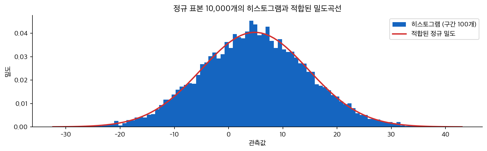
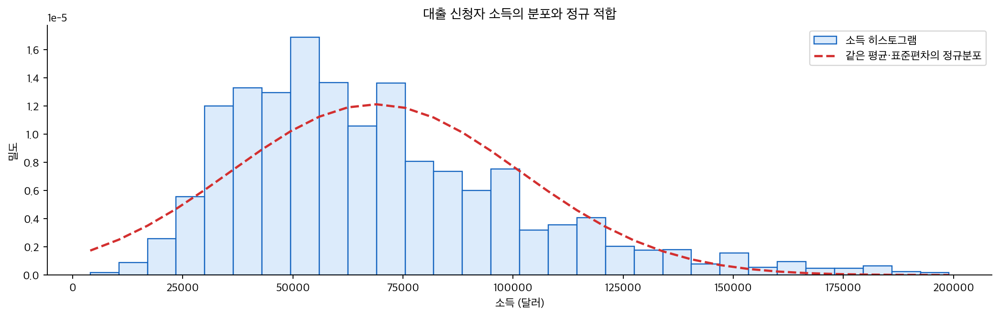
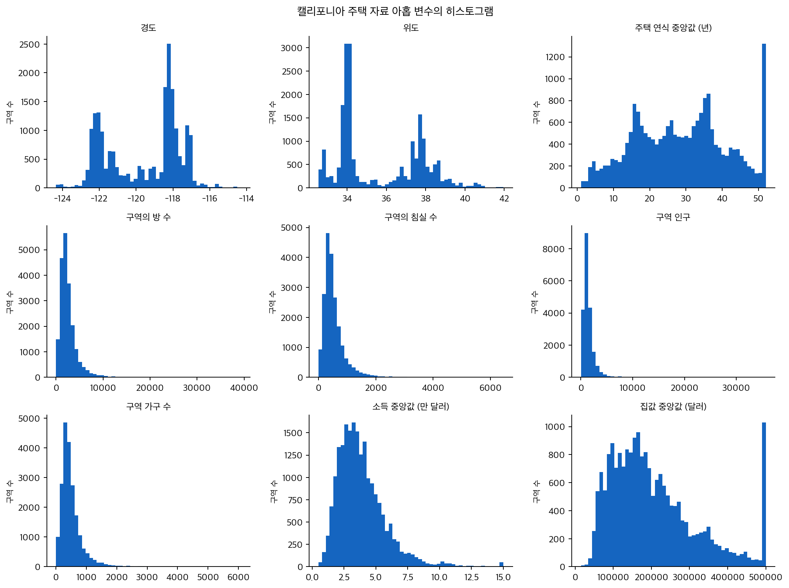
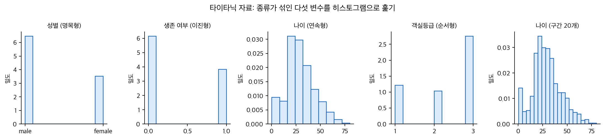
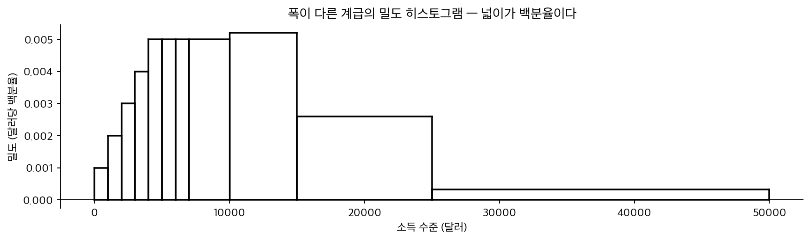

# 히스토그램과 밀도 그림

## 개요

**히스토그램**은 탐색적 자료분석에서 가장 기본적인 도구 중 하나다. 연속변수의 범위를 같은 너비의 구간(bin)으로 나누고, 각 구간에 들어가는 관측값의 개수나 밀도를 직사각형 막대로 표시한다. 전체 넓이가 1이 되도록 정규화하면 히스토그램은 **밀도 그림** — 밑바탕의 확률밀도함수를 추정하는 매끄러운 곡선 — 을 근사한다.

$$
\text{막대의 높이 (밀도)} = \frac{\text{구간 안의 도수}}{\text{전체 도수} \times \text{구간 너비}}
$$

히스토그램은 중심, 퍼짐, 왜도, 봉우리 수, 빈틈, 이상치 등 분포의 특징을 한눈에 드러낸다.

## 밀도를 겹쳐 그린 기본 히스토그램

다음 보기는 정규분포에서 표본 10,000개를 뽑아 `density=True`로 히스토그램을 그리고 적합된 정규 확률밀도함수를 겹쳐 그린다.

<div class="exbox" markdown>

**보기 1.** <span class="diff easy" title="쉬움"></span> `density=True` 로 그린 막대의 높이는 무엇을 추정하는가. $N(5, 10^2)$에서 $10{,}000$개를 뽑아 구간 $100$개로 그린다.

**(1)** 구간 $[a_j, b_j)$ 막대의 높이 $h_j$에 대해 $E[h_j]$와 $\operatorname{Var}(h_j)$를 구하시오. 봉우리가 있는 구간에서 $E[h_j]$가 $f$의 **봉우리 값보다 작은** 까닭을 보이고 그 크기를 어림하시오.

**(2)** 표본평균 $4.816$과 표본표준편차 $9.876$이 참값 $5$, $10$과 어긋나는가. 구간 $100$개는 적절한 선택인가.

</div>

??? success "풀이"

    **(1) 해석적으로.** 구간이 모두 같은 너비 $w$라 하자. 관측값 하나가 $j$번째 구간에 들어갈 확률은

    $$
    p_j = \int_{a_j}^{b_j} f(u)\,du
    $$

    이고 관측값이 독립이므로 그 구간의 도수는 $C_j \sim \mathrm{Bin}(n, p_j)$다. `density=True` 가 그리는 높이는 $h_j = C_j/(nw)$이므로

    $$
    E[h_j] = \frac{np_j}{nw} = \frac{p_j}{w} = \frac1w\int_{a_j}^{b_j} f(u)\,du,
    \qquad
    \operatorname{Var}(h_j) = \frac{p_j(1-p_j)}{n w^2}
    $$

    이다. **높이가 추정하는 것은 구간 가운데에서의 $f$ 값이 아니라 구간 위 $f$의 평균이다.** 여기서 넓이의 성질도 바로 나온다.

    $$
    \sum_j w\, h_j = \sum_j \frac{C_j}{n} = 1
    $$

    **합이 1인 것은 높이가 아니라 넓이다.**

    둘의 차이를 테일러 전개로 재 보자. 구간의 가운데를 $c_j$라 두고 $u = c_j + t$로 바꾸면

    $$
    \frac1w\int_{-w/2}^{w/2}\Big(f(c_j) + f'(c_j)t + \tfrac12 f''(c_j)t^2 + \cdots\Big)dt
    = f(c_j) + \frac{w^2}{24}f''(c_j) + O(w^4)
    $$

    이다. 홀수 차수 항은 대칭이라 사라진다. **봉우리에서는 $f$가 위로 오목해 $f'' < 0$이므로 $E[h_j] < f(c_j)$이고**, 그 모자람이 구간 너비의 제곱에 비례한다. 이것이 연습문제 9의 MISE에서 치우침 항을 만드는 바로 그 양이다.

    정규밀도의 이계도함수는

    $$
    f''(u) = f(u)\left(\frac{(u-\mu)^2}{\sigma^4} - \frac{1}{\sigma^2}\right)
    $$

    이므로 봉우리 근처($u \approx \mu = 5$, $\sigma = 10$)에서 $f'' \approx -f(\mu)/100 = -3.989\times10^{-4}$다. 구간 너비가 $w = 0.7542$이면 치우침은

    $$
    \frac{w^2}{24}f''(c) \approx \frac{0.5688}{24}\times(-3.989\times10^{-4}) = -9.45\times10^{-6}
    $$

    로 $f(\mu) = 0.03989$의 $0.024\%$에 지나지 않는다.

    흔들림 쪽은 사정이 다르다. 상대적 크기는

    $$
    \frac{\operatorname{sd}(h_j)}{E[h_j]} = \sqrt{\frac{1-p_j}{n p_j}}
    $$

    인데 $p_j \approx 0.0301$, $n = 10^4$이므로 $\sqrt{0.9699/301} = 0.0568$, 곧 $5.7\%$다. **치우침보다 $240$배 크다.**

    **(2) 수치적으로.**

    ```python
    import matplotlib
    matplotlib.use("Agg")
    import matplotlib.pyplot as plt
    import scipy.stats as stats
    import numpy as np

    # 그림에 한글을 쓰므로 한글 글꼴을 지정한다. 후보를 늘어놓으면 matplotlib 가
    # 설치된 첫 번째를 집으므로, 리눅스('NanumGothic')·맥('Apple SD Gothic Neo')·
    # 윈도우('Malgun Gothic')에서 코드를 고치지 않고 그대로 돌릴 수 있다.
    # 글꼴을 바꾸면 마이너스 기호가 깨지므로 unicode_minus 도 함께 꺼 준다.
    plt.rcParams["font.sans-serif"] = ["NanumGothic", "Apple SD Gothic Neo", "Malgun Gothic"]
    plt.rcParams["font.family"] = "sans-serif"
    plt.rcParams["axes.unicode_minus"] = False

    np.random.seed(0)      # scipy의 rvs 도 numpy의 전역 난수를 쓴다.
                           # 시드를 고정해야 아래 출력이 재현된다.

    samples = 10_000
    x = stats.norm(loc=5, scale=10).rvs(samples)     # 평균 5, 표준편차 10의 정규분포

    fig, ax = plt.subplots(figsize=(12, 3))

    # density=True 로 넓이의 합이 1이 되게 정규화한다.
    # 이렇게 해야 확률밀도함수와 같은 눈금 위에 놓여 겹쳐 그릴 수 있다.
    # hist는 (도수, 구간경계, 막대객체)를 돌려주므로 가운데만 받아 둔다.
    _, bins, _ = ax.hist(x, bins=100, density=True, color="#1565C0",
                         label="히스토그램 (구간 100개)")

    # 표본에서 추정한 모수로 정규 밀도함수를 만든다.
    # 참값(5, 10)이 아니라 표본에서 잰 값을 쓴다는 점이 중요하다.
    # 실제 분석에서는 참값을 모르기 때문이다.
    x_mean = x.mean()
    x_std = x.std(ddof=1)
    pdf = stats.norm(loc=x_mean, scale=x_std).pdf(bins)

    # 적합된 밀도곡선을 겹쳐 그린다.
    # 한글은 $...$ 바깥에 둔다. 수식 글꼴에는 한글 글리프가 없다.
    ax.plot(bins, pdf, "-", color="#D32F2F", linewidth=2,
            label="적합된 정규 밀도")
    ax.set_xlabel("관측값")
    ax.set_ylabel("밀도")
    ax.set_title("정규 표본 10,000개의 히스토그램과 적합된 밀도곡선")
    ax.legend()
    ax.spines[["top", "right"]].set_visible(False)
    fig.savefig("histograms_17.png", dpi=170, facecolor="white",
                bbox_inches="tight")

    print(f"표본평균   {x_mean:.3f}  (참값 5)")
    print(f"표본표준편차 {x_std:.3f}  (참값 10)")

    # --- 두 추정값이 참값과 어긋나는가. 표준오차로 잰다 ---
    se_mean = 10 / np.sqrt(samples)
    se_sd = 10 / np.sqrt(2 * samples)
    print(f"  평균:   SE = {se_mean:.4f},  z = {(x_mean - 5) / se_mean:+.3f}")
    print(f"  표준편차: SE = {se_sd:.4f},  z = {(x_std - 10) / se_sd:+.3f}")

    # --- 막대 넓이의 합이 1 인가 (높이의 합이 아니다) ---
    dens, edges = np.histogram(x, bins=100, density=True)
    cnt, _ = np.histogram(x, bins=100)
    w = edges[1] - edges[0]
    print(f"\n구간 너비 w = {w:.6f},  넓이의 합 = {(dens * w).sum():.12f},  높이의 합 = {dens.sum():.4f}")

    # --- 평균이 든 구간에서 높이의 기댓값과 흔들림 ---
    F = stats.norm(5, 10)
    j = int(np.searchsorted(edges, 5)) - 1
    p = F.cdf(edges[j + 1]) - F.cdf(edges[j])
    c = (edges[j] + edges[j + 1]) / 2
    print(f"평균이 든 구간 [{edges[j]:.4f}, {edges[j + 1]:.4f}),  가운데 c = {c:.4f}")
    print(f"  p = {p:.6f},  E[도수] = {samples * p:.2f},  sd(도수) = {np.sqrt(samples * p * (1 - p)):.2f},"
          f"  실제 도수 = {cnt[j]}")
    print(f"  E[높이] = p/w = {p / w:.8f},  실제 높이 = {dens[j]:.8f}")
    print(f"  f(c)    =       {F.pdf(c):.8f}")
    # 테일러 전개: (1/w)∫f = f(c) + (w^2/24) f''(c) + ...
    fpp = F.pdf(c) * ((c - 5) ** 2 / 10 ** 4 - 1 / 10 ** 2)
    print(f"  차이 E[높이] - f(c) = {p / w - F.pdf(c):.4e},  예측 (w^2/24)f''(c) = {w ** 2 / 24 * fpp:.4e}")
    print(f"  구간당 상대 잡음 = {np.sqrt((1 - p) / (samples * p)):.4f},"
          f"  상대 치우침 = {abs(p / w - F.pdf(c)) / F.pdf(c):.6f}")
    print(f"  가장 높은 막대 = {dens.max():.6f}  (참 봉우리 1/(10*sqrt(2pi)) = {1 / (10 * np.sqrt(2 * np.pi)):.6f})")

    # --- 구간 100 개는 적절한가 ---
    iqr = np.subtract(*np.percentile(x, [75, 25]))
    rng_ = x.max() - x.min()
    print(f"\n스콧 h = {3.49 * x_std * samples ** (-1 / 3):.4f} -> 구간 {rng_ / (3.49 * x_std * samples ** (-1 / 3)):.1f}개")
    print(f"FD   h = {2 * iqr * samples ** (-1 / 3):.4f} -> 구간 {rng_ / (2 * iqr * samples ** (-1 / 3)):.1f}개")
    print(f"스터지스 k = 1 + log2(n) = {1 + np.log2(samples):.1f}개")
    ```

    출력:

    ```
    표본평균   4.816  (참값 5)
    표본표준편차 9.876  (참값 10)
      평균:   SE = 0.1000,  z = -1.843
      표준편차: SE = 0.0707,  z = -1.753

    구간 너비 w = 0.754176,  넓이의 합 = 1.000000000000,  높이의 합 = 1.3260
    평균이 든 구간 [4.5536, 5.3078),  가운데 c = 4.9307
      p = 0.030079,  E[도수] = 300.79,  sd(도수) = 17.08,  실제 도수 = 330
      E[높이] = p/w = 0.03988382,  실제 높이 = 0.04375636
      f(c)    =       0.03989327
      차이 E[높이] - f(c) = -9.4519e-06,  예측 (w^2/24)f''(c) = -9.4539e-06
      구간당 상대 잡음 = 0.0568,  상대 치우침 = 0.000237
      가장 높은 막대 = 0.045347  (참 봉우리 1/(10*sqrt(2pi)) = 0.039894)

    스콧 h = 1.5998 -> 구간 47.1개
    FD   h = 1.2400 -> 구간 60.8개
    스터지스 k = 1 + log2(n) = 14.3개
    ```

    

    **(1)의 치우침 공식이 세 자리까지 맞는다.** 실제 차이 $-9.4519\times10^{-6}$과 예측 $(w^2/24)f''(c) = -9.4539\times10^{-6}$이다. 넓이의 합도 $1.000000000000$인 반면 **높이의 합은 $1.3260$으로 $1$이 아니다.** 높이를 더해서는 안 된다는 것이 이렇게 드러난다.

    흔들림도 예측대로다. 평균이 든 구간의 기대도수가 $300.79$, 표준편차가 $17.08$인데 실제로 $330$이 들어왔다($+1.71$ 표준편차). 상대 잡음 $5.68\%$가 상대 치우침 $0.024\%$를 완전히 압도한다. 가장 높은 막대가 $0.045347$로 참 봉우리 $0.039894$보다 $14\%$나 높이 솟은 것도 전부 잡음이다.

    **(2) 두 추정값은 어긋나지 않는다.** 표본평균 $4.816$은 참값 $5$에서 $1.84$ 표준오차, 표본표준편차 $9.876$은 $1.75$ 표준오차 떨어져 있다. $10{,}000$개를 뽑아도 평균의 표준오차가 $\sigma/\sqrt n = 0.1$이나 되므로 이 정도 차이는 흔하다.

    **구간 $100$개는 다소 많다.** 스콧이 $47$개, 프리드먼–다이어코니스가 $61$개를 권한다(스터지스는 $14$개로 크게 모자라며, 그 까닭은 연습문제 9에 있다). 구간을 $100$개로 쪼갰으니 치우침은 더 줄었지만 구간마다 $5.7\%$씩 흔들리게 되었고, 그 흔들림이 그림의 톱니로 보인다. **구간 수는 치우침과 분산 사이의 맞바꿈이고, 여기서는 분산 쪽으로 치우친 선택이다.**

    **그 밖에 확인할 것:**

    - `density=True`는 전체 넓이가 1이 되도록 히스토그램을 정규화하여 y축이 원자료의 개수가 아니라 확률밀도를 나타내게 한다.
    - 빨간 곡선은 표본평균과 표본표준편차로 적합한 정규분포의 확률밀도함수다.
    - 표본 10,000개와 구간 100개로 그리면 히스토그램이 이론적 밀도를 아주 가깝게 따라간다.

## 실제 자료의 히스토그램: 소득 분포

소득 자료는 히스토그램의 모양이 중요한 해석적 의미를 담는 오른쪽으로 치우친 분포의 고전적인 예다.

<div class="exbox" markdown>

**보기 2.** <span class="diff easy" title="쉬움"></span> 정규 적합이 **소득이 음수인 사람**을 몇 명이나 만들어 내는가. 대출 신청자 소득 $50{,}000$건에 같은 평균·표준편차의 정규곡선을 겹쳐 본다.

**(1)** 적합된 정규분포가 $x < 0$에 주는 확률을 구하고, 그것을 사람 수로 옮기시오. 자료의 실제 최솟값과 견주시오.

**(2)** 이 자료에 스터지스 규칙을 쓰면 구간이 몇 개인가. 프리드먼–다이어코니스가 권하는 수와 견주고 그 차이의 까닭을 말하시오.

</div>

??? success "풀이"

    **(1) 해석적으로.** 적합된 분포는 $N(\mu, \sigma^2)$이고 자료에서 $\mu = 68{,}760.5$, $\sigma = 32{,}872.0$이다. 소득이 음수일 확률은 표준화해서

    $$
    P(X < 0) = \Phi\!\left(\frac{0 - \mu}{\sigma}\right) = \Phi(-2.0918) = 0.018230
    $$

    이다. $50{,}000$명에 곱하면 **$911$명**이다. 그런데 자료의 실제 최솟값은 $4{,}000$달러이고 음수인 사람은 **한 명도 없다.**

    이것이 "정규 적합이 맞지 않는다"의 가장 날카로운 형태다. 적합이 자료의 모양을 조금 잘못 그린 정도가 아니라 **있을 수 없는 영역에 전체의 $1.8\%$를 배정한다.** 소득처럼 $0$ 아래로 내려갈 수 없는 변수에 좌우대칭인 분포를 씌운 결과이며, 치우침이 클수록 이 누출이 커진다.

    **(2) 해석적으로.** 스터지스 규칙은 구간 **개수**를 $k = 1 + \log_2 n$으로 정한다. $n = 50{,}000$이면

    $$
    k = 1 + \log_2 50000 = 1 + 15.61 = 16.6
    $$

    곧 $17$개쯤이다. 범위가 $195{,}000$달러이므로 구간 하나가 약 $11{,}700$달러를 덮는다.

    프리드먼–다이어코니스는 너비를 정한다. $\mathrm{IQR} = 40{,}000$, $n^{1/3} = 36.8$이므로

    $$
    h = \frac{2\,\mathrm{IQR}}{n^{1/3}} = \frac{80{,}000}{36.8} = 2{,}172
    $$

    로 구간이 약 $90$개다. **스터지스의 다섯 배가 넘는다.**

    까닭은 두 규칙이 $n$에 대해 자라는 속도가 다르다는 데 있다. 최적 구간 수는 $\text{범위}/h^{*} \propto n^{1/3}$으로 자라야 하는데(연습문제 9) 스터지스는 $\log_2 n$으로만 자란다. $n = 50{,}000$에서 $n^{1/3} = 36.8$인 반면 $\log_2 n = 15.6$이니 이미 두 배 넘게 벌어졌고, $n$이 더 커지면 격차가 계속 벌어진다. 게다가 스터지스는 자료가 **대칭에 가깝다**는 전제 위에 서 있어, 오른쪽 꼬리가 긴 이 자료에서는 꼬리 쪽 구조를 통째로 뭉갠다.

    **(3) 수치적으로.**

    ```python
    import matplotlib
    matplotlib.use("Agg")
    import matplotlib.pyplot as plt
    import numpy as np
    import pandas as pd
    from scipy import stats

    plt.rcParams["font.sans-serif"] = ["NanumGothic", "Apple SD Gothic Neo", "Malgun Gothic"]
    plt.rcParams["font.family"] = "sans-serif"
    plt.rcParams["axes.unicode_minus"] = False

    def plot_loan_income_distribution():
        """대출 신청자 소득의 히스토그램에 정규분포를 겹쳐 그린다.

        앞 보기와 코드 구조는 같지만 결론이 정반대다.
        앞에서는 곡선이 히스토그램에 잘 맞았고, 여기서는 맞지 않는다.
        """
        url = 'https://raw.githubusercontent.com/gedeck/practical-statistics-for-data-scientists/8a6d3bb6468e979c861d4b37215e1413702dfdfa/data/loans_income.csv'
        df = pd.read_csv(url)

        # 소득의 평균과 표준편차. 이 둘만으로 정규분포가 결정된다.
        mean_income = df['x'].mean()
        std_dev_income = df['x'].std()

        fig, ax = plt.subplots(figsize=(15, 4))
        _, bins, _ = ax.hist(df['x'], bins=30, density=True,
                             color='#DCEBFB', edgecolor='#1565C0',
                             label='소득 히스토그램')

        # 같은 평균·표준편차를 갖는 정규분포를 겹쳐 그린다.
        # 두 곡선이 어긋나는 방식이 곧 "자료가 정규분포와 어떻게 다른가"를 말해 준다.
        norm_pdf = stats.norm(loc=mean_income, scale=std_dev_income).pdf(bins)
        ax.plot(bins, norm_pdf, "--", color="#D32F2F", lw=2,
                label='같은 평균·표준편차의 정규분포')

        ax.spines['top'].set_visible(False)
        ax.spines['right'].set_visible(False)
        ax.set_title('대출 신청자 소득의 분포와 정규 적합')
        ax.set_xlabel('소득 (달러)')
        ax.set_ylabel('밀도')
        ax.legend()
        fig.savefig("histograms_46.png", dpi=170, facecolor="white",
                    bbox_inches="tight")

        # 치우침을 숫자로 확인한다.
        # 오른쪽으로 치우치면 평균이 중앙값보다 크고 왜도가 양수다.
        print(f"평균   {mean_income:,.0f}")
        print(f"중앙값 {df['x'].median():,.0f}")
        print(f"왜도   {stats.skew(df['x']):.3f}  (0이면 대칭)")

        # --- 적합된 정규분포가 음수 소득에 주는 확률 ---
        n = len(df)
        z0 = (0 - mean_income) / std_dev_income
        p_neg = stats.norm(loc=mean_income, scale=std_dev_income).cdf(0)
        print(f"\nn = {n:,},  표준편차 {std_dev_income:,.0f}")
        print(f"정규 적합이 소득 < 0 에 주는 확률 = Phi({z0:.4f}) = {p_neg:.6f}"
              f"  -> {n * p_neg:,.0f} 명")
        print(f"  자료의 실제 최솟값 = {df['x'].min():,}  (음수인 사람 {int((df['x'] < 0).sum())} 명)")

        # --- 피어슨의 둘째 왜도계수도 같은 방향을 가리킨다 ---
        pearson2 = 3 * (mean_income - df['x'].median()) / std_dev_income
        print(f"  피어슨 둘째 왜도계수 3(mean-median)/s = {pearson2:.4f}")

        # --- 구간 개수: 스터지스는 이 자료에서 얼마나 모자라는가 ---
        iqr = np.subtract(*np.percentile(df['x'], [75, 25]))
        span = df['x'].max() - df['x'].min()
        sturges = 1 + np.log2(n)
        fd_h = 2 * iqr * n ** (-1 / 3)
        scott_h = 3.49 * std_dev_income * n ** (-1 / 3)
        print(f"\nIQR = {iqr:,.0f},  범위 = {span:,.0f},  n^(1/3) = {n ** (1 / 3):.1f}")
        print(f"  스터지스 k = 1 + log2(n) = {sturges:.1f} 개  (너비 {span / sturges:,.0f})")
        print(f"  FD       h = {fd_h:,.0f}  ->  {span / fd_h:.1f} 개")
        print(f"  스콧     h = {scott_h:,.0f}  ->  {span / scott_h:.1f} 개")
        print(f"  numpy bins='auto' 가 고른 구간 수 = {len(np.histogram_bin_edges(df['x'], bins='auto')) - 1}")

    if __name__ == "__main__":
        plot_loan_income_distribution()
    ```

    출력:

    ```
    평균   68,761
    중앙값 62,000
    왜도   1.049  (0이면 대칭)

    n = 50,000,  표준편차 32,872
    정규 적합이 소득 < 0 에 주는 확률 = Phi(-2.0918) = 0.018230  -> 911 명
      자료의 실제 최솟값 = 4,000  (음수인 사람 0 명)
      피어슨 둘째 왜도계수 3(mean-median)/s = 0.6170

    IQR = 40,000,  범위 = 195,000,  n^(1/3) = 36.8
      스터지스 k = 1 + log2(n) = 16.6 개  (너비 11,740)
      FD       h = 2,172  ->  89.8 개
      스콧     h = 3,114  ->  62.6 개
      numpy bins='auto' 가 고른 구간 수 = 90
    ```

    

    (1)의 두 수가 그대로 확인된다. $\Phi(-2.0918) = 0.018230$이고 사람 수로는 $911$명인데, 자료의 최솟값이 $4{,}000$달러이고 음수인 사람은 $0$명이다. **적합된 모형이 자료가 결코 갈 수 없는 곳에 전체의 $1.8\%$를 보냈다.**

    치우침은 세 가지로 모두 같은 말을 한다. 평균 $68{,}761$이 중앙값 $62{,}000$보다 크고, 적률 왜도가 $1.049$, 피어슨 둘째 왜도계수가 $0.617$로 셋 다 양수다. 두 왜도계수의 크기가 다른 것은 **서로 다른 양을 재기 때문**이지 어느 하나가 틀려서가 아니다. 적률 왜도는 세제곱을 쓰므로 꼬리의 몇몇 큰 값에 민감하고, 피어슨 쪽은 평균과 중앙값의 간격만 보므로 둔하다.

    (2)의 예측도 맞는다. 스터지스가 $16.6$개, FD가 $89.8$개를 권해 **$5.4$배 차이**다. 스콧은 $62.6$개로 그 사이에 있는데, 표준편차 $32{,}872$가 긴 오른쪽 꼬리에 부풀려져 FD보다 넓은 구간을 내놓는다. **IQR을 쓰는 FD가 치우친 자료에서 더 믿을 만하다**는 말의 뜻이 이것이다. `numpy` 의 `bins='auto'` 는 FD와 스터지스 중 큰 쪽을 골라 $90$개를 준다.

    **위 그림이 쓴 구간 $30$개는 그 사이의 타협이다.** FD가 권하는 $90$개보다 적어 꼬리의 잔구조는 묻히지만, 정규곡선과의 어긋남을 보여 주는 데에는 모자라지 않는다.

    히스토그램과 정규곡선이 어긋나는 모습이 오른쪽 치우침을 드러낸다. 고소득자의 긴 꼬리가 적합된 정규분포를 오른쪽으로 끌어당긴다.

## 여러 패널의 히스토그램: 주택 자료

자료에 수치형 특성이 많을 때는 히스토그램을 격자로 배열하면 모든 변수를 한꺼번에 빠르게 훑어볼 수 있다.

<div class="exbox" markdown>

**보기 3.** <span class="diff easy" title="쉬움"></span> 아홉 개의 히스토그램을 한눈에 훑으면 무엇이 보이는가. 캘리포니아 주택 자료의 수치형 변수 아홉 개를 $3\times3$ 격자에 그린다.

**(1)** 그려 보고, 자료를 모형에 넣기 전에 반드시 알아야 할 **세 가지 이상**을 수치와 함께 읽어 내시오.

**(2)** 이 격자가 **보여 주지 못하는 것**은 무엇인가.

</div>

??? success "풀이"

    이 보기는 유도할 식이 없다. **그림에서 무엇을 읽어야 하는가**가 전부다.

    **(1) 그림이 말하는 것.**

    ```python
    import matplotlib
    matplotlib.use("Agg")
    import matplotlib.pyplot as plt
    import os
    import pandas as pd
    import tarfile
    import urllib.request

    plt.rcParams["font.sans-serif"] = ["NanumGothic", "Apple SD Gothic Neo", "Malgun Gothic"]
    plt.rcParams["font.family"] = "sans-serif"
    plt.rcParams["axes.unicode_minus"] = False

    # 캘리포니아 주택 자료. 구역마다 소득·집값·방 수 등 아홉 개 변수가 들어 있다.
    DOWNLOAD_ROOT = "https://raw.githubusercontent.com/ageron/handson-ml2/7b7e23e7267356f8355580877eff98c43cda1bd0/"
    HOUSING_PATH = os.path.join("datasets", "housing")
    HOUSING_URL = DOWNLOAD_ROOT + "datasets/housing/housing.tgz"

    def fetch_housing_data(housing_url=HOUSING_URL, housing_path=HOUSING_PATH):
        """압축 파일을 내려받아 풀어 둔다. 이미 받아 두었으면 다시 받지 않는다."""
        if not os.path.isdir(housing_path):
            os.makedirs(housing_path)
        tgz_path = os.path.join(housing_path, "housing.tgz")
        urllib.request.urlretrieve(housing_url, tgz_path)
        with tarfile.open(tgz_path) as housing_tgz:
            housing_tgz.extractall(path=housing_path)

    def load_housing_data(housing_path=HOUSING_PATH):
        """풀어 둔 csv 를 자료틀로 읽는다."""
        csv_path = os.path.join(housing_path, "housing.csv")
        return pd.read_csv(csv_path)

    fetch_housing_data()
    df = load_housing_data()

    # 3×3 격자에 아홉 변수를 한꺼번에 그린다. 자료를 처음 만났을 때
    # 어느 변수가 치우쳤는지, 어디가 잘렸는지 한눈에 훑는 방법이다.
    fig, axes = plt.subplots(3, 3, figsize=(12, 9))
    df.hist(bins=50, ax=axes, color="#1565C0")

    # 열 이름은 영어이므로 그림에 쓸 한글 이름을 따로 준비한다.
    KOREAN = {
        "longitude": "경도", "latitude": "위도",
        "housing_median_age": "주택 연식 중앙값 (년)",
        "total_rooms": "구역의 방 수", "total_bedrooms": "구역의 침실 수",
        "population": "구역 인구", "households": "구역 가구 수",
        "median_income": "소득 중앙값 (만 달러)",
        "median_house_value": "집값 중앙값 (달러)",
    }

    # 격자를 1차원으로 펴서 아홉 축을 차례로 다듬는다.
    for ax in axes.reshape((-1,)):
        ax.set_title(KOREAN.get(ax.get_title(), ax.get_title()), fontsize=10)
        ax.set_ylabel("구역 수", fontsize=9)
        ax.grid(False)
        ax.spines[["top", "right"]].set_visible(False)

    fig.suptitle("캘리포니아 주택 자료 아홉 변수의 히스토그램")
    fig.tight_layout()
    fig.savefig("histograms_83.png", dpi=170, facecolor="white",
                bbox_inches="tight")

    # --- 눈으로 읽은 것을 수로 확인한다 ---
    # 그림에서 오른쪽 끝에 솟은 막대는 "잘린 자료"의 흔적이다.
    # 몇 개가 거기 쌓여 있는지는 그림이 말해 주지 않으므로 직접 센다.
    from scipy import stats

    num = df.select_dtypes("number")
    print(f"구역 {len(df):,} 개,  수치형 변수 {num.shape[1]} 개")
    for c in num.columns:
        s = num[c]
        at_max = int((s == s.max()).sum())
        print(f"  {KOREAN[c]}")
        print(f"      결측 {int(s.isna().sum()):>4},  왜도 {stats.skew(s.dropna()):>7.3f},"
              f"  최댓값 {s.max():>12,.4f} 에 쌓인 구역 {at_max:>5,d} ({100 * at_max / len(s):5.2f}%)")
    ```

    출력:

    ```
    구역 20,640 개,  수치형 변수 9 개
      경도
          결측    0,  왜도  -0.298,  최댓값    -114.3100 에 쌓인 구역     1 ( 0.00%)
      위도
          결측    0,  왜도   0.466,  최댓값      41.9500 에 쌓인 구역     2 ( 0.01%)
      주택 연식 중앙값 (년)
          결측    0,  왜도   0.060,  최댓값      52.0000 에 쌓인 구역 1,273 ( 6.17%)
      구역의 방 수
          결측    0,  왜도   4.147,  최댓값  39,320.0000 에 쌓인 구역     1 ( 0.00%)
      구역의 침실 수
          결측  207,  왜도   3.459,  최댓값   6,445.0000 에 쌓인 구역     1 ( 0.00%)
      구역 인구
          결측    0,  왜도   4.935,  최댓값  35,682.0000 에 쌓인 구역     1 ( 0.00%)
      구역 가구 수
          결측    0,  왜도   3.410,  최댓값   6,082.0000 에 쌓인 구역     1 ( 0.00%)
      소득 중앙값 (만 달러)
          결측    0,  왜도   1.647,  최댓값      15.0001 에 쌓인 구역    49 ( 0.24%)
      집값 중앙값 (달러)
          결측    0,  왜도   0.978,  최댓값 500,001.0000 에 쌓인 구역   965 ( 4.68%)
    ```

    

    **읽어 낼 것 ①: 두 변수가 위에서 잘려 있다.** 집값 중앙값의 오른쪽 끝에 홀로 솟은 막대는 **$500{,}001$달러에 $965$개 구역($4.68\%$)이 쌓인 것**이다. 주택 연식도 $52$년에 $1{,}273$개 구역($6.17\%$)이 몰려 있다. 소득 중앙값도 $15.0001$에 $49$개가 걸려 있다. 자연 현상이 이렇게 한 값에 몰릴 리 없으니 **조사 과정에서 상한을 두고 그 위를 모두 상한값으로 기록한 것**이다. 집값을 예측하는 모형을 만든다면 $50$만 달러 위를 결코 맞힐 수 없다는 뜻이고, 그 구역들을 빼거나 따로 다루어야 한다.

    **읽어 낼 것 ②: 네 변수가 심하게 오른쪽으로 치우쳤다.** 구역 인구의 왜도가 $4.935$, 방 수가 $4.147$, 침실 수가 $3.459$, 가구 수가 $3.410$이다. 모두 "구역 전체의 합"이라 구역 크기에 따라 자릿수가 달라지는 양이며, 그림에서도 왼쪽 끝에 거의 전부가 몰리고 오른쪽으로 긴 꼬리가 뻗는다. 로그를 취하거나 가구 수로 나눈 비율(가구당 방 수 등)로 바꾸는 것이 보통의 처방이다.

    **읽어 낼 것 ③: 침실 수에 결측이 $207$개 있다.** $1.00\%$다. **히스토그램은 이것을 조용히 빼고 그린다.** 그림만 보아서는 침실 수 칸이 다른 칸보다 $207$개 적은 자료로 그려졌다는 사실을 알 수 없다.

    **읽어 낼 것 ④: 경도와 위도가 이봉이다.** 경도는 $-122$ 근처와 $-118$ 근처에, 위도는 $34$ 근처와 $37.8$ 근처에 봉우리가 있다. 샌프란시스코만과 로스앤젤레스 두 대도시권이다. 두 변수의 왜도가 각각 $-0.298$, $0.466$로 $0$에 가깝지만 **왜도가 작다는 것이 종 모양이라는 뜻은 아니다.**

    **읽어 낼 것 ⑤: 소득의 단위가 수상하다.** 가로축이 $0.5$에서 $15$까지다. 달러가 아니라 **만 달러 단위로 눈금을 바꾼 값**이며, 이런 것은 그림만 보아서는 알 수 없고 자료 설명서를 읽어야 안다.

    **(2) 이 격자가 보여 주지 못하는 것.**

    - **변수 사이의 관계.** 아홉 개를 따로따로 그렸으므로 소득이 높은 구역의 집값이 높은지, 방이 많은 구역이 사람도 많은지는 전혀 알 수 없다. 산점도 행렬이나 상관행렬이 필요하다.
    - **공간 구조.** 경도와 위도를 따로 그리면 "두 봉우리"까지는 보이지만 **지도 위의 모양**은 사라진다. 두 변수를 함께 산점도로 찍어야 캘리포니아의 윤곽이 나타난다.
    - **꼬리 안의 구조.** 치우친 네 변수는 거의 모든 질량이 첫 몇 구간에 들어가 버려 **구간 $50$개 가운데 쓸모 있는 것이 대여섯 개뿐**이다. 로그 눈금으로 다시 그려야 꼬리가 보인다.
    - **결측의 유형.** 침실 수의 결측 $207$개가 무작위로 흩어진 것인지 특정 지역에 몰린 것인지는 히스토그램이 답할 수 없다.

## 범주형에 가까운 자료의 히스토그램: 타이타닉

범주형 변수와 수치형 변수가 섞인 자료에서도 히스토그램은 각 열의 분포를 시각화하는 데 도움이 된다.

<div class="exbox" markdown>

**보기 4.** <span class="diff easy" title="쉬움"></span> 종류가 섞인 다섯 변수를 히스토그램으로 훑는다. 타이타닉 승객 $891$명의 성별·생존 여부·나이·객실등급을 한 줄에 나란히 그린다.

**(1)** 이진 변수 `Survived` 칸의 세로축 높이를 식으로 쓰고, 구간을 $10$개에서 $20$개로 바꾸면 그 높이가 어떻게 되는지 **미리** 말하시오. 그 수에 정보가 담겨 있는가.

**(2)** 나이 칸에는 몇 명이 그려졌는가. 구간을 $10$개로 할 때와 $20$개로 할 때 봉우리가 몇 개로 세어지는가.

</div>

??? success "풀이"

    **(1) 해석적으로.** `Survived` 는 $0$과 $1$만 갖는다. `hist` 는 자료의 범위 $[0, 1]$을 $k$등분하므로 구간 너비가 $w = 1/k$이고, **$0$들은 전부 첫 구간에, $1$들은 전부 마지막 구간에** 들어간다. 가운데 $k-2$개 구간은 비어 있다. `density=True` 의 높이는 비율을 너비로 나눈 것이므로

    $$
    h_{\text{첫}} = \frac{\hat p_0}{w} = k\,\hat p_0,
    \qquad
    h_{\text{끝}} = \frac{\hat p_1}{w} = k\,\hat p_1
    $$

    이다. $\hat p_0 = 549/891 = 0.616162$, $\hat p_1 = 0.383838$이므로

    $$
    k = 10: \quad 6.1616, \ 3.8384
    \qquad\Longrightarrow\qquad
    k = 20: \quad 12.3232, \ 7.6768
    $$

    **구간 수를 두 배로 하면 높이도 정확히 두 배가 된다.** 세로축의 수는 자료가 아니라 **내가 고른 $k$**를 반영한다. 뜻이 있는 것은 비율 $0.6162$와 $0.3838$뿐이고, 그 둘은 막대그림으로 그리는 편이 옳다.

    **(2) 수치적으로.**

    ```python
    import matplotlib
    matplotlib.use("Agg")
    import matplotlib.pyplot as plt
    import numpy as np
    import pandas as pd

    plt.rcParams["font.sans-serif"] = ["NanumGothic", "Apple SD Gothic Neo", "Malgun Gothic"]
    plt.rcParams["font.family"] = "sans-serif"
    plt.rcParams["axes.unicode_minus"] = False

    url = "https://raw.githubusercontent.com/datasciencedojo/datasets/f0ccab6a7ceafdff780052166fb6fab3311398eb/titanic.csv"
    df = pd.read_csv(url, index_col='PassengerId')

    # 다섯 변수를 한 줄에 나란히 그린다.
    # 자료를 처음 받았을 때 모든 변수를 한눈에 훑는 표준적인 방법이다.
    fig, axes = plt.subplots(1, 5, figsize=(13, 3))
    columns = ("Sex", "Survived", "Age", "Pclass", "Age")
    titles = ("성별 (명목형)", "생존 여부 (이진형)", "나이 (연속형)",
              "객실등급 (순서형)", "나이 (구간 20개)")
    bins = (10, 10, 10, 10, 20)

    for ax, col, title, b in zip(axes, columns, titles, bins):
        # 변수 유형이 섞여 있다는 점에 주목하라.
        #   Sex      문자열 범주형 -> 히스토그램이 사실상 막대그림이 된다
        #   Survived 0/1 이진형    -> 막대 두 개
        #   Pclass   1/2/3 순서형  -> 막대 세 개
        #   Age      연속형        -> 진짜 히스토그램
        # 범주형에 히스토그램을 쓰는 것은 원칙적으로 맞지 않지만,
        # 탐색 단계에서 빠르게 훑을 때는 흔히 이렇게 한다.
        ax.hist(df[col], bins=b, density=True, color="#DCEBFB",
                edgecolor="#1565C0")
        ax.set_title(title, fontsize=10)
        ax.set_ylabel("밀도", fontsize=9)
        ax.spines[["top", "right"]].set_visible(False)

    fig.suptitle("타이타닉 자료: 종류가 섞인 다섯 변수를 히스토그램으로 훑기")
    fig.tight_layout()
    fig.savefig("histograms_115.png", dpi=170, facecolor="white",
                bbox_inches="tight")

    print(df[["Sex", "Survived", "Age", "Pclass"]].dtypes)

    # --- 이진 변수에 density=True 를 쓰면 높이가 무엇이 되는가 ---
    # 0/1 자료를 [0,1] 위에서 k 등분하면 0 은 첫 구간, 1 은 마지막 구간에 모인다.
    # 그 높이는 비율/너비 = k x 비율이므로 k 를 바꾸면 그대로 따라 변한다.
    p0 = (df.Survived == 0).mean()
    p1 = (df.Survived == 1).mean()
    print(f"\n사망 비율 {p0:.6f},  생존 비율 {p1:.6f}")
    for k in (10, 20):
        h, e = np.histogram(df.Survived, bins=k, density=True)
        nz = [round(v, 4) for v in h if v > 0]
        print(f"  구간 {k:2d}개 (너비 {e[1] - e[0]:.4f}): 0 이 아닌 높이 {nz}"
              f"   예측 {k * p0:.4f}, {k * p1:.4f}")

    # --- 나이: 몇 명이 그림에서 빠졌는가 ---
    age = df.Age
    print(f"\n전체 {len(df)} 명 중 나이 결측 {int(age.isna().sum())} 명"
          f" ({100 * age.isna().mean():.2f}%) — 히스토그램은 말없이 빼고 그린다")
    a = age.dropna()
    print(f"  그려진 자료 {len(a)} 명,  범위 [{a.min()}, {a.max()}],  "
          f"평균 {a.mean():.4f},  중앙값 {a.median()}")

    # --- 구간 수를 바꾸면 봉우리가 몇 개로 세어지는가 ---
    def count_modes(x, k):
        """구간 k 개로 끊었을 때 지역 최대인 구간의 가운데 값을 돌려준다."""
        h, e = np.histogram(x, bins=k)
        mid = (e[:-1] + e[1:]) / 2
        out = []
        for i in range(k):
            left = h[i - 1] if i > 0 else -1
            right = h[i + 1] if i < k - 1 else -1
            if h[i] > left and h[i] > right:
                out.append(round(mid[i], 2))
        return out

    for k in (10, 20):
        peaks = count_modes(a, k)
        print(f"  구간 {k:2d}개: 봉우리 {len(peaks)} 개 — 나이 {peaks}")
    ```

    출력:

    ```
    Sex          object
    Survived      int64
    Age         float64
    Pclass        int64
    dtype: object

    사망 비율 0.616162,  생존 비율 0.383838
      구간 10개 (너비 0.1000): 0 이 아닌 높이 [6.1616, 3.8384]   예측 6.1616, 3.8384
      구간 20개 (너비 0.0500): 0 이 아닌 높이 [12.3232, 7.6768]   예측 12.3232, 7.6768

    전체 891 명 중 나이 결측 177 명 (19.87%) — 히스토그램은 말없이 빼고 그린다
      그려진 자료 714 명,  범위 [0.42, 80.0],  평균 29.6991,  중앙값 28.0
      구간 10개: 봉우리 2 개 — 나이 [4.4, 20.32]
      구간 20개: 봉우리 3 개 — 나이 [2.41, 22.3, 70.05]
    ```

    

    (1)의 예측이 네 수 모두 맞는다. 구간을 $10$개에서 $20$개로 늘리자 높이가 $6.1616 \to 12.3232$, $3.8384 \to 7.6768$로 **정확히 두 배**가 되었다. 세로축의 "밀도"라는 이름이 여기서는 아무것도 뜻하지 않는다.

    **맨 왼쪽 두 칸은 히스토그램이 아니라 막대그림이다.** `Sex`는 값이 두 개뿐이고 `Survived`도 0과 1뿐이라 "구간을 나눈다"는 개념이 성립하지 않는다. `Pclass`도 1·2·3 세 값뿐이다. **가로축의 거리가 뜻을 갖는 것은 `Age` 칸뿐**이며, 그래서 오른쪽 두 칸만이 진짜 분포의 모양(20대의 봉우리, 오른쪽으로 긴 꼬리)을 보여 준다.

    (2)의 첫째 답은 **$714$명**이다. $891$명 가운데 $177$명($19.87\%$)의 나이가 비어 있고 `hist` 는 그 사실을 알리지 않고 빼고 그린다. 그림만 보면 $891$명을 다 그린 줄 안다. 나이 결측이 생존과 무관하지 않다면([절단점 하나가 결론을 바꾼다](./titanic_age_cutoff.md)에서 다룬다) 이 그림은 **치우친 부분집합**을 보여 주고 있는 셈이다.

    둘째 답이 이 보기의 요점이다. **구간 $10$개에서는 봉우리가 $2$개, $20$개에서는 $3$개로 세어진다.** 자료는 그대로인데 세어지는 봉우리 수가 달라진다. $10$개로 끊으면 $4.4$세와 $20.3$세에 봉우리가 서고, $20$개로 끊으면 $2.4$세·$22.3$세·$70.1$세 셋이 된다. 마지막 $70.1$세는 노인이 몇 명 몰린 작은 혹으로, 구간이 넓을 때는 이웃에 흡수되어 보이지 않았다. **"이 분포는 몇 봉우리인가"는 히스토그램만으로는 답할 수 없는 물음**이며, 구간 수와 구간 시작점(연습문제 7)을 바꿔 가며 살아남는 봉우리만 믿어야 한다.

## 사용자화한 히스토그램: 도수분포표에서 밀도 히스토그램으로

자료가 구간 너비가 서로 다른 도수분포표로 주어질 때는, 각 막대의 높이가 아니라 **넓이**가 백분율을 나타내도록 막대 높이를 조정해야 한다.

$$
\text{높이}_i = \frac{\text{백분율}_i}{\text{폭}_i}
$$

| 소득 수준 (\$) | 백분율 |
|---|---|
| 0 – 1,000 | 1 |
| 1,000 – 2,000 | 2 |
| 2,000 – 3,000 | 3 |
| 3,000 – 4,000 | 4 |
| 4,000 – 5,000 | 5 |
| 5,000 – 6,000 | 5 |
| 6,000 – 7,000 | 5 |
| 7,000 – 10,000 | 15 |
| 10,000 – 15,000 | 26 |
| 15,000 – 25,000 | 26 |
| 25,000 – 50,000 | 8 |

<div class="exbox" markdown>

**보기 5.** <span class="diff easy" title="쉬움"></span> 백분율이 같은 두 계급의 막대가 두 배 차이로 그려진다. 위 도수분포표로 밀도 히스토그램을 그린다.

**(1)** 막대 높이의 식을 유도하고 열한 계급의 높이를 모두 구하시오. 넓이의 합은 얼마인가.

**(2)** $10{,}000$–$15{,}000$과 $15{,}000$–$25{,}000$은 둘 다 $26\%$인데 막대 높이가 왜 다른가. $4{,}000$–$5{,}000$($5\%$)과 $7{,}000$–$10{,}000$($15\%$)은 왜 같은가. 높이를 백분율로 그렸다면 그림이 어떻게 달라지는가.

</div>

??? success "풀이"

    **(1) 해석적으로.** 히스토그램이 지켜야 할 규칙은 하나다. **막대의 넓이가 그 계급의 비율이어야 한다.** 계급 $i$의 폭을 $w_i$, 백분율을 $P_i$, 높이를 $h_i$라 하면

    $$
    w_i h_i = P_i
    \qquad\Longrightarrow\qquad
    h_i = \frac{P_i}{w_i}
    $$

    이다. 높이의 단위는 "달러당 백분율"이 되고, 아래 표에서는 읽기 쉽도록 $1{,}000$달러당으로 적는다. 넓이의 합은

    $$
    \sum_i w_i h_i = \sum_i P_i = 100
    $$

    이다. 백분율로 적었으므로 $1$이 아니라 $100$이고, 비율로 적었다면 $1$이 된다. **어느 쪽이든 합이 되는 것은 높이가 아니라 넓이다.**

    **(2) 해석적으로.** $h_i = P_i/w_i$에 그대로 넣으면 된다.

    $$
    \frac{26}{5{,}000} = 0.0052,
    \qquad
    \frac{26}{10{,}000} = 0.0026
    $$

    로 정확히 절반이다. 백분율이 같아도 **뒤 계급이 두 배 넓으므로** 같은 넓이를 만들려면 높이가 절반이어야 한다. 반대로

    $$
    \frac{5}{1{,}000} = 0.005,
    \qquad
    \frac{15}{3{,}000} = 0.005
    $$

    는 백분율이 세 배인데 폭도 세 배라 높이가 같다. **폭이 다른 계급에서는 높이를 서로 견줄 수 없고, 견주어야 할 것은 넓이다.**

    높이를 백분율로 그렸다면 그림이 완전히 달라진다. 맨 끝 $25{,}000$–$50{,}000$ 계급은 $8\%$뿐인데 가로축의 절반을 차지하는 막대가 되고, $0$–$1{,}000$ 계급($1\%$)과 거의 같은 높이로 그려진다. 보는 사람은 "고소득자가 매우 많다"고 읽을 것이다. 올바른 밀도로 그리면 그 막대의 높이는 $0.32$로 **가장 낮다.**

    **(3) 수치적으로.**

    ```python
    import matplotlib
    matplotlib.use("Agg")
    import matplotlib.pyplot as plt

    plt.rcParams["font.sans-serif"] = ["NanumGothic", "Apple SD Gothic Neo", "Malgun Gothic"]
    plt.rcParams["font.family"] = "sans-serif"
    plt.rcParams["axes.unicode_minus"] = False

    def compute_bins_widths_heights():
        """계급의 폭이 제각각인 도수분포표에서 막대의 높이를 구한다.

        폭이 다르면 도수를 그대로 높이로 쓸 수 없다. 넓이가 비율을 나타내야
        하므로 높이는 비율을 폭으로 나눈 값, 곧 밀도가 된다.
        """
        bins = [0, 1_000, 2_000, 3_000, 4_000, 5_000,
                6_000, 7_000, 10_000, 15_000, 25_000, 50_000]
        widths = [right - left for left, right in zip(bins[:-1], bins[1:])]
        percents = [1, 2, 3, 4, 5, 5, 5, 15, 26, 26, 8]
        heights = [p / w for w, p in zip(widths, percents)]
        return bins, widths, heights

    def draw_line(start, end, ax):
        """두 점을 잇는 검은 선분 하나."""
        ax.plot([start[0], end[0]], [start[1], end[1]], '-k')

    def draw_box(x_left, x_right, height, ax):
        """막대 하나를 네 선분으로 직접 그린다."""
        draw_line([x_left, 0], [x_right, 0], ax)
        draw_line([x_right, 0], [x_right, height], ax)
        draw_line([x_right, height], [x_left, height], ax)
        draw_line([x_left, height], [x_left, 0], ax)

    def main():
        """계급마다 폭과 높이가 다른 막대를 이어 붙여 히스토그램을 만든다."""
        bins, widths, heights = compute_bins_widths_heights()
        fig, ax = plt.subplots(figsize=(12, 3))
        for x_left, x_right, height in zip(bins[:-1], bins[1:], heights):
            draw_box(x_left, x_right, height, ax)
        ax.spines['top'].set_visible(False)
        ax.spines['right'].set_visible(False)
        ax.spines['bottom'].set_position("zero")
        ax.set_xlabel("소득 수준 (달러)")
        ax.set_ylabel("밀도 (달러당 백분율)")
        ax.set_title("폭이 다른 계급의 밀도 히스토그램 — 넓이가 백분율이다")
        fig.savefig("histograms_164.png", dpi=170, facecolor="white",
                    bbox_inches="tight")

        # 폭·백분율·높이·넓이를 한 표로 적어 본다.
        # 넓이 열의 합이 100 이 되는지가 이 보기의 전부다.
        percents = [1, 2, 3, 4, 5, 5, 5, 15, 26, 26, 8]
        print(f"{'계급':>18}{'폭':>8}{'백분율':>7}{'높이(1000달러당 %)':>20}{'넓이':>7}")
        for lo, hi, w, p, h in zip(bins[:-1], bins[1:], widths, percents, heights):
            print(f"{lo:>7,}-{hi:<9,}{w:>8,}{p:>6}{1000 * h:>14.4f}{w * h:>12.1f}")
        print(f"{'합계':>18}{'':>8}{sum(percents):>6}{'':>14}"
              f"{sum(w * h for w, h in zip(widths, heights)):>12.1f}")
        print(f"\n가장 높은 막대 = {1000 * max(heights):.2f}  "
              f"({bins[heights.index(max(heights))]:,}"
              f"-{bins[heights.index(max(heights)) + 1]:,} 달러)")
        print(f"백분율이 가장 큰 계급 = {max(percents)}%  (두 곳)")

    if __name__ == "__main__":
        main()
    ```

    출력:

    ```
                    계급       폭    백분율       높이(1000달러당 %)     넓이
          0-1,000       1,000     1        1.0000         1.0
      1,000-2,000       1,000     2        2.0000         2.0
      2,000-3,000       1,000     3        3.0000         3.0
      3,000-4,000       1,000     4        4.0000         4.0
      4,000-5,000       1,000     5        5.0000         5.0
      5,000-6,000       1,000     5        5.0000         5.0
      6,000-7,000       1,000     5        5.0000         5.0
      7,000-10,000      3,000    15        5.0000        15.0
     10,000-15,000      5,000    26        5.2000        26.0
     15,000-25,000     10,000    26        2.6000        26.0
     25,000-50,000     25,000     8        0.3200         8.0
                    합계           100                     100.0

    가장 높은 막대 = 5.20  (10,000-15,000 달러)
    백분율이 가장 큰 계급 = 26%  (두 곳)
    ```

    

    표가 (1)과 (2)를 한꺼번에 확인해 준다. 넓이 열의 합이 정확히 $100.0$이고, $26\%$인 두 계급의 높이가 $5.20$과 $2.60$으로 **정확히 두 배** 차이이며, $5\%$와 $15\%$인 두 계급은 높이가 $5.00$으로 **같다.**

    **가장 높은 막대와 백분율이 가장 큰 계급이 다르다**는 점도 눈여겨볼 만하다. 높이가 가장 큰 것은 $10{,}000$–$15{,}000$ 하나지만 백분율이 가장 큰 계급은 $26\%$인 **두 곳**이다. 그림에서 "제일 높은 막대"를 "제일 사람이 많은 구간"으로 읽으면 틀린다.

    맨 끝 계급 $25{,}000$–$50{,}000$이 가장 낮은 $0.32$로 그려진 것도 올바르다. $8\%$가 $25{,}000$달러 너비에 얇게 퍼져 있다는 뜻이고, 그 얇음이 바로 소득 분포의 오른쪽 꼬리다.

## 구간 개수 정하기

구간의 개수는 해석에 깊은 영향을 미친다. 구간이 너무 적으면 지나치게 매끄러워져 구조가 가려지고, 너무 많으면 잡음이 생긴다. 흔히 쓰는 지침은 넷이다.

| 규칙 | 식 | 정하는 것 |
|---|---|---|
| 스터지스 | $k = \lceil \log_2 n \rceil + 1$ | 구간 **개수** |
| 제곱근 | $k = \lceil \sqrt{n} \rceil$ | 구간 **개수** |
| 스콧 | $h = 3.49\,s\,n^{-1/3}$ | 구간 **너비** |
| 프리드먼–다이어코니스 | $h = 2\,\mathrm{IQR}\,n^{-1/3}$ | 구간 **너비** |

앞의 둘은 개수를 직접 정하고 뒤의 둘은 너비를 정한다. 스터지스 규칙은 올림 없이 $k = 1 + \log_2 n$ 으로 쓰기도 한다. 구간 개수는 정수여야 하므로 실제로는 올림한 값을 쓰지만, 규칙끼리 견줄 때는 올림하지 않은 형태가 편하다. 스콧은 표준편차 $s$를, 프리드먼–다이어코니스는 IQR을 쓰므로 뒤쪽이 이상치에 더 강건하다. NumPy와 Matplotlib의 `bins='auto'`는 프리드먼–다이어코니스와 스터지스 가운데 구간이 더 많아지는 쪽을 고른다. 네 규칙을 수치로 비교하고 왜 최적 너비가 $n^{-1/3}$에 비례하는지는 연습문제 2와 9에서 다룬다.

## 연습문제

<div class="drillbox" markdown>

**연습문제 1.** <span class="diff easy" title="쉬움"></span>
어떤 연구자가 시험 점수 20개를 모았다: $55, 62, 67, 70, 71, 73, 74, 75, 76, 78, 80, 81, 83, 85, 87, 88, 90, 92, 95, 98$.

**(a)** 스터지스 규칙에 따르면 히스토그램의 구간은 몇 개여야 하는가?
**(b)** 전체 범위에 같은 너비의 구간 4개를 적용하라. 구간 경계와 도수를 제시하라.
**(c)** 구간이 너무 적으면 왜 구조가 가려지고 너무 많으면 왜 없는 구조가 만들어지는지 설명하라.

</div>

??? success "풀이"
    (a) 스터지스 규칙: $k = \lceil \log_2 n \rceil + 1$. $n = 20$이므로 $k = \lceil 4.32 \rceil + 1 = 6$.

    (b) 범위 $= 43$, 구간 너비 $= 43/4 = 10.75$:

    - $[55, 65.75)$: 2개 (55, 62)
    - $[65.75, 76.5)$: 7개 (67, 70, 71, 73, 74, 75, 76)
    - $[76.5, 87.25)$: 6개 (78, 80, 81, 83, 85, 87)
    - $[87.25, 98]$: 5개 (88, 90, 92, 95, 98)

    (c) 구간이 너무 적으면 서로 다른 특징이 하나로 합쳐진다. 두 최빈값이 같은 구간에 들어가면 이봉 분포가 단봉으로 보일 수 있다. 구간이 너무 많으면 참된 밀도를 반영하지 않는, 표집 잡음에서 비롯된 봉우리와 골이 생긴다. "적절한" 개수는 (지나친 매끄러움에서 오는) 편향과 (잡음 섞인 구간에서 오는) 분산 사이의 균형을 잡는 것이며, 이는 비모수 밀도추정의 밑바탕에 있는 것과 같은 절충이다. $\square$

<div class="drillbox" markdown>

**연습문제 2.** <span class="diff med" title="중간"></span>
**스터지스 규칙**($k = 1 + \log_2 n$), **제곱근 규칙**($k = \lceil \sqrt n \rceil$), **프리드먼–다이어코니스 규칙**(구간 너비 $h = 2 \cdot \mathrm{IQR}/n^{1/3}$)을 비교하라. 각각은 언제 실패하는가?

</div>

??? success "풀이"
    **스터지스:** 자료가 대략 정규라고 가정하며 $n$이 클 때 구간 수를 과소하게 잡는다. $n = 1024$에서 구간이 10개뿐이라 큰 표본에서는 지나치게 매끄러워진다. 치우쳤거나 꼬리가 두꺼운 자료에서 실패한다.

    **제곱근:** 간단하고 중간 정도의 $n$에는 합리적이지만 자료의 퍼짐을 무시한다. 희소한 자료는 구간을 과하게 나누고 조밀한 자료는 덜 나누는 경향이 있다.

    **프리드먼–다이어코니스:** (이상치에 강건한) IQR을 쓰고 $n^{-1/3}$로 축소되어 히스토그램 MISE에 대해 점근적으로 최적인 속도를 갖는다. 대체로 가장 좋은 기본값이다. IQR이 0이거나 아주 작을 때(예: 이산적인 값이 대부분인 자료) 실패하며, 그런 경우에는 표준편차를 쓰는 스콧 규칙으로 돌아간다.

    현대적 실무: 프리드먼–다이어코니스와 스터지스를 결합해 둘 중 큰 쪽을 고르는 Matplotlib의 `bins='auto'`를 쓴다. $\square$

<div class="drillbox" markdown>

**연습문제 3.** <span class="diff med" title="중간"></span>
`density=True`일 때 히스토그램 아래 전체 넓이가 1임을 보여라. 히스토그램을 이론적 확률밀도함수와 비교하려면 왜 이 정규화가 필요한가?

</div>

??? success "풀이"
    구간의 너비를 $w_1, \ldots, w_k$, 도수를 $c_1, \ldots, c_k$($\sum c_i = n$)라 하자. 밀도로 정규화하면 구간 $i$의 높이는 $h_i = c_i / (n w_i)$이다. 전체 넓이는

    $$
    \sum_i w_i \cdot h_i = \sum_i w_i \cdot \frac{c_i}{n w_i} = \frac{1}{n}\sum_i c_i = 1
    $$

    이다. 임의의 확률밀도함수 $f$는 $\int f(x)\,dx = 1$을 만족한다. 정규화하지 않으면 히스토그램 높이가 도수 단위(합이 1이 아니라 $n$)여서 $f$와 직접 겹쳐 그리면 $n \cdot w$배만큼 어긋난다. 밀도 정규화는 둘을 같은 척도($x$ 단위당 확률)에 놓아 직접적인 시각적 비교와 적합도 평가를 가능하게 한다. $\square$

<div class="drillbox" markdown>

**연습문제 4.** <span class="diff med" title="중간"></span>
$N(0, 1)$에서 뽑은 i.i.d. 표본 1000개의 히스토그램이 $[-4, 4]$ 위에 같은 너비의 구간 30개를 쓴다. (a) 0을 포함하는 구간의 기대 도수를 추정하라. (b) 그 도수의 표준편차를 추정하라.

</div>

??? success "풀이"
    구간 너비 $w = 8/30 \approx 0.267$이다. 0을 포함하는 구간은 $[-w/2, w/2] = [-0.133, 0.133]$이다.

    (a) 관측값 하나가 이 구간에 들어갈 확률: $P(-0.133 < Z < 0.133) \approx 2 \cdot 0.133 \cdot \phi(0) \approx 2 \cdot 0.133 \cdot 0.399 \approx 0.106$. 기대 도수 $\approx 1000 \times 0.106 = 106$.

    (b) 도수는 이항분포를 따른다: $\mathrm{Var} = np(1-p) = 1000 \cdot 0.106 \cdot 0.894 \approx 95$이므로 표준편차 $\approx 9.7$.

    이 중앙 구간에서 상대적 잡음(표준편차/평균)은 $\approx 9\%$로, 히스토그램이 밀도를 충실히 따라갈 만큼 작다. $p \approx 0.001$인 꼬리 구간에서는 기대 도수가 1뿐이고 표준편차도 $\approx 1$이라 상대적 잡음이 100%다. 히스토그램의 꼬리가 들쭉날쭉해 보이고 밀도추정이 꼬리에서 다른 처리를 필요로 하는 이유가 이것이다. $\square$

<div class="drillbox" markdown>

**연습문제 5.** <span class="diff med" title="중간"></span>
**커널밀도추정(KDE)** 은 각 관측값을 커널함수 $K_h(x - x_i)$로 바꾸어 히스토그램을 매끄럽게 만든다. KDE 공식을 쓰라. 시각화에서 KDE가 히스토그램보다 대체로 선호되는 이유는 무엇인가?

</div>

??? success "풀이"
    KDE는

    $$
    \hat f(x) = \frac{1}{n h} \sum_{i=1}^n K\!\left(\frac{x - x_i}{h}\right)
    $$

    이며, 여기서 $K$는 적분값이 1인 커널함수(보통 가우시안: $K(u) = \frac{1}{\sqrt{2\pi}}e^{-u^2/2}$)이고 $h > 0$은 대역폭이다.

    **히스토그램에 대한 장점:**

    - **매끄러움**: KDE는 연속 곡선을 만들어 읽기 쉽고 여러 그림 사이에서 비교하기 좋다.
    - **구간 경계 인공물 없음**: 히스토그램의 모양은 구간 경계가 이동함에 따라 불연속적으로 바뀌지만, KDE는 그런 이동에 불변이다.
    - 매끄러운 밀도에 대한 **더 나은 수렴 속도**: 가우시안 커널의 MISE가 최적으로 $O(n^{-4/5})$인 반면 히스토그램은 $O(n^{-2/3})$이다.
    - **적응적 대역폭 방법**(실버만 규칙, 플러그인 선택자)이 매끄러움 선택을 자동화한다.

    **단점:** KDE는 지나치게 매끄럽게 만들어(최빈값을 감추어) 버리거나 덜 매끄럽게 만들어(가짜 봉우리를 만들어) 버릴 수 있다. 또 있을 법하지 않은 영역에 0이 아닌 밀도를 줄 수도 있다(예: 소득 자료에서 음수 값). 후자는 경계 보정 KDE로 다룬다. $\square$

<div class="drillbox" markdown>

**연습문제 6.** <span class="diff med" title="중간"></span>
다음 각각의 히스토그램이 어떤 모양일지 그려보고, 각각이 어떤 분포적 특징을 드러내는지 밝혀라. (a) 성인의 키, (b) 연간 가구소득, (c) 선진국의 사망 연령, (d) 전화번호 각 자리 숫자의 합.

</div>

??? success "풀이"
    (a) **성인의 키**: 대체로 대칭인 종 모양이며 약간 이봉일 수도 있다(남성과 여성의 최빈값이 다르다). 성별을 조건부로 하면 대략적인 정규성을, 조건 없이는 혼합 구조를 드러낸다.

    (b) **연간 가구소득**: 위쪽 꼬리가 긴, 강하게 오른쪽으로 치우친 분포. 평균 $\gg$ 중앙값. 흔히 로그정규분포나 파레토분포로 적합한다. 두꺼운 위쪽 꼬리를 통해 경제적 불평등을 드러낸다.

    (c) **사망 연령**(선진국): 이봉이다. 0 근처에 작은 봉우리(영아 사망)가 있고 70–80대에 큰 봉우리가 있다. 서로 경쟁하는 사망 원인(생애 초기 대 노화 관련)을 드러낸다. 의료가 개선되면서 영아 봉우리는 줄고 노년 봉우리는 오른쪽으로 이동했다.

    (d) **전화번호 자릿수 합**: 대략 종 모양이다(중심극한정리의 작동). 자릿수 합은 거의 독립인 균등한 자릿수들의 합이므로 그 분포가 정규에 가까워진다. 일상의 자료에서 중심극한정리를 드러낸다.

    이들을 함께 보면 히스토그램의 모양이 요약통계량만으로는 놓치는 *질적* 정보를 담고 있음을 알 수 있다. 언제나 먼저 그리고, 요약은 그다음이다. $\square$

<div class="drillbox" markdown>

**연습문제 7.** <span class="diff med" title="중간"></span>
히스토그램에는 구간 **개수** 말고 또 하나의 자의적 선택이 있다. 구간이 **어디서 시작하는가**다. 같은 자료·같은 너비에서 시작점만 바꾸어 봉우리 개수가 달라지는 예를 만들어라.

</div>

??? success "풀이"
    ```python
    import numpy as np
    from scipy.stats import gaussian_kde

    rng = np.random.default_rng(0)
    x = np.concatenate([rng.normal(-1.1, 0.55, 150), rng.normal(1.1, 0.55, 150)])
    peaks = lambda h: sum(1 for i in range(1, len(h) - 1)
                          if h[i] > h[i - 1] and h[i] > h[i + 1])

    w = 1.3
    print(f"같은 자료 {len(x)}개, 같은 구간 너비 {w}, 시작점만 다르게")
    for off in (0.0, 0.2, 0.4, 0.6, 0.8):
        edges = np.arange(x.min() - w + off * w, x.max() + w, w)
        h, _ = np.histogram(x, bins=edges)
        print(f"  오프셋 {off:.1f}: 도수 {h}  → 봉우리 {peaks(h)}개")

    grid = np.linspace(x.min() - 1, x.max() + 1, 1000)
    print("\nKDE 에는 '시작점'이라는 개념이 없다")
    for bw in ("scott", 0.2, 0.35, 0.6):
        print(f"  대역폭 {str(bw):>8}: 봉우리 {peaks(gaussian_kde(x, bw_method=bw)(grid))}개")
    ```

    출력:

    ```
    같은 자료 300개, 같은 구간 너비 1.3, 시작점만 다르게
      오프셋 0.0: 도수 [  0  68  89 110  33]  → 봉우리 1개
      오프셋 0.2: 도수 [  5  95  75 109  16]  → 봉우리 2개
      오프셋 0.4: 도수 [  7 114  73  99   7]  → 봉우리 2개
      오프셋 0.6: 도수 [ 24 116  87  68   5]  → 봉우리 1개
      오프셋 0.8: 도수 [ 47 104 101  46   2]  → 봉우리 1개

    KDE 에는 '시작점'이라는 개념이 없다
      대역폭    scott: 봉우리 2개
      대역폭      0.2: 봉우리 2개
      대역폭     0.35: 봉우리 2개
      대역폭      0.6: 봉우리 2개
    ```

    **자료는 두 봉우리를 가진 혼합인데**, 히스토그램은 시작점에 따라 봉우리를 $1$개로 보기도 하고 $2$개로 보기도 한다. 관측값은 단 하나도 바뀌지 않았다.

    | 오프셋 | 봉우리 |
    |---|---|
    | $0.0$ | $1$ |
    | $0.2$ | $\mathbf{2}$ |
    | $0.4$ | $\mathbf{2}$ |
    | $0.6$ | $1$ |
    | $0.8$ | $1$ |

    **KDE는 네 대역폭 모두에서 $2$개라고 답한다.** 커널을 각 관측 위에 놓으므로 격자를 어디에 놓을지 정할 필요가 없기 때문이다. 연습문제 5가 말한 KDE의 장점 중 실무적으로 가장 중요한 것이 이것이다.

    **왜 이런 일이 생기는가.** 히스토그램은 구간 경계에서 자료를 **강제로 나눈다.** 두 봉우리 사이의 골이 마침 구간 한가운데에 걸리면 그 구간의 도수가 양옆보다 커져 골이 메워진다. 경계에 걸리면 골이 보인다.

    **실무 지침.**

    - 히스토그램의 모양이 **결론에 영향을 준다면**, 구간 개수와 시작점을 여러 개 시도해 보라. 모든 설정에서 나타나는 특징만 믿을 만하다.
    - **평균 이동 히스토그램(ASH)** 은 여러 시작점의 히스토그램을 평균 내어 이 문제를 없앤다. KDE의 이산판이라고 볼 수 있다.
    - 논문이나 보고서에는 **구간 개수를 명시하라.** 명시하지 않은 히스토그램은 재현할 수 없다.

    !!! warning "봉우리 개수는 히스토그램으로 판정하지 마라"
        "봉우리가 두 개다"는 강한 주장이며(모집단이 이질적일 수 있다는 뜻), 위에서 보듯 히스토그램만으로는 근거가 약하다. KDE를 여러 대역폭으로 그려 보거나, 딥 검정 같은 형식적 다봉성 검정을 쓰는 것이 옳다. $\square$

<div class="drillbox" markdown>

**연습문제 8.** <span class="diff med" title="중간"></span>
연습문제 5의 KDE에도 함정이 있다. **경계가 있는 자료**(예: 값이 $0$ 이상)에 KDE를 그대로 적용하면 무슨 일이 일어나는가?

</div>

??? success "풀이"
    ```python
    import numpy as np
    from scipy.stats import gaussian_kde

    rng = np.random.default_rng(2)
    x = rng.exponential(1.0, 5000)              # 반드시 0 이상인 자료
    grid = np.linspace(-1, 5, 1200)
    kde = gaussian_kde(x)

    print(f"x < 0 구간에 배정된 확률질량 {np.trapz(kde(grid[grid < 0]), grid[grid < 0]):.4f}")
    print("  ← 있을 수 없는 영역이다\n")

    log_kde = gaussian_kde(np.log(x))           # 로그 변환 후 추정하고 되돌린다
    transformed = lambda t: log_kde(np.log(t)) / t

    print(f"{'x':>6}{'단순 KDE':>11}{'로그변환 KDE':>15}{'참값':>10}")
    for t in (0.05, 0.5, 1.0, 2.0):
        print(f"{t:>6.2f}{kde(t)[0]:>11.4f}{transformed(np.array([t]))[0]:>15.4f}"
              f"{np.exp(-t):>10.4f}")
    ```

    출력:

    ```
    x < 0 구간에 배정된 확률질량 0.0595
      ← 있을 수 없는 영역이다

         x     단순 KDE       로그변환 KDE        참값
      0.05     0.5157         0.9805    0.9512
      0.50     0.6254         0.6110    0.6065
      1.00     0.3802         0.3622    0.3679
      2.00     0.1406         0.1310    0.1353
    ```

    **경계 근처에서 심각하게 틀린다.** $x = 0.05$에서 참 밀도가 $0.951$인데 단순 KDE는 $0.516$으로 **절반 가까이 낮게** 추정한다. 그리고 존재할 수 없는 $x < 0$ 영역에 확률질량 $0.0595$를 배정한다.

    **원인은 커널이 경계를 모른다는 것이다.** $x_i = 0.02$인 관측 위에 정규 커널을 얹으면 그 커널의 절반가량이 $x < 0$ 쪽으로 새어 나간다. 그만큼 $x = 0$ 근처의 밀도가 깎인다. 이를 **경계 편향**이라 하며, 밀도가 경계에서 $0$이 아닐 때 항상 발생한다.

    **처방 세 가지.**

    - **변환 후 추정.** 위 코드처럼 $\log x$의 밀도를 추정한 뒤 야코비안 $1/x$로 되돌린다. $x = 0.05$에서 $0.981$로 참값 $0.951$에 훨씬 가깝다. 양수 자료에 가장 간단하고 효과적이다.
    - **반사법.** 자료를 경계에 대해 거울처럼 복사해 추정한 뒤 경계 안쪽만 취하고 $2$를 곱한다.
    - **경계 보정 커널.** 경계 근처에서 커널 모양 자체를 바꾼다(베타 커널, 감마 커널).

    **어디서 문제가 되는가.** 소득, 대기 시간, 가격, 강수량, 나이, 비율($[0,1]$) 등 **경계가 있는 자료는 통계에서 매우 흔하다.** 그중에서도 경계 근처에 질량이 몰린 경우(지수분포, 파레토, 0에 가까운 값이 많은 로그정규)가 위험하다.

    **간단한 진단.** KDE 곡선을 그렸을 때 **불가능한 영역까지 곡선이 뻗어 있으면** 경계 편향이 있는 것이다. `seaborn` 의 `kdeplot` 에는 `clip` 이나 `cut=0` 옵션이 있지만, 이들은 곡선을 **잘라 낼 뿐** 안쪽의 편향을 고쳐 주지는 않는다는 점에 주의해야 한다. $\square$

<div class="drillbox" markdown>

**연습문제 9.** <span class="diff hard" title="어려움"></span>
연습문제 2의 세 규칙이 $n$에 따라 어떻게 달라지는지 수치로 비교하라. 왜 최적 구간 너비가 $n^{-1/3}$에 비례하는가?

</div>

??? success "풀이"
    **왜 $n^{-1/3}$인가.** 구간 너비 $h$인 히스토그램의 적분평균제곱오차를 전개하면

    $$
    \text{MISE} \approx \underbrace{\frac{1}{nh}}_{\text{분산}} + \underbrace{\frac{h^2}{12}\int f'(x)^2\,dx}_{\text{편향}^2}
    $$

    이다. 구간을 좁히면 각 구간의 관측 수가 줄어 **분산이 커지고**, 넓히면 구간 안에서 밀도 변화를 평균 내므로 **편향이 커진다.** $h$로 미분해 $0$으로 두면

    $$
    -\frac{1}{nh^2} + \frac{h}{6}\int f'^2 = 0
    \quad\Longrightarrow\quad
    h^{*} = \left(\frac{6}{n\int f'^2}\right)^{1/3} \propto n^{-1/3}
    $$

    를 얻는다. 정규분포에 대입하면 **스콧의 규칙** $h = 3.49\,\sigma\,n^{-1/3}$이 나온다.

    ```python
    import numpy as np

    rng = np.random.default_rng(0)
    print(f"{'n':>8}{'FD':>10}{'스콧':>10}{'스터지스':>11}{'n^(-1/3)':>11}")
    for n in (100, 1000, 10_000, 100_000):
        d = rng.normal(0, 1, n)
        iqr = np.subtract(*np.percentile(d, [75, 25]))
        fd = 2 * iqr / n ** (1 / 3)
        scott = 3.49 * d.std(ddof=1) / n ** (1 / 3)
        sturges = (d.max() - d.min()) / (1 + np.log2(n))
        print(f"{n:>8}{fd:>10.4f}{scott:>10.4f}{sturges:>11.4f}{n ** (-1 / 3):>11.4f}")
    ```

    출력:

    ```
           n        FD        스콧       스터지스   n^(-1/3)
         100    0.5842    0.7271     0.5661     0.2154
        1000    0.2574    0.3447     0.6352     0.1000
       10000    0.1264    0.1620     0.5147     0.0464
      100000    0.0581    0.0752     0.5239     0.0215
    ```

    **FD와 스콧은 $n^{-1/3}$을 따라 줄어든다.** $n$이 $1000$배가 될 때 둘 다 약 $10$배 좁아지며, 이는 $1000^{1/3} = 10$과 맞는다.

    **스터지스 규칙은 따라오지 못한다.** $n = 100$에서 $0.566$이었다가 $n = 100000$에서도 $0.524$에 머문다. 자료가 $1000$배로 늘어나는 동안 구간 너비가 사실상 제자리다. 같은 $n = 100000$에서 FD가 $0.058$이므로 스터지스는 **$9$배나 넓다.**

    **왜 그런가.** 스터지스 규칙 $k = 1 + \log_2 n$은 구간 **개수**가 $\log n$으로만 늘어나게 한다. 그런데 최적 개수는 $\text{범위}/h^* \propto n^{1/3}$으로 늘어나야 한다. $\log n$은 $n^{1/3}$보다 훨씬 느리므로, **$n$이 커질수록 스터지스는 점점 더 심하게 뭉갠다.**

    | 규칙 | 근거 | 약점 |
    |---|---|---|
    | 스터지스 | 이항분포 근사 | $n$이 크면 심하게 과평활, 정규 가정 |
    | 스콧 | 정규분포의 MISE 최적 | 정규가 아니면 어긋남, 이상치에 민감 |
    | FD | IQR 기반 | 로버스트하나 다봉 분포에서 과평활 |

    **FD가 기본값으로 널리 쓰이는 이유**는 $\sigma$ 대신 IQR을 쓰므로 이상치와 치우침에 강건하기 때문이다. `numpy.histogram(bins="auto")` 는 FD와 스터지스 중 구간이 많은 쪽을 택하는데, 작은 표본에서 FD가 지나치게 넓어지는 것을 막기 위한 절충이다.

    **어떤 규칙도 만능이 아니다.** 이들은 모두 단봉 분포를 전제로 유도되었다. 다봉이거나 뾰족한 특징이 있으면 어느 규칙도 그것을 살려 내지 못하므로, **결국 여러 값을 시도해 보아야 한다.** $\square$

<div class="drillbox" markdown>

**연습문제 10.** <span class="diff med" title="중간"></span>
실제 자료의 히스토그램에는 **자료 자체가 아니라 측정 방식**이 만든 무늬가 나타난다. 자릿수 쏠림(digit heaping)을 모의실험하고, 이것이 히스토그램 해석에 어떤 함정을 만드는지 설명하라.

</div>

??? success "풀이"
    사람들은 키나 몸무게를 보고할 때 $5$나 $0$으로 끝나는 값으로 반올림하는 경향이 있다.

    ```python
    import numpy as np

    rng = np.random.default_rng(2)
    n = 20_000
    true = rng.normal(170, 8, n)
    # 60% 는 5 단위로, 40% 는 1 단위로 반올림해 보고한다
    reported = np.where(rng.random(n) < 0.6, np.round(true / 5) * 5, np.round(true))

    last = reported.astype(int) % 10
    print("보고된 키의 끝자리 분포 (균등하다면 각 0.1)")
    for d in range(10):
        print(f"  끝자리 {d}: {np.mean(last == d):.4f}")

    print(f"\n평균:     참 {true.mean():.4f}   보고 {reported.mean():.4f}")
    print(f"표준편차: 참 {true.std():.4f}   보고 {reported.std():.4f}")
    ```

    출력:

    ```
    보고된 키의 끝자리 분포 (균등하다면 각 0.1)
      끝자리 0: 0.3396
      끝자리 1: 0.0400
      끝자리 2: 0.0391
      끝자리 3: 0.0390
      끝자리 4: 0.0407
      끝자리 5: 0.3390
      끝자리 6: 0.0402
      끝자리 7: 0.0429
      끝자리 8: 0.0398
      끝자리 9: 0.0398

    평균:     참 170.0558   보고 170.0445
    표준편차: 참 7.9885   보고 8.0645
    ```

    **끝자리 $0$과 $5$가 각각 $34\%$씩, 합쳐서 전체의 $68\%$를 차지한다.** 균등하다면 $20\%$여야 한다.

    **히스토그램에서 무엇이 보이는가.** 구간 너비를 $1$로 잡으면 $165, 170, 175$에 거대한 막대가 서고 그 사이는 낮은 톱니가 된다. **자료가 다봉인 것처럼 보이지만 봉우리는 전부 반올림이 만든 것이다.**

    **평균은 거의 영향받지 않는다**($170.056 \to 170.045$). 반올림 오차가 양쪽으로 상쇄되기 때문이다. **표준편차는 조금 커진다**($7.989 \to 8.065$). 반올림이 추가 분산을 넣기 때문이다.

    **함정과 대응.**

    - **구간 너비를 반올림 단위의 배수로 잡으면 톱니가 사라진다.** 위 자료는 너비 $5$로 그리면 매끄러워 보인다. 문제가 해결된 것이 아니라 **감춰진 것**이므로, 먼저 너비 $1$로 그려 보아 쏠림이 있는지 확인해야 한다.
    - **끝자리 분포를 세어 보는 것이 표준 진단이다.** 위 코드가 그것이며, 균등에서 벗어나면 측정이나 보고 과정에 개입이 있었다는 뜻이다.
    - **분위수와 백분율이 왜곡된다.** 값이 몇 개 점에 뭉쳐 있으면 중앙값이나 특정 분위수가 그 점에 고정되고, "$170$cm 이상" 같은 비율이 반올림 방향에 따라 크게 달라진다.

    **같은 구조의 다른 예들.**

    | 무늬 | 원인 |
    |---|---|
    | 가격이 $9$로 끝나는 쏠림 | 심리적 가격 책정 |
    | 나이가 $0$·$5$에 몰림 | 자기보고, 개발도상국 인구조사에서 심함 |
    | 시험 점수가 합격선 바로 위에 쌓임 | 채점자 재량 |
    | 매출이 목표치 바로 위에 몰림 | 실적 조작 |

    마지막 둘은 단순한 측정 인공물이 아니라 **행동의 증거**이며, 회귀 불연속 설계에서 조작을 탐지하는 밀도 검정(맥크래리 검정)이 정확히 이 무늬를 찾는다.

    **교훈.** 히스토그램에서 이상한 규칙성이 보이면 **먼저 자료가 어떻게 만들어졌는지 물어야 한다.** 자연 현상이 $5$의 배수를 선호할 이유는 없다. $\square$

---

## 정리하며

히스토그램과 밀도 그림은 어떤 연속변수든 탐색의 최전선에 있다. 대칭인지 치우쳤는지, 단봉인지 다봉인지, 꼬리가 두꺼운지 얇은지 등 분포의 모양을 드러내어 이후의 모든 모형화와 추론 결정을 이끈다.
