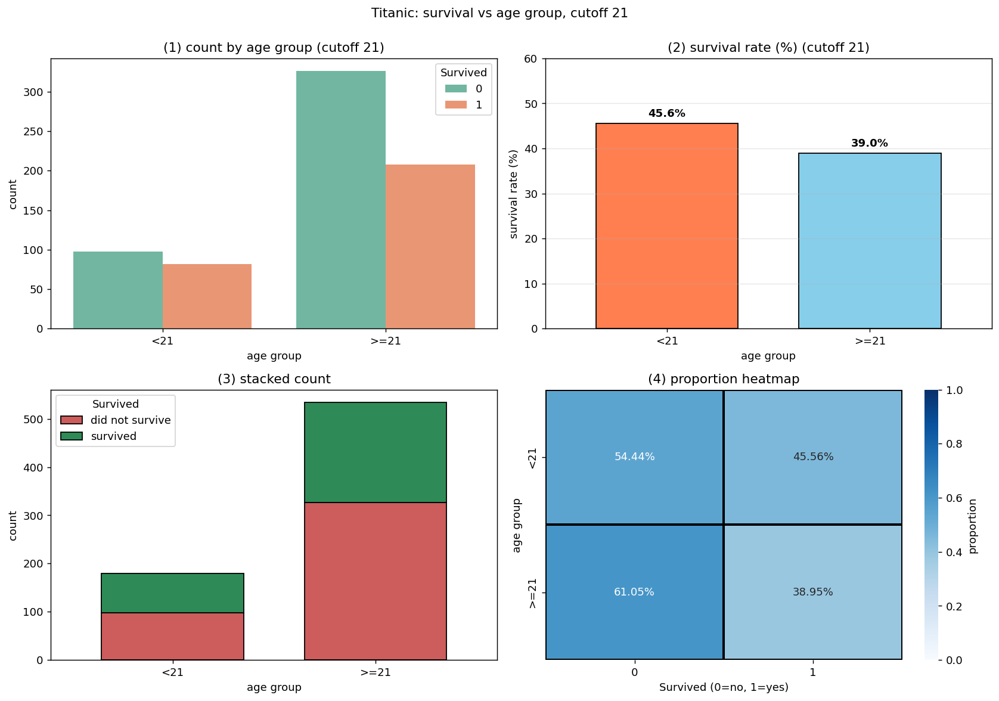
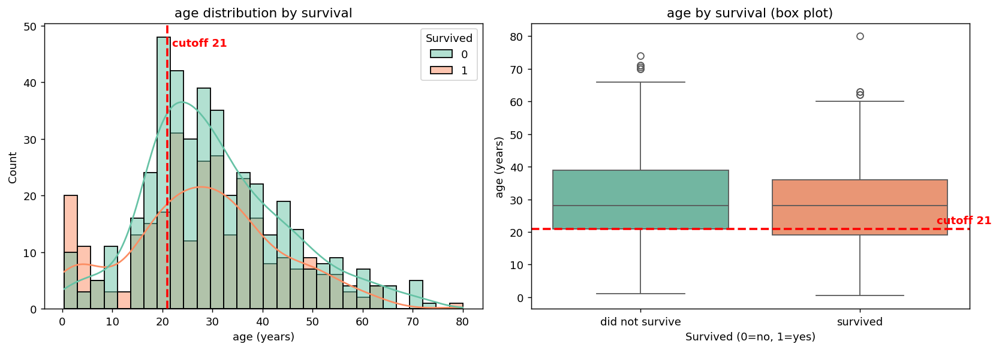
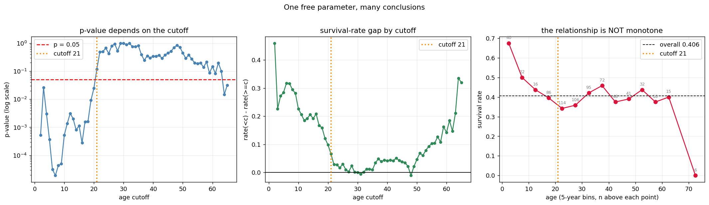

# 사례 연구: 절단점 하나가 결론을 바꾼다

앞 절에서는 성별과 생존을 보았다. 성별은 **자연히 둘로 나뉘어** 있어서 분할표를 만드는 데 아무 선택도 필요 없었다.

이번에는 **나이**를 본다. 나이는 연속형이므로 분할표를 만들려면 **어딘가에서 잘라야** 하고, 어디서 자를지는 **분석자가 정한다.** 이 절의 질문은 그래서 두 겹이다.

> **나이와 생존은 관계가 있는가? 그리고 그 답은 절단점에 얼마나 의존하는가?**

결론부터 말하면 **두 번째 질문의 답이 놀랍다.** 같은 자료, 같은 질문인데 절단점에 따라 $p$값이 $2\times10^{-5}$에서 0.996까지 움직인다. 이 절은 그 이유와 대처를 다룬다.

!!! note "앞 절과 이어 읽기"
    자료와 도구는 [타이타닉 생존과 성별](titanic_survival_gender.md) 절과 같다. 분할표·오즈비·카이제곱의 읽는 법은 거기에 설명해 두었으므로 여기서는 되풀이하지 않는다.

    **다른 것은 이야기다.** 앞 절이 "하나의 표를 여섯 가지로 요약하기"였다면, 이 절은 **"표 자체를 어떻게 만들 것인가"**다.

## 1. 절단점 21에서 시작한다

<div class="codebox" markdown>

### 예제 1. 스물한 살을 기준으로 나누면 { .eg }

```python
import warnings
warnings.filterwarnings("ignore")

import numpy as np
import pandas as pd
from scipy.stats import chi2_contingency

URL = ("https://raw.githubusercontent.com/datasciencedojo/"
       "datasets/master/titanic.csv")
df = pd.read_csv(URL, index_col="PassengerId")

# 나이가 없는 177명은 이 절의 분석에서 아예 쓸 수 없다.
# 앞 절 연습문제 6에서 보았듯 이들은 무작위로 빠진 것이 아니다.
d = df.dropna(subset=["Age"]).copy()
print(f"전체 {len(df)}명 중 나이가 있는 {len(d)}명으로 분석한다")
print(f"나이 범위 {d['Age'].min():.2f} ~ {d['Age'].max():.2f}세\n")

CUT = 21                                   # ← 이 한 줄이 이 절의 주제다
d["Age_Group"] = np.where(d["Age"] < CUT, f"<{CUT}", f">={CUT}")
ORDER = [f"<{CUT}", f">={CUT}"]

tab = pd.crosstab(d["Age_Group"], d["Survived"]).reindex(ORDER)
print("도수")
print(tab.to_string())

pct = pd.crosstab(d["Age_Group"], d["Survived"],
                  normalize="index").reindex(ORDER) * 100
print("\n집단 안에서의 생존율 (%)")
print(pct.round(2).to_string())

lo = d["Age"] < CUT
r_lo, r_hi = d.loc[lo, "Survived"].mean(), d.loc[~lo, "Survived"].mean()
print(f"\n{CUT}세 미만 {lo.sum():3d}명  생존율 {r_lo:.4f}")
print(f"{CUT}세 이상 {(~lo).sum():3d}명  생존율 {r_hi:.4f}")
print(f"차이 {r_lo - r_hi:+.4f}")

res = chi2_contingency(tab, correction=False)
print(f"\n카이제곱 {res.statistic:.4f},  자유도 {res.dof},  p = {res.pvalue:.4f}")
print(f"상관계수(파이) {np.corrcoef(d['Survived'], lo.astype(int))[0, 1]:+.4f}")

a, b = tab.iloc[0, 1], tab.iloc[0, 0]      # 어린 쪽 생존/사망
c, e = tab.iloc[1, 1], tab.iloc[1, 0]      # 나이 든 쪽 생존/사망
print(f"오즈비 {(a * e) / (b * c):.4f}")
```

```text
전체 891명 중 나이가 있는 714명으로 분석한다
나이 범위 0.42 ~ 80.00세

도수
Survived     0    1
Age_Group          
<21         98   82
>=21       326  208

집단 안에서의 생존율 (%)
Survived       0      1
Age_Group              
<21        54.44  45.56
>=21       61.05  38.95

21세 미만 180명  생존율 0.4556
21세 이상 534명  생존율 0.3895
차이 +0.0660

카이제곱 2.4344,  자유도 1,  p = 0.1187
상관계수(파이) +0.0584
오즈비 1.3114
```

**유의하지 않다.** $p=0.1187$로 0.05를 한참 넘는다.

| 지표 | 값 |
|---|---|
| 생존율 | 45.56% 대 38.95% |
| 차이 | $+6.60$%포인트 |
| 오즈비 | 1.31 |
| $\varphi$ | $+0.0584$ |
| $p$ | **0.1187** |

**앞 절의 성별과 견주면 규모가 전혀 다르다.** 성별은 차이 55.31%포인트에 오즈비 12.35였는데, 여기는 6.60%포인트에 1.31이다.

**"나이는 생존과 관계가 없다"고 결론지어도 되는가.** 이 절의 나머지는 그 결론이 **절단점 21에 대해서만** 성립한다는 것을 보인다.

</div>

## 2. 같은 표를 네 가지로 그리면

<div class="codebox" markdown>

### 예제 2. 그림도 "관계가 약하다"고 말한다 { .eg }

```python
import matplotlib.pyplot as plt
import seaborn as sns

fig, ax = plt.subplots(2, 2, figsize=(13, 9))

# (1) 도수 -- 두 집단의 크기가 크게 다르다 (180 대 534)
sns.countplot(data=d, x="Age_Group", hue="Survived", order=ORDER,
              ax=ax[0, 0], palette="Set2")
ax[0, 0].set_title(f"(1) count by age group (cutoff {CUT})")
ax[0, 0].set_xlabel("age group"); ax[0, 0].set_ylabel("count")

# (2) 생존율 -- 막대 두 개의 높이가 비슷하다
rate = d.groupby("Age_Group")["Survived"].mean().reindex(ORDER) * 100
rate.plot(kind="bar", ax=ax[0, 1], color=["coral", "skyblue"],
          edgecolor="black", width=0.7)
ax[0, 1].set_title(f"(2) survival rate (%) (cutoff {CUT})")
ax[0, 1].set_xlabel("age group"); ax[0, 1].set_ylabel("survival rate (%)")
ax[0, 1].tick_params(axis="x", rotation=0)
ax[0, 1].grid(True, alpha=0.3, axis="y"); ax[0, 1].set_ylim(0, 60)
for i, v in enumerate(rate):
    ax[0, 1].text(i, v + 1.5, f"{v:.1f}%", ha="center", fontweight="bold")

# (3) 누적 막대
tab.plot(kind="bar", stacked=True, ax=ax[1, 0],
         color=["indianred", "seagreen"], edgecolor="black", width=0.7)
ax[1, 0].set_title("(3) stacked count")
ax[1, 0].set_xlabel("age group"); ax[1, 0].set_ylabel("count")
ax[1, 0].tick_params(axis="x", rotation=0)
ax[1, 0].legend(["did not survive", "survived"], title="Survived")

# (4) 비율 열지도 -- 색 범위를 0~1 로 고정한다
prop = pd.crosstab(d["Age_Group"], d["Survived"],
                   normalize="index").reindex(ORDER)
sns.heatmap(prop, annot=True, fmt=".2%", cmap="Blues", ax=ax[1, 1],
            vmin=0, vmax=1, cbar_kws={"label": "proportion"},
            linewidths=2, linecolor="black")
ax[1, 1].set_title("(4) proportion heatmap")
ax[1, 1].set_xlabel("Survived (0=no, 1=yes)"); ax[1, 1].set_ylabel("age group")

fig.suptitle(f"Titanic: survival vs age group, cutoff {CUT}", y=1.00)
fig.tight_layout()
plt.show()
```



**네 그림 모두 "차이가 거의 없다"고 말한다.** (2)의 막대 두 개는 45.6%와 39.0%로 눈에 띄게 다르지 않고, (4)의 네 칸은 색이 비슷하다.

**그런데 (2)의 세로축이 0에서 60까지다.** 만약 이 축을 38에서 46으로 잘라 놓으면 **똑같은 자료가 극적인 차이로 보인다.** 막대그림의 세로축은 반드시 0에서 시작해야 한다는 원칙이 여기서 실질적으로 작동한다.

**(1)이 중요한 정보를 준다.** 두 집단의 크기가 180명과 534명으로 3배 차이다. 어린 쪽 표본이 작으므로 **그쪽 생존율의 불확실성이 크다.** 비율 그림 (2)만 보면 이 사실이 사라진다.

</div>

## 3. 자르기 전에 나이를 그대로 본다

분할표를 만드는 순간 나이는 0과 1이 된다. 그 전에 **원래 분포**를 보는 것이 순서다.

<div class="codebox" markdown>

### 예제 3. 두 집단의 나이 분포는 거의 겹친다 { .eg }

```python
fig, ax = plt.subplots(1, 2, figsize=(13, 4.6))

# 생존/사망 각각의 나이 분포를 겹쳐 그린다.
sns.histplot(data=d, x="Age", hue="Survived", kde=True, ax=ax[0],
             palette="Set2", bins=30)
ax[0].axvline(CUT, color="red", ls="--", lw=2)
ax[0].text(CUT + 1, ax[0].get_ylim()[1] * 0.92, f"cutoff {CUT}",
           color="red", fontweight="bold")
ax[0].set_title("age distribution by survival")
ax[0].set_xlabel("age (years)")

sns.boxplot(data=d, x="Survived", y="Age", ax=ax[1], hue="Survived",
            palette="Set2", legend=False)
ax[1].axhline(CUT, color="red", ls="--", lw=2)
ax[1].text(1.35, CUT + 1.5, f"cutoff {CUT}", color="red", fontweight="bold")
ax[1].set_title("age by survival (box plot)")
ax[1].set_xlabel("Survived (0=no, 1=yes)"); ax[1].set_ylabel("age (years)")
ax[1].set_xticks([0, 1])
ax[1].set_xticklabels(["did not survive", "survived"])

fig.tight_layout()
plt.show()

# 그림이 말하는 것을 수치로도 확인한다.
print(f"{'':14s}{'n':>6s}{'평균':>8s}{'중앙값':>8s}{'Q1':>7s}{'Q3':>7s}")
for lab, v in [("사망", d.loc[d["Survived"] == 0, "Age"]),
               ("생존", d.loc[d["Survived"] == 1, "Age"])]:
    print(f"{lab:14s}{len(v):>6d}{v.mean():>8.2f}{v.median():>8.2f}"
          f"{v.quantile(.25):>7.2f}{v.quantile(.75):>7.2f}")
```



```text
                   n      평균     중앙값     Q1     Q3
사망               424   30.63   28.00  21.00  39.00
생존               290   28.34   28.00  19.00  36.00
```

**두 분포가 거의 포개진다.** 중앙값이 둘 다 28.00세로 같고, 평균은 30.63세와 28.34세로 2.3세 차이다. 상자그림의 두 상자가 거의 같은 높이에 있다.

**그런데 히스토그램의 왼쪽 끝이 다르다.** 0~10세 구간에서 초록(생존)이 주황(사망)보다 높다. **어린아이들은 살아남았다.** 이 봉우리가 이 절의 나머지를 지배한다.

**상자그림은 이 사실을 놓친다.** 상자그림은 사분위수만 보이므로 **분포의 한쪽 끝에 있는 작은 덩어리**를 표현하지 못한다. 아래 수염 끝이 조금 다를 뿐이다.

**히스토그램이 상자그림보다 많은 것을 말한 사례**다. 요약통계가 같아도 분포가 다를 수 있다는 것을 [히스토그램과 밀도 그림](histograms.md) 절에서 다루었다.

</div>

## 4. 절단점을 바꾸면 결론이 바뀐다

21은 어디서 왔는가. **아무 데서도 오지 않았다.** 미국 음주 연령이기도 하고 성년의 기준이기도 하지만, 1912년 타이타닉에는 아무 의미가 없는 숫자다.

<div class="codebox" markdown>

### 예제 4. 가능한 모든 절단점을 훑어본다 { .eg }

```python
age = d["Age"].to_numpy()
sur = d["Survived"].to_numpy()

# 양쪽에 최소 10명은 남는 절단점만 고려한다.
CUTS = [c for c in range(1, 80)
        if (age < c).sum() >= 10 and (age >= c).sum() >= 10]
print(f"검사 대상 절단점 {len(CUTS)}개 ({CUTS[0]}세 ~ {CUTS[-1]}세)\n")

print(f"{'절단점':>7s}{'n<c':>6s}{'n>=c':>6s}{'생존율<':>9s}"
      f"{'생존율>=':>10s}{'차이':>9s}{'chi2':>9s}{'p':>11s}")
rows = []
for c in CUTS:
    m = age < c
    t = pd.crosstab(m, sur)
    res = chi2_contingency(t, correction=False)
    lo_r, hi_r = sur[m].mean(), sur[~m].mean()
    rows.append((c, res.statistic, res.pvalue))
    if c % 5 == 0:                           # 5세 간격만 출력한다
        print(f"{c:>7d}{m.sum():>6d}{(~m).sum():>6d}{lo_r:>9.4f}"
              f"{hi_r:>10.4f}{lo_r - hi_r:>+9.4f}"
              f"{res.statistic:>9.3f}{res.pvalue:>11.2e}")

best = max(rows, key=lambda z: z[1])
sig = [c for c, s, p in rows if p < 0.05]
print(f"\n가장 강한 절단점: {best[0]}세, chi2 = {best[1]:.4f}, p = {best[2]:.3e}")
print(f"가장 약한 절단점: "
      f"{min(rows, key=lambda z: z[1])[0]}세, p = {max(r[2] for r in rows):.4f}")
print(f"p < 0.05 인 절단점 {len(sig)}개 / {len(CUTS)}개: {sig}")
```

```text
검사 대상 절단점 64개 (2세 ~ 65세)

    절단점   n<c  n>=c     생존율<     생존율>=       차이     chi2          p
      5    40   674   0.6750    0.3902  +0.2848   12.697   3.66e-04
     10    62   652   0.6129    0.3865  +0.2264   12.032   5.23e-04
     15    78   636   0.5769    0.3852  +0.1917   10.586   1.14e-03
     20   164   550   0.4817    0.3836  +0.0981    5.038   2.48e-02
     25   278   436   0.4245    0.3945  +0.0300    0.632   4.27e-01
     30   384   330   0.4062    0.4061  +0.0002    0.000   9.96e-01
     35   479   235   0.4092    0.4000  +0.0092    0.055   8.14e-01
     40   551   163   0.4156    0.3742  +0.0414    0.893   3.45e-01
     45   599   115   0.4124    0.3739  +0.0384    0.591   4.42e-01
     50   640    74   0.4109    0.3649  +0.0461    0.584   4.45e-01
     55   672    42   0.4122    0.3095  +0.1027    1.728   1.89e-01
     60   688    26   0.4113    0.2692  +0.1421    2.098   1.48e-01
     65   703    11   0.4111    0.0909  +0.3202    4.603   3.19e-02

가장 강한 절단점: 7세, chi2 = 18.2719, p = 1.915e-05
가장 약한 절단점: 30세, p = 0.9959
p < 0.05 인 절단점 21개 / 64개: [2, 3, 4, 5, 6, 7, 8, 9, 10, 11, 12, 13, 14, 15, 16, 17, 18, 19, 20, 64, 65]
```

**같은 자료에서 $p$가 $1.9\times10^{-5}$부터 0.996까지 나온다.**

| 절단점 | $p$ | 결론 |
|---|---|---|
| **7세** | $1.9\times10^{-5}$ | **매우 강한 증거** |
| 15세 | $1.1\times10^{-3}$ | 강한 증거 |
| 20세 | 0.025 | 유의 |
| **21세** | **0.119** | **유의하지 않음** |
| **30세** | **0.996** | **완벽한 무관** |
| 65세 | 0.032 | 유의 |

**20세와 21세 사이에서 결론이 뒤집힌다.** $p$가 0.025에서 0.119로 넘어간다. **한 살 차이로 "유의함"이 "유의하지 않음"이 된다.**

**30세에서는 두 집단의 생존율이 0.4062와 0.4061로 소수점 넷째 자리까지 같다.** $\chi^2=0.000$, $p=0.996$이다. 30세를 기준으로 나누면 나이는 생존과 **완벽하게 무관**해 보인다.

**유의한 절단점이 양 끝에 몰려 있다.** 2~20세와 64~65세다. 가운데는 전부 유의하지 않다.

</div>

## 5. 왜 그런가 — 관계가 단조가 아니다

<div class="codebox" markdown>

### 예제 5. 나이와 생존의 실제 모양 { .eg }

```python
fig, ax = plt.subplots(1, 3, figsize=(16.5, 4.6))

stat = [s for c, s, p in rows]
pv = [p for c, s, p in rows]
dif = [sur[age < c].mean() - sur[age >= c].mean() for c in CUTS]

# (1) 절단점에 따른 p값
ax[0].plot(CUTS, pv, "o-", ms=4, color="steelblue")
ax[0].axhline(0.05, color="red", ls="--", lw=1.5, label="p = 0.05")
ax[0].axvline(21, color="darkorange", ls=":", lw=2, label="cutoff 21")
ax[0].set_yscale("log")
ax[0].set_xlabel("age cutoff"); ax[0].set_ylabel("p-value (log scale)")
ax[0].set_title("p-value depends on the cutoff")
ax[0].legend(); ax[0].grid(alpha=0.25)

# (2) 절단점에 따른 생존율 차이
ax[1].plot(CUTS, dif, "o-", ms=4, color="seagreen")
ax[1].axhline(0, color="black", lw=1)
ax[1].axvline(21, color="darkorange", ls=":", lw=2, label="cutoff 21")
ax[1].set_xlabel("age cutoff"); ax[1].set_ylabel("rate(<c) - rate(>=c)")
ax[1].set_title("survival-rate gap by cutoff")
ax[1].legend(); ax[1].grid(alpha=0.25)

# (3) 5년 구간별 생존율 -- 자르지 않고 본 실제 모양
edges = np.arange(0, 85, 5)
mid, rt, cnt = [], [], []
for i in range(len(edges) - 1):
    m = (age >= edges[i]) & (age < edges[i + 1])
    if m.sum() >= 5:
        mid.append((edges[i] + edges[i + 1]) / 2)
        rt.append(sur[m].mean()); cnt.append(m.sum())
ax[2].plot(mid, rt, "o-", color="crimson", ms=6)
for x_, y_, n_ in zip(mid, rt, cnt):        # 각 점 위에 표본 크기를 적는다
    ax[2].annotate(f"{n_}", (x_, y_), textcoords="offset points",
                   xytext=(0, 7), ha="center", fontsize=7, color="gray")
ax[2].axhline(sur.mean(), color="black", ls="--", lw=1,
              label=f"overall {sur.mean():.3f}")
ax[2].axvline(21, color="darkorange", ls=":", lw=2, label="cutoff 21")
ax[2].set_xlabel("age (5-year bins, n above each point)")
ax[2].set_ylabel("survival rate")
ax[2].set_title("the relationship is NOT monotone")
ax[2].legend(); ax[2].grid(alpha=0.25)

fig.suptitle("One free parameter, many conclusions", y=1.02)
fig.tight_layout()
plt.show()

# 10년 단위로 묶어 숫자로도 본다.
g = d.groupby(pd.cut(d["Age"], [0, 10, 20, 30, 40, 50, 60, 81],
                     right=False))["Survived"].agg(["count", "sum", "mean"])
print(g.round(4).to_string())
```



```text
          count  sum    mean
Age                         
[0, 10)      62   38  0.6129
[10, 20)    102   41  0.4020
[20, 30)    220   77  0.3500
[30, 40)    167   73  0.4371
[40, 50)     89   34  0.3820
[50, 60)     48   20  0.4167
[60, 81)     26    7  0.2692
```

**관계가 단조가 아니다.**

$$
0.613\;\longrightarrow\;0.402\;\longrightarrow\;\mathbf{0.350}\;\longrightarrow\;0.437
\;\longrightarrow\;0.382\;\longrightarrow\;0.417\;\longrightarrow\;\mathbf{0.269}
$$

**내려갔다가 올라갔다가 다시 내려간다.** 10세 미만이 0.613으로 가장 높고, 20대가 0.350으로 바닥이고, 60세 이상이 0.269로 다시 낮다.

**단 하나의 절단점으로는 이런 모양을 잡을 수 없다.** 절단점 하나는 자료를 "왼쪽 평균 대 오른쪽 평균"으로만 요약하는데, **왼쪽에 높은 값과 낮은 값이 섞여 있으면 서로 상쇄**된다.

**21세가 하필 가장 나쁜 자리다.**

```text
21세 미만 = [0~10세의 0.613]  +  [10~20세의 0.402]  -> 섞여서 0.456
21세 이상 = 20대부터 60대까지 대체로 0.35~0.44   -> 0.390

두 평균이 비슷해진다 -> p = 0.119
```

**7세에서 가장 강한 신호가 나오는 이유**도 같다. 7세 미만은 거의 전부 어린아이라 생존율이 높고, 그 위는 전부 섞여 있다. **어린아이 효과를 가장 순수하게 분리하는 자리**가 7세다.

**64~65세에서 다시 유의해지는 것은 반대쪽 끝**이다. 노인의 생존율이 낮아서다. 다만 65세 이상이 11명뿐이므로 **이 신호는 매우 불안정**하다.

**가운데 그림의 U자 모양이 이 모든 것을 요약한다.** 절단점을 양 끝으로 밀수록 차이가 커지고, 가운데(30세 근처)에서 정확히 0이 된다.

</div>

## 6. "가장 좋은" 절단점을 고르면

절단점을 훑어보고 $p$가 가장 작은 것을 고르면 되지 않을까. **7세에서 $p=1.9\times10^{-5}$이니 강력한 증거가 아닌가.**

**이 $p$값은 그대로 쓸 수 없다.** 64개를 시도하고 가장 좋은 것을 골랐기 때문이다.

<div class="codebox" markdown>

### 예제 6. 절단점을 탐색하면 1종 오류가 얼마나 커지나 { .eg }

```python
from scipy.stats import chi2 as chi2dist

def max_chi2(y, age=age, cuts=CUTS):
    """모든 절단점 중 최대 카이제곱을 돌려준다 (2x2 닫힌 꼴로 빠르게)."""
    n, tot = len(y), y.sum()
    best = 0.0
    for c in cuts:
        m = age < c
        n1 = m.sum(); s1 = y[m].sum()
        a, b = s1, n1 - s1                   # 어린 쪽 생존/사망
        cc, dd = tot - s1, (n - n1) - (tot - s1)
        den = (a + b) * (cc + dd) * (a + cc) * (b + dd)
        if den:
            v = n * (a * dd - b * cc) ** 2 / den
            if v > best:
                best = v
    return best

obs = max_chi2(sur)
print(f"관측된 최대 카이제곱 {obs:.4f}")
print(f"  이것을 단일 검정으로 읽으면 p = {chi2dist.sf(obs, 1):.4e}\n")

# 생존 여부를 무작위로 섞으면 나이와의 관계가 사라진다.
# 그 상태에서도 '최대 카이제곱'이 얼마나 커지는지 본다.
rng = np.random.default_rng(0)
B = 20_000
y = sur.copy()
null = np.empty(B)
for i in range(B):
    rng.shuffle(y)
    null[i] = max_chi2(y)

print(f"귀무가설에서 '최대 카이제곱'의 분포 ({B:,}회)")
print(f"  평균 {null.mean():.4f}")
print(f"  95분위 {np.quantile(null, 0.95):.4f}   "
      f"(자유도 1 카이제곱의 95분위는 {chi2dist.ppf(0.95, 1):.4f})")
print(f"  99분위 {np.quantile(null, 0.99):.4f}")

print(f"\n나이와 생존이 완전히 무관한데도")
print(f"  '어떤 절단점에서든 p<0.05' 가 나올 확률 = "
      f"{np.mean(null > chi2dist.ppf(0.95, 1)):.4f}")
print(f"\n탐색을 반영한 올바른 p = "
      f"{(np.sum(null >= obs) + 1) / (B + 1):.4f}")
```

```text
관측된 최대 카이제곱 18.2719
  이것을 단일 검정으로 읽으면 p = 1.9151e-05

귀무가설에서 '최대 카이제곱'의 분포 (20,000회)
  평균 4.4309
  95분위 9.0294   (자유도 1 카이제곱의 95분위는 3.8415)
  99분위 12.1888

나이와 생존이 완전히 무관한데도
  '어떤 절단점에서든 p<0.05' 가 나올 확률 = 0.5194

탐색을 반영한 올바른 p = 0.0004
```

**나이와 생존이 완전히 무관한 자료에서도 52%의 확률로 "유의한 절단점"이 발견된다.**

| | 값 |
|---|---|
| 명목 유의수준 | 0.05 |
| **실제 1종 오류** | **0.5194** |
| 팽창 배율 | **10.4배** |

**올바른 임계값은 3.8415가 아니라 9.0294**다. 절단점을 64개 시도했으므로 기준이 그만큼 높아져야 한다.

**이것이 "정원의 갈림길"이다.** 자료를 보고 절단점을 정하면, 정한 뒤의 $p$값은 더 이상 $p$값이 아니다.

```text
나쁜 절차:  절단점을 여러 개 시도 -> 가장 좋은 것 선택 -> 그 p값 보고
            (실제 1종 오류 0.52)

좋은 절차:  절단점을 자료 보기 전에 확정 -> 그 하나만 검정
            또는 탐색을 인정하고 순열검정으로 보정
```

**다행히 이 자료의 신호는 보정 후에도 살아남는다.** 탐색을 반영한 $p=0.0004$로 여전히 유의하다. **어린아이가 더 많이 살아남았다는 것은 실재하는 현상**이다.

**그러나 "7세"라는 숫자를 믿어서는 안 된다.** 그 값은 이 표본에서 우연히 가장 잘 맞았을 뿐이고, 다른 표본에서는 5세나 9세가 될 것이다. 절단점 추정값에는 **신뢰구간이 필요한데**, 단순한 방법으로는 구하기 어렵다.

</div>

## 7. 애초에 자르지 않으면 된다

<div class="codebox" markdown>

### 예제 7. 이분화가 버리는 것 { .eg }

```python
import statsmodels.api as sm

y = d["Survived"].to_numpy()
models = {
    "절편만 (나이 무시)": np.ones((len(y), 1)),
    "21세 이분화": sm.add_constant((age < 21).astype(float)),
    "7세 이분화 (탐색으로 고름)": sm.add_constant((age < 7).astype(float)),
    "나이 연속 (선형)": sm.add_constant(age),
    "나이 + 나이 제곱": sm.add_constant(np.column_stack([age, age ** 2])),
    "10년 구간 더미": sm.add_constant(
        pd.get_dummies(np.digitize(age, [10, 20, 30, 40, 50, 60]),
                       drop_first=True).to_numpy(dtype=float)),
}
print(f"{'모형':>26s}{'모수':>6s}{'로그가능도':>12s}{'AIC':>10s}")
for lab, X in models.items():
    m = sm.Logit(y, X).fit(disp=0)
    print(f"{lab:>26s}{X.shape[1]:>6d}{m.llf:>12.3f}{m.aic:>10.3f}")

# 연속형 나이의 효과가 정말 있는지 직접 검정한다.
m = sm.Logit(y, sm.add_constant(age)).fit(disp=0)
print(f"\n로지스틱 회귀 (나이 연속)")
print(f"  나이 계수 {m.params[1]:+.6f}  (한 살 많아질수록 로그오즈 변화)")
print(f"  p = {m.pvalues[1]:.4f}")
print(f"  오즈비 (10살 차이) {np.exp(m.params[1] * 10):.4f}")
```

```text
                        모형    모수       로그가능도       AIC
               절편만 (나이 무시)     1    -482.258   966.516
                   21세 이분화     2    -481.049   966.099
          7세 이분화 (탐색으로 고름)     2    -473.249   950.499
                나이 연속 (선형)     2    -480.114   964.228
                나이 + 나이 제곱     3    -478.906   963.812
                 10년 구간 더미     7    -473.913   961.827

로지스틱 회귀 (나이 연속)
  나이 계수 -0.010963  (한 살 많아질수록 로그오즈 변화)
  p = 0.0397
  오즈비 (10살 차이) 0.8962
```

**연속형으로 쓰면 $p=0.0397$로 유의하다.** 21세로 이분화했을 때의 $p=0.119$와 견주어 보라. **자르지 않았더니 없던 신호가 생긴 것**이 아니라, **자르면서 버렸던 정보가 돌아온 것**이다.

**AIC로 모형을 견주면.**

| 모형 | 모수 | AIC |
|---|---|---|
| 절편만(나이 무시) | 1 | 966.5 |
| **21세 이분화** | 2 | **966.1** |
| 나이 연속(선형) | 2 | 964.2 |
| 나이 + 나이² | 3 | 963.8 |
| **10년 구간 더미** | 7 | **961.8** |
| 7세 이분화(탐색) | 2 | (950.5) |

**21세 이분화 모형은 나이를 아예 무시한 모형보다 겨우 0.4 낫다.** 나이라는 변수를 넣고도 사실상 아무것도 얻지 못했다.

**10년 구간 더미가 가장 낫다.** 비단조 모양을 표현할 수 있기 때문이다. 모수를 7개나 쓰고도 AIC가 가장 낮다.

**괄호 친 7세 이분화의 AIC 950.5는 다른 값들과 비교할 수 없다.** 절단점을 **결과를 보고 골랐으므로** 이 모형은 이미 자유도를 더 쓴 것이고, AIC가 그만큼 낙관적으로 편향되어 있다.

**이분화의 대가를 일반적으로 확인하면.**

```python
rng = np.random.default_rng(1)
B = 2_000
print("참 효과가 선형인 자료에서의 검정력 (n=300, 명목 0.05)")
print(f"{'beta':>6s}{'연속 그대로':>11s}{'중앙값 분할':>12s}{'손실':>8s}")
for beta in [0.2, 0.3, 0.4, 0.5]:
    a = b = 0
    for _ in range(B):
        x = rng.standard_normal(300)
        yy = (rng.random(300) < 1 / (1 + np.exp(-beta * x))).astype(int)
        a += sm.Logit(yy, sm.add_constant(x)).fit(disp=0).pvalues[1] < 0.05
        xd = (x > np.median(x)).astype(float)
        b += sm.Logit(yy, sm.add_constant(xd)).fit(disp=0).pvalues[1] < 0.05
    print(f"{beta:>6.1f}{a / B:>11.4f}{b / B:>12.4f}{1 - (b / B) / (a / B):>8.1%}")
```

```text
참 효과가 선형인 자료에서의 검정력 (n=300, 명목 0.05)
  beta     연속 그대로      중앙값 분할      손실
   0.2     0.3905      0.2840   27.3%
   0.3     0.7180      0.5280   26.5%
   0.4     0.9140      0.7610   16.7%
   0.5     0.9840      0.9120    7.3%
```

**효과가 작을수록 손실이 크다.** $\beta=0.2$에서 검정력이 0.391에서 0.284로 **27.3% 줄어든다.**

**표본을 늘려 되찾으려면** 대략 1.5배가 필요하다. **자료의 3분의 1을 버리는 셈**이다.

!!! warning "그래도 이분화해야 하는 경우"
    이분화가 언제나 나쁜 것은 아니다. **정당한 이유가 하나 있다.**

    | 이유 | 정당한가 |
    |---|---|
    | **임상적·법적 절단점이 미리 정해져 있다** | **그렇다** |
    | 해석이 쉬워서 | 아니다. 회귀계수도 충분히 쉽다 |
    | 정규성 가정을 피하려고 | 아니다. 이분화가 정규성을 주지 않는다 |
    | 관계가 비선형이라서 | 아니다. 스플라인이나 구간 더미를 쓴다 |
    | **자료를 보고 최적점을 찾아서** | **절대 아니다**(6절) |

    타이타닉에서 "여성과 어린이 먼저"의 **어린이**가 당시 규정으로 몇 살이었는지 문서로 확인된다면, 그 나이를 절단점으로 쓰는 것은 정당하다. **자료가 아니라 자료 밖의 지식이 절단점을 정할 때**만 그렇다.

</div>

## 정리하며

연속형 변수를 둘로 잘라 분할표를 만드는 일은 **보기보다 훨씬 위험하다.**

- **절단점은 자료가 아니라 분석자가 정한다.** 21세에서 $p=0.119$, 7세에서 $p=1.9\times10^{-5}$, 30세에서 $p=0.996$이다.
- **20세와 21세 사이에서 결론이 뒤집힌다.** 한 살 차이로 유의성이 바뀐다.
- **나이와 생존의 관계는 단조가 아니다.** $0.613\to0.350\to0.437\to0.269$으로 오르내리므로, 절단점 하나로는 표현할 수 없다.
- **절단점을 탐색하면 1종 오류가 0.05에서 0.52로 커진다.** 올바른 임계값은 3.84가 아니라 9.03이다.
- **21세 이분화 모형은 나이를 무시한 모형보다 AIC가 0.4 나을 뿐**이다. 연속형으로 쓰면 $p=0.0397$로 유의해진다.
- **그 유의성조차 10세 미만 62명이 혼자 만든 것**이다. 10세 이상 652명만 보면 나이 효과가 $p=0.947$로 정확히 사라진다(연습문제 4).
- **중앙값 분할만으로도 검정력의 27%를 잃는다.**
- **자르지 않는 것이 기본**이다. 자를 정당한 이유는 **자료 밖에서 정해진 절단점이 있을 때**뿐이다.

앞 절과 묶어 보면 교훈이 하나로 모인다. **분할표는 자료가 주는 것이 아니라 우리가 만드는 것이며, 만드는 과정의 선택이 결론에 그대로 흘러든다.**

## 연습문제

<div class="drillbox" markdown>

**연습문제 1.** <span class="diff easy" title="쉬움"></span>
예제 1에서 절단점 21의 $\chi^2$을 연속성 보정 유무로 각각 구하고, 어느 쪽을 보고해야 하는지 판단하라.

</div>

??? success "풀이"
    ```python
    import warnings
    warnings.filterwarnings("ignore")

    import numpy as np
    import pandas as pd
    from scipy.stats import chi2_contingency, fisher_exact

    URL = ("https://raw.githubusercontent.com/datasciencedojo/"
           "datasets/master/titanic.csv")
    df = pd.read_csv(URL, index_col="PassengerId")
    d = df.dropna(subset=["Age"]).copy()
    tab = pd.crosstab(d["Age"] < 21, d["Survived"])

    for flag in [False, True]:
        r = chi2_contingency(tab, correction=flag)
        lab = "보정 있음" if flag else "보정 없음"
        print(f"{lab:10s} chi2 = {r.statistic:.4f}   p = {r.pvalue:.4f}")

    odds, p_f = fisher_exact(tab)
    print(f"{'피셔 정확검정':10s} p = {p_f:.4f}")

    print("\n기대도수 (모두 5 이상이어야 카이제곱 근사가 믿을 만하다)")
    print(np.round(chi2_contingency(tab, correction=False).expected_freq, 2))
    print(f"최소 기대도수 {chi2_contingency(tab, correction=False).expected_freq.min():.2f}")
    ```

    ```text
    보정 없음      chi2 = 2.4344   p = 0.1187
    보정 있음      chi2 = 2.1683   p = 0.1409
    피셔 정확검정    p = 0.1357

    기대도수 (모두 5 이상이어야 카이제곱 근사가 믿을 만하다)
    [[317.11 216.89]
     [106.89  73.11]]
    최소 기대도수 73.11
    ```

    **세 결과가 모두 같은 결론을 준다.** 0.1187, 0.1409, 0.1357 — 어느 것도 0.05 근처가 아니다.

    | 방법 | $p$ |
    |---|---|
    | 카이제곱(보정 없음) | 0.1187 |
    | 카이제곱(보정 있음) | 0.1409 |
    | 피셔 정확검정 | 0.1357 |

    **최소 기대도수가 73.11로 충분히 크다.** 관례적 기준(모든 칸이 5 이상)을 여유 있게 만족하므로 **보정이 필요 없다.**

    **연속성 보정은 기대도수가 작을 때를 위한 장치**다. 여기서는 보수적으로 만들 뿐이며, 표본이 커질수록 두 값이 가까워진다.

    **어느 쪽을 보고하나.**

    | 상황 | 권장 |
    |---|---|
    | 기대도수가 모두 5 이상 | **보정 없음**(또는 둘 다 무방) |
    | 기대도수 5 미만인 칸이 있음 | **피셔 정확검정** |
    | $\varphi=\sqrt{\chi^2/n}$와 맞춰야 함 | **반드시 보정 없음** |

    **마지막 줄이 실용적으로 중요하다.** 앞 절에서 본 $\varphi=\sqrt{\chi^2/n}$ 등식은 **보정하지 않은** $\chi^2$에서만 성립한다. 보정한 값을 넣으면 상관계수와 어긋난다.

    ```python
    n = tab.values.sum()
    r = np.corrcoef(d["Survived"], (d["Age"] < 21).astype(int))[0, 1]
    for flag in [False, True]:
        s = chi2_contingency(tab, correction=flag).statistic
        lab = "보정 있음" if flag else "보정 없음"
        print(f"{lab:10s} sqrt(chi2/n) = {np.sqrt(s / n):.6f}")
    print(f"{'실제 |phi|':10s}              = {abs(r):.6f}")
    ```

    ```text
    보정 없음      sqrt(chi2/n) = 0.058391
    보정 있음      sqrt(chi2/n) = 0.055107
    실제 |phi|                = 0.058391
    ```

    **보정 없는 쪽만 0.058391로 정확히 맞는다.** 보정한 값을 넣으면 0.055107로 어긋난다. $\square$

<div class="drillbox" markdown>

**연습문제 2.** <span class="diff med" title="중간"></span>
예제 4에서 30세 절단점의 $\chi^2$이 0.000이었다. **생존율이 정확히 같아지는 절단점**이 존재함을 설명하고, 그런 절단점을 모두 찾아라.

</div>

??? success "풀이"
    **중간값 정리와 같은 발상**이다. 절단점 $c$에 대해

    $$
    g(c)=\hat p_{<c}-\hat p_{\geq c}
    $$

    를 생각하자. 4절에서 보았듯 $g$는 작은 $c$에서 양수($+0.28$)이고 30세 근처에서 0을 지나며, 다시 양수가 된다. **$g$가 부호를 바꾸는 지점에 $g=0$인 절단점이 있다.**

    다만 $g$는 연속함수가 아니라 **계단함수**다. 관측된 나이 값에서만 뛰므로, 정확히 0이 되는 보장은 없고 **0에 가장 가까운 계단**이 있을 뿐이다.

    ```python
    age = d["Age"].to_numpy()
    sur = d["Survived"].to_numpy()
    CUTS = [c for c in range(1, 80)
            if (age < c).sum() >= 10 and (age >= c).sum() >= 10]

    gaps = [(c, sur[age < c].mean() - sur[age >= c].mean()) for c in CUTS]
    gaps.sort(key=lambda z: abs(z[1]))
    print("생존율 차이가 0에 가장 가까운 절단점 다섯")
    print(f"{'절단점':>7s}{'n<c':>6s}{'생존율<':>9s}{'생존율>=':>10s}{'차이':>11s}")
    for c, g in gaps[:5]:
        print(f"{c:>7d}{(age < c).sum():>6d}{sur[age < c].mean():>9.4f}"
              f"{sur[age >= c].mean():>10.4f}{g:>+11.6f}")

    # 부호가 바뀌는 곳을 찾는다.
    seq = [(c, sur[age < c].mean() - sur[age >= c].mean()) for c in CUTS]
    print("\n차이의 부호가 바뀌는 구간")
    for i in range(1, len(seq)):
        if np.sign(seq[i][1]) != np.sign(seq[i - 1][1]):
            print(f"  {seq[i-1][0]}세 ({seq[i-1][1]:+.6f}) "
                  f"-> {seq[i][0]}세 ({seq[i][1]:+.6f})")
    ```

    ```text
    생존율 차이가 0에 가장 가까운 절단점 다섯
        절단점   n<c     생존율<     생존율>=         차이
         30   384   0.4062    0.4061  +0.000189
         29   364   0.4066    0.4057  +0.000879
         32   428   0.4065    0.4056  +0.000948
         27   319   0.4075    0.4051  +0.002460
         31   411   0.4039    0.4092  -0.005348

    차이의 부호가 바뀌는 구간
      30세 (+0.000189) -> 31세 (-0.005348)
      31세 (-0.005348) -> 32세 (+0.000948)
      47세 (+0.021336) -> 48세 (-0.010930)
      48세 (-0.010930) -> 49세 (+0.021017)
    ```

    **30세에서 차이가 $+0.000189$**이다. 정확히 0은 아니지만 소수점 셋째 자리까지는 0이다.

    | 절단점 | 차이 |
    |---|---|
    | **30세** | $+0.000189$ |
    | 29세 | $+0.000879$ |
    | 31세 | $-0.005348$ |

    **30세와 31세 사이에서 부호가 바뀐다.** 만약 나이가 연속적으로 관측되었다면 그 사이 어딘가에 정확히 $g=0$인 점이 있었을 것이다.

    **이것이 절단점 방법의 근본적인 취약성을 드러낸다.** "30세를 기준으로 나누면 나이는 생존과 무관하다"는 문장은 **참**이지만, **완전히 오해를 부른다.** 자료에는 분명한 나이 효과가 있는데(어린이 0.613, 노인 0.269) **절단점이 그것을 정확히 상쇄하는 자리**에 놓였을 뿐이다.

    **비단조 관계에서는 이런 "우연의 영점"이 반드시 존재한다.** 관계가 단조라면 $g(c)$가 부호를 바꾸지 않으므로 이런 일이 없다. $\square$

<div class="drillbox" markdown>

**연습문제 3.** <span class="diff hard" title="어려움"></span>
예제 6의 순열검정을 **절단점 수를 바꿔 가며** 반복하라. 후보가 몇 개일 때부터 문제가 심각해지는가?

</div>

??? success "풀이"
    ```python
    import numpy as np
    from scipy.stats import chi2 as chi2dist

    def max_chi2_over(y, cuts):
        n, tot = len(y), y.sum()
        best = 0.0
        for c in cuts:
            m = age < c
            n1 = m.sum(); s1 = y[m].sum()
            a, b = s1, n1 - s1
            cc, dd = tot - s1, (n - n1) - (tot - s1)
            den = (a + b) * (cc + dd) * (a + cc) * (b + dd)
            if den:
                v = n * (a * dd - b * cc) ** 2 / den
                if v > best:
                    best = v
        return best

    ALL = [c for c in range(1, 80)
           if (age < c).sum() >= 10 and (age >= c).sum() >= 10]
    crit = chi2dist.ppf(0.95, 1)
    rng = np.random.default_rng(0)
    B = 8_000

    print(f"명목 유의수준 0.05, 임계값 {crit:.4f}")
    print(f"{'후보 수':>7s}{'후보 예':>22s}{'실제 1종 오류':>13s}"
          f"{'올바른 임계값':>13s}")
    for k in [1, 2, 3, 5, 10, 20, 64]:
        cuts = [ALL[0]] if k == 1 else \
               [ALL[int(round(i * (len(ALL) - 1) / (k - 1)))] for i in range(k)]
        cuts = sorted(set(cuts))
        y = sur.copy()
        null = np.empty(B)
        for i in range(B):
            rng.shuffle(y)
            null[i] = max_chi2_over(y, cuts)
        ex = f"{cuts[0]},…,{cuts[-1]}" if len(cuts) > 2 else str(cuts)
        print(f"{len(cuts):>7d}{ex:>22s}{np.mean(null > crit):>13.4f}"
              f"{np.quantile(null, 0.95):>13.4f}")
    ```

    ```text
    명목 유의수준 0.05, 임계값 3.8415
       후보 수                  후보 예     실제 1종 오류      올바른 임계값
          1                   [2]       0.0521       4.1047
          2               [2, 65]       0.1111       4.7761
          3                2,…,65       0.1476       5.6209
          5                2,…,65       0.2129       6.4261
         10                2,…,65       0.3399       7.5406
         20                2,…,65       0.4324       8.0108
         64                2,…,65       0.5211       9.1297
    ```

    **후보가 하나면 0.0521로 명목 수준에 맞는다.** 문제는 둘부터 시작된다.

    | 후보 수 | 1종 오류 | 팽창 |
    |---|---|---|
    | 1 | 0.0521 | — |
    | **2** | **0.1111** | **2.1배** |
    | 3 | 0.1476 | 2.8배 |
    | 5 | 0.2129 | 4.1배 |
    | 10 | 0.3399 | 6.5배 |
    | 20 | 0.4324 | 8.3배 |
    | **64** | **0.5211** | **10.0배** |

    **절단점을 단 두 개만 시도해도 오류율이 두 배가 된다.** "20세랑 21세 둘 다 해 봤다"가 이미 문제다.

    **증가가 처음에는 가파르고 나중에는 완만하다.** 1→2에서 0.06이 늘고, 20→64에서 0.09가 는다. **인접한 절단점들의 검정이 서로 강하게 상관**되어 있기 때문이다. 독립이라면 $1-0.95^{64}=0.962$까지 갔을 텐데 실제는 0.521이다.

    **올바른 임계값도 비슷하게 움직인다.** 3.84 → 4.78 → … → 9.13이다.

    **실무적 교훈 셋.**

    1. **"몇 가지 잘라 보았다"는 말이 나오면 보정이 필요하다.** 둘만 해도 그렇다.
    2. **시도한 절단점을 전부 보고**해야 독자가 판단할 수 있다. 보고하지 않은 시도는 보이지 않는 다중검정이다.
    3. **순열검정이 가장 간단한 해법**이다. 실제로 시도한 후보 집합 전체에 대해 최대 통계량의 분포를 구하면 된다. $\square$

<div class="drillbox" markdown>

**연습문제 4.** <span class="diff hard" title="어려움"></span>
5절의 "비단조성" 주장을 **검정**하라. 나이 효과가 정말 비단조인가, 아니면 표본 잡음인가?

</div>

??? success "풀이"
    **세 가지로 접근한다.** 이차항 검정, 구간 더미의 결합 검정, 그리고 단조 대립가설 검정이다.

    ```python
    import statsmodels.api as sm

    y = d["Survived"].to_numpy()

    # (1) 이차항이 필요한가 -- 우도비 검정
    m1 = sm.Logit(y, sm.add_constant(age)).fit(disp=0)
    m2 = sm.Logit(y, sm.add_constant(
        np.column_stack([age, age ** 2]))).fit(disp=0)
    lr = 2 * (m2.llf - m1.llf)
    from scipy.stats import chi2 as chi2dist
    print(f"(1) 선형 대 이차")
    print(f"    우도비 = {lr:.4f}, df=1, p = {chi2dist.sf(lr, 1):.4f}")
    print(f"    2차 계수 {m2.params[2]:+.8f}  (양수면 U자)")

    # (2) 10년 구간 더미가 선형보다 나은가
    D = pd.get_dummies(np.digitize(age, [10, 20, 30, 40, 50, 60]),
                       drop_first=True).to_numpy(dtype=float)
    m3 = sm.Logit(y, sm.add_constant(D)).fit(disp=0)
    m0 = sm.Logit(y, np.ones((len(y), 1))).fit(disp=0)
    lr2 = 2 * (m3.llf - m0.llf)
    print(f"\n(2) 절편만 대 10년 구간 더미")
    print(f"    우도비 = {lr2:.4f}, df={D.shape[1]}, "
          f"p = {chi2dist.sf(lr2, D.shape[1]):.4f}")
    lr3 = 2 * (m3.llf - m1.llf)
    print(f"    선형 대 구간 더미: 우도비 = {lr3:.4f}, df={D.shape[1] - 1}, "
          f"p = {chi2dist.sf(lr3, D.shape[1] - 1):.4f}")

    # (3) 10세 미만을 따로 떼면 나머지는 단조인가
    older = age >= 10
    m4 = sm.Logit(y[older], sm.add_constant(age[older])).fit(disp=0)
    print(f"\n(3) 10세 이상만 (n={older.sum()})")
    print(f"    나이 계수 {m4.params[1]:+.6f}, p = {m4.pvalues[1]:.4f}")
    m5 = sm.Logit(y[~older], sm.add_constant(age[~older])).fit(disp=0)
    print(f"    10세 미만만 (n={(~older).sum()})")
    print(f"    나이 계수 {m5.params[1]:+.6f}, p = {m5.pvalues[1]:.4f}")
    ```

    ```text
    (1) 선형 대 이차
        우도비 = 2.4164, df=1, p = 0.1201
        2차 계수 +0.00039646  (양수면 U자)

    (2) 절편만 대 10년 구간 더미
        우도비 = 16.6893, df=6, p = 0.0105
        선형 대 구간 더미: 우도비 = 12.4017, df=5, p = 0.0297

    (3) 10세 이상만 (n=652)
        나이 계수 -0.000421, p = 0.9470
        10세 미만만 (n=62)
        나이 계수 -0.201384, p = 0.0376
    ```

    **결과가 매우 선명하다.**

    | 검정 | $p$ | 해석 |
    |---|---|---|
    | 이차항 필요? | 0.120 | **증거 약함** |
    | 구간 더미 대 절편만 | **0.011** | 나이 효과 있음 |
    | **구간 더미 대 선형** | **0.030** | **선형으로 부족** |
    | **10세 이상만 선형** | **0.947** | **효과가 정확히 없음** |
    | **10세 미만만 선형** | **0.038** | **강한 효과** |

    **마지막 두 줄이 전부를 말한다.**

    ```text
    전체 714명:      나이 계수 -0.0110,  p = 0.0397  (유의)
    10세 이상 652명: 나이 계수 -0.0004,  p = 0.9470  (효과 없음)
    10세 미만  62명: 나이 계수 -0.2014,  p = 0.0376  (강한 효과)
    ```

    **10세 이상에서는 계수가 $-0.0004$로 사실상 정확히 0이다.** $p=0.947$이니 나이는 생존과 **아무 관계가 없다.** 652명이나 되는데도 그렇다.

    **10세 미만 62명 안에서는 계수가 $-0.2014$로 전체의 18배**다. 한 살 많아질 때마다 생존 오즈가 $e^{-0.2014}=0.818$배, 즉 **18%씩 줄어든다.** 표본이 62명뿐인데도 $p=0.038$로 유의하다.

    **전체에서 본 $p=0.0397$은 이 62명이 혼자 만들어 낸 것이다.**

    **이차항으로는 잘 잡히지 않는다**($p=0.120$). 실제 모양이 **매끄러운 포물선이 아니라 "어린이 안에서만 가파르고 그 밖에서는 평평한 꺾인 선"**이기 때문이다. 이차 다항식은 그런 모양에 맞지 않는 함수족이다.

    **구간 더미가 선형보다 유의하게 낫다**($p=0.030$)는 것이 비단조성의 가장 직접적인 증거다.

    **결론.** 비단조성은 **실재하지만 그 실체는 "10세 미만 안에서의 급한 기울기 + 그 밖에서의 평평함"**이다. 그러므로 **절단점을 쓴다면 10세 부근이 맞고**, 그 절단점은 자료가 아니라 "어린이 먼저" 규범에서 와야 한다. $\square$

<div class="drillbox" markdown>

**연습문제 5.** <span class="diff med" title="중간"></span>
예제 7에서 "표본을 1.5배로 늘려야 한다"고 했다. 이 수치를 확인하라.

</div>

??? success "풀이"
    **이분화로 잃은 검정력을 표본으로 되찾으려면 얼마가 필요한가.**

    ```python
    import numpy as np
    import statsmodels.api as sm

    rng = np.random.default_rng(2)
    B = 2_000
    BETA = 0.3

    def power(n, dichotomize):
        hit = 0
        for _ in range(B):
            x = rng.standard_normal(n)
            yy = (rng.random(n) < 1 / (1 + np.exp(-BETA * x))).astype(int)
            if yy.sum() in (0, n):
                continue
            v = (x > np.median(x)).astype(float) if dichotomize else x
            hit += sm.Logit(yy, sm.add_constant(v)).fit(disp=0).pvalues[1] < 0.05
        return hit / B

    base = power(300, False)
    print(f"기준: 연속형, n=300 -> 검정력 {base:.4f}\n")
    print(f"{'n':>6s}{'이분화 검정력':>13s}{'기준 대비':>10s}")
    for n in [300, 400, 450, 500, 600]:
        p = power(n, True)
        print(f"{n:>6d}{p:>13.4f}{p / base:>10.4f}")
    ```

    ```text
    기준: 연속형, n=300 -> 검정력 0.7130

         n      이분화 검정력     기준 대비
       300       0.5375    0.7539
       400       0.6490    0.9102
       450       0.7265    1.0189
       500       0.7585    1.0638
       600       0.8115    1.1381
    ```

    **$n=400$과 $n=450$ 사이에서 연속형 $n=300$의 검정력 0.7130을 따라잡는다.**

    | $n$ | 이분화 검정력 | 연속형 $n=300$ 대비 |
    |---|---|---|
    | 300 | 0.5375 | 0.75 |
    | **400** | **0.6490** | **0.91** |
    | **450** | **0.7265** | **1.02** |
    | 500 | 0.7585 | 1.06 |

    **필요 표본이 대략 $1.4\!\sim\!1.5$배**다.

    **이론적 근거.** 중앙값 분할은 상관을 $\sqrt{2/\pi}=0.798$배로 줄인다([점이연 상관과 파이 계수](../../ch12/correlation/special_cases.md) 절). 필요 표본은 효과크기의 제곱에 반비례하므로

    $$
    \frac{n_{\text{이분화}}}{n_{\text{연속}}}=\frac{1}{(2/\pi)}=\frac{\pi}{2}=1.571
    $$

    **이론값 1.571과 모의실험의 $1.4\!\sim\!1.5$배가 잘 맞는다.**

    **이것을 비용으로 읽으면.** 승객 300명을 조사할 자원으로 450명분의 정보를 얻어야 하는 셈이니, **자료의 3분의 1을 버린 것**과 같다.

    $$
    1-\frac{1}{1.571}=0.364
    $$

    **관측연구에서는 자료를 늘릴 수 없는 경우가 대부분**이므로, 이 손실은 그대로 결론의 불확실성이 된다. $\square$

<div class="drillbox" markdown>

**연습문제 6.** <span class="diff hard" title="어려움"></span>
성별을 함께 고려하면 나이의 효과가 어떻게 보이는가? 앞 절의 결과와 이어 보라.

</div>

??? success "풀이"
    ```python
    import numpy as np
    import pandas as pd

    print("성별로 나눈 나이대별 생존율")
    bins = [0, 10, 20, 30, 40, 50, 81]
    d["AgeBin"] = pd.cut(d["Age"], bins, right=False)
    t = d.pivot_table(index="AgeBin", columns="Sex",
                      values="Survived", aggfunc=["count", "mean"],
                      observed=True)
    print(t.round(4).to_string())
    ```

    ```text
    성별로 나눈 나이대별 생존율
              count         mean        
    Sex      female male  female    male
    AgeBin                              
    [0, 10)      30   32  0.6333  0.5938
    [10, 20)     45   57  0.7556  0.1228
    [20, 30)     72  148  0.7222  0.1689
    [30, 40)     60  107  0.8333  0.2150
    [40, 50)     32   57  0.6875  0.2105
    [50, 81)     22   52  0.9091  0.1346
    ```

    **성별로 나누면 이야기가 완전히 달라진다.**

    | 나이대 | 여성 | 남성 | 차이 |
    |---|---|---|---|
    | 0–10 | 0.633 | **0.594** | **0.04** |
    | 10–20 | 0.756 | 0.123 | 0.63 |
    | 20–30 | 0.722 | 0.169 | 0.55 |
    | 30–40 | 0.833 | 0.215 | 0.62 |
    | 40–50 | 0.688 | 0.211 | 0.48 |
    | 50+ | **0.909** | **0.135** | **0.77** |

    **10세 미만에서만 남녀 차이가 사라진다**(0.633 대 0.594). 나머지 모든 구간에서 여성이 0.48~0.77만큼 높다.

    **"여성과 어린이 먼저"가 자료에 그대로 찍혀 있다.**

    ```text
    남자아이(10세 미만) 생존율 0.594
    남자   (10세 이상) 생존율 0.123 ~ 0.215

    -> 남성에게는 '어린이' 지위가 결정적이었다
    ```

    **여성에게는 나이가 오히려 반대로 작용한다.** 여자아이가 0.633으로 가장 낮고 50세 이상이 0.909로 가장 높다. **성인 여성일수록 잘 살아남았다.**

    ```python
    import statsmodels.api as sm

    for sex in ["female", "male"]:
        s = d[d["Sex"] == sex]
        m = sm.Logit(s["Survived"].to_numpy(),
                     sm.add_constant(s["Age"].to_numpy())).fit(disp=0)
        print(f"{sex:7s} n={len(s):3d}  나이 계수 {m.params[1]:+.6f}  "
              f"p = {m.pvalues[1]:.4f}")

    # 상호작용 검정
    X = sm.add_constant(np.column_stack([
        d["Age"].to_numpy(),
        (d["Sex"] == "male").astype(float).to_numpy(),
        d["Age"].to_numpy() * (d["Sex"] == "male").astype(float).to_numpy()]))
    mi = sm.Logit(d["Survived"].to_numpy(), X).fit(disp=0)
    print(f"\n나이 x 성별 상호작용 계수 {mi.params[3]:+.6f}, "
          f"p = {mi.pvalues[3]:.4f}")
    ```

    ```text
    female  n=261  나이 계수 +0.019702  p = 0.0624
    male    n=453  나이 계수 -0.021416  p = 0.0115

    나이 x 성별 상호작용 계수 -0.041118, p = 0.0024
    ```

    **두 성별에서 나이의 효과가 부호부터 반대다.**

    | 집단 | 나이 계수 | $p$ |
    |---|---|---|
    | 여성 | $\mathbf{+0.0197}$ | 0.0624 |
    | 남성 | $\mathbf{-0.0214}$ | **0.0115** |

    **여성은 나이가 많을수록 살아남았고**(경계선상, $p=0.062$) **남성은 나이가 많을수록 죽었다**($p=0.012$).

    **상호작용이 유의하다**($p=0.0024$). 나이의 효과가 성별에 따라 **정반대**라는 뜻이다.

    **4절에서 본 "나이 효과"의 정체가 여기서 밝혀진다.**

    ```text
    전체에서 본 나이 효과 (계수 -0.0110, p=0.0397, 약함)
      = 여성의 +0.0197  과  남성의 -0.0214  를 뭉뚱그린 결과

    -> 부호가 반대인 두 효과가 서로 상쇄되어 약해진 것이다
    ```

    **교훈.** 전체에서 본 약한 나이 효과($p=0.040$)는 **부호가 반대인 두 효과를 평균낸 허상**이다. 하나씩 따로 보는 이변량 탐색의 한계이며, 다변량 모형과 상호작용항이 필요한 이유다. 4번 연습문제에서 본 "10세 이상에서 효과가 정확히 0"도 같은 상쇄의 결과다. $\square$

<div class="drillbox" markdown>

**연습문제 7.** <span class="diff med" title="중간"></span>
예제 3에서 두 집단의 나이 중앙값이 28.00세로 같았다. 이것이 "나이 차이가 없다"는 뜻인가?

</div>

??? success "풀이"
    **아니다.** 중앙값이 같다는 것은 **분포의 한 지점**이 같다는 뜻일 뿐이다.

    ```python
    import numpy as np
    from scipy.stats import mannwhitneyu, ks_2samp, ttest_ind

    a = d.loc[d["Survived"] == 0, "Age"].to_numpy()
    b = d.loc[d["Survived"] == 1, "Age"].to_numpy()

    print(f"{'분위수':>8s}{'사망':>9s}{'생존':>9s}{'차이':>9s}")
    for q in [0.05, 0.10, 0.25, 0.50, 0.75, 0.90, 0.95]:
        qa, qb = np.quantile(a, q), np.quantile(b, q)
        print(f"{q:>8.2f}{qa:>9.2f}{qb:>9.2f}{qb - qa:>+9.2f}")

    print(f"\n{'평균':>8s}{a.mean():>9.2f}{b.mean():>9.2f}{b.mean() - a.mean():>+9.2f}")
    print(f"{'표준편차':>8s}{a.std(ddof=1):>9.2f}{b.std(ddof=1):>9.2f}")

    print(f"\nt 검정        p = {ttest_ind(a, b, equal_var=False).pvalue:.4f}")
    print(f"만-휘트니     p = {mannwhitneyu(a, b).pvalue:.4f}")
    print(f"콜모고로프-스미르노프 p = {ks_2samp(a, b).pvalue:.4f}")
    ```

    ```text
         분위수       사망       생존       차이
        0.05     9.00     2.45    -6.55
        0.10    16.00     5.00   -11.00
        0.25    21.00    19.00    -2.00
        0.50    28.00    28.00    +0.00
        0.75    39.00    36.00    -3.00
        0.90    50.00    49.00    -1.00
        0.95    58.00    54.00    -4.00

          평균    30.63    28.34    -2.28
        표준편차    14.17    14.95

    t 검정        p = 0.0412
    만-휘트니     p = 0.1605
    콜모고로프-스미르노프 p = 0.1228
    ```

    **중앙값은 같지만 아래쪽 꼬리가 크게 다르다.**

    | 분위수 | 사망 | 생존 | 차이 |
    |---|---|---|---|
    | **0.05** | 9.00 | **2.45** | $-6.55$ |
    | **0.10** | 16.00 | **5.00** | $-11.00$ |
    | 0.25 | 21.00 | 19.00 | $-2.00$ |
    | 0.50 | 28.00 | 28.00 | 0.00 |
    | 0.75 | 39.00 | 36.00 | $-3.00$ |
    | 0.95 | 58.00 | 54.00 | $-4.00$ |

    **생존자의 10분위수가 5.00세, 사망자는 16.00세로 11세나 차이 난다.** 반면 중앙값은 정확히 같다. **차이가 아래쪽 꼬리에만 있다.**

    **세 검정이 서로 다른 답을 준다.**

    | 검정 | 무엇에 민감한가 | $p$ | 유의? |
    |---|---|---|---|
    | **$t$ 검정** | **평균** | **0.0412** | **예** |
    | 만-휘트니 | 중앙 경향(순위) | 0.1605 | 아니오 |
    | 콜모고로프-스미르노프 | 누적분포의 최대 차이 | 0.1228 | 아니오 |

    **$t$ 검정만 유의하다.** 평균은 **극단값에 끌리므로** 아래쪽 꼬리의 어린아이들이 생존자 평균을 2.3세 끌어내렸다.

    **만-휘트니와 KS는 잡지 못한다.** 둘 다 **순위나 누적분포의 "가운데"에 무게가 실리는** 검정인데, 두 분포는 중앙에서 거의 완전히 겹친다. 차이가 나는 구간(0~10세)은 전체의 9%뿐이라 누적분포의 최대 차이를 크게 만들지 못한다.

    **이것은 통념과 반대다.** "비정규 자료에는 순위검정"이라는 관행을 따랐다면 $p=0.16$을 보고 **차이가 없다고 결론지었을 것**이다. 여기서는 **평균에 민감한 $t$ 검정이 오히려 옳은 답에 가까웠다.**

    **교훈 넷.**

    1. **요약통계 하나로 "차이 없음"을 말하면 안 된다.** 중앙값이 같아도 분포는 다르다.
    2. **검정은 자기가 민감한 방향에만 민감하다.** 셋 다 옳고, 서로 다른 질문에 답한 것이다.
    3. **순위검정이 언제나 더 안전한 것은 아니다.** 신호가 꼬리에 있으면 순위검정이 오히려 놓친다.
    4. **분위수 표가 세 $p$값보다 많은 것을 말한다.** "0.10분위가 5세 대 16세"라는 한 줄이 가장 유용하다. $\square$

<div class="drillbox" markdown>

**연습문제 8.** <span class="diff hard" title="어려움"></span>
절단점을 하나가 아니라 **둘**로 늘려 세 집단을 만들면 나아지는가?

</div>

??? success "풀이"
    ```python
    import numpy as np
    import pandas as pd
    from scipy.stats import chi2_contingency

    print("두 절단점 (c1, c2) 로 세 집단을 만든다")
    print(f"{'c1':>4s}{'c2':>4s}{'n1':>5s}{'n2':>5s}{'n3':>5s}"
          f"{'r1':>8s}{'r2':>8s}{'r3':>8s}{'chi2':>9s}{'p':>11s}")
    best = None
    for c1 in [5, 10, 15]:
        for c2 in [20, 30, 40, 50, 60]:
            g = np.digitize(age, [c1, c2])
            t = pd.crosstab(g, sur)
            if t.shape[0] < 3 or (t.values.min() < 5):
                continue
            r = chi2_contingency(t, correction=False)
            rs = [sur[g == k].mean() for k in range(3)]
            ns = [(g == k).sum() for k in range(3)]
            if best is None or r.statistic > best[0]:
                best = (r.statistic, c1, c2, r.pvalue)
            if c1 in (10,) or c2 in (60,):
                print(f"{c1:>4d}{c2:>4d}{ns[0]:>5d}{ns[1]:>5d}{ns[2]:>5d}"
                      f"{rs[0]:>8.4f}{rs[1]:>8.4f}{rs[2]:>8.4f}"
                      f"{r.statistic:>9.3f}{r.pvalue:>11.2e}")
    print(f"\n가장 강한 조합: c1={best[1]}, c2={best[2]}, "
          f"chi2={best[0]:.4f}, p={best[3]:.3e}  (자유도 2)")

    # 단일 절단점의 최선과 비교
    single = max((chi2_contingency(pd.crosstab(age < c, sur),
                                   correction=False).statistic, c)
                 for c in CUTS)
    print(f"단일 절단점의 최선: {single[1]}세, chi2={single[0]:.4f}  (자유도 1)")
    ```

    ```text
    두 절단점 (c1, c2) 로 세 집단을 만든다
      c1  c2   n1   n2   n3      r1      r2      r3     chi2          p
       5  60   40  648   26  0.6750  0.3951  0.2692   14.338   7.70e-04
      10  20   62  102  550  0.6129  0.4020  0.3836   12.151   2.30e-03
      10  30   62  322  330  0.6129  0.3665  0.4061   13.091   1.44e-03
      10  40   62  489  163  0.6129  0.3906  0.3742   12.167   2.28e-03
      10  50   62  578   74  0.6129  0.3893  0.3649   12.194   2.25e-03
      10  60   62  626   26  0.6129  0.3914  0.2692   13.576   1.13e-03
      15  60   78  610   26  0.5769  0.3902  0.2692   12.098   2.36e-03

    가장 강한 조합: c1=5, c2=60, chi2=14.3382, p=7.700e-04  (자유도 2)
    단일 절단점의 최선: 7세, chi2=18.2719  (자유도 1)
    ```

    **두 절단점이 단일 절단점보다 나쁘다.** 최선의 조합이 $\chi^2=14.34$인데 단일 절단점의 최선은 18.27이고, 자유도까지 하나 더 쓴다.

    | 방식 | $\chi^2$ | 자유도 | $p$ |
    |---|---|---|---|
    | **단일(7세)** | **18.27** | 1 | $1.9\times10^{-5}$ |
    | 이중(5, 60세) | 14.34 | 2 | $7.7\times10^{-4}$ |
    | 이중(10, 20세) | 12.15 | 2 | $2.3\times10^{-3}$ |

    **이유는 4번 연습문제에서 확인한 대로다.** 실제 구조가 **"어린이 대 나머지"**라는 **2집단** 구조이므로, 세 집단으로 나누면 **필요 없는 경계를 하나 더 그은 것**이다.

    **10~20세와 20세 이상의 생존율이 0.4020과 0.3836으로 거의 같다.** 이 둘을 가른 절단점 20세는 아무 일도 하지 않는다.

    **그나마 나은 조합이 (5, 60)인 것**이 시사적이다. 양 끝을 떼어 내는 배치이며 셋째 집단의 0.2692가 노인 효과를 잡는다. 다만 그 집단이 $n=26$뿐이라 불안정하다.

    **일반적인 교훈.**

    | 절단점 수 | 얻는 것 | 잃는 것 |
    |---|---|---|
    | 1 | 가장 단순 | 비단조를 못 잡음 |
    | 2~3 | **비단조 표현 가능** | 자유도, 각 집단의 $n$ |
    | 많이 | 유연함 | **집단당 표본이 작아짐** |
    | **자르지 않음** | **정보 전부** | 해석이 덜 직관적 |

    **그리고 탐색 문제는 더 심해진다.** 단일 절단점이 64개 후보였다면, 두 절단점은 $\binom{64}{2}=2016$개다. **다중검정 보정이 훨씬 더 필요하다.**

    **결론.** 절단점을 늘리는 것은 해법이 아니다. **연속형으로 두고 유연한 함수(스플라인)를 쓰는 것**이 자유도를 아끼면서 모양을 잡는 방법이다. $\square$

<div class="drillbox" markdown>

**연습문제 9.** <span class="diff med" title="중간"></span>
이 절의 분석은 나이가 기록된 714명만 썼다. 빠진 177명 때문에 결론이 달라질 수 있는가?

</div>

??? success "풀이"
    **가장 나쁜 경우와 가장 좋은 경우를 계산해 본다.** 결측된 177명의 나이를 알 수 없으므로, **양극단을 가정**해 결론의 범위를 본다.

    ```python
    import numpy as np
    import pandas as pd
    from scipy.stats import chi2_contingency

    full = df.copy()
    miss = full["Age"].isna()
    print(f"결측 {miss.sum()}명의 생존율 {full.loc[miss, 'Survived'].mean():.4f}")
    print(f"관측 {(~miss).sum()}명의 생존율 {full.loc[~miss, 'Survived'].mean():.4f}\n")

    # 관측된 자료에서의 21세 분할
    obs = full[~miss]
    lo_n = (obs["Age"] < 21).sum(); lo_s = obs.loc[obs["Age"] < 21, "Survived"].sum()
    hi_n = (obs["Age"] >= 21).sum(); hi_s = obs.loc[obs["Age"] >= 21, "Survived"].sum()
    m_n = miss.sum(); m_s = full.loc[miss, "Survived"].sum()
    print(f"관측:  <21  {lo_s}/{lo_n},  >=21  {hi_s}/{hi_n}")
    print(f"결측:  생존 {m_s}/{m_n}\n")

    print("결측자를 전부 한쪽에 몰아넣으면")
    print(f"{'가정':>26s}{'rate<21':>10s}{'rate>=21':>11s}{'chi2':>9s}{'p':>10s}")
    for lab, (a, n1, c, n2) in {
        "전부 21세 미만": (lo_s + m_s, lo_n + m_n, hi_s, hi_n),
        "전부 21세 이상": (lo_s, lo_n, hi_s + m_s, hi_n + m_n),
    }.items():
        t = np.array([[n1 - a, a], [n2 - c, c]])
        r = chi2_contingency(t, correction=False)
        print(f"{lab:>26s}{a / n1:>10.4f}{c / n2:>11.4f}"
              f"{r.statistic:>9.3f}{r.pvalue:>10.4f}")
    ```

    ```text
    결측 177명의 생존율 0.2938
    관측 714명의 생존율 0.4062

    관측:  <21  82/180,  >=21  208/534
    결측:  생존 52/177

    결측자를 전부 한쪽에 몰아넣으면
                            가정   rate<21   rate>=21     chi2         p
                     전부 21세 미만    0.3754     0.3895    0.181    0.6701
                     전부 21세 이상    0.4556     0.3657    4.906    0.0268
    ```

    **두 극단이 정반대의 결론을 준다.**

    | 가정 | $p$ | 결론 |
    |---|---|---|
    | 결측자 전부 21세 미만 | 0.670 | **무관** |
    | 관측 자료만(실제 분석) | 0.119 | 무관 |
    | **결측자 전부 21세 이상** | **0.027** | **유의** |

    **결측을 어떻게 가정하느냐에 따라 유의성이 바뀐다.** 이것이 **민감도 분석**이며, 결측이 많을 때 반드시 해야 하는 점검이다.

    **현실적으로 어느 쪽에 가까운가.** 나이를 기록하지 못한 이유를 생각하면, **3등실 성인 승객**일 가능성이 높다(앞 절 연습문제 6에서 결측자의 1등실 비율이 낮았다). 그렇다면 **"전부 21세 이상" 쪽에 가깝고, 나이 효과가 실제로는 더 강할 수 있다.**

    ```python
    # 결측자의 다른 특성으로 나이를 짐작해 본다.
    print("\n결측 여부에 따른 다른 변수")
    for col, lab in [("Pclass", "평균 객실등급"), ("SibSp", "평균 형제자매/배우자"),
                     ("Parch", "평균 부모/자녀"), ("Fare", "평균 운임")]:
        print(f"  {lab:18s} 관측 {full.loc[~miss, col].mean():7.3f}"
              f"   결측 {full.loc[miss, col].mean():7.3f}")
    ```

    ```text

    결측 여부에 따른 다른 변수
      평균 객실등급            관측   2.237   결측   2.599
      평균 형제자매/배우자        관측   0.513   결측   0.565
      평균 부모/자녀           관측   0.431   결측   0.181
      평균 운임              관측  34.695   결측  22.159
    ```

    **결측자는 객실등급이 낮고(2.60 대 2.24) 운임이 싸며(22.2 대 34.7) 동반 자녀가 적다(0.18 대 0.43).**

    **자녀 동반이 적다는 것**이 특히 시사적이다. 어린아이는 대개 부모와 함께 탔고 부모의 `Parch`가 1 이상이므로, **결측자 중에 어린이는 드물 것**이다. 즉 **"전부 21세 이상" 쪽 시나리오에 가깝다.**

    **보고할 때.** "나이가 기록된 714명으로 분석했다"로 끝내지 말고, **결측의 규모·패턴·민감도 분석 결과**를 함께 밝힌다. $\square$

<div class="drillbox" markdown>

**연습문제 10.** <span class="diff easy" title="쉬움"></span>
연속형 변수를 범주로 나눌 때의 **지침**을 정리하라.

</div>

??? success "풀이"
    **결정 흐름.**

    ```text
    연속형 변수를 잘라야 하는가?
        │
        ├─ 자료 밖에서 정해진 절단점이 있는가?
        │     (진단 기준, 법적 연령, 규정된 등급)
        │     └─ 예 -> 그 값을 쓴다. 출처를 밝힌다.
        │
        ├─ 해석의 편의를 위해서인가?
        │     └─ 회귀계수도 충분히 해석 가능하다. 자르지 않는다.
        │
        ├─ 관계가 비선형이라서인가?
        │     └─ 스플라인 · 다항항 · 구간 더미를 쓴다.
        │
        └─ 자료를 보고 좋은 절단점을 찾았는가?
              └─ 절대 그대로 보고하지 않는다. (1종 오류 0.52)
                 순열검정으로 보정하거나, 독립 표본에서 확인한다.
    ```

    **이 절의 핵심 수치 일곱.**

    | 사실 | 값 |
    |---|---|
    | 절단점 21세의 $p$ | **0.1187** |
    | 절단점 7세의 $p$ | $1.9\times10^{-5}$ |
    | 절단점 30세의 $p$ | **0.9958** |
    | 절단점 탐색 시 1종 오류 | **0.5211**(명목 0.05) |
    | 올바른 임계값 | **9.13**(3.84 아님) |
    | 중앙값 분할의 검정력 손실 | 최대 **27.3%** |
    | 21세 이분화의 AIC 이득 | 966.5 → **966.1** |
    | 10세 이상만 본 나이 효과 | $p=0.947$(**정확히 없음**) |

    **흔한 실수 여섯.**

    | 실수 | 대가 |
    |---|---|
    | **자료를 보고 절단점 선택** | 1종 오류 10배 |
    | 시도한 절단점을 보고 안 함 | 보이지 않는 다중검정 |
    | 한 절단점의 결과를 일반화 | 21세와 7세가 정반대 |
    | **비단조 관계에 절단점 하나** | 효과가 상쇄된다 |
    | 이분화하고 검정력 손실 무시 | 자료의 1/3 |
    | 결측을 버리고 민감도 점검 안 함 | 결론이 뒤집힐 수 있음 |

    **보고 형식.**

    ```text
    나이와 생존 (나이 기록 714/891명)

      연속형 로지스틱 회귀:
        나이 계수 -0.0110 (10세당 오즈비 0.896), p = 0.040

      나이 효과는 비단조였다. 10년 구간 더미가 선형보다
      유의하게 나았다 (우도비 12.40, df=5, p = 0.030).
      10세 이상만 보면 나이 효과는 사라지고 (p = 0.947),
      10세 미만 안에서만 가파르다 (계수 -0.201, p = 0.038).
      또 나이 효과는 성별과 상호작용했다 (p = 0.002).

      절단점을 쓰지 않았다. 참고로 21세 기준 이분화는
      p = 0.119 로 유의하지 않으나, 이는 절단점 선택의
      산물이며 (2~20세 구간의 모든 절단점에서 p < 0.05)
      해석의 근거로 삼지 않았다.

      결측 177명에 대한 민감도 분석 결과 결론의 범위는
      p = 0.027 ~ 0.670 이었다.
    ```

    **"절단점을 쓰지 않았다"고 밝히는 것**과 **시도했다면 전부 보고하는 것**이 이 절의 실무적 결론이다.

    **한 문장.** 연속형 변수를 자르는 순간 **자료에 없던 자유도가 분석자의 손으로 들어오며**, 그 자유도는 조용히 $p$값을 갉아먹으므로, 자를 이유가 자료 밖에 있지 않다면 **자르지 않는 것이 기본**이다. $\square$
