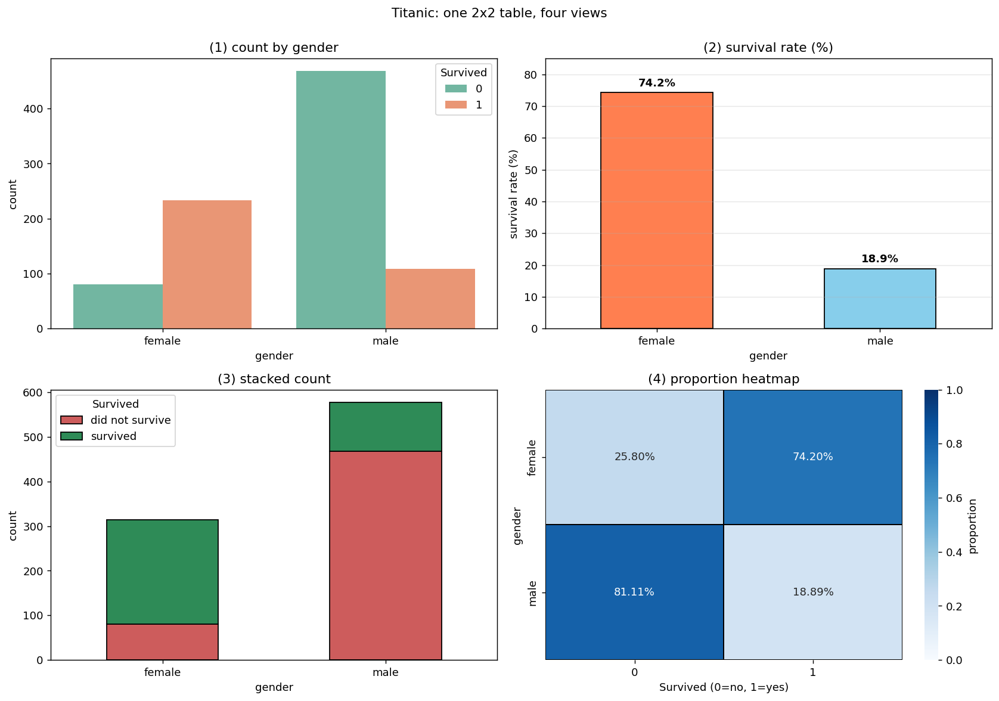
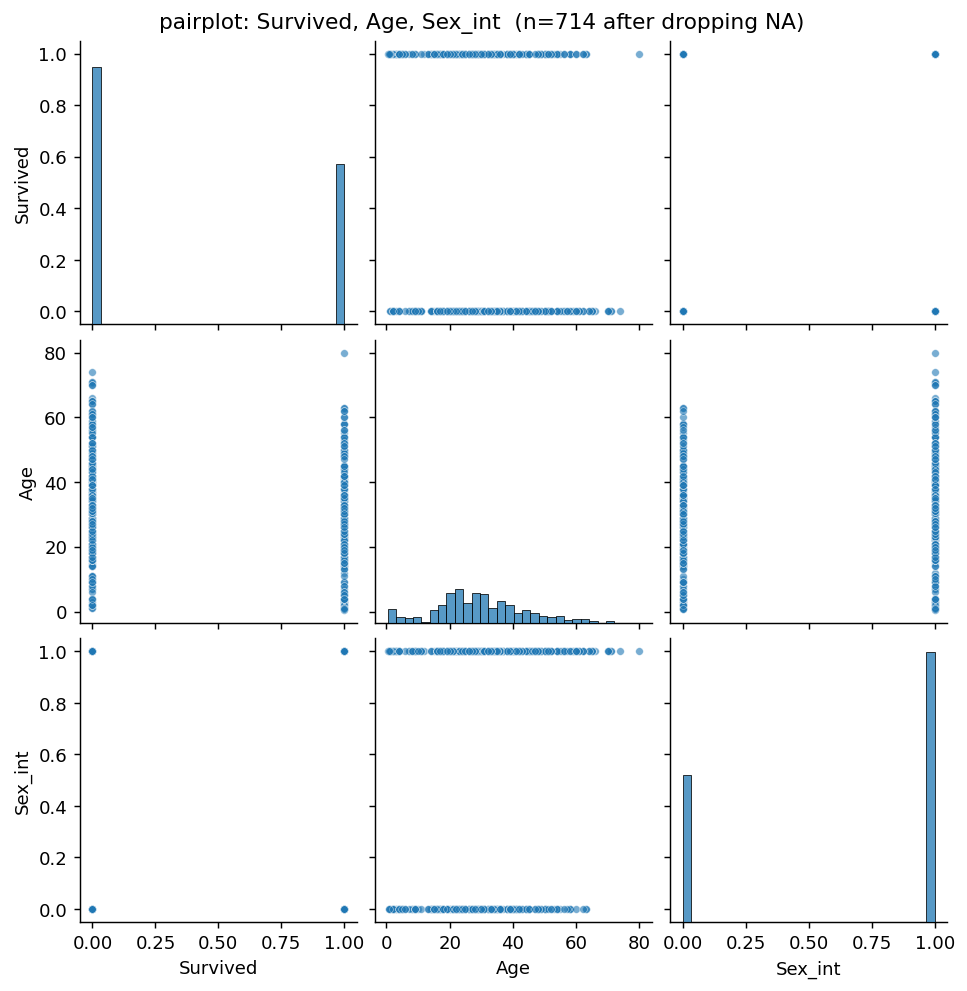

# 사례 연구: 타이타닉 생존과 성별

앞의 두 절은 **한 변수**를 들여다보는 도구였다. 이 절은 하나의 실제 자료에 하나의 질문을 놓고, **두 변수의 관계를 탐색하는 과정 전체**를 처음부터 끝까지 따라간다.

자료는 1912년 타이타닉호 승객 891명의 기록이고, 질문은 하나다.

> **성별과 생존은 관계가 있는가? 있다면 얼마나 강한가?**

같은 질문에 답하는 방법이 다섯 가지다. 상관계수, 분할표, 생존율, 오즈비, 그림. **다섯 가지가 모두 같은 $2\times2$ 표 하나에서 나오는데, 전달하는 정보의 양은 크게 다르다.** 이 절의 목적은 그 차이를 보이는 것이다.

!!! note "이 절에서 쓰는 도구는 다른 절에 각각 설명되어 있다"
    분할표와 독립성은 [모자이크 그림과 도수분포표](../visualization/mosaic.md), 막대그림은 [막대그림](../visualization/bar_charts.md), 쌍그림은 [쌍그림](../visualization/pair_plots.md) 절에서 다룬다. 여기서는 그 도구들을 **한 자료에 차례로 적용해 보는 것**이 목적이므로, 각 도구의 원리는 해당 절에 미룬다.

    **이 절은 탐색까지만 한다.** 눈에 보이는 차이가 우연으로 설명되는지를 따지는 일은 확률과 표본분포를 갖춘 뒤의 일이며, 같은 자료를 그 도구로 끝까지 분석하는 것은 [독립성 검정 - 타이타닉 생존과 성별](../../ch10/test/independence_titanic.md) 절이다.

    자료는 인터넷에서 내려받는다. 네트워크가 없으면 실행되지 않지만, **출력과 그림을 모두 실어 두었으므로 읽는 데는 지장이 없다.**

## 1. 자료와 첫 점검

<div class="codebox" markdown>

### 예제 1. 자료를 불러오고 결측부터 확인하기 { .eg }

```python
import warnings
warnings.filterwarnings("ignore")

import numpy as np
import pandas as pd

# 타이타닉 승객 명부. index_col 로 승객번호를 색인으로 삼는다.
URL = ("https://raw.githubusercontent.com/datasciencedojo/"
       "datasets/master/titanic.csv")
df = pd.read_csv(URL, index_col="PassengerId")

print(f"승객 {df.shape[0]}명, 변수 {df.shape[1]}개\n")

# 무엇이든 하기 전에 결측부터 센다.
# 결측이 있는 변수를 모르고 분석하면 n 이 조용히 줄어든다.
na = df.isna().sum()
print("결측이 있는 변수")
for name, cnt in na[na > 0].items():
    print(f"  {name:9s} {cnt:4d}개  ({cnt / len(df):.1%})")

# 성별을 0/1 로 부호화한다. 1=남성, 0=여성 으로 정했다.
# 이 선택이 뒤에 나올 상관계수의 '부호'를 정한다는 점을 기억해 두자.
df["Sex_int"] = (df["Sex"] == "male").astype(int)

print(f"\n성별 분포")
print(df["Sex"].value_counts().to_string())
print(f"\n생존 분포 (0=사망, 1=생존)")
print(df["Survived"].value_counts().sort_index().to_string())
print(f"\n전체 생존율 {df['Survived'].mean():.4f}")
```

```text
승객 891명, 변수 11개

결측이 있는 변수
  Age        177개  (19.9%)
  Cabin      687개  (77.1%)
  Embarked     2개  (0.2%)

성별 분포
Sex
male      577
female    314

생존 분포 (0=사망, 1=생존)
Survived
0    549
1    342

전체 생존율 0.3838
```

**결측을 먼저 세는 것이 습관이 되어야 한다.** `Age`가 177개(19.9%) 비어 있는데, 이 사실을 모르고 나이를 쓰는 분석을 하면 **표본이 891명에서 714명으로 조용히 줄어든다.** 6절에서 실제로 그런 일이 일어난다.

**이 절의 주된 질문에는 결측이 없다.** `Survived`와 `Sex`는 891명 모두 기록되어 있으므로, 5절까지는 전수를 쓴다.

**성별 부호화는 자의적이다.** 남성을 1로 둘 수도 여성을 1로 둘 수도 있고, 어느 쪽을 골라도 분석의 내용은 같다. 다만 **상관계수의 부호가 뒤집힌다.** 바로 다음에서 이 점이 문제가 된다.

</div>

## 2. 상관계수 하나로 요약하면

두 변수가 모두 0과 1뿐이지만, 피어슨 상관계수를 계산하는 데는 아무 문제가 없다. 공식이 요구하는 것은 두 수치 변수일 뿐이다.

<div class="codebox" markdown>

### 예제 2. 두 이진 변수의 상관은 파이 계수다 { .eg }

```python
# Survived 와 Sex_int 는 둘 다 0/1 이지만 피어슨 공식은 그대로 적용된다.
corr = df[["Survived", "Sex_int"]].corr()
print(corr.round(4).to_string())

r = corr.loc["Survived", "Sex_int"]
print(f"\n상관계수 {r:.4f}")

# 부호를 뒤집어 보면 -- 부호화만 바꾸었을 뿐인데 부호가 바뀐다.
df["Sex_female"] = (df["Sex"] == "female").astype(int)
print(f"\n1=남성 으로 부호화: r = {np.corrcoef(df['Survived'], df['Sex_int'])[0, 1]:+.4f}")
print(f"1=여성 으로 부호화: r = {np.corrcoef(df['Survived'], df['Sex_female'])[0, 1]:+.4f}")
```

```text
          Survived  Sex_int
Survived    1.0000  -0.5434
Sex_int    -0.5434   1.0000

상관계수 -0.5434

1=남성 으로 부호화: r = -0.5434
1=여성 으로 부호화: r = +0.5434
```

**두 이진 변수의 피어슨 상관에는 파이 계수라는 이름이 따로 붙어 있다.** 기호로는 $\varphi$로 쓴다. 이름만 다를 뿐 계산은 지금 한 그대로다.

**그런데 $-0.5434$라는 숫자가 무엇을 말하는가.**

| 묻는 것 | $-0.5434$가 답하는가 |
|---|---|
| 관계가 있는가 | 그렇다 |
| 방향은 | **부호화가 정한다** |
| 여성의 생존율은 | **모른다** |
| 남성의 생존율은 | **모른다** |
| 몇 배 차이인가 | **모른다** |

**부호가 자의적이라는 것이 특히 곤란하다.** 남성을 1로 두면 $-0.54$, 여성을 1로 두면 $+0.54$다. **자료가 아니라 코드 한 줄이 부호를 정한다.** "음의 상관"이라는 서술은 여기서 아무 의미가 없다.

!!! warning "파이 계수는 $\pm1$에 도달하지 못할 수 있다"
    두 변수의 주변 비율이 다르면 $\varphi$의 최댓값이 1보다 작아진다. 여기서는 $\varphi$가 아무리 커도 0.9347을 넘을 수 없으므로, 관측된 $|\varphi|=0.5434$는 **도달 가능한 최댓값의 58%**다. 이것을 모르고 "0.54면 중간 정도"라고 읽으면 강도를 과소평가한다.

    최댓값을 구하는 식과 주변 비율에 따라 그것이 어떻게 달라지는지는 [점이연 상관과 파이 계수](../../ch12/correlation/special_cases.md), [효과크기와 Cramér의 V](../../ch10/practice/effect_size.md) 절에서 다룬다.

</div>

## 3. 분할표가 훨씬 많이 말한다

<div class="codebox" markdown>

### 예제 3. 분할표, 생존율, 오즈비 { .eg }

```python
# margins=True 를 주면 행·열의 합계가 함께 나온다.
print("도수")
print(pd.crosstab(df["Sex"], df["Survived"], margins=True).to_string())

# normalize="index" 는 '각 행의 합이 1이 되도록' 나눈다.
# 즉 성별 안에서의 생존율이다. 무엇을 무엇으로 나누는지가 핵심이다.
pct = pd.crosstab(df["Sex"], df["Survived"], normalize="index") * 100
print("\n성별 안에서의 생존율 (%)")
print(pct.round(2).to_string())

f_rate = pct.loc["female", 1]
m_rate = pct.loc["male", 1]
print(f"\n여성 생존율 {f_rate:.2f}%")
print(f"남성 생존율 {m_rate:.2f}%")
print(f"차이       {f_rate - m_rate:.2f}%포인트")
print(f"비(위험비)  {f_rate / m_rate:.4f}배")

# 오즈비: (여성의 생존 오즈) / (남성의 생존 오즈)
tab = pd.crosstab(df["Sex"], df["Survived"])         # 도수만 담은 표
a = tab.loc["female", 1]; b = tab.loc["female", 0]   # 여성 생존 / 사망
c = tab.loc["male", 1];   d = tab.loc["male", 0]     # 남성 생존 / 사망
print(f"\n여성 오즈 {a}/{b} = {a / b:.4f}")
print(f"남성 오즈 {c}/{d} = {c / d:.4f}")
print(f"오즈비    {(a * d) / (b * c):.4f}")
```

```text
도수
Survived    0    1  All
Sex                    
female     81  233  314
male      468  109  577
All       549  342  891

성별 안에서의 생존율 (%)
Survived      0      1
Sex                   
female    25.80  74.20
male      81.11  18.89

여성 생존율 74.20%
남성 생존율 18.89%
차이       55.31%포인트
비(위험비)  3.9280배

여성 오즈 233/81 = 2.8765
남성 오즈 109/468 = 0.2329
오즈비    12.3507
```

**이제 비로소 말할 수 있는 것이 생겼다.**

| 요약 | 값 | 읽는 법 |
|---|---|---|
| 상관계수 | $-0.5434$ | 관계가 있다 |
| **생존율** | **74.20% 대 18.89%** | **여성 넷 중 셋, 남성 다섯 중 하나** |
| 차이 | 55.31%포인트 | 절대적 격차 |
| 위험비 | 3.93배 | 여성이 약 4배 |
| **오즈비** | **12.35** | 오즈로는 12배 |

**같은 표에서 나온 세 가지 "배율"이 3.93과 12.35로 크게 다르다.** 틀린 것이 아니라 **다른 것을 재고 있다.**

$$
\text{위험비}=\frac{0.7420}{0.1889}=3.93,
\qquad
\text{오즈비}=\frac{0.7420/0.2580}{0.1889/0.8111}=12.35
$$

**위험비는 확률의 비, 오즈비는 오즈의 비**다. 생존율이 0에 가까울 때는 둘이 비슷해지지만, 여기처럼 74%나 되면 크게 벌어진다. **어느 쪽을 보고하든 이름을 정확히 붙여야 한다.**

**전체 생존율 38.38%는 여기서 아무 쓸모가 없다.** 두 집단의 값이 74%와 19%인데 그 평균을 말하는 것은 **양쪽 어느 쪽도 설명하지 않는 수**다.

</div>

## 4. 이 차이는 우연일 수 있는가

여성 74.20%, 남성 18.89%. 55.31%포인트의 차이다.

그런데 891명은 1912년 그 배에 탔던 사람들일 뿐이고, 누가 살아남는가에는 우연이 섞여 있다. 구명정 가까이 있었는가, 갑판 어느 쪽에 서 있었는가 같은 것들이다. 그렇다면 이런 질문이 남는다.

> 성별과 생존이 아무 관계가 없는데도, 단지 우연히 이 정도로 치우친 표가 나올 수 있는가?

**이 질문에는 탐색만으로 답할 수 없다.** "우연히 이 정도"가 얼마나 있을 법한 일인지 재려면 **확률과 표본분포**가 있어야 하고, 그것은 3장부터 세워 나갈 도구다.

답만 미리 말해 두면 **우연으로는 설명되지 않는다.** 생존 여부를 성별과 무관하게 1만 번 무작위로 다시 나눠 주면 여성 생존자는 97명에서 146명 사이에 떨어진다. 실제로는 **233명**이었다. 우연은 근처에도 가지 못한다.

이 수를 어떻게 얻는지는 [독립성 검정](../../ch10/test/independence.md) 절에서, **같은 자료를 그 도구로 끝까지 분석하는 것**은 [독립성 검정 - 타이타닉 생존과 성별](../../ch10/test/independence_titanic.md) 절에서 다룬다.

!!! note "탐색이 하는 일과 하지 않는 일"
    탐색은 **무엇이 보이는가**까지 답한다 — 74% 대 19%, 55%포인트, 오즈비 12.35. **그것이 우연인가**는 답하지 않는다. 이 절이 여기서 멈추는 이유다.

    거꾸로, 검정만 해서도 안 된다. **검정은 "얼마나 차이 나는가"에 답하지 않으므로**, 3절에서 구한 생존율과 오즈비가 검정 결과와 **함께** 보고되어야 한다. 이 절의 탐색은 그 절반을 이미 끝내 놓은 것이다.

## 5. 같은 표를 네 가지로 그리기

<div class="codebox" markdown>

### 예제 4. 네 가지 그림이 각각 다른 것을 강조한다 { .eg }

```python
import matplotlib.pyplot as plt
import seaborn as sns

# 네 칸에서 성별 순서를 하나로 고정한다.
# 칸마다 순서가 다르면 독자가 같은 그림 안에서 두 번 방향을 바꿔 읽어야 한다.
ORDER = ["female", "male"]

fig, axes = plt.subplots(2, 2, figsize=(13, 9))

# (1) 도수 -- 집단 크기가 다르다는 사실이 보인다
sns.countplot(data=df, x="Sex", hue="Survived", order=ORDER,
              ax=axes[0, 0], palette="Set2")
axes[0, 0].set_title("(1) count by gender")
axes[0, 0].set_xlabel("gender"); axes[0, 0].set_ylabel("count")

# (2) 생존율 -- 집단 크기를 지우고 비율만 남긴다
rate = df.groupby("Sex")["Survived"].mean().reindex(ORDER) * 100
rate.plot(kind="bar", ax=axes[0, 1], color=["coral", "skyblue"],
          edgecolor="black")
axes[0, 1].set_title("(2) survival rate (%)")
axes[0, 1].set_xlabel("gender"); axes[0, 1].set_ylabel("survival rate (%)")
axes[0, 1].tick_params(axis="x", rotation=0)
axes[0, 1].grid(True, alpha=0.3, axis="y"); axes[0, 1].set_ylim(0, 85)
for i, v in enumerate(rate):                     # 막대 위에 값을 적어 준다
    axes[0, 1].text(i, v + 2, f"{v:.1f}%", ha="center", fontweight="bold")

# (3) 누적 막대 -- 집단 크기와 구성비를 한 막대에 함께 담는다
tab_o = pd.crosstab(df["Sex"], df["Survived"]).reindex(ORDER)
tab_o.plot(kind="bar", stacked=True, ax=axes[1, 0],
           color=["indianred", "seagreen"], edgecolor="black")
axes[1, 0].set_title("(3) stacked count")
axes[1, 0].set_xlabel("gender"); axes[1, 0].set_ylabel("count")
axes[1, 0].tick_params(axis="x", rotation=0)
axes[1, 0].legend(["did not survive", "survived"], title="Survived")

# (4) 비율 열지도 -- 네 칸의 수를 그대로 읽게 한다
# vmin/vmax 를 0과 1로 고정해야 색의 진하기가 비율과 맞는다.
prop = pd.crosstab(df["Sex"], df["Survived"],
                   normalize="index").reindex(ORDER)
sns.heatmap(prop, annot=True, fmt=".2%", cmap="Blues", ax=axes[1, 1],
            vmin=0, vmax=1, cbar_kws={"label": "proportion"},
            linewidths=1, linecolor="black")
axes[1, 1].set_title("(4) proportion heatmap")
axes[1, 1].set_xlabel("Survived (0=no, 1=yes)")
axes[1, 1].set_ylabel("gender")

fig.suptitle("Titanic: one 2x2 table, four views", y=1.00)
fig.tight_layout()
plt.show()
```



**네 그림이 같은 표에서 나왔는데 강조점이 다르다.**

| 그림 | 잘 보이는 것 | 가려지는 것 |
|---|---|---|
| (1) 도수 | **집단 크기가 다르다**(남 577, 여 314) | 비율 비교가 어렵다 |
| (2) 생존율 | **74.2% 대 18.9%** | 표본 크기가 사라진다 |
| (3) 누적 | 크기와 구성을 함께 | 위쪽 조각의 길이 비교가 어렵다 |
| (4) 열지도 | 네 수를 **정확히** | 크기 감각이 없다 |

**질문이 "얼마나 차이 나는가"이면 (2)가 답한다.** 이 절의 질문에는 (2)가 가장 곧바른 그림이다.

**그러나 (2)만 보면 위험하다.** 비율만 남기고 $n$을 지우므로, **여성이 3명뿐이어도 똑같은 그림**이 나온다. (1)이나 (3)을 함께 놓아 표본 크기를 함께 보여야 한다.

**누적 막대 (3)의 약점은 위쪽 조각이다.** 아래 조각(사망)은 모두 바닥에서 시작하므로 길이를 비교하기 쉽지만, 위 조각(생존)은 시작점이 제각각이라 눈으로 견주기 어렵다. 이것이 누적 막대의 일반적인 한계다.

**색 선택에 관하여.** 열지도에 `RdYlGn`(빨강-노랑-초록)을 쓰는 관행이 있는데, **적록색각 이상이 있는 독자에게는 읽히지 않는다.** 남성의 8% 정도가 여기에 해당하므로, 파랑 계열이나 명도 차가 뚜렷한 색표를 쓰는 편이 안전하다.

</div>

## 6. 쌍그림은 왜 잘 안 되는가

여러 변수를 한꺼번에 훑을 때는 쌍그림이 표준 도구다. 여기에도 써 보자. 나이까지 넣어 세 변수를 본다.

<div class="codebox" markdown>

### 예제 5. 이진 변수에 쌍그림을 쓰면 { .eg }

```python
sub = df[["Survived", "Age", "Sex_int"]]

# seaborn 은 결측이 있는 행을 말없이 버린다. 몇 명이 남는지 직접 센다.
print(f"원래 {len(sub)}명")
print(f"Age 결측 {sub['Age'].isna().sum()}명")
print(f"쌍그림에 실제로 쓰이는 관측 {sub.dropna().shape[0]}명")
print(f"  -> 전체의 {sub.dropna().shape[0] / len(sub):.1%}")

# 버려진 177명이 남은 714명과 다른 사람들인지 확인한다.
# 무작위로 빠진 것이 아니라면 결과가 편향된다.
miss = sub["Age"].isna()
print(f"\n나이가 기록된 승객의 생존율   {df.loc[~miss, 'Survived'].mean():.4f}")
print(f"나이가 빠진 승객의 생존율     {df.loc[miss, 'Survived'].mean():.4f}")
print(f"나이가 기록된 승객의 남성 비율 {df.loc[~miss, 'Sex_int'].mean():.4f}")
print(f"나이가 빠진 승객의 남성 비율   {df.loc[miss, 'Sex_int'].mean():.4f}")

g = sns.pairplot(sub, diag_kind="hist",
                 plot_kws={"alpha": 0.6, "s": 18},
                 diag_kws={"bins": 30})
g.figure.suptitle("pairplot: Survived, Age, Sex_int", y=1.01)
plt.show()
```

```text
원래 891명
Age 결측 177명
쌍그림에 실제로 쓰이는 관측 714명
  -> 전체의 80.1%

나이가 기록된 승객의 생존율   0.4062
나이가 빠진 승객의 생존율     0.2938
나이가 기록된 승객의 남성 비율 0.6345
나이가 빠진 승객의 남성 비율   0.7006
```



**쌍그림이 여기서 두 번 실패한다.**

**첫째, 이진 변수의 산점도는 그림이 아니다.** `Survived`와 `Sex_int`의 칸을 보면 **점이 네 개**다. 891명의 자료가 네 점으로 겹쳐 버렸다. 나머지 칸들도 두 줄로 늘어선 띠일 뿐이어서, 띠의 길이는 나이의 범위를 말하지만 **어느 쪽에 사람이 많은지는 전혀 보이지 않는다.**

**둘째, 177명이 조용히 사라졌다.** 그리고 사라진 사람들이 무작위가 아니다.

| | 생존율 | 남성 비율 |
|---|---|---|
| 나이가 **기록된** 714명 | 0.4062 | 0.6345 |
| 나이가 **빠진** 177명 | **0.2938** | **0.7006** |

**나이가 기록되지 않은 승객은 남성 비율이 높고 생존율이 낮다.** 무작위 결측이 아니므로, 이 714명으로 얻은 결론을 891명 전체에 그대로 옮길 수 없다.

**쌍그림은 연속형 변수를 위한 도구다.** 이진·범주형 변수에는 이 절의 5절에서 쓴 도구들 — 분할표, 막대그림, 모자이크 그림 — 이 맞는다. 자세한 논의는 [쌍그림](../visualization/pair_plots.md) 절에 있다.

**그래도 `Age` 칸 하나는 쓸모가 있다.** 대각선의 나이 히스토그램은 20대에 봉우리가 있고 오른쪽으로 긴 꼬리를 가진 모양을 보여 준다. **세 변수 중 연속형인 하나에 대해서만 쌍그림이 제 일을 한 것이다.**

</div>

## 7. 다섯 가지 요약을 나란히

같은 $2\times2$ 표에서 나온 다섯 가지를 한자리에 모으면 이렇다.

| 요약 | 값 | 강점 | 약점 |
|---|---|---|---|
| 상관계수 $\varphi$ | $-0.5434$ | 한 수, 비교 가능 | **부호가 자의적**, 해석 불가 |
| 분할표 | 81 / 233 / 468 / 109 | **원자료 전부** | 읽는 데 시간이 든다 |
| **생존율** | **74.20% 대 18.89%** | **바로 이해된다** | 표본 크기가 안 보임 |
| 위험비 | 3.93배 | 직관적 | 기저 비율에 의존 |
| 오즈비 | 12.35 | 회귀와 연결 | **일상어가 아니다** |

**보고해야 할 것을 하나만 고른다면 생존율이다.** "여성 74%, 남성 19%"는 통계를 모르는 사람도 곧바로 이해하고, 다른 넷을 모두 되살릴 수 있는 정보를 담고 있다.

**상관계수는 다섯 중 가장 정보가 적다.** 그런데도 "관계의 강도"를 묻는 질문에 가장 먼저 계산되는 일이 잦다. **한 수로 줄이는 대가가 무엇인지 알고 줄여야 한다.**

**다섯 가지 모두가 답하지 않는 질문이 하나 남아 있다.** 4절에서 던진 "이것이 우연인가"이며, 그 답은 [독립성 검정 - 타이타닉 생존과 성별](../../ch10/test/independence_titanic.md) 절에 있다.

!!! tip "이 사례에서 멈추지 말 것"
    이 절은 **성별과 생존의 연관**을 보였을 뿐, **성별 때문에 살았다**는 것을 보이지 않았다.

    타이타닉에서 여성의 생존율이 높았던 데에는 "여성과 어린이 먼저"라는 대피 관행이 작용했겠지만, **객실 등급**도 함께 움직인다. 1등실 승객은 구명정에 가깝고 여성 비율도 달랐다. **등급이 성별과 생존 양쪽에 연결된 교란변수**인 것이다. 등급을 나누어 보면 이야기가 달라질 수 있고, 그런 층별 분석에서 전체 경향이 뒤집히는 현상이 **심슨의 역설**이다.

    등급으로 실제로 층화해 보는 것은 [독립성 검정 - 타이타닉 생존과 성별](../../ch10/test/independence_titanic.md) 절의 연습문제 5에 있다. 연관에서 인과로 넘어가는 문제는 [12장](../../ch12/causation/causation.md)에서 본격적으로 다룬다.

## 정리하며

하나의 $2\times2$ 표를 다섯 가지 방법으로 요약하고 네 가지로 그려 보았다.

- **결측부터 센다.** `Age`의 19.9% 결측이 6절에서 표본을 714명으로 줄였고, 그 177명은 무작위가 아니었다.
- **두 이진 변수의 피어슨 상관은 파이 계수**이며, 관측값은 $-0.5434$였다.
- **상관계수의 부호는 부호화가 정한다.** 자료가 정하는 것이 아니다.
- **생존율(74.20% 대 18.89%)이 가장 잘 전달되는 요약**이고, 상관계수가 가장 정보가 적다.
- **위험비 3.93과 오즈비 12.35는 다른 것을 잰다.** 어느 쪽을 보고하든 이름을 정확히 붙여야 한다.
- **같은 표를 그리는 방법마다 강조점이 다르다.** 비율 그림은 표본 크기를 지우므로 도수 그림과 함께 놓는다.
- **쌍그림은 연속형 변수를 위한 도구다.** 이진 변수에서는 칸이 네 점으로 무너진다.
- **탐색은 "우연인가"에 답하지 않는다.** 그 질문은 4절에서 던져 두고 10장으로 넘겼다.

다음 장에서는 이런 탐색에서 얻은 인상을 **확률의 언어**로 다루기 시작한다.

## 연습문제

<div class="drillbox" markdown>

**연습문제 1.** <span class="diff easy" title="쉬움"></span>
예제 3의 분할표에서 **행 기준 백분율**과 **열 기준 백분율**, **전체 기준 백분율**을 각각 계산하고, 세 가지가 답하는 질문이 어떻게 다른지 말하라.

</div>

??? success "풀이"
    **세 가지 정규화가 모두 다른 조건부확률**이다.

    ```python
    import warnings
    warnings.filterwarnings("ignore")

    import pandas as pd

    URL = ("https://raw.githubusercontent.com/datasciencedojo/"
           "datasets/master/titanic.csv")
    df = pd.read_csv(URL, index_col="PassengerId")

    for how, label in [("index", "행 기준 (성별 안에서)"),
                       ("columns", "열 기준 (생존 여부 안에서)"),
                       ("all", "전체 기준")]:
        t = pd.crosstab(df["Sex"], df["Survived"], normalize=how) * 100
        print(f"\n{label}")
        print(t.round(2).to_string())
    ```

    ```text

    행 기준 (성별 안에서)
    Survived      0      1
    Sex                   
    female    25.80  74.20
    male      81.11  18.89

    열 기준 (생존 여부 안에서)
    Survived      0      1
    Sex                   
    female    14.75  68.13
    male      85.25  31.87

    전체 기준
    Survived      0      1
    Sex                   
    female     9.09  26.15
    male      52.53  12.23
    ```

    **세 표가 서로 다른 질문에 답한다.**

    | 정규화 | 읽는 법 | 예 |
    |---|---|---|
    | **행**($P(\text{생존}\mid\text{성별})$) | "여성 중 몇 %가 살았나" | **74.20%** |
    | **열**($P(\text{성별}\mid\text{생존})$) | "생존자 중 몇 %가 여성인가" | **68.13%** |
    | 전체($P(\text{성별},\text{생존})$) | "전체 승객 중 몇 %가 여성이고 생존했나" | 26.15% |

    **74.20%와 68.13%를 혼동하는 것이 가장 흔한 실수**다. 두 수는 조건과 결과가 뒤바뀐 별개의 확률이다.

    $$
    P(\text{생존}\mid\text{여성})=0.7420,
    \qquad
    P(\text{여성}\mid\text{생존})=0.6813
    $$

    **베이즈 정리가 둘을 잇는다.**

    $$
    P(\text{여성}\mid\text{생존})
    =\frac{P(\text{생존}\mid\text{여성})\,P(\text{여성})}{P(\text{생존})}
    =\frac{0.7420\times0.3524}{0.3838}=0.6813
    $$

    **검산이 맞는다.**

    **이 절의 질문에는 행 기준이 맞다.** "성별이 생존에 영향을 주었는가"를 묻고 있으므로 **성별을 조건으로** 놓아야 한다.

    **열 기준이 맞는 질문도 있다.** "구조된 사람들의 구성은 어땠는가"를 묻는다면 열 기준이다.

    **전체 기준은 주변확률을 되살릴 때 쓴다.** 행을 더하면 성별 비율(35.24%, 64.76%), 열을 더하면 생존 비율(61.62%, 38.38%)이 나온다. $\square$

<div class="drillbox" markdown>

**연습문제 2.** <span class="diff med" title="중간"></span>
$2\times2$ 표를 아래와 같이 두면 파이 계수가

$$
\varphi=\frac{ad-bc}{\sqrt{(a+b)(c+d)(a+c)(b+d)}}
$$

로 쓰인다는 것이 알려져 있다. 이 식을 보면 **$\varphi=0$인 것과 독립인 것이 동치**임을 알 수 있다. 이를 설명하고, $ad=bc$가 무엇을 뜻하는지 밝혀라.

| | $Y=0$ | $Y=1$ |
|---|---|---|
| $X=0$ | $a$ | $b$ |
| $X=1$ | $c$ | $d$ |

</div>

??? success "풀이"
    (위 공식의 유도는 [독립성 검정 - 타이타닉 생존과 성별](../../ch10/test/independence_titanic.md) 절의 연습문제 3에 있다. 여기서는 식을 주어진 것으로 두고 읽는다.)

    **분자만 보면 된다.** 분모는 주변도수의 곱이므로 어느 칸도 비어 있지 않은 한 양수다. 따라서

    $$
    \varphi=0
    \quad\Longleftrightarrow\quad
    ad-bc=0
    \quad\Longleftrightarrow\quad
    ad=bc
    $$

    **$ad=bc$는 오즈비가 1이라는 뜻**이다.

    $$
    \text{OR}=\frac{ad}{bc}=1
    $$

    **이것이 곧 독립이다.** 표기를 확률로 바꾸면

    $$
    \frac{a}{a+b}=\frac{c}{c+d}
    \quad\Longleftrightarrow\quad
    P(Y=0\mid X=0)=P(Y=0\mid X=1)
    $$

    **즉 $X$를 알아도 $Y$의 조건부확률이 바뀌지 않는다.**

    ```python
    import numpy as np

    # ad = bc 인 표를 일부러 만들어 본다.
    # 행 비율을 똑같이 유지하면 자동으로 그렇게 된다.
    tabs = {
        "독립 (비율 동일)":      np.array([[30, 70], [60, 140]]),
        "약한 연관":            np.array([[30, 70], [55, 145]]),
        "이 절의 타이타닉":      np.array([[81, 233], [468, 109]]),
    }
    for lab, T in tabs.items():
        a, b, c, d = T[0, 0], T[0, 1], T[1, 0], T[1, 1]
        n = T.sum()
        phi = (a * d - b * c) / np.sqrt(
            (a + b) * (c + d) * (a + c) * (b + d))
        print(f"{lab:16s} ad={a * d:6d}  bc={b * c:6d}  "
              f"OR={a * d / (b * c):7.4f}  phi={phi:+.4f}")
        print(f"{'':16s} 1행 비율 {a / (a + b):.4f}, "
              f"2행 비율 {c / (c + d):.4f}")
    ```

    ```text
    독립 (비율 동일)       ad=  4200  bc=  4200  OR= 1.0000  phi=+0.0000
                     1행 비율 0.3000, 2행 비율 0.3000
    약한 연관            ad=  4350  bc=  3850  OR= 1.1299  phi=+0.0262
                     1행 비율 0.3000, 2행 비율 0.2750
    이 절의 타이타닉        ad=  8829  bc=109044  OR= 0.0810  phi=-0.5434
                     1행 비율 0.2580, 2행 비율 0.8111
    ```

    **첫 행에서 두 비율이 0.3000으로 정확히 같고 $\varphi$가 정확히 0이다.**

    **세 지표가 같은 것을 다르게 말한다.**

    | 지표 | 독립일 때 | 타이타닉 |
    |---|---|---|
    | $ad-bc$ | $0$ | $8829-109044<0$ |
    | 오즈비 | $1$ | 0.0810 |
    | $\varphi$ | $0$ | $-0.5434$ |

    **오즈비 0.0810의 역수가 12.35**로, 예제 3에서 구한 값이다(표의 행 순서가 반대라 역수로 나왔다). 행과 열의 순서를 어떻게 잡느냐에 따라 $\text{OR}$이 $12.35$로도 $1/12.35$로도 나오므로, **어느 쪽을 분자로 두었는지 반드시 밝혀야 한다.**

    **모자이크 그림이 이 사실을 눈으로 보여 준다.** $ad=bc$이면 두 열의 분할선 높이가 같아져 **선이 일직선으로 이어진다.** [모자이크 그림](../visualization/mosaic.md) 절의 3번에서 다룬 내용이다. $\square$

<div class="drillbox" markdown>

**연습문제 3.** <span class="diff hard" title="어려움"></span>
6절에서 나이 결측이 무작위가 아님을 보았다. 결측을 **버리는 것**과 **평균으로 채우는 것**이 각각 어떤 왜곡을 낳는지 수치로 비교하라.

</div>

??? success "풀이"
    ```python
    import numpy as np
    import pandas as pd

    miss = df["Age"].isna()
    print(f"나이 결측 {miss.sum()}명 / 전체 {len(df)}명\n")

    print("결측 여부에 따른 차이")
    print(f"{'':14s}{'n':>6s}{'생존율':>9s}{'남성 비율':>10s}{'1등실 비율':>11s}")
    for lab, m in [("나이 있음", ~miss), ("나이 없음", miss)]:
        sub = df[m]
        print(f"{lab:14s}{len(sub):>6d}{sub['Survived'].mean():>9.4f}"
              f"{(sub['Sex'] == 'male').mean():>10.4f}"
              f"{(sub['Pclass'] == 1).mean():>11.4f}")
    ```

    ```text
    나이 결측 177명 / 전체 891명

    결측 여부에 따른 차이
                       n      생존율     남성 비율     1등실 비율
    나이 있음            714   0.4062    0.6345     0.2605
    나이 없음            177   0.2938    0.7006     0.1695
    ```

    **나이가 빠진 승객은 남성이 많고(0.7006 대 0.6345), 1등실이 적고(0.1695 대 0.2605), 덜 살아남았다(0.2938 대 0.4062).** 완전 무작위 결측(MCAR)이 아니다.

    **이제 두 처리 방식을 비교한다.**

    ```python
    # (가) 버리기 (listwise deletion)
    drop = df.dropna(subset=["Age"])

    # (나) 평균으로 채우기 (mean imputation)
    fill = df.copy()
    fill["Age"] = fill["Age"].fillna(df["Age"].mean())

    print(f"{'':16s}{'n':>6s}{'평균 나이':>10s}{'나이 SD':>9s}"
          f"{'나이-생존 상관':>13s}")
    for lab, d in [("원자료(관측만)", df.dropna(subset=["Age"])),
                   ("(가) 버리기", drop),
                   ("(나) 평균 대치", fill)]:
        r = np.corrcoef(d["Age"], d["Survived"])[0, 1]
        print(f"{lab:16s}{len(d):>6d}{d['Age'].mean():>10.4f}"
              f"{d['Age'].std(ddof=1):>9.4f}{r:>13.4f}")

    print(f"\n전체 생존율")
    print(f"  참값(891명)        {df['Survived'].mean():.4f}")
    print(f"  (가) 버린 뒤        {drop['Survived'].mean():.4f}")
    print(f"  (나) 대치 후        {fill['Survived'].mean():.4f}")
    ```

    ```text
                         n     평균 나이    나이 SD     나이-생존 상관
    원자료(관측만)           714   29.6991  14.5265      -0.0772
    (가) 버리기            714   29.6991  14.5265      -0.0772
    (나) 평균 대치          891   29.6991  13.0020      -0.0698

    전체 생존율
      참값(891명)        0.3838
      (가) 버린 뒤        0.4062
      (나) 대치 후        0.3838
    ```

    **두 방법이 서로 다른 것을 망친다.**

    | | 표본 크기 | 생존율 | 나이 SD | 나이-생존 상관 |
    |---|---|---|---|---|
    | 참값 | 891 | **0.3838** | — | — |
    | **(가) 버리기** | **714** | **0.4062** | 14.53 | $-0.0772$ |
    | **(나) 평균 대치** | 891 | 0.3838 | **13.00** | $-0.0698$ |

    **(가) 버리기는 생존율을 0.3838에서 0.4062로 부풀린다.** 덜 살아남은 사람들이 통째로 빠졌기 때문이다. 5.8%의 상대적 과대평가다.

    **(나) 평균 대치는 표본 크기와 평균은 지키지만 산포를 줄인다.** 나이의 표준편차가 14.53에서 13.00으로 **10.5% 축소**되었다. 177명 전원에게 똑같은 값(29.70)을 주었으니 당연하다.

    **분산이 줄면 상관도 희석된다.** 나이-생존 상관이 $-0.0772$에서 $-0.0698$로 약해졌다.

    ```python
    # 대치된 177명이 한 점에 쌓였는지 확인한다.
    v = fill.loc[miss, "Age"]
    print(f"\n대치된 177명의 나이: 최소 {v.min():.4f}, 최대 {v.max():.4f}, "
          f"표준편차 {v.std(ddof=1):.4f}")
    print(f"29.70세 근처(±0.5세) 인원: 원자료 "
          f"{((df['Age'] - 29.6991).abs() < 0.5).sum()}명 -> 대치 후 "
          f"{((fill['Age'] - 29.6991).abs() < 0.5).sum()}명")
    ```

    ```text

    대치된 177명의 나이: 최소 29.6991, 최대 29.6991, 표준편차 0.0000
    29.70세 근처(±0.5세) 인원: 원자료 25명 -> 대치 후 202명
    ```

    **29.7세 근처($\pm0.5$세)에 25명이던 것이 202명이 되었다.** 없던 봉우리가 한 칸에 솟는다. **자료에 없던 구조를 만들어 낸 것**이다.

    **권고 넷.**

    1. **결측률과 결측 패턴을 항상 보고**한다.
    2. **결측 여부로 나누어 다른 변수를 비교**한다. 여기서 한 것이 그 점검이다.
    3. **평균 대치는 쓰지 않는다.** 산포를 줄이고 가짜 봉우리를 만든다.
    4. **다중대치(MI)**가 표준 해법이다. 불확실성까지 반영한다.

    **이 절의 주된 분석에는 영향이 없다.** `Survived`와 `Sex`에는 결측이 없으므로 1~5절은 891명 전수를 썼다. 문제는 나이를 끌어들인 6절부터 생긴다. $\square$

<div class="drillbox" markdown>

**연습문제 4.** <span class="diff med" title="중간"></span>
5절의 네 그림 중 **(2) 생존율 막대그림만 보면 위험하다**고 했다. 그 위험을 구체적인 예로 보여라.

</div>

??? success "풀이"
    **비율만 그리면 $n$이 사라진다.** 표본이 3명이든 300명이든 똑같은 막대가 나온다.

    ```python
    # 같은 생존율 74% 대 19% 를 주지만 표본 크기만 다른 세 가지 자료
    # (이름, 여성 생존, 여성 전체, 남성 생존, 남성 전체)
    cases = [("n=8",     3,   4,   1,   4),
             ("n=88",   30,  40,   9,  48),
             ("n=891", 233, 314, 109, 577)]

    print(f"{'자료':>7s}{'여성 생존율':>20s}{'남성 생존율':>20s}{'차이':>10s}")
    for lab, a, n1, c, n2 in cases:
        p1, p2 = a / n1, c / n2
        print(f"{lab:>7s}{f'{p1:.4f} ({a}/{n1})':>18s}"
              f"{f'{p2:.4f} ({c}/{n2})':>18s}{p1 - p2:>+10.4f}")
    ```

    ```text
         자료              여성 생존율              남성 생존율        차이
        n=8      0.7500 (3/4)      0.2500 (1/4)   +0.5000
       n=88    0.7500 (30/40)     0.1875 (9/48)   +0.5625
      n=891  0.7420 (233/314)  0.1889 (109/577)   +0.5531
    ```

    **세 자료의 막대 높이가 사실상 같다.** 0.75/0.25, 0.75/0.19, 0.74/0.19다. **막대그림만 보면 구별할 수 없다.**

    **그런데 왼쪽 자료는 여성 4명, 남성 4명이다.** 여성 한 명이 더 살았거나 덜 살았으면 막대가 0.75에서 0.50이나 1.00으로 튄다. **막대 하나가 사람 한 명에 좌우되는 것**이다. 오른쪽 자료에서 233명 중 한 명이 바뀌면 0.7420이 0.7452가 될 뿐이다.

    **분모를 보여 주면 이 차이가 즉시 드러난다.** `3/4`와 `233/314`는 같은 0.75가 아니다.

    **처방 넷.**

    1. **막대 위에 $n$을 함께 적는다.** `"74.2% (233/314)"` 형식이 가장 좋다.
    2. **도수 그림을 나란히 놓는다.** 5절의 (1)이나 (3)이 그 역할을 한다.
    3. **표본이 아주 작으면 막대그림을 쓰지 않는다.** 점 몇 개를 그대로 보이는 편이 정직하다.
    4. **오차막대를 붙인다.** "이 비율이 얼마나 흔들릴 수 있는가"를 수로 나타내는 방법은 [$p_1-p_2$의 신뢰구간](../../ch08/two_sample_intervals/ci_p_diff.md) 절에서 배운다.

    **가장 나쁜 사례가 실무에서 흔하다.**

    ```text
    "A안 전환율 12%, B안 전환율 8% -- A안 채택"

    → A안 3/25, B안 2/25 였다면?
      사람 한 명 차이다. 아무것도 말할 수 없는 자료다.
    ```

    **비율만 보이고 분모를 숨기는 그림은 의심해야 한다.** $\square$

<div class="drillbox" markdown>

**연습문제 5.** <span class="diff easy" title="쉬움"></span>
두 범주형 변수의 관계를 탐색하는 **절차와 보고 지침**을 정리하라.

</div>

??? success "풀이"
    **탐색 단계의 절차 다섯.**

    ```text
    1. 결측을 센다        ─ 변수별 결측률, 결측 여부에 따른 차이
    2. 분할표를 만든다     ─ 도수 + 행 기준 비율
    3. 효과크기를 구한다   ─ 비율 차이, 위험비, 오즈비
    4. 그린다             ─ 비율 그림 + 도수 그림을 함께
    5. 층화해 본다        ─ 교란이 의심되는 변수로 나누어
    ```

    **여기까지가 이 절의 범위다.** 이어지는 두 단계 — **신뢰구간을 붙이고 검정하는 것** — 은 확률과 표본분포가 필요하며 [8장](../../ch08/two_sample_intervals/ci_p_diff.md)과 [10장](../../ch10/test/independence_titanic.md)에서 다룬다.

    **이 사례의 핵심 수치 넷.**

    | 항목 | 값 |
    |---|---|
    | 생존율 | **74.20% 대 18.89%** |
    | 차이 | 55.31%포인트 |
    | 위험비 | 3.93배 |
    | 오즈비 | 12.35 |
    | $\varphi$ | $-0.5434$ |

    **요약 지표의 선택.**

    | 목적 | 지표 |
    |---|---|
    | **일반 독자에게 전달** | **두 비율을 그대로**(74% 대 19%) |
    | 절대적 영향의 크기 | 비율 차이 |
    | **연구 간 비교·회귀** | **오즈비** |
    | 상관행렬에 넣기 | $\varphi$(주변 비율 병기) |

    **흔한 실수 다섯.**

    | 실수 | 사실 |
    |---|---|
    | 상관계수만 보고 | 부호가 **부호화에 의존**, 해석 불가 |
    | $P(A\mid B)$와 $P(B\mid A)$ 혼동 | 74.20% vs 68.13% |
    | 오즈비를 "몇 배 더 산다"로 | 그것은 **위험비**(3.93) |
    | 비율 막대만 보이기 | $n$이 사라진다 |
    | 층화 없이 인과 주장 | 등급이 교란한다 |

    **세 번째가 언론 보도에서 가장 흔하다.** 오즈비 12.35를 "12배 더 살아남았다"고 쓰면 틀렸다. **생존율의 비는 3.93배**다.

    **보고 형식.**

    ```text
    타이타닉 승객 891명 (결측 없음: Survived, Sex)

      여성 74.20% (233/314) 생존
      남성 18.89% (109/577) 생존

      차이   55.31%포인트
      위험비  3.93
      오즈비 12.35

      관찰자료이므로 인과적 해석은 하지 않는다.
    ```

    **분모, 효과크기, 인과에 대한 유보** — 셋이 모두 들어간 것이 좋은 탐색 보고다. 여기에 **신뢰구간과 검정 결과**까지 붙으면 완전한 보고가 되며, 그 형태는 [10장](../../ch10/test/independence_titanic.md)에 있다.

    **한 문장.** 두 범주형 변수의 관계는 **분할표 하나에 전부 들어 있고**, 상관계수·그림은 그 표를 각각 다른 방식으로 줄인 것이므로, **무엇을 줄였는지 알고 골라야 한다.** $\square$

<div class="drillbox" markdown>

**연습문제 6.** <span class="diff hard" title="어려움"></span>
연습문제 5의 절차 다섯 번째가 **층화**였다. 객실등급 `Pclass`로 나누어 등급별 $2\times2$ 표를 만들고, 성별 효과가 **각 등급 안에서도 유지되는지** 확인하라. 유지된다면 전체 분석은 안전한가?

</div>

??? success "풀이"
    ```python
    import pandas as pd, numpy as np

    URL = "https://raw.githubusercontent.com/datasciencedojo/datasets/master/titanic.csv"
    t = pd.read_csv(URL)

    def measures(a, b, c, d):          # a=여성생존 b=여성사망 c=남성생존 d=남성사망
        r1, r0 = a / (a + b), c / (c + d)
        return r1, r0, r1 - r0, r1 / r0, (a * d) / (b * c)

    print(f"{'Pclass':>7}{'여성생존율':>12}{'남성생존율':>12}"
          f"{'위험차':>10}{'상대위험도':>12}{'오즈비':>10}{'n':>7}")
    for p in (1, 2, 3):
        s = t[t.Pclass == p]
        cc = pd.crosstab(s.Sex, s.Survived)
        R1, R0, RD, RR, OR = measures(cc.loc['female', 1], cc.loc['female', 0],
                                      cc.loc['male', 1],   cc.loc['male', 0])
        print(f"{p:>7}{R1:>12.4f}{R0:>12.4f}{RD:>+10.4f}{RR:>12.4f}{OR:>10.4f}{len(s):>7}")
    ```

    출력:

    ```
     Pclass       여성생존율       남성생존율       위험차       상대위험도       오즈비      n
          1      0.9681      0.3689   +0.5992      2.6246     51.9037    216
          2      0.9211      0.1574   +0.7636      5.8514     62.4510    184
          3      0.5000      0.1354   +0.3646      3.6915      6.3830    491
    ```

    **성별 효과는 세 등급 모두에서 같은 방향으로 유지된다.** 여성의 생존율이 어느 등급에서나 남성보다 높으며, 방향이 뒤집히는 **심슨의 역설은 일어나지 않았다.** 전체 위험차 $+0.5531$이 등급별 $+0.60$, $+0.76$, $+0.36$ 사이에 놓여 있는 것도 일관적이다.

    **그렇다고 전체 분석이 "안전"한 것은 아니다.** 방향은 같아도 **크기가 등급마다 크게 다르다.** 위험차가 3등석에서 $0.36$, 2등석에서 $0.76$으로 두 배 넘게 차이 난다. 전체 수치 하나로 요약하면 이 **교호작용**이 지워진다.

    "여성이 남성보다 55%포인트 더 살아남았다"는 문장은 어느 등급에도 정확히 해당하지 않는 평균이다. 3등석 여성의 생존율 $50.0\%$는 1등석 여성 $96.8\%$의 절반 수준이며, 1등석 **남성**($36.9\%$)과도 크게 벌어지지 않는다. **등급이 성별만큼이나 강한 변수**라는 사실이 전체 표에서는 보이지 않는다.

    **층화가 알려 주는 것 세 가지.**

    | 확인 | 이 자료의 결과 |
    |---|---|
    | 방향이 뒤집히는가(심슨) | 아니다 — 세 등급 모두 같은 방향 |
    | 크기가 일정한가(교호작용) | **아니다** — 위험차 0.36~0.76 |
    | 층이 결과와 관련되는가 | 그렇다 — 등급별 생존율이 크게 다르다 |

    **왜 방향이 안 뒤집혔는데도 층화해야 하는가.** 층화해 보기 **전에는** 뒤집히는지 알 수 없기 때문이다. 심슨의 역설은 드물지만 일어나며, 일어나면 결론이 정반대가 된다. 12장에서 교란을 본격적으로 다루는데, 그때 쓰는 첫 번째 도구가 바로 이 층화표다.

<div class="drillbox" markdown>

**연습문제 7.** <span class="diff med" title="중간"></span>
연습문제 6의 표에서 **위험차·상대위험도·오즈비 세 지표가 등급의 순위를 다르게 매긴다.** 어느 등급의 성별 격차가 가장 큰지 세 지표로 각각 답하고, 왜 갈리는지 설명하라.

</div>

??? success "풀이"
    연습문제 6의 표를 지표별로 다시 읽는다.

    | 지표 | 1등석 | 2등석 | 3등석 | 가장 큰 격차 |
    |---|---:|---:|---:|---|
    | 위험차 | $0.5992$ | $0.7636$ | $0.3646$ | 2등석 > **1등석** > 3등석 |
    | 상대위험도 | $2.6246$ | $5.8514$ | $3.6915$ | 2등석 > **3등석** > 1등석 |
    | 오즈비 | $51.90$ | $62.45$ | $6.38$ | 2등석 > 1등석 > 3등석 |

    **2등석이 셋 모두에서 1위인 것은 일치한다. 그런데 1등석과 3등석의 순서가 뒤집힌다.** 위험차는 1등석($0.60$)이 3등석($0.36$)보다 격차가 크다고 하고, 상대위험도는 3등석($3.69$)이 1등석($2.62$)보다 크다고 한다.

    **모순이 아니라 다른 질문에 답하고 있는 것이다.**

    - **위험차**는 "몇 명이 더 살았는가"를 묻는다. 1등석에서는 여성 96.8%, 남성 36.9%로 절대 차이가 60%포인트다.
    - **상대위험도**는 "몇 배인가"를 묻는다. 3등석은 남성 생존율이 13.5%로 **바닥에 가까워서**, 여성의 50.0%가 3.69배가 된다. 1등석은 남성도 36.9%나 살아남았으므로 배수로는 2.62배에 그친다.

    **기저율이 낮으면 배수가 커진다.** 이것이 갈리는 이유 전부다. $0.5\%$에서 $1\%$로 가는 것도 "2배 증가"이고, $40\%$에서 $80\%$로 가는 것도 "2배 증가"지만 영향받는 사람 수는 전혀 다르다.

    **실무에서 어느 쪽을 쓰는가.**

    | 묻는 것 | 지표 |
    |---|---|
    | 정책 효과, 필요한 자원 | **위험차** (절대 규모) |
    | 위험 요인의 강도 | **상대위험도** (기저율과 무관한 비교) |
    | 회귀·연구 간 통합 | **오즈비** (연습문제 8) |

    **언론에서 상대위험도만 쓰는 것이 문제가 되는 지점이 여기다.** "이 습관이 위험을 두 배로 높인다"는 문장은 기저 위험이 $0.001$이면 $0.002$가 된다는 뜻일 수 있다. **상대위험도는 반드시 기저율과 함께 보고해야 한다.** 위 표에서도 3등석의 상대위험도 $3.69$만 떼어 내면 "3등석 여성이 가장 유리했다"로 읽히지만, 실제 생존율은 50%로 1등석 여성 96.8%의 절반에 불과하다.

<div class="drillbox" markdown>

**연습문제 8.** <span class="diff hard" title="어려움"></span>
생존자만 절반으로 줄이거나 사망자만 3분의 1로 줄인 표를 만들어, **위험차·상대위험도·오즈비·$\varphi$ 가운데 무엇이 변하지 않는지** 확인하라. 이 성질이 왜 중요한가?

</div>

??? success "풀이"
    ```python
    import pandas as pd, numpy as np

    URL = "https://raw.githubusercontent.com/datasciencedojo/datasets/master/titanic.csv"
    t = pd.read_csv(URL)
    ct = pd.crosstab(t.Sex, t.Survived)
    a, b = ct.loc['female', 1], ct.loc['female', 0]
    c, d = ct.loc['male', 1],   ct.loc['male', 0]

    def stats_(a, b, c, d):
        rr = (a / (a + b)) / (c / (c + d))
        orr = (a * d) / (b * c)
        phi = (a * d - b * c) / np.sqrt((a + b) * (c + d) * (a + c) * (b + d))
        return rr, orr, phi

    for label, (A, B, C, D) in [
            ("원자료          ", (a, b, c, d)),
            ("생존자를 1/2 로 ", (a // 2, b, c // 2, d)),
            ("사망자를 1/3 로 ", (a, b // 3, c, d // 3))]:
        rr, orr, phi = stats_(A, B, C, D)
        print(f"{label} a,b,c,d = {A:>3},{B:>3},{C:>3},{D:>3}   "
              f"RR={rr:.4f}  OR={orr:.4f}  phi={phi:.4f}")
    ```

    출력:

    ```
    원자료           a,b,c,d = 233, 81,109,468   RR=3.9280  OR=12.3507  phi=0.5434
    생존자를 1/2 로  a,b,c,d = 116, 81, 54,468   RR=5.6920  OR=12.4115  phi=0.5095
    사망자를 1/3 로  a,b,c,d = 233, 27,109,156   RR=2.1787  OR=12.3507  phi=0.5087
    ```

    **오즈비만 변하지 않는다.** 사망자를 3분의 1로 줄인 표에서 오즈비가 $12.3507$로 소수점 넷째 자리까지 원자료와 같다. 반면 상대위험도는 $3.93$에서 $2.18$로 반 토막 났고, $\varphi$도 $0.5434$에서 $0.5087$로 움직였다.

    (생존자를 절반으로 줄인 행에서 오즈비가 $12.4115$로 아주 조금 다른 것은 $233/2$와 $109/2$가 정수로 나누어떨어지지 않아 생긴 **반올림** 탓이다. 사망자 쪽은 $81$과 $468$이 $3$으로 정확히 나누어떨어져 오즈비가 완전히 보존된다.)

    **대수적으로 당연하다.** 열 하나에 상수 $k$를 곱하면

    $$
    \text{OR} = \frac{(ka)\,d}{b\,(kc)} = \frac{ad}{bc}
    $$

    로 $k$가 약분된다. 행에 곱해도 마찬가지다. **오즈비는 행·열에 어떤 양수를 곱해도 불변**이다. 반면 상대위험도 $\frac{a/(a+b)}{c/(c+d)}$에서는 $a$만 바뀌고 $a+b$도 함께 바뀌므로 약분되지 않는다.

    **왜 중요한가 — 사례-대조 연구.** 희귀질환을 연구할 때 무작위로 표본을 뽑으면 환자가 거의 없다. 그래서 **환자를 다 모으고 대조군을 따로 뽑는다.** 이렇게 하면 표본의 질병 비율이 인위적으로 정해지므로 **상대위험도를 추정할 수 없다.** 위에서 사망자를 3분의 1로 줄이자 상대위험도가 엉뚱한 값이 된 것과 같은 일이다.

    그런데 오즈비는 그대로다. **결과를 기준으로 표본을 뽑아도 오즈비는 모집단의 오즈비를 그대로 추정한다.** 역학에서 오즈비가 표준 지표가 된 이유가 이것이며, 로지스틱 회귀의 계수가 로그 오즈비인 것도 같은 맥락이다(19장).

    **대가도 있다.** 연습문제 7에서 본 대로 오즈비는 직관적으로 읽기 어렵고, 기저율이 높으면 상대위험도와 크게 벌어진다. 여기서도 오즈비 $12.35$ 대 상대위험도 $3.93$으로 세 배 넘게 차이 난다. **"불변성"과 "읽기 쉬움"을 맞바꾼 지표**다.

<div class="drillbox" markdown>

**연습문제 9.** <span class="diff hard" title="어려움"></span>
연습문제 2에서 $\varphi$의 크기가 주변분포에 눌린다고 했다. 이 자료의 주변분포(여성 35.24%, 생존 38.38%)에서 $\varphi$가 가질 수 있는 **최댓값**을 구하고, 관측된 $|\varphi| = 0.5434$가 그 가운데 어디쯤인지 말하라.

</div>

??? success "풀이"
    **주변분포가 결합분포를 가두는 범위부터 구한다.** $p_1 = P(\text{여성})$, $p_2 = P(\text{생존})$이라 하고 $\pi_{11} = P(\text{여성},\ \text{생존})$이라 하면, 네 칸이 모두 음이 아니어야 하므로

    $$
    \max(0,\ p_1+p_2-1) \;\le\; \pi_{11} \;\le\; \min(p_1,\ p_2)
    $$

    이다(**프레셰–회프딩 경계**). $\varphi$는 두 이진 변수의 피어슨 상관계수이므로

    $$
    \varphi = \frac{\pi_{11} - p_1p_2}{\sqrt{p_1(1-p_1)\,p_2(1-p_2)}}
    $$

    이고, $\pi_{11}$의 양 끝을 넣으면 $\varphi$의 범위가 나온다.

    ```python
    import numpy as np, pandas as pd

    URL = "https://raw.githubusercontent.com/datasciencedojo/datasets/master/titanic.csv"
    t = pd.read_csv(URL)
    n = len(t)
    p1 = (t.Sex == 'female').mean()
    p2 = (t.Survived == 1).mean()

    lo, hi = max(0, p1 + p2 - 1), min(p1, p2)
    den = np.sqrt(p1 * (1 - p1) * p2 * (1 - p2))
    phi_min, phi_max = (lo - p1 * p2) / den, (hi - p1 * p2) / den

    print(f"P(여성) = {p1:.4f}   P(생존) = {p2:.4f}")
    print(f"phi 가능 범위: [{phi_min:.4f}, {phi_max:.4f}]")
    print(f"관측 |phi| = 0.5434  ->  가능한 최댓값의 {0.5434/phi_max*100:.1f}%")
    ```

    출력:

    ```
    P(여성) = 0.3524   P(생존) = 0.3838
    phi 가능 범위: [-0.5822, 0.9347]
    관측 |phi| = 0.5434  ->  가능한 최댓값의 58.1%
    ```

    **$\varphi$는 이 표에서 $1$에 도달할 수 없다.** 주변분포가 고정된 이상 최댓값이 $0.9347$이다. $\varphi = 1$이 되려면 "여성이면 반드시 생존, 남성이면 반드시 사망"이어야 하는데, 그러려면 생존자 비율이 여성 비율과 같아야 한다. $35.24\%$와 $38.38\%$가 가까워서 상한이 $0.93$까지 올라간 것이고, 두 비율이 많이 달랐다면 상한이 훨씬 낮았을 것이다.

    **관측값은 가능한 범위의 58%다.** "$0.54$면 중간 정도의 상관"이라는 일반적인 어림이 여기서는 **과소평가**다. 도달 가능한 최댓값 대비로 보면 상당히 강한 연관이다.

    **이것이 $\varphi$의 근본적인 약점이다.** 같은 강도의 연관이라도 주변분포가 불균형하면 $\varphi$가 작게 나온다. 그래서 두 표의 $\varphi$를 직접 비교하는 것은 주변분포가 비슷할 때만 뜻이 있다. 연습문제 8의 오즈비가 이런 눌림을 받지 않는 것과 대조된다.

    | 지표 | 주변분포에 눌리는가 |
    |---|---|
    | $\varphi$ | **그렇다** — 상한이 $1$보다 작을 수 있다 |
    | 상대위험도 | 그렇다 — 기저율에 따라 상한이 달라진다 |
    | 오즈비 | **아니다** — $0$에서 $\infty$까지 자유롭다 |

    보정하려면 $\varphi / \varphi_{\max}$를 쓰는 방법이 있고(크레이머의 $V$와 같은 발상), 애초에 오즈비를 쓰는 방법이 있다. 어느 쪽이든 **$\varphi$를 단독으로 보고하면 안 되고 주변 비율을 함께 적어야 한다**는 연습문제 5의 지침이 여기서 근거를 얻는다.

<div class="drillbox" markdown>

**연습문제 10.** <span class="diff med" title="중간"></span>
"여성과 어린이 먼저"가 실제로 지켜졌는지 자료로 확인하라. 나이를 **어린이($<15$세)·성인**으로 나누고 성별과 교차해 네 집단의 생존율을 구한 뒤, 이 절의 결론을 어떻게 다듬어야 하는지 말하라.

</div>

??? success "풀이"
    ```python
    import numpy as np
    import pandas as pd

    URL = "https://raw.githubusercontent.com/datasciencedojo/datasets/master/titanic.csv"
    t = pd.read_csv(URL)
    a = t.dropna(subset=['Age']).copy()             # 나이 결측 177명 제외
    a['group'] = np.where(a.Age < 15, '어린이', '성인')

    tab = a.groupby(['group', 'Sex']).Survived.agg(['mean', 'size'])
    print(tab.round(4))
    print(f"\n나이 기록된 인원: {len(a)}명 (전체 {len(t)}명)")
    ```

    출력:

    ```
                    mean  size
    group Sex
    성인    female  0.7793   222
          male    0.1739   414
    어린이   female  0.6154    39
          male    0.5385    39

    나이 기록된 인원: 714명 (전체 891명)
    ```

    **어린이에서는 성별 격차가 거의 사라진다.** 성인은 $77.9\%$ 대 $17.4\%$로 $60$%포인트 차이지만, 어린이는 $61.5\%$ 대 $53.8\%$로 $8$%포인트에 불과하다.

    **"여성과 어린이 먼저"라는 규칙의 구조가 그대로 보인다.** 남자아이의 생존율 $53.8\%$는 성인 남성 $17.4\%$의 세 배가 넘는다. 어린이라는 이유로 성인 남성보다 크게 우대받았고, 그 결과 어린이 안에서는 성별이 거의 작동하지 않았다.

    **이 절의 결론을 다듬으면.** "성별이 생존을 강하게 갈랐다"는 맞지만 불완전하다. 더 정확히는

    > **성인에서는 성별이 결정적이었고, 어린이에서는 나이가 성별을 압도했다.**

    가 된다. 전체 오즈비 $12.35$는 이 두 상황을 뭉갠 평균이다.

    **주의할 점 둘.**

    - **나이 결측 $177$명을 버렸다.** 연습문제 3에서 이 결측이 무작위가 아님을 보았으므로, 위 수치는 "나이가 기록된 $714$명"에 대한 것이다.
    - **어린이 표본이 작다.** 여아 $39$명, 남아 $39$명뿐이라 $61.5\%$와 $53.8\%$의 차이는 우연으로도 충분히 설명될 수 있다. 탐색 단계에서는 "격차가 작아 보인다"까지만 말하고, 그 차이가 우연인지 따지는 일은 [10장](../../ch10/test/independence_titanic.md)의 몫이다.

    연습문제 6이 **객실등급**으로 층화한 것과 같은 작업을 **나이**로 한 셈이다. 둘을 함께 놓으면 생존을 가른 변수가 하나가 아니라 셋(성별·등급·나이)이었음이 드러나며, 이 셋을 동시에 다루는 방법이 13장의 회귀와 19장의 로지스틱 회귀다.
