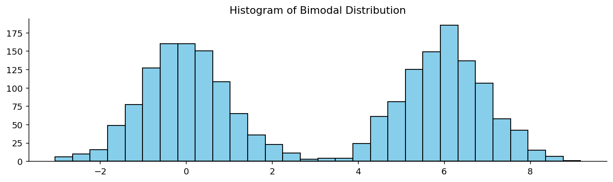

# 봉우리 수

## 개요

분포의 **봉우리 수(modality)** 는 그 모양에 나타나는 뚜렷한 봉우리(최빈값)의 개수를 말한다. 봉우리 수를 파악하는 것은 탐색적 자료분석의 결정적인 첫 단계다. 자료가 하나의 모집단에서 왔는지, 아니면 서로 구별되는 하위집단의 혼합인지를 드러내기 때문이다.

## 단봉 분포

**단봉(unimodal)** 분포는 봉우리가 하나다. 가장 익숙한 예는 정규분포(종 모양 곡선)로, 자료가 하나의 중심값 주위에 몰려 있다.

**예:** 한 나라 성인 여성의 키는 보통 모집단 평균 근처를 중심으로 하는 단봉 분포를 이룬다.

## 이봉 분포

**이봉(bimodal)** 분포는 뚜렷한 봉우리가 둘이며, 자료에 서로 다른 두 집단이나 과정이 섞여 있을 가능성이 높음을 나타낸다.

**예:** 한 학급의 시험 점수는 한 무리의 학생은 열심히 공부하고 다른 무리는 그렇지 않았다면 이봉이 될 수 있다. 높은 점수와 낮은 점수에 봉우리가 생기고 그 사이에 골이 생긴다.

```python
import numpy as np
import matplotlib.pyplot as plt
from scipy import stats

np.random.seed(0)

# Two normal distributions centered at different locations
data_normal_1 = stats.norm().rvs(1_000)
data_normal_2 = stats.norm(loc=6).rvs(1_000)
combined_data = np.concatenate((data_normal_1, data_normal_2))

fig, ax = plt.subplots(figsize=(12, 3))
ax.hist(combined_data, bins=30, color='skyblue', edgecolor='black')
ax.set_title("Histogram of Bimodal Distribution")
ax.spines['top'].set_visible(False)
ax.spines['right'].set_visible(False)
plt.show()
```



두 봉우리가 뚜렷이 보이며, 각각이 구성 정규분포 하나씩에 대응한다.

## 다봉 분포

**다봉(multimodal)** 분포는 봉우리가 둘보다 많다. 흔히 셋 이상의 하위 모집단이 섞일 때 생긴다.

**예:** 대도시권의 통근시간 분포는 도보 거리, 짧은 운전, 긴 통근에 각각 봉우리가 나타날 수 있다.

## 봉우리 수가 중요한 이유

봉우리 수를 탐지하는 것은 분석에 실질적인 결과를 낳는다.

- 이봉이나 다봉 분포는 **평균 같은 요약통계량이 오도할 수 있음**을 알리는 신호다. 평균이 봉우리 사이의 골에 떨어져 실제로는 관측값이 거의 없는 지점을 가리킬 수 있기 때문이다.
- 더 분석하기 전에 자료를 하위집단으로 **분해**해야 함을 시사한다.
- 단봉성을 가정하는 표준적인 모수적 방법(예: t-검정, 정규분포 기반 신뢰구간)이 다봉 자료에는 부적절할 수 있다.

## 봉우리 수의 탐지

흔한 접근법으로는 히스토그램과 밀도 그림의 시각적 검토, 대역폭을 달리한 커널밀도추정(KDE), 그리고 단봉성에 대한 딥 검정 같은 형식적 검정이 있다. 실무에서는 구간 수를 적절히 정한 히스토그램이 가장 간단하고 효과적인 첫 점검이다.

## 연습문제

<div class="drillbox" markdown>

**연습문제 1.** <span class="diff easy" title="쉬움"></span>
남녀가 섞인 모집단에서 얻은 성인 키 자료가 163cm 근처와 176cm 근처에 두 개의 봉우리를 보인다. 이 분포는 단봉인가, 이봉인가, 다봉인가? 어떤 하위집단이 이 모양을 설명할 가능성이 높은가?

</div>

??? success "풀이"
    뚜렷한 봉우리가 두 개이므로 이 분포는 **이봉**이다. 두 하위집단은 거의 확실히 **남성과 여성**이며, 이들의 키 분포는 겹치지만 평균이 다르다(많은 모집단에서 남성은 약 176cm, 여성은 약 163cm). 두 집단을 합치면 히스토그램에 각 성별의 전형적인 키에 대응하는 두 개의 최빈값이 나타난다.

<div class="drillbox" markdown>

**연습문제 2.** <span class="diff easy" title="쉬움"></span>
어떤 연구자가 자료의 평균을 계산해 50을 얻었다. 히스토그램은 대략 30과 70에 봉우리가 있고 50 근처에 골이 있음을 보여준다. 이 경우 평균이 왜 오도하는 요약인지 설명하라.

</div>

??? success "풀이"
    평균 50은 두 봉우리 사이의 골에 떨어지는데, 이 구간에는 실제 관측값이 거의 없다. 즉 "평균"값이 자료의 어떤 전형적인 관측값도 대표하지 못한다는 뜻이다. 이봉 분포에서 평균만 보고하면 자료가 서로 구별되는 두 무리를 담고 있다는 사실이 가려진다. 더 유익한 요약은 각 봉우리의 위치와 퍼짐을 따로 보고하거나, 최소한 30과 70 근처에 봉우리가 있는 이봉 분포임을 밝히는 것이다.

<div class="drillbox" markdown>

**연습문제 3.** <span class="diff easy" title="쉬움"></span>
다음 각각에 해당하리라 예상되는 실제 자료의 예를 들어라. (a) 단봉, (b) 이봉, (c) 봉우리가 셋 이상인 다봉. 각 선택을 정당화하라.

</div>

??? success "풀이"
    **(a) 단봉:** 동질적인 학생 집단에게 잘 설계된 시험을 치렀을 때의 점수 분포. 대부분의 학생이 학급 평균 근처에서 점수를 받고 아주 높거나 아주 낮은 점수는 드물어 봉우리가 하나 생긴다.

    **(b) 이봉:** 대부분의 사람이 걸어서 출근하거나(약 10분 근처의 봉우리) 고속도로로 운전해 출근하는(약 40분 근처의 봉우리) 도시의 통근시간 분포. 그 사이에 해당하는 사람은 적다.

    **(c) 다봉(봉우리 셋 이상):** 올드페이스풀 간헐천의 분출 지속시간 분포. 짧은 분출, 중간 분출, 긴 분출의 여러 무리가 관측되어 왔다. 또 다른 예로는 식료품점의 가격 분포가 있는데, 상품 가격이 \$1, \$3, \$5 같은 흔한 가격대에 몰린다.

<div class="drillbox" markdown>

**연습문제 4.** <span class="diff med" title="중간"></span>
어떤 히스토그램이 이봉으로 보인다고 하자. 더 분석하기 위한 서로 다른 두 전략을 서술하고, 각각이 무엇을 드러낼지 설명하라.

</div>

??? success "풀이"
    **전략 1: 집단 변수로 분해하기.** 그럴듯한 범주형 변수(예: 성별, 처리군, 지역)를 쓸 수 있다면 집단별로 히스토그램을 따로 그린다. 각 집단 안에서 이봉성이 사라지고 하위집단마다 단봉 분포가 나타난다면, 전체의 이봉성이 서로 다른 하위 모집단이 섞여서 생겼음이 확인된다.

    **전략 2: 혼합모형 적합하기.** 두 성분을 갖는 가우시안 혼합모형(GMM)으로 밑바탕 두 분포의 평균, 분산, 혼합 비율을 추정한다. 명시적인 집단 변수 없이도 각 무리의 중심, 퍼짐, 상대적 크기를 드러낸다. 베이즈 정보기준(BIC)으로 두 성분 모형과 한 성분 모형을 비교하여 이봉성이 통계적으로 정당한지 평가할 수 있다.

<div class="drillbox" markdown>

**연습문제 5.** <span class="diff med" title="중간"></span>
하티건과 하티건(1985)의 **딥 검정**은 분포가 단봉이라는 귀무가설을 형식적으로 검정한다. 어떻게 작동하는지 간략히 설명하고 다봉성에 대한 다른 비모수 검정 하나를 제시하라.

</div>

??? success "풀이"
    **딥 검정:** 경험적 누적분포함수와 가장 가까운 *단봉* 누적분포함수(도함수의 변곡이 하나뿐인 것) 사이의 최대 수직 거리를 계산한다. 단봉이라는 귀무가설 아래에서 이 딥 통계량은 작고, 이봉이나 다봉이라는 대립가설 아래에서는 어떤 단봉 누적분포함수도 경험적인 것을 가깝게 근사할 수 없으므로 커진다. (균등분포 귀무가설에서 모의실험으로 계산한) 기준 분포가 $p$-값을 제공한다.

    **대안 — 실버만의 대역폭 검정:** 가우시안 KDE가 많아야 $k$개의 최빈값을 갖게 하는 가장 작은 대역폭 $h$를 찾는다. 이 임계 대역폭이 단봉성 아래에서 기대되는 것보다 유의하게 크면 "최빈값이 많아야 $k$개"라는 귀무가설을 기각한다. 부트스트랩 보정으로 $p$-값을 구한다.

    두 검정 모두 표본 크기가 100 미만이면 검정력이 낮고 매끄러움 가정에 민감할 수 있다. 실무에서는 여러 대역폭에서 KDE 그림을 시각적으로 살펴보는 편이 더 유익한 경우가 많다.

<div class="drillbox" markdown>

**연습문제 6.** <span class="diff med" title="중간"></span>
**혼합모형**은 성분들이 얼마나 떨어져 있느냐에 따라 이봉 분포를 낼 수도 있고 단봉 분포를 낼 수도 있다. 혼합 가중치가 같고 분산도 같은 두 성분 정규혼합에서 성분 간 분리 정도와 관측되는 봉우리 수의 관계를 서술하라.

</div>

??? success "풀이"
    어떤 $\mu > 0$에 대해 $f(x) = 0.5 \cdot \phi(x; -\mu, \sigma) + 0.5 \cdot \phi(x; +\mu, \sigma)$을 생각하자. 이 혼합은 0에 대해 대칭이며, 문제는 0이 극대점(단봉)인지 극소점(이봉)인지다.

    결과(Behboodian 1970): 이 혼합이 **이봉일 필요충분조건은 $\mu/\sigma > 1$** 이다. 말로 하면 다음과 같다.

    - 성분 평균이 $\sigma$ 하나보다 가깝게 떨어져 있으면 혼합은 **단봉**이다. 성분들이 너무 심하게 겹쳐 골이 생기지 않는다.
    - 성분 평균이 $\sigma$ 하나보다 멀리 떨어져 있으면 혼합은 **이봉**이다. 중점에 골이 나타난다.

    여기에는 실용적인 귀결이 있다. 자료가 정말로 서로 다른 두 모집단에서 왔더라도 그 모집단들이 가까이 있으면 히스토그램이 단봉으로 보일 수 있다. 따라서 봉우리 수는 하위 모집단 개수의 정확한 값이 아니라 *하한*이다. 성분의 개수를 추론할 때는 봉우리를 세는 것보다 모형선택(BIC, AIC)과 함께 혼합모형을 적합하는 편이 더 믿을 만하다.

<div class="drillbox" markdown>

**연습문제 7.** <span class="diff hard" title="어려움"></span>
연습문제 6의 관계를 정확히 구하라. 등가중·등분산 두 정규혼합이 **언제** 이봉이 되는가? 임계값을 유도하고 수치로 확인하라.

</div>

??? success "풀이"
    평균이 $\pm a$이고 분산이 $1$인 등가중 혼합의 밀도는

    $$
    f(x) = \tfrac{1}{2}\left[\phi(x-a) + \phi(x+a)\right]
    $$

    이다. 대칭이므로 $x = 0$은 언제나 정류점이고, 그것이 봉우리인지 골인지가 모든 것을 결정한다. 두 번 미분하면 $\phi''(u) = \phi(u)(u^2-1)$이므로

    $$
    f''(0) = \tfrac{1}{2}\left[\phi''(-a)+\phi''(a)\right] = \phi(a)\left(a^2-1\right)
    $$

    이다. 따라서

    $$
    a < 1 \;\Rightarrow\; f''(0)<0 \;\Rightarrow\; x=0 \text{ 이 봉우리} \;\Rightarrow\; \textbf{단봉}
    $$

    $$
    a > 1 \;\Rightarrow\; f''(0)>0 \;\Rightarrow\; x=0 \text{ 이 골} \;\Rightarrow\; \textbf{이봉}
    $$

    이다. 두 평균 사이의 거리가 $s = 2a$이므로 **임계값은 $s = 2\sigma$**다.

    ```python
    import numpy as np
    from scipy import stats

    def analyse(s):
        a = s / 2
        f = lambda x: 0.5 * (stats.norm.pdf(x, -a) + stats.norm.pdf(x, a))
        g = np.linspace(-6, 6, 200_001)
        d = f(g)
        w = 50                                   # 평탄부에 속지 않도록 창으로 비교
        peaks = [g[i] for i in range(w, len(g) - w)
                 if d[i] == d[i - w:i + w + 1].max() and d[i] > d[i - w] and d[i] > d[i + w]]
        merged = []
        for pk in peaks:
            if not merged or abs(pk - merged[-1]) > 0.05:
                merged.append(pk)
        return a * a - 1, merged

    print(f"{'분리 s':>8}{'a^2 - 1':>11}{'봉우리 위치':>26}{'판정':>8}")
    for s in (1.0, 1.5, 1.9, 1.99, 2.0, 2.01, 2.1, 2.5, 3.0):
        sign, peaks = analyse(s)
        print(f"{s:>8.2f}{sign:>+11.4f}{str([round(q, 3) for q in peaks]):>26}"
              f"{('이봉' if len(peaks) > 1 else '단봉'):>8}")
    ```

    출력:

    ```
    분리 s    a^2 - 1                    봉우리 위치      판정
        1.00    -0.7500                     [0.0]      단봉
        1.50    -0.4375                     [0.0]      단봉
        1.90    -0.0975                     [0.0]      단봉
        1.99    -0.0100                     [0.0]      단봉
        2.00    +0.0000                    [-0.0]      단봉
        2.01    +0.0100           [-0.173, 0.173]      이봉
        2.10    +0.1025           [-0.534, 0.534]      이봉
        2.50    +0.5625               [-1.1, 1.1]      이봉
        3.00    +1.2500           [-1.463, 1.463]      이봉
    ```

    **전환이 정확히 $s = 2$에서 일어난다.** $s = 1.99$까지는 봉우리가 $x=0$ 하나이고, $s = 2.01$에서 $\pm 0.173$의 두 봉우리가 생긴다. $a^2-1$의 부호가 완벽한 예측자다.

    **이 결과가 뜻하는 것.**

    - **두 집단이 섞여 있어도 봉우리는 하나뿐일 수 있다.** 남녀 키의 표준편차가 각각 약 $6$cm이고 평균 차이가 약 $13$cm이면 $s \approx 2.2\sigma$로 임계값을 겨우 넘는다. 실제로 성인 키 히스토그램에서 두 봉우리가 뚜렷하게 보이지 않는 이유가 이것이다.
    - **단봉이라고 동질적인 것은 아니다.** 연습문제 2의 교훈이 여기서 강화된다. 봉우리가 하나여도 이질적인 하위집단이 섞여 있을 수 있으며, 그 경우 히스토그램은 아무 경고도 주지 않는다.
    - **$s = 2.01$의 두 봉우리는 $\pm 0.173$에 있다.** 성분 평균 $\pm 1.005$와는 한참 떨어져 있다. **봉우리 위치는 성분 평균이 아니다.**

    가중치나 분산이 다르면 임계값이 달라지며, 일반적인 조건은 훨씬 복잡하다. 그러나 방향은 같다. **분리가 충분히 커야만 봉우리가 갈라진다.** $\square$

<div class="drillbox" markdown>

**연습문제 8.** <span class="diff med" title="중간"></span>
연습문제 5의 형식적 검정이 왜 필요한지 보여라. **KDE의 봉우리를 세는** 흔한 방법으로 이봉을 판정하면 어떤 일이 일어나는가?

</div>

??? success "풀이"
    가장 흔히 쓰이는 방법은 KDE를 그린 뒤 국소 최대점을 세는 것이다. 이 방법의 **거짓양성률과 탐지력을 함께** 재 보자.

    ```python
    import numpy as np
    from scipy.stats import gaussian_kde

    rng = np.random.default_rng(0)

    def n_modes(x):
        g = np.linspace(x.min() - 1, x.max() + 1, 1000)
        d = gaussian_kde(x)(g)                      # 스콧 기본 대역폭
        return sum(1 for i in range(1, len(d) - 1) if d[i] > d[i - 1] and d[i] > d[i + 1])

    R = 300
    print(f"'봉우리 2개 이상'으로 판정할 확률")
    print(f"{'n':>7}{'단봉 자료':>12}{'2.5 sigma':>12}{'3.0 sigma':>12}{'4.0 sigma':>12}")
    for n in (50, 200, 1000, 5000):
        fp = sum(n_modes(rng.normal(0, 1, n)) >= 2 for _ in range(R)) / R
        row = f"{n:>7}{fp:>12.3f}"
        for s in (2.5, 3.0, 4.0):
            hits = sum(n_modes(np.concatenate([rng.normal(-s / 2, 1, n // 2),
                                               rng.normal(s / 2, 1, n // 2)])) >= 2
                       for _ in range(R))
            row += f"{hits / R:>12.3f}"
        print(row)
    ```

    출력:

    ```
    '봉우리 2개 이상'으로 판정할 확률
          n       단봉 자료   2.5 sigma   3.0 sigma   4.0 sigma
         50       0.220       0.463       0.733       0.993
        200       0.257       0.670       0.950       1.000
       1000       0.330       0.970       1.000       1.000
       5000       0.533       1.000       1.000       1.000
    ```

    **첫 열이 문제다.** 완벽하게 단봉인 정규 자료인데도 $22\%$–$53\%$의 확률로 "봉우리가 둘 이상"이라고 판정한다. **그리고 $n$이 커질수록 나빠진다.**

    | $n$ | 단봉 자료에서 오판 | $2.5\sigma$ 탐지 | $3.0\sigma$ 탐지 |
    |---|---|---|---|
    | $50$ | $0.220$ | $0.463$ | $0.733$ |
    | $1000$ | $0.330$ | $0.970$ | $1.000$ |
    | $5000$ | $\mathbf{0.533}$ | $1.000$ | $1.000$ |

    $n = 5000$에서는 **동전을 던지는 것과 다를 바 없다.** 단봉 자료의 절반 이상이 이봉으로 판정된다.

    **왜 $n$이 커질수록 나빠지는가.** 스콧 대역폭은 $n^{-1/5}$로 좁아진다. 자료가 많아질수록 KDE가 더 세밀해지고, 밀도곡선에 **표집 잡음이 만든 작은 물결**이 생긴다. 국소 최대점을 세는 알고리즘은 그 물결 하나하나를 봉우리로 센다.

    **이것이 연습문제 5의 형식적 검정이 필요한 이유다.**

    - **딥 검정**은 관측된 ECDF와 가장 가까운 단봉 분포 사이의 최대 거리를 재고, 그 귀무분포를 알고 있으므로 **거짓양성률을 $\alpha$로 통제한다.**
    - **실버만의 임계 대역폭 검정**은 "봉우리를 $k$개 이하로 만드는 가장 작은 대역폭"을 통계량으로 삼고, 부트스트랩으로 유의성을 판정한다. 대역폭 선택을 자의적으로 두지 않고 **검정의 일부로 만든 것**이 요점이다.

    **그래도 봉우리를 세어 보고 싶다면** 최소한 두 가지를 하라.

    - **과평활 대역폭을 쓴다.** $h = 1.144\,\hat\sigma\,n^{-1/5}$(테렐–스콧 상한)처럼 넉넉한 대역폭을 쓰면 잡음 물결이 줄어든다.
    - **골의 깊이를 요구한다.** 두 봉우리 사이 골이 낮은 봉우리의 $10\%$ 이상 내려가야 한다는 식의 기준을 두면 미세한 물결이 걸러진다.

    두 가지를 함께 적용하면 위 거짓양성률이 $n=5000$에서 $0.53$에서 $0.24$ 정도로 내려간다. **여전히 낮지 않다.** 봉우리 개수는 자료에서 읽어 내기 근본적으로 어려운 양이며, 연습문제 4의 조언 — **하위집단 변수를 찾아 층별로 그려 보라** — 이 여전히 가장 확실한 길이다.

<div class="drillbox" markdown>

**연습문제 9.** <span class="diff med" title="중간"></span>
이봉 분포가 **분석자 때문에** 만들어지는 경우가 있다. 자료 자체는 단봉인데 처리 과정에서 봉우리가 둘로 갈라지는 예를 두 가지 제시하고 모의실험하라.

</div>

??? success "풀이"
    ```python
    import numpy as np
    from scipy.stats import gaussian_kde

    rng = np.random.default_rng(4)

    def n_modes(x, bw="scott"):
        g = np.linspace(np.min(x) - 1, np.max(x) + 1, 1500)
        d = gaussian_kde(x, bw_method=bw)(g)
        return sum(1 for i in range(1, len(d) - 1) if d[i] > d[i - 1] and d[i] > d[i + 1])

    # (1) 두 시점·두 장비에서 잰 자료를 합쳤다 — 보정 오차가 있다
    a = rng.normal(100, 3, 3000)                  # 장비 A
    b = rng.normal(100, 3, 3000) + 7              # 장비 B: +7 만큼 치우쳐 보정됨
    pooled = np.concatenate([a, b])
    print(f"장비별로는 단봉: A {n_modes(a)}개, B {n_modes(b)}개")
    print(f"합치면:          {n_modes(pooled)}개   ← 자료가 아니라 보정 오차")

    # (2) 절단된 자료를 이어 붙였다 — 특정 구간이 기록되지 않았다
    z = rng.normal(0, 1, 20_000)
    censored = z[(z < -0.35) | (z > 0.35)]        # 중앙 구간이 누락됨
    print(f"\n원자료: {n_modes(z)}개")
    print(f"중앙 구간이 누락된 자료: {n_modes(censored)}개   "
          f"(관측 {len(censored)}/{len(z)}개만 남음)")
    ```

    출력:

    ```
    장비별로는 단봉: A 2개, B 1개
    합치면:          2개   ← 자료가 아니라 보정 오차

    원자료: 1개
    중앙 구간이 누락된 자료: 2개   (관측 14563/20000개만 남음)
    ```

    **두 경우 모두 참 분포는 단봉이다.**

    **(1) 측정 장비나 시점이 섞인 경우.** 참 분포는 두 장비 모두 정규분포 하나인데, 보정이 $7$만큼 어긋난 채로 합치면 봉우리가 둘이 된다.

    (출력에서 장비 A가 봉우리 $2$개로 나온 것은 연습문제 8에서 본 바로 그 거짓양성이다. 참 분포는 단봉이며, 스콧 대역폭의 KDE가 잡음 물결을 봉우리로 센 것이다. 이 문제를 다루는 코드조차 그 함정을 피해 가지 못한다는 점이 오히려 연습문제 8의 교훈을 보여 준다.) 이것은 **모집단의 이질성이 아니라 측정 과정의 결함**이다.

    실제로 흔하다. 연구소 두 곳의 결과를 합치거나, 설문 방식을 중간에 바꾸거나, 센서를 교체한 뒤의 자료를 이어 붙일 때 나타난다. **해결책은 통계가 아니라 보정이다.**

    **(2) 자료의 일부가 누락된 경우.** 중앙 구간의 관측이 기록되지 않으면 남은 자료가 이봉으로 보인다. 측정 하한과 상한 사이가 "판독 불가"로 처리되거나, 특정 범위가 다른 시스템으로 넘어가는 경우가 이에 해당한다.

    **어떻게 구별하는가.** 진짜 이질성과 인공물을 가르는 실마리는 대개 **자료 밖에** 있다.

    | 실마리 | 무엇을 시사하는가 |
    |---|---|
    | 봉우리 사이 간격이 딱 떨어지는 수(정확히 $5$, $10$) | 반올림·단위 변환 |
    | 봉우리가 측정 장비·시점·기관과 일치 | 보정 문제 |
    | 골이 정확히 기록 한계나 임계값에 위치 | 절단·검열 |
    | 하위집단 변수로 층화하면 각각 단봉 | **진짜 이질성** |

    마지막 줄이 유일하게 "발견"이라 부를 만한 경우다. **이봉을 보면 먼저 "누가 이 자료를 어떻게 만들었는가"를 물어야 하며,** 그 다음에야 모집단의 구조를 논할 수 있다. 1장의 자료 수집 과정에 대한 논의가 여기서 다시 쓰인다. $\square$

<div class="drillbox" markdown>

**연습문제 10.** <span class="diff med" title="중간"></span>
이봉임을 확인했다면 다음 단계는 성분을 **분리해 내는 것**이다. 가우시안 혼합모형으로 성분을 추정하고, 언제 이것이 실패하는지 보여라.

</div>

??? success "풀이"
    ```python
    import numpy as np
    from sklearn.mixture import GaussianMixture

    rng = np.random.default_rng(5)

    def fit_mixture(sep, n=4000, w=0.5):
        k = int(n * w)
        x = np.concatenate([rng.normal(0, 1, k), rng.normal(sep, 1, n - k)])
        g = GaussianMixture(2, random_state=0, n_init=5).fit(x.reshape(-1, 1))
        order = np.argsort(g.means_.ravel())
        return (g.means_.ravel()[order], np.sqrt(g.covariances_.ravel()[order]),
                g.weights_[order])

    print(f"{'참 분리':>8}{'추정 평균':>22}{'추정 표준편차':>20}{'추정 가중치':>20}")
    for sep in (4.0, 3.0, 2.0, 1.0):
        m, s, w = fit_mixture(sep)
        print(f"{sep:>8.1f}{str(np.round(m, 2)):>22}{str(np.round(s, 2)):>20}"
              f"{str(np.round(w, 2)):>20}")
    print("\n참값: 평균 [0, 분리],  표준편차 [1, 1],  가중치 [0.5, 0.5]")
    ```

    출력:

    ```
    참 분리                 추정 평균             추정 표준편차              추정 가중치
         4.0           [0.04 4.05]         [0.99 1.  ]           [0.5 0.5]
         3.0         [-0.01  3.01]         [1.01 1.01]           [0.5 0.5]
         2.0         [-0.06  2.  ]         [0.95 0.98]         [0.49 0.51]
         1.0         [-0.25  1.21]         [0.81 0.84]         [0.49 0.51]

    참값: 평균 [0, 분리],  표준편차 [1, 1],  가중치 [0.5, 0.5]
    ```

    **분리가 $2$까지는 잘 되고 그 아래에서 무너진다.**

    | 참 분리 | 추정 평균 | 추정 표준편차 |
    |---|---|---|
    | $4.0$ | $[0.04,\ 4.05]$ | $[0.99,\ 1.00]$ |
    | $2.0$ | $[-0.06,\ 2.00]$ | $[0.95,\ 0.98]$ |
    | $1.0$ | $[-0.25,\ \mathbf{1.21}]$ | $[\mathbf{0.81},\ \mathbf{0.84}]$ |

    분리 $1$에서는 평균이 참값 $[0, 1]$ 대신 $[-0.25, 1.21]$로 **바깥으로 벌어지고** 표준편차는 $0.81$로 **과소추정**된다. 성분들이 서로를 밀어내며 자료를 억지로 둘로 가른 결과다.

    분리 $2$에서 여전히 잘 되는 것도 눈여겨보라. 연습문제 7에 따르면 분리 $2$는 **밀도가 단봉인** 경계다. 즉 **눈으로 봉우리가 보이지 않아도 혼합모형은 성분을 되찾을 수 있다.** 혼합모형은 봉우리를 세는 것이 아니라 분포 모양 전체를 쓰기 때문이다.

    **왜 실패하는가.** 성분이 겹치면 **가능도함수가 평평해진다.** 서로 다른 모수 조합이 거의 같은 가능도를 주므로, 자료가 어느 쪽인지 가려낼 정보를 담고 있지 않다. 이것은 알고리즘의 결함이 아니라 **식별의 한계**다.

    **혼합모형을 쓸 때 반드시 알아야 할 것들.**

    - **혼합모형은 언제나 답을 준다.** 단봉 자료에 $2$성분 혼합을 적합해도 오류 없이 두 성분을 돌려준다. 앞 절 비지도학습 연습문제 10에서 본 것과 같은 구조다. **적합되었다는 사실 자체는 증거가 아니다.**
    - **성분 개수는 BIC로 고르되 겸손하게 해석하라.** BIC가 $2$성분을 고르더라도, 그것은 "$1$성분보다 낫다"이지 "실제로 두 집단이 있다"가 아니다. 치우친 단봉 분포는 흔히 $2$개 이상의 정규 성분으로 더 잘 적합된다.
    - **레이블 교환 문제.** 성분에는 고유한 번호가 없으므로 여러 번 적합하면 순서가 바뀐다. 위 코드가 평균으로 정렬한 이유다.
    - **정규 성분이라는 가정이 강하다.** 참 분포가 치우쳐 있으면 혼합모형이 그 치우침을 "두 개의 정규"로 설명하려 든다.

    **가장 신뢰할 만한 검증은 외부 정보다.** 추정된 성분 소속이 **혼합 적합에 쓰지 않은 변수**와 연관되는지 확인하라. 키 자료를 두 성분으로 나누었을 때 그 소속이 실제 성별과 일치한다면 그것은 강력한 증거다. 그렇지 않다면 수학적 분해에 그친다. $\square$

---

## 정리하며

봉우리 수는 자료의 구조에 관한 핵심 정보를 준다. 단봉 분포는 하나의 동질적인 모집단을 시사하고, 이봉이나 다봉 모양은 따로 살펴볼 가치가 있는 하위집단이 밑바탕에 있음을 가리킨다.
