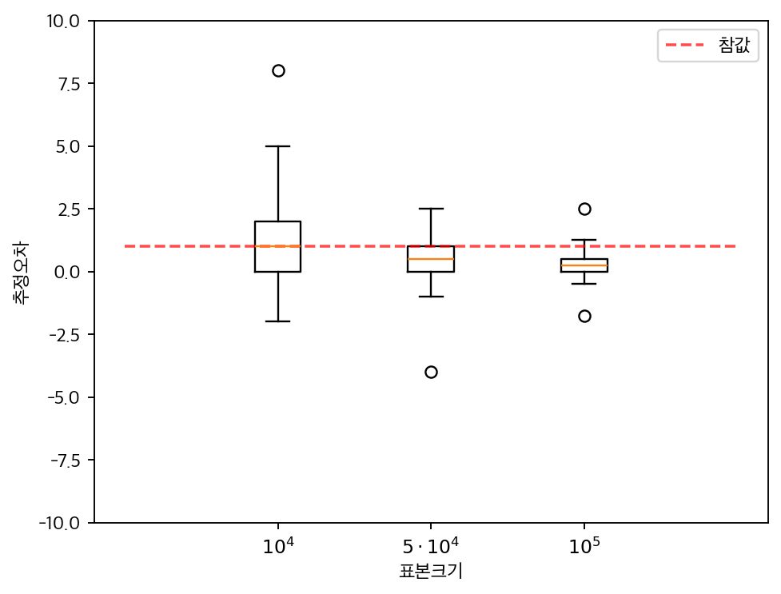

# 이상치와 지렛대점

## 개요

**이상치(outlier)** 는 자료의 다른 관측값과 크게 다른 자료점이다. 유난히 크거나 작을 수 있으며, 자료의 변동성이나 자료 수집 과정의 오류에서 생길 수도 있고 더 살펴볼 가치가 있는 특별한 사례를 가리킬 수도 있다. 이상치를 탐지하고 이해하는 일은 평균, 분산, 회귀모형 같은 통계 분석을 왜곡할 수 있기 때문에 매우 중요하다.

---

## 1. 이상치의 유형

**일변량 이상치:** 하나의 변수에 대해 특이한 경우. 예를 들어 학생 키 자료에서 다른 사람들에 비해 극단적으로 작거나 큰 사람.

**다변량 이상치:** 각 변수를 따로 보면 정상으로 보이지만, 여러 변수 사이의 관계를 살펴보면 특이한 양상이 드러나는 경우.

## 2. 이상치의 원인

- **측정오차:** 자료 입력 실수, 기기 오류, 측정 과정의 부정확성.
- **실험오차:** 자료 수집 중의 비정상적 조건.
- **자연적 변동:** 연구 대상 체계에 내재한 변동성.
- **표집오차:** 드문 사례가 자료에 포함되거나 표본 크기가 불충분한 경우.

## 3. 이상치의 영향

**중심경향에 대한 영향:** 이상치는 평균을 극단값 쪽으로 끌어당겨 평균을 부정확한 대표값으로 만든다. 예를 들어 소규모 급여 표본에 최고경영자의 급여가 들어가면 평균이 크게 위로 치우칠 수 있다.

**변동성에 대한 영향:** 분산과 표준편차는 극단값에 민감하므로 이상치가 이들을 부풀린다.

**통계 모형에 대한 영향:** 이상치는 회귀모형에 불균형하게 큰 영향을 미쳐 일반화 가능성을 떨어뜨리는 오도된 계수나 편향된 계수를 낳을 수 있다.

---

## 4. 이상치 식별하기

### 상자그림 방법

$Q_1$이나 $Q_3$에서 $1.5 \times \text{IQR}$을 벗어난 자료점을 이상치로 표시한다.

- 아래쪽 울타리: $Q_1 - 1.5 \times \text{IQR}$
- 위쪽 울타리: $Q_3 + 1.5 \times \text{IQR}$

### Z-점수 방법

Z-점수는 자료점이 평균에서 표준편차 몇 배만큼 떨어져 있는지를 잰다. 보통 $|Z| > 3$인 점을 이상치로 본다.

$$
Z = \frac{x - \mu}{\sigma}
$$

### IQR 방법

$Q_1 - 1.5 \times \text{IQR}$보다 작거나 $Q_3 + 1.5 \times \text{IQR}$보다 큰 값을 이상치로 분류한다.

### 산점도 (다변량)

다변량 자료에서는 산점도가 전체적인 패턴이나 추세에서 크게 벗어난 점들을 드러낼 수 있다.

### 쿡 거리 (회귀)

쿡 거리는 회귀모형의 예측에 큰 영향을 미치는 영향력 있는 자료점을 찾아낸다. 값이 크면 지렛대를 가진 잠재적 이상치임을 나타낸다.

---

## 5. 다섯 수치 요약

다섯 수치 요약은 간결한 기술을 제공하며 상자그림을 통해 잠재적 이상치를 자연스럽게 부각한다.

$$
\text{Min} \quad Q_1 \quad \text{Median} \quad Q_3 \quad \text{Max}
$$

<div class="exbox" markdown>

**보기 1.** <span class="diff easy" title="쉬움"></span> 두 규칙이 엇갈릴 때. 자료 $1, 2, 0, 0, 0, 1, 3, 1, 2, 1, 2, 4, 5, -1, -2, 0, 8$($n = 17$)에서 마지막 $8$이 홀로 떨어져 있다.

**(1)** 다섯 수치 요약과 $1.5\,\text{IQR}$ 울타리를 손으로 구하고, 어느 값이 표시되는지 말하시오.

**(2)** 같은 자료에 $\lvert Z\rvert > 3$ 규칙을 적용하면 아무것도 표시되지 않는다. 표본 $Z$-점수에 **천장**이 있어서인데, 그 천장이 $\sqrt{n-1}$(표준편차를 `ddof=0`으로 잴 때)과 $(n-1)/\sqrt{n}$(`ddof=1`일 때)임을 보이고, $n \le 10$이면 $\lvert Z\rvert > 3$이 **불가능**함을 보이시오.

</div>

??? success "풀이"

    **(1) 해석적으로.** `numpy`의 기본 분위수는 정렬된 자료를 선형보간한다. 비율 $p$의 분위수는 색인 $p(n-1)$ 자리의 값이다. 정렬하면

    $$
    -2,\ -1,\ 0,\ 0,\ 0,\ 0,\ 1,\ 1,\ 1,\ 1,\ 2,\ 2,\ 2,\ 3,\ 4,\ 5,\ 8
    $$

    이고 $n = 17$이므로 $p(n-1) = 16p$가 $p = 0.25, 0.5, 0.75$에서 각각 $4, 8, 12$로 **정수에 딱 떨어진다.** 보간할 것이 없다. 색인은 $0$부터 세므로

    $$
    Q_1 = x_{[4]} = 0, \qquad Q_2 = x_{[8]} = 1, \qquad Q_3 = x_{[12]} = 2
    $$

    이고 최솟값 $-2$, 최댓값 $8$이다. 따라서 $\text{IQR} = 2 - 0 = 2$이고 울타리는

    $$
    [\,Q_1 - 1.5\,\text{IQR},\; Q_3 + 1.5\,\text{IQR}\,] = [\,0 - 3,\; 2 + 3\,] = [-3,\ 5]
    $$

    다. $8 > 5$이므로 **$8$만 표시된다.** 두 번째로 큰 $5$는 울타리 위에 정확히 걸터앉아 있고, 규칙이 "초과"이므로 표시되지 않는다. 아래쪽의 $-2$도 $-3$ 안쪽이라 무사하다.

    **(2) 해석적으로 — $Z$-점수의 천장.** 편차를 $d_i = x_i - \bar x$라 하자. $\sum_i d_i = 0$이므로 어느 $i$에 대해서도

    $$
    d_i = -\sum_{j \ne i} d_j
    $$

    이고, 코시–슈바르츠 부등식을 오른쪽에 쓰면

    $$
    d_i^2 = \left(\sum_{j \ne i} d_j\right)^{\!2} \le (n-1)\sum_{j \ne i} d_j^2 = (n-1)\left(S - d_i^2\right),
    \qquad S := \sum_{j} d_j^2
    $$

    다. 정리하면 $n\,d_i^2 \le (n-1)S$, 곧

    $$
    d_i^2 \le \frac{n-1}{n}\,S
    $$

    이다. 이제 표준편차를 어떻게 재느냐만 넣으면 된다.

    - `ddof=0`이면 $S = n s_0^2$이므로 $d_i^2 \le (n-1)s_0^2$, 곧 $\lvert Z_i \rvert \le \sqrt{n-1}$.
    - `ddof=1`이면 $S = (n-1)s_1^2$이므로 $d_i^2 \le \frac{(n-1)^2}{n}s_1^2$, 곧 $\lvert Z_i \rvert \le \dfrac{n-1}{\sqrt{n}}$.

    두 천장의 비는 $\sqrt{(n-1)/n}$이고, 이는 $s_1 = s_0\sqrt{n/(n-1)}$에서 바로 따라온다. **`numpy.std`의 기본은 `ddof=0`이고 `pandas.Series.std`의 기본은 `ddof=1`이므로, 같은 자료의 $Z$-점수가 두 라이브러리에서 다르게 나온다.**

    등호는 코시–슈바르츠의 등호 조건, 곧 $j \ne i$인 $d_j$가 모두 같을 때 성립한다. **한 점만 멀리 떨어뜨리고 나머지를 한자리에 모으면 천장에 정확히 닿는다.**

    천장이 $3$ 이하이면 $\lvert Z\rvert > 3$은 아예 불가능하다. 느슨한 쪽인 $\sqrt{n-1}$로 따져도

    $$
    \sqrt{n-1} \le 3 \iff n \le 10
    $$

    이다. $n = 10$에서는 $\sqrt{n-1} = 3$으로 **정확히 경계**이며, 규칙이 초과를 요구하므로 역시 아무것도 잡지 못한다. $n = 11$이 되어야 $\sqrt{10} = 3.1623$으로 겨우 문이 열린다.

    **(3) 수치적으로.**

    ```python
    import numpy as np
    import matplotlib.pyplot as plt

    plt.rcParams["font.sans-serif"] = ["NanumGothic", "Apple SD Gothic Neo", "Malgun Gothic"]
    plt.rcParams["font.family"] = "sans-serif"
    plt.rcParams["axes.unicode_minus"] = False            # 음수 기호가 네모가 되지 않게

    # 마지막 8 이 나머지에서 멀리 떨어져 있다.
    data = np.array([1, 2, 0, 0, 0, 1, 3, 1, 2, 1, 2, 4, 5, -1, -2, 0, 8])

    # 다섯 수치 요약은 분위수 다섯 개다. 0과 1이 각각 최솟값과 최댓값이 된다.
    quantiles = {"최솟값": 0, "제1사분위수": 0.25, "중앙값": 0.5,
                 "제3사분위수": 0.75, "최댓값": 1}

    for label, q in quantiles.items():
        print(f"{label} : {np.quantile(data, q)}")

    # 상자그림은 이 다섯 수치를 그대로 그린 것이다. 상자의 위아래가 Q3와 Q1,
    # 가운데 선이 중앙값이고, 수염 밖의 점이 이상치로 찍힌다.
    fig, ax = plt.subplots(figsize=(2, 3))
    ax.boxplot(data)
    ax.set_title("상자그림")
    plt.show()
    ```

    출력:

    ```
    최솟값 : -2
    제1사분위수 : 0.0
    중앙값 : 1.0
    제3사분위수 : 2.0
    최댓값 : 8
    ```

    손으로 구한 다섯 수치와 같다. 이제 울타리와 $Z$-점수를 나란히 본다.

    ```python
    import numpy as np

    data = np.array([1, 2, 0, 0, 0, 1, 3, 1, 2, 1, 2, 4, 5, -1, -2, 0, 8])
    n = len(data)

    q1, med, q3 = np.quantile(data, [0.25, 0.5, 0.75])
    iqr = q3 - q1
    lo, hi = q1 - 1.5 * iqr, q3 + 1.5 * iqr
    print(f"정렬 {np.sort(data)}")
    print(f"Q1 = {q1}, 중앙값 = {med}, Q3 = {q3}, IQR = {iqr}")
    print(f"울타리 [{lo}, {hi}]  ->  표시되는 값 {data[(data < lo) | (data > hi)]}")

    # 같은 자료를 Z 점수 규칙은 어떻게 보는가. 표준편차의 ddof 에 따라 답이 달라진다.
    # numpy.std 의 기본은 ddof=0, pandas.Series.std 의 기본은 ddof=1 이다.
    z0 = (data - data.mean()) / data.std(ddof=0)
    z1 = (data - data.mean()) / data.std(ddof=1)
    j = int(np.argmax(data))
    print(f"\n평균 {data.mean():.4f}   s(ddof=0) {data.std(ddof=0):.4f}   s(ddof=1) {data.std(ddof=1):.4f}")
    print(f"8 의 Z 점수 : ddof=0 이면 {z0[j]:.4f},  ddof=1 이면 {z1[j]:.4f}   둘 다 3 미만")
    print(f"천장        : sqrt(n-1) = {np.sqrt(n - 1):.4f},  (n-1)/sqrt(n) = {(n - 1) / np.sqrt(n):.4f}")

    # 8 자신이 자기를 재는 자를 얼마나 움직였는가.
    rest = data[data != 8]
    print(f"8 을 뺀 16 개: 평균 {rest.mean():.4f},  s(ddof=1) {rest.std(ddof=1):.4f}")

    # 천장은 n 이 작을수록 낮다. 한 점만 아주 멀리 둔 배열이 그 천장에 닿는다.
    print(f"\n{'n':>4}{'sqrt(n-1)':>12}{'도달 max|Z|':>13}{'(n-1)/sqrt(n)':>15}{'도달 max|Z|':>13}{'|Z|>3 가능?':>13}")
    for m in (5, 8, 10, 11, 17, 50):
        x = np.zeros(m)
        x[-1] = 1e9
        a0 = np.abs((x - x.mean()) / x.std(ddof=0)).max()
        a1 = np.abs((x - x.mean()) / x.std(ddof=1)).max()
        print(f"{m:>4}{np.sqrt(m - 1):>12.4f}{a0:>13.4f}{(m - 1) / np.sqrt(m):>15.4f}{a1:>13.4f}"
              f"{str(np.sqrt(m - 1) > 3):>13}")
    ```

    출력:

    ```
    정렬 [-2 -1  0  0  0  0  1  1  1  1  2  2  2  3  4  5  8]
    Q1 = 0.0, 중앙값 = 1.0, Q3 = 2.0, IQR = 2.0
    울타리 [-3.0, 5.0]  ->  표시되는 값 [8]

    평균 1.5882   s(ddof=0) 2.3278   s(ddof=1) 2.3994
    8 의 Z 점수 : ddof=0 이면 2.7544,  ddof=1 이면 2.6722   둘 다 3 미만
    천장        : sqrt(n-1) = 4.0000,  (n-1)/sqrt(n) = 3.8806
    8 을 뺀 16 개: 평균 1.1875,  s(ddof=1) 1.7970

       n   sqrt(n-1)    도달 max|Z|  (n-1)/sqrt(n)    도달 max|Z|    |Z|>3 가능?
       5      2.0000       2.0000         1.7889       1.7889        False
       8      2.6458       2.6458         2.4749       2.4749        False
      10      3.0000       3.0000         2.8460       2.8460        False
      11      3.1623       3.1623         3.0151       3.0151         True
      17      4.0000       4.0000         3.8806       3.8806         True
      50      7.0000       7.0000         6.9296       6.9296         True
    ```

    **두 규칙이 엇갈린다.** $1.5\,\text{IQR}$은 $8$을 표시하는데 $\lvert Z\rvert > 3$은 아무것도 표시하지 않는다. $8$의 $Z$-점수가 `ddof` 를 어느 쪽으로 잡든 $2.67$–$2.75$로 $3$에 못 미치기 때문이다. 연습문제 7의 **가려짐**이 작은 규모로 일어난 것이다. $8$ 자신이 평균을 $1.19$에서 $1.59$로 끌어올리고 표준편차를 ($8$을 뺀 $16$개만 보면 $1.80$인데) $2.40$까지 부풀려 놓았다.

    **천장은 정확히 맞는다.** 가운데 두 열과 네 번째 열을 견주면, 한 점만 멀리 띄운 배열의 $\max\lvert Z\rvert$가 $\sqrt{n-1}$과 $(n-1)/\sqrt{n}$에 소수점 넷째 자리까지 닿는다. 코시–슈바르츠의 등호 조건이 바로 이 배열이다. $n = 10$의 `ddof=0` 천장이 **정확히 $3.0000$** 이라는 것도 눈여겨보라. 등호는 초과가 아니므로 $n \le 10$에서는 어떤 자료를 가져와도 $\lvert Z\rvert > 3$인 점이 **단 하나도 나올 수 없다.**

    **그러므로 작은 표본에 $\lvert Z\rvert > 3$ 규칙을 쓰는 것은 규칙을 쓰지 않는 것과 같다.** $n = 17$인 이 자료에서도 천장이 $4$에 불과해, 규칙이 걸러 낼 수 있는 폭이 $3$에서 $4$ 사이뿐이다. 분위수에 기댄 $1.5\,\text{IQR}$ 쪽에는 이런 천장이 없다 — 울타리가 $Q_1, Q_3$만으로 정해지고 바깥 값이 얼마나 크든 상관하지 않기 때문이다. 같은 이유를 연습문제 7이 **붕괴점**의 말로 다시 한다.

### 비교 상자그림

상자그림은 집단이나 조건에 걸쳐 분포를 비교할 때 특히 효과적이다.

<div class="exbox" markdown>

**보기 2.** <span class="diff easy" title="쉬움"></span> 나란히 놓은 상자그림을 읽기. 표본크기 $10^4,\ 5\cdot 10^4,\ 10^5$에서 잰 추정오차라며 세 자료를 한 축에 늘어놓는다.

**(1)** 오차가 $1/\sqrt{n}$으로 줄어든다면 IQR 의 비가 얼마여야 하는가. 그려진 세 자료의 IQR 비와 견주시오.

**(2)** 세 집단에서 $1.5\,\text{IQR}$ 규칙이 표시하는 값을 구하고, 이 그림이 **보여 주지 못하는 것**을 적으시오.

</div>

??? success "풀이"

    **(1) 해석적으로.** 추정량의 오차가 $\hat\theta - \theta = c\,W/\sqrt{n}$ 꼴이고 $W$의 분포가 $n$에 의존하지 않는다면, 분위수는 선형변환에 따라가므로

    $$
    \text{IQR}_n = \frac{c}{\sqrt{n}}\,\text{IQR}(W)
    $$

    이다. 따라서 표본크기를 $n_1$에서 $n_2$로 키울 때 IQR 의 **축소 배수**는

    $$
    \frac{\text{IQR}_{n_1}}{\text{IQR}_{n_2}} = \sqrt{\frac{n_2}{n_1}}
    $$

    이다. 그림의 이름표가 말하는 $10^4 \to 5\cdot10^4$에서는 $\sqrt{5} = 2.2361$, $5\cdot10^4 \to 10^5$에서는 $\sqrt{2} = 1.4142$, 전체로는 $\sqrt{10} = 3.1623$이어야 한다. **두 걸음의 배수가 서로 달라야 한다는 것이 핵심이다.** 첫 걸음은 $n$을 다섯 배, 둘째 걸음은 두 배 키우므로 같은 배수로 줄어들 수 없다.

    **(2) 수치적으로.**

    ```python
    import numpy as np
    import matplotlib.pyplot as plt

    plt.rcParams["font.sans-serif"] = ["NanumGothic", "Apple SD Gothic Neo", "Malgun Gothic"]
    plt.rcParams["font.family"] = "sans-serif"
    plt.rcParams["axes.unicode_minus"] = False            # 음수 기호가 네모가 되지 않게

    # 표본크기를 키워 가며 잰 오차라고 하자. 셋 다 참값 1 근처를 겨냥한다.
    data_a = np.array([1, 2, 0, 0, 0, 1, 3, 1, 2, 1, 2, 4, 5, -1, -2, 0, 8])
    data_b = np.array([1, 2, 0, 0, 0, 1, 3, 1, 2, 1, 2, 4, 5, -1, -2, 0, -8]) * 0.5
    data_c = np.array([1, 2, 0, 0, 0, 1, 3, 1, 2, 1, 2, 4, 5, -1, -2, 0, 10, -7]) * 0.25

    # 상자그림 여럿을 한 축에 늘어놓으면 퍼짐이 어떻게 줄어드는지 한눈에 보인다.
    fig, ax = plt.subplots()
    ax.boxplot([data_a, data_b, data_c],
               labels=["$10^4$", "$5 \\cdot 10^4$", "$10^5$"])

    # 참값 1 을 가로선으로 그어 두면 상자가 어디로 모이는지 읽기 쉽다.
    ax.plot([0, 1, 2, 3, 4], [1, 1, 1, 1, 1],
            label="참값", linestyle="--", color="r", alpha=0.7)
    ax.legend()
    ax.set_ylim(-10.0, 10.0)
    ax.set_xlabel("표본크기")
    ax.set_ylabel("추정오차")
    plt.show()
    ```

    

    그림이 그린 다섯 수치를 숫자로 꺼내 (1)과 맞춰 본다.

    ```python
    import numpy as np

    data_a = np.array([1, 2, 0, 0, 0, 1, 3, 1, 2, 1, 2, 4, 5, -1, -2, 0, 8])
    data_b = np.array([1, 2, 0, 0, 0, 1, 3, 1, 2, 1, 2, 4, 5, -1, -2, 0, -8]) * 0.5
    data_c = np.array([1, 2, 0, 0, 0, 1, 3, 1, 2, 1, 2, 4, 5, -1, -2, 0, 10, -7]) * 0.25

    ns = [1e4, 5e4, 1e5]
    print(f"{'집단':>4}{'관측 수':>8}{'최솟값':>9}{'Q1':>7}{'중앙값':>8}{'Q3':>7}{'최댓값':>9}"
          f"{'IQR':>7}{'표시되는 값':>18}")
    iqrs = []
    for name, d in (("a", data_a), ("b", data_b), ("c", data_c)):
        q1, med, q3 = np.quantile(d, [0.25, 0.5, 0.75])
        iqr = q3 - q1
        iqrs.append(iqr)
        lo, hi = q1 - 1.5 * iqr, q3 + 1.5 * iqr
        flag = np.sort(d[(d < lo) | (d > hi)])
        print(f"{name:>4}{len(d):>8}{d.min():>9.2f}{q1:>7.2f}{med:>8.2f}{q3:>7.2f}{d.max():>9.2f}"
              f"{iqr:>7.2f}{str(np.round(flag, 2)):>18}")

    print(f"\n{'구간':>20}{'IQR 비(실제)':>14}{'1/sqrt(n) 예측':>16}")
    for i, j in ((0, 1), (1, 2), (0, 2)):
        print(f"{f'{ns[i]:.0e} -> {ns[j]:.0e}':>20}{iqrs[i] / iqrs[j]:>14.4f}"
              f"{np.sqrt(ns[j] / ns[i]):>16.4f}")

    r = iqrs[0] / iqrs[1]
    print(f"\nIQR 이 한 걸음에 {r:.0f} 배로 줄려면 n 이 {r ** 2:.0f} 배가 되어야 한다.")
    print(f"  그려진 자료가 뜻하는 표본크기 = {[f'{ns[0] * r ** (2 * k):.1e}' for k in range(3)]}")
    ```

    출력:

    ```
      집단    관측 수      최솟값     Q1     중앙값     Q3      최댓값    IQR            표시되는 값
       a      17    -2.00   0.00    1.00   2.00     8.00   2.00               [8]
       b      17    -4.00   0.00    0.50   1.00     2.50   1.00             [-4.]
       c      18    -1.75   0.00    0.25   0.50     2.50   0.50     [-1.75  2.5 ]

                      구간     IQR 비(실제)    1/sqrt(n) 예측
          1e+04 -> 5e+04        2.0000          2.2361
          5e+04 -> 1e+05        2.0000          1.4142
          1e+04 -> 1e+05        4.0000          3.1623

    IQR 이 한 걸음에 2 배로 줄려면 n 이 4 배가 되어야 한다.
      그려진 자료가 뜻하는 표본크기 = ['1.0e+04', '4.0e+04', '1.6e+05']
    ```

    **$1.5\,\text{IQR}$ 규칙이 표시하는 것**은 $a$에서 $8$ 하나, $b$에서 $-4$ 하나, $c$에서 $-1.75$와 $2.5$ 둘이다. 그림의 동그라미 네 개가 그것이다. IQR 이 $2 \to 1 \to 0.5$으로 줄면서 울타리도 함께 좁아지므로, **자료를 반으로 눌러도 표시되는 점은 줄지 않는다.** $c$에서 오히려 둘로 늘었다. 울타리가 자료의 척도를 따라가기 때문이며, 척도불변이라는 이 성질이 $1.5\,\text{IQR}$ 규칙의 장점이자 한계다.

    **(1)과는 어긋난다.** 실제 IQR 비가 두 걸음 모두 정확히 $2.0000$인데 $1/\sqrt{n}$ 법칙은 $2.2361$과 $1.4142$를 요구한다. 어긋나는 것이 당연하다. 코드가 두 자료를 $0.5$배, $0.25$배로 만들어 **한 걸음마다 똑같이 절반으로** 눌렀기 때문이다. 절반이 되려면 $n$이 네 배가 되어야 하므로, **그려진 자료가 실제로 뜻하는 표본크기는 $10^4,\ 4\cdot10^4,\ 1.6\cdot10^5$** 이지 이름표의 $10^4,\ 5\cdot10^4,\ 10^5$가 아니다. 이 그림은 모의실험이 아니라 손으로 만든 삽화이며, **"$n$이 커지면 퍼짐이 줄어든다"는 방향만 옳고 줄어드는 속도는 이름표와 맞지 않는다.**

    **그림이 보여 주지 못하는 것.**

    - **표본크기.** 상자 셋의 너비가 모두 같다. 실제로 $a$와 $b$는 관측 $17$개, $c$는 $18$개이지만 그림에는 그 정보가 없다. 가로축의 $10^4, 5\cdot10^4, 10^5$는 상자를 그린 관측 수가 아니라 각 오차를 만든 가상의 표본크기다. 관측 수를 보이려면 `widths`를 $\sqrt{n}$에 비례시키거나 `notch=True`로 중앙값의 불확실성을 함께 그려야 한다.
    - **상자 안의 모양.** 상자그림은 다섯 수치만 그린다. 같은 다섯 수치를 주는 자료는 무수히 많고, 그중에는 **봉우리가 둘인 것도 있다.** [봉우리 수](./modality.md)에서 본 혼합이 상자그림에서는 보통의 상자 하나로 나타난다. 집단마다 점을 겹쳐 뿌리거나(strip plot) 바이올린그림을 쓰면 드러난다.
    - **"표시된 점"의 뜻.** 동그라미 네 개는 울타리 밖이라는 **기하학적 사실**일 뿐 오류라는 판정이 아니다. 연습문제 9에서 보듯 깨끗한 정규 자료에서도 $0.7\%$가 표시된다.

    마지막으로 그림 자체의 한 가지 어긋남을 적어 둔다. 세로축 이름은 "추정오차"인데 빨간 선은 $y = 1$에 "참값"이라 붙어 있다. **오차를 그린 것이라면 겨냥할 자리는 $1$이 아니라 $0$이다.** 실제로 중앙값은 $1.00 \to 0.50 \to 0.25$로 빨간 선에서 **멀어지며** $0$으로 간다. 세 상자는 오차가 $0$으로 수렴하는 모습을 제대로 그리고 있고, 어긋난 것은 기준선과 범례뿐이다. **그림을 읽을 때는 축 이름과 그어 놓은 선이 같은 것을 가리키는지부터 확인해야 한다.**

---

## 6. 이상치 다루기

**출처를 조사하라:** 조치를 취하기 전에 이상치가 잘못된 값인지 확인한다. 오류로 확인되면 바로잡거나 제거한다.

**자료를 변환하라:** 로그나 제곱근 변환은 척도를 압축하여 이상치의 영향을 줄일 수 있다.

**강건한 통계 방법을 쓰라:** 중앙값, IQR, 강건 회귀 기법(예: 후버 M-추정, 타일–센 추정, RANSAC)은 이상치에 덜 민감하다. 라쏘나 능형회귀는 **벌점화** 방법이어서 다중공선성과 과적합을 다루지만 이상치에 강건하지는 않다. 둘을 섞지 않도록 주의한다.

**절단 또는 윈저화:** 절단은 극단값을 제거한다. 윈저화는 이상치를 이상치가 아닌 가장 가까운 값으로 대체한다.

**이상치를 그대로 두라:** 때로 이상치는 드물지만 중요한 사례(예: 금융의 극단적 시장 사건)를 나타내므로 더 조사하기 위해 남겨두어야 한다.

---

## 7. 실제 사례

**소득 분포:** 기술 억만장자의 소득 같은 극단적 이상치는 평균을 크게 끌어올려 중앙값이 더 대표성 있는 측도가 되게 한다.

**주식시장 분석:** 위기 시기의 큰 시장 변동(예: 2008년 금융위기)은 과거 가격 자료에서 이상치로 나타난다.

**의학 연구:** 약물에 독특하게 반응하는 환자는 하위집단 효과에 관한 중요한 정보를 드러내는 이상치일 수 있다.

## 연습문제

<div class="drillbox" markdown>

**연습문제 1.** <span class="diff easy" title="쉬움"></span>
자료 $4, 7, 8, 12, 14, 15, 16, 18, 19, 22, 25, 55$에 대해 (a) $Q_1, Q_2, Q_3$을 구하라. (b) IQR을 계산하라. (c) $1.5 \times \mathrm{IQR}$ 규칙을 적용해 이상치를 찾아라. (d) 상자그림을 서술하라.

</div>

??? success "풀이"
    (a) 아래쪽 절반 $\{4, 7, 8, 12, 14, 15\}$ → $Q_1 = (8 + 12)/2 = 10$. 전체 중앙값 $(15 + 16)/2 = 15.5$. 위쪽 절반 $\{16, 18, 19, 22, 25, 55\}$ → $Q_3 = (19 + 22)/2 = 20.5$.

    (b) $\mathrm{IQR} = 20.5 - 10 = 10.5$.

    (c) 아래쪽 울타리 $= 10 - 1.5 \times 10.5 = -5.75$, 위쪽 울타리 $= 20.5 + 15.75 = 36.25$. $55 > 36.25$인 55만 이상치로 표시된다.

    (d) 상자는 10에서 20.5까지이고 15.5에 선이 있다. 아래쪽 수염은 4까지 닿고 위쪽 수염은 (이상치가 아닌 최댓값인) 25에서 멈춘다. 55는 위쪽 수염 너머에 홀로 떨어진 점으로 나타난다. 오른쪽 꼬리가 양의 왜도를 드러낸다.

<div class="drillbox" markdown>

**연습문제 2.** <span class="diff hard" title="어려움"></span>
**상자그림 울타리 규칙에서 곱하는 수가 왜 $1.5$인가?** 정규분포 아래에서 이 수가 무엇에 대응하는지 유도하라.

</div>

??? success "풀이"
    표준정규분포에서 $Q_1 \approx -0.6745$, $Q_3 \approx 0.6745$, $\mathrm{IQR} \approx 1.349$이다. 위쪽 울타리는

    $$
    Q_3 + 1.5 \cdot \mathrm{IQR} \approx 0.6745 + 2.024 \approx 2.698
    $$

    이다. 이 지점 너머의 꼬리 확률은 $P(Z > 2.698) \approx 0.0035$이다. 양쪽 꼬리를 합치면 정규 자료의 약 0.7%가 울타리 밖에 놓인다.

    투키는 정규 자료에서 **관측값 100개 중 대략 1개**가 표시되도록 1.5를 골랐다(형식적인 유도 없이 경험적으로 정한 값이다). 이렇게 하면 깨끗한 정규 자료에서도 작지만 0은 아닌 비율의 "이상치"가 나오는데, 분석가를 압도하지 않으면서 정말로 특이한 값을 부각하는 데 유용하다.

    자료가 순전히 정규이더라도 표본이 커지면 절대적인 표시 개수는 늘어난다. $n$이 아주 클 때는 $3 \times \mathrm{IQR}$(투키의 "far out")이나 분포를 고려한 검정(그럽스, 딕슨) 같은 대안을 쓰기도 한다.

<div class="drillbox" markdown>

**연습문제 3.** <span class="diff med" title="중간"></span>
**Z-점수 방법**은 $|Z| > 3$인 점을 표시한다. 정규분포 아래에서 자료의 몇 퍼센트가 표시되는가? 이상치가 여럿일 때 이 규칙은 왜 실패하는가?

</div>

??? success "풀이"
    정규성 아래에서 $P(|Z| > 3) \approx 0.0027$이므로 깨끗한 정규 자료의 약 0.27%가 표시된다.

    **실패 기제(가림 현상):** 이상치가 여럿 있으면 이들이 표본평균과 표준편차를 부풀린다. *참* 평균에서 5 표준편차만큼 떨어졌을 점이 *오염된* 표본평균에서는 2 표준편차밖에 안 되어 표시되지 않을 수 있다. 이상치들이 서로를 보호하는 셈이다.

    **해결책:** 위치와 척도에 대해 *강건한* 추정량을 쓴다. **수정 Z-점수**는 중앙값과 MAD를 사용한다.

    $$
    M_i = 0.6745 \cdot \frac{x_i - \mathrm{median}(x)}{\mathrm{MAD}}
    $$

    $|M_i| > 3.5$이면 표시한다(Iglewicz and Hoaglin 1993). MAD의 붕괴점이 50%이므로 가림 현상을 만들어내기가 훨씬 어렵다.

<div class="drillbox" markdown>

**연습문제 4.** <span class="diff med" title="중간"></span>
이상치를 세 범주로 구분하라. (a) **오류 이상치**, (b) **혼합 이상치**, (c) **회귀에서 영향력 있는 이상치**. 각각에 대해 예와 권장 조치를 제시하라.

</div>

??? success "풀이"
    **(a) 오류 이상치** — 자료 입력 실수, 기기 고장, 잘못 코딩된 값. 예: 키가 72인치(1.83m) 대신 7.2m로 기록된 경우. *조치:* 조사하여 바로잡거나 제거한다. 그 결정을 문서화한다.

    **(b) 혼합 이상치** — 자료의 대부분과 다른 모집단에서 온 진짜 관측값. 예: 소매 거래 자료에 섞인 도매 고객. *조치:* 혼합을 명시적으로 모형화하거나(혼합모형, 두꺼운 꼬리 오차를 갖는 강건 회귀) 명확한 규칙으로 제외하고 민감도를 함께 보고한다.

    **(c) 회귀에서 영향력 있는 이상치** — 제거하면 적합된 계수가 크게 달라지는 점. 예: 극단적인 $x$에 있는 지렛대 높은 점 하나. *조치:* **쿡 거리**와 **DFBETAS**를 계산해 영향력을 정량화한다. 영향력이 크다면 그 점을 빼고 다시 적합해 두 추정값을 모두 보고한다. 결론이 서로 어긋난다면 자료가 그 점에 지나치게 민감한 것이므로 표본을 더 모아야 한다.

    이 범주들을 뒤섞을 때의 위험: "이상치"를 무차별적으로 제거하면 진짜로 정보를 담은 관측값(혼합 또는 영향력 있는 것)을 지우면서, 값이 우연히 본체 근처에 있는 오류 이상치는 남길 수 있다. *제거하기 전에 조사하라.*

<div class="drillbox" markdown>

**연습문제 5.** <span class="diff med" title="중간"></span>
$1.5\times\mathrm{IQR}$ 규칙은 **한 변수만 보고** 이상치를 정한다. 두 변수를 함께 보면 어느 쪽에서도 이상치가 아닌데 **둘을 같이 보면 명백히 이상한** 점이 있을 수 있다. 그런 예를 만들어 보여라.

</div>

??? success "풀이"
    ```python
    import numpy as np

    rng = np.random.default_rng(0)

    # x 와 y 가 강하게 양의 상관을 갖는 자료
    x = rng.normal(50, 10, 200)
    y = x + rng.normal(0, 3, 200)

    # 한 점만 관계를 거스르게 심는다 (x 는 큰데 y 는 작다)
    x = np.append(x, 65.0)
    y = np.append(y, 35.0)

    def iqr_flags(v):
        q1, q3 = np.percentile(v, [25, 75])
        lo, hi = q1 - 1.5 * (q3 - q1), q3 + 1.5 * (q3 - q1)
        return (v < lo) | (v > hi), lo, hi

    fx, lox, hix = iqr_flags(x)
    fy, loy, hiy = iqr_flags(y)
    print(f"x 울타리 [{lox:.2f}, {hix:.2f}]   심은 점 x=65.00 -> 이상치? {fx[-1]}")
    print(f"y 울타리 [{loy:.2f}, {hiy:.2f}]   심은 점 y=35.00 -> 이상치? {fy[-1]}")

    # 두 변수를 함께 보면 -- 관계에서 얼마나 벗어나는가
    resid = y - x
    fr, lor, hir = iqr_flags(resid)
    print(f"\ny-x 울타리 [{lor:.2f}, {hir:.2f}]   "
          f"심은 점 y-x={resid[-1]:.2f} -> 이상치? {fr[-1]}")
    print(f"\n한 변수씩 보면 표시되는 점 {int(fx.sum() + fy.sum())}개")
    print(f"관계를 보면 표시되는 점 {int(fr.sum())}개")
    ```

    ```text
    x 울타리 [24.01, 76.70]   심은 점 x=65.00 -> 이상치? False
    y 울타리 [21.57, 78.57]   심은 점 y=35.00 -> 이상치? False

    y-x 울타리 [-8.83, 8.29]   심은 점 y-x=-30.00 -> 이상치? True

    한 변수씩 보면 표시되는 점 0개
    관계를 보면 표시되는 점 4개
    ```

    **심은 점은 $x$로도 $y$로도 이상치가 아니다.** $x=65$는 울타리 $[24.0, 76.7]$ 안에 있고 $y=35$도 $[21.6, 78.6]$ 안에 있다. **주변부 분포만 보면 평범한 점**이다.

    **그런데 $y-x$로 보면 $-30$으로 울타리 $[-8.8,\ 8.3]$을 한참 벗어난다.** 나머지 점들은 $y\approx x$를 따르는데 이 점만 관계를 거스른다. **산점도에서는 한눈에 보인다.**

    **마지막 두 줄이 요점이다.** 한 변수씩 검사하면 **0개**가 표시되고, 관계를 보면 **4개**가 표시된다. 일변량 규칙은 이 점을 **한 번도 건드리지 못한다.**

    **교훈.** $1.5\times\mathrm{IQR}$은 **일변량 규칙**이므로 변수 하나씩만 검사한다. **관계를 거스르는 점은 그림으로만 잡힌다.**

    **회귀에서는 이런 점이 특히 위험하다.** 적합선을 자기 쪽으로 끌어당겨 기울기를 바꿔 버린다. 그 영향을 재는 **지렛대와 쿡 거리**는 [영향점과 쿡 거리](../../ch13/diagnostics/influence.md) 절에서 다룬다. $\square$

<div class="drillbox" markdown>

**연습문제 6.** <span class="diff med" title="중간"></span>
5%/95% 수준의 **윈저화**는 5번째 백분위수보다 작은 값을 5번째 백분위수 값으로, 95번째보다 큰 값을 95번째 백분위수 값으로 대체한다. 이를 **절단**(극단값 삭제) 및 **이상치를 그대로 두기**와 비교하라. 각각은 언제 적절한가?

</div>

??? success "풀이"
    **절단**: 5번째 백분위수 아래와 95번째 위의 관측값을 버린다. 결과적으로 $n$이 줄어든다. 극단값이 분명히 오류이거나 오염인 경우에 유용하다. 그 결과 추정량의 표준오차가 작아질 수 있지만(잡음이 줄어) 표본 크기가 줄어든다.

    **윈저화**: 극단값을 절단점 값으로 대체한다. 결과적으로 $n$은 그대로지만 꼬리에서 자료가 눌린다. 극단값이 실재한다고 보면서도 강건하지 않은 분석(예: 표본평균 계산)에서 그 영향력을 제한하고 싶을 때 유용하다. 눌린 값들은 분위수 기반 통계량에는 부분적인 영향을 유지하지만 평균과 분산처럼 꼬리에 민감한 통계량에는 그렇지 않다.

    **그대로 두기**: 분석이 어차피 극단값에 둔감한 강건 통계량(중앙값, MAD, M-추정량)을 쓸 때, 또는 극단값 자체가 바로 관심 현상일 때(금융위기 수익률, 약물 초고반응자) 가장 적절하다.

    **권고:** 이 중 무엇도 말없이 적용하지 마라. 언제나 (1) 자료를 그려 극단값이 오류처럼 보이는지 진짜 신호처럼 보이는지 살피고, (2) 극단값을 포함한 결과와 제외한 결과를 모두 보고하며, (3) 확신이 서지 않으면 어떤 점이 "진짜"인지 미리 결정할 필요가 없는 강건한 방법을 택하라.

<div class="drillbox" markdown>

**연습문제 7.** <span class="diff med" title="중간"></span>
연습문제 3에서 Z-점수 방법이 이상치가 여럿일 때 실패한다고 했다. 그 **가려짐(masking)** 을 수치로 보이고, 강건한 대안을 제시하라.

</div>

??? success "풀이"
    ```python
    import numpy as np

    x = np.array([10., 11., 12., 11.5, 10.5, 12.5, 11.2, 10.8, 90., 92., 91.])

    z = (x - x.mean()) / x.std(ddof=1)
    mad = np.median(np.abs(x - np.median(x)))
    mz = 0.6745 * (x - np.median(x)) / mad        # 수정 Z 점수

    print("자료:", x)
    print(f"\n표본평균 {x.mean():.2f}   표본표준편차 {x.std(ddof=1):.2f}")
    print(f"중앙값   {np.median(x):.2f}   MAD {mad:.2f}")
    print(f"\nZ 점수      {np.round(z, 2)}")
    print(f"  |Z| > 3 인 관측: {np.sum(np.abs(z) > 3)}개   ← 하나도 못 찾는다")
    print(f"\n수정 Z 점수 {np.round(mz, 2)}")
    print(f"  |MZ| > 3.5 인 관측: {np.sum(np.abs(mz) > 3.5)}개")
    ```

    출력:

    ```
    자료: [10.  11.  12.  11.5 10.5 12.5 11.2 10.8 90.  92.  91. ]

    표본평균 32.95   표본표준편차 37.29
    중앙값   11.50   MAD 1.00

    Z 점수      [-0.62 -0.59 -0.56 -0.58 -0.6  -0.55 -0.58 -0.59  1.53  1.58  1.56]
      |Z| > 3 인 관측: 0개   ← 하나도 못 찾는다

    수정 Z 점수 [-1.01 -0.34  0.34  0.   -0.67  0.67 -0.2  -0.47 52.95 54.3  53.62]
      |MZ| > 3.5 인 관측: 3개
    ```

    **세 개의 명백한 이상치를 Z-점수는 하나도 찾지 못한다.** 가장 큰 $|Z|$가 $1.58$에 불과하다.

    **왜 그런가.** 이상치 $90, 91, 92$가 **자신들이 쓰이는 통계량을 오염시킨다.**

    - 평균이 $10$–$12$ 근처가 아니라 $32.95$로 끌려간다.
    - 표준편차가 (정상 관측 여덟 개만 보면 $0.81$인데) $37.29$로 부풀려진다.

    분모가 커졌으므로 어떤 점도 $3$을 넘지 못한다. **이상치가 자신을 숨긴 것**이며, 이를 **가려짐(masking)** 이라 한다. 반대로 정상 관측이 오염된 통계량 때문에 이상치로 잘못 표시되는 것을 **휩쓸림(swamping)** 이라 한다.

    **수정 Z-점수는 붕괴점이 높은 통계량을 쓴다.**

    $$
    \text{MZ}_i = \frac{0.6745\,(x_i - \tilde{x})}{\mathrm{MAD}}
    $$

    평균 대신 중앙값을, 표준편차 대신 MAD를 쓴다. 중앙값과 MAD의 붕괴점은 $50\%$이므로, 관측의 $27\%$(11개 중 3개)가 오염되어도 흔들리지 않는다. 결과적으로 세 이상치가 $|MZ| \approx 53$이라는 압도적인 값으로 드러난다.

    상수 $0.6745$는 정규분포에서 $\mathrm{MAD} \to 0.6745\sigma$이므로 MZ의 척도를 Z와 맞추기 위한 것이다(2.4절 「중앙값 절대편차」에서 자세히 다룬다). 임계값으로는 흔히 $3.5$를 쓴다.

    **일반 원리.** **이상치 탐지에 쓰는 통계량 자체가 이상치에 강건해야 한다.** 그렇지 않으면 순환 논리에 빠진다. 같은 이유로 IQR 방법이 Z-점수보다 낫다. 사분위수의 붕괴점이 $25\%$이기 때문이다. $\square$

<div class="drillbox" markdown>

**연습문제 8.** <span class="diff med" title="중간"></span>
어떤 이상치는 **각 변수를 따로 보면 전혀 보이지 않는다.** 그런 점을 만들고 마할라노비스 거리로 탐지하라.

</div>

??? success "풀이"
    ```python
    import numpy as np
    from scipy import stats

    rng = np.random.default_rng(7)
    n = 500
    Sigma = np.array([[1.0, 0.9], [0.9, 1.0]])       # 강한 양의 상관
    X = rng.multivariate_normal([0, 0], Sigma, n)
    X = np.vstack([X, [2.2, -2.2]])                  # 의심점: 상관 구조를 거스른다

    p = X[-1]
    print(f"의심점 {p}")
    for j, axis in enumerate("xy"):
        z = (p[j] - X[:, j].mean()) / X[:, j].std(ddof=1)
        print(f"  {axis} 축만 보면 Z = {z:+.3f}   |Z| > 3 인가: {abs(z) > 3}")

    mu = X.mean(0)
    Sinv = np.linalg.inv(np.cov(X.T))
    d2 = np.einsum('ij,jk,ik->i', X - mu, Sinv, X - mu)
    print(f"\n  마할라노비스 거리^2 = {d2[-1]:.3f}")
    print(f"  카이제곱(2) 99.9% 분위수 = {stats.chi2.ppf(0.999, 2):.3f}")
    print(f"  전체 {len(d2)}개 중 순위: {np.sum(d2 >= d2[-1])}위")
    ```

    출력:

    ```
    의심점 [ 2.2 -2.2]
      x 축만 보면 Z = +2.266   |Z| > 3 인가: False
      y 축만 보면 Z = -2.331   |Z| > 3 인가: False

      마할라노비스 거리^2 = 87.445
      카이제곱(2) 99.9% 분위수 = 13.816
      전체 501개 중 순위: 1위
    ```

    **각 축에서는 $|Z| \approx 2.3$으로 평범하다.** 상자그림으로도, $|Z| > 3$ 규칙으로도, IQR 규칙으로도 잡히지 않는다. 두 변수 각각의 분포에서 그 점은 흔한 값이다.

    **함께 보면 극단적이다.** $D^2 = 87.4$로 카이제곱 기준값 $13.8$의 여섯 배가 넘고, $501$개 중 가장 극단적인 점이다.

    **왜 그런가.** 두 변수가 $\rho = 0.9$로 강하게 양의 상관을 갖는다. 즉 $x$가 크면 $y$도 커야 한다. 그런데 이 점은 $x = 2.2$인데 $y = -2.2$다. **개별 값이 이상한 것이 아니라 조합이 이상하다.**

    마할라노비스 거리

    $$
    D^2 = (\mathbf{x}-\boldsymbol{\mu})^\top\boldsymbol{\Sigma}^{-1}(\mathbf{x}-\boldsymbol{\mu})
    $$

    는 공분산으로 표준화하므로 이런 조합의 이상함을 포착한다. 0장 NumPy 연습문제 10에서 `einsum` 으로 계산한 그 양이다. 다변량 정규 아래에서 $D^2 \sim \chi^2_p$이므로 임계값을 카이제곱 분위수에서 가져온다.

    **주의할 점 두 가지.**

    - **마할라노비스 거리도 가려짐에 취약하다.** $\boldsymbol{\mu}$와 $\boldsymbol{\Sigma}$를 오염된 자료에서 추정하기 때문이다. 이상치가 여럿이면 최소공분산결정량(MCD) 같은 강건 추정량으로 대체해야 한다. 연습문제 7과 같은 논리다.
    - **차원이 높으면 어려워진다.** $p$가 크면 모든 점의 $D^2$가 비슷해지고($\chi^2_p$의 상대적 퍼짐이 줄어든다), $\boldsymbol{\Sigma}$ 추정 자체가 불안정해진다.

    **실무 함의.** 변수별 상자그림만 그려 보고 "이상치가 없다"고 결론짓는 것은 위험하다. 신용카드 부정거래, 센서 고장, 자료 입력 오류 중 상당수가 **각 항목은 정상이되 조합이 불가능한** 형태로 나타난다. $\square$

<div class="drillbox" markdown>

**연습문제 9.** <span class="diff med" title="중간"></span>
$1.5 \times \mathrm{IQR}$ 규칙이 정규분포에서 표시하는 비율을 계산하고, $n$이 커질 때 **기대 표시 개수**를 구하라. 이것이 "이상치"라는 말의 해석에 어떤 함의를 갖는가?

</div>

??? success "풀이"
    ```python
    import numpy as np
    from scipy import stats

    q1, q3 = stats.norm.ppf([0.25, 0.75])
    iqr = q3 - q1
    p = 2 * stats.norm.cdf(q1 - 1.5 * iqr)        # 대칭이므로 아래꼬리의 두 배
    print(f"1.5 IQR 울타리: {q1 - 1.5 * iqr:.4f} ~ {q3 + 1.5 * iqr:.4f}")
    print(f"정규분포에서 표시되는 비율 {p:.6f}  ({p * 100:.3f}%)\n")

    print(f"{'n':>9}{'1.5 IQR 기대':>14}{'|Z|>3 기대':>13}")
    p_z = 2 * (1 - stats.norm.cdf(3))
    for n in (100, 1000, 10_000, 100_000):
        print(f"{n:>9}{n * p:>14.1f}{n * p_z:>13.1f}")
    ```

    출력:

    ```
    1.5 IQR 울타리: -2.6980 ~ 2.6980
    정규분포에서 표시되는 비율 0.006977  (0.698%)

            n    1.5 IQR 기대     |Z|>3 기대
          100           0.7          0.3
         1000           7.0          2.7
        10000          69.8         27.0
       100000         697.7        270.0
    ```

    **정규분포에서도 $0.698\%$가 표시된다.** 연습문제 2에서 본 대로 울타리가 대략 $\pm 2.7\sigma$에 놓이기 때문이다.

    | $n$ | $1.5\,\mathrm{IQR}$ | $\lvert Z\rvert > 3$ |
    |---|---|---|
    | $100$ | $0.7$ | $0.3$ |
    | $1000$ | $7.0$ | $2.7$ |
    | $10000$ | $\mathbf{69.8}$ | $27.0$ |
    | $100000$ | $\mathbf{697.7}$ | $270.0$ |

    **$n = 10000$이면 완벽하게 정규인 자료에서도 약 $70$개가 표시된다.** 그중 단 하나도 오류가 아니다.

    **이것이 뜻하는 바.**

    - **"표시되었다"와 "이상하다"는 다른 말이다.** 상자그림의 점은 **후보**이지 판정이 아니다. 연습문제 4의 세 범주 중 무엇인지는 자료 밖의 지식으로 판단해야 한다.
    - **$n$이 크면 표시 개수도 많아진다.** 규칙이 고정 비율을 표시하므로 당연하다. 큰 자료에서 "이상치가 $700$개나 된다"는 말 자체는 아무 정보가 없다.
    - **자동으로 제거하면 자료를 훼손한다.** $n = 100000$에서 표시된 점을 모두 지우면 정상 관측 $698$개를 버리는 것이고, 그 결과 분산이 과소추정되며 꼬리에 대한 정보가 사라진다.

    **비율이 아니라 개수로 보정하는 방법도 있다.** 표시 확률을 $n$에 무관하게 유지하려면 임계값을 $n$에 따라 키워야 한다. 예를 들어 정규분포에서 $n$개 중 최댓값의 기대 $Z$는 대략 $\sqrt{2\ln n}$이므로, $n = 10000$이면 $\approx 4.3$이다. 본페로니식으로 $\alpha/n$ 수준을 쓰는 것도 같은 착상이며, 그럽스 검정이 이 방식을 형식화한다.

    **가장 중요한 것.** 정규 자료의 꼬리는 **원래 그렇게 생겼다.** 꼬리에 값이 있다는 사실 자체는 이상 신호가 아니며, 정말로 물어야 할 것은 **"이 값이 내가 가정한 분포에서 나올 법한가"** 이다. $\square$

<div class="drillbox" markdown>

**연습문제 10.** <span class="diff med" title="중간"></span>
연습문제 6이 이상치를 **어떻게 처리할지** 다루었다면, 그 전에 물어야 할 것은 **얼마나 영향을 주는가**이다. 이상치 하나가 상관계수를 어디까지 움직일 수 있는지 보이고, 강건한 대안과 비교하라.

</div>

??? success "풀이"
    ```python
    import numpy as np
    from scipy import stats

    rng = np.random.default_rng(3)
    a = rng.normal(0, 1, 200)
    b = rng.normal(0, 1, 200)                       # a 와 완전히 무관하다

    print(f"참 상관 0,  표본 피어슨 상관 {np.corrcoef(a, b)[0, 1]:+.4f}\n")
    print(f"{'추가한 점':>12}{'피어슨':>12}{'스피어만':>12}")
    for v in (5, 10, 20):
        a2, b2 = np.append(a, v), np.append(b, v)
        print(f"{f'({v}, {v})':>12}{np.corrcoef(a2, b2)[0, 1]:>+12.4f}"
              f"{stats.spearmanr(a2, b2)[0]:>+12.4f}")
    ```

    출력:

    ```
    참 상관 0,  표본 피어슨 상관 +0.0332

           추가한 점         피어슨        스피어만
          (5, 5)     +0.1375     +0.0476
        (10, 10)     +0.3497     +0.0476
        (20, 20)     +0.6726     +0.0476
    ```

    **관측 $201$개 중 단 하나를 추가해 상관계수를 $0.03$에서 $0.67$로 올렸다.** 나머지 $200$개는 전혀 건드리지 않았다.

    | 추가한 점 | 피어슨 | 스피어만 |
    |---|---|---|
    | 없음 | $+0.033$ | — |
    | $(5, 5)$ | $+0.138$ | $+0.048$ |
    | $(10, 10)$ | $+0.350$ | $+0.048$ |
    | $(20, 20)$ | $\mathbf{+0.673}$ | $+0.048$ |

    **스피어만 상관은 꿈쩍도 하지 않는다**($0.048$로 고정). 값이 아니라 **순위**만 쓰기 때문이다. $(20, 20)$이든 $(5, 5)$든 둘 다 "가장 큰 $x$, 가장 큰 $y$"라는 점에서 같다.

    **왜 피어슨이 이렇게 취약한가.** 피어슨 상관은 공분산을 표준편차로 나눈 값이고, 공분산은 편차의 **곱**을 평균한다. 한 점이 두 축 모두에서 크게 벗어나면 그 곱이 $400$ 규모가 되어 나머지 $200$개의 기여를 압도한다.

    **이 예가 특히 위험한 이유.** 이상치가 만든 상관은 산점도에서 **직선으로 보인다.** 점 하나와 뭉친 구름 사이에 회귀선이 그어지므로 $R^2$도 높게 나온다. 안스콤의 사중주 중 하나가 정확히 이 구조다.

    **점검 절차.**

    - **언제나 산점도를 그린다.** 상관계수만 보고서에 싣는 것은 위험하다.
    - **피어슨과 스피어만을 함께 계산한다.** 둘이 크게 다르면 소수의 점이 좌우하고 있다는 신호다.
    - **하나 빼기 진단.** 0장 선형대수 연습문제 10의 공식으로 각 점을 뺐을 때 상관이 얼마나 변하는지 본다. 한 점을 빼서 결론이 바뀐다면 그것은 **결론이 아니라 관측 하나**다.

    **연습문제 6으로 돌아가면.** 이 점이 오류라면 지워야 하고, 진짜 극단값이라면 남겨야 한다. 그러나 어느 쪽이든 **"상관계수가 $0.67$이다"라고 보고해서는 안 된다.** 점 하나에 의존하는 결과라는 사실을 함께 밝히는 것이 정직한 보고다. $\square$

---

## 정리하며

이상치는 자동으로 제거할 것이 아니라 세심하게 살펴야 한다. 그 출처가 오류인지, 자연적 변동인지, 진짜로 드문 사건인지를 이해하는 것이 적절한 대응을 결정한다. 시각적 도구(상자그림, 산점도)와 수치적 방법(Z-점수, IQR 울타리, 쿡 거리)을 결합하면 이상치 탐지와 관리를 위한 견고한 틀이 된다.
