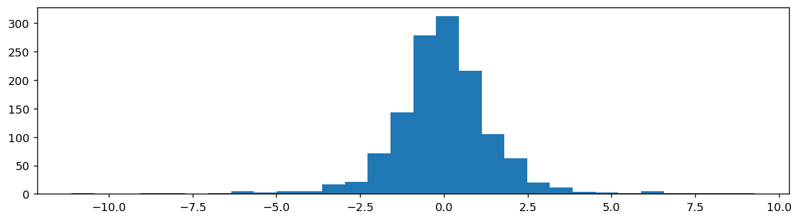
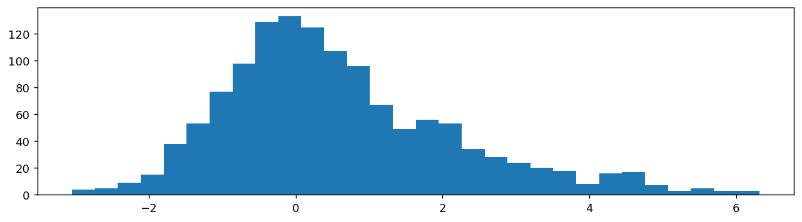
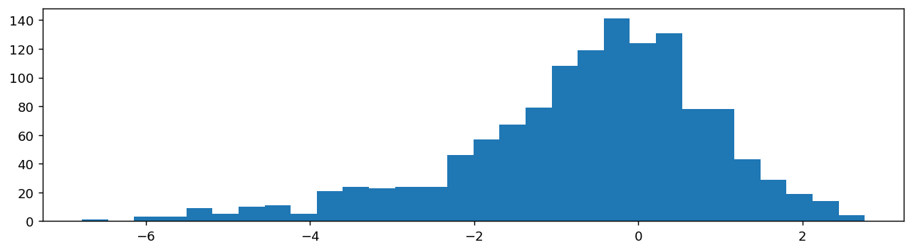
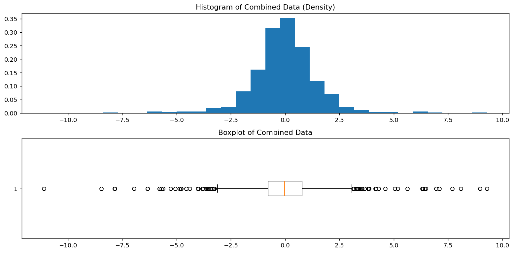
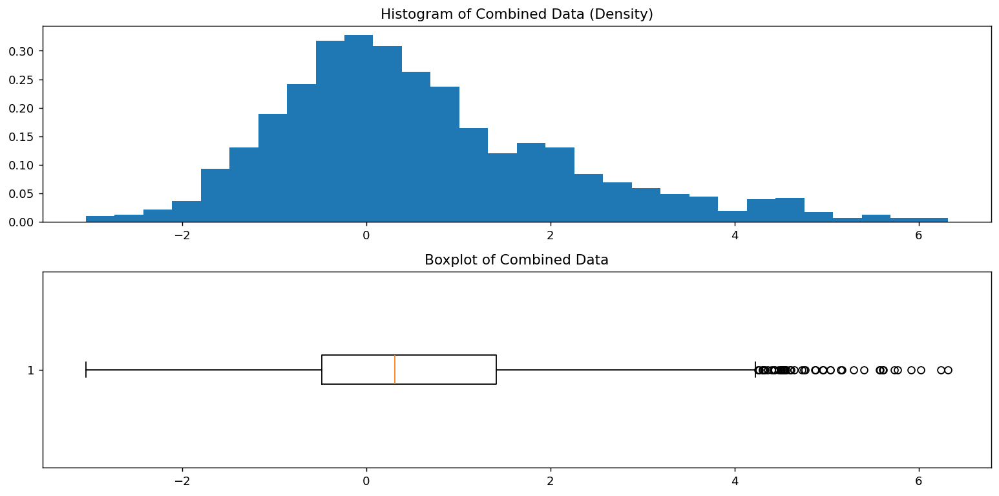
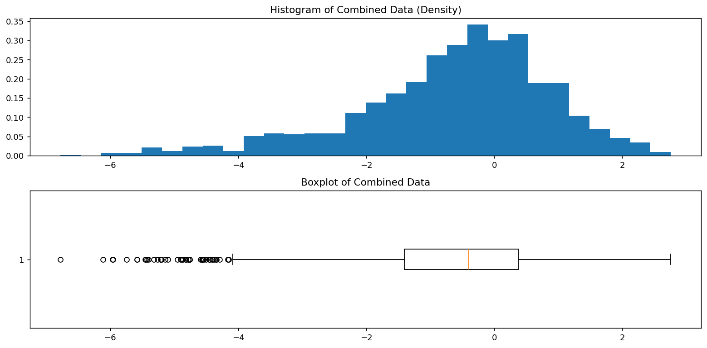
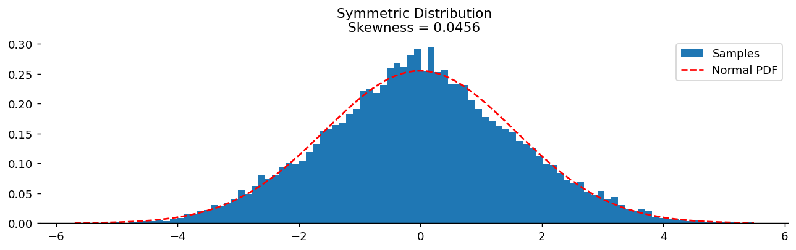
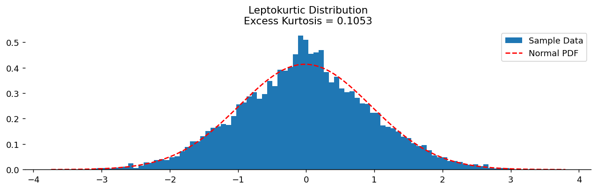

# 왜도와 첨도

## 개요

**왜도**와 **첨도**는 평균과 분산이 담아내지 못하는 분포의 모양을 정량화하는 수치 측도다. 왜도는 비대칭성을 재고, 첨도는 정규분포에 비해 꼬리가 얼마나 두꺼운지를 잰다.

---

## 1. 대칭 분포와 치우친 분포

### 대칭 분포

분포의 좌우가 서로 거울상이면 그 분포는 **대칭**이다. 가장 흔한 예는 정규분포(종 모양 곡선)로, 평균·중앙값·최빈값이 같고 중앙에 위치한다.

**예:** 사람의 키는 흔히 대칭 분포를 따른다.

#### 대칭 분포: 가우시안 혼합

성분들이 같은 위치를 중심으로 한다면 분포의 혼합에서도 대칭인 모양이 나올 수 있다.

```python
import matplotlib.pyplot as plt
import numpy as np
import scipy.stats as stats

def generate_and_plot_mixed_distribution(seed: int = 0):
    """중심은 같고 퍼짐만 다른 정규분포 셋을 섞는다.

    loc(중심)은 모두 0으로 두고 scale(표준편차)만 1, 2, 4로 키운다.
    좌우가 똑같이 늘어나므로 **대칭이면서 꼬리만 두꺼운** 분포가 된다.
    즉 왜도는 0 근처, 첨도는 정규분포보다 크게 나온다.
    """
    np.random.seed(seed)
    main_data = stats.norm().rvs(1_000)             # 본체 1000개, 표준편차 1
    minor_1 = stats.norm(scale=2).rvs(200)          # 조금 넓게 200개
    minor_2 = stats.norm(scale=4).rvs(100)          # 아주 넓게 100개
    combined = np.concatenate((main_data, minor_1, minor_2))

    fig, ax = plt.subplots(figsize=(12, 3))
    ax.hist(combined, bins=30)
    plt.show()

    # 눈으로 본 것을 숫자로 확인한다.
    # fisher=True(기본)이면 정규분포의 첨도가 0이 되도록 3을 뺀 초과첨도다.
    print(f"왜도 {stats.skew(combined):+.3f}  (0에 가까움 = 대칭)")
    print(f"첨도 {stats.kurtosis(combined):+.3f}  (0보다 큼 = 정규분포보다 꼬리가 두껍다)")

if __name__ == "__main__":
    generate_and_plot_mixed_distribution()
```

출력:

```
왜도 -0.008  (0에 가까움 = 대칭)
첨도 +7.150  (0보다 큼 = 정규분포보다 꼬리가 두껍다)
```



### 치우친 분포

**치우친(skewed)** 분포는 자료가 한쪽으로 더 길게 뻗는다.

**오른쪽 치우침(양의 왜도):** 꼬리가 오른쪽으로 뻗는다. 평균 > 중앙값 > 최빈값. 예: 소득 분포.

```python
import numpy as np
import scipy.stats as stats
import matplotlib.pyplot as plt

def generate_and_plot_right_skewed_distribution(seed: int = 0):
    """중심을 오른쪽으로만 옮긴 덩어리를 덧붙인다.

    앞 예제와 달리 scale이 아니라 loc를 바꾼다.
    0, +2, +4 로 오른쪽에만 덩어리를 놓으므로 오른쪽 꼬리가 길어진다.
    """
    np.random.seed(seed)
    main_data = stats.norm().rvs(1_000)             # 본체는 0 중심
    right_1 = stats.norm(loc=2).rvs(200)            # 오른쪽 어깨
    right_2 = stats.norm(loc=4).rvs(100)            # 오른쪽 꼬리
    combined = np.concatenate((main_data, right_1, right_2))

    fig, ax = plt.subplots(figsize=(12, 3))
    ax.hist(combined, bins=30)
    plt.show()

    # 오른쪽 치우침의 두 가지 신호를 확인한다
    print(f"왜도 {stats.skew(combined):+.3f}  (양수 = 오른쪽 치우침)")
    print(f"평균 {combined.mean():+.3f} > 중앙값 {np.median(combined):+.3f}")

if __name__ == "__main__":
    generate_and_plot_right_skewed_distribution()
```

출력:

```
왜도 +0.848  (양수 = 오른쪽 치우침)
평균 +0.595 > 중앙값 +0.314
```



**왼쪽 치우침(음의 왜도):** 꼬리가 왼쪽으로 뻗는다. 평균 < 중앙값 < 최빈값. 예: 은퇴 연령.

```python
import numpy as np
import scipy.stats as stats
import matplotlib.pyplot as plt

def generate_and_plot_left_skewed_distribution(seed: int = 0):
    """앞 함수의 부호만 뒤집었다. loc가 -2, -4 로 왼쪽에 놓인다."""
    np.random.seed(seed)
    main_data = stats.norm().rvs(1_000)
    left_1 = stats.norm(loc=-2).rvs(200)            # 왼쪽 어깨
    left_2 = stats.norm(loc=-4).rvs(100)            # 왼쪽 꼬리
    combined = np.concatenate((main_data, left_1, left_2))

    fig, ax = plt.subplots(figsize=(12, 3))
    ax.hist(combined, bins=30)
    plt.show()

    # 부호가 정확히 반대로 나온다
    print(f"왜도 {stats.skew(combined):+.3f}  (음수 = 왼쪽 치우침)")
    print(f"평균 {combined.mean():+.3f} < 중앙값 {np.median(combined):+.3f}")

if __name__ == "__main__":
    generate_and_plot_left_skewed_distribution()
```

출력:

```
왜도 -0.853  (음수 = 왼쪽 치우침)
평균 -0.636 < 중앙값 -0.396
```



---

## 2. 상자그림으로 왜도 알아보기

상자그림은 왜도를 빠르게 시각적으로 진단하게 해준다.

$$
\begin{array}{lll}
\text{Left\_Box} > \text{Right\_Box} &\Rightarrow& \text{Skew to Left} \\
\text{Left\_Box} < \text{Right\_Box} &\Rightarrow& \text{Skew to Right} \\
\text{Left\_Box} = \text{Right\_Box},\; \text{Left\_Whisker} > \text{Right\_Whisker} &\Rightarrow& \text{Skew to Left} \\
\text{Left\_Box} = \text{Right\_Box},\; \text{Left\_Whisker} < \text{Right\_Whisker} &\Rightarrow& \text{Skew to Right} \\
\text{Left\_Box} = \text{Right\_Box},\; \text{Left\_Whisker} = \text{Right\_Whisker} &\Rightarrow& \text{Symmetric} \\
\end{array}
$$

### 상자그림: 대칭 분포

```python
import matplotlib.pyplot as plt
import numpy as np
import scipy.stats as stats

def generate_and_plot_histogram_and_box_plot_mixed_distribution(seed: int = 0):
    """같은 자료를 히스토그램과 상자그림으로 나란히 본다.

    자료는 첫 예제와 같은 대칭·두꺼운꼬리 혼합분포다.
    두 그림을 위아래로 붙여 x축을 눈으로 맞추면,
    히스토그램의 꼬리가 상자그림에서 어떻게 "이상치 점"으로 바뀌는지 보인다.
    """
    np.random.seed(seed)
    main_data = stats.norm().rvs(1_000)
    minor_1 = stats.norm(scale=2).rvs(200)
    minor_2 = stats.norm(scale=4).rvs(100)
    combined = np.concatenate((main_data, minor_1, minor_2))

    fig, (ax_hist, ax_box) = plt.subplots(2, 1, figsize=(12, 6))
    ax_hist.hist(combined, density=True, bins=30)
    ax_hist.set_title('Histogram of Combined Data (Density)')
    ax_box.boxplot(combined, vert=False)          # vert=False 로 눕혀 위 그림과 축을 맞춘다
    ax_box.set_title('Boxplot of Combined Data')
    plt.tight_layout()
    plt.show()

    # 상자그림이 이상치로 찍는 점이 몇 개인지 세어 본다.
    # 꼬리가 두꺼우면 1.5*IQR 울타리 밖의 점이 많아진다.
    q1, q3 = np.percentile(combined, [25, 75])
    iqr = q3 - q1
    out = ((combined < q1 - 1.5*iqr) | (combined > q3 + 1.5*iqr)).sum()
    print(f"IQR = {iqr:.3f},  울타리 밖 점 {out}개 / {len(combined)}개 "
          f"({out/len(combined):.1%})")
    print("정규분포라면 약 0.7% 이므로, 이보다 많으면 꼬리가 두꺼운 것이다.")

if __name__ == "__main__":
    generate_and_plot_histogram_and_box_plot_mixed_distribution()
```

출력:

```
IQR = 1.565,  울타리 밖 점 63개 / 1300개 (4.8%)
정규분포라면 약 0.7% 이므로, 이보다 많으면 꼬리가 두꺼운 것이다.
```



### 상자그림: 오른쪽으로 치우친 분포

```python
import numpy as np
import scipy.stats as stats
import matplotlib.pyplot as plt

def generate_and_plot_histogram_and_box_plot_right_skewed(seed: int = 0):
    np.random.seed(seed)
    main_data = stats.norm().rvs(1_000)
    right_1 = stats.norm(loc=2).rvs(200)
    right_2 = stats.norm(loc=4).rvs(100)
    combined = np.concatenate((main_data, right_1, right_2))

    fig, (ax_hist, ax_box) = plt.subplots(2, 1, figsize=(12, 6))
    ax_hist.hist(combined, density=True, bins=30)
    ax_hist.set_title('Histogram of Combined Data (Density)')
    ax_box.boxplot(combined, vert=False)
    ax_box.set_title('Boxplot of Combined Data')
    plt.tight_layout()
    plt.show()

if __name__ == "__main__":
    generate_and_plot_histogram_and_box_plot_right_skewed()
```



### 상자그림: 왼쪽으로 치우친 분포

```python
import numpy as np
import scipy.stats as stats
import matplotlib.pyplot as plt

def generate_and_plot_histogram_and_box_plot_left_skewed(seed: int = 0):
    np.random.seed(seed)
    main_data = stats.norm().rvs(1_000)
    left_1 = stats.norm(loc=-2).rvs(200)
    left_2 = stats.norm(loc=-4).rvs(100)
    combined = np.concatenate((main_data, left_1, left_2))

    fig, (ax_hist, ax_box) = plt.subplots(2, 1, figsize=(12, 6))
    ax_hist.hist(combined, density=True, bins=30)
    ax_hist.set_title('Histogram of Combined Data (Density)')
    ax_box.boxplot(combined, vert=False)
    ax_box.set_title('Boxplot of Combined Data')
    plt.tight_layout()
    plt.show()

if __name__ == "__main__":
    generate_and_plot_histogram_and_box_plot_left_skewed()
```



---

## 3. 왜도: 정의와 계산

### 정의

$$
\text{Skewness}(X) = E\left(\frac{X - \mu}{\sigma}\right)^3 \approx \frac{1}{n}\sum_{i=1}^{n}\left(\frac{x_i - \bar{x}}{s}\right)^3
$$

- **왜도 = 0:** 대칭 분포.
- **왜도 > 0:** 오른쪽으로 치우침(양의 왜도).
- **왜도 < 0:** 왼쪽으로 치우침(음의 왜도).

### 왜도 모의실험

```python
import numpy as np
import matplotlib.pyplot as plt
from scipy import stats

def generate_samples(main_size, right_size, left_size):
    """왼쪽·오른쪽 덩어리의 **개수 차이**로 치우침을 만든다.

    right_size > left_size 이면 오른쪽이 무거워져 양의 왜도가 되고,
    두 값이 같으면 대칭이 된다. 아래 main()에서 개수를 바꿔 가며
    왜도가 어떻게 움직이는지 확인할 수 있다.
    """
    main_sample = np.random.normal(0, 1, main_size)      # 중앙 덩어리
    right_sample = np.random.normal(2, 1, right_size)    # 오른쪽 덩어리
    left_sample = np.random.normal(-2, 1, left_size)     # 왼쪽 덩어리
    return np.concatenate([main_sample, right_sample, left_sample])

def calculate_statistics(data):
    """평균, 표준편차, 왜도를 구한다.

    여기서는 n으로 나누는 모집단 표준편차를 쓴다(정규 밀도를 겹쳐 그리기 위함).
    표본표준편차가 필요하면 n-1로 나눠야 한다.
    """
    n = data.shape[0]
    mean = data.sum() / n
    std_dev = np.sqrt(np.sum((data - mean) ** 2) / n)
    skewness = stats.describe(data).skewness
    return mean, std_dev, skewness

def plot_distribution_with_normal_fit(data, mean, std_dev, skewness, title):
    """히스토그램 위에 같은 평균·표준편차의 정규분포를 겹쳐 그린다.

    두 곡선이 어긋나는 방식이 곧 왜도(또는 첨도)의 시각적 정체다.
    치우친 자료에서는 정규곡선이 봉우리를 지나치고 꼬리 쪽에서 벌어진다.
    """
    fig, ax = plt.subplots(figsize=(12, 3))
    _, bins, _ = ax.hist(data, density=True, bins=100, label="Samples")
    normal_pdf = stats.norm(loc=mean, scale=std_dev).pdf(bins)
    ax.plot(bins, normal_pdf, "--r", label="Normal PDF")
    ax.set_title(f"{title}\nSkewness = {skewness:.4f}")
    ax.legend()
    ax.spines["left"].set_visible(False)
    ax.spines["right"].set_visible(False)
    ax.spines["top"].set_visible(False)
    plt.show()

def main():
    np.random.seed(0)
    main_size = 10_000
    right_size = 3_000
    left_size = 3_000

    samples = generate_samples(main_size, right_size, left_size)
    mean, std_dev, skewness = calculate_statistics(samples)

    if right_size > left_size:
        title = "Right-Skewed Distribution"
    elif right_size < left_size:
        title = "Left-Skewed Distribution"
    else:
        title = "Symmetric Distribution"

    plot_distribution_with_normal_fit(samples, mean, std_dev, skewness, title)

    print(f"{title}")
    print(f"  평균   {mean:+.4f}")
    print(f"  표준편차 {std_dev:.4f}")
    print(f"  왜도   {skewness:+.4f}")
    print(f"  중앙값 {np.median(samples):+.4f}  (대칭이면 평균과 같아진다)")

if __name__ == "__main__":
    main()
```

출력:

```
Symmetric Distribution
  평균   -0.0093
  표준편차 1.5661
  왜도   +0.0456
  중앙값 -0.0273  (대칭이면 평균과 같아진다)
```



---

## 4. 첨도

### 정의

첨도는 분포의 "꼬리성", 즉 중심에 비해 꼬리에 확률 질량이 얼마나 있는지를 잰다.

$$
\text{Kurtosis}(X) = E\left(\frac{X - \mu}{\sigma}\right)^4 \approx \frac{1}{n}\sum_{i=1}^{n}\left(\frac{x_i - \bar{x}}{s}\right)^4
$$

**초과첨도**는 정규분포의 첨도(3)를 뺀 값이다.

$$
\text{Excess Kurtosis}(X) = \text{Kurtosis}(X) - 3
$$

- **초과첨도 = 0(중첨):** 정규분포와 비슷한 꼬리.
- **초과첨도 > 0(급첨):** 정규보다 두꺼운 꼬리, 극단적 이상치가 더 많다.
- **초과첨도 < 0(평첨):** 정규보다 얇은 꼬리, 극단값이 더 적다.

### 첨도 모의실험

```python
import numpy as np
import matplotlib.pyplot as plt
from scipy import stats

def generate_samples(main_size, peak_size):
    """중앙에 아주 좁은(표준편차 0.2) 덩어리를 얹어 봉우리를 뾰족하게 만든다.

    중심은 둘 다 0이므로 대칭은 유지되고, 봉우리만 솟는다.
    이것이 급첨(leptokurtic) 분포를 만드는 가장 간단한 방법이다.
    """
    main_sample = np.random.normal(0, 1, main_size)      # 넓은 본체
    peak_sample = np.random.normal(0, 0.2, peak_size)    # 좁고 뾰족한 봉우리
    return np.concatenate([main_sample, peak_sample])

def calculate_statistics(data):
    """첨도를 정의 그대로 계산한다.

    표준화한 값의 네제곱 평균이 첨도다. 네제곱이므로 중심에서 멀리 떨어진
    값이 압도적으로 큰 기여를 한다. 첨도가 사실상 "꼬리의 무게"를 재는 이유다.
    """
    mean = np.mean(data)
    std_dev = np.std(data)
    skewness = stats.describe(data).skewness
    kurtosis = np.mean(((data - mean) / std_dev) ** 4)
    excess_kurtosis = kurtosis - 3     # 정규분포의 첨도 3을 빼면 초과첨도
    return mean, std_dev, skewness, kurtosis, excess_kurtosis

def plot_distribution_with_normal_fit(data, mean, std_dev, excess_kurtosis, title):
    fig, ax = plt.subplots(figsize=(12, 3))
    _, bins, _ = ax.hist(data, density=True, bins=100, label="Sample Data")
    normal_pdf = stats.norm(loc=mean, scale=std_dev).pdf(bins)
    ax.plot(bins, normal_pdf, "--r", label="Normal PDF")
    ax.set_title(f"{title}\nExcess Kurtosis = {excess_kurtosis:.4f}")
    ax.legend()
    ax.spines["left"].set_visible(False)
    ax.spines["right"].set_visible(False)
    ax.spines["top"].set_visible(False)
    plt.show()

def main():
    np.random.seed(0)
    main_size = 10_000
    peak_size = 500

    data = generate_samples(main_size, peak_size)
    mean, std_dev, skewness, kurtosis, excess_kurtosis = calculate_statistics(data)

    if excess_kurtosis > 0:
        title = "Leptokurtic Distribution"
    elif excess_kurtosis < 0:
        title = "Platykurtic Distribution"
    else:
        title = "Mesokurtic Distribution"

    plot_distribution_with_normal_fit(data, mean, std_dev, excess_kurtosis, title)

    print(f"{title}")
    print(f"  왜도       {skewness:+.4f}  (좌우 대칭이므로 0 근처)")
    print(f"  첨도       {kurtosis:.4f}")
    print(f"  초과첨도   {excess_kurtosis:+.4f}  (정규분포는 0)")

if __name__ == "__main__":
    main()
```

출력:

```
Leptokurtic Distribution
  왜도       +0.0231  (좌우 대칭이므로 0 근처)
  첨도       3.1053
  초과첨도   +0.1053  (정규분포는 0)
```



### 파이썬에서 첨도 계산하기

SciPy는 초과첨도를 직접 계산해 주는 편리한 함수를 제공한다.

```python
from scipy import stats
import numpy as np

np.random.seed(0)                       # 시드를 고정해야 아래 출력이 재현된다
data = np.random.normal(0, 1, 10000)    # 정규분포이므로 초과첨도의 참값은 0

# 두 함수 모두 "초과첨도"(첨도 - 3)를 돌려준다.
# 즉 정규분포에서 0이 나오도록 이미 3을 빼 놓았다.
# 3을 빼지 않은 값이 필요하면 fisher=False 를 준다.
print(stats.kurtosis(data))
print(stats.describe(data).kurtosis)
print(stats.kurtosis(data, fisher=False), "  <- 3을 빼지 않은 값")
```

출력:

```
-0.03095451095565238
-0.03095451095565238
2.9690454890443476   <- 3을 빼지 않은 값
```

표본이 10,000개인데도 참값 0에서 눈에 띄게 벗어난다. **첨도는 네제곱을 쓰기 때문에 추정이 매우 불안정하다.** 표본이 작으면 훨씬 크게 흔들리므로, 첨도 하나만 보고 꼬리의 두께를 단정해서는 안 된다.

---

## 요약

왜도와 첨도는 분포에 대한 기술을 중심과 퍼짐 너머로 확장한다. 왜도는 방향성 있는 비대칭을 드러내어 대표적인 중심으로 평균과 중앙값 중 무엇을 고를지 이끌어 준다. 첨도는 꼬리의 행동을 정량화하는데, 극단적 사건(두꺼운 꼬리)이 큰 결과를 낳는 위험관리와 금융에서 매우 중요하다.

## 연습문제

**연습문제 1.**
$\{1, 2, 3, 4, 10\}$에 대해 (a) 표본평균과 표준편차, (b) 모집단 왜도를 계산하고, (c) 그 부호를 해석하라.

??? success "풀이"
    (a) $\bar x = 4$. 제곱편차는 $9, 4, 1, 0, 36$이고 합 $= 50$이므로 $m_2 = 50/5 = 10$, $s_{\text{pop}} = \sqrt{10} \approx 3.162$.

    (b) 세제곱편차는 $-27, -8, -1, 0, 216$이고 합 $= 180$이므로 $m_3 = 180/5 = 36$. 따라서

    $$
    g_1 = \frac{m_3}{m_2^{3/2}} = \frac{36}{10^{3/2}} \approx 1.138
    $$

    (c) $g_1 > 0$이므로 오른쪽으로 치우쳐 있다. 값 10 하나가 세제곱편차 $+216$을 만들어 분자를 지배한다. 나머지 네 개의 작은 값은 합해서 $-36$만 기여한다. 긴 오른쪽 꼬리 하나가 양의 왜도를 만든다.

---

**연습문제 2.**
두 자료 A = $\{4,5,5,6,6,6,7,7,8\}$, B = $\{1,2,5,6,6,6,7,10,11\}$이 있다. 평균이 같음을 확인한 뒤 각각의 모집단 초과첨도를 계산하라. 둘이 같게 나오는데, 그 이유를 설명하라.

??? success "풀이"
    두 평균 모두 $54/9 = 6$이다.

    **자료 A:** $m_2 = 12/9 = 4/3$, $m_4 = 36/9 = 4$. 초과첨도 $= 4/(4/3)^2 - 3 = 4 \cdot 9/16 - 3 = 2.25 - 3 = -0.75$.

    **자료 B:** $m_2 = 84/9 = 28/3$, $m_4 = 1764/9 = 196$. 초과첨도 $= 196 / (28/3)^2 - 3 = 196 \cdot 9 / 784 - 3 = 2.25 - 3 = -0.75$.

    **같은 이유:** 첨도는 비 $m_4 / m_2^2$, 즉 *표준화된* 4차 적률이다. 자료 B는 값이 평균에서 더 멀리 있지만(범위 1–11 대 4–8) $m_2$도 그에 비례해 크다. 첨도는 *그 분포 자신의 분산에 상대적인* 꼬리의 두께를 재므로, 모든 관측값에 상수를 곱해도 첨도는 변하지 않는다. 두 자료는 척도를 제외하면 같은 *모양*이다.

---

**연습문제 3.**
**3차 표준화 중심적률**을 $\mu_3 / \sigma^3$으로 정의한다. 이것이 **척도 불변**(모든 관측값의 척도를 바꿔도 변하지 않음)이고 **평행이동 불변**(상수를 더해도 변하지 않음)임을 보여라. 이것이 모집단 왜도 계수에 대해 무엇을 말해주는가?

??? success "풀이"
    $a > 0$에 대해 $Y = a X + b$라 하자. 그러면 $\mu_Y = a\mu_X + b$, $\sigma_Y = a \sigma_X$이고

    $$
    \mu_3(Y) = \mathbb{E}[(Y - \mu_Y)^3] = \mathbb{E}[(a(X - \mu_X))^3] = a^3 \mu_3(X)
    $$

    이다. 따라서

    $$
    \frac{\mu_3(Y)}{\sigma_Y^3} = \frac{a^3 \mu_3(X)}{a^3 \sigma_X^3} = \frac{\mu_3(X)}{\sigma_X^3}
    $$

    이다. 왜도는 **아핀 불변**이다. 분포의 위치나 척도가 아니라 모양에만 의존한다. 모양이 같은 두 분포(예: 모든 정규분포)는 모수 $(\mu, \sigma)$와 무관하게 같은 왜도를 갖는다. 이 불변성 덕분에 왜도로 단위가 다른 자료들을 비교할 수 있다.

    마찬가지로 **4차 표준화 적률**(첨도)도 아핀 불변이며, 연습문제 2의 A와 B가 퍼짐이 다른데도 초과첨도가 같게 나오는 이유가 이것이다.

---

**연습문제 4.**
**피어슨 중앙값 왜도**는 $\tilde\mu$를 중앙값이라 할 때 $\gamma = (\mu - \tilde\mu) / \sigma$이다. 이 측도가 고전적 왜도보다 강건한 이유는 무엇이며, 단봉이고 오른쪽으로 치우친 분포에서 $\mu$, $\tilde\mu$, 최빈값의 전형적인 관계는 무엇인가?

??? success "풀이"
    **더 강건한 이유:** 고전적 왜도는 세제곱편차를 쓰므로 평균에서 멀리 떨어진 이상치 하나가 $|x - \bar x|^3$만큼 기여하는데 이 값이 엄청날 수 있다. 피어슨의 중앙값 왜도는 중앙값(붕괴점 50%)을 써서 이상치에 덜 민감하다. 다만 분모의 표준편차는 여전히 민감하므로, 완전히 강건한 왜도 측도를 원한다면 $\sigma$를 MAD 같은 강건 척도로 바꾼다.

    **단봉이고 오른쪽으로 치우친 분포에서의 전형적인 순서:**

    $$
    \text{Mode} < \text{Median} < \text{Mean}
    $$

    직관: 최빈값은 밀도의 봉우리에 있고, 중앙값은 질량이 절반이 되는 지점에 있으며, 평균은 긴 오른쪽 꼬리에 끌려간다. 왼쪽으로 치우친 분포에서는 순서가 뒤집힌다: $\text{Mean} < \text{Median} < \text{Mode}$. 완벽하게 대칭인 단봉 분포에서는 셋이 모두 일치한다.

    이 순서는 왜도를 진단하는 어림법으로 널리 쓰이지만, 다봉이거나 병적으로 치우친 분포에서는 성립하지 않을 수 있다.

---

**연습문제 5.**
표준정규분포의 첨도는 3(초과첨도 0)이다. 자유도 $\nu$인 $t$-분포처럼 꼬리가 두꺼운 분포는 ($\nu > 4$일 때) 초과첨도가 $6/(\nu - 4)$이다. $\nu = 5, 10, 30, 100$에 대해 계산하고 해석하라.

??? success "풀이"
    초과첨도 $= 6/(\nu - 4)$:

    | $\nu$ | 초과첨도 |
    |---|---|
    | 5 | 6 |
    | 10 | 1 |
    | 30 | 0.231 |
    | 100 | 0.0625 |

    **해석:** $\nu$가 커질수록 $t$-분포가 정규분포에 가까워지므로 초과첨도가 $\to 0$이다. $\nu = 5$에서는 꼬리가 정규보다 훨씬 두껍다(초과첨도 6은 엄청난 값이다). $\nu = 30$에서는 꼬리가 거의 정규에 가깝다(초과 $\approx 0.23$). $\nu = 100$에서는 첨도 면에서 $t$가 사실상 정규와 구별되지 않는다.

    **실무적 함의:**

    - 주식 수익률은 흔히 $\nu \approx 4$–$8$인 $t$-분포로 모형화한다(관측되는 폭락에 맞는 두꺼운 꼬리).
    - $t$ 임계값을 쓰는 가설검정은 $\nu \gtrsim 30$이면 $z$ 임계값으로 수렴한다. 정규근사를 쓰는 어림법의 근거가 이것이다.
    - 표본 첨도가 크면(예: $g_2 > 2$) 자료의 꼬리가 정규보다 두껍고 정규성에 근거한 표준 신뢰구간의 포함확률이 부족할 수 있음을 의심하라.

---

**연습문제 6.**
**표본 왜도와 첨도 자체가 확률변수**이며, 표본이 작으면 그 표집 변동성이 크다. 정규분포에서 뽑은 크기 $n$인 i.i.d. 표본에 대해 표본 왜도의 표준오차는 대략 얼마인가? 이를 이용해 "0이 아닌" 표본 왜도가 언제 통계적으로 의미 있는지 논하라.

??? success "풀이"
    정규 i.i.d. 표본에서 표본 왜도의 점근 표준오차는

    $$
    \mathrm{SE}(g_1) \approx \sqrt{\frac{6 n (n-1)}{(n-2)(n+1)(n+3)}} \approx \sqrt{\frac{6}{n}}
    $$

    이다. 정규분포의 왜도에서 벗어났다는 증거가 되려면 표본 왜도가 $|g_1| > 2 \cdot \mathrm{SE}$여야 한다. 값은 다음과 같다.

    | $n$ | 근사 표준오차 | "유의" 기준 |
    |---|---|---|
    | 20 | 0.55 | $\pm 1.10$ |
    | 50 | 0.35 | $\pm 0.69$ |
    | 100 | 0.24 | $\pm 0.49$ |
    | 1000 | 0.077 | $\pm 0.15$ |

    **함의:** $n = 50$일 때 표본 왜도 0.4는 0과 통계적으로 구별되지 *않는다*. 정규 자료에서도 우연히 충분히 나올 수 있는 값이다. 표집 변동성을 고려하지 않고 "왜도 = 0.4이므로 자료가 오른쪽으로 치우쳤다"고 보고하는 것은 과잉 해석이다. 언제나 (a) 자료를 그리고, (b) 점추정값과 함께 표준오차를 보고하며, (c) 형식적인 정규성 평가에는 적합도 검정(샤피로–윌크, 앤더슨–달링)을 택하라. 표준오차가 더 큰 표본 첨도에도 같은 주의가 적용된다.
