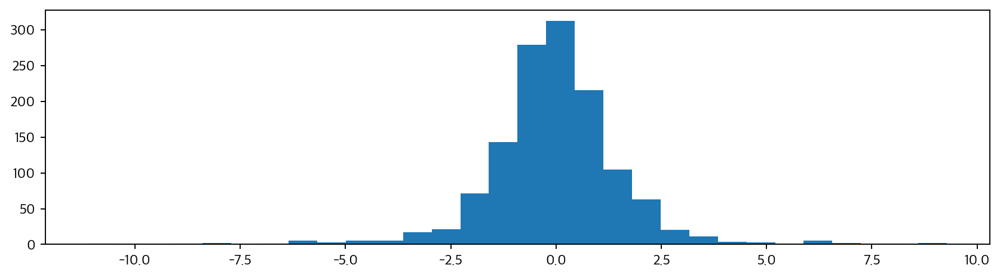
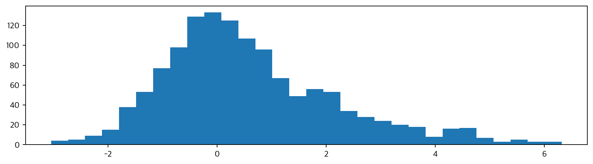
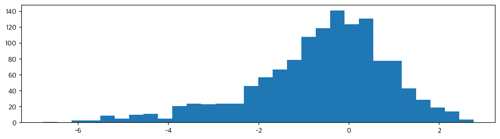
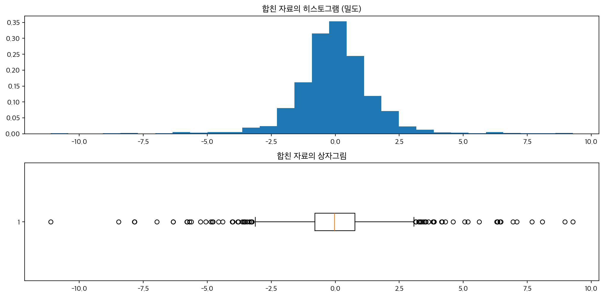
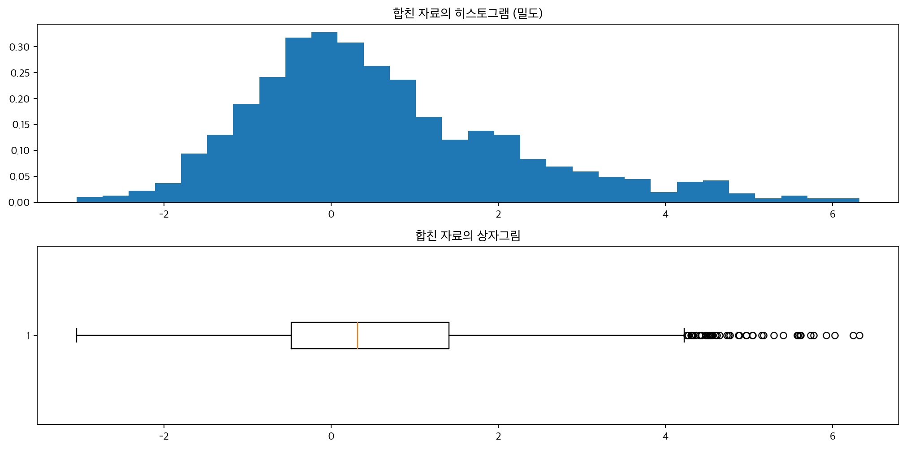
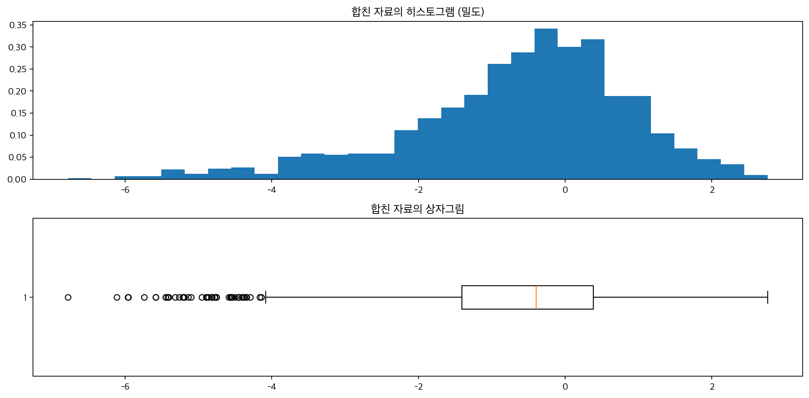
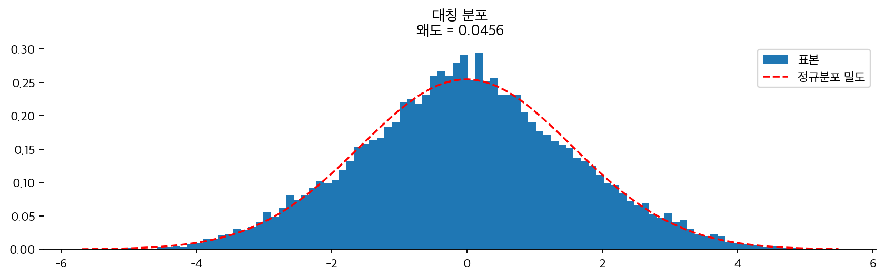
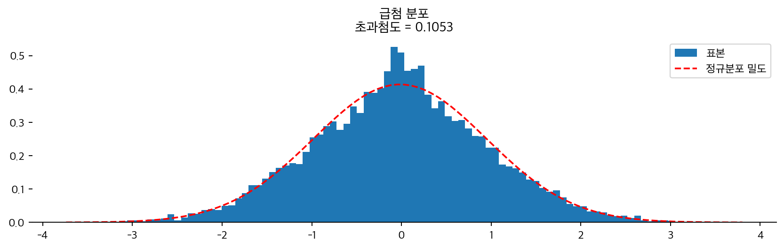

# 왜도와 첨도

## 개요

**왜도**와 **첨도**는 평균과 분산이 담아내지 못하는 분포의 모양을 정량화하는 수치 측도다. 왜도는 비대칭성을 재고, 첨도는 정규분포에 비해 꼬리가 얼마나 두꺼운지를 잰다.

---

## 1. 대칭 분포와 치우친 분포

### 대칭 분포

분포의 좌우가 서로 거울상이면 그 분포는 **대칭**이다. 가장 흔한 예는 정규분포(종 모양 곡선)로, 평균·중앙값·최빈값이 같고 중앙에 위치한다.

**예:** 사람의 키는 흔히 대칭 분포를 따른다.

#### 대칭 분포: 가우시안 혼합

성분들이 같은 위치를 중심으로 한다면 분포의 혼합에서도 대칭인 모양이 나올 수 있다.

<div class="exbox" markdown>

**보기 1.** <span class="diff easy" title="쉬움"></span> 정규분포만 섞었는데 첨도가 $7$ 을 넘는다. 중심이 모두 $0$ 이고 표준편차만 $1, 2, 4$ 인 정규분포에서 각각 $1000, 200, 100$ 개를 뽑아 섞는다.

**(1)** 이 혼합분포의 모집단 왜도와 **초과첨도를 정확한 분수로** 구하시오.

**(2)** 성분이 모두 정규분포라 저마다 초과첨도가 $0$ 인데 섞은 것의 초과첨도가 $0$ 보다 큰 까닭을 설명하고, 큰 표본 모의로 (1)을 확인하시오.

</div>

??? success "풀이"

    **(1) 해석적으로.** 혼합의 가중치는 $w = (1000, 200, 100)/1300 = (10, 2, 1)/13$ 이고 성분은 $N(0, \sigma_i^2)$, $\sigma = (1, 2, 4)$ 다. 성분의 중심이 모두 $0$ 이므로 혼합의 평균도 $0$ 이고, 혼합의 적률은 성분 적률의 가중평균이다.

    $$
    \mu_k = \sum_i w_i\, \mathbb{E}\!\left[X^k \mid i\right]
    $$

    정규분포의 적률은 $\mathbb{E}[X^2] = \sigma^2$, $\mathbb{E}[X^3] = 0$, $\mathbb{E}[X^4] = 3\sigma^4$ 이므로

    $$
    \mu_2 = \frac{10\cdot 1 + 2\cdot 4 + 1\cdot 16}{13} = \frac{34}{13},
    \qquad \mu_3 = 0,
    $$

    $$
    \mu_4 = 3\cdot\frac{10\cdot 1 + 2\cdot 16 + 1\cdot 256}{13} = \frac{3\cdot 298}{13} = \frac{894}{13}
    $$

    다. **$\mu_3 = 0$ 이므로 왜도는 정확히 $0$** 이다 — 좌우대칭인 성분을 같은 중심에 포개었으니 당연하다. 첨도는

    $$
    \beta_2 = \frac{\mu_4}{\mu_2^2} = \frac{894/13}{(34/13)^2} = \frac{894 \cdot 13}{34^2} = \frac{11622}{1156}
    $$

    이고 초과첨도는

    $$
    \gamma_2 = \frac{11622}{1156} - 3 = \frac{11622 - 3468}{1156} = \frac{8154}{1156} = \frac{4077}{578} = 7.053633\ldots
    $$

    다. 표준편차는 $\sigma = \sqrt{34/13} = 1.617215$ 다.

    **(2) 해석적으로 — 왜 $0$ 이 아닌가.** 첨도는 적률의 **비**이고 비는 평균을 취하는 연산과 바꿀 수 없다. 성분마다 $\mathbb{E}[X^4 \mid i] = 3(\mathbb{E}[X^2\mid i])^2$ 가 성립하지만, 가중평균을 취하면

    $$
    \mu_4 = 3\sum_i w_i \sigma_i^4 \;\ge\; 3\left(\sum_i w_i \sigma_i^2\right)^2 = 3\mu_2^2
    $$

    이 되고, 부등호는 **$t \mapsto t^2$ 가 볼록**하기 때문이다(옌센). 등호는 모든 $\sigma_i$ 가 같을 때뿐이다. 곧

    $$
    \gamma_2 = 3\,\frac{\sum_i w_i \sigma_i^4}{\left(\sum_i w_i \sigma_i^2\right)^2} - 3 = 3\cdot\frac{\mathbb{E}[V^2]}{(\mathbb{E}[V])^2} - 3
      = 3\,\frac{\operatorname{Var}(V)}{(\mathbb{E}V)^2}
    $$

    이다($V = \sigma_i^2$ 를 가중치 $w$ 로 뽑은 확률변수). **분산이 흩어져 있는 정도가 그대로 초과첨도가 된다.** 여기서는 $V$ 가 $1, 4, 16$ 을 확률 $10/13, 2/13, 1/13$ 로 가지므로 상대분산이 커서 $\gamma_2$ 가 $7$ 을 넘는다.

    이것이 두꺼운 꼬리의 가장 흔한 출처다. **자료가 정규분포에서 왔더라도 분산이 집단마다 다르면 합쳐 놓은 것은 정규가 아니다.** 금융의 변동성 군집, 측정 정밀도가 다른 장비를 섞은 자료가 모두 이 꼴이다.

    **(3) 수치적으로.**

    ```python
    import matplotlib.pyplot as plt
    import numpy as np
    import scipy.stats as stats

    def generate_and_plot_mixed_distribution(seed: int = 0):
        """중심은 같고 퍼짐만 다른 정규분포 셋을 섞는다.

        loc(중심)은 모두 0으로 두고 scale(표준편차)만 1, 2, 4로 키운다.
        좌우가 똑같이 늘어나므로 **대칭이면서 꼬리만 두꺼운** 분포가 된다.
        즉 왜도는 0 근처, 첨도는 정규분포보다 크게 나온다.
        """
        np.random.seed(seed)
        main_data = stats.norm().rvs(1_000)             # 본체 1000개, 표준편차 1
        minor_1 = stats.norm(scale=2).rvs(200)          # 조금 넓게 200개
        minor_2 = stats.norm(scale=4).rvs(100)          # 아주 넓게 100개
        combined = np.concatenate((main_data, minor_1, minor_2))

        fig, ax = plt.subplots(figsize=(12, 3))
        ax.hist(combined, bins=30)
        plt.show()

        # 눈으로 본 것을 숫자로 확인한다.
        # fisher=True(기본)이면 정규분포의 첨도가 0이 되도록 3을 뺀 초과첨도다.
        print(f"왜도 {stats.skew(combined):+.3f}  (0에 가까움 = 대칭)")
        print(f"첨도 {stats.kurtosis(combined):+.3f}  (0보다 큼 = 정규분포보다 꼬리가 두껍다)")

    if __name__ == "__main__":
        generate_and_plot_mixed_distribution()
    ```

    출력:

    ```
    왜도 -0.008  (0에 가까움 = 대칭)
    첨도 +7.150  (0보다 큼 = 정규분포보다 꼬리가 두껍다)
    ```

    

    $1300$ 개 표본이 왜도 $-0.008$, 초과첨도 $+7.150$ 을 주었다. 유도한 값 $0$ 과 $7.053633$ 에 닿는지 표본을 키워 가며 본다.

    ```python
    import numpy as np
    from scipy import stats

    w = np.array([10, 2, 1]) / 13
    s = np.array([1.0, 2.0, 4.0])
    mu2 = np.sum(w * s ** 2)
    mu4 = np.sum(w * 3 * s ** 4)        # 정규분포의 4차 적률은 3 sigma^4
    print(f"mu2 = {mu2:.6f}  (= 34/13)")
    print(f"mu4 = {mu4:.6f}  (= 894/13)")
    print(f"beta2 = {mu4 / mu2 ** 2:.6f},  gamma2 = {mu4 / mu2 ** 2 - 3:.6f}  (= 4077/578)")
    print(f"sigma = {np.sqrt(mu2):.6f}")

    # (2) 의 공식 gamma2 = 3 Var(V)/(E V)^2 로도 같은 값이 나오는가. V = sigma_i^2
    V = s ** 2
    EV = np.sum(w * V)
    VarV = np.sum(w * (V - EV) ** 2)
    print(f"3 * Var(V) / (E V)^2 = {3 * VarV / EV ** 2:.6f}")

    # 표본을 키우면 모집단 값에 닿는가
    rng = np.random.default_rng(0)
    print(f"\n{'n':>12}{'g1':>10}{'g2':>10}")
    for N in (13_000, 130_000, 1_300_000, 13_000_000):
        k = np.array([10, 2, 1]) * (N // 13)
        x = np.concatenate([rng.normal(0, s[i], k[i]) for i in range(3)])
        print(f"{len(x):>12,}{stats.skew(x):>+10.4f}{stats.kurtosis(x):>+10.4f}")
    print(f"{'모집단':>12}{0.0:>+10.4f}{mu4 / mu2 ** 2 - 3:>+10.4f}")
    ```

    출력:

    ```
    mu2 = 2.615385  (= 34/13)
    mu4 = 68.769231  (= 894/13)
    beta2 = 10.053633,  gamma2 = 7.053633  (= 4077/578)
    sigma = 1.617215
    3 * Var(V) / (E V)^2 = 7.053633

               n        g1        g2
          13,000   -0.1426   +6.1992
         130,000   +0.0102   +7.0013
       1,300,000   -0.0018   +6.9807
      13,000,000   +0.0035   +7.0533
             모집단   +0.0000   +7.0536
    ```

    **두 가지 길로 구한 $\gamma_2$ 가 같다.** 적률의 비로 구한 $7.053633$ 과 공식 $3\operatorname{Var}(V)/(\mathbb{E}V)^2$ 가 소수점 여섯째 자리까지 일치한다.

    **모의도 참값에 수렴한다.** 왜도는 $n$ 이 커지며 $0$ 에 붙고, 초과첨도는 $6.20 \to 7.00 \to 6.98 \to 7.05$ 로 $7.0536$ 에 다가간다. 다만 **올라가는 길이 고르지 않다는 점을 눈여겨보라.** $n = 13{,}000$ 에서 $6.20$ 으로 참값보다 $12\%$ 나 낮고, $n = 1{,}300{,}000$ 에서도 $6.98$ 로 아직 아래쪽이다. 표본첨도는 **아래로 치우치고 분산이 커서** 참값에 닿는 데 아주 큰 표본이 필요하다. 이 쪽 끝의 보기 9 와 연습문제 6 이 그 이야기를 이어 간다.

    **그래서 쪽의 코드가 준 $+7.150$ 은 운이 좋은 편이다.** $n = 1300$ 에서 참값 $7.054$ 를 $1.4\%$ 안으로 맞혔다. 같은 $n$ 에서 다른 씨앗을 쓰면 위 표의 $6.20$ 처럼 한참 벗어나기도 한다. **한 번의 표본첨도로 꼬리의 두께를 단정하면 안 된다는 뜻이다.**

### 치우친 분포

**치우친(skewed)** 분포는 자료가 한쪽으로 더 길게 뻗는다.

**오른쪽 치우침(양의 왜도):** 꼬리가 오른쪽으로 뻗는다. 평균 > 중앙값 > 최빈값. 예: 소득 분포.

<div class="exbox" markdown>

**보기 2.** <span class="diff easy" title="쉬움"></span> 어깨와 꼬리를 오른쪽에만 붙이면. 앞 보기와 달리 `scale` 이 아니라 `loc` 를 바꾸어 $N(0,1)$ 에서 $1000$ 개, $N(2,1)$ 에서 $200$ 개, $N(4,1)$ 에서 $100$ 개를 뽑아 섞는다.

**(1)** 이 혼합분포의 모집단 평균과 왜도를 구하시오.

**(2)** 모집단 중앙값을 수치적으로 구해 평균보다 작음을 보이고, 표본값과 견주시오.

</div>

??? success "풀이"

    **(1) 해석적으로.** 가중치는 보기 1 과 같은 $w = (10, 2, 1)/13$ 이고 성분은 $N(m_i, 1)$, $m = (0, 2, 4)$ 다. 평균은

    $$
    \mu = \sum_i w_i m_i = \frac{10\cdot 0 + 2\cdot 2 + 1\cdot 4}{13} = \frac{8}{13} = 0.615385
    $$

    다. 중심적률을 구하려면 각 성분이 평균에서 얼마나 떨어져 있는지를 $d_i = m_i - \mu$ 로 두고, $X \mid i \sim N(m_i, 1)$ 이므로 $X - \mu \mid i \sim N(d_i, 1)$ 임을 쓴다. $Z \sim N(0,1)$ 에 대해

    $$
    \mathbb{E}\left[(d + Z)^2\right] = d^2 + 1, \qquad
    \mathbb{E}\left[(d + Z)^3\right] = d^3 + 3d, \qquad
    \mathbb{E}\left[(d + Z)^4\right] = d^4 + 6d^2 + 3
    $$

    이다($Z$ 의 홀수 적률이 $0$, $\mathbb{E}Z^2 = 1$, $\mathbb{E}Z^4 = 3$ 이기 때문). $d = (-8/13,\ 18/13,\ 44/13)$ 을 넣어 가중평균하면

    $$
    \mu_2 = 2.467456, \qquad \mu_3 = 3.211652, \qquad \mu_4 = 22.575225
    $$

    이고 따라서

    $$
    \gamma_1 = \frac{\mu_3}{\mu_2^{3/2}} = \frac{3.211652}{2.467456^{3/2}} = 0.828618,
    \qquad \gamma_2 = \frac{\mu_4}{\mu_2^2} - 3 = 0.707946
    $$

    다. **$\mu_3 > 0$ 이라 왜도가 양수다.** 보기 1 과 달리 성분의 중심이 한쪽에만 놓여 있어 $d_i$ 의 세제곱합이 $0$ 이 되지 않는다.

    **(2) 해석적으로.** 혼합의 누적분포함수는 성분 누적분포의 가중합

    $$
    F(x) = \sum_i w_i\,\Phi(x - m_i)
    $$

    이고 닫힌 꼴로 뒤집히지 않으므로 중앙값은 $F(x) = 0.5$ 를 수치적으로 풀어 얻는다. 오른쪽으로 치우쳤으니 $\mu > \text{중앙값}$ 이 예상되는데, 이것은 어림일 뿐 정리가 아니다([평균, 중앙값, 최빈값](../center/mean_median_mode.md)의 보기 8 에 반례가 있다). **여기서는 어림이 맞는지 수로 확인한다.**

    **(3) 수치적으로.**

    ```python
    import numpy as np
    import scipy.stats as stats
    import matplotlib.pyplot as plt

    def generate_and_plot_right_skewed_distribution(seed: int = 0):
        """중심을 오른쪽으로만 옮긴 덩어리를 덧붙인다.

        앞 보기와 달리 scale이 아니라 loc를 바꾼다.
        0, +2, +4 로 오른쪽에만 덩어리를 놓으므로 오른쪽 꼬리가 길어진다.
        """
        np.random.seed(seed)
        main_data = stats.norm().rvs(1_000)             # 본체는 0 중심
        right_1 = stats.norm(loc=2).rvs(200)            # 오른쪽 어깨
        right_2 = stats.norm(loc=4).rvs(100)            # 오른쪽 꼬리
        combined = np.concatenate((main_data, right_1, right_2))

        fig, ax = plt.subplots(figsize=(12, 3))
        ax.hist(combined, bins=30)
        plt.show()

        # 오른쪽 치우침의 두 가지 신호를 확인한다
        print(f"왜도 {stats.skew(combined):+.3f}  (양수 = 오른쪽 치우침)")
        print(f"평균 {combined.mean():+.3f} > 중앙값 {np.median(combined):+.3f}")

    if __name__ == "__main__":
        generate_and_plot_right_skewed_distribution()
    ```

    출력:

    ```
    왜도 +0.848  (양수 = 오른쪽 치우침)
    평균 +0.595 > 중앙값 +0.314
    ```

    

    표본이 왜도 $+0.848$, 평균 $+0.595$, 중앙값 $+0.314$ 를 주었다. 모집단 값과 맞춰 본다.

    ```python
    import numpy as np
    from scipy import stats
    from scipy.optimize import brentq

    w = np.array([10, 2, 1]) / 13
    locs = np.array([0.0, 2.0, 4.0])

    mu = np.sum(w * locs)
    d = locs - mu                       # 각 성분이 혼합평균에서 떨어진 거리
    m2 = np.sum(w * (d ** 2 + 1))
    m3 = np.sum(w * (d ** 3 + 3 * d))
    m4 = np.sum(w * (d ** 4 + 6 * d ** 2 + 3))
    print(f"mu  = {mu:.6f}  (= 8/13)")
    print(f"d   = {np.round(d, 6)}")
    print(f"mu2 = {m2:.6f}   mu3 = {m3:.6f}   mu4 = {m4:.6f}")
    print(f"gamma1 = {m3 / m2 ** 1.5:.6f}   gamma2 = {m4 / m2 ** 2 - 3:.6f}")

    # 중앙값은 F(x) = 0.5 를 수치적으로 푼다.
    F = lambda x: float(np.sum(w * stats.norm.cdf(x, locs, 1.0)))
    med = brentq(lambda x: F(x) - 0.5, -6, 12, xtol=1e-13)
    print(f"\n모집단 중앙값 = {med:.6f}")
    print(f"평균 - 중앙값 = {mu - med:.6f}  (> 0 이면 어림대로다)")
    print(f"(평균 - 중앙값) / sigma = {(mu - med) / np.sqrt(m2):.6f}")

    print(f"\n{'':>10}{'모집단':>12}{'표본 n=1300':>14}")
    print(f"{'왜도':>10}{m3 / m2 ** 1.5:>+12.4f}{0.848:>+14.4f}")
    print(f"{'평균':>10}{mu:>+12.4f}{0.595:>+14.4f}")
    print(f"{'중앙값':>10}{med:>+12.4f}{0.314:>+14.4f}")
    ```

    출력:

    ```
    mu  = 0.615385  (= 8/13)
    d   = [-0.615385  1.384615  3.384615]
    mu2 = 2.467456   mu3 = 3.211652   mu4 = 22.575225
    gamma1 = 0.828618   gamma2 = 0.707946

    모집단 중앙값 = 0.358251
    평균 - 중앙값 = 0.257134  (> 0 이면 어림대로다)
    (평균 - 중앙값) / sigma = 0.163695

                       모집단     표본 n=1300
            왜도     +0.8286       +0.8480
            평균     +0.6154       +0.5950
           중앙값     +0.3583       +0.3140
    ```

    **세 값이 모두 맞는다.** 표본왜도 $+0.848$ 이 모집단 $+0.8286$ 에서 $0.019$ 떨어져 있는데, 연습문제 6 의 어림 $\sqrt{6/n} = \sqrt{6/1300} = 0.068$ 에 견주면 표집오차 안이다. 평균과 중앙값도 각각 $0.020$, $0.044$ 차이로 가깝다.

    **어림 "평균 $>$ 중앙값"이 여기서는 맞는다.** 모집단에서 $0.615385 - 0.358251 = 0.257134$ 이고, 표준편차 $\sqrt{2.467456} = 1.571$ 로 나누면 $0.1637$ 이다. 앞에서 본 상한 $\lvert\mu - m\rvert \le \sigma$ 를 한참 밑돈다.

    **보기 1 과 견주면 무엇이 달라졌는지 분명하다.** 중심을 옮기면 $\mu_3 \ne 0$ 이 되어 **왜도**가 생기고, 퍼짐을 다르게 하면 $\mu_4/\mu_2^2$ 가 커져 **첨도**가 생긴다. 여기서도 $\gamma_2 = 0.708$ 로 첨도가 조금 생기는데, 중심을 흩어 놓는 일이 분산도 함께 흩어 놓기 때문이다. **그러나 보기 1 의 $7.054$ 에는 한참 못 미친다** — 꼬리를 두껍게 하는 데는 척도를 섞는 쪽이 훨씬 강한 지렛대다.

**왼쪽 치우침(음의 왜도):** 꼬리가 왼쪽으로 뻗는다. 평균 < 중앙값 < 최빈값. 예: 은퇴 연령.

<div class="exbox" markdown>

**보기 3.** <span class="diff easy" title="쉬움"></span> 거울에 비추면 부호만 바뀌는가. 보기 2 의 `loc` 부호만 뒤집어 $N(0,1)$, $N(-2,1)$, $N(-4,1)$ 에서 같은 개수를 뽑는다.

**(1)** $Y = -X$ 로 두면 왜도·평균·중앙값이 어떻게 변하고 첨도는 어떻게 되는지 보이고, 보기 3 이 내놓을 모집단 값을 예측하시오.

**(2)** 두 표본의 왜도를 더하면 정확히 $0$ 이 되는가. 같은 씨앗을 썼는데도 그렇지 않다면 왜인가.

</div>

??? success "풀이"

    **(1) 해석적으로.** $Y = -X$ 라 하면 $\mathbb{E}Y = -\mathbb{E}X$ 이고 $Y - \mu_Y = -(X - \mu_X)$ 이므로 중심적률은

    $$
    \mu_k(Y) = \mathbb{E}\left[(-(X-\mu_X))^k\right] = (-1)^k \mu_k(X)
    $$

    다. 곧 **짝수 차수는 그대로, 홀수 차수는 부호가 바뀐다.** 따라서

    $$
    \sigma_Y = \sigma_X, \qquad
    \gamma_1(Y) = \frac{-\mu_3}{\mu_2^{3/2}} = -\gamma_1(X), \qquad
    \gamma_2(Y) = \frac{\mu_4}{\mu_2^2} - 3 = \gamma_2(X)
    $$

    이다. 중앙값도 $\text{median}(Y) = -\text{median}(X)$ 다($P(Y \le -m) = P(X \ge m) = 1/2$).

    이 보기의 혼합은 보기 2 의 혼합을 $x \mapsto -x$ 로 보낸 것이므로 모집단 값은

    $$
    \mu = -\frac{8}{13} = -0.615385, \quad
    \gamma_1 = -0.828618, \quad
    \gamma_2 = +0.707946, \quad
    \text{중앙값} = -0.358251
    $$

    로 예측된다. **첨도만 부호가 그대로다** — 네제곱은 좌우를 가리지 않기 때문이다. 이것이 왜도와 첨도가 재는 것이 다르다는 가장 간단한 증거다.

    **(2) 해석적으로.** 모집단에서는 두 왜도의 합이 정확히 $0$ 이다. 그러나 **두 코드가 만든 표본은 서로 거울상이 아니다.** 같은 씨앗으로 시작하므로 난수열 $Z^{(1)}, Z^{(2)}, Z^{(3)}$ 은 같은데, 보기 2 가 만드는 것은

    $$
    \left(Z^{(1)},\; Z^{(2)} + 2,\; Z^{(3)} + 4\right)
    $$

    이고 이 보기가 만드는 것은

    $$
    \left(Z^{(1)},\; Z^{(2)} - 2,\; Z^{(3)} - 4\right)
    $$

    이다. 앞의 것을 $-1$ 배 하면 $(-Z^{(1)}, -Z^{(2)} - 2, -Z^{(3)} - 4)$ 로, **난수의 부호가 뒤집혀 있어** 뒤의 것과 다르다. 거울상이 되려면 중심만이 아니라 난수까지 뒤집어야 한다. 그러므로 두 표본왜도의 합은 $0$ 이 아니라 **표집오차만큼 어긋난다.**

    **(3) 수치적으로.**

    ```python
    import numpy as np
    import scipy.stats as stats
    import matplotlib.pyplot as plt

    def generate_and_plot_left_skewed_distribution(seed: int = 0):
        """앞 함수의 부호만 뒤집었다. loc가 -2, -4 로 왼쪽에 놓인다."""
        np.random.seed(seed)
        main_data = stats.norm().rvs(1_000)
        left_1 = stats.norm(loc=-2).rvs(200)            # 왼쪽 어깨
        left_2 = stats.norm(loc=-4).rvs(100)            # 왼쪽 꼬리
        combined = np.concatenate((main_data, left_1, left_2))

        fig, ax = plt.subplots(figsize=(12, 3))
        ax.hist(combined, bins=30)
        plt.show()

        # 부호가 정확히 반대로 나온다
        print(f"왜도 {stats.skew(combined):+.3f}  (음수 = 왼쪽 치우침)")
        print(f"평균 {combined.mean():+.3f} < 중앙값 {np.median(combined):+.3f}")

    if __name__ == "__main__":
        generate_and_plot_left_skewed_distribution()
    ```

    출력:

    ```
    왜도 -0.853  (음수 = 왼쪽 치우침)
    평균 -0.636 < 중앙값 -0.396
    ```

    

    두 표본을 한자리에 놓고 (1)과 (2)를 함께 확인한다.

    ```python
    import numpy as np
    import scipy.stats as stats


    def mixture(sign):
        """loc 의 부호만 바꾸어 같은 씨앗으로 표본을 만든다."""
        np.random.seed(0)
        main = stats.norm().rvs(1_000)
        lump1 = stats.norm(loc=sign * 2).rvs(200)
        lump2 = stats.norm(loc=sign * 4).rvs(100)
        return np.concatenate((main, lump1, lump2))


    right, left = mixture(+1), mixture(-1)
    print(f"{'':>8}{'왜도':>12}{'초과첨도':>12}{'평균':>12}{'중앙값':>12}")
    for name, x in (("오른쪽", right), ("왼쪽", left)):
        print(f"{name:>8}{stats.skew(x):>+12.6f}{stats.kurtosis(x):>+12.6f}"
              f"{x.mean():>+12.6f}{np.median(x):>+12.6f}")

    print(f"\n두 표본이 서로 거울상인가: "
          f"{np.allclose(np.sort(right), -np.sort(left)[::-1])}")
    print(f"왜도의 합 = {stats.skew(right) + stats.skew(left):+.6f}   (거울상이면 0)")
    print(f"평균의 합 = {right.mean() + left.mean():+.6f}")

    # 진짜 거울상을 만들어 보면 부호가 정확히 뒤집힌다.
    mirror = -right
    print(f"\n-right 의 왜도 {stats.skew(mirror):+.6f}  "
          f"(= -{stats.skew(right):.6f}),  초과첨도 {stats.kurtosis(mirror):+.6f}")
    print(f"  right 의 초과첨도 {stats.kurtosis(right):+.6f}  <- 네제곱이라 그대로다")
    ```

    출력:

    ```
                      왜도        초과첨도          평균         중앙값
         오른쪽   +0.847545   +0.680438   +0.595182   +0.313942
          왼쪽   -0.852891   +0.924781   -0.635588   -0.396250

    두 표본이 서로 거울상인가: False
    왜도의 합 = -0.005345   (거울상이면 0)
    평균의 합 = -0.040406

    -right 의 왜도 -0.847545  (= -0.847545),  초과첨도 +0.680438
      right 의 초과첨도 +0.680438  <- 네제곱이라 그대로다
    ```

    **(1)은 정확히 맞는다 — 단, 진짜 거울상에서만.** 마지막 두 줄이 그것이다. `right` 를 $-1$ 배 한 `mirror` 는 왜도가 $+0.847545$ 에서 $-0.847545$ 로 마지막 자리까지 부호만 뒤집히고, **초과첨도는 $+0.680438$ 로 한 자리도 변하지 않는다.** 홀수 적률만 부호가 바뀐다는 유도 그대로다.

    **(2)의 답은 "정확히 $0$ 이 아니다"이다.** 두 표본왜도의 합이 $-0.005345$ 이고, `np.allclose` 도 두 표본이 거울상이 아님을 알려 준다. 평균의 합도 $-0.040406$ 으로 $0$ 이 아니다. **같은 씨앗을 썼지만 중심만 뒤집었을 뿐 난수는 그대로여서, 두 표본은 같은 모집단의 거울상 쌍이 아니라 서로 다른 두 번의 추출에 가깝다.**

    어긋난 크기도 설명이 된다. 왜도의 차 $0.005$ 는 $n = 1300$ 에서의 표집오차 $\sqrt{6/1300} = 0.068$ 보다 훨씬 작아 전혀 이상하지 않다.

    **초과첨도가 $+0.680$ 과 $+0.925$ 로 꽤 다르다는 점도 눈여겨볼 만하다.** 모집단 값은 양쪽 모두 $0.707946$ 인데, 표본첨도가 왜도보다 훨씬 더 흔들리기 때문이다. 보기 9 와 연습문제 6 에서 그 차이를 수로 잰다.

---

## 2. 상자그림으로 왜도 알아보기

상자그림은 왜도를 빠르게 시각적으로 진단하게 해준다.

$$
\begin{array}{lll}
\text{왼쪽 상자} > \text{오른쪽 상자} &\Rightarrow& \text{왼쪽으로 치우침} \\
\text{왼쪽 상자} < \text{오른쪽 상자} &\Rightarrow& \text{오른쪽으로 치우침} \\
\text{왼쪽 상자} = \text{오른쪽 상자},\; \text{왼쪽 수염} > \text{오른쪽 수염} &\Rightarrow& \text{왼쪽으로 치우침} \\
\text{왼쪽 상자} = \text{오른쪽 상자},\; \text{왼쪽 수염} < \text{오른쪽 수염} &\Rightarrow& \text{오른쪽으로 치우침} \\
\text{왼쪽 상자} = \text{오른쪽 상자},\; \text{왼쪽 수염} = \text{오른쪽 수염} &\Rightarrow& \text{대칭} \\
\end{array}
$$

### 상자그림: 대칭 분포

<div class="exbox" markdown>

**보기 4.** <span class="diff easy" title="쉬움"></span> 두꺼운 꼬리는 상자그림에 몇 개의 점으로 나타나는가. 보기 1 의 대칭·두꺼운꼬리 혼합($\gamma_2 = 7.054$)을 히스토그램과 상자그림으로 나란히 본다.

**(1)** 이 혼합분포에서 $1.5\,\text{IQR}$ 울타리 밖에 놓일 **정확한 확률**을 구하시오. 대칭성을 쓰면 울타리가 $\pm 4 Q_3$ 임을 먼저 보이시오.

**(2)** $n = 1300$ 에서 기대되는 개수를 구해 코드가 센 $63$ 개와 견주고, 정규분포의 $0.698\%$ 와 몇 배 차이인지 말하시오.

</div>

??? success "풀이"

    **(1) 해석적으로.** 혼합이 $0$ 에 대해 대칭이므로 $Q_1 = -Q_3$ 이고

    $$
    \text{IQR} = Q_3 - Q_1 = 2Q_3
    $$

    다. 따라서 위쪽 울타리는

    $$
    Q_3 + 1.5\,\text{IQR} = Q_3 + 3Q_3 = 4Q_3
    $$

    이고 아래쪽은 $-4Q_3$ 다. **울타리가 $Q_3$ 의 정확히 네 배인 것은 대칭분포라면 어디서나 성립한다.** 정규분포에서도 $Q_3 = 0.674490$ 이라 울타리가 $2.697959$ 로 그 네 배다.

    $Q_3$ 는 혼합의 누적분포

    $$
    F(x) = \sum_i w_i\, \Phi\!\left(\frac{x}{\sigma_i}\right),
    \qquad w = \frac{(10, 2, 1)}{13}, \quad \sigma = (1, 2, 4)
    $$

    에서 $F(Q_3) = 0.75$ 를 풀어 얻는다. 닫힌 꼴이 없으므로 수치적으로 푼다. 그 뒤 울타리 밖 확률은 대칭성에서

    $$
    p = 2\left[1 - F(4Q_3)\right] = 2\sum_i w_i\, \Phi\!\left(-\frac{4Q_3}{\sigma_i}\right)
    $$

    다.

    **(2) 해석적으로.** 기대 개수는 $np$ 이고 $n = 1300$ 이다. 관측 개수는 이항분포 $\text{Bin}(1300, p)$ 를 따르므로 표준편차가 $\sqrt{np(1-p)}$ 이다. 센 값이 그 범위 안에 있는지 보면 된다.

    **(3) 수치적으로.**

    ```python
    import matplotlib.pyplot as plt
    import numpy as np
    import scipy.stats as stats

    plt.rcParams["font.sans-serif"] = ["NanumGothic", "Apple SD Gothic Neo", "Malgun Gothic"]
    plt.rcParams["font.family"] = "sans-serif"
    plt.rcParams["axes.unicode_minus"] = False            # 음수 기호가 네모가 되지 않게

    def generate_and_plot_histogram_and_box_plot_mixed_distribution(seed: int = 0):
        """같은 자료를 히스토그램과 상자그림으로 나란히 본다.

        자료는 첫 보기와 같은 대칭·두꺼운꼬리 혼합분포다.
        두 그림을 위아래로 붙여 x축을 눈으로 맞추면,
        히스토그램의 꼬리가 상자그림에서 어떻게 "이상치 점"으로 바뀌는지 보인다.
        """
        np.random.seed(seed)
        main_data = stats.norm().rvs(1_000)
        minor_1 = stats.norm(scale=2).rvs(200)
        minor_2 = stats.norm(scale=4).rvs(100)
        combined = np.concatenate((main_data, minor_1, minor_2))

        fig, (ax_hist, ax_box) = plt.subplots(2, 1, figsize=(12, 6))
        ax_hist.hist(combined, density=True, bins=30)
        ax_hist.set_title("합친 자료의 히스토그램 (밀도)")
        ax_box.boxplot(combined, vert=False)          # vert=False 로 눕혀 위 그림과 축을 맞춘다
        ax_box.set_title("합친 자료의 상자그림")
        plt.tight_layout()
        plt.show()

        # 상자그림이 이상치로 찍는 점이 몇 개인지 세어 본다.
        # 꼬리가 두꺼우면 1.5*IQR 울타리 밖의 점이 많아진다.
        q1, q3 = np.percentile(combined, [25, 75])
        iqr = q3 - q1
        out = ((combined < q1 - 1.5*iqr) | (combined > q3 + 1.5*iqr)).sum()
        print(f"IQR = {iqr:.3f},  울타리 밖 점 {out}개 / {len(combined)}개 "
              f"({out/len(combined):.1%})")
        print("정규분포라면 약 0.7% 이므로, 이보다 많으면 꼬리가 두꺼운 것이다.")

    if __name__ == "__main__":
        generate_and_plot_histogram_and_box_plot_mixed_distribution()
    ```

    출력:

    ```
    IQR = 1.565,  울타리 밖 점 63개 / 1300개 (4.8%)
    정규분포라면 약 0.7% 이므로, 이보다 많으면 꼬리가 두꺼운 것이다.
    ```

    

    표본에서 $63$ 개($4.8\%$)가 찍혔다. 모집단 값을 구해 맞춰 본다.

    ```python
    import numpy as np
    from scipy import stats
    from scipy.optimize import brentq

    w = np.array([10, 2, 1]) / 13
    s = np.array([1.0, 2.0, 4.0])

    G = lambda x: float(np.sum(w * stats.norm.cdf(x / s)))
    q3 = brentq(lambda x: G(x) - 0.75, 0.01, 20, xtol=1e-13)
    iqr = 2 * q3
    fence = 4 * q3
    p = 2 * float(np.sum(w * stats.norm.cdf(-fence / s)))
    print(f"Q3 = {q3:.6f},  IQR = 2*Q3 = {iqr:.6f},  울타리 = 4*Q3 = {fence:.6f}")
    print(f"울타리 밖 확률 p = {p:.6f}  ({p * 100:.3f}%)")

    n = 1300
    print(f"\nn = {n} 에서 기대 개수 np = {n * p:.2f},  표준편차 {np.sqrt(n * p * (1 - p)):.2f}")
    print(f"  코드가 센 개수 63 개는 {(63 - n * p) / np.sqrt(n * p * (1 - p)):+.2f} 표준편차")

    qn = stats.norm.ppf(0.75)
    pn = 2 * stats.norm.cdf(-4 * qn)
    print(f"\n정규분포: Q3 = {qn:.6f},  울타리 {4 * qn:.6f},  밖 확률 {pn:.6f} ({pn * 100:.3f}%)")
    print(f"두꺼운꼬리 혼합은 정규의 {p / pn:.2f} 배")
    print(f"표본 IQR 1.565 대 모집단 IQR {iqr:.3f}")
    ```

    출력:

    ```
    Q3 = 0.793607,  IQR = 2*Q3 = 1.587213,  울타리 = 4*Q3 = 3.174427
    울타리 밖 확률 p = 0.051336  (5.134%)

    n = 1300 에서 기대 개수 np = 66.74,  표준편차 7.96
      코드가 센 개수 63 개는 -0.47 표준편차

    정규분포: Q3 = 0.674490,  울타리 2.697959,  밖 확률 0.006977 (0.698%)
    두꺼운꼬리 혼합은 정규의 7.36 배
    표본 IQR 1.565 대 모집단 IQR 1.587
    ```

    **모집단 확률은 $5.134\%$ 이고 기대 개수는 $66.74$ 개다.** 코드가 센 $63$ 개는 이항 표준편차 $7.96$ 의 $0.47$ 배만큼 아래로, 전혀 이상하지 않다. 표본 IQR $1.565$ 도 모집단 $1.587$ 에 가깝다.

    **정규분포의 $0.698\%$ 와 견주면 $7.36$ 배다.** 상자그림이 찍는 점의 개수가 꼬리 두께에 이렇게 민감하다는 것이 이 보기의 요점이다. 다만 **몇 배인지는 $\gamma_2$ 와 단순 비례하지 않는다** — 초과첨도는 $0$ 에서 $7.054$ 로 갔는데 울타리 밖 비율은 $7.4$ 배가 되었을 뿐이다. 둘 다 꼬리를 보지만 보는 지점이 다르다. 첨도는 $z^4$ 로 가중한 **평균**이고 울타리 밖 비율은 $\lvert z\rvert > 4Q_3/\sigma$ 라는 **한 지점**의 확률이다.

    **그래서 상자그림의 점 개수는 꼬리의 거친 지표다.** 쓸모는 있지만, 같은 개수를 주면서 첨도가 크게 다른 분포를 만들 수 있다. 연습문제 7 과 8 이 그 틈을 더 파고든다.

    (덧붙여, 대칭분포에서 울타리가 $\pm 4Q_3$ 라는 사실은 **분포와 무관하게** 성립한다. 그러므로 "$1.5\,\text{IQR}$ 규칙이 몇 퍼센트를 찍는가"는 $4Q_3$ 지점의 꼬리확률을 묻는 것과 같고, 그 값은 분포마다 다르다. [이상치와 지렛대점](./outliers.md)의 연습문제 9 가 정규분포에서 이 계산을 한다.)

### 상자그림: 오른쪽으로 치우친 분포

<div class="exbox" markdown>

**보기 5.** <span class="diff easy" title="쉬움"></span> 상자그림에서 치우침을 **수로** 읽기. 보기 2 의 오른쪽 치우침 혼합($\gamma_1 = 0.8286$)을 히스토그램과 상자그림으로 나란히 본다.

**(1)** 이 혼합의 모집단 사분위수를 구해, 상자의 두 반쪽 $Q_2 - Q_1$ 과 $Q_3 - Q_2$ 중 어느 쪽이 긴지 말하시오.

**(2)** 그림에서 읽히는 것을 수치와 함께 적으시오. 이상치 점이 위아래에 각각 몇 개 찍힐지 미리 계산하고 표본과 견주시오.

</div>

??? success "풀이"

    **(1) 해석적으로.** 혼합의 누적분포 $F(x) = \sum_i w_i \Phi(x - m_i)$ 에서 $F(x) = 0.25, 0.5, 0.75$ 를 수치적으로 푼다. 2 절의 규칙이 말하는 바는

    $$
    Q_2 - Q_1 \;<\; Q_3 - Q_2 \quad\Longrightarrow\quad \text{오른쪽으로 치우침}
    $$

    이다. 이 비대칭을 하나의 수로 적은 것이 **사분위왜도**(보울리)

    $$
    \text{SK}_B = \frac{(Q_3 - Q_2) - (Q_2 - Q_1)}{Q_3 - Q_1} = \frac{Q_3 - 2Q_2 + Q_1}{\text{IQR}}
    $$

    다. 정의에서 분자의 절댓값이 분모를 넘을 수 없으므로 $-1 \le \text{SK}_B \le 1$ 이고, 대칭이면 $0$ 이다. **$\gamma_1$ 과 달리 유계이고 사분위수만 쓰므로 이상치에 강건하다** — 대신 꼬리 끝의 정보를 아예 보지 않는다.

    **(2) 해석적으로.** 울타리는 $Q_1 - 1.5\,\text{IQR}$ 과 $Q_3 + 1.5\,\text{IQR}$ 이고, 대칭이 아니므로 보기 4 처럼 $\pm 4Q_3$ 로 줄지 않는다. 각 울타리 밖 확률을 $F$ 로 직접 계산해 $n = 1300$ 을 곱하면 기대 개수가 나온다. **오른쪽으로 치우쳤으니 위쪽에 훨씬 많이 찍히리라 예상된다.**

    **(3) 수치적으로.**

    ```python
    import numpy as np
    import scipy.stats as stats
    import matplotlib.pyplot as plt

    plt.rcParams["font.sans-serif"] = ["NanumGothic", "Apple SD Gothic Neo", "Malgun Gothic"]
    plt.rcParams["font.family"] = "sans-serif"
    plt.rcParams["axes.unicode_minus"] = False            # 음수 기호가 네모가 되지 않게

    def generate_and_plot_histogram_and_box_plot_right_skewed(seed: int = 0):
        """오른쪽으로 치우친 자료를 히스토그램과 상자그림으로 나란히 본다.

        눕힌 상자그림에서 치우침은 세 가지로 드러난다. 중앙값 선이 상자의
        왼쪽(작은 값 쪽)으로 밀리고, 오른쪽 수염이 왼쪽보다 길어지며,
        이상치 점이 오른쪽에만 찍힌다.
        """
        np.random.seed(seed)
        main_data = stats.norm().rvs(1_000)
        right_1 = stats.norm(loc=2).rvs(200)
        right_2 = stats.norm(loc=4).rvs(100)
        combined = np.concatenate((main_data, right_1, right_2))

        fig, (ax_hist, ax_box) = plt.subplots(2, 1, figsize=(12, 6))
        ax_hist.hist(combined, density=True, bins=30)
        ax_hist.set_title("합친 자료의 히스토그램 (밀도)")
        ax_box.boxplot(combined, vert=False)      # 눕혀야 위 히스토그램과 x축이 맞는다
        ax_box.set_title("합친 자료의 상자그림")
        plt.tight_layout()
        plt.show()

    if __name__ == "__main__":
        generate_and_plot_histogram_and_box_plot_right_skewed()
    ```

    

    눈으로 보이는 비대칭을 숫자로 바꾼다.

    ```python
    import numpy as np
    import scipy.stats as stats
    from scipy.optimize import brentq

    w = np.array([10, 2, 1]) / 13
    locs = np.array([0.0, 2.0, 4.0])
    F = lambda x: float(np.sum(w * stats.norm.cdf(x, locs, 1.0)))
    Q1, Q2, Q3 = (brentq(lambda x: F(x) - p, -8, 14, xtol=1e-13) for p in (0.25, 0.5, 0.75))
    IQR = Q3 - Q1
    print(f"모집단  Q1={Q1:.6f}  Q2={Q2:.6f}  Q3={Q3:.6f}  IQR={IQR:.6f}")
    print(f"  왼쪽 상자 Q2-Q1 = {Q2 - Q1:.6f},  오른쪽 상자 Q3-Q2 = {Q3 - Q2:.6f}")
    print(f"  보울리 사분위왜도 = {(Q3 - 2 * Q2 + Q1) / IQR:.6f}   (gamma1 = 0.828618)")

    lo, hi = Q1 - 1.5 * IQR, Q3 + 1.5 * IQR
    p_lo, p_hi = F(lo), 1 - F(hi)
    print(f"\n울타리 [{lo:.6f}, {hi:.6f}]")
    print(f"  아래 확률 {p_lo:.6e} -> n=1300 기대 {p_lo * 1300:.2f} 개")
    print(f"  위   확률 {p_hi:.6f} -> n=1300 기대 {p_hi * 1300:.2f} 개")

    # 표본에서 실제로
    np.random.seed(0)
    x = np.concatenate((stats.norm().rvs(1_000), stats.norm(loc=2).rvs(200),
                        stats.norm(loc=4).rvs(100)))
    q1, q2, q3 = np.percentile(x, [25, 50, 75])
    iqr = q3 - q1
    l, h = q1 - 1.5 * iqr, q3 + 1.5 * iqr
    inl = x[(x >= l) & (x <= h)]
    print(f"\n표본    Q1={q1:.4f}  Q2={q2:.4f}  Q3={q3:.4f}  IQR={iqr:.4f}")
    print(f"  왼쪽 상자 {q2 - q1:.4f},  오른쪽 상자 {q3 - q2:.4f},  보울리 {(q3 - 2 * q2 + q1) / iqr:.4f}")
    print(f"  이상치: 아래 {np.sum(x < l)} 개, 위 {np.sum(x > h)} 개")
    print(f"  수염: 왼쪽 {q1 - inl.min():.4f}, 오른쪽 {inl.max() - q3:.4f}")
    ```

    출력:

    ```
    모집단  Q1=-0.457652  Q2=0.358251  Q3=1.402022  IQR=1.859674
      왼쪽 상자 Q2-Q1 = 0.815903,  오른쪽 상자 Q3-Q2 = 1.043771
      보울리 사분위왜도 = 0.122531   (gamma1 = 0.828618)

    울타리 [-3.247164, 4.191534]
      아래 확률 4.483242e-04 -> n=1300 기대 0.58 개
      위   확률 0.034816 -> n=1300 기대 45.26 개

    표본    Q1=-0.4800  Q2=0.3139  Q3=1.4115  IQR=1.8915
      왼쪽 상자 0.7939,  오른쪽 상자 1.0975,  보울리 0.1605
      이상치: 아래 0 개, 위 48 개
      수염: 왼쪽 2.5661, 오른쪽 2.8144
    ```

    **그림에서 읽히는 것을 수로 적으면 이렇다.**

    - **중앙값 선이 상자의 왼쪽으로 밀려 있다.** 모집단에서 왼쪽 반쪽이 $0.8159$, 오른쪽 반쪽이 $1.0438$ 로 오른쪽이 $28\%$ 길다. 표본에서도 $0.7939$ 대 $1.0975$ 다. 2 절의 규칙이 "오른쪽으로 치우침"이라 판정하는 바로 그 모양이다.
    - **이상치 점이 오른쪽에만 찍힌다.** 모집단 기대 개수가 위쪽 $45.26$ 개, 아래쪽 $0.58$ 개다. 표본에서는 위 $48$ 개, 아래 $0$ 개로 예측과 맞는다($\sqrt{45.26} \approx 6.7$ 이므로 $48$ 은 $0.4$ 표준편차 차이다).
    - **수염 길이는 왼쪽 $2.5661$, 오른쪽 $2.8144$ 로 차이가 작다.** 울타리 밖 점을 빼고 나면 남는 관측의 범위는 치우침을 잘 보이지 않는다 — **수염보다 상자와 점 개수가 더 믿을 만한 신호다.**

    **보울리 사분위왜도가 $0.1225$ 인데 $\gamma_1$ 은 $0.8286$ 이다.** 같은 분포인데 값이 일곱 배 가까이 다르다. 두 측도가 다른 것을 재기 때문이다. $\gamma_1$ 은 세제곱이라 꼬리 끝에 사실상 모든 무게를 두고, 보울리는 사분위수만 보므로 **꼬리를 아예 보지 않는다.** 둘을 비교하는 것은 뜻이 없고, 각각 $-1$ 과 $1$ 사이라는 유계성(보울리)과 꼬리 민감성($\gamma_1$) 중 무엇이 필요한지로 골라야 한다.

    **그래서 상자그림은 치우침의 방향을 잘 보이고 크기는 잘 보이지 않는다.** 방향을 알려 주는 세 신호(상자 반쪽, 수염, 점의 치우침)가 일관되게 오른쪽을 가리키지만, 그 정도가 $\gamma_1 = 0.83$ 인지 $\gamma_1 = 3$ 인지는 그림으로 가늠하기 어렵다.

### 상자그림: 왼쪽으로 치우친 분포

<div class="exbox" markdown>

**보기 6.** <span class="diff easy" title="쉬움"></span> 상자그림이 보지 못하는 것. 보기 5 를 좌우로 뒤집은 자료를 같은 방식으로 그린다.

**(1)** 보기 5 의 세 신호가 모두 뒤집히는지 수로 확인하시오.

**(2)** 보기 4 의 **대칭·두꺼운꼬리** 혼합($\gamma_1 = 0$, $\gamma_2 = 7.05$)과 이 보기의 **치우친** 혼합($\gamma_1 = -0.83$, $\gamma_2 = 0.71$)을 사분위수로만 견주면 어떤 차이가 보이고 어떤 차이가 보이지 않는가.

</div>

??? success "풀이"

    **(1) 해석적으로.** 보기 3 에서 본 대로 $Y = -X$ 이면 분위수가 $Q_p(Y) = -Q_{1-p}(X)$ 로 뒤집히므로

    $$
    Q_1(Y) = -Q_3(X), \quad Q_2(Y) = -Q_2(X), \quad Q_3(Y) = -Q_1(X)
    $$

    이고 따라서 상자의 두 반쪽이 맞바뀐다.

    $$
    Q_2(Y) - Q_1(Y) = Q_3(X) - Q_2(X), \qquad Q_3(Y) - Q_2(Y) = Q_2(X) - Q_1(X)
    $$

    IQR 은 그대로이고 보울리 사분위왜도는 부호가 뒤집힌다. 울타리 밖 확률도 위아래가 맞바뀐다. **모집단 수준에서는 완전한 거울상**이며, 표본에서는 보기 3 에서 본 까닭으로 조금 어긋난다.

    **(2) 해석적으로.** 사분위수가 보는 것은 **중앙 $50\%$ 의 위치와 폭**뿐이다.

    - **치우침의 방향은 보인다.** 중앙값이 상자 어느 쪽으로 밀렸는지가 곧 보울리 사분위왜도의 부호다.
    - **꼬리의 두께는 보이지 않는다.** $Q_1, Q_2, Q_3$ 는 $25, 50, 75$ 번째 백분위수이므로 $\lvert z\rvert$ 가 큰 쪽에서 무슨 일이 일어나든 바뀌지 않는다. 첨도가 $0.71$ 이든 $7.05$ 든 상자의 모양만으로는 가릴 수 없다.
    - **꼬리가 드러나는 자리는 울타리 밖 점의 개수뿐이다.** 그래서 두 자료를 가르려면 상자가 아니라 **점을 세어야** 한다. 보기 4 에서 $5.13\%$, 보기 5 에서 $3.52\%$(위 $3.48\%$ + 아래 $0.04\%$)였다.

    **(3) 수치적으로.**

    ```python
    import numpy as np
    import scipy.stats as stats
    import matplotlib.pyplot as plt

    plt.rcParams["font.sans-serif"] = ["NanumGothic", "Apple SD Gothic Neo", "Malgun Gothic"]
    plt.rcParams["font.family"] = "sans-serif"
    plt.rcParams["axes.unicode_minus"] = False            # 음수 기호가 네모가 되지 않게

    def generate_and_plot_histogram_and_box_plot_left_skewed(seed: int = 0):
        """왼쪽으로 치우친 자료를 히스토그램과 상자그림으로 나란히 본다.

        앞 보기를 좌우로 뒤집은 것이다. 중앙값 선이 상자의 오른쪽(큰 값 쪽)으로
        밀리고, 왼쪽 수염이 오른쪽보다 길어지며, 이상치 점이 왼쪽에만 찍힌다.
        """
        np.random.seed(seed)
        main_data = stats.norm().rvs(1_000)
        left_1 = stats.norm(loc=-2).rvs(200)
        left_2 = stats.norm(loc=-4).rvs(100)
        combined = np.concatenate((main_data, left_1, left_2))

        fig, (ax_hist, ax_box) = plt.subplots(2, 1, figsize=(12, 6))
        ax_hist.hist(combined, density=True, bins=30)
        ax_hist.set_title("합친 자료의 히스토그램 (밀도)")
        ax_box.boxplot(combined, vert=False)      # 눕혀야 위 히스토그램과 x축이 맞는다
        ax_box.set_title("합친 자료의 상자그림")
        plt.tight_layout()
        plt.show()

    if __name__ == "__main__":
        generate_and_plot_histogram_and_box_plot_left_skewed()
    ```

    

    세 혼합을 사분위수로만 나란히 놓아 본다.

    ```python
    import numpy as np
    import scipy.stats as stats
    from scipy.optimize import brentq

    w = np.array([10, 2, 1]) / 13

    def box(locs, scales):
        """혼합의 사분위수, 보울리 사분위왜도, 울타리 밖 확률을 돌려준다."""
        F = lambda x: float(np.sum(w * stats.norm.cdf(x, locs, scales)))
        q1, q2, q3 = (brentq(lambda x: F(x) - p, -40, 40, xtol=1e-13)
                      for p in (0.25, 0.5, 0.75))
        iqr = q3 - q1
        lo, hi = q1 - 1.5 * iqr, q3 + 1.5 * iqr
        return q1, q2, q3, (q3 - 2 * q2 + q1) / iqr, F(lo), 1 - F(hi)

    cases = {
        "오른쪽 치우침": (np.array([0.0, 2.0, 4.0]), np.ones(3)),
        "왼쪽 치우침": (np.array([0.0, -2.0, -4.0]), np.ones(3)),
        "대칭 두꺼운꼬리": (np.zeros(3), np.array([1.0, 2.0, 4.0])),
    }
    print(f"{'':>14}{'Q1':>10}{'Q2':>10}{'Q3':>10}{'IQR':>9}{'보울리':>10}"
          f"{'아래 밖%':>10}{'위 밖%':>9}")
    for name, (lo_, sc) in cases.items():
        q1, q2, q3, bw, pl, ph = box(lo_, sc)
        print(f"{name:>14}{q1:>10.4f}{q2:>10.4f}{q3:>10.4f}{q3 - q1:>9.4f}"
              f"{bw:>+10.4f}{pl * 100:>10.3f}{ph * 100:>9.3f}")

    # 표본에서 좌우 신호가 뒤집히는가
    np.random.seed(0)
    y = np.concatenate((stats.norm().rvs(1_000), stats.norm(loc=-2).rvs(200),
                        stats.norm(loc=-4).rvs(100)))
    a1, a2, a3 = np.percentile(y, [25, 50, 75])
    ir = a3 - a1
    l, h = a1 - 1.5 * ir, a3 + 1.5 * ir
    print(f"\n왼쪽 치우침 표본: 왼쪽 상자 {a2 - a1:.4f},  오른쪽 상자 {a3 - a2:.4f},"
          f"  보울리 {(a3 - 2 * a2 + a1) / ir:+.4f}")
    print(f"  이상치: 아래 {np.sum(y < l)} 개, 위 {np.sum(y > h)} 개")
    ```

    출력:

    ```
                          Q1        Q2        Q3      IQR       보울리     아래 밖%     위 밖%
           오른쪽 치우침   -0.4577    0.3583    1.4020   1.8597   +0.1225     0.045    3.482
            왼쪽 치우침   -1.4020   -0.3583    0.4577   1.8597   -0.1225     3.482    0.045
          대칭 두꺼운꼬리   -0.7936    0.0000    0.7936   1.5872   -0.0000     2.567    2.567

    왼쪽 치우침 표본: 왼쪽 상자 1.0108,  오른쪽 상자 0.7800,  보울리 -0.1289
      이상치: 아래 44 개, 위 0 개
    ```

    **(1) 세 신호가 모두 깔끔하게 뒤집힌다.** 모집단 사분위수가 $(-0.4577,\ 0.3583,\ 1.4020)$ 에서 $(-1.4020,\ -0.3583,\ 0.4577)$ 로 좌우가 맞바뀌고, IQR 은 $1.8597$ 로 같으며, 보울리 사분위왜도는 $+0.1225$ 에서 $-0.1225$ 로 부호만 바뀐다. 울타리 밖 확률도 위아래가 맞바뀐다. 표본에서도 왼쪽 상자 $1.0108$ 이 오른쪽 $0.7800$ 보다 길고 이상치가 아래쪽에만 $44$ 개 찍힌다(보기 5 의 표본은 위쪽에만 $48$ 개였다).

    **(2) 사분위수는 치우침을 보지만 꼬리는 보지 않는다.** 표의 마지막 줄을 보라. 대칭·두꺼운꼬리 혼합은 보울리 사분위왜도가 $-0.0000$ 으로 "대칭"을 정확히 말해 준다. 그러나 **상자의 모양만으로는 그 분포의 초과첨도가 $7.05$ 라는 사실을 알 길이 없다.** IQR 이 $1.5872$ 로 오히려 치우친 혼합의 $1.8597$ 보다 **작다** — 중앙부가 더 좁다는 뜻일 뿐 꼬리에 대해서는 아무 말도 하지 않는다.

    **꼬리가 드러나는 자리는 울타리 밖 점뿐이다.** 대칭·두꺼운꼬리는 양쪽에 $2.567\%$ 씩 합계 $5.13\%$ 가 찍히고, 치우친 혼합은 $3.48\% + 0.05\% = 3.53\%$ 가 한쪽에 몰려 찍힌다. **점의 개수는 꼬리를, 점의 좌우 배치는 치우침을 말한다.** 상자 자체는 중앙 $50\%$ 의 이야기일 뿐이다.

    그러므로 상자그림을 읽을 때는 세 가지를 따로 읽어야 한다. **상자의 비대칭(치우침의 방향), 점의 개수(꼬리의 두께), 점의 좌우 배치(치우침의 방향, 두 번째 증거).** 셋을 뭉뚱그려 "이상한 모양"이라고 읽으면 아무것도 읽지 않은 것과 같다.

---

## 3. 왜도: 정의와 계산

<div class="defn" markdown>

### 정의 1. 왜도 { .dfn }

$$
\text{Skewness}(X) = E\left(\frac{X - \mu}{\sigma}\right)^3 \approx \frac{1}{n}\sum_{i=1}^{n}\left(\frac{x_i - \bar{x}}{s}\right)^3
$$

- **왜도 = 0:** 대칭 분포.
- **왜도 > 0:** 오른쪽으로 치우침(양의 왜도).
- **왜도 < 0:** 왼쪽으로 치우침(음의 왜도).

</div>

!!! note "어느 왜도인가 — $g_1$과 $G_1$"

    위 표본 공식의 $s$는 **$n$으로 나눈** 표준편차 $\sqrt{m_2}$다. 즉 이 책에서 표본왜도라고 쓰는 것은

    $$
    g_1 = \frac{m_3}{m_2^{3/2}}, \qquad m_k = \frac{1}{n}\sum_{i=1}^{n}(x_i - \bar{x})^k
    $$

    이며, `scipy.stats.skew(x)`의 기본값(`bias=True`)과 `scipy.stats.describe(x).skewness`가 돌려주는 값이다. 이 페이지의 모든 왜도 수치는 이 $g_1$이다.

    편향을 보정한 판본도 널리 쓰인다.

    $$
    G_1 = \frac{\sqrt{n(n-1)}}{n-2}\,g_1
    $$

    `scipy.stats.skew(x, bias=False)`와 pandas의 `Series.skew()`가 이 $G_1$을 준다. 표본이 작으면 차이가 크다. 연습문제 1의 자료 $\{1,2,3,4,10\}$에서 $g_1 = 1.138$이지만 $G_1 = 1.697$이다.

    첨도도 똑같이 갈린다. 비보정 $b_2 = m_4/m_2^2$와 보정된 $G_2$가 다르고, 여기에 3을 빼느냐(초과첨도) 마느냐가 겹친다. `scipy.stats.kurtosis`는 기본이 `bias=True`이면서 동시에 `fisher=True`이므로 **비보정 초과첨도**를 준다. 같은 자료 $\{1,2,3,4,10\}$의 초과첨도는 비보정 $-0.212$, 보정 $3.152$로 부호조차 다르다. 남의 표에서 왜도·첨도를 읽을 때는 **보정 여부와 초과 여부를 함께** 확인해야 한다.

### 왜도 모의실험

<div class="exbox" markdown>

**보기 7.** <span class="diff easy" title="쉬움"></span> 왜도 $0$ 인 분포에서 $+0.0456$ 이 나왔다. $N(0,1)$ 에서 $10{,}000$ 개, $N(2,1)$ 과 $N(-2,1)$ 에서 각각 $3{,}000$ 개를 뽑아 섞으면 좌우 덩어리 개수가 같다.

**(1)** 이 혼합의 모집단 평균·표준편차·왜도·초과첨도를 구하시오.

**(2)** 코드가 보고한 표본왜도 $+0.0456$ 이 표집오차로 설명되는지 모의실험으로 판정하시오.

</div>

??? success "풀이"

    **(1) 해석적으로.** 가중치는 $w = (10, 3, 3)/16$ 이고 중심은 $m = (0, 2, -2)$ 다. 평균은

    $$
    \mu = \frac{10\cdot 0 + 3\cdot 2 + 3\cdot(-2)}{16} = 0
    $$

    이다. $d_i = m_i - \mu = m_i$ 이므로 보기 2 의 공식을 그대로 쓰면

    $$
    \mu_2 = \sum_i w_i (d_i^2 + 1) = \frac{10\cdot 1 + 3\cdot 5 + 3\cdot 5}{16} = \frac{40}{16} = 2.5
    $$

    $$
    \mu_3 = \sum_i w_i (d_i^3 + 3d_i) = \frac{10\cdot 0 + 3\cdot 14 + 3\cdot(-14)}{16} = 0
    $$

    $$
    \mu_4 = \sum_i w_i (d_i^4 + 6d_i^2 + 3) = \frac{10\cdot 3 + 3\cdot 43 + 3\cdot 43}{16} = \frac{288}{16} = 18
    $$

    다. 따라서

    $$
    \sigma = \sqrt{2.5} = 1.581139, \qquad \gamma_1 = 0, \qquad
    \gamma_2 = \frac{18}{2.5^2} - 3 = 2.88 - 3 = -0.12
    $$

    **왜도는 정확히 $0$ 이다** — 좌우 덩어리의 개수와 거리가 같아 $d^3 + 3d$ 가 상쇄되기 때문이다. 초과첨도는 **음수**인데, 질량을 양옆으로 밀어 놓으면 분포가 평평해져 정규보다 꼬리가 **얇아지기** 때문이다. 이 혼합은 평첨이다.

    **(2) 해석적으로.** 참값이 $0$ 인데 표본값이 $+0.0456$ 이라면, 물어야 할 것은 "그 차이가 표집오차의 몇 배인가"다. $n = 16{,}000$ 이고 정규분포라면 $\mathrm{SE}(g_1) \approx \sqrt{6/n} = 0.0194$ 지만, **이 혼합은 정규가 아니므로 그 어림을 그대로 쓸 수 없다.** 같은 분포에서 표본을 되풀이 뽑아 $g_1$ 의 표준편차를 직접 재는 것이 정확하다.

    **(3) 수치적으로.**

    ```python
    import numpy as np
    import matplotlib.pyplot as plt
    from scipy import stats

    plt.rcParams["font.sans-serif"] = ["NanumGothic", "Apple SD Gothic Neo", "Malgun Gothic"]
    plt.rcParams["font.family"] = "sans-serif"
    plt.rcParams["axes.unicode_minus"] = False            # 음수 기호가 네모가 되지 않게

    def generate_samples(main_size, right_size, left_size):
        """왼쪽·오른쪽 덩어리의 **개수 차이**로 치우침을 만든다.

        right_size > left_size 이면 오른쪽이 무거워져 양의 왜도가 되고,
        두 값이 같으면 대칭이 된다. 아래 main()에서 개수를 바꿔 가며
        왜도가 어떻게 움직이는지 확인할 수 있다.
        """
        main_sample = np.random.normal(0, 1, main_size)      # 중앙 덩어리
        right_sample = np.random.normal(2, 1, right_size)    # 오른쪽 덩어리
        left_sample = np.random.normal(-2, 1, left_size)     # 왼쪽 덩어리
        return np.concatenate([main_sample, right_sample, left_sample])

    def calculate_statistics(data):
        """평균, 표준편차, 왜도를 구한다.

        여기서는 n으로 나누는 모집단 표준편차를 쓴다(정규 밀도를 겹쳐 그리기 위함).
        표본표준편차가 필요하면 n-1로 나눠야 한다.
        """
        n = data.shape[0]
        mean = data.sum() / n
        std_dev = np.sqrt(np.sum((data - mean) ** 2) / n)
        skewness = stats.describe(data).skewness
        return mean, std_dev, skewness

    def plot_distribution_with_normal_fit(data, mean, std_dev, skewness, title):
        """히스토그램 위에 같은 평균·표준편차의 정규분포를 겹쳐 그린다.

        두 곡선이 어긋나는 방식이 곧 왜도(또는 첨도)의 시각적 정체다.
        치우친 자료에서는 정규곡선이 봉우리를 지나치고 꼬리 쪽에서 벌어진다.
        """
        fig, ax = plt.subplots(figsize=(12, 3))
        _, bins, _ = ax.hist(data, density=True, bins=100, label="표본")
        normal_pdf = stats.norm(loc=mean, scale=std_dev).pdf(bins)
        ax.plot(bins, normal_pdf, "--r", label="정규분포 밀도")
        ax.set_title(f"{title}\n왜도 = {skewness:.4f}")
        ax.legend()
        ax.spines["left"].set_visible(False)
        ax.spines["right"].set_visible(False)
        ax.spines["top"].set_visible(False)
        plt.show()

    def main():
        np.random.seed(0)
        main_size = 10_000
        right_size = 3_000
        left_size = 3_000

        samples = generate_samples(main_size, right_size, left_size)
        mean, std_dev, skewness = calculate_statistics(samples)

        if right_size > left_size:
            title = "오른쪽으로 치우친 분포"
        elif right_size < left_size:
            title = "왼쪽으로 치우친 분포"
        else:
            title = "대칭 분포"

        plot_distribution_with_normal_fit(samples, mean, std_dev, skewness, title)

        print(f"{title}")
        print(f"  평균   {mean:+.4f}")
        print(f"  표준편차 {std_dev:.4f}")
        print(f"  왜도   {skewness:+.4f}")
        print(f"  중앙값 {np.median(samples):+.4f}  (대칭이면 평균과 같아진다)")

    if __name__ == "__main__":
        main()
    ```

    출력:

    ```
    대칭 분포
      평균   -0.0093
      표준편차 1.5661
      왜도   +0.0456
      중앙값 -0.0273  (대칭이면 평균과 같아진다)
    ```

    

    모집단 값을 구하고, 같은 분포에서 $2{,}000$ 번 뽑아 $g_1$ 이 얼마나 흔들리는지 잰다.

    ```python
    import numpy as np
    from scipy import stats

    w = np.array([10, 3, 3]) / 16
    d = np.array([0.0, 2.0, -2.0])          # 평균이 0 이라 중심이 곧 편차다
    m2 = np.sum(w * (d ** 2 + 1))
    m3 = np.sum(w * (d ** 3 + 3 * d))
    m4 = np.sum(w * (d ** 4 + 6 * d ** 2 + 3))
    print(f"mu2 = {m2:.6f}  mu3 = {m3:.6f}  mu4 = {m4:.6f}")
    print(f"sigma = {np.sqrt(m2):.6f},  gamma1 = {m3 / m2 ** 1.5:.6f},"
          f"  gamma2 = {m4 / m2 ** 2 - 3:.6f}")

    # 같은 분포에서 표본을 되풀이 뽑아 g1 의 표집분포를 잰다.
    rng = np.random.default_rng(11)
    R, n = 2000, 16_000
    g = np.empty(R)
    for b in range(R):
        x = np.concatenate([rng.normal(0, 1, 10_000), rng.normal(2, 1, 3_000),
                            rng.normal(-2, 1, 3_000)])
        g[b] = stats.skew(x)
    se = g.std()
    print(f"\n반복 {R}회,  n = {n}")
    print(f"  g1 의 평균 {g.mean():+.5f}  (참값 0,  몬테카를로 오차 {se / np.sqrt(R):.5f})")
    print(f"  g1 의 표준편차(= 표준오차) {se:.5f}   정규 어림 sqrt(6/n) = {np.sqrt(6 / n):.5f}")
    print(f"  관측값 +0.0456 은 {0.0456 / se:.2f} 표준오차")
    print(f"  |g1| >= 0.0456 일 확률 {np.mean(np.abs(g) >= 0.0456):.4f}")

    # 왜 양수가 나왔는가 -- 덩어리별 표본평균을 본다.
    np.random.seed(0)
    main = np.random.normal(0, 1, 10_000)
    right = np.random.normal(2, 1, 3_000)
    left = np.random.normal(-2, 1, 3_000)
    print(f"\n덩어리별 표본평균: 본체 {main.mean():+.4f}, 오른쪽 {right.mean():+.4f}"
          f" (참값 +2), 왼쪽 {left.mean():+.4f} (참값 -2)")
    print(f"  두 덩어리의 중심이 참값보다 각각 {right.mean() - 2:+.4f}, {left.mean() + 2:+.4f}"
          f" 만큼 치우쳐 있다")
    ```

    출력:

    ```
    mu2 = 2.500000  mu3 = 0.000000  mu4 = 18.000000
    sigma = 1.581139,  gamma1 = 0.000000,  gamma2 = -0.120000

    반복 2000회,  n = 16000
      g1 의 평균 +0.00046  (참값 0,  몬테카를로 오차 0.00037)
      g1 의 표준편차(= 표준오차) 0.01646   정규 어림 sqrt(6/n) = 0.01936
      관측값 +0.0456 은 2.77 표준오차
      |g1| >= 0.0456 일 확률 0.0045

    덩어리별 표본평균: 본체 -0.0184, 오른쪽 +1.9881 (참값 +2), 왼쪽 -1.9763 (참값 -2)
      두 덩어리의 중심이 참값보다 각각 -0.0119, +0.0237 만큼 치우쳐 있다
    ```

    **(1)이 그대로 확인된다.** $\mu_3 = 0$ 이라 $\gamma_1 = 0$ 이고, 초과첨도는 $-0.12$ 로 음수다. 표본이 준 $\sigma = 1.5661$ 도 모집단 $1.581139$ 에 가깝다.

    **(2)의 답은 "표집오차치고는 큰 값"이다.** 모의가 준 표준오차는 $0.01646$ 이고(몬테카를로 오차 $0.00037$), 관측값 $+0.0456$ 은 그 **$2.77$ 배**다. 같은 분포에서 $\lvert g_1\rvert$ 이 그만큼 커질 확률이 $0.45\%$ 다. **흔한 일은 아니지만 일어날 수 있는 일이고, 씨앗 $0$ 의 표본이 그 $0.45\%$ 에 들었다.**

    출처도 짚을 수 있다. 마지막 줄을 보면 오른쪽 덩어리의 표본평균이 참값 $+2$ 보다 $0.0119$ 낮고 왼쪽 덩어리는 $-2$ 보다 $0.0237$ 높다. **두 덩어리가 모두 오른쪽으로 조금씩 밀려** 좌우 상쇄가 깨진 것이다. 이것이 $g_1$ 을 양수로 만들었다.

    **그러므로 "왜도 $+0.0456$" 을 "대칭에 가깝다"로 읽는 것은 맞지만, 그 이유는 값이 작아서가 아니다.** 참값이 $0$ 임을 알기 때문에 그렇게 읽는 것이고, 모르는 자료였다면 $2.77$ 표준오차는 "대칭을 의심할 만한" 값이다. 연습문제 6 이 이 판정 기준을 다룬다.

    **정규 어림이 조금 크다는 점도 눈여겨보라.** $\sqrt{6/n} = 0.01936$ 인데 실제 표준오차는 $0.01646$ 이다. 이 혼합이 평첨($\gamma_2 = -0.12$)이라 꼬리가 얇고, 꼬리가 얇으면 세제곱 통계량이 덜 흔들린다. **$\sqrt{6/n}$ 은 정규분포 전용 어림이며 다른 분포에서는 위로도 아래로도 빗나간다.**

---

## 4. 첨도

<div class="defn" markdown>

### 정의 2. 첨도 { .dfn }

첨도는 분포의 "꼬리성", 즉 중심에 비해 꼬리에 확률 질량이 얼마나 있는지를 잰다.

$$
\beta_2 = E\left(\frac{X - \mu}{\sigma}\right)^4 = \frac{\mu_4}{\sigma^4}
\;\approx\; \frac{1}{n}\sum_{i=1}^{n}\left(\frac{x_i - \bar{x}}{s}\right)^4
$$

**초과첨도**는 정규분포의 첨도 3을 뺀 값이다.

$$
\gamma_2 = \beta_2 - 3
$$

- **초과첨도 = 0(중첨):** 정규분포와 비슷한 꼬리.
- **초과첨도 > 0(급첨):** 정규보다 두꺼운 꼬리, 극단적 이상치가 더 많다.
- **초과첨도 < 0(평첨):** 정규보다 얇은 꼬리, 극단값이 더 적다.

!!! note "기호 약속"

    이 책은 두 기호를 함께 쓴다. **$\beta_2 = \mu_4/\sigma^4$는 첨도**로 정규분포에서 3이고, **$\gamma_2 = \beta_2 - 3$은 초과첨도**로 정규분포에서 0이다. 왜도의 $\gamma_1$과 짝을 이루는 것이 $\gamma_2$이며, 둘 다 피셔의 표기다. $\beta_2$는 피어슨의 표기다.

    쓰임이 갈린다. **정규를 0으로 놓고 "얼마나 벗어났는가"를 말할 때는 $\gamma_2$**가 편하다. `scipy.stats.kurtosis`가 기본으로 돌려주는 것도 이 값이다. 반면 **비율이나 배율을 적을 때는 $\beta_2$**가 깔끔한 경우가 있다. 5장에서 만날 배율 $(\beta_2-1)/2$가 그런 예로, 정규분포를 넣으면 정확히 1이 된다. 같은 양을 $\gamma_2$로 적으면 $(\gamma_2+2)/2$다.

    첨도에 $\kappa$를 쓰는 책도 있으나 이 책은 쓰지 않는다. $\kappa_n$을 **$n$차 누율**의 기호로 쓰기 때문이며(3.4절 적률생성함수), 실제로 $\gamma_1 = \kappa_3/\kappa_2^{3/2}$이고 $\gamma_2 = \kappa_4/\kappa_2^2$이다. 초과첨도에서 3을 빼는 것이 임의의 보정이 아니라, 누율로 옮겨 놓으면 정규분포에서 원래 0인 양이라는 뜻이다.

</div>

### 첨도 모의실험

<div class="exbox" markdown>

**보기 8.** <span class="diff easy" title="쉬움"></span> 뾰족한 봉우리는 첨도를 얼마나 올리는가. $N(0,1)$ 에서 $10{,}000$ 개를 뽑고 그 위에 $N(0, 0.2^2)$ 에서 $500$ 개를 얹어 봉우리만 뾰족하게 만든다.

**(1)** 이 혼합의 모집단 초과첨도를 구하시오.

**(2)** 보기 1 의 척도혼합은 $\gamma_2 = 7.054$ 였다. 둘을 견주어 "첨도를 올리는 지렛대"가 무엇인지 말하고, 봉우리를 더 좁게 하면 첨도가 어디까지 가는지 보이시오.

</div>

??? success "풀이"

    **(1) 해석적으로.** 보기 1 과 같은 꼴의 척도혼합이다. 가중치는

    $$
    w = \frac{(10000,\ 500)}{10500} = \left(\frac{20}{21},\ \frac{1}{21}\right)
    $$

    이고 $\sigma = (1,\ 0.2)$ 다. 중심이 모두 $0$ 이므로 왜도는 $0$ 이고

    $$
    \mu_2 = \frac{20\cdot 1 + 1\cdot 0.04}{21} = \frac{20.04}{21} = 0.954286,
    $$

    $$
    \mu_4 = 3\cdot\frac{20\cdot 1 + 1\cdot 0.0016}{21} = 3\cdot\frac{20.0016}{21} = 2.857371
    $$

    이다. 따라서

    $$
    \beta_2 = \frac{2.857371}{0.954286^2} = 3.137689, \qquad \gamma_2 = 0.137689
    $$

    다. 보기 1 에서 얻은 공식 $\gamma_2 = 3\operatorname{Var}(V)/(\mathbb{E}V)^2$ 로도 같은 값이 나온다($V$ 가 $1$ 과 $0.04$ 를 확률 $20/21,\ 1/21$ 로 갖는다).

    **(2) 해석적으로.** 두 혼합의 차이는 $V = \sigma_i^2$ 의 **상대분산**에 있다.

    | | $V$ 의 값과 확률 | $\mathbb{E}V$ | $\operatorname{Var}(V)$ | $\gamma_2 = 3\operatorname{Var}V/(\mathbb{E}V)^2$ |
    |---|---|---|---|---|
    | 보기 1 (척도 $1,2,4$) | $1, 4, 16$ — $\frac{10}{13}, \frac{2}{13}, \frac{1}{13}$ | $2.6154$ | $16.0947$ | $7.0536$ |
    | 보기 8 (뾰족한 봉우리) | $1, 0.04$ — $\frac{20}{21}, \frac{1}{21}$ | $0.9543$ | $0.0418$ | $0.1377$ |

    **핵심은 "작은 분산을 얹는 일"과 "큰 분산을 얹는 일"이 전혀 다르다는 것이다.** $V$ 를 아래로는 $0$ 까지밖에 못 내리지만 위로는 얼마든지 올릴 수 있다. 가중치 $w_2 = 1/21$ 을 고정한 채 양 끝으로 밀어 보면, 봉우리를 좁히는 쪽($\sigma_2 \to 0$)은

    $$
    \gamma_2 \to 3\cdot\frac{w_1(1 - w_1)^2 + w_2 w_1^2}{w_1^2}
      = 3\cdot\frac{w_2}{w_1} = 3\cdot\frac{1}{20} = 0.15
    $$

    에서 멈추고, 바깥 성분을 넓히는 쪽($\sigma_2 \to \infty$)은

    $$
    \gamma_2 \to 3\cdot\frac{1 - w_2}{w_2} = 3\cdot 20 = 60
    $$

    에서 멈춘다. **같은 가중치인데 올릴 수 있는 한계가 $0.15$ 와 $60$ 으로 $400$ 배 차이다.** 둘 다 유한하지만 지렛대의 길이가 전혀 다르다는 것이 요점이다. (두 극한이 서로 역수 관계 $w_2/w_1$ 과 $w_1/w_2$ 인 것은 $V$ 가 두 값만 갖는 이항꼴이기 때문이다.) 수로 확인하자.

    **(3) 수치적으로.**

    ```python
    import numpy as np
    import matplotlib.pyplot as plt
    from scipy import stats

    plt.rcParams["font.sans-serif"] = ["NanumGothic", "Apple SD Gothic Neo", "Malgun Gothic"]
    plt.rcParams["font.family"] = "sans-serif"
    plt.rcParams["axes.unicode_minus"] = False            # 음수 기호가 네모가 되지 않게

    def generate_samples(main_size, peak_size):
        """중앙에 아주 좁은(표준편차 0.2) 덩어리를 얹어 봉우리를 뾰족하게 만든다.

        중심은 둘 다 0이므로 대칭은 유지되고, 봉우리만 솟는다.
        이것이 급첨(leptokurtic) 분포를 만드는 가장 간단한 방법이다.
        """
        main_sample = np.random.normal(0, 1, main_size)      # 넓은 본체
        peak_sample = np.random.normal(0, 0.2, peak_size)    # 좁고 뾰족한 봉우리
        return np.concatenate([main_sample, peak_sample])

    def calculate_statistics(data):
        """첨도를 정의 그대로 계산한다.

        표준화한 값의 네제곱 평균이 첨도다. 네제곱이므로 중심에서 멀리 떨어진
        값이 압도적으로 큰 기여를 한다. 첨도가 사실상 "꼬리의 무게"를 재는 이유다.
        """
        mean = np.mean(data)
        std_dev = np.std(data)
        skewness = stats.describe(data).skewness
        kurtosis = np.mean(((data - mean) / std_dev) ** 4)
        excess_kurtosis = kurtosis - 3     # 정규분포의 첨도 3을 빼면 초과첨도
        return mean, std_dev, skewness, kurtosis, excess_kurtosis

    def plot_distribution_with_normal_fit(data, mean, std_dev, excess_kurtosis, title):
        fig, ax = plt.subplots(figsize=(12, 3))
        _, bins, _ = ax.hist(data, density=True, bins=100, label="표본")
        normal_pdf = stats.norm(loc=mean, scale=std_dev).pdf(bins)
        ax.plot(bins, normal_pdf, "--r", label="정규분포 밀도")
        ax.set_title(f"{title}\n초과첨도 = {excess_kurtosis:.4f}")
        ax.legend()
        ax.spines["left"].set_visible(False)
        ax.spines["right"].set_visible(False)
        ax.spines["top"].set_visible(False)
        plt.show()

    def main():
        np.random.seed(0)
        main_size = 10_000
        peak_size = 500

        data = generate_samples(main_size, peak_size)
        mean, std_dev, skewness, kurtosis, excess_kurtosis = calculate_statistics(data)

        if excess_kurtosis > 0:
            title = "급첨 분포"
        elif excess_kurtosis < 0:
            title = "평첨 분포"
        else:
            title = "중첨 분포"

        plot_distribution_with_normal_fit(data, mean, std_dev, excess_kurtosis, title)

        print(f"{title}")
        print(f"  왜도       {skewness:+.4f}  (좌우 대칭이므로 0 근처)")
        print(f"  첨도       {kurtosis:.4f}")
        print(f"  초과첨도   {excess_kurtosis:+.4f}  (정규분포는 0)")

    if __name__ == "__main__":
        main()
    ```

    출력:

    ```
    급첨 분포
      왜도       +0.0231  (좌우 대칭이므로 0 근처)
      첨도       3.1053
      초과첨도   +0.1053  (정규분포는 0)
    ```

    

    표본이 초과첨도 $+0.1053$ 을 주었다. 모집단 값과 두 방향의 한계를 계산한다.

    ```python
    import numpy as np


    def mixture_kurtosis(weights, scales):
        """중심이 같은 정규혼합의 초과첨도. 보기 1 에서 유도한 식 그대로다."""
        w = np.asarray(weights, dtype=float)
        w = w / w.sum()
        V = np.asarray(scales, dtype=float) ** 2       # 성분 분산
        EV = np.sum(w * V)
        VarV = np.sum(w * (V - EV) ** 2)
        return 3 * VarV / EV ** 2


    print(f"보기 8 (10000 @ 1, 500 @ 0.2) : gamma2 = {mixture_kurtosis([10000, 500], [1, 0.2]):.6f}")
    print(f"보기 1 (1000, 200, 100 @ 1,2,4): gamma2 = {mixture_kurtosis([1000, 200, 100], [1, 2, 4]):.6f}")

    print(f"\n봉우리를 좁게 해도 첨도는 멈춘다")
    print(f"{'봉우리 sd':>10}{'gamma2':>12}")
    for sd in (0.5, 0.2, 0.1, 0.01, 0.0):
        print(f"{sd:>10.2f}{mixture_kurtosis([10000, 500], [1, sd]):>12.6f}")

    print(f"\n같은 가중치로 바깥 성분을 넓히면")
    print(f"{'바깥 sd':>10}{'gamma2':>12}")
    for sd in (2, 4, 10, 50, 200):
        print(f"{sd:>10}{mixture_kurtosis([10000, 500], [1, sd]):>12.4f}")
    ```

    출력:

    ```
    보기 8 (10000 @ 1, 500 @ 0.2) : gamma2 = 0.137689
    보기 1 (1000, 200, 100 @ 1,2,4): gamma2 = 7.053633

    봉우리를 좁게 해도 첨도는 멈춘다
        봉우리 sd      gamma2
          0.50    0.082305
          0.20    0.137689
          0.10    0.146868
          0.01    0.149969
          0.00    0.150000

    같은 가중치로 바깥 성분을 넓히면
         바깥 sd      gamma2
             2      0.9375
             4     10.4167
            10     40.8375
            50     59.0042
           200     59.9370
    ```

    **모집단 초과첨도는 $0.137689$ 다.** 표본이 준 $0.1053$ 과 가깝다($n = 10{,}500$ 이고 표본첨도는 아래로 치우치므로 이 방향의 어긋남이 자연스럽다).

    **두 한계가 유도한 값과 정확히 맞는다.** 봉우리를 좁히는 쪽은 $\sigma_2 = 0$ 에서 $0.150000$, 곧 $3w_2/w_1 = 3/20$ 이다. $\sigma_2 = 0.1$ 에서 이미 $0.1469$ 로 한계에 거의 닿았다. 바깥을 넓히는 쪽은 $\sigma_2 = 200$ 에서 $59.937$ 로 $3w_1/w_2 = 60$ 에 다가간다.

    **그러므로 "뾰족한 봉우리로 첨도를 올린다"는 이 보기의 제목은 지렛대가 아주 짧은 방법이다.** 아무리 바늘처럼 뾰족하게 해도 $0.15$ 를 넘지 못한다. 반면 같은 $500$ 개를 **넓게** 뿌리면 보기 1 처럼 $7$ 을 넘고, 더 넓히면 $60$ 까지 간다. $\gamma_2 = 3\operatorname{Var}(V)/(\mathbb{E}V)^2$ 에서 $V$ 를 아래로는 $0$ 까지밖에 못 내리지만 위로는 크게 올릴 수 있기 때문이다.

    **이것이 연습문제 7 의 "첨도는 뾰족함이 아니라 꼬리다"를 수로 말한 것이다.** 이 보기의 분포는 봉우리가 눈에 띄게 솟았는데도 초과첨도가 $0.14$ 에 그친다. 그림에서 가장 눈에 띄는 변화와 첨도가 재는 양이 서로 다르다는 뜻이다. 그림만 보고 "첨도가 크겠다"고 말해서는 안 된다.

### 파이썬에서 첨도 계산하기

SciPy는 초과첨도를 직접 계산해 주는 편리한 함수를 제공한다.

<div class="exbox" markdown>

**보기 9.** <span class="diff easy" title="쉬움"></span> `fisher`, `bias` 두 깃발과 표본첨도의 천장. `scipy.stats.kurtosis` 의 기본값은 `fisher=True`(초과첨도)이면서 `bias=True`(비보정)다.

**(1)** 정규분포 표본 $10{,}000$ 개에서 `bias=True` 와 `bias=False` 의 값이 얼마나 다른지 구하고, 둘을 잇는 공식으로 확인하시오.

**(2)** 표본첨도에는 $b_2 \le (n^2 - 3n + 3)/(n-1)$ 이라는 천장이 있다(연습문제 10). $n = 8$ 인 표본으로 보기 1 의 혼합($\gamma_2 = 7.054$)을 재면 어떻게 되는지 말하고 확인하시오.

</div>

??? success "풀이"

    **(1) 해석적으로.** 비보정 초과첨도 $g_2 = m_4/m_2^2 - 3$ 과 불편보정판 $G_2$ 는

    $$
    G_2 = \frac{n-1}{(n-2)(n-3)}\left[(n+1)\,g_2 + 6\right]
    $$

    로 이어진다. $n$ 이 크면 앞의 분수가 $\approx 1/n$ 이고 대괄호가 $\approx n g_2$ 라 둘이 거의 같아진다. 차이는 $O(1/n)$ 이므로 $n = 10{,}000$ 에서는 소수 넷째 자리에서나 보인다. **$n$ 이 작을 때만 문제가 된다** — 2 절 주석의 $\{1,2,3,4,10\}$ 에서 비보정 $-0.212$, 보정 $3.152$ 로 부호까지 달랐던 것이 그 예다.

    왜도도 같은 구조다. $G_1 = \frac{\sqrt{n(n-1)}}{n-2}\,g_1$ 이고 이 계수는 $n$ 이 크면 $1$ 로 간다.

    **(2) 해석적으로.** 천장에 넣어 보면 $n = 8$ 일 때

    $$
    b_2 \le \frac{8^2 - 3\cdot 8 + 3}{8 - 1} = \frac{64 - 24 + 3}{7} = \frac{43}{7} = 6.142857
    $$

    이므로 초과첨도로는 $g_2 \le 3.142857$ 이다. **보기 1 의 참 초과첨도 $7.054$ 는 이 천장의 두 배가 넘는다.** 곧 $n = 8$ 인 표본에서는 그 값을 **원리적으로 보고할 수 없다.** 자료가 아무리 꼬리가 두꺼워도, 관측이 여덟 개뿐이면 표본첨도는 $3.14$ 에서 멈춘다.

    천장을 넘기려면 $n$ 이 얼마나 되어야 하는지도 바로 풀린다. $g_2 = (n^2-3n+3)/(n-1) - 3 \ge 7.054$ 를 풀면 $n \ge 12$ 쯤이다. 그러나 **천장에 닿는 배열은 한 점만 멀리 떨어진 극단적인 꼴**이므로, 실제로 $7.05$ 근처의 값을 안정적으로 얻으려면 그보다 훨씬 큰 $n$ 이 필요하다. 보기 1 의 표가 $n = 1{,}300{,}000$ 에서도 $6.98$ 이었던 것을 떠올리라.

    **(3) 수치적으로.**

    ```python
    from scipy import stats
    import numpy as np

    np.random.seed(0)                       # 시드를 고정해야 아래 출력이 재현된다
    data = np.random.normal(0, 1, 10000)    # 정규분포이므로 초과첨도의 참값은 0

    # 두 함수 모두 "초과첨도"(첨도 - 3)를 돌려준다.
    # 즉 정규분포에서 0이 나오도록 이미 3을 빼 놓았다.
    # 3을 빼지 않은 값이 필요하면 fisher=False 를 준다.
    print(stats.kurtosis(data))
    print(stats.describe(data).kurtosis)
    print(stats.kurtosis(data, fisher=False), "  <- 3을 빼지 않은 값")
    ```

    출력:

    ```
    -0.03095451095565238
    -0.03095451095565238
    2.9690454890443476   <- 3을 빼지 않은 값
    ```

    표본이 10,000개인데도 참값 0에서 눈에 띄게 벗어난다. **첨도는 네제곱을 쓰기 때문에 추정이 매우 불안정하다.** 표본이 작으면 훨씬 크게 흔들리므로, 첨도 하나만 보고 꼬리의 두께를 단정해서는 안 된다. 보정판과 천장을 함께 확인한다.

    ```python
    import numpy as np
    from scipy import stats

    np.random.seed(0)
    data = np.random.normal(0, 1, 10000)
    n = len(data)

    g2 = stats.kurtosis(data)                       # 기본: fisher=True, bias=True
    G2 = stats.kurtosis(data, bias=False)           # 불편보정
    print(f"g2 (bias=True ) = {g2:.10f}")
    print(f"G2 (bias=False) = {G2:.10f}")
    print(f"공식 (n-1)/((n-2)(n-3)) * ((n+1)g2 + 6) = "
          f"{(n - 1) / ((n - 2) * (n - 3)) * ((n + 1) * g2 + 6):.10f}")
    print(f"왜도도 같다: g1 = {stats.skew(data):.10f}, G1 = {stats.skew(data, bias=False):.10f},"
          f" 공식 {np.sqrt(n * (n - 1)) / (n - 2) * stats.skew(data):.10f}")

    # 표본첨도의 천장. 한 점만 멀리 둔 배열이 천장을 이룬다.
    print(f"\n{'n':>5}{'천장 b2':>12}{'달성한 b2':>12}{'천장(초과)':>12}{'달성(초과)':>12}")
    for m in (5, 8, 12, 20, 100):
        x = np.zeros(m)
        x[-1] = 1e9
        ceil = (m * m - 3 * m + 3) / (m - 1)
        print(f"{m:>5}{ceil:>12.6f}{np.mean(((x - x.mean()) / x.std()) ** 4):>12.6f}"
              f"{ceil - 3:>12.6f}{stats.kurtosis(x):>12.6f}")

    print(f"\n보기 1 의 참 초과첨도 7.053633 을 재려면 천장이 그보다 커야 한다")
    for m in (8, 10, 11, 12):
        print(f"  n = {m:>3}:  천장(초과) {(m * m - 3 * m + 3) / (m - 1) - 3:>8.4f}"
              f"   7.053633 을 담는가: {(m * m - 3 * m + 3) / (m - 1) - 3 >= 7.053633}")
    ```

    출력:

    ```
    g2 (bias=True ) = -0.0309545110
    G2 (bias=False) = -0.0303697537
    공식 (n-1)/((n-2)(n-3)) * ((n+1)g2 + 6) = -0.0303697537
    왜도도 같다: g1 = 0.0266346167, G1 = 0.0266386127, 공식 0.0266386127

        n       천장 b2      달성한 b2      천장(초과)      달성(초과)
        5    3.250000    3.250000    0.250000    0.250000
        8    6.142857    6.142857    3.142857    3.142857
       12   10.090909   10.090909    7.090909    7.090909
       20   18.052632   18.052632   15.052632   15.052632
      100   98.010101   98.010101   95.010101   95.010101

    보기 1 의 참 초과첨도 7.053633 을 재려면 천장이 그보다 커야 한다
      n =   8:  천장(초과)   3.1429   7.053633 을 담는가: False
      n =  10:  천장(초과)   5.1111   7.053633 을 담는가: False
      n =  11:  천장(초과)   6.1000   7.053633 을 담는가: False
      n =  12:  천장(초과)   7.0909   7.053633 을 담는가: True
    ```

    **(1) 두 판본의 차이는 넷째 자리에서 시작한다.** $g_2 = -0.0309545$, $G_2 = -0.0303698$ 로 $0.0006$ 차이이고, 공식이 $G_2$ 를 소수 열째 자리까지 재현한다. 왜도도 마찬가지다. **$n = 10{,}000$ 에서는 `bias` 를 무엇으로 두든 결론이 같다.** 그러나 두 값이 다르다는 사실 자체는 기억해야 한다 — 남의 표에서 읽은 첨도가 어느 판본인지 모르면 작은 표본에서 엉뚱한 비교를 하게 된다.

    **(2) 천장은 정확히 달성된다.** 한 점만 $10^9$ 에 둔 배열의 $b_2$ 가 다섯 줄 모두 $(n^2-3n+3)/(n-1)$ 과 소수 여섯째 자리까지 같다. $n = 8$ 이면 $6.142857$, 초과첨도로는 $3.142857$ 이다.

    **그러므로 $n = 8$ 인 표본으로 보기 1 의 혼합을 재면 참값 $7.054$ 를 결코 얻을 수 없다.** 어떤 여덟 개를 뽑아도 표본 초과첨도가 $3.14$ 를 넘지 못한다. 마지막 표가 보여 주듯 $n = 12$ 는 되어야 천장($8.18$)이 참값을 담는다. **"첨도가 $3$ 이 나왔으니 정규분포 같다"는 판정이 작은 표본에서 무의미한 이유가 이것이다** — 그 값은 자료가 아니라 $n$ 이 정한 것일 수 있다.

    천장을 넘는 것과 안정적으로 재는 것은 또 다른 문제다. $n = 12$ 에서 천장이 $8.18$ 이라 해도 실제 표본값은 그 근처 어디든 될 수 있고, 보기 1 의 표에서 보았듯 $n = 1{,}300{,}000$ 에서도 참값에 $1\%$ 못 미쳤다. **작은 표본의 첨도는 보고하지 말고 그림으로 보이라**는 연습문제 10 의 지침이 여기서 나온다.

---

## 연습문제

<div class="drillbox" markdown>

**연습문제 1.** <span class="diff easy" title="쉬움"></span>
$\{1, 2, 3, 4, 10\}$에 대해 (a) 표본평균과 표준편차, (b) 모집단 왜도를 계산하고, (c) 그 부호를 해석하라.

</div>

??? success "풀이"
    (a) $\bar x = 4$. 제곱편차는 $9, 4, 1, 0, 36$이고 합 $= 50$이므로 $m_2 = 50/5 = 10$, $s_{\text{pop}} = \sqrt{10} \approx 3.162$.

    (b) 세제곱편차는 $-27, -8, -1, 0, 216$이고 합 $= 180$이므로 $m_3 = 180/5 = 36$. 따라서

    $$
    g_1 = \frac{m_3}{m_2^{3/2}} = \frac{36}{10^{3/2}} \approx 1.138
    $$

    (c) $g_1 > 0$이므로 오른쪽으로 치우쳐 있다. 값 10 하나가 세제곱편차 $+216$을 만들어 분자를 지배한다. 나머지 네 개의 작은 값은 합해서 $-36$만 기여한다. 긴 오른쪽 꼬리 하나가 양의 왜도를 만든다.

<div class="drillbox" markdown>

**연습문제 2.** <span class="diff easy" title="쉬움"></span>
두 자료 A = $\{4,5,5,6,6,6,7,7,8\}$, B = $\{1,2,5,6,6,6,7,10,11\}$이 있다. 평균이 같음을 확인한 뒤 각각의 모집단 초과첨도를 계산하라. 둘이 같게 나오는데, 그 이유를 설명하라.

</div>

??? success "풀이"
    두 평균 모두 $54/9 = 6$이다.

    **자료 A:** $m_2 = 12/9 = 4/3$, $m_4 = 36/9 = 4$. 초과첨도 $= 4/(4/3)^2 - 3 = 4 \cdot 9/16 - 3 = 2.25 - 3 = -0.75$.

    **자료 B:** $m_2 = 84/9 = 28/3$, $m_4 = 1764/9 = 196$. 초과첨도 $= 196 / (28/3)^2 - 3 = 196 \cdot 9 / 784 - 3 = 2.25 - 3 = -0.75$.

    **같은 이유:** 첨도는 비 $m_4 / m_2^2$, 즉 *표준화된* 4차 적률이다. 자료 B는 값이 평균에서 훨씬 멀리 퍼져 있지만(범위 1–11 대 4–8) $m_2$도 그만큼 커져서 비가 그대로다. 첨도는 *그 분포 자신의 분산에 상대적인* 꼬리의 두께를 재므로, 퍼짐의 절대 크기는 애초에 보이지 않는다.

    **다만 두 자료가 같은 *모양*이어서 같은 값이 나온 것은 아니다.** B는 A를 상수배 한 것이 아니다. A의 편차는 $(-2,-1,-1,0,0,0,1,1,2)$이고 B의 편차는 $(-5,-4,-1,0,0,0,1,4,5)$인데, $-5 = c\cdot(-2)$에서 $c = 2.5$, $-4 = c\cdot(-1)$에서 $c = 4$로 어긋난다. 표준화하면 A는 $(\pm 1.732, \pm 0.866, 0,0,0)$, B는 $(\pm 1.637, \pm 1.309, \pm 0.327, 0,0,0)$로 서로 다른 분포다. 첨도가 같은 것은 **표준화된 4차 적률 하나가 우연히 일치**한 것이지 모양이 같다는 뜻이 아니다. 요약통계량 하나가 같다고 분포가 같은 것은 아니라는 흔한 교훈이 여기에도 적용된다.

<div class="drillbox" markdown>

**연습문제 3.** <span class="diff med" title="중간"></span>
**3차 표준화 중심적률**을 $\mu_3 / \sigma^3$으로 정의한다. 이것이 **척도 불변**(모든 관측값의 척도를 바꿔도 변하지 않음)이고 **평행이동 불변**(상수를 더해도 변하지 않음)임을 보여라. 이것이 모집단 왜도 계수에 대해 무엇을 말해주는가?

</div>

??? success "풀이"
    $a > 0$에 대해 $Y = a X + b$라 하자. 그러면 $\mu_Y = a\mu_X + b$, $\sigma_Y = a \sigma_X$이고

    $$
    \mu_3(Y) = \mathbb{E}[(Y - \mu_Y)^3] = \mathbb{E}[(a(X - \mu_X))^3] = a^3 \mu_3(X)
    $$

    이다. 따라서

    $$
    \frac{\mu_3(Y)}{\sigma_Y^3} = \frac{a^3 \mu_3(X)}{a^3 \sigma_X^3} = \frac{\mu_3(X)}{\sigma_X^3}
    $$

    이다. 왜도는 **아핀 불변**이다. 분포의 위치나 척도가 아니라 모양에만 의존한다. 모양이 같은 두 분포(예: 모든 정규분포)는 모수 $(\mu, \sigma)$와 무관하게 같은 왜도를 갖는다. 이 불변성 덕분에 왜도로 단위가 다른 자료들을 비교할 수 있다.

    마찬가지로 **4차 표준화 적률**(첨도)도 아핀 불변이다. 그래서 자료의 단위를 바꾸어도 첨도는 변하지 않는다. 다만 불변성이 말해 주는 것은 "아핀변환으로 이어진 두 자료는 같은 값을 갖는다"일 뿐, 그 역은 아니다. 연습문제 2의 A와 B는 아핀변환 관계가 아닌데도 초과첨도가 같았다.

<div class="drillbox" markdown>

**연습문제 4.** <span class="diff med" title="중간"></span>
**피어슨 중앙값 왜도**는 $\tilde\mu$를 중앙값이라 할 때 $\text{Sk}_P = (\mu - \tilde\mu) / \sigma$이다(적률왜도 $\gamma_1$과는 다른 측도이므로 기호를 달리 쓴다). 이 측도가 고전적 왜도보다 강건한 이유는 무엇이며, 단봉이고 오른쪽으로 치우친 분포에서 $\mu$, $\tilde\mu$, 최빈값의 전형적인 관계는 무엇인가?

</div>

??? success "풀이"
    **더 강건한 이유:** 고전적 왜도는 세제곱편차를 쓰므로 평균에서 멀리 떨어진 이상치 하나가 $|x - \bar x|^3$만큼 기여하는데 이 값이 엄청날 수 있다. 피어슨의 중앙값 왜도는 중앙값(붕괴점 50%)을 써서 이상치에 덜 민감하다. 다만 분모의 표준편차는 여전히 민감하므로, 완전히 강건한 왜도 측도를 원한다면 $\sigma$를 MAD 같은 강건 척도로 바꾼다.

    **단봉이고 오른쪽으로 치우친 분포에서의 전형적인 순서:**

    $$
    \text{Mode} < \text{Median} < \text{Mean}
    $$

    직관: 최빈값은 밀도의 봉우리에 있고, 중앙값은 질량이 절반이 되는 지점에 있으며, 평균은 긴 오른쪽 꼬리에 끌려간다. 왼쪽으로 치우친 분포에서는 순서가 뒤집힌다: $\text{Mean} < \text{Median} < \text{Mode}$. 완벽하게 대칭인 단봉 분포에서는 셋이 모두 일치한다.

    이 순서는 왜도를 진단하는 어림법으로 널리 쓰이지만, 다봉이거나 병적으로 치우친 분포에서는 성립하지 않을 수 있다.

<div class="drillbox" markdown>

**연습문제 5.** <span class="diff med" title="중간"></span>
표준정규분포의 첨도는 3(초과첨도 0)이다. 자유도 $\nu$인 $t$-분포처럼 꼬리가 두꺼운 분포는 ($\nu > 4$일 때) 초과첨도가 $6/(\nu - 4)$이다. $\nu = 5, 10, 30, 100$에 대해 계산하고 해석하라.

</div>

??? success "풀이"
    초과첨도 $= 6/(\nu - 4)$:

    | $\nu$ | 초과첨도 |
    |---|---|
    | 5 | 6 |
    | 10 | 1 |
    | 30 | 0.231 |
    | 100 | 0.0625 |

    **해석:** $\nu$가 커질수록 $t$-분포가 정규분포에 가까워지므로 초과첨도가 $\to 0$이다. $\nu = 5$에서는 꼬리가 정규보다 훨씬 두껍다(초과첨도 6은 엄청난 값이다). $\nu = 30$에서는 꼬리가 거의 정규에 가깝다(초과 $\approx 0.23$). $\nu = 100$에서는 첨도 면에서 $t$가 사실상 정규와 구별되지 않는다.

    **실무적 함의:**

    - 주식 수익률은 흔히 $\nu \approx 4$–$8$인 $t$-분포로 모형화한다(관측되는 폭락에 맞는 두꺼운 꼬리).
    - $t$ 임계값을 쓰는 가설검정은 $\nu \gtrsim 30$이면 $z$ 임계값으로 수렴한다. 정규근사를 쓰는 어림법의 근거가 이것이다.
    - 표본 첨도가 크면(예: $g_2 > 2$) 자료의 꼬리가 정규보다 두껍고 정규성에 근거한 표준 신뢰구간의 포함확률이 부족할 수 있음을 의심하라.

<div class="drillbox" markdown>

**연습문제 6.** <span class="diff med" title="중간"></span>
**표본 왜도와 첨도 자체가 확률변수**이며, 표본이 작으면 그 표집 변동성이 크다. 정규분포에서 뽑은 크기 $n$인 i.i.d. 표본에 대해 표본 왜도의 표준오차는 대략 얼마인가? 이를 이용해 "0이 아닌" 표본 왜도가 언제 통계적으로 의미 있는지 논하라.

</div>

??? success "풀이"
    정규 i.i.d. 표본에서 (편향보정한) 표본 왜도의 표준오차는

    $$
    \mathrm{SE}(G_1) = \sqrt{\frac{6 n (n-1)}{(n-2)(n+1)(n+3)}} \approx \sqrt{\frac{6}{n}}
    $$

    이다. 왼쪽 등식은 $G_1$에 대해 정확하고, $\sqrt{6/n}$은 그 값을 조금 위로 잡는 어림이다($n = 20$에서 $0.512$ 대 $0.548$). 보정하지 않은 $g_1$의 표준오차는 이보다 약간 작다(모의실험으로 $n = 20$에서 $0.473$). 정규분포의 왜도에서 벗어났다는 증거가 되려면 표본 왜도가 $2 \cdot \mathrm{SE}$를 넘어야 한다. 값은 다음과 같다.

    | $n$ | 근사 표준오차 | "유의" 기준 |
    |---|---|---|
    | 20 | 0.55 | $\pm 1.10$ |
    | 50 | 0.35 | $\pm 0.69$ |
    | 100 | 0.24 | $\pm 0.49$ |
    | 1000 | 0.077 | $\pm 0.15$ |

    **함의:** $n = 50$일 때 표본 왜도 0.4는 0과 통계적으로 구별되지 *않는다*. 정규 자료에서도 우연히 충분히 나올 수 있는 값이다. 표집 변동성을 고려하지 않고 "왜도 = 0.4이므로 자료가 오른쪽으로 치우쳤다"고 보고하는 것은 과잉 해석이다. 언제나 (a) 자료를 그리고, (b) 점추정값과 함께 표준오차를 보고하며, (c) 형식적인 정규성 평가에는 적합도 검정(샤피로–윌크, 앤더슨–달링)을 택하라. 표준오차가 더 큰 표본 첨도에도 같은 주의가 적용된다.

<div class="drillbox" markdown>

**연습문제 7.** <span class="diff med" title="중간"></span>
첨도를 "뾰족함"으로 설명하는 것은 흔한 오해다. **첨도가 실제로 재는 것은 꼬리**임을 수치로 보여라.

</div>

??? success "풀이"
    ```python
    import numpy as np
    from scipy import stats

    rng = np.random.default_rng(0)
    n = 400_000

    normal = rng.normal(0, 1, n)
    mixed = np.where(rng.random(n) < 0.95, rng.normal(0, 0.6, n), rng.normal(0, 2.6, n))
    mixed = mixed / mixed.std()                      # 분산을 1로 맞춘다
    uniform = rng.uniform(-np.sqrt(3), np.sqrt(3), n)

    print(f"{'분포':>10}{'분산':>9}{'초과첨도':>11}{'|X|<0.5 비율':>15}{'|X|>3 비율':>14}")
    for label, x in [("정규", normal), ("혼합", mixed), ("균등", uniform)]:
        print(f"{label:>10}{x.var():>9.4f}{stats.kurtosis(x):>11.4f}"
              f"{np.mean(np.abs(x) < 0.5):>15.4f}{np.mean(np.abs(x) > 3):>14.5f}")
    ```

    출력:

    ```
            분포       분산       초과첨도     |X|<0.5 비율      |X|>3 비율
            정규   1.0028    -0.0013         0.3816       0.00280
            혼합   1.0000    12.9937         0.4908       0.01710
            균등   0.9986    -1.1986         0.2891       0.00000
    ```

    **세 분포의 분산이 모두 $1$인데 초과첨도는 $12.99$, $0$, $-1.20$으로 크게 다르다.**

    | 분포 | 초과첨도 | 중앙부 $\lvert X\rvert<0.5$ | 꼬리 $\lvert X\rvert>3$ |
    |---|---|---|---|
    | 혼합 | $\mathbf{+12.99}$ | $0.491$ | $\mathbf{0.0171}$ |
    | 정규 | $0.00$ | $0.382$ | $0.0028$ |
    | 균등 | $\mathbf{-1.20}$ | $0.289$ | $\mathbf{0.0000}$ |

    **꼬리 확률이 첨도의 순서와 정확히 일치한다.** 혼합은 정규보다 꼬리가 $6$배 두껍고, 균등은 꼬리가 아예 없다.

    **중앙부도 같은 방향으로 움직이는데**, 이것이 오해의 근원이다. 분산이 고정된 상태에서 꼬리에 질량을 보내려면 중앙부에서도 질량을 가져와야 하므로 봉우리가 높아진다. **뾰족함은 꼬리가 두꺼워진 결과이지 첨도가 재는 대상이 아니다.**

    **왜 꼬리인가.** 정의를 보면 분명하다.

    $$
    \text{초과첨도} = \mathbb{E}\!\left[\left(\frac{X-\mu}{\sigma}\right)^4\right] - 3
    $$

    **$4$제곱**이 결정적이다. $\lvert z\rvert = 0.5$인 점의 기여는 $0.0625$이고 $\lvert z\rvert = 3$인 점은 $81$이다. **$1300$배** 차이다. 중앙부에 아무리 질량이 많아도 $4$제곱 평균에는 거의 기여하지 못한다.

    **웨스트폴(2014)의 정리가 이 문제를 정리했다.** 봉우리 높이가 서로 다르면서 첨도가 같은 분포를 명시적으로 구성해, "peakedness"라는 표현이 틀렸음을 보였다. 첨도는 **꼬리의 무게** 혹은 이상치가 나올 성향의 척도로 읽어야 한다.

    실무적으로도 이 해석이 유용하다. 금융 수익률의 초과첨도가 크다는 것은 "분포가 뾰족하다"가 아니라 **"극단적인 날이 정규분포가 예측하는 것보다 훨씬 자주 온다"** 는 뜻이며, 이것이 위험관리에서 중요한 이유다. $\square$

<div class="drillbox" markdown>

**연습문제 8.** <span class="diff med" title="중간"></span>
연습문제 4의 피어슨 중앙값 왜도 말고도 강건한 대안이 있다. **보울리 왜도**와 **무어스 첨도**를 구현하고, 이상치 하나에 대한 민감도를 고전적 측도와 비교하라.

</div>

??? success "풀이"
    분위수만으로 정의하므로 극단값의 **크기**에 영향받지 않는다.

    $$
    \text{보울리 왜도} = \frac{Q_3 + Q_1 - 2Q_2}{Q_3 - Q_1},
    \qquad
    \text{무어스 첨도} = \frac{(E_7-E_5)+(E_3-E_1)}{E_6-E_2}
    $$

    여기서 $E_i$는 $i/8$ 분위수다. 보울리 왜도는 $[-1, 1]$에 갇혀 있고, 무어스 첨도의 정규분포 기준값은 $1.2331$이다.

    ```python
    import numpy as np
    from scipy import stats

    rng = np.random.default_rng(0)
    n = 300_000

    def bowley(x):
        q1, q2, q3 = np.quantile(x, [0.25, 0.5, 0.75])
        return (q3 + q1 - 2 * q2) / (q3 - q1)

    def moors(x):
        e = np.quantile(x, [0.125, 0.25, 0.375, 0.625, 0.75, 0.875])
        return ((e[5] - e[3]) + (e[2] - e[0])) / (e[4] - e[1])

    print(f"{'분포':>8}{'고전 왜도':>12}{'보울리':>10}{'초과첨도':>12}{'무어스':>10}")
    for label, x in [("정규", rng.normal(0, 1, n)), ("지수", rng.exponential(1, n)),
                     ("t(5)", rng.standard_t(5, n)), ("균등", rng.uniform(-1, 1, n))]:
        print(f"{label:>8}{stats.skew(x):>12.4f}{bowley(x):>10.4f}"
              f"{stats.kurtosis(x):>12.4f}{moors(x):>10.4f}")
    print("\n(정규분포의 무어스 첨도 기준값은 1.2331)")

    print("\n이상치 하나에 대한 민감도")
    base = rng.normal(0, 1, 1000)
    for v in (0, 10, 30):
        x = np.append(base, v) if v else base
        print(f"  극단값 {v:>3} 추가: 고전 왜도 {stats.skew(x):>8.4f}  보울리 {bowley(x):>7.4f}"
              f"   초과첨도 {stats.kurtosis(x):>9.4f}  무어스 {moors(x):.4f}")
    ```

    출력:

    ```
          분포       고전 왜도       보울리        초과첨도       무어스
          정규     -0.0053    0.0031      0.0061    1.2293
          지수      2.0017    0.2618      5.9660    1.2995
        t(5)      0.0248   -0.0030      9.7070    1.3262
          균등      0.0012   -0.0001     -1.1998    0.9989

    (정규분포의 무어스 첨도 기준값은 1.2331)

    이상치 하나에 대한 민감도
      극단값   0 추가: 고전 왜도  -0.1205  보울리  0.0119   초과첨도   -0.0097  무어스 1.2893
      극단값  10 추가: 고전 왜도   0.7166  보울리  0.0115   초과첨도    7.5040  무어스 1.2875
      극단값  30 추가: 고전 왜도  10.1092  보울리  0.0115   초과첨도  218.8426  무어스 1.2875
    ```

    **네 분포의 순서는 두 방식이 일치한다.** 지수분포는 양쪽 모두 오른쪽 치우침을, $t(5)$는 양쪽 모두 두꺼운 꼬리를, 균등은 양쪽 모두 얇은 꼬리를 보고한다.

    **차이는 이상치를 만났을 때 드러난다.**

    | 극단값 | 고전 왜도 | 보울리 | 초과첨도 | 무어스 |
    |---|---|---|---|---|
    | 없음 | $-0.121$ | $0.0119$ | $-0.010$ | $1.289$ |
    | $10$ | $0.717$ | $0.0115$ | $7.504$ | $1.288$ |
    | $30$ | $\mathbf{10.109}$ | $\mathbf{0.0115}$ | $\mathbf{218.84}$ | $\mathbf{1.288}$ |

    **관측 $1001$개 중 하나 때문에 고전 첨도가 $219$가 된다.** 강건한 측도는 소수점 셋째 자리까지 그대로다.

    **왜 이렇게 취약한가.** 연습문제 7에서 본 $4$제곱 때문이다. $z = 30$인 점 하나의 기여가 $30^4 = 810000$이라 나머지 $1000$개를 압도한다. **고전 첨도의 붕괴점은 $0$이며, 사실상 "가장 극단적인 관측이 얼마나 극단적인가"를 재는 통계량에 가깝다.**

    **어느 쪽을 쓰는가.**

    - **분포의 모양을 서술하고 싶다면** 강건한 측도가 안전하다.
    - **극단값의 위험을 알고 싶다면** 고전 첨도가 적절하다. 금융에서 첨도를 보는 이유가 바로 그 민감성 때문이다.
    - **둘 다 계산해 보라.** 크게 다르면 소수의 관측이 결과를 좌우한다는 뜻이며, 그 자체가 유용한 정보다. 이상치 문서의 피어슨–스피어만 대조와 같은 발상이다.

    강건한 측도의 대가는 **정보를 덜 쓴다**는 것이다. 보울리 왜도는 세 분위수만 보므로 그 사이의 모양은 전혀 반영하지 않는다. $\square$

<div class="drillbox" markdown>

**연습문제 9.** <span class="diff hard" title="어려움"></span>
왜도와 첨도는 **따로 놀지 않는다.** 임의의 분포에 대해

$$
\beta_2 \;\ge\; \gamma_1^2 + 1
\qquad\text{즉}\qquad
(\text{초과첨도}) \;\ge\; \gamma_1^2 - 2
$$

가 성립한다($\beta_2$는 보정하지 않은 첨도). 이를 증명하고 수치로 확인하라. 등호는 언제 성립하는가?

</div>

??? success "풀이"
    **증명은 코시–슈바르츠 한 줄이다.** 일반성을 잃지 않고 $\mu = 0$, $\sigma = 1$로 표준화하자. 그러면 $\gamma_1 = E[X^3]$, $\beta_2 = E[X^4]$이다. 확률변수 $X^2 - 1$과 $X$에 코시–슈바르츠를 적용하면

    $$
    \left(E\!\left[(X^2-1)X\right]\right)^2 \;\le\; E\!\left[(X^2-1)^2\right]\cdot E[X^2]
    $$

    이다. 각 조각을 계산하면

    $$
    E\!\left[(X^2-1)X\right] = E[X^3] - E[X] = \gamma_1,
    \qquad
    E[X^2] = 1
    $$

    $$
    E\!\left[(X^2-1)^2\right] = E[X^4] - 2E[X^2] + 1 = \beta_2 - 1
    $$

    이므로 부등식은 $\gamma_1^2 \le \beta_2 - 1$, 곧 $\beta_2 \ge \gamma_1^2 + 1$이 된다. $\square$

    **등호 조건도 코시–슈바르츠가 알려 준다.** 등호는 $X^2 - 1 = cX$가 확률 $1$로 성립할 때, 즉 $X$가 이차방정식 $x^2 - cx - 1 = 0$의 두 근만 값으로 가질 때다. **두 점에만 질량이 있는 분포**가 하한을 달성한다.

    ```python
    import numpy as np
    from scipy import stats

    rng = np.random.default_rng(0)
    cases = {
        '정규':          rng.normal(0, 1, 2_000_000),
        '지수':          rng.exponential(1, 2_000_000),
        '균등':          rng.uniform(0, 1, 2_000_000),
        '베르누이(0.5)': rng.binomial(1, 0.5, 2_000_000).astype(float),
        '베르누이(0.1)': rng.binomial(1, 0.1, 2_000_000).astype(float),
        '로그정규':      rng.lognormal(0, 1, 2_000_000),
    }
    print(f"{'분포':>16}{'왜도':>10}{'첨도':>10}{'왜도^2+1':>12}{'여유':>10}")
    for k, v in cases.items():
        s = stats.skew(v)
        ku = stats.kurtosis(v, fisher=False)
        print(f"{k:>16}{s:>10.4f}{ku:>10.4f}{s**2+1:>12.4f}{ku-(s**2+1):>10.4f}")
    ```

    출력:

    ```
                  분포        왜도        첨도      왜도^2+1        여유
                  정규    0.0007    3.0032      1.0000    2.0032
                  지수    2.0013    9.0061      5.0053    4.0008
                  균등    0.0010    1.8004      1.0000    0.8004
           베르누이(0.5)    0.0005    1.0000      1.0000   -0.0000
           베르누이(0.1)    2.6702    8.1300      8.1300    0.0000
                로그정규    5.9836   91.1214     36.8040   54.3173
    ```

    **베르누이에서 여유가 정확히 $0$이다.** 두 점 분포이므로 예상대로 등호를 달성한다. $p = 0.5$와 $p = 0.1$ 모두 마찬가지다.

    **함의 하나 — 왜도가 크면 첨도도 클 수밖에 없다.** 로그정규는 왜도 $5.98$이므로 첨도가 최소 $36.8$이어야 하고 실제로 $91.1$이다. "왜도는 큰데 꼬리는 얇은" 분포는 **존재할 수 없다.** 심하게 비대칭이려면 한쪽으로 멀리 뻗은 값이 있어야 하고, 그것이 곧 두꺼운 꼬리이기 때문이다.

    **함의 둘 — 표본 왜도와 첨도를 함께 그리면 진단이 된다.** 자료에서 계산한 $(\gamma_1, \beta_2)$ 점은 반드시 포물선 $\beta_2 = \gamma_1^2 + 1$의 **위쪽**에 놓인다. 아래에 찍혔다면 계산이 틀린 것이다. 분포족을 고를 때 이 평면 위에서 후보들의 위치를 비교하는 **피어슨 분포족 도표**가 이 부등식 위에 세워져 있다.

<div class="drillbox" markdown>

**연습문제 10.** <span class="diff hard" title="어려움"></span>
연습문제 6은 표본 왜도가 **흔들린다**고 했다. 더 강한 제약이 있다. 크기 $n$인 표본의 왜도는

$$
|g_1| \;\le\; \frac{n-2}{\sqrt{n-1}}
$$

를 넘을 수 **없다.** 이를 수치로 확인하고, 작은 표본에서 왜도를 해석할 때 무엇을 조심해야 하는지 말하라.

</div>

??? success "풀이"
    ```python
    import numpy as np

    print(f"{'n':>5}{'상한 (n-2)/sqrt(n-1)':>24}{'가장 치우친 표본의 g1':>26}")
    for n in (3, 4, 5, 10, 30, 100):
        bound = (n - 2) / np.sqrt(n - 1)
        x = np.array([0.0] * (n - 1) + [1e6])        # 한 점만 멀리 떨어뜨린다
        m = x.mean()
        g1 = ((x - m) ** 3).mean() / ((x - m) ** 2).mean() ** 1.5
        print(f"{n:>5}{bound:>24.4f}{g1:>26.4f}")
    ```

    출력:

    ```
        n      상한 (n-2)/sqrt(n-1)             가장 치우친 표본의 g1
        3                  0.7071                    0.7071
        4                  1.1547                    1.1547
        5                  1.5000                    1.5000
       10                  2.6667                    2.6667
       30                  5.1995                    5.1995
      100                  9.8494                    9.8494
    ```

    **상한이 정확히 달성된다.** 한 점만 무한히 멀리 보내도 왜도는 $(n-2)/\sqrt{n-1}$에서 멈춘다. $10^6$을 $10^{100}$으로 바꿔도 같은 값이다.

    **왜 그런가 — 표준화가 상한을 만든다.** 왜도는 세제곱 편차를 $s^3$으로 나눈 값인데, 한 점을 멀리 보내면 분자만 커지는 것이 아니라 **분모의 $s$도 함께 커진다.** 둘이 같은 속도로 자라 비가 유한한 값에 수렴한다. 이상치의 "크기"는 상쇄되고 **개수와 배치**만 남는 것이다.

    **작은 표본에서 무엇을 조심해야 하는가.**

    - **$n = 5$에서는 왜도가 $1.5$를 넘을 수 없다.** 모집단 왜도가 $3$인 분포에서 표본을 뽑아도 표본 왜도는 절대 $1.5$를 넘지 못한다. **표본 왜도는 모집단 왜도를 체계적으로 과소평가**하며, 그 정도가 $n$에 달려 있다.
    - **"왜도 $1.2$면 상당히 치우쳤다"는 어림이 $n$에 따라 뜻이 달라진다.** $n = 4$면 상한 $1.155$에 거의 붙은 극단값이지만, $n = 100$이면 상한 $9.85$의 $12\%$에 불과하다.
    - **연습문제 6의 표준오차와 함께 봐야 한다.** 정규분포에서 표본 왜도의 표준오차가 대략 $\sqrt{6/n}$이므로 $n = 10$이면 $0.77$이다. 상한이 $2.67$인데 표준오차가 $0.77$이라면, **관측된 왜도의 대부분이 잡음**일 수 있다.

    **실무 지침.** $n$이 $30$보다 작으면 표본 왜도·첨도를 수치로 보고하지 말고 **그림으로 보이는 편이 정직하다.** 굳이 수치를 쓴다면 상한과 표준오차를 함께 적어야 한다.

    **첨도에도 같은 종류의 상한이 있다.** 표본 첨도는

    $$
    b_2 \;\le\; n - 2 + \frac{1}{n-1}
    $$

    를 넘지 못한다. 위와 같은 극단 표본에서 확인하면 $n = 5$일 때 $3.25$, $n = 100$일 때 $98.01$로 정확히 상한에 닿는다. **$n = 5$인 표본에서는 첨도가 $3.25$를 넘을 수 없으므로, 정규분포의 $3$과 비교하는 일 자체가 거의 무의미하다.**

    연습문제 9의 부등식이 **분포에 대한 제약**이었다면, 이것은 **표본에 대한 제약**이다. 둘 다 "왜도와 첨도는 아무 값이나 가질 수 없다"는 같은 이야기의 두 판본이다.

    이 둘을 함께 기억해 두면, 작은 표본의 모양 통계량을 볼 때마다 **"그 값이 애초에 가능한 범위의 어디쯤인가"** 를 먼저 묻게 된다. $\square$

---

## 정리하며

왜도와 첨도는 분포에 대한 기술을 중심과 퍼짐 너머로 확장한다. 왜도는 방향성 있는 비대칭을 드러내어 대표적인 중심으로 평균과 중앙값 중 무엇을 고를지 이끌어 준다. 첨도는 꼬리의 행동을 정량화하는데, 극단적 사건(두꺼운 꼬리)이 큰 결과를 낳는 위험관리와 금융에서 매우 중요하다.

