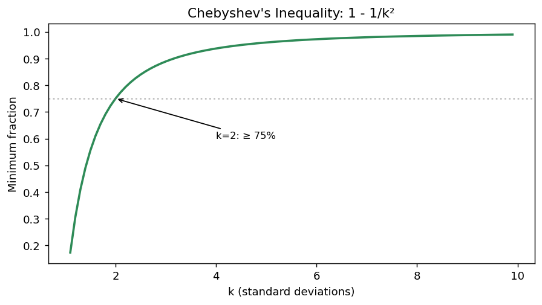
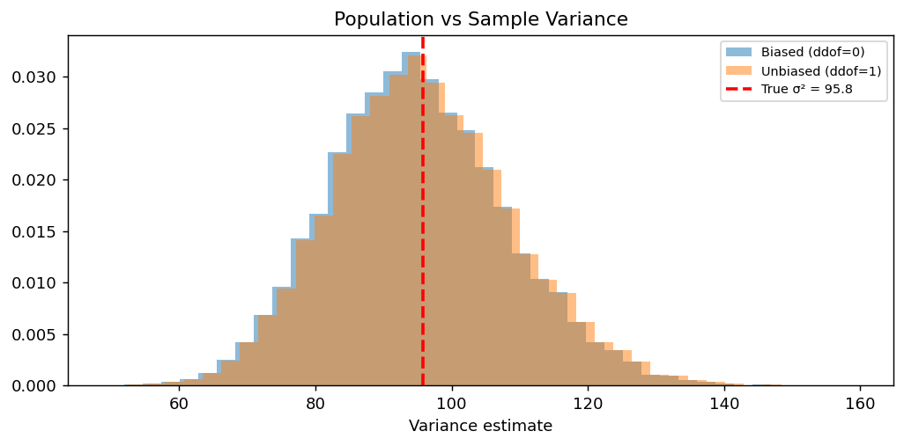

# 고급 기술 측도

## 개요

산술평균과 표본분산은 가장 흔한 요약통계량이지만 언제나 가장 적절한 것은 아니다. 이 절에서는 기본 도구를 확장하는 세 가지 주제를 다룬다.

1. **기하평균** — 투자 수익률처럼 곱셈적인 과정에 맞는 올바른 평균.
2. **체비쇼프 부등식** — 자료가 평균에서 얼마나 멀리 있을 수 있는지에 대한 분포무관 한계.
3. **모분산 대 표본분산** — $n - 1$로 나누는 것이 왜 불편추정량을 주는지 보이는 모의실험.

---

## 1. 기하평균 대 산술평균

<div class="probox" markdown>

**문제 1.** <span class="diff med" title="중간"></span>

수익률의 열 $r_1, r_2, \ldots, r_T$에 대해 산술평균

</div>

??? success "풀이"
    $$
    \bar{r} = \frac{1}{T} \sum_{t=1}^{T} r_t
    $$

    은 수익률이 변동하기만 하면 복리 성장률을 과대평가한다. 올바른 측도는 **기하평균**이다.

    $$
    r_g = \left(\prod_{t=1}^{T} (1 + r_t)\right)^{1/T} - 1
    $$

### 코드

```python
import numpy as np
from scipy import stats

# 6년치 연간 수익률. 큰 이익과 큰 손실이 섞여 있다.
returns = np.array([0.36, 0.23, -0.48, -0.30, 0.15, 0.31])

# 산술평균: 수익률을 그냥 더해서 나눈다.
arith_mean = np.mean(returns)

# 기하평균: 수익률이 아니라 "성장배수" (1+r)의 기하평균을 낸 뒤 1을 뺀다.
# 복리는 곱셈으로 쌓이므로 곱셈의 평균인 기하평균이 맞는 요약이다.
geo_mean = stats.mstats.gmean(1 + returns) - 1

print(f"Arithmetic mean: {arith_mean:.4f}  ({arith_mean*100:.2f}%)")
print(f"Geometric  mean: {geo_mean:.4f}  ({geo_mean*100:.2f}%)")
# 6년을 실제로 곱해 나갔을 때 1달러가 얼마가 되는지
print(f"Compound value of 1 USD: {np.prod(1 + returns):.4f}")
# 기하평균을 6번 복리로 굴려도 같은 값이 나온다. 이것이 기하평균의 정의다.
print(f"Using geo mean:          {(1 + geo_mean)**len(returns):.4f}")
```

출력:

```
Arithmetic mean: 0.0450  (4.50%)
Geometric  mean: -0.0143  (-1.43%)
Compound value of 1 USD: 0.9173
Using geo mean:          0.9173
```

### 해석

산술평균은 평균 수익률이 4.50%로 양수라고 말하지만, 실제로 투자한 \$1은 \$0.92로 줄어든다. 기하평균은 복리 수익률이 $-1.43\%$로 음수임을 올바르게 보고한다. 이 불일치는 산술평균이 복리의 비대칭성을 무시하기 때문에 생긴다. 50% 손실을 회복하려면 50%가 아니라 100%의 이익이 필요하다.

!!! warning "흔한 실수"
    복리 성장을 요약할 때 산술평균을 쓰지 마라. 곱셈적 과정에 대한 유일하게 올바른 요약은 기하평균이다.

---

## 2. 체비쇼프 부등식

### 진술

평균 $\mu$와 표준편차 $\sigma$가 유한한 **어떤** 분포에 대해서도, 평균에서 표준편차 $k$배 안에 있는 자료의 비율은 다음을 만족한다.

$$
P(|X - \mu| < k\sigma) \ge 1 - \frac{1}{k^2} \qquad \text{for } k > 1
$$

이 한계는 분포의 모양에 대해 아무 가정도 하지 않는다.

### 주요 값

| $k$ | $k\sigma$ 안에 있는 최소 비율 |
|---|---|
| 2 | $\ge 75\%$ |
| 3 | $\ge 88.9\%$ |
| 4 | $\ge 93.75\%$ |
| 5 | $\ge 96\%$ |

### 예: 키

키의 평균이 $\mu = 174$ cm이고 표준편차가 $\sigma = 4$ cm라고 하자. 모집단의 몇 퍼센트가 166 cm에서 182 cm 사이에 있는가?

$$
k = \frac{182 - 174}{4} = 2
$$

체비쇼프 부등식에 의해, 키 분포의 모양과 무관하게 모집단의 적어도 $1 - 1/4 = 75\%$가 이 범위에 들어간다.

### 코드

```python
import numpy as np
import matplotlib.pyplot as plt

def chebyshev(k):
    return 1 - 1 / k**2

z_vals = np.arange(1.1, 10, 0.1)
cheb_vals = [chebyshev(z) for z in z_vals]

fig, ax = plt.subplots(figsize=(7, 4))
ax.plot(z_vals, cheb_vals, lw=2, color="seagreen")
ax.set_xlabel("k (standard deviations)")
ax.set_ylabel("Minimum fraction")
ax.set_title("Chebyshev's Inequality: 1 - 1/k²")
ax.axhline(0.75, color="grey", linestyle=":", alpha=0.5)
ax.annotate("k=2: ≥ 75%", (2, 0.75), fontsize=9,
            xytext=(4, 0.6), arrowprops=dict(arrowstyle="->"))
plt.tight_layout()
plt.show()
```



### 해석

체비쇼프의 한계는 **보수적**이다. 정규분포에서는 자료의 95%가 표준편차 2배 안에 있어 체비쇼프가 보장하는 75%를 훨씬 웃돈다. 이 한계의 힘은 보편성에 있다. 심하게 치우쳤거나 다봉인 분포를 포함해, 분산이 유한한 어떤 분포에도 적용된다.

---

## 3. 모분산 대 표본분산

### 편향 문제

소박한 분산 추정량은 $n$으로 나눈다.

$$
\hat{\sigma}^2_{\text{biased}} = \frac{1}{n} \sum_{i=1}^{n} (x_i - \bar{x})^2
$$

$\bar{x}$가 $\mu$보다 표본점들에 더 가깝기 때문에, 이 추정량은 참된 모분산 $\sigma^2$을 체계적으로 과소추정한다. 베셀 보정은 $n - 1$을 쓴다.

$$
s^2 = \frac{1}{n-1} \sum_{i=1}^{n} (x_i - \bar{x})^2
$$

### 모의실험

모집단에서 크기 100인 표본을 10,000번 뽑아 각 추정량의 평균을 참 분산과 비교하여 불편성을 확인한다.

```python
import numpy as np
import matplotlib.pyplot as plt

np.random.seed(42)
population = np.random.normal(170, 10, 1000)
pop_var = np.var(population)

n_samples = 10000
sample_size = 100

biased_vars = np.empty(n_samples)
unbiased_vars = np.empty(n_samples)

for i in range(n_samples):
    sample = np.random.choice(population, size=sample_size, replace=False)
    biased_vars[i] = np.var(sample, ddof=0)
    unbiased_vars[i] = np.var(sample, ddof=1)

print(f"Population variance:          {pop_var:.4f}")
print(f"Mean of biased (ddof=0):      {biased_vars.mean():.4f}")
print(f"Mean of unbiased (ddof=1):    {unbiased_vars.mean():.4f}")
```

출력:

```
Population variance:          95.7905
Mean of biased (ddof=0):      94.9057
Mean of unbiased (ddof=1):    95.8643
```

### 시각화

```python
fig, ax = plt.subplots(figsize=(8, 4))
ax.hist(biased_vars, bins=40, alpha=0.5, label="Biased (ddof=0)", density=True)
ax.hist(unbiased_vars, bins=40, alpha=0.5, label="Unbiased (ddof=1)", density=True)
ax.axvline(pop_var, color="red", linestyle="--", lw=2,
           label=f"True σ² = {pop_var:.1f}")
ax.set_xlabel("Variance estimate")
ax.set_title("Population vs Sample Variance")
ax.legend(fontsize=8)
plt.tight_layout()
plt.show()
```



### 해석

편향된 추정량(ddof=0)의 히스토그램이 참 분산보다 살짝 왼쪽으로 이동해 있어 체계적인 과소추정을 확인해 준다. 불편추정량(ddof=1)은 참값을 중심으로 한다. $n = 100$에서는 차이가 작지만($100/99 \approx 1.01$배) 표본이 작아지면 상당해진다.

---

## 연습문제

<div class="drillbox" markdown>

**연습문제 1.** <span class="diff easy" title="쉬움"></span>
어떤 투자의 연간 수익률이 $+20\%$, $-20\%$, $+20\%$, $-20\%$다. 산술평균과 기하평균을 계산하라. 투자한 \$1000의 최종 가치는 얼마인가?

</div>

??? success "풀이"
    산술평균: $(0.20 - 0.20 + 0.20 - 0.20)/4 = 0$. 산술평균은 성장이 없다고 말한다.

    기하평균:

    $$
    r_g = (1.20 \times 0.80 \times 1.20 \times 0.80)^{1/4} - 1 = (0.9216)^{1/4} - 1 \approx -0.0202
    $$

    최종 가치: $1000 \times 1.20 \times 0.80 \times 1.20 \times 0.80 = 1000 \times 0.9216 = \$921.60$.

    기하평균은 연 약 2%의 손실을 올바르게 나타내는 반면, 산술평균은 잘못되게 본전이라고 말한다.

<div class="drillbox" markdown>

**연습문제 2.** <span class="diff med" title="중간"></span>
체비쇼프 부등식을 증명하라. 마르코프 부등식에서 출발하라: 음이 아닌 확률변수 $Y$와 $a > 0$에 대해 $P(Y \ge a) \le E[Y]/a$.

</div>

??? success "풀이"
    $a = (k\sigma)^2 = k^2 \sigma^2$로 두고 $Y = (X - \mu)^2$에 마르코프 부등식을 적용한다.

    $$
    P\bigl((X - \mu)^2 \ge k^2 \sigma^2\bigr) \le \frac{E[(X - \mu)^2]}{k^2 \sigma^2} = \frac{\sigma^2}{k^2 \sigma^2} = \frac{1}{k^2}
    $$

    $(X - \mu)^2 \ge k^2 \sigma^2$은 $|X - \mu| \ge k\sigma$와 동치이므로

    $$
    P(|X - \mu| \ge k\sigma) \le \frac{1}{k^2}
    $$

    이고, 여집합을 취하면

    $$
    P(|X - \mu| < k\sigma) \ge 1 - \frac{1}{k^2}
    $$

    이다. $\square$

<div class="drillbox" markdown>

**연습문제 3.** <span class="diff med" title="중간"></span>
위의 모분산 모의실험에서 표본 크기 $n$이 커지면 ddof=0 추정량의 편향은 어떻게 되는가? 편향을 $n$과 $\sigma^2$의 함수로 나타내라.

</div>

??? success "풀이"
    편향된 추정량의 기댓값은

    $$
    E\left[\frac{1}{n}\sum_{i=1}^n (X_i - \bar{X})^2\right] = \frac{n-1}{n} \sigma^2
    $$

    이므로 편향은

    $$
    \text{Bias} = \frac{n-1}{n}\sigma^2 - \sigma^2 = -\frac{\sigma^2}{n}
    $$

    이다. $n \to \infty$이면 편향은 0으로 간다. $n = 100$이면 편향이 $-\sigma^2/100$으로 참 분산의 1%에 불과하다. $n = 5$이면 편향이 $-\sigma^2/5 = -20\%$로 훨씬 크다.

<div class="drillbox" markdown>

**연습문제 4.** <span class="diff easy" title="쉬움"></span>
어떤 자료의 평균이 50이고 표준편차가 5다. 체비쇼프 부등식을 이용해 구간 $[35, 65]$에 있는 자료의 최소 비율을 구하라. 그런 다음 자료가 정규분포를 따를 때의 비율과 비교하라.

</div>

??? success "풀이"
    구간 $[35, 65]$는 $[50 - 15, 50 + 15]$이므로 $k = 15/5 = 3$이다.

    체비쇼프에 의해 적어도 $1 - 1/9 \approx 88.9\%$다.

    정규분포에서는 $P(|Z| < 3) = P(-3 < Z < 3) \approx 0.9974$이므로 약 $99.7\%$다.

    정규분포는 체비쇼프의 보편적 하한이 요구하는 것보다 훨씬 많은 질량을 평균 근처에 몰아 놓는다. 그 차이($99.7\%$ 대 $88.9\%$)가 분포에 대해 아무 가정도 하지 않는 데 드는 비용을 보여준다.

<div class="drillbox" markdown>

**연습문제 5.** <span class="diff med" title="중간"></span>
음이 아닌 값들에 대해 기하평균이 언제나 산술평균 이하임을 보여라. 등호는 언제 성립하는가?

</div>

??? success "풀이"
    이것이 **산술–기하평균 부등식(AM-GM)** 이다. 음이 아닌 값 $a_1, \ldots, a_n$에 대해

    $$
    \frac{a_1 + a_2 + \cdots + a_n}{n} \ge (a_1 \cdot a_2 \cdots a_n)^{1/n}
    $$

    이다.

    **옌센 부등식을 이용한 증명:** 로그는 오목함수다. 옌센 부등식에 의해

    $$
    \log\left(\frac{1}{n}\sum_{i=1}^n a_i\right) \ge \frac{1}{n}\sum_{i=1}^n \log(a_i) = \log\left(\prod_{i=1}^n a_i\right)^{1/n}
    $$

    이다. $\log$가 순증가함수이므로 양변에 지수를 취하면 AM $\ge$ GM을 얻는다.

    등호는 $a_1 = a_2 = \cdots = a_n$일 때에 한해 성립한다. 엄격히 오목한 함수에 대해 옌센 부등식은 모든 값이 같지 않으면 엄격 부등식이기 때문이다. $\square$

<div class="drillbox" markdown>

**연습문제 6.** <span class="diff hard" title="어려움"></span>
양수 $a_1, \ldots, a_n$의 **조화평균**은 $H = n / \sum_i (1/a_i)$이다. 부등식 $H \le G \le A$(조화 $\le$ 기하 $\le$ 산술)를 증명하고, 조화평균이 *올바른* 평균인 경우를 설명하라.

</div>

??? success "풀이"
    **증명:** $1/a_1, \ldots, 1/a_n$에 AM-GM 부등식을 적용하면

    $$
    \frac{1}{n}\sum_i \frac{1}{a_i} \ge \left(\prod_i \frac{1}{a_i}\right)^{1/n} = \frac{1}{G}
    $$

    이다. 양변이 양수이므로 역수를 취하면 $H = n / \sum_i (1/a_i) \le G$이다. 연습문제 5의 $G \le A$와 결합하면 $H \le G \le A$를 얻는다.

    **조화평균이 올바른 경우:** 조화평균은 **비율**을 제대로 평균 낸다. 예를 들면 다음과 같다.

    - 서로 다른 속도로 같은 *거리*를 이동할 때의 평균 속도. 시속 60마일로 50마일, 시속 30마일로 50마일을 달리면 평균 속도는 $A(60, 30) = 45$가 아니라 $H(60, 30) = 40$마일이다. 느린 속도로 보내는 시간이 더 길기 때문에 산술평균은 과대평가한다.
    - 포트폴리오의 주가수익비율을 *이익*으로 가중할 때(조화평균 PER)와 *시가총액*으로 가중할 때(가중 산술평균 PER)의 차이.
    - $F_1$ 점수의 결합: $F_1 = H(\text{precision}, \text{recall}) = 2 PR / (P + R)$.

    일반 규칙: **역수**가 자연스럽게 더해지는 양(변화율, 단위당 빈도)을 평균 낼 때는 조화평균을 쓴다. 이를 산술평균과 혼동하면 체계적인 편향이 생긴다.

<div class="drillbox" markdown>

**연습문제 7.** <span class="diff med" title="중간"></span>
표본평균과 중앙값은 둘 다 대칭 분포의 "중심"을 추정한다. (a) 정규분포와 (b) 라플라스(이중지수) 분포 아래에서 **둘의 상대 효율을 비교하라**.

</div>

??? success "풀이"
    평균에 대한 중앙값의 상대 효율은 $\mathrm{ARE}(\tilde X, \bar X) = \mathrm{Var}(\bar X)/\mathrm{Var}(\tilde X)$이며, 값이 작을수록 중앙값의 효율이 낮다.

    **(a) 정규분포:** $\mathrm{ARE} = 2/\pi \approx 0.637$. 평균이 $\pi/2$배 더 효율적이다. 표본 크기 100에서 중앙값의 분산은 관측값 63개만으로 계산한 평균의 분산과 같다. 중앙값을 쓰는 데 드는 고전적인 가우시안 효율 비용이다.

    **(b) 라플라스 분포**(밀도가 $\propto e^{-|x|}$로 정규분포보다 꼬리가 두껍다): $\mathrm{ARE} = 2 > 1$. 중앙값이 평균보다 두 배 효율적이다. 라플라스 꼬리에서는 극단 관측값이 담고 있는 정보에 비해 영향력이 크므로 평균이 "낭비적"이다.

    **교훈:** 평균과 중앙값 사이의 선택은 강건성만의 문제가 아니라 추정량을 분포의 꼬리 행동에 맞추는 문제다. 정규성 아래에서는 평균이 최적(BLUE)이고, 꼬리가 더 두꺼운 분포에서는 중앙값(또는 다른 강건 추정량)이 훨씬 효율적일 수 있다. 이것이 (꼬리가 얇을 때 효율적인) 평균과 (꼬리가 두꺼울 때 효율적인) 중앙값 사이를 보간하는 M-추정량(Huber 1964)의 이론적 토대다.

<div class="drillbox" markdown>

**연습문제 8.** <span class="diff med" title="중간"></span>
체비쇼프 부등식은 양쪽 꼬리를 함께 다룬다. **한쪽 꼬리**만 관심이 있다면 더 날카로운 한계가 있는가? **칸텔리 부등식**을 진술하고 비교하라.

</div>

??? success "풀이"
    **칸텔리 부등식**(한쪽 체비쇼프)은 $k > 0$에 대해

    $$
    P\!\left(X - \mu \ge k\sigma\right) \le \frac{1}{1 + k^2}
    $$

    를 준다. 체비쇼프를 반으로 쪼갠 $\frac{1}{2k^2}$이 아니라는 점에 주의하라. 대칭을 가정할 수 없으므로 그렇게 쪼갤 수 없고, 소박하게 쓸 수 있는 한계는 양쪽 한계 $\frac{1}{k^2}$ 그대로다.

    ```python
    import numpy as np

    rng = np.random.default_rng(0)
    normal = rng.normal(0, 1, 3_000_000)
    expo = rng.exponential(1, 3_000_000)

    print(f"{'k':>5}{'체비셰프':>11}{'칸텔리':>11}{'정규 실제':>12}{'지수 실제':>12}")
    for k in (1, 2, 3):
        print(f"{k:>5}{1 / k ** 2:>11.4f}{1 / (1 + k ** 2):>11.4f}"
              f"{np.mean(normal >= k):>12.5f}{np.mean(expo - 1 >= k):>12.5f}")
    ```

    출력:

    ```
    k       체비셰프        칸텔리       정규 실제       지수 실제
        1     1.0000     0.5000     0.15852     0.13515
        2     0.2500     0.2000     0.02291     0.04948
        3     0.1111     0.1000     0.00133     0.01826
    ```

    **칸텔리가 언제나 더 날카롭다.**

    | $k$ | 체비쇼프 | 칸텔리 | 정규 실제 |
    |---|---|---|---|
    | $1$ | $1.000$ (무의미) | $\mathbf{0.500}$ | $0.159$ |
    | $2$ | $0.250$ | $\mathbf{0.200}$ | $0.023$ |
    | $3$ | $0.111$ | $\mathbf{0.100}$ | $0.001$ |

    $k = 1$에서 특히 차이가 크다. 체비쇼프는 아무 정보도 주지 못하지만($\le 1$) 칸텔리는 $\le 0.5$를 준다.

    **유도의 요령.** 임의의 $t > 0$에 대해 $Y = X - \mu + t$로 두면

    $$
    P(X-\mu \ge k\sigma) = P(Y \ge k\sigma + t) \le \frac{\mathbb{E}[Y^2]}{(k\sigma+t)^2} = \frac{\sigma^2 + t^2}{(k\sigma+t)^2}
    $$

    이고, 우변을 $t$에 대해 최소화하면 $t = \sigma/k$에서 $\frac{1}{1+k^2}$을 얻는다. **자유 모수를 넣고 최적화하는 것**이 이런 한계를 날카롭게 만드는 표준 기법이며, 체르노프 한계도 같은 발상이다.

    **어디에 쓰는가.** 한쪽 위험만 중요한 상황이 많다. "손실이 $k\sigma$를 넘을 확률", "지연이 기준을 초과할 확률", "농도가 상한을 넘을 확률"이 모두 한쪽 꼬리 문제다. 이때 양쪽 체비쇼프를 쓰면 불필요하게 보수적이다. $\square$

<div class="drillbox" markdown>

**연습문제 9.** <span class="diff hard" title="어려움"></span>
연습문제 4에서 체비쇼프 한계가 실제보다 훨씬 느슨함을 보았다. 그렇다면 이 한계는 **개선할 수 있는가**? 답을 하고 근거를 제시하라.

</div>

??? success "풀이"
    **개선할 수 없다.** 체비쇼프 한계는 **달성 가능하다**. 즉 부등식을 등호로 만드는 분포가 실제로 존재한다.

    $k > 1$을 고정하고 세 점에 질량을 놓자.

    $$
    P(X = -k) = P(X = k) = \frac{1}{2k^2}, \qquad P(X = 0) = 1 - \frac{1}{k^2}
    $$

    ```python
    import numpy as np

    k = 2.0
    p = 1 / (2 * k * k)
    values = np.array([-k, 0.0, k])
    probs = np.array([p, 1 - 2 * p, p])

    mu = (values * probs).sum()
    var = ((values - mu) ** 2 * probs).sum()

    print(f"값 {values}   확률 {probs.round(4)}")
    print(f"  평균 {mu:.4f}   분산 {var:.4f}   표준편차 {np.sqrt(var):.4f}")
    print(f"\n  P(|X - mu| >= {k} sigma) = {2 * p:.4f}")
    print(f"  체비쇼프 한계 1/k^2      = {1 / k ** 2:.4f}   → 정확히 일치")
    ```

    출력:

    ```
    값 [-2.  0.  2.]   확률 [0.125 0.75  0.125]
      평균 0.0000   분산 1.0000   표준편차 1.0000

      P(|X - mu| >= 2.0 sigma) = 0.2500
      체비쇼프 한계 1/k^2      = 0.2500   → 정확히 일치
    ```

    평균 $0$, 분산 $1$이고 $P(\lvert X\rvert \ge 2\sigma) = 0.25 = 1/k^2$로 **한계를 정확히 달성한다.**

    **이것이 뜻하는 바.** 체비쇼프는 "분산만 알 때 말할 수 있는 최선"이며, 그 이상 좁힐 수 없다. 실제 분포에서 훨씬 느슨해 보이는 이유는 **우리가 분산 외에도 많은 것을 알고 있기 때문**이다. 정규분포라는 것을 알면 $3\sigma$ 밖이 $0.27\%$임을 안다. 아무것도 모르면 $11.1\%$까지 열어 두어야 한다.

    **한계를 좁히려면 가정을 추가해야 한다.**

    | 추가 가정 | 한계($k = 3$) |
    |---|---|
    | 없음 (체비쇼프) | $0.1111$ |
    | 단봉·대칭 (반슈타인) | $0.0494$ |
    | 유계 지지 (회프딩) | 지지 폭에 의존 |
    | 정규 | $0.0027$ |

    **일반 원리.** 확률 부등식의 세계에서는 언제나 **가정과 날카로움을 맞바꾼다.** 가정이 약할수록 적용 범위가 넓고 한계는 느슨하다. 이 책 전체에서 되풀이되는 구조이며, 앞서 본 컨포멀 예측(가정 없음, 구간 넓음) 대 모수적 예측구간(가정 강함, 구간 좁음)이 같은 대비다.

    **실무적 함의.** 체비쇼프로 얻은 한계가 쓸모없을 만큼 느슨하다면, 그것은 부등식의 결함이 아니라 **분포에 대해 아는 것이 너무 적다는 신호**다. 자료를 더 보고 분포 형태를 파악하는 것이 답이다. $\square$

<div class="drillbox" markdown>

**연습문제 10.** <span class="diff hard" title="어려움"></span>
연습문제 5와 6의 AM–GM–HM 부등식은 사실 하나의 정리에서 나온다. **옌센 부등식**으로 통일하고, 이 책의 다른 결과들과 어떻게 연결되는지 보여라.

</div>

??? success "풀이"
    **옌센 부등식.** $g$가 볼록이면

    $$
    g\!\left(\mathbb{E}[X]\right) \le \mathbb{E}\!\left[g(X)\right]
    $$

    이고 오목이면 부등호가 뒤집힌다. 등호는 $g$가 선형이거나 $X$가 상수일 때만 성립한다.

    **AM–GM 유도.** $\log$는 오목하므로

    $$
    \log\!\left(\frac{1}{n}\sum x_i\right) \ge \frac{1}{n}\sum \log x_i = \log\left(\prod x_i\right)^{1/n}
    $$

    이고, $\exp$가 증가함수이므로 $\text{AM} \ge \text{GM}$이다.

    **GM–HM 유도.** 같은 부등식을 $1/x_i$에 적용하면 $\text{AM}(1/x) \ge \text{GM}(1/x) = 1/\text{GM}(x)$이고, 역수를 취하면 $\text{GM}(x) \ge \text{HM}(x)$다.

    ```python
    import numpy as np
    from scipy import stats

    rng = np.random.default_rng(2)
    x = rng.lognormal(0, 0.8, 500_000)

    print(f"AM {x.mean():.5f}  >=  GM {stats.gmean(x):.5f}  >=  HM {stats.hmean(x):.5f}")
    print(f"\n옌센 격차 (볼록·오목 함수별)")
    for name, g, convex in [("exp(x)", np.exp, True), ("log(x)", np.log, False),
                            ("1/x", lambda v: 1 / v, True), ("x^2", np.square, True)]:
        lhs = g(x.mean())
        rhs = g(x).mean()
        ok = (lhs <= rhs) if convex else (lhs >= rhs)
        print(f"  {name:>8}: g(E[X]) {lhs:>10.5f}   E[g(X)] {rhs:>10.5f}   "
              f"{'볼록' if convex else '오목'}  부등식 성립: {ok}")
    ```

    출력:

    ```
    AM 1.37840  >=  GM 1.00123  >=  HM 0.72678

    옌센 격차 (볼록·오목 함수별)
        exp(x): g(E[X])    3.96853   E[g(X)] 41846194417799664.00000   볼록  부등식 성립: True
        log(x): g(E[X])    0.32092   E[g(X)]    0.00123   오목  부등식 성립: True
           1/x: g(E[X])    0.72548   E[g(X)]    1.37593   볼록  부등식 성립: True
           x^2: g(E[X])    1.89997   E[g(X)]    3.61346   볼록  부등식 성립: True
    ```

    **이 하나의 부등식이 이 책 곳곳에 나타난다.**

    | 결과 | $g$ | 방향 |
    |---|---|---|
    | AM $\ge$ GM $\ge$ HM | $\log$ (오목) | 이 문제 |
    | $\mathbb{E}[s] < \sigma$ | $\sqrt{\cdot}$ (오목) | 1장 연습문제 10 |
    | $\mathbb{E}[1/\bar{X}] > 1/\mu$ | $1/x$ (볼록) | 1장 연습문제 10 |
    | $\operatorname{Var}(X) = \mathbb{E}[X^2]-\mu^2 \ge 0$ | $x^2$ (볼록) | 분산의 비음성 |
    | 로그정규의 평균 $>$ 중앙값 | $\exp$ (볼록) | 앞 절 |

    **공통 구조.** 비선형 변환은 평균과 교환되지 않는다. $\mathbb{E}[g(X)] \ne g(\mathbb{E}[X])$이며, **격차의 방향은 $g$의 볼록성이 정하고 크기는 $X$의 분산이 정한다.** 델타 방법의 2차 근사

    $$
    \mathbb{E}[g(X)] \approx g(\mu) + \tfrac{1}{2}g''(\mu)\operatorname{Var}(X)
    $$

    가 그 격차를 정량화한 것이며, $g''$의 부호가 곧 볼록성이다.

    **실무에서 가장 자주 물리는 곳.** "평균에 함수를 씌운 값"과 "함수를 씌워 평균한 값"을 혼동하는 것이다. 평균 수익률로 계산한 최종 자산이 실제 평균 최종 자산과 다르고(연습문제 1), 평균 로그 소득의 지수가 평균 소득이 아니며, 평균 확률로 계산한 기대 손실이 실제 기대 손실이 아니다.

    **한 문장으로.** **평균은 선형연산이고 세상은 대체로 비선형이다.** $\square$

---

## 정리하며

이 절은 기본 요약통계가 맞지 않는 세 가지 상황을 다뤘다.

- **기하평균.** 수익률처럼 **곱셈적으로** 누적되는 양에서는 산술평균이 복리 성장률을 과대평가한다. 올바른 측도는 $r_g=\left(\prod_t(1+r_t)\right)^{1/T}-1$ 이며, 변동이 클수록 두 평균의 격차가 벌어진다. 산술평균이 양수인데 실제 자산이 줄어드는 일이 그래서 가능하다.
- **체비쇼프 부등식.** $P(|X-\mu|\ge k\sigma)\le 1/k^2$ 은 **분포에 아무 가정도 하지 않는다.** 그래서 언제나 성립하지만 그만큼 느슨하다. 정규분포를 가정할 수 있다면 훨씬 날카로운 한계를 얻는다. 가정을 덜 할수록 결론이 약해진다는 절충이 여기서 선명하게 보인다.
- **모분산 대 표본분산.** $n$ 으로 나누면 분산을 체계적으로 과소추정한다. 표본평균이 자료에 맞춰 정해지느라 편차가 실제보다 작아지기 때문이며, $n-1$ 로 나누는 **베셀 보정**이 그것을 되돌린다. 모의실험이 이 사실을 눈으로 확인해 준다.

**세 주제를 관통하는 것은 "기본값을 언제 의심해야 하는가"다.** 곱셈적 자료인가, 분포를 가정할 수 있는가, 추정량이 불편인가 — 이 세 물음이 7장의 추정 이론으로 이어진다.

다음 절 **막대그림**부터는 시각화로 넘어간다. 범주형 자료를 그리는 가장 기본적인 도구에서 시작한다.
