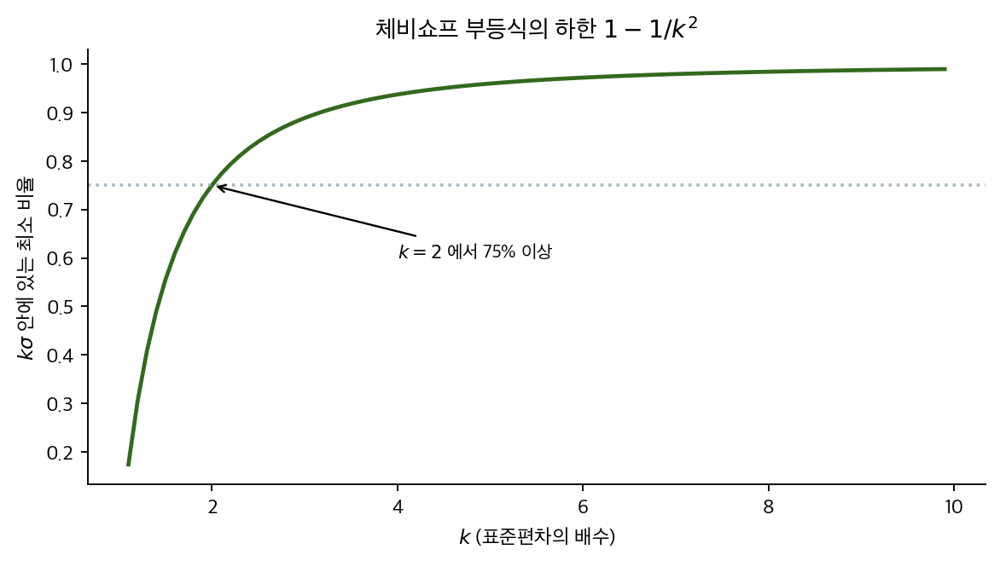
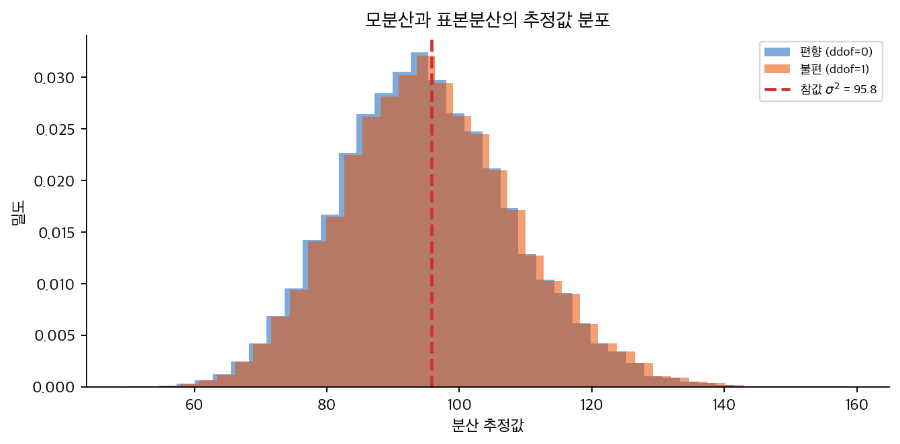

# 고급 기술 측도

## 개요

산술평균과 표본분산은 가장 흔한 요약통계량이지만 언제나 가장 적절한 것은 아니다. 이 절에서는 기본 도구를 확장하는 세 가지 주제를 다룬다.

1. **기하평균** — 투자 수익률처럼 곱셈적인 과정에 맞는 올바른 평균.
2. **체비쇼프 부등식** — 자료가 평균에서 얼마나 멀리 있을 수 있는지에 대한 분포무관 한계.
3. **모분산 대 표본분산** — $n - 1$로 나누는 것이 왜 불편추정량을 주는지 보이는 모의실험.

---

## 1. 기하평균 대 산술평균

<div class="probox" markdown>

**문제 1.** <span class="diff med" title="중간"></span>

수익률의 열 $r_1, r_2, \ldots, r_T$를 하나의 "평균 수익률"로 요약하려 한다. 산술평균

$$
\bar{r} = \frac{1}{T} \sum_{t=1}^{T} r_t
$$

을 쓰면 무엇이 잘못되는가? 올바른 요약은 무엇인가?

</div>

??? success "풀이"
    산술평균은 수익률이 변동하기만 하면 복리 성장률을 **과대평가한다.** 수익률은 더해지는 것이 아니라 곱해지기 때문이다. $T$기 뒤의 자산 배수는 $\prod_t (1 + r_t)$이지 $(1 + \bar{r})^\top$가 아니다.

    올바른 측도는 **기하평균**이다.

    $$
    r_g = \left(\prod_{t=1}^{T} (1 + r_t)\right)^{1/T} - 1
    $$

    이렇게 정의하면 $(1 + r_g)^\top = \prod_t (1 + r_t)$가 정확히 성립하므로, $r_g$는 "매기 같은 수익률을 냈다면 실제와 똑같은 결과에 이르렀을 그 수익률"이다. AM $\ge$ GM 부등식(연습문제 5)에 의해 언제나 $r_g \le \bar{r}$이고, 등호는 모든 $r_t$가 같을 때만 성립한다.

### 코드

<div class="exbox" markdown>

**보기 1.** <span class="diff easy" title="쉬움"></span> 산술평균으로 복리를 예측하면 얼마나 틀리는가. 6년치 연간 수익률이 $+36\%,\ +23\%,\ -48\%,\ -30\%,\ +15\%,\ +31\%$ 다.

**(1)** 손실 $x$ 를 되돌리는 데 필요한 이익이 $x/(1-x)$ 임을 보이고, $-48\%$ 와 $-50\%$ 에 대해 수치를 내시오.

**(2)** 산술평균을 믿고 6년 복리를 $(1 + \bar r)^\top$ 로 예측하면 실제 $\prod_t (1 + r_t)$ 의 몇 배가 되는가. 두 값을 계산해 확인하시오.

</div>

??? success "풀이"

    **(1) 해석적으로.** 자산이 $x$ 의 비율로 줄었으면 배수가 $1 - x$ 다. 이듬해 이익 $g$ 로 본전에 돌아오려면

    $$
    (1 - x)(1 + g) = 1 \quad\Longrightarrow\quad 1 + g = \frac{1}{1 - x}
    \quad\Longrightarrow\quad g = \frac{1}{1-x} - 1 = \frac{x}{1 - x}
    $$

    이다. **분모에 $1 - x$ 가 있으므로 $g > x$ 이고, $x$ 가 커지면 격차가 폭발한다.** $x \to 1^-$ 에서 $g \to \infty$ 다.

    | 손실 $x$ | 필요한 이익 $x/(1-x)$ |
    |---|---|
    | $30\%$ | $42.9\%$ |
    | $48\%$ | $92.3\%$ |
    | $50\%$ | $100\%$ |
    | $90\%$ | $900\%$ |

    **이 비대칭이 $\bar r \ne r_g$ 의 근원이다.** $+x$ 와 $-x$ 를 한 번씩 겪으면 산술평균은 $0$ 이지만 배수는 $(1+x)(1-x) = 1 - x^2 < 1$ 이다. 수익률을 더하는 셈은 이 $-x^2$ 을 보지 못한다.

    **(2) 해석적으로.** 산술평균은 $\bar r = 0.045$ 다. 그것으로 6년을 굴리면

    $$
    (1 + 0.045)^6 = 1.3023
    $$

    인데 실제 배수는 $1.36 \times 1.23 \times 0.52 \times 0.70 \times 1.15 \times 1.31 = 0.9173$ 이다. 비는

    $$
    \frac{1.3023}{0.9173} = 1.4197
    $$

    이다. **$42\%$ 과대예측이다.** 한편 기하평균은 정의상 $(1 + r_g)^6 = \prod(1+r_t)$ 를 만족하므로 오차가 $0$ 이어야 한다.

    **(3) 수치적으로.**

    ```python
    import numpy as np
    from scipy import stats

    # 6년치 연간 수익률. 큰 이익과 큰 손실이 섞여 있다.
    returns = np.array([0.36, 0.23, -0.48, -0.30, 0.15, 0.31])

    # 산술평균: 수익률을 그냥 더해서 나눈다.
    arith_mean = np.mean(returns)

    # 기하평균: 수익률이 아니라 "성장배수" (1+r)의 기하평균을 낸 뒤 1을 뺀다.
    # 복리는 곱셈으로 쌓이므로 곱셈의 평균인 기하평균이 맞는 요약이다.
    geo_mean = stats.mstats.gmean(1 + returns) - 1

    print(f"Arithmetic mean: {arith_mean:.4f}  ({arith_mean*100:.2f}%)")
    print(f"Geometric  mean: {geo_mean:.4f}  ({geo_mean*100:.2f}%)")
    # 6년을 실제로 곱해 나갔을 때 1달러가 얼마가 되는지
    print(f"Compound value of 1 USD: {np.prod(1 + returns):.4f}")
    # 기하평균을 6번 복리로 굴려도 같은 값이 나온다. 이것이 기하평균의 정의다.
    print(f"Using geo mean:          {(1 + geo_mean)**len(returns):.4f}")

    # 로그를 거친 정의도 같은 값을 준다. 곱을 합으로 바꾼 것이다.
    print(f"로그 정의 exp(mean(log(1+r)))-1: {np.exp(np.mean(np.log(1 + returns))) - 1:.4f}")

    # (1) 손실 x 를 되돌리는 데 필요한 이익은 x/(1-x) 다.
    print()
    for x in (0.30, 0.48, 0.50):
        print(f"  손실 {x:.0%} 회복에 필요한 이익 = x/(1-x) = {x / (1 - x):.4f}  ({100 * x / (1 - x):.1f}%)")
    print(f"  -48% 와 -30% 를 연달아 맞은 뒤 본전까지: "
          f"{1 / ((1 - 0.48) * (1 - 0.30)) - 1:.4f}  (+174.7%)")

    # (2) 산술평균으로 6년 복리를 예측하면 얼마나 틀리는가.
    T = len(returns)
    print(f"\n  산술평균의 예측 (1+rbar)^T = {(1 + arith_mean) ** T:.4f}")
    print(f"  실제            prod(1+r)  = {np.prod(1 + returns):.4f}")
    print(f"  비 = {(1 + arith_mean) ** T / np.prod(1 + returns):.4f}  배 과대예측")
    print(f"  두 평균의 차 rbar - r_g = {arith_mean - geo_mean:.4f}")
    ```

    출력:

    ```
    Arithmetic mean: 0.0450  (4.50%)
    Geometric  mean: -0.0143  (-1.43%)
    Compound value of 1 USD: 0.9173
    Using geo mean:          0.9173
    로그 정의 exp(mean(log(1+r)))-1: -0.0143

      손실 30% 회복에 필요한 이익 = x/(1-x) = 0.4286  (42.9%)
      손실 48% 회복에 필요한 이익 = x/(1-x) = 0.9231  (92.3%)
      손실 50% 회복에 필요한 이익 = x/(1-x) = 1.0000  (100.0%)
      -48% 와 -30% 를 연달아 맞은 뒤 본전까지: 1.7473  (+174.7%)

      산술평균의 예측 (1+rbar)^T = 1.3023
      실제            prod(1+r)  = 0.9173
      비 = 1.4197  배 과대예측
      두 평균의 차 rbar - r_g = 0.0593
    ```

    **(1)의 표가 그대로 나온다.** $48\%$ 손실에는 $92.3\%$ 이익이, $50\%$ 손실에는 정확히 $100\%$ 이익이 필요하다. 그리고 이 자료는 $-48\%$ 와 $-30\%$ 를 연달아 맞았으므로 배수가 $0.52 \times 0.70 = 0.364$ 로 떨어졌고, 거기서 본전까지 올라오려면 $+174.7\%$ 가 필요하다. **두 해의 손실 합 $78\%$ 를 되돌리는 값이 $175\%$ 다.**

    **(2)도 맞는다.** 산술평균의 예측 $1.3023$ 과 실제 $0.9173$ 의 비가 $1.4197$ 이다. 그동안 기하평균을 6 제곱한 값은 $0.9173$ 으로 **실제와 소수점 넷째 자리까지 같다.** 정의가 그것을 보장하기 때문이다. 로그를 거친 정의 $\exp\!\big(\frac1T\sum\ln(1+r_t)\big) - 1$ 도 같은 $-0.0143$ 을 준다. 곱을 합으로 바꾼 것일 뿐이고, 자료가 길면 곱셈이 언더플로하므로 실무에서는 이 꼴을 쓴다.

    **두 평균의 차는 $0.0593$ 인데, 이 자료에서는 "작은 보정"이 아니다.** $\bar r = +4.50\%$ 와 $r_g = -1.43\%$ 는 **부호가 다르다.** 전자를 믿으면 돈을 벌었다고 보고하고 후자를 믿으면 잃었다고 보고한다. 실제로는 $1$ 달러가 $0.9173$ 달러가 되었으니 잃었다.

### 해석

산술평균은 평균 수익률이 4.50%로 양수라고 말하지만, 실제로 투자한 \$1은 \$0.92로 줄어든다. 기하평균은 복리 수익률이 $-1.43\%$로 음수임을 올바르게 보고한다. 이 불일치는 산술평균이 복리의 비대칭성을 무시하기 때문에 생긴다. 50% 손실을 회복하려면 50%가 아니라 100%의 이익이 필요하다.

!!! warning "흔한 실수"
    복리 성장을 요약할 때 산술평균을 쓰지 마라. 곱셈적 과정에 대한 유일하게 올바른 요약은 기하평균이다.

---

## 2. 체비쇼프 부등식

### 진술

평균 $\mu$와 표준편차 $\sigma$가 유한한 **어떤** 분포에 대해서도, 평균에서 표준편차 $k$배 안에 있는 자료의 비율은 다음을 만족한다.

$$
P(|X - \mu| < k\sigma) \ge 1 - \frac{1}{k^2} \qquad \text{for } k > 1
$$

이 한계는 분포의 모양에 대해 아무 가정도 하지 않는다.

### 주요 값

| $k$ | $k\sigma$ 안에 있는 최소 비율 |
|---|---|
| 2 | $\ge 75\%$ |
| 3 | $\ge 88.9\%$ |
| 4 | $\ge 93.75\%$ |
| 5 | $\ge 96\%$ |

### 키 자료에 적용하기

키의 평균이 $\mu = 174$ cm이고 표준편차가 $\sigma = 4$ cm라고 하자. 모집단의 몇 퍼센트가 166 cm에서 182 cm 사이에 있는가?

$$
k = \frac{182 - 174}{4} = 2
$$

체비쇼프 부등식에 의해, 키 분포의 모양과 무관하게 모집단의 적어도 $1 - 1/4 = 75\%$가 이 범위에 들어간다.

### 코드

<div class="exbox" markdown>

**보기 2.** <span class="diff easy" title="쉬움"></span> 하한 곡선 $1 - 1/k^2$ 를 그려 놓고 무엇을 읽어 낼 수 있는지 보기. 가로축은 $k$, 세로축은 $k\sigma$ 안에 들어가는 자료의 **최소** 비율이다.

**(1)** 곡선이 $0.75$, $0.9$, $0.99$ 에 이르는 $k$ 를 각각 구하시오. 그림이 $k = 1.1$ 에서 시작하는 까닭은 무엇이며, $k \le 1$ 에서 이 곡선은 무슨 말을 하는가.

**(2)** 이 그림이 **가리고 있는 것**은 무엇인가. 정규·지수·균등분포의 실제 비율을 나란히 놓고 답하시오.

</div>

??? success "풀이"

    유도할 "정답"이 있는 문제가 아니다. **곡선 한 줄에서 무엇이 읽히고 무엇이 읽히지 않는가**가 이 보기의 전부다.

    **(1) 곡선을 거꾸로 풀면 된다.** $1 - 1/k^2 = p$ 에서

    $$
    k = \frac{1}{\sqrt{1 - p}}
    $$

    이므로 $p = 0.75$ 에 $k = 2$, $p = 0.9$ 에 $k = 1/\sqrt{0.1} = 3.1623$, $p = 0.99$ 에 $k = 10$, $p = 0.999$ 에 $k = 31.62$ 다. **보장을 $0.75$ 에서 $0.9$ 로 올리는 데는 $k$ 를 $2 \to 3.16$ 으로 올리면 되지만, $0.9$ 에서 $0.99$ 로 올리려면 $3.16 \to 10$ 까지 가야 한다.** 남은 여유분을 $10$ 분의 $1$ 로 줄일 때마다 $k$ 에 $\sqrt{10} = 3.16$ 을 곱해야 한다. 곡선이 $1$ 에 수평으로 접근하는 모양이 이 말을 하고 있다.

    $k = 1$ 에서 하한은 $1 - 1 = 0$ 이다. **"평균에서 $1\sigma$ 안에 적어도 $0\%$ 가 있다"는 참이지만 아무 내용이 없다.** $k < 1$ 이면 하한이 음수가 되어($k = 0.5$ 에서 $-3$) 더욱 공허하다. 비율은 언제나 $0$ 이상이니 틀린 말은 아니고, 다만 쓸 데가 없다. 그림이 $1.1$ 에서 시작하는 것은 그 구간을 잘라 낸 것이고, 코드의 주석도 그렇게 적혀 있다.

    이것은 그림의 흠이 아니라 **체비쇼프의 성질**이다. 흔히 인용되는 "$1\sigma$ 안에 $68\%$"는 체비쇼프가 아니라 **정규 가정**에서 나온 수다. 분포를 모르면 $1\sigma$ 에 대해서는 할 말이 없다.

    **(2) 가리는 것은 "이것이 하한일 뿐"이라는 사실이다.** 세로축에 "최소 비율"이라 적혀 있지만 곡선은 한 줄이라, 어떤 분포의 실제 비율이 어디에 놓이는지 보이지 않는다. 아래 코드가 셋을 나란히 재 준다.

    ```python
    import matplotlib
    matplotlib.use("Agg")
    import numpy as np
    import matplotlib.pyplot as plt
    from scipy import stats

    # 그림이 가리는 것: 하한과 "실제"의 거리. 세 분포에서 직접 재 본다.
    print(f"{'k':>6}{'체비쇼프 하한':>14}{'정규 실제':>11}{'지수 실제':>11}{'균등 실제':>11}")
    for k in (1.1, 1.5, 2.0, 3.0, 4.0, 5.0):
        cheb = 1 - 1 / k ** 2
        norm = 2 * stats.norm.cdf(k) - 1
        # 지수(1): mu = 1, sigma = 1
        expo = stats.expon.cdf(1 + k) - stats.expon.cdf(max(0.0, 1 - k))
        # 균등(0,1): mu = 0.5, sigma = 1/sqrt(12)
        s = 1 / np.sqrt(12)
        unif = min(1.0, 0.5 + k * s) - max(0.0, 0.5 - k * s)
        print(f"{k:>6.2f}{cheb:>14.4f}{norm:>11.4f}{expo:>11.4f}{unif:>11.4f}")

    print()
    for target in (0.75, 0.9, 0.99, 0.999):
        print(f"  하한 {target:.3f} 에 이르는 k = 1/sqrt(1-p) = {1 / np.sqrt(1 - target):.4f}")
    print(f"  k=1   에서 하한 = {1 - 1 / 1 ** 2:.4f}  (참이지만 내용이 없다)")
    print(f"  k=0.5 에서 하한 = {1 - 1 / 0.5 ** 2:.4f}  (음수라 더욱 공허하다)")

    # 그림에 한글을 쓰므로 한글 글꼴을 지정한다. 후보를 늘어놓으면 matplotlib 가
    # 설치된 첫 번째를 집으므로, 리눅스('NanumGothic')·맥('Apple SD Gothic Neo')·
    # 윈도우('Malgun Gothic')에서 코드를 고치지 않고 그대로 돌릴 수 있다.
    # 수식 글꼴에는 한글 글리프가 없으므로 한글은 $...$ 밖에 둔다.
    plt.rcParams["font.sans-serif"] = ["NanumGothic", "Apple SD Gothic Neo", "Malgun Gothic"]
    plt.rcParams["font.family"] = "sans-serif"
    plt.rcParams["axes.unicode_minus"] = False

    def chebyshev(k):
        """평균에서 k 표준편차 안에 들어가는 자료의 최소 비율."""
        return 1 - 1 / k**2

    # k=1 에서는 1 - 1 = 0 이라 아무 말도 하지 못한다. 그래서 1.1 부터 그린다.
    z_vals = np.arange(1.1, 10, 0.1)
    cheb_vals = [chebyshev(z) for z in z_vals]

    fig, ax = plt.subplots(figsize=(7, 4))
    ax.plot(z_vals, cheb_vals, lw=2, color="#33691E")
    ax.set_xlabel("$k$ (표준편차의 배수)")
    ax.set_ylabel(r"$k\sigma$ 안에 있는 최소 비율")
    ax.set_title("체비쇼프 부등식의 하한 $1 - 1/k^2$")
    ax.axhline(0.75, color="#90A4AE", linestyle=":", alpha=0.8)
    ax.annotate("$k = 2$ 에서 75% 이상", (2, 0.75), fontsize=9,
                xytext=(4, 0.6), arrowprops=dict(arrowstyle="->"))
    ax.spines[["top", "right"]].set_visible(False)
    fig.tight_layout()
    fig.savefig("descriptive_measures_advanced_97.png", dpi=170,
                facecolor="white", bbox_inches="tight")
    ```

    출력:

    ```
         k       체비쇼프 하한      정규 실제      지수 실제      균등 실제
      1.10        0.1736     0.7287     0.8775     0.6351
      1.50        0.5556     0.8664     0.9179     0.8660
      2.00        0.7500     0.9545     0.9502     1.0000
      3.00        0.8889     0.9973     0.9817     1.0000
      4.00        0.9375     0.9999     0.9933     1.0000
      5.00        0.9600     1.0000     0.9975     1.0000

      하한 0.750 에 이르는 k = 1/sqrt(1-p) = 2.0000
      하한 0.900 에 이르는 k = 1/sqrt(1-p) = 3.1623
      하한 0.990 에 이르는 k = 1/sqrt(1-p) = 10.0000
      하한 0.999 에 이르는 k = 1/sqrt(1-p) = 31.6228
      k=1   에서 하한 = 0.0000  (참이지만 내용이 없다)
      k=0.5 에서 하한 = -3.0000  (음수라 더욱 공허하다)
    ```

    

    **(1)의 네 수가 그대로 나온다.** $k = 2.0000$, $3.1623$, $10.0000$, $31.6228$ 이다. 그림에서 $k$ 축이 $10$ 까지 그려져 있으므로 **곡선의 오른쪽 끝에서 겨우 $0.99$ 에 닿는다.** 그 너머는 그림 밖이고, $0.999$ 를 보장받으려면 $k$ 를 세 배 더 늘려야 한다.

    **(2) 하한과 실제의 거리가 표에 드러난다.**

    | $k$ | 체비쇼프 하한 | 정규 | 지수 | 균등 |
    |---|---|---|---|---|
    | $1.1$ | $0.1736$ | $0.7287$ | $0.8775$ | $0.6351$ |
    | $2.0$ | $0.7500$ | $0.9545$ | $0.9502$ | $\mathbf{1.0000}$ |
    | $3.0$ | $0.8889$ | $0.9973$ | $0.9817$ | $1.0000$ |

    읽어 낼 것이 셋이다.

    **첫째, 셋 다 하한보다 한참 위에 있다.** $k = 1.1$ 에서 하한은 $0.1736$ 인데 정규는 $0.7287$, 지수는 $0.8775$ 다. 네 배가 넘는다. 심하게 치우친 지수분포도 하한을 여유롭게 넘는다. 그림의 곡선 한 줄은 이 거리를 전혀 보여 주지 못한다.

    **둘째, 균등분포는 $k = 2$ 에서 이미 $1.0000$ 이다.** 균등분포의 표준편차가 폭의 $1/\sqrt{12} = 0.2887$ 배이므로 지지구간 전체가 평균에서 $\pm 1.732\sigma$ 안에 들어간다. **$k \ge 1.733$ 에서는 자료의 $100\%$ 가 안에 있다.** 체비쇼프는 그때도 $0.75$ 라고만 말한다.

    **셋째, 분포에 따라 순서가 바뀐다.** $k = 1.1$ 에서는 지수 $(0.8775) >$ 정규 $(0.7287) >$ 균등 $(0.6351)$ 인데, $k = 3$ 에서는 균등 $(1.0) >$ 정규 $(0.9973) >$ 지수 $(0.9817)$ 로 완전히 뒤집힌다. **"어느 분포가 평균 근처에 더 몰려 있는가"는 $k$ 를 정하지 않으면 물을 수 없는 질문이다.** 하한 곡선 하나에서는 이런 교차가 보이지 않는다.

    하한이 그럼에도 쓸모 있는 까닭, 그리고 그것을 좁히려면 어떤 가정을 더해야 하는지는 연습문제 8, 9 에서 다룬다. 하한이 **달성 가능**하다는 것, 곧 더 좁힐 수 없다는 것도 거기서 확인한다.

---

## 3. 모분산 대 표본분산

### 편향 문제

소박한 분산 추정량은 $n$으로 나눈다.

$$
\hat{\sigma}^2_{\text{biased}} = \frac{1}{n} \sum_{i=1}^{n} (x_i - \bar{x})^2
$$

$\bar{x}$가 $\mu$보다 표본점들에 더 가깝기 때문에, 이 추정량은 참된 모분산 $\sigma^2$을 체계적으로 과소추정한다. 베셀 보정은 $n - 1$을 쓴다.

$$
s^2 = \frac{1}{n-1} \sum_{i=1}^{n} (x_i - \bar{x})^2
$$

### 모의실험

모집단에서 크기 100인 표본을 10,000번 뽑아 각 추정량의 평균을 참 분산과 비교하여 불편성을 확인한다.

<div class="exbox" markdown>

**보기 3.** <span class="diff easy" title="쉬움"></span> 이 모의실험의 **과녁이 어느 것인가**. 크기 $N = 1000$ 인 모집단에서 **비복원**으로 $n = 100$ 을 뽑기를 1만 번 되풀이한다.

**(1)** 비복원추출에서 $\texttt{ddof=1}$ 이 불편추정하는 것은 `np.var(population)`(분모 $N$)인가, 아니면 분모가 $N-1$ 인 $S^2$ 인가. 두 값의 비를 적고 $E[\texttt{ddof=0}]$ 도 구하시오.

**(2)** 작은 모집단에서 **모든 표본을 열거해** (1)을 정확히 확인하시오. 그리고 1만 번 모의실험이 그 차이를 분간할 수 있는지 몬테카를로 오차로 판정하시오.

</div>

??? success "풀이"

    **(1) 해석적으로 — 과녁은 $S^2$ 다.** 유한모집단 $y_1, \ldots, y_N$ 에서 크기 $n$ 을 **비복원 단순무작위추출**하면

    $$
    E\!\left[s^2\right] = S^2 \equiv \frac{1}{N-1}\sum_{i=1}^{N}\left(y_i - \bar Y\right)^2
    $$

    이 성립한다. 곧 $\texttt{ddof=1}$ 이 맞추는 과녁은 **분모가 $N-1$** 인 모집단 분산이고, 코드가 "모분산"이라 적은 `np.var(population)` 은 분모가 $N$ 이라 그것과 다르다. 두 값의 비는

    $$
    \frac{S^2}{\hat\sigma_N^2} = \frac{N}{N-1} = \frac{1000}{999} = 1.001001001
    $$

    이다. 자료를 넣으면 $\hat\sigma_N^2 = 95.7905$, $S^2 = 95.8864$ 로 **$0.0959$ 차이**다. 그리고 $\texttt{ddof=0}$ 은 같은 제곱합을 $n$ 으로 나눈 것이니

    $$
    E\!\left[\hat\sigma^2\right] = \frac{n-1}{n}\,S^2 = \frac{99}{100}\times 95.8864 = 94.9275
    $$

    이다. **$\texttt{ddof=0}$ 의 편향이 $-\sigma^2/n$ 이라는 익숙한 공식에 들어가는 $\sigma^2$ 도 $S^2$ 다.**

    $N$ 이 $1000$ 이라 차이가 $0.1\%$ 뿐이고 실무에서는 아무 영향이 없다. 그러나 **"과녁이 어느 것인지"는 $N$ 이 작을 때 중요해진다.** 그리고 모의실험으로 불편성을 확인하려면 애초에 올바른 과녁을 알고 있어야 한다.

    **(2) 수치적으로.**

    ```python
    import matplotlib
    matplotlib.use("Agg")
    import numpy as np
    import matplotlib.pyplot as plt
    from itertools import combinations

    plt.rcParams["font.sans-serif"] = ["NanumGothic", "Apple SD Gothic Neo", "Malgun Gothic"]
    plt.rcParams["font.family"] = "sans-serif"
    plt.rcParams["axes.unicode_minus"] = False

    np.random.seed(42)

    # 모집단을 직접 만들어 두었으므로 참 분산을 우리는 알고 있다.
    population = np.random.normal(170, 10, 1000)
    pop_var = np.var(population)

    n_samples = 10000
    sample_size = 100

    biased_vars = np.empty(n_samples)
    unbiased_vars = np.empty(n_samples)

    # 같은 표본에서 n 으로 나눈 값과 n-1 로 나눈 값을 나란히 기록한다.
    for i in range(n_samples):
        sample = np.random.choice(population, size=sample_size, replace=False)
        biased_vars[i] = np.var(sample, ddof=0)
        unbiased_vars[i] = np.var(sample, ddof=1)

    # 1만 번의 평균을 참값과 견준다. ddof=0 쪽만 아래로 치우쳐 있다.
    print(f"모분산            : {pop_var:.4f}")
    print(f"편향 추정 평균 (ddof=0): {biased_vars.mean():.4f}")
    print(f"불편 추정 평균 (ddof=1): {unbiased_vars.mean():.4f}")

    # --- 과녁이 둘이다. 비복원추출에서 ddof=1 이 맞추는 것은 어느 쪽인가 ---
    N = len(population)
    S2 = np.var(population, ddof=1)          # 분모 N-1
    print(f"\n분모 N   인 모분산 = {pop_var:.4f}")
    print(f"분모 N-1 인 S^2    = {S2:.4f}   비 N/(N-1) = {S2 / pop_var:.9f}")
    print(f"이론: E[ddof=1] = S^2         = {S2:.4f}")
    print(f"이론: E[ddof=0] = (n-1)/n S^2 = {(sample_size - 1) / sample_size * S2:.4f}")

    se = unbiased_vars.std(ddof=1) / np.sqrt(n_samples)
    print(f"\n모의 평균 - S^2    = {unbiased_vars.mean() - S2:+.4f}  ({(unbiased_vars.mean() - S2) / se:+.2f} SE)")
    print(f"모의 평균 - 모분산  = {unbiased_vars.mean() - pop_var:+.4f}  ({(unbiased_vars.mean() - pop_var) / se:+.2f} SE)")
    print(f"몬테카를로 표준오차 SE = {se:.4f},  두 과녁의 간격 = {S2 - pop_var:.4f}")
    print(f"-> 간격을 2 SE 로 분간하려면 반복 "
          f"{(unbiased_vars.std(ddof=1) / ((S2 - pop_var) / 2)) ** 2:,.0f}회 필요")

    # 작은 모집단에서는 모든 표본을 열거해 정확히 확인할 수 있다.
    print(f"\n완전열거로 E[s^2] = S^2 확인 (몬테카를로 오차 없음)")
    print(f"{'N':>4}{'n':>4}{'표본수':>8}{'E[s^2]':>14}{'S^2':>14}{'E[ddof=0]':>14}{'(n-1)/n S^2':>14}")
    for Ns, ns in ((5, 3), (6, 4), (7, 3)):
        rng = np.random.default_rng(7)
        y = rng.normal(0, 1, Ns)
        v1 = [np.var(np.array(c), ddof=1) for c in combinations(y, ns)]
        v0 = [np.var(np.array(c), ddof=0) for c in combinations(y, ns)]
        print(f"{Ns:>4}{ns:>4}{len(v1):>8}{np.mean(v1):>14.10f}{np.var(y, ddof=1):>14.10f}"
              f"{np.mean(v0):>14.10f}{(ns - 1) / ns * np.var(y, ddof=1):>14.10f}")
    ```

    출력:

    ```
    모분산            : 95.7905
    편향 추정 평균 (ddof=0): 94.9057
    불편 추정 평균 (ddof=1): 95.8643

    분모 N   인 모분산 = 95.7905
    분모 N-1 인 S^2    = 95.8864   비 N/(N-1) = 1.001001001
    이론: E[ddof=1] = S^2         = 95.8864
    이론: E[ddof=0] = (n-1)/n S^2 = 94.9275

    모의 평균 - S^2    = -0.0220  (-0.17 SE)
    모의 평균 - 모분산  = +0.0738  (+0.56 SE)
    몬테카를로 표준오차 SE = 0.1321,  두 과녁의 간격 = 0.0959
    -> 간격을 2 SE 로 분간하려면 반복 75,935회 필요

    완전열거로 E[s^2] = S^2 확인 (몬테카를로 오차 없음)
       N   n     표본수        E[s^2]           S^2     E[ddof=0]   (n-1)/n S^2
       5   3      10  0.2040262412  0.2040262412  0.1360174941  0.1360174941
       6   4      15  0.2514938167  0.2514938167  0.1886203625  0.1886203625
       7   3      35  0.2379084415  0.2379084415  0.1586056276  0.1586056276
    ```

    **완전열거가 (1)을 소수점 열째 자리까지 확인해 준다.** $N = 5$, $n = 3$ 이면 비복원 표본이 $\binom{5}{3} = 10$ 개뿐이므로 평균을 **정확히** 낼 수 있고, $E[s^2] = S^2 = 0.2040262412$ 로 열 자리가 모두 같다. $E[\texttt{ddof=0}] = \frac{n-1}{n}S^2$ 도 마찬가지다. $N = 6, n = 4$ 와 $N = 7, n = 3$ 에서도 같다. **모의실험이 아니라 열거이므로 오차가 없다.**

    **그러나 1만 번 모의실험으로는 두 과녁을 구별할 수 없다.** 모의 평균 $95.8643$ 은 $S^2 = 95.8864$ 에서 $-0.17$ 표준오차, `np.var(population)` $= 95.7905$ 에서 $+0.56$ 표준오차 떨어져 있다. **둘 다 통과한다.** 몬테카를로 표준오차 $0.1321$ 이 두 과녁의 간격 $0.0959$ 보다 크기 때문이다. 구별하려면 반복을 $75{,}935$ 회로 늘려야 한다.

    **그래서 이 출력의 세 줄이 보이는 것은 "$\texttt{ddof=1}$ 이 불편이다"가 아니라 "$\texttt{ddof=0}$ 이 약 $1\%$ 아래로 치우쳐 있다"다.** 전자는 분해능 밖이고 후자는 또렷하다. $\texttt{ddof=0}$ 의 편향 $-0.96$ 이 표준오차 $0.13$ 의 일곱 배가 넘기 때문이다. 모의실험으로 무엇을 보였는지 말할 때는 **분해능을 함께 적어야 한다.**

### 시각화

<div class="exbox" markdown>

**보기 4.** <span class="diff easy" title="쉬움"></span> 두 추정량의 분포를 겹쳐 그려 놓고 무엇을 읽어 낼 수 있는지 보기. 보기 3 에서 모은 $\texttt{ddof=0}$ 과 $\texttt{ddof=1}$ 의 추정값 1만 개씩을 한 그림에 넣는다.

**(1)** 두 히스토그램의 **모양이 정확히 같다**고 말할 수 있는가. 모든 분위수의 비가 무엇이 되는지 예측하고 확인하시오.

**(2)** 그림에서 두 분포가 거의 겹쳐 보인다. 그 까닭을 **편향과 표준편차의 비**로 설명하시오. 그리고 "불편한 쪽이 더 정확한가"를 MSE 로 판정하시오.

</div>

??? success "풀이"

    **(1) 해석적으로 — 같은 모양을 $100/99$ 배 늘린 것이다.** 두 추정량은 **표본마다** 같은 제곱합을 다른 수로 나눈 것이므로

    $$
    s^2 = \frac{n}{n-1}\,\hat\sigma^2
    $$

    이 모든 표본에서 성립한다. 곧 $\texttt{ddof=1}$ 의 표본분포는 $\texttt{ddof=0}$ 의 표본분포를 **배율 $n/(n-1) = 100/99 = 1.0101$ 로 늘인 것**이고, 따라서

    - 모든 분위수의 비가 정확히 $1.0101$,
    - 평균의 비도 $1.0101$,
    - 표준편차의 비도 $1.0101$,
    - 변동계수는 **같다.**

    모양이 "비슷"한 것이 아니라 가로축을 상수배 한 **같은 분포**다.

    **(2) 해석적으로 — 편향이 표준편차에 비해 작다.** $\texttt{ddof=0}$ 의 편향은 $-S^2/n$ 이고, 추정량의 표준편차는 정규 자료에서 대략

    $$
    \operatorname{sd}(s^2) \approx \sigma^2\sqrt{\frac{2}{n-1}}
    $$

    이다. 둘의 비는

    $$
    \frac{\lvert \text{편향}\rvert}{\operatorname{sd}} \approx \frac{S^2/n}{S^2\sqrt{2/(n-1)}}
    = \frac{1}{n}\sqrt{\frac{n-1}{2}} \approx \frac{1}{\sqrt{2n}}
    $$

    이고 $n = 100$ 이면 $1/\sqrt{200} = 0.0707$ 이다. **편향이 흩어짐의 $7\%$ 밖에 안 되므로 히스토그램에서 보일 수가 없다.** 그림에서 두 분포가 겹쳐 보이는 것은 당연한 결과이고, "$\texttt{ddof=0}$ 이 왼쪽으로 치우쳐 있다"는 것은 그림으로 **읽히는 것이 아니라** 1만 번의 평균을 수로 비교해야 보이는 것이다.

    그리고 $1/\sqrt{2n} \to 0$ 이므로 $n$ 이 커지면 이 비는 더 작아진다. **표본이 클수록 편향 보정은 그림에서 더 안 보이게 된다.**

    **MSE 는 다른 답을 준다.** 평균제곱오차는 편향제곱과 분산의 합이다.

    $$
    \text{MSE} = \text{편향}^2 + \text{분산}
    $$

    $\texttt{ddof=1}$ 은 편향항을 $0$ 으로 만들지만 분모를 작게 해서 **분산을 $(100/99)^2$ 배로 키운다.** 분산이 $171$ 쯤이고 편향제곱이 $0.96^2 = 0.92$ 쯤이므로 **분산 쪽 손실이 더 크다.** 그러므로 $\texttt{ddof=0}$ 의 MSE 가 더 작아야 한다.

    **(3) 수치적으로.**

    ```python
    # 그림이 가리는 것을 먼저 수치로 재 둔다.
    S2 = np.var(population, ddof=1)
    print(f"표본마다 ddof=1 / ddof=0 의 비: 최소 {np.min(unbiased_vars / biased_vars):.10f}, "
          f"최대 {np.max(unbiased_vars / biased_vars):.10f}")
    print(f"  n/(n-1) = {sample_size / (sample_size - 1):.10f}")
    print(f"\n{'분위수':>8}{'ddof=0':>12}{'ddof=1':>12}{'비':>14}")
    for q in (5, 25, 50, 75, 95):
        b, u = np.percentile(biased_vars, q), np.percentile(unbiased_vars, q)
        print(f"{q:>7}%{b:>12.4f}{u:>12.4f}{u / b:>14.10f}")

    sd = unbiased_vars.std(ddof=1)
    bias = (sample_size - 1) / sample_size * S2 - S2
    print(f"\n추정량의 표준편차 {sd:.4f},  ddof=0 의 편향 {bias:.4f}")
    print(f"  |편향| / 표준편차 = {abs(bias) / sd:.4f}   <- 그림에서 겹쳐 보이는 까닭")

    print(f"\n과녁을 S^2 = {S2:.4f} 로 두고 MSE 를 비교하면")
    for name, v in (("ddof=0", biased_vars), ("ddof=1", unbiased_vars)):
        print(f"  {name}: 편향 {v.mean() - S2:+.4f}, 분산 {v.var(ddof=1):.4f}, "
              f"MSE {np.mean((v - S2) ** 2):.4f}")
    print(f"  MSE 비 ddof=0 / ddof=1 = {np.mean((biased_vars - S2) ** 2) / np.mean((unbiased_vars - S2) ** 2):.4f}")

    SS = biased_vars * sample_size            # 제곱합을 되살린다
    print(f"\n제곱합을 c 로 나눌 때의 MSE")
    for c in (98, 99, 100, 101, 102, 103):
        tag = {99: "  <- ddof=1", 100: "  <- ddof=0", 101: "  <- 최소"}.get(c, "")
        print(f"  c = {c:>3}: MSE {np.mean((SS / c - S2) ** 2):.4f}{tag}")

    # 두 추정값의 분포를 겹쳐 그리고 참값 자리에 세로선을 긋는다.
    # 두 분포의 모양은 같고 위치만 조금 다르다. 그 차이가 편향이다.
    fig, ax = plt.subplots(figsize=(8, 4))
    ax.hist(biased_vars, bins=40, alpha=0.55, color="#1565C0",
            label="편향 (ddof=0)", density=True)
    ax.hist(unbiased_vars, bins=40, alpha=0.55, color="#E65100",
            label="불편 (ddof=1)", density=True)
    ax.axvline(pop_var, color="#D32F2F", linestyle="--", lw=2,
               label=f"참값 $\\sigma^2$ = {pop_var:.1f}")
    ax.set_xlabel("분산 추정값")
    ax.set_ylabel("밀도")
    ax.set_title("모분산과 표본분산의 추정값 분포")
    ax.legend(fontsize=8)
    ax.spines[["top", "right"]].set_visible(False)
    fig.tight_layout()
    fig.savefig("descriptive_measures_advanced_179.png", dpi=170,
                facecolor="white", bbox_inches="tight")
    ```

    출력:

    ```
    표본마다 ddof=1 / ddof=0 의 비: 최소 1.0101010101, 최대 1.0101010101
      n/(n-1) = 1.0101010101

         분위수      ddof=0      ddof=1             비
          5%     74.3806     75.1319  1.0101010101
         25%     85.8831     86.7506  1.0101010101
         50%     94.3173     95.2700  1.0101010101
         75%    103.2273    104.2700  1.0101010101
         95%    117.4685    118.6551  1.0101010101

    추정량의 표준편차 13.2114,  ddof=0 의 편향 -0.9589
      |편향| / 표준편차 = 0.0726   <- 그림에서 겹쳐 보이는 까닭

    과녁을 S^2 = 95.8864 로 두고 MSE 를 비교하면
      ddof=0: 편향 -0.9807, 분산 171.0674, MSE 172.0121
      ddof=1: 편향 -0.0220, 분산 174.5408, MSE 174.5238
      MSE 비 ddof=0 / ddof=1 = 0.9856

    제곱합을 c 로 나눌 때의 MSE
      c =  98: MSE 179.0175
      c =  99: MSE 174.5238  <- ddof=1
      c = 100: MSE 172.0121  <- ddof=0
      c = 101: MSE 171.3677  <- 최소
      c = 102: MSE 172.4829
      c = 103: MSE 175.2559
    ```

    

    **(1)이 맞는다. 비가 1만 개 모두 정확히 $1.0101010101$ 이다** — 최소와 최대가 같다. 분위수도 $5\%$ 에서 $95\%$ 까지 모두 같은 비다. 그러므로 두 히스토그램은 **같은 분포를 $1\%$ 늘여 놓은 것**이고, 그림에서 "모양이 같다"고 읽은 것은 정확한 관찰이다.

    **(2)도 맞는다.** $\lvert \text{편향}\rvert / \text{표준편차} = 0.0726$ 으로 어림한 $1/\sqrt{200} = 0.0707$ 과 가깝다. 추정값들이 $74$ 에서 $118$ 까지 퍼져 있는 그림에서 $0.96$ 짜리 이동을 눈으로 보려는 것은 무리다.

    **그리고 MSE 로는 $\texttt{ddof=0}$ 이 이긴다.** $172.0121$ 대 $174.5238$ 로 $1.4\%$ 작다. $\texttt{ddof=1}$ 이 편향을 $-0.98$ 에서 $-0.02$ 로 지우는 대가로 분산을 $171.07$ 에서 $174.54$ 로 키웠고, 그 손실이 지운 편향제곱 $0.96$ 보다 크다. 분모를 훑어보면 **최소가 $c = 101 = n + 1$** 에서 나온다. 정규 자료에서 제곱합을 $n+1$ 로 나누는 것이 MSE 최소라는 알려진 결과와 맞는다.

    **그러므로 "불편"은 "정확"이 아니다.** $\texttt{ddof=1}$ 을 쓰는 이유는 MSE 가 작아서가 아니라, 분산이 여러 표본에 걸쳐 합산되거나 다른 추정량에 꽂혀 들어갈 때 **치우침이 누적되지 않기** 때문이다. 하나의 표본에서 하나의 분산을 가장 정확하게 맞히는 것이 목적이라면 $n+1$ 이 낫다. 어느 쪽을 고를지는 **무엇을 최소화하려는가**가 정한다.

    $n = 100$ 에서는 세 선택($n-1$, $n$, $n+1$)의 MSE 차이가 $2\%$ 안이라 실무적으로 중요하지 않다. 그러나 $n$ 이 작아지면 상당해진다. 연습문제 3 이 $n = 3$ 에서 $\texttt{ddof=0}$ 의 편향이 $33\%$ 임을 보여 주는데, 그 자리에서는 편향이 분산에 밀리지 않는다.

---

## 연습문제

<div class="drillbox" markdown>

**연습문제 1.** <span class="diff easy" title="쉬움"></span>
어떤 투자의 연간 수익률이 $+20\%$, $-20\%$, $+20\%$, $-20\%$다. 산술평균과 기하평균을 계산하라. 투자한 \$1000의 최종 가치는 얼마인가?

</div>

??? success "풀이"
    산술평균: $(0.20 - 0.20 + 0.20 - 0.20)/4 = 0$. 산술평균은 성장이 없다고 말한다.

    기하평균:

    $$
    r_g = (1.20 \times 0.80 \times 1.20 \times 0.80)^{1/4} - 1 = (0.9216)^{1/4} - 1 \approx -0.0202
    $$

    최종 가치: $1000 \times 1.20 \times 0.80 \times 1.20 \times 0.80 = 1000 \times 0.9216 = \$921.60$.

    기하평균은 연 약 2%의 손실을 올바르게 나타내는 반면, 산술평균은 잘못되게 본전이라고 말한다.

<div class="drillbox" markdown>

**연습문제 2.** <span class="diff med" title="중간"></span>
체비쇼프 부등식을 증명하라. 마르코프 부등식에서 출발하라: 음이 아닌 확률변수 $Y$와 $a > 0$에 대해 $P(Y \ge a) \le E[Y]/a$.

</div>

??? success "풀이"
    $a = (k\sigma)^2 = k^2 \sigma^2$로 두고 $Y = (X - \mu)^2$에 마르코프 부등식을 적용한다.

    $$
    P\bigl((X - \mu)^2 \ge k^2 \sigma^2\bigr) \le \frac{E[(X - \mu)^2]}{k^2 \sigma^2} = \frac{\sigma^2}{k^2 \sigma^2} = \frac{1}{k^2}
    $$

    $(X - \mu)^2 \ge k^2 \sigma^2$은 $|X - \mu| \ge k\sigma$와 동치이므로

    $$
    P(|X - \mu| \ge k\sigma) \le \frac{1}{k^2}
    $$

    이고, 여집합을 취하면

    $$
    P(|X - \mu| < k\sigma) \ge 1 - \frac{1}{k^2}
    $$

    이다. $\square$

<div class="drillbox" markdown>

**연습문제 3.** <span class="diff med" title="중간"></span>
보기 3의 모의실험은 $n = 100$ 하나만 보았다. **$n$을 바꿔 가며 반복**해서, `ddof=0` 이 참값을 얼마나 과소추정하는지 $n$의 함수로 나타내라. 언제부터 무시해도 되는가?

</div>

??? success "풀이"
    ```python
    import numpy as np

    rng = np.random.default_rng(0)
    SIGMA2 = 100.0          # 참 모분산
    B = 20_000

    print(f"참 모분산 {SIGMA2:.1f},  모의실험 {B:,}회")
    print(f"{'n':>5s}{'ddof=0 평균':>13s}{'ddof=1 평균':>13s}"
          f"{'과소추정':>10s}{'n/(n-1)':>10s}")
    for n in [3, 5, 10, 20, 50, 100, 500]:
        x = rng.normal(0, np.sqrt(SIGMA2), size=(B, n))
        v0 = x.var(axis=1, ddof=0).mean()
        v1 = x.var(axis=1, ddof=1).mean()
        print(f"{n:>5d}{v0:>13.4f}{v1:>13.4f}"
              f"{1 - v0 / SIGMA2:>10.4f}{n / (n - 1):>10.4f}")
    ```

    ```text
    참 모분산 100.0,  모의실험 20,000회
        n    ddof=0 평균    ddof=1 평균      과소추정   n/(n-1)
        3      66.8261     100.2392    0.3317    1.5000
        5      80.6105     100.7631    0.1939    1.2500
       10      90.0330     100.0366    0.0997    1.1111
       20      95.0686     100.0722    0.0493    1.0526
       50      97.8564      99.8535    0.0214    1.0204
      100      98.9133      99.9125    0.0109    1.0101
      500      99.7507      99.9506    0.0025    1.0020
    ```

    **`ddof=1` 은 모든 $n$에서 참값 100 근처에 있고, `ddof=0` 은 언제나 아래에 있다.**

    | $n$ | `ddof=0` 평균 | 과소추정 비율 | $1/n$ |
    |---|---|---|---|
    | 3 | 66.83 | **33.2%** | 0.333 |
    | 5 | 80.61 | **19.4%** | 0.200 |
    | 10 | 90.03 | 10.0% | 0.100 |
    | 20 | 95.07 | 4.9% | 0.050 |
    | 100 | 98.91 | **1.1%** | 0.010 |
    | 500 | 99.75 | 0.3% | 0.002 |

    **과소추정 비율이 정확히 $1/n$을 따라간다.** $n=3$에서 33%, $n=100$에서 1%다. 모의실험이 알려 주는 규칙은 간단하다.

    $$
    \text{과소추정 비율} \approx \frac{1}{n}
    $$

    **언제부터 무시해도 되는가.** $n$이 30을 넘으면 3% 미만이라 대개 실무적으로 무시할 만하고, **$n$이 10 미만이면 반드시 `ddof=1` 을 써야 한다.** $n=3$에서 33%는 어떤 기준으로도 큰 오차다.

    **비 `ddof=1 평균 / ddof=0 평균` 이 $n/(n-1)$ 과 맞는다.** 표의 마지막 열이 그것이며, 두 추정량이 **같은 제곱합을 다른 수로 나눈 것**이므로 당연하다.

    **왜 하필 $1/n$ 만큼 치우치는가**는 기댓값 계산이 필요하다. $\mathbb{E}[\hat\sigma^2]=\frac{n-1}{n}\sigma^2$ 이므로 편향이 $-\sigma^2/n$ 이라는 것을 [분산추정량](../../ch07/variance/variance_estimators.md) 절에서 증명한다. $\square$

<div class="drillbox" markdown>

**연습문제 4.** <span class="diff easy" title="쉬움"></span>
어떤 자료의 평균이 50이고 표준편차가 5다. 체비쇼프 부등식을 이용해 구간 $[35, 65]$에 있는 자료의 최소 비율을 구하라. 그런 다음 자료가 정규분포를 따를 때의 비율과 비교하라.

</div>

??? success "풀이"
    구간 $[35, 65]$는 $[50 - 15, 50 + 15]$이므로 $k = 15/5 = 3$이다.

    체비쇼프에 의해 적어도 $1 - 1/9 \approx 88.9\%$다.

    정규분포에서는 $P(|Z| < 3) = P(-3 < Z < 3) \approx 0.9974$이므로 약 $99.7\%$다.

    정규분포는 체비쇼프의 보편적 하한이 요구하는 것보다 훨씬 많은 질량을 평균 근처에 몰아 놓는다. 그 차이($99.7\%$ 대 $88.9\%$)가 분포에 대해 아무 가정도 하지 않는 데 드는 비용을 보여준다.

<div class="drillbox" markdown>

**연습문제 5.** <span class="diff med" title="중간"></span>
음이 아닌 값들에 대해 기하평균이 언제나 산술평균 이하임을 보여라. 등호는 언제 성립하는가?

</div>

??? success "풀이"
    이것이 **산술–기하평균 부등식(AM-GM)** 이다. 음이 아닌 값 $a_1, \ldots, a_n$에 대해

    $$
    \frac{a_1 + a_2 + \cdots + a_n}{n} \ge (a_1 \cdot a_2 \cdots a_n)^{1/n}
    $$

    이다.

    **옌센 부등식을 이용한 증명:** 로그는 오목함수다. 옌센 부등식에 의해

    $$
    \log\left(\frac{1}{n}\sum_{i=1}^n a_i\right) \ge \frac{1}{n}\sum_{i=1}^n \log(a_i) = \log\left(\prod_{i=1}^n a_i\right)^{1/n}
    $$

    이다. $\log$가 순증가함수이므로 양변에 지수를 취하면 AM $\ge$ GM을 얻는다.

    등호는 $a_1 = a_2 = \cdots = a_n$일 때에 한해 성립한다. 엄격히 오목한 함수에 대해 옌센 부등식은 모든 값이 같지 않으면 엄격 부등식이기 때문이다. $\square$

<div class="drillbox" markdown>

**연습문제 6.** <span class="diff hard" title="어려움"></span>
양수 $a_1, \ldots, a_n$의 **조화평균**은 $H = n / \sum_i (1/a_i)$이다. 부등식 $H \le G \le A$(조화 $\le$ 기하 $\le$ 산술)를 증명하고, 조화평균이 *올바른* 평균인 경우를 설명하라.

</div>

??? success "풀이"
    **증명:** $1/a_1, \ldots, 1/a_n$에 AM-GM 부등식을 적용하면

    $$
    \frac{1}{n}\sum_i \frac{1}{a_i} \ge \left(\prod_i \frac{1}{a_i}\right)^{1/n} = \frac{1}{G}
    $$

    이다. 양변이 양수이므로 역수를 취하면 $H = n / \sum_i (1/a_i) \le G$이다. 연습문제 5의 $G \le A$와 결합하면 $H \le G \le A$를 얻는다.

    **조화평균이 올바른 경우:** 조화평균은 **비율**을 제대로 평균 낸다. 예를 들면 다음과 같다.

    - 서로 다른 속도로 같은 *거리*를 이동할 때의 평균 속도. 시속 60마일로 50마일, 시속 30마일로 50마일을 달리면 평균 속도는 $A(60, 30) = 45$가 아니라 $H(60, 30) = 40$마일이다. 느린 속도로 보내는 시간이 더 길기 때문에 산술평균은 과대평가한다.
    - 포트폴리오의 주가수익비율을 *이익*으로 가중할 때(조화평균 PER)와 *시가총액*으로 가중할 때(가중 산술평균 PER)의 차이.
    - $F_1$ 점수의 결합: $F_1 = H(\text{precision}, \text{recall}) = 2 PR / (P + R)$.

    일반 규칙: **역수**가 자연스럽게 더해지는 양(변화율, 단위당 빈도)을 평균 낼 때는 조화평균을 쓴다. 이를 산술평균과 혼동하면 체계적인 편향이 생긴다.

<div class="drillbox" markdown>

**연습문제 7.** <span class="diff med" title="중간"></span>
표본평균과 중앙값은 둘 다 대칭 분포의 "중심"을 추정한다. (a) 정규분포와 (b) 라플라스(이중지수) 분포 아래에서 **둘의 상대 효율을 비교하라**.

</div>

??? success "풀이"
    평균에 대한 중앙값의 상대 효율은 $\mathrm{ARE}(\tilde X, \bar X) = \mathrm{Var}(\bar X)/\mathrm{Var}(\tilde X)$이며, 값이 작을수록 중앙값의 효율이 낮다.

    **(a) 정규분포:** $\mathrm{ARE} = 2/\pi \approx 0.637$. 평균이 $\pi/2$배 더 효율적이다. 표본 크기 100에서 중앙값의 분산은 관측값 63개만으로 계산한 평균의 분산과 같다. 중앙값을 쓰는 데 드는 고전적인 가우시안 효율 비용이다.

    **(b) 라플라스 분포**(밀도가 $\propto e^{-|x|}$로 정규분포보다 꼬리가 두껍다): $\mathrm{ARE} = 2 > 1$. 중앙값이 평균보다 두 배 효율적이다. 라플라스 꼬리에서는 극단 관측값이 담고 있는 정보에 비해 영향력이 크므로 평균이 "낭비적"이다.

    **교훈:** 평균과 중앙값 사이의 선택은 강건성만의 문제가 아니라 추정량을 분포의 꼬리 행동에 맞추는 문제다. 정규성 아래에서는 평균이 최적(BLUE)이고, 꼬리가 더 두꺼운 분포에서는 중앙값(또는 다른 강건 추정량)이 훨씬 효율적일 수 있다. 이것이 (꼬리가 얇을 때 효율적인) 평균과 (꼬리가 두꺼울 때 효율적인) 중앙값 사이를 보간하는 M-추정량(Huber 1964)의 이론적 토대다.

<div class="drillbox" markdown>

**연습문제 8.** <span class="diff med" title="중간"></span>
체비쇼프 부등식은 양쪽 꼬리를 함께 다룬다. **한쪽 꼬리**만 관심이 있다면 더 날카로운 한계가 있는가? **칸텔리 부등식**을 진술하고 비교하라.

</div>

??? success "풀이"
    **칸텔리 부등식**(한쪽 체비쇼프)은 $k > 0$에 대해

    $$
    P\!\left(X - \mu \ge k\sigma\right) \le \frac{1}{1 + k^2}
    $$

    를 준다. 체비쇼프를 반으로 쪼갠 $\frac{1}{2k^2}$이 아니라는 점에 주의하라. 대칭을 가정할 수 없으므로 그렇게 쪼갤 수 없고, 소박하게 쓸 수 있는 한계는 양쪽 한계 $\frac{1}{k^2}$ 그대로다.

    ```python
    import numpy as np

    rng = np.random.default_rng(0)
    normal = rng.normal(0, 1, 3_000_000)
    expo = rng.exponential(1, 3_000_000)

    print(f"{'k':>5}{'체비셰프':>11}{'칸텔리':>11}{'정규 실제':>12}{'지수 실제':>12}")
    for k in (1, 2, 3):
        print(f"{k:>5}{1 / k ** 2:>11.4f}{1 / (1 + k ** 2):>11.4f}"
              f"{np.mean(normal >= k):>12.5f}{np.mean(expo - 1 >= k):>12.5f}")
    ```

    출력:

    ```
        k       체비셰프        칸텔리       정규 실제       지수 실제
        1     1.0000     0.5000     0.15852     0.13515
        2     0.2500     0.2000     0.02291     0.04948
        3     0.1111     0.1000     0.00133     0.01826
    ```

    **칸텔리가 언제나 더 날카롭다.**

    | $k$ | 체비쇼프 | 칸텔리 | 정규 실제 |
    |---|---|---|---|
    | $1$ | $1.000$ (무의미) | $\mathbf{0.500}$ | $0.159$ |
    | $2$ | $0.250$ | $\mathbf{0.200}$ | $0.023$ |
    | $3$ | $0.111$ | $\mathbf{0.100}$ | $0.001$ |

    $k = 1$에서 특히 차이가 크다. 체비쇼프는 아무 정보도 주지 못하지만($\le 1$) 칸텔리는 $\le 0.5$를 준다.

    **유도의 요령.** 임의의 $t > 0$에 대해 $Y = X - \mu + t$로 두면

    $$
    P(X-\mu \ge k\sigma) = P(Y \ge k\sigma + t) \le \frac{\mathbb{E}[Y^2]}{(k\sigma+t)^2} = \frac{\sigma^2 + t^2}{(k\sigma+t)^2}
    $$

    이고, 우변을 $t$에 대해 최소화하면 $t = \sigma/k$에서 $\frac{1}{1+k^2}$을 얻는다. **자유 모수를 넣고 최적화하는 것**이 이런 한계를 날카롭게 만드는 표준 기법이며, 체르노프 한계도 같은 발상이다.

    **어디에 쓰는가.** 한쪽 위험만 중요한 상황이 많다. "손실이 $k\sigma$를 넘을 확률", "지연이 기준을 초과할 확률", "농도가 상한을 넘을 확률"이 모두 한쪽 꼬리 문제다. 이때 양쪽 체비쇼프를 쓰면 불필요하게 보수적이다. $\square$

<div class="drillbox" markdown>

**연습문제 9.** <span class="diff hard" title="어려움"></span>
연습문제 4에서 체비쇼프 한계가 실제보다 훨씬 느슨함을 보았다. 그렇다면 이 한계는 **개선할 수 있는가**? 답을 하고 근거를 제시하라.

</div>

??? success "풀이"
    **개선할 수 없다.** 체비쇼프 한계는 **달성 가능하다**. 즉 부등식을 등호로 만드는 분포가 실제로 존재한다.

    $k > 1$을 고정하고 세 점에 질량을 놓자.

    $$
    P(X = -k) = P(X = k) = \frac{1}{2k^2}, \qquad P(X = 0) = 1 - \frac{1}{k^2}
    $$

    ```python
    import numpy as np

    k = 2.0
    p = 1 / (2 * k * k)
    values = np.array([-k, 0.0, k])
    probs = np.array([p, 1 - 2 * p, p])

    mu = (values * probs).sum()
    var = ((values - mu) ** 2 * probs).sum()

    print(f"값 {values}   확률 {probs.round(4)}")
    print(f"  평균 {mu:.4f}   분산 {var:.4f}   표준편차 {np.sqrt(var):.4f}")
    print(f"\n  P(|X - mu| >= {k} sigma) = {2 * p:.4f}")
    print(f"  체비쇼프 한계 1/k^2      = {1 / k ** 2:.4f}   → 정확히 일치")
    ```

    출력:

    ```
    값 [-2.  0.  2.]   확률 [0.125 0.75  0.125]
      평균 0.0000   분산 1.0000   표준편차 1.0000

      P(|X - mu| >= 2.0 sigma) = 0.2500
      체비쇼프 한계 1/k^2      = 0.2500   → 정확히 일치
    ```

    평균 $0$, 분산 $1$이고 $P(\lvert X\rvert \ge 2\sigma) = 0.25 = 1/k^2$로 **한계를 정확히 달성한다.**

    **이것이 뜻하는 바.** 체비쇼프는 "분산만 알 때 말할 수 있는 최선"이며, 그 이상 좁힐 수 없다. 실제 분포에서 훨씬 느슨해 보이는 이유는 **우리가 분산 외에도 많은 것을 알고 있기 때문**이다. 정규분포라는 것을 알면 $3\sigma$ 밖이 $0.27\%$임을 안다. 아무것도 모르면 $11.1\%$까지 열어 두어야 한다.

    **한계를 좁히려면 가정을 추가해야 한다.**

    | 추가 가정 | 한계($k = 3$) |
    |---|---|
    | 없음 (체비쇼프) | $0.1111$ |
    | 단봉 (비소찬스키–페투닌) | $0.0494$ |
    | 유계 지지 (회프딩) | 지지 폭에 의존 |
    | 정규 | $0.0027$ |

    **일반 원리.** 확률 부등식의 세계에서는 언제나 **가정과 날카로움을 맞바꾼다.** 가정이 약할수록 적용 범위가 넓고 한계는 느슨하다. 이 책 전체에서 되풀이되는 구조이며, 앞서 본 컨포멀 예측(가정 없음, 구간 넓음) 대 모수적 예측구간(가정 강함, 구간 좁음)이 같은 대비다.

    **실무적 함의.** 체비쇼프로 얻은 한계가 쓸모없을 만큼 느슨하다면, 그것은 부등식의 결함이 아니라 **분포에 대해 아는 것이 너무 적다는 신호**다. 자료를 더 보고 분포 형태를 파악하는 것이 답이다. $\square$

<div class="drillbox" markdown>

**연습문제 10.** <span class="diff hard" title="어려움"></span>
연습문제 5와 6의 AM–GM–HM 부등식은 사실 하나의 정리에서 나온다. **옌센 부등식**으로 통일하고, 이 책의 다른 결과들과 어떻게 연결되는지 보여라.

</div>

??? success "풀이"
    **옌센 부등식.** $g$가 볼록이면

    $$
    g\!\left(\mathbb{E}[X]\right) \le \mathbb{E}\!\left[g(X)\right]
    $$

    이고 오목이면 부등호가 뒤집힌다. 등호는 $g$가 선형이거나 $X$가 상수일 때만 성립한다.

    **AM–GM 유도.** $\log$는 오목하므로

    $$
    \log\!\left(\frac{1}{n}\sum x_i\right) \ge \frac{1}{n}\sum \log x_i = \log\left(\prod x_i\right)^{1/n}
    $$

    이고, $\exp$가 증가함수이므로 $\text{AM} \ge \text{GM}$이다.

    **GM–HM 유도.** 같은 부등식을 $1/x_i$에 적용하면 $\text{AM}(1/x) \ge \text{GM}(1/x) = 1/\text{GM}(x)$이고, 역수를 취하면 $\text{GM}(x) \ge \text{HM}(x)$다.

    ```python
    import numpy as np
    from scipy import stats

    rng = np.random.default_rng(2)
    x = rng.lognormal(0, 0.8, 500_000)

    print(f"AM {x.mean():.5f}  >=  GM {stats.gmean(x):.5f}  >=  HM {stats.hmean(x):.5f}")
    print(f"\n옌센 격차 (볼록·오목 함수별)")
    for name, g, convex in [("exp(x)", np.exp, True), ("log(x)", np.log, False),
                            ("1/x", lambda v: 1 / v, True), ("x^2", np.square, True)]:
        lhs = g(x.mean())
        rhs = g(x).mean()
        ok = (lhs <= rhs) if convex else (lhs >= rhs)
        print(f"  {name:>8}: g(E[X]) {lhs:>10.5f}   E[g(X)] {rhs:>10.5f}   "
              f"{'볼록' if convex else '오목'}  부등식 성립: {ok}")
    ```

    출력:

    ```
    AM 1.37840  >=  GM 1.00123  >=  HM 0.72678

    옌센 격차 (볼록·오목 함수별)
        exp(x): g(E[X])    3.96853   E[g(X)] 41846194417799664.00000   볼록  부등식 성립: True
        log(x): g(E[X])    0.32092   E[g(X)]    0.00123   오목  부등식 성립: True
           1/x: g(E[X])    0.72548   E[g(X)]    1.37593   볼록  부등식 성립: True
           x^2: g(E[X])    1.89997   E[g(X)]    3.61346   볼록  부등식 성립: True
    ```

    **이 하나의 부등식이 이 책 곳곳에 나타난다.**

    | 결과 | $g$ | 방향 |
    |---|---|---|
    | AM $\ge$ GM $\ge$ HM | $\log$ (오목) | 이 문제 |
    | $\mathbb{E}[s] < \sigma$ | $\sqrt{\cdot}$ (오목) | 1장 연습문제 10 |
    | $\mathbb{E}[1/\bar{X}] > 1/\mu$ | $1/x$ (볼록) | 1장 연습문제 10 |
    | $\operatorname{Var}(X) = \mathbb{E}[X^2]-\mu^2 \ge 0$ | $x^2$ (볼록) | 분산의 비음성 |
    | 로그정규의 평균 $>$ 중앙값 | $\exp$ (볼록) | 앞 절 |

    **공통 구조.** 비선형 변환은 평균과 교환되지 않는다. $\mathbb{E}[g(X)] \ne g(\mathbb{E}[X])$이며, **격차의 방향은 $g$의 볼록성이 정하고 크기는 $X$의 분산이 정한다.** 델타 방법의 2차 근사

    $$
    \mathbb{E}[g(X)] \approx g(\mu) + \tfrac{1}{2}g''(\mu)\operatorname{Var}(X)
    $$

    가 그 격차를 정량화한 것이며, $g''$의 부호가 곧 볼록성이다.

    **실무에서 가장 자주 물리는 곳.** "평균에 함수를 씌운 값"과 "함수를 씌워 평균한 값"을 혼동하는 것이다. 평균 수익률로 계산한 최종 자산이 실제 평균 최종 자산과 다르고(연습문제 1), 평균 로그 소득의 지수가 평균 소득이 아니며, 평균 확률로 계산한 기대 손실이 실제 기대 손실이 아니다.

    **한 문장으로.** **평균은 선형연산이고 세상은 대체로 비선형이다.** $\square$

---

## 정리하며

이 절은 기본 요약통계가 맞지 않는 세 가지 상황을 다뤘다.

- **기하평균.** 수익률처럼 **곱셈적으로** 누적되는 양에서는 산술평균이 복리 성장률을 과대평가한다. 올바른 측도는 $r_g=\left(\prod_t(1+r_t)\right)^{1/T}-1$ 이며, 변동이 클수록 두 평균의 격차가 벌어진다. 산술평균이 양수인데 실제 자산이 줄어드는 일이 그래서 가능하다.
- **체비쇼프 부등식.** $P(|X-\mu|\ge k\sigma)\le 1/k^2$ 은 **분포에 아무 가정도 하지 않는다.** 그래서 언제나 성립하지만 그만큼 느슨하다. 정규분포를 가정할 수 있다면 훨씬 날카로운 한계를 얻는다. 가정을 덜 할수록 결론이 약해진다는 절충이 여기서 선명하게 보인다.
- **모분산 대 표본분산.** $n$ 으로 나누면 분산을 체계적으로 과소추정한다. 표본평균이 자료에 맞춰 정해지느라 편차가 실제보다 작아지기 때문이며, $n-1$ 로 나누는 **베셀 보정**이 그것을 되돌린다. 모의실험이 이 사실을 눈으로 확인해 준다.

**세 주제를 관통하는 것은 "기본값을 언제 의심해야 하는가"다.** 곱셈적 자료인가, 분포를 가정할 수 있는가, 추정량이 불편인가 — 이 세 물음이 7장의 추정 이론으로 이어진다.

다음 절 **막대그림**부터는 시각화로 넘어간다. 범주형 자료를 그리는 가장 기본적인 도구에서 시작한다.
