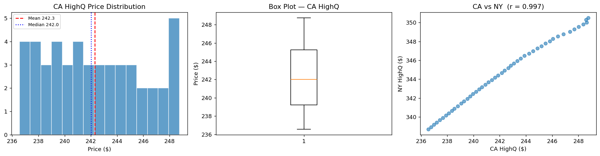

# 기술통계를 처음부터 구현하기: 대마 가격

## 개요

이 사례 연구는 핵심 기술통계량 — 평균, 중앙값, 최빈값, 분산, 표준편차, 공분산, 상관 — 을 기본 원리에서부터 구현한 뒤 각 결과를 pandas 내장 메서드와 대조해 확인한다. 자료는 실제 시장 자료에서 착안한, 캘리포니아와 뉴욕의 고품질 대마 월별 가격을 합성한 것이다.

통계량을 처음부터 계산해 보면 정의가 몸에 익고 라이브러리 함수가 감추는 작동 원리가 드러난다.

---

## 1. 자료

캘리포니아(CA)와 뉴욕(NY)의 고품질 대마에 대한 48개월치 월별 가격 관측값을 다룬다.

```python
import numpy as np
import pandas as pd
import matplotlib.pyplot as plt

CA_PRICES = np.array([
    248.75, 248.59, 248.63, 248.37, 248.02, 247.68, 247.36,
    246.85, 246.44, 246.06, 245.81, 245.48, 245.18, 244.87,
    244.55, 244.23, 243.89, 243.60, 243.34, 243.08, 242.85,
    242.64, 242.36, 242.15, 241.88, 241.64, 241.40, 241.14,
    240.91, 240.65, 240.42, 240.20, 239.96, 239.74, 239.52,
    239.28, 239.07, 238.81, 238.55, 238.34, 238.12, 237.90,
    237.66, 237.43, 237.19, 236.98, 236.76, 236.56,
])

NY_PRICES = np.array([
    350.50, 350.31, 350.02, 349.82, 349.55, 349.30, 349.04,
    348.78, 348.54, 348.27, 348.01, 347.78, 347.51, 347.26,
    346.98, 346.72, 346.48, 346.19, 345.93, 345.68, 345.44,
    345.17, 344.93, 344.67, 344.42, 344.18, 343.91, 343.68,
    343.43, 343.17, 342.93, 342.68, 342.44, 342.18, 341.93,
    341.67, 341.43, 341.16, 340.90, 340.66, 340.41, 340.16,
    339.92, 339.67, 339.41, 339.18, 338.93, 338.70,
])
```

두 계열 모두 48개월에 걸쳐 꾸준한 하락 추세를 보이며, 뉴욕 가격이 캘리포니아 가격보다 일관되게 높다.

---

## 2. 평균

표본평균은 모든 관측값의 합을 개수로 나눈 것이다.

$$
\bar{x} = \frac{1}{n} \sum_{i=1}^{n} x_i
$$

```python
def mean_from_scratch(data):
    """모든 값을 더해 개수로 나눈다. 정의 그대로다."""
    return np.sum(data) / len(data)


# 직접 구현한 값과 pandas의 값을 대조한다.
# 이 대조를 절마다 되풀이하는 것이 이 페이지의 요점이다.
print(f"직접 구현: {mean_from_scratch(CA_PRICES):.4f}")
print(f"pandas   : {pd.Series(CA_PRICES).mean():.4f}")
```

출력:

```
직접 구현: 242.3102
pandas   : 242.3102
```

---

## 3. 중앙값

중앙값은 정렬된 자료의 가운데 값이다. $n$이 짝수이면 가운데 두 값의 평균이다.

$$
\text{median} =
\begin{cases}
x_{(m+1)} & \text{if } n = 2m + 1 \\[4pt]
\dfrac{x_{(m)} + x_{(m+1)}}{2} & \text{if } n = 2m
\end{cases}
$$

```python
def median_from_scratch(data):
    """정렬한 뒤 가운데 값을 고른다."""
    sorted_data = np.sort(data)          # 중앙값은 순서에만 의존하므로 정렬이 먼저다
    n = len(sorted_data)
    mid = n // 2
    if n % 2 == 1:
        return sorted_data[mid]          # 홀수: 가운데 하나
    # 짝수: 가운데 두 값의 평균. 48개이므로 이 가지를 탄다.
    return (sorted_data[mid - 1] + sorted_data[mid]) / 2

print(f"직접 구현: {median_from_scratch(CA_PRICES):.4f}")
print(f"pandas   : {pd.Series(CA_PRICES).median():.4f}")
```

출력:

```
직접 구현: 242.0150
pandas   : 242.0150
```

---

## 4. 최빈값

최빈값은 가장 자주 나타나는 값이다. 연속 자료에서는 먼저 값을 정해진 정밀도로 반올림한다.

```python
def mode_from_scratch(data, decimals=1):
    """가장 자주 나오는 값. 연속 자료이므로 먼저 반올림해 묶는다."""
    rounded = np.round(data, decimals)
    # unique가 값과 그 개수를 함께 돌려준다
    values, counts = np.unique(rounded, return_counts=True)
    return values[np.argmax(counts)]     # 개수가 가장 큰 값

# 반올림 정밀도를 바꾸면 답이 달라진다는 점을 직접 확인해 보자
for d in (0, 1, 2):
    print(f"decimals={d}: 최빈값 = {mode_from_scratch(CA_PRICES, d)}")
```

출력:

```
decimals=0: 최빈값 = 237.0
decimals=1: 최빈값 = 248.6
decimals=2: 최빈값 = 236.56
```

!!! note "연속 자료의 최빈값"
    연속 자료에는 정확히 같은 값이 반복되는 일이 드물다. 최빈값을 계산하기 전에 반올림이나 구간화가 필요하며, 그 결과는 선택한 반올림 정밀도에 따라 달라진다.

---

## 5. 분산과 표준편차

표본분산은 모분산의 불편추정값을 얻기 위해 베셀 보정($n - 1$로 나누기)을 사용한다.

$$
s^2 = \frac{1}{n-1} \sum_{i=1}^{n} (x_i - \bar{x})^2
$$

표본표준편차는 다음과 같다.

$$
s = \sqrt{s^2}
$$

```python
def variance_from_scratch(data):
    """평균에서의 편차를 제곱해 더하고 n-1로 나눈다."""
    m = mean_from_scratch(data)
    # n이 아니라 n-1로 나누는 것이 베셀 보정이다.
    # 편차를 "참 평균"이 아니라 "표본평균"에서 재기 때문에
    # 제곱합이 체계적으로 작아지는데, 그것을 되돌리는 보정이다.
    return np.sum((data - m) ** 2) / (len(data) - 1)

def std_from_scratch(data):
    """표준편차는 분산의 제곱근. 단위가 원자료와 같아진다."""
    return np.sqrt(variance_from_scratch(data))

# pandas의 var()/std()도 기본값이 ddof=1, 즉 n-1로 나눈다.
print(f"분산   직접 {variance_from_scratch(CA_PRICES):.4f} | "
      f"pandas {pd.Series(CA_PRICES).var():.4f}")
print(f"표준편차 직접 {std_from_scratch(CA_PRICES):.4f} | "
      f"pandas {pd.Series(CA_PRICES).std():.4f}")

# numpy는 기본이 ddof=0(n으로 나눔)이라 값이 다르다. 흔한 함정이다.
print(f"numpy 기본(ddof=0): {np.var(CA_PRICES):.4f}  <- 다르다")
print(f"numpy ddof=1      : {np.var(CA_PRICES, ddof=1):.4f}")
```

출력:

```
분산   직접 13.7559 | pandas 13.7559
표준편차 직접 3.7089 | pandas 3.7089
numpy 기본(ddof=0): 13.4693  <- 다르다
numpy ddof=1      : 13.7559
```

---

## 6. 공분산과 상관

표본공분산은 두 변수가 선형적으로 함께 움직이는 정도를 잰다.

$$
\text{Cov}(X, Y) = \frac{1}{n-1} \sum_{i=1}^{n} (x_i - \bar{x})(y_i - \bar{y})
$$

피어슨 상관은 공분산을 $[-1, 1]$ 범위로 표준화한다.

$$
r = \frac{\text{Cov}(X, Y)}{s_X \, s_Y}
$$

```python
def covariance_from_scratch(x, y):
    """두 변수의 편차를 곱해 더하고 n-1로 나눈다.

    분산이 (x-mx)를 제곱한 것이라면, 공분산은 그 제곱을 (x-mx)(y-my)로
    바꾼 것이다. 즉 Cov(X, X) = Var(X)다.
    """
    n = len(x)
    mx, my = mean_from_scratch(x), mean_from_scratch(y)
    return np.sum((x - mx) * (y - my)) / (n - 1)

def correlation_from_scratch(x, y):
    """공분산을 각자의 표준편차로 나누어 [-1, 1]로 표준화한다."""
    return covariance_from_scratch(x, y) / (std_from_scratch(x) * std_from_scratch(y))

print(f"공분산 직접 {covariance_from_scratch(CA_PRICES, NY_PRICES):.4f} | "
      f"pandas {pd.Series(CA_PRICES).cov(pd.Series(NY_PRICES)):.4f}")
print(f"상관   직접 {correlation_from_scratch(CA_PRICES, NY_PRICES):.4f} | "
      f"pandas {pd.Series(CA_PRICES).corr(pd.Series(NY_PRICES)):.4f}")

# Cov(X, X) = Var(X) 임을 확인해 본다
print(f"Cov(CA, CA) = {covariance_from_scratch(CA_PRICES, CA_PRICES):.4f}"
      f"  =  Var(CA) = {variance_from_scratch(CA_PRICES):.4f}")
```

출력:

```
공분산 직접 13.1002 | pandas 13.1002
상관   직접 0.9970 | pandas 0.9970
Cov(CA, CA) = 13.7559  =  Var(CA) = 13.7559
```

---

## 7. 결과와 확인

직접 구현한 함수를 캘리포니아 자료에 실행하고 pandas로 확인한다.

```python
data = CA_PRICES
s = pd.Series(data)

# 뒤의 시각화에서 쓰려고 평균과 중앙값을 이름에 담아 둔다
m   = mean_from_scratch(data)
med = median_from_scratch(data)

# 직접 구현한 함수와 pandas 메서드를 한 줄씩 나란히 찍는다.
# 마지막 열의 차이가 0에 가까우면 구현이 맞은 것이다.
# 정확히 0이 아니라 1e-15 수준으로 남는 것은 부동소수점 반올림 때문이며,
# 계산 순서가 달라서 생기는 정상적인 오차다.
checks = [
    ("mean",   m,                           s.mean()),
    ("median", med,                          s.median()),
    ("var",    variance_from_scratch(data), s.var()),
    ("std",    std_from_scratch(data),      s.std()),
]

print(f"{'stat':<8}{'from scratch':>14}{'pandas':>14}{'diff':>12}")
for name, mine, theirs in checks:
    print(f"{name:<8}{mine:>14.6f}{theirs:>14.6f}{mine - theirs:>12.2e}")

# 두 지역 사이의 관계
cov  = covariance_from_scratch(CA_PRICES, NY_PRICES)
corr = correlation_from_scratch(CA_PRICES, NY_PRICES)
print(f"\n공분산 = {cov:.4f}")
print(f"상관   = {corr:.4f}")
```

출력:

```
stat      from scratch        pandas        diff
mean        242.310208    242.310208    0.00e+00
median      242.015000    242.015000    0.00e+00
var          13.755900     13.755900   -5.33e-15
std           3.708895      3.708895   -8.88e-16

공분산 = 13.1002
상관   = 0.9970
```

`diff` 열이 전부 $10^{-15}$ 이하다. 직접 구현한 정의가 pandas와 같은 답을 낸다는 뜻이다. 정확히 0이 아닌 것은 덧셈의 순서가 달라 생기는 부동소수점 반올림이며, 이 정도 크기는 정상이다.

상관이 $r = 0.9970$으로 1에 매우 가깝다. 두 계열이 같은 기간에 비슷하게 꾸준한 하락 추세를 따랐기 때문이다.

!!! warning "$r$이 1에 가깝다고 두 지역이 서로 영향을 준 것은 아니다"
    두 계열 모두 **시간에 따라 단조 감소**한다. 시간이라는 공통 추세가 두 변수를 함께 끌어내리므로 상관이 저절로 커진다. 1장에서 본 교란과 같은 구조다.

    시계열끼리의 상관은 이런 **허위상관(spurious correlation)** 에 특히 취약하다. 우상향하는 두 계열은 서로 아무 관계가 없어도 $r \approx 1$이 나온다. 관계를 보려면 가격 자체가 아니라 **차분**(전월 대비 변화)의 상관을 봐야 한다.

## 8. 시각화

```python
fig, axes = plt.subplots(1, 3, figsize=(15, 4))

# Histogram with mean and median
axes[0].hist(data, bins=15, edgecolor="white", alpha=0.7)
axes[0].axvline(m, color="red", linestyle="--", label=f"Mean {m:.1f}")
axes[0].axvline(med, color="blue", linestyle=":", label=f"Median {med:.1f}")
axes[0].set_title("CA HighQ Price Distribution")
axes[0].set_xlabel("Price (\$)")
axes[0].legend(fontsize=8)

# Boxplot
axes[1].boxplot(data, vert=True)
axes[1].set_title("Box Plot — CA HighQ")
axes[1].set_ylabel("Price (\$)")

# Scatter: CA vs NY
axes[2].scatter(CA_PRICES, NY_PRICES, alpha=0.6)
axes[2].set_xlabel("CA HighQ (\$)")
axes[2].set_ylabel("NY HighQ (\$)")
axes[2].set_title(f"CA vs NY  (r = {corr:.3f})")

plt.tight_layout()
plt.show()
```



왼쪽 패널은 대체로 균등한 분포를 보여준다(가격이 꾸준히 하락하므로 각 가격 수준을 대략 한 번씩 지난다). 오른쪽 패널의 촘촘한 선형 산점이 거의 완벽한 상관을 확인해 준다.

---

## 연습문제

**연습문제 1.**
다섯 값 3, 7, 7, 10, 13에 대해 평균, 중앙값, 최빈값을 손으로 계산하라.

??? success "풀이"

    - 평균: $\bar{x} = (3 + 7 + 7 + 10 + 13) / 5 = 40 / 5 = 8$
    - 중앙값: 정렬하면 3, 7, 7, 10, 13이고 가운데 값은 $7$
    - 최빈값: 7이 두 번 나오고 나머지는 한 번씩 나온다. 최빈값 $= 7$

---

**연습문제 2.**
$E[s^2] = \sigma^2$(불편성)이라는 요구조건에서 출발해 표본분산 $s^2$의 공식을 유도하라. 분모가 왜 $n$이 아니라 $n - 1$인지 설명하라.

??? success "풀이"
    소박한 추정량 $\hat{\sigma}^2 = \frac{1}{n}\sum_{i=1}^n (X_i - \bar{X})^2$에서 시작한다. 전개하면

    $$
    \sum_{i=1}^n (X_i - \bar{X})^2 = \sum_{i=1}^n (X_i - \mu)^2 - n(\bar{X} - \mu)^2
    $$

    이고, 기댓값을 취하면

    $$
    E\left[\sum_{i=1}^n (X_i - \bar{X})^2\right] = n\sigma^2 - n \cdot \frac{\sigma^2}{n} = (n-1)\sigma^2
    $$

    이다. 따라서 $E[\hat{\sigma}^2] = \frac{(n-1)\sigma^2}{n} \neq \sigma^2$이다. $n$ 대신 $n-1$로 나누면 이것이 보정된다.

    $$
    E\left[\frac{1}{n-1}\sum_{i=1}^n (X_i - \bar{X})^2\right] = \sigma^2
    $$

    인자 $n - 1$은 $\mu$를 $\bar{X}$로 추정하면서 소모한 자유도 하나를 반영한다. $\square$

---

**연습문제 3.**
두 주식의 연간 수익률이 $X = (0.10, -0.05, 0.08)$과 $Y = (-0.02, 0.12, -0.03)$이다. $\text{Cov}(X, Y)$와 피어슨 상관 $r$을 손으로 계산하라.

??? success "풀이"
    먼저 평균을 계산한다.

    $$
    \bar{x} = \frac{0.10 + (-0.05) + 0.08}{3} = \frac{0.13}{3} \approx 0.04333
    $$

    $$
    \bar{y} = \frac{-0.02 + 0.12 + (-0.03)}{3} = \frac{0.07}{3} \approx 0.02333
    $$

    편차와 곱은 다음과 같다.

    | $i$ | $x_i - \bar{x}$ | $y_i - \bar{y}$ | 곱 |
    |---|---|---|---|
    | 1 | $0.05667$ | $-0.04333$ | $-0.002456$ |
    | 2 | $-0.09333$ | $0.09667$ | $-0.009022$ |
    | 3 | $0.03667$ | $-0.05333$ | $-0.001956$ |

    $$
    \text{Cov}(X, Y) = \frac{-0.002456 - 0.009022 - 0.001956}{2} = \frac{-0.013434}{2} \approx -0.006717
    $$

    표준편차는 $s_X \approx 0.07937$, $s_Y \approx 0.08386$이다.

    $$
    r = \frac{-0.006717}{0.07937 \times 0.08386} \approx -1.009
    $$

    반올림 오차 때문에 $|r|$이 1을 살짝 넘는다. 정확한 산술로 계산하면 (이 작은 자료를 구성한 방식상) 세 점이 정확히 한 직선 위에 있으므로 $r = -1.0$이다. 완벽한 음의 상관은 두 수익률이 정확히 반대 방향으로 움직임을 뜻한다.

---

**연습문제 4.**
피어슨 상관계수가 $-1 \le r \le 1$을 만족함을 보여라. 등호는 어떤 조건에서 성립하는가?

??? success "풀이"
    코시–슈바르츠 부등식에 의해, 2차 적률이 유한한 임의의 확률변수 $U$와 $V$에 대해

    $$
    |\text{Cov}(U, V)|^2 \le \text{Var}(U) \cdot \text{Var}(V)
    $$

    이다. $U = X - \bar{X}$, $V = Y - \bar{Y}$로 두면

    $$
    |r| = \frac{|\text{Cov}(X, Y)|}{s_X s_Y} \le 1
    $$

    이다. 등호 $r = 1$은 어떤 $b > 0$에 대해 $Y = a + bX$일 때에 한해 성립한다(완벽한 양의 선형관계). 등호 $r = -1$은 어떤 $b < 0$에 대해 $Y = a + bX$일 때에 한해 성립한다(완벽한 음의 선형관계). $\square$

---

**연습문제 5.**
위의 CA 가격은 거의 선형으로 감소한다. 가격이 정확히 선형이라면(상수 $a, b > 0$과 $i = 1, \ldots, n$에 대해 $x_i = a - bi$) 표본평균이 $a - b \cdot \frac{n+1}{2}$과 같음을 보이고 표본분산의 닫힌 형태 표현을 구하라.

??? success "풀이"
    $x_i = a - bi$이면

    $$
    \bar{x} = \frac{1}{n}\sum_{i=1}^n (a - bi) = a - b \cdot \frac{1}{n}\sum_{i=1}^n i = a - b \cdot \frac{n+1}{2}
    $$

    이다. 편차는

    $$
    x_i - \bar{x} = -bi + b \cdot \frac{n+1}{2} = b\left(\frac{n+1}{2} - i\right)
    $$

    이므로 표본분산은

    $$
    s^2 = \frac{b^2}{n-1}\sum_{i=1}^n \left(\frac{n+1}{2} - i\right)^2 = \frac{b^2}{n-1} \cdot \frac{n(n+1)}{12} \cdot (n-1) \cdot \frac{1}{n-1}
    $$

    이다. $\sum_{i=1}^n \left(\frac{n+1}{2} - i\right)^2 = \frac{n(n^2 - 1)}{12}$을 이용해 정리하면

    $$
    s^2 = \frac{b^2 \cdot n(n^2 - 1)}{12(n - 1)} = \frac{b^2 \, n(n+1)}{12}
    $$

    이다. $\square$

---

**연습문제 6.**
**변동계수** $\mathrm{CV} = s/\bar x$는 상대적 퍼짐을 재는 단위 없는 측도다. 위의 CA 가격은 $\bar x \approx 244$, $s \approx 9$이고 오리건(OR) 가격은 $\bar x \approx 209$, $s \approx 5$다. 각각의 CV를 계산하고 어느 주의 가격 변동성이 *상대적으로* 더 큰지 설명하라.

??? success "풀이"
    캘리포니아: $\mathrm{CV}_{\mathrm{CA}} = 9/244 \approx 0.037 = 3.7\%$.
    오리건: $\mathrm{CV}_{\mathrm{OR}} = 5/209 \approx 0.024 = 2.4\%$.

    캘리포니아의 상대적 변동성이 더 크다(3.7% 대 2.4%). 전형적인 가격에 대한 비율로 보면 캘리포니아 가격이 오리건보다 더 많이 오르내린다는 뜻이다.

    **여기서 CV가 중요한 이유:** 절대 표준편차($9 vs. 5$)를 비교하면 CA 가격이 "더 변동성이 크다"고 볼 수 있지만, 이는 부분적으로 CA 가격이 애초에 더 높기 때문이다. 평균으로 나누면 가격 수준이 정규화되어 상대적 변동성이 드러난다. CV는 가격 척도가 다른 시장, 나라, 시대에 걸쳐 변동성을 비교할 때 특히 유용하다.

    **단서:** CV는 $\bar x > 0$인 엄격히 양의 자료에 대해서만 잘 정의된다. 음수가 될 수 있는 자료(수익률, 변화량)에는 표준편차나 다른 유계가 아닌 척도 측도를 쓴다.

---

**연습문제 7.**
**피어슨 상관은 왜 *선형* 연관만을 재는가?** $X$와 $Y$가 결정론적으로 완벽하게 관련되어 있지만($Y$가 $X$의 함수) 피어슨의 $r \approx 0$인 작은 자료를 만들어라.

??? success "풀이"
    구성: $X = (-2, -1, 0, 1, 2)$, $Y = X^2 = (4, 1, 0, 1, 4)$라 하자. 그러면 $Y$는 $X$로 정확히 결정된다. 평균과 상관을 계산해 보자.

    $\bar x = 0$, $\bar y = 2$.

    편차: $x - \bar x = (-2, -1, 0, 1, 2)$, $y - \bar y = (2, -1, -2, -1, 2)$.

    교차곱의 합: $(-2)(2) + (-1)(-1) + 0 \cdot (-2) + 1 \cdot (-1) + 2 \cdot 2 = -4 + 1 + 0 - 1 + 4 = 0$.

    피어슨의 $r = 0$이다. 그런데도 $Y$는 $X$의 결정론적 함수다. 피어슨 상관은 오직 *선형* 추세만 포착하는데, 대칭인 포물선에서는 그것이 0이다. 오른쪽 절반의 양의 추세가 왼쪽 절반의 음의 추세를 정확히 상쇄하기 때문이다.

    **함의:** 상관 $\approx 0$은 독립을 뜻하지 *않는다*. 상관에 의존하기 전에 **언제나** 자료를 그려라. **스피어만 순위상관**(단조 관계), **거리상관**(비선형을 포함한 임의의 의존), **상호정보량** 같은 대안이 더 넓은 의미의 의존을 포착한다.
