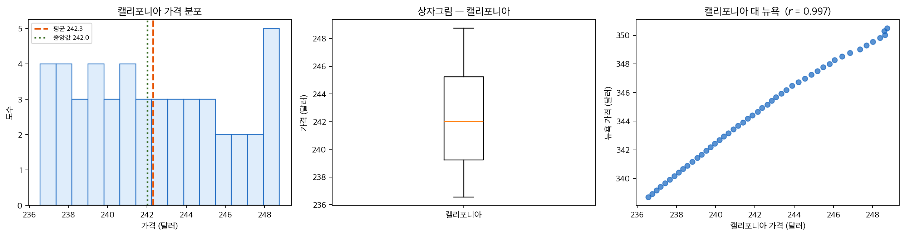

# 기술통계를 처음부터 구현하기: 대마 가격

## 개요

이 사례 연구는 핵심 기술통계량 — 평균, 중앙값, 최빈값, 분산, 표준편차, 공분산, 상관 — 을 기본 원리에서부터 구현한 뒤 각 결과를 pandas 내장 메서드와 대조해 확인한다. 자료는 실제 시장 자료에서 착안한, 캘리포니아와 뉴욕의 고품질 대마 월별 가격을 합성한 것이다.

통계량을 처음부터 계산해 보면 정의가 몸에 익고 라이브러리 함수가 감추는 작동 원리가 드러난다.

---

## 1. 자료

캘리포니아(CA)와 뉴욕(NY)의 고품질 대마에 대한 48개월치 월별 가격 관측값을 다룬다.

<div class="exbox" markdown>

**보기 1.** <span class="diff easy" title="쉬움"></span> 이 48개 값을 i.i.d. 표본으로 다룰 수 있는가. 아래 풀이에 캘리포니아(CA)와 뉴욕(NY)의 48개월치 월별 가격을 날짜순으로 적어 두었다.

**(1)** 이웃한 두 달의 차 $x_{i+1} - x_i$ 가운데 음수의 개수를 $D$ 라 하자. 자료가 연속분포에서 나온 i.i.d. 표본일 때 $D$ 의 평균과 표준편차를 구하고, $D$ 가 최댓값 $n-1$ 에 닿을 확률을 **정확히** 적으시오. 그 확률은 $2^{-(n-1)}$ 이 아니다. 왜 아닌가.

**(2)** 시간 $t = 1, \ldots, 48$ 에 대한 단순회귀의 결정계수를 구해 (1)의 판정을 뒷받침하시오. 그렇다면 이 쪽에서 앞으로 계산할 평균 $242.31$ 과 표준편차 $3.71$ 은 각각 무엇을 재는 수인가.

</div>

??? success "풀이"

    **(1) 해석적으로.** 연속분포에서 나온 i.i.d. 표본은 같은 값이 겹칠 확률이 $0$ 이고, $n!$ 가지 순서 가운데 어느 하나일 확률이 모두 같다. 그러므로 **내림 횟수**

    $$
    D = \#\{\, i : x_{i+1} < x_i \,\}
    $$

    의 분포는 무작위 순열에서의 분포이고, 거기서는

    $$
    E[D] = \frac{n-1}{2} = 23.5, \qquad
    \operatorname{Var}(D) = \frac{n+1}{12} = \frac{49}{12}, \qquad
    \operatorname{sd}(D) = 2.0207
    $$

    이다($n = 48$). 아래 코드가 작은 $n$ 에서 모든 순열을 직접 세어 이 두 식을 확인해 준다.

    **$2^{-47}$ 이 아닌 까닭.** 차 47 개의 부호를 독립인 동전던지기로 보면 $P(D = 47) = 2^{-47} = 7.1 \times 10^{-15}$ 이 나오는데, **부호들은 독립이 아니다.** $x_2 < x_1$ 과 $x_3 < x_2$ 는 둘 다 $x_2$ 를 쓰므로 서로 얽혀 있다. 올바른 셈은 순열을 세는 것이다. $D = 47$ 은 $x_1 > x_2 > \cdots > x_{48}$ 을 뜻하고 이는 $48!$ 가지 순서 가운데 **딱 하나**이므로

    $$
    P(D = 47) = \frac{1}{48!} = 8.06 \times 10^{-62}
    $$

    이다. 동전던지기가 준 값보다 47 자릿수 더 작다. 오름이 한 번 이하인 경우까지 세면, 오름이 정확히 한 번인 순열의 개수가 $2^n - n - 1$ 이므로($n \le 6$ 에서 모든 순열을 직접 세어 확인했다)

    $$
    P(D \ge 46) = \frac{1 + (2^{48} - 48 - 1)}{48!} = \frac{2^{48} - 48}{48!} = 2.27 \times 10^{-47}
    $$

    이다.

    **(2) 수치적으로.**

    ```python
    import matplotlib
    matplotlib.use("Agg")
    import math
    import numpy as np
    import pandas as pd
    import matplotlib.pyplot as plt
    from scipy import stats

    # 캘리포니아와 뉴욕의 상품 대마 가격을 날짜순으로 적은 것이다.
    # 두 열의 i번째 값이 같은 날에 대응하므로 나중에 상관을 구할 수 있다.
    CA_PRICES = np.array([
        248.75, 248.59, 248.63, 248.37, 248.02, 247.68, 247.36,
        246.85, 246.44, 246.06, 245.81, 245.48, 245.18, 244.87,
        244.55, 244.23, 243.89, 243.60, 243.34, 243.08, 242.85,
        242.64, 242.36, 242.15, 241.88, 241.64, 241.40, 241.14,
        240.91, 240.65, 240.42, 240.20, 239.96, 239.74, 239.52,
        239.28, 239.07, 238.81, 238.55, 238.34, 238.12, 237.90,
        237.66, 237.43, 237.19, 236.98, 236.76, 236.56,
    ])

    NY_PRICES = np.array([
        350.50, 350.31, 350.02, 349.82, 349.55, 349.30, 349.04,
        348.78, 348.54, 348.27, 348.01, 347.78, 347.51, 347.26,
        346.98, 346.72, 346.48, 346.19, 345.93, 345.68, 345.44,
        345.17, 344.93, 344.67, 344.42, 344.18, 343.91, 343.68,
        343.43, 343.17, 342.93, 342.68, 342.44, 342.18, 341.93,
        341.67, 341.43, 341.16, 340.90, 340.66, 340.41, 340.16,
        339.92, 339.67, 339.41, 339.18, 338.93, 338.70,
    ])

    # i.i.d. 표본이면 순서가 무작위이므로 내림 횟수 D 의 평균은 (n-1)/2,
    # 분산은 (n+1)/12 여야 한다. 작은 n 에서는 순열을 모두 세어 확인할 수 있다.
    # 모의실험이 아니라 완전열거이므로 몬테카를로 오차가 없다.
    from itertools import permutations

    print(f"{'n':>3}{'E[D] 열거':>12}{'(n-1)/2':>10}"
          f"{'Var(D) 열거':>14}{'(n+1)/12':>11}{'오름 1회':>10}{'2^n-n-1':>10}")
    for m in (4, 5, 6, 7):
        Ds = np.array([sum(p[i] > p[i + 1] for i in range(m - 1))
                       for p in permutations(range(m))])
        one_asc = int(np.sum(Ds == m - 2))      # 내림 m-2 회 = 오름 1 회
        print(f"{m:>3}{Ds.mean():>12.4f}{(m - 1) / 2:>10.4f}"
              f"{Ds.var():>14.4f}{(m + 1) / 12:>11.4f}{one_asc:>10d}{2 ** m - m - 1:>10d}")

    # 이제 실제 자료의 D 를 재고, 시간에 대한 회귀의 r^2 도 함께 본다.
    n_obs = len(CA_PRICES)
    mu_D, sd_D = (n_obs - 1) / 2, np.sqrt((n_obs + 1) / 12)
    print(f"\nn = 48 이면 E[D] = {mu_D}, sd(D) = {sd_D:.4f}")
    for name, x in (("CA", CA_PRICES), ("NY", NY_PRICES)):
        d = np.diff(x)
        D = int(np.sum(d < 0))
        t = np.arange(1, len(x) + 1)
        r2 = stats.linregress(t, x).rvalue ** 2
        print(f"  {name}: D = {D}/{len(d)},  z = {(D - mu_D) / sd_D:5.2f}"
              f"  | 시간 추세 r^2 = {r2:.5f}")

    d_ca = np.diff(CA_PRICES)
    print(f"CA 에서 값이 오른 곳은 한 군데뿐: 둘째 달 -> 셋째 달 {d_ca[d_ca > 0]}")
    print(f"i.i.d. 라면 완전한 내림차순일 확률 = 1/48! = {1 / math.factorial(48):.2e}")
    print(f"오름이 한 번 이하일 확률 = (2^48 - 48)/48! = "
          f"{(2 ** 48 - 48) / math.factorial(48):.2e}")

    # 수준의 퍼짐과 전월 대비 변화의 퍼짐을 견준다.
    print(f"CA: 수준의 표준편차 {CA_PRICES.std(ddof=1):.4f}, "
          f"전월 대비 변화의 표준편차 {d_ca.std(ddof=1):.4f}")
    ```

    출력:

    ```
      n     E[D] 열거   (n-1)/2     Var(D) 열거   (n+1)/12     오름 1회   2^n-n-1
      4      1.5000    1.5000        0.4167     0.4167        11        11
      5      2.0000    2.0000        0.5000     0.5000        26        26
      6      2.5000    2.5000        0.5833     0.5833        57        57
      7      3.0000    3.0000        0.6667     0.6667       120       120

    n = 48 이면 E[D] = 23.5, sd(D) = 2.0207
      CA: D = 46/47,  z = 11.13  | 시간 추세 r^2 = 0.99314
      NY: D = 47/47,  z = 11.63  | 시간 추세 r^2 = 0.99994
    CA 에서 값이 오른 곳은 한 군데뿐: 둘째 달 -> 셋째 달 [0.04]
    i.i.d. 라면 완전한 내림차순일 확률 = 1/48! = 8.06e-62
    오름이 한 번 이하일 확률 = (2^48 - 48)/48! = 2.27e-47
    CA: 수준의 표준편차 3.7089, 전월 대비 변화의 표준편차 0.0771
    ```

    **완전열거가 (1)의 두 식을 확인해 준다.** $n = 4, 5, 6, 7$ 에서 $E[D]$ 와 $\operatorname{Var}(D)$ 가 $(n-1)/2$ 와 $(n+1)/12$ 에 소수점 넷째 자리까지 맞고, 오름이 정확히 한 번인 순열의 개수도 $2^n - n - 1$ 과 맞는다($11, 26, 57, 120$).

    **그리고 실제 자료는 그 분포에서 터무니없이 멀다.** CA 는 $D = 46$, NY 는 $D = 47$ 로 $z = 11.1$ 과 $z = 11.6$ 이다. CA 에서 값이 오른 곳은 둘째 달에서 셋째 달로 넘어갈 때의 $+0.04$ 달러 한 번뿐이고, NY 는 47 번 모두 내려갔다. 시간에 대한 단순회귀만으로 분산의 $99.3\%$(CA)와 $99.994\%$(NY)가 설명된다.

    **그러므로 이 48개 값은 i.i.d. 표본이 아니라 시계열이다.** 이 판정이 뒤의 모든 절을 읽는 방식을 바꾼다.

    - 평균 $242.31$ 은 "캘리포니아 대마 가격의 모평균 추정값"이 아니라 **이 48개월 동안 가격이 지나온 구간의 중간쯤**이다. 48개월을 하나 더 이어 붙이면 그만큼 내려간다.
    - 표준편차 $3.71$ 은 "가격의 변동성"이 아니라 **추세가 쓸고 간 폭**이다. 달마다 가격이 얼마나 흔들리는지를 재면 전월 대비 변화의 표준편차 $0.0771$ 달러로 **48배 작다.** 어느 쪽을 "변동성"이라 부를지는 질문이 정한다.
    - 표준오차 $s/\sqrt{n}$ 을 만들어 모평균의 신뢰구간을 세우는 일은 여기서 뜻이 없다. 그 공식은 독립성을 쓰기 때문이다. 연습문제 7 이 이 함정을 자세히 다룬다.

    아래 2절부터 7절까지는 **정의를 코드로 옮기는 연습**이므로 이 점을 접어 두고 계산 자체에 집중한다. 다만 나온 수를 모수의 추정값으로 읽지는 말아야 한다.

두 계열 모두 48개월에 걸쳐 꾸준한 하락 추세를 보이며, 뉴욕 가격이 캘리포니아 가격보다 일관되게 높다.

---

## 2. 평균

표본평균은 모든 관측값의 합을 개수로 나눈 것이다.

$$
\bar{x} = \frac{1}{n} \sum_{i=1}^{n} x_i
$$

<div class="exbox" markdown>

**보기 2.** <span class="diff easy" title="쉬움"></span> 평균을 정의가 아니라 **성질**로 특징짓기. 상수 $c$ 하나로 48개월 가격 전체를 대신한다고 하고, 제곱오차의 합 $Q(c) = \sum_{i=1}^{n}(x_i - c)^2$ 를 벌점으로 쓴다.

**(1)** $Q$ 를 최소로 만드는 $c$ 가 $\bar x$ 임을 보이고, 그것이 최소임을 확인하시오. 또 임의의 $c$ 에 대해 $Q(c)$ 를 $\bar x$ 에서의 값과 $(c - \bar x)$ 로 분해하시오.

**(2)** 평균을 정의대로 직접 구현해 pandas 와 대조하고, (1)의 세 결론 — 최소점, 최솟값, 분해식 — 을 수치로 확인하시오.

</div>

??? success "풀이"

    **(1) 해석적으로.** $Q(c) = \sum_{i=1}^{n}(x_i - c)^2$ 를 $c$ 로 미분하면

    $$
    Q'(c) = -2\sum_{i=1}^{n}(x_i - c) = -2\left(\sum_{i=1}^{n} x_i - nc\right) = -2n(\bar x - c)
    $$

    이고, $Q'(c) = 0$ 은 $c = \bar x$ 하나만 준다. 이계도함수가

    $$
    Q''(c) = 2n > 0
    $$

    으로 $c$ 와 무관하게 양수이므로 $Q$ 는 아래로 볼록한 포물선이고 그 정류점이 유일한 최소점이다. 끝점을 따질 필요도 없다. $c \to \pm\infty$ 에서 $Q(c) \to \infty$ 다.

    **분해식.** $x_i - c = (x_i - \bar x) + (\bar x - c)$ 로 쪼개 제곱해 더하면 교차항이 $\sum_i (x_i - \bar x) = 0$ 때문에 사라진다.

    $$
    Q(c) = \sum_{i=1}^{n}(x_i - \bar x)^2 + 2(\bar x - c)\underbrace{\sum_{i=1}^{n}(x_i - \bar x)}_{=\,0} + n(\bar x - c)^2
    = (n-1)s^2 + n(c - \bar x)^2
    $$

    여기서 둘째 항이 $c \ne \bar x$ 일 때만 양수이므로 **$\bar x$ 가 최소점이라는 것이 다시 보이고**, 동시에 최솟값이 $Q(\bar x) = (n-1)s^2$ 라는 것도 읽힌다. 뒤의 5절에서 쓸 $s^2$ 가 여기서 이미 나오는 셈이다. $n = 48$, $s^2 = 13.7559$ 이므로 최솟값은 $47 \times 13.7559 = 646.5273$ 이어야 한다.

    **(2) 수치적으로.**

    ```python
    def mean_from_scratch(data):
        """모든 값을 더해 개수로 나눈다. 정의 그대로다."""
        return np.sum(data) / len(data)


    # 직접 구현한 값과 pandas의 값을 대조한다.
    # 이 대조를 절마다 되풀이하는 것이 이 페이지의 요점이다.
    print(f"직접 구현: {mean_from_scratch(CA_PRICES):.4f}")
    print(f"pandas   : {pd.Series(CA_PRICES).mean():.4f}")

    # (1) 을 확인한다. 먼저 Q 를 격자에서 최소화해 평균이 나오는지 본다.
    n = len(CA_PRICES)
    xbar = mean_from_scratch(CA_PRICES)
    Q = lambda c: np.sum((CA_PRICES - c) ** 2)

    grid = np.linspace(xbar - 2, xbar + 2, 40001)          # 간격 1e-4
    Qs = ((CA_PRICES[None, :] - grid[:, None]) ** 2).sum(axis=1)
    print(f"\n격자 최소점 = {grid[np.argmin(Qs)]:.6f},  평균 = {xbar:.6f}")

    # 최솟값이 (n-1)s^2 인가.
    print(f"Q(평균) = {Q(xbar):.4f},  (n-1)s^2 = {(n - 1) * np.var(CA_PRICES, ddof=1):.4f}")

    # 분해식 Q(c) = (n-1)s^2 + n(c - xbar)^2 를 평균이 아닌 점에서 확인한다.
    rhs = (n - 1) * np.var(CA_PRICES, ddof=1) + n * (242.0 - xbar) ** 2
    print(f"Q(242)  = {Q(242.0):.4f},  분해식 = {rhs:.4f}"
          f"  (벌점 증가분 {n * (242.0 - xbar) ** 2:.4f})")
    ```

    출력:

    ```
    직접 구현: 242.3102
    pandas   : 242.3102

    격자 최소점 = 242.310208,  평균 = 242.310208
    Q(평균) = 646.5273,  (n-1)s^2 = 646.5273
    Q(242)  = 651.1463,  분해식 = 651.1463  (벌점 증가분 4.6190)
    ```

    **세 결론이 모두 맞는다.** 간격 $10^{-4}$ 격자가 고른 최소점이 소수점 여섯 자리까지 $\bar x = 242.310208$ 과 같고, 최솟값 $646.5273$ 이 $(n-1)s^2 = 47 \times 13.7559$ 와 같고, $c = 242$ 에서 분해식이 $Q(242) = 651.1463$ 을 그대로 재현한다. 벌점 증가분 $n(c - \bar x)^2 = 48 \times 0.3102^2 = 4.6190$ 이 그 차이다.

    얻은 것은 **평균이 "다 더해서 개수로 나눈 것"이라는 절차적 정의 밖에 있는 성격**이다. 평균은 제곱오차로 재는 최적의 대푯값이고, 그래서 제곱오차를 쓰는 곳마다(최소제곱회귀, 분산분석) 평균이 저절로 등장한다. 다음 절의 중앙값은 벌점을 제곱에서 절대값으로 바꾸면 나오는 답이다.

---

## 3. 중앙값

중앙값은 정렬된 자료의 가운데 값이다. $n$이 짝수이면 가운데 두 값의 평균이다.

$$
\text{median} =
\begin{cases}
x_{(m+1)} & \text{if } n = 2m + 1 \\[4pt]
\dfrac{x_{(m)} + x_{(m+1)}}{2} & \text{if } n = 2m
\end{cases}
$$

<div class="exbox" markdown>

**보기 3.** <span class="diff easy" title="쉬움"></span> 벌점을 제곱에서 절대값으로 바꾸면. 보기 2 와 똑같이 상수 $c$ 로 48개월 가격을 대신하는데, 이번에는 $S(c) = \sum_{i=1}^{n}\lvert x_i - c\rvert$ 를 벌점으로 쓴다.

**(1)** $S$ 를 최소로 만드는 $c$ 를 구하시오. $n$ 이 짝수인 이 자료에서 답은 유일한가. 최솟값을 순서통계량으로 적으시오.

**(2)** 중앙값을 직접 구현해 pandas 와 대조하고, 코드가 돌려준 $242.0150$ 이 (1)의 최소점들 가운데 **어느 것인지** 확인하시오.

</div>

??? success "풀이"

    **(1) 해석적으로.** $S$ 는 볼록함수들 $\lvert x_i - c\rvert$ 의 합이므로 볼록하고, $c$ 가 어느 $x_i$ 와도 같지 않은 구간에서는 미분이 된다. $c$ 를 조금 늘리면 $c$ 보다 작은 점까지의 거리는 하나씩 늘고 큰 점까지의 거리는 하나씩 줄므로

    $$
    S'(c) = \#\{i : x_i < c\} - \#\{i : x_i > c\}
    $$

    이다. 이것이 $0$ 이 되는 것은 양쪽 개수가 같을 때, 곧 $n = 48$ 에서 아래위로 각각 $24$ 개씩 놓일 때다. 그런 $c$ 는 한 점이 아니라 **구간**이다. 순서통계량으로 적으면

    $$
    \arg\min_c S(c) = \left[\, x_{(24)},\; x_{(25)} \,\right] = [241.88,\; 242.15]
    $$

    이고 볼록함수의 최소점 집합이므로 이 구간 전체에서 $S$ 가 **평평하다.** 구간 밖에서는 기울기가 $\pm 2$ 이상이라 올라간다. 답은 **유일하지 않다**, 폭 $0.27$ 달러의 구간이다.

    최솟값은 구간 안의 아무 $c$ 로 계산하면 되고, 위쪽 24 개가 모두 $c$ 이상, 아래쪽 24 개가 모두 $c$ 이하이므로 $c$ 가 상쇄되어

    $$
    \min_c S(c) = \sum_{i=25}^{48} x_{(i)} - \sum_{i=1}^{24} x_{(i)}
    $$

    이다. 자료를 넣으면 $150.67$ 이다.

    **$n$ 이 홀수면 사정이 다르다.** 그때는 $S'$ 의 부호가 $x_{((n+1)/2)}$ 에서 음에서 양으로 한 번에 바뀌므로 최소점이 그 한 점뿐이다. 중앙값의 비유일성은 짝수 표본에서만 생기는 일이다.

    **(2) 수치적으로.**

    ```python
    def median_from_scratch(data):
        """정렬한 뒤 가운데 값을 고른다."""
        sorted_data = np.sort(data)          # 중앙값은 순서에만 의존하므로 정렬이 먼저다
        n = len(sorted_data)
        mid = n // 2
        if n % 2 == 1:
            return sorted_data[mid]          # 홀수: 가운데 하나
        # 짝수: 가운데 두 값의 평균. 48개이므로 이 가지를 탄다.
        return (sorted_data[mid - 1] + sorted_data[mid]) / 2

    print(f"직접 구현: {median_from_scratch(CA_PRICES):.4f}")
    print(f"pandas   : {pd.Series(CA_PRICES).median():.4f}")

    # (1) 의 주장: S 는 한 점이 아니라 구간 [x_(24), x_(25)] 전체에서 최소다.
    srt = np.sort(CA_PRICES)
    lo, hi = srt[23], srt[24]            # 0-기반 색인이므로 24번째와 25번째 순서통계량
    S = lambda c: np.sum(np.abs(CA_PRICES - c))

    print(f"\n평평한 구간 = [{lo}, {hi}],  폭 {hi - lo:.2f}")
    for c in (lo, 242.0, median_from_scratch(CA_PRICES), 242.1, hi):
        print(f"  S({c:8.4f}) = {S(c):.6f}")
    print("구간 밖:")
    for c in (lo - 0.01, hi + 0.01):
        print(f"  S({c:8.4f}) = {S(c):.6f}")

    # 닫힌 꼴 최솟값: 위쪽 24개 합 - 아래쪽 24개 합
    print(f"\n위 24개 합 - 아래 24개 합 = {srt[24:].sum() - srt[:24].sum():.6f}")
    ```

    출력:

    ```
    직접 구현: 242.0150
    pandas   : 242.0150

    평평한 구간 = [241.88, 242.15],  폭 0.27
      S(241.8800) = 150.670000
      S(242.0000) = 150.670000
      S(242.0150) = 150.670000
      S(242.1000) = 150.670000
      S(242.1500) = 150.670000
    구간 밖:
      S(241.8700) = 150.690000
      S(242.1600) = 150.690000

    위 24개 합 - 아래 24개 합 = 150.670000
    ```

    **구간 전체에서 벌점이 정확히 $150.670000$ 이다.** 끝점 두 개와 안쪽 세 점이 소수점 여섯 자리까지 같고, 닫힌 꼴 $\sum_{i>24} x_{(i)} - \sum_{i\le 24} x_{(i)}$ 도 같은 값을 준다. 구간을 $0.01$ 만 벗어나면 $150.690000$ 으로 올라가는데, 이는 기울기 $\pm 2$ 에 $0.01$ 을 곱한 $0.02$ 와 정확히 맞는다.

    **그러므로 $242.0150$ 은 자료가 정한 값이 아니라 관례가 고른 값이다.** 폭 $0.27$ 달러인 구간에서 하필 중점을 고른 것이고, 직접 구현한 함수도 numpy 도 pandas 도 모두 같은 관례를 쓴다. $x_{(24)} = 241.88$ 을 답으로 내는 구현도 벌점의 뜻에서는 똑같이 옳다. **중앙값을 보고할 때 짝수 표본이면 그 폭을 함께 생각해야 하는 이유다.** 여기서는 $0.27$ 달러라 작지만, 자료가 적거나 가운데가 띄엄띄엄하면 폭이 커진다.

    평균과 비교하면 $\bar x = 242.3102$, 중앙값 $= 242.0150$ 으로 평균이 $0.2952$ 달러 크다. 벌점을 제곱으로 재면 평균, 절대값으로 재면 중앙값이 나오고, **같은 자료에서 다른 답이 나오는 것은 질문이 달랐기 때문이다.**

---

## 4. 최빈값

최빈값은 가장 자주 나타나는 값이다. 연속 자료에서는 먼저 값을 정해진 정밀도로 반올림한다.

<div class="exbox" markdown>

**보기 4.** <span class="diff easy" title="쉬움"></span> 세 개의 최빈값. 같은 자료에 같은 함수를 돌리면서 반올림 정밀도만 바꾸면 $237.0$, $248.6$, $236.56$ 이 나온다.

**(1)** 세 값이 각각 어떻게 뽑혔는지 도수를 세어 설명하시오. `np.unique` 와 `np.argmax` 가 동점을 어떻게 처리하는지 밝히시오.

**(2)** 셋 가운데 "가장 자주 나오는 값"이라 부를 만한 것은 몇 개인가. 그리고 그것이 분포의 중심을 가리키는가.

</div>

??? success "풀이"

    **(1) 세는 일만 하면 답이 나온다.** `np.unique(..., return_counts=True)` 는 값을 **오름차순으로** 돌려주고, `np.argmax` 는 최댓값이 여럿이면 **그중 첫째 색인**을 돌려준다. 그러므로 동점이 생기면 이 구현은 **동점자 가운데 가장 작은 값**을 최빈값이라 부른다. 자료가 정한 것이 아니라 함수가 정한 것이다.

    `decimals=0` **— 동점 둘 가운데 작은 쪽.** 가격이 $236.56$ 에서 $248.75$ 까지 내려오니 1달러 폭의 칸이 13 개 생긴다. 한 달 평균 하강폭이

    $$
    \frac{248.75 - 236.56}{47} = 0.2594 \ \text{달러}
    $$

    이므로 1달러 칸을 지나는 데 약 $1/0.2594 = 3.86$ 개월이 걸리고, 칸마다 도수가 $2$ 에서 $5$ 사이에 몰린다. 최대도수 $5$ 를 **$237$ 과 $240$ 이 함께** 갖는데, `argmax` 가 작은 쪽을 집어 $237.0$ 이 된다.

    `decimals=1` **— 유일한 진짜 최빈값.** 소수 첫째 자리로 묶으면 서로 다른 값이 47 개 생기고 도수 $2$ 인 것이 딱 하나다. $248.59$ 와 $248.63$ 이 둘 다 $248.6$ 으로 반올림되기 때문이다. 동점이 없으므로 이것만은 구현의 관례와 무관하다.

    `decimals=2` **— 48 중 동점, 곧 최솟값.** 원자료가 이미 소수 둘째 자리까지 적혀 있고 48 개가 모두 서로 다르므로 도수가 전부 $1$ 이다. **48 중 동점**이고, `argmax` 가 첫째를 집으니 정렬된 첫 값, 곧 **자료의 최솟값** $236.56$ 이 나온다. 최빈값이라는 이름만 붙은 최솟값이다.

    **(2) 하나뿐이고, 그것도 중심을 가리키지 않는다.** $237.0$ 은 동점 가운데 하나를 임의로 고른 것이고 $236.56$ 은 최솟값이다. 뜻이 있는 것은 $248.6$ 하나인데, 이 값은 자료의 최댓값 $248.75$ 에 붙어 있다. 평균 $242.31$, 표준편차 $3.71$ 로 재면 **평균보다 $1.70$ 표준편차 위**다. 중심과 반대쪽 끝이다.

    까닭은 보기 1 에서 이미 나왔다. 이 자료는 가격 구간을 한 번 쓸고 지나가는 단조 계열이라 **어느 값도 다른 값보다 자주 나올 이유가 없다.** 최빈값은 봉우리가 있는 분포에서 뜻을 갖는 측도인데, 여기에는 봉우리가 없다. 그래서 최빈값이 잡는 것은 분포의 모양이 아니라 **반올림 격자와 동점 처리 규칙**이다.

    ```python
    def mode_from_scratch(data, decimals=1):
        """가장 자주 나오는 값. 연속 자료이므로 먼저 반올림해 묶는다."""
        rounded = np.round(data, decimals)
        # unique가 값과 그 개수를 함께 돌려준다
        values, counts = np.unique(rounded, return_counts=True)
        return values[np.argmax(counts)]     # 개수가 가장 큰 값

    # 반올림 정밀도를 바꾸면 답이 달라진다는 점을 직접 확인해 보자
    for d in (0, 1, 2):
        print(f"decimals={d}: 최빈값 = {mode_from_scratch(CA_PRICES, d)}")

    # 왜 그 값이 나왔는지 도수를 직접 세어 본다.
    # np.unique 는 값을 오름차순으로, np.argmax 는 최대가 여럿일 때 첫째를
    # 돌려주므로 동점이면 "가장 작은 값"이 최빈값이 된다.
    print()
    for d in (0, 1, 2):
        values, counts = np.unique(np.round(CA_PRICES, d), return_counts=True)
        top = counts.max()
        tied = values[counts == top]
        shown = ", ".join(f"{v:g}" for v in tied[:3]) + (" ..." if len(tied) > 3 else "")
        print(f"decimals={d}: 서로 다른 값 {len(values):2d}개, 최대도수 {top}, "
              f"그 도수를 갖는 값 {len(tied):2d}개 -> {shown}")

    # decimals=0 의 1달러 칸마다 몇 개가 들어가는지는 하강 속도가 정한다.
    step = (CA_PRICES.max() - CA_PRICES.min()) / (len(CA_PRICES) - 1)
    print(f"\n한 달 평균 하강폭 {step:.4f} 달러 -> 1달러 칸마다 약 {1 / step:.2f}개")
    values, counts = np.unique(np.round(CA_PRICES, 0), return_counts=True)
    print(f"decimals=0 의 칸별 도수: {dict(zip(values.astype(int), counts))}")

    # decimals=1 에서 248.6 으로 묶인 원자료는 무엇이고 그 값은 어디에 있는가.
    print(f"248.6 으로 반올림되는 원자료: {CA_PRICES[np.round(CA_PRICES, 1) == 248.6]}")
    m4, s4 = CA_PRICES.mean(), CA_PRICES.std(ddof=1)
    print(f"자료 범위 [{CA_PRICES.min()}, {CA_PRICES.max()}], 평균 {m4:.2f}, s = {s4:.4f}")
    print(f"248.6 은 평균보다 {(248.6 - m4) / s4:.2f} 표준편차 위, "
          f"236.56 은 {(m4 - 236.56) / s4:.2f} 표준편차 아래")
    ```

    출력:

    ```
    decimals=0: 최빈값 = 237.0
    decimals=1: 최빈값 = 248.6
    decimals=2: 최빈값 = 236.56

    decimals=0: 서로 다른 값 13개, 최대도수 5, 그 도수를 갖는 값  2개 -> 237, 240
    decimals=1: 서로 다른 값 47개, 최대도수 2, 그 도수를 갖는 값  1개 -> 248.6
    decimals=2: 서로 다른 값 48개, 최대도수 1, 그 도수를 갖는 값 48개 -> 236.56, 236.76, 236.98 ...

    한 달 평균 하강폭 0.2594 달러 -> 1달러 칸마다 약 3.86개
    decimals=0 의 칸별 도수: {237: 5, 238: 4, 239: 4, 240: 5, 241: 4, 242: 4, 243: 4, 244: 3, 245: 4, 246: 3, 247: 2, 248: 3, 249: 3}
    248.6 으로 반올림되는 원자료: [248.59 248.63]
    자료 범위 [236.56, 248.75], 평균 242.31, s = 3.7089
    248.6 은 평균보다 1.70 표준편차 위, 236.56 은 1.55 표준편차 아래
    ```

    **셈이 (1)의 설명과 한 줄씩 맞는다.** 최대도수를 갖는 값의 개수가 차례로 $2, 1, 48$ 이고, 칸별 도수 $\{237: 5, \ldots, 240: 5, \ldots\}$ 가 $237$ 과 $240$ 의 동점을 보여 주며, $248.6$ 으로 묶인 원자료가 정확히 $248.59$ 와 $248.63$ 둘이다.

    **그러므로 최빈값을 보고할 때는 반올림 정밀도와 동점 처리 규칙을 함께 적어야 한다.** 그 둘을 적지 않은 최빈값은 재현이 안 된다. 더 나은 길은 애초에 반올림하지 않고 커널밀도추정으로 밀도의 봉우리를 찾는 것인데, 그러면 이번에는 띠폭이 답을 정한다. 이 문제는 [봉우리 수](../shape/modality.md) 절에서 다시 다룬다.

!!! note "연속 자료의 최빈값"
    연속 자료에는 정확히 같은 값이 반복되는 일이 드물다. 최빈값을 계산하기 전에 반올림이나 구간화가 필요하며, 그 결과는 선택한 반올림 정밀도에 따라 달라진다.

---

## 5. 분산과 표준편차

표본분산은 모분산의 불편추정값을 얻기 위해 베셀 보정($n - 1$로 나누기)을 사용한다. **왜 $n-1$ 인지**는 기댓값을 다루는 도구가 필요하므로 [베셀 보정](../../ch07/variance/bessels_correction.md) 절에 미룬다.

$$
s^2 = \frac{1}{n-1} \sum_{i=1}^{n} (x_i - \bar{x})^2
$$

표본표준편차는 다음과 같다.

$$
s = \sqrt{s^2}
$$

<div class="exbox" markdown>

**보기 5.** <span class="diff easy" title="쉬움"></span> `np.var` 와 `pandas.var()` 가 다른 답을 내는 까닭. 같은 48개 값에 대해 numpy 는 기본값으로 $13.4693$, pandas 는 $13.7559$ 를 돌려준다.

**(1)** 두 값의 비를 **닫힌 꼴로** 구하시오. 표준편차에서는 비가 무엇이 되는가. $n = 48$ 을 넣어 두 비를 소수점 열째 자리까지 적으시오.

**(2)** 코드로 (1)을 확인하고, 표준편차의 비를 $1 + \frac{1}{2(n-1)}$ 로 어림해도 되는지 보시오.

</div>

??? success "풀이"

    **(1) 해석적으로.** 두 함수는 **같은 제곱합**을 쓰고 분모만 다르다. 제곱합을 $\text{SS} = \sum_{i=1}^{n}(x_i - \bar x)^2$ 로 적으면

    $$
    \hat\sigma^2 = \frac{\text{SS}}{n} \ (\texttt{ddof=0}), \qquad
    s^2 = \frac{\text{SS}}{n-1} \ (\texttt{ddof=1})
    $$

    이므로 비가 $\text{SS}$ 와 무관하게

    $$
    \frac{s^2}{\hat\sigma^2} = \frac{n}{n-1} = 1 + \frac{1}{n-1}
    $$

    이다. **자료가 무엇이든 이 비는 같다.** $n = 48$ 이면 $48/47 = 1.0212765957$, 곧 $2.13\%$ 차이다.

    표준편차는 제곱근을 씌운 것이니 비도 제곱근이 된다.

    $$
    \frac{s}{\hat\sigma} = \sqrt{\frac{n}{n-1}} = \sqrt{\frac{48}{47}} = 1.0105823053
    $$

    곧 $1.06\%$ 차이다. 제곱근이 차이를 반으로 줄인다. 실제로 $\sqrt{1+u} \approx 1 + u/2$ 를 $u = 1/(n-1)$ 에 쓰면

    $$
    \sqrt{\frac{n}{n-1}} \approx 1 + \frac{1}{2(n-1)} = 1 + \frac{1}{94} = 1.0106382979
    $$

    이고, 참값 $1.0105823053$ 과 $5.6 \times 10^{-5}$ 차이다. $n$ 이 커지면 두 분모의 차이는 사라진다.

    **단서 하나.** $s^2$ 이 $\sigma^2$ 의 불편추정량이라는 것이 $s$ 가 $\sigma$ 의 불편추정량이라는 뜻은 아니다. $E[\sqrt{Y}] \ne \sqrt{E[Y]}$ 이기 때문이다. 왜 $n-1$ 인지와 함께 [베셀 보정](../../ch07/variance/bessels_correction.md) 절에서 다룬다.

    **(2) 수치적으로.**

    ```python
    def variance_from_scratch(data):
        """평균에서의 편차를 제곱해 더하고 n-1로 나눈다."""
        m = mean_from_scratch(data)
        # n이 아니라 n-1로 나누는 것이 베셀 보정이다.
        # 편차를 "참 평균"이 아니라 "표본평균"에서 재기 때문에
        # 제곱합이 체계적으로 작아지는데, 그것을 되돌리는 보정이다.
        return np.sum((data - m) ** 2) / (len(data) - 1)

    def std_from_scratch(data):
        """표준편차는 분산의 제곱근. 단위가 원자료와 같아진다."""
        return np.sqrt(variance_from_scratch(data))

    # pandas의 var()/std()도 기본값이 ddof=1, 즉 n-1로 나눈다.
    print(f"분산   직접 {variance_from_scratch(CA_PRICES):.4f} | "
          f"pandas {pd.Series(CA_PRICES).var():.4f}")
    print(f"표준편차 직접 {std_from_scratch(CA_PRICES):.4f} | "
          f"pandas {pd.Series(CA_PRICES).std():.4f}")

    # numpy는 기본이 ddof=0(n으로 나눔)이라 값이 다르다. 흔한 함정이다.
    print(f"numpy 기본(ddof=0): {np.var(CA_PRICES):.4f}  <- 다르다")
    print(f"numpy ddof=1      : {np.var(CA_PRICES, ddof=1):.4f}")

    # (1) 의 주장: 비가 자료와 무관하게 n/(n-1) 이고 표준편차에서는 그 제곱근이다.
    v0, v1 = np.var(CA_PRICES), np.var(CA_PRICES, ddof=1)
    print(f"\n비 v1/v0 = {v1 / v0:.10f},  n/(n-1) = {n}/{n - 1} = {n / (n - 1):.10f}")
    print(f"v0 * n/(n-1) = {v0 * n / (n - 1):.10f},  v1 = {v1:.10f}")

    s0, s1 = np.std(CA_PRICES), np.std(CA_PRICES, ddof=1)
    print(f"비 s1/s0 = {s1 / s0:.10f},  sqrt(n/(n-1)) = {np.sqrt(n / (n - 1)):.10f}")
    print(f"어림식 1 + 1/(2(n-1)) = {1 + 1 / (2 * (n - 1)):.10f}")
    print(f"ddof=0 표준편차 {s0:.6f} -> ddof=1 {s1:.6f}  (차이 {s1 - s0:.6f}, "
          f"{100 * (s1 / s0 - 1):.2f}%)")
    print(f"분산은 {100 * (v1 / v0 - 1):.2f}% 차이")
    ```

    출력:

    ```
    분산   직접 13.7559 | pandas 13.7559
    표준편차 직접 3.7089 | pandas 3.7089
    numpy 기본(ddof=0): 13.4693  <- 다르다
    numpy ddof=1      : 13.7559

    비 v1/v0 = 1.0212765957,  n/(n-1) = 48/47 = 1.0212765957
    v0 * n/(n-1) = 13.7558999557,  v1 = 13.7558999557
    비 s1/s0 = 1.0105823053,  sqrt(n/(n-1)) = 1.0105823053
    어림식 1 + 1/(2(n-1)) = 1.0106382979
    ddof=0 표준편차 3.670057 -> ddof=1 3.708895  (차이 0.038838, 1.06%)
    분산은 2.13% 차이
    ```

    **(1)이 소수점 열째 자리까지 맞는다.** $v_1/v_0 = 1.0212765957 = 48/47$ 이고, $v_0$ 에 $48/47$ 을 곱하면 $13.7558999557$ 로 $v_1$ 과 자릿수가 전부 같다. 표준편차 쪽도 $s_1/s_0 = 1.0105823053 = \sqrt{48/47}$ 이다. 어림식은 $1.0106382979$ 로 넷째 자리에서 갈린다. $n$ 이 두 자리만 되어도 쓸 만한 어림이다.

    **보고할 것은 $\texttt{ddof}$ 를 밝힌 수치다.** $13.4693$ 과 $13.7559$ 가운데 어느 쪽이 "맞다"고 말할 수 없다. 둘은 다른 양이고, `numpy` 와 `pandas` 의 기본값이 엇갈려 있어서 어느 도구로 계산했는지만으로 답이 바뀐다. 그래서 이 책은 표본분산이라 할 때 언제나 $n-1$ 을 쓰고, 코드에서는 `ddof` 를 **명시**한다.

---

## 6. 공분산과 상관

표본공분산은 두 변수가 선형적으로 함께 움직이는 정도를 잰다.

$$
\text{Cov}(X, Y) = \frac{1}{n-1} \sum_{i=1}^{n} (x_i - \bar{x})(y_i - \bar{y})
$$

피어슨 상관은 공분산을 $[-1, 1]$ 범위로 표준화한다.

$$
r = \frac{\text{Cov}(X, Y)}{s_X \, s_Y}
$$

<div class="exbox" markdown>

**보기 6.** <span class="diff easy" title="쉬움"></span> 공분산은 단위를 타고 상관은 타지 않는다. 그러나 상관은 **무엇을 변수로 부르는가**를 탄다.

**(1)** 가격을 달러에서 센트로 바꾸면($x \mapsto 100x$) 공분산과 상관이 각각 몇 배가 되는지 보이시오. 또 $\text{Cov}(X, X) = \text{Var}(X)$ 를 정의에서 확인하시오.

**(2)** 같은 두 열에서 변수의 정의만 바꾸어 $r$ 을 네 번 계산하시오 — **가격 수준**, **1차 추세 제거 잔차**, **2차 추세 제거 잔차**, **전월 대비 변화**. 네 값이 왜 다른가. 어느 것을 "두 주의 가격이 함께 움직이는 정도"라 불러야 하는가.

</div>

??? success "풀이"

    **(1) 해석적으로.** 아핀변환 $x \mapsto ax + b$, $y \mapsto ay + c$ 를 넣으면 편차에서 상수항이 사라지고 배율만 남는다.

    $$
    (ax_i + b) - \overline{(ax + b)} = a(x_i - \bar x)
    $$

    그러므로

    $$
    \text{Cov}(aX + b,\; aY + c) = \frac{1}{n-1}\sum_i a(x_i - \bar x)\cdot a(y_i - \bar y) = a^2\,\text{Cov}(X, Y)
    $$

    이고 $a = 100$ 이면 $100^2 = 10^4$ 배다. 표준편차는 $\operatorname{sd}(aX + b) = \lvert a\rvert \operatorname{sd}(X)$ 이므로 상관에서는

    $$
    r_{aX+b,\,aY+c} = \frac{a^2\,\text{Cov}(X,Y)}{\lvert a\rvert s_X \cdot \lvert a\rvert s_Y} = r_{XY}
    \qquad (a > 0)
    $$

    로 **배율이 완전히 약분된다.** 공분산 $13.1002$ 는 "달러제곱"이라는 해석 불가능한 단위를 달고 있어 크기 자체로는 아무 말도 하지 못하고, 상관 $0.9970$ 은 단위가 없어 다른 자료와 견줄 수 있다.

    $\text{Cov}(X, X)$ 는 정의에서 $y_i$ 자리에 $x_i$ 를 넣은 것이므로

    $$
    \text{Cov}(X, X) = \frac{1}{n-1}\sum_i (x_i - \bar x)(x_i - \bar x) = \frac{1}{n-1}\sum_i (x_i - \bar x)^2 = s_X^2
    $$

    이다. 공분산은 분산을 두 변수로 늘린 것이고, 분산은 공분산의 대각선이다.

    **(2) 수치적으로.**

    ```python
    def covariance_from_scratch(x, y):
        """두 변수의 편차를 곱해 더하고 n-1로 나눈다.

        분산이 (x-mx)를 제곱한 것이라면, 공분산은 그 제곱을 (x-mx)(y-my)로
        바꾼 것이다. 즉 Cov(X, X) = Var(X)다.
        """
        n = len(x)
        mx, my = mean_from_scratch(x), mean_from_scratch(y)
        return np.sum((x - mx) * (y - my)) / (n - 1)

    def correlation_from_scratch(x, y):
        """공분산을 각자의 표준편차로 나누어 [-1, 1]로 표준화한다."""
        return covariance_from_scratch(x, y) / (std_from_scratch(x) * std_from_scratch(y))

    print(f"공분산 직접 {covariance_from_scratch(CA_PRICES, NY_PRICES):.4f} | "
          f"pandas {pd.Series(CA_PRICES).cov(pd.Series(NY_PRICES)):.4f}")
    print(f"상관   직접 {correlation_from_scratch(CA_PRICES, NY_PRICES):.4f} | "
          f"pandas {pd.Series(CA_PRICES).corr(pd.Series(NY_PRICES)):.4f}")

    # Cov(X, X) = Var(X) 임을 확인해 본다
    print(f"Cov(CA, CA) = {covariance_from_scratch(CA_PRICES, CA_PRICES):.4f}"
          f"  =  Var(CA) = {variance_from_scratch(CA_PRICES):.4f}")

    # (1) 달러를 센트로 바꾸면 공분산은 10^4 배, 상관은 그대로여야 한다.
    cov_d = covariance_from_scratch(CA_PRICES, NY_PRICES)
    cov_c = covariance_from_scratch(100 * CA_PRICES, 100 * NY_PRICES)
    print(f"\n센트 단위(x100)")
    print(f"  공분산 {cov_c:.4f}  (달러의 {cov_c / cov_d:.0f}배)")
    print(f"  상관   {correlation_from_scratch(100 * CA_PRICES, 100 * NY_PRICES):.10f}"
          f"  (달러: {correlation_from_scratch(CA_PRICES, NY_PRICES):.10f})")

    # (2) 같은 두 열에서 "무엇을 변수로 부르는가"만 바꾸어 r 을 네 번 구한다.
    t = np.arange(1, len(CA_PRICES) + 1)
    resid = lambda x, deg: x - np.polyval(np.polyfit(t, x, deg), t)
    print(f"\nr(가격 수준)           = {correlation_from_scratch(CA_PRICES, NY_PRICES):.4f}")
    print(f"r(1차 추세 제거 잔차)   = "
          f"{correlation_from_scratch(resid(CA_PRICES, 1), resid(NY_PRICES, 1)):.4f}")
    print(f"r(2차 추세 제거 잔차)   = "
          f"{correlation_from_scratch(resid(CA_PRICES, 2), resid(NY_PRICES, 2)):.4f}")

    dCA, dNY = np.diff(CA_PRICES), np.diff(NY_PRICES)
    r_d = correlation_from_scratch(dCA, dNY)
    m_d = len(dCA)
    z_d = np.arctanh(r_d)                    # 피셔 변환으로 신뢰구간을 만든다
    se_d = 1 / np.sqrt(m_d - 3)
    print(f"r(전월 대비 변화)       = {r_d:.4f}")
    print(f"  n = {m_d},  p = {stats.pearsonr(dCA, dNY).pvalue:.4f},  "
          f"95% 신뢰구간 [{np.tanh(z_d - 1.96 * se_d):.4f}, "
          f"{np.tanh(z_d + 1.96 * se_d):.4f}]")
    ```

    출력:

    ```
    공분산 직접 13.1002 | pandas 13.1002
    상관   직접 0.9970 | pandas 0.9970
    Cov(CA, CA) = 13.7559  =  Var(CA) = 13.7559

    센트 단위(x100)
      공분산 131002.0980  (달러의 10000배)
      상관   0.9970102134  (달러: 0.9970102134)

    r(가격 수준)           = 0.9970
    r(1차 추세 제거 잔차)   = 0.7417
    r(2차 추세 제거 잔차)   = 0.3257
    r(전월 대비 변화)       = 0.0515
      n = 47,  p = 0.7310,  95% 신뢰구간 [-0.2392, 0.3337]
    ```

    **(1)이 맞는다.** 공분산이 정확히 $10{,}000$ 배가 되었고($13.1002 \to 131002.0980$) 상관은 소수점 열째 자리까지 $0.9970102134$ 로 똑같다. $\text{Cov}(\text{CA}, \text{CA}) = 13.7559$ 도 보기 5 의 $\text{Var}(\text{CA})$ 와 같다.

    **(2)에서는 같은 두 열이 네 개의 다른 $r$ 을 준다.**

    | 변수의 정의 | $r$ |
    |---|---|
    | 가격 수준 | $0.9970$ |
    | 1차 추세를 뺀 잔차 | $0.7417$ |
    | 2차 추세를 뺀 잔차 | $0.3257$ |
    | 전월 대비 변화 | $0.0515$ |

    까닭은 보기 1 이 이미 말해 두었다. 두 계열은 시간에 대한 회귀만으로 분산의 $99.3\%$ 와 $99.994\%$ 가 설명되므로, **가격 수준끼리의 상관은 거의 전부 "둘 다 시간에 따라 내려간다"는 사실**이다. 직선 추세를 빼면 $0.7417$ 로 떨어지는데 잔차에 공통된 휘어짐이 남아 있어서이고, 2차 추세까지 빼면 $0.3257$ 로 또 내려간다. 차분까지 가면 $0.0515$ 다.

    **그러므로 "두 주의 가격이 함께 움직이는 정도"는 $0.9970$ 이 아니다.** 그 문장이 묻는 것은 어느 달에 CA 가 평소보다 더 떨어질 때 NY 도 더 떨어지는가이고, 그것을 재는 것이 차분의 상관 $0.0515$ 다. 이 값은 $0$ 과 구별되지 않는다($p = 0.7310$).

    다만 **"상관이 없다"고 결론지어서도 안 된다.** $n = 47$ 에서 $r$ 의 95% 신뢰구간이 $[-0.2392,\ 0.3337]$ 로 넓다. $p = 0.73$ 은 "있다고 할 근거가 없다"는 뜻이고 "없다"의 증명이 아니다. 48개월 자료로는 $\lvert r\rvert \gtrsim 0.33$ 정도만 배제할 수 있다.

    상관을 수준에서 계산하는 것이 왜 특히 위험한지는 연습문제 7 에서 독립인 두 확률보행으로 다시 다룬다.

---

## 7. 결과와 확인

직접 구현한 함수를 캘리포니아 자료에 실행하고 pandas로 확인한다.

<div class="exbox" markdown>

**보기 7.** <span class="diff easy" title="쉬움"></span> 네 통계량을 맞춰 보면 두 개만 어긋난다. 평균과 중앙값은 차가 **정확히 $0$** 인데 분산과 표준편차는 $-5.33 \times 10^{-15}$, $-8.88 \times 10^{-16}$ 이 남는다.

**(1)** 이 어긋남이 "정상"이라는 판정은 무엇을 기준으로 하는가. 분산의 **상대오차**를 배정밀도 기계엡실론 $\varepsilon = 2.22 \times 10^{-16}$ 의 몇 배로 적고, 표준편차 쪽이 그 절반쯤인 까닭을 말하시오.

**(2)** `math.fsum` 으로 **정확히 반올림된** 제곱합을 구해 두 구현이 각각 몇 ULP 떨어져 있는지 재시오. 어느 쪽이 더 정확한가.

</div>

??? success "풀이"

    **(1) 해석적으로.** 두 구현은 **같은 양을 다른 순서로 더한다.** 부동소수점 덧셈은 결합법칙을 만족하지 않으므로 $(a+b)+c \ne a+(b+c)$ 일 수 있고, 더하는 순서가 다르면 반올림이 다르게 쌓인다. 평균과 중앙값에서 차가 정확히 $0$ 인 것은 두 구현이 **우연히 같은 순서**를 따랐다는 뜻일 뿐이며, 보장된 것이 아니다.

    **판정의 기준은 상대오차를 $\varepsilon$ 단위로 재는 것이다.** 길이 $n$ 의 합을 순차로 더할 때 최악의 상대오차는 $(n-1)\varepsilon$ 수준으로 자란다. $n = 48$ 이면

    $$
    (n-1)\varepsilon = 47 \times 2.22\times 10^{-16} = 1.04 \times 10^{-14}
    $$

    이므로 **이 크기까지는 이상한 일이 아니다.** 실제 어긋남은

    $$
    \frac{5.329\times 10^{-15}}{13.7559} = 3.874\times 10^{-16} = 1.74\,\varepsilon
    $$

    로 그 한계의 $27$ 분의 1 밖에 안 된다. 거꾸로 상대오차가 $10^{-10}$ 쯤 나왔다면 반올림이 아니라 **식이 틀렸다**고 의심해야 한다. 연습문제 10 의 "교과서 공식"이 그런 경우다.

    **표준편차 쪽이 절반인 까닭은 제곱근이 상대오차를 반으로 줄이기 때문이다.** $v$ 의 상대오차가 $\delta$ 이면

    $$
    \sqrt{v(1+\delta)} = \sqrt{v}\,(1+\delta)^{1/2} \approx \sqrt{v}\left(1 + \frac{\delta}{2}\right)
    $$

    이므로 $1.74\varepsilon$ 이 $0.87\varepsilon$ 으로 전달된다. 거기에 제곱근 연산 자체의 반올림이 더해져 관측값은 $1.08\varepsilon$ 이 된다. 차이 $0.21\varepsilon$ 이 마지막 한 번의 반올림 몫이다.

    **(2) 수치적으로.**

    ```python
    data = CA_PRICES
    s = pd.Series(data)

    # 뒤의 시각화에서 쓰려고 평균과 중앙값을 이름에 담아 둔다
    m   = mean_from_scratch(data)
    med = median_from_scratch(data)

    # 직접 구현한 함수와 pandas 메서드를 한 줄씩 나란히 찍는다.
    checks = [
        ("mean",   m,                           s.mean()),
        ("median", med,                          s.median()),
        ("var",    variance_from_scratch(data), s.var()),
        ("std",    std_from_scratch(data),      s.std()),
    ]

    print(f"{'stat':<8}{'from scratch':>14}{'pandas':>14}{'diff':>12}")
    for name, mine, theirs in checks:
        print(f"{name:<8}{mine:>14.6f}{theirs:>14.6f}{mine - theirs:>12.2e}")

    # 두 지역 사이의 관계
    cov  = covariance_from_scratch(CA_PRICES, NY_PRICES)
    corr = correlation_from_scratch(CA_PRICES, NY_PRICES)
    print(f"\n공분산 = {cov:.4f}")
    print(f"상관   = {corr:.4f}")

    # 평균의 일치는 순서 덕인가? 자료를 섞어 가며 200번 비교해 본다.
    rng = np.random.default_rng(0)
    bad = sum(np.sum(p) / len(p) != pd.Series(p).mean()
              for p in (rng.permutation(data) for _ in range(200)))
    print(f"\n자료 순서를 200번 섞어 평균을 비교: 어긋난 횟수 {bad}")

    # 분산은 어느 쪽이 얼마나 틀렸는가. math.fsum 은 정확히 반올림된 합을 준다.
    dev2 = (data - m) ** 2
    n = len(data)
    v_exact = math.fsum(dev2) / (n - 1)           # 기준값
    v_np = np.sum(dev2) / (n - 1)                 # np.sum: 쌍합(pairwise summation)
    v_loop = 0.0
    for z in dev2:                                # 순차 덧셈
        v_loop += z
    v_loop /= n - 1

    ulp = np.spacing(v_exact)
    eps = np.finfo(float).eps
    print(f"\n1 ULP = {ulp:.3e},  eps = {eps:.3e}")
    print(f"{'구현':<8}{'분산':>22}{'ULP':>8}{'상대오차/eps':>14}")
    for name, v in (("fsum", v_exact), ("np.sum", v_np),
                    ("loop", v_loop), ("pandas", s.var())):
        print(f"{name:<8}{v!r:>22}{(v - v_exact) / ulp:>8.1f}"
              f"{(v - v_exact) / v_exact / eps:>14.2f}")
    print(f"np.sum 과 pandas 의 간격 = {(v_np - s.var()) / ulp:.1f} ULP = "
          f"{v_np - s.var():.2e}")
    ```

    출력:

    ```
    stat      from scratch        pandas        diff
    mean        242.310208    242.310208    0.00e+00
    median      242.015000    242.015000    0.00e+00
    var          13.755900     13.755900   -5.33e-15
    std           3.708895      3.708895   -8.88e-16

    공분산 = 13.1002
    상관   = 0.9970

    자료 순서를 200번 섞어 평균을 비교: 어긋난 횟수 0

    1 ULP = 1.776e-15,  eps = 2.220e-16
    구현                          분산     ULP      상대오차/eps
    fsum        13.755899955673765     0.0          0.00
    np.sum      13.755899955673762    -2.0         -1.16
    loop        13.755899955673767     1.0          0.58
    pandas      13.755899955673767     1.0          0.58
    np.sum 과 pandas 의 간격 = -3.0 ULP = -5.33e-15
    ```

    **정확히 반올림된 분산은 $13.755899955673765$ 다.** 두 구현이 그 값을 양쪽에서 끼고 있다. `np.sum` 은 $2$ ULP 아래, pandas 는 $1$ ULP 위이고, 둘 사이가 $3$ ULP, 곧 $-5.33 \times 10^{-15}$ 다. 이것이 `diff` 열에 찍힌 수의 정체다. 상대오차로 보면 $-1.16\varepsilon$ 과 $+0.58\varepsilon$ 이고 그 차가 $1.74\varepsilon$ 으로 (1)과 맞는다.

    **어긋남의 출처도 짚힌다.** 순차 덧셈 `loop` 가 pandas 와 비트 단위로 같은 값을 주므로, pandas 는 평범한 축차 누적을 쓰고 `np.sum` 은 **쌍합(pairwise summation)** 을 쓴다는 뜻이다.

    **그런데 더 좋은 알고리즘이 이 입력에서 더 정확하지는 않았다.** 쌍합은 최악의 오차가 $O(\log n \cdot \varepsilon)$ 로 순차 덧셈의 $O(n\varepsilon)$ 보다 좋지만, 여기서는 $2$ ULP 로 오히려 $1$ ULP 인 순차 덧셈보다 멀다. **오차 한계는 최악의 경우에 대한 약속이고 개별 입력에 대한 약속이 아니다.** 48 개짜리 합에서는 $\log n$ 과 $n$ 의 차이가 아직 드러나지도 않는다.

    평균 쪽은 자료 순서를 200 번 섞어도 두 구현이 한 번도 어긋나지 않았다. 다만 이것은 이 자료와 이 버전에서 그랬다는 관측이고, 부동소수점에서 보장되는 성질이 아니다.

    상관이 $r = 0.9970$으로 1에 매우 가깝다. 두 계열이 같은 기간에 비슷하게 꾸준한 하락 추세를 따랐기 때문이다. 보기 6 에서 보았듯 이 수는 "함께 움직인다"의 증거가 아니다.

!!! warning "$r$이 1에 가깝다고 두 지역이 서로 영향을 준 것은 아니다"
    두 계열 모두 **시간에 따라 단조 감소**한다. 시간이라는 공통 추세가 두 변수를 함께 끌어내리므로 상관이 저절로 커진다. 1장에서 본 교란과 같은 구조다.

    시계열끼리의 상관은 이런 **허위상관(spurious correlation)** 에 특히 취약하다. 우상향하는 두 계열은 서로 아무 관계가 없어도 $r \approx 1$이 나온다. 관계를 보려면 가격 자체가 아니라 **차분**(전월 대비 변화)의 상관을 봐야 한다.

## 8. 시각화

<div class="exbox" markdown>

**보기 8.** <span class="diff easy" title="쉬움"></span> 세 그림에서 읽히는 것과 읽히지 않는 것. 왼쪽에 히스토그램(평균·중앙값을 세로선으로), 가운데에 상자그림, 오른쪽에 두 주 가격의 산점도를 놓는다.

**(1)** 왼쪽 히스토그램이 거의 평평하다. 보기 1 의 성질로 그 까닭을 설명하고, 칸마다 기대 도수를 구해 실제 도수와 견주시오. 평평함을 **수치 하나로** 말하려면 무엇을 쓰면 되는가.

**(2)** 가운데 상자그림과 오른쪽 산점도가 각각 **가리고 있는 것**은 무엇인가.

</div>

??? success "풀이"

    유도할 답이 있는 문제가 아니다. **그림에서 무엇이 읽히고 무엇이 읽히지 않는가**가 이 보기의 전부이므로, 눈으로 본 것을 수치로 바꿔 가며 읽는다.

    ```python
    # 그림에서 읽을 수치를 먼저 찍어 둔다.
    counts, edges = np.histogram(data, bins=15)
    print(f"히스토그램 15칸: 칸 너비 {edges[1] - edges[0]:.4f}, "
          f"칸마다 기대 도수 {len(data) / 15:.2f}")
    print(f"  실제 도수 {counts}")
    print(f"평균 {m:.4f}  중앙값 {med:.4f}  평균-중앙값 = {m - med:.4f}")
    print(f"왜도 g1 = {stats.skew(data):.4f}  초과첨도 = {stats.kurtosis(data):.4f}")
    q1, q2, q3 = np.percentile(data, [25, 50, 75])
    iqr = q3 - q1
    print(f"Q1 {q1:.4f}  Q2 {q2:.4f}  Q3 {q3:.4f}  IQR {iqr:.4f}")
    print(f"울타리 [{q1 - 1.5 * iqr:.4f}, {q3 + 1.5 * iqr:.4f}], "
          f"자료 범위 [{data.min()}, {data.max()}]")
    print(f"같은 범위의 균등분포라면 s = (max-min)/sqrt(12) = "
          f"{(data.max() - data.min()) / np.sqrt(12):.4f}  (실제 s = {std_from_scratch(data):.4f})")
    print(f"월별 변화의 범위 [{np.diff(data).min():.2f}, {np.diff(data).max():.2f}], "
          f"평균 {np.diff(data).mean():.4f}")
    print(f"맨 위 칸에 든 값 {np.sort(data[data >= edges[14]])} "
          f"(그 안의 간격 {np.round(np.diff(np.sort(data[data >= edges[14]])), 2)})")

    # 그림에 한글을 쓰므로 한글 글꼴을 지정한다. 맥이면 'Apple SD Gothic Neo',
    # 윈도우면 'Malgun Gothic', 리눅스면 'NanumGothic' 정도가 무난하다.
    # 축 이름의 "달러"도 한글이므로 $...$ 밖에 두어야 한다.
    plt.rcParams["font.family"] = "Apple SD Gothic Neo"
    plt.rcParams["axes.unicode_minus"] = False

    fig, axes = plt.subplots(1, 3, figsize=(15, 4))

    # 왼쪽: 히스토그램에 평균과 중앙값을 세로선으로 얹는다.
    axes[0].hist(data, bins=15, color="#DCEBFB", edgecolor="#1565C0", alpha=0.9)
    axes[0].axvline(m, color="#E65100", linestyle="--", lw=2, label=f"평균 {m:.1f}")
    axes[0].axvline(med, color="#33691E", linestyle=":", lw=2, label=f"중앙값 {med:.1f}")
    axes[0].set_title("캘리포니아 가격 분포")
    axes[0].set_xlabel("가격 (달러)")
    axes[0].set_ylabel("도수")
    axes[0].legend(fontsize=8)

    # 가운데: 같은 자료의 상자그림. 다섯 수치 요약을 한 눈에 보여 준다.
    axes[1].boxplot(data, vert=True, labels=["캘리포니아"])
    axes[1].set_title("상자그림 — 캘리포니아")
    axes[1].set_ylabel("가격 (달러)")

    # 오른쪽: 두 주의 가격을 짝지어 찍는다. 점이 직선에 가까울수록 상관이 크다.
    axes[2].scatter(CA_PRICES, NY_PRICES, alpha=0.7, color="#1565C0")
    axes[2].set_xlabel("캘리포니아 가격 (달러)")
    axes[2].set_ylabel("뉴욕 가격 (달러)")
    axes[2].set_title(f"캘리포니아 대 뉴욕  ($r$ = {corr:.3f})")

    fig.tight_layout()
    fig.savefig("descriptive_stats_weed_prices_180.png", dpi=170,
                facecolor="white", bbox_inches="tight")
    ```

    출력:

    ```
    히스토그램 15칸: 칸 너비 0.8127, 칸마다 기대 도수 3.20
      실제 도수 [4 4 3 4 3 4 3 3 3 3 3 2 2 2 5]
    평균 242.3102  중앙값 242.0150  평균-중앙값 = 0.2952
    왜도 g1 = 0.2091  초과첨도 = -1.1259
    Q1 239.2275  Q2 242.0150  Q3 245.2550  IQR 6.0275
    울타리 [230.1862, 254.2962], 자료 범위 [236.56, 248.75]
    같은 범위의 균등분포라면 s = (max-min)/sqrt(12) = 3.5189  (실제 s = 3.7089)
    월별 변화의 범위 [-0.51, 0.04], 평균 -0.2594
    맨 위 칸에 든 값 [248.02 248.37 248.59 248.63 248.75] (그 안의 간격 [0.35 0.22 0.04 0.12])
    ```

    

    **(1) 평평한 까닭은 단조 계열이기 때문이다.** 보기 1 에서 보았듯 가격은 48 개월 동안 한 방향으로만 내려간다. 그러므로 자료는 가격 구간 $[236.56,\ 248.75]$ 를 **한 번 쓸고 지나가며** 각 구간을 통과하는 데 걸린 개월 수가 곧 그 칸의 도수가 된다. 15 칸으로 나누면 칸 너비가 $12.19/15 = 0.8127$ 달러이고, 한 달 평균 하강폭이 $0.2594$ 달러이므로 한 칸을 지나는 데

    $$
    \frac{0.8127}{0.2594} = 3.13 \ \text{개월}
    $$

    이 걸린다. 완전히 고르다면 $48/15 = 3.20$ 개다. **실제 도수는 $2$ 에서 $5$ 사이**이고 대부분 $3$ 이나 $4$ 다. 어긋나는 자리는 하강 속도가 일정하지 않은 자리다. 월별 변화가 $-0.51$ 에서 $+0.04$ 까지 걸쳐 있는데, 맨 위 칸에 다섯 개가 몰린 것은 그 안의 간격이 $0.35, 0.22, 0.04, 0.12$ 로 평균보다 촘촘했기 때문이다.

    **평평함을 한 수치로 말하려면 초과첨도를 쓴다.** 관측값이 $-1.1259$ 인데 **연속균등분포의 초과첨도가 정확히 $-6/5 = -1.2$** 이다. 거의 균등하다는 인상이 이 한 수에 담긴다. 퍼짐으로 재도 같은 말이 나온다. 같은 범위의 균등분포라면 $s = (\max-\min)/\sqrt{12} = 3.5189$ 이고 실제 $s = 3.7089$ 로 $5.4\%$ 차이뿐이다.

    세로선 둘은 거의 겹쳐 보이지만 겹치지 않았다. 평균 $242.3102$, 중앙값 $242.0150$ 으로 평균이 $0.2952$ 달러, 곧 $0.080\,s$ 만큼 크고 왜도는 $g_1 = 0.2091$ 이다. 오른쪽으로 아주 약하게 치우쳤다.

    **(2) 상자그림이 가리는 것은 분포의 모양과 시간이다.**

    상자그림은 $Q_1 = 239.2275$, 중앙값 $242.0150$, $Q_3 = 245.2550$, IQR $= 6.0275$ 를 보여 준다. 울타리가 $[230.1862,\ 254.2962]$ 로 자료 범위 $[236.56,\ 248.75]$ 를 넉넉히 감싸므로 **이상치로 찍히는 점이 없다.** 중앙값이 상자 가운데쯤에 있고 수염 길이도 비슷해서 **"깔끔하게 대칭인 표본"처럼 보인다.** 그런데 이 자료는 초과첨도 $-1.13$ 의 거의 평평한 분포다. 같은 사분위수를 갖는 정규분포 표본도, 양 끝에 봉우리가 둘 있는 자료도 이와 똑같은 상자를 만들 수 있다. **다섯 수치는 모양을 결정하지 못한다.**

    더 큰 문제는 상자그림이 **순서를 통째로 버린다**는 것이다. 보기 1 에서 본 $D = 46/47$, $r^2 = 0.993$ 이 그림에서 완전히 사라지고, 남은 인상은 "잘 행동하는 i.i.d. 표본"이다. 바로 그 오독을 부르는 그림이다.

    **산점도가 가리는 것도 시간이다.** 48 개 점이 거의 완전한 직선을 이루어 $r = 0.997$ 을 눈으로 확인시켜 주지만, 어느 점이 몇 월인지 알 수 없다. 그래서 이 그림만으로는 **"두 시장이 서로 반응한다"와 "둘이 각자 내려갔을 뿐이다"를 구별할 수 없다.** 보기 6 에서 보았듯 전월 대비 변화로 바꿔 그리면 같은 자료가 $r = 0.0515$ 의 구름이 된다. 점에 시간을 색으로 입히거나 차분의 산점도를 따로 그려야 비로소 구별이 생긴다.

    세 칸을 합쳐 말하면, **이 그림들은 "48 개 수의 분포"에 대해서는 정확하고 "대마 가격의 움직임"에 대해서는 거의 아무 말도 하지 않는다.** 뒤 절들이 시간 축을 가진 그림에 자리를 내주는 까닭이다.

---

## 연습문제

<div class="drillbox" markdown>

**연습문제 1.** <span class="diff easy" title="쉬움"></span>
다섯 값 3, 7, 7, 10, 13에 대해 평균, 중앙값, 최빈값을 손으로 계산하라.

</div>

??? success "풀이"

    - 평균: $\bar{x} = (3 + 7 + 7 + 10 + 13) / 5 = 40 / 5 = 8$
    - 중앙값: 정렬하면 3, 7, 7, 10, 13이고 가운데 값은 $7$
    - 최빈값: 7이 두 번 나오고 나머지는 한 번씩 나온다. 최빈값 $= 7$

<div class="drillbox" markdown>

**연습문제 2.** <span class="diff easy" title="쉬움"></span>
두 주식의 연간 수익률이 $X = (0.10, -0.05, 0.08)$과 $Y = (-0.02, 0.12, -0.03)$이다. $\text{Cov}(X, Y)$와 피어슨 상관 $r$을 손으로 계산하라.

</div>

??? success "풀이"
    먼저 평균을 계산한다.

    $$
    \bar{x} = \frac{0.10 + (-0.05) + 0.08}{3} = \frac{0.13}{3} \approx 0.04333
    $$

    $$
    \bar{y} = \frac{-0.02 + 0.12 + (-0.03)}{3} = \frac{0.07}{3} \approx 0.02333
    $$

    편차와 곱은 다음과 같다.

    | $i$ | $x_i - \bar{x}$ | $y_i - \bar{y}$ | 곱 |
    |---|---|---|---|
    | 1 | $0.05667$ | $-0.04333$ | $-0.002456$ |
    | 2 | $-0.09333$ | $0.09667$ | $-0.009022$ |
    | 3 | $0.03667$ | $-0.05333$ | $-0.001956$ |

    $$
    \text{Cov}(X, Y) = \frac{-0.002456 - 0.009022 - 0.001956}{2} = \frac{-0.013434}{2} \approx -0.006717
    $$

    표준편차는 $s_X \approx 0.08145$, $s_Y \approx 0.08386$이다($n - 1 = 2$로 나눈 표본표준편차).

    $$
    r = \frac{-0.006717}{0.08145 \times 0.08386} \approx -0.983
    $$

    $r$이 $-1$에 매우 가깝지만 정확히 $-1$은 아니다. 세 점이 한 직선 위에 놓여 있지 않기 때문이다(점 1과 2를 잇는 기울기는 $-0.933$, 점 2와 3을 잇는 기울기는 $-1.154$다). $r = -1$이려면 어떤 $b < 0$에 대해 $y_i = a + b x_i$가 **모든** $i$에서 성립해야 한다. 여기서는 한 주식이 오르면 다른 주식이 거의 예외 없이 내려가는 강한 음의 선형관계일 뿐이다.

<div class="drillbox" markdown>

**연습문제 3.** <span class="diff med" title="중간"></span>
피어슨 상관계수가 $-1 \le r \le 1$을 만족함을 보여라. 등호는 어떤 조건에서 성립하는가?

</div>

??? success "풀이"
    코시–슈바르츠 부등식에 의해, 2차 적률이 유한한 임의의 확률변수 $U$와 $V$에 대해

    $$
    |\text{Cov}(U, V)|^2 \le \text{Var}(U) \cdot \text{Var}(V)
    $$

    이다. $U = X - \bar{X}$, $V = Y - \bar{Y}$로 두면

    $$
    |r| = \frac{|\text{Cov}(X, Y)|}{s_X s_Y} \le 1
    $$

    이다. 등호 $r = 1$은 어떤 $b > 0$에 대해 $Y = a + bX$일 때에 한해 성립한다(완벽한 양의 선형관계). 등호 $r = -1$은 어떤 $b < 0$에 대해 $Y = a + bX$일 때에 한해 성립한다(완벽한 음의 선형관계). $\square$

<div class="drillbox" markdown>

**연습문제 4.** <span class="diff hard" title="어려움"></span>
위의 CA 가격은 거의 선형으로 감소한다. 가격이 정확히 선형이라면(상수 $a, b > 0$과 $i = 1, \ldots, n$에 대해 $x_i = a - bi$) 표본평균이 $a - b \cdot \frac{n+1}{2}$과 같음을 보이고 표본분산의 닫힌 형태 표현을 구하라.

</div>

??? success "풀이"
    $x_i = a - bi$이면

    $$
    \bar{x} = \frac{1}{n}\sum_{i=1}^n (a - bi) = a - b \cdot \frac{1}{n}\sum_{i=1}^n i = a - b \cdot \frac{n+1}{2}
    $$

    이다. 편차는

    $$
    x_i - \bar{x} = -bi + b \cdot \frac{n+1}{2} = b\left(\frac{n+1}{2} - i\right)
    $$

    이므로 표본분산은

    $$
    s^2 = \frac{b^2}{n-1}\sum_{i=1}^n \left(\frac{n+1}{2} - i\right)^2
    $$

    이다. $\sum_{i=1}^n \left(\frac{n+1}{2} - i\right)^2 = \frac{n(n^2 - 1)}{12}$을 이용하고 $n^2 - 1 = (n-1)(n+1)$로 인수분해하면

    $$
    s^2 = \frac{b^2 \cdot n(n^2 - 1)}{12(n - 1)} = \frac{b^2 \, n(n+1)}{12}
    $$

    이다. $\square$

<div class="drillbox" markdown>

**연습문제 5.** <span class="diff easy" title="쉬움"></span>
**변동계수** $\mathrm{CV} = s/\bar x$는 상대적 퍼짐을 재는 단위 없는 측도다. 위의 캘리포니아 가격은 $\bar x \approx 242.31$, $s \approx 3.71$이고 뉴욕 가격은 $\bar x \approx 344.58$, $s \approx 3.54$다. 각각의 CV를 계산하고 어느 주의 가격 변동성이 *상대적으로* 더 큰지 설명하라.

</div>

??? success "풀이"
    캘리포니아: $\mathrm{CV}_{\mathrm{CA}} = 3.71/242.31 \approx 0.0153 = 1.53\%$.

    뉴욕: $\mathrm{CV}_{\mathrm{NY}} = 3.54/344.58 \approx 0.0103 = 1.03\%$.

    캘리포니아의 상대적 변동성이 **뉴욕의 약 1.5배**다.

    **여기서 CV가 중요한 이유:** 절대 표준편차만 보면 두 주가 거의 같다($3.71$ 대 $3.54$). 그러나 뉴욕 가격은 애초에 $100$달러가량 높은 수준에서 움직이므로, 같은 $3.5$달러의 흔들림이 전체 가격에서 차지하는 몫은 더 작다. 평균으로 나누면 가격 수준이 정규화되어 상대적 변동성이 드러난다. CV는 가격 척도가 다른 시장, 나라, 시대에 걸쳐 변동성을 비교할 때 특히 유용하다.

    **단서:** CV는 $\bar x > 0$인 엄격히 양의 자료에 대해서만 잘 정의된다. 음수가 될 수 있는 자료(수익률, 변화량)에는 표준편차나 다른 유계가 아닌 척도 측도를 쓴다.

<div class="drillbox" markdown>

**연습문제 6.** <span class="diff med" title="중간"></span>
**피어슨 상관은 왜 *선형* 연관만을 재는가?** $X$와 $Y$가 결정론적으로 완벽하게 관련되어 있지만($Y$가 $X$의 함수) 피어슨의 $r \approx 0$인 작은 자료를 만들어라.

</div>

??? success "풀이"
    구성: $X = (-2, -1, 0, 1, 2)$, $Y = X^2 = (4, 1, 0, 1, 4)$라 하자. 그러면 $Y$는 $X$로 정확히 결정된다. 평균과 상관을 계산해 보자.

    $\bar x = 0$, $\bar y = 2$.

    편차: $x - \bar x = (-2, -1, 0, 1, 2)$, $y - \bar y = (2, -1, -2, -1, 2)$.

    교차곱의 합: $(-2)(2) + (-1)(-1) + 0 \cdot (-2) + 1 \cdot (-1) + 2 \cdot 2 = -4 + 1 + 0 - 1 + 4 = 0$.

    피어슨의 $r = 0$이다. 그런데도 $Y$는 $X$의 결정론적 함수다. 피어슨 상관은 오직 *선형* 추세만 포착하는데, 대칭인 포물선에서는 그것이 0이다. 오른쪽 절반의 양의 추세가 왼쪽 절반의 음의 추세를 정확히 상쇄하기 때문이다.

    **함의:** 상관 $\approx 0$은 독립을 뜻하지 *않는다*. 상관에 의존하기 전에 **언제나** 자료를 그려라. **스피어만 순위상관**(단조 관계), **거리상관**(비선형을 포함한 임의의 의존), **상호정보량** 같은 대안이 더 넓은 의미의 의존을 포착한다.

<div class="drillbox" markdown>

**연습문제 7.** <span class="diff med" title="중간"></span>
이 절의 가격 자료는 **시계열**이다. 시간에 따라 움직이는 두 계열의 상관을 계산할 때 특별히 조심해야 할 것이 있다. 독립인 두 확률보행의 상관을 계산해 무슨 일이 일어나는지 보여라.

</div>

??? success "풀이"
    ```python
    import numpy as np
    from scipy import stats

    rng = np.random.default_rng(1)
    walk = lambda n: np.cumsum(rng.normal(0, 1, n))     # 서로 완전히 독립인 확률보행

    print("독립인 두 확률보행의 표본상관 (참 상관은 0)")
    print(f"{'n':>7}{'|r| > 0.5 비율':>16}{'p < 0.05 비율':>16}")
    for n in (50, 200, 1000):
        rs = np.array([np.corrcoef(walk(n), walk(n))[0, 1] for _ in range(4000)])
        ps = np.array([stats.pearsonr(walk(n), walk(n))[1] for _ in range(2000)])
        print(f"{n:>7}{np.mean(np.abs(rs) > 0.5):>16.4f}{np.mean(ps < 0.05):>16.4f}")
    ```

    출력:

    ```
    독립인 두 확률보행의 표본상관 (참 상관은 0)
          n    |r| > 0.5 비율     p < 0.05 비율
         50          0.4115          0.6455
        200          0.3987          0.8245
       1000          0.3987          0.9260
    ```

    **참 상관이 $0$인데 $\lvert r\rvert > 0.5$가 $40\%$의 확률로 나온다.** 그리고 유의성 검정은 $n = 1000$에서 **$92.6\%$** 기각한다.

    | $n$ | $\lvert r\rvert > 0.5$ | $p < 0.05$ |
    |---|---|---|
    | $50$ | $0.412$ | $0.646$ |
    | $200$ | $0.399$ | $0.825$ |
    | $1000$ | $0.399$ | $\mathbf{0.926}$ |

    **자료가 많아질수록 나빠진다.** 이것이 결정적이다. 앞 장들에서 본 대부분의 문제는 $n$이 커지면 해결되었지만, 여기서는 반대다.

    **왜 그런가.** 피어슨 상관의 유의성 검정은 관측이 **독립**이라고 가정한다. 확률보행에서는 이웃한 값이 강하게 상관되어 있으므로, 관측 $1000$개가 담은 **실질적인 정보는 훨씬 적다.** 1장의 설계효과와 같은 구조이며, 유효표본크기가 $n$보다 훨씬 작다.

    게다가 확률보행은 **비정상(nonstationary)** 이다. 평균이 시간에 따라 표류하므로, 두 계열이 우연히 같은 방향으로 표류하면 높은 상관이 나온다. 이를 **허위회귀(spurious regression)** 라 하며, 그레인저와 뉴볼드(1974)가 계량경제학에 경종을 울린 문제다.

    **어떻게 해야 하는가.**

    - **차분한다.** 수준이 아니라 **변화량**의 상관을 본다. 가격 자체가 아니라 가격 변화율을 쓰는 것이며, 확률보행의 차분은 독립이므로 문제가 사라진다.
    - **추세를 제거한다.** 두 계열에서 시간 추세를 회귀로 빼낸 뒤 잔차의 상관을 본다.
    - **공적분을 검정한다.** 두 계열이 진짜 장기 관계를 갖는지 형식적으로 확인한다.
    - **자기상관을 반영한 표준오차를 쓴다.** 뉴이–웨스트 표준오차 등.

    **이 절의 가격 자료에 대입하면.** 캘리포니아와 뉴욕의 가격이 둘 다 시간에 따라 감소하고 있으므로, $r = 0.997$의 상당 부분은 **공통된 추세**에서 온다. "두 주의 가격이 함께 움직인다"고 결론짓기 전에 추세를 제거하고 다시 계산해야 한다. $\square$

<div class="drillbox" markdown>

**연습문제 8.** <span class="diff med" title="중간"></span>
연습문제 6이 상관이 비선형 관계를 놓친다는 것을 보였다면, 더 극적인 예가 있다. **안스콤의 사중주**를 재현하고 무엇을 시사하는지 논하라.

</div>

??? success "풀이"
    ```python
    import numpy as np

    x = np.array([10, 8, 13, 9, 11, 14, 6, 4, 12, 7, 5], float)
    datasets = {
        "I":   (x, np.array([8.04, 6.95, 7.58, 8.81, 8.33, 9.96, 7.24, 4.26, 10.84, 4.82, 5.68])),
        "II":  (x, np.array([9.14, 8.14, 8.74, 8.77, 9.26, 8.10, 6.13, 3.10, 9.13, 7.26, 4.74])),
        "III": (x, np.array([7.46, 6.77, 12.74, 7.11, 7.81, 8.84, 6.08, 5.39, 8.15, 6.42, 5.73])),
        "IV":  (np.array([8, 8, 8, 8, 8, 8, 8, 19, 8, 8, 8], float),
                np.array([6.58, 5.76, 7.71, 8.84, 8.47, 7.04, 5.25, 12.50, 5.56, 7.91, 6.89])),
    }

    print(f"{'집합':>5}{'x 평균':>9}{'y 평균':>9}{'x 분산':>9}{'y 분산':>9}{'상관':>9}{'기울기':>9}{'절편':>9}")
    for name, (xx, yy) in datasets.items():
        b, a = np.polyfit(xx, yy, 1)
        print(f"{name:>5}{xx.mean():>9.3f}{yy.mean():>9.3f}{xx.var(ddof=1):>9.3f}"
              f"{yy.var(ddof=1):>9.3f}{np.corrcoef(xx, yy)[0, 1]:>9.3f}{b:>9.3f}{a:>9.3f}")
    ```

    출력:

    ```
       집합     x 평균     y 평균     x 분산     y 분산       상관      기울기       절편
        I    9.000    7.501   11.000    4.127    0.816    0.500    3.000
       II    9.000    7.501   11.000    4.128    0.816    0.500    3.001
      III    9.000    7.500   11.000    4.123    0.816    0.500    3.002
       IV    9.000    7.501   11.000    4.123    0.817    0.500    3.002
    ```

    **일곱 개 통계량이 모두 사실상 같다.** 평균 $9.0$과 $7.5$, 분산 $11.0$과 $4.12$, 상관 $0.816$, 회귀직선 $y = 3.00 + 0.500x$.

    **그런데 네 자료는 전혀 다르다.**

    | 집합 | 실제 모습 |
    |---|---|
    | I | 잡음이 섞인 선형 관계 — 회귀가 적절하다 |
    | II | **완벽한 곡선** — 선형모형이 틀렸다 |
    | III | 완벽한 직선 + **이상치 하나** — 그 점이 기울기를 끌어내렸다 |
    | IV | $x$가 한 점 빼고 모두 $8$ — **관측 하나가 기울기를 혼자 정한다** |

    **집합 IV가 특히 무섭다.** $x = 19$인 점을 빼면 $x$에 변동이 전혀 없어 기울기를 추정할 수조차 없다. 즉 **기울기 $0.5$는 관측 $11$개가 아니라 단 하나에서 나온 값**이다. 0장에서 본 지렛값 개념으로 보면 그 점의 $h_{ii}$가 $1$에 가깝다.

    **시사점.**

    - **요약통계량은 자료를 대신하지 못한다.** 평균·분산·상관·회귀계수를 모두 보고해도 자료의 모습을 전달하지 못한다.
    - **언제나 그림을 먼저 그려라.** 앞 절 이상치 문서 연습문제 10에서 이미 나온 조언이며, 안스콤이 $1973$년에 이 자료를 만든 목적이 정확히 그것이었다.
    - **자동화된 분석 파이프라인의 위험.** 수천 개의 변수쌍에 대해 상관을 계산하고 큰 것만 골라내는 절차는 이 네 경우를 구별하지 못한다.

    **현대판 후속작.** 마테이코와 파이크(2017)의 **Datasaurus Dozen**은 같은 요약통계량을 갖는 열두 개 자료를 만들었는데, 그중 하나는 **공룡 모양**이다. 요약통계량이 같다는 사실에서 자료가 비슷하다는 결론은 어떤 의미에서도 따라 나오지 않는다. $\square$

<div class="drillbox" markdown>

**연습문제 9.** <span class="diff hard" title="어려움"></span>
관측된 상관이 참 상관보다 작게 나오는 체계적인 이유가 있다. **측정오차에 의한 감쇠**를 유도하고 확인하라.

</div>

??? success "풀이"
    참값 $X$ 대신 $X^* = X + e$를 관측한다고 하자($e$는 독립인 측정오차, 분산 $\sigma_e^2$). 그러면

    $$
    \operatorname{Cov}(X^*, Y) = \operatorname{Cov}(X, Y),
    \qquad
    \operatorname{Var}(X^*) = \sigma_X^2 + \sigma_e^2
    $$

    이므로

    $$
    \rho_{X^*Y} = \frac{\operatorname{Cov}(X,Y)}{\sqrt{(\sigma_X^2+\sigma_e^2)}\,\sigma_Y}
    = \rho_{XY}\sqrt{\frac{\sigma_X^2}{\sigma_X^2+\sigma_e^2}}
    = \rho_{XY}\sqrt{R_X}
    $$

    가 된다. 여기서 $R_X$를 그 측정의 **신뢰도**라 한다. **관측 상관은 언제나 참 상관보다 작다.**

    ```python
    import numpy as np

    rng = np.random.default_rng(0)
    n = 200_000
    X = rng.normal(0, 1, n)
    Y = 0.8 * X + rng.normal(0, 0.6, n)
    rho_true = np.corrcoef(X, Y)[0, 1]
    print(f"참 상관 {rho_true:.4f}\n")

    print(f"{'측정오차 sd':>12}{'신뢰도':>10}{'관측 상관':>12}{'이론 감쇠':>12}")
    for se in (0.0, 0.5, 1.0, 2.0):
        X_obs = X + rng.normal(0, se, n)
        reliability = 1 / (1 + se ** 2)
        print(f"{se:>12.1f}{reliability:>10.4f}"
              f"{np.corrcoef(X_obs, Y)[0, 1]:>12.4f}{rho_true * np.sqrt(reliability):>12.4f}")
    ```

    출력:

    ```
    참 상관 0.7993

         측정오차 sd       신뢰도       관측 상관       이론 감쇠
             0.0    1.0000      0.7993      0.7993
             0.5    0.8000      0.7143      0.7149
             1.0    0.5000      0.5654      0.5652
             2.0    0.2000      0.3590      0.3575
    ```

    **이론과 모의가 소수점 셋째 자리까지 맞는다.** 측정오차의 표준편차가 신호와 같아지면($se = 1$) 상관이 $0.80$에서 $0.57$로 떨어지고, 두 배가 되면 $0.36$까지 내려간다.

    **함의가 여러 방향이다.**

    - **관측된 상관은 참 상관의 하한이다.** $0.3$이라는 상관이 실망스러워 보여도, 측정 신뢰도가 $0.5$라면 참 상관은 $0.3/\sqrt{0.5} = 0.42$다.
    - **신뢰도를 알면 보정할 수 있다.** 심리측정학의 **감쇠 보정**이 이것이며, 검사–재검사 신뢰도나 크론바흐 알파로 $R_X$를 추정한다. 다만 신뢰도 추정 자체가 부정확하면 과보정 위험이 있다.
    - **회귀계수도 감쇠한다.** 설명변수에 측정오차가 있으면 기울기가 $R_X$배로 축소된다(상관은 $\sqrt{R_X}$배). 이를 **회귀 희석**이라 하며, 계량경제학에서 도구변수를 쓰는 고전적 이유 중 하나다(1장 연습문제 10).
    - **$Y$의 측정오차는 상관은 낮추지만 회귀 기울기는 편향시키지 않는다.** 오차가 잡음으로 들어갈 뿐이기 때문이다. **어느 변수에 오차가 있는지가 중요하다.**

    **이 절의 가격 자료에 대입하면.** 보고된 가격이 실제 거래가의 잡음 섞인 측정이라면, 캘리포니아와 뉴욕 가격의 상관은 참값보다 작게 나온다. 즉 **"상관이 생각보다 낮다"는 관찰의 원인이 실제 관계의 약함이 아니라 측정의 조악함일 수 있다.**

    앞 문제들과 합치면 상관을 해석할 때 물어야 할 것이 셋으로 정리된다. **비선형인가(연습문제 6), 추세가 만든 것인가(연습문제 7), 측정오차로 눌린 것인가(이 문제).** 그리고 언제나 **그림을 먼저 그려라**(연습문제 8). $\square$

<div class="drillbox" markdown>

**연습문제 10.** <span class="diff hard" title="어려움"></span>
분산을 계산하는 "교과서 공식"

$$
s^2 = \frac{1}{n-1}\left(\sum_i x_i^2 - \frac{(\sum_i x_i)^2}{n}\right)
$$

은 한 번만 훑어도 되어 편리해 보이지만, **컴퓨터에서 쓰면 위험하다.** 자료에 큰 상수를 더해 가며 이 공식과 올바른 계산을 비교하고, 왜 무너지는지 설명하라. 가격 자료처럼 값이 큰 자료에서 무엇을 조심해야 하는가?

</div>

??? success "풀이"
    ```python
    import numpy as np

    print(f"{'더한 상수':>12}{'교과서 공식':>18}{'올바른 값':>14}")
    for off in (0, 1e6, 1e8, 1e9):
        x = np.array([1.0, 2.0, 3.0, 4.0, 5.0]) + off
        n = len(x)
        naive = (np.sum(x ** 2) - np.sum(x) ** 2 / n) / (n - 1)
        good = np.var(x, ddof=1)
        print(f"{off:>12.0e}{naive:>18.8f}{good:>14.8f}")
    ```

    출력:

    ```
           더한 상수            교과서 공식         올바른 값
           0e+00        2.50000000    2.50000000
           1e+06        2.50000000    2.50000000
           1e+08        2.00000000    2.50000000
           1e+09        0.00000000    2.50000000
    ```

    **$10^9$을 더하자 분산이 $0$이 되었다.** 자료는 여전히 $1,2,3,4,5$만큼 퍼져 있는데 공식은 "전혀 퍼져 있지 않다"고 답한다.

    **원인은 큰 수끼리의 뺄셈이다.** $x_i \approx 10^9$이면 $\sum x_i^2 \approx 5\times10^{18}$이고 $(\sum x_i)^2/n$도 거의 같은 수다. 두 거대한 수를 빼서 $10$ 정도의 작은 수를 얻으려는 것인데, 배정밀도 부동소수점은 유효숫자가 약 $16$자리뿐이다. $10^{18}$ 수준의 수에서 $16$자리를 쓰면 **$10^2$ 자리 아래는 이미 표현되지 않는다.** 답이 통째로 반올림 오차에 잠긴다. 이것을 **파국적 상쇄**라 한다.

    **올바른 방법은 평균을 먼저 빼는 것이다.**

    $$
    s^2 = \frac{1}{n-1}\sum_i (x_i - \bar x)^2
    $$

    편차 $x_i - \bar x$는 애초에 작은 수이므로 상쇄가 일어나지 않는다. 자료를 두 번 훑어야 하지만($\bar x$를 구하고, 다시 편차를 구하고) 정확하다. NumPy의 `var`가 이 방식이라 위에서 언제나 $2.5$를 준다.

    **한 번만 훑으면서도 안전한 방법이 있다.** **웰퍼드 알고리즘**은 관측을 하나씩 받으며 평균과 제곱합을 함께 갱신한다.

    $$
    \bar x_k = \bar x_{k-1} + \frac{x_k - \bar x_{k-1}}{k},
    \qquad
    M_k = M_{k-1} + (x_k - \bar x_{k-1})(x_k - \bar x_k)
    $$

    마지막에 $s^2 = M_n/(n-1)$이다. 갱신식에 등장하는 것이 전부 **편차**라 큰 수의 상쇄가 없다. 자료가 스트림으로 들어와 저장할 수 없을 때 표준적으로 쓰는 방법이다.

    **이 절의 가격 자료에 대입하면.** CA 가격이 $244$ 근처이므로 $\sum x_i^2 \approx 10^5$ 수준이고, 유효숫자가 넉넉해 교과서 공식으로도 문제가 없다. **위험한 것은 값 자체가 크면서 퍼짐이 작은 자료**다.

    | 자료 | 위험한가 |
    |---|---|
    | 가격 $244 \pm 9$ | 안전 (상대 퍼짐이 크다) |
    | 유닉스 타임스탬프 $1.7\times10^9 \pm 60$ | **위험** |
    | 위경도 $\times 10^7$ 정수 좌표 | **위험** |
    | 센서값 $10^6$ 기준선 $\pm 0.01$ | **매우 위험** |

    **기준선이 큰 자료는 먼저 빼고 계산하라.** 타임스탬프라면 기준 시각을, 좌표라면 중심점을 빼면 된다. 이것은 요령이 아니라 위의 "평균을 먼저 빼는" 방법과 같은 원리다.

    **더 일반적인 교훈.** 대수적으로 같은 두 식이 **수치적으로는 전혀 다를 수 있다.** 손으로 풀 때는 어느 쪽을 써도 되지만 컴퓨터에서는 아니다. 통계 계산에서 이런 자리가 여럿 있는데, 로그가능도를 더할 때 확률을 곱하지 않고 로그를 더하는 것, 소프트맥스에서 최댓값을 먼저 빼는 것(20장)이 같은 종류의 대비책이다. $\square$

---

## 정리하며

이 절은 실제 자료 하나를 처음부터 끝까지 훑으며 앞서 배운 요약통계를 **한자리에서** 써 보았다.

- **중심** — 평균·중앙값·최빈값을 나란히 계산했다. 셋이 갈리는 정도가 곧 분포의 치우침을 말해 준다.
- **퍼짐** — 분산과 표준편차로 흩어진 정도를 재고, 단위가 원자료와 같아지는 표준편차 쪽이 해석에 편하다는 점을 확인했다.
- **관계** — 공분산은 단위에 의존하므로 크기를 해석할 수 없고, 상관계수는 $[-1,1]$ 로 정규화되어 비교가 가능하다.
- **확인과 시각화** — 계산한 수치를 그림으로 되짚어 보는 것이 마지막 단계다. **수치만 보고 넘어가면 그 수치가 무엇을 가렸는지 알 수 없다.**

**요약통계는 자료를 줄이는 일이고, 줄인다는 것은 곧 버린다는 뜻이다.** 무엇을 버렸는지 확인하는 유일한 방법이 그림이며, 그래서 이 장이 시각화에 많은 자리를 내준다.

다음 절 **고급 측도**는 기본 도구가 맞지 않는 상황으로 넘어간다. 곱셈적으로 자라는 양에는 산술평균이 틀린 답을 주고, 분포를 모를 때도 쓸 수 있는 한계가 따로 있다.
