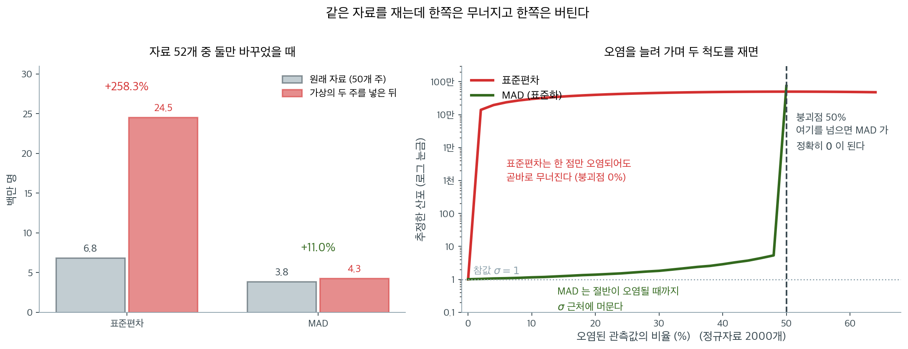

# 중앙값 절대편차 (MAD)

## 개요

**중앙값 절대편차(MAD)** 는 자료가 중앙값 주위로 얼마나 퍼져 있는지를 재는 강건한 흩어짐 측도다. 분산이나 표준편차와 달리 MAD는 이상치에 저항하므로, 치우쳤거나 오염된 자료를 기술할 때 중앙값과 짝을 이루는 이상적인 측도다.

---

## MAD의 정의와 표준화

<div class="defn" markdown>

### 정의 1. 중앙값 절대편차 { .dfn }

MAD는 세 단계로 계산한다.

1. 중앙값 $M = \text{median}(x_1, x_2, \ldots, x_n)$을 구한다.
2. 각 관측값에 대해 절대편차 $d_i = |x_i - M|$을 계산한다.
3. 이 편차들의 중앙값을 구한다: $\text{MAD} = \text{median}(d_1, d_2, \ldots, d_n)$.

$$
\text{MAD} = \text{median}(|x_i - \text{median}(x)|)
$$

</div>

### 표준화 상수

MAD를 (특히 정규분포 자료에서) 표준편차와 직접 비교할 수 있게 하려면 표준화 상수로 나눈다.

$$
\text{Standardized MAD} = \frac{\text{MAD}}{0.6745} \approx 1.4826 \times \text{MAD}
$$

$0.6745 = \Phi^{-1}(0.75)$는 표준정규분포의 75번째 백분위수다. 정규분포 $N(\mu, \sigma^2)$에서 모집단 MAD가 정확히 $0.6745\,\sigma$이므로, 거꾸로 $0.6745$로 **나누어야** 표준화된 MAD가 $\sigma$의 추정값이 된다(연습문제 2에서 유도한다).

!!! warning "곱하는 것이 아니라 나눈다"
    $\sigma \approx 1.4826 \times \text{MAD}$이지 $0.6745 \times \text{MAD}$가 아니다. MAD는 언제나 $\sigma$보다 **작으므로**($0.6745$배), 이를 $\sigma$와 비교 가능하게 만들려면 키워야 한다.

    $\sigma = 15$인 정규자료 200만 개에서 확인하면 $\text{MAD} = 10.117$이고 $\text{MAD}/0.6745 = 15.000$인 반면 $0.6745 \times \text{MAD} = 6.824$로 크게 어긋난다.

    아래 코드와 R의 `mad()`, `statsmodels`의 `robust.scale.mad`가 모두 나누는 쪽을 쓴다.

---

## 미국 주별 인구

주별 인구 자료로 MAD를 계산하고 표준편차와 비교한다.

<div class="exbox" markdown>

**보기 1.** <span class="diff easy" title="쉬움"></span> 관측값 하나를 빼면 두 척도가 얼마나 움직이는가. 미국 50개 주의 인구에서 $s$ 와 보정 MAD 를 재고, 가장 큰 주(캘리포니아) 하나를 지운다.

**(1)** 관측값 $x_k$ 하나를 지웠을 때의 제곱합 갱신식을 유도하시오. 그것으로 $s'$ 를 **정확히** 예측하고 변화율을 구하시오.

**(2)** 코드로 (1)을 확인하시오. MAD 쪽 변화율은 어떻게 나오며, 그 변화가 캘리포니아의 **크기**에서 온 것인가.

</div>

??? success "풀이"

    **(1) 해석적으로.** $\text{SS} = \sum_{i=1}^{n}(x_i - \bar x)^2$ 에서 $x_k$ 를 지우면 평균이

    $$
    \bar x' = \frac{n\bar x - x_k}{n-1}, \qquad \bar x' - \bar x = \frac{\bar x - x_k}{n-1}
    $$

    로 움직인다. 남은 $n-1$ 개의 제곱합을 $\bar x$ 기준으로 풀어 쓰면

    $$
    \text{SS}' = \sum_{i \ne k}\big[(x_i - \bar x) - (\bar x' - \bar x)\big]^2
    = \sum_{i \ne k}(x_i - \bar x)^2 - 2(\bar x' - \bar x)\sum_{i \ne k}(x_i - \bar x) + (n-1)(\bar x' - \bar x)^2
    $$

    이다. 여기서 $\sum_{i \ne k}(x_i - \bar x) = -(x_k - \bar x)$ 임을 쓰면 세 항이 각각

    $$
    \text{SS} - (x_k - \bar x)^2, \qquad
    -\frac{2(x_k - \bar x)^2}{n-1}, \qquad
    \frac{(x_k - \bar x)^2}{n-1}
    $$

    이 되어 합치면 **갱신식**

    $$
    \boxed{\ \text{SS}' = \text{SS} - \frac{n}{n-1}\,(x_k - \bar x)^2\ }
    $$

    를 얻는다. 지운 값의 편차만 알면 되고 나머지 자료를 다시 훑을 필요가 없다. 그리고 $s' = \sqrt{\text{SS}'/(n-2)}$ 다.

    자료를 넣어 보자. $n = 50$, $\bar x = 6{,}162{,}876.3$, $x_k = 37{,}253{,}956$ 이므로 편차가 $31{,}091{,}079.7$ 이고

    $$
    \frac{n}{n-1}(x_k - \bar x)^2 = \frac{50}{49}\times (3.10911\times 10^7)^2 = 9.8638\times 10^{14}
    $$

    이다. $\text{SS} = 2.29802\times 10^{15}$ 이므로 **한 점이 제곱합의 $42.9\%$ 를 차지한다.** 지우면 $\text{SS}' = 1.31164\times 10^{15}$ 이고

    $$
    s' = \sqrt{\frac{1.31164\times 10^{15}}{48}} = 5{,}227{,}402,
    \qquad \frac{s'}{s} - 1 = \frac{5{,}227{,}402}{6{,}848{,}235} - 1 = -23.67\%
    $$

    이다. **관측값 50 개 가운데 하나를 지우고 $s$ 가 사분의 일 줄어든다.**

    **(2) 수치적으로.**

    ```python
    import numpy as np
    import pandas as pd
    from statsmodels import robust

    # 미국 50개 주의 인구와 살인율. 오른쪽으로 크게 치우친 전형적인 자료다.
    url = ('https://raw.githubusercontent.com/gedeck/practical-statistics-for-data-scientists/master/data/state.csv')
    state = pd.read_csv(url)

    # 표준편차는 제곱을 쓰므로 멀리 떨어진 값 하나에 크게 흔들린다.
    std_dev = state['Population'].std()
    print(f"표준편차     : {std_dev:,.0f}")

    # statsmodels 의 mad 는 정규분포에서 표준편차와 눈금이 맞도록 이미 보정해 준다.
    mad = robust.scale.mad(state['Population'])
    print(f"MAD (보정)   : {mad:,.0f}")

    # 정의대로 직접 구해 본다. 중앙값에서의 절대편차, 그 중앙값이다.
    median_pop = state['Population'].median()
    abs_deviations = abs(state['Population'] - median_pop)
    mad_manual = abs_deviations.median()
    # 0.6745 는 표준정규의 0.75 분위점이다. 이 값으로 나누면 위 mad 와 눈금이 맞는다.
    mad_standardized = mad_manual / 0.6744897501960817
    print(f"MAD (직접)   : {mad_standardized:,.0f}")
    print(f"보정 전 MAD  : {mad_manual:,.0f}")
    print(f"s / MAD(보정) = {std_dev / mad:.4f}   <- 정규자료라면 1 쯤이어야 한다")

    # --- 최댓값 하나를 빼면 두 척도가 각각 얼마나 움직이는가 ---
    pop = state['Population'].astype(float)
    n = len(pop)
    xbar = pop.mean()
    SS = ((pop - xbar) ** 2).sum()
    k = pop.idxmax()
    xk = pop[k]
    print(f"\n최댓값 {state.loc[k, 'State']} = {xk:,.0f},  평균 {xbar:,.1f}")
    print(f"  그 한 점이 제곱합에서 차지하는 몫 = {n / (n - 1) * (xk - xbar) ** 2 / SS:.4f}")

    # 제곱합 갱신식 SS' = SS - n/(n-1) (x_k - xbar)^2 으로 s' 를 미리 계산한다.
    SS_new = SS - n / (n - 1) * (xk - xbar) ** 2
    s_pred = np.sqrt(SS_new / (n - 2))
    pop2 = pop.drop(k)
    print(f"  SS  = {SS:.6e} -> SS' 예측 {SS_new:.6e},  실제 {((pop2 - pop2.mean()) ** 2).sum():.6e}")
    print(f"  s   = {std_dev:,.2f} -> s'  예측 {s_pred:,.2f},  실제 {pop2.std():,.2f}"
          f"   ({100 * (s_pred / std_dev - 1):+.2f}%)")
    mad2 = robust.scale.mad(pop2)
    print(f"  MAD = {mad:,.2f} -> MAD' 실제 {mad2:,.2f}   ({100 * (mad2 / mad - 1):+.2f}%)")

    # MAD 가 왜 거의 안 움직이는지는 순위만 보면 안다.
    srt, srt2 = np.sort(pop.values), np.sort(pop2.values)
    d1 = np.sort(np.abs(pop.values - np.median(pop.values)))
    d2 = np.sort(np.abs(pop2.values - np.median(pop2.values)))
    print(f"\n  n=50 중앙값 = (x_(25)+x_(26))/2 = ({srt[24]:,.0f}+{srt[25]:,.0f})/2 = {np.median(pop):,.1f}")
    print(f"  n=49 중앙값 = x_(25)             = {srt2[24]:,.0f}")
    print(f"  n=50 MAD(보정 전) = (d_(25)+d_(26))/2 = "
          f"({d1[24]:,.0f}+{d1[25]:,.0f})/2 = {(d1[24] + d1[25]) / 2:,.1f}")
    print(f"  n=49 MAD(보정 전) = d_(25)            = {d2[24]:,.0f}")
    ```

    출력:

    ```
    표준편차     : 6,848,235
    MAD (보정)   : 3,849,876
    MAD (직접)   : 3,849,876
    보정 전 MAD  : 2,596,702
    s / MAD(보정) = 1.7788   <- 정규자료라면 1 쯤이어야 한다

    최댓값 California = 37,253,956,  평균 6,162,876.3
      그 한 점이 제곱합에서 차지하는 몫 = 0.4292
      SS  = 2.298018e+15 -> SS' 예측 1.311635e+15,  실제 1.311635e+15
      s   = 6,848,235.35 -> s'  예측 5,227,402.05,  실제 5,227,402.05   (-23.67%)
      MAD = 3,849,876.15 -> MAD' 실제 3,686,302.13   (-4.25%)

      n=50 중앙값 = (x_(25)+x_(26))/2 = (4,339,367+4,533,372)/2 = 4,436,369.5
      n=49 중앙값 = x_(25)             = 4,339,367
      n=50 MAD(보정 전) = (d_(25)+d_(26))/2 = (2,583,376+2,610,028)/2 = 2,596,702.0
      n=49 MAD(보정 전) = d_(25)            = 2,486,373
    ```

    **갱신식이 소수점까지 맞는다.** 예측 $\text{SS}' = 1.311635\times 10^{15}$ 과 실제가 같고, $s' = 5{,}227{,}402.05$ 도 예측과 실제가 센트 단위까지 같다. 변화율 $-23.67\%$ 도 (1)의 손계산과 같다.

    **MAD 는 $-4.25\%$ 만 움직였다.** 그런데 중요한 것은 크기가 아니라 **그 변화가 캘리포니아의 크기에서 온 것이 아니라는 점**이다. MAD 는 순서통계량만 보기 때문이다. 출력의 마지막 네 줄이 그 셈을 그대로 보여 준다.

    - $n = 50$ 에서 중앙값은 $(x_{(25)} + x_{(26)})/2 = (4{,}339{,}367 + 4{,}533{,}372)/2 = 4{,}436{,}369.5$ 이고,
    - $n = 49$ 에서는 $x_{(25)} = 4{,}339{,}367$ 하나다.

    캘리포니아는 어느 쪽에서도 **순위 맨 끝**에 있어서 중앙값 계산에 값으로 참여하지 않는다. 사라진 것은 "가장 큰 수"가 아니라 **관측 한 개**이고, 그래서 중앙값의 색인이 한 칸 밀린 것이 전부다. 보정 전 MAD 도 같은 방식으로 $(d_{(25)} + d_{(26)})/2 = 2{,}596{,}702$ 에서 $d_{(25)} = 2{,}486{,}373$ 으로 옮겨 갔다. 캘리포니아의 인구를 $37$ 백만이 아니라 $37$ 조로 바꿔도 이 네 줄은 한 글자도 달라지지 않는다. 보기 2 에서 그것을 직접 확인한다.

    마지막으로 $s / \text{MAD}_{\text{보정}} = 1.7788$ 이다. 자료가 정규라면 두 값이 같은 $\sigma$ 를 추정하므로 이 비가 $1$ 근처여야 한다. $1.78$ 은 꼬리가 정규보다 훨씬 두껍다는 뜻이고, 그 꼬리의 정체가 캘리포니아·텍사스·뉴욕이다. 이 비를 진단 도구로 쓰는 법은 연습문제 10 에 정리되어 있다.

---

## MAD가 강건한 이유

이 두 측도에 이상치가 미치는 영향을 살펴보자.

<div class="exbox" markdown>

**보기 2.** <span class="diff easy" title="쉬움"></span> MAD 가 움직인 $11.0\%$ 는 어디서 왔는가. 인구 $1$ 억과 $1.5$ 억인 가상의 주 둘을 끼워 넣으면 $s$ 는 $258.3\%$, MAD 는 $11.0\%$ 늘어난다.

**(1)** MAD 의 $11.0\%$ 가 **이상치의 크기와 아무 상관이 없음**을 보이시오. 두 이상치를 $10^{30}$, $10^{31}$ 로 바꾸었을 때의 MAD 를 미리 말할 수 있는가.

**(2)** $s$ 쪽은 두 이상치가 제곱합의 몇 퍼센트를 차지하는지 구하고, 두 이상치만으로 $s$ 를 어림하시오.

</div>

??? success "풀이"

    **(1) 해석적으로 — MAD 는 값이 아니라 순위를 본다.** 끼워 넣은 두 수는 원래 50 개보다 모두 크므로, 얼마나 크든 정렬하면 **$51$ 번째와 $52$ 번째 자리**에 놓인다. $n = 52$ 에서 중앙값은

    $$
    \text{median} = \frac{x_{(26)} + x_{(27)}}{2}
    $$

    이고 $x_{(26)}, x_{(27)}$ 은 둘 다 원래 자료의 값이다. 중앙값에서의 절대편차를 정렬해도 사정은 같다. 새 두 편차는 다른 모든 편차보다 크므로 $51, 52$ 번째 자리를 차지하고, MAD 는

    $$
    \text{MAD} = \frac{d_{(26)} + d_{(27)}}{2}
    $$

    로 역시 원래 자료에서만 나온다. **그러므로 바뀐 MAD 는 원래 50 개의 값과 "두 개가 더 들어왔다"는 개수 정보만의 함수다.** $11.0\%$ 는 $n$ 이 $50$ 에서 $52$ 로 늘어 색인이 밀린 몫이고, 이상치의 크기와는 무관하다.

    따라서 **$10^{30}$, $10^{31}$ 을 넣어도 MAD 는 똑같이 $4{,}273{,}462$ 다.** 이것이 "붕괴점 $50\%$"가 실제로 뜻하는 바다. 절반이 넘지 않는 한 오염된 값이 **얼마나** 나쁜지는 아무 영향이 없다.

    **(2) 해석적으로 — $s$ 는 제곱합의 몫만큼 따라간다.** 두 이상치가 제곱합의 비율 $\pi$ 를 차지하면, 그 둘만으로 어림한

    $$
    s_{\text{어림}} = \sqrt{\frac{(x_1 - \bar x)^2 + (x_2 - \bar x)^2}{n-1}}
    $$

    는 참값의 $\sqrt{\pi}$ 배다. $\pi$ 를 아래에서 재 보면 $0.8911$ 이고 $\sqrt{0.8911} = 0.9440$ 이다.

    **(3) 수치적으로.**

    ```python
    import pandas as pd
    import numpy as np
    from statsmodels import robust

    # 먼저 원래 자료에서 두 척도를 재 둔다.
    url = ('https://raw.githubusercontent.com/gedeck/practical-statistics-for-data-scientists/master/data/state.csv')
    state = pd.read_csv(url)
    original_std = state['Population'].std()
    original_mad = robust.scale.mad(state['Population'])

    # 여기에 있을 수 없을 만큼 큰 가상의 주 둘을 끼워 넣는다.
    population_with_outliers = pd.concat([
        state['Population'],
        pd.Series([100_000_000, 150_000_000])
    ])

    outlier_std = population_with_outliers.std()
    outlier_mad = robust.scale.mad(population_with_outliers)

    # 자료 52개 중 둘만 바뀌었는데 두 척도가 받는 충격은 전혀 다르다.
    print("이상치의 영향:")
    print(f"  표준편차: {original_std:,.0f} → {outlier_std:,.0f} ({100 * (outlier_std - original_std) / original_std:.1f}% 증가)")
    print(f"  MAD     : {original_mad:,.0f} → {outlier_mad:,.0f} ({100 * (outlier_mad - original_mad) / original_mad:.1f}% 증가)")

    # (1) MAD 의 11% 가 이상치의 크기와 무관함을 보인다. 크기만 바꿔 가며 다시 잰다.
    print("\n이상치의 크기를 키워 가며:")
    print(f"{'이상치 둘':>22}{'s':>14}{'MAD(보정)':>16}")
    for a, b in [(1e8, 1.5e8), (1e9, 1e10), (1e12, 1e13), (1e30, 1e31)]:
        q = pd.concat([state['Population'].astype(float), pd.Series([a, b])])
        print(f"{a:>10.1e},{b:>10.1e}{q.std():>14.4e}{robust.scale.mad(q):>16,.0f}")

    # 왜 그런가: MAD 는 순서통계량만 본다.
    pw = population_with_outliers.astype(float).values
    srt = np.sort(pw)
    med = np.median(pw)
    d = np.sort(np.abs(pw - med))
    print(f"\n  n=52 중앙값 = (x_(26)+x_(27))/2 = ({srt[25]:,.0f}+{srt[26]:,.0f})/2 = {med:,.1f}")
    print(f"  n=52 MAD(보정 전) = (d_(26)+d_(27))/2 = ({d[25]:,.0f}+{d[26]:,.0f})/2 = {(d[25] + d[26]) / 2:,.1f}")
    print(f"  두 이상치의 편차는 순위 51, 52 번: {d[-2]:,.0f}, {d[-1]:,.0f}  (중앙값 계산에 쓰이지 않는다)")

    # s 쪽은 두 이상치가 제곱합을 거의 독점한다.
    pwm = pw.mean()
    SS = ((pw - pwm) ** 2).sum()
    share = ((1e8 - pwm) ** 2 + (1.5e8 - pwm) ** 2) / SS
    print(f"\n  새 평균 {pwm:,.0f},  두 이상치가 제곱합에서 차지하는 몫 {share:.4f}")
    print(f"  두 이상치만으로 어림한 s = {np.sqrt(((1e8 - pwm) ** 2 + (1.5e8 - pwm) ** 2) / 51):,.0f}"
          f"  (실제 {outlier_std:,.0f},  비 {np.sqrt(share):.4f})")
    ```

    출력:

    ```
    이상치의 영향:
      표준편차: 6,848,235 → 24,537,372 (258.3% 증가)
      MAD     : 3,849,876 → 4,273,462 (11.0% 증가)

    이상치의 크기를 키워 가며:
                     이상치 둘             s         MAD(보정)
       1.0e+08,   1.5e+08    2.4537e+07       4,273,462
       1.0e+09,   1.0e+10    1.3901e+09       4,273,462
       1.0e+12,   1.0e+13    1.3910e+12       4,273,462
       1.0e+30,   1.0e+31    1.3910e+30       4,273,462

      n=52 중앙값 = (x_(26)+x_(27))/2 = (4,533,372+4,625,364)/2 = 4,579,368.0
      n=52 MAD(보정 전) = (d_(26)+d_(27))/2 = (2,753,027+3,011,786)/2 = 2,882,406.5
      두 이상치의 편차는 순위 51, 52 번: 95,420,632, 145,420,632  (중앙값 계산에 쓰이지 않는다)

      새 평균 10,733,535,  두 이상치가 제곱합에서 차지하는 몫 0.8911
      두 이상치만으로 어림한 s = 23,163,380  (실제 24,537,372,  비 0.9440)
    ```

    **(1)이 그대로 확인된다. MAD 가 네 줄 모두 정확히 $4{,}273{,}462$ 다.** 이상치를 $1$ 억에서 $10^{31}$ 로, 곧 $23$ 자릿수나 키웠는데 보정 MAD 의 마지막 자리까지 같다. 그동안 $s$ 는 $2.45\times 10^{7}$ 에서 $1.39\times 10^{30}$ 으로 함께 올라간다. 그러므로 **"표준편차는 258% 늘고 MAD 는 11% 늘었다"는 비교는 MAD 쪽을 과장한 것이다.** 정직한 서술은 "$s$ 는 이상치의 크기에 비례해 한없이 커지고 MAD 는 아예 반응하지 않는다. $11\%$ 는 표본크기가 둘 늘어난 값이다"다.

    순위 셈도 맞는다. $n = 52$ 의 중앙값이 원래 자료의 $x_{(26)} = 4{,}533{,}372$ 와 $x_{(27)} = 4{,}625{,}364$ 의 평균이고, 두 이상치의 편차 $95{,}420{,}632$ 와 $145{,}420{,}632$ 는 $51, 52$ 번째 자리에 밀려 계산에 참여하지 못한다.

    **(2)도 맞는다.** 두 이상치가 제곱합의 $89.11\%$ 를 차지하고, 그 둘만으로 어림한 $s$ 가 $23{,}163{,}380$ 으로 실제 $24{,}537{,}372$ 의 $0.9440$ 배다. 예측한 $\sqrt{0.8911} = 0.9440$ 과 소수점 넷째 자리까지 같다. **$52$ 개 가운데 두 개가 $s$ 의 $94\%$ 를 정한다**는 뜻이고, 그래서 $s$ 는 그 두 개에 대한 보고서나 다름없다.

---

## 강건성의 성질

MAD는 다음과 같은 성질을 갖는 **강건한** 통계량이다.



왼쪽은 위 보기 2의 수치를 그대로 옮긴 것이다. 자료 52개 가운데 **둘**을 바꾸었을 뿐인데 표준편차는 258% 커지고 MAD는 11% 움직인다. 두 척도가 같은 자료를 재고 있다는 것이 믿기 어려울 정도다.

오른쪽은 그 차이가 어디까지 가는지 끝까지 밀어 본 것이다. 정규자료 2000개에서 오염된 관측값의 비율을 0부터 늘려 가며 두 척도를 잰 결과인데, **표준편차는 2%만 오염되어도 이미 $10^5$ 자리로 튀어 오른다.** 한 점이라도 무한히 멀어지면 표준편차도 함께 무한대로 가므로 붕괴점이 0%라는 말의 뜻이 이것이다.

MAD는 오염이 절반에 이를 때까지 $\sigma = 1$ 근처에 머문다. 40%가 오염된 상태에서도 참값에서 크게 벗어나지 않는다. 그러다 50%를 넘는 순간 중앙값 자체가 오염된 값이 되어 **MAD가 정확히 0으로 무너진다.** 붕괴점 50%란 "절반까지는 끄떡없고 절반을 넘으면 아무것도 말해 주지 못한다"는 뜻이며, 그 경계가 이렇게 날카롭다.

- **붕괴점:** 표준편차가 0%인 데 비해, MAD는 자료의 최대 50%가 임의로 오염되어도 신뢰성을 잃지 않는다.
- **영향함수:** 유계다. 극단적인 이상치 하나가 미치는 영향이 제한된다.
- **효율:** 정규분포 자료에서 MAD는 표준편차의 약 37% 효율을 갖는다. 같은 정밀도를 얻으려면 표본이 약 $2.7$배 필요하다는 뜻이지만, MAD가 얻는 강건성을 생각하면 대개 치를 만한 값이다(연습문제 4와 7).

---

## 비교: 표준편차 대 MAD

| 특성 | 표준편차 | MAD |
|---|---|---|
| 이상치에 대한 민감성 | 높음 | 낮음 |
| 모든 자료점 사용 | 예 | 예 |
| 붕괴점 | 0% | 50% |
| 계산 복잡도 | $O(n)$ | $O(n \log n)$ (정렬 때문) |
| 해석 용이성 | 대부분의 분석가에게 익숙 | 덜 익숙 |
| 효율(정규 자료) | 100% | 37% |

---

## MAD를 쓸 때

**치우친 분포:** 소득, 자산, 그 밖에 오른쪽으로 치우친 금융 자료
**이상치가 많은 자료:** 센서 측정값, 천문 관측
**강건 추정:** 모든 자료점을 똑같이 신뢰할 수 없을 때
**비정규 자료:** 꼬리가 두껍거나 다봉인 분포

---

## 실용적 예: 금융 수익률

주식시장 분석에서 MAD가 표준편차보다 대표성이 클 수 있다.

<div class="exbox" markdown>

**보기 3.** <span class="diff easy" title="쉬움"></span> 폭락 하루가 표준편차를 혼자 정한다. 일별 수익률 $13$ 개 가운데 마지막 하루가 $-50\%$ 다. $s = 0.1407$, 보정 MAD $= 0.0222$ 로 여섯 배 넘게 벌어진다.

**(1)** 관측값 하나 $x_0$ 가 나머지를 압도할 때 $s \approx \lvert x_0\rvert / \sqrt{n}$ 임을 보이시오. $n = 13$ 에 $x_0 = -0.50$ 을 넣으면 얼마인가.

**(2)** $n = 13$ 의 MAD 를 손으로 구한 뒤, 폭락 깊이를 $-50\%$, $-500\%$, $-5000\%$ 로 키워 가며 (1)을 확인하고 MAD 가 어떻게 되는지 보시오.

</div>

??? success "풀이"

    **(1) 해석적으로.** 나머지 $n-1$ 개가 $x_0$ 에 견주어 무시할 만하다고 보고 **정확히 $0$** 으로 놓자. 그러면 평균이 $\bar x = x_0/n$ 이고

    $$
    \text{SS} = \left(x_0 - \frac{x_0}{n}\right)^2 + (n-1)\left(0 - \frac{x_0}{n}\right)^2
    = x_0^2\,\frac{(n-1)^2}{n^2} + x_0^2\,\frac{n-1}{n^2}
    = x_0^2\,\frac{(n-1)\big[(n-1) + 1\big]}{n^2}
    = x_0^2\,\frac{n-1}{n}
    $$

    이다. 따라서

    $$
    s^2 = \frac{\text{SS}}{n-1} = \frac{x_0^2}{n}, \qquad\qquad s = \frac{\lvert x_0\rvert}{\sqrt{n}}
    $$

    이다. 깔끔하게 떨어진다. $n = 13$, $x_0 = -0.50$ 이면

    $$
    s \approx \frac{0.50}{\sqrt{13}} = \frac{0.50}{3.6056} = 0.1387
    $$

    이고 실제 $0.1407$ 과 $1.4\%$ 차이다. 나머지 수익률이 정말로 $0$ 은 아니기 때문이며, $x_0$ 가 커지면 그 몫이 줄어 어림이 좋아져야 한다.

    **이것이 "표준편차의 붕괴점은 $0\%$"라는 말의 정량적 내용이다.** 한 점만 $\lvert x_0\rvert \to \infty$ 로 보내면 $s$ 도 그와 **비례해서** 한없이 커지고, 비례상수가 $1/\sqrt{n}$ 이다. 연습문제 3 의 "$M/\sqrt{n}$ 처럼 커진다"가 바로 이 식이다.

    **손으로 구한 MAD.** $n = 13$ 은 홀수라 중앙값이 $7$ 번째 값 하나다. 정렬하면

    $$
    -0.5,\ -0.02,\ -0.015,\ -0.01,\ -0.01,\ -0.005,\ \mathbf{0.005},\ 0.01,\ 0.01,\ 0.015,\ 0.02,\ 0.02,\ 0.03
    $$

    이므로 중앙값은 $0.005$ 다. 거기서의 절대편차를 정렬하면

    $$
    0,\ 0.005,\ 0.005,\ 0.01,\ 0.01,\ 0.015,\ \mathbf{0.015},\ 0.015,\ 0.015,\ 0.02,\ 0.025,\ 0.025,\ 0.505
    $$

    이고 $7$ 번째가 $0.015$ 다. 보정하면 $0.015/0.6745 = 0.02224$ 다. **폭락일의 편차 $0.505$ 는 정렬된 목록의 맨 끝에 있어 쓰이지 않는다.**

    **(2) 수치적으로.**

    ```python
    import numpy as np
    import pandas as pd
    from statsmodels import robust

    # 어느 주식의 일별 수익률이라고 하자. 마지막 하루가 폭락일(-50%)이다.
    returns = pd.Series([0.01, 0.02, -0.01, 0.015, -0.005, 0.03, -0.02,
                          0.01, -0.01, 0.005, -0.015, 0.02, -0.50])

    print(f"표준편차   : {returns.std():.4f}")
    print(f"MAD (보정) : {robust.scale.mad(returns):.4f}")
    print(f"s / MAD    : {returns.std() / robust.scale.mad(returns):.4f}")

    # 손계산을 따라가 본다. n = 13 이라 중앙값은 7번째 값 하나다.
    n = len(returns)
    srt = np.sort(returns.values)
    med = srt[n // 2]
    d = np.sort(np.abs(returns.values - med))
    print(f"\nn = {n},  정렬한 수익률 {srt}")
    print(f"중앙값 = x_(7) = {med}")
    print(f"절대편차 정렬 {d}")
    print(f"MAD(보정 전) = d_(7) = {d[n // 2]},  보정 후 {d[n // 2] / 0.6744897501960817:.6f}")

    # (1) 한 점이 압도할 때 s = |x_0|/sqrt(n) 인가. 폭락 깊이를 키워 가며 본다.
    print(f"\n{'폭락일':>10}{'s 실제':>12}{'|x0|/sqrt(n)':>15}{'비':>9}{'MAD(보정)':>12}")
    for crash in (-0.50, -5.00, -50.00):
        q = pd.Series(list(returns[:-1]) + [crash])
        approx = abs(crash) / np.sqrt(n)
        print(f"{crash:>10.2f}{q.std():>12.4f}{approx:>15.4f}"
              f"{q.std() / approx:>9.4f}{robust.scale.mad(q):>12.4f}")

    # 폭락일을 아예 빼면?
    q0 = returns[:-1]
    print(f"\n폭락일 제외 (n={len(q0)}):  s = {q0.std():.4f},  MAD(보정) = {robust.scale.mad(q0):.4f}")
    print(f"  폭락일이 s 를 {returns.std() / q0.std():.2f}배, MAD 를 "
          f"{robust.scale.mad(returns) / robust.scale.mad(q0):.2f}배로 만들었다")
    ```

    출력:

    ```
    표준편차   : 0.1407
    MAD (보정) : 0.0222
    s / MAD    : 6.3249

    n = 13,  정렬한 수익률 [-0.5   -0.02  -0.015 -0.01  -0.01  -0.005  0.005  0.01   0.01   0.015
      0.02   0.02   0.03 ]
    중앙값 = x_(7) = 0.005
    절대편차 정렬 [0.    0.005 0.005 0.01  0.01  0.015 0.015 0.015 0.015 0.02  0.025 0.025
     0.505]
    MAD(보정 전) = d_(7) = 0.015,  보정 후 0.022239

           폭락일        s 실제   |x0|/sqrt(n)        비     MAD(보정)
         -0.50      0.1407         0.1387   1.0143      0.0222
         -5.00      1.3880         1.3868   1.0009      0.0222
        -50.00     13.8687        13.8675   1.0001      0.0222

    폭락일 제외 (n=12):  s = 0.0159,  MAD(보정) = 0.0185
      폭락일이 s 를 8.83배, MAD 를 1.20배로 만들었다
    ```

    **어림식이 예상대로 좋아진다.** 실제 $s$ 를 $\lvert x_0\rvert/\sqrt{13}$ 으로 나눈 비가 $1.0143 \to 1.0009 \to 1.0001$ 로 $1$ 에 수렴한다. 폭락이 깊어질수록 나머지 $12$ 일이 상대적으로 작아지기 때문이다. **$-5000\%$ 에서는 $s = 13.8687$ 인데 어림값 $13.8675$ 와 소수점 셋째 자리까지 같다.** 곧 그 수치는 "하루치 수익률 하나를 $\sqrt{13}$ 으로 나눈 값"이지 그 주식의 변동성이 아니다.

    **그동안 MAD 는 세 줄 모두 $0.0222$ 다.** 손계산이 보여 준 대로 폭락일의 편차는 정렬된 $13$ 개 중 맨 끝이라 어떤 값이든 쓰이지 않는다.

    **그러나 MAD 가 폭락일에 전혀 영향을 받지 않는 것은 아니다.** 폭락일을 아예 빼면 $n = 12$ 가 되어 MAD 가 $0.0222$ 에서 $0.0185$ 로 내려간다. $1.20$ 배 차이다. 보기 2 와 똑같은 사정이다. 이 변화는 폭락의 **깊이**가 아니라 **관측 하나가 늘었다는 사실**에서 온다. 짝수·홀수가 바뀌어 중앙값 관례까지 달라지므로 작은 표본에서는 이 몫이 눈에 띈다. 같은 조건에서 $s$ 는 $0.0159$ 에서 $0.1407$ 로 $8.83$ 배가 된다.

    **$s/\text{MAD} = 6.32$ 라는 비가 진단이다.** 정규자료라면 $1$ 근처여야 하는 수가 $6$ 을 넘었다는 것은 "이 표본에 정규분포로 설명되지 않는 관측이 있다"는 경보다. 여기서는 그것이 어느 날인지도 분명하다.

---

## 파이썬에서 MAD 계산하기

### statsmodels 사용 (권장)

<div class="exbox" markdown>

**보기 4.** <span class="diff easy" title="쉬움"></span> 값 여섯 개로 끝까지 손으로 따라가기. 자료는 $1, 2, 3, 4, 5, 100$ 이고 `robust.scale.mad` 가 $2.22$ 를 돌려준다.

**(1)** $2.22$ 를 손으로 재현하시오. $n = 6$ 이라 중앙값을 두 번 — 자료에서 한 번, 절대편차에서 한 번 — 짝수 관례로 구해야 한다.

**(2)** $100$ 을 $10^4$, $10^6$, $10^{12}$ 로 키우면 MAD 와 $s$ 가 각각 어떻게 되는가. 보기 3 의 어림식 $s \approx \lvert x_0\rvert/\sqrt{n}$ 이 여기서도 맞는가.

</div>

??? success "풀이"

    **(1) 해석적으로.** 자료가 이미 정렬되어 있다. $n = 6$ 이 짝수이므로 중앙값은 $3$ 번째와 $4$ 번째의 평균

    $$
    M = \frac{x_{(3)} + x_{(4)}}{2} = \frac{3 + 4}{2} = 3.5
    $$

    다. 각 값의 절대편차는

    $$
    \lvert 1 - 3.5\rvert = 2.5,\quad 1.5,\quad 0.5,\quad 0.5,\quad 1.5,\quad \lvert 100 - 3.5\rvert = 96.5
    $$

    이고, 정렬하면 $0.5,\ 0.5,\ \mathbf{1.5},\ \mathbf{1.5},\ 2.5,\ 96.5$ 다. 다시 짝수 관례로

    $$
    \text{MAD} = \frac{d_{(3)} + d_{(4)}}{2} = \frac{1.5 + 1.5}{2} = 1.5
    $$

    이고 보정하면

    $$
    \frac{1.5}{0.6744898} = 2.2239
    $$

    이다. 소수 둘째 자리로 끊으면 $2.22$ 다. **이상치 $100$ 의 편차 $96.5$ 는 정렬된 목록의 맨 끝이라 쓰이지 않는다.** 쓰인 것은 $1.5$ 두 개, 곧 값 $2$ 와 $5$ 의 편차다.

    **(2) 예측.** MAD 는 $100$ 의 자리가 바뀌지 않는 한(언제나 최댓값이다) **변하지 않아야** 한다. $s$ 는 보기 3 에서 유도한 대로 $\lvert x_0\rvert/\sqrt{6} = \lvert x_0\rvert/2.4495$ 를 따라야 한다. $x_0 = 100$ 일 때 $40.825$ 인데, 나머지 다섯 값이 $100$ 에 견주어 아주 작지는 않으므로 어림이 조금 어긋나고, $x_0$ 가 커지면 맞아들어가야 한다.

    ```python
    from statsmodels import robust
    import numpy as np
    import pandas as pd

    # 마지막 100 이 이상치다. 나머지 다섯 값은 1부터 5까지 고르게 놓여 있다.
    data = pd.Series([1, 2, 3, 4, 5, 100])
    mad = robust.scale.mad(data)
    print(f"MAD: {mad:.2f}")

    # 손계산을 따라간다. n = 6 이라 중앙값은 3번째와 4번째의 평균이다.
    srt = np.sort(data.values.astype(float))
    med = (srt[2] + srt[3]) / 2
    d = np.sort(np.abs(srt - med))
    print(f"\n정렬 {srt},  중앙값 = ({srt[2]}+{srt[3]})/2 = {med}")
    print(f"절대편차 정렬 {d}")
    print(f"MAD(보정 전) = (d_(3)+d_(4))/2 = ({d[2]}+{d[3]})/2 = {(d[2] + d[3]) / 2}")
    print(f"보정 후 = {(d[2] + d[3]) / 2 / 0.6744897501960817:.6f}")

    # 이상치만 키워 가며 두 척도를 본다. s 는 보기 3 의 |x_0|/sqrt(n) 을 따라야 한다.
    n = len(data)
    print(f"\n{'최댓값':>10}{'MAD(보정)':>12}{'s 실제':>14}{'|x0|/sqrt(6)':>15}{'비':>9}")
    for big in (100.0, 1e4, 1e6, 1e12):
        dd = pd.Series([1, 2, 3, 4, 5, big])
        approx = big / np.sqrt(n)
        print(f"{big:>10.0e}{robust.scale.mad(dd):>12.4f}{dd.std():>14.4e}"
              f"{approx:>15.4e}{dd.std() / approx:>9.4f}")
    ```

    출력:

    ```
    MAD: 2.22

    정렬 [  1.   2.   3.   4.   5. 100.],  중앙값 = (3.0+4.0)/2 = 3.5
    절대편차 정렬 [ 0.5  0.5  1.5  1.5  2.5 96.5]
    MAD(보정 전) = (d_(3)+d_(4))/2 = (1.5+1.5)/2 = 1.5
    보정 후 = 2.223903

           최댓값     MAD(보정)          s 실제   |x0|/sqrt(6)        비
         1e+02      2.2239    3.9625e+01     4.0825e+01   0.9706
         1e+04      2.2239    4.0813e+03     4.0825e+03   0.9997
         1e+06      2.2239    4.0825e+05     4.0825e+05   1.0000
         1e+12      2.2239    4.0825e+11     4.0825e+11   1.0000
    ```

    **손계산이 그대로 재현된다.** 중앙값 $3.5$, 절대편차 $0.5, 0.5, 1.5, 1.5, 2.5, 96.5$, 보정 전 MAD $1.5$, 보정 후 $2.223903$ 이다.

    **(2)의 두 예측도 맞는다.** MAD 는 네 줄 모두 $2.2239$ 로 **$10^{12}$ 까지 키워도 한 자리도 움직이지 않는다.** 한편 $s$ 는 $39.6 \to 4.08\times 10^{11}$ 로 $x_0$ 와 정비례해 자라고, 어림식과의 비가 $0.9706 \to 0.9997 \to 1.0000 \to 1.0000$ 으로 $1$ 에 붙는다. $10^6$ 부터는 유효숫자 네 자리까지 같다.

    그러므로 이 자료에서 $s$ 가 보고하는 것은 **"$1, 2, 3, 4, 5$ 가 얼마나 퍼져 있는가"가 아니라 "여섯째 값이 얼마나 큰가"** 다. 같은 질문에 MAD 는 $2.22$ 라고 답하는데, 그 값은 $1$ 부터 $5$ 까지의 간격 $1$ 과 같은 눈금 위에 있다($1.4826 \times 1.5$).

### 직접 계산

<div class="exbox" markdown>

**보기 5.** <span class="diff easy" title="쉬움"></span> 직접 구현이 `robust.scale.mad` 와 같은 답을 주는 것은 당연한 일이 아니다. 두 구현이 일치하려면 세 가지가 같아야 한다 — **짝수 표본의 중앙값 관례**, **보정상수**, **분위수 보간법**.

**(1)** 세 가지 가운데 보간법만 바꾸면 보기 4 의 자료에서 MAD 가 어떤 값들로 갈리는가. 가장 작은 값과 가장 큰 값의 비는 얼마인가.

**(2)** `np.percentile` 의 `method` 를 바꾸어 확인하시오.

</div>

??? success "풀이"

    **(1) 해석적으로.** 자료 $1, 2, 3, 4, 5, 100$ 에서 "$50$ 백분위수"는 $3$ 번째와 $4$ 번째 순서통계량 사이의 **아무 값이라도** 될 수 있다(보기 3 의 절대값 벌점에서 본 평평한 구간이 여기서는 $[3, 4]$ 다). 관례가 그중 하나를 고른다.

    - `linear` 와 `midpoint` 는 중점 $3.5$ 를 고른다. 그러면 절대편차 중앙값도 중점 관례로 $1.5$ 가 되어 보정값이 $1.5/0.6745 = 2.2239$ 다.
    - `lower` 와 `nearest` 는 $3$ 을 고른다. 그러면 절대편차가 $2, 1, 0, 1, 2, 97$ 이고 정렬하면 $0, 1, 1, 2, 2, 97$ 이라 $3$ 번째 값 $1$ 이 MAD 가 된다. 보정값 $1/0.6745 = 1.4826$ 이다.
    - `higher` 는 $4$ 를 고른다. 절대편차가 $3, 2, 1, 0, 1, 96$ 이고 정렬하면 $0, 1, 1, 2, 3, 96$ 이라 $4$ 번째 값 $2$ 가 MAD 다. 보정값 $2/0.6745 = 2.9652$ 다.

    따라서 답이 $1.4826$, $2.2239$, $2.9652$ 세 가지로 갈리고 **가장 큰 값이 가장 작은 값의 정확히 두 배**다($2/1 = 2$). 같은 여섯 개 수에서 **"퍼짐"이 두 배 차이로 보고될 수 있다**는 뜻이다.

    `pandas` 의 `.median()`, `numpy` 의 `np.median`, `statsmodels` 의 `robust.scale.mad` 가 모두 `linear` 쪽을 쓰기 때문에 보기 4 와 이 보기가 같은 $2.22$ 를 준 것이고, 그것은 **우연이 아니라 같은 관례를 공유해서**다.

    **(2) 수치적으로.**

    ```python
    import numpy as np
    import pandas as pd
    from statsmodels import robust

    data = pd.Series([1, 2, 3, 4, 5, 100])

    # 정의를 세 줄로 그대로 옮긴 것이다: 중앙값 → 절대편차 → 그 중앙값.
    median = data.median()
    abs_dev = abs(data - median)
    mad = abs_dev.median()

    # 정규분포에서 표준편차와 눈금을 맞추기 위한 보정상수다.
    mad_standardized = mad / 0.6744897501960817
    print(f"MAD (보정): {mad_standardized:.2f}")
    print(f"statsmodels: {robust.scale.mad(data):.2f}  "
          f"(차 {mad_standardized - robust.scale.mad(data):.1e})")

    # 두 답이 같은 것은 세 가지가 모두 일치했기 때문이다.
    # 그 가운데 분위수 보간법만 바꾸면 답이 달라진다.
    x = data.values.astype(float)
    print(f"\n{'method':>10}{'중앙값':>9}{'MAD(보정 전)':>14}{'MAD(보정)':>12}")
    for meth in ("linear", "lower", "higher", "midpoint", "nearest"):
        m = np.percentile(x, 50, method=meth)
        v = np.percentile(np.abs(x - m), 50, method=meth)
        print(f"{meth:>10}{m:>9.2f}{v:>14.2f}{v / 0.6744897501960817:>12.4f}")
    ```

    출력:

    ```
    MAD (보정): 2.22
    statsmodels: 2.22  (차 0.0e+00)

        method      중앙값     MAD(보정 전)     MAD(보정)
        linear     3.50          1.50      2.2239
         lower     3.00          1.00      1.4826
        higher     4.00          2.00      2.9652
      midpoint     3.50          1.50      2.2239
       nearest     3.00          1.00      1.4826
    ```

    **(1)의 세 값이 그대로 나온다.** 직접 구현과 `statsmodels` 의 차는 정확히 $0$ 이고, 보간법을 바꾸면 보정 MAD 가 $1.4826$, $2.2239$, $2.9652$ 로 갈린다. 비는 $2.9652/1.4826 = 2.00$ 이다.

    **$n$ 이 작을 때만의 문제가 아니다.** 같은 선택이 $Q_1, Q_3$ 에 걸리면 IQR 이 달라지고, 그러면 IQR $\times 1.5$ 울타리로 판정하는 이상치의 개수까지 달라진다. `np.percentile` 에는 보간법이 아홉 가지 들어 있고 통계 소프트웨어마다 기본값이 다르다.

    **실무의 처방은 간단하다. 보고할 때 보간법을 함께 적거나, 적어도 자료와 코드를 함께 남겨라.** "MAD = 2.22" 만으로는 재현되지 않는다. 그리고 이런 관례 차이가 결론을 바꿀 정도라면 그것은 **표본이 너무 작다는 신호**이기도 하다. $n = 6$ 에서 세 번째와 네 번째 순서통계량 사이가 $3$ 과 $4$ 로 벌어져 있다는 사실 자체가 추정의 불확실성을 말해 준다.

---

## 연습문제

<div class="drillbox" markdown>

**연습문제 1.** <span class="diff easy" title="쉬움"></span>
어떤 품질관리 공정이 지름 측정값 10개(mm)를 기록했다: $10.1, 10.0, 9.9, 10.2, 10.0, 9.8, 10.1, 10.0, 15.3, 10.0$. (a) $s$를 계산하라. (b) MAD를 계산하라. (c) 척도를 맞춘 MAD($1.4826 \cdot \text{MAD}$)를 계산하라. 비교하고 설명하라.

</div>

??? success "풀이"
    (a) $\bar x = 10.54$. 제곱편차의 합 $= 25.284$이며, 이 중 $(15.3 - 10.54)^2 = 22.66$ 항이 약 90%를 차지한다. $s^2 = 25.284/9 = 2.809$, $s \approx 1.676$.

    (b) 정렬하면 $9.8, 9.9, 10.0, 10.0, 10.0, 10.0, 10.1, 10.1, 10.2, 15.3$이고 중앙값 $= 10.0$이다. 절대편차를 정렬하면 $0.0, 0.0, 0.0, 0.0, 0.1, 0.1, 0.1, 0.2, 0.2, 5.3$이므로 MAD $= (0.1 + 0.1)/2 = 0.1$이다.

    (c) 척도를 맞춘 MAD $= 1.4826 \times 0.1 \approx 0.148$.

    표준편차($1.68$)가 척도를 맞춘 MAD($0.15$)의 11배가 넘는다. 이상치 15.3 하나가 표준편차를 엄청나게 부풀리는 반면 MAD는 사실상 건드리지 못한다. 이 자료에서는 MAD가 전형적인 퍼짐을 훨씬 정직하게 재는 측도다.

<div class="drillbox" markdown>

**연습문제 2.** <span class="diff hard" title="어려움"></span>
정규분포 아래에서 MAD를 $\sigma$와 같게 만드는 일치성 상수 $1/\Phi^{-1}(0.75) \approx 1.4826$을 유도하라.

</div>

??? success "풀이"
    $X \sim N(\mu, \sigma^2)$에서 중앙값은 $\mu$이므로 $|X - \mu|/\sigma$는 **반정규(half-normal)** 분포를 따른다. MAD에 $c$를 곱했을 때 $c \cdot \text{MAD} = \sigma$가 되는 $c$를 찾고자 한다.

    대칭성에 의해 $P(|X - \mu| \le m) = P(-m \le X - \mu \le m) = 2\Phi(m/\sigma) - 1$이다. 중앙값의 정의에 따라 이를 0.5로 두면

    $$
    2\Phi(m/\sigma) - 1 = 0.5 \implies \Phi(m/\sigma) = 0.75 \implies m/\sigma = \Phi^{-1}(0.75) \approx 0.6745
    $$

    이다. 따라서 모집단 MAD는 $0.6745 \sigma$이다. 척도 상수 $c = 1/0.6745 \approx 1.4826$이 MAD를 $\sigma$로 되돌린다. 대부분의 소프트웨어 라이브러리(R의 `mad()`, statsmodels의 `robust.scale.mad`)가 이 상수를 자동으로 적용하는 이유가 이것이다.

<div class="drillbox" markdown>

**연습문제 3.** <span class="diff med" title="중간"></span>
추정량의 **붕괴점**은 그 추정량을 참값에서 임의로 멀리 보낼 수 있게 되기까지 임의의 값으로 바꿔야 하는 자료의 비율이다. MAD의 붕괴점이 50%이고 표준편차의 붕괴점이 0%임을 보여라.

</div>

??? success "풀이"
    **표준편차의 붕괴점 0%:** 유한한 값들로 이루어진 크기 $n$의 표본을 생각하자. 관측값 하나 $x_i$를 값 $M$으로 바꾼다. 새 평균은 $M/n$처럼 커지지만 새 표준편차는 $M/\sqrt{n}$처럼 커진다. $M \to \infty$이면 둘 다 한없이 커진다. 따라서 자료의 $1/n$(0이 아닌 가장 작은 비율)만 바꿔도 표준편차를 임의로 크게 만들 수 있다. $1/n \to 0$이므로 붕괴점은 0이다.

    **MAD의 붕괴점 50%:** 표본의 중앙값은 값 하나를 바꿀 때마다 순위 위치가 많아야 하나씩 움직인다. 값의 절반보다 적게 바꾸면 중앙값은 여전히 원래의 "가운데" 자료에 묶여 있다. 마찬가지로 절대편차 $|x_i - \text{median}|$의 중앙값도 자료의 본체에 의존한다. 적어도 $\lceil n/2 \rceil$개를 바꿔야만 중앙값(따라서 MAD)을 임의의 위치로 옮길 수 있다. 따라서 큰 $n$에 대해 붕괴점은 $\lfloor n/2 \rfloor / n \approx 0.5$다.

    이것은 합리적인 위치/척도 추정량이 가질 수 있는 최대 붕괴점이다. 이론적 상한인 50%이며, 중앙값과 MAD(그리고 몇몇 M-추정량)만이 여기에 도달한다.

<div class="drillbox" markdown>

**연습문제 4.** <span class="diff med" title="중간"></span>
정규성 아래에서 MAD는 표준편차보다 **효율**이 낮아 가우시안 효율이 약 37%다. 통계적 효율을 정의하고, 그럼에도 많은 응용 맥락에서 MAD를 선호하는 것을 정당화하는 편향–분산 절충을 설명하라.

</div>

??? success "풀이"
    추정량 $\hat\theta$의 기준 추정량 $\hat\theta^*$에 대한 **효율**은 두 추정량의 점근분산의 비다. 정규성 아래에서 $\sigma_{\text{eff(MAD)}} \approx 0.37 \cdot \sigma_{\text{eff(SD)}}$이며, 자료가 정말로 정규일 때 MAD의 분산이 표준편차의 약 $1/0.37 \approx 2.7$배라는 뜻이다.

    **절충 관계:**

    - 자료가 *정확히* 정규라면 표준편차는 정보를 낭비하지 않아 효율이 100%이고, MAD는 자료를 낭비해 정밀도가 떨어진다.
    - 자료가 *오염되어* 있다면 — 이상치가 아주 조금만 있어도 — 이상치가 제곱항으로 기여하므로 표준편차의 분산이 폭증한다. MAD의 분산은 거의 그대로다.

    거의 결코 정확히 정규가 아닌 실제 자료에서는, MAD의 낮은 가우시안 효율이라는 비용을 오염에 대한 둔감함이 충분히 상쇄하고도 남는다. 일반적인 설계 원칙은 이렇다. **가정된 정규성이 조금만 어긋나도 파국적으로 실패하는 대가를 치르면서까지 최선의 경우에 최적화하지 마라.** 이것이 "강건통계"의 핵심이다.

<div class="drillbox" markdown>

**연습문제 5.** <span class="diff med" title="중간"></span>
이상치 탐지를 위한 **수정 Z-점수**는 $M_i = 0.6745 \cdot (x_i - \tilde x) / \text{MAD}$이다. 이상치 탐지에서 이것이 고전적인 Z-점수 $Z_i = (x_i - \bar x) / s$보다 선호되는 이유는 무엇인가?

</div>

??? success "풀이"
    고전적인 Z-점수는 (이상치에 민감한) $\bar x$와 (매우 민감한) $s$를 쓴다. 이상치가 둘 다 부풀려 스스로를 **가린다**. 표시되어야 할 바로 그 점이 평균과 표준편차를 자기 쪽으로 끌어당겼기 때문에 $|Z|$가 작아진다.

    수정 Z-점수는 중앙값(붕괴점 50%)과 MAD(붕괴점 50%)를 쓴다. 이상치는 둘 중 어느 쪽에도 무시할 만한 영향만 주므로, 진짜 이상치에 대해서는 Z와 비슷한 이 통계량이 크게 유지된다. 계수 $0.6745$는 수정 Z-점수를 정규성 아래의 고전적 Z와 비슷한 척도로 맞춘다. 즉 깨끗한 자료에서 $|M_i| > 3.5$가 $|Z_i| > 3$과 대략 같은 꼬리 희귀도에 대응한다.

    Iglewicz and Hoaglin(1993)은 이상치 표시 기준으로 $|M_i| > 3.5$를 권장하여, 고전적인 $|Z| > 3$ 규칙의 강건한 대안을 제공했다.

<div class="drillbox" markdown>

**연습문제 6.** <span class="diff med" title="중간"></span>
MAD는 여러 강건 척도 추정량 중 하나다. 이를 **사분위범위**(IQR) 및 **Qn 추정량**(Rousseeuw–Croux)과 간략히 비교하라. 각각은 언제 고르겠는가?

</div>

??? success "풀이"
    **MAD:** $|x_i - \tilde x|$의 중앙값. 붕괴점 50%, 가우시안 효율 37%. 간단하고 널리 구현되어 있으며 기본적인 강건 척도다.

    **IQR:** $Q_3 - Q_1$. 붕괴점 25%(사분위수 하나만 오염시키면 된다). 개념적으로 더 간단하지만 붕괴점이 낮다. 정규 자료에서 $1.349 \sigma$를 통해 $\sigma$와 척도가 맞는다. 상자그림의 사실상 표준이다.

    **Qn 추정량**(Rousseeuw and Croux 1993): 차이 $|x_i - x_j|$에 근거한 강건 척도로, 모든 쌍의 차이의 제1사분위수에 정규화 상수를 곱해 계산한다. 붕괴점 50%, 가우시안 효율 82%로 MAD보다 약 2배 낫다. 대가는 MAD의 $O(n)$에 비해 $O(n \log n)$의 계산량이다.

    **선택 기준:**

    - **MAD**: 기본적인 강건 척도. 간단하고 빠르며 잘 알려져 있다.
    - **IQR**: 상자그림과 빠른 기술적 요약. 높은 붕괴점이 필수인 경우에는 부적합하다.
    - **Qn**: 높은 가우시안 효율이 중요하고 계산 비용을 감당할 수 있는 큰 표본. 본격적인 강건 추정의 최신 표준이다.

<div class="drillbox" markdown>

**연습문제 7.** <span class="diff hard" title="어려움"></span>
연습문제 4가 MAD의 가우시안 효율 $37\%$를 언급했고 연습문제 6이 Qn을 소개했다. 둘을 실제로 구현해 **Sn**까지 함께 비교하라.

</div>

??? success "풀이"
    로우시우–크라우는 MAD의 두 약점(낮은 효율, 대칭성 가정)을 개선한 추정량을 제안했다.

    $$
    \text{Qn} = 2.2219 \cdot \left\{\lvert x_i - x_j\rvert : i<j\right\}_{(k)},
    \qquad
    \text{Sn} = 1.1926 \cdot \operatorname{med}_i \operatorname{med}_{j \ne i} \lvert x_i - x_j\rvert
    $$

    둘 다 **중심을 먼저 추정하지 않는다**는 점이 MAD와 다르다. 관측값 **쌍 사이의 거리**를 직접 쓴다.

    ```python
    import numpy as np

    rng = np.random.default_rng(0)

    def Qn(x):
        x = np.sort(x); k = len(x)
        v = np.abs(x[:, None] - x[None, :])[np.triu_indices(k, 1)]
        h = k // 2 + 1
        return 2.2219 * np.sort(v)[h * (h - 1) // 2 - 1]

    def Sn(x):
        k = len(x)
        d = np.abs(x[:, None] - x[None, :])
        return 1.1926 * np.median([np.median(np.delete(d[i], i)) for i in range(k)])

    n, B = 40, 8000
    X = rng.normal(0, 1, (B, n))
    estimators = {
        "s": X.std(axis=1, ddof=1),
        "MAD x 1.4826": 1.4826 * np.median(
            np.abs(X - np.median(X, axis=1, keepdims=True)), axis=1),
        "Qn": np.array([Qn(r) for r in X]),
        "Sn": np.array([Sn(r) for r in X]),
    }

    base = None
    print(f"정규 N(0,1), n={n}")
    print(f"{'추정량':<14}{'평균':>9}{'MSE':>11}{'상대효율':>11}")
    for name, v in estimators.items():
        mse = np.mean((v - 1) ** 2)
        base = base or mse
        print(f"{name:<14}{v.mean():>9.4f}{mse:>11.5f}{base / mse:>11.4f}")
    ```

    출력:

    ```
    정규 N(0,1), n=40
    추정량                  평균        MSE       상대효율
    s                0.9954    0.01246     1.0000
    MAD x 1.4826     0.9809    0.03204     0.3890
    Qn               1.0963    0.02971     0.4194
    Sn               1.0135    0.02187     0.5699
    ```

    | 추정량 | 상대효율 | 붕괴점 |
    |---|---|---|
    | $s$ | $1.000$ | $0\%$ |
    | MAD $\times 1.4826$ | $0.389$ | $50\%$ |
    | Qn | $0.419$ | $50\%$ |
    | **Sn** | $\mathbf{0.570}$ | $50\%$ |

    **MAD의 효율 $0.389$가 연습문제 4의 이론값 $37\%$와 맞는다.** Sn은 같은 붕괴점 $50\%$를 유지하면서 효율을 $0.57$까지 끌어올린다. Qn은 점근적으로 $0.82$의 효율을 갖지만 $n = 40$에서는 아직 그에 못 미친다.

    !!! note "유한표본 보정이 필요하다"
        위 출력에서 Qn의 평균이 $1.096$으로 $\sigma = 1$을 $10\%$ 과대추정한다. 상수 $2.2219$는 **점근적** 일치성 상수이고, 작은 $n$에서는 추가 보정 인자가 필요하다. 실제 구현(R의 `robustbase::Qn`)은 $n$에 의존하는 보정표를 내장하고 있다.

        앞 절 절단 표준편차에서 본 것과 같은 문제다. **강건 추정량을 직접 구현할 때는 일치성 상수를 반드시 확인하라.**

    **왜 Qn과 Sn이 더 효율적인가.** MAD는 중앙값을 기준으로 한 거리만 보므로 사실상 **하나의 기준점**에 의존한다. Qn과 Sn은 모든 쌍의 거리를 쓰므로 자료의 정보를 훨씬 많이 활용한다.

    **대가는 계산량이다.** MAD는 정렬 한 번으로 $O(n \log n)$이면 끝나지만(선택 알고리즘을 쓰면 $O(n)$) Qn과 Sn은 순진하게 구현하면 $O(n^2)$이다(효율적인 알고리즘은 $O(n\log n)$). 위 코드도 $n$이 수천을 넘으면 느려진다.

    **실무 선택.** 자료가 크지 않고 정밀도가 중요하면 **Sn**이 좋은 기본값이다. 계산이 단순해야 하거나 $n$이 아주 크면 MAD가 여전히 실용적이다. $\square$

<div class="drillbox" markdown>

**연습문제 8.** <span class="diff med" title="중간"></span>
MAD에는 효율 말고도 개념적 한계가 있다. **비대칭 분포**에서 MAD가 무엇을 재는지 확인하고, 그것이 왜 문제인지 설명하라.

</div>

??? success "풀이"
    ```python
    import numpy as np

    rng = np.random.default_rng(0)
    n = 500_000

    print(f"{'분포':>10}{'MAD x 1.4826':>15}{'SD':>10}{'아래쪽 편차':>14}{'위쪽 편차':>13}{'비':>8}")
    for label, x in [("정규", rng.normal(0, 1, n)),
                     ("지수", rng.exponential(1, n)),
                     ("로그정규", rng.lognormal(0, 1, n))]:
        m = np.median(x)
        mad = np.median(np.abs(x - m))
        lower = np.median(m - x[x < m])       # 아래쪽 편차의 중앙값
        upper = np.median(x[x > m] - m)       # 위쪽 편차의 중앙값
        print(f"{label:>10}{1.4826 * mad:>15.4f}{x.std():>10.4f}"
              f"{lower:>14.4f}{upper:>13.4f}{upper / lower:>8.3f}")
    ```

    출력:

    ```
            분포   MAD x 1.4826        SD        아래쪽 편차        위쪽 편차       비
            정규         1.0023    1.0012        0.6741       0.6776   1.005
            지수         0.7134    0.9997        0.4064       0.6928   1.704
          로그정규         0.8852    2.1585        0.4896       0.9543   1.949
    ```

    **정규분포에서는 위아래 편차가 같다**($0.675$ 대 $0.676$). MAD가 그 공통값을 재므로 아무 문제가 없다.

    **치우친 분포에서는 다르다.**

    | 분포 | 아래쪽 | 위쪽 | 비 |
    |---|---|---|---|
    | 지수 | $0.406$ | $0.693$ | $1.70$ |
    | 로그정규 | $0.490$ | $0.954$ | $1.95$ |

    로그정규에서 위쪽 퍼짐이 아래쪽의 **두 배**인데, MAD는 이를 **하나의 수 $0.885$로 뭉갠다.** 위아래를 섞어 중앙값을 취하기 때문이다.

    **MAD는 암묵적으로 대칭을 가정한다.** 정확히는 "중심에서의 거리"라는 개념이 방향과 무관하다고 전제한다. 치우친 자료에서는 그 전제가 깨진다.

    **대안.**

    - **비대칭 MAD**: 아래쪽과 위쪽을 따로 계산해 두 수를 보고한다. 위 코드의 `lower`, `upper` 가 그것이다.
    - **분위수 기반 보고**: $[Q_1, Q_3]$나 더 넓은 분위수 구간을 쓴다. 앞 절 강건 문서 연습문제 10의 결론과 같다.
    - **메드커플(medcouple)**: 치우침을 재는 강건한 측도로, 조정 상자그림에서 비대칭에 맞게 울타리를 조절하는 데 쓰인다.

    **실무적으로 언제 문제가 되는가.** MAD를 이상치 탐지에 쓸 때다(연습문제 5의 수정 $Z$ 점수). 오른쪽으로 치우친 자료에서 MAD 기반 울타리를 대칭으로 그으면, **오른쪽 꼬리의 정상 관측이 과도하게 이상치로 표시된다.** 소득이나 대기 시간 자료에서 흔히 겪는 일이며, 앞 절 이상치 문서 연습문제 9의 "표시됨 ≠ 이상함"과 같은 함정이다. $\square$

<div class="drillbox" markdown>

**연습문제 9.** <span class="diff med" title="중간"></span>
MAD가 실패하는 또 하나의 경우가 있다. **MAD $= 0$** 이 되는 상황을 만들고, 그때 무엇을 써야 하는지 논하라.

</div>

??? success "풀이"
    ```python
    import numpy as np

    def Qn(x):
        x = np.sort(np.asarray(x, float)); k = len(x)
        v = np.abs(x[:, None] - x[None, :])[np.triu_indices(k, 1)]
        h = k // 2 + 1
        return 2.2219 * np.sort(v)[h * (h - 1) // 2 - 1]

    d = np.array([5, 5, 5, 5, 5, 5, 5, 6, 7, 40], float)
    med = np.median(d)
    mad = np.median(np.abs(d - med))

    print(f"자료 {d.astype(int)}")
    print(f"  중앙값 {med}   MAD {mad}")
    print(f"  → 수정 Z 점수 = 0.6745(x - 5)/0  : 0 으로 나누게 되어 계산 불가")
    print(f"\n  IQR {np.subtract(*np.percentile(d, [75, 25])):.4f}")
    print(f"  Qn  {Qn(d):.4f}")
    print(f"  표본표준편차 {d.std(ddof=1):.4f}")
    ```

    출력:

    ```
    자료 [ 5  5  5  5  5  5  5  6  7 40]
      중앙값 5.0   MAD 0.0
      → 수정 Z 점수 = 0.6745(x - 5)/0  : 0 으로 나누게 되어 계산 불가

      IQR 0.7500
      Qn  0.0000
      표본표준편차 10.9828
    ```

    **관측의 절반 이상이 같은 값이면 MAD가 정확히 $0$이 된다.** 중앙값이 $5$이고 $10$개 중 $7$개가 $5$이므로, 편차의 절대값 중 과반이 $0$이라 그 중앙값도 $0$이다.

    **결과가 심각하다.**

    - **수정 $Z$ 점수를 계산할 수 없다.** 분모가 $0$이다.
    - **$40$이라는 명백한 이상치를 놓친다.** 강건성이 지나쳐 **아무것도 탐지하지 못하는** 상태가 된다.
    - **`numpy` 나 `statsmodels` 는 오류 대신 `inf` 나 `nan` 을 돌려주므로** 조용히 잘못된 결과가 흘러갈 수 있다.

    **Qn도 여기서는 $0$이다.** 쌍 거리의 하위 사분위수를 쓰는데, $5$끼리의 쌍이 워낙 많아 그 분위수가 $0$이 되기 때문이다.

    **IQR은 $0.75$로 살아남는다.** 사분위수는 값의 **위치**를 보므로 동점이 많아도 $Q_1 \ne Q_3$이면 $0$이 아니다. 다만 $75\%$ 이상이 동점이면 IQR도 $0$이 된다.

    **언제 이런 일이 생기는가.**

    | 상황 | 예 |
    |---|---|
    | 이산 자료에 최빈값이 압도적 | 하루 사고 건수(대부분 $0$) |
    | 반올림·검열이 심한 측정 | 측정 하한 미만이 모두 $0$으로 기록 |
    | 리커트 척도의 쏠린 응답 | 대부분 "보통" |
    | 계수 자료의 영과잉 | 보험 청구 건수 |

    **처방.**

    - **먼저 자료를 보라.** `value_counts()` 로 동점 비율을 확인하는 것이 첫 단계다. 히스토그램 문서 연습문제 10의 자릿수 쏠림 진단과 같은 습관이다.
    - **MAD $= 0$이면 그 사실 자체가 정보다.** "퍼짐을 강건하게 추정할 수 없을 만큼 자료가 한 점에 몰려 있다"는 뜻이며, 그런 자료에는 척도 추정보다 **최빈값과 도수분포**를 보고하는 것이 맞다.
    - **꼭 척도가 필요하면** IQR이나 더 넓은 분위수 범위(예: $10\%$–$90\%$)를 쓴다.
    - **영과잉 계수 자료**라면 애초에 다른 모형이 필요하다. 영과잉 포아송처럼 $0$의 초과를 명시적으로 다루는 모형이 적절하다. $\square$

<div class="drillbox" markdown>

**연습문제 10.** <span class="diff med" title="중간"></span>
지금까지의 내용을 종합하라. 실무에서 **어떤 척도 추정량을 언제 고를 것인가**를 결정 규칙으로 정리하고, 그 근거를 이 절의 결과들로 뒷받침하라.

</div>

??? success "풀이"
    ```python
    import numpy as np

    rng = np.random.default_rng(11)

    def summarize(x, name):
        med = np.median(x)
        mad = 1.4826 * np.median(np.abs(x - med))
        q1, q3 = np.percentile(x, [25, 75])
        print(f"{name:<22}{x.std(ddof=1):>10.3f}{mad:>10.3f}{(q3 - q1) / 1.349:>10.3f}"
              f"{np.mean(np.abs(x - med) > 3 * mad) * 100:>12.2f}%")

    print(f"{'자료':<22}{'s':>10}{'MAD*c':>10}{'IQR/1.349':>10}{'|MZ|>3 비율':>13}")
    summarize(rng.normal(100, 15, 5000), "정규")
    summarize(np.r_[rng.normal(100, 15, 4750), rng.normal(100, 90, 250)], "5% 오염")
    summarize(rng.lognormal(4.6, 0.8, 5000), "로그정규(치우침)")
    summarize(np.r_[np.full(3500, 5.0), rng.integers(6, 12, 1500)], "70% 동점")
    ```

    출력:

    ```
    자료                             s     MAD*c IQR/1.349    |MZ|>3 비율
    정규                        14.992    14.782    14.697        0.30%
    5% 오염                     24.122    16.049    16.034        3.04%
    로그정규(치우침)                125.395    73.574    83.564        7.30%
    70% 동점                     1.840     0.000     0.741       30.00%
    ```

    네 자료에서 세 추정량이 서로 다르게 반응한다. **오염 자료**에서 $s$만 크게 부풀고, **치우친 자료**에서는 셋이 모두 다른 것을 재며, **동점이 많은 자료**에서는 MAD가 무너진다.

    **결정 규칙.**

    | 먼저 확인할 것 | 결과 | 권장 |
    |---|---|---|
    | 동점 비율이 $50\%$ 이상인가 | 그렇다 | MAD·Qn 사용 불가 → 도수분포, IQR |
    | 분포가 크게 치우쳤는가 | 그렇다 | 분위수 보고, 필요하면 로그 척도 |
    | 이상치가 의심되는가 | 그렇다 | **Sn** 또는 MAD (효율 필요하면 Sn) |
    | 정규에 가깝고 오염이 없는가 | 그렇다 | $s$ (가장 효율적) |
    | 확신이 없는가 | — | **$s$와 MAD를 함께 계산하고 비교** |

    **마지막 줄이 실무의 핵심이다.** 두 값의 비 $s / (1.4826 \cdot \text{MAD})$는 그 자체로 진단 도구다.

    - **비가 $1$ 근처**이면 자료가 정규에 가깝고 오염이 없다는 뜻이다.
    - **비가 $1$보다 크게 크면** 꼬리가 두껍거나 이상치가 있다. 위 출력의 오염 자료가 그렇다.
    - **비가 $1$보다 작으면** 꼬리가 얇거나(균등에 가깝거나) 동점이 많다.

    이는 앞 절들에서 반복된 패턴과 같다. **고전적 측도와 강건한 측도를 나란히 놓고 그 차이를 읽는 것**이 어느 하나를 고르는 것보다 많은 정보를 준다. 평균과 중앙값, 피어슨과 스피어만, 고전 첨도와 무어스 첨도가 모두 같은 방식으로 쓰인다.

    **마지막으로 잊지 말 것.** 강건 추정량은 **이상치를 없애 주지 않는다.** 그저 이상치에 덜 흔들릴 뿐이다. 이상치가 오류인지 진짜 극단값인지는 여전히 자료 밖의 지식으로 판단해야 하며(이상치 문서 연습문제 4), 강건한 방법을 쓴다고 그 책임이 사라지지는 않는다. $\square$

---

## 정리하며

중앙값 절대편차는 이상치가 있는 상황에서 자료의 퍼짐을 재는 강력한 도구다. 흩어짐을 (그 자체가 강건한) 중앙값으로부터의 편차에 근거해 계산함으로써, MAD는 분산과 표준편차가 따라올 수 없는 수준의 안정성을 얻는다. 치우친 자료, 이상치, 비정규 분포가 관여하는 분석이라면 중앙값과 MAD를 짝짓는 것이 평균과 표준편차보다 더 믿을 만한 요약을 준다.
