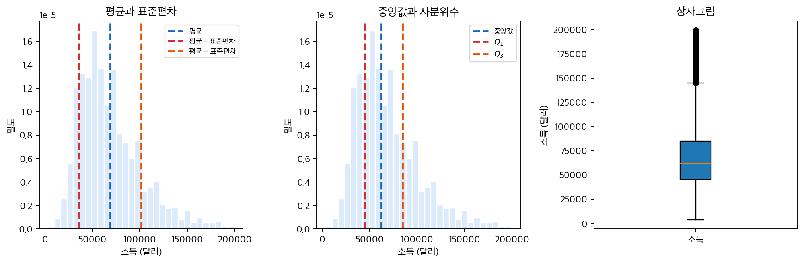

# 사분위범위와 강건 측도

## 개요

**범위**, **사분위범위(IQR)**, **백분위수**는 분산과 표준편차를 보완하는 퍼짐의 측도다. 그중 IQR은 이상치의 영향에 저항하는 **강건한** 측도로 특히 높이 평가된다.

---

## 1. 범위

<div class="defn" markdown>

### 정의 1. 범위 { .dfn }

범위는 가장 단순한 흩어짐의 측도로, 최댓값과 최솟값의 차이다.

$$
\text{범위} = \text{최댓값} - \text{최솟값}
$$

</div>

### 예

자료 70, 85, 90, 95, 100에 대해 범위 $= 100 - 70 = 30$이다.

### 범위 계산하기

<div class="exbox" markdown>

**보기 1.** <span class="diff easy" title="쉬움"></span> 범위는 애초에 **추정량이 아니다.** 대출 소득 자료 $50{,}000$ 개에서 범위가 $195{,}000$ 달러다.

**(1)** 표본크기 $m$ 을 키우면 범위의 기댓값이 **단조증가**함을 보이시오. 그것이 "범위는 모수의 추정량이 될 수 없다"는 말과 어떻게 이어지는가.

**(2)** $m = 100,\ 1000,\ 10000,\ 50000$ 에서 범위와 IQR 을 각각 재어 (1)을 확인하시오. 또 끝점 하나를 지우면 범위가 얼마나 변하는가 — 최솟값 쪽과 최댓값 쪽이 같은가.

</div>

??? success "풀이"

    **(1) 해석적으로.** 크기 $m+1$ 인 표본에서 관측 하나를 빼면 크기 $m$ 인 표본이 되고, **부분집합의 최댓값은 더 작거나 같고 최솟값은 더 크거나 같다.** 그러므로 같은 추출 경로에서

    $$
    R_m \le R_{m+1} \qquad (\text{모든 경로에서})
    $$

    이고 기댓값을 취하면

    $$
    E[R_m] \le E[R_{m+1}]
    $$

    이다. **등호가 되는 것은 $m$ 개만으로도 이미 양 끝점을 잡았을 때뿐**이다.

    이것이 결정적이다. 평균이나 분산은 $m$ 이 커지면 어떤 **고정된 값**으로 수렴하므로 "그 값을 추정한다"고 말할 수 있다. 범위는 수렴하지 않고 계속 자란다. 지지가 무계인 분포라면 $E[R_m] \to \infty$ 이고, 지지가 유계라면 지지의 폭으로 수렴한다. 어느 쪽이든 **$R_m$ 이 추정하는 대상이 $m$ 에 딸려 있다.** "표본의 범위가 $195{,}000$ 이다"는 자료에 대한 서술일 뿐, 모집단의 무엇에 대한 추정이 아니다.

    여기서는 모집단을 $50{,}000$ 개의 경험분포로 보자. 최솟값 $4{,}000$ 이 한 개, 최댓값 $199{,}000$ 이 두 개 있으므로, 크기 $m = 100$ 의 비복원 표본이 범위 $195{,}000$ 을 재현할 확률은

    $$
    P(\text{최솟값 포함}) = \frac{m}{N} = \frac{100}{50000} = 0.002,
    \qquad
    P(\text{최댓값 둘 중 하나 포함}) = 1 - \frac{\binom{N-2}{m}}{\binom{N}{m}} = 0.004
    $$

    의 곱 수준, 곧 $8 \times 10^{-6}$ 이다. **만 번에 한 번도 안 된다.** 그러므로 $m = 100$ 에서 잰 범위는 $195{,}000$ 보다 한참 작을 수밖에 없다.

    **(2) 수치적으로.**

    ```python
    import numpy as np
    import pandas as pd

    url = 'https://raw.githubusercontent.com/gedeck/practical-statistics-for-data-scientists/master/data/loans_income.csv'
    loans_data = pd.read_csv(url)

    # 범위 = 최댓값 - 최솟값. 자료 전체에서 딱 두 점만 쓴다.
    data_range = loans_data['x'].max() - loans_data['x'].min()
    print(f"{data_range = }")

    # 그 두 점이 무엇인지도 함께 보자. 범위가 왜 취약한지 바로 드러난다.
    print(f"최솟값 {loans_data['x'].min():,}  최댓값 {loans_data['x'].max():,}")
    print(f"관측값 {len(loans_data):,}개 중 단 2개가 이 값을 정한다")

    x = loans_data['x'].astype(float).values
    srt = np.sort(x)
    N = len(x)

    # 끝점 하나를 지우면 범위가 어떻게 되는가. 최솟값과 최댓값의 사정이 다르다.
    print(f"\n최솟값 {srt[0]:,.0f} 은 {int((x == srt[0]).sum())}개, "
          f"최댓값 {srt[-1]:,.0f} 은 {int((x == srt[-1]).sum())}개")
    print(f"  최솟값 하나를 지우면 범위 {srt[-1] - srt[1]:,.0f}  ({srt[-1] - srt[1] - data_range:+,.0f})")
    print(f"  최댓값 하나를 지우면 범위 {srt[-1] - srt[0]:,.0f}  (변화 없다 — 같은 값이 둘이다)")

    # (1) 부분표본 크기 m 을 키우면 범위가 자란다. IQR 은 자라지 않는다.
    rng = np.random.default_rng(0)
    B = 200
    print(f"\n부분표본 {B}회 추출 (비복원)")
    print(f"{'m':>7}{'범위 평균':>13}{'범위 sd':>11}{'IQR 평균':>12}{'IQR sd':>10}")
    for m in (100, 1000, 10000, 50000):
        R, I = [], []
        for _ in range(B):
            s = rng.choice(x, m, replace=False)
            R.append(s.max() - s.min())
            I.append(np.subtract(*np.percentile(s, [75, 25])))
        print(f"{m:>7}{np.mean(R):>13,.0f}{np.std(R, ddof=1):>11,.0f}"
              f"{np.mean(I):>12,.0f}{np.std(I, ddof=1):>10,.0f}")

    # m=100 에서 범위가 전체 범위와 같아질 확률을 정확히 센다.
    from math import comb
    m = 100
    p_min = m / N                                   # 최솟값 1개가 뽑힐 확률
    p_max = 1 - comb(N - 2, m) / comb(N, m)         # 최댓값 2개 중 하나라도 뽑힐 확률
    print(f"\nm=100 에서  P(최솟값 포함) = {p_min:.5f},  P(최댓값 중 하나 포함) = {p_max:.5f}")
    print(f"  P(범위 = 195,000) = 두 사건의 곱에 가까운 {p_min * p_max:.3e}")
    ```

    출력:

    ```
    data_range = 195000
    최솟값 4,000  최댓값 199,000
    관측값 50,000개 중 단 2개가 이 값을 정한다

    최솟값 4,000 은 1개, 최댓값 199,000 은 2개
      최솟값 하나를 지우면 범위 192,100  (-2,900)
      최댓값 하나를 지우면 범위 195,000  (변화 없다 — 같은 값이 둘이다)

    부분표본 200회 추출 (비복원)
          m        범위 평균      범위 sd      IQR 평균    IQR sd
        100      157,818     15,374      40,331     5,112
       1000      183,628      4,335      41,029     1,720
      10000      191,544      1,806      40,320       528
      50000      195,000          0      40,000         0

    m=100 에서  P(최솟값 포함) = 0.00200,  P(최댓값 중 하나 포함) = 0.00400
      P(범위 = 195,000) = 두 사건의 곱에 가까운 7.992e-06
    ```

    **(1)이 그대로 드러난다.** 범위의 평균이 $157{,}818 \to 183{,}628 \to 191{,}544 \to 195{,}000$ 으로 **$m$ 과 함께 단조증가한다.** 반면 IQR 의 평균은 $40{,}331 \to 41{,}029 \to 40{,}320 \to 40{,}000$ 으로 **$m$ 과 무관하게 $40{,}000$ 근처에 머문다.** 자료를 더 모으면 IQR 은 같은 값을 더 정확히 맞추고(표준편차가 $5{,}112 \to 1{,}720 \to 528$ 로 줄어든다), 범위는 **다른 값으로 옮겨 간다.**

    표의 증가폭이 몬테카를로 잡음이 아니라는 것도 확인할 수 있다. $m = 100$ 에서 범위의 표준편차가 $15{,}374$ 이므로 $200$ 회 평균의 표준오차는 $15{,}374/\sqrt{200} = 1{,}087$ 인데, $m = 100 \to 1000$ 의 증가폭은 $25{,}810$ 으로 그 **$24$ 배**다.

    $m = 100$ 에서 평균 범위가 $157{,}818$, 곧 전체 범위의 $81\%$ 에 그치는 것도 (1)의 확률 계산과 맞는다. 양 끝을 둘 다 잡을 확률이 $8\times 10^{-6}$ 이니 $200$ 회에서는 한 번도 일어나지 않는다.

    **(2)의 두 번째 물음에서 비대칭이 드러난다.** 최솟값 $4{,}000$ 은 유일하므로 그 하나를 지우면 다음 값이 $6{,}900$ 이라 범위가 $2{,}900$ 줄어든다. 그런데 최댓값 $199{,}000$ 은 **둘** 있어서 하나를 지워도 범위가 전혀 변하지 않는다.

    그래서 "범위의 붕괴점이 $0$ 이다"라는 말은 **정확히는 "한 점으로 범위를 임의로 크게 만들 수 있다"**는 뜻이다. 작게 만드는 쪽은 사정이 다르다. 여기서는 $199{,}000$ 이 둘이므로 범위를 줄이려면 두 점을 손대야 한다. 참고로 $199{,}000$ 이 둘, 그리고 그 다음이 $198{,}425$ 라는 모양새는 이 자료가 어딘가에서 **잘렸을** 가능성을 시사한다. 범위를 보고하기 전에 끝값의 도수를 세어 보아야 하는 이유다.

### 한계

범위는 전적으로 가장 극단적인 두 값에만 의존하므로 이상치에 매우 민감하다. 그 두 극단 사이에서 자료가 어떻게 분포하는지에 대해서는 아무 정보도 주지 않는다.

---

## 2. 사분위범위 (IQR)

<div class="defn" markdown>

### 정의 2. 사분위범위 { .dfn }

IQR은 자료 가운데 50%의 퍼짐을 재어 이상치의 영향을 효과적으로 줄인다. 제3사분위수($Q_3$, 75번째 백분위수)와 제1사분위수($Q_1$, 25번째 백분위수)의 차이다.

$$
\text{IQR} = Q_3 - Q_1
$$

</div>

### 예

자료 1, 3, 4, 6, 7, 9, 11에 대해 $Q_1 = 3$, $Q_3 = 9$이므로 $\text{IQR} = 9 - 3 = 6$이다.

### IQR과 표준편차: 소득 자료

<div class="exbox" markdown>

**보기 2.** <span class="diff easy" title="쉬움"></span> 세 칸을 나란히 놓고 무엇이 읽히는지 보기. 왼쪽은 평균 $\pm$ 표준편차, 가운데는 중앙값과 사분위수, 오른쪽은 같은 사분위수의 상자그림이다.

**(1)** 왼쪽 칸의 "평균 $-$ 표준편차 $= 35{,}888$" 아래에는 자료의 몇 퍼센트가 있는가. 가운데 칸의 $Q_1 = 45{,}000$ 아래에는? 두 눈금 가운데 어느 쪽이 "아래쪽 사분의 일의 경계"라는 이름에 어울리는가.

**(2)** 세 칸이 각각 **가리고 있는 것**은 무엇인가.

</div>

??? success "풀이"

    유도할 "정답"이 있는 문제가 아니다. **그림의 눈금이 무엇을 가리키는지 수치로 확인하는 것**이 이 보기의 전부다.

    ```python
    import matplotlib
    matplotlib.use("Agg")
    import pandas as pd
    import numpy as np
    import matplotlib.pyplot as plt
    from scipy import stats

    # 그림에 한글을 쓰므로 한글 글꼴을 지정한다. 맥이면 'Apple SD Gothic Neo',
    # 윈도우면 'Malgun Gothic', 리눅스면 'NanumGothic' 정도가 무난하다.
    plt.rcParams["font.family"] = "Apple SD Gothic Neo"
    plt.rcParams["axes.unicode_minus"] = False

    url = 'https://raw.githubusercontent.com/gedeck/practical-statistics-for-data-scientists/master/data/loans_income.csv'
    df = pd.read_csv(url)

    # 같은 자료를 두 짝의 측도로 요약한다.
    #   비강건한 짝: 평균 ± 표준편차   (모든 관측값을 다 쓴다)
    #   강건한 짝  : 중앙값, Q1, Q3    (순위만 쓴다)
    mean_income = df['x'].mean()
    median_income = df['x'].median()
    std_dev = df['x'].std()
    q1 = df['x'].quantile(0.25)
    q3 = df['x'].quantile(0.75)
    iqr = stats.iqr(df['x'])

    fig, (ax1, ax2, ax3) = plt.subplots(1, 3, figsize=(12, 4))

    # 왼쪽: 평균 ± 표준편차.
    # 소득은 오른쪽으로 치우쳐 있어 평균이 봉우리보다 오른쪽에 놓이고,
    # "평균 - 표준편차"가 자료가 별로 없는 곳을 가리킨다.
    ax1.hist(df['x'], bins=30, density=True, color="#DCEBFB", edgecolor="white")
    ax1.axvline(mean_income, color="#1565C0", linestyle='--', lw=2, label="평균")
    ax1.axvline(mean_income - std_dev, color="#D32F2F", linestyle='--', lw=2,
                label="평균 - 표준편차")
    ax1.axvline(mean_income + std_dev, color="#E65100", linestyle='--', lw=2,
                label="평균 + 표준편차")
    ax1.legend(fontsize=8)
    ax1.set_title("평균과 표준편차")
    ax1.set_xlabel("소득 (달러)")
    ax1.set_ylabel("밀도")

    # 가운데: 중앙값과 사분위수.
    # Q1과 Q3 사이가 정확히 자료의 가운데 50%이며, 치우침에 흔들리지 않는다.
    ax2.hist(df['x'], bins=30, density=True, color="#DCEBFB", edgecolor="white")
    ax2.axvline(median_income, color="#1565C0", linestyle='--', lw=2, label="중앙값")
    ax2.axvline(q1, color="#D32F2F", linestyle='--', lw=2, label="$Q_1$")
    ax2.axvline(q3, color="#E65100", linestyle='--', lw=2, label="$Q_3$")
    ax2.legend(fontsize=8)
    ax2.set_title("중앙값과 사분위수")
    ax2.set_xlabel("소득 (달러)")
    ax2.set_ylabel("밀도")

    # 오른쪽: 같은 사분위수를 상자그림으로 옮긴 것
    ax3.boxplot(df['x'], vert=True, patch_artist=True, labels=["소득"])
    ax3.set_title("상자그림")
    ax3.set_ylabel("소득 (달러)")

    fig.tight_layout()
    fig.savefig("robust_63.png", dpi=170, facecolor="white", bbox_inches="tight")

    # 두 짝의 숫자를 나란히 찍어 비교한다
    print(f"평균   {mean_income:>9,.0f}   표준편차 {std_dev:>9,.0f}")
    print(f"중앙값 {median_income:>9,.0f}   IQR      {iqr:>9,.0f}")
    print(f"평균 - 표준편차 = {mean_income - std_dev:>9,.0f}   "
          f"(최솟값 {df['x'].min():,}보다 큰가? "
          f"{'예' if mean_income - std_dev > df['x'].min() else '아니오'})")

    # 그림의 눈금이 실제로 어디를 가리키는지 센다.
    v = df['x'].astype(float).values
    print(f"\n{'눈금':>12}{'값':>12}{'그 아래 자료 비율':>18}")
    for name, val in (("평균 - s", mean_income - std_dev), ("Q1", q1),
                      ("평균", mean_income), ("중앙값", median_income),
                      ("Q3", q3), ("평균 + s", mean_income + std_dev)):
        print(f"{name:>12}{val:>12,.0f}{np.mean(v < val):>18.4f}")
    print(f"\n[평균-s, 평균+s] 안의 비율 {np.mean((v >= mean_income - std_dev) & (v <= mean_income + std_dev)):.4f}"
          f"  (정규라면 0.6827)")
    print(f"[Q1, Q3]          안의 비율 {np.mean((v >= q1) & (v <= q3)):.4f}  (정의상 0.5)")
    print(f"\n왜도 {stats.skew(v):.4f}  초과첨도 {stats.kurtosis(v):.4f}")
    print(f"IQR/1.349 = {iqr / 1.349:,.0f}  대  s = {std_dev:,.0f}   비 {std_dev / (iqr / 1.349):.4f}")
    print(f"45,000 인 관측값 {int((v == 45000).sum()):,}개, 85,000 인 관측값 {int((v == 85000).sum()):,}개")
    ```

    출력:

    ```
    평균      68,761   표준편차    32,872
    중앙값    62,000   IQR         40,000
    평균 - 표준편차 =    35,888   (최솟값 4,000보다 큰가? 예)

              눈금           값        그 아래 자료 비율
          평균 - s      35,888            0.1275
              Q1      45,000            0.2423
              평균      68,761            0.5762
             중앙값      62,000            0.4976
              Q3      85,000            0.7350
          평균 + s     101,633            0.8544

    [평균-s, 평균+s] 안의 비율 0.7269  (정규라면 0.6827)
    [Q1, Q3]          안의 비율 0.5100  (정의상 0.5)

    왜도 1.0488  초과첨도 1.0808
    IQR/1.349 = 29,652  대  s = 32,872   비 1.1086
    45,000 인 관측값 1,300개, 85,000 인 관측값 863개
    ```

    

    **(1) $Q_1$ 쪽이 이름에 어울린다.** "평균 $-$ 표준편차 $= 35{,}888$" 아래에는 자료의 **$12.75\%$** 밖에 없다. 그 눈금은 사분의 일도 아니고 $68\%$ 규칙의 $16\%$ 도 아닌 어중간한 자리를 가리킨다. 반면 $Q_1 = 45{,}000$ 아래에는 $24.23\%$ 가 있다. $25\%$ 에 정확히 떨어지지 않는 것은 **$45{,}000$ 인 관측이 $1{,}300$ 개나 있어서**다. 동점 덩어리가 $25\%$ 지점을 걸치고 있으므로 "미만"이 $24.23\%$, "이하"가 $26.83\%$ 다. 어느 쪽으로 세도 $12.75\%$ 와는 비교가 안 된다.

    왼쪽 칸의 눈금이 어긋나는 까닭은 **분포가 치우쳤기 때문**이다. 왜도가 $1.0488$ 로 오른쪽 꼬리가 길어 평균 $68{,}761$ 이 중앙값 $62{,}000$ 보다 $6{,}761$ 달러 위에 있고(평균 아래에 $57.62\%$, 중앙값 아래에 $49.76\%$), 표준편차 $32{,}872$ 도 그 꼬리에 부풀려져 있다. 그래서 평균에서 한 걸음 내려가면 자료가 희박한 곳까지 내려가 버린다.

    구간으로 보아도 같다. $[\text{평균}-s,\ \text{평균}+s]$ 는 자료의 $72.69\%$ 를 담는데 정규분포라면 $68.27\%$ 여야 한다. $[Q_1, Q_3]$ 는 $51.00\%$ 로 정의상의 $50\%$ 와 거의 같다(차이는 역시 동점 때문이다). **강건한 짝은 "자료의 가운데 절반"이라는 약속을 지키고, 고전적 짝은 지키지 않는다.**

    **(2) 세 칸이 각각 다른 것을 가린다.**

    **왼쪽 칸은 치우침을 가린다.** 히스토그램 자체는 오른쪽 꼬리를 보여 주지만, 그 위에 얹힌 세 세로선은 **대칭으로 그려진다.** 평균을 가운데 두고 양쪽으로 똑같이 $32{,}872$ 씩 뻗으므로, 눈은 "대칭인 분포에 중심과 폭을 표시한 그림"으로 읽게 된다. 실제로는 왼쪽 선 아래에 $12.75\%$, 오른쪽 선 위에 $14.56\%$ 가 있어 비대칭이다.

    **가운데 칸은 꼬리를 가린다.** $Q_1$ 과 $Q_3$ 가 가운데 $50\%$ 를 정확히 잡아 주는 대신, 그 밖의 $50\%$ 에 대해서는 아무 말도 하지 않는다. 소득 자료에서 정작 중요한 질문("상위 $1\%$ 가 어디에 있는가")에 답하지 못한다. $Q_3 = 85{,}000$ 위에 $26.5\%$ 가 있고 그들이 $199{,}000$ 까지 퍼져 있다는 사실은 이 세 선에 담기지 않는다.

    **오른쪽 칸은 분포의 모양 전체를 가린다.** 상자그림은 가운데 칸의 세 수에 수염과 이상치 점을 더한 것이고, **히스토그램이 보여 주던 봉우리의 생김새를 버린다.** 치우친 분포인지 이봉인지 구별되지 않는다. 그 대신 여러 집단을 나란히 놓고 견주기에는 상자그림이 훨씬 낫다. 한 변수만 볼 때 상자그림은 히스토그램보다 **덜** 보여 준다.

    끝으로 두 척도를 같은 눈금에 올려 보면 $\text{IQR}/1.349 = 29{,}652$ 대 $s = 32{,}872$ 로 비가 $1.1086$ 이다(정규자료에서 $\text{IQR} \approx 1.349\,\sigma$ 이므로 $1.349$ 로 나누면 $\sigma$ 와 눈금이 맞는다). **$1$ 에서 $11\%$ 벗어났다는 것이 "꼬리가 정규보다 무겁다"의 정량적 표현**이고, 초과첨도 $1.0808$ 이 같은 말을 한다. 세 칸의 그림에서 받은 인상을 수 하나로 바꾼 것이다.

### 사분위수 계산하기

<div class="exbox" markdown>

**보기 3.** <span class="diff easy" title="쉬움"></span> 사분위수는 보간법에 따라 달라진다. 그런데 이 자료에서는 달라지지 않는다. $Q_1 = 45{,}000$, $Q_3 = 85{,}000$, IQR $= 40{,}000$ 이 깔끔한 수로 떨어지는 까닭을 본다.

**(1)** `quantile(0.25)` 의 기본 보간법 `linear` 이 쓰는 순서통계량의 위치를 $n = 50{,}000$ 에 대해 계산하시오. 보간이 실제로 일어나는가.

**(2)** 보간법을 `lower`, `higher`, `midpoint`, `nearest` 로 바꾸면 $Q_1$, $Q_3$, IQR 이 달라지는가. 왜 그런가.

</div>

??? success "풀이"

    **(1) 해석적으로.** `linear`(넘파이·판다스의 기본값)은 $p$ 분위수를 순서통계량의 **$h = (n-1)p$ 번째 위치**(0-기반)에서 읽고, 정수가 아니면 양옆을 선형보간한다. $n = 50{,}000$ 이므로

    $$
    h_{0.25} = 49999 \times 0.25 = 12499.75, \qquad
    h_{0.75} = 49999 \times 0.75 = 37499.25
    $$

    다. 둘 다 정수가 아니므로 **보간식이 작동한다.** $Q_1$ 은 $x_{(12500)}$ 과 $x_{(12501)}$ 을 $0.75 : 0.25$ 로 섞고, $Q_3$ 은 $x_{(37500)}$ 과 $x_{(37501)}$ 을 $0.25 : 0.75$ 로 섞는다.

    **그런데 섞을 두 값이 같으면 보간이 아무 일도 하지 않는다.** 아래에서 확인하겠지만 $x_{(12500)} = x_{(12501)} = 45{,}000$ 이고 $x_{(37500)} = x_{(37501)} = 85{,}000$ 이다. 그러므로 보간식이 돌아가기는 해도 결과는 동점 값 그 자체다.

    **(2) 예측.** 다섯 보간법은 모두 $h$ 를 끼는 두 순서통계량 사이에서 값을 고른다. 두 값이 같으면 **어느 규칙을 써도 같은 답**이 나올 수밖에 없다. 그러므로 $Q_1$, $Q_3$, IQR 이 다섯 방법에서 모두 같아야 한다.

    까닭은 자료의 생김새다. $45{,}000$ 인 관측이 $1{,}300$ 개, $85{,}000$ 인 관측이 $863$ 개 있다. 보고된 소득이 천 단위로 몰려 있어 $50{,}000$ 개가 고유값 $5{,}271$ 개에 뭉쳐 있고, 사분위수 자리마다 두꺼운 동점 덩어리가 걸쳐 있다.

    **(3) 수치적으로.**

    ```python
    import numpy as np
    import pandas as pd

    url = 'https://raw.githubusercontent.com/gedeck/practical-statistics-for-data-scientists/master/data/loans_income.csv'
    df = pd.read_csv(url)

    # quantile(p)는 자료의 p 비율이 그 아래에 놓이는 값을 돌려준다.
    q1 = df['x'].quantile(0.25)      # 아래에서 25%
    q2 = df['x'].median()            # 아래에서 50% = 중앙값
    q3 = df['x'].quantile(0.75)      # 아래에서 75%

    print(f"{q1 = }")
    print(f"{q2 = }")  # 중앙값
    print(f"{q3 = }")

    # IQR은 Q3 - Q1. 자료의 가운데 절반이 차지하는 폭이다.
    print(f"IQR = {q3 - q1:,.0f}")

    # (1) linear 이 읽는 위치와 그 양옆의 순서통계량
    x = df['x'].astype(float).values
    srt = np.sort(x)
    n = len(x)
    for p in (0.25, 0.75):
        h = (n - 1) * p
        lo, hi = int(np.floor(h)), int(np.floor(h)) + 1
        print(f"\np={p}: h=(n-1)p={h}")
        print(f"  x_({lo+1}) = {srt[lo]:,.0f},  x_({hi+1}) = {srt[hi]:,.0f}"
              f"   {'같다 -> 보간해도 그대로' if srt[lo] == srt[hi] else '다르다 -> 보간이 값을 바꾼다'}")

    # (2) 보간법을 바꿔 본다
    print(f"\n{'method':>10}{'Q1':>12}{'Q3':>12}{'IQR':>12}")
    for meth in ("linear", "lower", "higher", "midpoint", "nearest"):
        a, b = np.percentile(x, [25, 75], method=meth)
        print(f"{meth:>10}{a:>12,.0f}{b:>12,.0f}{b - a:>12,.0f}")

    print(f"\n고유값 {len(np.unique(x)):,}개 / 관측값 {n:,}개")
    print(f"  45,000 인 관측값 {int((x == 45000).sum()):,}개,"
          f"  85,000 인 관측값 {int((x == 85000).sum()):,}개")
    ```

    출력:

    ```
    q1 = 45000.0
    q2 = 62000.0
    q3 = 85000.0
    IQR = 40,000

    p=0.25: h=(n-1)p=12499.75
      x_(12500) = 45,000,  x_(12501) = 45,000   같다 -> 보간해도 그대로

    p=0.75: h=(n-1)p=37499.25
      x_(37500) = 85,000,  x_(37501) = 85,000   같다 -> 보간해도 그대로

        method          Q1          Q3         IQR
        linear      45,000      85,000      40,000
         lower      45,000      85,000      40,000
        higher      45,000      85,000      40,000
      midpoint      45,000      85,000      40,000
       nearest      45,000      85,000      40,000

    고유값 5,271개 / 관측값 50,000개
      45,000 인 관측값 1,300개,  85,000 인 관측값 863개
    ```

    **(1)과 (2)가 모두 맞는다.** 보간 위치는 $12499.75$ 와 $37499.25$ 로 정수가 아니지만 양옆의 순서통계량이 같은 값이라, 다섯 보간법이 전부 $Q_1 = 45{,}000$, $Q_3 = 85{,}000$, IQR $= 40{,}000$ 을 준다.

    **그래서 이 자료에서 "보간법을 밝힐 필요가 없다"는 결론은 맞다. 그러나 그것은 자료의 성질이고 일반 규칙이 아니다.** 보간법이 답을 바꾸는 조건이 분명하다.

    - **$n$ 이 작을 때.** 분위수 자리에 동점이 없어 양옆 값이 벌어진다. [중앙값 절대편차](median_absolute_deviation.md) 쪽 보기 5 에서 $n = 6$ 자료의 답이 보간법에 따라 두 배까지 갈리는 것을 본다.
    - **고유값이 많을 때.** 연속 측정값이면 동점이 거의 없으므로 거의 늘 보간이 값을 바꾼다. 여기서는 $50{,}000$ 개가 고유값 $5{,}271$ 개에 뭉쳐 있어($관측 하나당 평균 9.5$ 개 동점) 안전했다.
    - **꼬리 쪽 분위수를 볼 때.** $p = 0.99$ 나 $p = 0.001$ 처럼 끝으로 가면 동점이 얇아지고 $h$ 를 끼는 두 값의 간격이 커진다.

    **실무의 처방은 간단하다. 분위수를 보고하기 전에 그 자리의 동점 수를 세어 보라.** 동점이 두껍다면 보간법은 아무 영향이 없고, 얇다면 `method` 를 명시해야 재현된다.

    한편 **동점이 두껍다는 사실 자체가 정보**다. 소득이 $45{,}000$ 이라고 답한 사람이 $1{,}300$ 명이라는 것은 실제 소득이 그 값이었다는 뜻이 아니라 **보고할 때 천 단위로 반올림했다**는 뜻이다. 이 쏠림은 분위수에는 거의 영향을 주지 않지만, 분포의 모양을 잘게 보려 할 때는 걸림돌이 된다.

---

## 3. 백분위수

$p$번째 백분위수는 자료의 $p\%$가 그 아래에 떨어지는 값이다.

### 백분위수와 십분위수

$$
\begin{array}{llll}
D_1 = P_{10}, & D_2 = P_{20}, & \ldots, & D_9 = P_{90}
\end{array}
$$

### 백분위수와 사분위수

$$
Q_1 = P_{25}, \quad Q_2 = P_{50}, \quad Q_3 = P_{75}
$$

### 백분위수와 중앙값

$$
\text{중앙값} = Q_2 = D_5 = P_{50}
$$

---

## 4. 퍼짐 측도의 비교

| 측도 | 강건성 | 담는 정보 | 적합한 상황 |
|---|---|---|---|
| 범위 | 강건하지 않음(극단적으로 민감) | 두 값만 | 빠른 개관 |
| IQR | 강건함(바깥 50%를 무시) | 가운데 50%의 퍼짐 | 치우친 자료, 이상치가 많은 자료 |
| 표준편차 | 강건하지 않음(이상치에 민감) | 모든 자료점 | 대칭이고 정규에 가까운 자료 |

### 실제 사례

**소득 변동성:** 범위는 최상위와 최하위의 격차를 보여준다. IQR은 중간 소득층이 서로 얼마나 다른지를 드러낸다. 표준편차는 전반적인 소득 불평등을 정량화한다.

**학생 시험 점수:** 표준편차가 낮으면 대부분의 학생이 비슷한 점수를 받았다는 뜻이다. IQR이 크면 중간 성취층 안에서 편차가 크다는 뜻일 수 있다.

**주식시장 변동성:** 분산과 표준편차는 금융에서 표준적인 위험 측도다. 표준편차가 크면 가격 변동이 크고 투자 위험이 높다.

---

## 5. 실무적 고려사항

**표본 대 모집단:** 분산과 표준편차를 계산할 때 표본에 대해서는 불편추정값을 얻기 위해 $n-1$(베셀 보정)을 쓴다.

**자료의 분포:** 정규분포에서는 표준편차가 경험 규칙을 통해 깔끔한 해석을 갖는다. 치우친 분포에서는 중앙값과 짝지은 IQR이 더 의미 있는 요약을 제공한다.

**보완적 사용:** 실무에서는 평균 ± 표준편차와 함께 중앙값과 IQR을 모두 보고하면 독자에게 완전한 그림을 준다. 분포의 모양을 모르거나 치우쳤을 가능성이 있을 때 특히 그렇다.

## 연습문제

<div class="drillbox" markdown>

**연습문제 1.** <span class="diff easy" title="쉬움"></span>
자료 $\{2, 4, 5, 7, 8, 9, 11, 13, 15, 80\}$을 생각하자. 범위, IQR, 표본표준편차를 계산하라. 80이라는 이상치에 가장 크게 영향받는 측도는 무엇인가?

</div>

??? success "풀이"
    **범위:** $80 - 2 = 78$.

    **IQR:** 정렬된 값이 $n = 10$개이므로 아래쪽 절반은 $\{2, 4, 5, 7, 8\}$, 위쪽 절반은 $\{9, 11, 13, 15, 80\}$이다. 각 절반의 중앙값을 취하면 $Q_1 = 5$, $Q_3 = 13$이고 $\text{IQR} = 13 - 5 = 8$이다.

    **표준편차:** 평균은 $\bar{x} = (2+4+5+7+8+9+11+13+15+80)/10 = 154/10 = 15.4$이다. 제곱편차의 합은 $(2-15.4)^2 + \cdots + (80-15.4)^2 = 179.56 + 129.96 + 108.16 + 70.56 + 54.76 + 40.96 + 19.36 + 5.76 + 0.16 + 4173.16 = 4782.4$이다. 따라서 $s = \sqrt{4782.4/9} \approx \sqrt{531.38} \approx 23.05$이다.

    **범위**가 가장 극적으로 영향받는다(이상치가 없었다면 13이었을 것이 78이 되었다). **표준편차**도 크게 부풀려진다(이상치가 없으면 대략 4.27인데 23.05가 되었다). **IQR**은 자료 가운데 50%에만 의존하므로 이상치의 영향을 받지 않는다.

    **사분위수는 계산 방법에 따라 달라진다.** 위에서 쓴 것은 아래·위 절반의 중앙값을 취하는 튜키 방식이다. `numpy` 와 `pandas` 의 기본값은 선형보간이라 같은 자료에서 $Q_1 = 5.5$, $Q_3 = 12.5$, $\text{IQR} = 7$이 나온다.

    ```python
    import numpy as np

    print(np.percentile([2, 4, 5, 7, 8, 9, 11, 13, 15, 80], [25, 75]))
    ```

    ```
    [ 5.5 12.5]
    ```

    어느 쪽도 틀린 것이 아니라 **정의가 다를 뿐**이다. 자료가 적을수록 차이가 커지고, $1.5 \times \text{IQR}$ 울타리로 이상치를 판정할 때 결론이 갈릴 수 있으므로 어느 방법을 썼는지 밝혀야 한다. `np.percentile` 의 `method=` 인자로 아홉 가지 정의를 고를 수 있다.

<div class="drillbox" markdown>

**연습문제 2.** <span class="diff easy" title="쉬움"></span>
IQR의 붕괴점이 25%인 반면 범위의 붕괴점이 0%인 이유를 설명하라.

</div>

??? success "풀이"
    통계량의 **붕괴점(breakdown point)** 은 그 통계량이 무한대가 되거나 무의미해지기 전까지 임의로 극단적인 값으로 바꿀 수 있는 자료의 비율이다.

    **범위**는 최솟값과 최댓값이라는 정확히 두 값에만 의존한다. 관측값 하나(최솟값 또는 최댓값)만 극단값으로 바꿔도 범위가 임의로 달라진다. 따라서 오염된 관측값 하나($n \to \infty$일 때 비율 $1/n \to 0\%$)만으로 범위를 임의로 크게 만들 수 있다. 붕괴점은 0%다.

    **IQR**은 $Q_1$과 $Q_3$에 의존하며, 이들은 자료의 가운데 부분이 결정한다. $Q_1$이나 $Q_3$을 임의로 이동시키려면 관측값의 25%보다 많이(아래쪽 25% 또는 위쪽 25%) 오염시켜야 한다. 따라서 IQR은 붕괴하기 전까지 최대 25%의 오염을 견딜 수 있다.

<div class="drillbox" markdown>

**연습문제 3.** <span class="diff med" title="중간"></span>
어떤 자료의 $Q_1 = 20$, 중앙값 $= 30$, $Q_3 = 55$이다. 원자료를 보지 않고 이 세 수만으로 분포의 모양에 대해 무엇을 추론할 수 있는가?

</div>

??? success "풀이"
    $Q_1$에서 중앙값까지의 거리는 $30 - 20 = 10$이고, 중앙값에서 $Q_3$까지의 거리는 $55 - 30 = 25$다. IQR의 위쪽 절반이 아래쪽 절반보다 훨씬 넓으므로 이 분포는 **오른쪽으로 치우쳐** 있다(양의 왜도). 자료가 중앙값 아래보다 위쪽으로 더 넓게 퍼져 있으며, 이는 오른쪽 꼬리가 더 길다는 뜻이다.

<div class="drillbox" markdown>

**연습문제 4.** <span class="diff easy" title="쉬움"></span>
표준정규분포 $N(0,1)$에서 이론적 사분위수는 $Q_1 \approx -0.6745$, $Q_3 \approx 0.6745$이다. 이론적 IQR을 계산하고 표준편차 $\sigma = 1$과 비교하라. 비 $\text{IQR}/\sigma$는 얼마인가?

</div>

??? success "풀이"
    이론적 IQR은

    $$
    \text{IQR} = Q_3 - Q_1 = 0.6745 - (-0.6745) = 1.349
    $$

    이고, 그 비는

    $$
    \frac{\text{IQR}}{\sigma} = \frac{1.349}{1} = 1.349
    $$

    이다. 즉 어떤 정규분포에서든 $\text{IQR} \approx 1.349\sigma$이다. 자료가 대략 정규일 때 IQR로 표준편차를 추정하는 데 이 관계를 쓸 수 있다: $\hat{\sigma} \approx \text{IQR}/1.349$.

<div class="drillbox" markdown>

**연습문제 5.** <span class="diff med" title="중간"></span>
강건한 척도 추정량으로서 **절단 표준편차**(위아래 $p\%$를 제거한 뒤 계산)와 IQR을 비교하라. 절충 관계는 무엇인가?

</div>

??? success "풀이"
    **절단 표준편차:** 자료를 정렬해 위쪽 $p\%$와 아래쪽 $p\%$를 제거하고 남은 $1 - 2p$ 비율에 대해 표준편차를 계산한다. 절충 관계는 다음과 같다.

    - 붕괴점 $= \min(p, 0.5)$. $p = 0.25$이면 IQR과 같다.
    - 많은 관측값(가운데 $1 - 2p$)의 정보를 쓰므로 분위수 추정값 두 개만 쓰는 IQR보다 일반적으로 더 효율적이다.
    - 매끄럽다. 자료가 조금 흔들려도 값이 조금만 변한다(순서통계량 두 개만의 함수인 IQR과 대조된다).
    - $p$를 골라야 하고 기준 분포에서 일치성을 갖도록 척도를 다시 맞춰야 한다.

    **IQR:** $Q_3 - Q_1$.

    - 붕괴점 $= 0.25$(사분위수 하나만 오염시키면 된다).
    - 계산이 더 간단하고 상자그림을 통해 대부분의 분석가에게 익숙하다.
    - 정규성 아래에서 통계적 효율이 절단 표준편차보다 낮다(약 37%).

    **실무적 권고:** 기술적 요약에는 IQR로 충분하고 표준적이다. 이후의 통계 절차에 들어가는 추정량으로 쓸 때는(분산이 작은 것이 중요할 때는) 절단 표준편차나, 더 나아가 M-추정량이 선호된다.

<div class="drillbox" markdown>

**연습문제 6.** <span class="diff med" title="중간"></span>
로그 척도에서 모수가 $(\mu, \sigma^2)$인 **로그정규분포**에서는 분산과 IQR이 극적으로 어긋날 수 있다. 그 이유와, 치우친 자료에서 퍼짐을 보고하는 데 이것이 뜻하는 바를 논하라.

</div>

??? success "풀이"
    $Y \sim N(\mu, \sigma^2)$에 대해 $X = \exp(Y)$이면 $X$는 평균이 $e^{\mu + \sigma^2/2}$이고 분산이 $(e^{\sigma^2} - 1) e^{2\mu + \sigma^2}$인 로그정규분포를 따른다.

    분산은 대략 $e^{2\sigma^2}$처럼 커지는데, $\sigma$가 중간 정도만 되어도 아주 커질 수 있다(예: $\sigma = 2$이면 $e^{\sigma^2} - 1 \approx 54$라는 배율이 $e^{2\mu+\sigma^2}$에 다시 곱해진다). IQR은 로그정규분포의 25번째와 75번째 백분위수에만 의존하며 이는 $\exp(\mu \pm 0.6745\sigma)$이다. 따라서 IQR은 $e^{0.6745\sigma}$ 정도로만 커져 표준편차보다 훨씬 느리게 증가한다.

    **구체적인 예:** $\mu = 0$, $\sigma = 2$일 때

    - $X$의 평균 $\approx 7.39$, 분산 $= (e^4 - 1)e^4 \approx 2926$, 표준편차 $\approx 54.1$.
    - $Q_1 \approx 0.259$, $Q_3 \approx 3.85$, IQR $\approx 3.59$.

    표준편차가 IQR의 약 $15$배다. "평균 $\pm$ 표준편차"를 $7.4 \pm 54$로 보고하는 것은 오도한다. 그 구간이 양의 확률변수에는 불가능한 음수를 포함하고, 표준편차가 전형적인 척도가 아니라 긴 오른쪽 꼬리에 지배되기 때문이다.

    **치우친 자료의 보고 권고:** 평균 ± 표준편차 대신 언제나 **중앙값 + IQR**을, 더 나아가 **중앙값 + 10번째 및 90번째 백분위수**를 보고하라. 여러 분야(소득 보고, 약물동태학, 지진 규모)가 정확히 이 이유로 로그 척도에서 작업한다.

<div class="drillbox" markdown>

**연습문제 7.** <span class="diff med" title="중간"></span>
연습문제 4가 정규분포에서 $\mathrm{IQR}/\sigma$의 이론값을 구했다면, 실제로 **추정량으로서** 얼마나 좋은가? 여러 척도 추정량의 효율을 비교하라.

</div>

??? success "풀이"
    각 추정량에 일치성 상수를 곱해 정규분포에서 $\sigma$를 겨냥하도록 맞춘 뒤 MSE를 비교한다.

    ```python
    import numpy as np

    rng = np.random.default_rng(0)
    B, n = 100_000, 20
    X = rng.normal(0, 1, (B, n))

    estimators = {
        "표본표준편차 s": X.std(axis=1, ddof=1),
        "IQR / 1.349":  np.subtract(*np.percentile(X, [75, 25], axis=1)) / 1.349,
        "MAD x 1.4826": 1.4826 * np.median(
            np.abs(X - np.median(X, axis=1, keepdims=True)), axis=1),
        "범위 / 3.735":  (X.max(1) - X.min(1)) / 3.735,
    }

    base = None
    print(f"정규 N(0,1), n={n}")
    print(f"{'추정량':<16}{'평균':>9}{'표준편차':>11}{'MSE':>11}{'상대효율':>11}")
    for name, v in estimators.items():
        mse = np.mean((v - 1) ** 2)
        base = base or mse
        print(f"{name:<16}{v.mean():>9.4f}{v.std():>11.4f}{mse:>11.5f}{base / mse:>11.4f}")
    ```

    출력:

    ```
    정규 N(0,1), n=20
    추정량                    평균       표준편차        MSE       상대효율
    표본표준편차 s           0.9867     0.1611    0.02614     1.0000
    IQR / 1.349        0.9320     0.2383    0.06140     0.4258
    MAD x 1.4826       0.9583     0.2495    0.06399     0.4085
    범위 / 3.735         1.0002     0.1953    0.03815     0.6853
    ```

    | 추정량 | 상대효율 |
    |---|---|
    | 표본표준편차 $s$ | $1.000$ |
    | 범위 $/3.735$ | $0.685$ |
    | IQR $/1.349$ | $0.426$ |
    | MAD $\times 1.4826$ | $0.409$ |

    **정규분포에서는 $s$가 최선이다.** 당연한데, $s$가 정규모형의 최대가능도추정량(에 가까운 것)이기 때문이다. 강건한 추정량들은 정규에서 $40\%$ 남짓의 효율에 그친다.

    **놀라운 것은 범위다.** $n = 20$에서 효율 $0.685$로 IQR과 MAD보다 낫다. 붕괴점이 $0$인 추정량이 어떻게 그럴 수 있는가?

    답은 **작은 표본에서는 범위가 자료를 거의 다 쓰기 때문**이다. $n = 20$이면 최댓값과 최솟값이 표본 전체에 대해 상당한 정보를 담는다. 반면 IQR은 두 분위수만, MAD는 중앙값 하나의 거리만 본다.

    **그러나 이 우위는 오래가지 않는다.** 연습문제 8이 그것을 다룬다.

    **효율과 붕괴점은 서로 맞바꾸는 관계다.**

    | 추정량 | 정규 효율 | 붕괴점 |
    |---|---|---|
    | $s$ | $1.000$ | $0\%$ |
    | 범위 | $0.685$ | $0\%$ |
    | IQR | $0.426$ | $25\%$ |
    | MAD | $0.409$ | $50\%$ |

    범위는 **양쪽 모두 나쁜** 유일한 항목이다. 효율이 $s$보다 낮으면서 붕괴점도 $0$이다. $n$이 커지면 효율마저 무너지므로(연습문제 8), **범위는 어떤 상황에서도 최선이 아니다.** 그럼에도 널리 쓰이는 이유는 계산이 쉽고 직관적이기 때문이며, 품질관리의 $\bar{X}$–$R$ 관리도가 그 유산이다. $\square$

<div class="drillbox" markdown>

**연습문제 8.** <span class="diff med" title="중간"></span>
연습문제 2가 범위의 붕괴점이 $0$임을 다루었다면, 더 근본적인 문제가 있다. **범위는 $n$이 커질수록 커진다.** 이를 확인하고 함의를 논하라.

</div>

??? success "풀이"
    ```python
    import numpy as np

    rng = np.random.default_rng(0)
    d2 = {2: 1.128, 5: 2.326, 10: 3.078, 20: 3.735, 50: 4.498, 100: 5.015, 1000: 6.483}

    print(f"{'n':>6}{'E[범위]':>11}{'범위 추정 MSE':>16}{'s 의 MSE':>12}{'범위의 상대효율':>17}")
    for n, c in d2.items():
        X = rng.normal(0, 1, (60_000, n))
        r = (X.max(1) - X.min(1)) / c
        s = X.std(axis=1, ddof=1)
        print(f"{n:>6}{(X.max(1) - X.min(1)).mean():>11.4f}{np.mean((r - 1) ** 2):>16.5f}"
              f"{np.mean((s - 1) ** 2):>12.5f}{np.mean((s - 1) ** 2) / np.mean((r - 1) ** 2):>17.4f}")
    ```

    출력:

    ```
         n      E[범위]       범위 추정 MSE     s 의 MSE         범위의 상대효율
         2     1.1334         0.57777     0.40699           0.7044
         5     2.3293         0.13812     0.11956           0.8657
        10     3.0792         0.06727     0.05507           0.8187
        20     3.7332         0.03785     0.02604           0.6881
        50     4.4999         0.02106     0.01019           0.4837
       100     5.0139         0.01466     0.00509           0.3471
      1000     6.4842         0.00591     0.00051           0.0857
    ```

    **$\sigma = 1$로 고정인데 기대 범위는 $n$과 함께 계속 커진다.** $n = 2$에서 $1.13$, $n = 1000$에서 $6.48$이다.

    **왜인가.** 범위는 두 극단 순서통계량의 차이다. 정규분포에서 $n$개 중 최댓값의 기대값은 대략 $\sigma\sqrt{2\ln n}$으로 자란다. 표본이 많아질수록 더 극단적인 값을 만날 기회가 늘기 때문이다. **범위는 $\sigma$를 추정하는 것이 아니라 "$n$개 중 가장 극단적인 두 값이 얼마나 떨어져 있는가"를 잰다.**

    그래서 $\sigma$의 추정값으로 쓰려면 $n$에 의존하는 상수 $d_2(n)$으로 나누어야 한다. 표의 $c$ 값이 그것이며, 품질관리 교재의 $d_2$ 표가 바로 이것이다.

    **효율이 $n$과 함께 무너진다.**

    | $n$ | 범위의 상대효율 |
    |---|---|
    | $5$ | $0.866$ |
    | $20$ | $0.688$ |
    | $100$ | $0.347$ |
    | $1000$ | $\mathbf{0.086}$ |

    $n = 1000$에서 범위는 $s$보다 **$12$배 비효율적**이다. 관측 $998$개를 통째로 버리고 두 개만 쓰기 때문이며, 그 두 개가 하필 가장 신뢰할 수 없는 관측이다.

    **실무 지침.**

    - **$n \le 10$ 정도의 아주 작은 표본**에서는 범위가 쓸 만하다. 품질관리에서 $n = 5$짜리 부분군의 $R$ 관리도가 여전히 쓰이는 이유다.
    - **그 이상에서는 쓰지 마라.** 특히 서로 다른 $n$의 집단을 비교할 때 범위를 쓰면 **큰 집단이 더 퍼진 것처럼 보인다.** 실제로는 표본이 더 많을 뿐이다.
    - **극단값 자체가 관심사일 때는 이야기가 다르다.** 최대 홍수 수위나 최대 부하는 범위가 아니라 극단값 이론으로 다룬다(1장 연습문제 8 참고). $\square$

<div class="drillbox" markdown>

**연습문제 9.** <span class="diff med" title="중간"></span>
연습문제 5의 절단 표준편차를 실제로 구현하고 **윈저화 표준편차**와 비교하라. 두 방법 모두 그대로 쓰면 안 되는 이유는 무엇인가?

</div>

??? success "풀이"
    ```python
    import numpy as np

    rng = np.random.default_rng(1)
    n = 100

    def trimmed_sd(x, p):
        k = int(len(x) * p)
        return np.sort(x)[k:len(x) - k].std(ddof=1)

    def winsorized_sd(x, p):
        lo, hi = np.quantile(x, [p, 1 - p])
        return np.clip(x, lo, hi).std(ddof=1)

    clean = rng.normal(0, 1, (4000, n))
    dirty = clean.copy()
    dirty[:, :10] = rng.normal(0, 6, (4000, 10))       # 10% 오염

    print(f"{'추정량':<15}{'정규 자료':>12}{'(표준편차)':>12}{'10% 오염':>12}")
    for name, f in [("s", lambda x: x.std(ddof=1)),
                    ("10% 절단 sd", lambda x: trimmed_sd(x, 0.10)),
                    ("10% 윈저 sd", lambda x: winsorized_sd(x, 0.10)),
                    ("MAD x 1.4826", lambda x: 1.4826 * np.median(np.abs(x - np.median(x))))]:
        a = np.array([f(r) for r in clean])
        b = np.array([f(r) for r in dirty])
        print(f"{name:<15}{a.mean():>12.4f}{a.std():>12.4f}{b.mean():>12.4f}")
    ```

    출력:

    ```
    추정량                   정규 자료      (표준편차)      10% 오염
    s                    0.9954      0.0707      2.0875
    10% 절단 sd            0.6649      0.0594      0.7517
    10% 윈저 sd            0.8186      0.0692      0.9435
    MAD x 1.4826         0.9886      0.1164      1.0951
    ```

    **강건성은 확인된다.** 오염이 들어오자 $s$는 $0.995 \to 2.089$로 두 배가 되지만, 절단은 $0.665 \to 0.753$, 윈저는 $0.819 \to 0.944$, MAD는 $0.989 \to 1.097$에 그친다.

    **그런데 정규 자료에서 절단과 윈저가 $\sigma = 1$을 맞히지 못한다.**

    | 추정량 | 정규 자료에서의 평균 |
    |---|---|
    | $s$ | $0.995$ ✓ |
    | $10\%$ 절단 sd | $\mathbf{0.665}$ ✗ |
    | $10\%$ 윈저 sd | $\mathbf{0.819}$ ✗ |
    | MAD $\times 1.4826$ | $0.989$ ✓ |

    **양쪽 꼬리를 잘라 냈으니 퍼짐이 작아지는 것이 당연하다.** 절단 표준편차는 $\sigma$가 아니라 "가운데 $80\%$의 표준편차"를 추정한다.

    **그래서 반드시 일치성 상수가 필요하다.** MAD에 $1.4826$을 곱하는 것과 같은 이치다(이 절의 MAD 문서 참고). $p$ 절단의 경우 정규분포 아래에서 절단된 부분의 분산을 계산해 보정 인자를 구한다. 위 결과에서는 $1/0.665 \approx 1.50$을 곱하면 맞는다.

    **보정하지 않으면 무슨 일이 생기는가.**

    - **표준편차를 체계적으로 과소보고한다.** 위에서는 $33\%$나 낮다.
    - **신뢰구간이 너무 좁아진다.** 포함률이 명목보다 낮아진다.
    - **다른 방법과 비교할 수 없다.** $s$와 절단 sd를 나란히 놓는 것이 무의미해진다.

    **절단과 윈저의 차이.** 절단은 극단값을 **버리고**, 윈저는 **문턱값으로 바꾼다.** 윈저는 표본 크기를 유지하므로 자유도 계산이 자연스럽고, 절단보다 정규 효율이 조금 높다(위에서 $0.819$가 $0.665$보다 $1$에 가깝다). 대신 문턱값에 인공적인 질량이 쌓인다.

    **실무 권고.** 스스로 구현하기보다 `statsmodels` 의 `scale.huber` 나 `scale.mad` 처럼 **일치성 보정이 이미 들어 있는** 함수를 쓰는 것이 안전하다. $\square$

<div class="drillbox" markdown>

**연습문제 10.** <span class="diff med" title="중간"></span>
연습문제 6의 로그정규 상황을 수치로 확인하라. 치우친 자료에서 퍼짐을 **무엇으로 보고해야 하는가**?

</div>

??? success "풀이"
    ```python
    import numpy as np

    rng = np.random.default_rng(1)
    for s in (0.5, 1.0, 1.5):
        x = rng.lognormal(0, s, 2_000_000)
        q1, q2, q3 = np.quantile(x, [0.25, 0.5, 0.75])
        print(f"lognormal(0, {s}):")
        print(f"  평균 {x.mean():>8.4f}   표준편차 {x.std():>8.4f}   평균 ± sd = "
              f"[{x.mean() - x.std():>7.4f}, {x.mean() + x.std():>7.4f}]")
        print(f"  중앙값 {q2:>6.4f}   IQR {q3 - q1:>8.4f}   [Q1, Q3] = "
              f"[{q1:>7.4f}, {q3:>7.4f}]")
        print(f"  실제로 [평균-sd, 평균+sd] 안에 있는 비율 "
              f"{np.mean((x > x.mean() - x.std()) & (x < x.mean() + x.std())):.4f}")
    ```

    출력:

    ```
    lognormal(0, 0.5):
      평균   1.1333   표준편차   0.6036   평균 ± sd = [ 0.5297,  1.7369]
      중앙값 1.0005   IQR   0.6861   [Q1, Q3] = [ 0.7142,  1.4003]
      실제로 [평균-sd, 평균+sd] 안에 있는 비율 0.7639
    lognormal(0, 1.0):
      평균   1.6513   표준편차   2.1658   평균 ± sd = [-0.5145,  3.8171]
      중앙값 1.0011   IQR   1.4572   [Q1, Q3] = [ 0.5102,  1.9674]
      실제로 [평균-sd, 평균+sd] 안에 있는 비율 0.9095
    lognormal(0, 1.5):
      평균   3.0806   표준편차   8.9507   평균 ± sd = [-5.8700, 12.0313]
      중앙값 0.9989   IQR   2.3850   [Q1, Q3] = [ 0.3637,  2.7488]
      실제로 [평균-sd, 평균+sd] 안에 있는 비율 0.9514
    ```

    **$\sigma$가 커질수록 표준편차가 IQR보다 훨씬 빨리 부풀어 오른다.**

    | 분포 | 표준편차 | IQR | 비 |
    |---|---|---|---|
    | $\text{LN}(0, 0.5)$ | $0.604$ | $0.686$ | $0.88$ |
    | $\text{LN}(0, 1.0)$ | $2.166$ | $1.457$ | $1.49$ |
    | $\text{LN}(0, 1.5)$ | $\mathbf{8.951}$ | $2.385$ | $\mathbf{3.75}$ |

    정규분포라면 $\sigma/\mathrm{IQR} = 1/1.349 = 0.74$인데, $\text{LN}(0,1.5)$에서는 $3.75$로 **다섯 배**다.

    **왜인가.** 표준편차는 편차의 제곱을 평균하므로 오른쪽 꼬리의 드문 큰 값이 압도적으로 기여한다. 앞 절에서 본 첨도의 $4$제곱 문제와 같은 구조다. IQR은 가운데 $50\%$만 보므로 꼬리에 무감각하다.

    **더 나쁜 것은 "평균 $\pm$ 표준편차"가 의미를 잃는다는 것이다.** $\text{LN}(0,1.0)$에서 이미 평균 $-$ 표준편차 $= -0.51$로 **음수**인데, 이 분포는 양수만 갖는다. 있을 수 없는 구간을 보고하는 셈이다.

    구간이 담는 비율도 들쭉날쭉하다. $\text{LN}(0,0.5)$에서는 $76.4\%$, $\text{LN}(0,1.0)$에서는 $91.0\%$가 들어간다. 정규분포의 $68\%$를 기대하고 읽으면 어느 쪽도 맞지 않으며, **치우침이 심할수록 구간이 한쪽으로 쏠려 "중심에서 얼마나 퍼져 있는가"를 전달하지 못한다.**

    **그러면 무엇을 보고하는가.**

    | 방법 | 언제 |
    |---|---|
    | 중앙값과 $[Q_1, Q_3]$ | 치우친 자료의 기본 |
    | 다섯 수치 요약 또는 여러 분위수 | 모양까지 전달하고 싶을 때 |
    | 기하평균과 기하표준편차 | 로그정규에 가까울 때 |
    | 로그 척도의 평균 $\pm$ 표준편차 | 로그변환이 자연스러운 자료 |

    셋째 방법이 로그정규에 특히 잘 맞는다. $\log X \sim N(0, \sigma^2)$이므로 로그 척도에서는 평균 $\pm$ 표준편차가 완벽히 대칭이고, 되돌리면 곱셈적 구간 $[\text{GM}/\text{GSD},\ \text{GM}\cdot\text{GSD}]$이 된다. **소득이나 가격처럼 "몇 배" 차이가 자연스러운 자료에 적합하다.**

    **핵심 원칙.** 퍼짐의 측도를 고르는 것은 **어떤 요약이 독자에게 참인 그림을 주는가**의 문제다. 치우친 자료에 평균과 표준편차를 보고하는 것은 계산은 옳지만 소통에는 실패한다. $\square$

---

## 정리하며

IQR과 이와 관련된 백분위수 기반 측도는 자료의 퍼짐을 기술하는 데 있어 분산과 표준편차의 강건한 대안을 제공한다. 자료 가운데 50%에 초점을 맞추므로 IQR은 이상치에 둔감하며, 치우친 분포와 극단값이 있는 자료에서 선호되는 퍼짐 측도가 된다.
