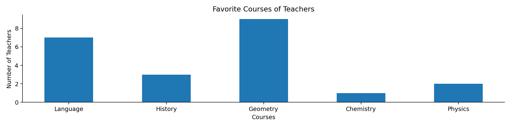
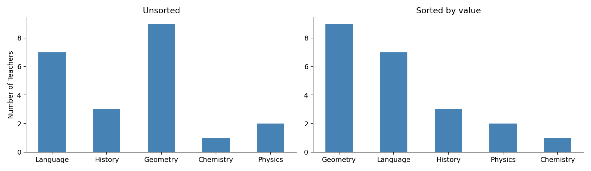
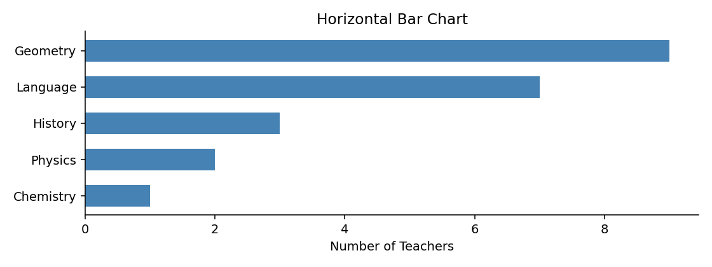
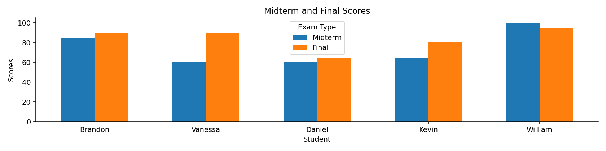
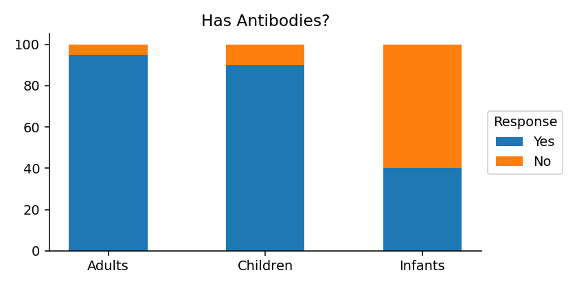
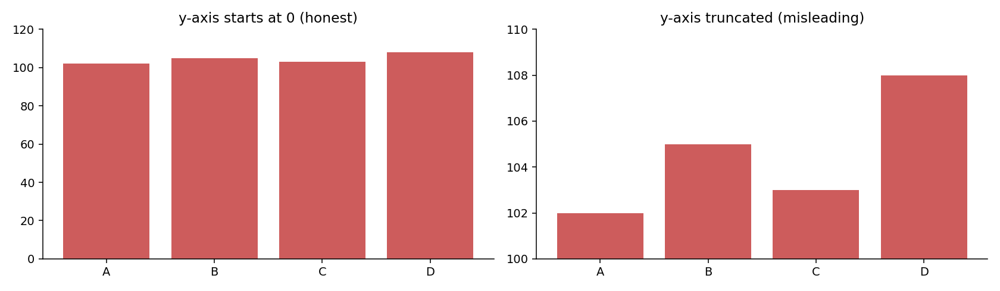

# 막대그림

**막대그림**은 범주형 자료를 나타내는 가장 기본적인 그림이다. 범주마다 막대를 하나씩 세우고 그 **길이**로 크기를 나타낸다.

길이로 나타낸다는 점이 중요하다. 사람은 길이를 아주 정확하게 비교한다. 원그래프의 각도나 넓이, 산점도의 색과 크기보다 훨씬 잘 읽는다. 범주형 자료를 보여 줄 방법을 고민할 때 **먼저 막대그림을 떠올리고, 그것으로 안 되는 이유가 있을 때만 다른 것을 찾는 것**이 좋은 습관이다.

!!! note "2.5절의 지도"
    시각화 도구를 고르는 첫 갈림길은 **자료가 범주형인가 수치형인가**다.

    $$
    \text{자료} \begin{cases}
    \text{범주형: 막대그림, 원그래프, 파레토 그림, 모자이크 그림} \\
    \text{수치형: 히스토그램, 상자그림, 줄기잎그림, 산점도, 선그림}
    \end{cases}
    $$

    이 절은 그 순서대로 간다.

    - **범주형 한 변수** — 막대그림, 원그래프, 파레토 그림
    - **범주형 두 변수** — 모자이크 그림과 도수분포표
    - **수치형 한 변수** — 점그림과 줄기잎그림, 상자그림, 바이올린 그림, 스트립·스웜 그림
    - **수치형 두 변수** — 산점도, 육각형 구간 그림
    - **수치형 여러 변수** — 쌍그림
    - **순서가 있는 자료** — 선그림, 계단 그림, 면적 그림
    - **불확실성** — 오차막대 그림

    (히스토그램과 밀도 그림은 이미 2.2절에서 다루었다.)

## 1. 기본 막대그림

한 범주형 변수의 도수를 그린다.

```python
import matplotlib.pyplot as plt
import pandas as pd

data = {
    'Courses': ('Language', 'History', 'Geometry', 'Chemistry', 'Physics'),
    'Number of Teachers': (7, 3, 9, 1, 2)
}
df = pd.DataFrame(data).set_index('Courses')

fig, ax = plt.subplots(figsize=(12, 3))

# x           막대의 가로 위치 (0, 1, 2, ... 로 두고 눈금에 이름을 붙인다)
# height      막대의 높이 = 나타내려는 값
# tick_label  각 위치에 표시할 범주 이름
# width       막대 폭. 1.0이면 서로 붙고, 0.5면 절반 간격이 생긴다
ax.bar(x=range(len(df)), height=df["Number of Teachers"],
       tick_label=df.index, width=0.5)
ax.set_xlabel('Courses')
ax.set_ylabel('Number of Teachers')
ax.set_title("Favorite Courses of Teachers")
# 위·오른쪽 테두리를 지우면 자료 자체에 눈이 집중된다
ax.spines['right'].set_visible(False)
ax.spines['top'].set_visible(False)
plt.show()
```



### 순서가 없는 범주는 정렬하라

과목 사이에는 자연스러운 순서가 없다. 이런 경우 **값이 큰 순서로 정렬**하면 읽기가 훨씬 쉬워진다.

```python
import matplotlib.pyplot as plt
import pandas as pd

df = pd.DataFrame({'Course': ['Language', 'History', 'Geometry',
                              'Chemistry', 'Physics'],
                   'Teachers': [7, 3, 9, 1, 2]})

fig, (ax1, ax2) = plt.subplots(1, 2, figsize=(12, 3.5))

# 왼쪽: 자료에 적힌 순서 그대로
ax1.bar(df['Course'], df['Teachers'], width=0.5, color='steelblue')
ax1.set_title("Unsorted")
ax1.set_ylabel("Number of Teachers")

# 오른쪽: 값이 큰 순서로 정렬
df_sorted = df.sort_values('Teachers', ascending=False)
ax2.bar(df_sorted['Course'], df_sorted['Teachers'], width=0.5, color='steelblue')
ax2.set_title("Sorted by value")

for ax in (ax1, ax2):
    ax.spines[['top', 'right']].set_visible(False)
plt.tight_layout()
plt.show()
```



왼쪽에서 "두 번째로 많은 과목이 무엇인가"를 답하려면 막대 높이를 하나씩 견주어야 한다. 오른쪽에서는 두 번째 막대를 보면 끝이다.

**다만 범주에 자연스러운 순서가 있으면 정렬하지 않는다.** 요일, 월, 나이 구간, 신용등급 A–G 같은 것들은 원래 순서를 지켜야 한다. 순서를 바꾸면 추세가 사라진다.

### 이름이 길면 가로 막대

범주 이름이 길면 가로축에서 글자가 겹치거나 기울어진다. 막대를 눕히면 이름을 가로로 편하게 읽을 수 있다.

```python
fig, ax = plt.subplots(figsize=(8, 3))

df_sorted = df.sort_values('Teachers')     # 가로 막대는 아래에서 위로 쌓이므로
                                           # 오름차순으로 정렬해야 위가 가장 크다
ax.barh(df_sorted['Course'], df_sorted['Teachers'],
        color='steelblue', height=0.6)
ax.set_xlabel("Number of Teachers")
ax.set_title("Horizontal Bar Chart")
ax.spines[['top', 'right']].set_visible(False)
plt.tight_layout()
plt.show()
```



## 2. 묶음 막대그림

집단마다 여러 값을 비교할 때 쓴다.

```python
import matplotlib.pyplot as plt
import numpy as np
import pandas as pd

data = {
    'Student': ['Brandon', 'Vanessa', 'Daniel', 'Kevin', 'William'],
    'Midterm': [85, 60, 60, 65, 100],
    'Final': [90, 90, 65, 80, 95]
}
df = pd.DataFrame(data).set_index('Student')

positions = np.arange(len(df))   # 학생마다 기준 위치 0, 1, 2, 3, 4
width = 0.3                      # 막대 하나의 폭

fig, ax = plt.subplots(figsize=(12, 3))

# 묶음 막대의 요령: 기준 위치에서 좌우로 반 폭씩 밀어 놓는다.
#   중간고사는 왼쪽(-width/2), 기말고사는 오른쪽(+width/2)
# 이렇게 하면 두 막대가 겹치지 않으면서 같은 학생끼리 붙어 있게 된다.
ax.bar(positions - width / 2, df['Midterm'], width=width, label="Midterm")
ax.bar(positions + width / 2, df['Final'], width=width, label="Final")
ax.set_xticks(positions)
ax.set_xticklabels(df.index)
ax.set_xlabel("Student")
ax.set_ylabel("Scores")
ax.set_title("Midterm and Final Scores")
ax.legend(title="Exam Type")
ax.spines['right'].set_visible(False)
ax.spines['top'].set_visible(False)
plt.show()
```



**묶음 막대는 개별 값을 비교할 때** 쓴다. 학생별로 중간고사와 기말고사를 나란히 놓아, Vanessa가 60에서 90으로 크게 올랐다는 사실이 곧바로 보인다.

막대가 모두 같은 바닥(0)에서 출발하므로 어떤 두 막대든 길이를 견줄 수 있다. 이것이 다음 절의 누적 막대와 갈리는 지점이다.

## 3. 분할(누적) 막대그림

각 범주가 무엇으로 구성되어 있는지 보여 준다.

```python
import matplotlib.pyplot as plt
import numpy as np

labels = ("Yes", "No")
counts = (np.array([95, 90, 40]), np.array([5, 10, 60]))
age_groups = ("Adults", "Children", "Infants")

fig, ax = plt.subplots(figsize=(6, 3))

# 누적 막대의 요령: bottom 인자로 "이 막대가 어디서부터 시작할지"를 준다.
# 첫 막대는 0에서 시작하고, 다음 막대는 앞선 막대들의 합에서 시작한다.
bottom = np.zeros(3)

for label, count in zip(labels, counts):
    ax.bar(np.arange(3), count, width=0.5, bottom=bottom,
           tick_label=age_groups, label=label)
    bottom += count          # 다음 막대의 출발점을 위로 올린다

ax.set_title("Has Antibodies?")
ax.spines['top'].set_visible(False)
ax.spines['right'].set_visible(False)
# bbox_to_anchor로 범례를 그림 바깥 오른쪽에 내보낸다
ax.legend(title="Response", loc="center left", bbox_to_anchor=(1.0, 0.5))
plt.tight_layout()
plt.show()
```



**누적 막대는 구성비를 볼 때** 쓴다. 세 집단 모두 전체 높이가 100으로 같아, 영아 집단만 항체 보유 비율이 40%로 낮다는 점이 바로 드러난다.

!!! warning "맨 아래 조각만 정확히 비교할 수 있다"
    누적 막대에는 구조적 한계가 있다. **아래쪽 조각은 시작점이 모두 0으로 같아 길이를 견주기 쉽지만, 위쪽 조각은 시작점이 제각각이라 눈으로 비교하기 어렵다.**

    조각이 셋 이상이고 여러 조각을 정확히 비교해야 한다면 묶음 막대나, 조각마다 작은 그림을 따로 그리는 편이 낫다.

    누적 막대가 잘 맞는 경우는 조각이 둘일 때, 그리고 **전체 높이 자체**가 의미 있는 값일 때다.

## 4. 막대그림에서 가장 흔한 거짓말

막대그림은 길이로 크기를 나타내므로, **세로축이 반드시 0에서 시작해야 한다.** 축을 잘라 내면 길이의 비율이 값의 비율과 달라진다.

```python
import matplotlib.pyplot as plt

fig, (ax1, ax2) = plt.subplots(1, 2, figsize=(12, 3.5))
vals = [102, 105, 103, 108]
names = ['A', 'B', 'C', 'D']

ax1.bar(names, vals, color='indianred')
ax1.set_ylim(0, 120)                      # 0에서 시작 — 정직한 그림
ax1.set_title("y-axis starts at 0 (honest)")

ax2.bar(names, vals, color='indianred')
ax2.set_ylim(100, 110)                    # 축을 잘라 냄 — 차이가 과장된다
ax2.set_title("y-axis truncated (misleading)")

for ax in (ax1, ax2):
    ax.spines[['top', 'right']].set_visible(False)
plt.tight_layout()
plt.show()
```



같은 자료다. 왼쪽에서 네 값은 거의 같아 보이고, 실제로도 그렇다(102에서 108, 6% 차이). 오른쪽에서는 D가 A의 **세 배**처럼 보인다.

**선그림에서는 축을 잘라도 된다.** 선그림은 위치와 기울기로 읽으므로 기준선이 0일 필요가 없다. 그러나 막대그림은 길이로 읽으므로 잘린 축이 곧 거짓말이 된다.

## 연습문제

**연습문제 1.**
어떤 회사가 네 지역의 매출을 발표하면서 세로축을 900에서 1000까지로 설정한 막대그림을 썼다. 실제 매출은 920, 950, 940, 980이다. (a) 이 그림이 왜 문제인가? (b) 축을 0에서 시작하면 무엇이 달라 보이는가? (c) 작은 차이를 정직하게 강조하려면 어떻게 하면 되는가?

??? success "풀이"
    (a) 막대의 **길이가 값에 비례하지 않게** 된다. 축을 900에서 시작하면 920은 길이 20, 980은 길이 80으로 그려져 **네 배 차이**로 보인다. 실제 차이는 $980/920 = 1.065$로 6.5%에 불과하다.

    (b) 축이 0에서 시작하면 네 막대의 높이가 거의 같아 보인다. 이것이 자료의 정직한 모습이다. 지역 간 매출 차이가 크지 않다는 사실이 그대로 전달된다.

    (c) 세 가지 방법이 있다.

    - **선그림이나 점그림으로 바꾼다.** 길이가 아니라 위치로 읽는 그림이므로 축을 잘라도 왜곡이 아니다.
    - **차이 자체를 그린다.** 기준값(예: 전체 평균 947.5)으로부터의 편차를 막대로 그리면, 축이 0에서 시작하면서도 차이가 잘 보인다.
    - **막대그림을 쓰되 축을 자르지 않고 숫자를 함께 적는다.** 차이가 작다는 사실을 숨기지 않으면서 정확한 값을 전달한다.

---

**연습문제 2.**
다음 각 상황에서 묶음 막대와 누적 막대 중 어느 것이 적절한지 고르고 이유를 밝혀라.

**(a)** 세 회사의 연도별 총매출 추이와 그 안의 제품군별 구성
**(b)** 다섯 나라의 남녀 평균 임금 비교
**(c)** 어떤 설문의 다섯 문항에 대한 "매우 동의 / 동의 / 보통 / 반대 / 매우 반대" 응답 분포

??? success "풀이"
    **(a) 누적 막대.** 연도별 **총매출**(전체 높이)이 의미 있는 값이고, 그 안의 구성을 함께 보고 싶은 상황이다. 누적 막대의 전형적인 용도다. 다만 제품군별 추이를 정확히 비교해야 한다면 제품군마다 선그림을 따로 그리는 편이 낫다.

    **(b) 묶음 막대.** 남성 임금과 여성 임금을 **직접 견주는** 것이 목적이며, 둘을 더한 값에는 의미가 없다. 나라별로 두 막대를 나란히 놓아야 임금 격차가 곧바로 보인다.

    **(c) 누적 막대**(특히 100% 누적). 각 문항의 응답 비율 구성을 보는 것이므로 전체가 100%로 같아야 비교가 쉽다.

    다만 이 경우 더 나은 선택지가 있다. **발산형 누적 막대**(diverging stacked bar)는 "보통"을 가운데 두고 긍정을 오른쪽, 부정을 왼쪽으로 뻗게 그린다. 그러면 긍정과 부정이 각각 같은 기준선에서 출발하므로 문항 간 비교가 훨씬 정확해진다. 설문 자료(리커트 척도)의 표준적인 표현 방식이다.

---

**연습문제 3.**
범주가 20개인 자료를 막대그림으로 그리려 한다. 어떤 문제가 생기며 어떻게 대응할 수 있는가?

??? success "풀이"
    **생기는 문제.**

    - 세로 막대라면 범주 이름이 겹쳐 기울여 쓰거나 잘라 써야 한다.
    - 막대가 얇아져 길이 차이를 읽기 어렵다.
    - 20개를 한꺼번에 비교하는 일 자체가 사람의 인지 능력을 넘어선다.

    **대응책.**

    - **가로 막대로 눕힌다.** 세로 공간은 늘리기 쉬우므로 20개도 무리 없이 담기고 이름도 가로로 읽힌다. 가장 간단하고 효과적인 해법이다.
    - **정렬한다.** 순서가 없는 범주라면 값 순으로 정렬해야 순위가 즉시 보인다.
    - **상위 몇 개만 남기고 나머지를 "기타"로 묶는다.** 다만 이때 무엇을 묶었는지 반드시 밝혀야 한다. 1장에서 본 대로, 걸러 낸 사실을 감추면 그림이 오도한다.
    - **범주를 의미 있는 상위 집단으로 묶는다.** 20개 세부 항목을 4개 대분류로 정리하면 그림이 읽히고, 필요하면 대분류별로 세부 그림을 따로 그린다.

## 정리하며

막대그림은 단순해 보이지만 선택할 것이 많다.

- **정렬**: 순서가 없는 범주는 값 순으로. 순서가 있으면 그대로.
- **방향**: 이름이 길거나 범주가 많으면 가로로.
- **묶음 대 누적**: 개별 값을 비교하면 묶음, 구성비를 보면 누적.
- **축**: 반드시 0에서 시작. 이것만은 타협하지 않는다.

다음 절의 **원그래프**는 같은 자료를 다른 방식으로 보여 준다. 그리고 대부분의 경우 막대그림이 더 낫다는 것을 확인하게 될 것이다.
