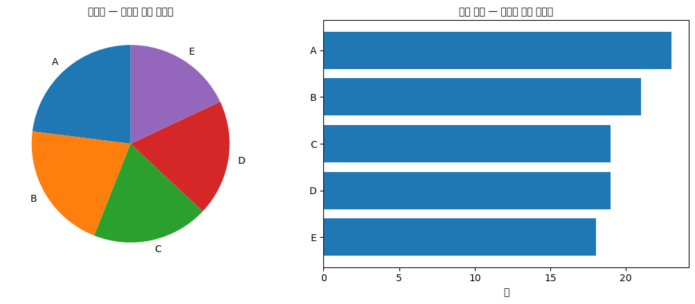
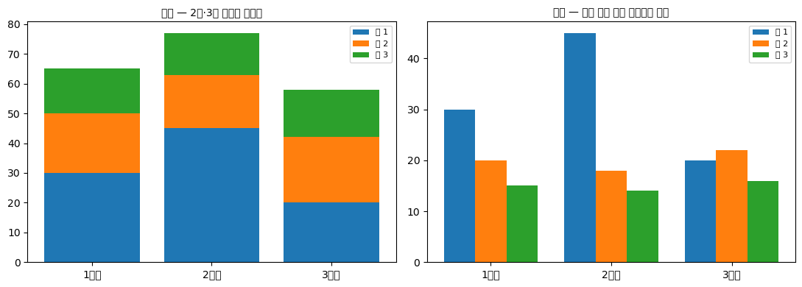
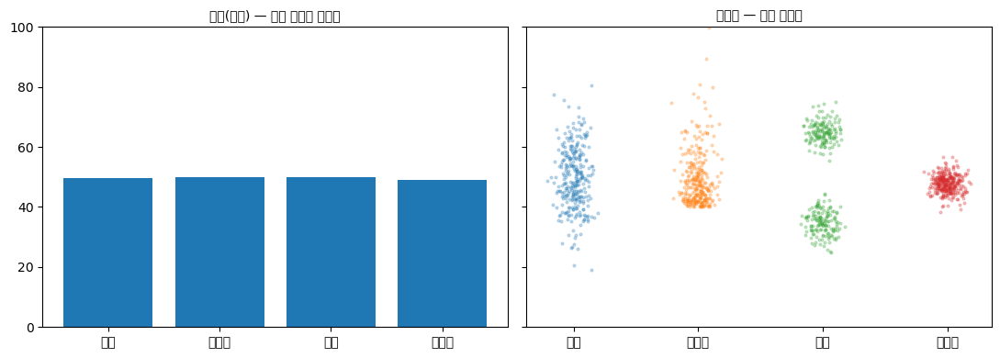
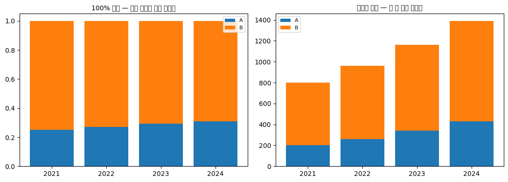
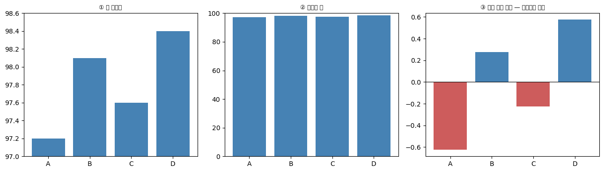

# 막대그림

**막대그림**은 범주형 자료를 나타내는 가장 기본적인 그림이다. 범주마다 막대를 하나씩 세우고 그 **길이**로 크기를 나타낸다.

길이로 나타낸다는 점이 중요하다. 사람은 길이를 아주 정확하게 비교한다. 원그래프의 각도나 넓이, 산점도의 색과 크기보다 훨씬 잘 읽는다. 범주형 자료를 보여 줄 방법을 고민할 때 **먼저 막대그림을 떠올리고, 그것으로 안 되는 이유가 있을 때만 다른 것을 찾는 것**이 좋은 습관이다.

!!! note "2.5절의 지도"
    시각화 도구를 고르는 첫 갈림길은 **자료가 범주형인가 수치형인가**다.

    $$
    \text{자료} \begin{cases}
    \text{범주형: 막대그림, 원그래프, 파레토 그림, 모자이크 그림} \\
    \text{수치형: 히스토그램, 상자그림, 줄기잎그림, 산점도, 선그림}
    \end{cases}
    $$

    이 절은 그 순서대로 간다.

    - **범주형 한 변수** — 막대그림, 원그래프, 파레토 그림
    - **범주형 두 변수** — 모자이크 그림과 도수분포표
    - **수치형 한 변수** — 점그림과 줄기잎그림, 상자그림, 바이올린 그림, 스트립·스웜 그림
    - **수치형 두 변수** — 산점도, 육각형 구간 그림
    - **수치형 여러 변수** — 쌍그림
    - **순서가 있는 자료** — 선그림, 계단 그림, 면적 그림
    - **불확실성** — 오차막대 그림

    (히스토그램과 밀도 그림은 이미 2.2절에서 다루었다.)

## 1. 기본 막대그림

한 범주형 변수의 도수를 그린다.

```python
import matplotlib.pyplot as plt
import pandas as pd

data = {
    'Courses': ('Language', 'History', 'Geometry', 'Chemistry', 'Physics'),
    'Number of Teachers': (7, 3, 9, 1, 2)
}
df = pd.DataFrame(data).set_index('Courses')

fig, ax = plt.subplots(figsize=(12, 3))

# x           막대의 가로 위치 (0, 1, 2, ... 로 두고 눈금에 이름을 붙인다)
# height      막대의 높이 = 나타내려는 값
# tick_label  각 위치에 표시할 범주 이름
# width       막대 폭. 1.0이면 서로 붙고, 0.5면 절반 간격이 생긴다
ax.bar(x=range(len(df)), height=df["Number of Teachers"],
       tick_label=df.index, width=0.5)
ax.set_xlabel('Courses')
ax.set_ylabel('Number of Teachers')
ax.set_title("Favorite Courses of Teachers")
# 위·오른쪽 테두리를 지우면 자료 자체에 눈이 집중된다
ax.spines['right'].set_visible(False)
ax.spines['top'].set_visible(False)
plt.show()
```


### 순서가 없는 범주는 정렬하라

과목 사이에는 자연스러운 순서가 없다. 이런 경우 **값이 큰 순서로 정렬**하면 읽기가 훨씬 쉬워진다.

```python
import matplotlib.pyplot as plt
import pandas as pd

df = pd.DataFrame({'Course': ['Language', 'History', 'Geometry',
                              'Chemistry', 'Physics'],
                   'Teachers': [7, 3, 9, 1, 2]})

fig, (ax1, ax2) = plt.subplots(1, 2, figsize=(12, 3.5))

# 왼쪽: 자료에 적힌 순서 그대로
ax1.bar(df['Course'], df['Teachers'], width=0.5, color='steelblue')
ax1.set_title("Unsorted")
ax1.set_ylabel("Number of Teachers")

# 오른쪽: 값이 큰 순서로 정렬
df_sorted = df.sort_values('Teachers', ascending=False)
ax2.bar(df_sorted['Course'], df_sorted['Teachers'], width=0.5, color='steelblue')
ax2.set_title("Sorted by value")

for ax in (ax1, ax2):
    ax.spines[['top', 'right']].set_visible(False)
plt.tight_layout()
plt.show()
```


왼쪽에서 "두 번째로 많은 과목이 무엇인가"를 답하려면 막대 높이를 하나씩 견주어야 한다. 오른쪽에서는 두 번째 막대를 보면 끝이다.

**다만 범주에 자연스러운 순서가 있으면 정렬하지 않는다.** 요일, 월, 나이 구간, 신용등급 A–G 같은 것들은 원래 순서를 지켜야 한다. 순서를 바꾸면 추세가 사라진다.

### 이름이 길면 가로 막대

범주 이름이 길면 가로축에서 글자가 겹치거나 기울어진다. 막대를 눕히면 이름을 가로로 편하게 읽을 수 있다.

```python
fig, ax = plt.subplots(figsize=(8, 3))

df_sorted = df.sort_values('Teachers')     # 가로 막대는 아래에서 위로 쌓이므로
                                           # 오름차순으로 정렬해야 위가 가장 크다
ax.barh(df_sorted['Course'], df_sorted['Teachers'],
        color='steelblue', height=0.6)
ax.set_xlabel("Number of Teachers")
ax.set_title("Horizontal Bar Chart")
ax.spines[['top', 'right']].set_visible(False)
plt.tight_layout()
plt.show()
```


## 2. 묶음 막대그림

집단마다 여러 값을 비교할 때 쓴다.

```python
import matplotlib.pyplot as plt
import numpy as np
import pandas as pd

data = {
    'Student': ['Brandon', 'Vanessa', 'Daniel', 'Kevin', 'William'],
    'Midterm': [85, 60, 60, 65, 100],
    'Final': [90, 90, 65, 80, 95]
}
df = pd.DataFrame(data).set_index('Student')

positions = np.arange(len(df))   # 학생마다 기준 위치 0, 1, 2, 3, 4
width = 0.3                      # 막대 하나의 폭

fig, ax = plt.subplots(figsize=(12, 3))

# 묶음 막대의 요령: 기준 위치에서 좌우로 반 폭씩 밀어 놓는다.
#   중간고사는 왼쪽(-width/2), 기말고사는 오른쪽(+width/2)
# 이렇게 하면 두 막대가 겹치지 않으면서 같은 학생끼리 붙어 있게 된다.
ax.bar(positions - width / 2, df['Midterm'], width=width, label="Midterm")
ax.bar(positions + width / 2, df['Final'], width=width, label="Final")
ax.set_xticks(positions)
ax.set_xticklabels(df.index)
ax.set_xlabel("Student")
ax.set_ylabel("Scores")
ax.set_title("Midterm and Final Scores")
ax.legend(title="Exam Type")
ax.spines['right'].set_visible(False)
ax.spines['top'].set_visible(False)
plt.show()
```


**묶음 막대는 개별 값을 비교할 때** 쓴다. 학생별로 중간고사와 기말고사를 나란히 놓아, Vanessa가 60에서 90으로 크게 올랐다는 사실이 곧바로 보인다.

막대가 모두 같은 바닥(0)에서 출발하므로 어떤 두 막대든 길이를 견줄 수 있다. 이것이 다음 절의 누적 막대와 갈리는 지점이다.

## 3. 분할(누적) 막대그림

각 범주가 무엇으로 구성되어 있는지 보여 준다.

```python
import matplotlib.pyplot as plt
import numpy as np

labels = ("Yes", "No")
counts = (np.array([95, 90, 40]), np.array([5, 10, 60]))
age_groups = ("Adults", "Children", "Infants")

fig, ax = plt.subplots(figsize=(6, 3))

# 누적 막대의 요령: bottom 인자로 "이 막대가 어디서부터 시작할지"를 준다.
# 첫 막대는 0에서 시작하고, 다음 막대는 앞선 막대들의 합에서 시작한다.
bottom = np.zeros(3)

for label, count in zip(labels, counts):
    ax.bar(np.arange(3), count, width=0.5, bottom=bottom,
           tick_label=age_groups, label=label)
    bottom += count          # 다음 막대의 출발점을 위로 올린다

ax.set_title("Has Antibodies?")
ax.spines['top'].set_visible(False)
ax.spines['right'].set_visible(False)
# bbox_to_anchor로 범례를 그림 바깥 오른쪽에 내보낸다
ax.legend(title="Response", loc="center left", bbox_to_anchor=(1.0, 0.5))
plt.tight_layout()
plt.show()
```


**누적 막대는 구성비를 볼 때** 쓴다. 세 집단 모두 전체 높이가 100으로 같아, 영아 집단만 항체 보유 비율이 40%로 낮다는 점이 바로 드러난다.

!!! warning "맨 아래 조각만 정확히 비교할 수 있다"
    누적 막대에는 구조적 한계가 있다. **아래쪽 조각은 시작점이 모두 0으로 같아 길이를 견주기 쉽지만, 위쪽 조각은 시작점이 제각각이라 눈으로 비교하기 어렵다.**

    조각이 셋 이상이고 여러 조각을 정확히 비교해야 한다면 묶음 막대나, 조각마다 작은 그림을 따로 그리는 편이 낫다.

    누적 막대가 잘 맞는 경우는 조각이 둘일 때, 그리고 **전체 높이 자체**가 의미 있는 값일 때다.

## 4. 막대그림에서 가장 흔한 거짓말

막대그림은 길이로 크기를 나타내므로, **세로축이 반드시 0에서 시작해야 한다.** 축을 잘라 내면 길이의 비율이 값의 비율과 달라진다.

```python
import matplotlib.pyplot as plt

fig, (ax1, ax2) = plt.subplots(1, 2, figsize=(12, 3.5))
vals = [102, 105, 103, 108]
names = ['A', 'B', 'C', 'D']

ax1.bar(names, vals, color='indianred')
ax1.set_ylim(0, 120)                      # 0에서 시작 — 정직한 그림
ax1.set_title("y-axis starts at 0 (honest)")

ax2.bar(names, vals, color='indianred')
ax2.set_ylim(100, 110)                    # 축을 잘라 냄 — 차이가 과장된다
ax2.set_title("y-axis truncated (misleading)")

for ax in (ax1, ax2):
    ax.spines[['top', 'right']].set_visible(False)
plt.tight_layout()
plt.show()
```


같은 자료다. 왼쪽에서 네 값은 거의 같아 보이고, 실제로도 그렇다(102에서 108, 6% 차이). 오른쪽에서는 D가 A의 **세 배**처럼 보인다.

**선그림에서는 축을 잘라도 된다.** 선그림은 위치와 기울기로 읽으므로 기준선이 0일 필요가 없다. 그러나 막대그림은 길이로 읽으므로 잘린 축이 곧 거짓말이 된다.

## 연습문제

<div class="drillbox" markdown>

**연습문제 1.**
어떤 회사가 네 지역의 매출을 발표하면서 세로축을 900에서 1000까지로 설정한 막대그림을 썼다. 실제 매출은 920, 950, 940, 980이다. (a) 이 그림이 왜 문제인가? (b) 축을 0에서 시작하면 무엇이 달라 보이는가? (c) 작은 차이를 정직하게 강조하려면 어떻게 하면 되는가?

</div>

??? success "풀이"
    (a) 막대의 **길이가 값에 비례하지 않게** 된다. 축을 900에서 시작하면 920은 길이 20, 980은 길이 80으로 그려져 **네 배 차이**로 보인다. 실제 차이는 $980/920 = 1.065$로 6.5%에 불과하다.

    (b) 축이 0에서 시작하면 네 막대의 높이가 거의 같아 보인다. 이것이 자료의 정직한 모습이다. 지역 간 매출 차이가 크지 않다는 사실이 그대로 전달된다.

    (c) 세 가지 방법이 있다.

    - **선그림이나 점그림으로 바꾼다.** 길이가 아니라 위치로 읽는 그림이므로 축을 잘라도 왜곡이 아니다.
    - **차이 자체를 그린다.** 기준값(예: 전체 평균 947.5)으로부터의 편차를 막대로 그리면, 축이 0에서 시작하면서도 차이가 잘 보인다.
    - **막대그림을 쓰되 축을 자르지 않고 숫자를 함께 적는다.** 차이가 작다는 사실을 숨기지 않으면서 정확한 값을 전달한다.

<div class="drillbox" markdown>

**연습문제 2.**
다음 각 상황에서 묶음 막대와 누적 막대 중 어느 것이 적절한지 고르고 이유를 밝혀라.

**(a)** 세 회사의 연도별 총매출 추이와 그 안의 제품군별 구성
**(b)** 다섯 나라의 남녀 평균 임금 비교
**(c)** 어떤 설문의 다섯 문항에 대한 "매우 동의 / 동의 / 보통 / 반대 / 매우 반대" 응답 분포

</div>

??? success "풀이"
    **(a) 누적 막대.** 연도별 **총매출**(전체 높이)이 의미 있는 값이고, 그 안의 구성을 함께 보고 싶은 상황이다. 누적 막대의 전형적인 용도다. 다만 제품군별 추이를 정확히 비교해야 한다면 제품군마다 선그림을 따로 그리는 편이 낫다.

    **(b) 묶음 막대.** 남성 임금과 여성 임금을 **직접 견주는** 것이 목적이며, 둘을 더한 값에는 의미가 없다. 나라별로 두 막대를 나란히 놓아야 임금 격차가 곧바로 보인다.

    **(c) 누적 막대**(특히 100% 누적). 각 문항의 응답 비율 구성을 보는 것이므로 전체가 100%로 같아야 비교가 쉽다.

    다만 이 경우 더 나은 선택지가 있다. **발산형 누적 막대**(diverging stacked bar)는 "보통"을 가운데 두고 긍정을 오른쪽, 부정을 왼쪽으로 뻗게 그린다. 그러면 긍정과 부정이 각각 같은 기준선에서 출발하므로 문항 간 비교가 훨씬 정확해진다. 설문 자료(리커트 척도)의 표준적인 표현 방식이다.

<div class="drillbox" markdown>

**연습문제 3.**
범주가 20개인 자료를 막대그림으로 그리려 한다. 어떤 문제가 생기며 어떻게 대응할 수 있는가?

</div>

??? success "풀이"
    **생기는 문제.**

    - 세로 막대라면 범주 이름이 겹쳐 기울여 쓰거나 잘라 써야 한다.
    - 막대가 얇아져 길이 차이를 읽기 어렵다.
    - 20개를 한꺼번에 비교하는 일 자체가 사람의 인지 능력을 넘어선다.

    **대응책.**

    - **가로 막대로 눕힌다.** 세로 공간은 늘리기 쉬우므로 20개도 무리 없이 담기고 이름도 가로로 읽힌다. 가장 간단하고 효과적인 해법이다.
    - **정렬한다.** 순서가 없는 범주라면 값 순으로 정렬해야 순위가 즉시 보인다.
    - **상위 몇 개만 남기고 나머지를 "기타"로 묶는다.** 다만 이때 무엇을 묶었는지 반드시 밝혀야 한다. 1장에서 본 대로, 걸러 낸 사실을 감추면 그림이 오도한다.
    - **범주를 의미 있는 상위 집단으로 묶는다.** 20개 세부 항목을 4개 대분류로 정리하면 그림이 읽히고, 필요하면 대분류별로 세부 그림을 따로 그린다.

<div class="drillbox" markdown>

**연습문제 4.**
막대그림의 대안으로 흔히 원그림이 쓰인다. 두 방식의 **지각 정확도**를 비교하고, 부분–전체 비교에 무엇이 나은지 논하라.

</div>

??? success "풀이"
    ```python
    import numpy as np
    import matplotlib.pyplot as plt

    labels = ["A", "B", "C", "D", "E"]
    values = np.array([23, 21, 19, 19, 18], float)      # 서로 매우 가깝다

    print("실제 비율")
    for l, v in zip(labels, values / values.sum()):
        print(f"  {l}: {v:.4f}")
    print(f"\n최댓값/최솟값 비 {values.max() / values.min():.4f}")
    print(f"각도로는 {values.max() / values.sum() * 360:.1f}도 대 "
          f"{values.min() / values.sum() * 360:.1f}도 — 눈으로 구별하기 어렵다")

    fig, axes = plt.subplots(1, 2, figsize=(11, 4.5))
    axes[0].pie(values, labels=labels, autopct=None, startangle=90)
    axes[0].set_title("원그림 — 순위를 읽기 어렵다", fontsize=10)
    axes[1].barh(labels[::-1], values[::-1])
    axes[1].set_title("가로 막대 — 순위가 즉시 보인다", fontsize=10)
    axes[1].set_xlabel("값")
    fig.tight_layout()
    plt.show()
    ```

    출력:

    ```
    실제 비율
      A: 0.2300
      B: 0.2100
      C: 0.1900
      D: 0.1900
      E: 0.1800

    최댓값/최솟값 비 1.2778
    각도로는 82.8도 대 64.8도 — 눈으로 구별하기 어렵다
    ```

    

    다섯 값이 $23$부터 $18$까지로 최대 $1.28$배 차이인데, 원그림에서는 $82.8^\circ$와 $64.8^\circ$의 차이로 나타난다. **순위를 정확히 읽어 내기 어렵다.**

    **클리블랜드–맥길의 부호화 정확도 순위**를 다시 보라(산점도 문서 연습문제 9).

    | 순위 | 부호화 | 어디에 쓰이는가 |
    |---|---|---|
    | $1$ | 공통 축 위의 **위치** | 점그림, 가로 막대 |
    | $3$ | **길이** | 막대그림 |
    | $4$ | **각도** | **원그림** |
    | $5$ | 넓이 | 버블, 트리맵 |

    **원그림이 나쁜 이유가 각도 부호화에 있다.** 게다가 조각이 여러 개면 서로 다른 방향으로 놓여 비교가 더 어려워진다.

    **그럼에도 원그림이 통하는 경우.**

    - **조각이 두세 개뿐이고** 차이가 클 때. "찬성 $70\%$ 대 반대 $30\%$"는 원그림으로 충분하다.
    - **$1/2$, $1/4$ 같은 기준 비율**과의 비교. 사람은 반원과 사분원은 잘 알아본다.
    - **전체가 $100\%$임을 강조**하고 싶을 때. 막대그림은 합이 전체라는 사실을 시각적으로 말해 주지 않는다.

    **원그림을 쓴다면 반드시 수치를 함께 적어라.** 그러면 그림이 못 하는 일을 글자가 대신한다. 다만 그 시점에 그림이 무슨 일을 하고 있는지 다시 물어볼 만하다. $\square$

<div class="drillbox" markdown>

**연습문제 5.**
본문 3절의 **누적 막대그림**에는 구조적 약점이 있다. 맨 아래 층을 제외한 층들을 비교하기 어려운 이유를 수치로 보여라.

</div>

??? success "풀이"
    ```python
    import numpy as np
    import matplotlib.pyplot as plt

    groups = ["1분기", "2분기", "3분기"]
    seg = np.array([[30, 20, 15], [45, 18, 14], [20, 22, 16]], float)  # 행=막대, 열=층

    print(f"1층 값 {seg[:, 0]}  → 바닥이 모두 0 이라 비교가 쉽다")
    print(f"2층 값 {seg[:, 1]}  → 시작 높이가 {seg[:, 0]} 로 제각각")
    print(f"\n2층의 실제 크기 순위     {np.argsort(-seg[:, 1]) + 1}")
    print(f"2층 '윗변 높이' 순위     {np.argsort(-(seg[:, 0] + seg[:, 1])) + 1}   ← 눈이 읽는 것")

    fig, axes = plt.subplots(1, 2, figsize=(11, 4))
    bottom = np.zeros(3)
    for j, name in enumerate(["층 1", "층 2", "층 3"]):
        axes[0].bar(groups, seg[:, j], bottom=bottom, label=name)
        bottom += seg[:, j]
    axes[0].legend(fontsize=8)
    axes[0].set_title("누적 — 2층·3층 비교가 어렵다", fontsize=10)

    w = 0.26
    xs = np.arange(3)
    for j, name in enumerate(["층 1", "층 2", "층 3"]):
        axes[1].bar(xs + (j - 1) * w, seg[:, j], width=w, label=name)
    axes[1].set_xticks(xs); axes[1].set_xticklabels(groups)
    axes[1].legend(fontsize=8)
    axes[1].set_title("묶음 — 모든 층이 같은 바닥에서 출발", fontsize=10)
    fig.tight_layout()
    plt.show()
    ```

    출력:

    ```
    1층 값 [30. 45. 20.]  → 바닥이 모두 0 이라 비교가 쉽다
    2층 값 [20. 18. 22.]  → 시작 높이가 [30. 45. 20.] 로 제각각

    2층의 실제 크기 순위     [3 1 2]
    2층 '윗변 높이' 순위     [2 1 3]   ← 눈이 읽는 것
    ```

    

    **$2$층의 실제 순위는 $3, 1, 2$번 막대 순인데 윗변 높이로 읽으면 $2, 1, 3$번 순이다.** 순위가 뒤바뀐다.

    **왜인가.** 누적 막대에서 $1$층은 모두 $0$에서 시작하므로 **위치 부호화**로 읽힌다. 정확하다. 그러나 $2$층부터는 시작 높이가 막대마다 다르므로 **길이만으로** 비교해야 하는데, 사람은 서로 다른 위치에 있는 선분의 길이를 잘 비교하지 못한다. 실제로는 눈이 **윗변의 높이**를 따라가기 쉽고, 그것은 누적값이지 그 층의 값이 아니다.

    **언제 무엇을 쓰는가.**

    | 목적 | 권장 |
    |---|---|
    | 전체 크기의 비교가 주목적 | **누적** (윗변이 합계) |
    | 특정 한 성분의 비교 | **묶음** 또는 그 성분만 따로 |
    | 성분 비율의 변화 | **$100\%$ 누적** (연습문제 8) |
    | 성분이 $4$개 이상 | 누적·묶음 모두 나쁨 → **작은 다중 그림** |

    **가장 실용적인 조언.** 관심 있는 성분이 하나라면 **그것을 맨 아래 층에 놓아라.** 그러면 그 성분만큼은 정확히 비교된다. 그리고 성분이 많으면 누적하지 말고 **면을 나누어** 각각 별도의 작은 그림으로 그리는 것이 낫다. $\square$

<div class="drillbox" markdown>

**연습문제 6.**
막대그림으로 **집단별 평균**을 그리는 것은 매우 흔하다. 이것이 무엇을 감추는지 보여라.

</div>

??? success "풀이"
    ```python
    import numpy as np
    import matplotlib.pyplot as plt

    rng = np.random.default_rng(0)
    groups = {
        "대칭":  rng.normal(50, 10, 300),
        "치우침": 50 + (rng.exponential(10, 300) - 10),
        "이봉":  np.concatenate([rng.normal(35, 4, 150), rng.normal(65, 4, 150)]),
        "이상치": np.concatenate([rng.normal(48, 3, 297), [150, 160, 170]]),
    }

    print(f"{'집단':>8}{'평균':>9}{'표준편차':>10}{'중앙값':>9}{'IQR':>9}")
    for name, v in groups.items():
        q1, q3 = np.percentile(v, [25, 75])
        print(f"{name:>8}{v.mean():>9.2f}{v.std(ddof=1):>10.2f}{np.median(v):>9.2f}{q3 - q1:>9.2f}")

    fig, axes = plt.subplots(1, 2, figsize=(11, 4), sharey=True)
    names = list(groups)
    axes[0].bar(names, [v.mean() for v in groups.values()])
    axes[0].set_title("막대(평균) — 넷이 똑같아 보인다", fontsize=10)
    for i, v in enumerate(groups.values()):
        axes[1].scatter(np.full(len(v), i) + rng.normal(0, 0.07, len(v)), v, s=4, alpha=0.25)
    axes[1].set_xticks(range(4)); axes[1].set_xticklabels(names)
    axes[1].set_title("원자료 — 전혀 다르다", fontsize=10)
    axes[1].set_ylim(0, 100)
    fig.tight_layout()
    plt.show()
    ```

    출력:

    ```
    집단       평균      표준편차      중앙값      IQR
          대칭    49.64     10.20    49.23    13.86
         치우침    49.85     10.01    47.21    10.55
          이봉    49.89     15.62    50.06    30.04
         이상치    48.95     11.59    47.89     3.96
    ```

    

    **네 집단의 평균이 모두 $49$–$50$이다.** 막대그림으로 그리면 네 개의 똑같은 막대가 서고, 독자는 "차이가 없다"고 읽는다.

    **그런데 자료는 전혀 다르다.**

    | 집단 | 표준편차 | IQR | 실제 모습 |
    |---|---|---|---|
    | 대칭 | $10.2$ | $13.9$ | 하나의 봉우리 |
    | 치우침 | $10.0$ | $10.5$ | 오른쪽 꼬리 |
    | 이봉 | $15.6$ | $\mathbf{30.0}$ | **두 덩어리, 중앙에는 아무도 없다** |
    | 이상치 | $11.6$ | $\mathbf{4.0}$ | 매우 뭉쳐 있고 **극단값 $3$개** |

    **이봉 집단이 특히 문제다.** 평균 $50$인 사람이 실제로는 한 명도 없다. 막대 높이가 가리키는 값이 자료에 존재하지 않는다.

    **이것이 "막대그림 논쟁"의 핵심이다.** 생물학·의학 논문에서 평균 막대 + 오차막대가 표준이었는데, 여러 학술지가 **원자료를 함께 보이도록 요구**하는 방향으로 정책을 바꾸었다.

    **대안.**

    | $n$ | 권장 |
    |---|---|
    | $\lesssim 30$ | **점을 모두 그린다** (스트립·벌떼) |
    | $30$–$100$ | 상자그림 + 점 |
    | $\gtrsim 100$ | 바이올린 또는 상자그림 |
    | 어느 경우든 | 막대 + 오차막대만은 피한다 |

    **막대그림이 적절한 곳은 따로 있다.** 막대는 **계수나 합계**처럼 $0$에서 시작하는 것이 자연스러운 양에 쓰는 것이다. 평균은 그런 양이 아니며, 특히 $0$이 의미 없는 척도(온도, 시험 점수, 만족도)에서는 막대의 길이 자체가 오해를 부른다. $\square$

<div class="drillbox" markdown>

**연습문제 7.**
본문의 "순서가 없는 범주는 정렬하라"를 더 밀고 나가라. 정렬이 **위험한** 경우는 언제인가?

</div>

??? success "풀이"
    ```python
    import numpy as np

    rng = np.random.default_rng(3)
    K, n = 10, 40
    true_rate = 0.30                                   # 열 지점의 참 비율이 모두 같다
    counts = rng.binomial(n, true_rate, K)
    rates = counts / n
    order = np.argsort(-rates)

    print(f"참 비율은 열 지점 모두 {true_rate}")
    print(f"관측 비율(정렬 후) {np.round(rates[order], 3)}")
    print(f"\n1위 {rates[order][0]:.3f}   꼴찌 {rates[order][-1]:.3f}   차이 {rates[order][0] - rates[order][-1]:.3f}")
    se = np.sqrt(true_rate * (1 - true_rate) / n)
    print(f"단일 비율의 표준오차 {se:.4f}  → 차이는 표준오차 {(rates[order][0] - rates[order][-1]) / (se * np.sqrt(2)):.2f} 배")
    ```

    출력:

    ```
    참 비율은 열 지점 모두 0.3
    관측 비율(정렬 후) [0.35  0.35  0.325 0.3   0.275 0.25  0.225 0.225 0.2   0.2  ]

    1위 0.350   꼴찌 0.200   차이 0.150
    단일 비율의 표준오차 0.0725  → 차이는 표준오차 1.46 배
    ```

    **참 비율이 열 지점 모두 같은데** 정렬하면 $1$위와 꼴찌 사이에 상당한 차이가 보인다. 앞 절 집단 비교 문서 연습문제 10에서 본 것과 같은 현상이다.

    **정렬이 좋은 경우와 나쁜 경우.**

    | 상황 | 정렬 |
    |---|---|
    | 범주에 자연스러운 순서가 없고 값의 차이가 뚜렷하다 | **좋다** — 읽기 쉬워진다 |
    | 범주에 자연스러운 순서가 있다 (요일, 연령대, 등급) | **나쁘다** — 그 순서를 보존하라 |
    | 여러 그림을 비교해야 한다 | **나쁘다** — 그림마다 순서가 달라져 대조 불가 |
    | 값의 차이가 불확실성 안에 있다 | **나쁘다** — 없는 순위를 만든다 |

    **둘째 줄이 특히 자주 어겨진다.** 월별 매출을 값으로 정렬하면 계절성이 사라진다. 만족도 $1$–$5$점 응답을 도수로 정렬하면 순서형이라는 성질이 지워진다(2장 자료형 문서).

    **셋째 줄도 실무에서 큰 문제다.** 연도별 그림을 각각 정렬하면 같은 범주가 해마다 다른 위치에 놓여, 독자가 추적할 수 없다. 이럴 때는 **첫 해나 전체 합계 기준으로 한 번 정렬하고 모든 그림에 같은 순서를 쓴다.**

    **불확실성이 있을 때의 처방.** 오차막대를 함께 그리거나(다음 절), 순위 대신 구간을 보여 주거나, 값이 비슷한 범주를 시각적으로 묶는다. **막대의 순서 자체가 주장이라는 점을 잊지 말아야 한다.** $\square$

<div class="drillbox" markdown>

**연습문제 8.**
**$100\%$ 누적 막대**(비율만 보여 주는 누적 막대)는 성분 구성의 변화를 보기에 좋다. 그런데 무엇을 감추는가?

</div>

??? success "풀이"
    ```python
    import numpy as np
    import matplotlib.pyplot as plt

    years = ["2021", "2022", "2023", "2024"]
    a = np.array([200, 260, 340, 430], float)      # 성분 A
    b = np.array([600, 700, 820, 960], float)      # 성분 B
    total = a + b

    print(f"{'연도':>6}{'A':>8}{'B':>8}{'합계':>9}{'A 비율':>10}")
    for y, x, z, t in zip(years, a, b, total):
        print(f"{y:>6}{x:>8.0f}{z:>8.0f}{t:>9.0f}{x / t:>10.4f}")
    print(f"\nA 는 {a[0]:.0f} → {a[-1]:.0f} 로 {a[-1] / a[0]:.2f}배 늘었다")
    print(f"그런데 A 비율은 {a[0] / total[0]:.3f} → {a[-1] / total[-1]:.3f} 로 거의 그대로다")

    fig, axes = plt.subplots(1, 2, figsize=(11, 4))
    axes[0].bar(years, a / total, label="A")
    axes[0].bar(years, b / total, bottom=a / total, label="B")
    axes[0].set_title("100% 누적 — 아무 변화도 없어 보인다", fontsize=10)
    axes[0].legend(fontsize=8)
    axes[1].bar(years, a, label="A")
    axes[1].bar(years, b, bottom=a, label="B")
    axes[1].set_title("절대량 누적 — 둘 다 크게 늘었다", fontsize=10)
    axes[1].legend(fontsize=8)
    fig.tight_layout()
    plt.show()
    ```

    출력:

    ```
    연도       A       B       합계      A 비율
      2021     200     600      800    0.2500
      2022     260     700      960    0.2708
      2023     340     820     1160    0.2931
      2024     430     960     1390    0.3094

    A 는 200 → 430 로 2.15배 늘었다
    그런데 A 비율은 0.250 → 0.309 로 거의 그대로다
    ```

    

    **$100\%$ 누적 막대에서는 네 해가 거의 똑같아 보인다.** A의 비율이 $0.25$에서 $0.31$로 조금 오를 뿐이다.

    **그런데 A는 $2.15$배, 전체는 $1.74$배 늘었다.** 비율만 보여 주는 그림은 **규모의 변화를 완전히 지운다.**

    **반대 방향의 함정도 있다.** 전체가 줄어드는 상황에서 어떤 성분의 비율이 오르면 "그 성분이 성장했다"고 읽히지만, 실제로는 덜 줄었을 뿐일 수 있다.

    **처방.**

    - **두 그림을 나란히 놓아라.** 비율과 절대량을 함께 보여 주는 것이 가장 정직하다.
    - **합계를 어딘가에 표시하라.** 축 이름표나 막대 위에 총량을 적어 두면 비율 그림도 해석 가능해진다.
    - **막대 너비를 합계에 비례시켜라.** 모자이크 그림이 바로 이 방식이며, 비율과 규모를 한 그림에 담는다(이 장의 모자이크 문서 참고).

    **일반 원리.** 비율은 **분모를 감춘다.** 다음 문제가 같은 주제를 다른 각도에서 다룬다. $\square$

<div class="drillbox" markdown>

**연습문제 9.**
연습문제 8의 "분모를 감춘다"를 정면으로 다루어라. 막대 높이를 **개수**로 할 것인가 **비율**로 할 것인가?

</div>

??? success "풀이"
    ```python
    departments = [("A 부서", 120, 900), ("B 부서", 60, 300)]

    print("승진 인원과 승진율")
    total_p = total_n = 0
    for name, promoted, eligible in departments:
        print(f"  {name}: 승진 {promoted}명 / 대상 {eligible}명 = {promoted / eligible:.4f}")
        total_p += promoted
        total_n += eligible
    print(f"  전체:   {total_p}/{total_n} = {total_p / total_n:.4f}")
    ```

    출력:

    ```
    승진 인원과 승진율
      A 부서: 승진 120명 / 대상 900명 = 0.1333
      B 부서: 승진 60명 / 대상 300명 = 0.2000
      전체:   180/1200 = 0.1500
    ```

    **막대 높이를 승진 인원으로 그리면 A가 B의 두 배다.** 승진율로 그리면 **B가 A의 $1.5$배**다. 같은 자료에서 정반대의 인상이 나온다.

    **어느 쪽이 옳은가는 질문이 정한다.**

    | 질문 | 높이 |
    |---|---|
    | 몇 명이 승진했는가 (자원 배분, 총량) | **개수** |
    | 승진하기 얼마나 쉬운가 (개인의 관점) | **비율** |
    | 부서 간 형평성 | **비율** (+ 대상 인원 표시) |

    **개수만 보여 주는 것의 문제.** 큰 부서는 무엇을 세든 많다. "A 부서에서 사고가 가장 많이 났다"는 A가 가장 크기 때문일 수 있다.

    **비율만 보여 주는 것의 문제.** 분모가 작으면 비율이 불안정하다. 대상이 $3$명인 부서에서 $2$명이 승진하면 $67\%$인데, 이는 $900$명 중 $120$명($13\%$)보다 훨씬 믿을 수 없는 수치다. 앞 절들에서 본 표본 크기 문제 그대로다.

    **실무 해법.**

    - **둘 다 보여라.** 비율 막대에 분모를 이름표로 적는다(`A 부서 (n=900)`).
    - **비율에 신뢰구간을 붙여라.** 분모가 작은 범주는 구간이 넓게 그려져 스스로 경고한다.
    - **막대 너비를 분모에 비례시켜라.** 연습문제 8의 모자이크와 같은 발상이다.
    - **분모가 아주 작은 범주는 묶거나 별도 표기하라.**

    **1장의 교훈이 여기서 되풀이된다.** 어떤 수를 비교하든 **"무엇으로 나눈 값인가"** 를 먼저 물어야 한다. 그림은 분모를 보여 주지 않으므로 작성자가 명시해야 한다. $\square$

<div class="drillbox" markdown>

**연습문제 10.**
본문 $4$절의 "가장 흔한 거짓말"이 축 자르기였다면, 그 밖의 왜곡 기법들을 정리하라. 각각을 어떻게 알아채고 바로잡는가?

</div>

??? success "풀이"
    ```python
    import numpy as np
    import matplotlib.pyplot as plt

    labels = ["A", "B", "C", "D"]
    values = np.array([97.2, 98.1, 97.6, 98.4])

    fig, axes = plt.subplots(1, 3, figsize=(13, 3.8))
    axes[0].bar(labels, values, color="steelblue")
    axes[0].set_ylim(97, 98.6)
    axes[0].set_title("① 축 자르기", fontsize=9)

    axes[1].bar(labels, values, color="steelblue")
    axes[1].set_ylim(0, 100)
    axes[1].set_title("② 정직한 축", fontsize=9)

    diff = values - values.mean()
    axes[2].bar(labels, diff, color=np.where(diff >= 0, "steelblue", "indianred"))
    axes[2].axhline(0, color="black", lw=0.8)
    axes[2].set_title("③ 평균 대비 편차 — 정직하게 강조", fontsize=9)
    fig.tight_layout()
    plt.show()

    print(f"값의 범위 {values.min()} ~ {values.max()}  (차이 {values.ptp():.1f})")
    print(f"평균 대비 상대적 차이 {values.ptp() / values.mean() * 100:.2f}%")
    ```

    출력:

    ```
    값의 범위 97.2 ~ 98.4  (차이 1.2)
    평균 대비 상대적 차이 1.23%
    ```

    

    **작은 차이를 정직하게 강조하는 방법이 세 번째 그림이다.** 축을 자르는 대신 **기준값 대비 편차**를 그리면, 막대의 길이가 여전히 값에 비례하면서($0$이 진짜 $0$이다) 차이가 잘 보인다.

    **막대그림 왜곡 기법 점검표.**

    | 기법 | 어떻게 알아채는가 | 바로잡는 법 |
    |---|---|---|
    | **축 자르기** | $y$축이 $0$에서 시작하지 않는다 | $0$에서 시작, 또는 편차 그림 |
    | **눈금 간격 조작** | 눈금이 등간격이 아니다 | 등간격 확인 |
    | **3차원 효과** | 막대에 원근이 있다 | 2차원으로 |
    | **막대 너비 변화** | 막대마다 폭이 다르다 | 폭 통일 (또는 분모 부호화임을 명시) |
    | **그림 아이콘 크기** | 값을 그림의 **높이**에 비례시켜 넓이가 제곱으로 커진다 | 막대 사용 |
    | **누락된 범주** | 합계가 맞지 않는다 | 전체 목록 확인 |
    | **선택된 기간** | 시작·끝 시점이 자의적 | 전체 기간 표시 |

    **다섯째 줄이 특히 교묘하다.** "사람 아이콘 크기로 인구를 표현"하는 그림에서 값을 높이에 비례시키면 넓이는 제곱으로 커진다. 산점도 문서 연습문제 9의 넓이 지각 문제와 결합해 왜곡이 배가된다.

    **작성자로서의 원칙.** 왜곡은 대개 **강조하고 싶은 마음**에서 나온다. 차이가 작으면 작게 보이는 것이 정직하다. 그것이 답답하다면 **그림을 조작할 것이 아니라 차이가 왜 중요한지 글로 설명하라.**

    **독자로서의 원칙.** 그림을 보면 **축부터 확인하라.** 그것만으로 대부분의 왜곡이 걸러진다. $\square$


## 정리하며

막대그림은 단순해 보이지만 선택할 것이 많다.

- **정렬**: 순서가 없는 범주는 값 순으로. 순서가 있으면 그대로.
- **방향**: 이름이 길거나 범주가 많으면 가로로.
- **묶음 대 누적**: 개별 값을 비교하면 묶음, 구성비를 보면 누적.
- **축**: 반드시 0에서 시작. 이것만은 타협하지 않는다.

다음 절의 **원그래프**는 같은 자료를 다른 방식으로 보여 준다. 그리고 대부분의 경우 막대그림이 더 낫다는 것을 확인하게 될 것이다.
