# 막대그림

**막대그림**은 범주형 자료를 나타내는 가장 기본적인 그림이다. 범주마다 막대를 하나씩 세우고 그 **길이**로 크기를 나타낸다.

길이로 나타낸다는 점이 중요하다. 사람은 길이를 아주 정확하게 비교한다. 원그래프의 각도나 넓이, 산점도의 색과 크기보다 훨씬 잘 읽는다. 범주형 자료를 보여 줄 방법을 고민할 때 **먼저 막대그림을 떠올리고, 그것으로 안 되는 이유가 있을 때만 다른 것을 찾는 것**이 좋은 습관이다.

!!! note "2.5절의 지도"
    시각화 도구를 고르는 첫 갈림길은 **자료가 범주형인가 수치형인가**다.

    $$
    \text{자료} \begin{cases}
    \text{범주형: 막대그림, 원그래프, 파레토 그림, 모자이크 그림} \\
    \text{수치형: 히스토그램, 상자그림, 줄기잎그림, 산점도, 선그림}
    \end{cases}
    $$

    이 절은 그 순서대로 간다.

    - **범주형 한 변수** — 막대그림, 원그래프, 파레토 그림
    - **범주형 두 변수** — 모자이크 그림과 도수분포표
    - **수치형 한 변수** — 점그림과 줄기잎그림, 상자그림, 바이올린 그림, 스트립·스웜 그림
    - **수치형 두 변수** — 산점도, 육각형 구간 그림
    - **수치형 여러 변수** — 쌍그림
    - **순서가 있는 자료** — 선그림, 계단 그림, 면적 그림
    - **불확실성** — 오차막대 그림

    (히스토그램과 밀도 그림은 이미 2.2절에서 다루었다.)

## 1. 기본 막대그림

한 범주형 변수의 도수를 그린다.

<div class="exbox" markdown>

**보기 1.** <span class="diff easy" title="쉬움"></span> 막대그림에 넣을 수 있는 변수와 넣을 수 없는 변수. 다섯 과목의 교사 수가 국어 $7$, 역사 $3$, 기하 $9$, 화학 $1$, 물리 $2$ 명이다.

**(1)** 기준선이 $0$ 일 때 막대 길이의 비가 값의 비와 같음을 적고, 그 결과 **개수를 비율이나 백분율로 바꿔 그려도 그림이 달라지지 않음**을 보이시오.

**(2)** 그 성질이 어떤 변환에서 깨지는지 밝히고, 막대그림으로 그리면 **안 되는** 변수의 예를 들어 수로 보이시오.

**(3)** 막대그림을 그려 (1)을 확인하시오.

</div>

??? success "풀이"

    **(1) 해석적으로.** 기준선이 $0$ 이면 범주 $i$ 의 막대 길이가 $\ell_i = x_i$ 이므로

    $$
    \frac{\ell_i}{\ell_j} = \frac{x_i}{x_j}
    $$

    다. **길이의 비가 값의 비와 같다** — 사람이 길이를 잘 읽는다는 사실이 쓸모를 갖는 것은 이 등식 덕분이다.

    이제 눈금을 바꾸어 보자. 개수를 총합 $T$ 로 나누어 비율로, 또는 $100/T$ 를 곱해 백분율로 바꾸는 것은 모두 $x \mapsto a x$ 꼴의 **영점을 지나는 선형변환**이다. 그러면

    $$
    \frac{a x_i}{a x_j} = \frac{x_i}{x_j}
    $$

    로 $a$ 가 약분된다. **그림의 모양은 전혀 달라지지 않고 세로축 이름표만 바뀐다.** 이 자료는 $T = 7+3+9+1+2 = 22$ 이고, 기하와 국어의 비가 개수로 $9/7$, 비율로 $0.4091/0.3182$, 백분율로 $40.91/31.82$ 인데 세 값이 모두 $1.2857$ 이어야 한다.

    **(2) 깨지는 곳.** 위 약분은 $b = 0$ 일 때만 된다. 일반적인 아핀변환 $x \mapsto ax + b$ 에서는

    $$
    \frac{a x_i + b}{a x_j + b} \ne \frac{x_i}{x_j} \qquad (b \ne 0,\ x_i \ne x_j)
    $$

    다. 그러므로 **막대그림은 영점이 자료의 성질로 정해져 있는 변수 — 비율척도 변수 — 에만 쓸 수 있다.** 개수, 금액, 길이, 무게, 시간이 그렇다.

    **섭씨 온도가 반례다.** 영점이 물의 어는점이라는 **약속**이지 "열이 없음" 이 아니다. 섭씨 $10^\circ$ 와 $20^\circ$ 를 막대로 그리면 길이비가 $2$ 지만, 같은 두 온도를 화렌하이트로 바꾸면 $50^\circ$ 와 $68^\circ$ 로 길이비가 $68/50 = 1.36$ 이 된다. **단위를 바꾸었을 뿐인데 "두 배" 가 "1.36 배" 로 바뀐다.** 어느 쪽도 뜻이 없다. 섭씨는 차이에만 뜻이 있으므로 점그림이나 선그림으로 그려야 한다. 지능지수, 학력고사 표준점수, 서수 등급도 마찬가지다.

    **(3) 수치적으로.**

    ```python
    import matplotlib.pyplot as plt
    import pandas as pd

    plt.rcParams["font.family"] = "Apple SD Gothic Neo"   # 한글 글꼴
    plt.rcParams["axes.unicode_minus"] = False            # 음수 기호가 네모가 되지 않게

    data = {
        '과목': ('국어', '역사', '기하', '화학', '물리'),
        '교사 수': (7, 3, 9, 1, 2)
    }
    df = pd.DataFrame(data).set_index('과목')

    fig, ax = plt.subplots(figsize=(12, 3))

    # x           막대의 가로 위치 (0, 1, 2, ... 로 두고 눈금에 이름을 붙인다)
    # height      막대의 높이 = 나타내려는 값
    # tick_label  각 위치에 표시할 범주 이름
    # width       막대 폭. 1.0이면 서로 붙고, 0.5면 절반 간격이 생긴다
    bars = ax.bar(x=range(len(df)), height=df["교사 수"],
                  tick_label=df.index, width=0.5)
    ax.set_xlabel('과목')
    ax.set_ylabel('교사 수')
    ax.set_title("교사들이 좋아하는 과목")
    # 위·오른쪽 테두리를 지우면 자료 자체에 눈이 집중된다
    ax.spines['right'].set_visible(False)
    ax.spines['top'].set_visible(False)
    plt.show()

    # (1) 기준선이 0 이면 막대 길이의 비가 값의 비와 같다.
    v = df["교사 수"].to_numpy(float)
    T = v.sum()
    print(f"총 교사 {T:.0f}명")
    print(f"{'과목':>6}{'개수':>7}{'비율':>9}{'백분율':>9}{'막대 높이':>11}")
    for name, x, b in zip(df.index, v, bars):
        print(f"{name:>6}{x:>7.0f}{x/T:>9.4f}{100*x/T:>9.2f}{b.get_height():>11.2f}")

    print("\n눈금을 바꾸어도 길이의 비는 그대로다 (기하 / 국어)")
    for lab, w in [("개수", v), ("비율", v/T), ("백분율", 100*v/T)]:
        print(f"  {lab:>4}: {w[2]:.4f} / {w[0]:.4f} = {w[2]/w[0]:.6f}")

    # (2) 영점이 임의인 변수는 막대로 그릴 수 없다.
    print("\n영점이 임의인 변수 — 섭씨와 화렌하이트")
    for c1, c2 in [(10.0, 20.0), (15.0, 25.0)]:
        f1, f2 = c1 * 9 / 5 + 32, c2 * 9 / 5 + 32
        print(f"  섭씨 {c1:.0f} 대 {c2:.0f}  비 {c2/c1:.4f}"
              f"   →  화렌하이트 {f1:.0f} 대 {f2:.0f}  비 {f2/f1:.4f}")
    ```

    출력:

    ```
    총 교사 22명
        과목     개수       비율      백분율      막대 높이
        국어      7   0.3182    31.82       7.00
        역사      3   0.1364    13.64       3.00
        기하      9   0.4091    40.91       9.00
        화학      1   0.0455     4.55       1.00
        물리      2   0.0909     9.09       2.00

    눈금을 바꾸어도 길이의 비는 그대로다 (기하 / 국어)
        개수: 9.0000 / 7.0000 = 1.285714
        비율: 0.4091 / 0.3182 = 1.285714
       백분율: 40.9091 / 31.8182 = 1.285714

    영점이 임의인 변수 — 섭씨와 화렌하이트
      섭씨 10 대 20  비 2.0000   →  화렌하이트 50 대 68  비 1.3600
      섭씨 15 대 25  비 1.6667   →  화렌하이트 59 대 77  비 1.3051
    ```

    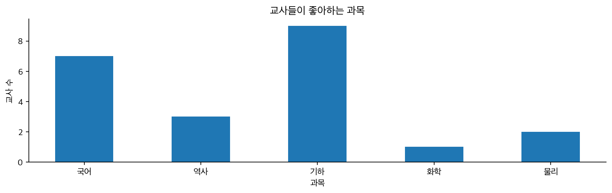

    **세 눈금에서 비가 모두 $1.285714$ 다.** 개수로 그리든 백분율로 그리든 그림은 같고, 바뀌는 것은 세로축 이름표뿐이다.

    **섭씨는 그렇지 않다.** 같은 두 온도의 비가 섭씨로 $2.0000$, 화렌하이트로 $1.3600$ 이다. 게다가 두 번째 줄에서는 섭씨 비가 $1.6667$ 로 달라지는데 화렌하이트 비는 $1.3051$ 로 별로 안 움직인다. **두 눈금이 아예 다른 이야기를 한다.** 막대그림의 전제가 무너진 것이고, 이 전제가 다시 등장하는 자리가 $4$ 절의 축 자르기다(보기 6).

### 순서가 없는 범주는 정렬하라

과목 사이에는 자연스러운 순서가 없다. 이런 경우 **값이 큰 순서로 정렬**하면 읽기가 훨씬 쉬워진다.

<div class="exbox" markdown>

**보기 2.** <span class="diff easy" title="쉬움"></span> 정렬이 정확히 무엇을 최소화하는가. 보기 1 의 교사 수 $7, 3, 9, 1, 2$ 를 그린다.

**(1)** 이웃한 두 막대의 높이 차를 모두 더한 양 $V = \sum_{k=1}^{K-1} \lvert x_{\pi(k)} - x_{\pi(k+1)}\rvert$ 을 생각하자. 어떤 배열 $\pi$ 에서나 $V \ge x_{\max} - x_{\min}$ 임을 보이고, 등호가 성립하는 배열을 밝히시오.

**(2)** 다섯 값의 모든 배열을 훑어 (1)을 확인하고, 이 성질이 **순서가 있는 범주**에서는 왜 정렬하지 말아야 하는 이유가 되는지 적으시오.

</div>

??? success "풀이"

    **(1) 해석적으로.** 배열 $\pi$ 에서 최댓값이 놓인 자리를 $p$, 최솟값이 놓인 자리를 $q$ 라 하자. 일반성을 잃지 않고 $p < q$ 라 하면, 그 사이 구간의 차를 더한 것이 망원경처럼 접힌다.

    $$
    \sum_{k=p}^{q-1} \left(x_{\pi(k+1)} - x_{\pi(k)}\right) = x_{\pi(q)} - x_{\pi(p)} = x_{\min} - x_{\max}
    $$

    절댓값의 합은 합의 절댓값보다 작을 수 없으므로(삼각부등식)

    $$
    \sum_{k=p}^{q-1} \lvert x_{\pi(k+1)} - x_{\pi(k)}\rvert
    \ \ge\ \left\lvert \sum_{k=p}^{q-1} \left(x_{\pi(k+1)} - x_{\pi(k)}\right)\right\rvert
    = x_{\max} - x_{\min}
    $$

    이고, $V$ 는 이 부분합에 나머지 음이 아닌 항을 더한 것이므로

    $$
    V \ \ge\ x_{\max} - x_{\min}
    $$

    이다. **하한이 범위다.** 등호가 되려면 $p$ 와 $q$ 밖의 모든 항이 $0$ 이어야 하고 그 사이 항들의 부호가 모두 같아야 한다. 값이 서로 다르면 이는 **$\pi$ 가 단조 배열**, 곧 오름차순이나 내림차순일 때만 가능하다.

    **그러므로 정렬은 "눈이 위아래로 오르내리는 총량" 을 최소로 만드는 배열이다.** 이 자료는 범위가 $9 - 1 = 8$ 이므로 정렬하면 $V = 8$ 이어야 하고, 자료에 적힌 순서 $7, 3, 9, 1, 2$ 는

    $$
    V = \lvert 7-3\rvert + \lvert 3-9\rvert + \lvert 9-1\rvert + \lvert 1-2\rvert = 4 + 6 + 8 + 1 = 19
    $$

    로 그 두 배가 넘는다. 위아래로 세 번 꺾이는 그림을 눈이 따라가야 하는 것이다.

    **(2) 수치적으로.**

    ```python
    import matplotlib.pyplot as plt
    import numpy as np
    import pandas as pd
    from itertools import permutations

    plt.rcParams["font.family"] = "Apple SD Gothic Neo"   # 한글 글꼴
    plt.rcParams["axes.unicode_minus"] = False            # 음수 기호가 네모가 되지 않게

    df = pd.DataFrame({'과목': ['국어', '역사', '기하', '화학', '물리'],
                       '교사 수': [7, 3, 9, 1, 2]})

    fig, (ax1, ax2) = plt.subplots(1, 2, figsize=(12, 3.5))

    # 왼쪽: 자료에 적힌 순서 그대로
    ax1.bar(df['과목'], df['교사 수'], width=0.5, color='steelblue')
    ax1.set_title("정렬하지 않음")
    ax1.set_ylabel("교사 수")

    # 오른쪽: 값이 큰 순서로 정렬
    df_sorted = df.sort_values('교사 수', ascending=False)
    ax2.bar(df_sorted['과목'], df_sorted['교사 수'], width=0.5, color='steelblue')
    ax2.set_title("값 순으로 정렬")

    for ax in (ax1, ax2):
        ax.spines[['top', 'right']].set_visible(False)
    plt.tight_layout()
    plt.show()

    # (1) 이웃 막대의 높이 차를 모두 더해 본다.
    def tv(v):
        return np.abs(np.diff(v)).sum()

    v = df['교사 수'].to_numpy(float)
    span = v.max() - v.min()
    print(f"자료 순서  {v.astype(int).tolist()}   이웃 차의 합 {tv(v):.0f}")
    vs = np.sort(v)[::-1]
    print(f"큰 순 정렬 {vs.astype(int).tolist()}   이웃 차의 합 {tv(vs):.0f}   범위 {span:.0f}")

    # 5! = 120 가지 배열을 모두 훑어 최소가 정렬된 것인지 확인한다.
    sums = sorted(tv(np.array(p)) for p in permutations(v))
    print(f"\n120 가지 배열의 이웃 차 합: 최소 {sums[0]:.0f}, 최대 {sums[-1]:.0f}")
    print(f"최소를 내는 배열의 개수 {sum(1 for s in sums if s == sums[0])}")

    # 순서가 있는 범주에서는 그 총변동 자체가 읽을 정보다.
    sales = np.array([80, 75, 85, 90, 95, 110, 130, 125, 100, 92, 88, 140], float)
    print(f"\n월별 매출 12개월: 이웃 차의 합 {tv(sales):.0f}, 범위 {sales.max()-sales.min():.0f}")
    print(f"  크기 순으로 정렬하면 {tv(np.sort(sales)[::-1]):.0f} 로 줄어든다 — 범위와 같다")
    ```

    출력:

    ```
    자료 순서  [7, 3, 9, 1, 2]   이웃 차의 합 19
    큰 순 정렬 [9, 7, 3, 2, 1]   이웃 차의 합 8   범위 8

    120 가지 배열의 이웃 차 합: 최소 8, 최대 25
    최소를 내는 배열의 개수 2

    월별 매출 12개월: 이웃 차의 합 154, 범위 65
      크기 순으로 정렬하면 65 로 줄어든다 — 범위와 같다
    ```

    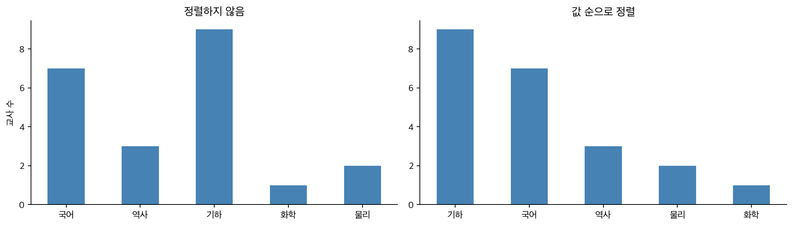

    **$120$ 가지 배열 가운데 최소가 정확히 $8$, 곧 범위다.** 그 최소를 내는 배열이 딱 둘뿐인 것도 유도한 대로다 — 오름차순과 내림차순이다. 최대는 $25$ 로 최소의 세 배를 넘는다.

    왼쪽 그림에서 "두 번째로 많은 과목이 무엇인가" 를 답하려면 막대 높이를 하나씩 견주어야 한다. 오른쪽에서는 두 번째 막대를 보면 끝이다.

    **그런데 같은 산술이 정렬을 말리는 근거도 된다.** 월별 매출 $12$ 개월의 이웃 차 합이 $154$ 인데 범위는 $65$ 다. 차 $154 - 65 = 89$ 가 바로 **오르내림**, 곧 계절성이다. 정렬하면 그것이 $65$ 로 깎여 사라진다. **정렬이 최소화하는 양은 "읽기 부담" 이기도 하고 "순서가 담은 정보" 이기도 하다.** 범주에 자연스러운 순서가 없으면 전자뿐이니 정렬이 이득이지만, 요일·월·나이 구간·신용등급 A–G 처럼 순서가 있으면 후자를 잃는다.

### 이름이 길면 가로 막대

범주 이름이 길면 가로축에서 글자가 겹치거나 기울어진다. 막대를 눕히면 이름을 가로로 편하게 읽을 수 있다.

<div class="exbox" markdown>

**보기 3.** <span class="diff easy" title="쉬움"></span> 막대를 눕히면 무엇이 달라지고 무엇이 그대로인가.

**(1)** 막대를 가로로 눕히는 것은 그림을 $90^\circ$ 돌리는 일이다. 그래서 **길이의 비가 보존됨**을 적고, 그 대신 정렬 방향이 뒤집히는 까닭을 밝히시오.

**(2)** 범주 이름이 차지하는 가로 공간을 범주 수 $K$ 와 이름 길이로 어림하여, 왜 이름이 길면 가로 막대가 유리한지 보이시오.

**(3)** 가로 막대그림을 그려 막대 길이와 자리를 실제로 재어 확인하시오.

</div>

??? success "풀이"

    **(1) 해석적으로.** 회전은 등거리변환이라 길이를 바꾸지 않는다. 세로 막대의 길이가 $\ell_i = x_i$ 였으니 눕힌 뒤에도 $\ell_i = x_i$ 이고

    $$
    \frac{\ell_i}{\ell_j} = \frac{x_i}{x_j}
    $$

    가 그대로 성립한다. **보기 1 의 결론은 방향과 무관하다.** 기준선이 $0$ 인지가 전부이고, 그 기준선이 왼쪽 벽이 되었을 뿐이다.

    **바뀌는 것은 자리의 방향이다.** `bar` 는 $x$ 좌표 $0, 1, 2, \ldots$ 를 **왼쪽에서 오른쪽**으로 놓지만, `barh` 는 $y$ 좌표 $0, 1, 2, \ldots$ 를 **아래에서 위로** 놓는다. 그러므로 자료의 첫 원소가 맨 아래 막대가 되고, **"위가 가장 큰" 그림을 얻으려면 오름차순으로 정렬해야 한다.** 세로 막대에서 내림차순으로 정렬했던 것과 정확히 반대다.

    **(2) 이름표의 가로 공간.** 범주 이름의 평균 글자 수를 $w$, 글자 하나의 폭을 $c$ 라 하자.

    - **세로 막대**는 이름을 가로축에 나란히 늘어놓으므로 필요한 가로 공간이 약 $K w c$ 다. 그림 폭 $W$ 를 넘으면 글자가 겹치고, 그래서 이름을 기울이거나 줄여야 한다.
    - **가로 막대**는 이름을 세로로 쌓으므로 필요한 가로 공간이 **가장 긴 이름 하나의 폭** $w_{\max} c$ 뿐이다. $K$ 에 전혀 비례하지 않는다.

    $$
    \text{세로 막대: } K w c \le W, \qquad \text{가로 막대: } w_{\max} c \le W
    $$

    **$K$ 가 커질 때 세로 막대의 제약만 조여든다.** 이 자료는 이름이 모두 두 글자이므로 세로 막대에 약 $10$ 자 폭이 필요하고 가로 막대에는 $2$ 자 폭이면 된다 — $K = 5$ 배 차이다. 범주가 $20$ 개이고 이름이 긴 자료(지역명, 부서명)에서는 그 배수가 그대로 $20$ 배가 된다.

    **(3) 수치적으로.**

    ```python
    import numpy as np

    fig, ax = plt.subplots(figsize=(8, 3))

    df_sorted = df.sort_values('교사 수')       # 가로 막대는 아래에서 위로 쌓이므로
                                               # 오름차순으로 정렬해야 위가 가장 크다
    bars = ax.barh(df_sorted['과목'], df_sorted['교사 수'],
                   color='steelblue', height=0.6)
    ax.set_xlabel("교사 수")
    ax.set_title("가로 막대그림")
    ax.spines[['top', 'right']].set_visible(False)
    plt.tight_layout()
    plt.show()

    # (1) 회전은 길이의 비를 바꾸지 않는다. 막대의 실제 길이와 자리를 재어 본다.
    print(f"{'자리':>5}{'과목':>6}{'교사 수':>9}{'막대 길이':>11}{'y 중심':>9}")
    for k, (name, x, b) in enumerate(zip(df_sorted['과목'], df_sorted['교사 수'], bars)):
        print(f"{k:>5}{name:>6}{x:>9}{b.get_width():>11.2f}"
              f"{b.get_y() + b.get_height()/2:>9.2f}")

    v = df_sorted['교사 수'].to_numpy(float)
    w = np.array([b.get_width() for b in bars])
    print(f"\n길이의 비 (맨 위 / 맨 아래): 값 {v[-1]/v[0]:.6f},  막대 {w[-1]/w[0]:.6f}")
    print(f"맨 위 막대 = {df_sorted['과목'].iloc[-1]} ({df_sorted['교사 수'].iloc[-1]}명)"
          f",  맨 아래 = {df_sorted['과목'].iloc[0]} ({df_sorted['교사 수'].iloc[0]}명)")

    # (2) 이름표에 드는 가로 공간의 어림셈
    names = df['과목'].tolist()
    print(f"\n범주 {len(names)}개,  이름 글자 수 {[len(s) for s in names]}")
    print(f"  세로 막대: 이름이 가로로 나란히 →  약 {sum(len(s) for s in names)}자 폭")
    print(f"  가로 막대: 이름이 세로로 쌓임  →  약 {max(len(s) for s in names)}자 폭")
    ```

    출력:

    ```
       자리    과목     교사 수      막대 길이     y 중심
        0    화학        1       1.00     0.00
        1    물리        2       2.00     1.00
        2    역사        3       3.00     2.00
        3    국어        7       7.00     3.00
        4    기하        9       9.00     4.00

    길이의 비 (맨 위 / 맨 아래): 값 9.000000,  막대 9.000000
    맨 위 막대 = 기하 (9명),  맨 아래 = 화학 (1명)

    범주 5개,  이름 글자 수 [2, 2, 2, 2, 2]
      세로 막대: 이름이 가로로 나란히 →  약 10자 폭
      가로 막대: 이름이 세로로 쌓임  →  약 2자 폭
    ```

    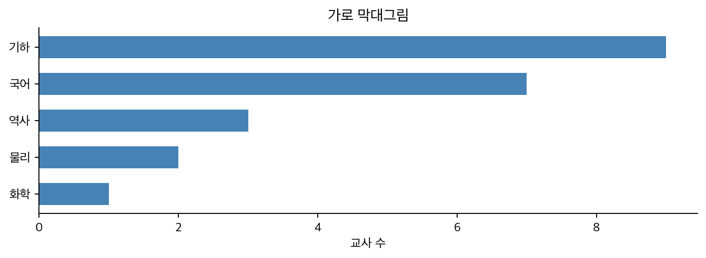

    **막대 길이가 값과 똑같고 비도 $9.000000$ 으로 보존된다.** 그리고 `y 중심` 이 $0, 1, 2, 3, 4$ 로 **아래에서 위로** 커지므로, 오름차순으로 넣은 결과 가장 큰 기하가 맨 위에 놓였다. 오름차순을 쓰지 않았다면 큰 막대가 아래로 내려가 "$1$ 위가 맨 위" 라는 읽기 습관과 어긋난다.

    **이름표 공간의 어림셈도 들어맞는다.** $10$ 자 대 $2$ 자, 곧 $K = 5$ 배다. 가로 막대가 그 대신 내놓는 것은 **세로 공간**이다 — 범주가 많으면 그림이 길어진다. 하지만 세로로 긴 그림은 화면에서 굴려 볼 수 있고, 가로로 넘치는 그림은 그럴 수 없다.

## 2. 묶음 막대그림

집단마다 여러 값을 비교할 때 쓴다.

<div class="exbox" markdown>

**보기 4.** <span class="diff easy" title="쉬움"></span> 묶음 막대가 담는 것과 담지 않는 것. 학생 다섯 명의 중간고사와 기말고사 점수를 나란히 그린다.

**(1)** 자리 간격을 $1$ 로 두고 한 자리에 $m$ 개의 막대를 폭 $w$ 로 놓을 때, $k$ 번째 막대의 중심 위치를 식으로 적고 겹치지 않을 조건을 구하시오. 코드의 $m = 2$, $w = 0.3$ 은 그 조건을 만족하는가.

**(2)** 묶음 막대에서 **어떤 두 막대든** 길이의 비가 값의 비와 같은 까닭을 적고, 그런데도 이 그림이 **담지 못하는 양**이 무엇인지 밝히시오.

**(3)** 그림을 그려 막대의 아래끝과 중심을 재어 (1), (2)를 확인하시오.

</div>

??? success "풀이"

    **(1) 해석적으로.** 자리 $p$ 에 $m$ 개 막대를 폭 $w$ 로 가운데 맞춤으로 놓으려면 $k = 0, 1, \ldots, m-1$ 번째 막대의 중심을

    $$
    p + \left(k - \frac{m-1}{2}\right) w
    $$

    에 둔다. $k$ 를 $\frac{m-1}{2}$ 만큼 빼는 것이 묶음 전체를 $p$ 에 맞추는 일이다. $m = 2$ 면 $-w/2$ 와 $+w/2$, 곧 **좌우로 반 폭씩 미는 것**이 되고 코드가 그렇게 했다. $m = 3$ 이면 $-w, 0, +w$ 다.

    묶음이 차지하는 전체 폭이 $mw$ 이므로 이웃 자리와 겹치지 않을 조건은

    $$
    m w \le 1
    $$

    이다. $m = 2$, $w = 0.3$ 이면 $0.6 \le 1$ 로 여유가 $0.4$ 다. 이 여유가 묶음 사이의 틈이 되어 "어느 막대들이 한 묶음인가" 를 눈이 알아보게 한다. **계열이 늘면 $w \le 1/m$ 로 막대가 가늘어지고, 가늘어진 막대는 길이를 읽기 어려워진다** — 묶음 막대가 계열 넷을 넘기면 나빠지는 산술적 이유다.

    **(2) 모든 막대가 $0$ 에서 출발한다.** 그러므로 같은 학생의 두 막대든 다른 학생의 막대든, 어떤 쌍에 대해서도

    $$
    \frac{\ell_i}{\ell_j} = \frac{x_i}{x_j}
    $$

    가 성립한다. 보기 1 의 성질이 $2K$ 개 막대 전부에 그대로 적용되는 것이다. **이것이 다음 절의 누적 막대와 갈리는 지점이다** — 누적에서는 맨 아래 조각만 $0$ 에서 출발한다(보기 5).

    **그런데 이 그림은 변화량을 담지 않는다.** 길이로 부호화된 것은 $x_i$ 자체이고 $x_{i,\text{기말}} - x_{i,\text{중간}}$ 은 **두 막대 끝의 차이**로만 나타난다. 차이를 읽으려면 공통 기준선이 없는 두 점의 거리를 재야 하므로, 길이 읽기의 정확도를 잃는다.

    **그 결과가 수로 드러난다.** 가장 긴 막대는 William 의 $100$ 점이지만 가장 크게 변한 학생은 Vanessa 로 $+30$ 점이다. **눈이 먼저 가는 곳과 알고 싶은 것이 어긋난다.** 변화가 본론이면 변화를 직접 막대로 그려야 한다.

    **(3) 수치적으로.**

    ```python
    import matplotlib.pyplot as plt
    import numpy as np
    import pandas as pd

    plt.rcParams["font.family"] = "Apple SD Gothic Neo"   # 한글 글꼴
    plt.rcParams["axes.unicode_minus"] = False            # 음수 기호가 네모가 되지 않게

    data = {
        '학생': ['Brandon', 'Vanessa', 'Daniel', 'Kevin', 'William'],
        '중간고사': [85, 60, 60, 65, 100],
        '기말고사': [90, 90, 65, 80, 95]
    }
    df = pd.DataFrame(data).set_index('학생')

    positions = np.arange(len(df))   # 학생마다 기준 위치 0, 1, 2, 3, 4
    width = 0.3                      # 막대 하나의 폭

    fig, ax = plt.subplots(figsize=(12, 3))

    # 묶음 막대의 요령: 기준 위치에서 좌우로 반 폭씩 밀어 놓는다.
    #   중간고사는 왼쪽(-width/2), 기말고사는 오른쪽(+width/2)
    # 이렇게 하면 두 막대가 겹치지 않으면서 같은 학생끼리 붙어 있게 된다.
    b1 = ax.bar(positions - width / 2, df['중간고사'], width=width, label="중간고사")
    b2 = ax.bar(positions + width / 2, df['기말고사'], width=width, label="기말고사")
    ax.set_xticks(positions)
    ax.set_xticklabels(df.index)
    ax.set_xlabel("학생")
    ax.set_ylabel("점수")
    ax.set_title("중간고사와 기말고사 점수")
    ax.legend(title="시험 종류")
    ax.spines['right'].set_visible(False)
    ax.spines['top'].set_visible(False)
    plt.show()

    # (2) 모든 막대가 0 에서 출발한다. 아래끝을 재어 확인한다.
    bottoms = [b.get_y() for b in list(b1) + list(b2)]
    print(f"막대 {len(bottoms)}개의 아래끝: 최소 {min(bottoms):.2f}, 최대 {max(bottoms):.2f}")

    # (1) 배치 공식이 맞는지 중심 위치를 재어 본다.
    m, w = 2, width
    print(f"\n{'학생':>9}{'중간':>7}{'기말':>7}{'중심(중간)':>12}{'중심(기말)':>12}")
    for name, a, b, p1, p2 in zip(df.index, df['중간고사'], df['기말고사'], b1, b2):
        print(f"{name:>9}{a:>7}{b:>7}"
              f"{p1.get_x() + p1.get_width()/2:>12.2f}{p2.get_x() + p2.get_width()/2:>12.2f}")
    print(f"배치 공식 p + (k - (m-1)/2) * w,  m = {m}, w = {w}:  "
          f"{-(m-1)/2*w:+.2f}, {(1-(m-1)/2)*w:+.2f}")
    print(f"겹치지 않을 조건 m*w <= 1:  {m} * {w} = {m*w:.2f}")

    # (2) 묶음 막대는 '변화'를 담지 않는다.
    a = df['중간고사'].to_numpy(float)
    b = df['기말고사'].to_numpy(float)
    print(f"\n{'학생':>9}{'변화':>8}{'비':>9}")
    for name, dd, q in zip(df.index, b - a, b / a):
        print(f"{name:>9}{dd:>+8.0f}{q:>9.4f}")
    print(f"\n가장 긴 막대: {df.index[np.argmax(np.maximum(a, b))]}"
          f" ({max(a.max(), b.max()):.0f}점)")
    print(f"가장 크게 변한 학생: {df.index[np.argmax(np.abs(b - a))]}"
          f" ({(b - a)[np.argmax(np.abs(b - a))]:+.0f}점)")
    print(f"평균 변화 {np.mean(b - a):+.1f}점")
    ```

    출력:

    ```
    막대 10개의 아래끝: 최소 0.00, 최대 0.00

           학생     중간     기말      중심(중간)      중심(기말)
      Brandon     85     90       -0.15        0.15
      Vanessa     60     90        0.85        1.15
       Daniel     60     65        1.85        2.15
        Kevin     65     80        2.85        3.15
      William    100     95        3.85        4.15
    배치 공식 p + (k - (m-1)/2) * w,  m = 2, w = 0.3:  -0.15, +0.15
    겹치지 않을 조건 m*w <= 1:  2 * 0.3 = 0.60

           학생      변화        비
      Brandon      +5   1.0588
      Vanessa     +30   1.5000
       Daniel      +5   1.0833
        Kevin     +15   1.2308
      William      -5   0.9500

    가장 긴 막대: William (100점)
    가장 크게 변한 학생: Vanessa (+30점)
    평균 변화 +10.0점
    ```

    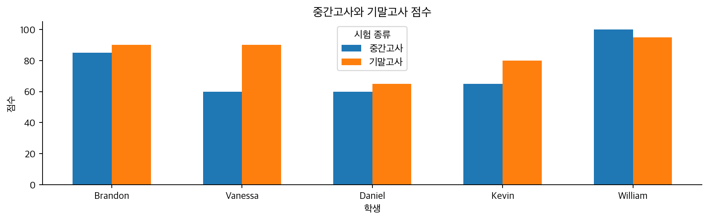

    **막대 열 개의 아래끝이 모두 정확히 $0$ 이다.** 그래서 어떤 두 막대든 길이를 견줄 수 있다.

    **배치 공식도 맞는다.** 중심이 자리마다 $\mp 0.15$ 로 밀려 있고, 그것이 $(k - (m-1)/2)w$ 가 예측한 $-0.15$, $+0.15$ 와 같다. 묶음 폭 $0.60$ 이 자리 간격 $1$ 보다 작으므로 겹치지 않는다.

    **묶음 막대는 개별 값을 비교할 때** 쓴다. 학생별로 두 시험을 나란히 놓아 Vanessa 가 $60$ 에서 $90$ 으로 올랐다는 사실이 보인다.

    **그러나 변화 자체는 눈금 밖에 있다.** 변화가 $+5, +30, +5, +15, -5$ 로 여섯 배 차이 나는데 그림에서는 모두 "두 막대의 높이 차" 라는 같은 종류의 읽기가 된다. 평균 변화 $+10$ 점이라는 수도 그림에는 없다. **William 만 내려갔다($-5$)는 것조차 두 막대의 어느 쪽이 더 긴지 눈으로 가려야 알 수 있다.** 변화가 본론이면 $(b - a)$ 를 $0$ 기준 막대로 그리는 것이 맞고, 그러면 부호와 크기가 한 번에 읽힌다.

## 3. 분할(누적) 막대그림

각 범주가 무엇으로 구성되어 있는지 보여 준다.

<div class="exbox" markdown>

**보기 5.** <span class="diff easy" title="쉬움"></span> 누적 막대에서 몇 개의 조각이 공통 기준선을 갖는가. 세 연령집단의 항체 보유 여부를 누적 막대로 그린다.

**(1)** 조각 $j$ 의 아래끝을 앞선 조각들로 적고, **공통 기준선($=0$)을 갖는 조각이 몇 개인지** 밝히시오.

**(2)** 조각이 **둘**이고 전체 합이 범주마다 같을 때는 누적 막대에 정보 손실이 없음을 보이고, 조각이 **셋 이상**이면 무엇이 깨지는지 수로 보이시오.

**(3)** 그림을 그려 조각의 아래끝을 재어 (1), (2)를 확인하시오.

</div>

??? success "풀이"

    **(1) 해석적으로.** 범주 $i$ 의 조각들을 $x_{i1}, x_{i2}, \ldots, x_{iJ}$ 라 하고 아래에서부터 쌓으면 조각 $j$ 의 아래끝과 위끝이

    $$
    b_{ij} = \sum_{l < j} x_{il}, \qquad t_{ij} = b_{ij} + x_{ij} = \sum_{l \le j} x_{il}
    $$

    이다. $j = 1$ 이면 빈 합이라 $b_{i1} = 0$ 이고, 이는 **$i$ 에 무관하다.**

    $j \ge 2$ 에서는 $b_{ij}$ 가 그 범주의 앞선 조각들에 달려 있으므로 범주마다 다르다. 곧

    $$
    \textbf{공통 기준선을 갖는 조각은 맨 아래 하나뿐이다.}
    $$

    맨 아래 조각은 보기 1 의 성질을 그대로 누리지만, 위쪽 조각들은 **떠 있는 두 점의 거리**를 재야 해서 길이 읽기의 정확도를 잃는다.

    **(2) 조각이 둘일 때.** 전체 합이 모든 범주에서 같은 값 $T$ 라면

    $$
    x_{i2} = T - x_{i1}
    $$

    이므로 **둘째 조각의 길이가 첫째 조각에서 완전히 결정된다.** 둘째 조각을 눈으로 재지 못해도 잃는 것이 없다 — 어차피 첫째 조각이 다 말해 준다. 그리고 둘째 조각의 위끝이 모두 $T$ 로 같으니, 위에서 아래로 읽으면 둘째 조각도 공통 기준선을 갖는다. **조각이 둘이고 합이 일정한 경우가 누적 막대가 결함 없이 작동하는 유일한 꼴이다.**

    조각이 $J \ge 3$ 이면 이 구원이 사라진다. 가운데 조각 $j$ 는 아래끝 $b_{ij}$ 도 위끝 $t_{ij}$ 도 범주마다 다르고, $J$ 개 가운데 $J - 2$ 개가 그런 처지다. 아래에서 보듯 이 자료에서 가운데 조각의 아래끝이 $95, 90, 40$ 으로 $55$ 만큼 퍼진다. **길이 $3$ 과 $25$ 를 견주어야 하는데 두 조각이 서로 $55$ 떨어진 높이에 떠 있는 것이다.**

    **(3) 수치적으로.**

    ```python
    import matplotlib.pyplot as plt
    import numpy as np

    plt.rcParams["font.family"] = "Apple SD Gothic Neo"   # 한글 글꼴
    plt.rcParams["axes.unicode_minus"] = False            # 음수 기호가 네모가 되지 않게

    labels = ("있음", "없음")
    counts = (np.array([95, 90, 40]), np.array([5, 10, 60]))
    age_groups = ("성인", "어린이", "영아")

    fig, ax = plt.subplots(figsize=(6, 3))

    # 누적 막대의 요령: bottom 인자로 "이 막대가 어디서부터 시작할지"를 준다.
    # 첫 막대는 0에서 시작하고, 다음 막대는 앞선 막대들의 합에서 시작한다.
    bottom = np.zeros(3)
    patches = {}

    for label, count in zip(labels, counts):
        patches[label] = ax.bar(np.arange(3), count, width=0.5, bottom=bottom,
                                tick_label=age_groups, label=label)
        bottom += count          # 다음 막대의 출발점을 위로 올린다

    ax.set_title("항체를 가지고 있는가?")
    ax.spines['top'].set_visible(False)
    ax.spines['right'].set_visible(False)
    # bbox_to_anchor로 범례를 그림 바깥 오른쪽에 내보낸다
    ax.legend(title="응답", loc="center left", bbox_to_anchor=(1.0, 0.5))
    plt.tight_layout()
    plt.show()

    # (1) 조각의 아래끝과 위끝. 맨 아래 조각만 0 에서 출발한다.
    print(f"{'집단':>7}{'조각':>7}{'길이':>7}{'아래끝':>9}{'위끝':>7}")
    for label in labels:
        for g, b in zip(age_groups, patches[label]):
            print(f"{g:>7}{label:>7}{b.get_height():>7.0f}{b.get_y():>9.0f}"
                  f"{b.get_y() + b.get_height():>7.0f}")
    for label in labels:
        ys = np.array([b.get_y() for b in patches[label]])
        print(f"'{label}' 조각의 아래끝 {ys.astype(int).tolist()}  "
              f"퍼짐 {ys.max() - ys.min():.0f}")

    # (2) 조각이 둘이고 합이 일정하면 둘째 조각은 첫째에서 복원된다.
    T = counts[0] + counts[1]
    print(f"\n세 집단의 합 {T.tolist()}")
    print(f"둘째 조각 {counts[1].tolist()} = 합 - 첫째 {(T - counts[0]).tolist()}"
          f"   같은가 {np.array_equal(counts[1], T - counts[0])}")

    # 조각이 셋이면 가운데 조각의 양 끝이 모두 제각각이다.
    three = np.array([[95, 90, 40],     # 있음
                      [3, 6, 25],       # 모름
                      [2, 4, 35]], float)
    tops = np.cumsum(three, axis=0)
    bots = tops - three
    print(f"\n조각 셋 (있음 / 모름 / 없음), 합 {tops[-1].astype(int).tolist()}")
    for j, nm in enumerate(["있음", "모름", "없음"]):
        print(f"  {nm}: 길이 {three[j].astype(int).tolist()}  "
              f"아래끝 {bots[j].astype(int).tolist()}  퍼짐 {bots[j].max()-bots[j].min():.0f}")
    print(f"가운데 조각의 길이 비 (영아 / 성인) = {three[1,2]/three[1,0]:.2f} 배"
          f" — 그런데 두 조각이 높이 {bots[1,0]:.0f} 와 {bots[1,2]:.0f} 에 떠 있다")
    ```

    출력:

    ```
         집단     조각     길이      아래끝     위끝
         성인     있음     95        0     95
        어린이     있음     90        0     90
         영아     있음     40        0     40
         성인     없음      5       95    100
        어린이     없음     10       90    100
         영아     없음     60       40    100
    '있음' 조각의 아래끝 [0, 0, 0]  퍼짐 0
    '없음' 조각의 아래끝 [95, 90, 40]  퍼짐 55

    세 집단의 합 [100, 100, 100]
    둘째 조각 [5, 10, 60] = 합 - 첫째 [5, 10, 60]   같은가 True

    조각 셋 (있음 / 모름 / 없음), 합 [100, 100, 100]
      있음: 길이 [95, 90, 40]  아래끝 [0, 0, 0]  퍼짐 0
      모름: 길이 [3, 6, 25]  아래끝 [95, 90, 40]  퍼짐 55
      없음: 길이 [2, 4, 35]  아래끝 [98, 96, 65]  퍼짐 33
    가운데 조각의 길이 비 (영아 / 성인) = 8.33 배 — 그런데 두 조각이 높이 95 와 40 에 떠 있다
    ```

    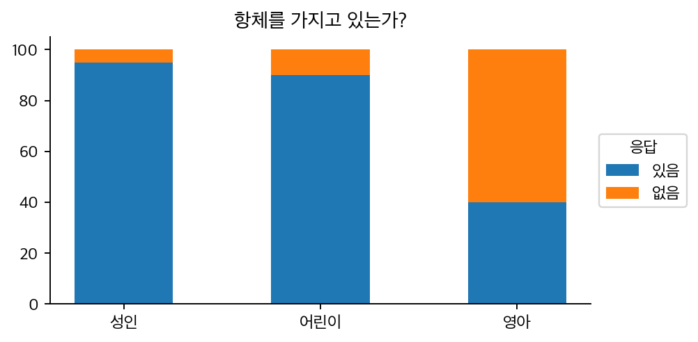

    **'있음' 조각의 아래끝이 세 집단 모두 $0$ 이고 퍼짐이 $0$ 이다.** '없음' 조각은 아래끝이 $95, 90, 40$ 으로 $55$ 만큼 퍼져 있다. 유도한 대로 공통 기준선을 갖는 조각이 하나뿐이다.

    **그런데 이 자료에서는 그것이 문제가 되지 않는다.** 합이 세 집단 모두 $100$ 이므로 둘째 조각 $[5, 10, 60]$ 이 $[100-95, 100-90, 100-40]$ 과 정확히 같다(`같은가 True`). 둘째 조각의 위끝이 모두 $100$ 이라 **위에서 아래로 읽으면 그쪽도 공통 기준선**이다.

    **조각이 셋이 되면 다르다.** 가운데 '모름' 조각의 아래끝이 $95, 90, 40$ 으로 퍼짐 $55$, 위끝도 $98, 96, 65$ 로 제각각이다. 영아의 '모름' 이 성인의 $8.33$ 배인데, 그 두 조각은 서로 $55$ 떨어진 높이에 떠 있어 눈으로는 비교가 되지 않는다. **$J$ 개 조각 가운데 양 끝 둘만 기준선을 갖고 나머지 $J-2$ 개는 떠 있다.**

    **누적 막대는 구성비를 볼 때** 쓴다. 세 집단 모두 전체 높이가 $100$ 으로 같아, 영아 집단만 항체 보유 비율이 $40\%$ 로 낮다는 점이 바로 드러난다.

!!! warning "맨 아래 조각만 정확히 비교할 수 있다"
    누적 막대에는 구조적 한계가 있다. **아래쪽 조각은 시작점이 모두 0으로 같아 길이를 견주기 쉽지만, 위쪽 조각은 시작점이 제각각이라 눈으로 비교하기 어렵다.**

    조각이 셋 이상이고 여러 조각을 정확히 비교해야 한다면 묶음 막대나, 조각마다 작은 그림을 따로 그리는 편이 낫다.

    누적 막대가 잘 맞는 경우는 조각이 둘일 때, 그리고 **전체 높이 자체**가 의미 있는 값일 때다.

## 4. 막대그림에서 가장 흔한 거짓말

막대그림은 길이로 크기를 나타내므로, **세로축이 반드시 0에서 시작해야 한다.** 축을 잘라 내면 길이의 비율이 값의 비율과 달라진다.

<div class="exbox" markdown>

**보기 6.** <span class="diff easy" title="쉬움"></span> 기준선을 올리면 길이비가 얼마든지 커진다. 두 값 $y_1 = 102$, $y_2 = 100$ 을 막대로 그린다.

**(1)** 기준선 $b$ 에서 두 막대의 길이비를 식으로 적고, 그것이 $b$ 에 대해 **단조증가**함을 미분으로 보이시오. $b \to \min(y)$ 에서 어떻게 되는가.

**(2)** $b = 0, 95, 99, 99.9$ 에서 길이비를 구해 참 비 $1.02$ 와 견주시오.

**(3)** 선그림에서는 축을 잘라도 되는 까닭을 식으로 밝히고, 네 값 $102, 105, 103, 108$ 로 (1)–(3)을 모두 확인하시오.

</div>

??? success "풀이"

    **(1) 해석적으로.** 기준선이 $b$ 이면 범주 $i$ 의 막대 길이는 $\ell_i = y_i - b$ 다. 두 막대의 길이비는

    $$
    R(b) = \frac{y_1 - b}{y_2 - b}
    $$

    이고, $b = 0$ 일 때만 $R(0) = y_1/y_2$ 로 **값의 비와 같다.** $b$ 로 미분하면

    $$
    R'(b) = \frac{-(y_2 - b) + (y_1 - b)}{(y_2 - b)^2} = \frac{y_1 - y_2}{(y_2 - b)^2}
    $$

    이다. $y_1 > y_2$ 이면 분자가 양수, 분모가 양수이므로 $R'(b) > 0$ — **기준선을 올릴수록 길이비가 커지고, 중간에 멈추는 곳이 없다.** 그리고 $b \to y_2^- = \min(y)^-$ 이면 분모 $y_2 - b \to 0^+$ 이므로

    $$
    R(b) \longrightarrow +\infty
    $$

    다. **길이비를 원하는 값으로 만들 수 있다.** 자료를 하나도 건드리지 않고 축만 바꾸어서다. 보기 1 에서 본 아핀변환 문제가 여기서 가장 노골적인 꼴로 나타난다 — 축 자르기란 $y \mapsto y - b$ 를 몰래 적용하는 일이다.

    **(2) 수로.** $y_1 = 102$, $y_2 = 100$ 이면 참 비가 $1.02$ 다.

    | $b$ | 길이 $y_1 - b$ | 길이 $y_2 - b$ | 길이비 | 참 비의 몇 배 |
    |---|---|---|---|---|
    | $0$ | $102$ | $100$ | $1.02$ | $1.00$ |
    | $95$ | $7$ | $5$ | $1.40$ | $1.37$ |
    | $99$ | $3$ | $1$ | $3.00$ | $2.94$ |
    | $99.9$ | $2.1$ | $0.1$ | $21.00$ | $20.59$ |

    **$2\%$ 차이가 $2100\%$ 차이로 보이게 만들 수 있다.** 그것도 축 눈금을 정직하게 적어 놓은 채로 — 숫자는 어디에도 거짓이 없고 **길이만 거짓**이다.

    **(3) 선그림은 왜 예외인가.** 선그림에서 읽는 것은 길이가 아니라 **이웃한 두 점 사이의 기울기**다. 그 기울기는

    $$
    \frac{(y_{i+1} - b) - (y_i - b)}{\Delta t} = \frac{y_{i+1} - y_i}{\Delta t}
    $$

    로 **$b$ 가 상쇄되어 사라진다.** 축을 잘라도 기울기와 오르내림의 순서가 그대로이므로 거짓이 생기지 않는다. 오히려 축을 잘라 확대하는 것이 작은 변화를 보이는 올바른 방법이다.

    **차이는 비를 읽는가 차를 읽는가에 있다.** 막대는 길이를 읽으므로 비에 뜻이 있어야 하고, 그러려면 $b = 0$ 이어야 한다. 선은 차를 읽으므로 $b$ 가 무엇이든 괜찮다. **$y$ 가 절대영점이 없는 변수(보기 1 의 섭씨 온도)라면 애초에 막대가 아니라 선이나 점이 맞는 도구다.**

    **(4) 수치적으로.**

    ```python
    import matplotlib.pyplot as plt
    import numpy as np

    plt.rcParams["font.family"] = "Apple SD Gothic Neo"   # 한글 글꼴
    plt.rcParams["axes.unicode_minus"] = False            # 음수 기호가 네모가 되지 않게

    # 같은 자료를 y축만 달리해 두 번 그린다. 숫자는 하나도 건드리지 않는다.
    fig, (ax1, ax2) = plt.subplots(1, 2, figsize=(12, 3.5))

    # 최대와 최소의 차이가 6%쯤 되는, 사실상 고만고만한 네 값이다.
    vals = [102, 105, 103, 108]
    names = ['A', 'B', 'C', 'D']

    ax1.bar(names, vals, color='indianred')
    ax1.set_ylim(0, 120)                      # 0에서 시작 — 정직한 그림
    ax1.set_title("y축이 0에서 시작 — 정직한 그림")

    ax2.bar(names, vals, color='indianred')
    ax2.set_ylim(100, 110)                    # 축을 잘라 냄 — 차이가 과장된다
    ax2.set_title("y축을 잘라 냄 — 차이가 과장된다")

    for ax in (ax1, ax2):
        ax.spines[['top', 'right']].set_visible(False)
    plt.tight_layout()
    plt.show()

    # (1)(2) 기준선 b 를 올릴 때 길이비가 어떻게 커지는가. y1 = 102, y2 = 100.
    y1, y2 = 102.0, 100.0
    print(f"참 비 y1/y2 = {y1/y2:.4f}")
    print(f"{'기준선 b':>10}{'길이 y1-b':>11}{'길이 y2-b':>11}{'길이비':>10}{'왜곡 배율':>11}")
    for b in [0.0, 50.0, 95.0, 99.0, 99.9, 99.99]:
        r = (y1 - b) / (y2 - b)
        print(f"{b:>10.2f}{y1-b:>11.2f}{y2-b:>11.2f}{r:>10.4f}{r/(y1/y2):>11.4f}")

    # 네 값 자료에서도 같은 일이 일어난다.
    v = np.array(vals, float)
    for b in [0.0, 100.0]:
        L = v - b
        print(f"\n기준선 {b:.0f}: 막대 길이 {L.astype(int).tolist()}"
              f"   D/A = {L[3]/L[0]:.4f}   (참 비 {v[3]/v[0]:.4f})")

    # (3) 선그림은 왜 예외인가. 기울기는 기준선에 무관하다.
    print("\n선그림의 기울기 (이웃 값의 차) — 기준선을 바꿔도 같다")
    for b in [0.0, 100.0, 101.9]:
        print(f"  b = {b:>5.1f}:  {np.diff(v - b).astype(int).tolist()}")
    ```

    출력:

    ```
    참 비 y1/y2 = 1.0200
         기준선 b    길이 y1-b    길이 y2-b       길이비      왜곡 배율
          0.00     102.00     100.00    1.0200     1.0000
         50.00      52.00      50.00    1.0400     1.0196
         95.00       7.00       5.00    1.4000     1.3725
         99.00       3.00       1.00    3.0000     2.9412
         99.90       2.10       0.10   21.0000    20.5882
         99.99       2.01       0.01  201.0000   197.0588

    기준선 0: 막대 길이 [102, 105, 103, 108]   D/A = 1.0588   (참 비 1.0588)

    기준선 100: 막대 길이 [2, 5, 3, 8]   D/A = 4.0000   (참 비 1.0588)

    선그림의 기울기 (이웃 값의 차) — 기준선을 바꿔도 같다
      b =   0.0:  [3, -2, 5]
      b = 100.0:  [3, -2, 5]
      b = 101.9:  [3, -2, 5]
    ```

    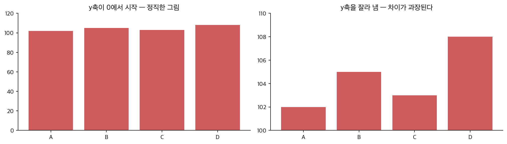

    **(1)과 (2)가 확인된다.** 길이비가 $1.02 \to 1.04 \to 1.40 \to 3.00 \to 21.00 \to 201.00$ 으로 $b$ 와 함께 단조증가하고, $b$ 가 $\min(y) = 100$ 에 다가갈수록 폭발한다. $b = 99.99$ 에서는 참 비의 $197$ 배다.

    **네 값 자료도 같다.** 왼쪽 그림에서 네 값은 거의 같아 보이고 실제로도 그렇다($102$ 에서 $108$, $6\%$ 차이). 오른쪽에서는 막대 길이가 $2, 5, 3, 8$ 이 되어 $D$ 가 $A$ 의 **네 배**처럼 보인다 — 참 비는 $1.0588$ 이니 $3.78$ 배 과장이다.

    **선그림의 기울기는 세 기준선에서 모두 $[3, -2, 5]$ 로 같다.** $b$ 가 상쇄된다는 식이 그대로 보인다. **선그림에서는 축을 잘라도 되고, 막대그림에서는 잘린 축이 곧 거짓말이다.**

## 연습문제

<div class="drillbox" markdown>

**연습문제 1.** <span class="diff med" title="중간"></span>
어떤 회사가 네 지역의 매출을 발표하면서 세로축을 900에서 1000까지로 설정한 막대그림을 썼다. 실제 매출은 920, 950, 940, 980이다. (a) 이 그림이 왜 문제인가? (b) 축을 0에서 시작하면 무엇이 달라 보이는가? (c) 작은 차이를 정직하게 강조하려면 어떻게 하면 되는가?

</div>

??? success "풀이"
    (a) 막대의 **길이가 값에 비례하지 않게** 된다. 축을 900에서 시작하면 920은 길이 20, 980은 길이 80으로 그려져 **네 배 차이**로 보인다. 실제 차이는 $980/920 = 1.065$로 6.5%에 불과하다.

    (b) 축이 0에서 시작하면 네 막대의 높이가 거의 같아 보인다. 이것이 자료의 정직한 모습이다. 지역 간 매출 차이가 크지 않다는 사실이 그대로 전달된다.

    (c) 세 가지 방법이 있다.

    - **선그림이나 점그림으로 바꾼다.** 길이가 아니라 위치로 읽는 그림이므로 축을 잘라도 왜곡이 아니다.
    - **차이 자체를 그린다.** 기준값(예: 전체 평균 947.5)으로부터의 편차를 막대로 그리면, 축이 0에서 시작하면서도 차이가 잘 보인다.
    - **막대그림을 쓰되 축을 자르지 않고 숫자를 함께 적는다.** 차이가 작다는 사실을 숨기지 않으면서 정확한 값을 전달한다.

<div class="drillbox" markdown>

**연습문제 2.** <span class="diff med" title="중간"></span>
다음 각 상황에서 묶음 막대와 누적 막대 중 어느 것이 적절한지 고르고 이유를 밝혀라.

**(a)** 세 회사의 연도별 총매출 추이와 그 안의 제품군별 구성
**(b)** 다섯 나라의 남녀 평균 임금 비교
**(c)** 어떤 설문의 다섯 문항에 대한 "매우 동의 / 동의 / 보통 / 반대 / 매우 반대" 응답 분포

</div>

??? success "풀이"
    **(a) 누적 막대.** 연도별 **총매출**(전체 높이)이 의미 있는 값이고, 그 안의 구성을 함께 보고 싶은 상황이다. 누적 막대의 전형적인 용도다. 다만 제품군별 추이를 정확히 비교해야 한다면 제품군마다 선그림을 따로 그리는 편이 낫다.

    **(b) 묶음 막대.** 남성 임금과 여성 임금을 **직접 견주는** 것이 목적이며, 둘을 더한 값에는 의미가 없다. 나라별로 두 막대를 나란히 놓아야 임금 격차가 곧바로 보인다.

    **(c) 누적 막대**(특히 100% 누적). 각 문항의 응답 비율 구성을 보는 것이므로 전체가 100%로 같아야 비교가 쉽다.

    다만 이 경우 더 나은 선택지가 있다. **발산형 누적 막대**(diverging stacked bar)는 "보통"을 가운데 두고 긍정을 오른쪽, 부정을 왼쪽으로 뻗게 그린다. 그러면 긍정과 부정이 각각 같은 기준선에서 출발하므로 문항 간 비교가 훨씬 정확해진다. 설문 자료(리커트 척도)의 표준적인 표현 방식이다.

<div class="drillbox" markdown>

**연습문제 3.** <span class="diff med" title="중간"></span>
범주가 20개인 자료를 막대그림으로 그리려 한다. 어떤 문제가 생기며 어떻게 대응할 수 있는가?

</div>

??? success "풀이"
    **생기는 문제.**

    - 세로 막대라면 범주 이름이 겹쳐 기울여 쓰거나 잘라 써야 한다.
    - 막대가 얇아져 길이 차이를 읽기 어렵다.
    - 20개를 한꺼번에 비교하는 일 자체가 사람의 인지 능력을 넘어선다.

    **대응책.**

    - **가로 막대로 눕힌다.** 세로 공간은 늘리기 쉬우므로 20개도 무리 없이 담기고 이름도 가로로 읽힌다. 가장 간단하고 효과적인 해법이다.
    - **정렬한다.** 순서가 없는 범주라면 값 순으로 정렬해야 순위가 즉시 보인다.
    - **상위 몇 개만 남기고 나머지를 "기타"로 묶는다.** 다만 이때 무엇을 묶었는지 반드시 밝혀야 한다. 1장에서 본 대로, 걸러 낸 사실을 감추면 그림이 오도한다.
    - **범주를 의미 있는 상위 집단으로 묶는다.** 20개 세부 항목을 4개 대분류로 정리하면 그림이 읽히고, 필요하면 대분류별로 세부 그림을 따로 그린다.

<div class="drillbox" markdown>

**연습문제 4.** <span class="diff med" title="중간"></span>
막대그림의 대안으로 흔히 원그림이 쓰인다. 두 방식의 **지각 정확도**를 비교하고, 부분–전체 비교에 무엇이 나은지 논하라.

</div>

??? success "풀이"
    ```python
    import numpy as np
    import matplotlib.pyplot as plt

    plt.rcParams["font.family"] = "Apple SD Gothic Neo"   # 한글 글꼴
    plt.rcParams["axes.unicode_minus"] = False            # 음수 기호가 네모가 되지 않게

    labels = ["A", "B", "C", "D", "E"]
    values = np.array([23, 21, 19, 19, 18], float)      # 서로 매우 가깝다

    print("실제 비율")
    for l, v in zip(labels, values / values.sum()):
        print(f"  {l}: {v:.4f}")
    print(f"\n최댓값/최솟값 비 {values.max() / values.min():.4f}")
    print(f"각도로는 {values.max() / values.sum() * 360:.1f}도 대 "
          f"{values.min() / values.sum() * 360:.1f}도 — 눈으로 구별하기 어렵다")

    fig, axes = plt.subplots(1, 2, figsize=(11, 4.5))
    axes[0].pie(values, labels=labels, autopct=None, startangle=90)
    axes[0].set_title("원그림 — 순위를 읽기 어렵다", fontsize=10)
    axes[1].barh(labels[::-1], values[::-1])
    axes[1].set_title("가로 막대 — 순위가 즉시 보인다", fontsize=10)
    axes[1].set_xlabel("값")
    fig.tight_layout()
    plt.show()
    ```

    출력:

    ```
    실제 비율
      A: 0.2300
      B: 0.2100
      C: 0.1900
      D: 0.1900
      E: 0.1800

    최댓값/최솟값 비 1.2778
    각도로는 82.8도 대 64.8도 — 눈으로 구별하기 어렵다
    ```

    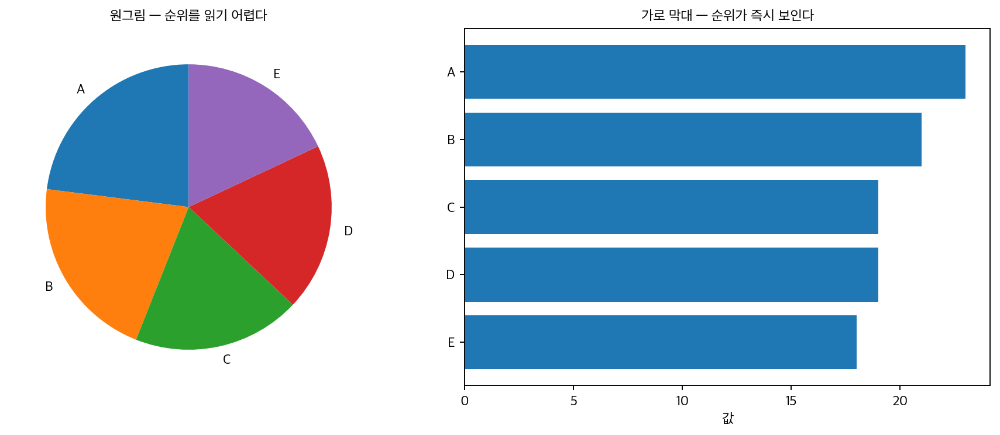

    다섯 값이 $23$부터 $18$까지로 최대 $1.28$배 차이인데, 원그림에서는 $82.8^\circ$와 $64.8^\circ$의 차이로 나타난다. **순위를 정확히 읽어 내기 어렵다.**

    **클리블랜드–맥길의 부호화 정확도 순위**를 다시 보라(산점도 문서 연습문제 9).

    | 순위 | 부호화 | 어디에 쓰이는가 |
    |---|---|---|
    | $1$ | 공통 축 위의 **위치** | 점그림, 가로 막대 |
    | $3$ | **길이** | 막대그림 |
    | $4$ | **각도** | **원그림** |
    | $5$ | 넓이 | 버블, 트리맵 |

    **원그림이 나쁜 이유가 각도 부호화에 있다.** 게다가 조각이 여러 개면 서로 다른 방향으로 놓여 비교가 더 어려워진다.

    **그럼에도 원그림이 통하는 경우.**

    - **조각이 두세 개뿐이고** 차이가 클 때. "찬성 $70\%$ 대 반대 $30\%$"는 원그림으로 충분하다.
    - **$1/2$, $1/4$ 같은 기준 비율**과의 비교. 사람은 반원과 사분원은 잘 알아본다.
    - **전체가 $100\%$임을 강조**하고 싶을 때. 막대그림은 합이 전체라는 사실을 시각적으로 말해 주지 않는다.

    **원그림을 쓴다면 반드시 수치를 함께 적어라.** 그러면 그림이 못 하는 일을 글자가 대신한다. 다만 그 시점에 그림이 무슨 일을 하고 있는지 다시 물어볼 만하다. $\square$

<div class="drillbox" markdown>

**연습문제 5.** <span class="diff med" title="중간"></span>
본문 3절의 **누적 막대그림**에는 구조적 약점이 있다. 맨 아래 층을 제외한 층들을 비교하기 어려운 이유를 수치로 보여라.

</div>

??? success "풀이"
    ```python
    import numpy as np
    import matplotlib.pyplot as plt

    plt.rcParams["font.family"] = "Apple SD Gothic Neo"   # 한글 글꼴
    plt.rcParams["axes.unicode_minus"] = False            # 음수 기호가 네모가 되지 않게

    groups = ["1분기", "2분기", "3분기"]
    seg = np.array([[30, 20, 15], [45, 18, 14], [20, 22, 16]], float)  # 행=막대, 열=층

    print(f"1층 값 {seg[:, 0]}  → 바닥이 모두 0 이라 비교가 쉽다")
    print(f"2층 값 {seg[:, 1]}  → 시작 높이가 {seg[:, 0]} 로 제각각")
    print(f"\n2층의 실제 크기 순위     {np.argsort(-seg[:, 1]) + 1}")
    print(f"2층 '윗변 높이' 순위     {np.argsort(-(seg[:, 0] + seg[:, 1])) + 1}   ← 눈이 읽는 것")

    fig, axes = plt.subplots(1, 2, figsize=(11, 4))
    bottom = np.zeros(3)
    for j, name in enumerate(["층 1", "층 2", "층 3"]):
        axes[0].bar(groups, seg[:, j], bottom=bottom, label=name)
        bottom += seg[:, j]
    axes[0].legend(fontsize=8)
    axes[0].set_title("누적 — 2층·3층 비교가 어렵다", fontsize=10)

    w = 0.26
    xs = np.arange(3)
    for j, name in enumerate(["층 1", "층 2", "층 3"]):
        axes[1].bar(xs + (j - 1) * w, seg[:, j], width=w, label=name)
    axes[1].set_xticks(xs); axes[1].set_xticklabels(groups)
    axes[1].legend(fontsize=8)
    axes[1].set_title("묶음 — 모든 층이 같은 바닥에서 출발", fontsize=10)
    fig.tight_layout()
    plt.show()
    ```

    출력:

    ```
    1층 값 [30. 45. 20.]  → 바닥이 모두 0 이라 비교가 쉽다
    2층 값 [20. 18. 22.]  → 시작 높이가 [30. 45. 20.] 로 제각각

    2층의 실제 크기 순위     [3 1 2]
    2층 '윗변 높이' 순위     [2 1 3]   ← 눈이 읽는 것
    ```

    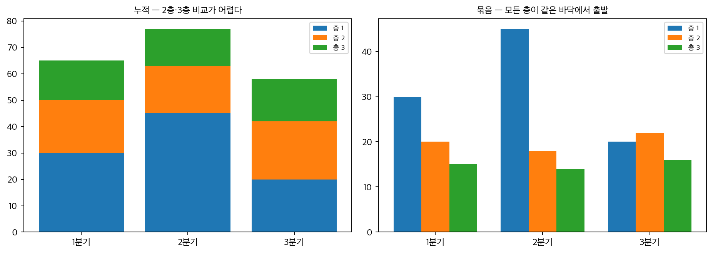

    **$2$층의 실제 순위는 $3, 1, 2$번 막대 순인데 윗변 높이로 읽으면 $2, 1, 3$번 순이다.** 순위가 뒤바뀐다.

    **왜인가.** 누적 막대에서 $1$층은 모두 $0$에서 시작하므로 **위치 부호화**로 읽힌다. 정확하다. 그러나 $2$층부터는 시작 높이가 막대마다 다르므로 **길이만으로** 비교해야 하는데, 사람은 서로 다른 위치에 있는 선분의 길이를 잘 비교하지 못한다. 실제로는 눈이 **윗변의 높이**를 따라가기 쉽고, 그것은 누적값이지 그 층의 값이 아니다.

    **언제 무엇을 쓰는가.**

    | 목적 | 권장 |
    |---|---|
    | 전체 크기의 비교가 주목적 | **누적** (윗변이 합계) |
    | 특정 한 성분의 비교 | **묶음** 또는 그 성분만 따로 |
    | 성분 비율의 변화 | **$100\%$ 누적** (연습문제 8) |
    | 성분이 $4$개 이상 | 누적·묶음 모두 나쁨 → **작은 다중 그림** |

    **가장 실용적인 조언.** 관심 있는 성분이 하나라면 **그것을 맨 아래 층에 놓아라.** 그러면 그 성분만큼은 정확히 비교된다. 그리고 성분이 많으면 누적하지 말고 **면을 나누어** 각각 별도의 작은 그림으로 그리는 것이 낫다. $\square$

<div class="drillbox" markdown>

**연습문제 6.** <span class="diff med" title="중간"></span>
막대그림으로 **집단별 평균**을 그리는 것은 매우 흔하다. 이것이 무엇을 감추는지 보여라.

</div>

??? success "풀이"
    ```python
    import numpy as np
    import matplotlib.pyplot as plt

    plt.rcParams["font.family"] = "Apple SD Gothic Neo"   # 한글 글꼴
    plt.rcParams["axes.unicode_minus"] = False            # 음수 기호가 네모가 되지 않게

    rng = np.random.default_rng(0)
    groups = {
        "대칭":  rng.normal(50, 10, 300),
        "치우침": 50 + (rng.exponential(10, 300) - 10),
        "이봉":  np.concatenate([rng.normal(35, 4, 150), rng.normal(65, 4, 150)]),
        "이상치": np.concatenate([rng.normal(48, 3, 297), [150, 160, 170]]),
    }

    print(f"{'집단':>8}{'평균':>9}{'표준편차':>10}{'중앙값':>9}{'IQR':>9}")
    for name, v in groups.items():
        q1, q3 = np.percentile(v, [25, 75])
        print(f"{name:>8}{v.mean():>9.2f}{v.std(ddof=1):>10.2f}{np.median(v):>9.2f}{q3 - q1:>9.2f}")

    fig, axes = plt.subplots(1, 2, figsize=(11, 4), sharey=True)
    names = list(groups)
    axes[0].bar(names, [v.mean() for v in groups.values()])
    axes[0].set_title("막대(평균) — 넷이 똑같아 보인다", fontsize=10)
    for i, v in enumerate(groups.values()):
        axes[1].scatter(np.full(len(v), i) + rng.normal(0, 0.07, len(v)), v, s=4, alpha=0.25)
    axes[1].set_xticks(range(4)); axes[1].set_xticklabels(names)
    axes[1].set_title("원자료 — 전혀 다르다", fontsize=10)
    axes[1].set_ylim(0, 100)
    fig.tight_layout()
    plt.show()
    ```

    출력:

    ```
          집단       평균      표준편차      중앙값      IQR
          대칭    49.64     10.20    49.23    13.86
         치우침    49.85     10.01    47.21    10.55
          이봉    49.89     15.62    50.06    30.04
         이상치    48.95     11.59    47.89     3.96
    ```

    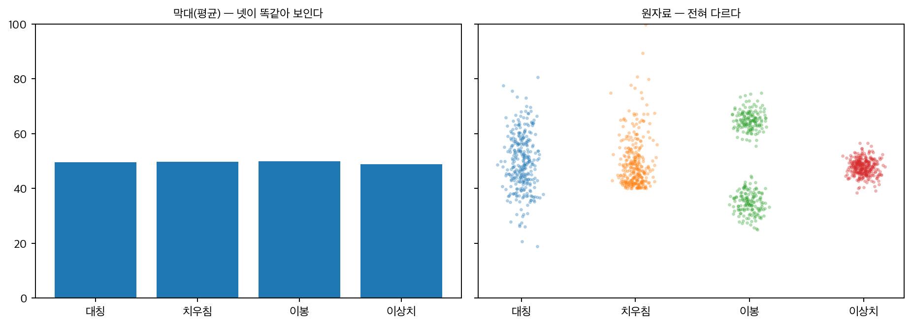

    **네 집단의 평균이 모두 $49$–$50$이다.** 막대그림으로 그리면 네 개의 똑같은 막대가 서고, 독자는 "차이가 없다"고 읽는다.

    **그런데 자료는 전혀 다르다.**

    | 집단 | 표준편차 | IQR | 실제 모습 |
    |---|---|---|---|
    | 대칭 | $10.2$ | $13.9$ | 하나의 봉우리 |
    | 치우침 | $10.0$ | $10.5$ | 오른쪽 꼬리 |
    | 이봉 | $15.6$ | $\mathbf{30.0}$ | **두 덩어리, 중앙에는 아무도 없다** |
    | 이상치 | $11.6$ | $\mathbf{4.0}$ | 매우 뭉쳐 있고 **극단값 $3$개** |

    **이봉 집단이 특히 문제다.** 평균 $50$인 사람이 실제로는 한 명도 없다. 막대 높이가 가리키는 값이 자료에 존재하지 않는다.

    **이것이 "막대그림 논쟁"의 핵심이다.** 생물학·의학 논문에서 평균 막대 + 오차막대가 표준이었는데, 여러 학술지가 **원자료를 함께 보이도록 요구**하는 방향으로 정책을 바꾸었다.

    **대안.**

    | $n$ | 권장 |
    |---|---|
    | $\lesssim 30$ | **점을 모두 그린다** (스트립·벌떼) |
    | $30$–$100$ | 상자그림 + 점 |
    | $\gtrsim 100$ | 바이올린 또는 상자그림 |
    | 어느 경우든 | 막대 + 오차막대만은 피한다 |

    **막대그림이 적절한 곳은 따로 있다.** 막대는 **계수나 합계**처럼 $0$에서 시작하는 것이 자연스러운 양에 쓰는 것이다. 평균은 그런 양이 아니며, 특히 $0$이 의미 없는 척도(온도, 시험 점수, 만족도)에서는 막대의 길이 자체가 오해를 부른다. $\square$

<div class="drillbox" markdown>

**연습문제 7.** <span class="diff med" title="중간"></span>
본문의 "순서가 없는 범주는 정렬하라"를 더 밀고 나가라. 정렬이 **위험한** 경우는 언제인가?

</div>

??? success "풀이"
    ```python
    import numpy as np

    rng = np.random.default_rng(3)
    K, n = 10, 40
    true_rate = 0.30                                   # 열 지점의 참 비율이 모두 같다
    counts = rng.binomial(n, true_rate, K)
    rates = counts / n
    order = np.argsort(-rates)

    print(f"참 비율은 열 지점 모두 {true_rate}")
    print(f"관측 비율(정렬 후) {np.round(rates[order], 3)}")
    print(f"\n1위 {rates[order][0]:.3f}   꼴찌 {rates[order][-1]:.3f}   차이 {rates[order][0] - rates[order][-1]:.3f}")
    se = np.sqrt(true_rate * (1 - true_rate) / n)
    print(f"단일 비율의 표준오차 {se:.4f}  → 차이는 표준오차 {(rates[order][0] - rates[order][-1]) / (se * np.sqrt(2)):.2f} 배")
    ```

    출력:

    ```
    참 비율은 열 지점 모두 0.3
    관측 비율(정렬 후) [0.35  0.35  0.325 0.3   0.275 0.25  0.225 0.225 0.2   0.2  ]

    1위 0.350   꼴찌 0.200   차이 0.150
    단일 비율의 표준오차 0.0725  → 차이는 표준오차 1.46 배
    ```

    **참 비율이 열 지점 모두 같은데** 정렬하면 $1$위와 꼴찌 사이에 상당한 차이가 보인다. 앞 절 집단 비교 문서 연습문제 10에서 본 것과 같은 현상이다.

    **정렬이 좋은 경우와 나쁜 경우.**

    | 상황 | 정렬 |
    |---|---|
    | 범주에 자연스러운 순서가 없고 값의 차이가 뚜렷하다 | **좋다** — 읽기 쉬워진다 |
    | 범주에 자연스러운 순서가 있다 (요일, 연령대, 등급) | **나쁘다** — 그 순서를 보존하라 |
    | 여러 그림을 비교해야 한다 | **나쁘다** — 그림마다 순서가 달라져 대조 불가 |
    | 값의 차이가 불확실성 안에 있다 | **나쁘다** — 없는 순위를 만든다 |

    **둘째 줄이 특히 자주 어겨진다.** 월별 매출을 값으로 정렬하면 계절성이 사라진다. 만족도 $1$–$5$점 응답을 도수로 정렬하면 순서형이라는 성질이 지워진다(2장 자료형 문서).

    **셋째 줄도 실무에서 큰 문제다.** 연도별 그림을 각각 정렬하면 같은 범주가 해마다 다른 위치에 놓여, 독자가 추적할 수 없다. 이럴 때는 **첫 해나 전체 합계 기준으로 한 번 정렬하고 모든 그림에 같은 순서를 쓴다.**

    **불확실성이 있을 때의 처방.** 오차막대를 함께 그리거나(다음 절), 순위 대신 구간을 보여 주거나, 값이 비슷한 범주를 시각적으로 묶는다. **막대의 순서 자체가 주장이라는 점을 잊지 말아야 한다.** $\square$

<div class="drillbox" markdown>

**연습문제 8.** <span class="diff med" title="중간"></span>
**$100\%$ 누적 막대**(비율만 보여 주는 누적 막대)는 성분 구성의 변화를 보기에 좋다. 그런데 무엇을 감추는가?

</div>

??? success "풀이"
    ```python
    import numpy as np
    import matplotlib.pyplot as plt

    plt.rcParams["font.family"] = "Apple SD Gothic Neo"   # 한글 글꼴
    plt.rcParams["axes.unicode_minus"] = False            # 음수 기호가 네모가 되지 않게

    years = ["2021", "2022", "2023", "2024"]
    a = np.array([200, 260, 340, 430], float)      # 성분 A
    b = np.array([600, 700, 820, 960], float)      # 성분 B
    total = a + b

    print(f"{'연도':>6}{'A':>8}{'B':>8}{'합계':>9}{'A 비율':>10}")
    for y, x, z, t in zip(years, a, b, total):
        print(f"{y:>6}{x:>8.0f}{z:>8.0f}{t:>9.0f}{x / t:>10.4f}")
    print(f"\nA 는 {a[0]:.0f} → {a[-1]:.0f} 로 {a[-1] / a[0]:.2f}배 늘었다")
    print(f"그런데 A 비율은 {a[0] / total[0]:.3f} → {a[-1] / total[-1]:.3f} 로 거의 그대로다")

    fig, axes = plt.subplots(1, 2, figsize=(11, 4))
    axes[0].bar(years, a / total, label="A")
    axes[0].bar(years, b / total, bottom=a / total, label="B")
    axes[0].set_title("100% 누적 — 아무 변화도 없어 보인다", fontsize=10)
    axes[0].legend(fontsize=8)
    axes[1].bar(years, a, label="A")
    axes[1].bar(years, b, bottom=a, label="B")
    axes[1].set_title("절대량 누적 — 둘 다 크게 늘었다", fontsize=10)
    axes[1].legend(fontsize=8)
    fig.tight_layout()
    plt.show()
    ```

    출력:

    ```
        연도       A       B       합계      A 비율
      2021     200     600      800    0.2500
      2022     260     700      960    0.2708
      2023     340     820     1160    0.2931
      2024     430     960     1390    0.3094

    A 는 200 → 430 로 2.15배 늘었다
    그런데 A 비율은 0.250 → 0.309 로 거의 그대로다
    ```

    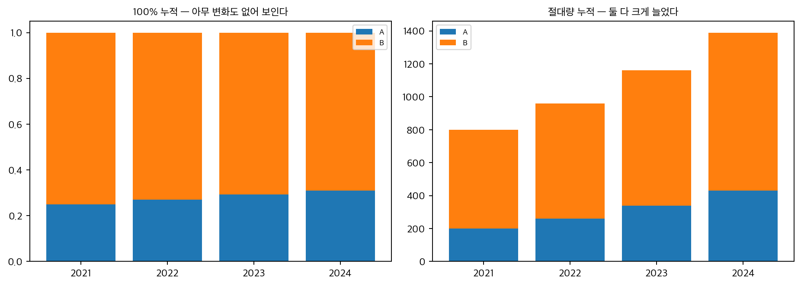

    **$100\%$ 누적 막대에서는 네 해가 거의 똑같아 보인다.** A의 비율이 $0.25$에서 $0.31$로 조금 오를 뿐이다.

    **그런데 A는 $2.15$배, 전체는 $1.74$배 늘었다.** 비율만 보여 주는 그림은 **규모의 변화를 완전히 지운다.**

    **반대 방향의 함정도 있다.** 전체가 줄어드는 상황에서 어떤 성분의 비율이 오르면 "그 성분이 성장했다"고 읽히지만, 실제로는 덜 줄었을 뿐일 수 있다.

    **처방.**

    - **두 그림을 나란히 놓아라.** 비율과 절대량을 함께 보여 주는 것이 가장 정직하다.
    - **합계를 어딘가에 표시하라.** 축 이름표나 막대 위에 총량을 적어 두면 비율 그림도 해석 가능해진다.
    - **막대 너비를 합계에 비례시켜라.** 모자이크 그림이 바로 이 방식이며, 비율과 규모를 한 그림에 담는다(이 장의 모자이크 문서 참고).

    **일반 원리.** 비율은 **분모를 감춘다.** 다음 문제가 같은 주제를 다른 각도에서 다룬다. $\square$

<div class="drillbox" markdown>

**연습문제 9.** <span class="diff med" title="중간"></span>
연습문제 8의 "분모를 감춘다"를 정면으로 다루어라. 막대 높이를 **개수**로 할 것인가 **비율**로 할 것인가?

</div>

??? success "풀이"
    ```python
    departments = [("A 부서", 120, 900), ("B 부서", 60, 300)]

    print("승진 인원과 승진율")
    total_p = total_n = 0
    for name, promoted, eligible in departments:
        print(f"  {name}: 승진 {promoted}명 / 대상 {eligible}명 = {promoted / eligible:.4f}")
        total_p += promoted
        total_n += eligible
    print(f"  전체:   {total_p}/{total_n} = {total_p / total_n:.4f}")
    ```

    출력:

    ```
    승진 인원과 승진율
      A 부서: 승진 120명 / 대상 900명 = 0.1333
      B 부서: 승진 60명 / 대상 300명 = 0.2000
      전체:   180/1200 = 0.1500
    ```

    **막대 높이를 승진 인원으로 그리면 A가 B의 두 배다.** 승진율로 그리면 **B가 A의 $1.5$배**다. 같은 자료에서 정반대의 인상이 나온다.

    **어느 쪽이 옳은가는 질문이 정한다.**

    | 질문 | 높이 |
    |---|---|
    | 몇 명이 승진했는가 (자원 배분, 총량) | **개수** |
    | 승진하기 얼마나 쉬운가 (개인의 관점) | **비율** |
    | 부서 간 형평성 | **비율** (+ 대상 인원 표시) |

    **개수만 보여 주는 것의 문제.** 큰 부서는 무엇을 세든 많다. "A 부서에서 사고가 가장 많이 났다"는 A가 가장 크기 때문일 수 있다.

    **비율만 보여 주는 것의 문제.** 분모가 작으면 비율이 불안정하다. 대상이 $3$명인 부서에서 $2$명이 승진하면 $67\%$인데, 이는 $900$명 중 $120$명($13\%$)보다 훨씬 믿을 수 없는 수치다. 앞 절들에서 본 표본 크기 문제 그대로다.

    **실무 해법.**

    - **둘 다 보여라.** 비율 막대에 분모를 이름표로 적는다(`A 부서 (n=900)`).
    - **비율에 신뢰구간을 붙여라.** 분모가 작은 범주는 구간이 넓게 그려져 스스로 경고한다.
    - **막대 너비를 분모에 비례시켜라.** 연습문제 8의 모자이크와 같은 발상이다.
    - **분모가 아주 작은 범주는 묶거나 별도 표기하라.**

    **1장의 교훈이 여기서 되풀이된다.** 어떤 수를 비교하든 **"무엇으로 나눈 값인가"** 를 먼저 물어야 한다. 그림은 분모를 보여 주지 않으므로 작성자가 명시해야 한다. $\square$

<div class="drillbox" markdown>

**연습문제 10.** <span class="diff med" title="중간"></span>
본문 $4$절의 "가장 흔한 거짓말"이 축 자르기였다면, 그 밖의 왜곡 기법들을 정리하라. 각각을 어떻게 알아채고 바로잡는가?

</div>

??? success "풀이"
    ```python
    import numpy as np
    import matplotlib.pyplot as plt

    plt.rcParams["font.family"] = "Apple SD Gothic Neo"   # 한글 글꼴
    plt.rcParams["axes.unicode_minus"] = False            # 음수 기호가 네모가 되지 않게

    labels = ["A", "B", "C", "D"]
    values = np.array([97.2, 98.1, 97.6, 98.4])

    fig, axes = plt.subplots(1, 3, figsize=(13, 3.8))
    axes[0].bar(labels, values, color="steelblue")
    axes[0].set_ylim(97, 98.6)
    axes[0].set_title("① 축 자르기", fontsize=9)

    axes[1].bar(labels, values, color="steelblue")
    axes[1].set_ylim(0, 100)
    axes[1].set_title("② 정직한 축", fontsize=9)

    diff = values - values.mean()
    axes[2].bar(labels, diff, color=np.where(diff >= 0, "steelblue", "indianred"))
    axes[2].axhline(0, color="black", lw=0.8)
    axes[2].set_title("③ 평균 대비 편차 — 정직하게 강조", fontsize=9)
    fig.tight_layout()
    plt.show()

    print(f"값의 범위 {values.min()} ~ {values.max()}  (차이 {values.ptp():.1f})")
    print(f"평균 대비 상대적 차이 {values.ptp() / values.mean() * 100:.2f}%")
    ```

    출력:

    ```
    값의 범위 97.2 ~ 98.4  (차이 1.2)
    평균 대비 상대적 차이 1.23%
    ```

    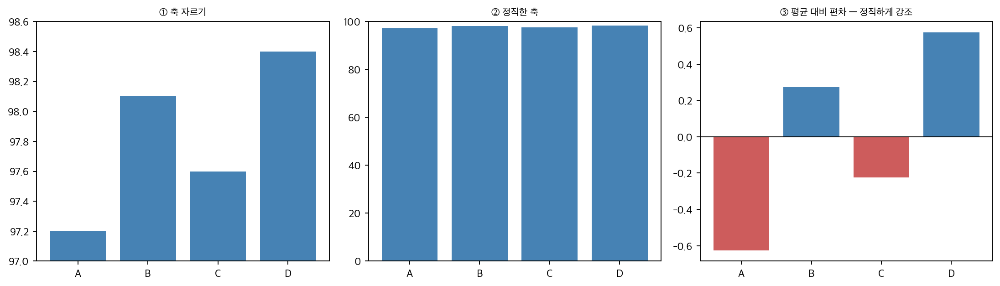

    **작은 차이를 정직하게 강조하는 방법이 세 번째 그림이다.** 축을 자르는 대신 **기준값 대비 편차**를 그리면, 막대의 길이가 여전히 값에 비례하면서($0$이 진짜 $0$이다) 차이가 잘 보인다.

    **막대그림 왜곡 기법 점검표.**

    | 기법 | 어떻게 알아채는가 | 바로잡는 법 |
    |---|---|---|
    | **축 자르기** | $y$축이 $0$에서 시작하지 않는다 | $0$에서 시작, 또는 편차 그림 |
    | **눈금 간격 조작** | 눈금이 등간격이 아니다 | 등간격 확인 |
    | **3차원 효과** | 막대에 원근이 있다 | 2차원으로 |
    | **막대 너비 변화** | 막대마다 폭이 다르다 | 폭 통일 (또는 분모 부호화임을 명시) |
    | **그림 아이콘 크기** | 값을 그림의 **높이**에 비례시켜 넓이가 제곱으로 커진다 | 막대 사용 |
    | **누락된 범주** | 합계가 맞지 않는다 | 전체 목록 확인 |
    | **선택된 기간** | 시작·끝 시점이 자의적 | 전체 기간 표시 |

    **다섯째 줄이 특히 교묘하다.** "사람 아이콘 크기로 인구를 표현"하는 그림에서 값을 높이에 비례시키면 넓이는 제곱으로 커진다. 산점도 문서 연습문제 9의 넓이 지각 문제와 결합해 왜곡이 배가된다.

    **작성자로서의 원칙.** 왜곡은 대개 **강조하고 싶은 마음**에서 나온다. 차이가 작으면 작게 보이는 것이 정직하다. 그것이 답답하다면 **그림을 조작할 것이 아니라 차이가 왜 중요한지 글로 설명하라.**

    **독자로서의 원칙.** 그림을 보면 **축부터 확인하라.** 그것만으로 대부분의 왜곡이 걸러진다. $\square$


## 정리하며

막대그림은 단순해 보이지만 선택할 것이 많다.

- **정렬**: 순서가 없는 범주는 값 순으로. 순서가 있으면 그대로.
- **방향**: 이름이 길거나 범주가 많으면 가로로.
- **묶음 대 누적**: 개별 값을 비교하면 묶음, 구성비를 보면 누적.
- **축**: 반드시 0에서 시작. 이것만은 타협하지 않는다.

다음 절의 **원그래프**는 같은 자료를 다른 방식으로 보여 준다. 그리고 대부분의 경우 막대그림이 더 낫다는 것을 확인하게 될 것이다.
