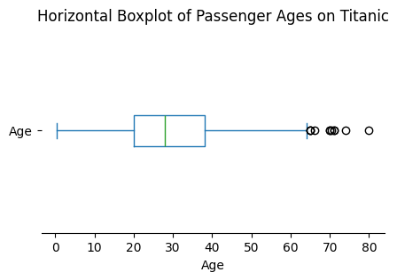
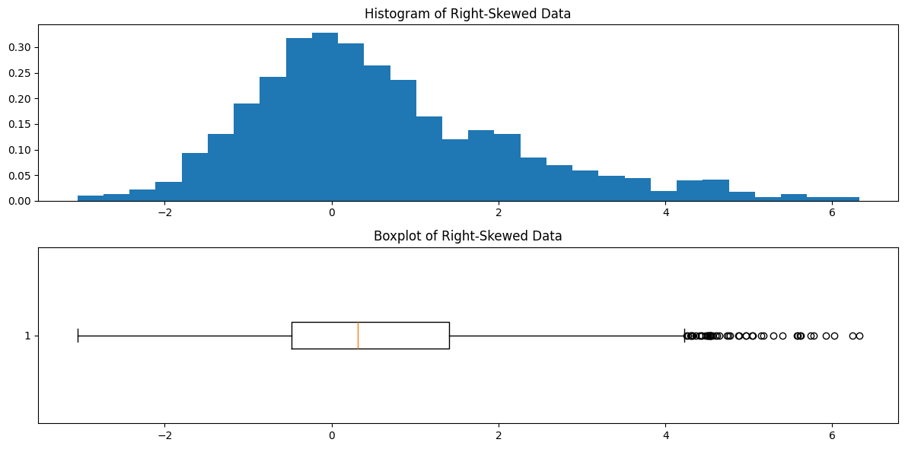
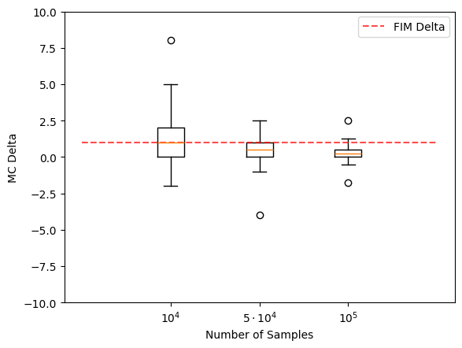

# 상자그림

## 개요

**상자그림**(상자수염그림)은 다섯 수치 요약 — 최솟값, 제1사분위수($Q_1$), 중앙값($Q_2$), 제3사분위수($Q_3$), 최댓값 — 에 근거해 자료의 분포를 표시하는 표준화된 방법이다. 중심, 퍼짐, 왜도, 이상치를 한꺼번에 압축적으로 요약해 보여준다.

## 상자그림의 구조

상자그림의 구성요소는 다음과 같다.

- **상자:** $Q_1$에서 $Q_3$까지 뻗어 사분위범위(IQR = $Q_3 - Q_1$)를 덮는다. 상자의 길이가 자료 가운데 50%를 나타낸다.
- **중앙값 선:** 상자 안 $Q_2$ 위치의 선.
- **수염:** 상자에서 $Q_1$과 $Q_3$의 $1.5 \times \text{IQR}$ 안에 있는 가장 극단적인 자료점까지 뻗는다.
- **이상치:** 수염 너머에 개별 점으로 찍힌다.

## 기본 상자그림: 타이타닉 승객의 나이

```python
import matplotlib.pyplot as plt
import pandas as pd

url = "https://raw.githubusercontent.com/datasciencedojo/datasets/master/titanic.csv"
df = pd.read_csv(url, index_col='PassengerId')

fig, ax = plt.subplots(figsize=(5, 3))
df['Age'].plot(kind='box', ax=ax, vert=False)
ax.set_title("Horizontal Boxplot of Passenger Ages on Titanic")
ax.set_xlabel("Age")
ax.spines[["top", "left", "right"]].set_visible(False)
plt.show()
```



## 상자그림에서 왜도 알아보기

상자그림은 분포의 모양을 빠르게 진단하게 해준다.

$$
\begin{array}{lll}
\text{Left_Box} > \text{Right_Box} &\Rightarrow& \text{Left-skewed} \\
\text{Left_Box} < \text{Right_Box} &\Rightarrow& \text{Right-skewed} \\
\text{Boxes equal, Left_Whisker} > \text{Right_Whisker} &\Rightarrow& \text{Left-skewed} \\
\text{Boxes equal, Left_Whisker} < \text{Right_Whisker} &\Rightarrow& \text{Right-skewed} \\
\text{Both equal} &\Rightarrow& \text{Symmetric} \\
\end{array}
$$

## 히스토그램과 상자그림을 함께 보기

히스토그램을 상자그림과 나란히 놓으면 모양과 요약통계량의 연결이 분명해진다.

```python
import matplotlib.pyplot as plt
import numpy as np
import scipy.stats as stats

np.random.seed(0)
main_data = stats.norm().rvs(1_000)
right_1 = stats.norm(loc=2).rvs(200)
right_2 = stats.norm(loc=4).rvs(100)
combined = np.concatenate((main_data, right_1, right_2))

fig, (ax_hist, ax_box) = plt.subplots(2, 1, figsize=(12, 6))

ax_hist.hist(combined, density=True, bins=30)
ax_hist.set_title('Histogram of Right-Skewed Data')

ax_box.boxplot(combined, vert=False)
ax_box.set_title('Boxplot of Right-Skewed Data')

plt.tight_layout()
plt.show()
```



## 비교 상자그림

상자그림은 집단 간 분포를 비교할 때 가장 강력하다.

```python
import numpy as np
import matplotlib.pyplot as plt

data_a = np.array([1, 2, 0, 0, 0, 1, 3, 1, 2, 1, 2, 4, 5, -1, -2, 0, 8])
data_b = np.array([1, 2, 0, 0, 0, 1, 3, 1, 2, 1, 2, 4, 5, -1, -2, 0, -8]) * 0.5
data_c = np.array([1, 2, 0, 0, 0, 1, 3, 1, 2, 1, 2, 4, 5, -1, -2, 0, 10, -7]) * 0.25

fig, ax = plt.subplots()
ax.boxplot([data_a, data_b, data_c],
           tick_labels=["$10^4$", "$5 \\cdot 10^4$", "$10^5$"])
ax.plot([0, 1, 2, 3, 4], [1, 1, 1, 1, 1],
        label="FIM Delta", linestyle="--", color="r", alpha=0.7)
ax.legend()
ax.set_ylim(-10.0, 10.0)
ax.set_xlabel('Number of Samples')
ax.set_ylabel('MC Delta')
plt.show()
```



## 요약

상자그림은 중심(중앙값), 퍼짐(IQR과 수염 길이), 왜도(상자와 수염의 비대칭), 이상치(개별 점)를 하나의 그림에 모두 드러내는 압축적이고 정보가 풍부한 시각화다. 집단이나 조건에 걸쳐 분포를 비교할 때 특히 효과적이다.

## 연습문제

**연습문제 1.**
어떤 자료의 다섯 수치 요약이 최솟값 $= 10$, $Q_1 = 25$, 중앙값 $= 35$, $Q_3 = 50$, 최댓값 $= 90$이다. IQR과 울타리 값을 계산하라. $1.5 \times \text{IQR}$ 규칙에 따르면 이상치가 있는가?

??? success "풀이"
    IQR은

    $$
    \text{IQR} = Q_3 - Q_1 = 50 - 25 = 25
    $$

    이고 울타리는

    $$
    \text{Lower fence} = Q_1 - 1.5 \times \text{IQR} = 25 - 37.5 = -12.5
    $$

    $$
    \text{Upper fence} = Q_3 + 1.5 \times \text{IQR} = 50 + 37.5 = 87.5
    $$

    이다.

    최솟값(10)은 아래쪽 울타리($-12.5$)보다 크므로 아래쪽 이상치는 없다. 그러나 최댓값(90)이 위쪽 울타리(87.5)를 넘으므로 **90이 이상치**다. 상자그림에서 위쪽 수염은 87.5 이하의 가장 큰 값까지 뻗고, 90은 개별 이상치 표시로 나타난다.

---

**연습문제 2.**
상자그림 두 개가 나란히 그려져 있다. 상자그림 A는 상자가 짧고 수염이 길며, 상자그림 B는 상자가 길고 수염이 짧다. 둘의 범위는 같다. 자료가 어디에 몰려 있는지의 관점에서 두 분포를 비교하라.

??? success "풀이"
    **상자그림 A**(짧은 상자, 긴 수염): 자료 가운데 50%가 중앙값 주위에 촘촘히 몰려 있지만 꼬리가 멀리 뻗는다. 중심 근처에 **뾰족하게 몰려** 있고 꼬리에는 관측값이 성기게 퍼진 분포, 즉 급첨이거나 꼬리가 두꺼운 모양을 시사한다.

    **상자그림 B**(긴 상자, 짧은 수염): 자료 가운데 50%가 넓게 퍼져 있지만 사분위수에서 멀리 떨어진 극단값이 없다. 자료가 어떤 범위에 걸쳐 더 **균일하게 퍼진** 분포, 즉 평첨이거나 균등분포에 가까운 모양을 시사한다.

    전체 범위는 같더라도 두 분포는 근본적으로 다르다. A는 관측값을 중앙값 근처에 모으고 몇몇 값만 멀리 흩뿌리는 반면, B는 관측값을 더 고르게 퍼뜨린다.

---

**연습문제 3.**
완벽하게 대칭인 분포의 상자그림이 어떤 모습일지 서술하라. 완벽한 대칭을 나타내는 구체적인 특징은 무엇인가?

??? success "풀이"
    완벽하게 대칭인 분포에서는

    - **중앙값 선**이 상자의 정확히 가운데에 있어 $Q_2 - Q_1 = Q_3 - Q_2$이다.
    - **수염**의 길이가 양쪽에서 같다. $Q_1$에서 아래쪽 수염 끝까지의 거리가 $Q_3$에서 위쪽 수염 끝까지의 거리와 같다.
    - **이상치**가 있다면 양쪽에 대칭적으로 나타난다(개수가 같고 상자에서 대략 같은 거리에 있다).

    정규분포가 고전적인 예다. $N(\mu, \sigma^2)$에서 뽑은 큰 표본의 상자그림은 이런 대칭적 특징을 보인다.

---

**연습문제 4.**
X반의 시험 점수 상자그림은 중앙값 75, $Q_1 = 65$, $Q_3 = 85$, 아래쪽 수염 40, 위쪽 수염 100(이상치 없음)을 보여준다. Y반의 상자그림은 중앙값 75, $Q_1 = 70$, $Q_3 = 80$, 아래쪽 수염 55, 위쪽 수염 95(이상치 없음)를 보여준다. 두 반을 비교하라.

??? success "풀이"
    두 반의 중앙값이 같으므로(75) "전형적인" 학생의 성취도는 비슷하다. 그러나 퍼짐에서 상당히 다르다.

    - **X반**은 $\text{IQR} = 85 - 65 = 20$이고 범위 $= 100 - 40 = 60$이다. 점수가 넓게 흩어져 있어 학생 성취도의 변동성이 크다.
    - **Y반**은 $\text{IQR} = 80 - 70 = 10$이고 범위 $= 95 - 55 = 40$이다. 점수가 중앙값 주위에 더 촘촘히 몰려 있다.

    Y반이 더 동질적이다. 대부분의 학생이 70에서 80 사이에 있다. X반은 퍼짐이 넓어 아주 잘하는 학생과 아주 못하는 학생이 섞여 있음을 시사한다. 이 상자그림을 본 교사라면 X반의 변동성이 왜 그렇게 큰지 — 아마도 준비 수준의 차이나 학생 배경의 혼재를 — 살펴볼 만하다.

---

**연습문제 5.**
투키의 원래 상자그림 명세는 수염을 상자로부터 $1.5 \cdot \mathrm{IQR}$ 안에 있는 가장 극단적인 자료점에 둔다. 이것이 수염을 최솟값과 최댓값에 두는 것보다 나은 이유는 무엇인가?

??? success "풀이"
    수염을 최솟값과 최댓값에 두면 두 가지 문제가 있다.

    - **이상치 신호가 없다**: 최댓값이 이상치라면 수염이 거기까지 뻗어, 이상치가 없는 분포에서 위쪽 수염이 긴 경우와 구별되지 않는다. 자료의 꼬리가 긴 것인지 극단 관측값 하나가 있는 것인지 보는 사람이 알 수 없다.
    - **점 하나에 민감하다**: 아주 극단적인 관측값 하나가 수염을 그쪽으로 끌어당겨 그림 전체의 시각적 척도를 왜곡한다. 상자를 비롯한 다른 특징들이 축 쪽으로 눌려 버린다.

    투키의 선택은 전형적인 범위(가장 극단적인 *이상치가 아닌* 값까지의 수염)와 개별 이상치(수염 너머에 별도의 점으로 찍힘)를 분리한다. 이 시각화 결정은 하나의 모형을 담고 있다. "자료의 본체는 상자와 수염으로 기술되며, 그 바깥의 것은 의심스럽거나 흥미로우므로 개별적인 주의를 받을 자격이 있다." 대략 정규인 자료에서는 관측값의 약 0.7%가 $1.5\,\mathrm{IQR}$ 울타리 밖에 떨어지므로, 깨끗한 자료에서도 몇 개가 표시되는 것이 정상이다. 투키가 맞춘 비율이 바로 그것이다.

---

**연습문제 6.**
**노치 상자그림**은 중앙값 주위에 $\pm 1.57 \cdot \mathrm{IQR}/\sqrt{n}$의 "노치"를 더한다. 노치는 무엇을 나타내며, 집단 간 시각적 가설검정에 어떻게 쓰이는가?

??? success "풀이"
    노치는 McGill, Tukey, Larsen(1978)에 근거한 **중앙값의 근사적 95% 신뢰구간**을 나타낸다. 노치의 반폭 $\approx 1.57 \cdot \mathrm{IQR}/\sqrt{n}$이다.

    **시각적 비교에서의 활용:** 노치 상자그림 두 개를 나란히 그렸을 때 **노치가 겹치지 않으면 중앙값 사이에 통계적으로 유의한 차이가 있음**을 (대략 5% 수준에서) 나타낸다. 노치가 겹치면 유의한 차이가 없음을 시사한다. $p$-값을 계산하지 않고도 만–휘트니 검정이나 중앙값 검정에 해당하는 빠른 시각적 판단을 제공한다.

    **단서:**

    - 상수 1.57은 정규근사 논증에서 나온 것이라 표본이 작거나 자료가 비정규일 때는 근사적이다.
    - 표본이 작으면 노치가 상자를 넘어($Q_3$ 위나 $Q_1$ 아래로) 뻗을 수 있다. 시각적으로는 이상해 보이지만 중앙값이 제대로 결정되지 않았음을 나타낸다.
    - 어떤 상황에서는 이 시각적 규칙의 제1종 오류가 형식적 검정보다 크다. 탐색용으로 쓰고, 중요한 판단이 걸려 있으면 형식적 검정으로 뒷받침하라.

    노치 그림은 matplotlib에서 `boxplot(notch=True)`로, seaborn에서 `sns.boxplot(notch=True)`로 그린다. 형식적인 쌍별 검정을 하면 비교 횟수가 급증하는 상황에서, 여러 집단을 동시에 비교하는 논문에 특히 유용하다.
