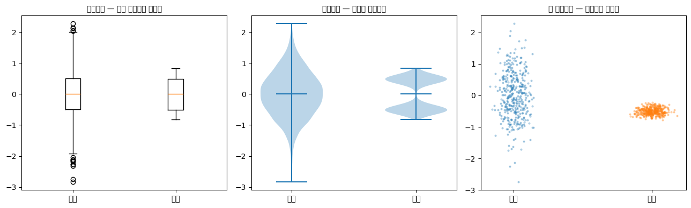
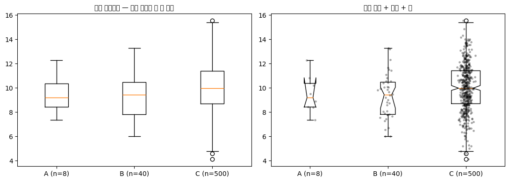

# 상자그림

## 개요

**상자그림**(상자수염그림)은 다섯 수치 요약 — 최솟값, 제1사분위수($Q_1$), 중앙값($Q_2$), 제3사분위수($Q_3$), 최댓값 — 에 근거해 자료의 분포를 표시하는 표준화된 방법이다. 중심, 퍼짐, 왜도, 이상치를 한꺼번에 압축적으로 요약해 보여준다.

## 상자그림의 구조

상자그림의 구성요소는 다음과 같다.

- **상자:** $Q_1$에서 $Q_3$까지 뻗어 사분위범위(IQR = $Q_3 - Q_1$)를 덮는다. 상자의 길이가 자료 가운데 50%를 나타낸다.
- **중앙값 선:** 상자 안 $Q_2$ 위치의 선.
- **수염:** 상자에서 $Q_1$과 $Q_3$의 $1.5 \times \text{IQR}$ 안에 있는 가장 극단적인 자료점까지 뻗는다.
- **이상치:** 수염 너머에 개별 점으로 찍힌다.

## 기본 상자그림: 타이타닉 승객의 나이

<div class="codebox" markdown>

**예제 1.** 타이타닉 승객 나이의 상자그림

```python
import matplotlib.pyplot as plt
import pandas as pd

url = "https://raw.githubusercontent.com/datasciencedojo/datasets/master/titanic.csv"
df = pd.read_csv(url, index_col='PassengerId')

fig, ax = plt.subplots(figsize=(5, 3))

# kind='box'로 pandas Series에서 곧바로 상자그림을 그린다.
# vert=False는 눕혀 그린다는 뜻. 눕히면 축 이름이 길어도 읽기 편하다.
# 결측값(Age가 비어 있는 177명)은 pandas가 알아서 제외한다.
df['Age'].plot(kind='box', ax=ax, vert=False)

ax.set_title("Horizontal Boxplot of Passenger Ages on Titanic")
ax.set_xlabel("Age")
# 상자와 수염 자체에 눈이 가도록 불필요한 테두리를 지운다
ax.spines[["top", "left", "right"]].set_visible(False)
plt.show()

# 그림에 그려진 다섯 숫자를 그대로 확인해 본다
print(df['Age'].describe()[['min', '25%', '50%', '75%', 'max']].round(2))
```

출력:

```
min     0.42
25%    20.12
50%    28.00
75%    38.00
max    80.00
Name: Age, dtype: float64
```


</div>

## 상자그림에서 왜도 알아보기

상자그림은 분포의 모양을 빠르게 진단하게 해준다.

$$
\begin{array}{lll}
\text{Left_Box} > \text{Right_Box} &\Rightarrow& \text{Left-skewed} \\
\text{Left_Box} < \text{Right_Box} &\Rightarrow& \text{Right-skewed} \\
\text{Boxes equal, Left_Whisker} > \text{Right_Whisker} &\Rightarrow& \text{Left-skewed} \\
\text{Boxes equal, Left_Whisker} < \text{Right_Whisker} &\Rightarrow& \text{Right-skewed} \\
\text{Both equal} &\Rightarrow& \text{Symmetric} \\
\end{array}
$$

## 히스토그램과 상자그림을 함께 보기

히스토그램을 상자그림과 나란히 놓으면 모양과 요약통계량의 연결이 분명해진다.

<div class="codebox" markdown>

**예제 2.** 히스토그램과 상자그림을 함께 보기

```python
import matplotlib.pyplot as plt
import numpy as np
import scipy.stats as stats

np.random.seed(0)

# 오른쪽으로 치우친 자료를 만드는 요령:
# 중심이 다른 정규분포 셋을 개수를 줄여 가며 겹친다.
#   0 부근에 1000개  (본체)
#   2 부근에  200개  (오른쪽 어깨)
#   4 부근에  100개  (오른쪽 꼬리)
# 왼쪽에는 대응하는 덩어리가 없으므로 분포가 오른쪽으로 길어진다.
main_data = stats.norm().rvs(1_000)
right_1 = stats.norm(loc=2).rvs(200)
right_2 = stats.norm(loc=4).rvs(100)
combined = np.concatenate((main_data, right_1, right_2))

# 같은 자료를 위아래로 나란히 놓아 두 그림을 대응시킨다
fig, (ax_hist, ax_box) = plt.subplots(2, 1, figsize=(12, 6))

# 위: 히스토그램. 분포의 모양이 그대로 보인다.
ax_hist.hist(combined, density=True, bins=30)
ax_hist.set_title('Histogram of Right-Skewed Data')

# 아래: 같은 자료의 상자그림. 다섯 숫자로 압축된 모습이다.
ax_box.boxplot(combined, vert=False)
ax_box.set_title('Boxplot of Right-Skewed Data')

plt.tight_layout()
plt.show()

# 치우침이 숫자로도 드러나는지 확인한다.
# 오른쪽으로 치우치면 평균 > 중앙값 이고, Q3-Q2 가 Q2-Q1 보다 크다.
q1, q2, q3 = np.percentile(combined, [25, 50, 75])
print(f"평균 {combined.mean():.3f}  중앙값 {q2:.3f}")
print(f"Q2-Q1 = {q2-q1:.3f}   Q3-Q2 = {q3-q2:.3f}  (오른쪽이 길다)")
```

출력:

```
평균 0.595  중앙값 0.314
Q2-Q1 = 0.794   Q3-Q2 = 1.098  (오른쪽이 길다)
```


</div>

## 비교 상자그림

상자그림은 집단 간 분포를 비교할 때 가장 강력하다.

<div class="codebox" markdown>

**예제 3.** 집단별 비교 상자그림

```python
import numpy as np
import matplotlib.pyplot as plt

# 표본 크기를 10^4, 5*10^4, 10^5 로 늘려 가며 얻은 몬테카를로 추정 오차.
# 표본이 커질수록 오차가 0 주위로 좁아지는 것을 보이려고,
# 같은 모양의 자료에 0.5, 0.25를 곱해 퍼짐을 줄였다.
data_a = np.array([1, 2, 0, 0, 0, 1, 3, 1, 2, 1, 2, 4, 5, -1, -2, 0, 8])
data_b = np.array([1, 2, 0, 0, 0, 1, 3, 1, 2, 1, 2, 4, 5, -1, -2, 0, -8]) * 0.5
data_c = np.array([1, 2, 0, 0, 0, 1, 3, 1, 2, 1, 2, 4, 5, -1, -2, 0, 10, -7]) * 0.25

fig, ax = plt.subplots()

# 리스트를 넘기면 상자를 나란히 그린다. 이것이 상자그림의 가장 큰 쓸모다.
ax.boxplot([data_a, data_b, data_c])

# 각 상자 아래에 이름을 붙인다.
# boxplot에 직접 주는 인자는 matplotlib 버전에 따라 이름이 다르다
# (3.9 미만은 labels=, 3.9 이상은 tick_labels=). 아래처럼 축에 직접 주면
# 버전에 상관없이 동작한다.
ax.set_xticklabels(["$10^4$", "$5 \\cdot 10^4$", "$10^5$"])

# 비교 기준선. 이론값(FIM Delta = 1)을 가로선으로 깔아 두면
# 각 상자가 그 선을 얼마나 감싸는지 눈으로 볼 수 있다.
ax.plot([0, 1, 2, 3, 4], [1, 1, 1, 1, 1],
        label="FIM Delta", linestyle="--", color="r", alpha=0.7)

ax.legend()
ax.set_ylim(-10.0, 10.0)      # 세 상자를 같은 눈금에 두어야 비교가 성립한다
ax.set_xlabel('Number of Samples')
ax.set_ylabel('MC Delta')
plt.show()

# 퍼짐이 실제로 줄어드는지 IQR로 확인한다
for name, d in [("10^4", data_a), ("5*10^4", data_b), ("10^5", data_c)]:
    q1, q3 = np.percentile(d, [25, 75])
    print(f"{name:>7}: 중앙값 {np.median(d):6.2f}  IQR {q3-q1:.2f}")
```

출력:

```
   10^4: 중앙값   1.00  IQR 2.00
 5*10^4: 중앙값   0.50  IQR 1.00
   10^5: 중앙값   0.25  IQR 0.50
```


</div>

## 연습문제

<div class="drillbox" markdown>

**연습문제 1.** <span class="diff easy" title="쉬움"></span>
어떤 자료의 다섯 수치 요약이 최솟값 $= 10$, $Q_1 = 25$, 중앙값 $= 35$, $Q_3 = 50$, 최댓값 $= 90$이다. IQR과 울타리 값을 계산하라. $1.5 \times \text{IQR}$ 규칙에 따르면 이상치가 있는가?

</div>

??? success "풀이"
    IQR은

    $$
    \text{IQR} = Q_3 - Q_1 = 50 - 25 = 25
    $$

    이고 울타리는

    $$
    \text{Lower fence} = Q_1 - 1.5 \times \text{IQR} = 25 - 37.5 = -12.5
    $$

    $$
    \text{Upper fence} = Q_3 + 1.5 \times \text{IQR} = 50 + 37.5 = 87.5
    $$

    이다.

    최솟값(10)은 아래쪽 울타리($-12.5$)보다 크므로 아래쪽 이상치는 없다. 그러나 최댓값(90)이 위쪽 울타리(87.5)를 넘으므로 **90이 이상치**다. 상자그림에서 위쪽 수염은 87.5 이하의 가장 큰 값까지 뻗고, 90은 개별 이상치 표시로 나타난다.

<div class="drillbox" markdown>

**연습문제 2.** <span class="diff easy" title="쉬움"></span>
상자그림 두 개가 나란히 그려져 있다. 상자그림 A는 상자가 짧고 수염이 길며, 상자그림 B는 상자가 길고 수염이 짧다. 둘의 범위는 같다. 자료가 어디에 몰려 있는지의 관점에서 두 분포를 비교하라.

</div>

??? success "풀이"
    **상자그림 A**(짧은 상자, 긴 수염): 자료 가운데 50%가 중앙값 주위에 촘촘히 몰려 있지만 꼬리가 멀리 뻗는다. 중심 근처에 **뾰족하게 몰려** 있고 꼬리에는 관측값이 성기게 퍼진 분포, 즉 급첨이거나 꼬리가 두꺼운 모양을 시사한다.

    **상자그림 B**(긴 상자, 짧은 수염): 자료 가운데 50%가 넓게 퍼져 있지만 사분위수에서 멀리 떨어진 극단값이 없다. 자료가 어떤 범위에 걸쳐 더 **균일하게 퍼진** 분포, 즉 평첨이거나 균등분포에 가까운 모양을 시사한다.

    전체 범위는 같더라도 두 분포는 근본적으로 다르다. A는 관측값을 중앙값 근처에 모으고 몇몇 값만 멀리 흩뿌리는 반면, B는 관측값을 더 고르게 퍼뜨린다.

<div class="drillbox" markdown>

**연습문제 3.** <span class="diff easy" title="쉬움"></span>
완벽하게 대칭인 분포의 상자그림이 어떤 모습일지 서술하라. 완벽한 대칭을 나타내는 구체적인 특징은 무엇인가?

</div>

??? success "풀이"
    완벽하게 대칭인 분포에서는

    - **중앙값 선**이 상자의 정확히 가운데에 있어 $Q_2 - Q_1 = Q_3 - Q_2$이다.
    - **수염**의 길이가 양쪽에서 같다. $Q_1$에서 아래쪽 수염 끝까지의 거리가 $Q_3$에서 위쪽 수염 끝까지의 거리와 같다.
    - **이상치**가 있다면 양쪽에 대칭적으로 나타난다(개수가 같고 상자에서 대략 같은 거리에 있다).

    정규분포가 고전적인 예다. $N(\mu, \sigma^2)$에서 뽑은 큰 표본의 상자그림은 이런 대칭적 특징을 보인다.

<div class="drillbox" markdown>

**연습문제 4.** <span class="diff med" title="중간"></span>
X반의 시험 점수 상자그림은 중앙값 75, $Q_1 = 65$, $Q_3 = 85$, 아래쪽 수염 40, 위쪽 수염 100(이상치 없음)을 보여준다. Y반의 상자그림은 중앙값 75, $Q_1 = 70$, $Q_3 = 80$, 아래쪽 수염 55, 위쪽 수염 95(이상치 없음)를 보여준다. 두 반을 비교하라.

</div>

??? success "풀이"
    두 반의 중앙값이 같으므로(75) "전형적인" 학생의 성취도는 비슷하다. 그러나 퍼짐에서 상당히 다르다.

    - **X반**은 $\text{IQR} = 85 - 65 = 20$이고 범위 $= 100 - 40 = 60$이다. 점수가 넓게 흩어져 있어 학생 성취도의 변동성이 크다.
    - **Y반**은 $\text{IQR} = 80 - 70 = 10$이고 범위 $= 95 - 55 = 40$이다. 점수가 중앙값 주위에 더 촘촘히 몰려 있다.

    Y반이 더 동질적이다. 대부분의 학생이 70에서 80 사이에 있다. X반은 퍼짐이 넓어 아주 잘하는 학생과 아주 못하는 학생이 섞여 있음을 시사한다. 이 상자그림을 본 교사라면 X반의 변동성이 왜 그렇게 큰지 — 아마도 준비 수준의 차이나 학생 배경의 혼재를 — 살펴볼 만하다.

<div class="drillbox" markdown>

**연습문제 5.** <span class="diff med" title="중간"></span>
투키의 원래 상자그림 명세는 수염을 상자로부터 $1.5 \cdot \mathrm{IQR}$ 안에 있는 가장 극단적인 자료점에 둔다. 이것이 수염을 최솟값과 최댓값에 두는 것보다 나은 이유는 무엇인가?

</div>

??? success "풀이"
    수염을 최솟값과 최댓값에 두면 두 가지 문제가 있다.

    - **이상치 신호가 없다**: 최댓값이 이상치라면 수염이 거기까지 뻗어, 이상치가 없는 분포에서 위쪽 수염이 긴 경우와 구별되지 않는다. 자료의 꼬리가 긴 것인지 극단 관측값 하나가 있는 것인지 보는 사람이 알 수 없다.
    - **점 하나에 민감하다**: 아주 극단적인 관측값 하나가 수염을 그쪽으로 끌어당겨 그림 전체의 시각적 척도를 왜곡한다. 상자를 비롯한 다른 특징들이 축 쪽으로 눌려 버린다.

    투키의 선택은 전형적인 범위(가장 극단적인 *이상치가 아닌* 값까지의 수염)와 개별 이상치(수염 너머에 별도의 점으로 찍힘)를 분리한다. 이 시각화 결정은 하나의 모형을 담고 있다. "자료의 본체는 상자와 수염으로 기술되며, 그 바깥의 것은 의심스럽거나 흥미로우므로 개별적인 주의를 받을 자격이 있다." 대략 정규인 자료에서는 관측값의 약 0.7%가 $1.5\,\mathrm{IQR}$ 울타리 밖에 떨어지므로, 깨끗한 자료에서도 몇 개가 표시되는 것이 정상이다. 투키가 맞춘 비율이 바로 그것이다.

<div class="drillbox" markdown>

**연습문제 6.** <span class="diff med" title="중간"></span>
**노치 상자그림**은 중앙값 주위에 $\pm 1.57 \cdot \mathrm{IQR}/\sqrt{n}$의 "노치"를 더한다. 노치는 무엇을 나타내며, 집단 간 시각적 가설검정에 어떻게 쓰이는가?

</div>

??? success "풀이"
    노치는 McGill, Tukey, Larsen(1978)에 근거한 **중앙값의 근사적 95% 신뢰구간**을 나타낸다. 노치의 반폭 $\approx 1.57 \cdot \mathrm{IQR}/\sqrt{n}$이다.

    **시각적 비교에서의 활용:** 노치 상자그림 두 개를 나란히 그렸을 때 **노치가 겹치지 않으면 중앙값 사이에 통계적으로 유의한 차이가 있음**을 (대략 5% 수준에서) 나타낸다. 노치가 겹치면 유의한 차이가 없음을 시사한다. $p$-값을 계산하지 않고도 만–휘트니 검정이나 중앙값 검정에 해당하는 빠른 시각적 판단을 제공한다.

    **단서:**

    - 상수 1.57은 정규근사 논증에서 나온 것이라 표본이 작거나 자료가 비정규일 때는 근사적이다.
    - 표본이 작으면 노치가 상자를 넘어($Q_3$ 위나 $Q_1$ 아래로) 뻗을 수 있다. 시각적으로는 이상해 보이지만 중앙값이 제대로 결정되지 않았음을 나타낸다.
    - 어떤 상황에서는 이 시각적 규칙의 제1종 오류가 형식적 검정보다 크다. 탐색용으로 쓰고, 중요한 판단이 걸려 있으면 형식적 검정으로 뒷받침하라.

    노치 그림은 matplotlib에서 `boxplot(notch=True)`로, seaborn에서 `sns.boxplot(notch=True)`로 그린다. 형식적인 쌍별 검정을 하면 비교 횟수가 급증하는 상황에서, 여러 집단을 동시에 비교하는 논문에 특히 유용하다.

<div class="drillbox" markdown>

**연습문제 7.** <span class="diff med" title="중간"></span>
상자그림은 다섯 개의 수만 보여 준다. 그 다섯 수가 **거의 같으면서 전혀 다른 두 분포**를 만들어, 상자그림이 무엇을 놓치는지 보여라.

</div>

??? success "풀이"
    ```python
    import numpy as np
    import matplotlib.pyplot as plt

    rng = np.random.default_rng(0)
    n = 2000
    unimodal = rng.normal(0, 1, n)
    bimodal = np.concatenate([rng.normal(-1.6, 0.35, n // 2),
                              rng.normal(1.6, 0.35, n // 2)])

    # 중앙값 0, IQR 1 로 맞춘다
    norm = lambda x: (x - np.median(x)) / np.subtract(*np.percentile(x, [75, 25]))
    unimodal, bimodal = norm(unimodal), norm(bimodal)

    print("다섯 수치 요약")
    for label, x in [("단봉", unimodal), ("이봉", bimodal)]:
        print(f"  {label}: {np.round(np.percentile(x, [0, 25, 50, 75, 100]), 3)}")

    fig, axes = plt.subplots(1, 3, figsize=(13, 4))
    axes[0].boxplot([unimodal, bimodal])
    axes[0].set_xticklabels(["단봉", "이봉"])
    axes[0].set_title("상자그림 — 거의 구별되지 않는다", fontsize=10)

    axes[1].violinplot([unimodal, bimodal], showmedians=True)
    axes[1].set_xticks([1, 2]); axes[1].set_xticklabels(["단봉", "이봉"])
    axes[1].set_title("바이올린 — 구조가 드러난다", fontsize=10)

    for i, (label, x) in enumerate([("단봉", unimodal), ("이봉", bimodal)]):
        axes[2].scatter(np.full(400, i + 1) + rng.normal(0, 0.06, 400), x[:400],
                        s=4, alpha=0.3)
    axes[2].set_xticks([1, 2]); axes[2].set_xticklabels(["단봉", "이봉"])
    axes[2].set_title("점 흩뿌리기 — 원자료를 그대로", fontsize=10)
    fig.tight_layout()
    plt.show()
    ```

    출력:

    ```
    다섯 수치 요약
      단봉: [-2.843 -0.491 -0.     0.509  2.279]
      이봉: [-0.823 -0.512  0.     0.488  0.834]
    ```

    

    **상자가 거의 같다.** $Q_1$, 중앙값, $Q_3$가 $-0.49, 0, 0.51$과 $-0.51, 0, 0.49$로 사실상 구별되지 않는다.

    그런데 왼쪽 자료는 **하나의 봉우리**를 갖고 오른쪽은 **두 개의 뚜렷이 분리된 덩어리**를 갖는다. 오른쪽 자료에는 중앙값 근처에 관측이 거의 없다. **상자그림이 표시하는 "중앙값"이 실제로는 자료가 가장 드문 지점이다.**

    **상자그림이 보여 주지 못하는 것.**

    | 특징 | 상자그림 | 대안 |
    |---|---|---|
    | 봉우리 개수 | ✗ | 바이올린, KDE, 히스토그램 |
    | 표본 크기 | ✗ | 가변 너비 상자, 점 표시 |
    | 값의 뭉침·동점 | ✗ | 점 흩뿌리기 |
    | 사분위수 사이의 모양 | ✗ | 바이올린 |
    | 분위수와 이상치 | ✓ | — |
    | 여러 집단의 간결한 비교 | ✓ | — |

    **상자그림을 버리라는 뜻은 아니다.** 집단이 많을 때 중앙값과 퍼짐을 비교하기에 이만한 도구가 없다. 다만 **하나의 상자그림은 자료를 요약한 것이지 자료가 아니다**(앞 절 안스콤 사중주와 같은 교훈).

    **실무 권고.** 집단당 관측이 수십 개 이하면 **점을 함께 그려라**(상자그림 + 흩뿌리기). 관측이 많으면 **바이올린이나 벌떼그림**이 낫다. 상자그림만 그릴 때는 최소한 표본 크기를 축 이름표에 적어 두는 것이 좋다. $\square$

<div class="drillbox" markdown>

**연습문제 8.** <span class="diff med" title="중간"></span>
$1.5 \times \mathrm{IQR}$ 규칙은 **대칭 분포를 전제로 설계되었다.** 치우친 자료에 그대로 쓰면 어떻게 되는지 확인하고 대안을 제시하라.

</div>

??? success "풀이"
    ```python
    import numpy as np

    rng = np.random.default_rng(0)
    n = 200_000

    print(f"{'분포':>10}{'표시 비율':>12}{'위쪽':>10}{'아래쪽':>10}")
    for label, x in [("정규", rng.normal(0, 1, n)),
                     ("지수", rng.exponential(1, n)),
                     ("로그정규", rng.lognormal(0, 1, n))]:
        q1, q3 = np.percentile(x, [25, 75])
        iqr = q3 - q1
        lo, hi = q1 - 1.5 * iqr, q3 + 1.5 * iqr
        print(f"{label:>10}{np.mean((x < lo) | (x > hi)):>12.4f}"
              f"{np.mean(x > hi):>10.4f}{np.mean(x < lo):>10.4f}")
    ```

    출력:

    ```
    분포       표시 비율        위쪽       아래쪽
            정규      0.0071    0.0035    0.0036
            지수      0.0481    0.0481    0.0000
          로그정규      0.0774    0.0774    0.0000
    ```

    **치우친 분포에서 표시 비율이 폭증하고 전부 한쪽에 몰린다.**

    | 분포 | 표시 비율 | 위쪽 | 아래쪽 |
    |---|---|---|---|
    | 정규 | $0.0071$ | $0.0035$ | $0.0036$ |
    | 지수 | $0.0482$ | $0.0482$ | $0.0000$ |
    | 로그정규 | $\mathbf{0.0774}$ | $\mathbf{0.0774}$ | $0.0000$ |

    로그정규에서는 관측의 **$7.7\%$가 "이상치"로 표시된다.** 정규분포 기준($0.7\%$)의 **$11$배**이고, 단 하나도 오류가 아니다. 그저 분포가 오른쪽으로 긴 꼬리를 갖는 것뿐이다.

    **왜인가.** 울타리가 상자로부터 **양쪽으로 같은 거리** $1.5 \times \mathrm{IQR}$에 놓인다. 이는 분포가 대칭일 때만 타당하다. 오른쪽으로 치우친 분포에서는 오른쪽 꼬리가 자연히 길므로 위쪽 울타리가 너무 가깝다.

    **대안 세 가지.**

    - **조정 상자그림(Hubert–Vandervieren).** 강건한 치우침 측도인 **메드커플** $\text{MC}$를 써서 울타리를 비대칭으로 놓는다.

        $$
        \left[Q_1 - 1.5e^{-4\,\text{MC}}\,\mathrm{IQR},\ \ Q_3 + 1.5e^{3\,\text{MC}}\,\mathrm{IQR}\right]
        $$

        $\text{MC} > 0$(오른쪽 치우침)이면 위쪽 울타리가 멀어지고 아래쪽이 가까워진다. 대칭이면 $\text{MC}=0$이라 원래 규칙으로 돌아간다.

    - **변환 후 그리기.** 로그정규 자료라면 $\log$를 취한 뒤 상자그림을 그린다. 앞 절에서 본 대로 로그 척도에서 대칭이 되므로 표준 규칙이 잘 작동한다. 축 이름표에 로그 척도임을 반드시 밝혀야 한다.
    - **분위수를 직접 쓴다.** 울타리를 $1$–$99$ 백분위수처럼 명시적 분위수에 놓으면 표시 비율이 분포와 무관하게 $2\%$로 고정된다.

    **가장 중요한 것.** 앞 절 이상치 문서 연습문제 9의 결론이 여기서 다시 확인된다. **표시된 점은 후보이지 판정이 아니며**, 특히 치우친 자료에서는 그 후보의 대부분이 정상 관측이다. $\square$

<div class="drillbox" markdown>

**연습문제 9.** <span class="diff hard" title="어려움"></span>
연습문제 6의 노치를 검증하라. 상수 $1.57$이 정말 $95\%$ 신뢰구간을 주는가? 그리고 "노치가 겹치지 않으면 유의하다"는 시각적 검정의 실제 오류율은 얼마인가?

</div>

??? success "풀이"
    ```python
    import numpy as np

    rng = np.random.default_rng(1)

    def notch(x):
        q1, q3 = np.percentile(x, [25, 75])
        h = 1.57 * (q3 - q1) / np.sqrt(len(x))
        return np.median(x) - h, np.median(x) + h

    print("(1) 노치가 참 중앙값을 포함하는 비율")
    for n in (20, 50, 200, 1000):
        c = sum(1 for _ in range(20_000)
                if (lambda lo, hi: lo <= 0 <= hi)(*notch(rng.normal(0, 1, n))))
        print(f"  n={n:>5}: {c / 20_000:.4f}")

    print("\n(2) 두 집단의 참 중앙값이 같을 때 노치가 겹치지 않을 확률")
    for n in (20, 50, 200, 1000):
        c = 0
        for _ in range(20_000):
            a, b = notch(rng.normal(0, 1, n)), notch(rng.normal(0, 1, n))
            if a[1] < b[0] or b[1] < a[0]:
                c += 1
        print(f"  n={n:>5}: {c / 20_000:.4f}   (목표 0.05)")
    ```

    출력:

    ```
    (1) 노치가 참 중앙값을 포함하는 비율
      n=   20: 0.8777
      n=   50: 0.8953
      n=  200: 0.9037
      n= 1000: 0.9033

    (2) 두 집단의 참 중앙값이 같을 때 노치가 겹치지 않을 확률
      n=   20: 0.0290   (목표 0.05)
      n=   50: 0.0225   (목표 0.05)
      n=  200: 0.0178   (목표 0.05)
      n= 1000: 0.0158   (목표 0.05)
    ```

    **두 결과 모두 광고와 다르다.**

    **(1) 단일 집단 포함률은 $95\%$가 아니라 약 $91\%$다.** 정규분포에서 $\operatorname{SE}(\text{중앙값}) \approx 1.253\sigma/\sqrt{n}$이고 $\mathrm{IQR} \approx 1.349\sigma$이므로

    $$
    1.57 \cdot \frac{\mathrm{IQR}}{\sqrt{n}} \approx \frac{2.118\sigma}{\sqrt{n}}
    \quad\text{대}\quad
    1.96 \cdot \operatorname{SE} \approx \frac{2.456\sigma}{\sqrt{n}}
    $$

    로 **노치가 $95\%$ 구간보다 좁다.** 애초에 그렇게 설계된 것이다.

    **(2) 두 집단 비교의 1종 오류율은 $0.05$가 아니라 $0.018$–$0.030$이다.** 즉 이 시각적 검정은 **보수적**이다.

    | $n$ | 포함률 | 겹치지 않을 확률 |
    |---|---|---|
    | $20$ | $0.875$ | $0.030$ |
    | $200$ | $0.906$ | $0.019$ |
    | $1000$ | $0.908$ | $0.018$ |

    **왜 보수적인가.** 두 구간이 겹치지 않으려면 각각이 상당히 떨어져야 하는데, 이는 차이의 표준오차 $\sqrt{\text{SE}_1^2+\text{SE}_2^2}$로 판정하는 것보다 까다로운 조건이다. **두 개의 신뢰구간이 겹치는지 보는 것은 차이의 신뢰구간을 보는 것과 다르며, 언제나 더 보수적이다.** 이는 노치만의 문제가 아니라 오차막대를 비교할 때 늘 생기는 함정이다.

    **실무적 해석.**

    - **노치가 겹치지 않으면** 차이가 있다고 볼 만하다. 보수적이므로 이 방향의 결론은 안전하다.
    - **노치가 겹친다고 차이가 없는 것은 아니다.** 검정력이 낮으므로 진짜 차이를 놓칠 수 있다(위 모의에서 $0.5\sigma$ 차이를 $n=50$에서 $37\%$만 탐지).
    - **형식적 결론이 필요하면 검정을 하라.** 노치는 그림을 읽는 보조 장치이지 검정의 대체물이 아니다.

    **한 가지 더.** 노치의 폭이 $\mathrm{IQR}$에 비례하므로, $n$이 작으면 노치가 상자보다 넓어져 그림이 **모래시계 모양으로 뒤집힌다.** matplotlib도 이 경우를 그대로 그리며, 그것은 "표본이 너무 작아 중앙값을 신뢰할 수 없다"는 시각적 경고로 읽으면 된다. $\square$

<div class="drillbox" markdown>

**연습문제 10.** <span class="diff med" title="중간"></span>
상자그림에는 **표본 크기 정보가 전혀 없다.** 이것이 왜 문제이며 어떻게 해결하는가?

</div>

??? success "풀이"
    ```python
    import numpy as np
    import matplotlib.pyplot as plt

    rng = np.random.default_rng(5)
    groups = {"A (n=8)": rng.normal(10, 2, 8),
              "B (n=40)": rng.normal(10, 2, 40),
              "C (n=500)": rng.normal(10, 2, 500)}

    print("세 집단은 모두 같은 모집단 N(10, 4) 에서 나왔다")
    for name, x in groups.items():
        q1, q3 = np.percentile(x, [25, 75])
        print(f"  {name:<10} 중앙값 {np.median(x):>6.3f}   IQR {q3 - q1:>6.3f}   "
              f"중앙값의 SE {1.253 * x.std(ddof=1) / np.sqrt(len(x)):>6.3f}")

    fig, axes = plt.subplots(1, 2, figsize=(11, 4))
    data = list(groups.values())
    axes[0].boxplot(data)
    axes[0].set_xticklabels(list(groups))
    axes[0].set_title("보통 상자그림 — 표본 크기를 알 수 없다", fontsize=10)

    axes[1].boxplot(data, widths=[0.25 * np.sqrt(len(d) / 500) + 0.12 for d in data],
                    notch=True, bootstrap=2000)
    for i, d in enumerate(data):
        axes[1].scatter(np.full(len(d), i + 1) + rng.normal(0, 0.04, len(d)), d,
                        s=6, alpha=0.25, color="black", zorder=3)
    axes[1].set_xticklabels(list(groups))
    axes[1].set_title("가변 너비 + 노치 + 점", fontsize=10)
    fig.tight_layout()
    plt.show()
    ```

    출력:

    ```
    세 집단은 모두 같은 모집단 N(10, 4) 에서 나왔다
      A (n=8)    중앙값  9.199   IQR  1.953   중앙값의 SE  0.697
      B (n=40)   중앙값  9.439   IQR  2.661   중앙값의 SE  0.364
      C (n=500)  중앙값  9.978   IQR  2.719   중앙값의 SE  0.109
    ```

    

    **세 집단은 같은 모집단에서 나왔다.** 그런데 보통 상자그림에서는 세 상자가 서로 다른 크기와 위치로 그려져 **다른 집단처럼 보인다.** $n=8$인 집단의 중앙값 표준오차는 $n=500$인 집단의 여덟 배가 넘는데, 그림에는 그 정보가 없다.

    **왜 위험한가.**

    - **작은 집단의 극단적인 상자를 실제 차이로 오해한다.** 앞 절에서 본 대로 $n=8$의 사분위수는 매우 불안정하다.
    - **표시된 "이상치"의 의미가 달라진다.** $n=8$에서 점 하나가 표시되는 것과 $n=500$에서 $4$개가 표시되는 것은 전혀 다른 이야기다(연습문제 8, 이상치 문서 연습문제 9).
    - **집단 크기가 크게 다른 실제 자료에서 흔하다.** 희귀 범주는 관측이 몇 개뿐인데 상자그림에서는 큰 범주와 똑같은 크기로 그려진다.

    **해결책.**

    | 방법 | 방식 |
    |---|---|
    | **가변 너비** | 상자 너비를 $\sqrt{n}$에 비례시킨다 (`widths=` 인자) |
    | **노치** | 중앙값의 불확실성을 직접 표시한다 (연습문제 9) |
    | **점 함께 그리기** | $n$이 작으면 원자료가 곧 정보다 |
    | **축 이름표에 $n$ 표기** | 가장 간단하고 확실하다 |
    | **부트스트랩 노치** | `bootstrap=` 로 정규 가정 없이 노치를 계산 |

    **가장 실용적인 조합**은 위 오른쪽 그림처럼 **가변 너비 + 노치 + 점**이다. $n$이 작은 집단은 상자가 좁고 노치가 넓고 점이 몇 개 없으므로, **세 가지 신호가 모두 "이 집단은 증거가 약하다"고 말한다.**

    **원칙.** 그림은 **확실성의 정도까지 전달해야 한다.** 같은 굵기의 상자 세 개를 나란히 그리는 것은 세 추정값이 똑같이 믿을 만하다고 암시하는 것이며, 대개 사실이 아니다. 다음 절의 오차막대에서 같은 주제가 이어진다. $\square$

---

## 정리하며

상자그림은 중심(중앙값), 퍼짐(IQR과 수염 길이), 왜도(상자와 수염의 비대칭), 이상치(개별 점)를 하나의 그림에 모두 드러내는 압축적이고 정보가 풍부한 시각화다. 집단이나 조건에 걸쳐 분포를 비교할 때 특히 효과적이다.
