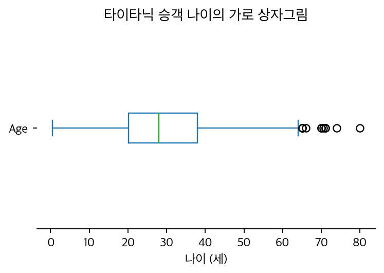
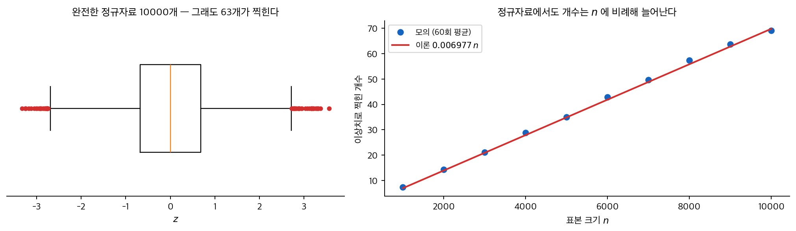
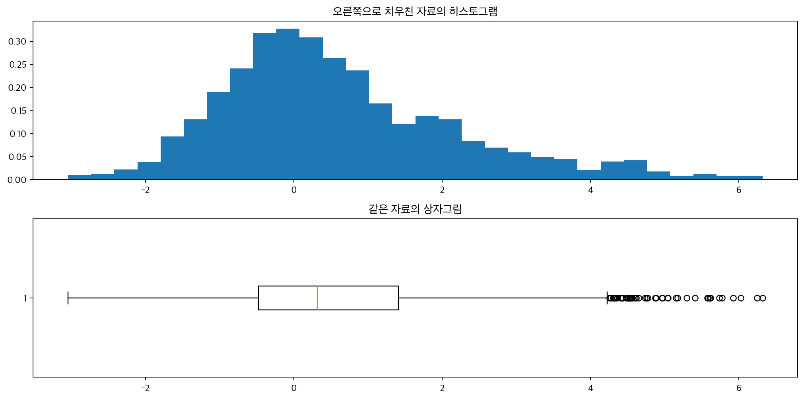
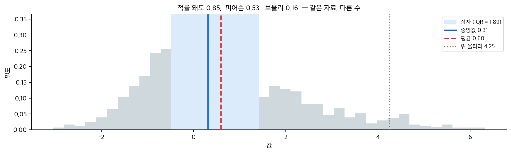
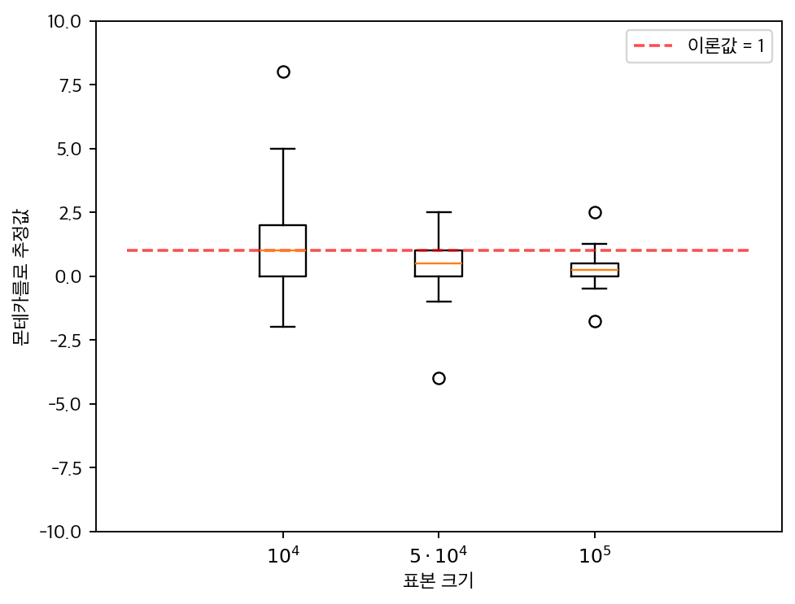
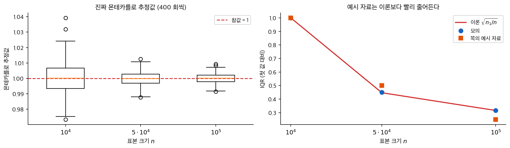
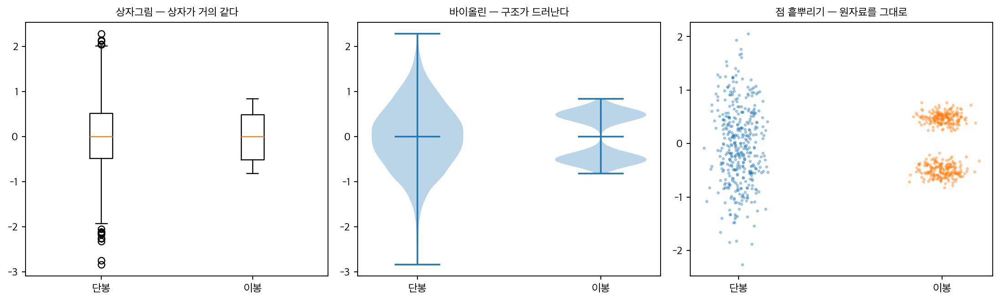
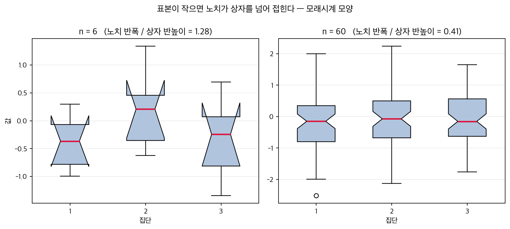
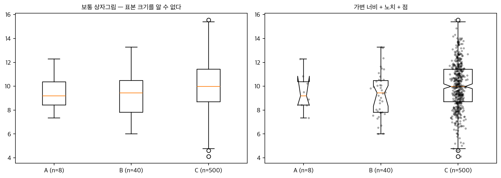

# 상자그림

## 개요

**상자그림**(상자수염그림)은 다섯 수치 요약 — 최솟값, 제1사분위수($Q_1$), 중앙값($Q_2$), 제3사분위수($Q_3$), 최댓값 — 에 근거해 자료의 분포를 표시하는 표준화된 방법이다. 중심, 퍼짐, 왜도, 이상치를 한꺼번에 압축적으로 요약해 보여준다.

## 상자그림의 구조

상자그림의 구성요소는 다음과 같다.

- **상자:** $Q_1$에서 $Q_3$까지 뻗어 사분위범위(IQR = $Q_3 - Q_1$)를 덮는다. 상자의 길이가 자료 가운데 50%를 나타낸다.
- **중앙값 선:** 상자 안 $Q_2$ 위치의 선.
- **수염:** 상자에서 $Q_1$과 $Q_3$의 $1.5 \times \text{IQR}$ 안에 있는 가장 극단적인 자료점까지 뻗는다.
- **이상치:** 수염 너머에 개별 점으로 찍힌다.

## 기본 상자그림: 타이타닉 승객의 나이

<div class="exbox" markdown>

**보기 1.** <span class="diff easy" title="쉬움"></span> 타이타닉 승객 나이의 상자그림, 그리고 $1.5 \times \text{IQR}$ 규칙이 정규자료에서 내는 거짓양성률.

**(1)** 상자그림을 그리고, 수염이 어디서 멈추는지 울타리를 계산해 확인하시오. `describe()`의 `max`가 수염의 끝이 아닌 까닭을 밝히시오.

**(2)** 자료가 **정확히 정규분포**를 따를 때 $1.5 \times \text{IQR}$ 울타리 밖에 놓이는 확률을 구하시오. 표본 크기 $n$을 키우면 "이상치"로 찍히는 개수가 어떻게 되는가. 모의로 확인하시오.

</div>

??? success "풀이"

    **(1) 그려 본다.**

    ```python
    import matplotlib.pyplot as plt
    import pandas as pd

    # 그림에 한글을 쓰므로 한글 글꼴을 지정한다. 후보를 늘어놓으면 matplotlib 가
    # 설치된 첫 번째를 집으므로, 리눅스('NanumGothic')·맥('Apple SD Gothic Neo')·
    # 윈도우('Malgun Gothic')에서 코드를 고치지 않고 그대로 돌릴 수 있다.
    plt.rcParams["font.sans-serif"] = ["NanumGothic", "Apple SD Gothic Neo", "Malgun Gothic"]
    plt.rcParams["font.family"] = "sans-serif"
    plt.rcParams['axes.unicode_minus'] = False

    # 자료를 인터넷에서 내려받으므로 실행에 연결이 필요하다.
    url = "https://raw.githubusercontent.com/datasciencedojo/datasets/f0ccab6a7ceafdff780052166fb6fab3311398eb/titanic.csv"
    df = pd.read_csv(url, index_col='PassengerId')

    fig, ax = plt.subplots(figsize=(5, 3))

    # kind='box'로 pandas Series에서 곧바로 상자그림을 그린다.
    # vert=False는 눕혀 그린다는 뜻. 눕히면 축 이름이 길어도 읽기 편하다.
    # 결측값(Age가 비어 있는 177명)은 pandas가 알아서 제외한다.
    df['Age'].plot(kind='box', ax=ax, vert=False)

    ax.set_title("타이타닉 승객 나이의 가로 상자그림")
    ax.set_xlabel("나이 (세)")
    # 상자와 수염 자체에 눈이 가도록 불필요한 테두리를 지운다
    ax.spines[["top", "left", "right"]].set_visible(False)
    plt.show()

    # 상자를 이루는 세 숫자(Q1, 중앙값, Q3)와 자료의 최솟값·최댓값을 확인한다.
    # 주의: min 과 max 는 '수염의 끝'이 아니다. 수염은 울타리 안의 가장 극단적인
    # 자료점까지만 뻗고, 그 바깥은 이상치 점으로 따로 찍힌다.
    print(df['Age'].describe()[['min', '25%', '50%', '75%', 'max']].round(2))
    ```

    출력:

    ```
    min     0.42
    25%    20.12
    50%    28.00
    75%    38.00
    max    80.00
    Name: Age, dtype: float64
    ```

    

    **출력의 다섯 수와 그림을 하나씩 맞춰 보면 한 가지가 어긋난다.** 상자의 왼쪽 끝 $20.12$, 가운데 선 $28.00$, 오른쪽 끝 $38.00$은 그림에서 그대로 읽힌다. 그런데 **오른쪽 수염은 `max`인 $80$까지 가지 않는다.**

    반올림하지 않은 값으로 $Q_1 = 20.125$, $Q_3 = 38.000$이므로 $\text{IQR} = 17.875$이고, 위쪽 울타리는

    $$
    Q_3 + 1.5 \times \text{IQR} = 38.000 + 26.813 = 64.813
    $$

    이다. 수염은 이 울타리 **안쪽의 가장 큰 자료값**인 $64$세에서 멈춘다. $65$세 이상인 $11$명($65, 65, 65, 66, 70, 70, 70.5, 71, 71, 74, 80$)이 그 너머에 점으로 찍힌 것이다. 아래쪽 울타리는 $20.125 - 26.813 = -6.688$로 음수이므로 아래쪽에는 이상치가 없고, 왼쪽 수염이 `min`인 $0.42$까지 그대로 간다.

    **`describe()`의 `min`·`max`를 수염의 끝으로 읽으면 안 된다.** 수염의 끝은 "울타리 지점" 자체도 아니고 "자료의 최솟값·최댓값"도 아니며, **울타리 안에 들어오는 실제 자료점 가운데 가장 바깥의 것**이다. 여기서도 $64.813$이 아니라 $64$에서 멈춘다.

    **(2) 울타리 밖에 놓일 확률. 해석적으로.** 왜 하필 $1.5$인가. 그 답은 **정규분포에서 계산해 보면** 나온다.

    $X \sim N(\mu, \sigma^2)$ 이면 사분위수는 $\mu \mp z_{0.75}\sigma$ 이고 $z_{0.75} = 0.674490$ 이다. 따라서

    $$
    \text{IQR} = 2 z_{0.75}\,\sigma = 1.348980\,\sigma
    $$

    이고 울타리는 중심에서

    $$
    z_{0.75}\sigma + 1.5 \times 1.348980\,\sigma
    = (0.674490 + 2.023469)\,\sigma = 2.697959\,\sigma
    $$

    떨어진 곳에 놓인다. 울타리가 **$\pm 2.70\sigma$** 라는 것이 $1.5$ 라는 수의 정체다. 그 바깥에 놓일 확률은

    $$
    p = 2\,\Phi(-2.697959) = 0.006977
    $$

    **$0.7\%$ 다.** 투키가 $1.5$ 를 고른 것은 정규자료에서 이 값이 $1\%$ 아래로 떨어지면서도 꼬리가 조금만 두꺼워지면 바로 반응하도록 하기 위해서였다.

    여기서 따라 나오는 결론이 중요하다. $p$ 는 **$n$ 과 무관한 상수**이므로 찍히는 점의 개수는

    $$
    E[\text{이상치로 찍히는 개수}] = p\,n = 0.006977\,n
    $$

    로 **$n$ 에 비례해 선형으로 늘어난다.** $n = 1000$ 이면 약 $7$개, $n = 10{,}000$ 이면 약 $70$개다. **자료가 완벽하게 정규여도 그렇다.** 그러므로 상자그림의 점은 "이 값이 이상하다"는 **판정이 아니다.** 판정이라면 $n$ 이 커질수록 거짓양성이 줄어야 하는데 정반대다.

    **수치적으로.**

    ```python
    import numpy as np
    from scipy.stats import norm

    z = norm.ppf(0.75)
    fence = z + 1.5 * (2 * z)
    p = 2 * norm.cdf(-fence)
    print(f"z_0.75 = {z:.6f},  정규자료의 IQR = 2z = {2 * z:.6f} sigma")
    print(f"울타리 = {z:.5f} + {1.5 * 2 * z:.5f} = {fence:.6f} sigma")
    print(f"울타리 밖 확률 p = 2 Phi(-{fence:.5f}) = {p:.6f}  (1000 개 중 {p * 1000:.2f} 개)")


    def flagged(x):
        q1, q3 = np.percentile(x, [25, 75])
        iqr = q3 - q1
        return (x < q1 - 1.5 * iqr) | (x > q3 + 1.5 * iqr)


    rng = np.random.default_rng(3)
    print(f"\n{'n':>8}{'반복':>7}{'모의 평균':>11}{'이론 p*n':>11}{'비':>7}")
    for n in [100, 1000, 10000, 100000]:
        reps = max(20, 2_000_000 // n)
        m = np.mean([flagged(rng.standard_normal(n)).sum() for _ in range(reps)])
        print(f"{n:>8}{reps:>7}{m:>11.3f}{p * n:>11.3f}{m / (p * n):>7.3f}")

    ns = np.arange(1000, 10001, 1000)
    means = []
    for n in ns:
        means.append(np.mean([flagged(rng.standard_normal(n)).sum() for _ in range(60)]))
    means = np.array(means)
    print(f"\nn 에 대한 회귀기울기 = {np.sum(ns * means) / np.sum(ns * ns):.6f}   "
          f"(이론 {p:.6f})")

    fig, (ax1, ax2) = plt.subplots(1, 2, figsize=(12, 3.6),
                                   gridspec_kw={"width_ratios": [1, 1.2]})
    x = rng.standard_normal(10000)
    f = flagged(x)
    ax1.boxplot(x, vert=False, widths=0.5, flierprops=dict(marker='o', ms=4,
                markerfacecolor="#D32F2F", markeredgecolor="#D32F2F"))
    ax1.set_title(f"완전한 정규자료 10000개 — 그래도 {f.sum()}개가 찍힌다", fontsize=11)
    ax1.set_xlabel("$z$")
    ax1.set_yticks([])
    ax1.spines[["top", "left", "right"]].set_visible(False)

    ax2.plot(ns, means, "o", color="#1565C0", ms=6, label="모의 (60회 평균)")
    ax2.plot(ns, p * ns, "-", color="#D32F2F", lw=1.8,
             label=f"이론 $0.006977\\,n$")
    ax2.set_xlabel("표본 크기 $n$")
    ax2.set_ylabel("이상치로 찍힌 개수")
    ax2.set_title("정규자료에서도 개수는 $n$ 에 비례해 늘어난다", fontsize=11)
    ax2.legend(fontsize=9)
    ax2.spines[["top", "right"]].set_visible(False)
    plt.tight_layout()
    plt.show()
    ```

    출력:

    ```
    z_0.75 = 0.674490,  정규자료의 IQR = 2z = 1.348980 sigma
    울타리 = 0.67449 + 2.02347 = 2.697959 sigma
    울타리 밖 확률 p = 2 Phi(-2.69796) = 0.006977  (1000 개 중 6.98 개)

           n     반복      모의 평균     이론 p*n      비
         100  20000      1.002      0.698  1.436
        1000   2000      7.186      6.977  1.030
       10000    200     70.760     69.766  1.014
      100000     20    705.200    697.660  1.011

    n 에 대한 회귀기울기 = 0.007055   (이론 0.006977)
    ```

    

    **$n$ 이 크면 이론이 정확히 맞는다.** 모의 평균과 $0.006977n$ 의 비가 $n = 1000$ 에서 $1.030$, $n = 10{,}000$ 에서 $1.014$, $n = 100{,}000$ 에서 $1.011$ 이다. $n = 1000$ 부터 $10{,}000$ 까지의 회귀기울기도 $0.007055$ 로 이론 $0.006977$ 과 $1\%$ 안에서 같다. 그림 오른쪽의 점들이 이론 직선 위에 그대로 놓인다.

    **$n = 100$ 에서만 비가 $1.436$ 으로 크게 어긋나는데, 그것도 설명된다.** 유도는 $Q_1, Q_3$ 을 **참 사분위수**로 두고 계산했다. 표본에서는 그 둘을 추정하므로 $\widehat{\text{IQR}}$ 이 흔들리고, 울타리가 좁아지는 쪽으로 흔들릴 때 찍히는 점이 많아진다. 개수는 $0$ 아래로 못 가지만 위로는 얼마든지 갈 수 있어 **평균이 위로 끌린다.** $n$ 이 커져 $\widehat{\text{IQR}}$ 이 안정되면 비가 $1$ 로 수렴한다. 실제로 $1.436 \to 1.030 \to 1.014 \to 1.011$ 이다.

    그림 왼쪽이 요점을 그대로 보여 준다. **표준정규난수 $10{,}000$개 — 오염도 오류도 전혀 없는 자료**인데 상자그림은 $63$개의 점을 "이상치"로 찍는다. 이론 기댓값 $69.8$ 과 같은 자리다.

    **그러므로 상자그림의 점은 가설검정이 아니다.** 점이 찍혔다는 것은 "그 값이 사분위수에서 $2.7\sigma$ 쯤 떨어져 있다"는 **기하학적 사실**일 뿐이고, 그 자체로는 자료에 아무 잘못이 없어도 생긴다. 타이타닉의 $65$세 이상 $11$명도 마찬가지다 — 나이가 알려진 $714$명에 $0.006977$ 을 곱하면 $5.0$ 이므로, 나이가 정규분포라면 $5$명쯤이 저절로 찍혔을 자리다. 실제로 $11$명이 찍힌 것은 나이 분포가 정규보다 오른쪽 꼬리가 두껍다는 뜻이지, 그 $11$명이 **잘못된 기록**이라는 뜻이 아니다.

## 상자그림에서 왜도 알아보기

상자그림은 분포의 모양을 빠르게 진단하게 해준다.

$$
\begin{array}{lll}
\text{왼쪽 상자} > \text{오른쪽 상자} &\Rightarrow& \text{왼쪽으로 치우침} \\
\text{왼쪽 상자} < \text{오른쪽 상자} &\Rightarrow& \text{오른쪽으로 치우침} \\
\text{상자가 같고, 왼쪽 수염} > \text{오른쪽 수염} &\Rightarrow& \text{왼쪽으로 치우침} \\
\text{상자가 같고, 왼쪽 수염} < \text{오른쪽 수염} &\Rightarrow& \text{오른쪽으로 치우침} \\
\text{둘 다 같음} &\Rightarrow& \text{대칭} \\
\end{array}
$$

여기서 "왼쪽 상자"는 $Q_2 - Q_1$, "오른쪽 상자"는 $Q_3 - Q_2$를 뜻한다(가로로 눕혀 그린 상자그림 기준).

## 히스토그램과 상자그림을 함께 보기

히스토그램을 상자그림과 나란히 놓으면 모양과 요약통계량의 연결이 분명해진다.

<div class="exbox" markdown>

**보기 2.** <span class="diff easy" title="쉬움"></span> 히스토그램과 상자그림을 함께 보기. $N(0,1)$ 에서 $1000$개, $N(2,1)$ 에서 $200$개, $N(4,1)$ 에서 $100$개를 이어 붙여 오른쪽으로 치우친 자료 $1300$개를 만든다.

**(1)** 같은 자료의 히스토그램과 상자그림을 위아래로 놓고 그리시오.

**(2)** 이 혼합분포의 **참 평균·분산·왜도와 참 사분위수**를 손으로 계산하고, 표본이 그것을 재현하는지 보시오. 아울러 **상자그림이 보여 주는 치우침**(사분위수로 잰 것)과 **적률로 잰 왜도**가 얼마나 다른지 적으시오.

</div>

??? success "풀이"

    **(1) 그려 본다.**

    ```python
    import matplotlib.pyplot as plt
    import numpy as np
    import scipy.stats as stats

    # 그림에 한글이 들어가므로 한글 글꼴을 지정한다(지정하지 않으면 네모로 깨진다).
    plt.rcParams["font.sans-serif"] = ["NanumGothic", "Apple SD Gothic Neo", "Malgun Gothic"]
    plt.rcParams["font.family"] = "sans-serif"
    plt.rcParams['axes.unicode_minus'] = False

    np.random.seed(0)

    # 오른쪽으로 치우친 자료를 만드는 요령:
    # 중심이 다른 정규분포 셋을 개수를 줄여 가며 겹친다.
    #   0 부근에 1000개  (본체)
    #   2 부근에  200개  (오른쪽 어깨)
    #   4 부근에  100개  (오른쪽 꼬리)
    # 왼쪽에는 대응하는 덩어리가 없으므로 분포가 오른쪽으로 길어진다.
    main_data = stats.norm().rvs(1_000)
    right_1 = stats.norm(loc=2).rvs(200)
    right_2 = stats.norm(loc=4).rvs(100)
    combined = np.concatenate((main_data, right_1, right_2))

    # 같은 자료를 위아래로 나란히 놓아 두 그림을 대응시킨다
    fig, (ax_hist, ax_box) = plt.subplots(2, 1, figsize=(12, 6))

    # 위: 히스토그램. 분포의 모양이 그대로 보인다.
    ax_hist.hist(combined, density=True, bins=30)
    ax_hist.set_title('오른쪽으로 치우친 자료의 히스토그램')

    # 아래: 같은 자료의 상자그림. 다섯 숫자로 압축된 모습이다.
    ax_box.boxplot(combined, vert=False)
    ax_box.set_title('같은 자료의 상자그림')

    plt.tight_layout()
    plt.show()

    # 치우침이 숫자로도 드러나는지 확인한다.
    # 오른쪽으로 치우치면 평균 > 중앙값 이고, Q3-Q2 가 Q2-Q1 보다 크다.
    q1, q2, q3 = np.percentile(combined, [25, 50, 75])
    print(f"평균 {combined.mean():.3f}  중앙값 {q2:.3f}")
    print(f"Q2-Q1 = {q2-q1:.3f}   Q3-Q2 = {q3-q2:.3f}  (오른쪽이 길다)")
    ```

    출력:

    ```
    평균 0.595  중앙값 0.314
    Q2-Q1 = 0.794   Q3-Q2 = 1.098  (오른쪽이 길다)
    ```

    

    **(2) 참값을 손으로 구한다.** 가중치 $w = (1000, 200, 100)/1300$, 중심 $\mu = (0, 2, 4)$, 분산은 모두 $1$ 인 정규혼합이다. 평균은

    $$
    M = \sum_k w_k \mu_k = \frac{200\cdot 2 + 100\cdot 4}{1300} = \frac{800}{1300} = 0.615385
    $$

    이고, $E[X^2] = \sum_k w_k(\mu_k^2 + 1) = 1 + \frac{200\cdot 4 + 100\cdot 16}{1300} = 2.846154$ 이므로

    $$
    V = 2.846154 - 0.615385^2 = 2.467456, \qquad \sigma = 1.570814
    $$

    다. 왜도는 3차 중심적률이 필요하다. 중심에서 잰 거리를 $\delta_k = \mu_k - M$ 이라 하면 정규 성분 하나의 3차 중심적률이 $\delta_k^3 + 3\delta_k\sigma_k^2$ 이므로

    $$
    \mu_3 = \sum_k w_k(\delta_k^3 + 3\delta_k) = \sum_k w_k \delta_k^3 + 3\underbrace{\sum_k w_k \delta_k}_{=\,0} = 3.211652
    $$

    이고

    $$
    g_1 = \frac{\mu_3}{\sigma^3} = \frac{3.211652}{1.570814^3} = 0.828618
    $$

    이다. 사분위수는 닫힌 꼴이 없으므로 $F(x) = \sum_k w_k \Phi(x - \mu_k) = q$ 를 수치로 푼다.

    **그런데 상자그림이 보여 주는 치우침은 이 $g_1$ 이 아니다.** 상자가 말하는 것은 사분위수뿐이므로 거기서 잴 수 있는 치우침은 **보울리 왜도**

    $$
    b = \frac{(Q_3 - Q_2) - (Q_2 - Q_1)}{Q_3 - Q_1}
    $$

    이다. 둘은 전혀 다른 양이다. $g_1$ 은 꼬리의 세제곱을 보지만 $b$ 는 **가운데 $50\%$ 안쪽만** 본다. 중간쯤에 있는 것이 피어슨의 $3(\text{평균} - \text{중앙값})/\sigma$ 다.

    **수치적으로.**

    ```python
    from scipy.optimize import brentq

    w = np.array([1000., 200., 100.]); w /= w.sum()
    mu = np.array([0., 2., 4.])
    M = (w * mu).sum()
    V = (w * (mu ** 2 + 1.0)).sum() - M ** 2
    dlt = mu - M
    m3 = (w * (dlt ** 3 + 3 * dlt)).sum()
    print(f"혼합분포의 참값:  평균 {M:.6f},  분산 {V:.6f},  표준편차 {np.sqrt(V):.6f}")
    print(f"  3차 중심적률 {m3:.6f},  적률 왜도 = m3/sd^3 = {m3 / V ** 1.5:.6f}")

    cdf = lambda x: (w * stats.norm.cdf(x, loc=mu)).sum()
    Q = [brentq(lambda x: cdf(x) - q, -6, 12) for q in [0.25, 0.5, 0.75]]
    bowley = ((Q[2] - Q[1]) - (Q[1] - Q[0])) / (Q[2] - Q[0])
    print(f"  참 사분위수 Q1={Q[0]:.4f}  Q2={Q[1]:.4f}  Q3={Q[2]:.4f}")
    print(f"  참 Q2-Q1={Q[1]-Q[0]:.4f}  Q3-Q2={Q[2]-Q[1]:.4f}  보울리 왜도 {bowley:.4f}")
    print(f"  참 피어슨 3(평균-중앙값)/sd = {3 * (M - Q[1]) / np.sqrt(V):.4f}")

    q1, q2, q3 = np.percentile(combined, [25, 50, 75])
    bw_s = ((q3 - q2) - (q2 - q1)) / (q3 - q1)
    print(f"\n표본 (n = {len(combined)}):")
    print(f"  평균 {combined.mean():.6f}  중앙값 {q2:.6f}  표준편차 {combined.std(ddof=1):.6f}")
    print(f"  표본 Q1={q1:.4f}  Q2={q2:.4f}  Q3={q3:.4f}")
    print(f"  적률 왜도 {stats.skew(combined):.6f}   "
          f"(몬테카를로 오차 ~ sqrt(6/n) = {np.sqrt(6/len(combined)):.4f})")
    print(f"  보울리 왜도 {bw_s:.4f}   피어슨 "
          f"{3 * (combined.mean() - q2) / combined.std(ddof=1):.4f}")
    print(f"\n상자가 덮는 가로 폭 = IQR / 자료 범위 = "
          f"{(q3-q1)/(combined.max()-combined.min()):.4f}")

    fig, ax = plt.subplots(figsize=(11, 3.4))
    ax.hist(combined, bins=40, density=True, color="#CFD8DC", zorder=0)
    ax.axvspan(q1, q3, color="#DCEBFB", zorder=1, label=f"상자 (IQR = {q3-q1:.2f})")
    ax.axvline(q2, color="#1565C0", lw=2, zorder=3, label=f"중앙값 {q2:.2f}")
    ax.axvline(combined.mean(), color="#D32F2F", lw=2, ls="--", zorder=3,
               label=f"평균 {combined.mean():.2f}")
    ax.axvline(q3 + 1.5 * (q3 - q1), color="#E65100", lw=1.6, ls=":", zorder=3,
               label=f"위 울타리 {q3 + 1.5*(q3-q1):.2f}")
    ax.set_xlabel("값")
    ax.set_ylabel("밀도")
    ax.set_title(f"적률 왜도 {stats.skew(combined):.2f},  피어슨 "
                 f"{3*(combined.mean()-q2)/combined.std(ddof=1):.2f},  보울리 {bw_s:.2f}"
                 "  — 같은 자료, 다른 수", fontsize=11)
    ax.legend(fontsize=9)
    ax.spines[["top", "right"]].set_visible(False)
    plt.tight_layout()
    plt.show()
    ```

    출력:

    ```
    혼합분포의 참값:  평균 0.615385,  분산 2.467456,  표준편차 1.570814
      3차 중심적률 3.211652,  적률 왜도 = m3/sd^3 = 0.828618
      참 사분위수 Q1=-0.4577  Q2=0.3583  Q3=1.4020
      참 Q2-Q1=0.8159  Q3-Q2=1.0438  보울리 왜도 0.1225
      참 피어슨 3(평균-중앙값)/sd = 0.4911

    표본 (n = 1300):
      평균 0.595182  중앙값 0.313942  표준편차 1.587044
      표본 Q1=-0.4800  Q2=0.3139  Q3=1.4115
      적률 왜도 0.847545   (몬테카를로 오차 ~ sqrt(6/n) = 0.0679)
      보울리 왜도 0.1605   피어슨 0.5316

    상자가 덮는 가로 폭 = IQR / 자료 범위 = 0.2019
    ```

    

    **표본이 참값을 그대로 재현한다.** 평균 $0.6154$ 대 $0.5952$(표준오차 $\sigma/\sqrt{n} = 1.5708/\sqrt{1300} = 0.0436$ 이므로 $0.5$ 표준오차 안), 표준편차 $1.5708$ 대 $1.5870$, 사분위수 $(-0.4577, 0.3583, 1.4020)$ 대 $(-0.4800, 0.3139, 1.4115)$. 적률 왜도는 참값 $0.8286$ 에 표본 $0.8475$ 로, 몬테카를로 오차 $\sqrt{6/n} = 0.0679$ 의 $0.3$ 배 안이다. **유도한 값과 코드가 맞는다.**

    **그런데 세 가지 "왜도"가 $0.85$, $0.53$, $0.16$ 으로 전혀 다르다.** 참값으로도 $0.83$, $0.49$, $0.12$ 다. 셋 다 "오른쪽으로 치우쳤다"고는 말하지만 크기가 다섯 배 넘게 차이 난다. 까닭은 각자가 보는 범위가 다르기 때문이다.

    - **적률 왜도**는 $(x - \mu)^3$ 을 쓰므로 멀리 있는 점에 세제곱의 가중치를 준다. 치우침의 대부분이 $4$ 근처의 $100$개가 만든 **오른쪽 꼬리**에 있는데, 이 측도가 그것을 거의 다 담는다.
    - **보울리 왜도**는 $Q_1, Q_2, Q_3$ 셋만 쓴다. 출력의 마지막 줄대로 상자는 자료 범위의 **$20.19\%$ 밖에 덮지 않는다.** 꼬리의 $80\%$ 는 계산에 들어오지도 않는다. 그래서 $0.16$ 이라는 작은 수가 나온다.

    **이것이 상자그림을 읽을 때의 함정이다.** 상자가 거의 대칭으로 보여도($Q_2 - Q_1 = 0.79$ 대 $Q_3 - Q_2 = 1.10$, 눈으로는 "조금 치우쳤네" 정도다) 적률 왜도는 $0.85$ 로 꽤 큰 값일 수 있다. 위 그림에서 파란 띠(상자)가 덮는 구간과 그 바깥에 길게 뻗은 오른쪽 꼬리를 견주어 보라. 위 울타리 $4.25$ 보다 큰 점들이 상자그림에서는 점 몇 개로 줄어들지만, 히스토그램에서는 $2$ 부터 $6$ 까지 이어진 **두 번째 덩어리**임이 드러난다. 바로 그 덩어리가 $N(4,1)$ 에서 온 $100$개다.

    **상자그림이 이봉성을 못 보인다는 말의 정확한 뜻이 이것이다.** 상자그림은 $Q_1, Q_2, Q_3$ 과 울타리만 그리므로, 그 사이에 봉우리가 몇 개 있든 똑같은 그림이 나온다. 위 자료는 사실 봉우리가 $0$ 근처 하나와 $2$–$4$ 근처의 넓은 어깨로 되어 있는데, 아래 상자그림만 보면 "오른쪽으로 조금 치우친 단봉 분포"로밖에 읽히지 않는다.

## 비교 상자그림

상자그림은 집단 간 분포를 비교할 때 가장 강력하다.

<div class="exbox" markdown>

**보기 3.** <span class="diff easy" title="쉬움"></span> 집단별 비교 상자그림. 몬테카를로 추정의 오차가 표본 크기 $10^4, 5\cdot 10^4, 10^5$ 에서 어떻게 줄어드는지 보이는 그림이다.

**(1)** 세 집단을 같은 눈금 위에 나란히 놓고 그린 뒤, IQR이 줄어드는 모습을 수로 확인하시오.

**(2)** 몬테카를로 추정량의 IQR이 $n$ 에 따라 **어떤 비율로** 줄어야 하는지 유도하고, 진짜 몬테카를로 실험으로 확인하시오. (1)의 예시 자료가 그 비율을 따르는지도 따지시오.

</div>

??? success "풀이"

    **(1) 그려 본다.**

    ```python
    import numpy as np
    import matplotlib.pyplot as plt

    # 그림에 한글이 들어가므로 한글 글꼴을 지정한다(지정하지 않으면 네모로 깨진다).
    plt.rcParams["font.sans-serif"] = ["NanumGothic", "Apple SD Gothic Neo", "Malgun Gothic"]
    plt.rcParams["font.family"] = "sans-serif"
    plt.rcParams['axes.unicode_minus'] = False

    # 표본 크기를 10^4, 5*10^4, 10^5 로 늘려 가며 얻은 몬테카를로 추정 오차를 흉내 낸 자료다.
    # 표본이 커질수록 퍼짐이 줄어드는 모습을 만들기 위해 비슷한 값들의 묶음에
    # 0.5, 0.25를 곱했다. 극단값은 일부러 서로 다르게 두어, 표본이 커져도
    # 이상치는 남을 수 있다는 점을 보인다.
    data_a = np.array([1, 2, 0, 0, 0, 1, 3, 1, 2, 1, 2, 4, 5, -1, -2, 0, 8])
    data_b = np.array([1, 2, 0, 0, 0, 1, 3, 1, 2, 1, 2, 4, 5, -1, -2, 0, -8]) * 0.5
    data_c = np.array([1, 2, 0, 0, 0, 1, 3, 1, 2, 1, 2, 4, 5, -1, -2, 0, 10, -7]) * 0.25

    fig, ax = plt.subplots()

    # 리스트를 넘기면 상자를 나란히 그린다. 이것이 상자그림의 가장 큰 쓸모다.
    ax.boxplot([data_a, data_b, data_c])

    # 각 상자 아래에 이름을 붙인다.
    # boxplot에 직접 주는 인자는 matplotlib 버전에 따라 이름이 다르다
    # (3.9 미만은 labels=, 3.9 이상은 tick_labels=). 아래처럼 축에 직접 주면
    # 버전에 상관없이 동작한다.
    ax.set_xticklabels(["$10^4$", "$5 \\cdot 10^4$", "$10^5$"])

    # 비교 기준선. 이론값 1을 가로선으로 깔아 두면
    # 각 상자가 그 선을 얼마나 감싸는지 눈으로 볼 수 있다.
    ax.plot([0, 1, 2, 3, 4], [1, 1, 1, 1, 1],
            label="이론값 = 1", linestyle="--", color="r", alpha=0.7)

    ax.legend()
    ax.set_ylim(-10.0, 10.0)      # 세 상자를 같은 눈금에 두어야 비교가 성립한다
    ax.set_xlabel('표본 크기')
    ax.set_ylabel('몬테카를로 추정값')
    plt.show()

    # 퍼짐이 실제로 줄어드는지 IQR로 확인한다
    for name, d in [("10^4", data_a), ("5*10^4", data_b), ("10^5", data_c)]:
        q1, q3 = np.percentile(d, [25, 75])
        print(f"{name:>7}: 중앙값 {np.median(d):6.2f}  IQR {q3-q1:.2f}")
    ```

    출력:

    ```
       10^4: 중앙값   1.00  IQR 2.00
     5*10^4: 중앙값   0.50  IQR 1.00
       10^5: 중앙값   0.25  IQR 0.50
    ```

    

    세 상자가 같은 눈금 위에 놓여 있어 퍼짐이 줄어드는 것이 바로 보인다. IQR이 $2.00 \to 1.00 \to 0.50$ 으로 절반씩 줄었다. **상자그림을 나란히 놓는 것이 이렇게 쓸모 있는 까닭은 상자의 길이가 곧 퍼짐이기 때문**이고, 그래서 세로축을 집단마다 다르게 잡으면 비교가 통째로 무너진다.

    **(2) 줄어드는 비율은 얼마여야 하는가. 해석적으로.** 몬테카를로 추정량은 $n$개의 독립 추출을 평균한 것이므로

    $$
    \hat I_n = \frac{1}{n}\sum_{i=1}^{n} f(X_i), \qquad
    \operatorname{SD}(\hat I_n) = \frac{\sigma}{\sqrt{n}}
    $$

    이다. $n$ 이 크면 중심극한정리로 $\hat I_n$ 이 거의 정규이므로 보기 1에서 쓴 관계를 그대로 쓸 수 있다.

    $$
    \text{IQR}(\hat I_n) = 2 z_{0.75}\,\frac{\sigma}{\sqrt{n}} = \frac{1.348980\,\sigma}{\sqrt{n}}
    $$

    따라서 **IQR의 비는 표본 크기의 비의 제곱근으로만 정해진다.**

    $$
    \frac{\text{IQR}(n_2)}{\text{IQR}(n_1)} = \sqrt{\frac{n_1}{n_2}}
    $$

    $n$ 이 $10^4 \to 5\cdot10^4 \to 10^5$ 이면 비가 $1 : \sqrt{1/5} : \sqrt{1/10} = 1 : 0.4472 : 0.3162$ 여야 한다.

    **그런데 (1)의 예시 자료는 $1 : 0.50 : 0.25$ 다.** 이것은 $n$ 이 $4$배, $16$배가 된 경우에 해당하지 $5$배, $10$배가 된 경우가 아니다($1/0.5^2 = 4$, $1/0.25^2 = 16$). 예시 자료는 "퍼짐이 줄어든다"는 그림을 만들려고 손으로 $0.5$와 $0.25$를 곱한 것이어서, **이름표의 $n$ 과 맞지 않는다.** 진짜 몬테카를로로 다시 해 보자.

    ```python
    from scipy.stats import norm

    z = norm.ppf(0.75)
    sizes = [10_000, 50_000, 100_000]
    names = ["$10^4$", "$5\\cdot 10^4$", "$10^5$"]
    sigma = 1.0                      # Exp(1) 의 표준편차
    print(f"이론: IQR = 2 z_0.75 sigma / sqrt(n) = {2*z:.6f} / sqrt(n)")
    print(f"{'n':>8}{'이론 IQR':>12}{'모의 IQR':>12}{'비':>8}{'첫 IQR 대비(이론)':>18}"
          f"{'(모의)':>10}")
    rng = np.random.default_rng(11)
    reps = 400
    est = []
    for n in sizes:
        # 한 번에 큰 배열을 잡지 않도록 반복마다 따로 뽑는다. 참값은 E[X] = 1.
        est.append(np.array([rng.exponential(1.0, n).mean() for _ in range(reps)]))
    first_t = 2 * z * sigma / np.sqrt(sizes[0])
    first_s = np.subtract(*np.percentile(est[0], [75, 25]))
    for n, e in zip(sizes, est):
        t = 2 * z * sigma / np.sqrt(n)
        s = np.subtract(*np.percentile(e, [75, 25]))
        print(f"{n:>8}{t:>12.6f}{s:>12.6f}{s/t:>8.3f}{t/first_t:>18.4f}{s/first_s:>10.4f}")

    big = np.array([rng.exponential(1.0, sizes[0]).mean() for _ in range(10_000)])
    print(f"\nn = 10^4 에서 반복을 10000 회로 늘리면 비 = "
          f"{np.subtract(*np.percentile(big, [75, 25])) / first_t:.4f}")
    print(f"이론 비:  sqrt(1/5) = {np.sqrt(1/5):.4f},  sqrt(1/10) = {np.sqrt(1/10):.4f}")
    print(f"손으로 만든 자료의 비: 1.00 -> 0.50 -> 0.25")
    print(f"  0.50 에 맞는 n 배수 = 1/0.50^2 = {1/0.5**2:.0f},  "
          f"0.25 에 맞는 n 배수 = 1/0.25^2 = {1/0.25**2:.0f}")

    fig, (ax1, ax2) = plt.subplots(1, 2, figsize=(12, 3.6))
    ax1.boxplot(est, widths=0.5)
    ax1.axhline(1.0, color="#D32F2F", ls="--", lw=1.4, label="참값 = 1")
    ax1.set_xticklabels(names)
    ax1.set_xlabel("표본 크기 $n$")
    ax1.set_ylabel("몬테카를로 추정값")
    ax1.set_title("진짜 몬테카를로 추정값 (400 회씩)", fontsize=11)
    ax1.legend(fontsize=9)

    iqr_t = [2 * z * sigma / np.sqrt(n) for n in sizes]
    iqr_s = [np.subtract(*np.percentile(e, [75, 25])) for e in est]
    ax2.plot(sizes, np.array(iqr_t) / iqr_t[0], "-", color="#D32F2F", lw=1.8,
             label="이론 $\\sqrt{n_1/n}$")
    ax2.plot(sizes, np.array(iqr_s) / iqr_s[0], "o", color="#1565C0", ms=7,
             label="모의")
    ax2.plot(sizes, [1.0, 0.5, 0.25], "s", color="#E65100", ms=7,
             label="쪽의 예시 자료")
    ax2.set_xticks(sizes)
    ax2.set_xticklabels(names)
    ax2.set_xlabel("표본 크기 $n$")
    ax2.set_ylabel("IQR (첫 값 대비)")
    ax2.set_title("예시 자료는 이론보다 빨리 줄어든다", fontsize=11)
    ax2.legend(fontsize=9)
    for ax in (ax1, ax2):
        ax.spines[["top", "right"]].set_visible(False)
    plt.tight_layout()
    plt.show()
    ```

    출력:

    ```
    이론: IQR = 2 z_0.75 sigma / sqrt(n) = 1.348980 / sqrt(n)
           n      이론 IQR      모의 IQR       비      첫 IQR 대비(이론)      (모의)
       10000    0.013490    0.013231   0.981            1.0000    1.0000
       50000    0.006033    0.005954   0.987            0.4472    0.4500
      100000    0.004266    0.004197   0.984            0.3162    0.3172

    n = 10^4 에서 반복을 10000 회로 늘리면 비 = 1.0097
    이론 비:  sqrt(1/5) = 0.4472,  sqrt(1/10) = 0.3162
    손으로 만든 자료의 비: 1.00 -> 0.50 -> 0.25
      0.50 에 맞는 n 배수 = 1/0.50^2 = 4,  0.25 에 맞는 n 배수 = 1/0.25^2 = 16
    ```

    

    **$\sqrt{n}$ 법칙이 맞는다.** 첫 값 대비 비가 이론 $0.4472, 0.3162$ 에 모의 $0.4500, 0.3172$ 로, 소수 둘째 자리까지 같다. 절대 IQR도 이론 대비 $0.981, 0.987, 0.984$ 로 $2\%$ 안에서 맞는다. 이 $2\%$ 는 **IQR 자체를 $400$회의 반복으로 재면서 생긴 몬테카를로 오차**다. 반복을 $10{,}000$회로 늘리면 비가 $1.0097$ 로 $1$ 쪽으로 올라간다.

    **그리고 (1)의 예시 자료는 $\sqrt{n}$ 법칙을 따르지 않는다.** 오른쪽 그림에서 주황 네모(예시 자료)가 빨간 이론선 아래에 있다. 손으로 $0.5$, $0.25$ 를 곱해 만든 것이라 $n$ 이 $4$배, $16$배가 된 셈이고, 이름표의 $5$배, $10$배와 맞지 않는다. $10^5$ 에서 예시 자료는 이론보다 $0.3162/0.25 = 1.26$ 배 좁다. **그림이 보여 주려는 성질은 옳지만 수치는 과장되어 있다.**

    이 어긋남 자체가 쓸모 있는 교훈이다. "퍼짐이 줄어든다"는 그림은 쉽게 만들 수 있지만, **얼마나 줄어드는가는 $1/\sqrt{n}$ 이 정한다.** 추정 오차를 절반으로 줄이려면 표본을 두 배가 아니라 **네 배**로 늘려야 한다. 그림 왼쪽의 진짜 상자들을 보면 $n$ 을 $10$배로 늘려도 상자가 $1/\sqrt{10} = 0.32$ 배로만 줄어든다 — 계산량은 $10$배가 들었는데 말이다.

    끝으로 (1)의 그림이 보이려 한 또 하나, **"표본이 커져도 이상치는 남는다"** 도 보기 1의 결과로 설명된다. 울타리 밖 확률 $p = 0.006977$ 은 $n$ 과 무관하므로, 반복 $400$회의 상자그림에는 $n$ 이 얼마든 평균 $400 \times 0.006977 = 2.8$ 개의 점이 찍힌다. 왼쪽 그림의 세 상자에 실제로 찍힌 점이 $3, 2, 3$ 개다. **표본을 아무리 키워도 이 점들은 사라지지 않는다.** 자료에 이상한 것이 있어서가 아니라 규칙이 그렇게 생겼기 때문이다.

## 연습문제

<div class="drillbox" markdown>

**연습문제 1.** <span class="diff easy" title="쉬움"></span>
어떤 자료의 다섯 수치 요약이 최솟값 $= 10$, $Q_1 = 25$, 중앙값 $= 35$, $Q_3 = 50$, 최댓값 $= 90$이다. IQR과 울타리 값을 계산하라. $1.5 \times \text{IQR}$ 규칙에 따르면 이상치가 있는가?

</div>

??? success "풀이"
    IQR은

    $$
    \text{IQR} = Q_3 - Q_1 = 50 - 25 = 25
    $$

    이고 울타리는

    $$
    \text{Lower fence} = Q_1 - 1.5 \times \text{IQR} = 25 - 37.5 = -12.5
    $$

    $$
    \text{Upper fence} = Q_3 + 1.5 \times \text{IQR} = 50 + 37.5 = 87.5
    $$

    이다.

    최솟값(10)은 아래쪽 울타리($-12.5$)보다 크므로 아래쪽 이상치는 없다. 그러나 최댓값(90)이 위쪽 울타리(87.5)를 넘으므로 **90이 이상치**다. 상자그림에서 위쪽 수염은 87.5 이하의 가장 큰 값까지 뻗고, 90은 개별 이상치 표시로 나타난다.

<div class="drillbox" markdown>

**연습문제 2.** <span class="diff easy" title="쉬움"></span>
상자그림 두 개가 나란히 그려져 있다. 상자그림 A는 상자가 짧고 수염이 길며, 상자그림 B는 상자가 길고 수염이 짧다. 둘의 범위는 같다. 자료가 어디에 몰려 있는지의 관점에서 두 분포를 비교하라.

</div>

??? success "풀이"
    **상자그림 A**(짧은 상자, 긴 수염): 자료 가운데 50%가 중앙값 주위에 촘촘히 몰려 있지만 꼬리가 멀리 뻗는다. 중심 근처에 **뾰족하게 몰려** 있고 꼬리에는 관측값이 성기게 퍼진 분포, 즉 급첨이거나 꼬리가 두꺼운 모양을 시사한다.

    **상자그림 B**(긴 상자, 짧은 수염): 자료 가운데 50%가 넓게 퍼져 있지만 사분위수에서 멀리 떨어진 극단값이 없다. 자료가 어떤 범위에 걸쳐 더 **균일하게 퍼진** 분포, 즉 평첨이거나 균등분포에 가까운 모양을 시사한다.

    전체 범위는 같더라도 두 분포는 근본적으로 다르다. A는 관측값을 중앙값 근처에 모으고 몇몇 값만 멀리 흩뿌리는 반면, B는 관측값을 더 고르게 퍼뜨린다.

<div class="drillbox" markdown>

**연습문제 3.** <span class="diff easy" title="쉬움"></span>
완벽하게 대칭인 분포의 상자그림이 어떤 모습일지 서술하라. 완벽한 대칭을 나타내는 구체적인 특징은 무엇인가?

</div>

??? success "풀이"
    완벽하게 대칭인 분포에서는

    - **중앙값 선**이 상자의 정확히 가운데에 있어 $Q_2 - Q_1 = Q_3 - Q_2$이다.
    - **수염**의 길이가 양쪽에서 같다. $Q_1$에서 아래쪽 수염 끝까지의 거리가 $Q_3$에서 위쪽 수염 끝까지의 거리와 같다.
    - **이상치**가 있다면 양쪽에 대칭적으로 나타난다(개수가 같고 상자에서 대략 같은 거리에 있다).

    정규분포가 고전적인 예다. $N(\mu, \sigma^2)$에서 뽑은 큰 표본의 상자그림은 이런 대칭적 특징을 보인다.

<div class="drillbox" markdown>

**연습문제 4.** <span class="diff med" title="중간"></span>
X반의 시험 점수 상자그림은 중앙값 75, $Q_1 = 65$, $Q_3 = 85$, 아래쪽 수염 40, 위쪽 수염 100(이상치 없음)을 보여준다. Y반의 상자그림은 중앙값 75, $Q_1 = 70$, $Q_3 = 80$, 아래쪽 수염 55, 위쪽 수염 95(이상치 없음)를 보여준다. 두 반을 비교하라.

</div>

??? success "풀이"
    두 반의 중앙값이 같으므로(75) "전형적인" 학생의 성취도는 비슷하다. 그러나 퍼짐에서 상당히 다르다.

    - **X반**은 $\text{IQR} = 85 - 65 = 20$이고 범위 $= 100 - 40 = 60$이다. 점수가 넓게 흩어져 있어 학생 성취도의 변동성이 크다.
    - **Y반**은 $\text{IQR} = 80 - 70 = 10$이고 범위 $= 95 - 55 = 40$이다. 점수가 중앙값 주위에 더 촘촘히 몰려 있다.

    Y반이 더 동질적이다. 대부분의 학생이 70에서 80 사이에 있다. X반은 퍼짐이 넓어 아주 잘하는 학생과 아주 못하는 학생이 섞여 있음을 시사한다. 이 상자그림을 본 교사라면 X반의 변동성이 왜 그렇게 큰지 — 아마도 준비 수준의 차이나 학생 배경의 혼재를 — 살펴볼 만하다.

<div class="drillbox" markdown>

**연습문제 5.** <span class="diff med" title="중간"></span>
투키의 원래 상자그림 명세는 수염을 상자로부터 $1.5 \cdot \mathrm{IQR}$ 안에 있는 가장 극단적인 자료점에 둔다. 이것이 수염을 최솟값과 최댓값에 두는 것보다 나은 이유는 무엇인가?

</div>

??? success "풀이"
    수염을 최솟값과 최댓값에 두면 두 가지 문제가 있다.

    - **이상치 신호가 없다**: 최댓값이 이상치라면 수염이 거기까지 뻗어, 이상치가 없는 분포에서 위쪽 수염이 긴 경우와 구별되지 않는다. 자료의 꼬리가 긴 것인지 극단 관측값 하나가 있는 것인지 보는 사람이 알 수 없다.
    - **점 하나에 민감하다**: 아주 극단적인 관측값 하나가 수염을 그쪽으로 끌어당겨 그림 전체의 시각적 척도를 왜곡한다. 상자를 비롯한 다른 특징들이 축 쪽으로 눌려 버린다.

    투키의 선택은 전형적인 범위(가장 극단적인 *이상치가 아닌* 값까지의 수염)와 개별 이상치(수염 너머에 별도의 점으로 찍힘)를 분리한다. 이 시각화 결정은 하나의 모형을 담고 있다. "자료의 본체는 상자와 수염으로 기술되며, 그 바깥의 것은 의심스럽거나 흥미로우므로 개별적인 주의를 받을 자격이 있다." 대략 정규인 자료에서는 관측값의 약 0.7%가 $1.5\,\mathrm{IQR}$ 울타리 밖에 떨어지므로, 깨끗한 자료에서도 몇 개가 표시되는 것이 정상이다. 투키가 맞춘 비율이 바로 그것이다.

<div class="drillbox" markdown>

**연습문제 6.** <span class="diff med" title="중간"></span>
**노치 상자그림**은 중앙값 주위에 $\pm 1.57 \cdot \mathrm{IQR}/\sqrt{n}$의 "노치"를 더한다. 노치는 무엇을 나타내며, 집단 간 시각적 가설검정에 어떻게 쓰이는가?

</div>

??? success "풀이"
    노치는 McGill, Tukey, Larsen(1978)에 근거한 **중앙값의 근사적 95% 신뢰구간**을 나타낸다. 노치의 반폭 $\approx 1.57 \cdot \mathrm{IQR}/\sqrt{n}$이다.

    **시각적 비교에서의 활용:** 노치 상자그림 두 개를 나란히 그렸을 때 **노치가 겹치지 않으면 중앙값 사이에 통계적으로 유의한 차이가 있음**을 (대략 5% 수준에서) 나타낸다. 노치가 겹치면 유의한 차이가 없음을 시사한다. $p$-값을 계산하지 않고도 만–휘트니 검정이나 중앙값 검정에 해당하는 빠른 시각적 판단을 제공한다.

    **단서:**

    - 상수 1.57은 정규근사 논증에서 나온 것이라 표본이 작거나 자료가 비정규일 때는 근사적이다.
    - 표본이 작으면 노치가 상자를 넘어($Q_3$ 위나 $Q_1$ 아래로) 뻗을 수 있다. 시각적으로는 이상해 보이지만 중앙값이 제대로 결정되지 않았음을 나타낸다.
    - 어떤 상황에서는 이 시각적 규칙의 제1종 오류가 형식적 검정보다 크다. 탐색용으로 쓰고, 중요한 판단이 걸려 있으면 형식적 검정으로 뒷받침하라.

    노치 그림은 matplotlib에서 `boxplot(notch=True)`로, seaborn에서 `sns.boxplot(notch=True)`로 그린다. 형식적인 쌍별 검정을 하면 비교 횟수가 급증하는 상황에서, 여러 집단을 동시에 비교하는 논문에 특히 유용하다.

<div class="drillbox" markdown>

**연습문제 7.** <span class="diff med" title="중간"></span>
상자그림은 다섯 개의 수만 보여 준다. 그 다섯 수가 **거의 같으면서 전혀 다른 두 분포**를 만들어, 상자그림이 무엇을 놓치는지 보여라.

</div>

??? success "풀이"
    ```python
    import numpy as np
    import matplotlib.pyplot as plt

    # 그림에 한글이 들어가므로 한글 글꼴을 지정한다(지정하지 않으면 네모로 깨진다).
    plt.rcParams["font.sans-serif"] = ["NanumGothic", "Apple SD Gothic Neo", "Malgun Gothic"]
    plt.rcParams["font.family"] = "sans-serif"
    plt.rcParams['axes.unicode_minus'] = False

    rng = np.random.default_rng(0)
    n = 2000
    unimodal = rng.normal(0, 1, n)
    bimodal = np.concatenate([rng.normal(-1.6, 0.35, n // 2),
                              rng.normal(1.6, 0.35, n // 2)])

    # 중앙값 0, IQR 1 로 맞춘다
    norm = lambda x: (x - np.median(x)) / np.subtract(*np.percentile(x, [75, 25]))
    unimodal, bimodal = norm(unimodal), norm(bimodal)

    print("다섯 수치 요약")
    for label, x in [("단봉", unimodal), ("이봉", bimodal)]:
        print(f"  {label}: {np.round(np.percentile(x, [0, 25, 50, 75, 100]), 3)}")

    fig, axes = plt.subplots(1, 3, figsize=(13, 4))
    axes[0].boxplot([unimodal, bimodal])
    axes[0].set_xticklabels(["단봉", "이봉"])
    axes[0].set_title("상자그림 — 상자가 거의 같다", fontsize=10)

    axes[1].violinplot([unimodal, bimodal], showmedians=True)
    axes[1].set_xticks([1, 2]); axes[1].set_xticklabels(["단봉", "이봉"])
    axes[1].set_title("바이올린 — 구조가 드러난다", fontsize=10)

    # 점이 2000개면 너무 빽빽하므로 5개마다 하나씩 400개만 뽑아 찍는다.
    # 앞에서 400개를 잘라 쓰면 이봉 자료의 '앞쪽 봉우리'만 뽑히므로 안 된다.
    for i, (label, x) in enumerate([("단봉", unimodal), ("이봉", bimodal)]):
        sub = x[::5]
        axes[2].scatter(np.full(len(sub), i + 1) + rng.normal(0, 0.06, len(sub)), sub,
                        s=4, alpha=0.3)
    axes[2].set_xticks([1, 2]); axes[2].set_xticklabels(["단봉", "이봉"])
    axes[2].set_title("점 흩뿌리기 — 원자료를 그대로", fontsize=10)
    fig.tight_layout()
    plt.show()
    ```

    출력:

    ```
    다섯 수치 요약
      단봉: [-2.843 -0.491 -0.     0.509  2.279]
      이봉: [-0.823 -0.512  0.     0.488  0.834]
    ```

    

    **상자가 거의 같다.** $Q_1$, 중앙값, $Q_3$가 $-0.49, 0, 0.51$과 $-0.51, 0, 0.49$로 사실상 구별되지 않는다. (수염과 이상치는 다르다. 단봉 쪽은 꼬리가 길어 수염이 $\pm 2$ 가까이 뻗고 이상치도 여럿 찍히는 반면, 이봉 쪽은 최솟값 $-0.82$·최댓값 $0.83$이라 수염이 짧고 이상치가 없다. 그러나 **중심과 퍼짐을 읽는 부분인 상자는 구별되지 않는다.**)

    그런데 왼쪽 자료는 **하나의 봉우리**를 갖고 오른쪽은 **두 개의 뚜렷이 분리된 덩어리**를 갖는다. 오른쪽 자료에는 중앙값 근처에 관측이 거의 없다. **상자그림이 표시하는 "중앙값"이 실제로는 자료가 가장 드문 지점이다.**

    **상자그림이 보여 주지 못하는 것.**

    | 특징 | 상자그림 | 대안 |
    |---|---|---|
    | 봉우리 개수 | ✗ | 바이올린, KDE, 히스토그램 |
    | 표본 크기 | ✗ | 가변 너비 상자, 점 표시 |
    | 값의 뭉침·동점 | ✗ | 점 흩뿌리기 |
    | 사분위수 사이의 모양 | ✗ | 바이올린 |
    | 분위수와 이상치 | ✓ | — |
    | 여러 집단의 간결한 비교 | ✓ | — |

    **상자그림을 버리라는 뜻은 아니다.** 집단이 많을 때 중앙값과 퍼짐을 비교하기에 이만한 도구가 없다. 다만 **하나의 상자그림은 자료를 요약한 것이지 자료가 아니다**(앞 절 안스콤 사중주와 같은 교훈).

    **실무 권고.** 집단당 관측이 수십 개 이하면 **점을 함께 그려라**(상자그림 + 흩뿌리기). 관측이 많으면 **바이올린이나 벌떼그림**이 낫다. 상자그림만 그릴 때는 최소한 표본 크기를 축 이름표에 적어 두는 것이 좋다. $\square$

<div class="drillbox" markdown>

**연습문제 8.** <span class="diff med" title="중간"></span>
$1.5 \times \mathrm{IQR}$ 규칙은 **대칭 분포를 전제로 설계되었다.** 치우친 자료에 그대로 쓰면 어떻게 되는지 확인하고 대안을 제시하라.

</div>

??? success "풀이"
    ```python
    import numpy as np

    rng = np.random.default_rng(0)
    n = 200_000

    print(f"{'분포':>10}{'표시 비율':>12}{'위쪽':>10}{'아래쪽':>10}")
    for label, x in [("정규", rng.normal(0, 1, n)),
                     ("지수", rng.exponential(1, n)),
                     ("로그정규", rng.lognormal(0, 1, n))]:
        q1, q3 = np.percentile(x, [25, 75])
        iqr = q3 - q1
        lo, hi = q1 - 1.5 * iqr, q3 + 1.5 * iqr
        print(f"{label:>10}{np.mean((x < lo) | (x > hi)):>12.4f}"
              f"{np.mean(x > hi):>10.4f}{np.mean(x < lo):>10.4f}")
    ```

    출력:

    ```
            분포       표시 비율        위쪽       아래쪽
            정규      0.0071    0.0035    0.0036
            지수      0.0481    0.0481    0.0000
          로그정규      0.0774    0.0774    0.0000
    ```

    **치우친 분포에서 표시 비율이 폭증하고 전부 한쪽에 몰린다.**

    | 분포 | 표시 비율 | 위쪽 | 아래쪽 |
    |---|---|---|---|
    | 정규 | $0.0071$ | $0.0035$ | $0.0036$ |
    | 지수 | $0.0481$ | $0.0481$ | $0.0000$ |
    | 로그정규 | $\mathbf{0.0774}$ | $\mathbf{0.0774}$ | $0.0000$ |

    로그정규에서는 관측의 **$7.7\%$가 "이상치"로 표시된다.** 정규분포 기준($0.7\%$)의 **$11$배**이고, 단 하나도 오류가 아니다. 그저 분포가 오른쪽으로 긴 꼬리를 갖는 것뿐이다.

    **왜인가.** 울타리가 상자로부터 **양쪽으로 같은 거리** $1.5 \times \mathrm{IQR}$에 놓인다. 이는 분포가 대칭일 때만 타당하다. 오른쪽으로 치우친 분포에서는 오른쪽 꼬리가 자연히 길므로 위쪽 울타리가 너무 가깝다.

    **대안 세 가지.**

    - **조정 상자그림(Hubert–Vandervieren).** 강건한 치우침 측도인 **메드커플** $\text{MC}$를 써서 울타리를 비대칭으로 놓는다.

        $$
        \left[Q_1 - 1.5e^{-4\,\text{MC}}\,\mathrm{IQR},\ \ Q_3 + 1.5e^{3\,\text{MC}}\,\mathrm{IQR}\right]
        $$

        $\text{MC} > 0$(오른쪽 치우침)이면 위쪽 울타리가 멀어지고 아래쪽이 가까워진다. 대칭이면 $\text{MC}=0$이라 원래 규칙으로 돌아간다.

    - **변환 후 그리기.** 로그정규 자료라면 $\log$를 취한 뒤 상자그림을 그린다. 앞 절에서 본 대로 로그 척도에서 대칭이 되므로 표준 규칙이 잘 작동한다. 축 이름표에 로그 척도임을 반드시 밝혀야 한다.
    - **분위수를 직접 쓴다.** 울타리를 $1$–$99$ 백분위수처럼 명시적 분위수에 놓으면 표시 비율이 분포와 무관하게 $2\%$로 고정된다.

    **가장 중요한 것.** 앞 절 이상치 문서 연습문제 9의 결론이 여기서 다시 확인된다. **표시된 점은 후보이지 판정이 아니며**, 특히 치우친 자료에서는 그 후보의 대부분이 정상 관측이다. $\square$

<div class="drillbox" markdown>

**연습문제 9.** <span class="diff med" title="중간"></span>
연습문제 6에서 **표본이 작으면 노치가 상자를 넘어 뻗는다**고 했다. 정확히 **$n$이 얼마 이하일 때** 그런 일이 생기는지 구하고, 그림으로 확인하라.

</div>

??? success "풀이"
    **두 길이를 견주면 된다.** 노치의 반폭과 상자의 반높이다.

    $$
    \text{노치 반폭}=1.57\cdot\frac{\mathrm{IQR}}{\sqrt{n}},
    \qquad
    \text{상자 반높이}=\frac{Q_3-Q_1}{2}=\frac{\mathrm{IQR}}{2}
    $$

    노치가 상자를 넘으려면 앞의 것이 더 커야 하므로

    $$
    1.57\cdot\frac{\mathrm{IQR}}{\sqrt{n}}>\frac{\mathrm{IQR}}{2}
    \quad\Longleftrightarrow\quad
    \sqrt{n}<3.14
    \quad\Longleftrightarrow\quad
    n<9.86
    $$

    **$\mathrm{IQR}$가 양변에서 약분된다.** 자료가 무엇이든 상관없이 **표본 크기만으로 정해지는 조건**이다.

    ```python
    import numpy as np

    print(f"{'n':>5s}{'노치 반폭/상자 반높이':>22s}{'모양':>10s}")
    for n in [4, 6, 8, 9, 10, 12, 20, 50]:
        ratio = 1.57 / np.sqrt(n) / 0.5
        print(f"{n:>5d}{ratio:>22.4f}{'모래시계' if ratio > 1 else '정상':>10s}")

    print(f"\n경계: n = {3.14 ** 2:.4f}  ->  n <= 9 이면 모래시계")
    ```

    ```text
        n          노치 반폭/상자 반높이        모양
        4                1.5700      모래시계
        6                1.2819      모래시계
        8                1.1102      모래시계
        9                1.0467      모래시계
       10                0.9930        정상
       12                0.9064        정상
       20                0.7021        정상
       50                0.4441        정상

    경계: n = 9.8596  ->  n <= 9 이면 모래시계
    ```

    **$n\le 9$ 이면 반드시 모래시계가 된다.** 자료의 분포와 무관하다.

    ```python
    import numpy as np
    import matplotlib.pyplot as plt

    # 그림에 한글이 들어가므로 한글 글꼴을 지정한다(지정하지 않으면 네모로 깨진다).
    plt.rcParams["font.sans-serif"] = ["NanumGothic", "Apple SD Gothic Neo", "Malgun Gothic"]
    plt.rcParams["font.family"] = "sans-serif"
    plt.rcParams['axes.unicode_minus'] = False

    rng = np.random.default_rng(7)
    fig, ax = plt.subplots(1, 2, figsize=(10, 4.4))

    for k, n in enumerate([6, 60]):
        data = [rng.normal(0, 1, n) for _ in range(3)]
        bp = ax[k].boxplot(data, notch=True, patch_artist=True, widths=0.5)
        for b in bp["boxes"]:
            b.set_facecolor("lightsteelblue"); b.set_edgecolor("black")
        for med in bp["medians"]:
            med.set_color("crimson"); med.set_linewidth(2)
        ratio = 1.57 / np.sqrt(n) / 0.5
        ax[k].set_title(f"n = {n}   (노치 반폭 / 상자 반높이 = {ratio:.2f})")
        ax[k].set_xlabel("집단"); ax[k].grid(alpha=0.25, axis="y")
    ax[0].set_ylabel("값")
    fig.suptitle("표본이 작으면 노치가 상자를 넘어 접힌다 — 모래시계 모양", y=1.00)
    fig.tight_layout()
    plt.show()
    ```

    

    **왼쪽($n=6$)에서 상자가 모래시계로 접혀 있다.** 노치의 위아래 꼭짓점이 $Q_1$ 아래와 $Q_3$ 위로 뻗어 나가 상자의 옆면이 안으로 꺾였다. **오른쪽($n=60$)은 정상적인 허리 모양**이다.

    **이것은 그리기 오류가 아니라 경고다.** matplotlib 은 계산된 대로 그릴 뿐이며, 모래시계 모양은 **"중앙값의 불확실성이 자료의 퍼짐보다 크다"**는 뜻이다. 중앙값을 어디라고 말하기 어려울 만큼 표본이 작다는 신호다.

    **읽는 법 셋.**

    1. **모래시계가 보이면 $n$을 확인한다.** 10 미만일 것이다.
    2. **그런 상자의 중앙값 위치를 해석하지 않는다.** 노치가 상자보다 넓다는 것은 중앙값이 상자 어디에 있어도 이상하지 않다는 뜻이다.
    3. **표본이 그렇게 작으면 상자그림을 쓰지 않는다.** 점 9개는 그냥 다 찍는 편이 정직하다([스트립 그림과 스웜 그림](strip_swarm.md) 절).

    **노치를 집단 비교에 쓸 때의 문제는 따로 있다.** "노치가 겹치지 않으면 유의하다"는 시각적 판정이 실제로 어떤 오류율을 갖는지는 신뢰구간을 배운 뒤에 따질 수 있으며, [오차막대 그림](../../ch08/foundations/error_bars.md) 절에서 오차막대 일반의 문제로 다룬다. $\square$

<div class="drillbox" markdown>

**연습문제 10.** <span class="diff med" title="중간"></span>
상자그림에는 **표본 크기 정보가 전혀 없다.** 이것이 왜 문제이며 어떻게 해결하는가?

</div>

??? success "풀이"
    ```python
    import numpy as np
    import matplotlib.pyplot as plt

    # 그림에 한글이 들어가므로 한글 글꼴을 지정한다(지정하지 않으면 네모로 깨진다).
    plt.rcParams["font.sans-serif"] = ["NanumGothic", "Apple SD Gothic Neo", "Malgun Gothic"]
    plt.rcParams["font.family"] = "sans-serif"
    plt.rcParams['axes.unicode_minus'] = False

    rng = np.random.default_rng(5)
    groups = {"A (n=8)": rng.normal(10, 2, 8),
              "B (n=40)": rng.normal(10, 2, 40),
              "C (n=500)": rng.normal(10, 2, 500)}

    print("세 집단은 모두 같은 모집단 N(10, 4) 에서 나왔다")
    for name, x in groups.items():
        q1, q3 = np.percentile(x, [25, 75])
        print(f"  {name:<10} 중앙값 {np.median(x):>6.3f}   IQR {q3 - q1:>6.3f}   "
              f"중앙값의 SE {1.253 * x.std(ddof=1) / np.sqrt(len(x)):>6.3f}")

    fig, axes = plt.subplots(1, 2, figsize=(11, 4))
    data = list(groups.values())
    axes[0].boxplot(data)
    axes[0].set_xticklabels(list(groups))
    axes[0].set_title("보통 상자그림 — 표본 크기를 알 수 없다", fontsize=10)

    axes[1].boxplot(data, widths=[0.25 * np.sqrt(len(d) / 500) + 0.12 for d in data],
                    notch=True, bootstrap=2000)
    for i, d in enumerate(data):
        axes[1].scatter(np.full(len(d), i + 1) + rng.normal(0, 0.04, len(d)), d,
                        s=6, alpha=0.25, color="black", zorder=3)
    axes[1].set_xticklabels(list(groups))
    axes[1].set_title("가변 너비 + 노치 + 점", fontsize=10)
    fig.tight_layout()
    plt.show()
    ```

    출력:

    ```
    세 집단은 모두 같은 모집단 N(10, 4) 에서 나왔다
      A (n=8)    중앙값  9.199   IQR  1.953   중앙값의 SE  0.697
      B (n=40)   중앙값  9.439   IQR  2.661   중앙값의 SE  0.364
      C (n=500)  중앙값  9.978   IQR  2.719   중앙값의 SE  0.109
    ```

    

    **세 집단은 같은 모집단에서 나왔다.** 그런데 보통 상자그림에서는 세 상자가 서로 다른 크기와 위치로 그려져 **다른 집단처럼 보인다.** $n=8$인 집단의 중앙값 표준오차는 $0.697$로 $n=500$인 집단의 $0.109$보다 여섯 배 넘게 크지만($0.697/0.109 = 6.4$), 그림에는 그 정보가 없다.

    **왜 위험한가.**

    - **작은 집단의 극단적인 상자를 실제 차이로 오해한다.** 앞 절에서 본 대로 $n=8$의 사분위수는 매우 불안정하다.
    - **표시된 "이상치"의 의미가 달라진다.** $n=8$에서 점 하나가 표시되는 것과 $n=500$에서 $4$개가 표시되는 것은 전혀 다른 이야기다(연습문제 8, 이상치 문서 연습문제 9).
    - **집단 크기가 크게 다른 실제 자료에서 흔하다.** 희귀 범주는 관측이 몇 개뿐인데 상자그림에서는 큰 범주와 똑같은 크기로 그려진다.

    **해결책.**

    | 방법 | 방식 |
    |---|---|
    | **가변 너비** | 상자 너비를 $\sqrt{n}$에 비례시킨다 (`widths=` 인자) |
    | **노치** | 중앙값의 불확실성을 직접 표시한다 (연습문제 9) |
    | **점 함께 그리기** | $n$이 작으면 원자료가 곧 정보다 |
    | **축 이름표에 $n$ 표기** | 가장 간단하고 확실하다 |
    | **부트스트랩 노치** | `bootstrap=` 로 정규 가정 없이 노치를 계산 |

    **가장 실용적인 조합**은 위 오른쪽 그림처럼 **가변 너비 + 노치 + 점**이다. $n$이 작은 집단은 상자가 좁고 노치가 넓고 점이 몇 개 없으므로, **세 가지 신호가 모두 "이 집단은 증거가 약하다"고 말한다.**

    **원칙.** 그림은 **확실성의 정도까지 전달해야 한다.** 같은 굵기의 상자 세 개를 나란히 그리는 것은 세 추정값이 똑같이 믿을 만하다고 암시하는 것이며, 대개 사실이 아니다. [오차막대 그림](../../ch08/foundations/error_bars.md) 절에서 같은 주제가 이어진다. $\square$

---

## 정리하며

상자그림은 중심(중앙값), 퍼짐(IQR과 수염 길이), 왜도(상자와 수염의 비대칭), 이상치(개별 점)를 하나의 그림에 모두 드러내는 압축적이고 정보가 풍부한 시각화다. 집단이나 조건에 걸쳐 분포를 비교할 때 특히 효과적이다.
