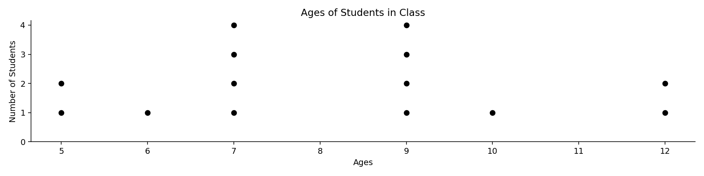
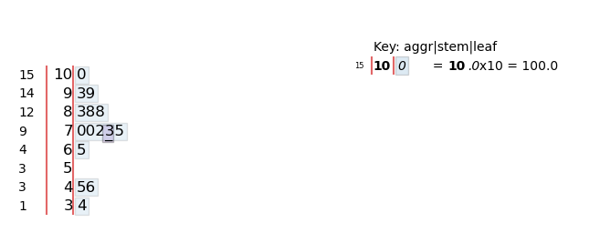
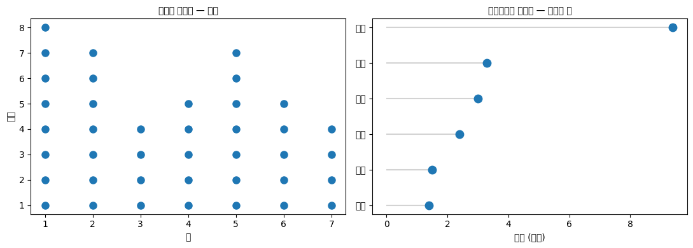

# 점그림과 줄기잎그림

앞 절까지는 범주형 자료를 다루었다. 이제 **수치형 자료** — 값에 크고 작은 순서가 있는 자료 — 로 넘어간다.

수치형 자료의 표준 도구는 히스토그램이지만, 히스토그램에는 대가가 따른다. **구간을 정해야 하고, 구간에 넣는 순간 원래 값이 사라진다.** 자료가 스무 개쯤일 때는 이 대가가 너무 크다. 구간을 어떻게 나누느냐에 따라 그림이 크게 달라지고, 스무 개밖에 안 되는 값을 굳이 버릴 이유도 없다.

**점그림**과 **줄기잎그림**은 그 대가를 치르지 않고 분포를 보여 준다. 자료가 적을 때 쓰는 도구다.

## 1. 점그림

값마다 점을 하나씩 찍되, 같은 값이면 위로 쌓는다.

```python
import matplotlib.pyplot as plt

data = [5, 7, 5, 9, 7, 7, 6, 9, 9, 9, 10, 12, 12, 7]

# 값마다 몇 번 나왔는지 센다
age_freq = {}
for age in data:
    age_freq[age] = age_freq.get(age, 0) + 1

fig, ax = plt.subplots(figsize=(12, 3))

# 점그림의 요령: 같은 값을 세로로 쌓는다.
#   x = [age] * freq        가로 위치는 모두 같다
#   y = 1, 2, ..., freq     세로로 한 칸씩 올라간다
for age, freq in age_freq.items():
    ax.plot([age] * freq, range(1, freq + 1), 'ok')

ax.set_xlabel('Ages')
ax.set_ylabel('Number of Students')
ax.set_title("Ages of Students in Class")
ax.spines['top'].set_visible(False)
ax.spines['right'].set_visible(False)
ax.set_yticks([0, 1, 2, 3, 4])
ax.spines["bottom"].set_position("zero")   # 가로축을 y=0에 붙인다
plt.show()

print(dict(sorted(age_freq.items())))
```

출력:

```
{5: 2, 6: 1, 7: 4, 9: 4, 10: 1, 12: 2}
```



7세가 네 명, 9세가 네 명으로 가장 많고 나머지는 한둘씩이다. 8세와 11세는 한 명도 없다.

**히스토그램과 견주었을 때의 이점.**

- **구간을 정할 필요가 없다.** 히스토그램은 구간 폭을 어떻게 잡느냐에 따라 봉우리가 하나로도 둘로도 보인다. 점그림에는 그런 선택이 없다.
- **점의 개수를 셀 수 있다.** "여기에 네 명"이라는 것이 눈으로 확인된다.
- **원자료가 보존된다.** 5, 5, 6, 7, 7, 7, 7, 9, ... 를 그림에서 그대로 읽을 수 있다.

**한계는 자료가 많아지면 무너진다는 것이다.** 100개쯤 되면 점 기둥이 너무 높아져 읽기 어렵고, 1000개면 아예 불가능하다. 그때는 히스토그램이나 상자그림으로 넘어간다.

## 2. 줄기잎그림

점그림이 값 하나를 점 하나로 나타냈다면, 줄기잎그림은 값 하나를 **숫자 하나**로 나타낸다. 각 값을 **줄기**(윗자리)와 **잎**(아랫자리)으로 쪼개어, 같은 줄기끼리 한 줄에 모은다.

직접 만들어 보면 원리가 분명해진다.

```python
from collections import defaultdict

def stem_leaf(data, stem_unit=10):
    """줄기잎그림을 문자열로 만든다.

    stem_unit=10 이면 십의 자리가 줄기, 일의 자리가 잎이 된다.
    예: 65 -> 줄기 6, 잎 5
    """
    buckets = defaultdict(list)
    for v in sorted(data):                 # 잎이 오름차순이 되도록 먼저 정렬
        buckets[int(v) // stem_unit].append(int(v) % stem_unit)

    lines = ["줄기 | 잎", "-----+" + "-" * 20]
    # 값이 없는 줄기도 건너뛰지 않고 빈 줄로 남긴다.
    # 그래야 줄 길이가 도수에 비례해 분포 모양이 제대로 보인다.
    for stem in range(min(buckets), max(buckets) + 1):
        leaves = " ".join(str(leaf) for leaf in buckets.get(stem, []))
        lines.append(f"{stem:4d} | {leaves}")
    lines.append(f"\n줄기 단위 = {stem_unit}   (줄기 6, 잎 5  ->  65)")
    return "\n".join(lines)

scores = [65, 93, 45, 73, 99, 70, 88, 46, 75, 34, 83, 100, 88, 72, 70]
print(stem_leaf(scores))
```

출력:

```
줄기 | 잎
-----+--------------------
   3 | 4
   4 | 5 6
   5 |
   6 | 5
   7 | 0 0 2 3 5
   8 | 3 8 8
   9 | 3 9
  10 | 0

줄기 단위 = 10   (줄기 6, 잎 5  ->  65)
```

옆으로 누운 히스토그램처럼 읽으면 된다. 70대가 다섯 명으로 가장 많고, 50대는 한 명도 없다.

**히스토그램과 결정적으로 다른 점은 원자료가 남아 있다는 것이다.** 잎을 읽으면 70, 70, 72, 73, 75라는 실제 점수를 그대로 복원할 수 있다. 히스토그램은 "70~80 구간에 다섯 명"까지만 알려 주고 값은 버린다.

!!! note "빈 줄기를 빼지 마라"
    위 코드에서 `range(min, max+1)`로 돌린 이유가 있다. 50대에 값이 없다고 그 줄을 통째로 빼면 다음처럼 된다.

    ```
       3 | 4
       4 | 5 6
       6 | 5
       7 | 0 0 2 3 5
    ```

    줄과 줄 사이의 간격이 값의 간격과 어긋나므로 **분포의 모양이 왜곡된다.** 빈 줄기를 남겨야 "여기에 자료가 없다"는 사실이 그림에 드러난다. 히스토그램에서 빈 구간의 막대를 지우지 않는 것과 같은 이유다.

!!! note "`stemgraphic` 패키지"
    `stemgraphic` 라이브러리를 쓰면 그림 형태의 줄기잎그림을 얻을 수 있다.

    ```python
    import stemgraphic
    fig, ax = stemgraphic.stem_graphic(scores, scale=10)
    ```

    

    다만 별도 설치가 필요하고, 위 코드처럼 직접 만들면 줄기와 잎을 나누는 원리가 그대로 드러난다.

## 3. 줄기 단위 고르기

줄기잎그림의 유일한 선택이 **줄기 단위**다. 히스토그램의 구간 폭에 해당한다.

- 줄기가 **너무 적으면**(단위가 큼) 한 줄에 잎이 너무 많이 몰려 모양이 뭉개진다.
- 줄기가 **너무 많으면**(단위가 작음) 각 줄에 잎이 하나둘뿐이라 모양이 보이지 않는다.

경험적으로 줄기가 **5~15개** 정도일 때 읽기 좋다. 위 예제는 8개다.

줄기가 너무 적을 때 흔히 쓰는 요령이 **줄기 쪼개기**다. 각 줄기를 잎 0–4와 잎 5–9의 두 줄로 나눈다.

```
   7* | 0 0 2 3
   7. | 5
```

`7*`은 70–74, `7.`은 75–79다. 줄기 단위를 반으로 줄인 것과 같은 효과인데, 십진 구조를 유지하므로 읽기가 더 쉽다.

## 연습문제

<div class="drillbox" markdown>

**연습문제 1.** <span class="diff easy" title="쉬움"></span>
다음 15개 값에 대해 줄기 단위 10으로 줄기잎그림을 만들고, 분포의 모양(중심, 퍼짐, 치우침, 이상치)을 서술하라.

```
23, 25, 28, 31, 32, 34, 35, 35, 37, 41, 43, 44, 52, 67, 89
```

</div>

??? success "풀이"
    ```
    줄기 | 잎
    -----+--------------------
       2 | 3 5 8
       3 | 1 2 4 5 5 7
       4 | 1 3 4
       5 | 2
       6 | 7
       7 |
       8 | 9
    ```

    **중심.** 15개이므로 중앙값은 8번째 값인 **35**다.

    **퍼짐.** 최솟값 23, 최댓값 89로 범위가 66이다. 다만 대부분의 값(15개 중 12개)이 23–44 사이에 몰려 있다.

    **치우침.** 30대에 봉우리가 있고 위로 갈수록 잎이 줄어든다. **오른쪽으로 치우친(양의 왜도) 분포**다. 줄기잎그림을 시계 반대 방향으로 90도 돌리면 오른쪽 꼬리가 긴 히스토그램 모양이 된다.

    **이상치.** 89가 뚜렷하게 떨어져 있다. 70대가 비어 있어 간격이 더 두드러진다. 67도 다소 떨어져 있다.

    **빈 줄기 7이 중요하다.** 그 줄을 지웠다면 89가 67의 바로 다음 값처럼 보여 이상치라는 느낌이 약해졌을 것이다.

<div class="drillbox" markdown>

**연습문제 2.** <span class="diff med" title="중간"></span>
자료 200개에 대해 점그림, 줄기잎그림, 히스토그램 중 무엇을 쓰겠는가? 각 도구가 200개에서 어떤 문제를 겪는지 구체적으로 설명하라.

</div>

??? success "풀이"
    **히스토그램을 쓴다.**

    **점그림의 문제.** 200개를 값별로 쌓으면 점 기둥이 매우 높아진다. 값이 연속형이면 같은 값이 거의 없어 모든 기둥의 높이가 1이 되고, 그러면 분포 모양이 아예 보이지 않는다. 값이 이산형이라도 기둥 높이가 수십에 이르면 점을 세는 이점이 사라진다. 점그림의 장점(개수를 셀 수 있다)이 200개에서는 무의미하다.

    **줄기잎그림의 문제.** 한 줄에 잎이 수십 개씩 늘어서 화면 폭을 넘어간다. 줄기를 잘게 쪼개면 줄이 너무 많아져 한눈에 안 들어온다. 무엇보다 **잎을 읽어 원자료를 복원한다는 장점이 200개에서는 쓸모없다.** 200개 숫자를 눈으로 읽을 사람은 없다.

    **히스토그램이 맞는 이유.** 원자료를 버리는 것이 200개에서는 손해가 아니라 이득이다. 요약이 목적이기 때문이다. 구간 폭 선택이 부담이지만, $n$이 커지면 구간 선택에 따른 그림의 변화가 오히려 줄어든다.

    **덧붙여.** 200개라면 **상자그림**도 좋은 선택이고, 여러 집단을 비교한다면 상자그림이나 바이올린 그림이 히스토그램보다 낫다.

<div class="drillbox" markdown>

**연습문제 3.** <span class="diff easy" title="쉬움"></span>
두 반의 시험 점수를 비교하려 한다. **등을 맞댄 줄기잎그림**(back-to-back stem-and-leaf)이란 무엇이며, 이 상황에서 왜 유용한가?

</div>

??? success "풀이"
    **등을 맞댄 줄기잎그림**은 줄기를 가운데 한 번만 두고, 한 반의 잎은 **왼쪽으로**, 다른 반의 잎은 **오른쪽으로** 뻗게 그린 것이다.

    ```
        1반  | 줄기 |  2반
      8 5 3  |   6  | 2 7
    9 7 5 2  |   7  | 0 3 5 8 8
        4 1  |   8  | 1 4 6 9
          6  |   9  | 2 5
    ```

    **유용한 이유.**

    1. **줄기 축이 공유된다.** 두 분포가 정확히 같은 눈금 위에 놓이므로 중심의 차이가 바로 보인다. 위 예에서 1반은 70대에, 2반은 70–80대에 몰려 있다.
    2. **원자료가 양쪽 다 남는다.** 두 반의 실제 점수를 모두 읽을 수 있다.
    3. **퍼짐과 치우침을 나란히 비교할 수 있다.** 어느 쪽 꼬리가 긴지가 좌우 비대칭으로 드러난다.

    **한계.** 집단이 **둘일 때만** 쓸 수 있다. 셋 이상이면 나란히 놓은 상자그림이나 바이올린 그림으로 가야 한다. 그리고 각 반의 인원이 스물 남짓을 넘으면 잎이 화면을 넘어간다.

<div class="drillbox" markdown>

**연습문제 4.** <span class="diff med" title="중간"></span>
본문 $3$절의 "줄기가 $5$–$15$개" 기준을 규칙으로 만들어라. 자료가 주어졌을 때 줄기 단위를 어떻게 고르는가?

</div>

??? success "풀이"
    ```python
    import numpy as np

    def stem_options(x):
        """가능한 줄기 단위별 줄기 개수를 보여 준다."""
        x = np.asarray(x, float)
        rng_ = x.max() - x.min()
        print(f"자료 {len(x)}개, 범위 {x.min():.1f} ~ {x.max():.1f} (폭 {rng_:.1f})")
        print(f"{'줄기 단위':>10}{'줄기 개수':>10}{'줄당 평균 잎':>14}{'판정':>8}")
        for unit in (100, 50, 20, 10, 5, 2, 1):
            n_stems = int(np.floor(x.max() / unit) - np.floor(x.min() / unit)) + 1
            verdict = "적절" if 5 <= n_stems <= 15 else ("너무 적음" if n_stems < 5 else "너무 많음")
            print(f"{unit:>10}{n_stems:>10}{len(x) / n_stems:>14.1f}{verdict:>8}")

    rng = np.random.default_rng(0)
    stem_options(rng.normal(72, 11, 40).round())
    print()
    stem_options(rng.normal(720, 110, 40).round())
    ```

    출력:

    ```
    자료 40개, 범위 46.0 ~ 88.0 (폭 42.0)
         줄기 단위     줄기 개수       줄당 평균 잎      판정
           100         1          40.0   너무 적음
            50         2          20.0   너무 적음
            20         3          13.3   너무 적음
            10         5           8.0      적절
             5         9           4.4      적절
             2        22           1.8   너무 많음
             1        43           0.9   너무 많음

    자료 40개, 범위 478.0 ~ 940.0 (폭 462.0)
         줄기 단위     줄기 개수       줄당 평균 잎      판정
           100         6           6.7      적절
            50        10           4.0      적절
            20        25           1.6   너무 많음
            10        48           0.8   너무 많음
             5        94           0.4   너무 많음
             2       232           0.2   너무 많음
             1       463           0.1   너무 많음
    ```

    **같은 모양의 자료라도 척도가 다르면 줄기 단위가 달라진다.** 평균 $72$인 자료에는 단위 $10$이 적절하고, 평균 $720$인 자료에는 단위 $100$이 맞는다.

    **실용적인 절차.**

    1. 범위 $R = x_{\max} - x_{\min}$를 구한다.
    2. 줄기 개수 목표를 $10$ 정도로 두면 단위 $\approx R/10$이다.
    3. 그 값을 $1, 2, 5$의 $10$의 거듭제곱 배($1, 2, 5, 10, 20, 50, \ldots$) 중 가까운 것으로 맞춘다.
    4. 줄기가 $5$개 미만이면 **줄기 쪼개기**를 쓴다.

    **$1, 2, 5$ 규칙**을 쓰는 이유는 십진 구조를 유지하기 위해서다. 단위가 $3$이나 $7$이면 줄기를 읽는 순간 암산이 필요해져 줄기잎그림의 장점인 "값을 그대로 읽는다"가 사라진다.

    **히스토그램과의 관계.** 이 문제는 히스토그램의 구간 개수 문제와 정확히 같다(히스토그램 문서 연습문제 9). 다만 줄기잎그림은 **십진 구조에 묶여 있어** 선택지가 훨씬 적다. 그것이 제약이자 장점인데, 자의적 선택의 여지가 적어 재현이 쉽다.

    **줄기 쪼개기는 $\log$ 척도로 보면 자연스럽다.** 단위를 $10 \to 5 \to 2 \to 1$로 줄이는 것은 각각 $\log_{10}$ 척도에서 $1 \to 0.7 \to 0.3 \to 0$에 해당하며, 대략 균등한 간격이다. $\square$

<div class="drillbox" markdown>

**연습문제 5.** <span class="diff med" title="중간"></span>
연습문제 3의 **등을 맞댄 줄기잎그림**을 실제로 만들어라. 두 집단 비교에서 상자그림과 비교하면 어떤가?

</div>

??? success "풀이"
    ```python
    import numpy as np

    rng = np.random.default_rng(3)
    a = np.clip(rng.normal(72, 9, 28), 40, 100).round().astype(int)
    b = np.clip(rng.normal(78, 6, 28), 40, 100).round().astype(int)

    def back_to_back(left, right, unit=10):
        stems = range(min(left.min(), right.min()) // unit,
                      max(left.max(), right.max()) // unit + 1)
        print(f"{'A 반':>28} | 줄기 | B 반")
        for s in stems:
            lv = sorted([v % unit for v in left if v // unit == s], reverse=True)
            rv = sorted([v % unit for v in right if v // unit == s])
            print(f"{' '.join(map(str, lv)):>28} |  {s}   | {' '.join(map(str, rv))}")

    back_to_back(a, b)
    print(f"\nA: 평균 {a.mean():.2f}  중앙값 {np.median(a):.1f}  표준편차 {a.std(ddof=1):.2f}")
    print(f"B: 평균 {b.mean():.2f}  중앙값 {np.median(b):.1f}  표준편차 {b.std(ddof=1):.2f}")
    ```

    출력:

    ```
    A 반 | 줄기 | B 반
                               9 |  4   | 
                               4 |  5   | 
               9 9 8 8 7 7 6 4 3 |  6   | 1 8
         7 7 6 6 4 2 0 0 0 0 0 0 |  7   | 2 2 2 3 3 5 6 7 7 7 8 8 9 9
                           9 6 1 |  8   | 0 1 1 2 2 2 2 3 4 4 5 6
                               0 |  9   | 
                               0 |  10   | 

    A: 평균 72.21  중앙값 70.0  표준편차 10.39
    B: 평균 77.82  중앙값 78.5  표준편차 5.64
    ```

    **하나의 줄기 축을 공유하고 잎을 좌우로 뻗는다.** 왼쪽은 큰 자릿수부터 거꾸로 적어 대칭이 되게 한다.

    **상자그림과 비교하면.**

    | | 등맞댄 줄기잎 | 나란한 상자그림 |
    |---|---|---|
    | 원래 값 | **그대로 읽힌다** | 사라진다 |
    | 표본 크기 | **잎을 세면 된다** | 보이지 않는다 |
    | 분포 모양 | **보인다** | 사분위수만 |
    | 이산성·뭉침 | **보인다** | 보이지 않는다 |
    | 집단 수 | $2$개까지 | 여러 개 |
    | 큰 $n$ | 불가능 | 가능 |

    **줄기잎그림은 사실 두 가지 일을 동시에 한다.** 히스토그램(모양)과 자료표(값)를 겹쳐 놓은 것이다. 그래서 $n$이 작을 때는 **정보 손실이 전혀 없는** 유일한 "그림"이다.

    **한계도 분명하다.** $n$이 수십을 넘으면 잎이 줄을 넘어가고, 집단이 셋 이상이면 등을 맞댈 수가 없다. 그리고 고정폭 글꼴이 아니면 정렬이 깨진다.

    **왜 여전히 배우는가.** 컴퓨터 없이 손으로 그릴 수 있는 유일한 분포 그림이고, **원자료를 보존한다**는 성질이 이 장에서 반복해 강조한 원칙과 정확히 맞기 때문이다. 앞 절 스트립 그림이 같은 목적을 현대적으로 수행한다. $\square$

<div class="drillbox" markdown>

**연습문제 6.** <span class="diff med" title="중간"></span>
연습문제 2를 정량화하라. $n$이 커질 때 세 도구가 각각 언제 무너지는가?

</div>

??? success "풀이"
    ```python
    import numpy as np

    rng = np.random.default_rng(1)
    print(f"{'n':>7}{'줄기당 잎':>12}{'점그림 겹침':>14}{'히스토그램 칸당':>16}")
    for n in (15, 40, 100, 300, 1000, 10_000):
        x = rng.normal(72, 11, n).round()
        n_stems = int(x.max() // 10 - x.min() // 10) + 1
        leaves = n / n_stems
        unique = len(np.unique(x))
        overlap = n / unique                       # 같은 값에 겹치는 점의 수
        bins = max(1, int(1 + np.log2(n)))
        print(f"{n:>7}{leaves:>12.1f}{overlap:>14.1f}{n / bins:>16.1f}")
    ```

    출력:

    ```
    n       줄기당 잎        점그림 겹침        히스토그램 칸당
         15         3.8           1.2             3.8
         40         6.7           1.6             6.7
        100        14.3           2.8            14.3
        300        42.9           5.9            33.3
       1000       111.1          14.9           100.0
      10000      1111.1         122.0           714.3
    ```

    **세 도구가 서로 다른 지점에서 무너진다.**

    | 도구 | 무너지는 조건 | 증상 |
    |---|---|---|
    | **줄기잎그림** | 줄기당 잎이 $\gtrsim 20$ | 줄이 화면을 넘어가고 모양이 뭉개진다 |
    | **점그림** | 같은 값에 점이 $\gtrsim 10$ | 점 기둥이 너무 높거나 겹친다 |
    | **히스토그램** | 사실상 없음 | $n$이 클수록 오히려 좋아진다 |

    **$n = 200$에서 각각 어떤가.** 줄기잎은 줄기당 $30$개 남짓이라 이미 읽기 어렵고, 점그림은 값이 반복되면 기둥이 높아진다. **히스토그램이 답이다.**

    **역설적으로 히스토그램은 $n$이 작을 때 나쁘다.** $n = 15$면 칸당 $3$–$4$개라 모양이 잡음에 지배된다(히스토그램 문서 연습문제 7). 그때는 줄기잎이나 점그림이 낫다.

    **정리하면 $n$에 따른 순서가 있다.**

    $$
    n \lesssim 50: \text{줄기잎·점그림} \quad\to\quad 50 \lesssim n \lesssim 500: \text{히스토그램·점그림} \quad\to\quad n \gtrsim 500: \text{히스토그램·KDE·ECDF}
    $$

    앞 절들에서 본 상자그림·바이올린·스웜의 순서와 같은 구조다. **$n$이 작으면 자료를 보여 주고, 크면 요약한다.** $\square$

<div class="drillbox" markdown>

**연습문제 7.** <span class="diff med" title="중간"></span>
점그림(dot plot)에는 두 가지 서로 다른 것이 있다. **클리블랜드 점그림**과 **윌킨슨 점그림**을 구별하고 각각의 용도를 밝혀라.

</div>

??? success "풀이"
    ```python
    import numpy as np
    import matplotlib.pyplot as plt

    rng = np.random.default_rng(5)

    # (1) 윌킨슨 점그림: 분포를 보여 준다. 같은 값에 점을 쌓는다.
    values = rng.integers(1, 8, 40)
    uniq, counts = np.unique(values, return_counts=True)

    # (2) 클리블랜드 점그림: 범주별 값 하나를 보여 준다. 막대그림의 대안.
    cats = ["서울", "부산", "대구", "인천", "광주", "대전"]
    vals = np.array([9.4, 3.3, 2.4, 3.0, 1.4, 1.5])

    fig, axes = plt.subplots(1, 2, figsize=(11, 4))
    for v, c in zip(uniq, counts):
        axes[0].plot([v] * c, np.arange(c) + 1, "o", color="C0", ms=8)
    axes[0].set_xlabel("값"); axes[0].set_ylabel("개수")
    axes[0].set_title("윌킨슨 점그림 — 분포", fontsize=10)

    order = np.argsort(vals)
    axes[1].hlines(np.arange(len(cats)), 0, vals[order], color="lightgray")
    axes[1].plot(vals[order], np.arange(len(cats)), "o", ms=9)
    axes[1].set_yticks(np.arange(len(cats)))
    axes[1].set_yticklabels([cats[i] for i in order])
    axes[1].set_xlabel("인구 (백만)")
    axes[1].set_title("클리블랜드 점그림 — 범주별 값", fontsize=10)
    fig.tight_layout()
    plt.show()

    print(f"윌킨슨: 값 {uniq}, 도수 {counts}  → 분포를 보여 준다")
    print(f"클리블랜드: 범주 {len(cats)}개, 각 범주에 값 하나  → 막대그림의 대안")
    ```

    출력:

    ```
    윌킨슨: 값 [1 2 3 4 5 6 7], 도수 [8 7 4 5 7 5 4]  → 분포를 보여 준다
    클리블랜드: 범주 6개, 각 범주에 값 하나  → 막대그림의 대안
    ```

    

    **이름은 같지만 전혀 다른 그림이다.**

    | | 윌킨슨 점그림 | 클리블랜드 점그림 |
    |---|---|---|
    | 보여 주는 것 | 한 변수의 **분포** | 범주별 **값 하나** |
    | 점 하나 = | 관측 하나 | 범주 하나 |
    | 대체하는 것 | 히스토그램 | **막대그림** |
    | 축 | 값 / 도수 | 값 / 범주 |

    **본문 $1$절이 다룬 것은 윌킨슨 쪽이다.**

    **클리블랜드 점그림이 막대그림보다 나은 점.**

    - **잉크를 덜 쓴다.** 막대의 채워진 면적은 정보를 담지 않는다.
    - **$0$에서 시작할 필요가 없다.** 점은 **위치**로 부호화하므로 축을 잘라도 왜곡되지 않는다(막대그림 문서 연습문제 10과 대조).
    - **범주가 많아도 읽힌다.** 세로로 늘어놓으면 $30$–$40$개도 가능하다.
    - **여러 값을 한 줄에 놓을 수 있다.** 같은 범주의 $2020$년과 $2024$년 값을 다른 색 점 두 개로 표시하면 변화가 한눈에 보인다(덤벨 그림).

    **클리블랜드가 이 그림을 제안한 이유**가 부호화 정확도 순위다(산점도 문서 연습문제 9). 위치가 길이보다 정확하므로, 막대를 쓸 자리에 점을 쓰면 같은 지면에서 더 정확한 비교가 가능하다. $\square$

<div class="drillbox" markdown>

**연습문제 8.** <span class="diff med" title="중간"></span>
줄기잎그림이 히스토그램에 대해 갖는 고유한 장점을 하나 더 찾아라. **자료의 이상을 발견하는 데** 어떻게 쓰이는가?

</div>

??? success "풀이"
    ```python
    import numpy as np

    rng = np.random.default_rng(7)
    clean = rng.normal(72, 9, 50).round().astype(int)
    rounded = (np.round(rng.normal(72, 9, 50) / 5) * 5).astype(int)

    def stem(x, unit=10, title=""):
        print(f"{title}")
        for s in range(x.min() // unit, x.max() // unit + 1):
            leaves = sorted(v % unit for v in x if v // unit == s)
            print(f"  {s} | {' '.join(map(str, leaves))}")
        last = x % 10
        print(f"  끝자리 분포: {np.round([np.mean(last == d) for d in range(10)], 3)}")

    stem(clean, title="정상 자료")
    print()
    stem(rounded, title="5 단위로 반올림된 자료")
    ```

    출력:

    ```
    정상 자료
      4 | 9
      5 | 5 5 8 8
      6 | 0 0 1 1 3 3 4 4 5 5 6 6 7 7 8 8 8 8
      7 | 0 0 0 1 2 2 2 2 3 3 3 3 3 3 3 3 4 5 5 6 8
      8 | 0 0 2 4 4
      9 | 0
      끝자리 분포: [0.16 0.06 0.1  0.2  0.1  0.12 0.06 0.04 0.14 0.02]

    5 단위로 반올림된 자료
      5 | 5 5 5
      6 | 0 0 0 0 0 5 5 5
      7 | 0 0 0 0 0 0 0 0 0 0 0 0 0 0 0 0 0 0 5 5 5 5 5 5 5
      8 | 0 0 0 0 0 0 0 0 0 0 0 5 5 5
      끝자리 분포: [0.68 0.   0.   0.   0.   0.32 0.   0.   0.   0.  ]
    ```

    **줄기잎그림에서는 잎의 분포가 곧 끝자리의 분포다.** 반올림된 자료에서는 잎이 $0$과 $5$에만 나타나, 한눈에 이상을 알아챌 수 있다.

    **히스토그램은 이것을 놓친다.** 구간 폭이 $5$의 배수이면 반올림이 완전히 감춰지고, 아니면 톱니만 보일 뿐 원인을 알 수 없다(히스토그램 문서 연습문제 10).

    **줄기잎그림이 드러내는 다른 이상들.**

    | 무늬 | 시사하는 것 |
    |---|---|
    | 잎이 특정 숫자에만 | 반올림, 자릿수 쏠림 |
    | 특정 줄기에 잎이 없음 | 검열, 자료 누락, 값 범위 제한 |
    | 마지막 줄기에 잎이 몰림 | 상한에서의 절단 |
    | 잎이 정확히 반복 | 중복 입력, 대체값 |

    **이것이 줄기잎그림이 여전히 살아 있는 이유다.** 앞 절 스트립 그림 연습문제 8에서 점 그림이 같은 일을 한다고 했는데, 줄기잎은 **끝자리를 명시적으로 보여 준다**는 점에서 한 걸음 더 나아간다. 자릿수 쏠림 진단에는 줄기잎이 가장 직접적인 도구다.

    **실무 습관.** 새 자료를 받으면 $n$이 작을 때 줄기잎그림을, 클 때 끝자리 도수표를 만들어 보라. 몇 초면 되고, 측정·기록 과정의 문제를 조기에 잡아낸다. $\square$

<div class="drillbox" markdown>

**연습문제 9.** <span class="diff med" title="중간"></span>
줄기잎그림의 **잎을 정렬해야 하는가**? 정렬 여부가 무엇을 바꾸는지 논하라.

</div>

??? success "풀이"
    ```python
    import numpy as np

    rng = np.random.default_rng(2)
    x = rng.normal(72, 9, 30).round().astype(int)
    order = rng.permutation(len(x))               # 원래 기록 순서를 흉내

    def stem(x, sort_leaves, title):
        print(title)
        for s in range(x.min() // 10, x.max() // 10 + 1):
            leaves = [v % 10 for v in x if v // 10 == s]
            if sort_leaves:
                leaves = sorted(leaves)
            print(f"  {s} | {' '.join(map(str, leaves))}")

    stem(x[order], True, "잎을 정렬한 경우")
    print()
    stem(x[order], False, "기록 순서 그대로")
    print(f"\n중앙값 {np.median(x):.1f}   Q1 {np.percentile(x, 25):.1f}   Q3 {np.percentile(x, 75):.1f}")
    ```

    출력:

    ```
    잎을 정렬한 경우
      5 | 0 6 7 8
      6 | 3 4 5 7 7 7 8 9 9 9
      7 | 1 3 4 4 5 5 6 6 7 9 9
      8 | 0 1 2 8
      9 | 1

    기록 순서 그대로
      5 | 8 0 6 7
      6 | 8 4 5 9 9 7 9 7 7 3
      7 | 5 3 1 7 5 6 4 4 9 6 9
      8 | 1 0 2 8
      9 | 1

    중앙값 72.0   Q1 67.0   Q3 76.8
    ```

    **정렬하면 분위수를 눈으로 셀 수 있다.** 잎을 위에서부터 세어 $n/2$번째 잎이 중앙값이다. 정렬하지 않으면 이 계산을 할 수 없다.

    **정렬은 표준 관행이다.** 투키의 원래 명세도 정렬을 요구한다. 그리고 정렬된 줄기잎그림은 사실상 **순서통계량의 표**여서, 중앙값·사분위수·백분위수를 모두 직접 읽을 수 있다.

    **정렬하지 않는 것이 유용한 드문 경우.** 잎을 **기록 순서**대로 적으면 시간에 따른 변화를 볼 수 있다. 예를 들어 초반 관측이 모두 낮은 줄기에 몰려 있다면 표류나 학습 효과를 시사한다. 다만 이는 줄기잎그림의 표준 용법이 아니며, 시계열이라면 선그림이 맞다.

    **더 흥미로운 변형이 있다.** 잎 자리에 **다른 변수의 값**을 적는 것이다. 예를 들어 시험 점수의 줄기잎그림에서 잎 대신 그 학생의 성별이나 반을 적으면, 분포와 집단 구성을 동시에 볼 수 있다. 등맞댄 줄기잎(연습문제 5)의 일반화이며, 손으로 그릴 때 특히 유용하다.

    **정리.** 줄기잎그림의 잎은 기본적으로 **정렬한다.** 그것이 이 그림을 "그림"이자 "정렬된 자료표"로 만드는 성질이며, 히스토그램이 갖지 못한 이중 기능의 근거다. $\square$

<div class="drillbox" markdown>

**연습문제 10.** <span class="diff med" title="중간"></span>
이 절의 두 도구가 현대적 시각화에서 차지하는 자리를 정리하라. **언제 여전히 최선인가?**

</div>

??? success "풀이"
    ```python
    import numpy as np

    print(f"{'상황':<34}{'권장':<20}{'이유'}")
    rows = [
        ("n < 30, 원자료를 보존해야 함", "줄기잎그림", "값이 그대로 보인다"),
        ("n < 100, 분포 모양", "점그림 / 스트립", "겹침 없이 개별 관측"),
        ("자릿수 쏠림 의심", "줄기잎그림", "끝자리가 직접 보인다"),
        ("범주별 값 비교", "클리블랜드 점그림", "막대보다 정확하고 간결"),
        ("두 집단 비교, n 작음", "등맞댄 줄기잎", "정보 손실 없음"),
        ("n > 500", "히스토그램 / KDE", "줄기잎은 불가능"),
        ("발표·논문 그림", "점그림 / 상자+점", "줄기잎은 고정폭 글꼴 필요"),
    ]
    for a, b, c in rows:
        print(f"{a:<34}{b:<20}{c}")
    ```

    출력:

    ```
    상황                                권장                  이유
    n < 30, 원자료를 보존해야 함               줄기잎그림               값이 그대로 보인다
    n < 100, 분포 모양                    점그림 / 스트립           겹침 없이 개별 관측
    자릿수 쏠림 의심                         줄기잎그림               끝자리가 직접 보인다
    범주별 값 비교                          클리블랜드 점그림           막대보다 정확하고 간결
    두 집단 비교, n 작음                     등맞댄 줄기잎             정보 손실 없음
    n > 500                           히스토그램 / KDE         줄기잎은 불가능
    발표·논문 그림                          점그림 / 상자+점          줄기잎은 고정폭 글꼴 필요
    ```

    **줄기잎그림이 여전히 최선인 자리는 좁지만 분명하다.**

    - **$n$이 작고 원자료를 함께 보여야 할 때.** 히스토그램은 값을 지우고, 점그림은 정확한 값을 읽기 어렵다. 줄기잎만이 둘을 동시에 한다.
    - **자릿수 쏠림 진단**(연습문제 8). 가장 직접적인 도구다.
    - **컴퓨터 없이.** 현장에서 손으로 자료를 정리할 때.
    - **교육.** 분위수·중앙값·분포 모양을 한 그림에서 설명할 수 있다.

    **점그림(윌킨슨)은 줄기잎의 현대적 계승자다.** 같은 정보를 보여 주면서 글꼴 제약이 없고, 값이 연속이어도 된다. 앞 절 스트립·스웜이 이를 집단 비교로 확장한 것이다.

    **클리블랜드 점그림은 별개의 도구이며, 막대그림을 대체할 만하다**(연습문제 7). 오히려 활용도가 늘고 있다.

    **이 장 전체의 원칙과 이어진다.** 도구를 고르는 기준은 유행이 아니라 **$n$과 질문**이다. 줄기잎그림이 낡아 보이는 이유는 대부분의 현대 자료가 $n$이 크기 때문이지, 도구 자체가 열등해서가 아니다. **$n = 25$짜리 자료를 다룬다면 여전히 줄기잎그림이 최선일 수 있다.** $\square$


## 정리하며

점그림과 줄기잎그림은 **자료가 적을 때** 쓰는 수치형 자료의 도구다.

- **점그림**: 값마다 점 하나, 같은 값은 위로 쌓는다. 구간을 정할 필요가 없다.
- **줄기잎그림**: 값을 줄기와 잎으로 쪼갠다. **원자료가 그대로 남는다.**

둘 다 히스토그램이 버리는 것 — 개별 값 — 을 보존한다는 것이 공통점이자 존재 이유다. 그리고 둘 다 자료가 수십 개를 넘으면 무너진다는 것이 공통된 한계다.

자료가 많아지면 반대 방향으로 간다. 개별 값을 버리고 **요약**하는 것이다. 다음 절의 **상자그림**이 그 대표이며, 다섯 개의 숫자로 분포를 압축한다.
