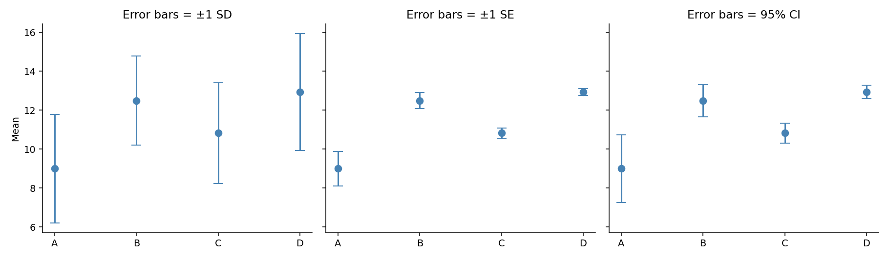
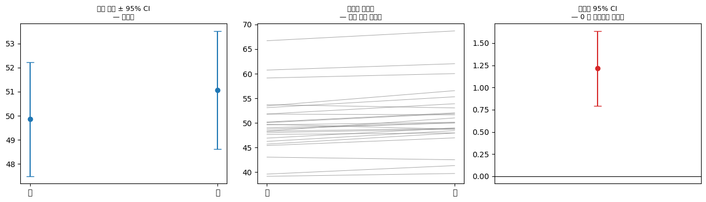
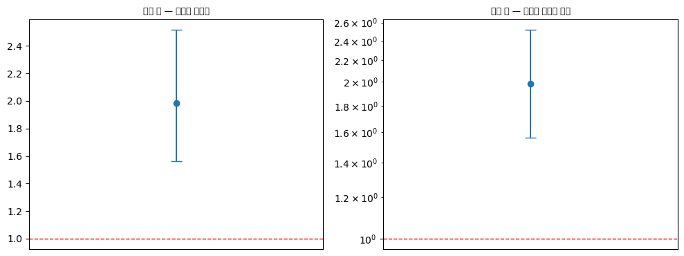
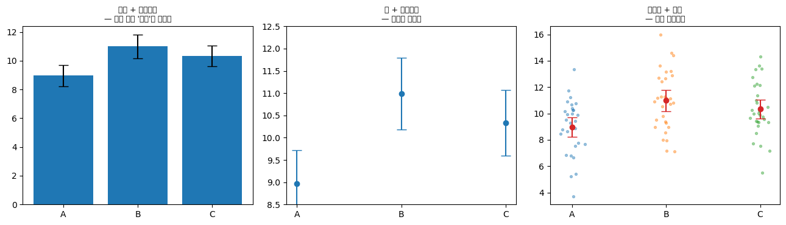

# 오차막대 그림

지금까지의 그림들은 자료를 보여 주었다. 이 절의 그림은 다른 것을 보여 준다. **추정값이 얼마나 믿을 만한가.**

평균 12.5라고 말할 때, 그 12.5가 표본을 다시 뽑으면 12.4가 될 값인지 8.0이 될 값인지는 전혀 다른 이야기다. **오차막대**는 그 차이를 그림에 담는다.

그런데 오차막대에는 널리 퍼진 문제가 하나 있다. **막대가 무엇을 뜻하는지가 그림만으로는 알 수 없다는 것이다.**

## 1. 같은 자료, 세 가지 오차막대

<div class="codebox" markdown>

### 예제 1. 같은 자료, 세 가지 오차막대 { .eg }

```python
import numpy as np
import matplotlib.pyplot as plt

rng = np.random.default_rng(42)

# 네 집단. 표본 크기만 10, 30, 100, 300으로 다르다.
# 모집단의 표준편차는 모두 3으로 같게 두었다.
gs = ['A', 'B', 'C', 'D']
data = {g: rng.normal(m, s, n_) for g, m, s, n_ in
        zip(gs, [10, 12, 11, 13], [3, 3, 3, 3], [10, 30, 100, 300])}

means = np.array([data[g].mean() for g in gs])
sds   = np.array([data[g].std(ddof=1) for g in gs])   # 표본표준편차 (ddof=1)
ns    = np.array([len(data[g]) for g in gs])

ses = sds / np.sqrt(ns)     # 표준오차 = SD / sqrt(n)
cis = 1.96 * ses            # 95% 신뢰구간의 반폭 (정규근사)

fig, axes = plt.subplots(1, 3, figsize=(13, 3.8), sharey=True)

# 같은 평균, 같은 자료. 오차막대의 정의만 바꾼다.
for ax, err, name in zip(axes, [sds, ses, cis], ["±1 SD", "±1 SE", "95% CI"]):
    # yerr에 준 값만큼 위아래로 막대가 뻗는다. capsize는 끝의 가로선 길이
    ax.errorbar(gs, means, yerr=err, fmt='o', capsize=5, color='steelblue', ms=7)
    ax.set_title(f"Error bars = {name}")
    ax.spines[['top', 'right']].set_visible(False)

axes[0].set_ylabel("Mean")
plt.tight_layout()
plt.show()

for g, m, s, e, c, nn in zip(gs, means, sds, ses, cis, ns):
    print(f"  {g}: n={nn:3d}  mean={m:5.2f}  SD={s:4.2f}  SE={e:4.2f}  95%CI=±{c:4.2f}")
```

출력:

```
  A: n= 10  mean= 8.99  SD=2.80  SE=0.89  95%CI=±1.74
  B: n= 30  mean=12.49  SD=2.29  SE=0.42  95%CI=±0.82
  C: n=100  mean=10.82  SD=2.60  SE=0.26  95%CI=±0.51
  D: n=300  mean=12.94  SD=3.00  SE=0.17  95%CI=±0.34
```



**점의 위치는 세 그림에서 모두 같다.** 달라지는 것은 막대의 길이뿐인데, 그림이 주는 인상은 완전히 다르다.

</div>

## 2. 세 가지가 무엇을 재는가

| | 계산 | 재는 것 | $n$이 커지면 |
|:---|:---|:---|:---|
| **SD** (표준편차) | $s$ | 개별 관측값의 퍼짐 | **변하지 않는다** |
| **SE** (표준오차) | $s/\sqrt{n}$ | 표본평균의 퍼짐 | **줄어든다** ($1/\sqrt{n}$) |
| **95% CI** | $\approx \bar{x} \pm 1.96\,\text{SE}$ | 모평균이 있을 법한 범위 | 줄어든다 |

출력의 숫자로 확인해 보자.

**SD는 $n$과 무관하다.** A(n=10)의 2.80부터 D(n=300)의 3.00까지, 표본 크기가 서른 배 차이 나는데도 SD는 모두 3 근처다. 당연하다. **SD는 모집단의 성질**이고 자료를 더 모은다고 개별 값들이 덜 퍼지지는 않는다.

**SE는 $n$이 커지면 줄어든다.** 0.89 → 0.42 → 0.26 → 0.17로 꾸준히 작아진다. $\sqrt{n}$이 3.2 → 5.5 → 10 → 17.3으로 커지기 때문이다. **평균을 얼마나 정확히 알아냈는가**를 재는 값이므로 자료가 많을수록 정확해지는 것이 맞다.

그래서 **왼쪽 그림(SD)에서는 네 집단의 막대 길이가 비슷**하지만, **가운데와 오른쪽에서는 A의 막대만 길고 D는 아주 짧다.** 표본 크기의 차이가 그림에 드러나는 것이다.

!!! danger "오차막대의 뜻을 밝히지 않은 그림은 읽을 수 없다"
    위 세 그림은 **완전히 같은 자료**에서 나왔다. 그런데

    - SD 그림에서 A와 B의 막대는 크게 겹친다.
    - CI 그림에서 A와 B의 막대는 겹치지 않는다.

    "겹치니까 차이가 없다"고 읽는 습관이 흔한데, **무엇의 막대인지에 따라 답이 뒤집힌다.**

    따라서 그림 설명(caption)에 **반드시** 다음을 적어야 한다.

    - 오차막대가 SD인지 SE인지 CI인지 (CI면 몇 %인지)
    - 각 집단의 표본 크기 $n$
    - 가운데 점이 평균인지 중앙값인지

    이 셋이 없는 오차막대 그림은 정보가 아니라 장식이다. 많은 학술지가 이를 투고 규정에 명시하고 있다.

## 3. 언제 무엇을 쓰는가

**SD를 쓴다 —— 개별 값의 퍼짐을 보이고 싶을 때.**

"이 약을 먹은 환자들의 혈압이 얼마나 다양한가"가 관심이라면 SD다. 임상적으로는 평균보다 퍼짐이 더 중요한 경우가 많다. 평균 혈압이 정상이어도 절반이 위험 범위에 있다면 문제다.

**SE나 CI를 쓴다 —— 추정의 정확도를 보이고 싶을 때.**

"두 집단의 평균이 다른가"가 관심이라면 SE나 CI다. 여기서는 개별 값의 퍼짐이 아니라 **평균이라는 추정값의 흔들림**이 문제다.

**둘 중에서는 CI를 권한다.** SE는 그 자체로 해석이 없다. "±1 SE"는 대략 68% 구간에 해당하는데, 68%라는 수에 특별한 의미가 없다. CI는 "이 구간이 모평균을 담을 확률이 95%인 절차로 만들었다"는 명확한 뜻이 있다.

SE가 널리 쓰이는 이유는 **막대가 짧아 보기 좋기 때문**이라는 냉소적인 지적이 있는데, 근거 없는 말은 아니다. CI는 SE의 약 두 배다.

!!! warning "막대가 겹치는지로 유의성을 판단하지 마라"
    두 집단의 95% CI가 **겹치지 않으면** 대체로 유의한 차이가 있다고 봐도 된다. 하지만 **겹친다고 해서 차이가 없는 것은 아니다.**

    이유는 차이의 표준오차가 각각의 표준오차의 합이 아니라 **제곱합의 제곱근**이기 때문이다.

    $$
    \text{SE}_{\text{차이}} = \sqrt{\text{SE}_1^2 + \text{SE}_2^2}
    $$

    두 SE가 같다면 $\text{SE}_{\text{차이}} = \sqrt{2}\,\text{SE} \approx 1.41\,\text{SE}$이지, $2\,\text{SE}$가 아니다. 따라서 두 CI가 **조금 겹쳐도** 차이의 CI는 0을 포함하지 않을 수 있다.

    **제대로 하려면 차이 자체의 신뢰구간을 계산해서 보고한다.** 각 집단의 CI를 그려 놓고 눈으로 겹침을 재는 것은 편법이다.

## 4. 막대 대신 점을 찍는 것이 나은 경우

앞의 스트립·스웜 절에서 본 대로, $n$이 작으면 원자료 점을 찍는 것이 오차막대보다 낫다.

위 예제의 집단 A는 $n = 10$이다. 열 개 점을 다 찍으면 자리도 넉넉하고, 평균·퍼짐·이상치·표본 크기가 **전부** 한 그림에 담긴다. 오차막대는 그중 둘만 보여 준다.

**권장 순서**

1. $n \lesssim 30$: **점을 모두 찍고** 그 위에 평균과 CI를 표시한다.
2. $n$이 수십~수백: **바이올린이나 상자그림** + 평균/CI 표시.
3. $n$이 크거나 집단이 많아 자리가 없을 때: **오차막대만.** 이때는 $n$과 막대의 정의를 반드시 밝힌다.

## 연습문제

<div class="drillbox" markdown>

**연습문제 1.** <span class="diff med" title="중간"></span>
위 출력에서 집단 D는 SD가 3.00으로 가장 큰데 95% CI는 ±0.34로 가장 좁다. 모순처럼 보이는 이 현상을 설명하라.

</div>

??? success "풀이"
    **모순이 아니다. 두 값은 서로 다른 것을 재기 때문이다.**

    **SD = 3.00**은 D의 개별 관측값 300개가 평균 12.94에서 평균적으로 3 정도씩 떨어져 있다는 뜻이다. 이것은 **모집단의 성질**이다. 실제로 네 집단 모두 모표준편차 3에서 생성했으므로, SD가 2.80~3.00으로 비슷하게 나온 것이 정상이다. D의 3.00이 조금 큰 것은 표본 변동일 뿐이다.

    **95% CI = ±0.34**는 **평균이라는 추정값**의 정밀도다.

    $$
    \text{SE} = \frac{s}{\sqrt{n}} = \frac{3.00}{\sqrt{300}} = \frac{3.00}{17.32} = 0.17
    $$

    $$
    \text{CI 반폭} = 1.96 \times 0.17 = 0.34
    $$

    **개별 값은 많이 흩어져 있지만, 300개를 평균 내면 그 평균은 매우 안정적이다.** 이것이 대수의 법칙이자 중심극한정리가 말하는 바다.

    **비교하면 더 분명하다.** 집단 A는 SD가 2.80으로 D보다 **작은데도** CI는 ±1.74로 D의 다섯 배다. $n$이 10뿐이기 때문이다.

    $$
    \frac{1.74}{0.34} = 5.1, \qquad \sqrt{\frac{300}{10}} = \sqrt{30} = 5.5
    $$

    비율이 대략 $\sqrt{n}$의 비와 맞는다. (정확히 맞지 않는 것은 두 집단의 SD가 조금 다르기 때문이다.)

    **핵심.** "값이 얼마나 흩어져 있는가"(SD)와 "평균을 얼마나 정확히 알아냈는가"(SE, CI)는 별개의 물음이다. 자료를 더 모으면 두 번째는 좋아지지만 첫 번째는 그대로다.

<div class="drillbox" markdown>

**연습문제 2.** <span class="diff med" title="중간"></span>
집단 A(n=10, 평균 8.99)와 집단 C(n=100, 평균 10.82)의 95% CI가 겹치는지 계산하고, 그 결과로부터 두 평균의 차이에 대해 무엇을 말할 수 있는지 논하라.

</div>

??? success "풀이"
    **각 CI를 구한다.**

    - A: $8.99 \pm 1.74 = [7.25,\ 10.73]$
    - C: $10.82 \pm 0.51 = [10.31,\ 11.33]$

    **겹치는가?** A의 상한 10.73과 C의 하한 10.31을 비교하면 $10.31 < 10.73$이므로 **겹친다.** 겹치는 구간은 $[10.31, 10.73]$으로 폭 0.42다.

    **여기서 "차이가 없다"고 결론지으면 안 된다.** 차이 자체의 신뢰구간을 구해야 한다.

    차이의 점추정: $10.82 - 8.99 = 1.83$

    차이의 표준오차:

    $$
    \text{SE}_{\text{차이}} = \sqrt{\text{SE}_A^2 + \text{SE}_C^2} = \sqrt{0.89^2 + 0.26^2} = \sqrt{0.792 + 0.068} = \sqrt{0.860} = 0.927
    $$

    95% 신뢰구간(정규근사):

    $$
    1.83 \pm 1.96 \times 0.927 = 1.83 \pm 1.82 = [0.01,\ 3.65]
    $$

    **구간이 0을 포함하지 않는다.** 즉 두 CI가 겹쳤음에도 차이는 (간신히) 유의하다.

    **이것이 앞의 경고가 말한 바다.** 겹침으로 판단했다면 정반대의 결론에 이르렀을 것이다.

    **다만 신중해야 할 점.** 하한이 0.01로 0에 아슬아슬하게 붙어 있다. 정규근사 대신 $t$ 분포를 쓰면(자유도가 작아 임계값이 1.96보다 크다) 구간이 넓어져 0을 포함할 수 있다. Welch의 $t$ 검정을 쓰는 것이 정확하다.

    **보고할 것은 "유의하다/아니다"가 아니라 구간 그 자체다.** "차이 1.83, 95% CI [0.01, 3.65]"라고 쓰면, 차이가 거의 0일 수도 있고 3.6이나 될 수도 있다는 **불확실성의 크기**가 그대로 전달된다.

<div class="drillbox" markdown>

**연습문제 3.** <span class="diff med" title="중간"></span>
어떤 논문의 그림 설명에 "값은 평균 ± SEM"이라고만 적혀 있고 표본 크기는 본문 어디에도 없다. 이 그림에서 무엇을 읽을 수 있고 무엇을 읽을 수 없는가?

</div>

??? success "풀이"
    **읽을 수 있는 것.**

    1. **각 집단의 평균값.** 점(또는 막대)의 위치는 명확하다.
    2. **각 평균의 상대적 정밀도.** 막대가 짧은 집단의 평균이 더 안정적으로 추정되었다.
    3. **집단 간 평균의 대소 관계.**

    **읽을 수 없는 것.**

    1. **표본 크기.** SEM $= s/\sqrt{n}$이므로 막대 길이는 $s$와 $n$이 **뒤섞인** 값이다. 막대가 짧은 것이 자료가 많아서인지 값이 고르게 나와서인지 구별할 수 없다.
    2. **개별 값의 퍼짐(SD).** $n$을 모르면 $s = \text{SEM} \times \sqrt{n}$을 복원할 수 없다. 임상적으로 중요한 정보인데 사라졌다.
    3. **신뢰구간.** 대략 $2 \times$ SEM으로 어림할 수는 있지만, $n$이 작으면 $t$ 임계값이 1.96보다 훨씬 크므로($n=5$이면 2.78) 어림이 크게 빗나간다.
    4. **분포의 모양.** 이상치, 다봉성, 치우침이 전혀 보이지 않는다.
    5. **차이의 유의성.** $n$과 검정 방법 없이는 판단할 수 없다.

    **왜 심각한가.**

    SEM은 $n$이 크면 저절로 짧아진다. 따라서 **$n$을 밝히지 않은 SEM 막대는 "결과가 정밀하다"는 인상을 근거 없이 만들어 낼 수 있다.** $n = 3$인 실험에서 SEM 막대가 짧게 나왔다면 그것은 우연히 세 값이 비슷했다는 뜻이지 결과가 견고하다는 뜻이 아니다.

    **저자에게 요구해야 할 것.**

    - 각 집단의 $n$
    - SD 또는 신뢰구간 (SEM보다 해석이 명확하다)
    - 가능하면 **원자료 점**을 찍은 그림. $n$이 작다면 이것이 위의 모든 문제를 한 번에 해결한다.

<div class="drillbox" markdown>

**연습문제 4.** <span class="diff hard" title="어려움"></span>
연습문제 2를 일반화하라. **"신뢰구간이 겹치면 차이가 없다"** 는 시각적 판정의 실제 오류율은 얼마인가?

</div>

??? success "풀이"
    ```python
    import numpy as np
    from scipy import stats

    rng = np.random.default_rng(0)
    n, B = 30, 100_000

    def rates(z):
        a, b = rng.normal(0, 1, (B, n)), rng.normal(0, 1, (B, n))
        sa = a.std(1, ddof=1) / np.sqrt(n)
        sb = b.std(1, ddof=1) / np.sqrt(n)
        non_overlap = np.abs(a.mean(1) - b.mean(1)) > z * (sa + sb)
        t_test = stats.ttest_ind(a, b, axis=1)[1] < 0.05
        return non_overlap.mean(), t_test.mean()

    print("참 차이가 0 일 때 (1종 오류율, 목표 0.05)")
    for z, label in [(1.96, "95% CI"), (1.0, "±1 SE"), (1.386, "83.4% CI")]:
        no, tt = rates(z)
        print(f"  {label:>9} 비겹침 {no:.4f}     t 검정 {tt:.4f}")
    ```

    출력:

    ```
    참 차이가 0 일 때 (1종 오류율, 목표 0.05)
         95% CI 비겹침 0.0078     t 검정 0.0499
          ±1 SE 비겹침 0.1645     t 검정 0.0496
       83.4% CI 비겹침 0.0559     t 검정 0.0500
    ```

    **두 관행 모두 틀렸고, 방향이 반대다.**

    | 막대 | 비겹침 시 1종 오류 | 판정 |
    |---|---|---|
    | $95\%$ CI | $0.008$ | **$6$배 보수적** |
    | $\pm 1$ SE | $\mathbf{0.165}$ | **$3$배 관대** |
    | $83.4\%$ CI | $0.056$ | 거의 정확 |

    **$\pm 1$ SE 막대가 특히 위험하다.** 생물·의학 논문에서 가장 흔한 관행인데, 막대가 겹치지 않으면 유의하다고 읽으면 실제 오류율이 $16.5\%$다. 명목의 세 배가 넘는다.

    **왜 $95\%$ CI는 반대로 보수적인가.** 두 구간이 겹치지 않으려면

    $$
    \lvert m_1 - m_2\rvert > 1.96(s_1 + s_2)
    $$

    이어야 하는데, 올바른 검정은

    $$
    \lvert m_1 - m_2\rvert > 1.96\sqrt{s_1^2 + s_2^2}
    $$

    이다. $s_1 = s_2 = s$일 때 앞은 $3.92s$, 뒤는 $2.77s$다. **비겹침이 훨씬 까다로운 조건이다.**

    **$83.4\%$ 규칙이 나오는 곳이 여기다.** $2z = 1.96\sqrt{2}$를 풀면 $z = 1.386$이고, 이는 신뢰수준 $83.4\%$에 해당한다. 이 폭의 막대라면 **"겹치지 않음 = 유의함"이 실제로 성립한다.**

    **검정력도 확인해 보면.**

    ```python
    import numpy as np
    from scipy import stats

    rng = np.random.default_rng(0)
    n, B, d = 30, 100_000, 0.8
    a, b = rng.normal(0, 1, (B, n)), rng.normal(d, 1, (B, n))
    sa = a.std(1, ddof=1) / np.sqrt(n)
    sb = b.std(1, ddof=1) / np.sqrt(n)
    diff = np.abs(a.mean(1) - b.mean(1))

    print(f"참 차이 {d} 일 때의 탐지율")
    print(f"  95% CI 비겹침    {np.mean(diff > 1.96 * (sa + sb)):.4f}")
    print(f"  83.4% CI 비겹침  {np.mean(diff > 1.386 * (sa + sb)):.4f}")
    print(f"  t 검정           {np.mean(stats.ttest_ind(a, b, axis=1)[1] < 0.05):.4f}")
    ```

    출력:

    ```
    참 차이 0.8 일 때의 탐지율
      95% CI 비겹침    0.6318
      83.4% CI 비겹침  0.8722
      t 검정           0.8614
    ```

    $83.4\%$ 규칙의 탐지율 $0.872$가 $t$ 검정의 $0.861$과 사실상 같다. $95\%$ CI 비겹침은 $0.636$으로 진짜 차이를 자주 놓친다.

    **실무 결론.** 그림으로 비교를 판정하고 싶다면 **차이 자체의 신뢰구간을 그려라.** 그것이 애초에 답해야 할 질문이다. 굳이 각 집단의 막대를 비교해야 한다면 $83.4\%$ 구간을 쓰고 그 사실을 그림 설명에 밝혀야 한다. $\square$

<div class="drillbox" markdown>

**연습문제 5.** <span class="diff med" title="중간"></span>
연습문제 4의 결론을 실천하라. 두 집단 비교에서 **차이의 신뢰구간**을 그리는 것이 왜 나은지 보이고, 짝지은 자료에서는 특히 중요한 이유를 설명하라.

</div>

??? success "풀이"
    ```python
    import numpy as np
    import matplotlib.pyplot as plt
    from scipy import stats

    rng = np.random.default_rng(3)
    n = 25
    subject = rng.normal(0, 5, n)                 # 개인차가 크다
    before = 50 + subject + rng.normal(0, 1, n)
    after = before + 1.5 + rng.normal(0, 1, n)    # 참 효과 1.5

    d = after - before
    ci_before = 1.96 * before.std(ddof=1) / np.sqrt(n)
    ci_after = 1.96 * after.std(ddof=1) / np.sqrt(n)
    ci_diff = 1.96 * d.std(ddof=1) / np.sqrt(n)

    print(f"전  평균 {before.mean():.3f} ± {ci_before:.3f}")
    print(f"후  평균 {after.mean():.3f} ± {ci_after:.3f}")
    print(f"  → 두 구간이 겹치는가: {before.mean() + ci_before > after.mean() - ci_after}")
    print(f"\n차이 평균 {d.mean():.3f} ± {ci_diff:.3f}   0 을 포함하는가: "
          f"{d.mean() - ci_diff < 0 < d.mean() + ci_diff}")
    print(f"대응표본 t 검정 p = {stats.ttest_rel(after, before)[1]:.6f}")

    fig, axes = plt.subplots(1, 3, figsize=(13, 3.8))
    axes[0].errorbar([0, 1], [before.mean(), after.mean()],
                     yerr=[ci_before, ci_after], fmt='o', capsize=5)
    axes[0].set_xticks([0, 1]); axes[0].set_xticklabels(["전", "후"])
    axes[0].set_title("집단 평균 ± 95% CI\n— 겹친다", fontsize=9)

    for i in range(n):
        axes[1].plot([0, 1], [before[i], after[i]], color="gray", lw=0.7, alpha=0.7)
    axes[1].set_xticks([0, 1]); axes[1].set_xticklabels(["전", "후"])
    axes[1].set_title("개인별 연결선\n— 거의 모두 올랐다", fontsize=9)

    axes[2].errorbar([0], [d.mean()], yerr=[ci_diff], fmt='o', capsize=5, color="C3")
    axes[2].axhline(0, color="black", lw=0.8)
    axes[2].set_xlim(-0.5, 0.5); axes[2].set_xticks([])
    axes[2].set_title("차이의 95% CI\n— 0 을 포함하지 않는다", fontsize=9)
    fig.tight_layout()
    plt.show()
    ```

    출력:

    ```
    전  평균 49.854 ± 2.366
    후  평균 51.071 ± 2.448
      → 두 구간이 겹치는가: True

    차이 평균 1.216 ± 0.421   0 을 포함하는가: False
    대응표본 t 검정 p = 0.000008
    ```

    

    **왼쪽 그림에서는 두 구간이 크게 겹친다.** 그런데 대응표본 검정의 $p$ 값은 극도로 작다. 차이의 신뢰구간도 $0$을 전혀 포함하지 않는다.

    **왜 이런 일이 생기는가.** 개인차의 표준편차가 $5$인데 처리 효과는 $1.5$다. 집단 평균의 오차막대는 **개인차까지 포함한 변동**을 그리므로 넓다. 그러나 **각 개인의 전후 차이**에서는 개인차가 소거되어 훨씬 정밀하다(1장 설계 문서 연습문제 8의 짝짓기와 같은 원리).

    **가운데 그림이 진실을 보여 준다.** 개인을 선으로 이으면 거의 모두 올라갔음이 한눈에 보인다.

    **실무 규칙.**

    - **짝지은 자료에 집단별 오차막대를 그리는 것은 잘못이다.** 짝짓기를 무시한 그림이므로 효과를 체계적으로 과소평가한다.
    - **개인별 연결선(대응 그림)을 그려라.** $n$이 크지 않으면 가장 정보가 많다.
    - **차이의 신뢰구간을 함께 보여라.** 결론이 담긴 유일한 구간이다.

    **짝짓기가 아니어도 원칙은 같다.** 비교가 목적이면 **비교량의 불확실성**을 그려야 한다. 각 집단의 불확실성을 그려 놓고 독자에게 머릿속에서 결합하라고 요구하는 것은, 연습문제 4가 보여 주듯 대부분 틀린 결합으로 이어진다. $\square$

<div class="drillbox" markdown>

**연습문제 6.** <span class="diff med" title="중간"></span>
비율에 오차막대를 붙일 때 흔히 쓰는 **왈드 구간** $\hat p \pm 1.96\sqrt{\hat p(1-\hat p)/n}$에는 심각한 문제가 있다. 확인하고 대안을 제시하라.

</div>

??? success "풀이"
    ```python
    import numpy as np

    rng = np.random.default_rng(1)

    def wald(k, n, z=1.96):
        p = k / n
        h = z * np.sqrt(p * (1 - p) / n)
        return p - h, p + h

    def wilson(k, n, z=1.96):
        p = k / n
        d = 1 + z * z / n
        center = (p + z * z / (2 * n)) / d
        h = z / d * np.sqrt(p * (1 - p) / n + z * z / (4 * n * n))
        return center - h, center + h

    print("95% 구간의 실제 포함률")
    print(f"{'n':>5}{'p':>7}{'왈드':>10}{'윌슨':>10}")
    for n in (20, 50, 200):
        for p in (0.05, 0.20, 0.50):
            k = rng.binomial(n, p, 40_000)
            lo, hi = wald(k, n)
            lo2, hi2 = wilson(k, n)
            print(f"{n:>5}{p:>7.2f}{np.mean((lo <= p) & (p <= hi)):>10.4f}"
                  f"{np.mean((lo2 <= p) & (p <= hi2)):>10.4f}")

    print("\n관측된 성공이 0 건일 때")
    for n in (20, 100):
        print(f"  n={n}: 왈드 {wald(0, n)}  ← 폭이 0")
        print(f"        윌슨 {tuple(round(v, 4) for v in wilson(0, n))}")
    ```

    출력:

    ```
    95% 구간의 실제 포함률
        n      p        왈드        윌슨
       20   0.05    0.6384    0.9245
       20   0.20    0.9218    0.9556
       20   0.50    0.9585    0.9585
       50   0.05    0.9219    0.9623
       50   0.20    0.9377    0.9511
       50   0.50    0.9339    0.9339
      200   0.05    0.9274    0.9682
      200   0.20    0.9420    0.9586
      200   0.50    0.9436    0.9436

    관측된 성공이 0 건일 때
      n=20: 왈드 (0.0, 0.0)  ← 폭이 0
            윌슨 (-0.0, 0.1611)
      n=100: 왈드 (0.0, 0.0)  ← 폭이 0
            윌슨 (0.0, 0.037)
    ```

    **왈드 구간의 포함률이 $95\%$에 한참 못 미친다.** $n = 20$, $p = 0.05$에서는 **$0.638$** 로 무너진다. $n = 200$에서도 $0.93$ 수준이다.

    **가장 심각한 실패는 $k = 0$일 때다.** $\hat p = 0$이면 $\sqrt{\hat p(1-\hat p)/n} = 0$이라 **구간의 폭이 $0$**이 된다. "$100$번 시도해 한 번도 성공하지 못했으니 참 비율은 정확히 $0$"이라고 주장하는 셈이다. 명백히 틀렸다.

    **윌슨 구간이 두 문제를 모두 고친다.** 포함률이 모든 경우에 $0.93$–$0.97$이고, $k = 0$일 때도 $[0, 0.037]$ 같은 의미 있는 구간을 준다.

    **왜 왈드가 실패하는가.** 정규 근사를 쓰면서 **분산을 추정값 $\hat p$로 계산하기** 때문이다. $\hat p$가 극단이면 분산 추정이 $0$에 가까워져 구간이 붕괴한다. 윌슨은 참값 $p$에 대한 부등식을 직접 풀어 이 순환을 피한다.

    **대안 정리.**

    | 구간 | 특징 |
    |---|---|
    | **왈드** | 계산이 쉽지만 소표본·극단 비율에서 실패. **쓰지 마라** |
    | **윌슨(점수)** | 기본 권장. 항상 $[0,1]$ 안에 있다 |
    | **아그레스티–코울** | $\hat p$ 계산 시 성공·실패에 $2$씩 더한다. 간단하고 성능 좋음 |
    | **클로퍼–피어슨** | 항상 $95\%$ 이상 보장하나 보수적 |

    **함의.** 앞 절 막대그림 연습문제 9에서 "비율 막대에 신뢰구간을 붙이면 분모가 작은 범주가 스스로 경고한다"고 했는데, **그 구간이 왈드라면 경고하지 못한다.** 오히려 좁은 구간으로 안심시킨다. $\square$

<div class="drillbox" markdown>

**연습문제 7.** <span class="diff med" title="중간"></span>
비율이 아닌 **비**(ratio)나 **배수**에 오차막대를 붙일 때는 대칭 막대가 부적절하다. 이유를 보이고 올바른 방법을 제시하라.

</div>

??? success "풀이"
    ```python
    import numpy as np
    import matplotlib.pyplot as plt

    rng = np.random.default_rng(5)
    n = 40
    a = rng.lognormal(0, 0.6, n)
    b = rng.lognormal(0.5, 0.6, n)
    ratio = b.mean() / a.mean()

    # 로그 척도에서 구간을 만들고 되돌린다
    log_r = np.log(b) .mean() - np.log(a).mean()
    se_log = np.sqrt(np.log(b).var(ddof=1) / n + np.log(a).var(ddof=1) / n)
    lo, hi = np.exp(log_r - 1.96 * se_log), np.exp(log_r + 1.96 * se_log)

    print(f"기하평균 비 {np.exp(log_r):.4f}")
    print(f"  로그 척도 구간   [{log_r - 1.96 * se_log:+.4f}, {log_r + 1.96 * se_log:+.4f}]  (대칭)")
    print(f"  되돌린 구간      [{lo:.4f}, {hi:.4f}]")
    print(f"  중심으로부터     -{np.exp(log_r) - lo:.4f} / +{hi - np.exp(log_r):.4f}  (비대칭)")
    print(f"\n대칭 막대를 억지로 쓰면 아래쪽 끝이 {np.exp(log_r) - (hi - np.exp(log_r)):.4f}")

    fig, axes = plt.subplots(1, 2, figsize=(10, 3.8))
    axes[0].errorbar([0], [np.exp(log_r)],
                     yerr=[[np.exp(log_r) - lo], [hi - np.exp(log_r)]],
                     fmt='o', capsize=6)
    axes[0].axhline(1, color="red", ls="--", lw=1)
    axes[0].set_xlim(-0.5, 0.5); axes[0].set_xticks([])
    axes[0].set_title("선형 축 — 막대가 비대칭", fontsize=9)

    axes[1].errorbar([0], [np.exp(log_r)],
                     yerr=[[np.exp(log_r) - lo], [hi - np.exp(log_r)]],
                     fmt='o', capsize=6)
    axes[1].set_yscale("log")
    axes[1].axhline(1, color="red", ls="--", lw=1)
    axes[1].set_xlim(-0.5, 0.5); axes[1].set_xticks([])
    axes[1].set_title("로그 축 — 막대가 대칭이 된다", fontsize=9)
    fig.tight_layout()
    plt.show()
    ```

    출력:

    ```
    기하평균 비 1.9830
      로그 척도 구간   [+0.4468, +0.9225]  (대칭)
      되돌린 구간      [1.5632, 2.5155]
      중심으로부터     -0.4198 / +0.5325  (비대칭)

    대칭 막대를 억지로 쓰면 아래쪽 끝이 1.4505
    ```

    

    **비의 신뢰구간은 로그 척도에서 대칭이고 원 척도에서 비대칭이다.** 위 결과에서 아래쪽 폭과 위쪽 폭이 다르다.

    **왜인가.** 비의 자연스러운 대칭은 **덧셈이 아니라 곱셈**이다. "$2$배"의 반대는 "$-2$배"가 아니라 "$1/2$배"다. 비의 로그를 취하면 $\log 2$와 $-\log 2$로 대칭이 되고, 되돌리면 $2$와 $0.5$가 된다.

    **대칭 막대를 억지로 쓰면 무슨 일이 생기는가.** 아래쪽 끝이 위쪽 폭만큼 내려가는데, 그 값이 **$0$보다 작아질 수 있다.** 비는 음수가 될 수 없으므로 불가능한 구간이다. 앞 절들에서 본 경계 문제와 같다.

    **어디에 적용되는가.**

    | 양 | 왜 로그인가 |
    |---|---|
    | 오즈비·위험비 | $1$이 귀무값이고 곱셈적으로 대칭 |
    | 배수 변화(유전자 발현) | "$2$배 증가"와 "$2$배 감소"가 대칭이어야 |
    | 가격·소득의 비교 | 비율 변화가 자연스러운 척도 |
    | 분산비($F$) | 분포 자체가 비대칭 |

    **실무 규칙.** 비를 그릴 때는 **$y$축을 로그로 두고 $1$에 기준선을 그어라.** 그러면 막대가 대칭으로 보이고, "$2$배 증가"와 "$2$배 감소"가 같은 길이로 그려져 시각적으로도 공정해진다. $\square$

<div class="drillbox" markdown>

**연습문제 8.** <span class="diff med" title="중간"></span>
본문 $4$절이 "막대 대신 점"을 다루었다. 그 반대 방향으로, **막대그림 위의 오차막대**가 만드는 착시를 설명하라.

</div>

??? success "풀이"
    ```python
    import numpy as np
    import matplotlib.pyplot as plt

    rng = np.random.default_rng(7)
    groups = ["A", "B", "C"]
    data = [rng.normal(m, 2.5, 30) for m in (10, 11, 10.5)]
    means = np.array([d.mean() for d in data])
    ses = np.array([d.std(ddof=1) / np.sqrt(len(d)) for d in data])

    for g, m, s in zip(groups, means, ses):
        print(f"  {g}: 평균 {m:.3f}   SE {s:.3f}   95% CI [{m - 1.96*s:.3f}, {m + 1.96*s:.3f}]")

    fig, axes = plt.subplots(1, 3, figsize=(13, 3.8))
    axes[0].bar(groups, means, yerr=1.96 * ses, capsize=6)
    axes[0].set_title("막대 + 오차막대\n— 막대 안이 '확실'해 보인다", fontsize=9)

    axes[1].errorbar(groups, means, yerr=1.96 * ses, fmt='o', capsize=6)
    axes[1].set_ylim(8.5, 12.5)
    axes[1].set_title("점 + 오차막대\n— 구간만 보인다", fontsize=9)

    for i, d in enumerate(data):
        axes[2].scatter(np.full(len(d), i) + rng.normal(0, 0.06, len(d)), d, s=8, alpha=0.4)
    axes[2].errorbar(range(3), means, yerr=1.96 * ses, fmt='o', capsize=6, color="C3", zorder=5)
    axes[2].set_xticks(range(3)); axes[2].set_xticklabels(groups)
    axes[2].set_title("원자료 + 구간\n— 가장 정직하다", fontsize=9)
    fig.tight_layout()
    plt.show()
    ```

    출력:

    ```
    A: 평균 8.965   SE 0.382   95% CI [8.217, 9.713]
      B: 평균 10.988   SE 0.414   95% CI [10.177, 11.800]
      C: 평균 10.333   SE 0.373   95% CI [9.602, 11.065]
    ```

    

    **막대 + 오차막대에는 두 가지 착시가 있다.**

    **첫째, "막대 안쪽 착시".** 채워진 막대는 $0$부터 평균까지의 영역을 **하나의 덩어리**로 보이게 한다. 독자는 무의식적으로 "막대 안은 확실한 영역, 오차막대만 불확실한 영역"으로 읽는다. 실제로는 평균 추정의 불확실성이 전부이며, 막대 안쪽에 특별한 의미는 없다.

    **둘째, "위쪽 절반만 보이는 착시".** 오차막대를 막대 위쪽에만 그리는 관행(`yerr` 을 한쪽만)이 흔한데, 그러면 아래쪽 불확실성이 없는 것처럼 보인다. **반드시 양쪽에 그려야 한다.**

    **셋째, $0$이 무의미할 때의 문제.** 막대는 $0$에서 시작해야 하는데(막대그림 문서 연습문제 10), 체온이나 pH처럼 $0$이 의미 없는 척도에서는 막대의 대부분이 정보가 없는 공간이 된다. 그러면서 차이는 막대 꼭대기의 좁은 영역으로 압축된다.

    **권장 순서.**

    | 상황 | 그림 |
    |---|---|
    | $n$이 작다 ($\lesssim 30$) | **원자료 점 + 구간** |
    | 자료 공개가 어렵다 | **점 + 구간** (막대 없이) |
    | 계수·합계처럼 $0$이 자연스럽다 | 막대 가능, 단 구간 양쪽 표시 |
    | 평균 비교가 목적 | 막대 대신 **차이의 구간**(연습문제 5) |

    **오차막대에는 반드시 무엇인지 밝혀라.** 연습문제 3이 지적한 대로 "평균 $\pm$ 무엇"인지 없으면 그림을 읽을 수 없다. SD인지 SE인지 CI인지, CI라면 몇 $\%$인지, 그리고 $n$이 얼마인지를 그림 설명에 적는 것이 최소한의 의무다. $\square$

<div class="drillbox" markdown>

**연습문제 9.** <span class="diff med" title="중간"></span>
집단이 여럿일 때 오차막대에는 앞 절 집단 비교 문서 연습문제 $9$의 문제가 그대로 나타난다. **동시 신뢰구간**이 왜 필요한가?

</div>

??? success "풀이"
    ```python
    import numpy as np
    from scipy import stats

    rng = np.random.default_rng(2)
    n, B = 20, 20_000

    print("참 평균이 모두 같은 K개 집단에서, 개별 95% CI 를 쓸 때")
    print(f"{'K':>5}{'적어도 하나가 참값을 놓칠 확률':>32}{'본페로니 보정 후':>18}")
    for K in (1, 3, 5, 10, 20):
        miss = miss_b = 0
        for _ in range(B):
            x = rng.normal(0, 1, (K, n))
            m = x.mean(1)
            se = x.std(1, ddof=1) / np.sqrt(n)
            t_ind = stats.t.ppf(0.975, n - 1)
            t_bon = stats.t.ppf(1 - 0.025 / K, n - 1)
            if np.any(np.abs(m) > t_ind * se):
                miss += 1
            if np.any(np.abs(m) > t_bon * se):
                miss_b += 1
        print(f"{K:>5}{miss / B:>32.4f}{miss_b / B:>18.4f}")
    ```

    출력:

    ```
    참 평균이 모두 같은 K개 집단에서, 개별 95% CI 를 쓸 때
        K               적어도 하나가 참값을 놓칠 확률         본페로니 보정 후
        1                          0.0518            0.0518
        3                          0.1436            0.0486
        5                          0.2265            0.0491
       10                          0.3987            0.0507
       20                          0.6414            0.0491
    ```

    **집단이 늘수록 "적어도 하나가 참값을 벗어날 확률"이 급증한다.** $K = 20$이면 개별 $95\%$ 구간을 쓸 때 그 확률이 $0.6$을 넘는다. 본페로니 보정을 하면 $0.05$ 근처로 통제된다.

    **이것이 그림에서 뜻하는 바.** 오차막대 $20$개가 그려진 그림에서 **하나쯤은 참값을 벗어나 있는 것이 정상**이다. 그런데 독자는 각 막대를 개별적으로 $95\%$ 신뢰한다고 읽으며, 특히 눈에 띄는 막대를 골라 해석한다. 앞 절에서 본 승자의 저주가 오차막대 그림에서 재현된다.

    **동시 구간의 종류.**

    | 방법 | 통제 대상 | 특징 |
    |---|---|---|
    | **본페로니** | 가족단위 오류율 | 단순, 보수적 |
    | **투키 HSD** | 모든 쌍별 비교 | 쌍별 비교에 최적 |
    | **던넷** | 대조군 대비 비교 | 비교 수가 적어 덜 보수적 |
    | **셰페** | 모든 선형 대비 | 가장 보수적, 가장 일반적 |
    | **BH (FDR)** | 거짓발견율 | 집단이 아주 많을 때 |

    **실무 지침.**

    - **집단이 몇 개뿐이고 모든 비교가 관심사면** 투키 구간을 그려라.
    - **대조군과의 비교만 관심이면** 던넷이 검정력이 높다.
    - **집단이 수십 개 이상이면** 가족단위 통제가 지나치게 보수적이므로 FDR을 고려하라(1장 절충 문서 연습문제 8).
    - **어느 쪽이든 그림 설명에 밝혀라.** "개별 $95\%$ CI"와 "투키 동시 $95\%$ 구간"은 폭이 다르며, 독자가 그 차이를 알아야 한다.

    **가장 중요한 것.** 보정이 필요한지는 **그림을 그리기 전에** 정해야 한다. 그림을 보고 눈에 띄는 집단을 고른 뒤 그것만 검정하는 것이 바로 갈래길의 정원이다. $\square$

<div class="drillbox" markdown>

**연습문제 10.** <span class="diff med" title="중간"></span>
지금까지의 내용을 종합해, 오차막대를 그리고 읽을 때의 **점검표**를 만들어라.

</div>

??? success "풀이"
    **작성자를 위한 점검표.**

    | 항목 | 왜 |
    |---|---|
    | **무엇을 그렸는지 밝혔는가** (SD / SE / CI, CI면 몇 %) | 없으면 해석 불가 (연습문제 3) |
    | **$n$을 밝혔는가** | SE와 CI는 $n$ 없이 해석할 수 없다 |
    | **비교가 목적인가?** | 그렇다면 차이의 구간을 그려라 (연습문제 5) |
    | **짝지은 자료인가?** | 그렇다면 집단별 막대는 잘못이다 |
    | **비율인가?** | 왈드 대신 윌슨 (연습문제 6) |
    | **비·배수인가?** | 로그 축, 비대칭 막대 (연습문제 7) |
    | **집단이 여럿인가?** | 동시 구간을 고려 (연습문제 9) |
    | **막대그림 위에 그렸는가?** | 점그림이 대개 낫다 (연습문제 8) |
    | **$n$이 작은가?** | 원자료를 함께 그려라 |

    **독자를 위한 점검표.**

    - **막대의 정의부터 확인하라.** $\pm 1$ SE 막대는 $95\%$ CI보다 훨씬 짧다. 정의를 모르면 길이를 비교하는 것이 무의미하다.
    - **겹침으로 판정하지 마라.** 연습문제 4에서 보았듯 $95\%$ CI 겹침은 지나치게 보수적이고 $\pm 1$ SE 겹침은 지나치게 관대하다.
    - **$n$을 찾아라.** 없으면 저자에게 물어야 할 만큼 중요한 정보다.
    - **막대가 여러 개면 눈에 띄는 것을 고르지 마라.** 그것이 우연일 확률이 생각보다 훨씬 높다.

    **한 걸음 물러서서.** 오차막대는 **불확실성을 그림에 넣으려는 시도**다. 이 장의 다른 그림들 — 상자그림의 노치, 바이올린의 폭, 산점도의 신뢰띠 — 이 모두 같은 목적을 갖는다.

    그리고 이 장 전체가 보여 준 것은 **불확실성을 정직하게 전달하기가 생각보다 어렵다**는 사실이다. 요약 하나를 그리는 것은 쉽지만, 그 요약을 얼마나 믿어야 하는지까지 전달하려면 훨씬 많은 주의가 필요하다.

    **그래서 가장 안전한 기본값은 원자료를 보여 주는 것이다.** $n$이 허락하는 한 점을 찍어라. 독자가 직접 볼 수 있는 것은 어떤 요약보다 정직하다. $\square$


## 정리하며

오차막대는 추정값에 **불확실성**을 함께 표시한다. 그런데 무엇을 표시하는지가 그림에 드러나지 않는다는 것이 이 도구의 근본적 약점이다.

- **SD**: 개별 값의 퍼짐. $n$과 무관하다.
- **SE**: 평균의 퍼짐. $s/\sqrt{n}$이므로 $n$이 커지면 줄어든다.
- **CI**: 해석이 명확한 구간. 대략 $2 \times$ SE. **셋 중에서는 CI를 권한다.**

**반드시 밝힐 것**: 막대의 정의, 표본 크기, 가운데 점의 의미.

**하지 말 것**: 두 막대의 겹침으로 유의성을 판단하기. 차이 자체의 신뢰구간을 계산해야 한다.

**$n$이 작으면 오차막대 대신 점을 찍는다.** 평균, 퍼짐, 표본 크기, 이상치가 전부 한 그림에 담긴다.

---

이것으로 2.5절의 시각화 도구들을 마친다. 범주형 자료(막대, 원, 파레토, 모자이크)에서 시작해 수치형 한 변수(점, 줄기잎, 히스토그램, 상자, 바이올린, 스웜), 두 변수(산점도, hexbin), 여러 변수(쌍그림), 순서 있는 자료(선, 계단, 면적), 그리고 불확실성(오차막대)까지 왔다.

관통하는 원칙은 하나다. **자료의 구조에 맞는 도구를 고르고, 그 도구가 무엇을 감추는지 알아 둔다.**
