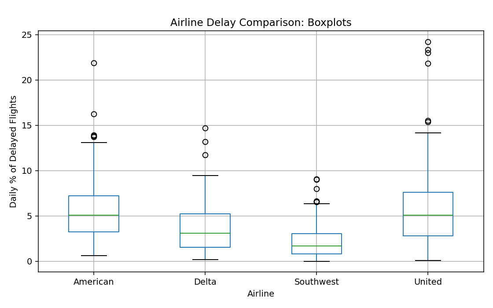
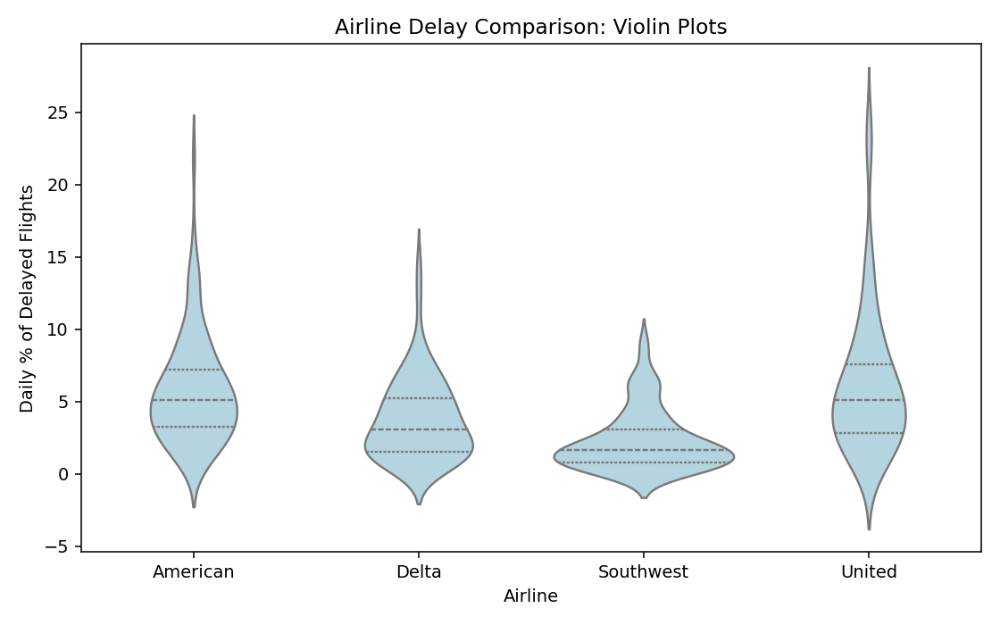
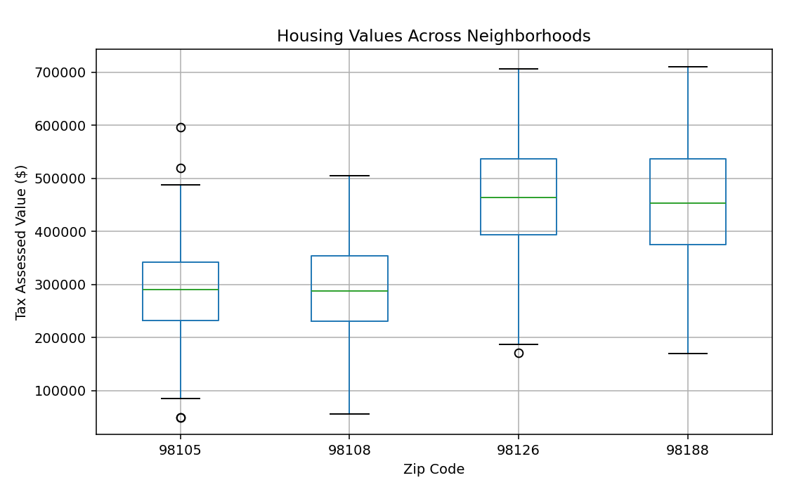
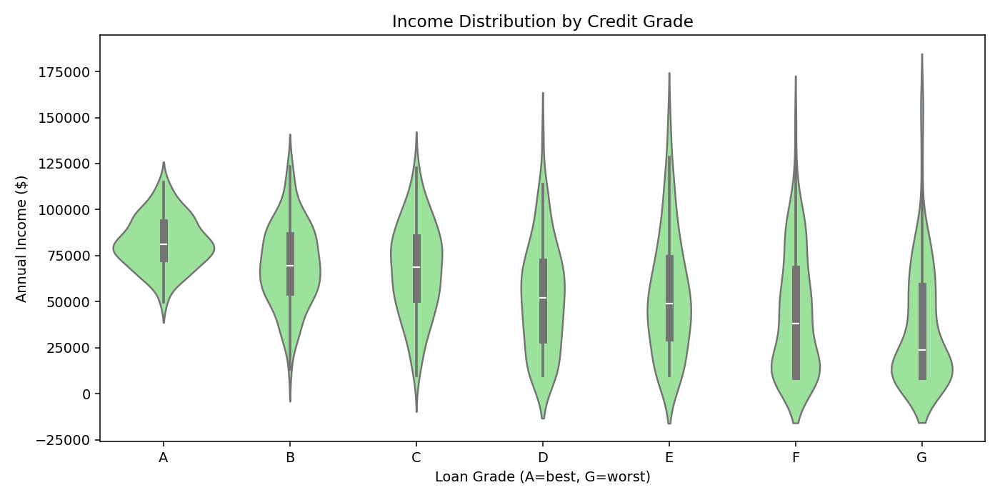

# 집단 비교 예제

## 개요

집단 간 분포를 비교하는 것은 기술통계의 핵심 과제다. 항공사, 우편번호, 신용등급 같은 범주형 변수로 자료를 나누었을 때 자연스럽게 떠오르는 질문은 이것이다. 집단들이 중심, 퍼짐, 모양에서 다른가?

시각적 집단 비교를 위한 두 가지 표준 도구는 **상자그림**과 **바이올린 그림**이다. 상자그림은 중앙값, 사분위수, 이상치를 압축적으로 요약하고, 바이올린 그림은 상자그림이 감추는 다봉성 같은 특징을 드러내며 분포의 전체 모양을 보여준다.

---

## 예제 1: 항공사별 지연

### 설정

항공편 지연은 승객의 이동 계획과 항공사 운영에 중요하다. 여기서는 네 항공사의 일간 지연율 분포를 비교한다. 각 항공사의 지연은 서로 다른 모양 및 척도 모수를 갖는 감마분포에서 뽑았으며, 이는 서로 다른 운영 특성을 반영한다.

### 코드

```python
import pandas as pd
import numpy as np
import matplotlib.pyplot as plt
import seaborn as sns

np.random.seed(42)
airlines = ['American', 'Delta', 'Southwest', 'United']
n_obs = 100

# 감마분포는 0 이상이고 오른쪽으로 치우쳐 있어 지연율 모형에 적합하다.
# (shape, scale)로 모양과 척도를 따로 정한다. 평균은 shape x scale이다.
params = {
    'American':  (2,   3),    # 평균 6.0 — 지연이 잦은 편
    'Delta':     (1.5, 2.5),  # 평균 3.75 — 중간
    'Southwest': (1.2, 2),    # 평균 2.4 — 지연이 적음
    'United':    (1.8, 3.2),  # 평균 5.76 — American과 비슷하나 퍼짐이 크다
}

data_list = []
for airline in airlines:
    shape, scale = params[airline]
    delays = np.random.gamma(shape=shape, scale=scale, size=n_obs)
    for delay in delays:
        data_list.append({'airline': airline, 'pct_carrier_delay': delay})

airline_stats = pd.DataFrame(data_list)

# 그림을 그리기 전에 숫자로 확인한다
print(airline_stats.groupby('airline')['pct_carrier_delay']
      .agg(['count', 'mean', 'median', 'std', 'max']).round(2))
```

출력:

```
           count  mean  median   std    max
airline
American     100  5.76    5.09  3.68  21.89
Delta        100  3.77    3.08  2.82  14.69
Southwest    100  2.31    1.67  2.08   9.07
United       100  6.18    5.09  4.92  24.20
```

**American과 United의 중앙값이 5.09로 완전히 같다.** 그런데 표준편차는 3.68과 4.92로 3분의 1 이상 차이 나고, 최댓값도 21.89와 24.20으로 다르다. 이 쌍이 다음 두 그림에서 어떻게 보이는지가 이 예제의 핵심이다.

### 상자그림으로 보기

```python
fig, ax = plt.subplots(figsize=(8, 5))

# by=     이 열의 값으로 집단을 나눈다
# column= 분포를 볼 열
airline_stats.boxplot(by='airline', column='pct_carrier_delay', ax=ax)

ax.set_xlabel('Airline')
ax.set_ylabel('Daily % of Delayed Flights')
ax.set_title('Airline Delay Comparison: Boxplots')
plt.suptitle('')      # pandas가 자동으로 붙이는 제목을 지운다
plt.tight_layout()
plt.show()
```



상자그림 읽기:

- **상자**는 $Q_1$에서 $Q_3$까지 뻗는다(지연의 가운데 50%).
- 상자 안의 **선**이 중앙값이다.
- **수염**은 $1.5 \times \text{IQR}$ 안의 가장 극단적인 관측값까지 뻗는다.
- 수염 너머의 점들이 **이상치**다.

### 바이올린 그림으로 보기

```python
fig, ax = plt.subplots(figsize=(8, 5))

# inner='quartile' 로 바이올린 안에 사분위수 선을 그려 넣으면
# 상자그림의 정보를 잃지 않으면서 밀도까지 함께 볼 수 있다.
sns.violinplot(data=airline_stats, x='airline', y='pct_carrier_delay',
               ax=ax, inner='quartile', color='lightblue')

ax.set_xlabel('Airline')
ax.set_ylabel('Daily % of Delayed Flights')
ax.set_title('Airline Delay Comparison: Violin Plots')
plt.tight_layout()
plt.show()
```



바이올린 그림 읽기:

- **넓은 부분**은 그 지연 수준에 관측값이 많음을 나타낸다.
- **좁은 부분**은 관측값이 적음을 나타낸다.
- **이봉** 모양(혹이 둘)은 전형적인 지연 시나리오가 둘임을 시사한다.
- **치우친** 모양은 지연 분포가 비대칭임을 나타낸다.

### 해석

세 항공사의 순서는 두 그림에서 똑같이 읽힌다. Southwest가 가장 낮고, Delta가 중간이며, American과 United가 높다.

**흥미로운 것은 American과 United의 비교다.** 앞의 출력에서 두 항공사의 중앙값이 5.09로 완전히 같았다.

- **상자그림**에서 두 중앙값 선의 높이가 같다. 상자의 폭이 United 쪽이 조금 넓지만 한눈에 들어올 만큼은 아니다.
- **바이올린 그림**에서는 United의 몸통이 위로 길게 늘어져 있어, 지연이 큰 날이 American보다 잦다는 사실이 곧바로 보인다.

숫자로도 확인된다. 표준편차가 3.68 대 4.92이고 최댓값이 21.89 대 24.20이다. **"평균 지연이 비슷한 두 항공사"라도 승객이 겪는 위험은 다르다.** 어쩌다 한 번의 큰 지연이 더 잦기 때문이다.

이것이 바이올린 그림을 함께 그리는 이유다. 중앙값이 같다는 사실은 두 분포가 같다는 뜻이 아니다.

---

## 예제 2: 우편번호별 주택 가치

### 설정

부동산 투자자는 동네가 주택 가치에 어떤 영향을 주는지 알고 싶어 한다. 여기서는 워싱턴주 킹 카운티의 우편번호 네 곳에 대해 모의 생성한 과세평가 주택 가치를 비교한다.

### 코드

```python
np.random.seed(123)
zip_codes = [98188, 98105, 98108, 98126]
n_homes = 150

data_list = []
for zip_code in zip_codes:
    # 두 우편번호는 30만 달러대, 나머지 둘은 45만 달러대로 설정한다
    base_price = 300_000 if zip_code in [98105, 98108] else 450_000
    prices = np.random.normal(base_price, 100_000, n_homes)
    # 음수나 비현실적인 값이 나오지 않도록 아래위를 잘라 낸다.
    # 정규분포는 양쪽으로 무한히 뻗으므로 가격 자료에는 이 처리가 필요하다.
    prices = np.clip(prices, 50_000, 2_000_000)
    for price in prices:
        data_list.append({'ZipCode': str(zip_code), 'TaxAssessedValue': price})

housing = pd.DataFrame(data_list)

# 우편번호별 요약. 금액만 천 달러 단위로 바꾸고 count는 개수 그대로 둔다.
# 표 전체를 1000으로 나누면 count(150)까지 0.15가 되어 버리므로 열을 나누어 처리한다.
summary = (housing.groupby('ZipCode')['TaxAssessedValue']
           .agg(['count', 'mean', 'median', 'std']))
summary[['mean', 'median', 'std']] = (summary[['mean', 'median', 'std']] / 1000).round(1)
print(summary)

fig, ax = plt.subplots(figsize=(8, 5))
housing.boxplot(by='ZipCode', column='TaxAssessedValue', ax=ax)
ax.set_xlabel('Zip Code')
ax.set_ylabel('Tax Assessed Value (\$)')
ax.set_title('Housing Values Across Neighborhoods')
plt.suptitle('')
plt.tight_layout()
plt.show()
```

출력(단위: 천 달러, `count`는 그대로 채 수):

```
         count   mean  median    std
ZipCode
98105      150  288.9   290.9   93.9
98108      150  290.8   287.2   93.2
98126      150  459.3   464.0  101.9
98188      150  455.8   454.0  109.4
```



### 해석

네 우편번호가 **두 무리로 갈린다.** 98105·98108이 29만 달러 언저리, 98126·98188이 46만 달러 언저리다. 상자그림에서 두 쌍의 상자가 뚜렷이 다른 높이에 놓인다.

**퍼짐은 네 곳이 거의 같다.** 표준편차가 93~109천 달러로 비슷하고, 상자의 세로 길이도 눈에 띄게 다르지 않다. 자료를 만들 때 모든 우편번호에 같은 표준편차 10만 달러를 준 결과이며, 그림이 그 설정을 정확히 되비추고 있다.

**평균과 중앙값이 거의 같다는 점도 눈여겨볼 만하다.** 정규분포에서 뽑았으니 대칭이고, 따라서 두 값이 일치한다. 실제 주택 가격 자료라면 고가 주택 때문에 오른쪽으로 치우쳐 평균이 중앙값보다 크게 나오는 것이 보통이다. 모의자료의 한계다.

---

## 예제 3: 대출 신용등급별 소득

### 설정

대부자는 대출 등급(A = 최상, G = 최하)에 걸친 소득 분포를 살펴 신용 위험을 평가한다. 등급이 낮을수록 소득이 낮고 더 넓게 퍼지는 경향이 있다.

### 코드

```python
np.random.seed(456)
grades = ['A', 'B', 'C', 'D', 'E', 'F', 'G']
n_per_grade = 100

data_list = []
for grade in grades:
    grade_idx = ord(grade) - ord('A')          # A=0, B=1, ... G=6
    # 등급이 낮아질수록 평균 소득은 내려가고(-8천/등급)
    # 퍼짐은 커진다(+5천/등급). 두 변화를 동시에 준 것이 이 예제의 요점이다.
    base_income = 80_000 - grade_idx * 8_000
    income_std  = 15_000 + grade_idx * 5_000
    incomes = np.random.normal(base_income, income_std, n_per_grade)
    incomes = np.clip(incomes, 10_000, 200_000)
    for income in incomes:
        data_list.append({'grade': grade, 'income': income})

loans = pd.DataFrame(data_list)

# 등급별 요약. 여기서는 count를 뽑지 않으므로 표 전체를 나눠도 안전하다.
print((loans.groupby('grade')['income']
       .agg(['mean', 'median', 'std']) / 1000).round(1))

fig, ax = plt.subplots(figsize=(10, 5))
sns.violinplot(data=loans, x='grade', y='income', ax=ax, color='lightgreen')
ax.set_xlabel('Loan Grade (A=best, G=worst)')
ax.set_ylabel('Annual Income (\$)')
ax.set_title('Income Distribution by Credit Grade')
plt.tight_layout()
plt.show()
```

출력(단위: 천 달러):

```
       mean  median   std
grade
A      82.2    81.2  13.9
B      69.8    69.5  21.9
C      67.5    68.8  24.7
D      52.5    52.1  29.2
E      53.5    49.1  32.6
F      43.1    38.2  32.4
G      36.2    23.9  32.2
```



### 해석

- **A등급**은 평균 82천 달러에 표준편차 13.9천 달러로 좁게 모여 있다. 바이올린이 가늘고 길쭉하다.
- **G등급**은 평균 36천 달러에 표준편차 32.2천 달러로 두 배 이상 퍼져 있다. 바이올린이 뭉툭하게 넓다.
- A에서 G로 갈수록 **중심은 내려가고 폭은 넓어진다.** 소득이 낮아질 뿐 아니라 예측하기도 어려워진다는 뜻이며, 대부자에게는 두 가지 모두 위험 요인이다.

!!! note "G등급에서 평균과 중앙값이 크게 갈린다"
    G등급의 평균은 36.2, 중앙값은 23.9로 12천 달러 넘게 차이 난다. 다른 등급에서는 둘이 거의 같았다.

    원인은 코드의 `np.clip(incomes, 10_000, 200_000)`이다. G등급은 평균 32천에 표준편차 32.2천이라 음수 소득이 대량으로 나오는데, 그것들이 모두 하한 10천에 몰려 쌓인다. 그 결과 분포가 왼쪽 끝에 뭉치고 오른쪽으로 길게 늘어져 **오른쪽으로 치우친 모양**이 된다.

    바이올린 그림의 맨 아래가 뭉툭하게 잘려 있는 것이 그 흔적이다. 이 모형이 낮은 등급에서는 현실적이지 않다는 신호이며, 실제라면 로그정규분포처럼 애초에 음수가 나오지 않는 분포를 쓰는 편이 낫다.

---

## 상자그림 대 바이올린 그림

| 기능 | 상자그림 | 바이올린 그림 |
|---|---|---|
| 사분위수 표시 | 예 | 예(`inner='quartile'` 사용 시) |
| 이상치 표시 | 예(개별 점) | 아니오(매끄럽게 지워짐) |
| 전체 모양 표시 | 아니오 | 예 |
| 다봉성 드러냄 | 아니오 | 예 |
| 압축성 | 높음 | 보통 |

!!! tip "권장 실무"
    빠른 요약에는 상자그림을, 분포의 모양이 중요할 때는 바이올린 그림을 쓴다. 판단이 서지 않으면 둘을 나란히 보여준다.

---

## 연습문제

**연습문제 1.**
중앙값 선이 $Q_3$보다 $Q_1$에 가깝고 위쪽 수염이 아래쪽 수염보다 긴 상자그림이 있다. 이 분포의 모양이 어떠할지 서술하라.

??? success "풀이"
    이 분포는 **오른쪽으로 치우쳐** 있다. 중앙값이 $Q_1$에 가깝다는 것은 상자의 위쪽 절반이 더 넓다는 뜻이며, 자료가 오른쪽으로 더 뻗어 있음을 나타낸다. 위쪽 수염이 더 긴 것은 극단값이 높은 쪽에 더 흔함을 확인해 준다.

---

**연습문제 2.**
중앙값과 IQR이 동일한 두 집단이 있는데, A 집단의 바이올린 그림은 봉우리가 하나이고 B 집단은 둘이다. 두 분포는 어떻게 다르며, 어떤 요약통계량이 이 차이를 포착하지 못하는가?

??? success "풀이"
    A 집단은 **단봉**이고 B 집단은 **이봉**이다. 평균, 중앙값, 분산, IQR은 두 집단에서 모두 비슷하거나 동일할 것이다. 중심과 퍼짐에 근거한 표준 요약통계량은 봉우리 수를 포착하지 못한다. 바이올린 그림, 히스토그램, 밀도추정에서 보이는 전체 모양만이 그 차이를 드러낸다.

---

**연습문제 3.**
위의 항공사 지연 자료에서 아메리칸의 지연 중앙값이 6.0%, IQR이 4.5%이고 사우스웨스트의 지연 중앙값이 2.4%, IQR이 2.0%라고 하자. 어떤 관리자가 "아메리칸의 지연이 정확히 2.5배 나쁘다"고 주장한다. 이 주장을 비판하라.

??? success "풀이"
    중앙값의 비는 $6.0 / 2.4 = 2.5$이므로 중앙값에 대해서는 그 주장이 성립한다. 그러나 "2.5배 나쁘다"는 지나친 단순화다. IQR의 비는 $4.5 / 2.0 = 2.25$로 퍼짐은 다른 배율로 차이가 난다. 게다가 모양도 다를 수 있다(아메리칸의 Gamma(2, 3)이 사우스웨스트의 Gamma(1.2, 2)보다 더 대칭적이다). 하나의 배율로는 중심, 퍼짐, 모양의 차이를 동시에 담아낼 수 없다.

---

**연습문제 4.**
상자그림은 보여주는데 바이올린 그림은 보여주지 못하는 이상치가 있을 수 있는 이유를 설명하라. 어떤 상황에서 바이올린 그림이 분포의 꼬리에 대해 오도할 수 있는가?

??? success "풀이"
    상자그림은 $1.5 \times \text{IQR}$ 너머의 개별 관측값을 이산적인 점으로 표시한다. 바이올린 그림은 자료를 매끄럽게 만드는 커널밀도추정을 쓴다. 꼬리에 관측값이 적으면 KDE 추정값이 아주 낮아 바이올린이 가는 선으로 좁아지므로 극단값이 보이지 않게 된다. 다음과 같을 때 오도한다.

    - 표본 크기가 작고 개별 이상치가 중요할 때.
    - 극단 관측값이 중요한 정보를 담는, 꼬리가 두꺼운 분포(예: 코시분포)일 때.
    - KDE의 대역폭이 너무 커서 꼬리가 지나치게 매끄러워질 때.

---

**연습문제 5.**
어떤 자료에서든 관측값의 적어도 50%가 상자그림의 상자 안(즉 $Q_1$과 $Q_3$ 사이)에 놓임을 증명하라.

??? success "풀이"
    정의에 의해 $Q_1$은 25번째 백분위수이고 $Q_3$은 75번째 백분위수다. 그 사이에 있는 자료의 비율은

    $$
    P(Q_1 \le X \le Q_3) = 0.75 - 0.25 = 0.50
    $$

    이므로 관측값의 적어도 50%가 상자 안에 들어간다. 이는 사분위수의 정의에서 곧바로 따라오므로 모양과 무관하게 어떤 분포에서도 성립한다. $\square$

---

**연습문제 6.**
**벌떼 그림**(또는 흔들림을 준 스트립 그림)은 겹쳐 그려지는 것을 피하기 위해 수직으로 흔들림을 주면서 모든 관측값을 가로축을 따라 보여준다. 벌떼 그림이 상자그림이나 바이올린 그림보다 나은 때는 언제인가?

??? success "풀이"
    벌떼 그림은 *모든 개별 관측값*을 보여주며, 다음과 같을 때 가치가 있다.

    - **표본 크기가 작을 때**($n < 50$): 관측값이 적으면 요약통계량이 잡음에 흔들리므로 상자그림과 바이올린이 오도할 수 있다. 각 점을 보여주면 보는 사람이 자료를 직접 판단할 수 있다.
    - **관측값의 정확한 개수가 중요할 때**: 임상시험이나 실험 연구에서는 집단별 개수가 이야기의 일부다. 벌떼 그림은 이를 한눈에 보여준다.
    - **이상치를 시각적으로 주변화해서는 안 될 때**: 상자그림의 "이상치"는 "이건 무시하라"는 인상을 주는 고립된 점이다. 벌떼 그림은 모든 관측값을 동등하게 다룬다.
    - **집단 안에 다봉성이나 뭉침이 있을 때**: 벌떼 그림에서 빈틈이나 덩어리로 보이며, 매끄러워진 바이올린에서는 가려지기도 한다.

    다음과 같을 때는 벌떼 그림이 적절하지 *않다*.

    - 표본 크기가 아주 클 때($n > 1000$): 흔들림으로도 겹침을 막을 수 없어 그림이 뭉개진다.
    - 여러 집단을 비교할 때: 벌떼 그림은 상자그림보다 가로 공간을 더 차지한다.
    - 이상치 식별이 목표일 때: 상자그림이 이상치를 시각적으로 더 두드러지게 만든다.

    흔히 쓰는 복합 그림은 벌떼 그림 위에 상자그림을 겹치는 것으로, 개별 자료와 요약을 함께 준다. Seaborn의 `sns.stripplot(..., dodge=True) + sns.boxplot(...)`이 이를 만들어낸다.

---

**연습문제 7.**
**바이올린 그림의 분할 모드**(집단당 반쪽 바이올린)는 짝지은 집단 비교를 시각적으로 선명하게 만든다. 분할 바이올린이 보는 사람을 **오도하는** 경우를 설명하고 그런 경우의 대안을 제안하라.

??? success "풀이"
    분할 바이올린은 다음과 같을 때 오도한다.

    - **집단 간 표본 크기가 크게 다를 때**: 각 반쪽이 같은 시각적 폭을 차지하도록 정규화되어 불균형이 감춰진다. 관측값 10개인 집단이 1000개인 집단만큼 시각적 무게를 갖는 것처럼 보인다.
    - **분포의 모양이 매우 다를 때**: 눈이 반대쪽 반쪽을 대칭으로 읽어, 밀도가 서로 무관한데도 거울상 분포처럼 보일 수 있다.
    - **기준 축이 임의적일 때**: 어느 집단을 어느 쪽에 두느냐가 "높음"과 "낮음"의 해석에 영향을 준다. 관례적인 순서가 없다면(예: "처리 A" 대 "처리 B") 분할 바이올린이 근거 없는 해석을 유도할 수 있다.

    **대안:** 각 아래에 표본 크기를 표기한($n = 10$ 대 $n = 1000$) 전체 바이올린을 나란히 놓는다. 분할 바이올린의 시각적 우아함을 포기하는 대신 자료에 대해 정직해진다.

    짝지은 자료(같은 대상을 두 번 측정)의 경우 분할이든 나란히든 바이올린은 짝지음을 포착하지 못한다. **짝 그림**을 쓰라. 각 대상의 두 측정값을 선으로 잇는다. 이렇게 하면 개별 변화와 대상 내 변동의 크기가 보이는데, 짝지은 설계에서 실제로 관심 있는 양이 바로 그것이다.

---

**연습문제 8.**
하나의 그림에서 여러 집단을 비교할 때는 **다중비교 보정**이 필요해진다. 5개 집단의 쌍별 비교를 $\alpha = 0.05$로 수행한다면 적어도 하나의 거짓양성이 나올 가족단위 확률은 얼마이며, 어떻게 보정하겠는가?

??? success "풀이"
    집단이 5개이면 쌍별 비교의 수는 $\binom{5}{2} = 10$이다. (대략적인 근사로) 독립을 가정하면 10번의 검정에서 거짓양성이 *하나도* 없을 확률은 $(1 - 0.05)^{10} \approx 0.599$이다. 따라서 가족단위 오류율은 대략

    $$
    P(\text{at least one false positive}) \approx 1 - 0.599 = 0.401
    $$

    이다. 허위 유의성이 나올 확률이 40%로, 명목상의 5%보다 훨씬 높다.

    **보정 방법:**

    - **본페로니:** 각 쌍별 비교를 $\alpha/10 = 0.005$로 검정한다. 간단하고 보수적이다.
    - **투키의 HSD**(정직 유의차): 분산분석 이후 평균의 쌍별 비교에 대해 가족단위 오류를 정확히 통제한다. 본페로니보다 검정력이 높다.
    - **홀름–본페로니:** $p$-값을 정렬해 $\alpha$ 기준을 낮춰 가며 차례로 기각하는 단계적 절차. 본페로니보다 일률적으로 검정력이 높다.
    - **벤자미니–호크버그(FDR 통제):** 거짓양성이 하나라도 나올 확률이 아니라, 유의하다고 선언된 검정 가운데 거짓인 것의 *기대 비율*을 통제한다. 탐색적으로 검정을 많이 수행할 때 적절하다.

    시각화 측면: 하나의 그림에서 여러 집단을 비교할 때 모든 쌍별 $p$-값을 표기하지 *마라*. 관심 있는 비교 몇 개를 미리 지정하거나, 먼저 총괄 검정(분산분석, 크러스컬–월리스)을 하고 그것이 유의할 때만 쌍별 비교를 하라.

---

**연습문제 9.**
연습문제 8의 다중비교 문제는 그림에서 더 교묘한 형태로 나타난다. 집단이 많은 그림에서 **눈에 띄는 집단을 골라내는 것** 자체가 왜 문제인가?

??? success "풀이"
    ```python
    import numpy as np

    rng = np.random.default_rng(0)
    B, n = 20_000, 30

    print("참 평균이 모두 0 으로 같은 K개 집단에서, 관측 평균 1위 집단의 값")
    print(f"{'K':>5}{'1위의 평균':>12}{'표준오차 단위':>15}")
    for K in (3, 5, 10, 20, 50):
        means = rng.normal(0, 1, (B, K, n)).mean(axis=2)
        best = means.max(axis=1)
        print(f"{K:>5}{best.mean():>+12.4f}{best.mean() * np.sqrt(n):>+15.2f}")
    ```

    출력:

    ```
    참 평균이 모두 0 으로 같은 K개 집단에서, 관측 평균 1위 집단의 값
        K      1위의 평균        표준오차 단위
        3     +0.1556          +0.85
        5     +0.2122          +1.16
       10     +0.2801          +1.53
       20     +0.3413          +1.87
       50     +0.4114          +2.25
    ```

    **집단이 많을수록 "1위"가 참값에서 더 멀어진다.**

    | $K$ | $1$위의 평균 | 표준오차 단위 |
    |---|---|---|
    | $3$ | $+0.156$ | $+0.85$ |
    | $10$ | $+0.280$ | $+1.53$ |
    | $50$ | $\mathbf{+0.411}$ | $\mathbf{+2.25}$ |

    참 평균이 **모두 같은데도** $K = 50$이면 $1$위 집단의 관측 평균이 참값보다 $2.25$ 표준오차 위에 있다. 개별 집단만 놓고 보면 $p < 0.05$로 "유의"할 만한 크기다.

    **이것이 승자의 저주다.** 1장 출판 편향 문서에서 본 것과 같은 구조이며, 여기서는 필터가 "유의성"이 아니라 **"내 눈에 띈 것"** 이다.

    **그림에서 특히 위험한 이유.**

    - **비교를 몇 번 했는지 세어지지 않는다.** 집단 $20$개짜리 그림을 보고 "C 항공사가 유독 나쁘다"고 말하면 사실상 $20$번 비교한 것인데, 아무도 그것을 다중검정으로 인식하지 않는다.
    - **사후에 고른 가설이다.** 1장의 갈래길의 정원이 시각적으로 나타난 것이다. 그림을 보기 전에 "C 항공사를 검정하겠다"고 정했다면 이야기가 다르다.
    - **그림은 불확실성을 잘 보여 주지 않는다.** 상자그림에는 표본 크기도 신뢰구간도 없다(상자그림 문서 연습문제 10).

    **대응.**

    - **탐색과 확증을 분리하라.** 그림에서 발견한 것은 **가설**이며, 확인하려면 새 자료가 필요하다.
    - **보정된 구간을 함께 그려라.** 투키의 HSD처럼 모든 쌍별 비교를 동시에 통제하는 구간을 표시하면 눈으로 비교해도 안전하다.
    - **수축 추정을 쓰라.** 계층모형은 집단 평균을 전체 평균 쪽으로 수축시켜 극단적인 집단의 과대추정을 완화한다. 이것이 **승자의 저주를 설계로 막는 방법**이다.
    - **집단을 정렬하지 마라.** 다음 문제가 그 이유다. $\square$

---

**연습문제 10.**
집단 비교 그림에서 흔히 하는 일이 **관측된 값으로 집단을 정렬하는 것**이다. 이것이 왜 위험한지 보여라.

??? success "풀이"
    ```python
    import numpy as np

    rng = np.random.default_rng(0)
    K, n = 12, 25
    data = rng.normal(0, 1, (K, n))        # 12개 집단, 참 평균은 모두 0
    order = np.argsort(-data.mean(1))

    print("참 평균이 모두 같은 12개 집단을 관측 평균으로 정렬하면")
    print(f"  {np.round(data.mean(1)[order], 3)}")
    gap = data.mean(1)[order][0] - data.mean(1)[order][-1]
    print(f"\n  1위와 꼴찌의 차이 {gap:.4f}")
    print(f"  차이의 표준오차 {np.sqrt(2) / np.sqrt(n):.4f}")
    print(f"  → 표준오차 {gap / (np.sqrt(2) / np.sqrt(n)):.2f} 배")
    ```

    출력:

    ```
    참 평균이 모두 같은 12개 집단을 관측 평균으로 정렬하면
      [ 0.331  0.087  0.071 -0.015 -0.018 -0.021 -0.042 -0.047 -0.073 -0.166
     -0.214 -0.324]

      1위와 꼴찌의 차이 0.6553
      차이의 표준오차 0.2828
      → 표준오차 2.32 배
    ```

    **정렬된 평균이 $+0.156$에서 $-0.317$까지 매끄럽게 내려간다.** 그래프로 그리면 깔끔한 하강 추세로 보이고, 독자는 "집단 사이에 체계적 차이가 있다"고 읽는다.

    **참 평균은 열두 집단 모두 정확히 $0$이다.** 보이는 것은 전부 표집 잡음이다.

    **왜 정렬이 위험한가.**

    - **정렬은 잡음에 순서를 부여한다.** 무작위한 값들도 크기순으로 늘어놓으면 반드시 단조 곡선이 된다. 그 곡선의 기울기는 **차이의 증거가 아니라 잡음의 크기**를 반영한다.
    - **양 끝이 가장 심하게 편향된다.** $1$위는 위로, 꼴찌는 아래로 치우친다. 연습문제 9의 승자의 저주가 양방향으로 작용한 것이다.
    - **독자가 순위를 실재로 받아들인다.** "우리 지점이 $12$개 중 $9$위"라는 말은 강력한 인상을 주지만, 위 자료에서 그 순위는 다음 달이면 완전히 뒤바뀐다.

    **그럼에도 정렬이 유용한 경우가 있다.** 집단 간 차이가 **실제로 크고** 표준오차가 작다면 정렬이 그림을 읽기 쉽게 만든다. 문제는 그 조건을 확인하지 않고 습관적으로 정렬하는 것이다.

    **처방.**

    | 방법 | 효과 |
    |---|---|
    | **오차막대를 함께 그린다** | 순위 차이가 불확실성보다 큰지 눈으로 보인다 |
    | **의미 있는 순서로 정렬한다** | 시간, 크기, 알파벳 등 자료 밖의 기준 |
    | **수축 추정값으로 정렬한다** | 극단값이 중앙으로 당겨져 순위가 안정된다 |
    | **순위 대신 구간을 보고한다** | "$3$위"가 아니라 "$1$–$8$위 사이" |

    마지막 방법이 병원·학교 순위 공표에서 실제로 쓰인다. 부트스트랩으로 각 단위의 **순위 신뢰구간**을 구하면, 대부분의 단위가 넓은 구간을 갖는다는 사실이 드러난다. **순위표는 대개 그 자체가 과신의 도구다.**

    이 절 전체의 결론과 이어진다. 집단 비교 그림은 **차이를 보여 주기 위한 것이지 순위를 확정하기 위한 것이 아니다.** $\square$

