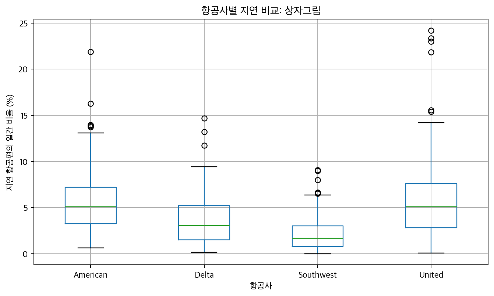
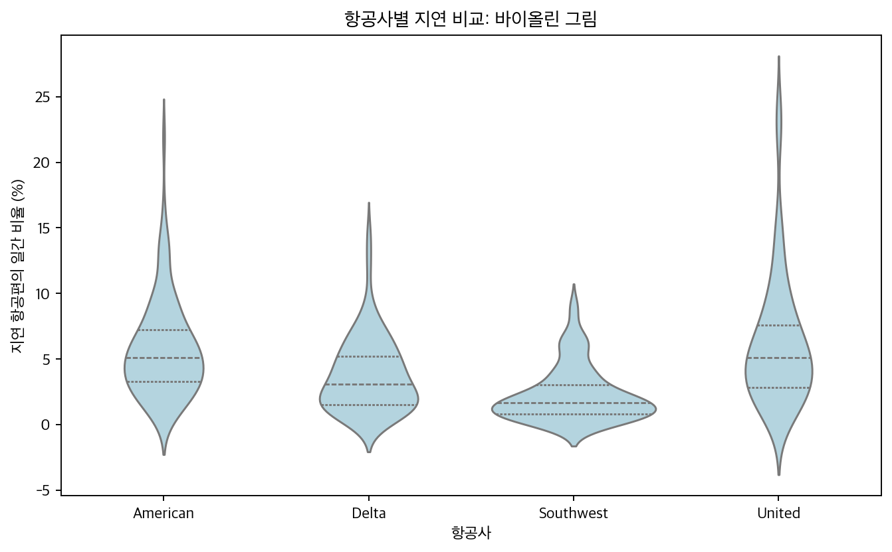
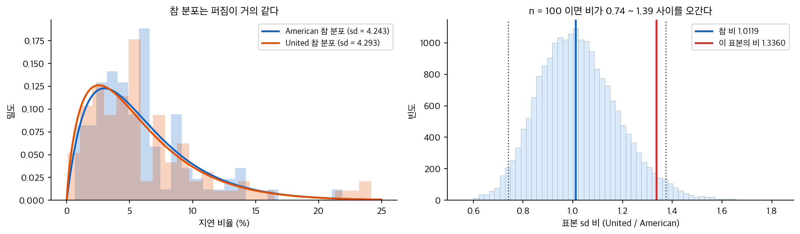
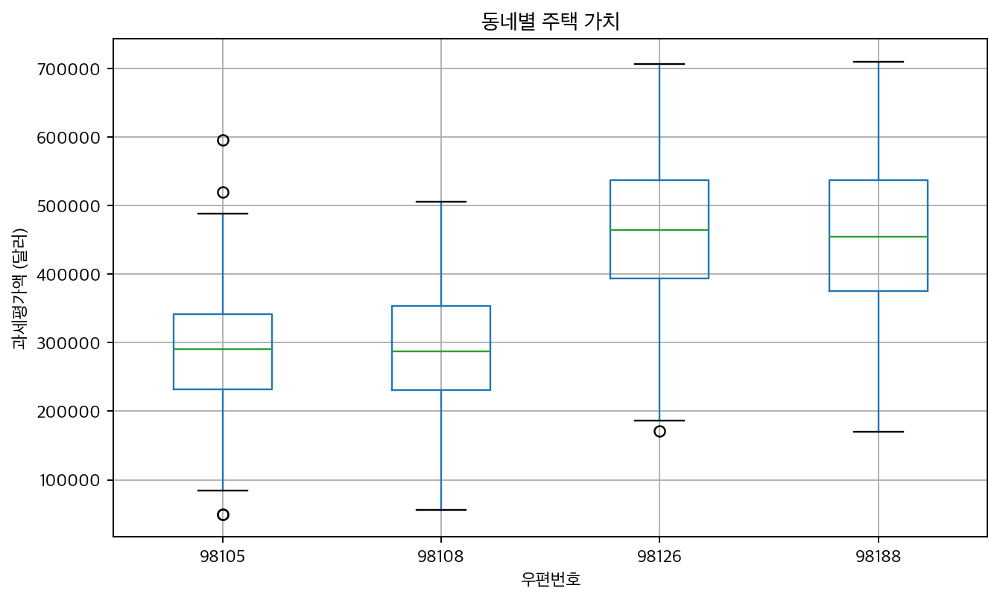
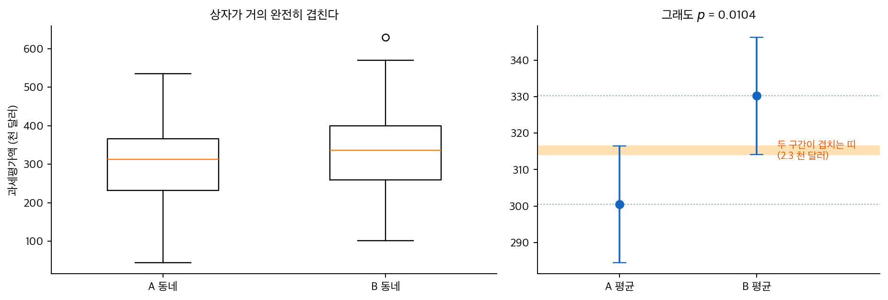
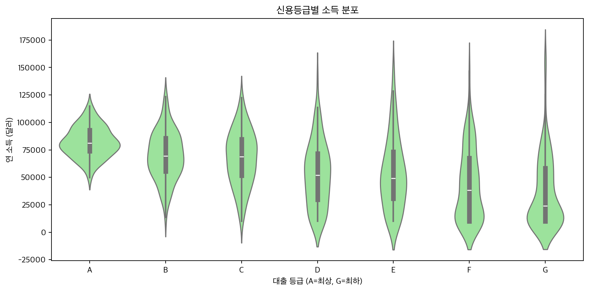
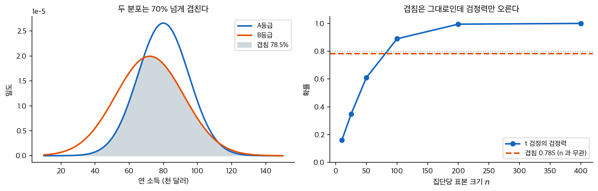

# 집단 비교 보기

## 개요

집단 간 분포를 비교하는 것은 기술통계의 핵심 과제다. 항공사, 우편번호, 신용등급 같은 범주형 변수로 자료를 나누었을 때 자연스럽게 떠오르는 질문은 이것이다. 집단들이 중심, 퍼짐, 모양에서 다른가?

시각적 집단 비교를 위한 두 가지 표준 도구는 **상자그림**과 **바이올린 그림**이다. 상자그림은 중앙값, 사분위수, 이상치를 압축적으로 요약하고, 바이올린 그림은 상자그림이 감추는 다봉성 같은 특징을 드러내며 분포의 전체 모양을 보여준다.

---

<div class="exbox" markdown>

**보기 1.** <span class="diff easy" title="쉬움"></span> 항공사별 지연. 네 항공사의 일간 지연율을 서로 다른 감마분포에서 $100$개씩 뽑아 상자그림과 바이올린 그림으로 견준다. 모수는 American $(2, 3)$, Delta $(1.5, 2.5)$, Southwest $(1.2, 2)$, United $(1.8, 3.2)$ 이다(모양, 척도).

**(1)** 두 그림을 그리고 무엇이 읽히는지 적으시오.

**(2)** 네 분포의 **참 평균·표준편차·중앙값**을 구해 표본이 재현하는지 보시오. 특히 American과 United의 **퍼짐 차이**가 실제 모형의 차이인지 표집 변동인지 따지시오.

</div>

??? success "풀이"

    **(1) 그려 본다.**

    **설정.** 항공편 지연은 승객의 이동 계획과 항공사 운영에 중요하다. 여기서는 네 항공사의 일간 지연율 분포를 비교한다. 각 항공사의 지연은 서로 다른 모양 및 척도 모수를 갖는 감마분포에서 뽑았으며, 이는 서로 다른 운영 특성을 반영한다.

    ```python
    import pandas as pd
    import numpy as np
    import matplotlib.pyplot as plt
    import seaborn as sns

    # 그림에 한글을 쓰므로 한글 글꼴을 지정한다. 후보를 늘어놓으면 matplotlib 가
    # 설치된 첫 번째를 집으므로, 리눅스('NanumGothic')·맥('Apple SD Gothic Neo')·
    # 윈도우('Malgun Gothic')에서 코드를 고치지 않고 그대로 돌릴 수 있다.
    # 글꼴을 바꾸면 마이너스 기호가 깨지므로 unicode_minus 도 함께 꺼 준다.
    plt.rcParams["font.sans-serif"] = ["NanumGothic", "Apple SD Gothic Neo", "Malgun Gothic"]
    plt.rcParams["font.family"] = "sans-serif"
    plt.rcParams['axes.unicode_minus'] = False

    np.random.seed(42)
    airlines = ['American', 'Delta', 'Southwest', 'United']
    n_obs = 100

    # 감마분포는 0 이상이고 오른쪽으로 치우쳐 있어 지연율 모형에 적합하다.
    # (shape, scale)로 모양과 척도를 따로 정한다. 평균은 shape x scale이다.
    params = {
        'American':  (2,   3),    # 평균 6.0 — 지연이 잦은 편
        'Delta':     (1.5, 2.5),  # 평균 3.75 — 중간
        'Southwest': (1.2, 2),    # 평균 2.4 — 지연이 적음
        'United':    (1.8, 3.2),  # 평균 5.76 — American과 비슷하나 퍼짐이 크다
    }

    data_list = []
    for airline in airlines:
        shape, scale = params[airline]
        delays = np.random.gamma(shape=shape, scale=scale, size=n_obs)
        for delay in delays:
            data_list.append({'airline': airline, 'pct_carrier_delay': delay})

    airline_stats = pd.DataFrame(data_list)

    # 그림을 그리기 전에 숫자로 확인한다
    print(airline_stats.groupby('airline')['pct_carrier_delay']
          .agg(['count', 'mean', 'median', 'std', 'max']).round(2))
    ```

    출력:

    ```
               count  mean  median   std    max
    airline
    American     100  5.76    5.09  3.68  21.89
    Delta        100  3.77    3.08  2.82  14.69
    Southwest    100  2.31    1.67  2.08   9.07
    United       100  6.18    5.09  4.92  24.20
    ```

    **American과 United의 중앙값이 5.09로 완전히 같다.** 그런데 표준편차는 3.68과 4.92로 3분의 1 이상 차이 나고, 최댓값도 21.89와 24.20으로 다르다. 이 쌍이 다음 두 그림에서 어떻게 보이는지가 이 보기의 핵심이다.

    **상자그림으로 보기.**

    ```python
    fig, ax = plt.subplots(figsize=(8, 5))

    # by=     이 열의 값으로 집단을 나눈다
    # column= 분포를 볼 열
    airline_stats.boxplot(by='airline', column='pct_carrier_delay', ax=ax)

    ax.set_xlabel('항공사')
    ax.set_ylabel('지연 항공편의 일간 비율 (%)')
    ax.set_title('항공사별 지연 비교: 상자그림')
    plt.suptitle('')      # pandas가 자동으로 붙이는 제목을 지운다
    plt.tight_layout()
    plt.show()
    ```

    

    상자그림 읽기:

    - **상자**는 $Q_1$에서 $Q_3$까지 뻗는다(지연의 가운데 50%).
    - 상자 안의 **선**이 중앙값이다.
    - **수염**은 $1.5 \times \text{IQR}$ 안의 가장 극단적인 관측값까지 뻗는다.
    - 수염 너머의 점들이 **이상치**다.

    **바이올린 그림으로 보기.**

    ```python
    fig, ax = plt.subplots(figsize=(8, 5))

    # inner='quartile' 로 바이올린 안에 사분위수 선을 그려 넣으면
    # 상자그림의 정보를 잃지 않으면서 밀도까지 함께 볼 수 있다.
    sns.violinplot(data=airline_stats, x='airline', y='pct_carrier_delay',
                   ax=ax, inner='quartile', color='lightblue')

    ax.set_xlabel('항공사')
    ax.set_ylabel('지연 항공편의 일간 비율 (%)')
    ax.set_title('항공사별 지연 비교: 바이올린 그림')
    plt.tight_layout()
    plt.show()
    ```

    

    바이올린 그림 읽기:

    - **넓은 부분**은 그 지연 수준에 관측값이 많음을 나타낸다.
    - **좁은 부분**은 관측값이 적음을 나타낸다.
    - **치우친** 모양은 지연 분포가 비대칭임을 나타낸다. 네 바이올린이 모두 아래쪽이 불룩하고 위로 길게 늘어져 있는데, 자료를 감마분포에서 뽑았으니 예상대로다.
    - **이봉** 모양(혹이 둘)이 보이면 전형적인 지연 시나리오가 둘이라는 뜻이겠지만, **이 그림에서는 그렇게 읽으면 안 된다.** Southwest의 6 부근에 작은 혹이 하나 보이는데, 자료를 봉우리가 하나뿐인 감마분포에서 뽑았으니 참 분포에는 그런 혹이 없다. 집단당 $n$이 100뿐이라 KDE가 표집 잡음을 봉우리로 그려 낸 것이다([바이올린 그림](violin.md) 절 연습문제 7).

    !!! warning "바이올린의 아래쪽 끝이 0 미만까지 내려가 있다"
        지연 비율은 $0$ 이상인 양인데도 네 바이올린 모두 꼬리가 음수 구간까지 뻗어 있다. KDE가 관측값 주위에 커널을 대칭으로 놓아 생기는 **경계 인공물**이며, `sns.violinplot(..., cut=0)` 으로 자료 범위 밖을 잘라내야 한다([바이올린 그림](violin.md) 절 연습문제 9).

    **해석.**

    세 항공사의 순서는 두 그림에서 똑같이 읽힌다. Southwest가 가장 낮고, Delta가 중간이며, American과 United가 높다.

    **흥미로운 것은 American과 United의 비교다.** 앞의 출력에서 두 항공사의 중앙값이 5.09로 완전히 같았다.

    - **상자그림**에서 두 중앙값 선의 높이가 같다. 상자의 세로 길이가 United 쪽이 조금 길지만($\text{IQR}$ $4.78$ 대 $3.95$) 한눈에 들어올 만큼은 아니다. 이상치로 찍힌 점도 $6$개 대 $5$개로 비슷하다.
    - **바이올린 그림**에서는 United의 몸통이 위로 길게 늘어져 있어, 지연이 큰 날이 American보다 잦다는 사실이 곧바로 보인다.

    숫자로도 확인된다. 표준편차가 3.68 대 4.92이고 최댓값이 21.89 대 24.20이다. **"평균 지연이 비슷한 두 항공사"라도 승객이 겪는 위험은 다르다.** 어쩌다 한 번의 큰 지연이 더 잦기 때문이다.

    이것이 바이올린 그림을 함께 그리는 이유다. 중앙값이 같다는 사실은 두 분포가 같다는 뜻이 아니다.

    **(2) 참값과 표본. 해석적으로.** 모양 $k$, 척도 $\theta$ 인 감마분포의 평균과 분산은

    $$
    E[X] = k\theta, \qquad \operatorname{Var}(X) = k\theta^2, \qquad
    \operatorname{SD}(X) = \sqrt{k}\,\theta
    $$

    이다(중앙값은 닫힌 꼴이 없어 수치로 푼다). 네 항공사에 넣어 보자.

    | 항공사 | $k$ | $\theta$ | 참 평균 $k\theta$ | 참 SD $\sqrt{k}\theta$ |
    |---|---:|---:|---:|---:|
    | American | $2$ | $3$ | $6.0000$ | $4.2426$ |
    | Delta | $1.5$ | $2.5$ | $3.7500$ | $3.0619$ |
    | Southwest | $1.2$ | $2$ | $2.4000$ | $2.1909$ |
    | United | $1.8$ | $3.2$ | $5.7600$ | $4.2933$ |

    **여기서 멈추어 보아야 한다.** American과 United의 참 표준편차가 $4.2426$ 과 $4.2933$ 으로 **거의 같다.** 비가 $1.0119$ 다. 그런데 (1)의 표본은 $3.68$ 과 $4.92$ 를 주었고, 비가 $1.336$ 이다. **"United가 American보다 3분의 1 더 퍼져 있다"는 읽기가 모형에는 없는 것이다.**

    표본 표준편차가 얼마나 흔들리는지를 보면 설명이 된다. $n = 100$ 이고 분포가 오른쪽으로 치우쳐 있으면 $s$ 의 변동이 상당하다. 두 표본 표준편차의 **비**가 어느 범위를 오가는지는 같은 모형에서 다시 뽑아 보면 바로 나온다.

    **수치적으로.**

    ```python
    from scipy import stats

    samp = {a: airline_stats.loc[airline_stats.airline == a,
                                 'pct_carrier_delay'].to_numpy()
            for a in airlines}

    print(f"{'항공사':<11}{'참 평균':>9}{'참 sd':>9}{'참 중앙값':>11}"
          f"{'표본 평균':>11}{'표본 sd':>10}{'표본 중앙값':>12}")
    for a in airlines:
        sh, sc = params[a]
        x = samp[a]
        print(f"{a:<11}{sh*sc:>9.4f}{np.sqrt(sh)*sc:>9.4f}"
              f"{stats.gamma.ppf(0.5, sh, scale=sc):>11.4f}"
              f"{x.mean():>11.4f}{x.std(ddof=1):>10.4f}{np.median(x):>12.4f}")

    sd_a, sd_u = np.sqrt(2)*3, np.sqrt(1.8)*3.2
    print(f"\n참 sd:  American {sd_a:.4f},  United {sd_u:.4f}  ->  비 {sd_u/sd_a:.4f}")
    obs = samp['United'].std(ddof=1)/samp['American'].std(ddof=1)
    print(f"표본 sd 비 = {obs:.4f}")

    rng = np.random.default_rng(1)
    ratios = np.array([rng.gamma(1.8, 3.2, 100).std(ddof=1)
                       / rng.gamma(2, 3, 100).std(ddof=1) for _ in range(20000)])
    print(f"\n같은 모형에서 n=100 으로 20000 번 다시 뽑았을 때 표본 sd 비의 분포")
    print(f"  중앙값 {np.median(ratios):.4f},  95% 구간 "
          f"[{np.quantile(ratios,0.025):.4f}, {np.quantile(ratios,0.975):.4f}]")
    print(f"  관측된 {obs:.4f} 는 이 분포의 {100*(ratios<obs).mean():.1f} 분위수")

    fig, (a1, a2) = plt.subplots(1, 2, figsize=(12, 3.6))
    grid = np.linspace(0, 25, 500)
    cols = {"American": "#1565C0", "United": "#E65100"}
    for a in ["American", "United"]:
        sh, sc = params[a]
        a1.plot(grid, stats.gamma.pdf(grid, sh, scale=sc), color=cols[a], lw=2,
                label=f"{a} 참 분포 (sd = {np.sqrt(sh)*sc:.3f})")
        a1.hist(samp[a], bins=25, density=True, color=cols[a], alpha=0.25)
    a1.set_xlabel("지연 비율 (%)")
    a1.set_ylabel("밀도")
    a1.set_title("참 분포는 퍼짐이 거의 같다", fontsize=11)
    a1.legend(fontsize=9)

    a2.hist(ratios, bins=60, color="#DCEBFB", edgecolor="#90A4AE", lw=0.3)
    a2.axvline(sd_u/sd_a, color="#1565C0", lw=2, label=f"참 비 {sd_u/sd_a:.4f}")
    a2.axvline(obs, color="#D32F2F", lw=2, label=f"이 표본의 비 {obs:.4f}")
    for q in [0.025, 0.975]:
        a2.axvline(np.quantile(ratios, q), color="#37474F", ls=":", lw=1.2)
    a2.set_xlabel("표본 sd 비 (United / American)")
    a2.set_ylabel("빈도")
    a2.set_title("n = 100 이면 비가 0.74 ~ 1.37 사이를 오간다", fontsize=11)
    a2.legend(fontsize=9)
    for ax in (a1, a2):
        ax.spines[["top", "right"]].set_visible(False)
    plt.tight_layout()
    plt.show()
    ```

    출력:

    ```
    항공사             참 평균     참 sd      참 중앙값      표본 평균     표본 sd      표본 중앙값
    American      6.0000   4.2426     5.0350     5.7575    3.6792      5.0924
    Delta         3.7500   3.0619     2.9575     3.7739    2.8208      3.0805
    Southwest     2.4000   2.1909     1.7759     2.3074    2.0814      1.6691
    United        5.7600   4.2933     4.7355     6.1765    4.9154      5.0893

    참 sd:  American 4.2426,  United 4.2933  ->  비 1.0119
    표본 sd 비 = 1.3360

    같은 모형에서 n=100 으로 20000 번 다시 뽑았을 때 표본 sd 비의 분포
      중앙값 1.0118,  95% 구간 [0.7402, 1.3745]
      관측된 1.3360 는 이 분포의 96.2 분위수
    ```

    

    **평균은 잘 맞는다.** 참값 $6.0000, 3.7500, 2.4000, 5.7600$ 에 표본이 $5.7575, 3.7739, 2.3074, 6.1765$ 다. 표준오차 $\sqrt{k}\theta/\sqrt{100}$ 이 $0.42, 0.31, 0.22, 0.43$ 이므로 모두 $1$ 표준오차 안이다.

    **그러나 (1)의 해석 가운데 두 가지는 표집 변동이었다.**

    **첫째, 두 중앙값이 $5.09$ 로 같은 것은 우연이다.** 참 중앙값은 American $5.0350$, United $4.7355$ 로 $0.30$ 만큼 다르다. 표본에서 $5.0924$ 와 $5.0893$ 으로 소수 둘째 자리까지 겹친 것은 이 씨앗에서만 일어난 일이다.

    **둘째, 더 중요하게, "United의 퍼짐이 3분의 1 크다"는 것도 모형에 없는 차이다.** 참 표준편차의 비는 $1.0119$, 곧 **$1\%$ 차이**뿐이다. 그런데 이 표본은 $1.3360$ 을 주었다. 같은 모형에서 $20{,}000$번 다시 뽑아 보면 비가 $0.74$ 에서 $1.37$ 사이를 오가고, $1.3360$ 은 그 분포의 **$96.2$ 분위수**다. 드물기는 해도 $95\%$ 구간 안이다. **$n = 100$ 으로는 두 퍼짐이 같은지 다른지 가릴 수 없다.**

    그림 왼쪽이 그 사실을 그대로 보여 준다. 두 참 밀도곡선(파랑과 주황)이 거의 겹쳐 있다. 겹치지 않는 것은 그 위에 깔린 **히스토그램**뿐이다.

    **그러므로 (1)의 마지막 문단은 고쳐 읽어야 한다.** "승객이 겪는 위험이 다르다"는 결론은 **이 자료로는 뒷받침되지 않는다.** 두 분포의 참 모수는 평균이 $6.00$ 대 $5.76$, 표준편차가 $4.24$ 대 $4.29$ 로 사실상 같다. 바이올린 그림에서 United의 몸통이 위로 더 늘어나 보인 것은 **그 표본에서 큰 값이 몇 개 더 나왔기 때문**이고, 그 정도는 $n = 100$ 에서 흔히 생긴다.

    **이것이 집단 비교 그림의 가장 흔한 함정이다.** 그림은 **표본의** 퍼짐 차이를 보여 주는데 사람은 그것을 **모집단의** 차이로 읽는다. 눈으로 본 차이가 표집 변동보다 큰지를 묻지 않으면, 그림은 언제나 "차이가 있다"고 말한다. 차이를 주장하려면 그림이 아니라 **표집분포**를 보아야 한다 — 위 오른쪽 그림이 바로 그것이다.

<div class="exbox" markdown>

**보기 2.** <span class="diff easy" title="쉬움"></span> 우편번호별 주택 가치. 네 우편번호에서 $150$채씩, 표준편차 $10$만 달러로 뽑는다.

**(1)** 상자그림을 그리고 네 동네가 어떻게 갈리는지 적으시오.

**(2)** 두 동네의 상자가 겹친다고 해서 평균이 같은 것은 아니다. **두 평균의 $95\%$ 신뢰구간이 겹치는 것**과 **차이가 유의하지 않은 것**이 다른 말임을 식으로 보이고, 모의로 확인하시오.

</div>

??? success "풀이"

    **(1) 그려 본다.**

    **설정.** 부동산 투자자는 동네가 주택 가치에 어떤 영향을 주는지 알고 싶어 한다. 여기서는 워싱턴주 킹 카운티의 우편번호 네 곳에 대해 모의 생성한 과세평가 주택 가치를 비교한다.

    ```python
    np.random.seed(123)
    zip_codes = [98188, 98105, 98108, 98126]
    n_homes = 150

    data_list = []
    for zip_code in zip_codes:
        # 두 우편번호는 30만 달러대, 나머지 둘은 45만 달러대로 설정한다
        base_price = 300_000 if zip_code in [98105, 98108] else 450_000
        prices = np.random.normal(base_price, 100_000, n_homes)
        # 음수나 비현실적인 값이 나오지 않도록 아래위를 잘라 낸다.
        # 정규분포는 양쪽으로 무한히 뻗으므로 가격 자료에는 이 처리가 필요하다.
        prices = np.clip(prices, 50_000, 2_000_000)
        for price in prices:
            data_list.append({'ZipCode': str(zip_code), 'TaxAssessedValue': price})

    housing = pd.DataFrame(data_list)

    # 우편번호별 요약. 금액만 천 달러 단위로 바꾸고 count는 개수 그대로 둔다.
    # 표 전체를 1000으로 나누면 count(150)까지 0.15가 되어 버리므로 열을 나누어 처리한다.
    summary = (housing.groupby('ZipCode')['TaxAssessedValue']
               .agg(['count', 'mean', 'median', 'std']))
    summary[['mean', 'median', 'std']] = (summary[['mean', 'median', 'std']] / 1000).round(1)
    print(summary)

    fig, ax = plt.subplots(figsize=(8, 5))
    housing.boxplot(by='ZipCode', column='TaxAssessedValue', ax=ax)
    ax.set_xlabel('우편번호')
    ax.set_ylabel('과세평가액 (달러)')
    ax.set_title('동네별 주택 가치')
    plt.suptitle('')
    plt.tight_layout()
    plt.show()
    ```

    출력(단위: 천 달러, `count`는 그대로 채 수):

    ```
             count   mean  median    std
    ZipCode
    98105      150  288.9   290.9   93.9
    98108      150  290.8   287.2   93.2
    98126      150  459.3   464.0  101.9
    98188      150  455.8   454.0  109.4
    ```

    

    **해석.**

    네 우편번호가 **두 무리로 갈린다.** 98105·98108이 29만 달러 언저리, 98126·98188이 46만 달러 언저리다. 상자그림에서 두 쌍의 상자가 뚜렷이 다른 높이에 놓인다.

    **퍼짐은 네 곳이 거의 같다.** 표준편차가 93~109천 달러로 비슷하고, 상자의 세로 길이도 눈에 띄게 다르지 않다. 자료를 만들 때 모든 우편번호에 같은 표준편차 10만 달러를 준 결과이며, 그림이 그 설정을 정확히 되비추고 있다.

    **평균과 중앙값이 거의 같다는 점도 눈여겨볼 만하다.** 정규분포에서 뽑았으니 대칭이고, 따라서 두 값이 일치한다. 실제 주택 가격 자료라면 고가 주택 때문에 오른쪽으로 치우쳐 평균이 중앙값보다 크게 나오는 것이 보통이다. 모의자료의 한계다.

    **(2) 구간이 겹치는 것과 차이가 없는 것. 해석적으로.** 두 집단의 평균을 $\bar x_1, \bar x_2$, 그 표준오차를 $\mathrm{SE}_1, \mathrm{SE}_2$ 라 하자. 각각의 $95\%$ 신뢰구간은 $\bar x_i \pm z\,\mathrm{SE}_i$ 이고 $z = 1.96$ 이다.

    **두 구간이 서로 떨어지려면** 두 구간의 반폭을 합한 것보다 평균의 차이가 커야 한다.

    $$
    |\bar x_1 - \bar x_2| > z\,(\mathrm{SE}_1 + \mathrm{SE}_2)
    $$

    **차이의 검정이 기각하려면** 차이의 표준오차 $\sqrt{\mathrm{SE}_1^2 + \mathrm{SE}_2^2}$ 와 견주어야 한다.

    $$
    |\bar x_1 - \bar x_2| > z\,\sqrt{\mathrm{SE}_1^2 + \mathrm{SE}_2^2}
    $$

    **두 문턱이 다르다.** 언제나 $\mathrm{SE}_1 + \mathrm{SE}_2 \ge \sqrt{\mathrm{SE}_1^2 + \mathrm{SE}_2^2}$ 이므로(제곱해서 비교하면 $2\mathrm{SE}_1\mathrm{SE}_2 \ge 0$), **구간이 떨어지려면 검정이 기각하는 것보다 더 큰 차이가 필요하다.** 두 표준오차가 같아 $\mathrm{SE}$ 라 하면

    $$
    \text{구간이 떨어질 문턱} = 2z\,\mathrm{SE} = 3.9199\,\mathrm{SE},
    \qquad
    \text{검정이 기각할 문턱} = z\sqrt{2}\,\mathrm{SE} = 2.7718\,\mathrm{SE}
    $$

    로 **비가 정확히 $\sqrt{2}$** 다. 그 사이의 띠

    $$
    2.7718\,\mathrm{SE} < |\bar x_1 - \bar x_2| < 3.9199\,\mathrm{SE}
    $$

    에서는 **구간이 겹치는데도 차이가 유의하다.** "구간이 겹치면 차이가 없다"는 규칙은 $\alpha = 0.05$ 검정이 아니라

    $$
    \alpha_{\text{실효}} = 2\left[1 - \Phi\!\left(\tfrac{2z}{\sqrt2}\right)\right]
    = 2\,[1 - \Phi(2.7718)] = 0.0056
    $$

    짜리 검정이다. **$0.05$ 가 아니라 $0.0056$ — 아홉 배 깐깐하다.** 그만큼 실제 차이를 놓친다.

    **수치적으로.** 이 보기의 설정($\sigma = 100{,}000$, $n = 150$)에서 $\mathrm{SE} = 8{,}165$ 이므로 그 띠는 $22{,}632$ 달러에서 $32{,}006$ 달러 사이다.

    ```python
    from scipy import stats

    z = stats.norm.ppf(0.975)
    sd, n = 100_000.0, 150
    SE = sd / np.sqrt(n)
    print(f"z_0.975 = {z:.6f},  sd = {sd:,.0f},  n = {n}  ->  SE = {SE:,.1f}")
    print(f"구간이 겹치지 않을 조건  |d| > z(SE+SE) = {2*z:.4f} SE = {2*z*SE:,.0f}")
    print(f"차의 검정이 기각할 조건  |d| > z sqrt(SE^2+SE^2) = {z*np.sqrt(2):.4f} SE "
          f"= {z*np.sqrt(2)*SE:,.0f}")
    print(f"두 문턱의 비 = sqrt(2) = {2*z/(z*np.sqrt(2)):.6f}")
    print(f"'겹치면 차이 없음' 규칙의 실효 유의수준 = "
          f"{2*(1 - stats.norm.cdf(2*z/np.sqrt(2))):.6f}")

    rng = np.random.default_rng(7)
    R = 20000
    print(f"\n참 차이를 바꾸어 가며 {R} 번 모의")
    print(f"{'참 차이':>9}{'/SE':>7}{'구간 겹침':>11}{'t 기각':>9}{'겹치는데 기각':>14}")
    for delta in [0, 10_000, 23_000, 25_000, 32_000, 45_000]:
        A = rng.normal(300_000, sd, (R, n))
        B = rng.normal(300_000 + delta, sd, (R, n))
        ma, mb = A.mean(1), B.mean(1)
        sa, sb = A.std(1, ddof=1), B.std(1, ddof=1)
        ha, hb = z*sa/np.sqrt(n), z*sb/np.sqrt(n)
        overlap = np.abs(ma - mb) < ha + hb
        t = (mb - ma)/np.sqrt((sa**2 + sb**2)/n)
        rej = np.abs(t) > stats.t.ppf(0.975, 2*n - 2)
        print(f"{delta:>9,}{delta/SE:>7.2f}{overlap.mean():>11.4f}{rej.mean():>9.4f}"
              f"{(overlap & rej).mean():>14.4f}")

    # 한 번의 보기
    rng2 = np.random.default_rng(6)
    a = rng2.normal(300_000, sd, n)
    b = rng2.normal(325_000, sd, n)
    ha = z*a.std(ddof=1)/np.sqrt(n)
    hb = z*b.std(ddof=1)/np.sqrt(n)
    dm = b.mean() - a.mean()
    se_d = np.sqrt(a.var(ddof=1)/n + b.var(ddof=1)/n)
    tt = stats.ttest_ind(a, b, equal_var=False)
    print(f"\n한 표본의 예 (참 차이 25,000)")
    print(f"  A 평균 {a.mean():,.0f}  95% CI [{a.mean()-ha:,.0f}, {a.mean()+ha:,.0f}]")
    print(f"  B 평균 {b.mean():,.0f}  95% CI [{b.mean()-hb:,.0f}, {b.mean()+hb:,.0f}]")
    print(f"  두 구간이 겹치는가: {abs(dm) < ha + hb}")
    print(f"  차이 {dm:,.0f},  차의 95% CI "
          f"[{dm - z*se_d:,.0f}, {dm + z*se_d:,.0f}],  p = {tt.pvalue:.4f}")

    fig, (a1, a2) = plt.subplots(1, 2, figsize=(11, 3.8),
                                 gridspec_kw={"width_ratios": [1.3, 1]})
    a1.boxplot([a/1000, b/1000], widths=0.5)
    a1.set_xticklabels(["A 동네", "B 동네"])
    a1.set_ylabel("과세평가액 (천 달러)")
    a1.set_title("상자가 거의 완전히 겹친다", fontsize=11)

    a2.errorbar([0, 1], [a.mean()/1000, b.mean()/1000],
                yerr=[ha/1000, hb/1000], fmt="o", color="#1565C0", capsize=6, ms=7)
    a2.axhline(a.mean()/1000, color="#90A4AE", ls=":", lw=1)
    a2.axhline(b.mean()/1000, color="#90A4AE", ls=":", lw=1)
    a2.set_xlim(-0.6, 1.9)
    a2.set_xticks([0, 1])
    a2.set_xticklabels(["A 평균", "B 평균"])
    a2.axhspan((b.mean()-hb)/1000, (a.mean()+ha)/1000, color="#FFE0B2", zorder=0)
    a2.annotate(f"두 구간이 겹치는 띠\n({(a.mean()+ha-b.mean()+hb)/1000:.1f} 천 달러)",
                (1.15, (a.mean()+ha+b.mean()-hb)/2000), fontsize=9, color="#E65100",
                va="center")
    a2.set_title(f"그래도 $p$ = {tt.pvalue:.4f}", fontsize=11)
    for ax in (a1, a2):
        ax.spines[["top", "right"]].set_visible(False)
    plt.tight_layout()
    plt.show()
    ```

    출력:

    ```
    z_0.975 = 1.959964,  sd = 100,000,  n = 150  ->  SE = 8,165.0
    구간이 겹치지 않을 조건  |d| > z(SE+SE) = 3.9199 SE = 32,006
    차의 검정이 기각할 조건  |d| > z sqrt(SE^2+SE^2) = 2.7718 SE = 22,632
    두 문턱의 비 = sqrt(2) = 1.414214
    '겹치면 차이 없음' 규칙의 실효 유의수준 = 0.005575

    참 차이를 바꾸어 가며 20000 번 모의
         참 차이    /SE      구간 겹침     t 기각       겹치는데 기각
            0   0.00     0.9931   0.0527        0.0458
       10,000   1.22     0.9714   0.1364        0.1077
       23,000   2.82     0.7802   0.5060        0.2862
       25,000   3.06     0.7351   0.5726        0.3078
       32,000   3.92     0.4951   0.7867        0.2819
       45,000   5.51     0.1281   0.9747        0.1028

    한 표본의 예 (참 차이 25,000)
      A 평균 300,444  95% CI [284,446, 316,442]
      B 평균 330,285  95% CI [314,190, 346,381]
      두 구간이 겹치는가: True
      차이 29,841,  차의 95% CI [7,147, 52,535],  p = 0.0104
    ```

    

    **유도한 두 문턱이 그대로 나온다.** $\sqrt{2}$ 라는 비도, 실효 유의수준 $0.005575$ 도 식과 같다.

    **모의가 그 띠를 그대로 보여 준다.** 참 차이가 $25{,}000$(곧 $3.06\,\mathrm{SE}$, 두 문턱 사이)일 때

    - 두 신뢰구간이 겹치는 경우가 $73.5\%$,
    - $t$ 검정이 기각하는 경우가 $57.3\%$,
    - **구간이 겹치는데도 기각하는 경우가 $30.8\%$** 다.

    구간이 겹친 경우만 놓고 보면 $0.3078/0.7351 = 41.9\%$ 가 그렇다. **"구간이 겹치니 차이가 없다"고 말했다면 그 가운데 열에 넷은 틀린 말이다.**

    마지막 표본 하나가 그 전형이다. A의 구간 $[284{,}446,\ 316{,}442]$ 와 B의 구간 $[314{,}190,\ 346{,}381]$ 이 $2{,}300$ 달러만큼 겹친다. 그런데 **차이의** 신뢰구간은 $[7{,}147,\ 52{,}535]$ 로 $0$ 을 품지 않고 $p = 0.0104$ 다. 그림 오른쪽에서 두 오차막대가 주황 띠에서 맞닿아 있는 것이 그 겹침이고, 왼쪽의 상자그림은 둘이 거의 분간되지 않는다.

    **왜 $\sqrt2$ 인가를 한 줄로 적으면 이렇다.** 두 구간을 눈으로 견주는 것은 두 오차를 **더하는** 셈이고, 차이를 검정하는 것은 두 오차를 **제곱해서 더한 뒤 제곱근을 취하는** 셈이다. 피타고라스가 삼각부등식보다 작다. **그러므로 차이를 보고 싶으면 두 평균의 구간이 아니라 차이의 구간을 그려야 한다.**

<div class="exbox" markdown>

**보기 3.** <span class="diff easy" title="쉬움"></span> 대출 신용등급별 소득. 등급 A–G 에서 $100$명씩, 평균은 등급당 $8$천 달러씩 내려가고 표준편차는 $5$천 달러씩 올라가도록 뽑는다.

**(1)** 바이올린 그림을 그리고 등급에 따라 무엇이 달라지는지 적으시오.

**(2)** 바이올린이 크게 겹친다고 해서 평균이 같은 것은 아니다. A등급 $N(80{,}000, 15{,}000^2)$ 과 B등급 $N(72{,}000, 20{,}000^2)$ 의 **겹침 정도**와 **$t$ 검정의 검정력**을 각각 구하고, $n$ 을 키우면 둘이 어떻게 달라지는지 보이시오.

</div>

??? success "풀이"

    **(1) 그려 본다.**

    **설정.** 대부자는 대출 등급(A = 최상, G = 최하)에 걸친 소득 분포를 살펴 신용 위험을 평가한다. 등급이 낮을수록 소득이 낮고 더 넓게 퍼지는 경향이 있다.

    ```python
    np.random.seed(456)
    grades = ['A', 'B', 'C', 'D', 'E', 'F', 'G']
    n_per_grade = 100

    data_list = []
    for grade in grades:
        grade_idx = ord(grade) - ord('A')          # A=0, B=1, ... G=6
        # 등급이 낮아질수록 평균 소득은 내려가고(-8천/등급)
        # 퍼짐은 커진다(+5천/등급). 두 변화를 동시에 준 것이 이 보기의 요점이다.
        base_income = 80_000 - grade_idx * 8_000
        income_std  = 15_000 + grade_idx * 5_000
        incomes = np.random.normal(base_income, income_std, n_per_grade)
        incomes = np.clip(incomes, 10_000, 200_000)
        for income in incomes:
            data_list.append({'grade': grade, 'income': income})

    loans = pd.DataFrame(data_list)

    # 등급별 요약. 여기서는 count를 뽑지 않으므로 표 전체를 나눠도 안전하다.
    print((loans.groupby('grade')['income']
           .agg(['mean', 'median', 'std']) / 1000).round(1))

    fig, ax = plt.subplots(figsize=(10, 5))
    sns.violinplot(data=loans, x='grade', y='income', ax=ax, color='lightgreen')
    ax.set_xlabel('대출 등급 (A=최상, G=최하)')
    ax.set_ylabel('연 소득 (달러)')
    ax.set_title('신용등급별 소득 분포')
    plt.tight_layout()
    plt.show()
    ```

    출력(단위: 천 달러):

    ```
           mean  median   std
    grade
    A      82.2    81.2  13.9
    B      69.8    69.5  21.9
    C      67.5    68.8  24.7
    D      52.5    52.1  29.2
    E      53.5    49.1  32.6
    F      43.1    38.2  32.4
    G      36.2    23.9  32.2
    ```

    

    **해석.**

    - **A등급**은 평균 82천 달러에 표준편차 13.9천 달러로 좁게 모여 있다. 바이올린이 **세로로 짧고 통통하다.**
    - **G등급**은 평균 36천 달러에 표준편차 32.2천 달러로 두 배 이상 퍼져 있다. 바이올린이 **세로로 길고 홀쭉하다.**
    - A에서 G로 갈수록 **중심은 내려가고 세로 길이는 늘어난다.** 소득이 낮아질 뿐 아니라 예측하기도 어려워진다는 뜻이며, 대부자에게는 두 가지 모두 위험 요인이다.

    !!! note "바이올린의 '폭'을 퍼짐으로 읽으면 안 된다"
        `seaborn` 의 기본값은 각 바이올린의 **면적**을 같게 맞추는 것이다(`density_norm="area"`). 그래서 퍼짐이 큰 집단일수록 세로로 길어지는 대신 **가로로는 오히려 좁아진다.** 위 그림에서 가장 넓은 바이올린이 가장 퍼짐이 작은 A등급인 것이 그 때문이다. 퍼짐은 **세로 길이**로, 가로 폭은 **그 값 근처의 상대적 밀도**로 읽어야 한다([바이올린 그림](violin.md) 절 연습문제 5).

    !!! note "G등급에서 평균과 중앙값이 크게 갈린다"
        G등급의 평균은 36.2, 중앙값은 23.9로 12천 달러 넘게 차이 난다. 다른 등급에서는 둘이 거의 같았다.

        원인은 코드의 `np.clip(incomes, 10_000, 200_000)`이다. G등급은 **뽑을 때의** 평균이 32천, 표준편차가 45천($15{,}000 + 6 \times 5{,}000$)이라 10천 미만인 값이 100개 중 37개나 나오는데, 그것들이 모두 하한 10천에 몰려 쌓인다. (표에 보이는 32.2천은 자르고 난 **뒤의** 표준편차이므로 이 계산에 쓰면 안 된다.) 그 결과 분포가 왼쪽 끝에 뭉치고 오른쪽으로 길게 늘어져 **오른쪽으로 치우친 모양**이 된다.

        바이올린 그림의 아래쪽이 10천 근처에서 뭉툭하게 부풀어 있는 것이 그 흔적이다. 다만 KDE가 그 봉우리를 매끄럽게 퍼뜨려 놓기 때문에 **0 아래의 불가능한 소득까지 바이올린이 뻗는다.** 실제로 쌓여 있는 것은 정확히 10천 하나뿐이다. 이 모형이 낮은 등급에서는 현실적이지 않다는 신호이며, 실제라면 로그정규분포처럼 애초에 음수가 나오지 않는 분포를 쓰는 편이 낫다.

    **(2) 겹치는데도 다르다. 해석적으로.** 바이올린이 얼마나 겹치는지는 **겹침 계수**

    $$
    \mathrm{OVL} = \int \min\{f_A(x),\, f_B(x)\}\,dx
    $$

    로 잰다. 이 값은 **두 분포만으로 정해지고 표본 크기와 무관하다.** 자료를 백만 개 모아도 그대로다.

    반면 $t$ 검정이 잡아내는 것은 **평균의 차이**이고, 그 정밀도는 표본 크기가 정한다.

    $$
    \mathrm{SE}_{\text{차}} = \sqrt{\frac{\sigma_A^2}{n} + \frac{\sigma_B^2}{n}},
    \qquad
    \text{비중심 모수} \;=\; \frac{\delta}{\mathrm{SE}_{\text{차}}}
    = \frac{\delta}{\sqrt{(\sigma_A^2 + \sigma_B^2)/n}} \;\propto\; \sqrt{n}
    $$

    **그러므로 $n$ 을 키우면 검정력은 $1$ 로 가지만 겹침은 꿈쩍도 하지 않는다.** 둘은 서로 다른 질문의 답이다.

    - **겹침** — "아무나 한 사람 골랐을 때 어느 등급인지 알 수 있는가." 이것은 **분류**의 문제다.
    - **검정력** — "두 등급의 평균이 다른가." 이것은 **평균**의 문제다.

    바이올린이 거의 포개져 보여도 평균 차이는 확실히 잡힐 수 있고, 거꾸로 평균 차이가 확실해도 개인을 가려내는 데는 쓸모가 없을 수 있다.

    **수치적으로.** A등급 $N(80{,}000, 15{,}000^2)$, B등급 $N(72{,}000, 20{,}000^2)$ 로 두고 재어 본다.

    ```python
    from scipy.integrate import quad

    mA, sA = 80_000., 15_000.
    mB, sB = 72_000., 20_000.
    delta = mA - mB
    print(f"A등급 N({mA:,.0f}, {sA:,.0f}^2),  B등급 N({mB:,.0f}, {sB:,.0f}^2)")
    print(f"참 차이 delta = {delta:,.0f}")

    ovl = quad(lambda x: min(stats.norm.pdf(x, mA, sA), stats.norm.pdf(x, mB, sB)),
               0, 200_000, limit=200)[0]
    print(f"두 분포의 겹침 계수 OVL = int min(f_A, f_B) dx = {ovl:.4f}")
    print(f"  -> 두 분포가 {100*ovl:.1f}% 겹친다. 아무리 n 을 키워도 이 값은 그대로다.")
    print(f"P(B 쪽에서 뽑은 사람이 A 쪽 사람보다 소득이 높을 확률) = "
          f"{stats.norm.cdf(-delta/np.sqrt(sA**2+sB**2)):.4f}")

    print(f"\n{'n(집단당)':>10}{'차의 SE':>11}{'비중심 모수':>13}{'검정력':>9}{'겹침':>9}")
    for n in [10, 25, 50, 100, 200, 400]:
        se = np.sqrt(sA**2/n + sB**2/n)
        ncp = delta/se
        dfw = (sA**2/n + sB**2/n)**2 / ((sA**2/n)**2/(n-1) + (sB**2/n)**2/(n-1))
        crit = stats.t.ppf(0.975, dfw)
        power = stats.nct.sf(crit, dfw, ncp) + stats.nct.cdf(-crit, dfw, ncp)
        print(f"{n:>10}{se:>11,.0f}{ncp:>13.4f}{power:>9.4f}{ovl:>9.4f}")

    rng = np.random.default_rng(11)
    print(f"\n모의로 확인 (20000 회)")
    for n in [25, 100, 400]:
        R = 20000
        A = rng.normal(mA, sA, (R, n))
        B = rng.normal(mB, sB, (R, n))
        t, p = stats.ttest_ind(A, B, axis=1, equal_var=False)
        print(f"  n={n:>4}: 기각 비율 {np.mean(p < 0.05):.4f}")

    fig, (a1, a2) = plt.subplots(1, 2, figsize=(11, 3.6))
    g = np.linspace(10_000, 150_000, 600)
    a1.plot(g/1000, stats.norm.pdf(g, mA, sA), color="#1565C0", lw=2, label="A등급")
    a1.plot(g/1000, stats.norm.pdf(g, mB, sB), color="#E65100", lw=2, label="B등급")
    a1.fill_between(g/1000, np.minimum(stats.norm.pdf(g, mA, sA),
                                       stats.norm.pdf(g, mB, sB)),
                    color="#CFD8DC", label=f"겹침 {100*ovl:.1f}%")
    a1.set_xlabel("연 소득 (천 달러)")
    a1.set_ylabel("밀도")
    a1.set_title("두 분포는 70% 넘게 겹친다", fontsize=11)
    a1.legend(fontsize=9)

    ns = np.array([10, 25, 50, 100, 200, 400])
    pw = []
    for n in ns:
        se = np.sqrt(sA**2/n + sB**2/n)
        ncp = delta/se
        dfw = (sA**2/n + sB**2/n)**2/((sA**2/n)**2/(n-1) + (sB**2/n)**2/(n-1))
        crit = stats.t.ppf(0.975, dfw)
        pw.append(stats.nct.sf(crit, dfw, ncp) + stats.nct.cdf(-crit, dfw, ncp))
    a2.plot(ns, pw, "o-", color="#1565C0", lw=2, label="t 검정의 검정력")
    a2.axhline(ovl, color="#E65100", ls="--", lw=2, label=f"겹침 {ovl:.3f} (n 과 무관)")
    a2.axhline(0.8, color="#90A4AE", ls=":", lw=1.2)
    a2.set_xlabel("집단당 표본 크기 $n$")
    a2.set_ylabel("확률")
    a2.set_ylim(0, 1.05)
    a2.set_title("겹침은 그대로인데 검정력만 오른다", fontsize=11)
    a2.legend(fontsize=9)
    for ax in (a1, a2):
        ax.spines[["top", "right"]].set_visible(False)
    plt.tight_layout()
    plt.show()
    ```

    출력:

    ```
    A등급 N(80,000, 15,000^2),  B등급 N(72,000, 20,000^2)
    참 차이 delta = 8,000
    두 분포의 겹침 계수 OVL = int min(f_A, f_B) dx = 0.7848
      -> 두 분포가 78.5% 겹친다. 아무리 n 을 키워도 이 값은 그대로다.
    P(B 쪽에서 뽑은 사람이 A 쪽 사람보다 소득이 높을 확률) = 0.3745

        n(집단당)      차의 SE       비중심 모수      검정력       겹침
            10      7,906       1.0119   0.1591   0.7848
            25      5,000       1.6000   0.3468   0.7848
            50      3,536       2.2627   0.6098   0.7848
           100      2,500       3.2000   0.8894   0.7848
           200      1,768       4.5255   0.9947   0.7848
           400      1,250       6.4000   1.0000   0.7848

    모의로 확인 (20000 회)
      n=  25: 기각 비율 0.3475
      n= 100: 기각 비율 0.8856
      n= 400: 기각 비율 1.0000
    ```

    

    **이론 검정력과 모의가 맞는다.** $n = 25$ 에서 $0.3468$ 대 $0.3475$, $n = 100$ 에서 $0.8894$ 대 $0.8856$, $n = 400$ 에서 둘 다 $1.0000$ 이다. $20{,}000$회 모의의 몬테카를로 오차가 $\sqrt{0.35 \times 0.65/20000} = 0.0034$ 이므로 모두 그 안이다(비중심 $t$ 로 구한 검정력은 웰치 자유도를 **참 분산으로** 고정해 계산한 어림이라 소수 셋째 자리까지만 맞는다).

    **그리고 두 수가 전혀 다르게 움직인다.**

    - 겹침은 $n$ 이 $10$이든 $400$이든 **$0.7848$ 로 고정**이다. 두 등급의 소득 분포는 $78.5\%$ 가 겹친다. B등급에서 아무나 한 사람 뽑았을 때 A등급의 아무나보다 소득이 높을 확률이 $0.3745$ 다. 거의 동전 던지기에 가깝다.
    - 검정력은 $n = 10$ 에서 $0.159$, $n = 100$ 에서 $0.889$, $n = 400$ 에서 $1.000$ 으로 올라간다. 비중심 모수가 $\sqrt{n}$ 에 비례하기 때문이다($1.01 \to 1.60 \to 2.26 \to 3.20 \to 4.53 \to 6.40$, 네 배마다 두 배).

    **그러므로 "바이올린이 겹치니 두 등급은 다르지 않다"는 말은 틀렸다.** $n = 100$ 이면 $89\%$ 의 확률로 차이를 잡아낸다. 그림 오른쪽에서 파란 곡선(검정력)이 주황 직선(겹침)을 $n = 80$ 근처에서 가로지르는데, **두 선이 만나는 것은 아무 뜻도 없다.** 둘은 단위가 같을 뿐 서로 다른 질문의 답이다.

    **거꾸로도 성립한다.** $n = 400$ 에서 $p$ 값이 아무리 작게 나와도, **어느 개인이 A등급인지 B등급인지는 여전히 거의 알 수 없다.** 소득만으로 등급을 맞히면 열에 넷 가까이 틀린다. 평균의 차이가 확실하다는 것과 개인을 가려낼 수 있다는 것은 다른 말이고, **바이올린 그림이 보여 주는 것은 뒤쪽**이다.

## 상자그림 대 바이올린 그림

| 기능 | 상자그림 | 바이올린 그림 |
|---|---|---|
| 사분위수 표시 | 예 | 예(`inner='quartile'` 사용 시) |
| 이상치 표시 | 예(개별 점) | 아니오(매끄럽게 지워짐) |
| 전체 모양 표시 | 아니오 | 예 |
| 다봉성 드러냄 | 아니오 | 예 |
| 압축성 | 높음 | 보통 |

!!! tip "권장 실무"
    빠른 요약에는 상자그림을, 분포의 모양이 중요할 때는 바이올린 그림을 쓴다. 판단이 서지 않으면 둘을 나란히 보여준다.

---

## 연습문제

<div class="drillbox" markdown>

**연습문제 1.** <span class="diff easy" title="쉬움"></span>
중앙값 선이 $Q_3$보다 $Q_1$에 가깝고 위쪽 수염이 아래쪽 수염보다 긴 상자그림이 있다. 이 분포의 모양이 어떠할지 서술하라.

</div>

??? success "풀이"
    이 분포는 **오른쪽으로 치우쳐** 있다. 중앙값이 $Q_1$에 가깝다는 것은 상자의 위쪽 절반이 더 넓다는 뜻이며, 자료가 오른쪽으로 더 뻗어 있음을 나타낸다. 위쪽 수염이 더 긴 것은 극단값이 높은 쪽에 더 흔함을 확인해 준다.

<div class="drillbox" markdown>

**연습문제 2.** <span class="diff easy" title="쉬움"></span>
중앙값과 IQR이 동일한 두 집단이 있는데, A 집단의 바이올린 그림은 봉우리가 하나이고 B 집단은 둘이다. 두 분포는 어떻게 다르며, 어떤 요약통계량이 이 차이를 포착하지 못하는가?

</div>

??? success "풀이"
    A 집단은 **단봉**이고 B 집단은 **이봉**이다. 평균, 중앙값, 분산, IQR은 두 집단에서 모두 비슷하거나 동일할 것이다. 중심과 퍼짐에 근거한 표준 요약통계량은 봉우리 수를 포착하지 못한다. 바이올린 그림, 히스토그램, 밀도추정에서 보이는 전체 모양만이 그 차이를 드러낸다.

<div class="drillbox" markdown>

**연습문제 3.** <span class="diff med" title="중간"></span>
위의 항공사 지연 자료에서 아메리칸의 지연 중앙값이 6.0%, IQR이 4.5%이고 사우스웨스트의 지연 중앙값이 2.4%, IQR이 2.0%라고 하자. 어떤 관리자가 "아메리칸의 지연이 정확히 2.5배 나쁘다"고 주장한다. 이 주장을 비판하라.

</div>

??? success "풀이"
    중앙값의 비는 $6.0 / 2.4 = 2.5$이므로 중앙값에 대해서는 그 주장이 성립한다. 그러나 "2.5배 나쁘다"는 지나친 단순화다. IQR의 비는 $4.5 / 2.0 = 2.25$로 퍼짐은 다른 배율로 차이가 난다. 게다가 모양도 다를 수 있다(아메리칸의 Gamma(2, 3)이 사우스웨스트의 Gamma(1.2, 2)보다 더 대칭적이다). 하나의 배율로는 중심, 퍼짐, 모양의 차이를 동시에 담아낼 수 없다.

<div class="drillbox" markdown>

**연습문제 4.** <span class="diff med" title="중간"></span>
상자그림은 보여주는데 바이올린 그림은 보여주지 못하는 이상치가 있을 수 있는 이유를 설명하라. 어떤 상황에서 바이올린 그림이 분포의 꼬리에 대해 오도할 수 있는가?

</div>

??? success "풀이"
    상자그림은 $1.5 \times \text{IQR}$ 너머의 개별 관측값을 이산적인 점으로 표시한다. 바이올린 그림은 자료를 매끄럽게 만드는 커널밀도추정을 쓴다. 꼬리에 관측값이 적으면 KDE 추정값이 아주 낮아 바이올린이 가는 선으로 좁아지므로 극단값이 보이지 않게 된다. 다음과 같을 때 오도한다.

    - 표본 크기가 작고 개별 이상치가 중요할 때.
    - 극단 관측값이 중요한 정보를 담는, 꼬리가 두꺼운 분포(예: 코시분포)일 때.
    - KDE의 대역폭이 너무 커서 꼬리가 지나치게 매끄러워질 때.

<div class="drillbox" markdown>

**연습문제 5.** <span class="diff med" title="중간"></span>
어떤 자료에서든 관측값의 적어도 50%가 상자그림의 상자 안(즉 $Q_1$과 $Q_3$ 사이)에 놓임을 증명하라.

</div>

??? success "풀이"
    정의에 의해 $Q_1$은 25번째 백분위수이고 $Q_3$은 75번째 백분위수다. 그 사이에 있는 자료의 비율은

    $$
    P(Q_1 \le X \le Q_3) = 0.75 - 0.25 = 0.50
    $$

    이므로 관측값의 적어도 50%가 상자 안에 들어간다. 이는 사분위수의 정의에서 곧바로 따라오므로 모양과 무관하게 어떤 분포에서도 성립한다. $\square$

<div class="drillbox" markdown>

**연습문제 6.** <span class="diff med" title="중간"></span>
**벌떼 그림**(또는 흔들림을 준 스트립 그림)은 겹쳐 그려지는 것을 피하기 위해 수직으로 흔들림을 주면서 모든 관측값을 가로축을 따라 보여준다. 벌떼 그림이 상자그림이나 바이올린 그림보다 나은 때는 언제인가?

</div>

??? success "풀이"
    벌떼 그림은 *모든 개별 관측값*을 보여주며, 다음과 같을 때 가치가 있다.

    - **표본 크기가 작을 때**($n < 50$): 관측값이 적으면 요약통계량이 잡음에 흔들리므로 상자그림과 바이올린이 오도할 수 있다. 각 점을 보여주면 보는 사람이 자료를 직접 판단할 수 있다.
    - **관측값의 정확한 개수가 중요할 때**: 임상시험이나 실험 연구에서는 집단별 개수가 이야기의 일부다. 벌떼 그림은 이를 한눈에 보여준다.
    - **이상치를 시각적으로 주변화해서는 안 될 때**: 상자그림의 "이상치"는 "이건 무시하라"는 인상을 주는 고립된 점이다. 벌떼 그림은 모든 관측값을 동등하게 다룬다.
    - **집단 안에 다봉성이나 뭉침이 있을 때**: 벌떼 그림에서 빈틈이나 덩어리로 보이며, 매끄러워진 바이올린에서는 가려지기도 한다.

    다음과 같을 때는 벌떼 그림이 적절하지 *않다*.

    - 표본 크기가 아주 클 때($n > 1000$): 흔들림으로도 겹침을 막을 수 없어 그림이 뭉개진다.
    - 여러 집단을 비교할 때: 벌떼 그림은 상자그림보다 가로 공간을 더 차지한다.
    - 이상치 식별이 목표일 때: 상자그림이 이상치를 시각적으로 더 두드러지게 만든다.

    흔히 쓰는 복합 그림은 벌떼 그림 위에 상자그림을 겹치는 것으로, 개별 자료와 요약을 함께 준다. Seaborn의 `sns.stripplot(..., dodge=True) + sns.boxplot(...)`이 이를 만들어낸다.

<div class="drillbox" markdown>

**연습문제 7.** <span class="diff med" title="중간"></span>
**바이올린 그림의 분할 모드**(집단당 반쪽 바이올린)는 짝지은 집단 비교를 시각적으로 선명하게 만든다. 분할 바이올린이 보는 사람을 **오도하는** 경우를 설명하고 그런 경우의 대안을 제안하라.

</div>

??? success "풀이"
    분할 바이올린은 다음과 같을 때 오도한다.

    - **집단 간 표본 크기가 크게 다를 때**: 각 반쪽이 같은 시각적 폭을 차지하도록 정규화되어 불균형이 감춰진다. 관측값 10개인 집단이 1000개인 집단만큼 시각적 무게를 갖는 것처럼 보인다.
    - **분포의 모양이 매우 다를 때**: 눈이 반대쪽 반쪽을 대칭으로 읽어, 밀도가 서로 무관한데도 거울상 분포처럼 보일 수 있다.
    - **기준 축이 임의적일 때**: 어느 집단을 어느 쪽에 두느냐가 "높음"과 "낮음"의 해석에 영향을 준다. 관례적인 순서가 없다면(예: "처리 A" 대 "처리 B") 분할 바이올린이 근거 없는 해석을 유도할 수 있다.

    **대안:** 각 아래에 표본 크기를 표기한($n = 10$ 대 $n = 1000$) 전체 바이올린을 나란히 놓는다. 분할 바이올린의 시각적 우아함을 포기하는 대신 자료에 대해 정직해진다.

    짝지은 자료(같은 대상을 두 번 측정)의 경우 분할이든 나란히든 바이올린은 짝지음을 포착하지 못한다. **짝 그림**을 쓰라. 각 대상의 두 측정값을 선으로 잇는다. 이렇게 하면 개별 변화와 대상 내 변동의 크기가 보이는데, 짝지은 설계에서 실제로 관심 있는 양이 바로 그것이다.

<div class="drillbox" markdown>

**연습문제 8.** <span class="diff med" title="중간"></span>
하나의 그림에서 여러 집단을 비교할 때는 **다중비교 보정**이 필요해진다. 5개 집단의 쌍별 비교를 $\alpha = 0.05$로 수행한다면 적어도 하나의 거짓양성이 나올 가족단위 확률은 얼마이며, 어떻게 보정하겠는가?

</div>

??? success "풀이"
    집단이 5개이면 쌍별 비교의 수는 $\binom{5}{2} = 10$이다. (대략적인 근사로) 독립을 가정하면 10번의 검정에서 거짓양성이 *하나도* 없을 확률은 $(1 - 0.05)^{10} \approx 0.599$이다. 따라서 가족단위 오류율은 대략

    $$
    P(\text{at least one false positive}) \approx 1 - 0.599 = 0.401
    $$

    이다. 허위 유의성이 나올 확률이 40%로, 명목상의 5%보다 훨씬 높다.

    **보정 방법:**

    - **본페로니:** 각 쌍별 비교를 $\alpha/10 = 0.005$로 검정한다. 간단하고 보수적이다.
    - **투키의 HSD**(정직 유의차): 분산분석 이후 평균의 쌍별 비교에 대해 가족단위 오류를 정확히 통제한다. 본페로니보다 검정력이 높다.
    - **홀름–본페로니:** $p$-값을 정렬해 $\alpha$ 기준을 낮춰 가며 차례로 기각하는 단계적 절차. 본페로니보다 일률적으로 검정력이 높다.
    - **벤자미니–호크버그(FDR 통제):** 거짓양성이 하나라도 나올 확률이 아니라, 유의하다고 선언된 검정 가운데 거짓인 것의 *기대 비율*을 통제한다. 탐색적으로 검정을 많이 수행할 때 적절하다.

    시각화 측면: 하나의 그림에서 여러 집단을 비교할 때 모든 쌍별 $p$-값을 표기하지 *마라*. 관심 있는 비교 몇 개를 미리 지정하거나, 먼저 총괄 검정(분산분석, 크러스컬–월리스)을 하고 그것이 유의할 때만 쌍별 비교를 하라.

<div class="drillbox" markdown>

**연습문제 9.** <span class="diff med" title="중간"></span>
연습문제 8의 다중비교 문제는 그림에서 더 교묘한 형태로 나타난다. 집단이 많은 그림에서 **눈에 띄는 집단을 골라내는 것** 자체가 왜 문제인가?

</div>

??? success "풀이"
    ```python
    import numpy as np

    rng = np.random.default_rng(0)
    B, n = 20_000, 30

    print("참 평균이 모두 0 으로 같은 K개 집단에서, 관측 평균 1위 집단의 값")
    print(f"{'K':>5}{'1위의 평균':>12}{'표준오차 단위':>15}")
    for K in (3, 5, 10, 20, 50):
        means = rng.normal(0, 1, (B, K, n)).mean(axis=2)
        best = means.max(axis=1)
        print(f"{K:>5}{best.mean():>+12.4f}{best.mean() * np.sqrt(n):>+15.2f}")
    ```

    출력:

    ```
    참 평균이 모두 0 으로 같은 K개 집단에서, 관측 평균 1위 집단의 값
        K      1위의 평균        표준오차 단위
        3     +0.1556          +0.85
        5     +0.2122          +1.16
       10     +0.2801          +1.53
       20     +0.3413          +1.87
       50     +0.4114          +2.25
    ```

    **집단이 많을수록 "1위"가 참값에서 더 멀어진다.**

    | $K$ | $1$위의 평균 | 표준오차 단위 |
    |---|---|---|
    | $3$ | $+0.156$ | $+0.85$ |
    | $10$ | $+0.280$ | $+1.53$ |
    | $50$ | $\mathbf{+0.411}$ | $\mathbf{+2.25}$ |

    참 평균이 **모두 같은데도** $K = 50$이면 $1$위 집단의 관측 평균이 참값보다 $2.25$ 표준오차 위에 있다. 개별 집단만 놓고 보면 $p < 0.05$로 "유의"할 만한 크기다.

    **이것이 승자의 저주다.** 1장 출판 편향 문서에서 본 것과 같은 구조이며, 여기서는 필터가 "유의성"이 아니라 **"내 눈에 띈 것"** 이다.

    **그림에서 특히 위험한 이유.**

    - **비교를 몇 번 했는지 세어지지 않는다.** 집단 $20$개짜리 그림을 보고 "C 항공사가 유독 나쁘다"고 말하면 사실상 $20$번 비교한 것인데, 아무도 그것을 다중검정으로 인식하지 않는다.
    - **사후에 고른 가설이다.** 1장의 갈래길의 정원이 시각적으로 나타난 것이다. 그림을 보기 전에 "C 항공사를 검정하겠다"고 정했다면 이야기가 다르다.
    - **그림은 불확실성을 잘 보여 주지 않는다.** 상자그림에는 표본 크기도 신뢰구간도 없다(상자그림 문서 연습문제 10).

    **대응.**

    - **탐색과 확증을 분리하라.** 그림에서 발견한 것은 **가설**이며, 확인하려면 새 자료가 필요하다.
    - **보정된 구간을 함께 그려라.** 투키의 HSD처럼 모든 쌍별 비교를 동시에 통제하는 구간을 표시하면 눈으로 비교해도 안전하다.
    - **수축 추정을 쓰라.** 계층모형은 집단 평균을 전체 평균 쪽으로 수축시켜 극단적인 집단의 과대추정을 완화한다. 이것이 **승자의 저주를 설계로 막는 방법**이다.
    - **집단을 정렬하지 마라.** 다음 문제가 그 이유다. $\square$

<div class="drillbox" markdown>

**연습문제 10.** <span class="diff med" title="중간"></span>
집단 비교 그림에서 흔히 하는 일이 **관측된 값으로 집단을 정렬하는 것**이다. 이것이 왜 위험한지 보여라.

</div>

??? success "풀이"
    ```python
    import numpy as np

    rng = np.random.default_rng(0)
    K, n = 12, 25
    data = rng.normal(0, 1, (K, n))        # 12개 집단, 참 평균은 모두 0
    order = np.argsort(-data.mean(1))

    print("참 평균이 모두 같은 12개 집단을 관측 평균으로 정렬하면")
    print(f"  {np.round(data.mean(1)[order], 3)}")
    gap = data.mean(1)[order][0] - data.mean(1)[order][-1]
    print(f"\n  1위와 꼴찌의 차이 {gap:.4f}")
    print(f"  차이의 표준오차 {np.sqrt(2) / np.sqrt(n):.4f}")
    print(f"  → 표준오차 {gap / (np.sqrt(2) / np.sqrt(n)):.2f} 배")
    ```

    출력:

    ```
    참 평균이 모두 같은 12개 집단을 관측 평균으로 정렬하면
      [ 0.331  0.087  0.071 -0.015 -0.018 -0.021 -0.042 -0.047 -0.073 -0.166
     -0.214 -0.324]

      1위와 꼴찌의 차이 0.6553
      차이의 표준오차 0.2828
      → 표준오차 2.32 배
    ```

    **정렬된 평균이 $+0.331$에서 $-0.324$까지 매끄럽게 내려간다.** 그래프로 그리면 깔끔한 하강 추세로 보이고, 독자는 "집단 사이에 체계적 차이가 있다"고 읽는다.

    **참 평균은 열두 집단 모두 정확히 $0$이다.** 보이는 것은 전부 표집 잡음이다.

    **왜 정렬이 위험한가.**

    - **정렬은 잡음에 순서를 부여한다.** 무작위한 값들도 크기순으로 늘어놓으면 반드시 단조 곡선이 된다. 그 곡선의 기울기는 **차이의 증거가 아니라 잡음의 크기**를 반영한다.
    - **양 끝이 가장 심하게 편향된다.** $1$위는 위로, 꼴찌는 아래로 치우친다. 연습문제 9의 승자의 저주가 양방향으로 작용한 것이다.
    - **독자가 순위를 실재로 받아들인다.** "우리 지점이 $12$개 중 $9$위"라는 말은 강력한 인상을 주지만, 위 자료에서 그 순위는 다음 달이면 완전히 뒤바뀐다.

    **그럼에도 정렬이 유용한 경우가 있다.** 집단 간 차이가 **실제로 크고** 표준오차가 작다면 정렬이 그림을 읽기 쉽게 만든다. 문제는 그 조건을 확인하지 않고 습관적으로 정렬하는 것이다.

    **처방.**

    | 방법 | 효과 |
    |---|---|
    | **오차막대를 함께 그린다** | 순위 차이가 불확실성보다 큰지 눈으로 보인다 |
    | **의미 있는 순서로 정렬한다** | 시간, 크기, 알파벳 등 자료 밖의 기준 |
    | **수축 추정값으로 정렬한다** | 극단값이 중앙으로 당겨져 순위가 안정된다 |
    | **순위 대신 구간을 보고한다** | "$3$위"가 아니라 "$1$–$8$위 사이" |

    마지막 방법이 병원·학교 순위 공표에서 실제로 쓰인다. 부트스트랩으로 각 단위의 **순위 신뢰구간**을 구하면, 대부분의 단위가 넓은 구간을 갖는다는 사실이 드러난다. **순위표는 대개 그 자체가 과신의 도구다.**

    이 절 전체의 결론과 이어진다. 집단 비교 그림은 **차이를 보여 주기 위한 것이지 순위를 확정하기 위한 것이 아니다.** $\square$

---

## 정리하며

이 절은 집단 비교 그림을 모의자료 세 가지에 적용해 보았다.

- **항공사별 지연** — American과 United는 **중앙값이 5.09로 똑같은데** 표준편차가 3.68 대 4.92다. 상자그림에서는 거의 같아 보이지만 바이올린에서는 United의 위쪽 꼬리가 더 길다. **중앙값이 같다는 것은 분포가 같다는 뜻이 아니다.**
- **우편번호별 주택 가치** — 네 집단이 29만 달러대 둘과 46만 달러대 둘로 **두 무리로 갈리고** 퍼짐은 네 곳이 거의 같다. 집단 비교 그림이 가장 잘하는 일, 곧 **위치의 차이를 한눈에 보이게 하는 일**의 표본 같은 사례다.
- **대출 신용등급별 소득** — 등급이 내려갈수록 중심이 내려가고 퍼짐이 커진다. 순서형 집단이므로 **범주의 자연스러운 순서를 지켜 배열해야** 하며, 빈도순 정렬은 오히려 정보를 해친다. 또한 $\text{G}$등급에서 평균(36.2)과 중앙값(23.9)이 갈리는데, 이는 자료를 만들 때의 **하한 자르기**가 남긴 흔적이다.

**상자그림과 바이올린 그림의 선택.** 상자그림은 다섯 수치 요약과 이상치를 간결하게 보여 주지만 **봉우리가 둘인 분포를 하나로 뭉개 버린다.** 바이올린 그림은 밀도 전체를 보여 주는 대신 자리를 더 차지하고 표본이 적을 때 매끄러움이 과장된다. 집단 수가 적고 모양이 의심스러우면 바이올린을, 집단이 많고 비교가 목적이면 상자그림을 쓴다.

**어느 쪽이든 표본 크기를 함께 적어야 한다.** 관측 5개로 그린 상자와 500개로 그린 상자가 그림에서는 똑같아 보이기 때문이다.

다음 절 **스트립 그림과 스웜 그림**은 요약을 거치지 않고 **점을 그대로** 찍는 방법이다. 표본이 적을 때는 이쪽이 정직하다.
